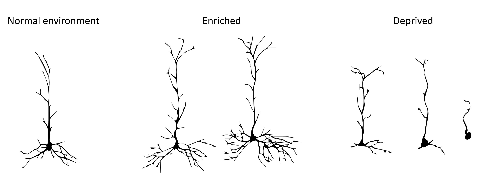
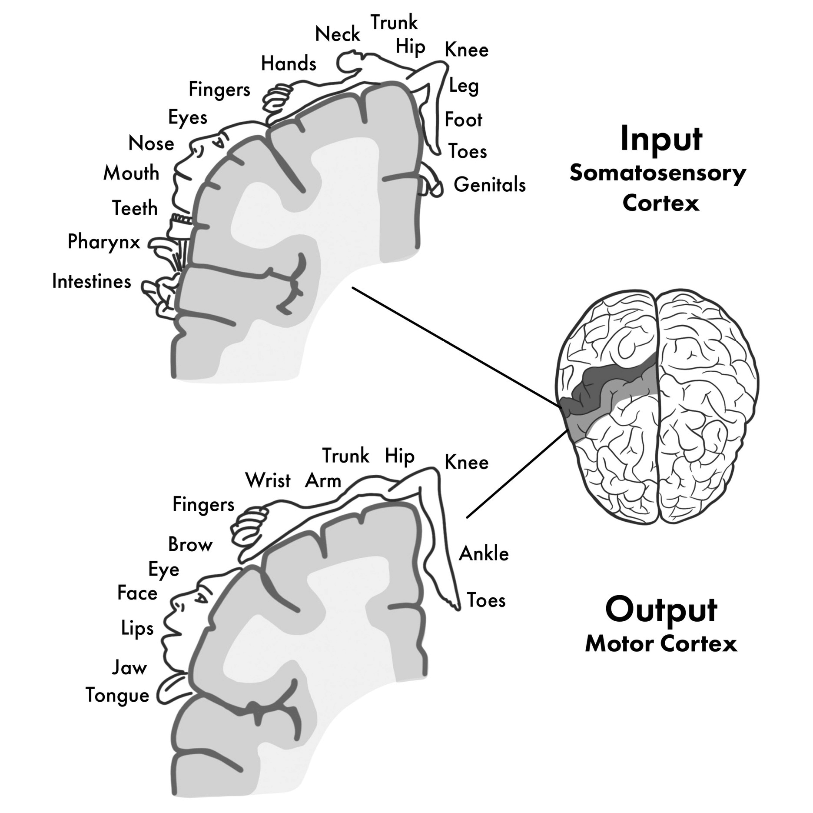
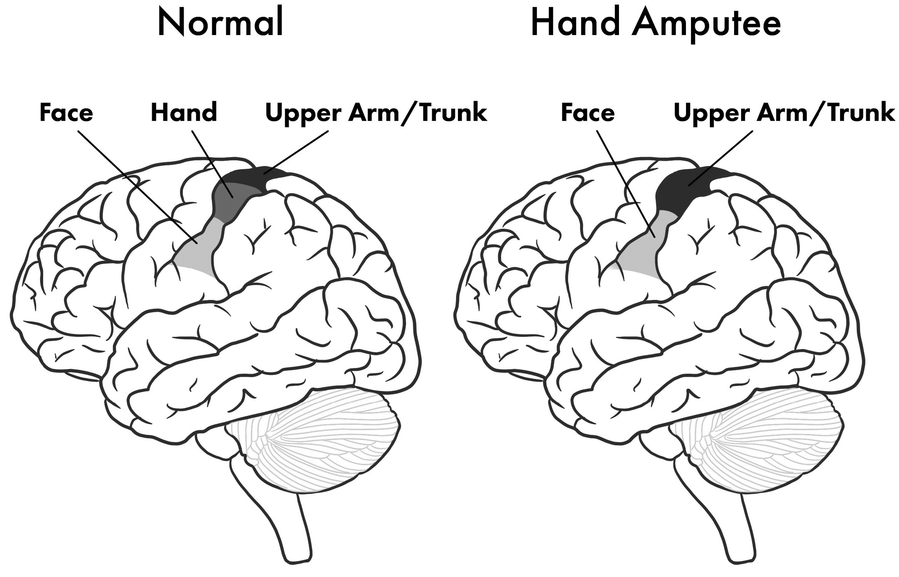
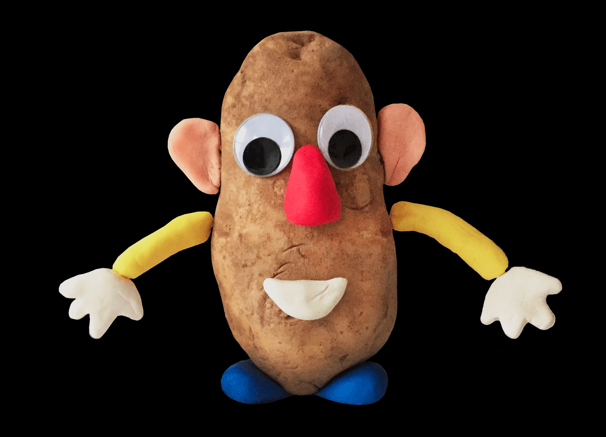
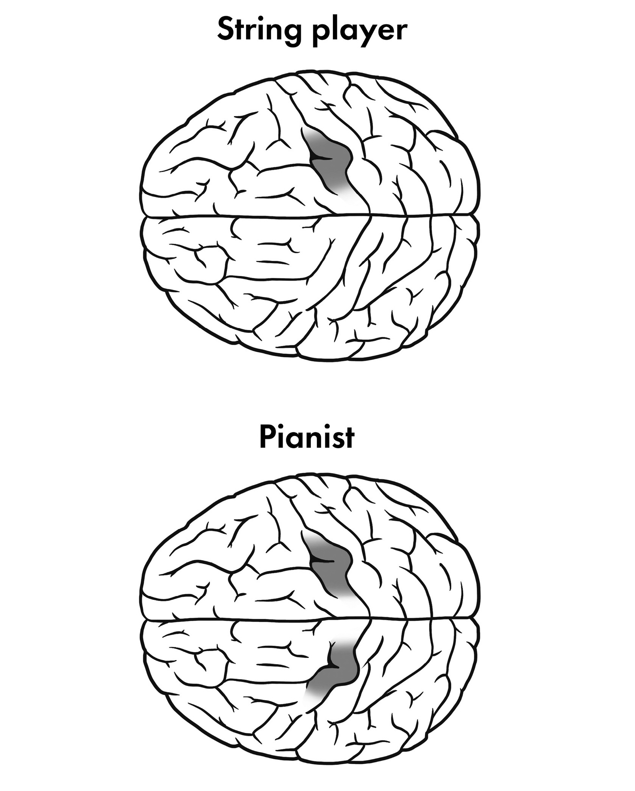
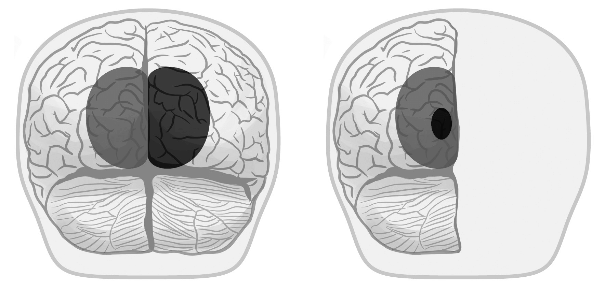

## Chapter 1: The Delicate Pink Magisterium

- Our brain isn't fully preprogrammed, but instead shapes itself by interacting with the world.
- Why is the enemy of memory not time but other memories?
- Of all the objects our species has discovered, nothing rivals the complexity of our own brains.
- Stranger than the textbook image, the brain is a cryptic kind of computational material, a living three-dimensional textile that shifts, reacts, and adjusts itself to maximize its efficiency.
- Our human advantage is that we start off as a mostly blank slate, which lets us be flexible.
- Our brains invite the world to shape them.
- Our genetics bring about a simple principle: don't build inflexible hardware; build a system that adapts to the world around it.
- Don't let the image that neurons exist with each other fool you. Neurons are locked in a competition for survival.
- As the border wars rage throughout the lifetime of a brain, maps are redrawn so that the experiences and goals of a person are always reflected in their brain's structure.
- E.g. If an accountant switches her career to become a pianist, then the territory devoted to fingers grows and the territory devoted to numbers shrinks.
- The brain distributes its resources according to what's important and does so by implementing a do-or-die competition among all the parts that make it up.
- Brains constantly change themselves to reflect its challenges and goals.
- When it doesn't have what it needs, it makes it. Why?
    - Speed. By reconfiguring the neural wiring, tasks like typing become automated, allowing fast decisions and actions. Unconscious actions are faster than conscious deliberation.
    - Energy efficiency. An expert's brain uses less energy than an amateur's brain because the skills are burned into the brain's circuitry.
- Millions of years of evolution didn't foretell the arrival of written language, much less a keyboard, and yet our brains have no trouble with these innovations.
- Experience changes the brain and it retains the change in its wiring.
- Neuroplasticity is a somewhat misleading term because it implies only molding once and never again (like plastic), which isn't how brains are adaptable.
- The brain carries on remolding itself throughout your life; it never reaches an end point.
- It's impossible to think about brains as divisible into layers of hardware and software.
- The concept of liveware is created to grasp this dynamic, adaptable, and information-seeking system.
- The case of Matthew, who had half of his brain removed at a young age due to seizures, grew up normally and it's difficult to tell that he's missing half a brain.
- Unlike hardware, liveware endures.
- There currently isn't an overarching framework for neuroplasticity/livewiring in neuroscience.
- This book attempts to lay out a framework/principles for livewiring.
- Once we understand the principles of livewiring, we can draft off nature to make new machines.

## Chapter 2: Just Add World

- Brains aren't born as blank slates but are pre-equipped with expectations.
- E.g. We're pre-equipped to absorb language and to develop sight.
- The fine structure of the brain reflects the environment it's exposed to.
- E.g. Rats in an environment with more toys and running wheels have neurons with more dendrites than rats deprived of stimulation.

- How does the brain get built from such a small set of genes?
- The genome implements a clever strategy: build incompletely and let world experience refine.
- E.g. Our circadian clocks aren't precisely set to 24 hours as people living in caves have a variable circadian clock.
- The brain's simple solution: build a non-exact clock and calibrate it to the sun's cycle. Let the world do the winding.
- The flexibility of the brain allows the events in your life to stitch themselves directly into the neural fabric.
- But this strategy is also a gamble as a child may not get the experience that the brain depends on.
- E.g. The case of Danielle Crockett, a feral child that was raised without normal human interaction.
- Proper development requires proper input.
- Like a tree that needs nutrient-rich soil, the brain needs an environment rich with social and sensory information.
- How does the brain absorb the outside world?

## Chapter 3: The Inside Mirrors the Outside

- Review of the somatosensory map and homunculus.

- Why do these maps exist?
- The brain is locked in total darkness within the skull.
- How is there a depiction of the body's layout in this lightless vault?
- Genetics is the wrong answer and the true answer is more fiendishly clever.
- The true answer was discovered after studying the map in a monkey with a severed nerve in their arm.
- The map of the body had reorganized to have stimulating the face activating that brain area instead of the arm.

- This means the map can't be genetically preprogrammed.
- The brain's map is flexibly defined by active inputs from the body.
- When an arm is amputated, its representation in the cortex is encroached upon by neighbouring areas.
- If the area is captured by other representations, then why do people still feel the old representation?
- E.g. Why does the phenomenon of phantom limb exist? Why does touching the face sometimes feel like someone is touching the amputated arm?
- The answer is that touch to the hand isn't only represented by the cells in the somatosensory cortex, but also by the cells they talk to downstream, and the cells they talk too, and so on.
- In a child, the map would be entirely different but in an adult, the system has less flexibility to rewrite its fate.
- When inputs suddenly cease, sensory cortical areas are invaded by their neighbours.
- How does the brain keep constant track of what the body looks like?
- Timing is everything. Neurons that fire together, wire together.
- The same is true all over your body, neighbouring patches will tend to be more co-active than patches that aren't.
- Neurons that are active close in time to one another tend to make and maintain connections between themselves.
- Close in time results in close in space.
- Why does the map change when the input changes?
- When a part of the body no longer sends information, it loses territory. Just like colonization.
- Not just the body, this rule applies to any system sending information to the brain.
- E.g. The visual cortex in blind people handles reading braille.
- Brain regions care about solving certain types of tasks, irrespective of the sensory channel by which information arrives.
- Age matters. The older the brain, the less flexible it is for redeployment.
- When a sense captures more area, does that give it greater capabilities?
- Yes the more brain real estate, the better the capabilities.
- E.g. Blind people have exceptional sound skills compared to sighted people. They have better sound localization and better pitch perception.
- E.g. Color-blind people are better at distinguishing between different shades of gray.
- E.g. Amputees have a finer sensation on the stump of the lost limb.
- Because the brain is now devoting more territory to the remaining undamaged areas, sensing becomes higher resolution.
- Neural redeployment replaces the old paradigm of predetermined brain areas with something more flexible.
- There's nothing special about visual cortex neurons, they're simply neurons that happen to be connected to the eyes.
- This isn't quite true as there seems to be some genetic component that makes visual cortex neurons better handle visual data.
- Neural reorganization happens rapidly in the order of days and hours.
- Neural flexibility allows brains to optimize performance in a variety of environments.
- Why do brains dream?
- We know that sensory deprivation triggers neighbouring territories to take over. So how does the visual system deal with this unfair disadvantage?
- One way is by keeping the occipital cortex active during the night through dreaming.
- Author suggests that dreams exists to keep the visual cortex from being taken over.
- The rotation of the planet doesn't affect anything about your ability to touch, hear, taste, or smell; only vision suffers in the dark.
- During most of the night, there is no dreaming except in REM sleep.
- REM sleep is triggered by a particular set of neurons in the brainstem called the pons.
- The pons has two functions
    - Paralyze the body to prevent the body from acting out its dreams.
    - Send waves of spikes to the occipital lobe.
- When the spikes arrive, the activity is experienced as visual. We see. This is why dreams are pictorial and filmic instead of conceptual or abstract.
- Dreams may be the strange love child of neural plasticity and the rotation of the planet.
- A key point is that this nighttime volley of activity is only directed at the occipital cortex through the lateral geniculate nucleus.
- From this theory, it's no surprise that a person born blind has dreams not about visual experiences, but about other sensory experiences such as feeling their way around a room or hearing strange animals barking.
- Another piece of supporting evidence is that species born immature have much more REM sleep compared to animals born mature aka with a solidified brain.
- Also, REM sleep decreases with age. The falloff in plasticity parallels the falloff of time spent in REM sleep.
- What are the limits of the brain's flexibility? Can we feed it any kind of data and would the brain simply figure it out?

## Chapter 4: Wrapping Around the Inputs

- Cochlear and retinal implants are evidence that the brain can handle data that it wasn't evolved for. But how?
- The key to understanding requires diving one level deeper.
- The brain isn't directly hearing or seeing any of the world around you.
- Instead, your brain is locked in a crypt of silence and darkness and all it ever sees are electrochemical signals that stream in along different data cables.
- The brain is stunningly gifted at taking these signals and extracting patterns and meaning.
- As long as the data have a structure that reflects something important about the outside world, along with some other requirements that we'll cover in the next chapters, the brain will figure how to decode it.
- The brain doesn't know and doesn't care where the data came from.
- In this sense, the brain is a very efficient and general-purpose machine.
- Mother Nature can tinker around with different input peripherals and the author calls this the Potato Head model of evolution.

- Mother Nature can build new senses by building new peripherals and the brain, like the potato, will handle it.
- Try different peripherals to capture different aspects of reality.
- E.g. Electromagnetic radiation is light, air compression waves are sound, heat and texture is touch, and chemical signals are smell.
- In the end, it all gets translated into the common currency of spikes.
- We have evidence for this as some babies are born without a nose or eyes; no peripherals for a sense of smell or sight.
- The extraordinary list of the ways that we can be disassembled goes on.
- E.g. Children born without ears, pain receptors, and touch.
- Random mutations introduce strange new sensors, but the brain doesn't have to be redesigned.
- Once the principles of brain operation have been established, nature can simply worry about designing new sensors.
- The sensory organs that we have aren't the only collection that we could have.
- *Sensory substitution*: feed information into the brain via unusual pathways.
- Sensory substitution improved drastically when the camera was allowed to move under the control of the patient.
- Sensory input is best learned when one can interact with the world.
- It closes the loop between muscle output and sensory input.
- From the sensory organs to the brain and from the brain to the brain, all inputs are converted into the common currency of electrical signals.
- What if cortical specialization develops from the details of the incoming data cables rather than by genetics?
- The data makes the area.
- This is why the neocortex looks the same everywhere, because it is the same.
- In 2000, scientists at MIT redirected inputs from a ferret's eye to the auditory cortex. What happened?
- The auditory cortex adjusted its circuitry to resemble the connections of the primary visual cortex.
- This tells us that the pattern of inputs determines the fate of the cortex.
- The brain dynamically wires itself to best represent whatever its input data (related to mastery).
- *Tongue grid*: an electrical grid placed on the tongue that sends out electrical signals depending on what an external camera sees.
- The tongue grid reminds us that vision arises not in the eyes but in the brain.
- Even though all the activity is at the surface of your sensory detectors, you perceive everything as out there.
- You don't consciously convert the substitution into its original stimuli, you directly experience the stimuli without conscious processing (after training).
- E.g. You don't consciously perceive light as photons, but as a conscious experience that occurs outside the brain.
- The improvements in a user's sensory substitution performance are paralleled by the amount of cerebral reorganization.
- The brain figures out how to extract information from incoming signals, regardless of the path by which those signals get into the brain.
- All that matters is the information they carry.
- The skin is a mind-bogglingly sophisticated computational material that we don't use for much in modern life.
- It's vast surface area and complex sensors for pressure, vibration, temperature, and pain, compared to vision and sound, are rarely used in modern life.
- E.g. The Neosensory vest converts sound into patterns of vibration on the skin.
- Deaf children can use the vest to learn to vocalize because it closes a loop: they make a noise and immediately register it as a sensory input.
- This also know as an efference copy and normal people also use the same method to learn to speak.
- E.g. As babies, we babbled, cooed, and made strange sounds to get feedback.
- A little-known fact is that people with prosthetic legs have to do a lot of work to learn how to walk because they receive no feedback from the leg.
- E.g. Where the leg is, how stretched it is, and where the knee is.
- Beyond sensory substitution is sensory enhancement. What if we could make our current senses better, wider, or faster?
- Some human females have four colour photoreceptors and see more colors than the typical human.
- Mice and squirrel monkeys have been genetically engineered to have color vision.
- New sensors show that tradition is irrelevant when it comes to biology.
- We can extend ourselves beyond our inherited genetics.
- Beyond sensory substitution and beyond sensor enhancement is sensory addition.
- E.g. Adding a magnet to your finger to sense magnetic fields.
- The effects outlasted the technology as internal whispers of signal can get strengthened when an external device confirms them.
- Because we live in a world bloated with information now, it's likely that we're going to have to transition from accessing big data to experiencing it directly.
- E.g. Imagine yourself plugged into a factory with dozens of machines. You become the factory and can sense issues that aren't visible since you have more data.
- Big data gives deeper patterns of insight.
- E.g. Imagine feeding real-time patient data into a surgeon's back or the ISS health into an astronaut's back. You can replace staring at monitors with different patterns of touch, summarizing data and making it more intuitive and experiential.
- Even beyond sensory addition is shared perception.
- This has the potential for unlocking a new depth of mutual understanding.
- All of this works because we don't become aware of our senses unless our expectations are violated.
- E.g. Seeing the eye's blind spot or feeling a rock in your shoe.
- We could also just add new senses by directly stimulating the brain.
- We've talked a lot about getting new data into the brain, but what would it feel like?
- An unanswered question in neuroscience: why does vision feel so different from smell?
- It can't be because these areas are genetically built differently because we can rewire these areas to a different sensory organ.
- One answer is that the subjective experience of a sense is determined by the structure of the data.
- I believe the answer is that the pathway of the information determines the meaning of the signal.
- Qualia are shaped by the way your motor outputs change the sensory inputs.
- E.g. Visual data changes as you move your eye muscles. Sound data changes as you move your head. Taste data changes as you eat something.
- As long as there is clear structure to the data and a feedback loop, the data should give rise to new qualia.
- In the same way you can't imagine a new color, you can't imagine a new sense.
- We had to learn to use our current sensory organs and the same is true for new sensory organs.
- The fact that we can't imagine a new color is extraordinarily revealing.
- It shows us the boundary of qualia.
- To understand vision requires experiencing vision.
- Language can only communicate shared experiences. It's also true that if the experience isn't shared, you can't communicate it.
- E.g. Telling a blind person what it's like to see color. Sure, you can use analogies but it isn't the same as experiencing it.
- Given the finite territory in the brain, is it possible that each added sense will reduce the resolution of the others, such that your new sensory powers come at the cost of slightly worse hearing and vision?
- We don't know, but I hypotheses that yes, adding new senses decreases other sense resolution.
- Emotions simply reflect the meaning of the data to you.
- E.g. Pizza smells good because it predicts a high energy food, while a rotten smell predicts disease and pathogens.
- Many emotional examples have evolved in evolutionary timescales but some come from experiences.
- We are no longer a natural species that has to wait millions of years for Mother Nature's next sensory gift.
- This chapter has only talked about input but what about output?

## Chapter 5: How to Get a Better Body

- Just like the sensory system, when a limb is no longer available for control, the cortical area devoted to it shrinks.
- The brain reorganizes to match its new body plan.
- The main principle: motor areas optimize themselves to drive the available machinery.
- Returning to the Potato Head model of the brain, various output devices can be attached and the brain will automatically figure out how to use it.
- And just like how small genetic changes can give rise to weird new sensory organs, genetic mutations can also give rise to new limbs such as a new arm or tail.
- Brains adjust to the opportunities of the body.
- E.g. The armless archer or the bipedal dog.
- In the same way that we learn language by babbling, we learn how to steer our body with motor babbling.
- We use the same method to attach extensions to our bodies.
- E.g. We didn't evolve to ride a bicycle but we can learn despite the complexities.
- Review of Destin and learning to ride a reverse bike.
- *Schema*: patterns to organize different categories of information.
- E.g. We all use different motor schemas to ride a bike, drive, and run.
- Feedback narrows the space of possibilities.
- Instead of doing a random movement, the robot Starfish chooses its next move to best distinguish between the available remaining hypotheses.
- Nature must build a system that figures itself out; there aren't enough genes to hardcode all possibilities.
- The organism builds a model of its body's interaction with the world. Put out an action and evaluate the feedback.
- We nurture a feedback loop between the internal and external world.
- This feedback loop also applies to how we learn to socialize using social babbling.
- A livewired brain doesn't need to be swapped out for each genetic change, it just adjusts itself, which leads to biodiversity in body plans and sensory organs.
- We already use extensions of our body in jobs such as forklift operators and crane operators.
- The specifics of the device work their way into your brain circuitry.
- Review of brain-machine interfaces and their use in prosthetics.
- One problem with controlling a robotic arm is that there's no feedback.
- The solution is to close the loop by stimulating the somatosensory cortex with movement.
- Since most of the brain's learning takes place in this loop, motor and sensory maps typically change together.
- Leveraging the brain's plasticity to build long-distance bodies is sure to change our main strategy for space exploration.
- As for the feeling or experience of an external limb, it would feel like a part of you just like your current limbs.
- If you can control it and you have sensations from it, it becomes a part of you.
- This explains the disorder of asomatognosia or the inability to know one's own body.
- E.g. Alien limb syndrome where a person doesn't believe a limb to be their own.
- What you can control becomes the self and what you can't control has no relation to you.
- Maybe consciousness is the system that keeps track of this.
- *Homuncular flexibility*: the surprising elasticity of the brain's representation of its body.
- With VR, we can explore bodies that Mother Nature couldn't dream of.

## Chapter 6: Why Mattering Matters

- The philosophy that geniuses are made, not born.
- Brain circuitry comes to reflect what you do.

- Brains reflect not simply the outside world but, more specifically, your outside world.
- Brains need practice to change.
- You become the information you digest.
- We might think that repetitive practice is key to molding the circuitry in the brain, but a deeper principle is at work.
- A person's goals play a critical role in how and when it changes.
- What changes depends on what's rewarded.
- *Constraint therapy*: preventing the use of a good limb to force the person to use their weak limb.
- Constraint therapy forces people to learn and adapt to their weak limb, which results in better recovery of function.
- How does the brain know when something important has happened and that it should change its wiring?
- One answer is to turn on plasticity when events in the world are correlated.
- Slow change is important for association learning to prevent the learning of random correlations.
- Real matches separate themselves from noise by occurring together over and over again.
- Another answer is one-trial/shot learning.
- *One-shot learning*: learning a new idea or concept with only one example.
- E.g. Emergency mechanisms such as learning to not touch a hot stove but also learning a new concept such as pomegranate.
- Your brain allocates more territory to a stimulus because the presence of acetylcholine indicates that it must be important.
- It's a universal mechanism as it can be broadcast across the entire brain.
- It marks relevance by increasing territory.
- Current AI has no sense of importance except in a statistical sense.

## Chapter 7: Why Love Knows Not Its Own Depth Until the Hour of Separation

- One visual illusion is that if you stare at something moving for a long time and then look away, everything else will look like it's moving in the opposite direction. This is also known as the motion aftereffect.
- This happens because neurons in the brain encoding directions of motion are locked in a constant battle and most of the time, they evenly inhibit each other. But when you get used to the motion, your brain recalibrates itself.
- After staring for a while, your brain recalibrates and believes that this is the new normal. Sort of like a brain homeostasis.
- The system always wants to set up a ground truth so that it can be better at detecting change.
- *Troxler effect*: when fixated on a point, the periphery will disappear.
- The visual system is always seeking motion and change.
- Good information is expected to update; things that don't change are ignored by the system.
- The fundamental fact is that brains only care about change.
- But if it doesn't change, then brains ignore it.
- Are parts of the world invisible to us that should be obvious?
- E.g. Our retina’s blind spot or maybe some constant cosmic rain that we’ve all ignored from birth.
- Successful adaptation makes regularities invisible.
- Another way to look at this is as prediction.
- If an input pattern is predictable, the system saves energy by structuring itself around that input so as not to be surprised by it.
- Many neuroscientists think that the activity of neurons as representing things in the world but it could turn out that the truth is exactly the opposite, that spikes are the unpredictable parts.
- The system makes adjustments only when it gets surprised.
- The deeper principle here is that your brain is striving to build an internal model of the outside world.
- Attention is the mechanism that lets you focus on build your model around surprising stimuli.
- If you're predicting perfectly, your brain doesn't need to change further and it saves energy.
- An internal model of the world allows a machine to make its best guesses about the events that are expected to occur.
- This explains why people become desensitized or tolerant to drugs over time. The brain comes to predict the presence of the drug and adapts to maintain a stable equilibrium or homeostasis.
- Like plants working toward maximizing sunlight (phototropism), brains may work towards maximizing information/surprise (infotropism).
- The brain fine-tunes its circuitry to maximize the data it streams from the world.
- The system works out how to optimize its interaction with the world.
- E.g. The retina has two sets of photo receptors to optimize its capture of light.
- Fundamentally, the brain is a prediction machine.

## Chapter 8: Balancing on the Edge of Change

- Our brain regions only appear stable because they're locked in a cold war, but everything's on a hair-triggers edge.
- When a brain loses territory to disease, damage, or surgery, what happens to the available territory?
- Does the brain leave out the damaged area or does it squish it into its current territory?
- Evidence from the case of Alice, a child missing her right hemisphere, shows that the latter is true, territory is shared/squished in the remaining area.
- Alice's visual system rewired to allow both the left and right visual fields to be represented in the single remaining hemisphere.

- How does such radical rewiring happen?
- The lesson is that whatever real estate is available gets used and filled.
- Brain maps stretch, squish, and relocate their functions.

- We typically think of neurons as cooperating happily but we can also view them as competing with each other.
- *Hubel and Wiesel experiment*: showed that the brain has alternating eye strips for each eye, also called ocular dominance columns. This was found out by injecting a tracer into one eye and then dissecting the brain and seeing where the tracer ended up.
- The Hubel and Wiesel experiments with alternating eye strips show that
    - Brain maps aren't innate.
    - Maintaining territory is activity-dependent.
- The sensory homunculus looks that way because of the same competition. The areas that send the most useful information get the most brain area.
- For the system, at the small scale, the rule is competition over resources. At the large scale, we get emergent phenomenon such as the stretching, shrinking, and sharing of brain areas.
- Neurons compete for chemicals called neurotrophins; chemicals that help neurons live.
- Neurons maintain the balance between chaos and order through inhibitory and excitatory neurons.
- How does the brain change so rapidly? On the order of hours?
- It doesn't have time to form new connections so it must already have the connections in place but inhibit them.
- The release of inhibition allows the widespread and previously silent projections to become functionally operative.
- This is only possible because the brain has redundant connections but these connections reduce with age.
- However, these connections are limited in number so when the brain wants to implement a long-term change, it makes new synapses, axons, and neurons.
- Another way that the brain changes itself is through cell death.
- Two types of cell death
    - *Necrosis*: unplanned cell death.
    - *Apoptosis*: planned cell death.
- Apoptosis isn't a bad thing as it allows the nervous system to sculpt itself to be more efficient.

## Chapter 9: Why Is It Harder to Teach Old Dogs New Tricks?

- The brain matures like the planet.
- Through years of border disputes, neural maps become increasingly solidified.
- A new brain can adapt and change more easily than an older brain.
- Human babies are born with few built-in skills and a great deal of plasticity, while adults have mastered specific tasks at the expense of flexibility.
- There's a tradeoff between specialization and flexibility.
- As your brain gets good at certain jobs, it becomes less able to tackle others.
- To get good at one thing is to close the doors on others.
- As the brain grows up, it gives up on pathways to focus on only a few pathways.
- This tradeoff reduces flexibility and adaptability for speed and efficiency.
- Another reason why newer brains are more flexible is because they can change in more spots.
- The neural transition from young to old isn't gradual but sudden. Once the door shuts, large-scale change is over.
- The threshold is around 8 years old for learning to speak a language without an accent.
- The same goes for speaking with an accent. If you arrive at the country before 8-10 years old, you'll learn the language without an accent.
- The influence of developmental timing is found across all the senses.
- The brain needs to experience the proper input within the right window to achieve its most useful connectivity.
- We are highly influenced by events in our childhood.
- Sensitive periods are different for different tasks.
- The reason may be because different sensitive periods are caused by different underlying learning strategies.
- The degree of plasticity in a brain region reflects how much its input data changes.
- Stable data solidifies first, while unstable data solidifies last.
- E.g. Sound data is mostly consistent while body data changes as we go through puberty and get stronger, weaker, fatter, thinner, or use new equipment. So the auditory cortex becomes solid faster than the somatosensory cortex.
- This plasticity-reflects-variance hypothesis has an analogy in genetics as core genes are protected and stable, while variable genes are allowed to vary more to account for changes such as skin pigmentation due to different latitudes.
- An active mental life fosters new connections.
- Another reason for being less adaptable when we're older is because the brain's internal model isn't as surprised anymore. Remember that brain changes are driven by violations of expectations.
- As we grow older, skill replaces flexibility.
- However, retaining the plasticity of a child isn't always a good thing. If plasticity didn't decline, we would remain as helpless as a child.
- We would also lose our memories because nothing would stick, and this is horrific.
- Fundamentally, who you are is the sum total of your memory.

## Chapter 10: Remember When

- *Ribot's law*: the observation that older memories are more stable.
- The strangeness of this pattern of memory comes from it not matching how we believe other storage systems to work.
- E.g. History forgets the old, governments brag about their latest accomplishments, and computers can lose older memories just as easily as newer memories.
- One of the most important aspects of livewiring is the phenomenon of memory.
- When you learn a new fact, there are physical changes in the brain.
- Lashley's rat-treat experiment showed that memory isn't localized to any one spot, but that it's distributed across the brain.
- The physical basis of memory is the changing of synaptic weights.
- The first problem facing brains is that they live long lives.
- The problem with this is that there's a lot to learn but there's limited memory capacity.
- While Hebbian learning is great for encoding memory, it continues to be great for encoding memory and will overwrite previously learned memories.
- This is also known as the stability/plasticity dilemma.
- Memories need to be protected, not against time, but against the invasion of other memories.
- Brains don't suffer from this problem, which means that something more is happening to solve the stability/plasticity dilemma.
- The first solution is to prevent the entire system from changing at once. This is done with neuromodulators.
- The brain changes only when it needs to and where it needs to.
- The second solution is to move memories to another place for more permanent storage.
- In other words, parts of the brain teach other parts.
- E.g. The hippocampus teaching the cortex.
- Memories don't stay where they're first formed but get moved along.
- Review of patient H.M. and that the hippocampus is crucial for learning new facts but not critical for remembering facts that have been learned.
- It's been proposed that the hippocampus must reactivate a memory trace multiple times to lock the memory into the cortex. It must consolidate the memory to gain stability.
- This is also why after learning something, it requires less conscious effort because the brain doesn't have to form new pathways, it just replays the built ones. Automating a skill means to move it to a different part of the brain.
- However, this doesn't fix the problem as now the cortex will start to become full.
- Synaptic changes may be the consequences of memory storage rather than the root mechanism.
- Although changes at individual synapses have received the most attention, there are many other possible ways to store activity-dependent changes.
- The third solution is to add new cellular material.
- Plasticity exists throughout the brain at every level: from genes to synapses to dendrites to neurons to neural pathways to brain areas to the entire brain.
- Neuroscience focuses on the synapse because its what we can most easily measure, just like a drunk looking for his keys under the streetlight.
- Reasons to believe that synapses aren't the only things that change
    1. If learning only tuned the efficacies of existing synapses, we wouldn't expect large changes in structure in the brain.
        - But we do see sizable changes in the brain such as in London taxi drivers and medical students.
    2. If memories were simply retained in synaptic weights, we'd have no reason to expect the growth of new neurons.
        - In fact, new neurons would scramble up the delicate synaptic pattern, thus losing memories.
        - But we do see new neurons being formed in the hippocampus after learning a task.
    3. Alterations to the sugars and proteins around the DNA alter patterns of gene expression.
        - Evidence indicates that experience modifies gene expression.
- With all of these possible parameters to modify, how does the brain modify anything without messing up?
- What are the principles that keep the system in check?
- The most important lens isn't the biological parts, it's the timescale that they operate on.
- Memory isn't explainable in terms of the details of the mechanism, but instead on the tempo at which it lives.
- The brain's pace layers range from fast biochemical cascades to slow changes in gene expression.
- Plastic changes are distributed over a spectrum of time, and aren't simply stored as all-or-none changes.
- A skill you thought was gone is still present; it's burned deep into the circuitry of the brain.
- Exceptionally useful programs get burned down all the way to the level of DNA and we call these instincts. This is memory on the level of species.
- Human brains don't stored memories the way computers do (but it's similar with the way caching works).
- In the pace layer model, slow layers provide a framework for the fast layers.
- New memories must fit into your current collection of memories and not the other way around.
- Memories beautify life, but only forgetting makes it bearable.
- Synesthesia might come from sticky plasticity where people have a reduced ability to modify an association once it has been set.
- E.g. Once an initial pairing between a letter and a color has been set, it sticks.
- Evidence for this comes from a group of people born between 1960s to 1980s where their synesthesia matches the Fisher-Price refrigerator magnet set.
- There are many kinds of memory and many subtypes of it.
- How does the brain learn both general rules and exceptions?
- E.g. Birds with feathers fly but ostriches with feathers can't fly.
- The brain has different systems for different learning speeds.
- One guess is that the hippocampus is used for fast changes, to learn specifics, while the cortex is used for slow changes to learn rules.
- With this trick, the brain can do rapid learning from individual episodes, while running a slow extraction of statistics across experiences.
- The way memories degrade, with older memories having more stability, reveals the secret of different timescales of change.
- There are more modifiable parameters in the brain than just synapses.
- E.g. Channel types, channel distributions, phosphorylation states, biochemical cascades, spatial arrangement of enzymes, and gene expression.

## Chapter 11: The Wolf and the Mars Rover

- Why are we still building hardwired machines that end up being discarded?
- E.g. If a wolf gets it leg caught in a trap, it will gnaw off its own leg to survive. But if the Mars rover Spirit loses a wheel, it's completely dead.
- This difference between the wolf and the rover lies in information versus information-with-a-purpose.
- The wolf has goals and a desire to survive.
- Mother Nature knows there's no point in hardwiring a wolf brain because body plans change, environments change, and relationships change.
- Instead of a predefined circuitry, the better approach is to build a system that actively improves itself by self-adjusting to reach its goals.
- Our devices have neither the flexibility nor the hardiness that characterizes biology.
- We can start with sensory biomimicry, as nature has tried thousands of different sensors for pressure, magnetic fields, electric fields, temperature, etc.
- We can also let our devices experiment not only with their sensorium, but also with their motorium (possible motor actions).
- The important point is to let the device try motor actions and to receive feedback from those actions.
- How does the brain solve timing problems?
- It puts out probes into the world by kicking things, touching, and knocking.
- It operates under the assumption that if you created the action, then the information returning via the sensory channels should be perceived as synchronized.
- The best way to predict the future is to create it.
- We can livewire almost anything.
- E.g. Rovers, cars, chips, buildings, and electrical grids.

## Chapter 12: Finding Ötzi's Long-Lost Love

- Details of the case of Otzi, a man from the bronze age who froze to death on a mountain. From his body, we've been able to learn a lot about how he lived his life.
- Could we know what a person was like by looking at how the brain shaped itself?
- We assume function is related to structure. There's a reason for everything.
- We know that evolution, on long timescales, carves creatures to match their environment.
- E.g. The photoreceptors in our retinas perfectly match the light spectrum given off by the sun and our genomes hold an archaeological record of ancient infections.
- But on short timescales, brain wiring can tell us so much more.
- Otzi didn't have a video camera to capture his world, but he didn't need to. He was the video camera.
- If only we could learn to decipher human brain patterns could we know what Otzi's life was like, because it's encoded in his brain.
- Seven principles of livewiring
    1. Reflect the world. Brains match themselves to their input.
    2. Wrap around the inputs. Brains leverage whatever information streams in.
    3. Drive any machinery. Brains learn to control whatever body plan they discover themselves inside of.
    4. Retain what matters. Brains distribute their resources based on relevance.
    5. Lock down stable information. Some parts of the brain are more flexible than others, depending on the input.
    6. Compete or die. Plasticity emerges from a struggle for survival of the parts of the system.
    7. Move toward the data. The brain builds an internal model of the world, and adjusts whenever predictions are incorrect.
- Livewiring is the fundamental trick that allows for memory, flexible intelligence, and civilizations.
- We become, in essence, a recording device for our moment in the world.
