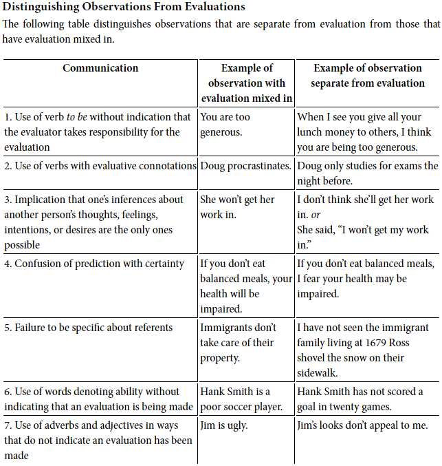
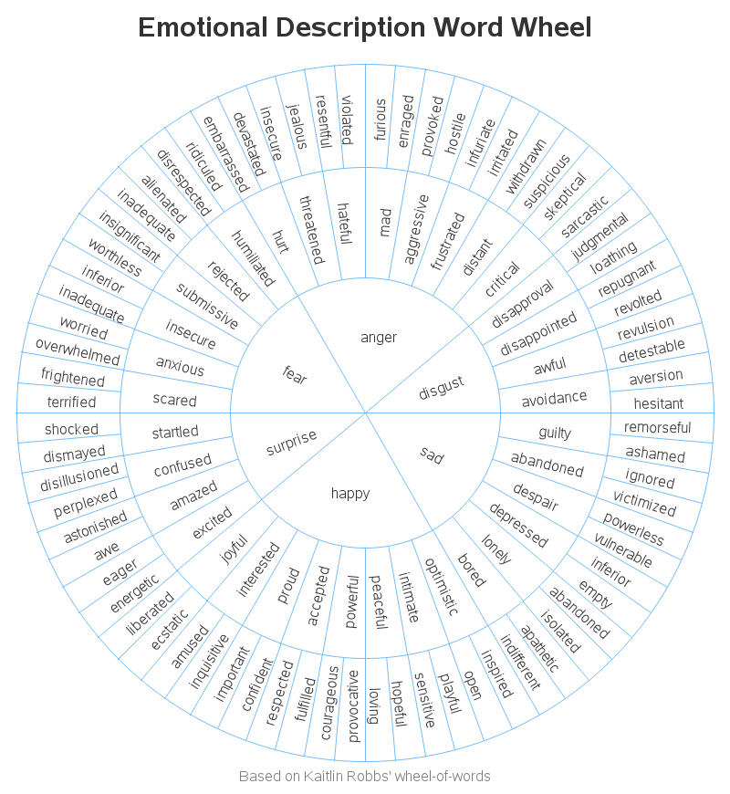

## Chapter 1: Giving From the Heart

- *Nonviolent Communication (NVC)*: a way of communicating that leads us to give from the heart.
- Instead of the habitual, automatic reactions, our words become conscious responses based on the awareness of what we're seeing, feeling, and wanting.
- NVC is used to shine the light on places where we hope to find what we're seeking.
- Four components of NVC
    - Observations
    - Feelings
    - Needs
    - Requests
- The trick to observation is to do it without judgement or evaluation.
- We simply say what is.
- An example of the first three pieces.
- E.g. "Felix, when I see two balls of soiled socks under the coffee table and another three next to the TV, I feel irritated because I am needing more order in the rooms that we share in common."
- An example of the last piece.
- E.g. "Would you be willing to put your socks in your room or in the washing machine?"
- NVC process
    - The actions we observe that affect our well-being.
    - How we feel in relation to what we observe.
    - The needs, values, desires that create our feelings.
    - The concrete actions we request in order to enrich our lives.
- Two parts of NVC
    - Expressing honesty
    - Receiving emphatically

## Chapter 2: Communication That Blocks Compassion

- *Life-alienating communication*: forms of communication that are violent.
- One example of life-alienating communication is the use of moralistic judgements.
- E.g. She's lazy.
- This form of communication classifies people into good and bad, smart and dumb, responsible and irresponsible.
- Our attention is focused on classifying, analyzing, and determining levels of wrongness rather than on what we and others need and aren't getting.
- It's important to distinguish between value judgements and moralistic judgements.
- Value judgements are made by everyone and they reflect our desires.
- E.g. Valuing honesty, freedom, or peace.
- Moralistic judgements are when people fail to support our value judgements.
- E.g. Violence is bad, people who kill are evil.
- Another form of judgement is by comparing ourselves to others.
- Another example of life-alienating communication is denial of responsibility.
- We deny responsibility for our actions when we attribute their cause to factors outside ourselves.
- Factors such as
    - Impersonal forces such as "I had to" or "Because I said so"
    - Identity such as "I drink because I'm an alcoholic"
    - Others "He said so"
    - Authority "Boss told me to"
- We can replace language that implies lack of choice with language that acknowledges choice.
- E.g. "I have to give grades because it's the policy" to "I choose to give grades because I want to keep my job."
- Another example of life-alienating communication is saying our desires as demands.
- We can and usually shouldn't make people do anything.

## Chapter 3: Observing Without Evaluating

- The first component of NVC is the separation of observation and evaluation.
- NVC doesn't mean to not evaluate, but rather to keep it separate from observation.
- Combining observation and evaluation makes people hear criticism.
- E.g. I've never seen a stupid kid, only a kid that did things that I didn't understand, only a kid who hasn't seen the same things I've seen.
- Don't mix up what we can see with what is our opinion.
- The key is to stick to facts, to view the other people from impartial eyes, and to stick to specific evidence.
- Speaking by separating seeing from judging is the highest form of honesty, to speak about what we see and how we see it.
- E.g. "John is ugly" to "John's looks don't appeal to me."

## Chapter 4: Identifying and Expressing Feelings

- The difficulty in identifying and expressing feelings is common.
- Expressing our vulnerability can help resolve conflicts.
- One problem is due to the English language and the ambiguity of the word "feel".
- In general, feelings are not expressed by the word "feel" when it's followed by
    - That, like, as if
        - E.g. I feel that you should know better.
    - I, you, he, she, they, it
        - E.g. I feel it is useless.
    - Names or nouns
        - E.g. I feel Amy has been responsible.
- We need to distinguish feelings from thoughts.
- We also need to distinguish between what we think we are and what we feel.
- E.g. From "I feel inadequate" to "I feel disappointed" or "I feel impatient".
- We also need to distinguish between how we think others react or behave towards us and what we feel.
- E.g. "I feel unimportant/misunderstood/ignored. "
- To be more clear about our feelings, it's better to be precise about what exactly that we're feeling.

## Chapter 5: Taking Responsibility for Our Feelings

- Four options for receiving negative messages
    1. Blame ourselves
    2. Blame others
    3. Sense our own feelings and needs
    4. Sense others' feelings and needs
- NVC advocates for the last two options.
- E.g. "You disappointed me by not coming to play with us." verses "I was disappointed when you didn't come over, because I wanted to talk over some things that were bothering me."
- We accept responsibility for our feelings instead of blaming others.
- The more we can connect our feelings to our own needs, the easier it is for others to understand and emphasize.
- A simple template for being responsible for our feelings is "I feel … because I need …"
- Making someone feel guilty is the same as attributing the responsibility of one's own feeling to others.
- E.g. "It hurts Mom and Dad when you get poor grades in school."
- Taking responsibility for the feelings of others can be easily mistaken for positive caring, but is actually due to avoiding guilt.
- Sometimes, judgements of others are alienated expressions of our own unmet needs.
- E.g. Judging someone as not understanding when they really mean that their need to be understood is unmet.
- If we express our needs, we have a better chance of getting them met.
- Most of us aren't taught to think in terms of need, we're taught mostly in terms of blame and labeling.
- E.g The children are lazy when they don't put up their coats.
- The way to fix this is to ask yourself what you need for yourself.
- "What is it that you need? And what would you like to request of the other in relation to these needs?"
- If we don't value our needs, others may not either.
- Three stages of emotional liberation
    1. Emotional slavery: taking responsibility for the feelings of others.
    2. Obnoxious stage: feeling angry because we don't want to be responsible for others' feelings.
    3. Emotional liberation: taking responsibility for our intentions and actions.
- We respond to the needs of others out of compassion, not out of fear, guilt, or shame.
- We accept full responsibility for our own actions, but not for the feelings of others.
- Exercise tips: look for the sentences where there's I twice, one for the feeling and one for the need.

## Chapter 6: Requesting That Which Would Enrich Life

- Use positive language when making requests.
- This ensures that you get what you want and not for the person to infer what you want.
- E.g. "I want you to play less video games" to "I want you to do your homework" because the person may play less video games, but still won't do their homework which is what you're requesting.
- Word the request in clear, concrete actions that aren't vague, abstract, or ambiguous.
- E.g. "I want you to be more responsible" to "I want you to wash the dishes after you finish your meal."
- Expressing our feelings is not a substitute for a request.
- E.g. "I'm thirsty." to "I'd like some water please."
- We're often not conscious of what we're requesting.
- Requests may sound like demands when they're unaccompanied by the speaker's feelings and needs.
- The clearer we are about what we want, the more likely it is that we'll get it.
- The message we send isn't always the message that's received.
- To confirm the message, as the listener to reflect the message back.
- However, if the message isn't reflect back as your intended request, first appreciate that the listener cares and clarify what you are requesting.
- After we express ourselves vulnerable, we often want to know
    1. What the listener is feeling
    2. What the listener is thinking
    3. Whether the listener is willing to fulfill the request
- In a group, a lot of time is wasted when speakers aren't sure of what they want from the group.
- When addressing a group, be clear about what you want.
- Demands differ from requests when other believe they will be blamed, punished, or feel guilty if the demand isn't fulfilled.
- To tell if it's a demand or a request, see what the speaker does if the request isn't complied with.
- It's a request if the speaker shows empathy towards the other person's feelings and needs.
- NVC shouldn't be used to change people for our desires, it should be used establish a relationship based on honesty and empathy.

## Chapter 7: Receiving Empathically

- We now turn to the second part of NVC, receiving empathically.
- *Empathy*: emptying our mind and listening with our whole being. A respectful understanding of what others are experiencing.
- Check whether the speaker wants advice or reassurance.
- Believing we have to fix situations and make others feel better prevents us from being present.
- Don't just do something, stand there.
- Intellectual understanding blocks empathy.
- The key idea of empathy is presence. We are present with them and with what they're experiencing.
- Listen to what people are needing rather than what they're thinking.
- When asking for information, first express our own feelings and needs.
- Instead of saying "Yes, I understand" or "Yes, that's clear", paraphrase the request back to the speaker.
- Reflect back messages that are emotionally strong to empathize with the speaker.
- However, only paraphrase when it is appropriate.
- Behind all of those intimidating messages are just people appealing to us to meet their needs.
- When we paraphrase, the speaker receives confirmation that they had been understood.
- We know that a speaker has received adequate empathy when
    - We sense a release of tension
    - They stop talking
- We need empathy to give empathy. We can't give what we don't have.
- When we sense ourselves being defensive or unable to empathize, we need to
    - Breathe and give ourselves empathy
    - Scream nonviolently
    - Remove ourselves physically

## Chapter 8: The Power of Empathy

- Empathy is listening
    - Without passing judgement
    - Without trying to take responsibility
    - Without trying to change them
- Sometimes it's enough to just listen, to not do anything but listen.
- It's harder to empathize with those who appear to posses more power, status, or resources, but we should still do it. They are people too.
- Never put your 'but' in the face of an angry person.
- When we listen for feelings and needs, we no longer see people as monsters.
- When we're rejected, empathizing with the other person helps to protect us from taking it personally.
- Speakers prefer that listeners interrupt rather than pretend to listen.
- Sometimes we have to accept that we have different values around expressing emotion without thinking that we or them are wrong.
- Silence is one of the hardest messages to empathize with but we can try by listening for the feelings and needs behind it
- Empathy lies in our ability to be present.

## Chapter 9: Connecting Compassionately With Ourselves

- Let us become the change we seek in the world.
- Apply NVC to ourselves.
- Avoid should-ing yourself.
- E.g. Avoid "I should have known better" and "I shouldn't have done that".
- The word "should" implies that there is no choice.
- A basic idea of NVC is that whenever we imply that someone is wrong/bad, what we are really saying is that they aren't acting in harmony with our needs.
- *NVC mourning*: connecting with the feelings and unmet needs stimulated by past actions we now regret.
- When we feel regret, ask ourselves "When I behaved in the way which I now regret, what need of mine was I trying to meet?"
- *NVC self-forgiveness*: connecting with the need we were trying to meet when we took the action that we now regret.
- An important part of self-compassion is to connect both parts of ourselves, the self that regrets the action and the self that took the action in the first place.
- We're compassionate with ourselves when we are able to embrace all parts of ourselves and recognize the needs and values expressed by each part.
- Replace language that implies lack of choice with language that acknowledges choice.
- Translate "I have to…" to "I choose to… because I want…"
- With every choice you make, be conscious of what need it serves.
- Be aware of the following motivations
    - For money
    - For approval
    - To escape punishment
    - To avoid shame
    - To avoid guilt
    - To satisfy a sense of duty
- Know the price you pay for them.
- When we speak a language that denies choice, we forfeit the life in ourselves.
- The most dangerous of all behaviors may be doing things "because we're supposed to."

## Chapter 10: Expressing Anger Fully

- Anger clearly demonstrates the difference between NVC and other forms of communication.
- The goal isn't to ignore, prevent, or swallow anger, the goal is to express it more fully and clearly.
- We are never angry because of what others say or do.
- The behavior of others may be a stimulus for our feelings, but not the cause.
- There's a distinction between stimulus and cause.
- Our feelings don't result from what others do. We're responsible for them.
- It isn't the behaviour of the other person but our own need that causes our feeling.
- Use anger as a wake-up call to meet our needs, not to punish people.
- Violence comes from the belief that other people cause our pain and therefore deserve punishment.
- Judgments of others contribute to self-fulfilling prophecies.
- Four steps to express anger in a nonviolent way
    1. Stop and breathe.
    2. Identify our judgmental thoughts.
    3. Connect with our needs.
    4. Express our feelings and our unmet needs.
- Take your time. Judging and blaming have become second nature to us so it'll take time to adjust to a different way of handling anger.

## Chapter 11: Conflict Resolution and Mediation

- In NVC-style conflict resolution, creating a connection between people is the most important thing.
- Help both sides achieve satisfaction, not compromise.
- Most attempts at conflict resolution seek to reach a compromise where everybody gives us something and neither side is satisfied.
- NVC is different where it tries to meet everyone's needs fully.
- Five steps of NVC conflict resolution
    1. We express our own needs.
    2. We search for the other party's real needs.
    3. We verify that we both accurately recognize each other's needs.
    4. We provide as much empathy as required to hear each other.
    5. We propose strategies for resolving the conflict.
- Avoid language that implies wrongness.
- Separate needs from strategies.
- Needs contain no reference to anybody taking any particular action while strategies do.
- E.g. "I need to get out of this marriage" is a strategy.
- Intellectual analysis is often received as criticism.
- Learn to hear needs regardless of how people express them.
- People often need empathy before they are able to hear what's being said.
- Just as we aren't trained to express our own needs, most of us haven't been trained in hearing the needs of others.
- Use present language to be more clear and to move the conflict towards resolution.
- E.g. "Would you be willing to…"
- Also use action verbs to capture a request in more detail.
- Important points for mediation
    - Keep track of each party's needs.
    - Keep the conversation present.
    - Keep things moving, progress.
- We need to be well practiced at hearing the need in any message.

## Chapter 12: The Protective Use of Force

- There may be some situations where one party isn't willing to communicate or there is eminent danger.
- In such cases, the use of protective, not punitive, force is justified.
- The intention behind the protective use of force is only to protect, not to punish, blame, or condemn.
- Examples of punitive force
    - Physical punishment
    - Spanking
    - Denial of some means of gratification
    - Withdrawal of care or respect
- When we fear punishment, we focus on consequences, not on our own values.
- E.g. If children brush their teeth because they fear shame and punishment, their oral health may improve but their self-respect will develop cavities.
- Two questions that reveal the limitations of punishment
    1. What do I want this person to do?
    2. What do I want this person's reasons to be for doing it?
- The second question is the main limitation of punishment because it brings to light that we want people to to things because they want to.
- We acknowledge responsibility for our own actions and are aware that the reasons for doing so are our own.

## Chapter 13: Liberating Ourselves and Counseling Others

- Our culture implies that needs are negative and destructive and when people express their needs, they're often labeled as selfish and needy.
- We can liberate ourselves from cultural conditioning by following the principles of NVC.
- Resolve internal conflicts by translating messages into the form "When a, I feel b, because I am needing c. Therefore I now would like d."
- E.g. Instead of "I should do something with my life. I'm wasting my education and talents" state "When I spend as much time at home with the children as I do without practicing my profession, I feel depressed and discouraged because I am needing the fulfillment I once had in my profession. Therefore, I now would like to find part-time work in my profession. "
- NVC helps us create a more peaceful state of mind by encouraging us to focus on what we're truly wanting rather than on what's wrong with others and ourselves.
- Focus on what we want to do rather than on what went wrong.

## Chapter 14: Expressing Appreciation in Nonviolent Communication

- Compliments are often judgments, however positive, of others.
- E.g. "You did a good job on that report." or "You're a very sensitive person."
- Express appreciation to celebrate, not to manipulate for something in return.
- NVC three components of appreciation
    1. The actions that have contributed to our well-being.
    2. The specific needs of ours that have been fulfilled.
    3. The pleasant feelings from the fulfillment of those needs.
- Summary
    - This is what you did
    - This is what I feel
    - This is the need of mine that was met
- Template: "When you did a, I felt b because I needed c."
- Receive appreciation by hearing their feelings and the needs that were fulfilled.
- Paradoxically, despite our unease in receiving appreciation, most of us desire to be genuinely recognized and appreciated.
- We tend to notice what's wrong rather than what's right.

