## Introduction: Mind over Data

- Our technological and scientific society can be attributed to one question: why?
- The brain is the most advance tool for managing causes and effects.
- One issue with the way we write equations is that it doesn’t capture the cause-effect relationship between variables.
- E.g. The barometer reading tracks the atmospheric pressure and we can describe this relationship as B = kP. However, we can rearrange the equation in many ways like k = B/P or B - kP = 0. This doesn't capture the cause-effect between barometer and atmosphere though.
- The current trend of big data is misleading in its intelligence because it can't answer why questions.
- *Calculus of causation*: causal diagrams and a symbolic language.
- *Causal diagrams*: dot-and-arrow diagrams with dots as quantities and arrows as causal relationships.
- Diagrams are the language of knowledge while symbols are the language of queries.
- E.g. P(L \| do(D)) what is the probability (P) that a patient would survive L years if made to take drug D?
- This is different from the conditional probability of P(L \| D).
- The difference between seeing and doing.
- *Counterfactual reasoning*: dealing with what-if situations.
- Counterfactuals may seem unscientific because of the lack of evidence but people commonly perform this type of reasoning.
- E.g. If the rooster is silent, we know the Sun will still rise. The rooster doesn’t cause the sun to rise, but rather the other way around.
- You can't answer a question that you can't ask, and you can't ask a question that you have no words for.
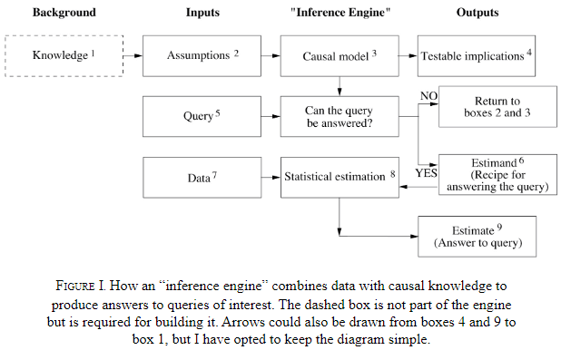
- We think of a cause as something that makes a difference, and the difference it makes must be a difference from what would have happened without it.
- Summary of the book’s message: you are smarter than your data.

## Chapter 1: The Ladder of Causation

- The difference between a "what" question and a "why" question: what provides facts, why provides explanations.
- Three implications of this distinction
    - The world isn't made up of facts but of the cause-effect relationship between these facts.
    - Causal explanations make up the bulk of our knowledge.
    - The transition from processors of data to makers of explanations is not small.
- How did we transition from data to explanations?
- Evolution has endowed us with the ability to engineer our lives.
- It's useless to ask for the causes of things unless you can imagine their consequences.
- Causal imagination enables us to plan and to imagine, we must process, consult, and manipulate a mental model of reality.
- Three distinct levels of cognitive ability
    - Seeing
    - Doing
    - Imagining
- *Seeing*: detection of regularities/patterns in our environment.
- Seeing is shared by many animals and humans.
- E.g. Frog detecting the regular flight path of a fly to eat it.
- *Doing*: predicting the effects of deliberate alterations of the environment and choosing the preferred outcome.
- Doing is shared by a small set of animals.
- E.g. Tool-use by octopuses such as using shells.
- *Imagining*: why tools work and why they don't work.
- Only humans are at the level of imagining.
- The three levels are also known as the Ladder of Causation.
    1. Association
    2. Intervention
    3. Counterfactuals
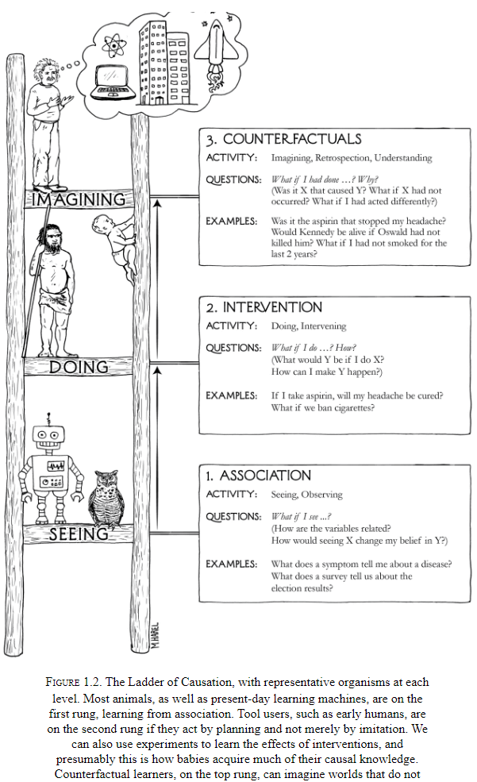
- The three levels reminds me of how science, specifically neuroscience, has progressed. From data, to hypotheses, to theories.
- We say one event is associated with another if observing one changes the chance of observing the other.
- E.g. "How likely is a customer who bought toothpaste to also buy floss?"
- Good predictions don’t need good explanations.
- E.g. The owl can be a good hunter without understanding why the rat always goes from point A to point B.
- Deep learning (DL) lacks a model of reality and operates almost all on associations.
- The next level, intervention, begins to change the world.
- E.g. "What will happen to our floss sales of we double the price of toothpaste?"
- Seeing smoke tells us a different story about the chance of fire than the chance of making smoke.
- A sufficiently strong and accurate causal model can allow us to use observations to answer queries.
- This is also why DL won't have reasoning powers, it's because it doesn't have a causal model.
- Counterfactuals have a problematic relationship with data because data are facts and counterfactuals ask if that fact wasn't a fact.
- However, they grant us immense benefits in finding the right corrective measures for the future.
- The ability to imagine something that doesn't exist, to create something new, was a key moment in our evolution.
- Humanity's greatest achievements, art, science, technology, all had to take place in someone's imagination before it was realized.
- While rung one deals with the seen world and rung two deals with a new see-able world, rung three deals with a world that can't be seen because it contradicts what is seen.
- To bridge the gap, we need an understanding of the underlying causal process, we need a theory.
- AI has contributed the phrase "Representation first, acquisition second."
- Humans must have some compact representation of the information needed in their brains because we can answer causal questions.
- The author believes the representation is a causal diagram.
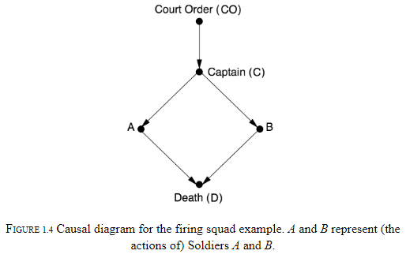
- Each variable represents either true or false and we can use the diagram to backtrack and answer questions.
- The difference between observing an event and making it happen.
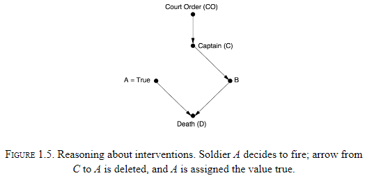
- E.g. If we see A shoot, then we can deduce that B shot too. But if A decides to shoot, then the opposite is true.
- This is the difference between seeing and doing.
- We can leave the mathematical details out of the diagram because the structure of the diagram itself enables us to estimate all sorts of causal relationships.
- The author argues that the idea of causes and effects is more fundamental than the idea of probability.
- E.g. We understand cause and effect very early in life and it’s more robust to probability changes.
- Why is human intuition organized around causal, and not statistical, relations?
- Causation isn't reducible to probabilities.
- One attempt is to say that the cause raises the probability of the effect.
- E.g. Reckless driving causes accidents.
- The issue is that raising the probability of the effect may be due to a third variable or due to the effect causing the cause.
- Probabilities encode our beliefs about a static world, causality tells us about a changing world.

## Chapter 2: From Buccaneers to Guinea Pigs: The Genesis of Causal Inference

- Where regression to the mean is concerned, there is no difference between cause and effect.
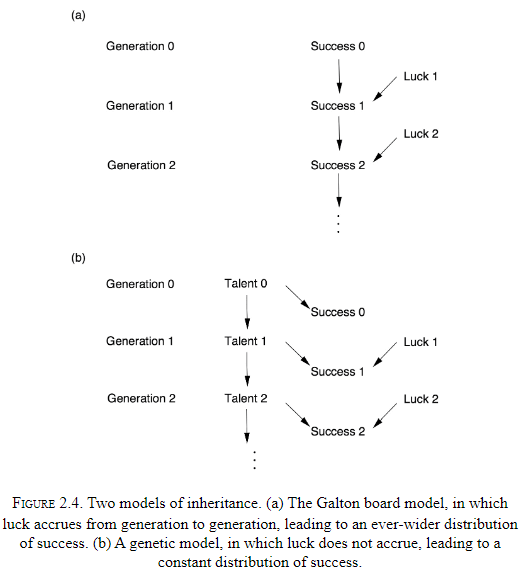
- Story of Pearson and how correlation came to dominate statistics.
- The next story is about how Wright connected correlations (rung one) to hidden causal quantities (rung two).
- Wright connected them using a method called path analysis.
- "Correlation doesn't imply causation" isn't quite true, some correlations do imply causation.
- Arrows omitted in a causal diagram actually convey more significant assumptions. An omitted arrows says the causal effect is zero while a present arrow says the causal-effect is something, just not zero.
- The combination of knowledge of correlations with knowledge of causal relations is different from the deduction of causal relations from correlations.
- Causal analysis incorporates some understanding of the process that produces the data, and then we get something that wasn't in the data to begin with.
- Path analysis shouldn't be stereotyped, it isn't a brain-dead method but requires domain-knowledge about the problem.
- Causal analysis requires the user to make a subjective commitment. A causal diagram reflects the users qualitative beliefs.

## Chapter 3: From Evidence to Causes: Reverend Bayes Meets Mr. Holmes

- A causal diagram is a Bayesian network in which every arrow signifies a direct causal relation.
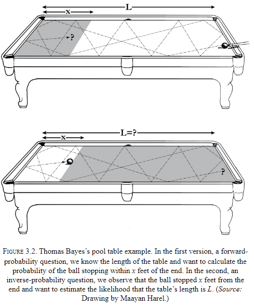
- Bayes rule let's us inverse probabilities, to find causes from effects.
- E.g. Say we have a pool table of length L and we want to know the probability that a ball stops within x feet of the end. The intuitive probability is x / L.
- However, what if we asked the reverse. Say the ball lands 1 foot from the end of the table (x = 1), then what is the probability that L is 100 feet?
- Why is the forward probability (x given L) so much easier to assess mentally than the reverse probability (L given x)?
- The asymmetry comes from the fact that L acts as the cause and x acts as the effect.
- E.g. If Bob throws a ball at a window, the window will break. But if the window is broken, we need much more information to deduce the cause.
- Bayes's rule is also a way to update our belief in a hypothesis. Future events rests on the frequency with which similar events have occurred in the past.
- Three types of junctions in a Bayesian network
    - A → B → C
        - Chain junction.
        - B is a mediator.
        - E.g. Fire → Smoke → Alarm
        - Although we call them fire alarms, they're really smoke alarms.
    - A ← B → C
        - Fork junction.
        - B is a confounded.
        - A confounded will make A and C statistically correlated even though there isn't a causal link between them.
        - E.g. Shoe Size ← Age of Child → Reading Ability
    - A → B ← C
        - Collider junction.
        - E.g. Talent → Celebrity ← Beauty.
- These three junctions are like keyholes through the door that separates the first and second levels of the Ladder of Causation.
- We can use them to see the secrets of the causal process that generated the observed data.
- Each junction stands for a distinct pattern of causal flow.
- Causal assumptions can't be invented and are subject to data and can be falsified.

## Chapter 4: Confounding and Deconfounding: Or, Slaying the Lurking Variable

- *Confounding bias*: when a variable influences both the cause and the effect.
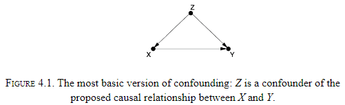
- *Randomized controlled trial (RCT)*: an experiment where the group is randomly split into a test group and control group.
- The whole art and practice of scientific experimentation is comprised in the skillful interrogation of Nature.
- Nature is like a genie that answers exactly the question we pose and not necessarily the one we intend to ask.
- RCTs bring two benefits
    - It eliminates confounded bias by asking Nature the right question.
    - It enables researchers to quantify uncertainty.
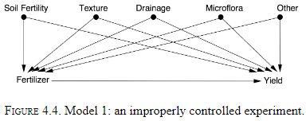
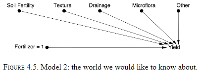
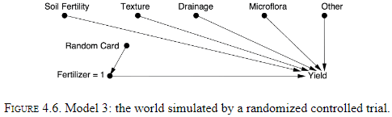
- Randomization is a way of simulating Model 2.
- However, there are other ways of simulating Model 2.
- One way is to measure and adjust for all confounded variables but this is difficult.
- Randomization severs all known and unknown links to the randomized variable.
- *Confounding*: anything that makes P(Y\|X) different from P(Y\|do(X)).
- The do operator erases all arrows that come into X and randomization has the same effect.

## Chapter 5: The Smoke-Filled Debate: Clearing the Air

- The author details the story of how smoking was discovered to cause lung cancer and the start of how statistics isn't enough.
- There was an unresolved paradox in the mid-1960s where a mother who was smoking seemed to provide a benefit to underweight babies.
- The proposed causal chain was: Smoking → Low Birth Weight → Mortality.
- The low birth weight babies of smoking mothers had a better survival rate than those of non smokers.
- However, the actual causal chain is: Smoking → Birth Weight ← Birth Defect → Mortality.
- This path is non-causal because one of the arrows is the wrong way.
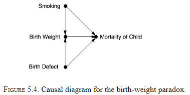
- This is a case of the collider bias.

## Chapter 6: Paradoxes Galore!

- There's a large class of paradoxes that reflect the tension between causation and correlation.
- Human intuition operates under causation while data operates under probabilities.
- The lesson from the Monty Hall problem is that the way we obtain information is as important as the information itself.
- Any hypothesis that has survived some test that threatens its validity becomes more likely.
- Our brains are not prepared to handle causeless correlations.
- Conditioning on a collider means to filter the collider variable and find a correlation between the two colliding variables.
- E.g. Have you noticed that among the people you date, the attractive ones tend to be jerks? That's because you'll date a mean attractive person, a nice unattractive person, and a nice attractive person, but not a mean unattractive person.
- By self-selecting for what you want, you’ve introduced an implicit correlation.
- *Bad-Bad-Good Drug (BBG)*: a paradox where a drug is bad for one group, bad for another group, but is good for a combination of the groups.
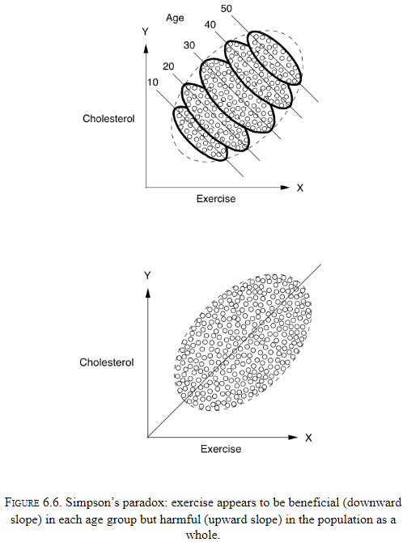

## Chapter 7: Beyond Adjustment: The Conquest of Mount Intervention

- The author details the attempts to replace the do operator and it’s possible under three conditions.
- Randomization is a great way to ensure that a variable isn't affected by any confounders.
- Introducing the idea of instrumental variables.
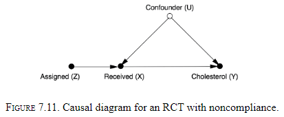
- *Monotonicity*: there isn't a case where Z is 0 and X is 1 aka someone that obtained the drug but wasn't assigned it.

## Chapter 8: Counterfactuals: Mining Worlds That Could Have Been

- We can’t travel both roads and yet our brains are equipped to judge what would’ve happened if we had taken the other path. Evidence if this comes in the form of regret.
- Summary of lessons from the second rung
    - RCTs are the gold standard.
    - If we can measure variables that block all the back-door paths, we can use the back-door adjustment formula.
    - If we find a front-door path that's shielded from confounded, we can use the front-door adjustment.
    - If we assume linearity or monotonicity, we can use instrumental variables.
- Every creature can see what is. Our gift, or curse, is that we can see what could’ve been.
- Three different types of causation
    - Necessary causation
    - Sufficient causation
    - Necessary-and-sufficient causation
- *Counterfactual*: if the first object had not been, the second had never existed.
- Where regularities can only be observed, counterfactuals can only be imagined.
- Humans make counterfactual judgments without much issue. We can even treat them as if they exist by envisioning possible worlds in which they are true.
- Envisioning possible worlds is a capability that has gone unnoticed by people.
- The following is an example of how counterfactuals compare to statistics, of structural causal modelling vs model-free.
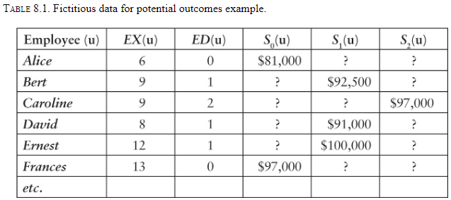
- The goal is to fill in the “?” cells which ask if that person had a different level of education, what would their salary have been?
- Model-free approaches
    - Matching on experience and extrapolating
    - Linear regression
- These approaches are flawed because they are data driven, not model driven.
- No methods based only on data (rung one) can answer counterfactual questions (rung three).
- Model-driven approach
    - The first key point is that experience depends on education since time spent on education is time not spent gaining experience.
    - The table doesn't capture this data so we start with a causal diagram.
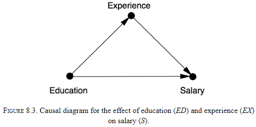
    - If experience was a cause of education, then experience would be a confounder and matching based on experience would be valid.
    - But the diagram shows experience as a mediator so we must not adjust it.
    - Don't mistake a mediator for a confounder.
- Structural model
    - *Abduction*: use the data to estimate the factors unique to each employee.
    - *Action*: use the do operator to change the model to reflect the counterfactual assumption being made.
    - *Prediction*: calculate the new salary using the modified model and the updated info about exogenous variables.

## Chapter 9: Mediation: The Search for a Mechanism

- *Mediation analysis*: the study of whether mediators have a direct effect or an indirect effect.
- The question "Why?" has at least two versions.
    - One where you see an effect and you want to know the cause.
    - One when you want to better understand the connection between a known cause and a known effect.
- E.g. We know that citrus fruits prevent scurvy but we don't know why/how.
- This chapter focuses on the second version.
- The search for mechanisms is critical for science and living.
- E.g. Suppose we run out of oranges, by knowing the mechanism with which oranges work to prevent scurvy, we can find another source of vitamin C.
- The second type of why is also called mediation.
- E.g. The effect of citrus fruits on scurvy is mediated by vitamin C.
- The difference between direct and indirect effects (goes through mediator).
- Using data and path analysis, it seems that 35% of intelligence is inherited.
- Further details on the Mediation Formula and mediation case studies.

## Chapter 10: Big Data, Artificial Intelligence, and the Big Questions

- How do we extract meaning from all these numbers, bits, and pixels?
- Causal questions require us to form a model of the process that generates the data.
- Past AI was divided into two camps, the neats, who wanted transparent systems with guarantees of behavior, and the scruffies, who just wanted something that works.
- The author is a neat and desires explainable AI.
- Transparency enables effective communication.
- Like the prisoners in Plato's famous caves, DL systems explore the shadows on the cave wall and learn to accurately predict their movements, but they don't understand that they are shadows, projections of the real world.
- ML provides us with an efficient way to go from finite sample estimates to probability distributions, but we still need to go from probability distributions to cause-and-effect relationships.
- The ability to conceive of one's own intent and then to use it as evidence in causal reasoning, is a level of self-awareness that no machine has achieved.
