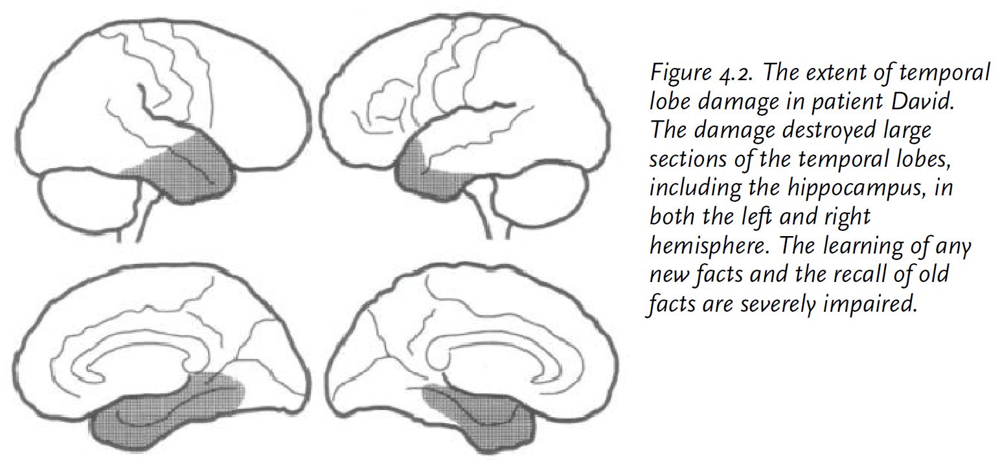
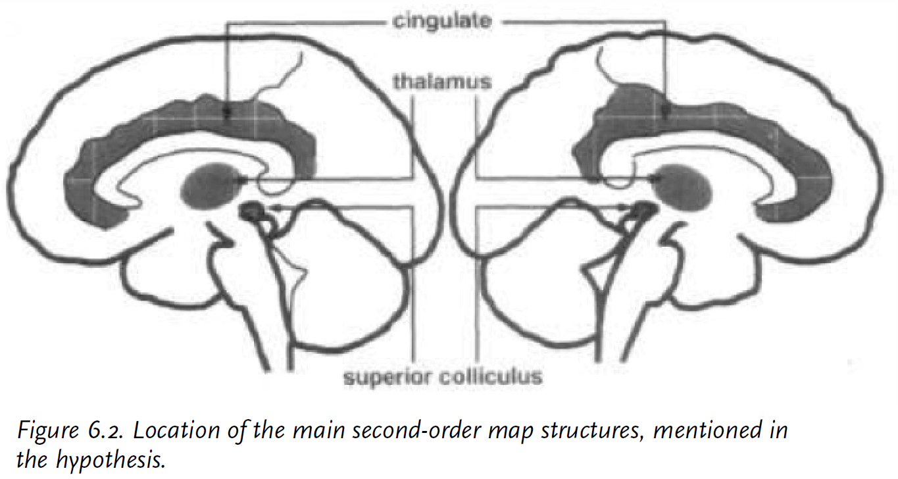
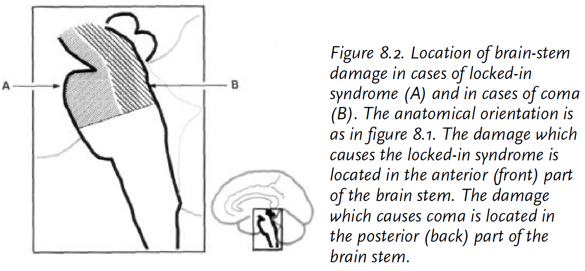
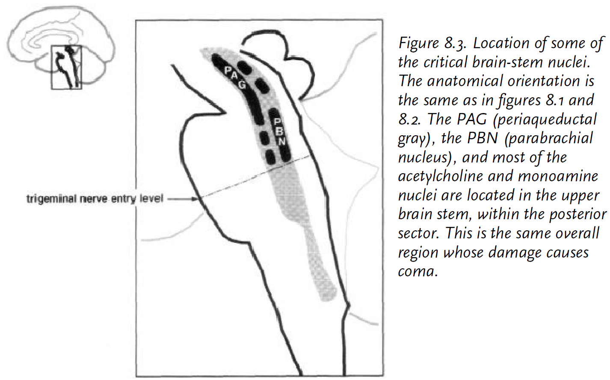

# Part I: Introduction

## Chapter 1: Stepping into the Light

- Consciousness, at its most basic, urges us to stay alive and to develop a concern for the self.
- Consciousness, at its most complex, helps us develop a concern for others and to improve life.
- How does a person come to know what they're feeling?
- There must be a sense of self. A notion of identity.
- Three levels of knowing
    - An emotion.
    - The feeling of that emotion.
    - Knowing that we have a feeling of that emotion.
- The two problems of consciousness
    - How we get a "movie-in-the-brain".
    - How the brain creates a sense of self in parallel with experiencing.
    - How the "movie-in-the-brain" is generated.
    - How the brain also generates the sense that there is an owner and observer for that movie.
- The sense of self in the act of knowing.
- The second problem is nested in the first problem as the brain generates the appearance of an owner and observer for the movie within the movie.
- Mind, behavior, and brain are closely correlated.
- Consciousness and wakefulness can be separated.
- E.g. I sometimes feel conscious when I’m dreaming and vice versa, some people are awake but aren’t conscious.
- Consciousness and emotion aren't separable.
- Two types of consciousness
    - *Core consciousness (CC)*: a sense of self in the moment of now.
    - *Extended consciousness (EC)*: an elaborate sense of self that takes into account the past and future.
- CC isn't exclusive to humans and is stable across a lifetime.
- EC has several levels of organization and attains its highest peak in humans.
- EC depends on CC but not the other way around as EC can be impaired without affecting CC.
- There are two key players in consciousness
    - The organism
    - The object
- Consciousness consists of constructing knowledge about two facts
    - The organism is involved in relating to some object.
    - The object in the relation causes a change in the organism.
- The biology of consciousness is about discovering how the brain maps both players and the relationships they hold.
- A representation is the same as an object proxy.
- A quick experiment is to turn around and focus on an object behind you and then return to these notes.
- Very rapidly, the same brain areas constructed several entirely different maps due to different motor settings and different sensory input.
- However, even though the stimulus changed, your sense of self didn't.
- The body remained the "object" all along and will remain so until death.
- So some parts of the brain are free to roam the world and map the world while some other part of the brain that represents the organisms own state isn't free to roam at all.
- So consciousness is invariant under all conditions.
- The organism, as represented inside its own brain, is likely what becomes the elusive sense of self.
- In other words, consciousness is the mental representation of the organism that's tied to the maintenance of the life process.
- The deep roots of self are found in the ensemble of brain devices which continuously and nonconsciously maintain homeostasis.
- The state of activity in this group is called the protoself, the root level of consciousness.
- Consciousness depends on life.
- If actions are at the root of survival and if their power is tied to the availability of guiding images, then it follows that a device capable of maximizing the effective manipulation of images in the service of the organism would give it an enormous advantage.
- Consciousness is precisely this device.
- The advantage of consciousness is that it bridges the systems of homeostasis with the system of processing representations.
- This is advantageous because it allows for the simulation of future choices.
- Consciousness bridges the inner life regulation with image making; it generates the knowledge that images exist within the individual who forms them.
- Consciousness is knowledge that the feelings, images, representations that we feel are ours. It marks stimuli as our own unique feeling.
- Consciousness is a part of the mind but there are other parts.
- There's a screen in the mind the hides the inner body's states from the mind.
- E.g The control of sleep, hunger, and heart rate.
- Underneath every images of the outside world, there's an ongoing image of their living body.
- Consciousness was invented so that we could know being alive.

# Part II: Feeling and Knowing

## Chapter 2: Emotion and Feeling

- There's a distinction between "feeling" and "knowing that we have a feeling".
- E.g. We might recognize at some point that we're scared but the feeling of being scared didn't start when we noticed it. It started before we became aware of it.
- It's the same distinction between knowing that a person is feeling something without actually feeling it.
- Three stages of processing
    - *State of emotion*: triggered and executed nonconsciously.
    - *State of feeling*: represented nonconsciously.
    - *State of feeling made conscious*: known to the organism having both emotion and feeling.
- *Homeostasis*: the coordinated and mostly automated physiological reactions by the body to maintain a steady internal state in living organisms.
- View emotions as an embodiment of the logic of survival due to how they shape our risk assessment and decision making.
- The brain knows more than the conscious mind reveals.
- E.g. Cases of hemispatial neglect.
- Emotions can be induced in a nonconscious manner and thus appear to the conscious self as coming from an unknown cause.
- Because emotions come from the nonconscious, it is difficult to control emotions.
- One partial exception to nonconscious control is breathing because autonomic respiration and voluntary vocalization both use the lungs.
- *Background emotion*: nontraditional emotions that display themselves through subtle body positions, speed of movement, and movement of eyes.
- Evidence suggests that emotional responses are a result of a long history of evolutionary fine-tuning.
- There are two biological functions of emotion
    - The production of a specific reaction to a situation.
    - The regulation of the internal state of the organism so that it can be prepared for the specific reaction.
- E.g. Increasing the heart rate when scared in anticipation of running or fighting.
- Emotions lie between automatic homeostatic processes like pH balance and higher level reasoning.
- Emotions are relevant to the study of consciousness because they provide organisms with automatic, survival-oriented behaviors.
- Different emotions are produced by different brain systems.
- The different brain systems are located at a small number of brains sites that are subcortical.
- E.g. Fear activates the amygdala.
- The release of substances from a small part of the brain can alter the mode of processing of many other brain circuits.
- We don't learn to wince from pain, we just wince.
- Pain and emotion aren't the same because pain is a sensory feeling and because different interventions interfere with one but not the other.
- Pain and pleasure can cause emotional reactions but are not emotions themselves.
- Both sensations form a duality, one that punishes and one that rewards.

## Chapter 3: Core Consciousness

- All the contents in our mind are subjective and the power of science comes from its ability to verify objectively the consistency of many individual subjectivities.
- The study of consciousness proceeds under the assumption that the processes of the mind, such as consciousness, is grounded in brain activity.
- There are consistent and predictable external manifestations of consciousness that are identifiable and measurable.
- E.g. Being awake, attentive to stimuli, behavior.
- An organisms behavior is like an orchestra with my different instruments and groups producing different melodies.
- However, some instruments and groups only play at certain times and are absent in others.
- Some components are always present.
- E.g. Wakefulness, background emotion, low level attention.
- But these components always play in symphony and rarely conflict.
- However, there's one component that has no external counterpart and that is consciousness.
- Consciousness can only be inferred to exist because of its influence on external behaviors.
- Wakefulness and consciousness tend to go together except in cases of dream sleep and being awake but not conscious.
- Attention only betrays the presence of normal consciousness when it can be sustained over a substantial period of time.
- E.g. Over minutes or hours rather than seconds.
- Sustained purposefulness such as planning also betrays the presence of consciousness but lack of planning doesn't.
- Normal human behavior exhibits a continuity of emotions induced by the continuity of thoughts.
- E.g. The emotional tone when you speak.
- The continuity of normal consciousness requires a brief memory, on the order of a fraction of a second.
- We are students of consciousness.
- There's a condition known as epileptic automatism where a patient has suspended consciousness for a brief period and also loses the ability to remember what happened during that period.
- However, the person is awake as their eyes are open and muscle tone is maintained but they are devoid of deliberate actions.
- Emotion is also suspended when consciousness disappears.
- We hypothesize that the absence of emotion is a reliable correlate of defective CC.
- Maybe this is related to psychopaths and how they're often described as "without conscious".
- Emotion and CC tend to go together.
- What about being drunk?
- Alzheimer's disease is often described without mentioning this symptom.
    - That the decline first affects EC by narrowing its scope progressively until all semblance of autobiographical self disappears.
- Neurological diseases act like a scalpel by separating mental functions.
- Facts we've learnt from Alzheimer's
    - There's a separation between wakefulness, low-level attention and behaviors with emotions.
    - The defect of knowing and self goes hand in hand with defects in planning, high-level attention, and sustained behaviors.
- Classification of disruptions in CC
    - Disrupted CC with preserved wakefulness and preserved minimal attention/behavior.
    - E.g. Akinetic mutisms and epileptic automatisms.
    - Disrupted CC with preserved wakefulness but without preserved minimal attention/behavior.
    - E.g. Absence seizures and persistent vegetative state.
    - Disrupted CC without wakefulness.
    - E.g Coma.
- The difference between vegetative state and coma is that vegetative people have sleep/wake cycles.
- Nearly all sites of brain damage associated with significant disruption of CC share one important trait, that they are located near the brain's midline.
- This seems related to cutting the corpus callosum and how split-brain patients are created.

## Chapter 4: The Hint Half Hinted

- The idea that self and consciousness emerge after language is not likely to be correct because language requires a binding from word to an underlying concept, and there is no underlying concept for self and consciousness.
- However, this shouldn't dismiss the importance of language and its major contribution to EC.
- After studying many cases of patients with severe language disorder, the author observed that no matter how much language was impaired, the patients thought processes and consciousness remained intact.
- The power of language lies in its ability to translate thoughts into words and vice versa, in the ability to classify knowledge efficiently and economically, and in the ability to express imaginations and abstractions.
- But none of these abilities have anything to do with CC any more than they have to do with emotion or perception.
- Just as language can be exonerated from any role in creating CC, so can conventional memory.
- Seems like the cerebral cortex is a collection of tools for CC to use but doesn't depend on such as language and memory.
- CC only requires very brief, short term memory.
- Planning requires the intelligent manipulation of memories.

- High-level awareness of social situations is built on a vast knowledge of specific social situations.
- The case of David supports two results
    - That factual knowledge at a unique and specific level isn't a prerequisite for CC.
    - CC doesn't depend on the brains regions that are damaged in David such as both temporal lobes.
- Preliminary facts about consciousness
    - Consciousness isn't a monolith. There are two types of consciousness: core and extended. When CC fails, EC also fails.
    - We can separate consciousness from functions such as wakefulness and low-level attention, memory, language, and reasoning
    - EC depends on working memory but CC doesn't.
    - CC isn't equal to manipulating an image intelligently.
    - Emotion and CC are associated suggesting they depend on the same neural devices.
    - Disturbances of CC target the entire realm of mental activity as well as all of the sensory modalities.
- CC is the very evidence, the unvarnished sense, of our individual organism in the act of knowing.
- It takes time for the brain and consciousness to establish the link between the image of an object and its possession by you.
- The time delay is about 500 milliseconds.
- Consciousness gives us individual perspective, individual ownership, and individual agency.

# Part III: A Biology for Knowing

## Chapter 5: The Organism and the Object

- We can better understand consciousness of we put it in terms of
    - The organism
    - The object
    - The relationship between the two
- Consciousness constructs knowledge about two facts
    - That the organism is involved in relating to some object.
    - That the object in the relation is causing a change in the organism.
- CC and EC share the property of stability.
- We don't mean that the self doesn't change but rather it must possess a degree of structural invariance so that the self can be referred back to over long periods of time.
- This is similar to the idea of personality or consistent behavioral traits.
- Relative stability supports continuity of reference and is a required for constructing a self.
- The search for the biological substrate of self must identify structures capable of providing such stability.
- What provides the mind with a spine, is single, and is same?
- One clue is that singular individuality depends on the boundary between self and not self; between in and out.
- The boundary is known as our body. It separates the environment from the self.
- Its intriguing that the constancy that's essential to life (homeostasis) has the exact properties that we're searching for in consciousness. That is stability and a definition of self.
- The urge to stay alive is present in most organisms, but the degree to which an organism knows about the urge differs between organisms.
- Humans are keenly aware of this urge thanks to consciousness.
- *Homeostasis*: the coordinated physiological reactions which maintain most of the steady states of the body and which are so peculiar to the living organism.
- The description of a single cell parallels the the description of the brain.
    - To sense chemical imbalance is like perception.
    - To know how to fix the imbalance is like memory.
    - To perform a preemptive or corrective action is like skills.
- Brains permit the life urge to be regulated ever so effectively and, at some point in evolution, knowingly.
- The management of life is dependent upon the complex of the environment that it's in.
- E.g. More complex environments require more rules to be memorized and more skills to be developed such as planning and reasoning to exploit the environment. Science can be thought like that.
- Nature developed a new approach to managing life and complexity in the form of a central control structure called the brain.
- Here's an amusing fact, for every person that you know, there is a body.
- One person, one body, one mind.
- Even multiple personality disorder obeys this rule as only one personality is active at a time.
- Why shouldn't we find two or three persons in one body? Or the other way around and find one person in multiple bodies?
- The answer is because a mind requires a body and a body generates a mind.
- A mind is so closely shaped by the body and destined to serve it that only one mind could possibly arise in it.
- This is related to embodied cognition.
- Interestingly, even though the cells and molecules that make up the mind continuously change, our mind and self are still stable.
- This apparent paradox is because although the building blocks for construction of our organism are regularly replaced, the architectural designs are carefully maintained.
- The memories we hold include the motor adjustments we made to obtain those memories and also include the emotional reactions we had then.
- They are all co-registered in memory.
- The three divisions of the somatosensory system
    - Internal milieu and visceral
    - Vestibular and musculoskeletal
    - Fine-touch
- All three divisions can collaborate or work independently.
- The first division is permanently active and the brain always knows about its status.
- The brain is truly the body's captive audience.
- The protoself is what came before the sense of self and is a coherent collection of neural patterns which map, moment by moment, the state of the physical structure of the organism in its many dimensions.
- The protoself occurs in many places in the brain and it intimately involved in regulating the state of the organism.
- The operations of acting on the organism and of sensing of the state of the organism are closely tried.
- The protoself isn't to be confused with consciousness as we aren't conscious of the protoself.
- The protoself isn't located in any brain region but is rather a product of the interactions among a set of regions.
- Brain structures required to implement the protoself
    - Brain-stem nuclei
    - Hypothalamus
    - Basal forebrain
    - Insular cortex, S2, medial parietal cortices
- We know that the same region supports image making for both perception and for recall.
- When we recall an object, we recall not just sensory characteristics of the object but the past reactions of the organism to that object.
- Agnosia is the condition that provides us evidence of the "something-to-be-known" region of the brain.
- Agnosia prevents patients from connecting an object with its meaning.
- Emily case study
    - Facial Agnosia meaning she can't identify faces, even her own.
    - But she can identify herself in other modalities such as speech.
    - She can still tell the emotion of a face and its features such as age.
    - She has fully functional CC as demonstrated by sustained attention, planning, wakefulness, and emotions.
    - She's conscious of what she doesn't know.
    - Face agnosia isn't a problem of consciousness but of memory.
    - Emily can't remember any knowledge useful to recognize her close friend.
- It's precisely because normal CC is present that the recognition void comes to be known and acknowledged.
- The fusiform gyrus was damaged in Emily which is also known as the face recognition region.
- While the region processes faces, the process that generates the sense of knowing that face and that drives attention to the pattern is occurring elsewhere, in other components of the system.
- The power to make neural patterns for the something-to-be-known is preserved even when consciousness is no longer being made.
- E.g. Unconscious patients in persistent vegetative state still active thr face area of the brain when shown faces. Just that nobody is listening.
- A similar agnosia can occur with audition which suggests that CC isn't found there either.
- Only damage to the somatosensory regions cause a disruption in consciousness because they are part of the basis of the protoself.
- Now that we know how the brain can create neural patterns that represent an object, and the neural patterns that represent an individual organism, we're now ready to consider how the brain represents relationships between the object and the organism.

## Chapter 6: The Making of Core Consciousness

- How do we have a sense of self in the act of knowing?
- CC occurs when the brain's representation devices generate an imaged, nonverbal account of how the organism's own internal state is affected by the organism's processing of an object, and when this process enhances the image of the causative object, thus placing it saliently in a spatial and temporal context.
- As the brain forms an image of the object and as those images affect the organism, yet another level of brain structure creates an account of the events taking place.
- Mapping of the object-related consequences occurs in first-order neural maps.
- The causal relationship between objects and organisms occurs in second-order neural maps.
- Second-order maps catch the organism in the act of representing its own state change as its representing something else.
- Autobiographical memory is architecturally connected to the nonconscious protoself and to the emergent and conscious core self of each lived instant.
- As we grow, the autobiographical self grows alongside the autobiographical memory.
- Both require a continuous supply of CC for them to be of consequence.
- E.g. In patients with epileptic automatism, they can't access their autobiographical memory yet the memories aren't destroyed. This suggests that the autobiographical self depends on CC to come alive.
- The second-order neural pattern is implemented in more than one brain region.
- Requirements for a second-order region
    - Must receive signals from whole-organism maps and object-maps.
    - Must be able to exert influence on first-order maps so that enhancement and coherence of object images can occur.

- Contenders for second-order structures
    - Superior colliculi
    - Cingulate cortex
    - Thalamus
    - Some prefrontal areas
- All of thee contenders play some role in consciousness but none of them act alone.
- The notion of interaction among such structures is critical to the hypothesis.
- Consciousness results in enhanced wakefulness and focused attention.
- This enhancement improves image processing for certain content and helps us optimize immediate and planned responses.
- E.g. Cocktail party phenomenon.
- In the case of humans, the second-order nonverbal narrative of consciousness can be converted into language immediately and involuntarily.
- However, we shouldn't mistake language for consciousness as that would suggest that only people with mastery of language would be conscious.
- The nature of language goes against it having a primary role in consciousness as language must translate thoughts and concepts.
- The core self must be in place for its translation into a suitable word to occur.
- Another point against the language dependency hypothesis is that the conscious control of movement isn't facilitated by any language.
- E.g I don't tell my arm to move, I just move it.
- The entire construction of knowledge, from simple to complex, from nonverbal imagetic to verbal literary, depends on the ability to map what happens over time, inside our organism, around our organism, to and with our organism, one thing followed by another, causing another thing, endlessly.
- CC is the process of achieving a neural and mental pattern which brings together the pattern for the object, the pattern for the organism, and the pattern for the relationship between the two.
- Nearly the whole brain is engaged in consciousness.

## Chapter 7: Extended Consciousness

- If CC is the foundation of consciousness, then EC is the glory.
- EC is uniquely human and is what we typically refer to when we say consciousness.
- EC goes beyond the limits of CC into the lived past and anticipated future.
- The secret of EC is that it treats autobiographical memories as objects and allows each of them to generate a pulse of CC.
- EC is a consequence of two enabling contributions
    - The ability to learn.
    - The ability to reactivate those records to generate a sense of self knowing.
- Specifically
    - The build up of autobiographical memories that can be treated as objects.
    - The holding active, simultaneously and for a substantial amount of time, the many images of the autobiographical self.
- EC (EC) is the capacity to be aware of a large compass of entities and events greater than CC.
- Thus EC only occurs in organisms with substantial memory capacity and reasoning ability but doesn't require language.
- EC isn't the same as intelligence as EC is making the organism aware of the largest possible compass of knowledge while intelligence is the ability to manipulate knowledge so that new responses can be planned and executed.
- EC is a pre-requisite of intelligence as intelligence requires access to the broad knowledge that EC makes available.
- CC is part of our standard equipment and is probably developed from our genome.
- EC is also developed by our genome but culture can significantly influence its development.
- EC depends on CC but not the other way around.
- Work by Hans Kummer and Marc Hauser suggests that EC is present in nonhuman species.
- EC is distinguished from CC by the interval of time that it uses. EC uses longer periods of time in its decision making.
- CC precedes EC.
- Transient global amnesia is an example of EC impairment.
- The condition results in the loss of access to the autobiographical memory.
- Our memory of the present also includes memories of events that we anticipate, memories of the future.
- Epileptic automatism is when CC is suspended, transient global amnesia is when EC is suspended.
- EC is also impaired by Alzheimer's disease and happens in advance to the impairment of CC.
- Another example of impaired EC without impairment of CC is anosognosia.
- Anosognosia is the inability to recognize a state of disease in one's own organism.
- E.g. A stroke victim being entirely paralyzed on their left side and not knowing.
- Anosognosia occurs only with right hemisphere damage at a very specific region.
- The specific regions are
    - Right hemisphere
    - Cortices in the insula
    - Cytoarchitectonic areas 3, 1, 2
    - Area S2
- Anosognosia results from an inability to represent current body states automatically and through the appropriate signaling channels.
- However, this doesn't explain why patients deny their condition when told so and when they can see it themselves.
- The hypothesis is that the damage removes the highest level of integrated representation of the organism which means the protoself no longer has access to it.
- This explains why patients are unaware of their impairment; its because they don't have the hardware anymore to even let the protoself know that it has a left side that it can control.
- *Asomatognosia*: a condition where the patient lacks recognition of their body.
- This occurred in a patient demonstrating how, in contrast to anosognosia, the patient still retained the idea that the body belonged to the self but that the body wasn't responding.
- There are plenty of brain regions that aren't concerned with making CC.
- The notion of two keeps appearing in the study of brains and minds. Two types of consciousness, two hemispheres, two systems.
- Framework for the relation between mental images and the brain
    - *Image space*: the space where images from all modalities occur.
    - *Dispositional space*: a space where dispositional memories are contained.
    - *Convergence zones*: dispositions that are held in neuron ensembles.
- The brain forms memories in a highly distributed manner. Reminds me of sparse representations.
- The author proposes that the same system is used for storing our personal memories; our autobiographical memories.
- The autobiographical self is a process of coordinated activation and display of personal memories based on a multi-site network.
- EC occurs when working memory holds simultaneously both a particular object and the autobiographical self.
- Identity arises out of this from the continuously activated regions reminding us of who we are.
- We can take on different identities temporarily but not forever. The existence of multiple identities within us that get shut down is evidenced by the people where it doesn't shut down.
- People with multiple personalities are evidence when the brain mechanisms that shut down other identities is broken.
- We aren't conscious of which memories we store, how we classify them, and how to control the strength of memories.
- Out of the remarkable abilities granted by EC, two abilities stand out
    - The ability to override the survival instinct.
    - The ability to search for truth and build theories for behaviors and facts.
- The consciousness chain
    - Neural signaling
    - Protoself
    - Core self
    - CC
    - Autobiographical self
    - EC
    - Conscience
- Intriguingly, human history of the study of consciousness starts from the bottom and has been slowly working towards the top.

## Chapter 8: The Neurology of Consciousness

- From all of the previous chapters, we can summarize statements about neuroanatomy that should be true.
    1. Bilateral damage to maps of somatosensory information, which forms the neural basis for the protoself, should disrupt consciousness.
    2. Bilateral damage to structures guessed to participate in second-order map construction should disrupt CC.
    3. Bilateral damage to temporal cortices such as IT shouldn't impair CC but should impair autobiographical memories which impairs EC.
    4. Bilateral damage to the hippocampus shouldn't impair CC but should impair the future development of EC.
    5. Bilateral damage to early sensory cortices shouldn't impair CC.
- Coma is caused by damage to a small part of the brain stem.
- *Locked-in syndrome*: when a patient cannot move anything but their eyes and to blink.

- The presence of consciousness depends on the integrity of the brain stem.
- The reticular formation exerts a powerful influence over the cerebral cortex.
- Certain patterns of firing from the reticular formation result in the awake state or in the sleep state.
- However, there has been a second strand of studies done on the reticular formation that implicate it for other functions.
- Why is it that only damage to a particular area of the reticular formation, from the upper pons and upwards, cause loss of consciousness while damage to the rest doesn't affect awareness?
- The division of damage to the reticular formation that affects consciousness is clear.
- The boundary lies at the level of the trigeminal nerve.

- The structures of the reticular formation of the upper pons and mid brain are linked to the protoself and are simultaneously engaged in the processes of wakefulness, homeostatic regulation, emotion and feeling, attention, and consciousness.
- The structures supporting CC are the cingulate gyrus, thalamic nuclei, and superior colliculi.
- Structures whose damage doesn't affect CC are the hippocampus, the higher-order cortices of temporal and frontal lobes, and the early sensory cortices of vision and hearing.
- A condition known as hindsight is when a patient is cortically blind and can't consciously see but can still recognize objects when asked to point to them.
- This suggests that the information is not available to consciousness but it does exist in the brain.
- Provisional conclusions
    - Damage to brain regions suspected to support either the protoself or the second-order account of the organism-object relationship disrupts CC and EC.
    - The regions that support either the protoself or the second-order maps have special anatomical characteristics
        - They are older structures
        - They are located near the midline
        - None are located on the external surface of the cerebral cortex
        - All are involved in some aspect of body regulation or representation
    - Protoself and second-order structures are a general resource and damage to them causes general disruption.
- Consciousness doesn't emerge from a single structure but from the interaction of multiple structures.
- Given how consciousness is rooted in ancient brain structures, then where does the human advantage lie?
- It lies in our memory, autobiographical memory, fact memory, and working memory.

# Part IV: Bound to Know

## Chapter 9: Feeling Feelings

- The process of feeling a feeling is the same as when we process an object.
- It's more difficult to imagine though because instead of an external object to represent, we are representing the neural activity pattern in emotion induction sites.
- E.g of emotion induction sites include the hypothalamus, brain stem, basal forebrain, amygdala, and ventromedial prefrontal cortices.
- E.g. of second-order structures include the thalamus and cingulate cortices.
- The steps of feeling a feeling
    1. Engagement of the organism by an induce of emotion.
    2. Signals from processing the object activate neural sites that respond, the emotion-induction sites.
    3. The emotion-induction sites trigger a cascade of responses from other brain sites that constitute emotion.
    4. First-order neural maps represent the changes in body state, regardless of if they were achieved by "body loop" or "internal stimulation". Feelings emerge.
    5. The pattern of neural activity at the emotion-induction sites are mapped to second order structures and so are the changes to the protoself.
- Arguments
    - Emotion precedes feeling.
    - Having a feeling isn't the same as knowing a feeling.
- Maybe consciousness started as an organism needed to know how it felt but then got extended to all sensory events.
- Maybe knowing that it feels was an evolutionary advantage.
- As if versus as is.

## Chapter 10: Using Consciousness

- Why is consciousness beneficial?
- We start with how powerful unconscious processing is.
- Examples include slow and fasting thinking and the ability to learn.
- So given how the regulation of life can be achieved without conscious processing and that skill learning can be automated, why does consciousness exist?
- It exists for extending the minds reach and improving the life of the organism whose mind can reach farther.
- Consciousness is valuable because it introduces a new way of achieving homeostasis and because it centers knowledge on the life of an individual organism.
- As a consequence, will we eventually be able to gain access to each other's mental experiences?
- The author believes no.
- Explaining how to make something mental is different from making that something mental.

- The distinction between consciousness and conscience.

## Chapter 11: Under the Light

- In the end, consciousness begins as a feeling, a special kind of feeling, the feeling of knowing.
- The price we pay for a better life for ourselves and others comes in the firm of knowing, knowing that risk, danger, and pain exist. Knowing that a worse life is possible.
- The cost of a better existence is the loss of innocence about that very existence.
