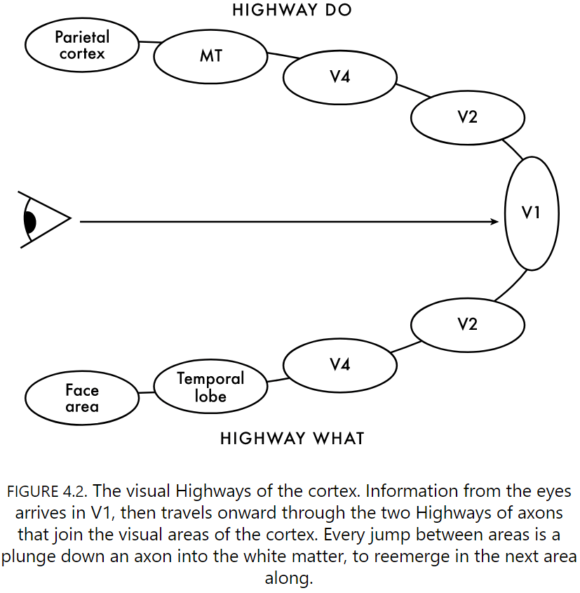
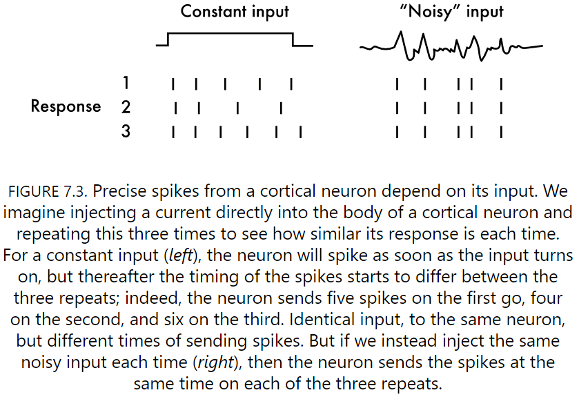
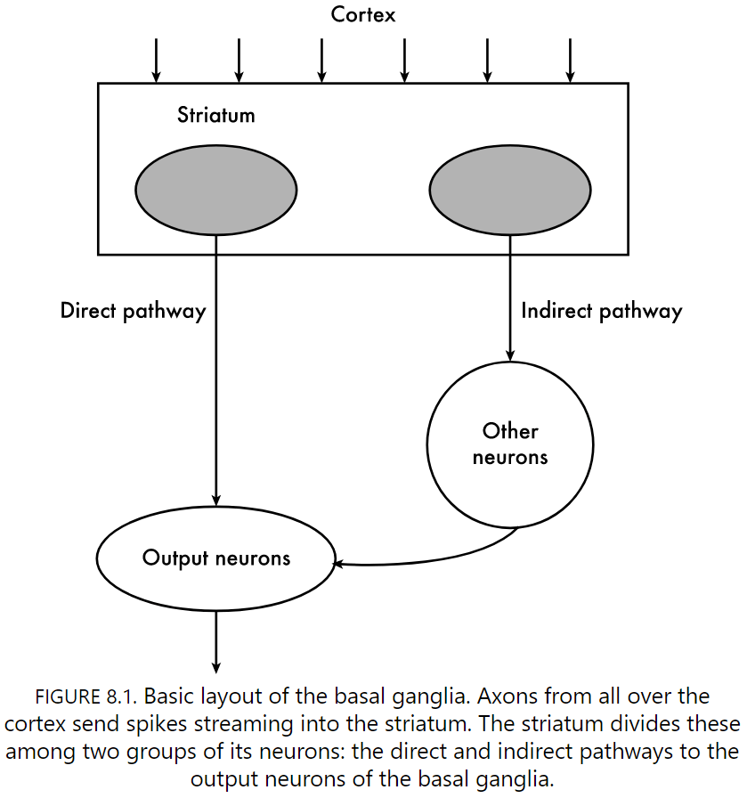

# The Spike

## Chapter 1: Introduction

- Your brain uses electricity to communicate.
- Spikes are seeing, hearing, feeling, thinking, planning, and doing.
- Spikes are how neurons talk to each other and how you do anything.
- Each of the 17 billion neurons in your cortex sends, at most and on average, one spike per second.
- The brain sends and receives so many spikes within its lifetime; billions upon billions.
- This book tells the story of just two seconds, of the simple act of seeing, deciding, and taking a cookie.
- Here, fMRI is of no use to us because it doesn’t let us see neurons and spikes.
- Trying to understand how neurons work using fMRI is like trying to follow a soccer match through the roar of the crowd.
- To understand a match, we need to watch the players.
- To understand the brain, we need to watch the spikes.
- Since we recorded the first spike in the 1920s, we've recorded from every imaginable part of the brain and from almost every imaginable brain.
- We can finally test what spikes are for by seeing what happens when they're sent, but also just as importantly, when they're not sent.
- Neurons are extraordinarily preserved from deep evolutionary time.
- We go on the journey of a spike from eye to hand, about what they mean and of what we have left to understand.
- One of the new ideas from the book is that spontaneous spikes are used to predict what we'll see next, rather than waiting for stimuli.
- All so that we can react faster, move quicker, and survive for longer.

## Chapter 2: All or Nothing

- Warren McCulloch made a bold, but true, prediction regarding the spikes he saw on an oscilloscope: that they're all-or-nothing.
- This leads us to the question: why spikes?
- McCulloch turned out to be right because of the way spikes are made using the cell membrane.
- The opening and closing of holes in the membrane is always the same, so the spike is always the same shape and size.
- There is a spike or there is not, nothing in between.
- Review of Hodgkin and Huxley work.
- Neurons sit in salty water since there are lots of sodium ions outside the neuron but few inside.
- Since neurons are all-or-nothing, we can simplify how we think about the brain by ignoring the details such as the shape, width, and sloppiness of the spike.
- We only need to know that it was sent or not.
- This simplifies neurons to only sending out binary messages, and binary implies logic.
- Review of McCulloch and Pitts (MP) work.
- So it seemed that the answer to "why spikes?" was so that the brain can compute.
- Computer hardware has some foundations in brain science, not the other way around.
- E.g. Computers were thought to be brain-like and not that brains were computer-like.
- The first two layers of the retina are surprising because they don't use spikes to talk; they talk directly in flickers of voltage and diffusions of chemicals.
- Review of cones, bipolar, and ganglion cells.
- The retina isn't a passive collector of light, but a complex mini-brain.
- The lack of spikes in the eye means the neurons there can't be doing the logical operations believed by MP.
- If the retina doesn't need spikes, why do neurons send spikes?
- Why convert the flexible, continuous, analogue signal of molecules and voltage into a rigid, discrete, digital one? Why throw away information?
- The answer is that spikes let neurons send information accurately, fast, and far.
- A spike is a time stamp that says "a thing just happened now": an event.
- That thing might be a change in light intensity or the pitch of a sound.
- In general, spikes signal change.
- A spike takes less than a millisecond to make, so they're resolution/accuracy is extremely good for time stamping events in the world.
- E.g. A rat's whiskers are accurate to five microseconds.
- The faster the movement, the more accurate the spikes it evoked would need to be to capture such movement.
- Fast events require fast communication.
- Spikes are the brain's solution to the problem of sending information quickly.
- Almost all neurons have a single axon sprouting from them and some of these axons are custom built for speed.
- Spikes are twenty times faster than if neurons used only voltage for signaling (graded potentials) and a thousand times faster than chemical messaging.
- Plus, sending graded potentials increases the chance for message corruption due to noise.
- After a hundred or more passing, the message would be ruined like in the game of telephone.
- Spikes let the whiskers update the rat's brain and then feet, accurately and quickly.
- Big bodies need their neurons to send messages over long distances.
- Spikes are the brain's solution to the distance problem too.
- Axons connecting nearby neurons are thin, while axons connecting distant neurons are thick.
- The longer the axon, the thicker it is, so the spike travels faster.
- Another solution is to use a myelin sheath.
- Sending distant messages using any other way is doomed to failure.
- E.g. Giraffes are only possible due to spikes.
- Spikes are accurate, fast, and far.
- What the eye tells the brain is a complex, but simplified, breakdown of everything that's out there.
- The activity of cones encode the location of sources of light in the outside world.
- Spikes from the ganglion cells automatically tell the brain about location.
- When they're sent, spikes just mean that there's a different pattern of light at this location, and the location above it, and all along this direction in a straight line.
- After location, the retina's next fundamental bit of information is when light is on or off at a particular location.
- Review of ON, OFF, and ON-OFF retinal ganglion cells.
- This was a killer blow to the MP idea of neurons as logical computers since the retina does this much computation without spikes.
- A lot of computation, but no logic.
- There are at least 32 different types of ganglion cells in the mouse eye; we don’t know exactly for humans.
- And whatever they respond to, each type of ganglion cell tiles the retina.
- What's the purpose of all of these types?
    - They exist to send messages that solve very specific problems.
    - They're not selective, but instead model one aspect of the world that's common and regular.
    - They exist to signal to the brain how much your head is moving to move your eyes and counteract the head movement.
- However, most ganglion cell types aren't selective to solve the specific problems of coordinating your body.
- Rather, they each take care of common features in our world, which depends on what that animal calls home.
- Different species have different niches, which requires different ganglion cells.
- For humans, when compared to mice
    - We definitely have a few types mice don't since we have a third type of cone.
    - By gene definition, we have twenty compared to the mouse’s forty.
    - We have a fovea that mice don't.
- When we see something, our retina splits the image into tens of separate channels of information.

## Chapter 3: Legion

- The spikes from the eye then enter layer four of the cortex.
- Layer one of the cortex, near the surface of the brain, has few neurons and is mostly filled with axons and glia cells.
- The shape of a neuron’s dendrite tree, and how many trees it has, tells us a lot about what that neuron is trying to do.
- Review of synapses and neurotransmitters.
- Exactly what effect each arriving spike has on the dendrites depends on what type of molecule is sent across the gap.
- It seems wasteful that each spike is created only to be destroyed at the synapse.
- The key reason is flexibility. Transforming spikes back into chemistry then voltage gives the brain options for how to interpret the all-or-nothing spike.
- E.g. Having more neurotransmitter receptors can change the level of excitability and inhibition.
- If you were a neuron in the cortex, spikes would seem legion.
- How many spikes are needed in order for a neuron to spike?
- This question is difficult to answer.
- Three factors for spiking
    - Balance of excitation and inhibition.
    - Synchrony of inputs.
    - Where they land on the tree itself.
- Crashes of spikes are rare in the brain because its kept in a Goldilocks zone between excitation and inhibition.
- Canceling out excitation means that either inhibitory neurons send out far more spikes or that the inhibitory inputs have a greater effect per spike.
- There's now evidence for both.
- Cortical inhibitory neurons fire two to three times more spikes and the gaps where these spikes arrive can be four to five times stronger than those of excitatory inputs.
- By organizing the inhibitory and excitatory neurons in a negative feedback loop, the brain can balance itself.
- Experimental evidence shows that the total amount of excitation and inhibition coming into a cortical neuron is roughly in balance.
- If you want a foolproof way of sending spikes, you would synchronize the spikes coming into a neuron, and the message will be carried onward in the newborn spike.
- The brain should be a neural orchestra.
- Review of simple cells.
- Two reasons why the chorus is important
    - It harmonizes information.
    - There are more inputs from the brain than the eye, so the information from the eye needs to come at about the same time.
- Just like balance, synchrony has to be just right; too little and there's no effect, too much and we crash the brain.
- Where each spike lands on the neuron also determines exactly how many spikes we need to make a new one.
- Three ways location influences spiking
    - How far away from the neuron's body the spike lands.
    - How bunched together the inputs are.
    - What lies ahead on the path between input and body.
- Spatial and temporal synchrony working together can dramatically increase the chances of making a new spike.
- Review of shunting inhibition.

## Chapter 4: Split Personality

- Spikes go where axons go.
- Axons also branches, sometime hundreds of times.
- At every branch/split, our spike is copied, cloned, and sent down every new branch to carry its message onward.
- Down hundreds of branches.
- To fully understand what message our spike is carrying, we need to know two things of the neuron that created it.
    - We need to know what the neuron responds to; what created the spike in the first place.
    - We need to know where it sends that spike.
- There are three main locations to send spikes
    - Nearby to clarify and amplify the message.
    - Far away to communicate the message to be combined.
    - Across hemispheres to keep the brain in sync.
- Neurons that like very similar things at very similar positions in the visual world also like to strongly connect together.
- Review of complex cells.
- A neuron being simple or complex lies on a continuum. Some are plain and simple, while others are complex.
- Neurons only send what need to be sent.
- By using interneurons to suppress other neurons with similar tunings, our spike is trying to stop redundant and ambiguous messages, to conserve energy and create clarity.
- Layer five sends axons down the brain stem and onward to the spinal cord.
- Layer six has corticothalamic neurons that project to the thalamus.
- In all layers (except for layer one), there are corticocortical neurons that project across the cortex.
- For now, we plunge down the long branch axon from layer two, down past layers four, five, and six, and into the white matter that's the superhighway of the brain.
- Review of the ventral and dorsal visual pathways.

- Highway What
    - What a neuron in V2 likes is defined by what it's legion of input tells it about.
    - The visual world is split into edges and textures.
    - V2 captures a common theme of our journey through the visual parts of cortex: at each step, neurons combine and transform inputs from the area we just left, creating more complex representations of the world.
    - V4 neurons differentiate between foreground and background.
    - Color recognition depends on all of the wavelengths of red, green, and blue. The key is how much is reflected at each wavelength.
    - Color isn't the wavelength of visible light, it's the proportion of reflected light at that wavelength compared to the total amount of light at that wavelength.
    - V4 neurons work this out.
    - How many spikes they each send signals how much of their cone-pathway combination is present.
    - The visual system gets very excited by writing.
- Highway Do
    - Direction-selective neurons are at the start of this highway.
    - V5 is the same as MT.
    - Area MT neurons put the whole picture together and respond to global motion.
- Your visual system appears to be arranged in a hierarchy with increasingly more complex representations.
- There's no doubt that the visual system isn't a strict hierarchy due to feedback and cross-talk.
- We know little about the journey of spikes between the halves of the cortex.
- Evidence suggests that spikes crossing the hemispheres are crucial for synchronizing the same region on both sides of the cortex.
- Review of split-brain patients.

## Chapter 5: Failure

- Spike failure, a spike not being passed on, seems like a bug, a flaw.
- Failure rates wildly differ between different parts of the brain.
- E.g. The hippocampus had a 70-95 percent chance that a spike never makes anything happen.
- Yet other synapses in the brain have a failure rate close to zero. Every spike guarantees a response on the other side.
- If spike failure is a bug, then it makes no sense that it can differ so radically in the brain.
- Then perhaps it isn't a bug, but a feature.
- Why fail? Why would the brain prevent itself from sending information?
- To communicate better.
- One idea is that spike failure is necessary to control how strongly neurons connect to one another.
- Two parts of synapse strength
    - Size of the voltage blip.
    - Reliability of the synapse.
- This gives us two options for changing the strength of a connection from one neuron to another.
- We can either change the size of the response or change its reliability.
- Changing the size of the response requires
    - Increasing the number of vesicles.
    - Increasing the number of receptors.
- Changing the reliability only requires making the release side more or less sensitive to each spike. More sensitive means more vesicles released.
- Since you can't make a reliable synapse more reliable, you have to start off unreliable to allow headroom for change.
- This implies that for learning, the brain is deliberately noisy in order to allow for learning.
- Learning becomes the routing of reliable spikes.
- Maybe unreliable synapses solve the problem of how to transmit as much information as possible with as little energy as possible.
- Synapses and their machinery take up about 56 percent of all energy used by neurons in the brain.
- Failure brings down the information rate of the neuron's input to match the capacity of the neuron's output axon.
- It turns out that the failure rate, in theory, should be around 75 percent, which is exactly what we see in the cortex.
- Synaptic failure also reduces sending redundant information, which maximizes the amount of information per unit energy.
- This redundancy theory predicts that the more contacts a neuron makes on a target neuron, the more unreliable those synapses should be. And this prediction is true.
- The more synapses a neuron makes on another, the higher the failure rate of those synapses.
- Synaptic failure could be a neuron's greatest hack for optimizing the efficiency of energy and communication.
- Failure can also be used to throttle the rate of vesicles release to sequential spikes.
- E.g. The first spike used up a lot of the vesicles so subsequent spikes have less to use and are therefore more unreliable.
- This means that the strength of the synapse becomes progressively weaker to later spikes in a sequence.
- This is known as short-term depression.
- The opposite, when the first spike primes following spikes, is known as short-term facilitation.
- With these short-term operations, the receiving neuron can compute things based on sequences of spikes.
- E.g. If two spikes occur within X milliseconds on a synapse with short-term facilitation, the receiving neuron knows this even though the first spike never occurred.
- In effect, synaptic failure allows the brain to compute with ghosts, spikes that were never there.
- It also allows neurons to filter spikes by breaking oscillations. This may also be how brains prevent seizures.
- Review of the superior colliculus (SC) as a threat detector and the periaqueductal gray (PeGy) as the controller of rapid reactions.
- The unreliable connections between the SC and PeGy control the decision to flee or not, it is the threshold.
- Another proposed reason for synaptic failure is to introduce noise into the brain for learning and searching.
- Like in ML, noise is good for
    - Generalizing what you've learned.
    - Searching for the best solution to a problem.
- Maybe synaptic failure is the "dropout" for the brain.

## Chapter 6: The Dark Neuron Problem

- Like the night sky, most of the neurons aren't firing.
- The overwhelming majority don't send anything.
- Sending 500 spikes per second is the theoretical limit for neurons.
- Evidence shows that the most active neurons in the cortex can only sustain a continuous output of about 30 spikes per second.
- There seems to be a paradox in that neurons in the cortex are sending spikes an order of magnitude lower than they should be if all of their inputs were similarly active.
- The only solution to this paradox is that most inputs to a neuron aren't sending spikes.
- The irony is that dark neurons are essential to being able to record from neurons at all. Too much spiking and the data would be too noisy.
- Around 10 percent of cortical neurons produce half of all spikes.
- In a chunk of time, some neurons are silent, most send just a few spikes, and even fewer send many spikes. Some silent, most quiet, few yelling.
- Most neurons send less than one spike per second.
- This means that the average activity is useless as a way of understanding what an area of cortex is doing, since the few loud neurons skew the average.
- So what are dark neurons for?
- The dominance of dark neurons means that our theories of the brain are biases towards the few neurons that spike.
- Maybe dark neurons don't spike to conserve energy, maybe they're for storing memories.
- Four hypotheses
    - Maybe our lab experiments just aren't covering the full range of experiences to activate the dark neurons.
    - Maybe it's the brain making the most out of its available energy.
    - Maybe dark neurons are a reserve army, waiting to represent new things.
    - Maybe they're sending information just fine but they do so together.
- Synaptic failure may paradoxically favor neurons that rarely fire.
- There's another type of dark neurons, Type 2, that fire away fine but don't seem to respond to anything.
- They seem to be talking without listening; they're dark to the outside world.
- Dividing neurons into active and dark is a fallacy since it's a spectrum and we can split the spectrum wherever we want.

## Chapter 7: The Meaning of Spike

- For nearly a century, there's been a war between the Counters and Timers on the meaning of a spike.
- Counters believe spikes carry meaning by their number.
- Timers believe spikes carry meaning by when they occur and the time between spikes
- For Counters, meaning is simple and is represented by tuning curves.
- We can infer the counting code by working backwards from what the animal was doing, to what the neuron was doing just beforehand.
- E.g. Place and grid cells.
- The count represents a physical property of the world.
- E.g. Color, frequency, place.
- However, the Timers have evidence in the temporal precision of spikes that we've discussed.
- E.g. Whisker system with sub millisecond accuracy and the barn owl sound localization system.
- Review of Jeffress coincidence detection model for sound localization.
- Ganglion cells show this too with a spike-latency code.
- The latency of the first spike encodes far more information than counting spikes about which image was shown.
- The timing of spikes in the retina seems to be a powerful code.
- The Counters look at one set of brain regions, like the sensory and edge systems, while the Timers look at another, like the brain regions in the middle.
- The simplest test to give a neuron is to provide an identical input many times and see if it repeats the same pattern of spikes with the same precision.
- If we do this test with a constant input voltage, neurons don't output the same set of spikes.
- However, if we inject a noisy, random current that mimics real spike trains, then we get precisely the same response each time.

- Neurons are capable of reproducing exactly the same timing pattern of spikes given the same noisy input.
- So, we can infer that the cortex uses a timing code.
- However, one compelling argument against the timing code is that noise would throw off the code.
- A single spike can change the course of many future spikes, and we know spikes fail all of the time.
- How do we solve the irreconcilable differences between Counters and Timers.
- The deeper we've plunged into the cortex, the less we can predict from a spike about what's going on in the outside world.
- Predictive models tell us little about the spikes in the brain.
- If we only look at what happens in the outside world, then we ignore the influence of other neurons on that neuron.
- Counters, timers, predictors: all these are views of the output of a single neuron.
- However, to make a single spike requires more than a single neuron.
- So Counters and Timers are asking the wrong question.
- Meaning isn't the spikes of one neuron, but of the Legion.
- Ask not what a neuron sends, but what it receives.
- Population decoding: taking the activity of lots of neurons and seeing if we can decide what the population sees.
- All over the cortex, population decoding can successfully predict what’s happening in the outside world from the pattern of spikes.
- It shows us that the spikes of a population of neurons carry meaning that's invisible when we look at members of that population.
- However, just because the decoding is successful doesn't mean that that's what's happening in the brain.
- E.g. Maybe another experimental parameter is changing, and the brain captures and encodes it instead of what we believe. Like encoding the light switch position instead of presence of light.
- Spikes don't just mean what's happening in the present, they also hold messages about the past and future, about memory and decisions.
- The prefrontal cortex acts as a short-term buffer.
- Evidence comes from lesion studies of the prefrontal cortex.
- The prefrontal cortex should have neurons that sustain spiking throughout a buffered memory.
- Type 2 dark neurons also exist in the prefrontal cortex.
- If we look at a group of neurons in the prefrontal cortex, sustained memory is crystal clear.
- The loneliest neurons are in the prefrontal and parietal cortex.
- Many decisions require you to add up the evidence for each option.
- While this seems to support the Counter's position, we have to remember that tuning doesn't mean function.
- Just because a neuron sends spikes in response to something doesn't mean that neuron plays a causal role in operating on that something.
- The brain is degenerate, meaning it has multiple solutions to the same problem with multiple systems that can do the same job, but in different ways.
- Decision-making provides clear evidence of a degenerate system in the brain.
- Making a decision is so vital that the brain will try to find any way it can to make one.
- All spikes adding up to your decision to take the cookie.

## Chapter 8: A Moving Experience

- How do neurons in the motor cortex perform the action of grabbing the cookie?
- We land on a layer three neuron in the premotor cortex, one that prepares you to move.
- Counters place movement neurons among their favorite.
- However, as we've learned before, individual neurons here don't convey the message to move.
- The message is in the legion of spikes from many neurons.
- Movement poses a new problem since it take times to perform.
- So the spikes in your arms and hands have to unfold in just the right way over time.
- They also have to be self-sustaining as once the spikes start to make you move, they carry on until that move is done.
- E.g. You’ve never suddenly dropped your arm while reaching for an object.
- This requires many neurons to sustain the action.
- But before this, we first have to initiate the sequence, which is what the premotor cortex does.
- One of neuroscience's big mysteries is how muscles know when to not do anything.
- Why are we not always flapping our arms? What controls movement?
- The answer lies in the newly discovered "null space".
- Null space: the space of all possible ways the neurons in the motor parts of cortex controlling the body can add up to the same number of total spikes.
- The basal ganglia are the brain's stern parents.
- All layer five neurons that send axons within the cortex seem to send a branch down to the striatum.
- Electrical stimulation of the striatum causes a body part to move.
- Evidence strongly suggests that the striatum controls the choice of action.
- Not just making the right choice, but stopping actions too.
- Two pathways out of the striatum
    - One directly connects to the basal ganglia. This pathway selects action.
    - One indirectly connects to the basal ganglia. This pathway controls and aborts action.
- These two pathways compete for control over what you'll do next.

- Paradoxically, the striatum has 20 percent of the brain's neurons but they remain silent.
- The striatum is an inverter of the cortex, turning excitation from cortical neurons into inhibition.
- During arm movements, the self-sustained dynamics in the motor cortex have a simple, consistent behavior: they rotate.
- The lack of tuning in most neurons of the motor cortex is due to most neurons producing self-sustaining spikes to keep the movement going.
- Most axons from the motor cortex land within the spine's network of neurons.
- At the end, the spikes goes down from the brain to the spine and into the muscle.

## Chapter 9: Spontaneity

- Two deep misconceptions about the spike
    - That all spikes are caused by events in the world.
        - E.g. If we see a neuron sending a spike, then it must be linked to something happening in the world.
        - This isn't true.
        - Many spikes appear to be spontaneous and may be traces/echo of what just happened a moment before.
        - How far a neuron extends its tree isn't fixed but is regulated by its own activity.
        - The tree grows if the neuron isn't active enough and shrinks if its too active.
    - That neurons always need inputs from other neurons to make a spike.
        - E.g. If a neuron sends a spike, then it must've been caused by depolarization of its dendrites past the tipping point for a spike.
        - This isn't true either.
        - For a neuron to get spontaneous spikes, the easiest way is for it to make its own spikes.
        - We find pacemaker neurons throughout the brain.
        - However, there aren't enough to generate the spontaneous activity that we see in the brain.
        - The source of most spontaneous activity is the network itself.
- In a dish, a slice of cortex will generate spikes in the absence of input.
- Fill that dish with a chemical soup similar to the salty water in a living brain and the neurons will spontaneously generate slow-wave rhythms.
- This is similar to a deep-sleeping slice of isolated cortex.
- Yet change the soup to one that blocks synapses and all but the pacemakers stop spiking.
- In all of these dishes, the majority of spikes are generated by the network of connections between neurons.
- The key is feedback.
- Feedback can sustain its own activity.
- Too much excitation leads to a runaway effect so we need inhibition to balance it out.
- If we start at one pyramidal neuron and trace its connections, we always find that we end up back at our starting neuron.
- We can always find a complete loop.
- So by sending a spike, a pyramidal neuron creates the potential to excite itself in the very near future.
- However, most loops will fail to feed back that spike to the starting neuron.
- One reason for such failure is due to inhibitory GABA synapses.
- Everywhere we find rhythmic movements, we find circuits of neurons that self-sustain repeated activity.
- They can also explain working memory and decision making.
- We think feedback networks are everywhere in the cortex.
- The wiring between neurons in the cortex is roughly the same everywhere, suggesting that self-sustaining networks are everywhere.
- The idea is that Type 2 dark neurons are actually telling us that all cortical regions are dominated by self-sustaining dynamics.
- However, this doesn't make sense since they use an extraordinary amount of energy and seem to carry no message about the world.

## Chapter 10: But a Moment in Time

- The cookie is on its way toward your mouth.
- In that time, spikes have been sent and received in the brain and spine.
- For you, it was but a moment in time. A mere two seconds.
- The speed with which your brain must respond puts brutally tough limits on how spikes work.
- If a picture is flashed
    - Ganglion cells in the retina respond about 20 ms later.
    - V1 respond about 40-50 ms later.
    - Every step along Highway What adds about 10 ms.
    - Highway Do is faster with MT neurons changing 10 ms after V1.
- It makes sense that Highway Do is faster so as to escape and react faster to predators.
- However, doing more than just responding to the outside world doesn't take the brain much longer.
- E.g. Highway What can detect an animal in a visual scene in about 150 ms.
- The more processing the brain has to do, the slower the response.
- Stanislas Dehaene five comparison experiment
    - Asked subjects: is this number larger or smaller than five?
    - Average response took 400 ms.
    - Which part is the bottleneck? Comprehending, comparing, or responding?
    - Responses were faster if the number was shown not spoken, suggesting the brain comprehends writing faster than speech.
    - Responses were faster for numbers farther from five, suggesting the number line is literally real.
    - Responses were faster for the dominant hand, suggesting the dominant motor cortex is faster.
    - Overall, the difference between the slowest and fastest conditions was just a few tens of milliseconds.
- When gathering sparse, difficult information, the brain slows down, but slow is still relative.
- The physical process of making and sending spikes places hard lower bounds on how many spikes can be transmitted, received, and created.
- How then can your brain overcome the speed limit of spikes?
- Two solutions
    - Compute in parallel.
    - Spontaneous spikes.
- Roads not taken
    - There were so many roads that we could've gone down, journeys that happen parallel to ours.
    - A spike's journey is a perilous one, prone to death.
    - Each region of the brain sends spikes in parallel.
    - The retina has to send an entire visual scene in parallel and the motor cortex has to send commands to move your shoulder, arms, and fingers in parallel.
    - The whole brain is one vast parallel computing monster.
    - Spikes are sent all over the brain to compute different things and offer different solutions, all in parallel.
    - The brain is parallel at all scales.
    - Parallel processing solves one part of the speed limit problem by dividing up the world and computing each bit of it at the same time.
    - But it doesn't solve the main speed limit problem.
- Bodies don't have time to hang around waiting for legions of spikes to be created from scratch at each step.
- Author argues that spontaneous spikes are part of the solution.
- Spontaneity for survival
    - Spontaneous spikes can be put to work to make neurons respond faster to the outside world.
    - Like you, a resting neuron is sluggish when roused and prone to falling back asleep.
    - But what if the neuron's voltage was already close to its tipping point?
    - E.g. Long-term potentiation.
    - Then a neuron needs to receive just a few spikes to make a new one.
    - Spontaneous spikes help by causing voltage blips in many neurons, driving up their voltage.
    - Thus, spontaneous spikes are there to assist spikes evoked by the outside world.
    - However, there are issues with this hypothesis.
    - E.g. They are random and they use huge amounts of energy as mere helpers for evoked spikes.
    - The evidence that spontaneous spikes use so much energy suggests that the brain has a much better way of putting them to work.
    - We think that spontaneous spikes are already carrying most of the information the brain needs to act. They're prediction.
    - This also explains why the brain uses a mostly constant amount of energy regardless of the task.
- Spontaneity for prediction
    - Prediction is crucial for much of what we do. Based on what happened before, this is what's most likely to happen next.
    - Our brain turns experience into prediction.
    - One non-obvious experience that we've all had to learn is seeing.
    - The development of the visual system takes a long time.
    - The statistics of the visual world are all learned by experience.
    - E.g. Raise someone in a world without vertical lines and they can't see a vertical object. Close one eye during development and when reopened, that eye will see nothing.
    - Deprived of the experience of vertical lines and there are no neurons tuned to vertical lines.
    - Neurons learn about edges, corner, and curves through experience.
    - The set of neurons you have in your visual cortex exactly reflects the statistics of the visible world you grew up in.
    - Which means your brain can turn this lifetime of experience into prediction.
    - Spontaneous spikes made those predictions.
    - These predictive spontaneous spikes solve the speed limit problem because then we don't need all of the spikes from the retina, V1, etc. to start processing.
    - In essence, the brain guesses with incomplete information to be faster.
    - Because spontaneous spikes are already there in each brain area, most areas are already predicting most of the world.
    - How exactly does this prediction happen?
    - Feedback connections do the predicting.
    - Each brain region isn't sending its processed output that reflects reality, it's sending its processed guess.
    - This also explains some visual illusions.
    - Working backwards, descending spikes are predicting features that should be in the world if each guess is true. They predict by deconstruction.
    - So the spikes descending from Highway What ultimately predict what information should be arriving in V1 from the eye.
    - This also explains the priming effect.
    - So, input from the eye only adjusts what's wrong with the prediction.
    - Since most of the predictions will be correct, because experience has fine tuned our visual system, there won't be much to adjust.
    - The spontaneous spikes just tell the rest of the brain what's there in the world before your eye has ever seen it.
    - This theory also goes by the name of Bayesian hierarchical inference, bootstrapping, and educated guessing.
    - It means that seeing can be so fast that you don't notice it happening; the information is already there and adjusted by the input.
- Prediction is used to guide behavior and can be created from few examples.
- Theories on how the brain makes decisions propose that spontaneous activity affects future decisions because that activity encodes prior information.
- Given this body's experience, this is what my current prediction is.
- Predictions can be used as a starting point to make fast and accurate decisions; they're heuristics.
- A memory buffer is also part of prediction as to gain entry into the buffer, the new stimulus must be either new, odd, surprising, or useful.
- Attention can be thought of as signaling that that stimulus will be useful in the future.
- Another supporting piece of evidence is that we know working memory is maintained by the spontaneous activity of neurons in the prefrontal cortex.
- Long after the evoking stimulus, these neurons are sending spikes to each other.
- Maybe dreaming is a way of consolidating memories from spontaneous spikes into a more durable form like LTP, synaptic weights, or new neurons/connections.
- Spontaneous spikes before movement are also seemingly predictive of what movement will be.
- There's nothing unique about the spikes evoked by events in the outside world.
- In an experiment with infant ferrets, the animals were shown two different visual scenes: darkness and a movie of the natural world. The infant ferrets had vastly different patterns of spikes between movies and darkness but these converged over development.
- By natural, we mean stimuli with curves, edges, color, motion, etc.
- Thus, development may be the process of refining the brain's predictions; of refining spontaneous activity.
- Model of how the brain works
    - Spikes coming in from the outside world adjust spontaneous activity, and these adjustments are the message they carry.
    - So spikes don't signal changes in the world, they signal changes in prediction, deviation from the baseline that is prediction.
    - That's why in mature brains, the distribution of how many spikes each neuron sends barely changes between spontaneous and evoked activity.
    - This implies that information isn't coded in the pattern, timing, or number of spikes evoked by the outside world, it's coded by changes in the ongoing spontaneous spikes.
- Maybe spontaneous spikes were selected for by evolution as a byproduct of simply making a network of neurons.
- Evolution co-opted spontaneous spikes to prime responses or anticipate needs.
- The most important journey for the spike is not from input to output, it's the eternal cycle of looping forever within the brain.

## Chapter 11: The Future of Spikes

- We can predict the new directions that we want to explore with spikes.
- Two missing pieces
    - Spikes that underlie disorders of the brain.
    - Spikes that underlie human thought processes.
- There's a race to record from as many spikes and neurons simultaneously.
- Neuroscience has a version of Moore's law but for the number of simultaneously recorded neurons doubling every few years.
- By recording from many neurons at the same time, we know that our theories about how the brain works will change.
- One new technology that will push our ability to record spikes is called voltage imaging.
- One day, we'll be able to record every single spike sent by every single neuron in the entire cortex. However, this data doesn’t mean that we’ll gain new insights into how the brain works.
- So what?
- If we keep digging for more spikes, do we advance our understanding of the brain? Or will we drown in the details, never escaping big data?
- We must be wary of the latter.
- If spikes between neurons are the basis of thought, word, and deed, then errors in spikes are what drive errors in thought, word, and deed.
- Some of these errors are permanent and we call them brain disorders.
- E.g. Epilepsy.
- Three classes of spike disorders
    - Movement
        - E.g. Huntington's disease.
    - Memory
        - E.g. Alzheimer's disease.
    - Thought
        - E.g. Schizophrenia.
- Spikes give us a common language to talk about the brain and when it goes wrong.
- All brain disorders have a characteristic change to the passing of spikes between particular groups of neurons.
- And this change in the passing of spikes is what causes the symptoms of the disorder.
- A clear future for spikes is to understand how they change movement, memory, and thought.
- Why didn't the book describe the spikes for emotions, attention, awareness, and consciousness?
- Because we can't record spikes from humans.
- The explanatory gap between spikes and subjective experience has not shrunk.
- Nothing is known of how spikes passed between neurons relate to consciousness.
- This lack of grounding in the actual mechanics of the brain sets consciousness research adrift.
