## Introduction: The Systems Lens

- We start with a toy Slinky; a coiled spring that bounces up and down if one end is held.
- If we let the Slinky drop with one hand holding one end, then the other end bounces up and down.
- So what made the Slinky bounce? People usually answer the hand holding the Slinky.
- However, the true answer lies within the Slinky itself.
- The answer isn’t that the hand made the Slinky bounce, the hand only suppresses/releases some behavior that’s latent within the structure of the spring.
- This is the central insight of systems theory. The insight that the behavior of a system is the result of some properties of the system, and not the result of some outside event/influence.
- *System*: a set of things that’s interconnected in such a way that they produce their own pattern of behavior over time.
- Systems, to a large extend, cause their own behaviors.
- An outside event may unleash that behavior, but the same outside event applied to a different system is likely to create a different result.
- E.g. Political leaders don’t cause recessions, they’re inherent in the structure of a market economy. Competitors don’t cause a company to lose market share, the losing company creates it losses through its own business policies.
- Some problems can be solved by focusing on an external agent.
- E.g. Preventing smallpox or increasing food production.
- However, some problems are intrinsically systems problems that can’t be solved by blaming an external agent.
- E.g. Poverty, environmental degradation, war.
- These are undesirable behaviors that are characteristic of the system structures that produce them.
- The only way we can solve these problems is to stop casting blame and to see the system as the source of its own problems, and to find the courage to restructure it.
- System thinking allows us to
    - Hone our abilities to understand parts.
    - See interconnections.
    - Ask “what-if” questions about possible future behaviors.
    - Be creative and courageous about system redesign.
- The behavior of a system can’t be known just by knowing the elements of which the system is made.

# Part One: System Structures and Behavior

## Chapter 1: The Basics

- A system is made up of three parts
    - Elements
    - Interconnections
    - Function/purpose
- E.g. The elements of the digestive system include teeth, enzymes, and stomach. They’re interrelated through the physical flow of food and regulating chemical signals. And it’s function is to break down food into its basic nutrients and to transfer those nutrients into the bloodstream.
- Systems can be embedded in systems, which can be embedded in yet other systems.
- A group of elements without connections or a purpose isn’t a system.
- E.g. Sand at the beach or a group of wood logs.
- Another property of systems is that you can’t remove an element of it without affecting its purpose.
- E.g. Removing sand from the beach doesn’t change anything, but removing your stomach affects your ability to break down food.
- A system is more than the sum of its parts.
- Systems can exhibit
    - Adaptation
    - Evolution
    - Self-preservation
    - Self-organization
- Elements don’t have to be physical things.
- E.g. Money, pride, consciousness.
- However, don’t be caught up in trying to list all of the elements of a system. Another important part of systems is how those elements interact.
- It’s easier to learn about a system’s elements than about its interconnections.
- Interconnections can take two forms
    - Physical
        - E.g. Water in a tree trunk.
    - Information
        - E.g. Emails about university admission status.
- If information interconnections are difficult to see, then the function or purpose of a system is even more difficult.
- The best way to deduce the system’s purpose is to watch for a while to see how the system behaves.
- Purposes are deduced from behavior, not from stated goals or intentions.
- An important function of almost every system is to ensure its own perpetuation.
- Keeping sub-purposes and the overall system purpose in harmony is an essential function of successful systems.
- You can understand the relative importance of a system’s elements, interconnections, and purposes by imagining them changed one by one.
- This is the same idea brought up in The Book of Why, the counterfactual.
- Changing elements usually has the least effect on the system.
- E.g. The human body replaces cells every few weeks. Hockey teams change their players every season.
- Changing interconnections usually has a drastic effect on the system.
- E.g. Changing the rules from hockey to basketball. Having a tree take take in oxygen and produce carbon dioxide.
- Changing purposes usually has a profound effect on the system.
- The elements of a system are often the least important in defining the unique characteristics of the system, unless changing the element also results in changing relationships or purpose.
- E.g. CEO of a company, president of a country.
- *Stock*: elements of a system that you can see, feel, count, or measure at any given time.
- A stock is the memory of the history of changing flows within the system.
- E.g. Water in a bathtub, books in a bookstore.
- Stocks change over time through the action of a flow.
- *Flow*: the input and output of a stock.
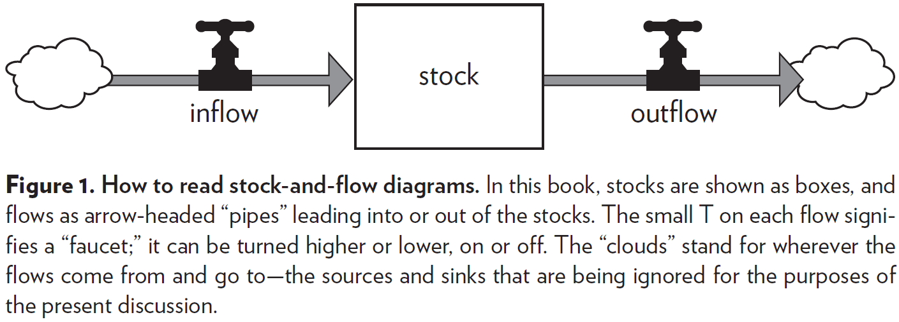
- All system diagrams and descriptions are simplified versions of the real world.
- *Dynamic equilibrium*: no change in stock.
- Three important principles of stock and flow
    - If inflow > outflow, then stock rises.
    - If inflow < outflow, then stock falls.
    - If inflow = outflow, then stock is in dynamic equilibrium.
- A stock can be increased in two ways
    1. Increase the inflow rate
    2. Decrease the outflow rate
- People often neglect the second method.
- E.g. Increase oil stock by burning less oil. Build up a larger workforce by reducing the rates of quitting and firing.
- A stock takes time to change because flows take time to flow.
- Stocks usually change slowly and can therefore be used as delays or buffers or shock absorbers in a system.
- Changes in stocks set the pace of the dynamics of systems.
- The time lag that comes from slowly changing stocks can cause problems, but they can also be a source of stability.
- Another important feature of stocks is that they allow inflows and outflows to be decoupled and to be independent.
- E.g. Banks enable you temporarily to earn money at a rate that’s different from how you spend it. Batteries enable your phone to store energy even through your usage varies.

### Feedback Loops

- Consistent behavior is likely created by a mechanism that operates through a feedback loop.
- *Feedback loop*: when changes in a stock affect the flows into or out of that same stock.
- E.g. Money interest in a savings account. The interest changes depending on how much money is in the account. And the money in the account changes as it gains interest.
- The flows into or out of the stock are adjusted because of changes in the stock itself.
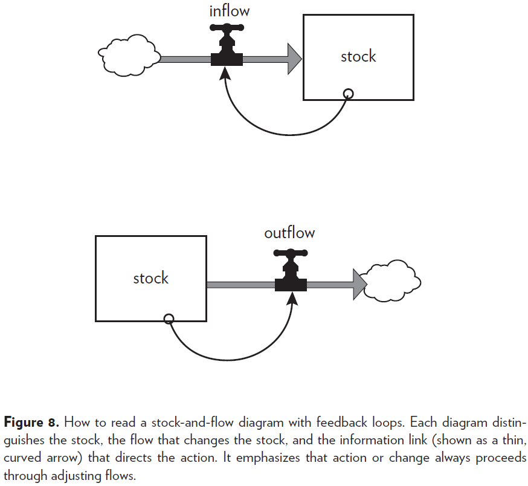
- Not all systems have feedback loops.

### Balancing Loops

- The first type of feedback loop is the balancing loop (also known as a negative feedback loop).
- *Balancing loop*: equilibrating or goal-seeking structures in systems that are both sources of stability and sources of resistance to change.
- E.g. The temperature of a coffee cup, whether hot or cold, will seek to balance itself with the temperature of the room.
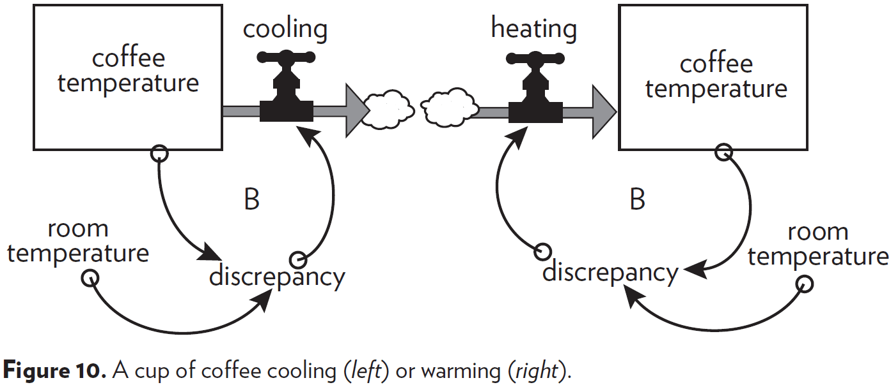
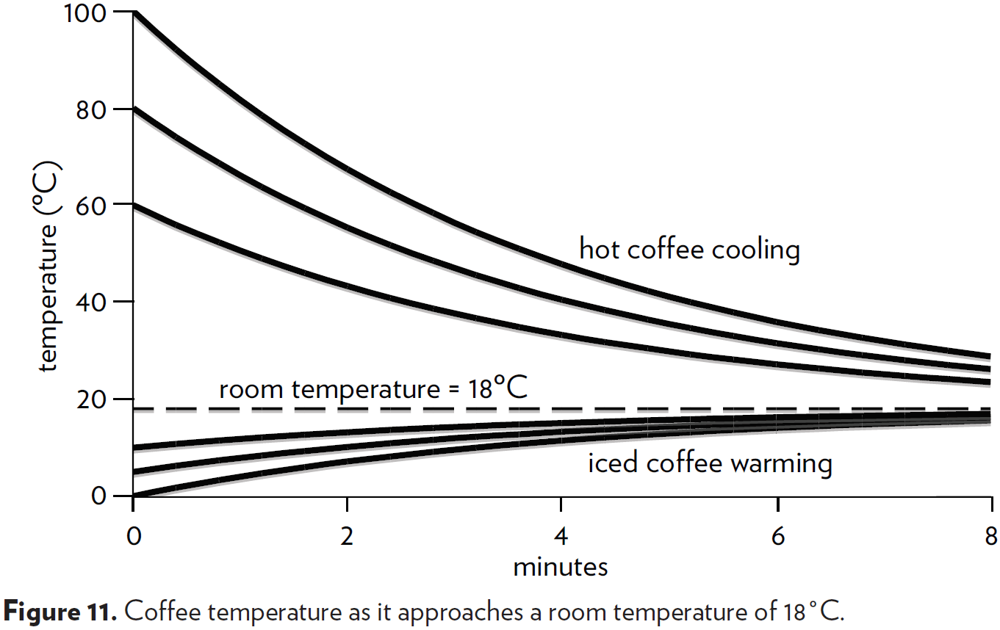
- The “B” in diagrams stands for a balancing feedback loop.
- Be aware that feedback loops can drive a stock in either direction. Either to lower to raise the level of stock.
- A balancing feedback loop opposes whatever direction of change is imposed on the system.
- A feedback mechanism may not work well as it may not be strong enough to bring the stock to the desired level.

### Reinforcing Loop

- The second type of feedback loops is the reinforcing loop (also known as a positive feedback loop).
- *Reinforcing loop*: a feedback loop that enhances whatever direction of change is imposed on it.
- E.g. The more prices go up, the more money people will need to make. And the more money people make, the more money companies need to pay people. And for a company to get more money, companies make prices go up.
- E.g. Compound interest.
- Reinforcing loops amplify and snowball, causing a vicious or virtuous cycle that can cause healthy growth or runaway destruction.
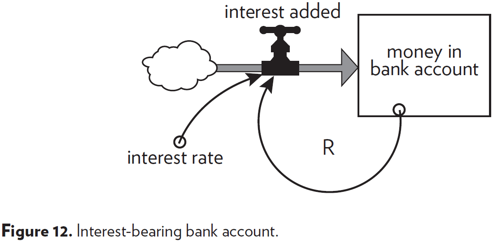

- The “R” in diagrams stands for a reinforcing feedback loop.
- Reinforcing loops are found wherever a system element has the ability to reproduce itself or to grow as a constant fraction of itself.
- Balancing and reinforcing feedback loops are core to systems thinking.
- Instead of seeing only how A causes B, you’ll begin to wonder how B may also influence A, and how A might reinforce or reverse itself.
- Instead of looking for who’s to blame, you’ll start asking what’s the system.
- The concept of feedback opens up the idea that a system can cause its own behavior.

## Chapter 2: A Brief Visit to the Systems Zoo

- This chapter contains a collection, a zoo, of systems.
- However, similar to a zoo, it has a large variety of systems that exist but it is far from a complete representation. It groups systems by family but this collection is too neat. The systems are shown independently but in reality they are connected.

### One-Stock Systems

- What happens to a system if there are two feedback loops, each trying to drag a stock toward two different goals?
- E.g. A thermostat trying to drag the room temperature (stock) to match the desired temperature but the environment trying to drag the room temperature to match the outside temperature.
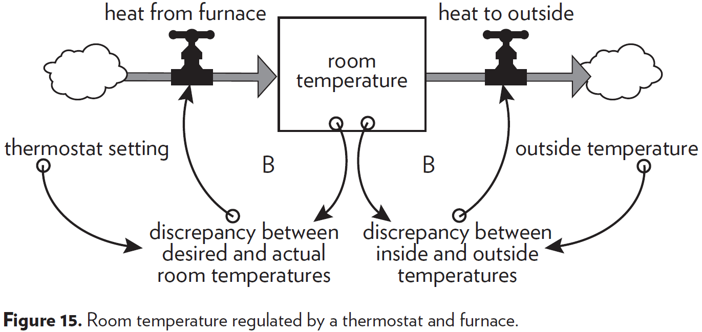
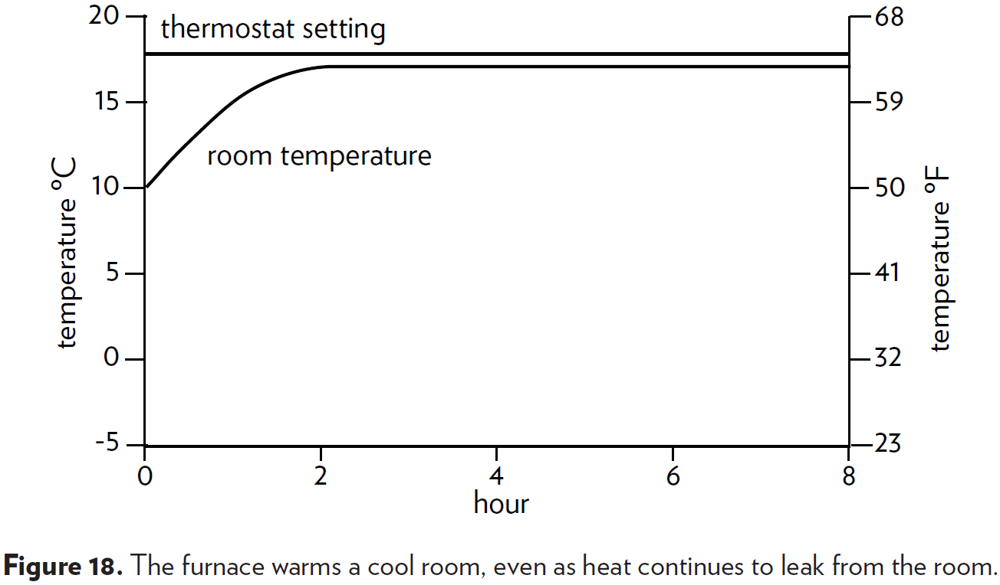
- It’s similar to trying to fill a bucket with water, except that the bucket has a hole in the bottom.
- But to make things worse, water leaking out of the hole is governed by a feedback loop.
- E.g. The more water in the bucket, the more water pressure at the hole, so the more the outflow increases.
- An important general principle of systems thinking is that information delivered by a feedback loop can only affect future behavior.
- It can’t deliver a signal fast enough to correct the behavior that drove the current feedback.
- This is important because it means that there will always be a delay in responding.
- A flow can’t react instantly to a flow, it can react only to a change in stock. This is a property of all feedback loop systems.
- Every balancing feedback loop has its breakdown point, where other loops pull the stock away from its goal more strongly than it can pull back.
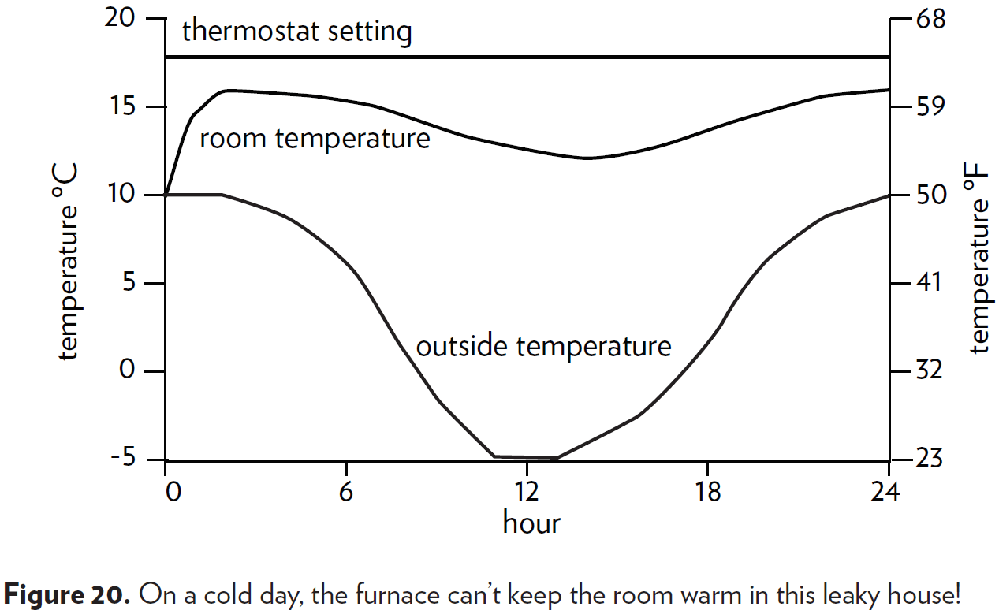
- What if the system has one reinforcing loop and one balancing loop? This type of system describes every living population and every economy.
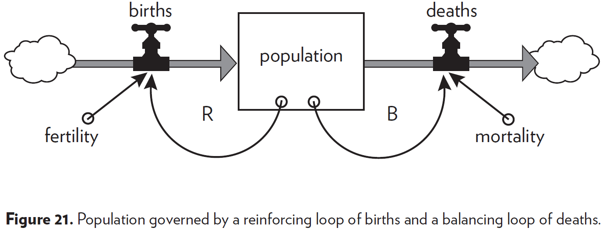
- These systems exhibit shifting dominance of feedback loops.
- Dominance is an important concept in systems thinking. When one loop dominates another, it has a stronger impact on behavior.
- When no loops dominate, the system is in dynamic equilibrium.
- Complex behaviors of systems often arise as the relative strengths of feedback loops shift, causing one loop to dominate and then another.
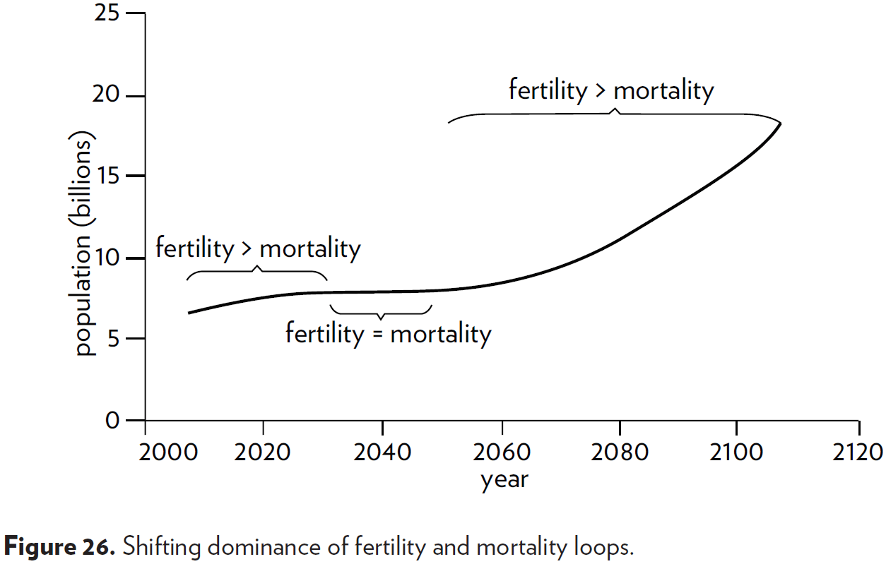
- Dynamic system studies usually aren’t designed to predict what will happen. They’re designed to explore what would happen if a variable unfolded in different ways.
- System dynamics models explore possible futures and ask “what if” questions.
- Questions for testing the value of a model
    1. Are the driving factors likely to unfold this way?
    2. If they did, would the system react this way?
    3. What is driving the driving factors?
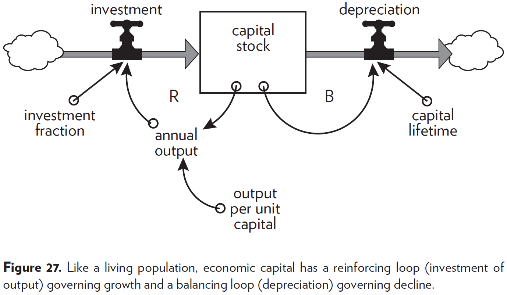
- Like a population, if the capital stock grows, more goods can be produced each year which means more capital stock.
- However, capital stock also faces “death” in the form of depreciation. Goods break down and become obsolete.
- While a capital system and a population system seem unrelated on the surface, from a system’s point of view, both have one important feature in common, their feedback-loop structures.
- Both systems are controlled by a reinforcing growth loop and a balancing death loop.
- Systems with similar feedback structures produce similar dynamic behaviors.
- A delay in a balancing feedback loop makes a system likely to oscillate.
- To dampen the oscillations, increase the delay of the balancing loop.
- Changing the length of a delay may make a large change in the behavior of a system.

### Two-Stock Systems

- The systems we’ve seen so far haven’t included constraints imposed by their surroundings.
- E.g. Capital stock didn’t require raw materials, population didn’t need food, thermostat didn’t need fuel.
- In physical, exponentially growing systems, there must be at least one reinforcing loop driving the growth and at least one balancing loop constraining the growth, because no physical system can grow forever in a finite environment.
- E.g. A new product will saturate the market, a virus will run out of susceptible people to infect, an economy is constrained by its capital/labor/resources/pollution, evolution will eventually reach a peak intelligence.
- The limits on a growing system may be temporary or permanent. The system may find ways to get around the limits but eventually, there must be some kind of accommodation.
- There are two types of stock
    - Nonrenewable
    - Renewable
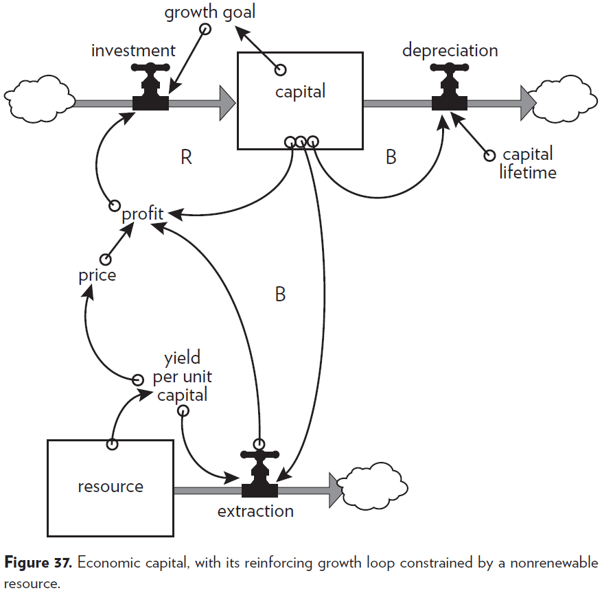
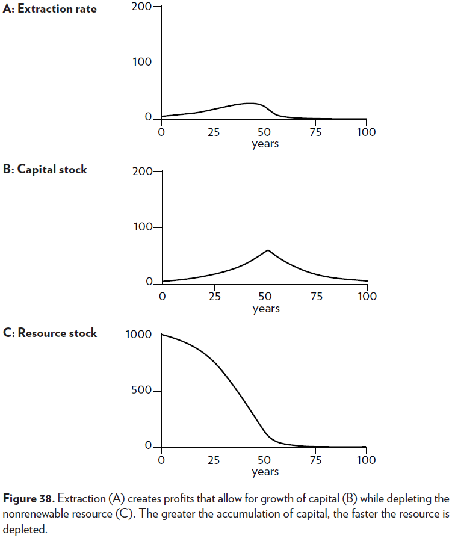
- A quantity growing exponentially toward a limit reaches that limit in a surprisingly short time.
- The higher and faster you grow, the farther and faster you fall.
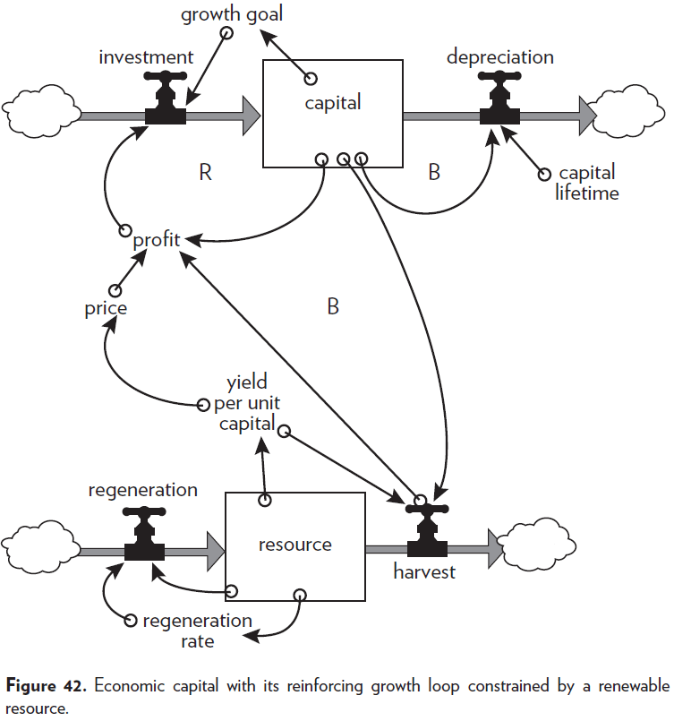

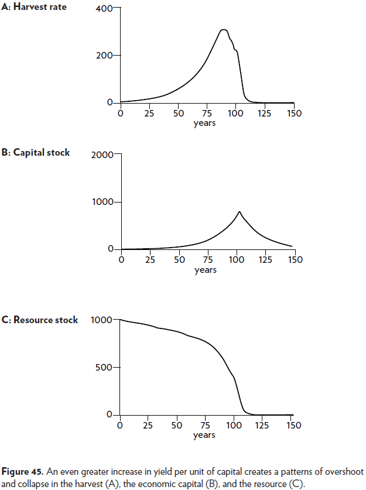
- If a renewable resource is over-harvested, it becomes a nonrenewable resource.
- Nonrenewable resources are stock-limited. The entire stock is available at once and can be extracted at any rate. But the faster the extraction, the shorter the lifetime of the resource.
- Renewable resources are flow-limited. The resource can support extraction indefinitely but for only as long as the outflow rate is equal to the inflow/regeneration rate.
- Three possible outcomes of renewable resource systems
    1. Overshoot and adjust to a sustainable equilibrium.
    2. Overshoot beyond equilibrium followed by oscillations around it.
    3. Overshoot followed by collapse of the resource and the systems that depend on it.
- Which outcome occurs depends on two things
    1. The critical threshold beyond which the resource’s ability to regenerate itself is damaged.
    2. The rapidity and effectiveness of the balancing feedback loop.
- Neither nonrenewable nor renewable limits to growth allow a physical stock to grow forever, but the constraints they impose are different. The difference comes because of the difference between stocks and flows.
- The trick, as with all complex systems, is to recognize what structures contain which latent behaviors, and what conditions release those behaviors.

# Part Two: Systems and Us

## Chapter 3: Why Systems Work So Well

- Chapter two showed us simple systems that create their own behavior based on their structures.
- If pushed too far, systems may fall apart or exhibit weird behavior.
- But normally, systems manage to do as they’re expected. They can work so well.
- Three properties of systems that work well
    1. Resilience: a measure of a system’s ability to survive and persist within a changing environment.
    2. Self-organization: the capacity of a system to make its own structure more complex.
    3. Hierarchy: the arrangement of systems and subsystems.

### Resilience

- Resilience emerges from a rich structure of many feedback loops that work in different ways to restore a system after a large perturbation.
- There’s also meta-resilience, a set of feedback loops that can restore/rebuild feedback loops.
- Even higher meta-resilience comes from feedback loops that can learn, create, design, and evolve. Such system are self-organizing.
- E.g. Humans and ecosystems.
- There are always limits to resilience.
- There’s a distinction between static stability and resilience.
- Static stability is something we can see and measure. Resilience is something that’s difficult to see and measure unless you exceed its limits.
- Because resilience may not be obvious without a whole-system view, people often sacrifice resilience for stability or some other more immediately recognizable system property.
- E.g. Injecting a cow with genetically engineered bovine growth hormone increases milk production without proportionately increasing the cow’s food intake. The hormone diverts some of the cow’s energy from other bodily functions to milk production but this lowers resilience. The cow is less healthy, less long-lived, and more dependent on humans.
- E.g. Hundreds of years of forest management in Europe have replaced native ecosystems with a single species of trees. This increased wood and pulp production at the cost of a resilient ecosystem as the single species could be wiped out by disease.
- Systems need to be managed not only for productivity or stability, but they also need to be managed for resilience, the ability to recover from perturbation, the ability to restore and repair themselves.
- Loss of resilience can come as a surprise, because the system usually is more focused on playing rather than on its playing space.

### Self-organization

- Self-organization is such a common property that we take it for granted.
- E.g. Creating an organism from a single cell, taking ideas of burning coal into building a city.
- Like resilience, self-organization is often sacrificed for the purposes of short-term productivity and stability.
- Self-organization produces heterogeneity and unpredictability.
- It requires freedom and experimentation, and a certain amount of disorder.
- Fractals are an example of self-organization.
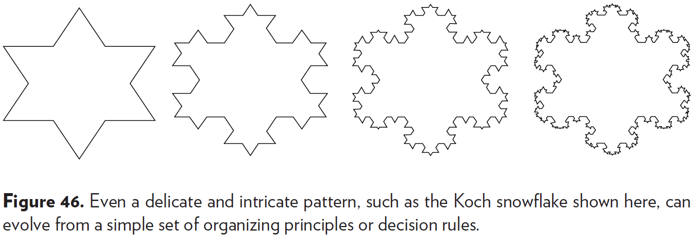
- Out of simple rules of self-organization can grow enormous, complex systems.
- Science itself is a self-organizing system, believing that all of the complexity of the world must arise from simple rules.

### Hierarchy

- In the process of creating new structures of increasing complexity, one property that a self-organizing system often generates is hierarchy.
- Complex systems can evolve from simple systems only if there are stable intermediate forms.
- E.g. Compare two watchmakers, one that can build a watch in modules and one that must build a watch all at once. The one that builds in modules can be interrupted and lose only one module while the other watchmaker, when interrupted, loses the entire watch.
- Hierarchies not only given a system stability and resilience, but they also reduce the amount of information that any part of the system has to keep track of.
- In hierarchical systems, relationships within each subsystem is stronger than relationships between subsystems.
- Low coupling between subsystems, high cohesion within subsystems.
- E.g. People talk more to others in their department than other departments. Cells in the liver talk more to other liver cells than to heart cells.
- Hierarchical systems are partially decomposable and some subsystems can partially function on their own.
- However, while reductionism works well to understand the parts, we must not lose sight of the whole.
- Hierarchies evolve from the lowest level up.
- E.g. From cell to organ to organism, from money to assets to economy, from individual to community to society.
- The original purpose of a hierarchy is always to help its originating subsystems do their jobs better.
- Often, we forget this purpose of hierarchy.
- E.g. A team member being more interested in personal glory than in the team winning. A cell desiring more replication and thus becoming cancer. A brain area invading another area.
- *Suboptimization*: when a subsystem’s goals dominate at the expense of the total system’s goals.
- The reverse is also a problem when the top of the hierarchy exerts too much control.
- E.g. Micromanaging bosses, communism, extreme bureaucracy.
- To be highly functional, hierarchies must balance the autonomy of subsystems and the central control of the total system.
- Hierarchical systems evolve from the bottom up. The purpose of the upper layers of the hierarchy is to serve the purposes of the lower layers.

## Chapter 4: Why Systems Surprise Us

- The acquisition of knowledge always involves the revelation of ignorance.
- Our knowledge of the world instructs us that the world is greater than our knowledge of it.
- Systems thinking reminds us of three truths
    1. Everything we think we know about the world is a model.
    2. Our models usually have a strong match with the world.
    3. Our models fall far short of representing the world fully.
- This book is on a duality between knowing enough about how the world works, but not nearly enough.
- Systems fool us by presenting themselves (or we fool ourselves) as a series of events.
- Events are like the tip of an iceberg, the most visible but not the most important.
- We’re less likely to be surprised if we can see how events accumulate into dynamic patterns of behavior.
- The behavior of a system is its performance over time.
- E.g. Growth, stagnation, decline, oscillation, randomness, evolution.
- Behavior-level understanding is deeper than event-level understanding.
- The long-term behavior of a system provides clues to the underlying system structure. And the structure is key to understanding not just what is happening, but why.
- The structure of a system is its relationships between stocks, flows and feedback loops.
- System structure is the source of system behavior. System behavior reveals itself as a series of events over time.
- System thinking goes repeatedly between structure (stocks, flows, feedback) and behavior (time graphs).
- The distinction between event, behavior, and structure.
- Behavior-based models are more useful than event-based models, but they still fall short by overemphasizing flows and under-emphasizing stocks.
- Another issue with behavior-based models is that they try to find non-existent statistical links between flows.
- Flows don’t change in response to other flows, flows change in response to stocks.
- This is the same case in The Book of Why called mediation. Two variables may be correlated to each other because of a mediating third variable that changes both.
- E.g. The relationship between how much heat a furnace outputs and the outside temperature may hold in the short-term. But the relationship doesn’t take into account the room temperature that is affected by both.
- *Linear relationship*: an increase in input is matched with the same increase in output.
- E.g. Putting in 10 pounds of fertilizer increases yield by 2 bushels. Putting in 20 pounds of fertilizer increases yield by 4 bushels. Putting in 30 pounds of fertilizer increase yield by 6 bushels. Increasing fertilizer by 10 pounds is always matched by an increase of 2 bushels.
- *Nonlinear relationship*: an increase in input isn’t matched with the same increase in output.
- E.g. Putting 100 pounds of fertilizer increase yield by 10 bushels. Putting 200 pounds of fertilizer doesn’t increase yield. Putting 300 pounds of fertilizer decreases yield. Adding too much of a good thing has damaged the soil.
- The world is full of nonlinearities.
- Nonlinearities are important not only because they confound our expectations, but also because they change the relative strengths of feedback loops.
- The clouds in systems diagrams are a prime source of system surprises.
- Clouds mark a nonexistent boundary in the real world and are only used to simplify system diagrams.
- Beware of clouds!
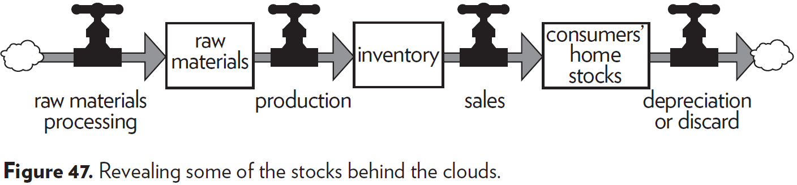
- Everything physical comes from somewhere, everything goes somewhere, everything keeps moving.
- If we’re to understand systems, we must simplify and abstract away unnecessary details.
- There are no separate systems. There world is a continuum. Where to draw a boundary around a system depends on the purpose of the discussion.
- However, systems analysts often fall into the opposite trap of making boundaries too large.
- A system too large and complex reduces understanding and is often unnecessary. The devil isn’t in the details, it’s in the big picture.
- Many arguments have to do with boundaries
    - National boundaries
    - Ethnic boundaries
    - Rich and poor
    - People alive now and people who will come in the future
- Remember that boundaries are of our own making, and that they can and should be reconsidered for each new discussion, problem, or purpose.
- *Limiting factor*: the bottleneck of a system, what prevents it from changing faster.
- The most important input to a system is the one that’s most limiting.
- Insight comes from not only recognizing which factor is limiting, but from also seeing that growth itself depletes or enhances limits, and therefore changes what’s limiting.
- Perpetual growth is impossible. Ultimately, the choice isn’t to grow forever, but to decide what limits to live within.
- There will always be limits to growth. Whether they be self-imposed or system-imposed.
- We are surprised over and over again at how much time things take.
- Delays are ubiquitous in systems. Every stock is a delay and most flows have delays.
- E.g. Shipping delays, perception delays, processing delays, communication delays.
- Delays determine how fast systems can react.
- Overshoots, oscillations, and collapses are always caused by delays.
- When there are long delays in feedback loops. some sort of foresight is essential. To act only when a problem becomes obvious is to miss an important opportunity to solve the problem.
- *Bounded rationality*: people make reasonable decisions based on the information they have.
- People don't have perfect information such as information on the more distant parts of the system.
- E.g. Environmentalists don't deal with the pressure that oil-company managers face. Fishermen don't know how many fish are caught by other fishermen.
- Seeing how individual decisions are rational within the bounds of the information available doesn't provide an excuse for narrow-minded behavior.
- It provides an understanding of why that behavior arises.
- Blaming the individual rarely helps to create a more desirable outcome.
- Changes from from stepping outside of the boundaries of information.
- The bounded rationality of each actor in a system may not lead to decisions that further the welfare of the system as a whole.

## Chapter 5: System Traps … and Opportunities

- Being less surprised by complex systems is a matter of learning to expect, appreciate, and use the world’s complexity.
- *Archetypes*: system structures that produce common patterns of problematic behavior.
- E.g. Addiction, escalation, drift to low performance.
- System traps can be escaped by recognizing and avoiding them in advance or by altering their structure.
- System traps are opportunities for improvement.

### Policy Resistance

- Fixes that fail to achieve their goal.
- E.g. The war on drugs, job creation policies, healthcare cost reduction policies.
- Policy resistance comes from the bounded rationalities of the actors in a system, each with their own goal.
- E.g. Addicts want to keep a high stock of drugs, law enforcement wants the opposite, drug dealers want to keep it right in the middle to stabilize prices, and the average citizen just wants to be safe.
- In a policy-resistant system, everyone has to put in great effort into keeping the system where no one wants it to be.
- There are three solutions
    - Overpower the policy.
        - E.g. Romania’s ban on abortion.
    - Let go. Give up ineffective policies.
        - E.g. United States prohibition.
    - Find a way of aligning the various goals of the subsystems.
        - E.g. Sweden’s approach to increasing their population. They realized that the goal isn’t to have more children like in Romania or Hungary, the goal is to ensure that every child is wanted. Sweden make contraceptives and abortion free and make it easier to divorce.

### Tragedy of the Commons

- When there’s a commonly shared resource that every use benefits from but shares the cost of its abuse with everyone else.
- Each individual only seeks to maximize their gain but doesn’t take into account the condition of the common resource.
- The tragedy of the commons comes from missing/delayed/weak feedback from the resource to the growth of the users of that resource.
- E.g. Climate change due to global warming. Extinct fish species due to overfishing.
- It’s the overexploitation of renewable resources. The consequence is overuse of the resource, eroding it until it becomes unavailable to anyone.
- There are three solutions
    - Educate and exhort. Help people see the consequences of unrestrained use of the commons.
    - Privatize the commons. Each person reaps the consequences of their own actions.
    - Regulate the commons. Mutual coercion, mutually agreed upon.
- The first solution depends on people’s trust and them honoring the agreement which isn’t good.
- The second solution depends on being able to divide the common resource which isn’t possible at times.
- E.g. Atmosphere, fish of the sea.
- The third solution is quite common in everyday life.
- E.g. Traffic lights, parking spaces, radio spectrum bands.

### Drift to Low Performance

- Some systems not only resist policy and stay in a normal bad state, they keep getting worse.
- E.g. Falling market share of a business, doctors after they’ve been out of school.
- The actor tends to believe bad news more than good news.
- The desired state of the system is influenced by the perceived stated.
- E.g. “That’s about all you can expect”, “We’re not doing much worse than we were last year”, “Everybody else is having trouble too”.
- Another name for this trap is “eroding goals” or “boiled frog syndrome”.
- Drift to low performance is a gradual process.
- There are two solutions
    - Keep standards absolute.
    - Make goals sensitive to the best performances of the past, instead of the worst.
- The reinforcing loop going downwards, “the worse things gets, the worse I’m going to let them get” becomes a loop going upwards, “the better things get, the harder I’m going to work to make them even better”.

### Escalation

- Escalation comes from a reinforcing loop set up by competing actors trying to get ahead of each other.
- Escalation isn’t necessarily a bad thing.
- It could be escalation towards a cure for cancer or a vaccine.
- But when escalating hostility, weaponry, or force, this is an insidious trap.
- E.g. Arms races.
- Escalation isn’t just about keeping up, but also about keeping slightly ahead.
- E.g. US and Soviet Union exaggerating reports of each other’s armaments to justify more armaments of their own.
- E.g. Underpricing in a competitive market, bidding at an auction, the increasing loudness of conversations at parties.
- Escalation, being a reinforcing feedback loop, builds exponentially.
- There are two solutions
    - Deliberately reducing your own system state to induce reductions in your competitor’s state.
    - Negotiate a disarmament to introduce balancing loops.
    - Avoiding it in the first place.

### Competitive Exclusion

- Also called “success to the successful”.
- This trap is found when winners of a competition receives, as part of the reward, the means to compete even more effectively in the future.
- It’s a reinforcing feedback loop that divides a system into winners who go on winning, and losers who go on losing.
- E.g. A species with an advantage at getting a core resource over another species will be able to reproduce more, thus getting more of the resource and driving it’s competitor extinct.
- E.g. Monopolies.
- Market competition systematically eliminates market competition.
- There are a few solutions
    - Diversify. Get out of that niche/market/space and carve out your own.
    - Balancing feedback loops.
        - E.g. Antitrust laws.
    - Leveling the playing fields.
        - E.g. Restarting the game of Monopoly.

### Addiction

- Most people are familiar with addictive substances such as alcohol, drugs, sugar, and caffeine.
- However, not everyone recognizes the addiction that appears in larger systems.
- E.g. Dependence on government subsidies, farmer’s reliance on fertilizer, the addiction to power.
- Addiction may not be bad if it’s done purposefully and is monitored closely.
- Addiction can be avoided by strengthening the ability of the system to shoulder its own burdens.
- Take the focus off short-term relief and put it on long-term restructuring.

### Rule Beating

- *Rule beating*: evasive action to get around the intent of a system’s rules.
- E.g. Organizations spending pointless money at the end of the year to use their entire yearly budget.
- Rule beating produces the appearance of following the rules but doesn’t follow the intention behind the rule.
- One solution is to use the feedback from rule beating to revise, improve, rescind, or better explain the rules.
- This is the same problem encountered by AI ethic researchers. Sometimes what we say isn’t what we want.

### Seeking the Wrong Goal

- Systems have a tendency to product exactly and only what you ask them to produce.
- Be careful of what you ask for.
- E.g. If the desired system state is national security, and that’s defined as the amount of money spent on the military, the system will produce military spending. It may or may not produce national security.
- E.g. If the desired system state is good education, and that’s defined by performance on standardized tests, then the system will produce students that do well on those tests. Whether this measure is correlated with good education is worth thinking about.
- These examples confuse effort with result.
- E.g. GNP doesn’t reflect our well-being. GNP goes up when there are more car accidents and goes down when efficient light bulbs are used. GNP is a measure of throughput.
- Seeking the wrong goal is a system characteristic almost opposite from rule beating. In the first case, you follow the goal but it doesn’t align with what you want. In the second case, you don’t follow the goal but it does align with what you want.
- Seeking the wrong goal is when we are sensitive to the goals of feedback loops.

# Part Three: Creating Change - in Systems and in Our Philosophy

## Chapter 6: Leverage Points - Places to Intervene in a System

- *Leverage points*: places in the system where a small change could lead to a large shift in behavior.
- Leverage points are points of power and are embedded in our culture.
- E.g. The silver bullet, miracle cure, secret passage, magic password, hero.
- While people deeply involved in a system often intuitively know where to find leverage points, they often push the change in the wrong direction.
- Leverage points are counterintuitive.
- A list of leverage points to look for in increasing leverage/power.
    1. Numbers
        - Changing variables rarely changes the behavior of the national economy system.
        - Numbers aren’t boundaries of good and bad. Often there is a gray area that benefits all parties.
    2. Buffers
        - Stocks that are big, relative to their flows, are more stable than small ones.
        - E.g. Lake vs river flood, bank account balance.
        - You can stabilize a system by increasing it’s buffer. But if the buffer’s too big, the system gets inflexible and reacts slowly.
    3. Stock-and-Flow Structures
        - Physical structure is crucial in a system but is rarely a leverage point.
        - The leverage point is in proper design in the first place.
    4. Delays
        - The lengths of time relative to the rates of system change.
        - A system just can’t respond to short-term changes when it has long-term delays.
        - A delay in the feedback process is critical relative to rates of change in the stocks that the feedback loop is trying to control.
        - Delays that are too short cause large oscillations while delays that are too long cause damped, sustained oscillations.
    5. Balancing Feedback Loops
        - Now we’re moving from the physical parts of a system to the information and control parts, where more leverage can be found.
        - Balancing feedback loops are used to keep important stocks within safe bounds.
        - Some loops are inactive most of the time, but their presence is critical to the long-term welfare of the system.
        - E.g. Sweating, emergency cooling system, fire hydrants.
        - The strength of a balancing feedback loop is important relative to the impact it’s designed to correct.
        - E.g. If the impact gets bigger, the feedback loop should also get bigger.
    6. Reinforcing Feedback Loops
        - A balancing feedback loop is self-correcting, a reinforcing feedback loop is self-reinforcing.
        - Reducing the growth around a reinforcing loop is usually a more powerful leverage point than strengthening balancing loops.
    7. Information Flows
        - The structure of who does and who doesn’t have access to information.
        - Information flows are usually cheaper to implement than physical flows.
        - E.g. Putting a city’s water intake pipe downstream from it’s wastewater outflow pipe. Having the politicians who declare war to also be on the front lines of that war.
        - There’s a systematic tendency of people to avoid accountability for their own decisions.
    8. Rules
        - Incentives, punishments, constraints.
        - Constitutions are the strongest examples of social rules.
        - Physical laws are absolute rules, whether we understand them or not, or like them or not.
        - E.g. Gravity, second law of thermodynamics.
        - To show the power of rules, imagine different ones.
        - E.g. Suppose you can to college when you wanted to learn something, and you leave when you’ve learned it. Suppose tenure was awarded to professors according to their ability to solve real-world problems, rather than to publish academic papers. Suppose a class got graded as a group, instead of as individuals.
        - As we try to image restructured rules and what our behavior would be under them, we come to understand the power of rules.
    9. Self-Organization
        - The power to add, change, or evolve system structure.
        - Is done by adding completely new physical structures or by adding new balancing/reinforcing loops.
        - E.g. Adding a brain, wings, or computers.
        - The ability to self-organize is the strongest form of system resilience.
        - A system that can evolve can survive almost any change, by changing itself.
        - Self-organization can evolve from a set of simple rules, emergence.
        - E.g. DNA, technology, fractals.
        - Self-organization is basically a matter of an evolutionary raw material, a highly variable stock of information from which to select possible patterns, and a means for experimentation, for selecting and testing new patterns.
        - E.g. For biological evolution, the raw material is DNA, changes occur through spontaneous mutation, and testing is done through changing environments in which some individuals don’t survive to reproduce.
        - E.g. For technology, the raw material is the body of accumulated science, changes occur through human creativity, and testing is done through market reward or government funding or whatever meets human needs.
        - E.g. For culture, the raw material is the meme, changes occur through human creativity, and testing is done through internet points or fame or some other reward.
    10. Goals
        - The purpose or function of the system.
        - Goals are stronger than any leverage point in the above list as they control almost all parts of the system.
    11. Paradigms
        - The mind-set out of which the system, its goals, structure, rules, delays, and parameters, arise.
        - E.g. That money holds value, that nature is a stock of resources, that we can own land.
        - People who’ve managed to intervene in systems at the level of paradigm have hit a leverage point that totally transforms and creates systems.
        - E.g. Copernicus with heliocentrism, Einstein with relativity, Smith with the wealth of nations.
    12. Transcending Paradigms
        - To realize that no paradigm is true.
        - The intuition that paradigms have paradigms.
- There are exceptions to every item in this list and the order is flexible.
- The higher the leverage point, the more the system will resist changing it.

## Chapter 7: Living in a World of Systems

- A mistake of system thinkers is that this knowledge of systems theory is enough to predict and control the world.
- Systems can’t be controlled, but they can be designed and redesigned.
- General systems wisdom
    - Get the Beat of the System
        - Observe a system’s behavior.
        - Watching what really happens.
    - Expose Your Mental Models to the Light of Day
        - Draw structural diagrams to expose assumptions.
    - Honor, Respect, and Distribute Information
        - Information is power.
    - Use Language with Care and Enrich It with Systems Concepts
        - Our information streams are mostly made up of language.
        - Respect language by keeping it concrete, meaningful, and truthful.
        - Enlarge language to make it consistent with our enlarged understanding of systems.
    - Pay Attention to What Is Important, Not Just What Is Quantifiable
        - Our culture is obsessed with numbers.
        - We take quantity over quality.
        - Human beings have been endowed not only with the ability to count, but also with the ability to assess quality.
    - Make Feedback Policies for Feedback Systems
        - Design learning into the management process.
    - Go for the Good of the Whole
        - Remember that hierarchies exist to serve the bottom layers.
        - Don’t optimize parts of a system while ignoring the whole.
        - Aim to enhance total systems properties, whether they’re easily measured or not.
        - E.g. Growth, stability, diversity, resilience, sustainability.
    - Listen to the Wisdom of the System
    - Locate Responsibility in the System
    - Stay Humble - Stay a Learner
        - It takes a lot of courage to embrace your errors.
    - Celebrate Complexity
        - The universe is messy, nonlinear, turbulent, and dynamic.
    - Expand Time Horizons
        - In a systems sense, there is no long-term, short-term distinction.
        - Actions taken now have some immediate effects and some that radiate out for decades to come.
    - Defy the Disciplines
    - Expand the Boundary of Caring
    - Don’t Erode the Goal of Goodness
