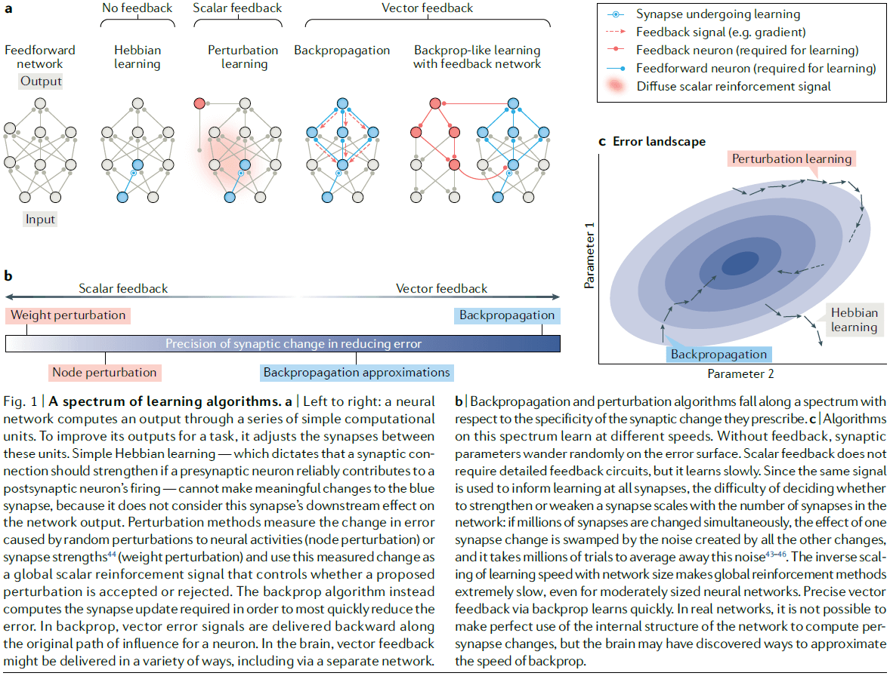
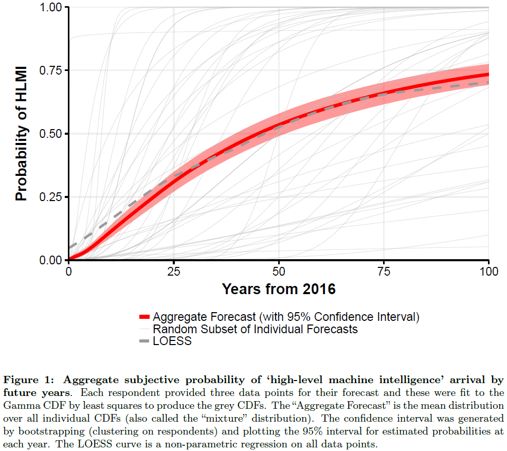
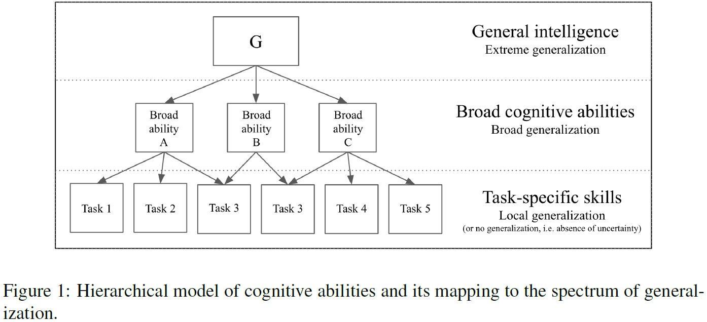
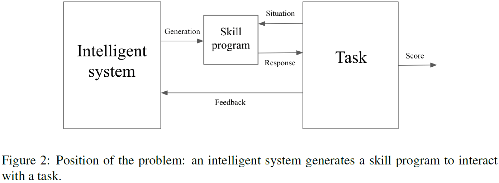
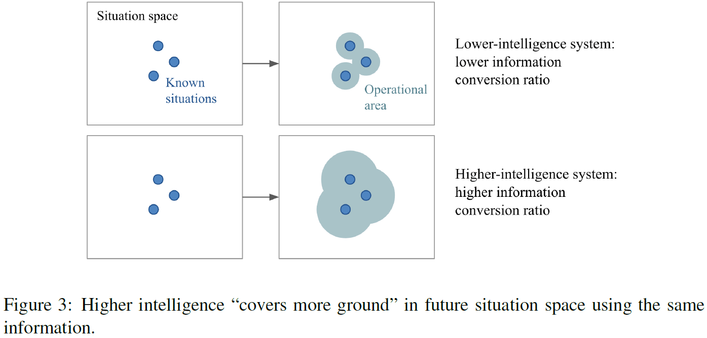

## [Neuroscience-Inspired Artificial Intelligence](https://doi.org/10.1016/j.neuron.2017.06.011)

- Communication and collaboration between the fields of neuroscience and artificial intelligence has become less common.
- Building AGI is a daunting task because the search space of possible solutions is vast and sparse.
- The human brain is the only existing proof that such intelligence is possible.
- Two benefits of neuro-inspired AI
    - Neuroscience provides a rich source of inspiration for new types of algorithms and architectures.
    - Neuroscience can provide validation of AI techniques that already exist.
- From a practical standpoint of building AGI, we don’t need to slavishly enforce adherence to biological plausibility.
- From an engineering perspective, what works is ultimately all that matters.
- We should focus on the top two levels of Marr’s three levels of analysis, the computational and algorithmic level.
- Ignoring the implementation level is where AI differs from the Blue Brain Project or the field of neuromorphic computing.
- Four cases where recent developments have been guided by neuroscientific ideas
    - Attention
    - Episodic memory
    - Working memory
    - Continual learning
- Where neuroscience can help AI
    - Intuitive understanding of the physical world
    - Efficient learning
    - Transfer learning
    - Imagination and planning
    - Virtual brain analytics
- The past contributions of neuroscience to AI have rarely involved a simple transfer of full-fledged solutions that could be directly re-implemented in machines.
- Rather, neuroscience has been useful in a subtler way, stimulating algorithmic-level questions about facets of animal learning and intelligence.

## [Deep Learning: A Critical Appraisal](https://arxiv.org/abs/1801.00631)

- Paper details ten concerns for deep learning (DL).
- Is deep learning approaching a wall?
    - The purpose of this paper is to both temper some irrational exuberance regarding DL and to also consider what we (as a field) might need in order to move forward.
    - This is a good moment for critical reflection on what DL has and hasn’t been able to achieve.
- What deep learning is, and what it does well
    - Deep Learning (DL): a statistical technique for classifying patterns using neural networks with multiple layers.
    - Review of neural networks, back-propagation, convolutional neural networks, and object recognition.
- Ten limits on the scope of deep learning
    1. DL is data hungry
        - Compared to humans, deep learning requires much more data.
    2. DL is shallow and has limited capacity for transfer
        - Transfer tests, which are tests where the scenario differs in minor ways from the trained scenarios, show that deep reinforcement learning’s solutions are often superficial.
        - E.g. Moving the height of the paddle in the Breakout game.
    3. DL has no natural way to deal with hierarchical structure
        - The core problem is that DL learns correlations between sets of features that themselves are flat/nonhierarchical.
    4. DL has struggled with open-ended inference
        - E.g. Reading between the lines.
    5. DL isn’t transparent enough
        - Neural networks have millions or billions of parameters that aren’t human interpretable.
    6. DL hasn’t been well integrated with prior knowledge
        - There isn’t an explicit encoding of knowledge.
        - E.g. DL can’t take advantage of Newton’s laws and must approximate it.
        - DL researchers have a very strong bias against including prior knowledge even when that prior knowledge is well known and is useful.
        - It isn’t straight forward how to integrate prior knowledge into DL systems because DL systems represent knowledge mainly as correlations between features, rather than abstractions like quantified statements.
        - Common sense reasoning also remains outside the realm of DL.
    7. DL can’t distinguish causation from correlation
        - E.g. There’s a correlation between a child’s height and vocabulary, but less easily represented is that the correlation derives from growth and development. Kids get bigger as they learn more words, but that doesn’t mean that growing tall causes them to learn more words, nor that learning new words causes them to grow.
    8. DL presumes a largely stable world, in ways that may be problematic
        - E.g. Google Flu Trends that failed to predict the 2013 flu season.
    9. DL works well as an approximation, but its answer often can’t be fully trusted
        - E.g. DL systems that mistake slightly defaced stop signs as speed limit signs.
    10. DL is difficult to engineer with
        - It’s difficult to guarantee that DL systems will work in alternative circumstances with novel data that may not resemble previous training data.
        - DL isn’t made of simpler systems with guaranteed performance and reliability.
- In general, DL is a perfectly fine way of optimizing a complex system for representing a mapping between inputs and outputs, given a sufficiently large data set.
- DL is just another statistical technique.
- Potential risks of excessive hype
    - One of the biggest risks in overhyping AI is another AI winter.
    - The author personally fears that the field of AI could get trapped in a local minimum, dwelling too heavily in a wrong part of intellectual space.
- What would be better?
    - We need to reconceptualize DL not as a universal solvent, but simply as one tool among many.
    - Four future avenues of research
        - Unsupervised learning
        - Symbol-manipulation and hybrid models
        - Insights from cognitive and developmental psychology
        - Bolder challenges

## [Backpropagation and the brain](https://www.nature.com/articles/s41583-020-0277-3)

- Does backpropagation offer insights for understanding learning in the human brain?
- Although the brain modifies synapses to learn, it’s not understood how these changes are orchestrated across the entire brain to achieve the network’s goal.
- Backpropagation (backprop): the use of error signals sent through feedback connections to adjust synapses.
- However, the brain appears to use its feedback connections for different purposes.
- Paper argues that in spite of these apparent differences, the brain has the capacity to implement the core principles underlying backprop.
- Synaptic weights → Neural activity → Network’s output → Network’s error.
- We can reduce the network’s error by making small changes in synaptic weights.
- It’s difficult to decide the changes because a synapse’s strength doesn’t directly influence the network’s output.
- The radius of a synapse’s influence, it’s projective field, rapidly expands along the network, so the effect of changing the synapse strength depends on the strengths of the subsequently connected synapses.

- One way to decide synaptic strength changes is through weight perturbation or by adding noise to each synapse and seeing how it affects the error.
- However, weight perturbation is inefficient and requires a lot of trial-and-error.
- Backprop addresses the efficiency issue by computing, rather than measuring, how a change in synapse strength will affect the network’s error.
- This computation is possible because we have access to the exact causal relationship between the synapse strengths and the network’s output.
- The key to backprop is the application of the chain rule (from calculus) to recursively compute the error signals.
- Credit assignment: determining which parameter, such as a synaptic weight, contributed to the magnitude of the error signal.
- Backprop falls under a more general mechanism known as credit assignment.
- Note that backprop doesn’t need to be a difference between an output and a supervised target. It can also be a temporal difference or a policy gradient or a prediction error.
- An important empirical feature of backprop is its ability to quickly find good internal representations of inputs.
- Internal representations aren’t specified explicitly by the input/output targets.
- Two critical features of backprop (that are also shared by the brain)
    - The prescription of synapse-specific changes.
    - The requirement for feedback connections that deliver error information to neurons.
- It isn’t clear what role feedback connections play in cortical computations, so we can’t say that the cortex employs backprop-like learning.
- There is no direct evidence that the brain uses a backprop-like algorithm for learning.
- To our knowledge, no one in the ML community has been able to train high-performing deep networks on difficult tasks such as classifying the objects in ImageNet photos using any algorithm other than backprop.
- Findings are consistent with the hypothesis that feedback connections in the cortex drive learning across multiple layers of representation.
- Three major difficulties in implementing backprop in biological circuits
    - Backprop demands synaptic symmetry in the forward and backward paths.
        - Retrograde neuronal communication was used to try to implement the backpropagating error signal but this idea has been abandoned because it’s too slow.
        - Weight transport problem: the need to have the same weight on two different connections.
        - Feedback alignment: networks with fixed random feedback weights learn to approximately align their feedforward synaptic weights to their feedback weights.
        - Feedback alignment suggests that feedback connections don’t need to be symmetric to their feedforward counterparts to deliver useful information and provides evidence that precise symmetry isn’t always required for effective learning.
    - Error signals are signed and potentially extreme-valued.
        - This problems is referred to as the problem of exploding/vanishing gradients.
        - We know that real synapses can’t flip signs (from excitation to inhibition) easily, nor can they represent extreme values due to space limitations at the synapse.
    - Feedback in brains alters neural activity.
        - In backprop, error signals don’t influence neurons but only synapses.
        - In the cortex, feedback connections can serve multiple roles such as driving activity or modulating it.
        - In other words, the feedback in the brain is more elaborate and richer compared to backprop.
- Neural gradient representation by activity differences (NGRAD): learning mechanisms that use differences in activity states to drive synaptic changes.
- NGRAD hypothesis: the idea that the cortex uses an NGRAD to perform an approximation to gradient descent.
- The fundamental idea is that top-down-driven activities drive learning without carrying explicit error information between layers.
- The use of locally available information to capture the error information that guides learning.
- Auto-encoder: a network that aims to reconstruct its own input.
- No existing algorithm for multilayer credit assignment can be matched with what we know about the neurophysiology of the cortex.
- To function in neural circuits, NGRADs must
    - Coordinate interactions between feedforward and feedback pathways.
    - Compute differences between patterns of neural activities.
    - Use this difference to make appropriate synaptic updates.
- The introduction of backpropagation generated excitement in the neuroscience community as a possible source of insight about learning in the cortex.
- However, interpreted literally, backprop has obvious biological implausibilities.
- E.g. ANNs violate Dale’s law, which states that neurons are either excitatory or inhibitory, not both.

## [The brain as artificial intelligence: prospecting the frontiers of neuroscience](https://link.springer.com/article/10.1007/s00146-018-0820-1)

- Paper explores the argument that the brain is a biologically-based form of artificial intelligence (AI).
- The history of AI is normally told in terms of three research strategies
    1. Neural networks
    2. Cybernetic systems
    3. Computational power
- The assumption that the way biological brains instantiate intelligence captures something deep about intelligence itself.
- Thomas Kuhn likened a scientific revolution to a Gestalt switch; a slight shift in perspective can cause a radical shift in understanding.
- E.g. No new facts are needed, just a new sense of the logic of their arrangement.
- The telescope and microscope distinction
    - Telescopes magnify known entities and enhances our knowledge without challenging our conceptual framework.
    - Microscopes provides access to unknown entities and may cause us to rethink our conceptual framework.
- We aren’t talking about literal telescopes and microscopes but rather brain-oriented technologies that may function like either.
- Generally, neuroscience approaches the brain with three types of instruments
    - Probes: electrodes implanted in the cortex.
    - Scans: magnetic resonance imaging of brain regions.
    - Drugs: targeting neurotransmitters.
- A common thread in William James’ thinking was that neuroscience should aim to enable our brains to make us more than who we have been.
- This goal has been given up to the researchers of expertise, not neuroscience.
- This paper is not very good and I would not recommend reading it.

## [What Can AI Get from Neuroscience?](http://www.neurolab.gatech.edu/wp/wp-content/uploads/potter/publications/Potter-NeuroscienceForAIchapter.pdf)

- The human brain is the best example of intelligence.
- Suppose we discovered an alien power plant that could produce power without any fuel, wouldn’t we want to know how it works so we can replicate it?
- If AI becomes more brain-like, it might also come closer to accomplishing the feats of natural intelligence (NI).
- Neuroscientists conduct their research in a reductionist manner; trying to keep up with neuroscience research is like trying to drink from a fire hose.
- General principles that could be applied to AI are hard to find in the overwhelming neuroscience literature.
- What do we already know about NI that can inform AI?
    - Brains aren’t digital computers. This was popularized by John von Neumann’s book “The Computer and the Brain” but the analogy is sometimes taken too far.
    - Brains don’t have a CPU. Brain processing is neither central nor a unit.
    - Memory mechanisms in the brain aren’t physically separable from processing mechanisms.
    - The brain is asynchronous and continuous. Many brain circuits exhibit oscillations but none keep the brain in lock-step the way a system clock does in a computer.
    - With NI, the details of the substrate matter.
        - Computers have been carefully designed so that the details of their implementation don’t influence their computations.
        - There’s a intentional separation between hardware and software.
        - This separation doesn’t exist in the brain.
        - Why should AI researchers care about the detailed molecular aspects of the brain?
        - Because fully duplicating brain functionality may only be possible using a substrate as complex and continuous as living brain cells and their components are.
        - This disappointing possibility shouldn’t keep us from trying to duplicate some brain functionality.
    - NI thrives on feedback and circular causality.
        - The nervous system is full of feedback at all levels.
        - Most sensory input is dynamic and changes based on feedback.
        - E.g. If a person doesn’t have enough information, they ask questions.
    - NI uses lots of sensors.
        - One of the biggest differences between NI and AI is the huge number of sensors NI uses.
        - Our brains are very good at making the best use of whatever sense data are available.
        - The continuous flow of information from the sense organs into the brain is enormous.
    - NI uses lots of cellular diversity.
        - There are more cell types and morphologies in the brain than in any other organ.
        - Another sign of brain complexity is the large amount of genetic information that codes for the brain.
    - NI uses lots of parallelism.
        - The brain’s degree of parallelism isn’t matched by any man-made device.
        - Brain circuits seem to have a small-world connectivity pattern.
        - E.g. Many local connections but few long-range connections.
    - Delays are part of the computation.
        - Modern computers are designed to reduce delays to have faster clocks and thus, faster processing.
        - The brain, however, uses the delay as time for processing.
        - The timing of APs carries information about the dynamics and statistics of the world.
        - E.g. Hebb’s rule and STDP.
        - The brain computes with timing, not Boolean logic.
- It’s time for AI to move in the brainward direction.

## [Building Machines That Learn and Think Like People](https://arxiv.org/abs/1604.00289)

- Paper argues that for machines to reach human levels of intelligence, they should
    - Build causal models of the world that support explanation and understanding.
    - Ground learning in intuitive theories of physics and psychology.
    - Harness compositionality and learning-to-learn to rapidly acquire and generalize knowledge to new tasks and situations.
- Review of the accomplishments of deep learning/neural networks.
- What does it mean for a machine to learn or think like a person?
- Sections of this paper
    1. Review some of the criteria offered by cognitive scientists and psychologists.
    2. State some of the essential ingredients the authors believe necessary for AI.
    3. Evaluate contemporary AI in light of these ingredients.
    4. Discuss the most plausible paths toward building machines that learn and think like people.
- Two different computational approaches to AI
    - Pattern recognition
    - Model-building
- It’s the difference between prediction and explanation.
- The goal of this paper is to propose a set of core ingredients for building more human-like learning and thinking machines.
- The first set of ingredients focuses on cognitive capabilities present early in development.
- Reasons for focusing on cognitive development
    - It’s active before the person attempts to learn the types of tasks discussed in this paper.
    - The earlier the ingredient is present, the more likely it is to be foundational.
- Two pieces of developmental start-up software
    - Intuitive physics: principles on the way object works such as object permanence and that they’re solid.
    - Intuitive psychology: principles on the way people behave such as theory of mind and copying.
- The second set of ingredients focuses on learning, specifically model building.
- Two pieces of model-building learning
    - Compositionality
    - Learning-to-learn
- The third set of ingredients focuses on the use of rich world models.
- It’s remarkable how fast we are to perceive and to act.
- Review of the cognitive and neural inspiration in AI history such as PDP.
- If ANNs can be trained to emulate the rule-like and structured behaviors that characterize cognition, do we need more to develop human-like learning and thinking machines?
- The claim that the mind is a collection of general purpose neural networks with few initial constraints is rather extreme in modern cognitive science.
- The first challenge in building human-level AI is handwritten character recognition.
- Even though the problem seems simple to us, it’s more difficult to implement in a machine.
- Current AI differs from people solving the problem in two core ways: people learn from fewer examples and they learn richer representations.
- E.g. People can learn to recognize a new handwritten character from a single example.
- People learn a lot more from a lot less information.
- The second challenge is the Atari game Frostbite.
- Success in the game requires a temporally extended plan to ensure the agent can accomplish each sub-goal.
- One program, Deep Q-learning Network (DQN), was able to play Frostbite but required a lot more experience and time compared to a professional gamer.
- The differences between the human and machine learning curves suggests that they may be learning different kinds of knowledge by using different learning mechanisms.
- Even non-professional humans can grasp the basics of the game after just a few minutes of playing.
- If humans are able to first watch an expert playing for a few minutes, they can learn even faster.
- Sparse feedback is another difficulty that current AI doesn’t deal with well.
- DQN is also inflexible as changes to the color or appearance of objects would have devastating consequences on performance.
- The contrast between DQN and human flexibility is striking.
- E.g. Imagine you’re tasked with playing Frostbite with any of these new goals: get the lowest possible score, beat your friend but not by much to not embarrass them, discover secret Easter eggs, or touch all ice floes only once.
- This range of goals highlights an essential component of human intelligence: that people can learn models and use them for arbitrary new tasks and goals.
- In contrast to AI, people require little to no retraining or reconfiguration when adding new tasks and goals.
- People never start completely from scratch, and this is the secret to their success.
- Human infants expect inanimate objects to follow the principles of persistence, continuity, cohesion, and solidity.
- These built-in principles are called intuitive physics and they may stem from our ability to simulate the physical world in our mind.
- Pre-verbal infants distinguish animate agents from inanimate objects.
- This is called intuitive psychology.
- It’s generally agreed that infants expect agents to act in a goal-directed, efficient, and socially sensitive manner.
- This ability to predict an agent’s actions may also stem from stimulating a person’s psychology such as their beliefs and goals.
- However, unlike in intuitive physics, simulation-based reasoning  in intuitive psychology can be nested recursively, meaning we can think about agents thinking about other agents.
- Intuitive psychology provides a basis for efficient learning from others, such as teaching with the goal of communicating knowledge efficiently.
- E.g. By watching an expert play, we can infer their beliefs, desires, intentions, and goals of the experienced player and copy them.
- Since their inception, neural network models have stressed the importance of learning.
- Supervised learning aims at improving the algorithm’s pattern recognition capabilities.
- Unsupervised learning aims to gradually match the statistics of the model’s internal patterns with the statistics of the input data.
- Even with just a few examples, people can learn remarkably rich conceptual models.
- Acquired knowledge supports reconfiguration to new tasks and new demands.
- E.g. Changing an object in a game to something else or adding a new goal to a system.
- This richness and flexibility suggests that learning as model building is a better metaphor than learning as pattern recognition.
- Three important ideas to understanding human learning
    - Compositionality: that new representations can be constructed through the combination of primitive elements.
    - Causality: when the result is because of some underlying process.
    - Learning-to-learn: refers to ways that learning new tasks can be accelerated through previous or parallel learning of other related tasks.
- New handwritten characters are created through composition as they’re made up of pen strokes and how these strokes connect together.
- This can be broken down even further where strokes are broken up into simpler sub-part movements.
- All causal models are generative but not all generative models are causal. In other words, causal models are a subclass of generative models.
- Causality can act like a glue that lets core functions stick while others wash away.
- E.g. The feature ‘flammable’ is more closely attached to wood than money because the causal role is derived from the function of objects and wood is more commonly burnt than money.
- Beyond learning, people also understand scenes by building causal models that involve making a story that explains observations.
- This is related to the left brain “interpreter” feature.
- It’s crucial that learning-to-learn occurs at multiple levels of the hierarchical generative process.
- The interaction between representation and previous experience may be key to building machines that learn as fast as people do.
- One limitation of model-based learning is that it eventually becomes a habit, reflecting a shift from model-based to model-free control.
- Some researchers argue that the human brain benefits from even more experience through evolution.
- Successful learning-to-learn is enabled by having models with the right representational structure.
- The paper’s approach is guided by a pragmatic view that the clearest path to a computational formalization of human intelligence comes from understanding the software before the hardware.
- However, we shouldn’t ignore the hardware (neuroscience) either.
- In the case of backpropagation, it’s regarded as a good thing that concerns of biological plausibility didn’t hold back research.
- Natural intelligence is still by far the best example of intelligence.
- An algorithm may take inspiration from neuroscience or cognitive science, but it doesn’t follow that the algorithm learns or thinks like a person.

## [Intelligence without representation](http://www2.denizyuret.com/ref/brooks/brooks.pdf)

- Paper’s approach to creating AI
    - We must incrementally build up the capabilities of intelligence systems, having complete systems at each step of the way.
    - At each step, we should let the complete systems loose in the real world, with real sensing and real actions.
- When we examine very simple intelligence, we find that explicit representations and models of the world simply get in the way. It turns out better to use the world as its own model.
- Representation is the wrong unit of abstraction in building the bulkiest parts of intelligence systems.
- Representation has been and is a central issue in AI work.
- It’s instructive to reflect on the way earth-based intelligence evolved.
- Evolution spent much of its time on the harder aspects of intelligence, mainly the ability to move around in a dynamic environment and sensing the surroundings to a sufficient degree.
- Author believes that mobility, acute vision, and the ability to carry out survival-related tasks in a dynamic environment provide the necessary basis for the development of true intelligence.
- Human-level intelligence has provided us with an existence proof, but we must be careful about what lessons are to be gained from it.
- The popular story goes that when nobody has a good idea of how to solve a particular sort of problem, it becomes known as an AI problem.
- We’ve heard of AI successes, but have we heard of an AI failure?
- Yes we have, the AI winters where rule-based AI failed to solve certain problems. What is this author talking about? Due to this question, I will skip the rest of the paper.

## [Deep learning](https://doi.org/10.1038/nature14539)

- Deep learning (DL) allows computational models that are composed of multiple processing layers to learn representations of data with multiple levels of abstraction.
- Representation learning: a set of methods that allows a machine to be fed with raw data and to automatically discover the representations needed for detection or classification.
- Deep-learning methods are representation learning methods with multiple levels of representation.
- These representations are built up from small, simple, non-linear models that each transform the representations.
- With the composition of each such transformations, very complex functions can be learned.
- The key aspect of DL is that these layers of features aren’t designed by human engineers: they’re learned from data using a general-purpose learning procedure.
- The most common form of ML, deep or not, is supervised learning.
- Stochastic gradient descent (SGD) is stochastic because each small set of examples gives a noisy estimate of the average gradient over all examples.
- A key advantage of DL is that good features can be learned automatically by using a general-purpose learning procedure.
- One aim of pattern recognition has been to replace hand-engineered features with trainable multilayer networks.
- The backpropagation algorithm was independently discovered during the 1970s and 1980s.
- In the late 1990s, ANNs and backprop were largely ignored because it was thought that a simple gradient descent would get trapped in poor local minima.
- In practice, poor local minima are rarely a problem with large networks.
- For smaller data sets, unsupervised pre-training helps to prevent overfitting, leading to significantly better generalization when the number of labelled examples is small.
- Four key ideas behind ConvNet
    - Local connections
    - Shared weights
    - Pooling
    - Many layers
- Two advantages of DL over classic learning algorithms
    - Learning distributed representations enables generalization to new combinations of features beyond those seen during training.
    - Composing layers of representations in a deep net brings the potential for exponential advantage.
- The issue of representations lies at the heart of the debate between the logic-inspired and the neural-network inspired paradigms for cognition.
- RNNs, unfolded in time, can be seen as very deep feedforward networks in which all the layers share the same weights.
- In the future, we expect unsupervised learning to become far more important than DL.
- Human and animal learning is largely unsupervised as we discover the structure of the world by observing it and not by being told the name of every object.
- Major progress in AI will come from systems that combine representation learning with complex reasoning.

## [How Hard is Artificial Intelligence? Evolutionary Arguments and Selection Effects](https://www.nickbostrom.com/aievolution.pdf)

- What can human evolution tell us about the prospects for AGI?
- Some people argue that human evolution shows that AI is not only possible, but also feasible within this century.
- We find that human engineering is already vastly superior to evolution in some areas and is likely to become superior in the remaining areas.
- E.g. Automobiles can go much faster than the fastest animal on the planet.
- The fact that evolution produced intelligence therefore indicates that human engineering will be able to do the same.
- However, these arguments for the feasibility of AI don’t say whether the path to be taken by human engineers will resemble the path taken by evolution.
- The fact that human intelligence evolved implies that running genetics algorithms is but one way to produce intelligence; it doesn’t imply that it’s the only way or the easiest way.
- Two versions of the evolutionary argument
    - Argument from problem difficulty
        - This is the claim that because blind evolution could create intelligent systems without any guidance or direction, that we can engineer it in a shorter period of time.
    - Argument from evolutionary algorithms
        - This is the claim that we can use genetic algorithms to simulate evolution and thus achieve AI.
- One assumption of the evolutionary argument is that intelligence was “easy” to create since it could be done with a dumb algorithm.
- However, we can’t validate this assumption because we don’t know how hard it was for evolution.
- Imagine two planets that each evolved intelligence independently. However, each planet differs in how hard it was for evolution to develop intelligence.
    - One planet has non-hard intelligence where there was a smooth and incremental path from primitive organisms to intelligent life.
    - The other planet has hard intelligence where it took many trials and errors and required an extraordinary time to achieve intelligent life.
- In both cases, each intelligent life could claim that theirs was the easier/harder path for evolution and we’re in the same scenario.
- However, the observation selection effect is that no matter how hard it is for human-level intelligence to evolve, 100% of evolved civilizations will find themselves originating from planets where it happened anyways.
- How confident can we be that we’re in the non-hard intelligence path?
- Given our available evolutionary data and under certain assumptions, we find that intelligence is exceedingly hard to evolve.
- To realize the genetic algorithm argument, there needs to be sufficient computing power to simulate evolution.
- We should also realize that not every feat that was accomplished by evolution in the course of the developing human intelligence is relevant to an engineer who’s trying to artificially evolve AI.
- E.g. We don’t have to recreate the path to spiders because only a small portion of evolutionary optimization on Earth has been selected for intelligence, the homo sapiens path.
- One might argue that the key insights for AI are embodied in the nervous system so we could push evolutionary algorithms to develop such systems.
- Evolution achieved human intelligence yet it wasn’t aiming at this outcome as the fitness function for natural organisms don’t only select for intelligence and its precursors.
- E.g. Improvements in intelligence often imposes significant costs such as higher energy consumption or slower maturation times.
- These costs may outweigh whatever benefits are derived from smarter behavior.
- E.g. Excessively deadly environments reduce the value of intelligence as there’s less time for an increased learning ability to pay off.
- So reduced selective pressure for intelligence slows the spread of intelligence-enhancing innovations.
- Ways an engineer can do better than evolution
    - Not get stuck in local optima
    - Exploit mutations better
    - Environments that select for intelligence
- All these inefficiencies in natural selection would be relatively easy for a human engineer to avoid.
- Does the fact that we evolved on Earth let us distinguish between non-hard and hard intelligence?
- Self-sampling assumption (SSA): observers should reason as if they were a random sample from the set of all observers in their reference class.
- Self-indication assumption (SIA): given the fact that you exist, you should favor hypotheses that predict many observers to exist, over hypotheses that predict few observers to exist.
- SSA tells us that the fact that we evolved isn’t enough for us to distinguish non-hard from hard intelligence.
- SSA also lets us draw inferences about evolutionary development that aren’t clouded by observation selection effects.
- Observation selection might conceal the difficulty/rarity in the development of intelligent life and life itself.
- We need to look at other features of the evolutionary record to avoid the selection effect.
- SIA, however, favors the evolutionary argument as SIA strongly favors more observers with our experiences, and thus, non-hard intelligence is more likely than hard intelligence.
- This is because SIA would expect more planets to evolve observers indistinguishable from us under non-hard intelligence.
- However, since we observe no signs of intelligent alien life, SIA can’t be completely true.
- It’s a matter of how much you value evidence. If you do value it, then you must turn away from SIA and look elsewhere because evidence doesn’t support this assumption.
- Evidence of convergent evolution (the independent development of an innovation in multiple taxa) can help us to understand the evolvability of human intelligence and its precursors, and to evaluate the evolutionary arguments for AI.
- We can look to other intelligent animals, such as octopuses, crows, ravens, elephants, and dolphins for evidence of convergent intelligence features.
- The more convergent evidence we find, the easier it is for the evolution of intelligence to occur.
- Caveats
    - Convergent behavior doesn’t mean convergent mechanisms as other animals may be a cognitive architecture that differs in unobserved ways from ours.
    - Different architectures may not scale up to produce AI, so their ease of evolution has little bearing on AI feasibility.
    - Observation selection effect could still conceal luck in factors shared by both.
    - Maybe some subtle features of the last common ancestor (LCA) greatly enabled later development of intelligence without immediate impact.
- If human-level intelligence was easy to evolve, we should find that it happened multiple times in evolution on multiple planets, or even multiple times on one planet.
- However, Earth has only seen one example of human-level intelligence, us.
- Convergent evolution provides evidence against hypotheses of high evolutionary difficulty between the development of primitive nervous systems and animals with advanced cognitive capabilities such as corvids, elephants, and dolphins.
- However, this evidence doesn’t apply to human-level intelligence.
- Two lines of evidence count against extreme evolutionary hardness in developing human-level intelligence
    - Fairly sophisticated cognitive skills convergently evolved multiple times from the starting point of the earliest nervous system.
    - “Hard step” models predict few sequential hard steps in our recent evolutionary history.
- It’s hard to say how easy it was for evolution to evolve human-level intelligence, but given certain assumptions, we can follow those assumptions through and come to either conclusion.

## [When Will AI Exceed Human Performance? Evidence from AI Experts](https://arxiv.org/abs/1705.08807)

- To adapt public policy, we need to better anticipate the coming of AI.
- Paper reports the results from a large survey of ML researchers on their beliefs about progress in AI.
- Results show that researchers believe there’s a 50% chance of AI outperforming humans in all tasks in 45 years.
- AI will have massive social consequences.
- Objective measures of future AI advances
    - Trends in computing hardware
    - Task performance
    - Automation of labor
- Survey population consists of 352 researchers who published at the 2015 NIPS and ICML conferences.
- High-level machine intelligence (HLMI): when unaided machines can accomplish every task better and more cheaply than human workers.
- Interestingly, Asian respondents expect HLMI in 30 years, whereas North Americans expect it in 74 years.

- However, a similar question that asked when all occupations would be fully automatable had a 50% chance in 122 years from now and a 10% chance in 20 years.
- Key findings
    - Researchers believe the field of ML has accelerated in recent years.
    - Explosive progress in AI after HLMI is seen as possible but improbable.
    - HLMI is seen as likely to have positive outcomes but catastrophic risks are possible.
    - Society should prioritize research aimed at minimizing the potential risks of AI.
- There are big differences between respondents in when they predict HLMI.
- Citation count and seniority weren’t predictive of HLMI timelines.
- Asians expect HLMI 44 years before North Americans.

## [Towards Biologically Plausible Deep Learning](https://arxiv.org/abs/1502.04156)

- Neuroscience has long criticized that DL is incompatible with current knowledge of neurobiology.
- Paper explores more biologically plausible versions of DL, focusing mostly on unsupervised learning.
- The starting point is the basic learning rule believed to govern synaptic weight updates: spike-timing dependent plasticity (STDP).
- This corresponds to a form of the variational EM algorithm.
- The main problem is to have algorithms that account for credit assignment through a long chain of neural connections.
- Backpropagation is one solution, but it isn’t biologically plausible.
- Boltzmann machines are probably the most biologically plausible learning algorithms for deep architectures that we currently know.
- STDP as stochastic gradient descent.
- Skimmed the rest of the paper due to heavy math and lack of interest.

## [Where Artificial Intelligence and Neuroscience Meet: The Search for Grounded Architectures of Cognition](https://doi.org/10.1155/2010/918062)

- Paper reviews the multidisciplinary research lines that could achieve an understanding of the mechanisms in the brain that generate cognition.
- AI can help with this because it focuses on the mechanisms that generate intelligence and cognition.
- AI not only wants to understand intelligence, but it also wants to build intelligence machines.
- The latter goal added a missing element, a focus on the mechanisms that generate intelligence.
- Intelligence and cognition are about mechanisms.
- Only a true mechanistic process can transform a sensory impression into a motor action (I don’t agree with this).
- Many of the features of human cognition can be found in animals as well.
- E.g. Perception, motor behavior, and memory.
- Somehow, the unique features of human cognition are related to the features of the human cortex.
- Dropped the paper due to disinterest.

## [On the Measure of Intelligence](https://arxiv.org/abs/1911.01547)

- To make progress towards AGI, we need an appropriate feedback signal.
- E.g. A way to define and evaluate intelligence that enables comparisons between two systems, including humans.
- Paper summarizes and assess definitions and measures of intelligence across the fields of psychology and AI.
- Paper also argues that the way the AI community has been benchmarking intelligence (by comparing skill) falls short of measuring intelligence.
- Skill is heavily modulated by prior knowledge and experience that masks the system’s own generalization power.
- Instead, intelligence should be seen as skill-acquisition efficiency based on
    - Scope
    - Generalization difficulty
    - Priors
    - Experience
- The field of AI has fallen short of its promise to develop machines that possess intelligence comparable to that of humans.
- The only successes of AI have been in a narrow domain, which suggests that perhaps we can only make progress in these narrow domains due to it being easier to define smaller goals and measure progress.
- Goal definitions and evaluation benchmarks are among the most potent drivers of scientific progress.
- Definitions and measures of intelligence shouldn’t only describe intelligence, but they should also act as an objective function by showing the way towards a clear target.
- E.g. The Turing test isn’t a useful driver of progress since it doesn’t objectively define nor measure intelligence, and instead outsources that evaluation to unreliable human judges, who themselves don’t have clear definitions or evaluation protocols.
- It’s a testimony to the immaturity of the field that we don’t have an answer for what intelligence is.
- It also doesn’t help that when people have tried to define and measure intelligence, these efforts have been largely ignored by the community.
- Legg and Hutter summarized definitions of intelligence from the literature into: “Intelligence measures an agent’s ability to achieve goals in a wide range of environments.”
- This definition can be broken down into two parts
    - One part emphasizes on task-specific skills (“achieving goals”).
    - One part emphasizes on generality and adaptation (“in a wide range of environments”).
- E.g. An intelligent agent can achieve high skill across many different tasks.
- This is similar to Catell’s theory of fluid and crystallized intelligence.
- Thus, intelligence can be broken down into
    - Intelligence as a collection of task-specific skills.
        - E.g. Marvin Minsky’s The Society of Mind.
    - Intelligence as a general learning ability.
        - E.g. Alan Turing’s view that the child brain is like a blank notebook.
- A connectionist-inspired Tabula Rasa (blank slate) framework is increasingly becoming the dominant philosophical framework in which AI research is taking place.
- We see the world through the lens of the tools that we’re most familiar with.
- Today, it’s become increasingly apparent that both of these views of intelligence, either as a collection of special-purpose programs or as a general-purpose Tabula Rasa, are likely incorrect.
- In regards to the two conceptualizations of intelligence, each concept has had its own ways of evaluating and measuring.
- Skill-based, narrow AI evaluation
    - Human review: human judges observe the system’s response and score it.
    - White-box analysis: inspecting the implementation of the system to determine it’s response and score it.
    - Peer confrontation: having the system compete against other agents.
    - Benchmarks: having the system produce outputs for a test set of inputs, and score the response.
- Benchmarks have been popular and a major driver of AI progress because they’re reproducible, fair, scalable, simple, and flexible.
- Their popularity demonstrates the importance of setting clear goals and adopting objective measures of performance that are shared across the research community.
- AI effect: where goalposts move every time progress is made in AI.
- As humans, we can only display high skill at a specific task if we have the ability to efficiently acquire skills in general.
- E.g. To play chess at a high level, a person must be intelligent because we implicitly know that they had to use their general intelligence to acquire this specific skill, which reflects their general ability to acquire many other possible skills in the same way.
- The same argument can’t be applied to machines because if intelligence lies in the process of acquiring skills, then there’s no task X such that skill at X demonstrates intelligence, unless X is actually a meta-task involving skill-acquisition across a broad range of tasks.
- The AI effect confuses the process of intelligence (research creating the program) with the artifact produced by this process (resulting chess-playing program), due to these two concepts being fundamentally intertwined in the case of humans.
- Generalization: the ability to handle situations/tasks that differ from previously encountered situations.
- The notion of “previously encountered situations” can be divided into two types of generalization
    - System-centric generalization: the ability to handle situations that haven’t been encountered before.
        - E.g. Humans learning to hunt as we aren’t born with the ability to hunt.
    - Developer-aware generalization: the ability to handle situations that neither the system nor the developer of the system have encountered before.
        - E.g. Humans learning to survive in space as the developer of our system, evolution, never had to deal with animals living in space.
- In other words, developer-aware generalization is a superset/encapsulates system-centric generalization; it’s second-order generalization.
- Degrees of generalization
    - Absence of generalization: the lack of new information or no uncertainty (known knowns).
    - Local generalization: new information but within a known distribution (known unknowns).
    - Broad generalization: new information outside of known distribution (unknown unknowns).
    - Extreme generalization: ability to handle entirely new tasks that only share abstract commonalities with previously encountered situations (unknown unknowns across an unknown range of tasks/domains). Humans are at this stage.

| **Degree of Generalization** | **Training Distribution** | **Testing Distribution** | **Human Tasks** | **All Tasks** |
| ---------------------------- | ------------------------- | ------------------------ | --------------- | ------------- |
| Absence                      | Known                     | Known                    | Known           | Known         |
| Local                        | Known                     | Unknown                  | Known           | Known         |
| Broad                        | Unknown                   | Unknown                  | Known           | Known         |
| Extreme                      | Unknown                   | Unknown                  | Unknown         | Known         |
| Universality                 | Unknown                   | Unknown                  | Unknown         | Unknown       |

- Crucially, the history of AI has been one of slowly climbing up this spectrum/ladder. We’re currently at the “Local” stage of generalization for AI.
- To get to the “Broad” stage, we need to change how we evaluate our AI agents.
- Developing systems that are capable of handling unknown unknowns requires evaluating their abilities in a general sense, and not the abilities themselves.
- Task-specific performance is appropriate when our measure of performance captures exactly what we expect of the system.
- However, it’s insufficient if we want to evaluate the system’s generalizability at the next stage; for that, we need new measures of performance.
- Importantly, the spectrum of generalization outlined above seems to mirror the organization of humans cognitive abilities as laid out by theories of the structure of intelligence in cognitive psychology.
- E.g. Extreme generalization matches g-factor.

- A fundamental idea in psychometrics is that intelligence tests should evaluate broad cognitive abilities as opposed to task-specific skills.
- Also, the tests should evaluate people’s performance on unseen tasks to prevent test-takers from practicing for intelligence tests.
- The field of AI has also been moving towards evaluating systems with a broad battery of tasks.
- E.g. GLUE, Turing Olympics, and GVGAI.
- We can also apply human intelligence tests to AI.
- One issue is that AI system developers can game human intelligence tests, or any test for that matter, because they know ahead of time what will be tested.
- In this case, the system developers are effectively solving the test problems, rather than any AI.
- Instead, we can use what psychometrics knows to create new types of benchmarks targeted specifically at evaluating broad abilities in AI systems.
- Principles of psychometrics
    - Measuring abilities and not skills. Abilities form the basis of skills.
    - Using multiple tasks rather than a single task.
    - The tasks should be previously unknown to both the test-taking system and the system’s developers.
    - Having explicit standards regarding reliability, validity, standardization, and freedom from bias.
- The current state of AI hasn’t been focused on measuring generalization and contemporary research “moonshots” don’t involve any measure of generalization power, with no overlap on the development of flexibility and generality.
- E.g. Go and Starcraft for DeepMind, DotA2 for OpenAI.
- After IBM’s DeepBlue beat the best chess player in the world, researchers were left with the realization that building an artificial chess champion hadn’t actually taught them much, if anything, about human cognition.
- E.g. They had learned how to build a chess-playing AI, but nothing else.
- This is obvious in hindsight, as before DeepBlue chess-playing was thought to capture and require the entire scope of rational human thought.
- E.g. Previous work on psychological studies of chess playing revealed that chess required forms of reasoning, search, planning, and complex perceptual and memorial processes.
- The assumption was that solving chess would require implementing these general abilities.
- Chess does indeed involve these abilities in humans, but it doesn’t require any of these abilities in AI.
- E.g. We can take shortcuts such as searching through the entire future move tree.
- To avoid this issue within AI, we must somehow optimize directly for flexibility and generality.
- Intelligence isn’t demonstrated by the performance of the output program, but by the fact that the same process can be applied to a vast range of previously unknown problems.
- E.g. Since the resulting program is merely encoding the output of that process, it’s no more intelligent than the ink and paper used to write down the proof of a theorem.
- Solving any given task with beyond-human level performance by leveraging either unlimited priors or unlimited data doesn’t bring us any closer to general AI.
- E.g. We could build a hashtable that associates every situation with a solution and it would perform well, but it couldn’t generalize to new situations that it haven’t been hashed.
- Such systems don’t teach us anything about achieving flexibility and generality.
- Current evidence points to the fact that contemporary DL models are like our hashtable example; they just associate situations to solutions without an understanding of why.
- It’s just correlation without causation.
- It’s imperative that we control for priors, experience, and generalization difficulty in our evaluation methods to prevent gaming the test.
- How general is human intelligence?
- No Free Lunch theory: any two optimization algorithms are equivalent when their performance is averaged across every possible problem.
- Our psychometric tests don’t help us here as those tests have been designed with humans in mind and carry an anthropocentric bias.
- More broadly, humans have historically had a poor track record when it comes to attributing intelligence to other complex agents around them.
- E.g. Other cultures or animals such as octopuses, dolphins, great apes, and elephants.
- We only call other systems intelligent if they display relatable human-like behaviors that we associate with intelligence, and not some impartial and objective measure.
- An analogy to intelligence is physical fitness. Like intelligence, physical fitness isn’t easily reducible to any single factor, but rather emerges from a collection of interdependent factors.
- We can measure physical fitness in humans by coming up with a diverse set of tests, not unlike IQ test suites.
- E.g. Running a 100m, running a marathon, swimming, weight lifting, basketball throws.
- And across these test results, we would observe clusters of correlations corresponding to broad physical abilities, again, similar to cognitive abilities.
- E.g. Lung capacity, age, previous exercise experience.
- Much like in the case of cognitive abilities, experts would disagree and debate the exact taxonomy of these broad abilities.
- Crucially, we should expect to find that all test results would be correlated and observe a physical g factor, matching the general intuitive construct of physical fitness.
- But is this physical g factor general in an absolute sense, and that a very fit person could handle any physical task?
- No, we aren’t adapted for the large majority of environments that can be found in the universe.
- E.g. Earth’s oceans, Venus’s surface, Jupiter’s atmosphere, or interstellar space.
- Thus, human physical capabilities can be said to be “general”, but only in a limited sense. When taking a broader view, humans reveal themselves to be extremely specialized for the context that they evolved in: Earth.
- The same can be applied to human cognition, as both physical and cognitive capabilities emerged as evolutionary solutions to specific problems in specific environments.
- Both are optimized for adaptability and as a result, they turn out to be applicable for a surprising range of tasks and environments beyond those that guided their evolution.
- E.g. Piano playing, solving linear algebra problems, driving.
- Much like human bodies are unfit for the totality of the universe, human intellect isn’t adapted for the large majority of conceivable tasks.
- E.g. Problems that require long-term planning beyond the lifetime of a human, problems the require large working memory, problems that require an extraordinary amount of previous knowledge, or problems in dimensions higher than 3D.
- We wouldn’t be interested in and wouldn’t even perceive as intelligent a system whose scope of application had no intersection with our own.
- As such, it’s conceptually unsound to have “artificial general intelligence” as a goal, because we can’t directly build systems that are smarter than us, but we can build systems that are as smart as us.
- In theory, it’s possible to create human-like AI that may have a higher generalization power than us, as there’s no a priori reason to assume human cognitive efficiency is an upper bound.
- Such systems would feature intelligence beyond that of humans.
- Paper argues against the perspective of Universal Psychometrics and Legg and Hutter’s Universal Intelligence, but argues that an anthropocentric frame of reference isn’t only legitimate, it’s necessary.
- Developmental psychology teaches us that the human mind is neither a collection of special-purpose programs nor is it a blank slate capable of learning anything.
- The vast majority of the skills and knowledge we posses are acquired during our lifetimes, and our cognition has been shaped by evolution with priors about the world, how to learn, and which problems we can solve.
- However, these priors aren’t limitations to our generalization capabilities, but rather they’re the source.
- To learn from data, one must make assumptions about it.
- Levels of priors/assumptions
    - Low-level: priors about the structure of our own sensorimotor space (umwelt).
        - E.g. Reflexes or that we only see a small part of the light spectrum.
    - Meta-learning: priors that control our learning strategies and capabilities for knowledge acquisition.
        - E.g. Recall is better the recognition for learning, that information is causal and follows spatio-temporal continuity.
    - High-level: priors regarding objects and phenomena.
        - E.g. Object permanence, orientation and navigation in 2D and 3D spaces, and innate notions about natural numbers and social intuition.
- For AI, the low-level sensorimotor priors are too specific, while the meta-learning priors should be the most important.
- We propose that an actionable test of human-like general intelligence should be founded on innate human knowledge priors.
- But what’s the exact list of knowledge priors that humans are born with?
- Four categories of human priors (Core Knowledge Theory)
    - Objectness and elementary physics
    - Agentness and goal-directedness
    - Natural numbers and elementary arithmetic
    - Elementary geometry and topology
- While Core Knowledge isn’t a complete list of priors, it’s a working list.
- Author argues that general AI systems should hard-code as fundamental priors these core knowledge principles.
- Intelligence: a measure of its skill-acquisition efficiency over a scope of tasks, with respect to priors, experience, and generalization difficulty.
- Thought experiment
    - Suppose we have two systems that start with the same set of knowledge priors and they go through the same amount of experience with respect to tasks not known in advance.
    - The system with higher intelligence is the one that ends up with greater skills.
    - In essence, intelligence turns its priors and experience into skill more efficiently.
- This definition of intelligence is distinct from skill itself, as skill is merely the output of the process of intelligence.
- While this definition can be argued against, the main purpose of this definition is to be actionable, to serve as a useful perspective shift for research.
- “All models are wrong, but some are useful.” - George Box

- Skimming the part describing figure 2 and how it’s represented by a Turing machine.
- Skimming the part on Algorithmic Information Theory (AIT).
- Intelligence is the rate at which a learner turns its experience and priors into new skills at valuable tasks that involve uncertainty and adaptation.
- E.g. We’re more intelligent than other animals because even though dolphins and elephants occupy the same world that we do, we’re able to exploit it more efficiency and can predict the outcome of actions in reality.
- High skill isn’t high intelligence as these are entirely different concepts.

- Key conclusions with respect to evaluating intelligence
    - A comparison scale must be tied to a well-defined scope of tasks that is shared by the target systems.
    - A comparison scale must be tied to a fixed threshold of skill over the scope of tasks considered, since we’re measuring skill-acquisition efficiency and not skill ceiling.
    - It’s recommended to only compare systems that assume a similar set of priors.
- The more intelligent system would be the one that uses the least amount of experience to arrive at the desired skill threshold in the average case.
- Skimming over the introduction of the Abstraction and Reasoning Corpus (ARC) dataset, a benchmark for general intelligence.
- Paper introduces a new perspective on defining and evaluating intelligence.
- Our hope is for some part of the AI community interested in general AI to break out of a longstanding and ongoing trend of seeking to achieve raw skill at challenging tasks, given unlimited experience and unlimited prior knowledge.
