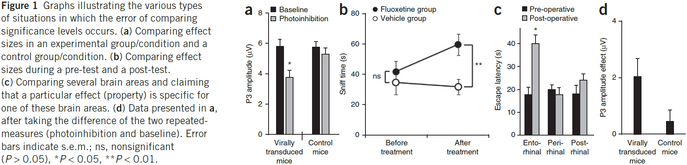
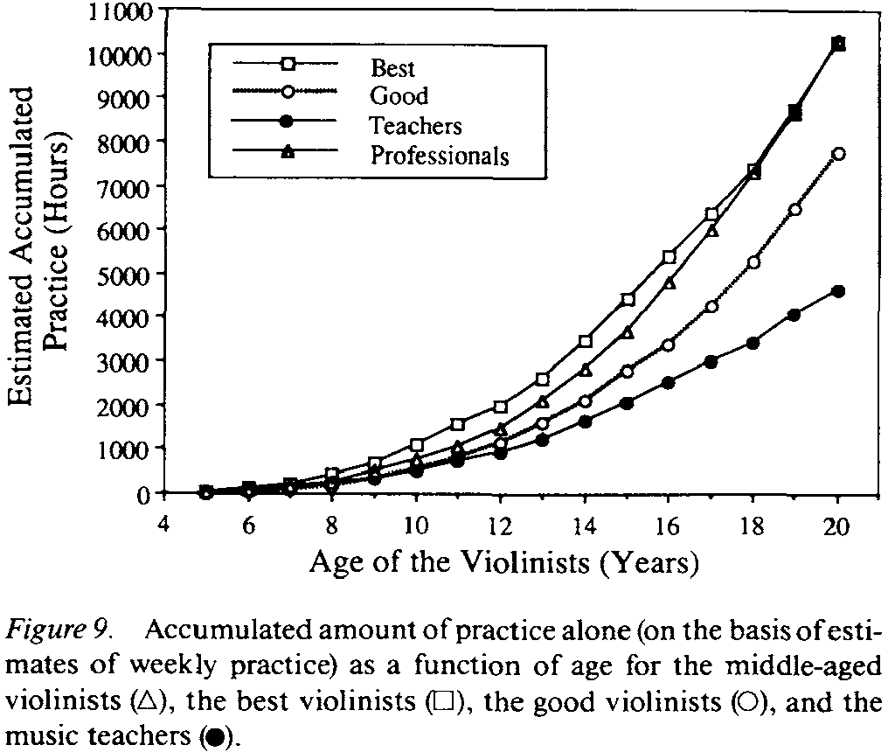
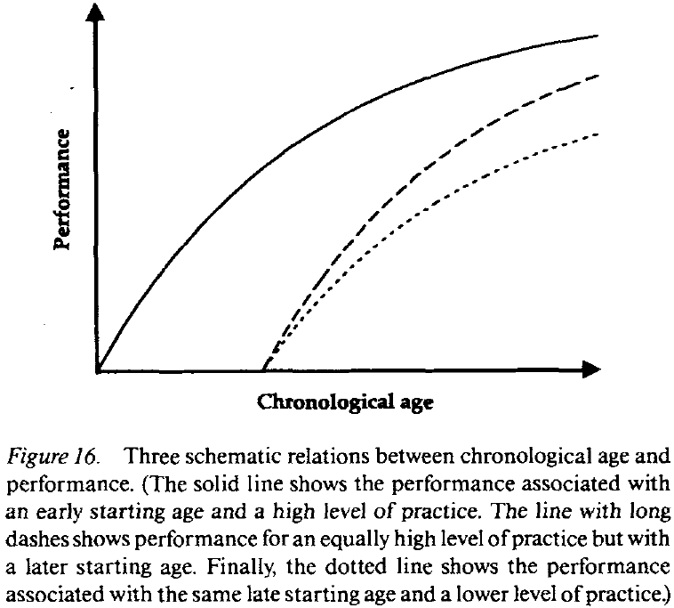

## [Ten simple rules for structuring papers](https://doi.org/10.1371/journal.pcbi.1005619)

- When you write, you should constantly have your reader in mind.
- Principles (rules 1-4)
    - Rule 1: Focus your paper on one central contribution, which you communicate in the title.
        - It doesn't pay to be greedy.
        - The title is the ultimate refinement of the paper's contribution.
    - Rule 2: Write for flesh-and-blood human beings who do not know your work.
        - Try to think through the paper like a naïve reader.
    - Rule 3: Stick to the context-content-conclusion (C-C-C) scheme.
        - This structure reduces the chances that the reader will wonder "why was I told that?" (missing context) or "so what?" (missing conclusion).
        - Putting content first may generate skepticism since they might be missing an important piece of context that makes the claim more credible.
        - The C-C-C scheme defines the structure of the paper on multiple scales.
        - Related to the statement-explanation-example (S-E-E) scheme.
    - Rule 4: Optimize your logical flow by avoiding zig-zag and using parallelism.
        - Only the central idea of the paper should be touched upon multiple times.
        - Parallelism makes it easier to read the text because the reader is familiar with the structure.
- Components (rules 5-8)
    - Rule 5: Tell a complete story in the abstract.
        - For most readers, the abstract is the only part of the paper that will be read.
        - The abstract should contain each of the C-C-C elements.
        - The context must get across the gap that the paper will fill and is narrowed until it lands on the open question.
        - The content describes the novel method or approach used to fill the gap/question.
        - The conclusion interprets the results to answer the question that was posed at the end of the context section.
        - There's often a second conclusion relating the results to the broader field.
        - The most common abstract mistake: talking about results before the reader is ready to understand them.
    - Rule 6: Get across why the paper matters in the introduction.
        - The introduction highlights the gap that exists in current knowledge or methods, and why it is important.
        - The structure of each introduction paragraph (except the last) serves the goal of developing the gap.
        - This gap-focused structure makes it easy for experienced readers to evaluate the potential importance of a paper; they just need to assess the importance of the claimed gap.
        - The last paragraph of the introduction is special in that it compactly summarizes the results, which fills the gap you just established.
        - This differs from the abstract because no context is presented.
    - Rule 7: Communicate the results as a sequence of statements, supported by figures, that connect logically to support the central contribution.
        - The results section should convince the reader that the central claim is supported by data and by logic.
    - Rule 8: Discuss how the gap was filled, the limitations of the interpretation,  and the relevance to the field.
        - The discussion should explain how the results have filled the gap, provides caveats to the interpretation, and describes how the paper advances the field.
        - The discussion is also a good place to look for future experiments.
        - The first discussion paragraph is special in that it generally summarizes the important findings from the results section.
- Process (rules 9-10)
    - Rule 9: Allocate time where it matters: Title, abstract, figures, and outlining.
        - Most people only care about the title, abstract, and figures.
        - Make an outline to efficiently plan the text and the time spent reading each section.
        - Try to write one informal sentence for each planned paragraph.
    - Rule 10: Get feedback to reduce, reuse, and recycle the story.
        - Writing can be considered an optimization problem and it's important to not get too attached to one's writing.
        - In many cases, it's better to trash an entire paragraph and rewrite it than to incrementally edit it.

## [Three Ways to Advance Science](https://www.nickbostrom.com/views/science.pdf)

- Three ways to contribute to scientific progress
    1. Direct way is to conduct a good scientific study and to publish the results.
        1. E.g. Studying the effects of a drug on the brain.
    2. Indirect way is to help others make a direct contribution.
        - E.g. Journal editors, university administrators, and philanthropists.
    3. A combination of both ways.
- The third way is commonly overlooked.
- One reason why great scientists are celebrated is because their discoveries have enabled other scientists to tackle problems that they couldn’t have solved.
- E.g. General relativity, electricity, genetics.
- However, even these achievements aren’t able to contribute to scientific enterprise as a whole.
- Some findings have wider applicability.
- E.g. The scientific method, basic statistic methods, and scientific instruments such as the microscope and computer.
- Those who seek the advancement of human knowledge should focus more on the third way of contributing to scientific progress.
- No contribution would be more generally applicable than one that improves the performance of the human brain.
- E.g. Cognitive enhancement drugs to improve motivation, memory, or brain development.
- Society invests vast resources into education to improve students’ cognitive abilities, but invests little on the biology of maximizing the performance of the human nervous system.
- Even a 1% improvement in performance, while not noticeable in a single person, would result in a massive performance increase for all scientists and humanity as a whole.
- E.g. Coffee or sleeping pills.

## [Neuroscience Training for the 21st Century](https://doi.org/10.1016/j.neuron.2016.05.030)

- Recently, there’s been a trend to focus more resources in the pursuit of neuroscience research.
- E.g. The USA BRAIN initiative, China Brain, and the Human Brain Project in Europe.
- Are training programs meeting the current and future workforce needs of the field?
- How do we train and retain a talented work force?
- Developing the expertise needed to advance neuroscience in the 21st century
    - Neuroscience is currently in a stage that requires greater incorporation of computational science, applied mathematics, and engineering.
    - Two major challenges
        - How to best impart rigorous quantitative, analytic, and statistical skills required by emerging technologies among trainees in neuroscience.
        - How to best integrate scientists from different disciplines into neuroscience.
    - A deep understanding of the statistical basis for interpreting experimental data needs to drive not only analysis, but also the design of experiments.
    - Programming and writing are also important skills for trainees to have and develop.
- Training for different career opportunities
    - The rapid increase in numbers of neuroscientists in training isn’t balanced by an increase in future academic positions.
    - There’s a trend of PhDs not planning to do a post-doc.
    - In neuroscience, women outnumber men in graduate school programs but remain underrepresented in faculty positions.
    - This means that a disproportionate amount of women with neuroscience graduate degrees don’t work in academia.
- The rewards for a better understanding of the brain are difficult to overstate.

## [Are Ideas Getting Harder to Find?](http://doi.org/10.1257/aer.20180338)

- Evidence shows that research effort is rising substantially, while research productivity is declining sharply.
- More generally, everywhere we look we find that ideas are getting harder to find.
- Economic growth can be modeled as a simple equation.
    - Economic growth = Research productivity x Number of researchers
- In other words, economic growth arises from people creating ideas.
- Evidence suggests that economic growth is slowing because research productivity is declining while the number of researchers increases.
- E.g. Moore’s Law requires more than 18 times more researchers than in the early 1970s.
- Paper specifically looks at Moore’s Law, agriculture, and medical innovations.
- This work is important because many economic growth papers are based on models where research productivity is constant, but evidence suggests that it isn’t.
- Three contributions of this paper
    - Analyzes many layers of evidence.
    - Uses a conceptually consistent approach across these layers.
    - Evidence is informative about the kind of models that we use to study economic growth.
- The researchers actually looked at more case studies than presented here but not all of them could be rigorously analyzed.
- Don’t look to patents as a proxy for ideas as their relationship isn’t stable over time.
- E.g. Software and algorithms can’t be patented but they’re still new ideas.
- Perhaps the decrease in research productivity is because over time, more and more learning is required just to get to the point where researchers are capable of pushing the frontier forward.
- Ideas are hard to measure.
- E.g. What is the unit of ideas?
- One way to measure ideas by their economic impact.
    - If Research productivity = Number of new ideas / Number of researchers, and if we plug this into the first equation, we get Economic growth = Number of new ideas.
- E.g. Ideas are proportional improvements in productivity.
- The standard hypothesis of growth literature is that research productivity is constant over time.
- However, paper finds consistent evidence that research productivity is declining at a substantial rate in virtually every place we look.
- But what if there is a sharp decline in research productivity within each product line, but growth is sustained by the creation of new product lines?
- E.g. Going from steam power to electric power, and then to the internal combustion engine, to gene editing, etc.
- Maybe long-term growth occurs through the invention of entirely new areas.
- To answer this question, we consider the extreme case where there’s no productivity improvement in a product line and that all productivity growth comes from adding new product lines.
- To account for research input, it’s also important to count R&D expenditures such as on lab equipment.
- Skipping over the equations for research productivity.
- The constant exponential growth in Moore’s Law has been achieved only by a massive increase in the amount of resources devoted to pushing the frontier forward.
- Caveats to studying Moore’s Law at the micro level
    - Maybe progress is due to spillovers from other sectors such as from material science.
    - Maybe progress is due to firms that no longer exist but the paper tries to account for this.
- Skipping agriculture section, medical innovation section, and firm-level section.
- Paper has robust findings that research productivity is falling sharply everywhere we look.
- In other words, to sustain constant growth in GDP per person, the USA must double the amount of research effort every 13 years to offset the increased difficulty of finding new ideas.

## [Ten Simple Rules for Doing Your Best Research, According to Hamming](https://doi.org/10.1371/journal.pcbi.0030213)

- These rules are based off of the mathematician Richard Hamming.
- Rule 1: Drop Modesty
    - Our society frowns on people who set out to do really good work, but ignore them and say to yourself that you do want to do something significant.
- Rule 2: Prepare Your Mind
    - Luck favours the prepared mind.
- Rule 3: Age Is Important
    - Most physicists and mathematicians do their best works when they were young.
    - On the other hand, experts in music, politics, and literature often do their best work late in life.
- Rule 4: Brains Are Not Enough, You Also Need Courage
    - Great scientists will go forward under incredible circumstances; they think and continue to think.
- Rule 5: Make the Best of Your Working Conditions
    - It’s a poor workman who blames his tools, the good workman gets on with the job, given what he’s got, and gets the best answer he can.
- Rule 6: Work Hard and Effectively
    - Knowledge and productivity are like compound interest.
    - Hard work isn’t enough, it must be applied sensibly.
- Rule 7: Believe and Doubt Your Hypothesis at the Same Time
    - Believe in a theory to push it forward, but doubt it to create a new replacement theory.
- Rule 8: Work on the Important Problems in Your Field
    - To do great work, you have to work on great problems.
- Rule 9: Be Committed to Your Problem
    - By diving deep into a problem, your subconscious works on the problem.
    - You can’t do great work on a problem you don’t know or haven’t tried solving.
- Rule 10: Leave Your Door Open
    - While keeping your office door closed makes you more productive in the short term, in the long term, you don’t know what the important problems are and don’t know the current state of the field.

## [How should novelty be valued in science?](https://doi.org/10.7554/eLife.28699)

- Paper evaluates the risks in overemphasizing novelty (newness) when deciding what makes good science.
- Placing too much value on novelty could have counterproductive effects and it should be replaced with an emphasis on the predictive power of science.
- Our scientific establishments (agencies, review panels, editorial boards) are putting a higher and higher premium on research that is deemed novel.
- Incremental findings are relegated to publication in second- and third-tier journals.
- The message is clear: novelty equates with good research.
- Many scientists follow Popper’s idea that a hypothesis can never be proved, only disproved, with evidence.
- However, to be practical, scientists do allow that empirical evidence can either support or falsify a hypothesis.
- Popper believed that “good tests kill flawed theories” and Lakatos argued that “good research is progressive”, meaning scientists should constantly seek to expand their hypotheses into new areas of observation.
- Today, however, review panels are likely to tag progressive research as lacking novelty because seeking to expand old hypotheses into new realms is less valued than developing new hypotheses.
- This is misguided.
- On the flip side of Popper was Kuhn and his idea of a paradigm.
- While Popper advocated for abandoning a theory when it was falsified, Kuhn emphasized that paradigms can tolerate a good deal of anomalies and still remain valid.
- If scientists had to drop their paradigms every time they encountered a problem, then nothing would get done.
- Only a critical mass of anomalies requires a paradigm shift.
- Nothing in the ideas of Popper or Kuhn particularly values novelty for its own sake.
- What distribution of people across rival research programs is best for science?
- One solution is to distribute researchers over the widest possible range of research programs, to maximize the novelty of their own research program.
- One researcher, Merton, argued that recognition is the main form of reward in science.
- In particular, the “priority rule”, which awards the most recognition to the first investigator to support a hypothesis, is an especially powerful incentive in science.
- The priority rule, in a way, bakes into science the value of novelty as when too many scientists work on the same hypothesis, there’s an incentive to work on novel hypotheses because even though the chances of success might be smaller, the share of credit is greater.
- Competition is also important in science as it encourages investigators to check the validity of their competitors’ work.
- This checking, along with the priority rule, helps to maintain a balance between creativity and skepticism.
- Hull viewed the success of science as a result of a delicate balance between
    - Competition and cooperation
    - Creativity and skepticism
    - Trust and doubt
    - Open-mindedness and dogmatism
- Placing too much emphasis on novelty could upset this equilibrium in ways that aren’t optimal for scientific progress.
- E.g. Publishing faster to follow the priority rule, but not publishing high quality and rigorous results.
- A recent example of this is the reproducibility crisis where many research results couldn’t be replicated.
- Novel results are particularly likely to be attacked, because those who lay claims to novelty enjoy so many advantages over other scientists.
- This is unfortunate because as Kuhn emphasized, hypotheses must be allowed to tolerate some anomalous results before they’re discarded, otherwise the community can’t exploit the working model.
- Ironically, novel research programs have a very difficult time surviving when novelty is so highly valued.
- Perhaps our obsession with novelty is a sort of communal nostalgia for the good old days, when important foundational discoveries came fast and furious.
- When an area of science experiences rapid advancement over a short period of time, it may be followed by a period where discoveries are harder to come by.
- E.g. All of the low hanging fruit have been picked from the tree of knowledge.
- Seen through the lens of predictive power, it’s clear that the vast majority of models in molecular biology are inadequate for solving real world problems.
- They are good descriptions, but not good predictions. Hence why these ideas are difficult to translate into practical, real-world applications.
- Research that results in models that reliably and quantitatively predict the outcomes of manipulations should be highly valued and rewarded, regardless of whether such models invoke novel phenomena.
- As the priority rule increases, more scientists will feel the pressure to sacrifice rigor for speed of publication.
- Science, as the practice it is today, is a relatively recent development that only started in the 1600s with the decisions made by the Royal Society.
- For most of history, humans acquired knowledge outside of what we would recognize as a scientific framework.
- It would be unwise to assume that science is a permanent feature of our society.

## [The growing inaccessibility of science](https://doi.org/10.1038/356739a0)

- It’s universally been acknowledged that science has become more difficult for non-specialists to understand.
- One approach to measuring the difficulty of understanding science is to measure text difficulty.
- Data is taken from articles describing research in four categories of publication
    - General science journals
        - E.g. Nature and Science
    - Professional journals
    - Science textbooks for introductory courses
    - Popular science magazines
- Paper's analysis confirms that research papers are written for specialists.
- While using jargon results in fewer references and less space used, it also makes it tough for non-specialists to read.
- Even though scientific progress requires the use of new words to describe new phenomena, the jump in reading difficulty level in the general science journals indicates that it might be due to an editorial policy.
- The same trend is seen in basic science journals where all ten journals grew more difficult.
- There are subject-specific levels though, as astronomy and physics journals are written at lower levels than those in biology, chemistry, and geology.
- However, this could be an artifact as physics and related fields also use more equations.
- Factors contributing to the increased reading difficulty
    - Scientific understanding is becoming more detailed.
    - Dynamics of publishing such as filling different difficulty niches.
- Specialization in science has produced unprecedented levels of knowledge, but the side-effect is that more expertise is required to understand published research.
- Broad consequences are that ideas flow less freely and public access is diminished.
- Above all, the increased comprehension difficulty is a threat to an essential characteristic of science: its openness to outside examination and appraisal.

## [What science is really worth](https://www.nature.com/news/2010/100609/full/465682a.html)

- The number one current rationale for extra research investment is that it will generated badly needed economic growth.
- There’s unease that the economic benefits of science spending are being oversold.
- We have very good evidence that 50-70% of productivity growth arises from innovation.
- However, it’s difficult to determine what drives innovation though.
- A key problem is economists’ inability to measure the costs and benefits of research.

## [Meta-Research: Tracking the popularity and outcomes of all bioRxiv preprints](https://doi.org/10.7554/eLife.45133.001)

- The growth of preprints is changing journals and funders, but little quantitative information has been published about preprint usage.
- Paper reports an analysis of all 37,648 preprints uploaded to bioRxiv (bio-archive) as of 2019.
- The rate of preprint uploads to and downloads from bioRxiv is growing quickly.
- About two-thirds of preprints were later published in peer-reviewed journals, and there’s a relationship between the number of downloads a preprint has and it’s later journal impact factor.
- Preprints allow researchers to make their results available as quickly and widely as possible, jumping over the delay associated with peer review.
- bioRxiv is the largest of the biology preprint servers.
- The most apparent trend is that bioRxiv is becoming increasingly popular for authors to share their work.
- The largest driver of this growth has been the neuroscience collection, which has more submissions than any other bioRxiv category in every month since September 2016.
- The second-largest category is bioinformatics followed by evolutionary biology.
- If we use preprint downloads as a proxy for readership, then we find that readership is also increasing rapidly.
- We also find that preprints typically have the most downloads in their first month, which quickly decays over a preprint’s first year.
- Interestingly, 10% of all authors account for 73% of all preprints on bioRxiv.
- Of all preprints on the site, about 42% of them have been published.
- However, manually searching the unpublished preprints lead to 37.5% of them having actually appeared in a journal.
- So the data from bioRxiv may be an underestimation of the number of preprints that have actually been published.
- Preprints that have been published elsewhere have almost twice as many downloads as preprints that haven’t.
- The vast majority of final published papers are largely indistinguishable from their pre-print versions, which brings into question the review process and why do researchers pay so much for their paper to appear in a journal.

## [Erroneous analyses of interactions in neuroscience: a problem of significance](https://doi.org/10.1038/nn.2886)

- In theory, a comparison of two experimental effects requires a statistical test on their difference.
- In practice, this comparison is often based on an incorrect procedure involving two separate tests where researchers conclude that effects differ when one effect is significant (P < 0.05) but the other isn’t (P > 0.05).
- E.g. “The percentage of neurons showing cue-related activity increased with training in the mutant mice (P < 0.05), but not in the control mice (P > 0.05).”
- This is incorrect because the difference between significant and not significant doesn’t need to be itself statistically significant.
- E.g. Suppose the manipulated experiment barely reaches significance (P = 0.049) and the control experiment barely fails to reach significance (P = 0.051). Despite that these two P values lie on the opposite sides of 0.05, one can’t conclude that the manipulation differs statistically from the control.
- So, when comparing two effects, researchers should report the statistical significance of their difference rather than the difference between their significance levels.
- Paper examined the neuroscience literature in four prestigious journals.
    - E.g. Nature, Science, Nature Neuroscience, Neuron.
- In 50% of the papers analyzed, the authors used the correct approach, and the rest either didn’t or didn’t have the relevant statistical analysis.
- Are all these articles wrong about their main conclusions?
- Some might be, but it depends on whether the conclusions depend on the erroneous analysis.
- Three general situations when the error occurs
    1. Most of the errors occurred when comparing effect sizes in an experimental group and a control group.
    2. Comparing effect sizes during a pre- and post-test can be seen as a special case of the above situation.
    3. Comparing several brain areas and claiming that a particular effect is specific for one of those brain areas.

- The error also occurs when researchers compare independent correlations.
- When making a comparison between two correlations, researchers should directly contrast the two correlations using an appropriate statistical method.
- People are generally tempted to attribute too much meaning to the difference between significant and not significant.
- Researchers and reviewers should be more aware that the difference between significant and not significant isn’t necessarily significant.

## [The Role of Deliberate Practice in the Acquisition of Expert Performance](https://psycnet.apa.org/buy/1993-40718-001)

- Paper presents a theoretical framework that explains expert performance as the end result of individuals’ prolonged efforts to improve performance while negotiating motivational and external constraints.
- In most domains of expertise, individuals begin in their childhood with deliberate practice designed to optimize improvement.
- Individual differences, even among elite performers, are closely related to assessed amounts of deliberate practice.
- Many characteristics once believed to reflect innate talent are actually the result of intense practice extended for a minimum of 10 years.
- Contemporary accounts assert that the characteristics responsible for exceptional performance are innate and are genetically transmitted.
- An account of exceptional performance must specify the critical differences between exceptional and ordinary performers.
- E.g. Environmental circumstances, duration and structure of practice, biological attributes.
- If genetic factors rigidly determine maximal performance, it’s reasonable to assume that these factors can’t be influenced by practice and hence remain stable across time.
- Many physical and anatomical attributes are largely determined by hereditary factors.
- E.g. Height and facial features.
- In many sports, the height of elite athletes is different from the normal population.
- Reasoning by analogy, maybe the basic characteristics of the nervous system, such as speed of transmission and memory capacities, have genetic origins that can’t be changed through training and practice.
- The relation of IQ to exceptional performance is weak in many domains.
- E.g. Music and chess.
- More generally, the prediction of occupational success from psychometric tests hasn’t been very successful, with correlations around 0.2 strength.
- Experts are faster and more accurate than less accomplished individuals, but this superior speed doesn’t transfer to general tests of speed.
- Similarly, experts’ memory for representative stimuli from their domain is vastly superior to that of lesser experts, but when tested on random stimuli, the memory of experts isn’t any better than that of ordinary individuals.
- Although paper claims that genetic factors have little direct impact on performance, a plausible role for hereditary factors is in the developmental history of the individual.
- What’s the indirect role of innate talent on an individual’s development?
- The conviction in the importance of talent appears to be based on the insufficiency of alternative hypotheses to explain the exceptional nature of expert performance.
- Paper examines the assumption that with extensive experience in a domain, a maximal level of performance is automatically reached and that the period of improvement is limited in length.
- Does practice and experience inevitably lead to maximal performance?
- Mere repetition doesn’t improve performance as further improvement requires an effortful reorganization of skill.
- Three reasons for not improving performance
    - Too many improvements to make
    - Don’t know how to direct practice
    - Don’t care enough about improving
- In virtually all domains, insights and knowledge are steadily accumulating and the criteria for expertise undergoes continuous change.
- To reach expertise, it’s sufficient to master the existing knowledge and techniques.
- To reach eminence, one must first achieve expertise and then surpass the achievements of already recognized experts and make innovative contributions to the domain.
- The belief that a sufficient amount of experience or practice leads to maximal performance appears incorrect.
- There’s a widespread notion that if individuals are innately talented, then they can easily and rapidly achieve an exceptional level of performance once they’ve acquired basic skills and knowledge.
- However, biographical material disproved this notion.
- E.g. Nobody has attained the level of international chess grandmaster without less than a decade of intense preparation.
- This “10-year rule” also applies to music, writing, science, and other domains.
- E.g. The average age for scientists publishing their first work was 25.2 and the average age for publishing their greatest work was 35.4.
- On average, more than 10 years elapsed between scientists’ and authors’ first work and their best work.
- Evidence from other domains further supports the claim that motivation and perseverance are necessary for attainment of eminent performance.
- This leads us to analyze the types of activities commonly called practice.
- Characteristics of deliberate practice
    - In the absence of adequate feedback, efficient learning is impossible and improvement only minimal even for highly motivated subjects.
    - Mere repetition of an activity won’t automatically lead to improvement in performance.
    - Using efficient retrieval structures dramatically increases performance.
    - Having an instructor organize the sequence of appropriate training tasks and monitor improvement is superior to group instruction and non-specific curriculums.
    - As the levels of performance in a domain increased in skill and complexity, methods to teach and train individuals were developed.
    - In all major domains, there’s been a steady accumulation of knowledge about the best methods to attain a high level of performance and the associated practice activities leading to this performance.
- Deliberate practice: activities that have been specifically designed to improve the current level of performance.
- In deliberate practice, external rewards are almost completely lacking and it isn’t inherently enjoyable.
- Individuals are motivated to practice because practice improves performance.
- We assume that the amount of time a person spends engaged in deliberate practice is monotonically/one-to-one related to that person’s acquired performance.
- It follows that individuals should attempt to maximize the amount of time they spend on deliberate practice to reach expert performance.
- Constraints of deliberate practice
    - Requires time and energy
    - Not inherently motivating
    - Effortful and can only be sustained for a limited time each day before exhaustion
- Four phases of attaining expert performance
    1. Introduction to the domain
    2. Extended period of preparation
    3. Full-time commitment to improving performance
    4. Eminent performance that makes a unique and innovative contribution to their domain
- During all four phases, the individual requires support from external sources.
- E.g. Parents, teachers, educational institutions.
- At increased levels of performance, the practice activities change and so do the criteria of evaluation.
- E.g. In music, children and adolescents are judged primarily on their technical proficiency, while adults are judged on their interpretation and ability to express emotions through music.
- The inability of many child prodigies in music to succeed as adult musicians is often attributed to difficulties in making this transition.
- Similar considerations may explain why child math prodigies can fail as adult mathematicians.
- E.g. In math, children are judged primarily on their technical proficiency such as multiplication and the mechanics of mathematics, while adults are judged on their contributions that reflect insights into the structure of mathematical problems and domains.
- This lack of overlap in performance between childhood and adulthood explains why some child prodigies aren’t remembered into adulthood.
- The criteria for eminent performance goes beyond expert mastery of the available knowledge and skills and requires an important and innovative contribution to the domain.
- E.g. In the arts and sciences, eminent achievements involve contributing new ideas, theories, and methods.
- Resource constraint
    - International-level performers often receive their first exposure to their domain between the ages of 3 and 8.
    - This is only possible due to their parents providing early access.
    - Parents and guardians make possible the discovery of early signs of talent and promise.
- Effort constraint
    - The central claim of the paper’s framework is that the level of performance an individual attains is directly related to the amount of deliberate practice.
    - It’s necessary to maintain full attention during the entire period of deliberate practice.
    - The limited duration of deliberate practice is the best evidence of the effort it requires.
    - E.g. Studies show no benefit for practice exceeding 4 hours per day and reduced benefits from practice exceeding 2 hours per day.
    - “The command to rest is fully as important as to work, in effective learning” - C.E. Seashore
    - Physical activity and exercise produce no benefit unless they’re sufficiently intense.
    - Improvements resulting from training appear to be more a function of intensity (as close to maximum as possible) than a function of duration.
    - The exhausting effects of regular training are also evidenced by the standard practice of reducing the training level several days before a competition.
    - Since practice requires effort, it’s expected that the level of practice that can be sustained is limited by the individual’s ability to recover and thereby maintain a steady state from day to day.
    - However, after the individual has slowly adapted to a constant level of practice, increases ought to be possible, given the individual can still recover each day.
    - The best data on sustained intellectual activity comes from financially independent authors.
    - E.g. While completing a novel, famous authors tend to write only four hours during the morning, leaving the rest of the day for rest and recuperation.
    - Too rapid increases in the intensity of practice lead to overtraining and burnout.
    - In the short term, optimal deliberate practice maintains equilibrium between effort and recovery.
    - In the long term, regular increases in amounts of practice allow for adaption to increased demands, up to a point.
- Motivational constraint
    - We assume that deliberate practice isn’t inherently enjoyable and that individuals are motivated to engage in it through it’s instrumental (indirect) value in improving performance.
    - Hence, interested individuals need to be engaged in the activity and motivated to improve before they begin deliberate practice.
    - The social reactions of parents and other individuals is very important in establishing this original motivation.
    - With increased experience, the developing individual is able to internalize methods for assessing improvement and can thus monitor the effects of practice themselves.
    - In other words, they become their own teacher and critic.
    - Without the goal of improving performance, motivation to engage in practice vanishes.
- Predictions of the paper’s framework
    - The past amount of deliberate practice is directly related to the individual’s current performance.
    - E.g. Expert performance isn’t reached with less than 10 years of deliberate practice.
    - Deliberate practice starts at low levels and increases slowly over time.
- Often, talent is contrasted with practice in that the best individuals are assumed to practice less than individuals with inferior performance.
- An alternative hypothesis is that talented individuals would practice more.
- Skimmed over the two studies that support the paper’s framework.

- Interestingly, the subjects in the best group were able to accurately estimate the time they allocated to leisure, whereas the subjects in the good group underestimated their leisure time.
- The main idea of the paper’s framework is that expert performance is the result of an extended process of skill acquisition mediated by large, but not excessive, daily amounts of deliberate practice.

- Starting age matters a lot as it lets the individual remain at high performance for longer by having a longer history with deliberate practice.
- E.g. A sample of elite music performers contained no individuals who had started later than age nine.
- We find that the higher the level of attained elite performance, the earlier the age of first exposure as well as the age of starting deliberate practice.
- We also find that the amount of weekly practice increases with age, accumulated practice, and performance.
- We expect that increased level of acquired skill and performance would increase the maximal level of deliberate practice that can be sustained over extended periods of time without exhaustion.
- When expert performers make a full-time commitment to their domain, studies show that they spend between 50 and 60 hours per week on domain-related activity, with less than half of that time (about 25 hours per week) spent on deliberate practice.
- The 25 hours per week is distributed across the entire week in practice session of limited duration to recover from exhaustion.
- Deliberate practice isn’t limited by time, but by resources.
- The goal isn’t to maximize the number of hours of any domain-related activity.
- Instead, we should identify the activities that are most likely to result in the desired achievements and spend less than four hours per day doing deliberate practice to improve performance on those activities.
- Paper believes that during the process of writing, scientists develop and externalize their arguments, which can be successively criticized and improved.
- Seen this way, writing is an extended knowledge-transformation process and not the assumed knowledge-telling approach.
- Eminent scientists produce a much larger number of publications than other scientists.
- It’s clear from the biographies of famous scientists that the time they spend thinking, mostly in the context of writing papers and books, appears to be the most relevant as well as demanding activity.
- E.g. Darwin, Pavlov, and Skinner adhered to a rigid daily schedule where the first major activity of each morning involved writing for a couple of hours.
- Most writing on articles happened before lunch with sessions limited to 1-2 hours.
- Almost without exception, most famous authors tend to schedule 3-4 hours of writing every morning and spend the rest of the day on walking, correspondence, napping, and other less demanding activities.
- The preferred time of day for deliberate activities differs across domains.
- E.g. Scientists and authors consistently chose to use morning for writing, and athletes prefer afternoons.
- Paper’s framework distinguishes between two types of elite performance
    - Expert: reflects the mastery of the available knowledge or current performance standards.
    - Eminent: requires individuals to go beyond the available knowledge to produce a unique contribution to the domain, and hence by definition, isn’t directly instructable.
- Framework proposes that the probability of making eminent contributions is related to the amount of deliberate efforts directed toward that goal.
- Across many domains of expertise, a remarkably consistent pattern emerges: The best individuals start practice at earlier ages and maintain a higher level of daily practice.
- In virtually all domains, there’s evidence that the most important activity, such as practice, thinking, or writing, requires considerable effort and is scheduled for a fixed period during the day, usually limited to 2-4 hours a day.
- In the framework, it’s impossible for an individual with less accumulated practice at some age to catch up with the best individuals, who have started earlier and maintained maximal levels of deliberate practice.
- The individual that started later isn’t able to increase the duration of deliberate practice as they will face exhaustion and injuries.
- This may lead to termination of their engagement in the domain, convinced that the best performers are qualitatively different and explaining that difference as “talent”.
- However, the truth is that they just started earlier and had more time to practice.
- Once individuals have started deliberate practice, it’s virtually impossible to distinguish the role of natural ability (innate talent) from that of acquired characteristics and skill in their current level of performance.
- If a characteristic was purely genetic, such as talent, then it must be inheritable and manifest in the absence of any special environmental influences.
- It should also be possible to specify the biochemical mechanisms that control the emergence of these characteristics.
- E.g. Height is an excellent example of a characteristic that we know the genetic mechanism.
- However, evidence suggests that many physiological characteristics are the result of adaptation to a level of daily activity, with some characteristics being due to genetics.
- Detailed examinations of the anatomical changes resulting from intense exercise reveal that the human body is remarkably adaptable.
- E.g. More capillaries after a few weeks of practice and increased mitochondria.
- However, the faster the changes are gained, the faster they are to be lost.
- E.g. It only takes a few weeks to increase the number of capillaries after working out, but if you stop working out, it’ll also only take a few weeks to decrease. The same goes for heart changes that take years to develop, but also years to decay.
- Exceptional abilities observed in children and idiot savants are consistent with all the characteristics of acquired skills.
- Two findings that imply that expert performance and initial performance don’t have a common basis
    - Most individual differences related to levels of elite performance are due to the amount and organization of knowledge, which must have been acquired.
    - Expert performers have acquired skills that enable them to circumvent general memory and processing limits.
- It’s theorized that experts acquire domain-specific memory skills that enable them to rapidly access relevant information in an extended working memory that relies on long-term memory.
- This acquired memory skill underlies experts’ superior ability to plan and evaluate potential sequences of actions in the domain.
- Mastery, in part, is the superior organization of information.
- The most important implication of these acquired memory skills is that they enable experts to circumvent the limited storage capacity of short-term memory, thus eliminating any restrictive influence of individual differences in this basic capacity.
- E.g. Expert typists look ahead in the text to be typed and if that preview is removed, then they type at speeds comparable to those of novices.
- The ability to anticipate future events and thus prepare actions in advance is critical in many domains of expertise.
- E.g. With increasing levels of expertise, tennis players can use advance cues, such as location of arms and racquet, to predict where the tennis ball will hit in the service area.
- The important implication of this research is that experts can circumvent any basic limits on the serial motor processes constraining a novice by using advance cues to prepare movements.
- In searching for immutable characteristics matching innate talent, we conclude that individuals acquire virtually all of the distinguishing characteristics of expert performers through relevant activities, except for height.
- The perception that a child is talented is unquestionably real, but this perception often leads to parents providing the time and money to support deliberate practice in such domains, which leads to actual skill.
- Central arguments
    - The perception that an individual is talented leads to the early start of deliberate practice.
    - The individual attains an elite level of adult performance by maintaining a high level of practice.
- Note that the perception of innate talents will be relatively immune to disconfirming evidence, so long as the talents are kept general and unspecified.
- We can think of talent to mean promise rather than objective evidence of unusual capacity.
- We reject any important role for innate ability, but it’s quite plausible that heritable individual differences might influence motivation, enjoyment of the activities, and the capacity to engage in hard work (deliberate practice).
- “High but not the highest intelligence, combined with the greatest degree of persistence, will achieve greater eminence than the highest degree of intelligence with somewhat less persistence.” - Cox (1926)
- People believe that because expert performance is qualitatively different from normal performance, the expert performer must be endowed with characteristics qualitatively different from those of normal adults.
- We agree that the performance is qualitatively different, but we deny that these differences are due to innate talent.
- We view elite performance as the product of a decade or more of maximal efforts to improve performance in a domain through an optimal distribution of deliberate practice.
- It doesn’t follow from the rejection of innate limits on acquired performance that everyone can easily attain high levels of skill.
- The commitment to deliberate practice distinguishes the expert performer from the vast majority of children and adults who seem to have remarkable difficulty meeting the much lower demands on practice in schools, adult education, and in physical exercise programs.
- There may be heritable differences that predispose individuals to engage in deliberate practice for extended periods and facilitate motivating them.
- We know that experts carefully schedule deliberate practice and limit its duration to avoid exhaustion and burnout.
