## [How we created neuromorphic engineering](https://doi.org/10.1038/s41928-020-0448-2)

- The retina is an extension of the brain into the eyeball.
- Its function is to extract information from the visual scene that is useful to the animal and pass this compressed information to higher levels in an efficiently encoded form.
- The best conductor available to animals is salt water, which is enclosed in a tube and wrapped in a very low dielectric constant insulator called myelin.
- These nerve fibers (axons) are a very clever use of the materials at hand, but they are still orders of magnitude slower than silicon technology.
- A common theme of decoded neural representations: information is represented by the relative arrival time of nerve spikes that are digital in amplitude but analog in time.
- Neurons are elegantly tuned to only respond to certain sequences of incoming spikes or any sub-sequence of it.
- E.g. A bright scene is the full sequence but a dim scene contains only sub-sequences.
- The dendritic tree has an elegant adaptive gain-control system, so that it raises its threshold criterion as more of the full sequence is available.
- Learn the art of analog CMOS design.
- Address-event representation (AER): when a sensor chip recognizes a meaningful input, it generates a multi-wire output that identifies the location and identity of the event.
- Meaningful changes in an image are sparse, so it pays to identify them in the image plane and to send them as soon as they’re identified.
- This is in comparison to the current frame-based cameras that we currently use that requires the entire snapshot of the image before changes can be identified.
- Silicon retinas = dynamic vision sensors.
- The computation consists of a prediction of the future input and a comparison of that prediction to the actual input.
- When the prediction is correct, the model isn’t updated. When the prediction is incorrect, the model is updated to correct its mistake.
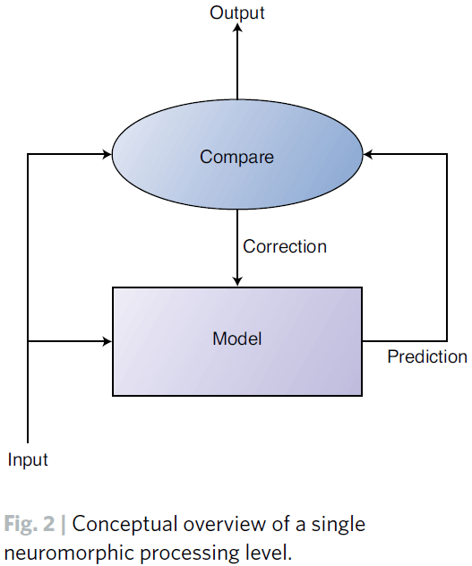
- Only the relative contrast in space/time is passed on to the next level of processing, not the absolute value.
- Artificial neural networks, at the conceptual level, take their overall strategy from the nervous systems of animals.
- However, at the implementation level, they are still a brute-force strategy; using little of the cleverness of nature.

## [Neuromorphic Electronic Systems](https://doi.org/10.1109/5.58356)

- Biological information-processing systems operate on completely different principles than what most engineers are familiar with.
- The advantage of biological solutions can be attributed principally to the use of elementary physical phenomena as computational primitives, and to the representation of information by the relative values of analog signals, rather than by absolute values of digital signals.
- Large-scale adaptive analog systems are more robust to component degradation and failure than more conventional systems, and they use far less power.
- As technology has evolved, it has always moved in the direction of lower energy per unit computation.
- E.g. From vacuum tubes to transistors to integrated circuits.
- There’s a myth that the nervous system is slow, is built out of slimy stuff, uses ions instead of electrons, and is therefore ineffective.
- It isn’t difficult to multiply numbers in a bank account like what digital computers do.
- It’s difficult to process the poorly conditioned sensory information that comes in through the eye or through the eardrum.
- The brain is a factor of 1 billion times more efficient than our present digital technology and a factor of 10 million times more efficient than the best digital technology that we can imagine.
- We have something fundamental to learn from the brain about a new and much more effective form of computation.
- Even the simplest brains do computations we don’t know how to do, in ways we don’t understand.
- Perhaps the brain is more efficient because at the nerve membrane level, it’s manipulating single molecules compared to our continuum physics transistors.
- This isn’t true, however, as nerve membranes use population of channels, rather than individual channels, to change their conductance; similar to how transistors use populations of electrons rather than individual electrons.
- The disparity between the efficiency of computation in the nervous system and in a computer is primarily attributable not to the individual device requirements, but rather to the way the devices are used in the system.
- In other words, nervous systems are more efficient because of their organization of components.
- There’s nothing in the nervous system that we can’t emulate with electronics if we understand the principles of neural information processing.
- E.g. Improve energy efficiency by making algorithms more local so we don’t have to ship data all over the place.
- Systems can be divided into three levels
    - Elementary functions
    - Representation of information
    - Organizing principles
- E.g. For computers, we represent information as bits, the elementary functions on these bits are logical operators (AND, OR NOT), and the organizing principle is the von-Neumann architecture or Turing machine.
- To build a nervous system or computer, we must be able to make specific connections; a particular output is connected to certain inputs and not to others.
- To achieve this, we must be able to isolate one signal from other signals. Both electronics and the nervous system achieves this isolation by building an energy barrier.
- E.g. In the nervous system, it’s the membrane potential generated by the difference in dielectric constant between fat and aqueous solutions. In electronics, its the difference in the bandgap between silicon and silicon dioxide.
- The nervous system uses, as its basic operation, a current that increases exponentially with voltage.
- To build a neuromorphic system, we start by letting the device physics define our elementary operations.
- These functions provide a rich set of computational primitives, each a direct result of fundamental physical principles.
- However, these operations aren’t the familiar AND and OR that’s used in computers.
- If we try to fight them, to turn them into something familiar, then we make a mess.
- Mahowald silicon retina model

    - The output of the circuit represents the difference between a center intensity and a weighted average of the intensities of surrounding points in the image.
    - The center-surround computation is sometimes referred to as a Laplacian filter and can be approximated by a difference in Gaussians.
    - This computation has been useful in helping computers localize objects because discontinuities in intensity frequently correspond to object edges.
    - The computation occurs as a natural result of an efficient physical implementation of local normalization of the signal level.
    - In addition to its role in gain control and spatial filtering, the retina sharpens the time response of the system as an intrinsic part of its analog computation.
    - Effective temporal processing requires that the time scale of the computation be matched to the time scale of external events. In other words, event-based processing.
    - The model enhances both the first temporal and second spatial derivatives of the image.
    - It also displays several well-known optical illusions such as Mach bands.
- Adaptive retina model
    - One problem with the Mahowald retina is that the circuit is sensitive to transistor offset voltages.
    - E.g. Under uniform illumination, the output is a random pattern reflecting the properties of individual transistors, no two of which are the same.
    - This same problem occurs in biological retinas and they compensate for this lack of precision by using adaptive mechanisms.
- We can view the function of a particular part of the nervous system as making a prediction about the spatial and temporal properties of the world.
- The system only sends information up a level when something unexpected has occurred; when there’s a difference.
- If we repeat this operation at each level of the nervous system, the information will be of higher quality at each subsequent level because we only process the information that couldn’t be predicted at the lower levels.
- The most important property of this kind of system is that the same mechanism that adapts out errors and mismatches in its individual components also enables the system to build its own models through continued exposure to information coming in from the world.
- This kind of system is self-organizing in the most profound sense.
- Advantages of adaptive analog systems (neuromorphic)
    - Low-power
    - Easy heat dissipation
    - Robust to failure of a few components
    - Can be built in 3D instead of 2D
- The brain has evolved a mostly local wiring strategy to keep the scaling from getting out of hand.
- The nervous system is organized such that, on average, the number of wires decreases no more slowly than the inverse square of the wire’s length. This applies to both 2D and 3D scaling.
- The cortex of the human brain, basically 2D, won out over the 3D strategies used by more primitive animals because it could evolve more easily.
- New areas of cortex could arise in the natural course of evolution, and some of them would be retained if they conveyed a competitive advantage for their owners.
- This gives us hope that a neural structure comprising many 2D areas can be made into a truly useful, massively parallel, adaptive computing system.

## [Exploring Neuromorphic Computing for AI: Why Spikes?](https://www.intel.com/content/www/us/en/artificial-intelligence/posts/exploring-neuromorphic-computing-for-ai-why-spikes-part-one.html)

- Neuromorphic computing seeks to exploit the many properties of neural architectures found in nature such as
    - Integrated memory and computation
    - Parallelism
    - Feedback and recurrence
    - Network fan-outs
    - Low precision and stochastic computation
    - Continuously adaptive and rapidly self-modifying processes
- The use of spikes as the basic currency of computation.
- Let time represent itself; the brain computes with time, treating it as a first-class citizen in its computation processes.
- Spikes offer advantages in
    - Energy efficiency
    - Fast responses
    - Rapid learning
- Spikes optimize bits per Joule, not bits per second
    - Traditional information theory relates maximizing bandwidth to noise limits.
    - However, the brain maximizes energy efficiency or bits per Joule.
    - This leads to a preference for sparse communication where there’s an asymmetry between sending a “1” versus a “0”.
    - The particular timing of spike transmission can be used to convey information while maintaining a constant level of sparsity, thereby remaining in the optimal energy sweet spot.
- Spikes can efficiently compute important rate-based networks
    - Neurons that “lose” the competition never cause any computation, thereby saving both time and energy.

## [Loihi: A Neuromorphic Manycore Processor with On-Chip Learning](https://doi.org/10.1109/MM.2018.112130359)

- Loihi is a 60 $$mm^2$$ neuromorphic chip made using Intel’s 14-nm process.
- It’s a state-of-the-art modeling of spiking neural networks (SNNs) in silicon.
- Chip features
    - Hierarchical connectivity
    - Dendritic compartments
    - Synaptic delays
    - Programmable synaptic learning rules
- When running the Lasso optimization problem, the chip solves it using significantly less energy than conventional solutions.
- Loihi is motivated by a particular class of algorithmic results and perspectives from their survey of computational neuroscience and recent neuromorphic advances.
- Goals with Loihi
    - Mathematical rigor
    - Top-down modeling
    - Rapid architecture iteration
    - Quantitative benchmarking
- SNNs differ from ANNs in that SNNs incorporate time as an explicit dependency in their computations.
- One or more neurons may send out single-bit impulses, the spike, to neighbors through synapses with a potentially non-zero traveling time.
- A spiking neuron integrates its spike train input in some fashion, usually by low pass filter, and fires once a state variable exceeds a threshold.
- A spike train can be mathematically formalized as a sum of Dirac delta functions: $$\sigma (t) = \sum_k \delta (t-t_k)$$ where $$t_k$$ is the time of the k-th spike.
- The neuron model they use is a variant of the CUBA leaky-integrate-and-fire (LIF) model that has two internal state variables
    - Synaptic response current: $$u_i (t) = \sum_{j \neq i} w_{ij}(\alpha_u * \sigma_j)(t) + b_i$$ which is the sum of filtered input spike trains plus a constant bias current.
        - $$w_{ij}$$ is the synaptic weight from neuron j to i.
        - $$\alpha_u(t)=\tau_{u}^{-1} exp(\frac{-t}{\tau_u})H(t)$$ is the synaptic filter impulse response parameterized by the time constant $$\tau_u$$ with $$H(t)$$ as the unit step function.
        - $$b_i$$ as a constant bias.
    - Membrane potential: $$v_i(t)=-\frac{1}{\tau_v}v_i(t)+u_i(t)-\theta_i\sigma_i(t)$$ where $$\theta$$ is the membrane threshold and $$\tau_v$$ is the time constant that captures that the integrator is leaky.
- Loihi approximates the above continuous time dynamics using a fixed-size discrete time step model.
- All neurons need to maintain a consistent understanding of time so their distributed dynamics can evolve in a well-defined and synchronized manner.
- Note that the fixed-size, synchronized time steps relate to the algorithmic time of the computation and doesn’t need to have a direct relationship to the hardware execution time.
- Computations in SNNs are carried out through the interacting dynamics of neuron states.
- The model problem they use is the $$l_1$$-minimizing sparse coding problem, also known as l1 regression or LASSO.
- Lasso problem: to determine a sparse set of coefficients that best represents a given input as the linear combination of features from a feature dictionary.
- SNNs can solve the Lasso problem using the Spiking Locally Competitive Algorithm.
- By properly configuring the network and as the network dynamics evolve, the average spike rates of the neurons will converge to a fixed point, the solution.
- SNNs are able to find a good approximate solution faster than conventional algorithms but aren’t able to achieve the best solution.
- SNNs perform an efficiency-accuracy tradeoff where they’re attractive for applications that don’t require highly precise solutions.
- The algorithmic efficiency of SNNs can be attributed to its ability to exploit the temporal ordering of spikes and to efficient communication between neurons.
- In SNNs, learning refers to adapting the synaptic weights and, hence, varying the SNN dynamics to a desired one.
- Learning in a SNN is similar to an ANN with the goal of minimizing a loss function.
- SNN synaptic weight adaptation rules must satisfy a locality constraint: each weight can only be accessed and modified by the destination neuron, and the rule can only use locally available information.
- E.g. Spike trains from the presynaptic (source) and postsynaptic (destination) neurons.
- The locality constraint conflicts with conventional optimization methods since they require global information.
- Loihi offers a variety of local information to a programmable synaptic learning process
    - Spike traces corresponding to filtered presynaptic and postsynaptic spike trains with configurable time constants.
    - Multiple spike traces for a given spike train filtered with different time constants.
    - Two additional state variables per synapse.
    - Reward traces that correspond to special reward spikes carrying signed impulse values to represent reward or punishment signals for reinforcement learning.
- Loihi computational primitives
    - Stochastic noise.
    - Configurable and adaptable synaptic, axon, and refractory delays.
    - Configurable dendritic tree processing.
    - Neuron threshold adaptation in support of intrinsic excitability homeostasis.
    - Scaling and saturation of synaptic weights in support of permanence levels that exceed the range of weights used during inference.
- Loihi is make up of a manycore mesh of 128 neuromorphic cores, 3 embedded x86 processor cores, and off-chip communication interfaces.
- Each neuromorphic core implements 1024 primitive spiking neural units/compartments grouped into sets of trees constituting neurons.
- Neuromorphic cores communicate using an asynchronous network-on-chip (NoC) that transports messages in the form of packets.

- Instead of using a globally distributed time clock to synchronize core activity, Loihi uses a barrier synchronization mechanism.
- Barrier synchronization mechanism
    - As each core finishes servicing its compartments for time-step t, it exchanges barrier messages with its neighboring cores.
    - Barrier messages flush any spikes in flight and propagate a time-step advance notification to all cores.
- An abstract network, such as an ANN, is mapped to the mesh by assigning neurons to cores.

- Skimming over the STDP stuff.
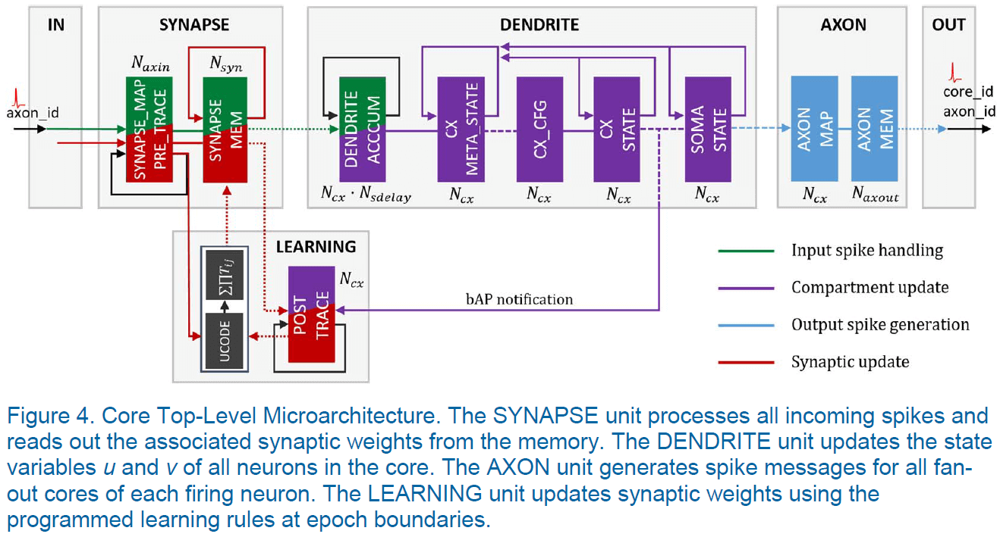

## [A million spiking-neuron integrated circuit with a scalable communication network and interface](https://science.sciencemag.org/content/345/6197/668)

- Authors built a 5.4 billion transistor chip with 4096 neurosynaptic cores that integrates 1 million programmable spiking neurons and 256 million configurable synapses.
- The chip can be tiled in 3D leading to seamless scaling to a cortex-like sheet of arbitrary size.
- One dream of neuroscience has been to use the insights gained from the brain to build a versatile computer that is both energy and space efficient.
- The von Neumann architecture fails to represent massive interconnected neural networks efficiently in terms of computation, memory, and communication.
- Paper found that event-driven communication with co-located memory and computation mitigates the von Neumann bottleneck.
- The key architectural abstraction is a network of neurosynaptic cores that can implement large-scale spiking neural networks.
- The basic building block, the unit, is a core of self-contained neural network with 256 input lines (axons) and 256 outputs (neurons) connected by 256-by-256 programmable synaptic connections.
- We can construct more complex networks by wiring together multiple cores using global, distributed on- and off-chip connectivity.
- Each neuron on every core can target an axon on any other core.
- Two stages of connecting two neurons
    1. A single connection travels a long distance between cores (axonal trunk).
    2. Upon reaching its target axon, it fans out into multiple connections that travel a short distance within a core (axonal arbor).
- Neuron dynamics is discretized into 1 ms time steps set by a global 1 kHz clock.
- The fundamental currency that mediates asynchronous inter-core communication are the all-or-nothing spike events that represent firing of individual neurons.
- Architecture is efficient because
    - Neurons form clusters that get their inputs from a similar pool of axons, allowing for co-localization.
    - Only spike events are communicated between cores.
    - Active power is proportional to firing activity.
- Architecture is scalable because
    - Cores and chips can be tiled in 2D (similar to the neocortex).
    - Each spike event addresses a pool of neurons on a target core, reducing the number of long-range spike events.
    - Defects at the core and chip level don’t disrupt system usability.
- Architecture is flexible because
    - Each neuron is configurable.
    - Each synapse can be turned on or off.
    - Each neuron-axon connection is programmable along with its axonal delay.
    - Neurons and synapses can exhibit programmed stochastic behavior.
- Although the brain has a dedicated wire for each connection between neurons, this architecture uses time-multiplexed wires and a router built into each core to manage packets.
- To implement feedback connections within a core, the packet is delivered by using the router’s local channel, which is efficient because then the packet never leaves the core.
- This functional blueprint was implemented in a physical chip called TrueNorth.
- Many algorithms, such as CNN, RBM, and HMM, were mapped to the chip.
- The standard benchmark of a computer architecture’s efficiency is energy per operation.
- In neuromorphic computing, the fundamental operation is the synaptic event.
- Synaptic events are the appropriate unit because the computation, memory, communication, power, area, and speed all scale with number of synapses.
- Power consumption in TrueNorth is a function of
    - Spike rate
    - Average distance traveled by spikes
    - Average number of active synapses per neuron (synaptic density)
- Computation in TrueNorth is measured by using synaptic operations per second (SOPS).

## [Neural systems engineering](https://dx.doi.org/10.1098%2Frsif.2006.0177)

- The hope that by emulating the brain, it’ll be possible to capture some of its capabilities and thereby bridge the large gap that separates mankind from machines.
- However, since our knowledge of the operational principles of the brain are incomplete, attempts at emulation must employ a great deal of assumptions and guesswork to fill in the gaps.
- Both brains and electronic computers are example of complex information processing systems.
- Brains are flexible, imprecise, error-prone, and slow; while computers are inflexible, precise, deterministic, and fast.
- They simply seem to be different types of systems.
- Why do we keep looking to the brain for inspiration?
- Part of the answer is because brains display very high levels of concurrency and fault-tolerance in their operation.
- Understanding how the brain functions is one of the last great frontiers of science.
- Two goals of this paper
    1. To develop a ‘neural toolkit’ that can be used to build computers that share some of the properties of the brain.
    2. To build a machine that will allow realistic simulation and study of the brain itself.
- The basic unit of the brain is the neuron.
- This means that an understanding the brain and mind must explain behavior in terms of neurons and their interactions.
- Neurons appear to be very flexible components that can be used in a vast range of complexities.
- E.g. From between different species to within species such a jellyfish, snakes, and mammals.
- Neurons are similar to logic gates in that both enjoy universal use and both are multiple-input and single-output components.
- However, neurons have more connections, for both input and output, than logic gates.
- The information conveyed by the neuron’s output is encoded in the timing of the spikes in way that isn’t yet fully understood.
- Accurate models of biological neurons exist but are very complex.
- The difficulty in using a neuron model is in determining which of the features are essential to the information processing functions of the neurons and which are artefacts from the way the cell developed.
- The universality of the neuron is reflected in the higher-level structure of the brain; also called the neural microarchitecture.
- E.g. The neocortex’s six-layered structure and its regularity of interconnections.
- The same laminar cortical microarchitecture is implemented across the cortex in regions that perform different operations.
- This suggests that there are principles being applied to each of these different operations, the understanding of which could offer a breakthrough in our understanding of brain function.
- In contrast to the microarchitecture, the connectivity patterns that underpin these structures appears to be random or guided by statistical principles.
- The power efficiency of neurons may be because the neuron is a relatively slow component.
- The relaxed performance of neurons (compared to transistors) is compensated by the very high levels of parallelism and connectivity of biological systems.
- Delivering the necessary level of computational power is a prerequisite to building a real-time model of the human brain.
- Another prerequisite is that a brain needs to have a sensory and motor system; it needs to be embodied.
- Neuromorphic computing: the goal of modelling the low-level details of neuronal processes in analog electronic circuitry.
- Key issues
    - Identifying the simplest models that capture the information processing functions of a neuron.
    - Representing the variety of neurons in the brain.
    - Identifying the neural codes that neurons use to communicate.
    - Identifying the mechanisms of neural adaptation that enable the system to self-organize and learn.
- We start by looking at the neuron as an information processing device.
- Any computational system must achieve a balance between its processing, storage, and communication functions.
- Review of dendrite, soma, axon, and synapse.
- The synapse is the primary location of adaptation in the neural system (I don’t quite agree as the synapse itself can be adapted, so really the connection is the primary adaptation).
- Processing is done mostly by the soma, although some is done by the dendrite (spatial and temporal summation).
- Communication is mostly done through the propagation of spikes.
- Since the spike carries no information in its shape or size, the only information conveyed is in which neuron fired and when (not quite true as the shape/size does affect summation at the dendrite).
- Storage of information is the neuron’s most complex operation and occurs over different time-scales.
- Since axons carry spikes at low speeds, they can act as delay lines, storing information for up to 20 ms as spikes propagate.
- One of the long-term storage mechanisms is synaptic modification.
- The trade-off between accuracy and computational complexity is a recurring theme in neural modelling.
- Review of Hebbian learning, LTP, LTD, and STDP.
- In population coding, each neuron fires independently and information is encoded across the firing rates that form the population.
- In rank-order coding, information is carried in the order of firing of neurons in the population.
- Rank-order codes represent a step towards exploiting the temporal properties of spiking patterns to convey information.
- Brains use massive numbers of low-speed channels to communicate neural spikes.
- Despite advances in the density of microelectronic components, artificial neural systems can’t match the physical connectivity of natural systems.
- However, electronic systems are about five orders of magnitude faster than biology.
- Therefore, it’s reasonable to multiplex events from many neurons along the same channel, because the channels are much faster than axons.
- Review of address-event representation (AER), where each neuron is given a unique address and when it fires, the spike is sent to all connected neurons.
- One problem with multiplexing multiple asynchronous events is collisions between two simultaneous events.
- This is in contrast to the brain where collisions are used for computation (spatial/temporal summation).
- The SpinNNaker architecture illustrates one of the important principles of engineering large-scale neural modelling systems: the need to decouple the physical organization of the engineered system from the physical organization of the biological system it’s designed to model.

## [Benchmarks for progress in neuromorphic computing](https://doi.org/10.1038/s42256-019-0097-1)

- For the field of neuromorphic computing to advance, it must start
    - Quantifying gains
    - Standardize benchmarks
    - Focus on feasible applications
- Even with the brain as a guide, reverse engineering such as complex system remains an open-ended and highly unconstrained problem.
- For the field to deliver on ambitious goals, it needs to focus more on principles and rigour, and less on open-ended exploration and mapping speculative mechanistic features to silicon.
- Benchmarking is the traditional methodology for measuring and focusing progress in engineering.
- A good benchmark serves to motivate researchers to solve one specific problem; one problem chosen to represent a broader class of problems.
- E.g. ImageNet represents the class of image classification problems.
- However, a poor benchmark will hinder progress by focusing on the wrong direction or on tunnel visioning to one metric.
- E.g. Synaptic ops are easy to measure but offer little value.
- It’s unwise to focus on datasets that presuppose a tabular rasa approach to learning, as this doesn’t match with how the brain learns.
- E.g. ImageNet and CIFAR-10 presuppose a blank neural network.
- Two reasons for neuromorphic computing to embrace benchmarks
    - Internally, as a way to measure the capabilities of different spiking neuromorphic architectures.
    - Externally, as a way to quantify the value of neuromorphic solutions compared to state-of-the-art conventional solutions.
- One hurdle for benchmarks is that there isn’t a standardized language for neuromorphic programming, such as C.
- Nonetheless, one example of a neuromorphic benchmark is SpikeMark.
- SpikeMark benchmarking suite
    - Classifying spoken keywords
    - Detecting hand gestures
    - Solving Sudoku
    - Controlling a robotic arm
- SpikeMark would evaluate the relative features, flexibility, performance and efficiency of different neuromorphic platforms.
- To accommodate a broad diversity of neuromorphic architectures, the suite needs to span a wide range of problem scales and evaluate metrics such as time-to-solution, energy-to-solution, throughput, and accuracy.
- The insights gained from these evaluations will lead to a thorough understanding of neuromorphic architectures and how they relate to conventional solutions.
- The ultimate demonstration of progress and value is to move beyond benchmarks and to solve a problem that is unsolved by computers.
- E.g. The most memorable milestones in AI are defined by beating human masters at problems such as chess, Jeopardy, and Go.
- This is similar to the idea of quantum supremacy for quantum computers.
- Quantum supremacy: the goal of demonstrating that a programmable quantum device can solve a problem that no classical computer can solve in any feasible amount of time.
- An increasingly common question in the neuromorphic field is: what will be the neuromorphic Go?
- It seems early to be dreaming of Go-scale accomplishments.
- The value of neuromorphic solutions emerging today relates mainly to latency and energy gains.
- Today, neuromorphic solutions have yet to demonstrate practical results that surpass conventional solutions.
- In the spirit of pitting human against machine, physical games with event-based sensing and closed-loop control provide a compelling near-term application challenge for neuromorphic systems.
- One upcoming game for neuromorphic benchmarking is foosball since it’s a good match for emerging event-based cameras with neuromorphic processing.
- Another application of neuromorphic computing is allowing computations to be performed at the edge, offering privacy and latency gains.
- E.g. Local, real-time speech translation or keyword detection in smart devices.
- Admittedly, none of these examples rises to the level of a grand challenge that would mark a new milestone in AI progress.
- To truly break new ground, we should look to the inherent scalability of neuromorphic systems.
- Efficient progress critically depends on embracing the right benchmarks and measuring progress in order to provide the clearest possible view of the road ahead.

## [An integrated brain-machine interface platform with thousands of channels](https://doi.org/10.1101/703801)

- Brain-machine interfaces (BMIs) hold promise to restore sensory and motor function and treat neurological disorders.
- Neuralink built an array of small flexible electrode threads with up to 3072 electrodes per array, spread out over 96 threads.
- They’ve also built a neurosurgical robot capable of inserting six threads (192 electrodes) per minute.
- A single USB-C cable provides the full bandwidth needed to stream data from the device, recording from all channels simultaneously.
- Spiking yield of up to 70%.
- BMI approach is the unprecedented packaging density and scalability in a clinically relevant package.
- Development of BMI has been limited by the inability to record from large numbers of neurons.
- Most BMI’s have used invasive techniques because the most precise readout of neural representations is reading single action potentials (AP).
- Microelectrodes are the gold-standard technology for recording APs, but there’s no clinical large-scale microelectrode technology.
- This requires the BMI to have high biocompatibility, be safe, durable, and needs a practical surgical approach.
- An alternative to using rigid metals or semiconductors as electrodes is to use thin, flexible polymer probes.
- The smaller size and increased flexibility of these probes offers greater biocompatibility.
- One drawback of polymer probes is that they’re not stiff enough to directly insert into the brain.
- Neuralink approaches this problem by using a robot to insert a large numbers of probes.
- Three main components of the Neuralink system
    - Ultra-fine polymer probes
    - Neurosurgical robot
    - Custom high-density electronics
- Threads
    - Main substrate and dielectric is polyimide, which carries a thick trace of gold film for recording APs.
    - Each array has a thread area that features electrode contacts and traces, and a sensor area where the thin film interfaces with custom chips that enable signal amplification and acquisition.
    - Since the gold electrode sites have small geometric surface areas, we use surface modification to lower the impedance for electrophysiology.
    - One treatment, PEDOT, lowers the impedance but the long-term stability and biocompatibility isn’t well established.
- Robot
    - Needle is made up of tungsten-rhenium.
    - There are different light modules, each at different wavelengths, to highlight different aspects of the needle-insertion process.
    - One module highlights the threads, another is for standard lighting, and one is for more precise estimation of the location of the cortical surface.
    - Locations are planned in software to avoid vasculature (blood vessels) and is one of the key advantages of inserting electrodes individually.
- Electronics
    - The recording stack must
        - Amplify small neural signals
        - Reject noise
        - Sample and digitize the amplified signals
        - Stream out the results in real-time
    - All while using minimal power and size.
    - Electronics are custom built around Neuralink application specific integrated circuit (ASIC), which has programmable amplifiers (analog pixels), analog-to-digital converters (ADC), and peripheral control circuitry.
- While most electrophysiologists detect and sort spikes offline, BMI events must be detected in real time and spike detection parameters must maximize decoding efficacy.
- Neuralink developed a high-channel and single-spike resolution BMI.
- The ASIC is also capable of electrical stimulation of every channels, but that capability wasn’t demonstrated here.

## [A Neuromorph’s Prospectus](https://doi.org/10.1109/MCSE.2017.33)

- Perhaps the error-tolerance seen in brains can be replicated by combining analog-dendritic computation with digital-axonal communication.
- Review of the problems of transistors being too small.
- There are two signal choices for communication and computation: analog or digital.
- Communication moves operands and results around, while computation combines operands to produce results.
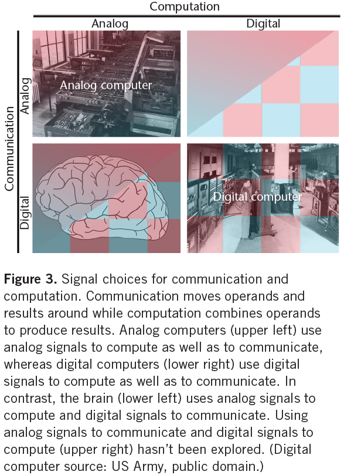
- Errors are highly probable when communication is maximally energy efficient, as in the brain.
- For computation, using analog signals is more energy efficient at low precision, whereas using digital signals is more energy efficient at high precision.
- This is because energy scales differently with precision for analog and digital computation.
- Analog computation consumes less energy at low precision because it uses fewer primitives than digital computation.
- E.g. Analog computation uses fewer transistors than digital computation.
- However, analog energy consumption scales quadratically with precision, while digital scales logarithmically.
- Neuromorph’s five point plan to address the nanotransistor challenge
    1. Implement computation with subthreshold analog circuits to be close to the theoretical minimum energy.
    2. Implement communication with asynchronous digital circuits to be robust to transistors that shut off intermittently.
    3. Distribute a computation across a pool of silicon neurons to be robust to transistors that shut off intermittently or permanently.
    4. Communicate spikes from pool to pool at a rate that scales linearly with the number of neurons per pool.
    5. Encode continuous signals in spike trains with precision that scales linearly with the number of neurons per pool.
- With successful execution of this plan, neuromorphic systems will achieve better energy efficiency than all-analog or all-digital solutions.
- The address-event bus/representation (AER) scheme in neuromorphic computing has reached its limits.
- The fundamental problem with AER is that we’re trafficking addresses at a rate that scales as the product of the number of neurons in a pool and the number of synaptic connections each neuron makes.
- This emulates quadratic scaling compared to the square-root scaling seen in the brain.
- To fix this issue, we can reduce the traffic by emulating two organizational principles seen in the brain to scale its axon count.
    - Overlapping dendritic trees within a pool of neurons.
    - Hierarchical axonal arbors between pools of neurons.
- By emulating these two principles, we can also emulate cortical columns.
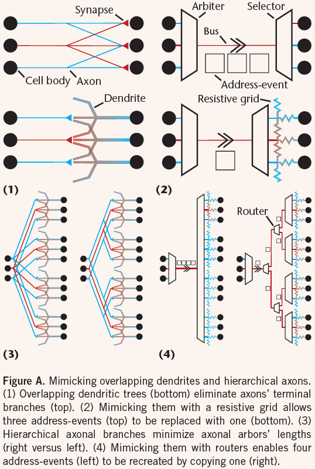
- The secret to scaling inter-pool communication linearly with neuron count is to emulate the cortex’s hierarchically branching wiring patterns.
- Hierarchical organization amortizes the cost of more energetically expensive memory lookups and address-event communication over greater numbers of synapses to minimize the average energy consumed per synaptic activation.
- This organizational principle recognizes that energy consumption is proportional to how far information travels.
- Minimizing the number of spikes used to transmit a signal minimizes the amount of energy consumed to communicate it, as well as to lookup the synaptic/decoding weights applied to it.
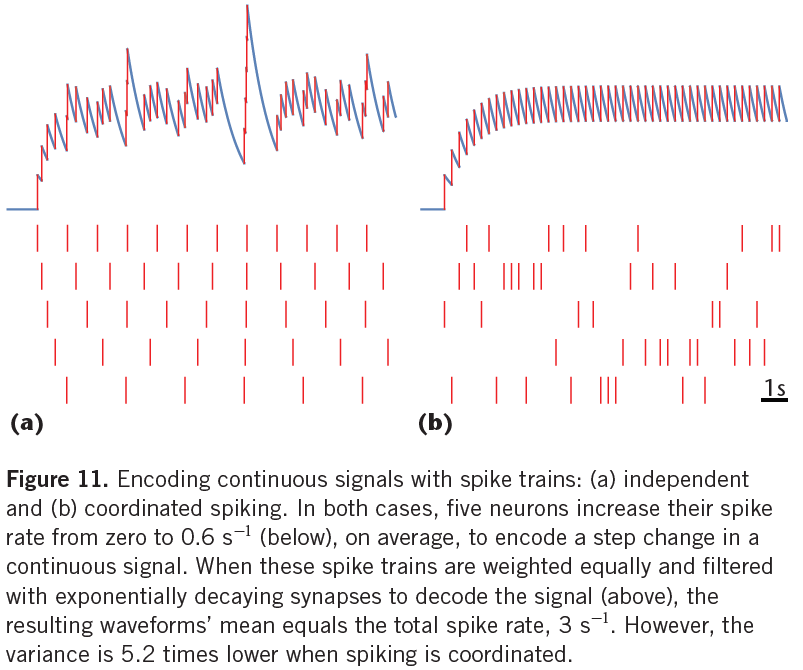

## [The business of building brains](https://doi.org/10.1038/s41928-020-0449-1)

- Drawbacks to cloud computing
    - Communication hardware takes up space
    - Sending data off the device is less secure
    - Latency/lag
- The answer may be neuromorphic computing.
- It’s hard to know when to call a processor neuromorphic.
- Is parallelism enough? Spiking? Analog processing?
- Review of current neuromorphic companies such as Intel and IBM and neuromorphic startups.
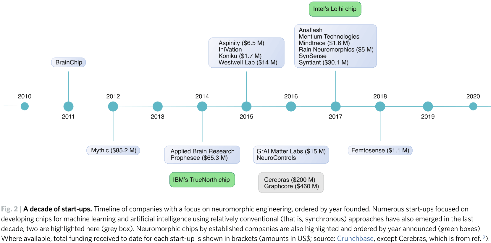
- One critical aspect of a neuromorphic company is having a complete solution; from sensors to processors.

## [Building brain-inspired computing](https://doi.org/10.1038/s41467-019-12521-x)

- An article with questions and answers from four researchers in neuromorphic computing.
- How closely should neuromorphic computing emulate the brain?
- AI needs new hardware, not just new algorithms.
- Tricks employed by brains
    - Analog and in-memory computing
    - Massively parallel processing
    - Spike coding
    - Task-specific connectivity
- Maybe we shouldn’t blindly try to mimic all features of the brain without having a good engineering reason first.
- The evolution of biological brains has been constrained to biomaterials optimized for specific tasks, while we have a much wider range of material choices.
- E.g. Brains have to rely on poor conductors offered by biomaterials, which presumably affect the principles of brain structure and operation in some ways that aren’t necessarily applicable to neuromorphic computing.
- Neuroscience has made tremendous progress in uncovering the information processing principles used by the brain.
- Fortunately, we have many different types of brains as a great source of inspiration for these innovations.
- As a guiding principle, a good neuromorphic engineer should try to use the best of all the existing/emerging technologies and tools that exist today to optimize the design of the targeted neuromorphic computing system.
- Transistors will remain the best way to provide signal gain for many years to come because they’ve been optimized to do so.
- The construction of an optimal neuromorphic computing system requires knowledge of fundamental neuroscience, computer science, materials science, robotics, and electronics.
- The major hurdle is in acquiring knowledge in all of these interdisciplinary fields.
- The brain is like a crazy 3D wool ball with interconnected organic wires.
- Each neuron is connected to an average of ten thousand synapses.
- Given the risks and challenges with neuromorphic computing, one approach would be to make gradual progress by starting with the simplest, yet practical, neuromorphic system.
- We would then become more confident in building more complex neuromorphic computing hardware as the next steps.
- Another approach is to clearly identify the target application by focusing on building very specific and highly optimized computing systems, and giving up on the goal of developing a general-purpose computing platform.
- One of the major limitations of neuromorphic hardware is that there is a huge community of investigators who work on the algorithms for training deep networks and a separate community that works on the hardware implementations.
- These communities should work together.

## [Event-Driven Signal Processing with Neuromorphic Computing Systems](https://doi.org/10.1109/ICASSP40776.2020.9053043)

- Paper provides an overview of the tools and methods for building applications that run on neuromorphic computing devices.
- The computational cost of processing a temporal data stream depends primarily on the length of the data stream and the granularity of its discretization.
- However, continuously processing a data stream is costly in terms of energy, so a more efficient approach involves processing inputs in an event-driven manner.
- This means performing certain computations only when certain signals of interest occur in the input data.
- Neuromorphic computers are a class of hardware devices designed to perform event-based computations by mimicking the spiking behavior observed in biological neurons.
- A typical neuromorphic computer consists of a large inter-connected mesh of neuron-like processing elements that communicate with each other in parallel using discrete payloads called spikes.
- E.g. IBM’s TrueNorth, Intel’s Loihi, UManchester’s SpiNNaker, and UStanford’s Braindrop.
- Most neuromorphic software tools are designed specifically for computational neuroscience research.
- E.g. IBM Corelet, Intel’s NxSDK for Loihi, and PyNN for SpiNNaker.
- Nengo, the author’s neural software package, is designed to fill the gap in cross-platform programming tools by allowing a single model to be executed on a variety of different hardware.
- Paper tested Nengo on Loihi in a keyword spotting task and found that it used at least five times less energy than the same model running on DNN accelerators.
- The keyword spotting task involves monitoring a continuous audio stream for one or more keywords of interest.
- E.g. Alexa, Siri, Ok Google.
- State-of-the-art neuromorphic chips are increasingly adopting a hybrid design to address the problem of converting a high dimensionality input into spikes.
- The hybrid design encodes feature vectors in floating point operations and not spikes as encoding into spikes is much less efficient given the numerous spikes needed per dimension.
- One reason why a SNN is more efficient than a DNN is because spikes are treated as binary events and use addition to compute in SNNs, while activation values in a DNN are continuous and requires full multiplication.
- Estimates of energy consumption suggest that the switch to neuromorphic computing can lead to substantial efficiency improvements on practical tasks such as keyword spotting.
- Neuromorphic devices hold considerable promise as tools for enabling energy-efficient signal processing.

## [Physics for neuromorphic computing](https://doi.org/10.1038/s42254-020-0208-2)

- Neuromorphic computing takes inspiration from the brain to create energy-efficient hardware for information processing that’s capable of solving highly sophisticated tasks.
- Scaling-up such systems and improving their energy usage, speed, and performance requires a revolution in hardware.
- Paper discusses how including more physics in the algorithms and nanoscale materials used for data processing can have a major impact in the field of neuromorphic computing.
- Paper also argues that building this new hardware necessitates reinventing electronics.
- Furthermore, that research in physics and material science will be key for creating artificial nanoneurons and synapses, connecting them in huge numbers, organizing them, and computing with them.
- The brain as inspiration
    - Biological brains perform extremely complicated tasks because living requires solving complex problems.
    - Brains compute with a remarkably low energy budget because organisms can’t use more energy than what they can fetch and store.
    - The brain differs vastly from human-made computing systems, both in terms of topology and in the way it processes information.
- The brain exhibits a range of fascinating phenomena for physicists such as
    - Minimization of energy/entropy
    - Phase transitions and criticality
    - Self-oscillations
    - Chaos
    - Synchronization
    - Stochastic resonance
- Physicists view the brain as a non-linear, dynamical system similar to a spring or the weather.
- Review of the von Neumann bottleneck (separation of memory and processing).
- CMOS-based artificial neurons and synapses are typically several micrometers wide despite the size of transistors being tens of nanometers.
- The number of physical neurons and synapses that can be integrated in a CMOS chip is inherently limited by the chip area, and this loss of density is a problem because neural networks require many neurons and synapses.
- Large numbers of neurons and synapses can be obtained by assembling chips together, but the whole system becomes bulky and less energy efficient.
- Nanodevices that can mimic the important features of neurons and synapses at the nanoscale are required to build low-power chips with high neuronal and synaptic densities.
- Another drawback of CMOS technology is that it’s difficult to achieve a high degree of interconnectivity between neurons, such as the average 10,000 synapses per neuron seen in the human brain.
- Such connectivity is impossible to reproduce with CMOS technology, which is usually confined to 2D with limited fan-out.
- Fan-out: the typical number of connections spreading from a given point in a circuit.
- It’s also difficult to efficiently and evenly supply energy to the components, which is in contrast to the brain’s 3D axons and dendrites that have high fan-in and fan-out, and blood that efficiently distributes energy to the whole system.
- Properties that we wish to have with nanoneurons
    - Low energy
    - High endurance
    - Easy to read/write data
    - Provide signal gain and memory
    - Tunable, active, dynamic, reconfigurable, and multifunctional
    - Large fan-in and fan-out
    - Large interconnectivity
    - Self-assembled
    - 3D interconnects
    - Easy to manufacture
    - Low cost
- Randomness/stochasticity in the brain comes from two main sources: ion channels and synaptic release.
- Given this randomness, we can interpret this as the brain not maximizing information transfer itself, but rather the ratio between information transfer and energy.
- How can the general features of the brain be transformed into important contributions to the field of neuromorphic computing?
- Two main approaches
    - Map conventional neural network algorithms to dedicated physical systems.
    - Take inspiration from neuroscience to equip ANNs with additional features and dynamics.
- Review of deep learning, TPUs, backpropagation.
- Neuromorphic chips have the potential to accelerate both the inference (feed forward) phase and the training phase.
- One challenge is to build systems that are compatible with the hierarchical layered organization of ANNs.
- Two potential solutions
    - Hybrid CMOS/memristive systems
        - Neurons are made of analog/digital CMOS and information flows through the network as electrical current.
        - To regulate information flow, a synapse acts as a valve for the current.
        - The valve can be implemented with a memristor.
        - Memristor: resistors with non-volatile analog conductance states that are tunable by an applied voltage.
        - Memristors directly implement the multiply-and-accumulate operation through Kirchhoff’s laws.
    - Photonic systems
        - Networks made with optical components.
        - Nonlinearity for implementing neurons can be provided by the Kerr effect.
        - Kerr effect: a change of the refractive index of a material due to an applied electric field.
        - Synaptic multiply-and-accumulate function can be implemented by combing multiple interferometers or by modifying the transmission of optical waveguides with optically active phase-change materials deposited on top.
        - Advantages include conveying large amounts of information in parallel on a single fiber through wavelength multiplexing.

- Materials exhibiting electronic phase transitions, such as Mott insulators, can emulate spiking neurons.
- Among these different bioinspired approaches, the most interesting are probably those that will allow crafting of synapses and neurons using the same technology, thus allowing easier co-integration with large-scale systems and implementation of learning algorithms.
- Algorithms and physical computing substrates should be developed hand in hand.
- Neuromorphic computing requires both physics/materials science to engineer devices with brain-like functions, and bioinspired computing models to develop algorithms.
- The brain is able to learn with unreliable and stochastic components.
- So it should be possible to invent novel algorithms that allow learning with units that are imperfect, dynamic, and noisy.
- Building large-scale systems often requires access to a CMOS foundry and to industrial partners.
- However, academic/small laboratories can make important contributions by developing ‘toy’ physical neuromorphic systems.
- Develop small physical neuromorphic systems to test some hypothesis and draw some conclusions.
- One of the ultimate goals of neuromorphic computing is to build large-scale systems made up of tens of billions of components.
- Thus, care should be taken to study materials and physics that are scalable.
- Challenges of scaling
    - Densely and efficiently interconnecting synapses and neurons.
        - One solution is to step away from bioinspiration and use CMOS circuits for interconnection.
        - This means to use conventional electrical engineering methods to route signals such as multiplexing and routers to limit the number of interconnections.
        - Thus, high-density connectivity is compensated by fast digital circuits.
        - Another solution is to harness physics, materials science, and nanotechnology to densely connect the neural network at the system level.
        - Other solutions include wireless communication and self-assembly of nanoparticles.
    - Dealing with nanodevice variability
        - Training the network on-chip is the best way to compensate for device variations.
- The future of neural network hardware is still open-ended.
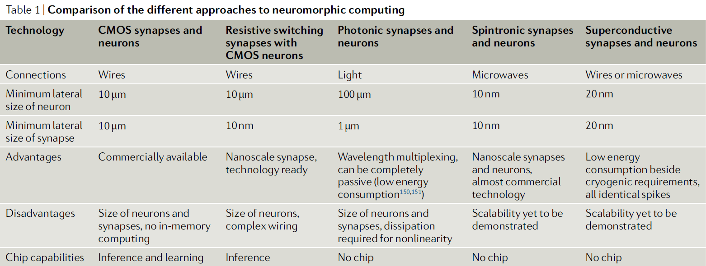
- Cross-fertilization between quantum computing and neuromorphic computing is likely to bring remarkable results.
- Reaching the commercial level will require
    - Optimizing technology for neuromorphic applications.
    - Adapting computer-aided design tools to design neuromorphic hardware efficiently.
    - Focusing on key applications that neuromorphic computing has a clear advantage.
    - Developing appropriate datasets, benchmarks, and standards.

## [Benchmarking Keyword Spotting Efficiency on Neuromorphic Hardware](https://arxiv.org/abs/1812.01739)

- Paper analyzes the inference speed, dynamic power consumption, and energy cost per inference of a two-layer ANN keyword spotter.
- Hardware devices: CPU, GPU, Nvidia TX1, Movidius neural compute stick, Loihi.
- Results show that for real-time inference, Loihi outperforms all of the devices on an energy cost-per-inference basis, while maintaining equivalent accuracy.
- Keyword spotting: monitoring a real-time audio stream for detecting some keyword of interest.
- E.g. “Hey Siri” or “Hey Google”.
- This task is useful for benchmarking neuromorphic devices because it
    - Requires low-latency processing of real-time input signals.
    - Benefits considerably from improvements in energy efficiency.
    - Has numerous practical applications in mobile and IoT devices.
- The keyword spotting task is to take an audio waveform and convert it into a sequence of characters to determine whether the utterance contains the keywords of interest.
- Pipeline
    - Waveform → Mel-frequency Cepstral Coefficients (MFCC) → Network
- Methodology
    1. Estimate idle power consumption
    2. Log power reading during runtime
    3. Estimate dynamic power by subtracting idle baseline from log
    4. Estimate average logging interval and average number of inferences per interval
    5. Estimate dynamic joules per inference from 3 and 4
- Paper demonstrates that running a keyword spotting application on a state-of-the-art neuromorphic processor results in improved energy efficiency on a cost-per-inference basis over other computing devices.
- These efficiency gains come with no penalty to model accuracy.

## [A Survey of Neuromorphic Computing and Neural Networks in Hardware](https://arxiv.org/abs/1705.06963)

- The promise of neuromorphic computing is to create a brain-like ability to learn and adapt, but the technical challenges are significant.
- Challenges
    - Need an accurate neuroscience model of how the brain works.
    - Finding materials and engineering breakthroughs to build devices to support these models.
    - Creating a programming framework so the systems can learn.
    - Create applications with brain-like capabilities.
- This paper provides a comprehensive survey of the research and motivations for neuromorphic computing over its history.
- We start with a 35-year review of the motivations behind neuromorphic computing and then look at the major research areas of the field.
- Comparing von Neumann architectures to the human brain highlights significant differences in organizational structure, power, and processing capabilities.
- This leads to a natural question regarding the feasibility of creating alternative architectures based on neurological models.
- Neuromorphic computing has emerged as a complementary architecture to von Neumann systems.
- Notable properties of neuromorphic architectures
    - Highly connected and parallel
    - Requires low-power
    - Collocates memory and processing
- Neuromorphic computing has received increased interested due to the end of Moore’s law, the increased power demands associated with Dennard scaling, the low bandwidth between CPU and memory known as the von Neumann bottleneck, and ML
- The neuromorphic community is quite broad with researchers from
    - Materials science
    - Neuroscience
    - Electrical engineering
    - Computer engineering
    - Computer science
- The desire to replicate the brain is as old as computer science itself, with both von Neumann and Turing discussing brain-inspired machines back in the 1950’s.
- Most of the early work in neuromorphic computing was spurred by the development of hardware that could mimic the brain.
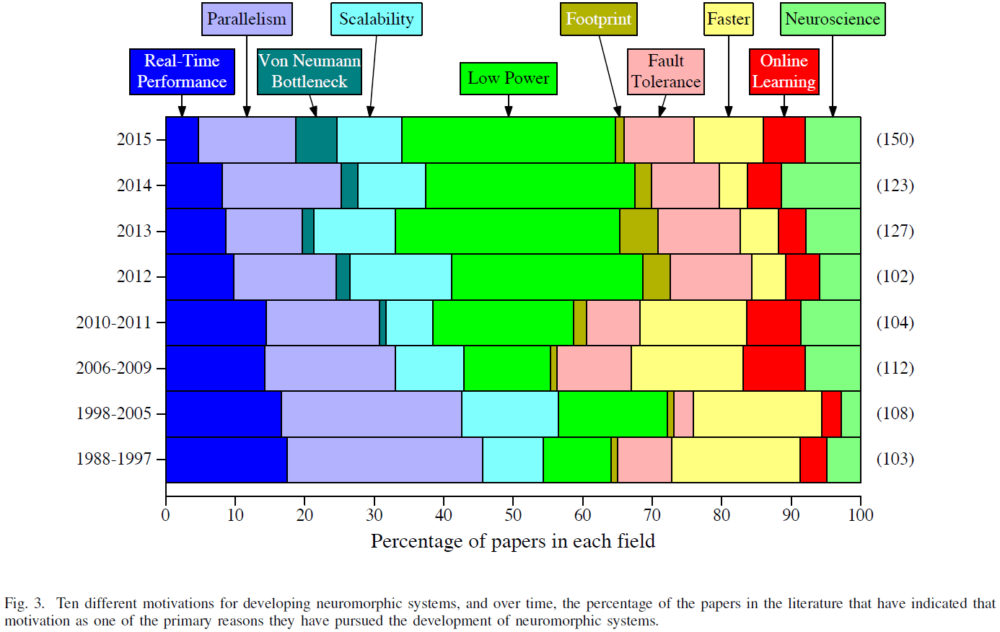
- The most popular motivation in present-day literature and discussions of neuromorphic systems is the emphasis on their potential for extremely low power operation.
- E.g. The human brain requires about 20 watts of power and performs extremely complex computations and tasks on that small power budget.
- Another major motivation in recent years has been to use neuromorphic hardware to study neuroscience.
- E.g. Simulating relatively realistic neural behavior since it isn’t feasible on a traditional supercomputer.
- One of the key questions associated with neuromorphic computing is which neural network model to use.
    - What components make up the network.
    - How those components operate.
    - How those components interact.
- NN models are chosen based on the particular application and the characteristics/limitations of the hardware.
- Five types of neuron models
    - Biologically-plausible: explicitly model biology.
    - Biologically-inspired: attempt to replicate behavior.
    - Neuron+Other: biologically-inspired components.
    - Integrate-and-fire: simpler category of biologically-inspired.
    - McCulloh-Pitts: derivative models of the original MP neuron.
- These types lie on a spectrum from biologically accurate components and behavior to biologically inaccurate.
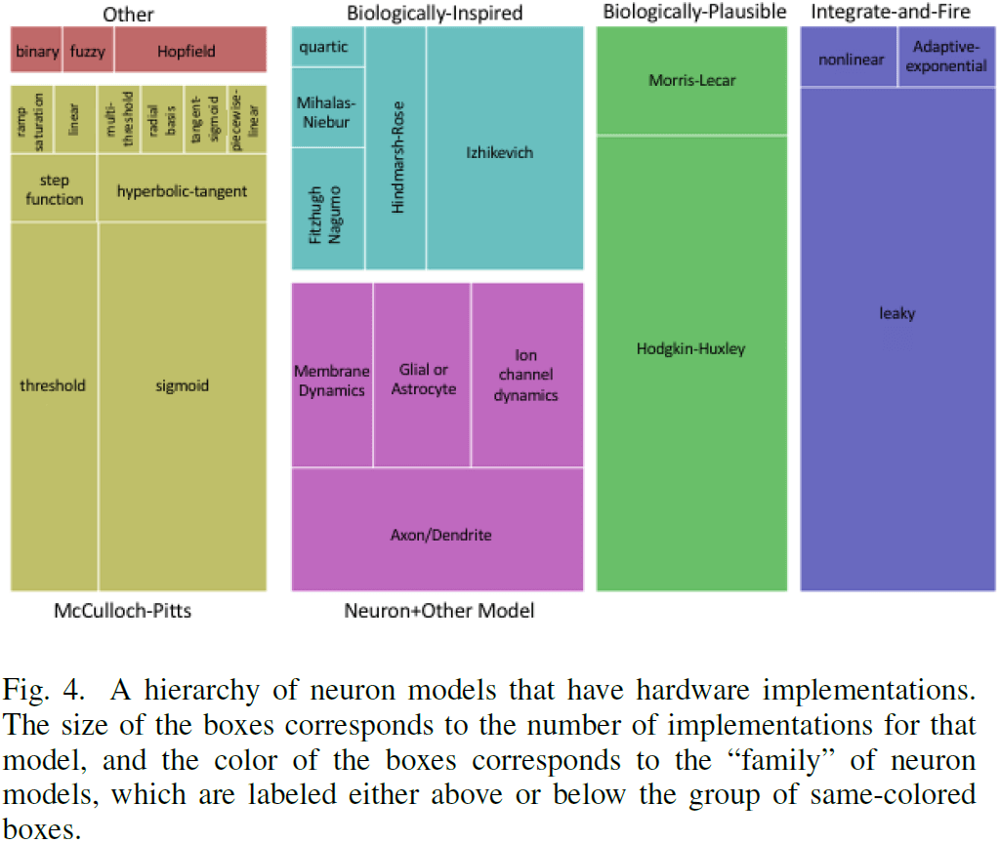
- There are a wide variety of neuron models implemented in hardware, and one of the decisions a user makes is the tradeoff between complexity and biological inspiration.
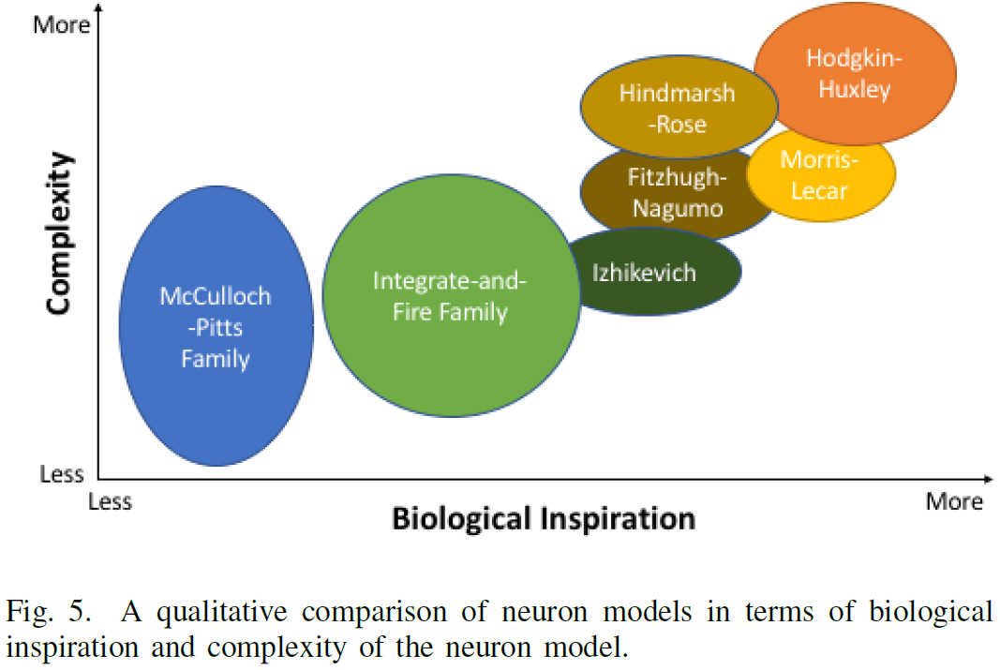
- Neuromorphic work has also focused on modeling synapses, not just neurons.
- Two types of synapse models
    - Biologically-inspired
    - Traditional ANNs
- It’s worth noting that synapses are typically the most abundant element in neuromorphic systems.
- For many hardware implementations, the focus is typically on optimizing the synapse implementation since there are so many of them.
- This means making them simple unless we want to include more biological behavior.
- One popular inclusion is a plasticity mechanism for learning and memory.
- E.g. LTP, LTD, and STDP.
- Network models describe how different neurons and synapses are connected and how they interact.
- Once again, these models range from trying to replicate biological behavior to being more computationally-driven.
- Depending on the hardware, the network connectivity/topology may be restricted.
- The most popular implementation by far is feed-forward neural networks.
- Less common neural network models include
    - Cellular automata
    - Fuzzy neural networks
    - Hierarchical temporal memory
- Overall, choosing the right model depends on the goal of the neuromorphic system.
    - Projects whose goal is to produce useful neuroscience results usually are biased towards biologically-plausible/inspired models.
    - Projects whose goal is real-world applications usually are biased towards ANN models.
    - The choice of model also depends heavily on the hardware and how well the model fits the hardware.
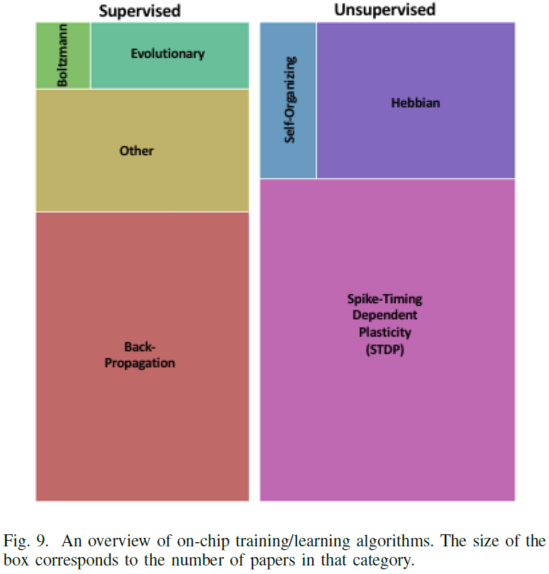
- Considerations when choosing algorithms
    - How the chosen neuron, synapse, and network models impact the algorithm.
    - Whether training or learning should be implemented on- or off-chip.
    - Whether the algorithms should be online or offline.
- The most common algorithm for programming neuromorphic systems is the backpropagation algorithm.
- However, backpropagation is also relatively restrictive on the type of neuron and network model that can be used in an efficient way.
- Main supervised training algorithms
    - Boltzmann
    - Evolutionary
    - Backpropagation
- The need for on-chip, online, and unsupervised training mechanisms in neuromorphic systems will be necessary to realize the full potential of neuromorphic implementations.
- Main unsupervised training algorithms
    - STDP
    - Hebbian
    - Self-organization rules/maps
- We believe that the full capabilities of spiking neuromorphic systems haven’t yet been realized by training and learning mechanisms.
- One step in realizing that potential is by developing spiking network models that are energy efficient and that match the hardware’s characteristics.
- However, the downside to choosing Hebbian/STDP learning is that they haven’t been demonstrated to be widely applicable.
- Three types of neuromorphic hardware
    - Digital: uses Boolean logic-based gates such as AND, OR, and NOT.
    - Analog: uses the native physical characteristics of electronic devices as part of the computation.
    - Mixed: a combination of both digital and analog.
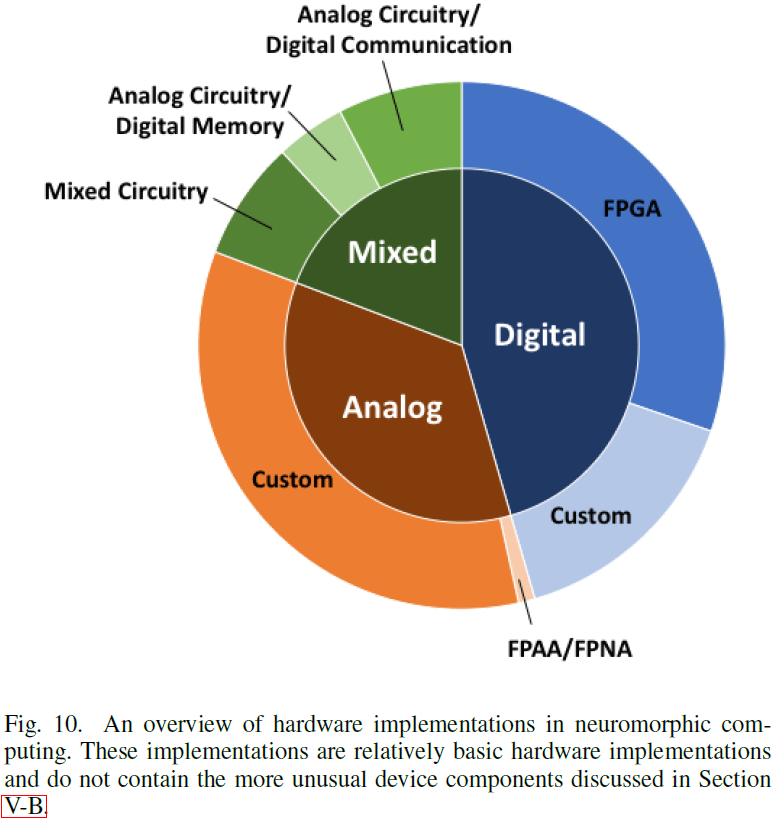
- The biological brain is an analog system and relies on physical properties for computation and not on Boolean logic.
- In digital neuromorphic hardware, FPGAs aren’t often used as part of the neuromorphic implementation, but rather to program the device as a neuromorphic system.
- Since FPGAs are relatively common, researchers can work with hardware description languages such as VHDL or Verilog to implement circuits in FPGAs.
- Another common neuromorphic implementation is on application specific integrated circuit (ASIC) chips.
- As there are FPGAs for digital systems, that are also field programmable analog arrays (FPAAs) for analog systems.
- SNNs are natural applications for analog circuity because they can operate asynchronously and can deal with noise and unreliability.
- One of the common approaches for analog neuromorphic systems is to use circuitry that operates in subthreshold mode, typically for power efficiency purposes.
- The third type of neuromorphic hardware, mixed, is also commonly used because several issues with analog systems can be overcome by using digital components.
- E.g. Synaptic weights are frequently stored in digital memory for analog neuromorphic systems or they use digital communication because it’s more reliable.
- Device-level components
    - Memristors: the resistance value is dependent upon historical activity.
    - CBRAM and atomic switches.
    - Phase change memory.
    - Spin devices: magnetic devices.
    - Floating gate transistors.
    - Optical.
- One of the key areas of development in neuromorphic computing has been the fabrication and characterization of materials.
- Three levels of neuromorphic hardware
    - Full device
    - Device component
    - Materials
- Two key supporting systems for neuromorphic devices
    - Communication frameworks
    - Software
- Communication in neuromorphic systems includes both intra- and inter-chip communication.
- The most common inter-chip communication protocol is the address-event representation (AER).
- In AER, each neuron has a unique address and when a spike is generated, the address specifies which chip it will go to.
- One of the key parts of AER is that communication is asynchronous.
- 3D integration has been used in neuromorphic systems to go beyond the von Neumann architecture.
- Software will be a vital component for neuromorphic systems to be truly successful and accepted.
- However, software hasn’t been a focus of neuromorphic researchers.
- Two types of software tools
    - Mapping: taking an existing NN model and converting it to a particular neuromorphic architecture.
    - Programming: allowing a user to explicitly program a particular neuromorphic architecture.
- When building a neuromorphic system, it is extremely important to think about how the neuromorphic system will actually be used in real computing systems with real users.
- Compared to the number of hardware implementations of neuromorphic systems, there are very few works that focus on the development of supporting software that will enable ease-of-use for these systems.
- The “killer” applications for neuromorphic computing have yet to be determined.
- Paper omits discussing how neuromorphic systems are used to study neuroscience, and instead focuses on other real-world applications.
- Major neuromorphic applications
    - Sensory applications such as vision and audition
    - Brain-machine interfaces (BMI)
    - Robotics
    - Control tasks
    - Video games
    - Neural networks
    - Smart sensors and Internet of Things (IoT)
- Tasks that require real-time performance, a small footprint, and low power are common use-cases for neuromorphic systems.
- Future directions
    - Neuromorphic systems may speed up SNNs performance as GPUs did for DL.
    - The use of new and emerging technologies and materials.
    - How to best build software for neuromorphic systems.
- The motivations for building neuromorphic computers have changed over the years, but the core ideas remain such as low-power, massively parallel, real-time, and potential to train/learn.
- It isn’t clear that the wide variety of models will ever be narrowed down to an all-encompassing model.
- Moving forward, we will need to address building training and learning algorithms specifically for neuromorphic systems, rather than adapting existing algorithms that were designed for a different architecture.
- There is relatively little supporting software in the neuromorphic community, which will need to be addressed in the future.
