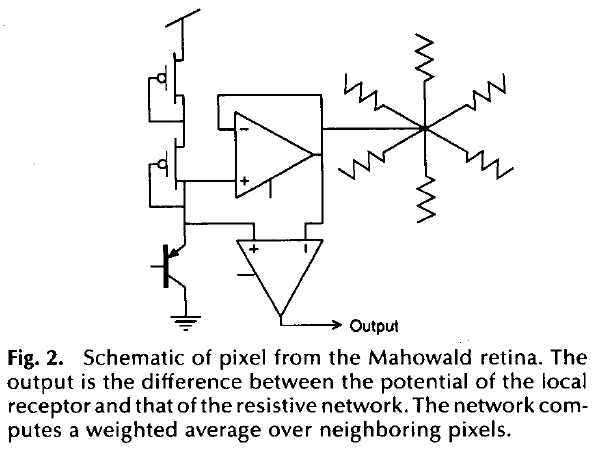
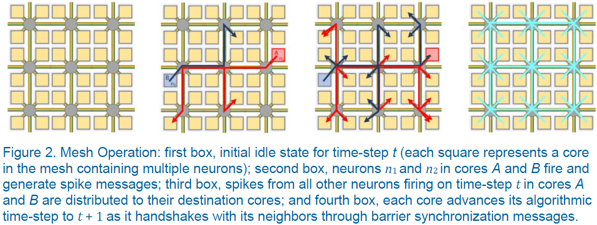
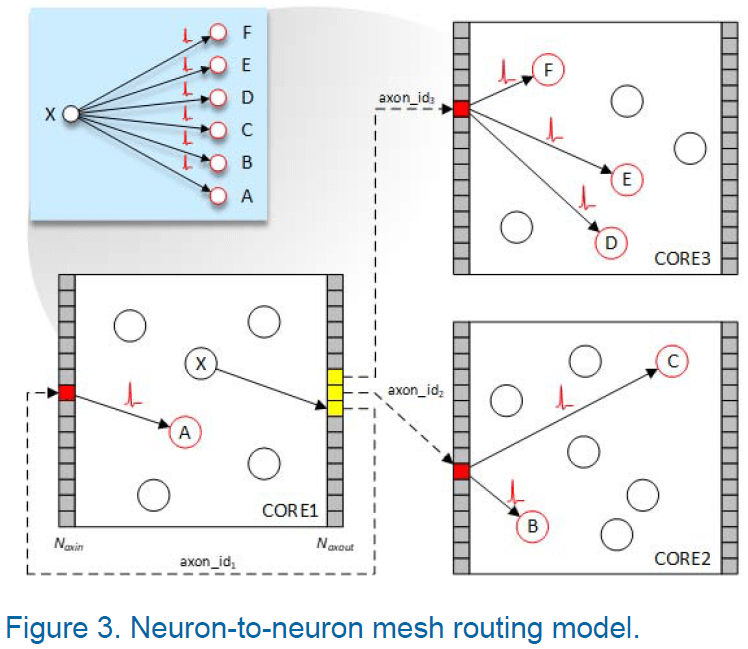

## [How we created neuromorphic engineering](https://doi.org/10.1038/s41928-020-0448-2)

- The retina is an extension of the brain into the eyeball.
- Its function is to extract information from the visual scene that is useful to the animal, and pass this compressed information to higher levels in an efficiently encoded form.
- The best conductor available to animals is salt water, which is enclosed in a tubular membrane and wrapped in a very low dielectric constant insulator called myelin.
- These nerve fibres (axons) are a very clever use of the materials at hand, but they are still orders of magnitude slower than silicon technology.
- Common theme of decoded neural representations: information is represented by the relative time of arrival of nerve spikes that are digital in amplitude but analogue in time.
- Neurons are elegantly tuned to only respond to certain sequences of incoming spikes, or any sub-sequence of it.
- E.g. A light scene is the full sequence but a dark scene contains only sub-sequences.
- The dendritic tree has an elegant adaptive gain-control system, so that it raises its threshold criterion as more of the full sequence is available.
- Learn the art of analogue CMOS design.
- Address-event representation: when a sensor chip recognizes a meaningful input, it generates a multi-wire output that identifies the location and identity of the event.
- Meaningful changes in an image are sparse, so it pays to identify them in the image plane and to send them on as soon as they’re identified.
- Compared to the current frame-based cameras we currently use that requires the entire image before changes can be identified.
- Silicon retinas = dynamic vision sensors.
- The computation consists of a prediction of the future input, and a comparison of that prediction to the actual input when it arrives.
- When the prediction is correct, the model isn’t updated. When the prediction is incorrect, the model is updated to correct its mistake.

- Only the relative contrast in space/time is passed on to the next level of processing, not the absolute value.
- Neural networks, at the conceptual level, take their overall strategy from the nervous systems of animals. However, on the implementation level, they are still a brute-force strategy, using little of the cleverness of nature.

## [Neuromorphic Electronic Systems](https://doi.org/10.1109/5.58356)

- Biological information-processing systems operate on completely different principles from those with which most engineers are familiar.
- The advantage of biological solutions can be attributed principally to the use of elementary physical phenomena as computational primitives, and to the representation of information by the relative values of analog signals, rather than by absolute values of digital signals.
- Large-scale adaptive analog systems are more robust to component degradation and failure than are more conventional systems, and they use far less power.
- As technology has evolved, it has always moved in the direction of lower energy per unit computation.
- E.g. From vacuum tubes to transistors to integrated circuits.
- There’s a myth that the nervous system is slow, is built out of slimy stuff, uses ions instead of electrons, and is therefore ineffective.
- It isn’t difficult to multiply numbers in a bank account, it’s difficult to process the poorly conditioned sensory information that comes in through the lenses of an eye or through the eardrum.
- The brain is a factor of 1 billion times more efficient than our present digital technology and a factor of 10 million more efficient than the best digital technology that we can imagine.
- We have something fundamental to learn from the brain about a new and much more effective form of computation.
- Even the simplest brains do computations we don’t know how to do, in ways we don’t understand.
- Perhaps the brain is more efficient because at the nerve membrane level, it’s manipulating single molecules compared to our continuum physics transistors.
- This isn’t true, however, as nerve membranes use population of channels, rather than individual channels, to change their conductances, similar to how transistors use populations of electrons rather than single electrons.
- The disparity between the efficiency of computation in the nervous system and that in a computer is primarily attributable not to the individual device requirements, but rather to the way the devices are used in the system.
- There’s nothing in the nervous system that we can’t emulate with electronics if we understand the principles of neural information processing.
- Improve energy efficiency by making algorithms more local so we don’t have to ship data all over the place.
- Systems can be divided into three levels
    - Elementary functions
    - Representation of information
    - Organizing principles
- E.g. For computers, we represent information as bits, 0 or 1, and the elementary functions on these bits are usually AND, OR, and NOT.
- To build a nervous system or computer, we must be able to make specific connections; a particular output is connected to certain inputs and not to others.
- To achieve this, we must be able to isolate one signal from other signals. Both electronics and the nervous system achieves this isolation by building an energy barrier.
- E.g. In the nervous system, it’s the membrane potential generated by the difference in dielectric constant between fat and aqueous solutions. In electronics, its the difference in the bandgap between silicon and silicon dioxide.
- The nervous system uses, as its basic operation, a current that increases exponentially with voltage.
- To build a neuromorphic system, we start by letting the device physics define out elementary operations.
- These functions provide a rich set of computational primitives, each a direct result of fundamental physical principles.
- However, these operations aren’t the familiar AND and OR that’s used in computers.
- If we try to fight them, to turn them into something familiar, then we make a mess.
- Mahowald silicon retina model

    - The output of the circuit represents the difference between a center intensity and a weighted average of the intensities of surrounding points in the image.
    - The center-surround computation is sometimes referred to as a Laplacian filter and can be approximated by a difference in Gaussians.
    - This computation has been useful in helping computers localize objects because discontinuities in intensity frequently correspond to object edges.
    - The computation occurs as a natural result of an efficient physical implementation of local normalization of the signal level.
    - In addition to its role in gain control and spatial filtering, the retina sharpens the time response of the system as an intrinsic part of its analog computation.
    - Effective temporal processing requires that the time scale of the computation be matched to the time scale of external events. In other words, event-based processing.
    - The model enhances both the first temporal and second spatial derivatives of the image.
    - It also displays several well-known optical illusions such as Mach bands.
- Adaptive retina model
    - One problem with the Mahowald retina is that the circuit is sensitive to transistor offset voltages.
    - E.g. Under uniform illumination, the output is a random pattern reflecting the properties of individual transistors, no two of which are the same.
    - This same problem occurs in biological retinas and they compensate for this lack of precision using adaptive mechanisms.
- We can view the function of a particular part of the nervous system as making a prediction about the spatial and temporal properties of the world.
- The system only sends information up a level when something unexpected has occurred; when there’s a difference.
- If we repeat this operation at each level of the nervous system, the information will be of higher quality at each subsequent level because we process only the information that couldn’t be predicted at lower levels.
- The most important property of this kind of system is that the same mechanism that adapts out errors and mismatches in its individual components also enables the system to build its own models through continued exposure to information coming in from the world.
- This kind of system is self-organizing in the most profound sense.
- Advantages of adaptive analog systems (neuromorphic)
    - Low-power
    - Easy heat dissipation
    - Robust to failure of a few components
    - Can be built in 3D instead of 2D
- The brain has evolved a mostly local wiring strategy to keep the scaling from getting out of hand.
- The nervous system is organized such that, on average, the number of wires decreases no more slowly than the inverse square of the wire’s length. This applies to both 2D and 3D scaling.
- The cortex of the human brain, basically 2D, won out over the 3D strategies used by more primitive animals because it could evolve more easily.
- New areas of cortex could arise in the natural course of evolution, and some of them would be retained if they conveyed a competitive advantage for their owners.
- This gives us hope that a neural structure comprising many 2D areas can be made into a truly useful, massively parallel, adaptive computing system.

## [Exploring Neuromorphic Computing for AI: Why Spikes?](https://www.intel.com/content/www/us/en/artificial-intelligence/posts/exploring-neuromorphic-computing-for-ai-why-spikes-part-one.html)

- Neuromorphic computing seeks to exploit the many properties of neural architectures found in nature such as
    - Integrated memory and computation
    - Parallelism
    - Feedback and recurrence
    - Network fan-outs
    - Low precision and stochastic computation
    - Continuously adaptive and rapidly self-modifying processes
- The use of “spikes” as the basic currency of computation.
- Let time represent itself; the brain computes with time, treating it as a first-class citizen in its computation processes.
- Spikes offer advantages in
    - Energy efficiency
    - Fast responses
    - Rapid learning
- Spikes optimize bits per Joule, not bits per second
    - Traditional information theory relates maximizing bandwidth to noise limits.
    - However, the brain maximizes energy efficiency or bits-per-Joule.
    - This leads to a preference for sparse communication where there’s an asymmetry between sending a “1” versus a “0”.
    - The particular timing of spike transmission can be used to convey information while maintaining a constant level of sparsity, thereby remaining in the energy optimal sweet spot.
- Spikes can efficiently compute important rate-based networks
    - Neurons that “lose” the competition never cause any computation, thereby saving both time and energy.

## [Loihi: A Neuromorphic Manycore Processor with On-Chip Learning](https://doi.org/10.1109/MM.2018.112130359)

- Loihi is a 60-$$mm^2$$ neuromorphic chip make using Intel’s 14-nm process.
- It’s a state-of-the-art modeling of spiking neural networks (SNNs) in silicon.
- Chip features
    - Hierarchical connectivity
    - Dendritic compartments
    - Synaptic delays
    - Programmable synaptic learning rules
- When running the Lasso optimization problem, the chip solves it using significantly less energy than conventional solutions.
- Loihi is motivated by a particular class of algorithmic results and perspectives from their survey of computational neuroscience and recent neuromorphic advances.
- Goals with Loihi
    - Mathematical rigor
    - Top-down modeling
    - Rapid architecture iteration
    - Quantitative benchmarking
- SNNs differ from ANNs in that SNNs incorporate time as an explicit dependency in their computations.
- One or more neurons may send out single-bit impulses, the spike, to neighbors through synapses with a potentially non-zero traveling time.
- A spiking neuron integrates its spike train input in some fashion, usually by low pass filter, and fires once a state variable exceeds a threshold.
- A spike train is a sum of Dirac delta functions: $$\sigma (t) = \sum_k \delta (t-t_k)$$ where $$t_k$$ is the time of the k-th spike.
- The neuron model they use is a variant of the CUBA leaky-integrate-and-fire model that has two internal state variables
    - Synaptic response current: $$u_i (t) = \sum_{j \neq i} w_{ij}(\alpha_u * \sigma_j)(t) + b_i$$ which is the sum of filtered input spike trains and a constant bias current.
        - $$w_{ij}$$ is the synaptic weight from neuron j to i.
        - $$\alpha_u(t)=\tau_{u}^{-1} exp(\frac{-t}{\tau_u})H(t)$$ is the synaptic filter impulse response parameterized by the time constant $$\tau_u$$ with $$H(t)$$ as the unit step function and $$b_i$$ as a constant bias.
    - Membrane potential: $$v_i(t)=-\frac{1}{\tau_v}v_i(t)+u_i(t)-\theta_i\sigma_i(t)$$ where $$\theta$$ is the membrane threshold and $$\tau_v$$ is the time constant that captures that the integrator is leaky.
- Loihi approximates the above continuous time dynamics using a fixed-size discrete time-step model.
- All neurons need to maintain a consistent understanding of time so their distributed dynamics can evolve in a well-defined and synchronized manner.
- Note that the fixed-size, synchronized time steps relate to the algorithmic time of the computation and don’t need to have a direct relationship to the hardware execution time.
- Computations in SNNs are carried out through the interacting dynamics of neuron states.
- The model problem they use is the $$l_1$$-minimizing sparse coding problems, also known as l1 regression or Lasso regression.
- Lasso problem: to determine a sparse set of coefficients that best represents a given input as the linear combination of features from a feature dictionary.
- SNNs can solve the Lasso problem using the Spiking Locally Competitive Algorithm.
- By properly configuring the network, as the network dynamics evolve, the average spike rates of the neurons will converge to a fixed point, the solution.
- SNNs are able to find a good approximate solution faster than conventional algorithms but aren’t able to achieve the best solution.
- SNNs perform an efficiency-accuracy tradeoff where they’re attractive for applications that don’t require highly precise solutions.
- The algorithmic efficiency of SNNs can be attributed to its ability to exploit the temporal ordering of spikes and to the efficient communication between neurons.
- In SNNs, learning refers to adapting the synaptic weights and, hence, varying the SNN dynamics to a desired one.
- Learning in a SNN is similar to an ANN with the goal of minimizing a loss function.
- SNN synaptic weight adaptation rules must satisfy a locality constraint: each weight can only be accessed and modified by the destination neuron, and the rule can only use locally available information.
- E.g. Spike trains from the presynaptic (source) and postsynaptic (destination) neurons.
- The locality constraint conflicts with conventional optimization methods since they require global information.
- Loihi offers a variety of local information to a programmable synaptic learning process
    - Spike traces corresponding to filtered presynaptic and postsynaptic spike trains with configurable time constants.
    - Multiple spike traces for a given spike train filtered with different time constants.
    - Two additional state variables per synapse.
    - Reward traces that correspond to special reward spikes carrying signed impulse values to represent reward or punishment signals for RL.
- Loihi computational primitives
    - Stochastic noise
    - Configurable and adaptable synaptic, axon, and refractory delays.
    - Configurable dendritic tree processing.
    - Neuron threshold adaptation in support of intrinsic excitability homeostasis.
    - Scaling and saturation of synaptic weights in support of permanence levels that exceed the range of weights used during inference.
- Loihi is make up of a manycore mesh of 128 neuromorphic cores, 3 embedded x86 processor cores, and off-chip communication interfaces.
- Each neuromorphic core implements 1024 primitive spiking neural units/compartments grouped into sets of trees constituting neurons.
- Neuromorphic cores communicate using an asynchronous network-on-chip (NoC) that transports messages in the form of packets.

- Instead of using a globally distributed time clock to synchronize core activity, Loihi uses a barrier synchronization mechanism.
- Barrier synchronization mechanism
    - As each core finishes servicing its compartments for time-step t, it exchanges barrier messages with its neighboring cores.
    - Barrier messages flush any spikes in flight and propagate a time-step advance notification to all cores.
- An abstract network, such as an ANN, is mapped to the mesh by assigning neurons to cores.

- Skimming over the STDP stuff.

