## [Could a Neuroscientist Understand a Microprocessor?](https://doi.org/10.1371/journal.pcbi.1005268)

- Analyzed a microprocessor using neuroscience techniques and while it does reveal interesting structures in the data, it doesn’t meaningfully describe the hierarchy of information processing in the microprocessor.
- One can take a human-engineered system and ask if the methods used for studying biological systems would allow it to understand an artificial system.
- Tested the “MOS6502” microprocessor.
- Lesions let us study the effects of removing a part of the system without affecting the rest of the system.
- While we can lesion the microprocessor by removing transistors, it doesn’t help us get a better understanding of how the processor really works.
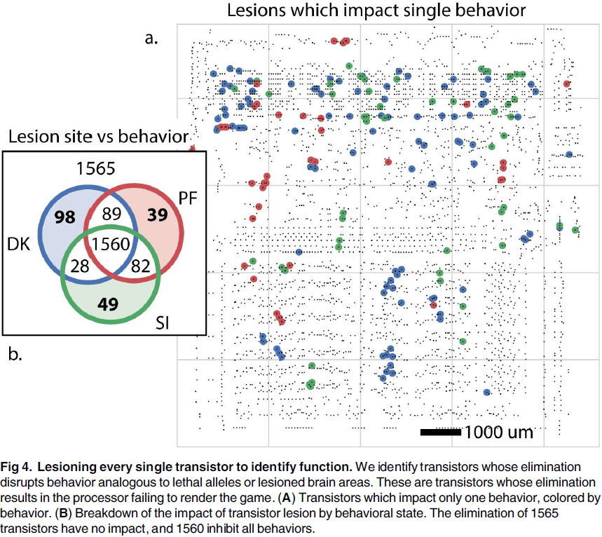
- Lesioning highlights the importance of isolating individual behaviors to understand the contribution of parts to the overall function.
- However, it’s extremely difficult to produce behaviors that only require a single aspect of the brain.
- If we record and analyze the tuning properties of transistors in the microprocessor, we find that a small number of transistors are strongly tuned to the luminance of the most recently displayed pixel.
- However, we know that the strongly tuned transistors aren’t directly related to the luminance of the pixel, despite their strong tuning.
- We should be skeptical about generalizing from processors to the brain as there are many differences.
- However, we can’t ignore the failure of the methods used on the processor simply because processors are different from neural systems.
- We can use simulated microprocessors as a testbed for new neuroscience methods.
- The problem isn’t that neuroscientists couldn’t understand a microprocessor, the problem is that they wouldn’t understand it given the approaches they’re currently using.

## [Visual illusions and neurobiology](https://doi.org/10.1038/35104092)

- Illusions are often the stimuli that exist at the extremes of what our sensory systems have evolved to handle.
- The word “illusion” is difficult to define as, in a sense, all of vision is an illusion.
- An illusion arises from a difference between the perceived and the actual stimuli.
- E.g. In a cinema or movie theatre, we pay to watch a succession of flat, still images that appear to be rich with motion and depth.
- The systematic study of illusions provides important clues to the neural architecture and its constraints.

- Certain illusions have enabled us to discover that from the retina onwards, neurons characteristically inhibit or excite their neighbors depending on their connectivity.
- This allows the nervous system to enhance contrast between similar regions.

- Types of illusions
    - Illusions from lateral interaction
    - Illusory contours
    - After-effects
    - Multistable stimuli
    - Timing of awareness
- Opponent process theory of vision: trichromatic signals from cones are fed into subsequent neural stages and show opponent processing.
- This theory explains the after-effects illusion where you see the opponent color after staring at a color for a long time.
- A consequence of this theory is the idea that competing neural populations exist in a balance.
- If one subpopulation is fatigued, another population can dominate the push-pull competition and briefly control the percept.
- It now seems clear that the fatigue of neuronal populations falls short as an explanation for after-effects.
- The McCollough effect is unexplainable by the theory as the effect can last overnight and sometimes days.

- A very useful example of bistability is a phenomenon known as binocular rivalry.
- Multistable stimuli are invaluable tools for the study of the neural basis of visual awareness, because they allow us to distinguish neural responses that correlate with basic sensory features from those that correlate with perception.
- Several biological principles have been distilled from the careful study of illusions, and these will continue to guide neuroscience research.
- The flash-lag illusion is consistent with the idea that the percept attributed to the time of an event is a function of events that happen in a small window of time after the event.
- This means that consciousness is a retrospective reproduction and that the visual system isn’t only feedforward but also feedbackward.
- Cross-modal illusions have also been observed such as the McGurk illusion where visual information influences auditory information.
- Our understanding of biology can also inform us of new illusions such as the finding that the optic nerve causes a blindspot in our vision.

## [Is coding a relevant metaphor for the brain?](https://doi.org/10.1017/S0140525X19000049)

- The “neural coding” metaphor is misleading due to the following arguments
    - The neural code depends on experimental details that aren’t carried by the coding variable, thus limiting their representational power.
    - Neural codes carry information only by reference to things with known meaning.
    - Coding variables are observables tied to the temporality of experiments, whereas spikes are timed actions that mediate coupling in a distributed dynamical system.
- Neural coding is a communication metaphor.
- E.g. Morse code that maps letters to a sequence of dots and dashes.
- Both Morse code and the retinal code are related to a communication problem: to communicate text messages over telegraph lines, or to communicate visual signals from the eye to the brain.
- Three key properties of the neural coding metaphor
    - Technical sense in that there’s a correspondence between two domains.
        - E.g. We call the relation between visual signals and spike trains a code to mean that spike trains specify/encode visual signals.
        - One can theoretically reconstruct the original message (visual signals) from the encoded message (spike trains), a process called decoding.
        - E.g. It’s this sense that neurons in the primary visual cortex encode the orientation of bars in their firing rate and that neurons in the hippocampus encode the animal’s location in place and grid cells.
    - Not all cases of correlations in nature are considered instances of coding.
        - E.g. Climate scientists don’t say that rain encodes atmospheric pressure.
        - Another assumption is that spike trains are considered messages for a reader, the brain, about the original message.
        - This is the representational sense of the metaphor.
    - Neural coding as a metaphor implies a causal relation between the original message and the encoded message.
        - E.g. Spike trains result from visual signals and not the other way around.
        - To be a representation for a reader, the neural code must at least have a causal effect on the reader.
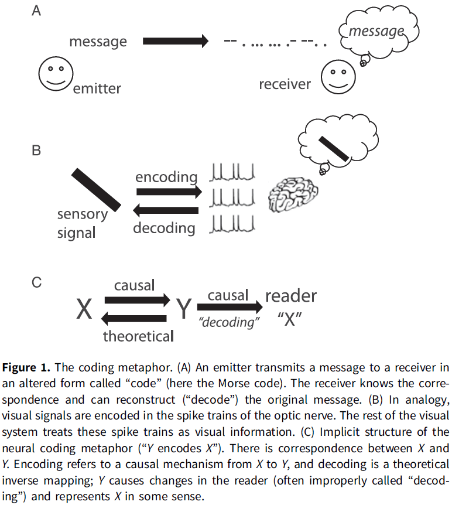
- Three elements of the neural coding metaphor summarized
    - Correspondence
    - Representation
    - Causality
- Most technical work on neural coding uses the first technical sense where the word “code” is used as a synonym for “correlate”.
- Paper argues that scientific claims based on neural coding rely on the representational or causal sense of the metaphor, but that none of these two senses is implied by the technical sense (correspondence).
- In other words, a correspondence or correlation doesn’t mean representation or causality.
- Coding variables that are shown to correlate with stimulus properties depend on the experimental context, therefore, neural codes don’t provide context-free symbols.
- And we can’t extend the neural code to represent a larger set of properties, such as the context, because context is what defines properties.
- Thus, neural codes have little representational power.
- The fundamental reason is that the coding metaphor conveys an inappropriate concept of information and representation.
- Neural codes carry information by reference to things with known meaning.
- E.g. Morse code only means something if you know that the dots and dashes refer to letters.
- However, perceptual systems have no option to refer to another thing for meaning so they build information from the relations between sensory signals and actions, forming a structured internal model.
- Another issue with the neural coding metaphor is that it tries to fit the causal structure of the brain (dynamic, circular, distributed) into the causal structure of neural codes (atemporal, linear) which doesn’t work.
- The author concludes that the neural coding metaphor can’t be the basis for theories of brain function because it’s disconnected from the causal structure of the brain and it’s incompatible with the representational requirements of cognition.
- The activity of neurons is often said to encode properties.
- E.g. The firing rate of pressure sensory neurons in skin encodes the depth of the stimulus. The deeper the stimulus, the faster the firing rate.
- Francis Crick fallacy of the overwise neuron
    - Cones are broadly tuned to wavelength.
    - If different wavelengths of light are flashed, then the amplitude of the transduced current in the cone varies with the wavelength.
    - Thus, the current encodes wavelength in the technical sense as one can recover the wavelength from the magnitude of the current. One can be translated into the other.
    - Yet, animals/humans with a single functional type of cone are color blind, why? The cones encode color information so why can’t the organism see color?
    - The answer is that if the photoreceptor’s current also depends on light intensity, then it doesn’t provide unambiguous information about wavelength in any general setting, even in the narrow sense of correspondence.
    - This also applies to any tuning curve experiment.
- The proposition that the neuron encodes the experimental parameter is mainly a property of the experimental design rather than a property of the neuron (which only needs to be sensitive to the parameter).

- This confusion, that a neuron’s firing rate is a function of the stimulus parameter (rather than a context-dependent correlate), underlies influential neural coding theories.
- To say that a neuron encodes a property of the stimuli and isn’t only sensitive to it, we have to rule out all other factors.
- E.g. Wavelength isn’t encoded by single cones, but by the relative activity of cones with different tunings. The relative activity doesn’t depend on light intensity nor other properties of the stimulus so we can make the stronger claim.
- Thus, referring to tuning curve experiments in terms of coding promotes a semantic drift, from the modest claim that a neuron is sensitive to some experimental manipulation, to a much stronger claim about the intrinsic representational content of the neuron’s activity.
- Another example of when the neural coding metaphor drifts from the technical sense is for sound localization.
    - Interaural time difference (ITD): the difference in arrival times of a sound wave at the two ears.
    - ITD is a major cue for animals to determine the location of a sound.
    - It’s been shown that the neurons in the IC have a critical role in localizing sounds in the contralateral field.
    - How does the activity of these neurons contributed to sound localization behavior?
    - One way is to consider the entire pathway, to try to build a model of how neuron responses in various structures combine to produce behavior that uses the sound’s location.
    - Another way is to ask how neurons encode sound location.
    - However, theories that say how neurons encode sound location don’t link how the responses of a single neuron can result in the behavior observed.
    - E.g. They say that there is sufficient information in the firing rates of individual neurons to produce ITD that are comparable with those of human psychophysically.
    - There is a skip between linking neural activity to behavior. Decoding the neural code isn’t done by the brain but by the experimenter.
    - By implying that the brain reads the neural code, we manage to make claims about perception and behavior while ignoring the mechanisms by which behavior is produced.
    - These claims rely on implicit linking propositions based on abstract constructs, where neural activity is likened to computer memory that the brain stores, retrieves, and manipulates, wherever it’s in the brain and whenever it occurs.
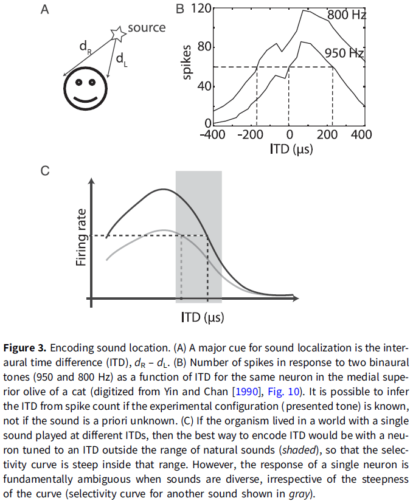
- We should also be wary of populations of overwise neurons, such as in slope coding.
- In reality, tuning curves are defined for a specific experimental condition and aren’t context free.
- If neurons encode variables, then what encodes the definition of those variables?
- Perception and memory cannot just be about encoding stimulus properties because this omits the definitions of those properties and of the objects to which they are attached.
- The author argues that the coding metaphor conveys a particular notion of information, information by reference, and this kind of information is irrelevant to perception and behavior.
- How is it possible for the nervous system to infer external properties from neural activity if all that it ever gets to observe is that activity? How does the brain know what the codes refer to?
- My answer is that the nervous system uses the pathway that the activity came from to infer the external properties.
- This is related to the symbol grounding problem because how do spikes, the symbols of the neural code, make sense for the organism?
- One possibility is that the meaning of neural codes is implicit in the structure of the brain that reads them.
- Two objections against this proposition
    - Neural plasticity makes the idea of a fixed code implausible.
        - E.g. A person born with one hemisphere can see both visual hemifields, implying that the hemisphere has learned the new meaning of the signals from the opposite hemifield.
    - We didn’t evolve to handle new types of information.
        - E.g. We don’t have a brain circuit for chess or driving.
- Neural coding theory considers the relations between observables as redundant and that they should be eliminated.
- In contrast, the view discussed in the paper argues that relations constitute information.
- One way that the nervous system might build relations is by exploiting the “invariant structure” in sensory stimuli.
- E.g. When a sound is produced, the left and right ears receive a delayed version from each other. This property of “delay” is an invariant structure of sound because the ears are distanced apart.
- The sensory world is made up of random pairs of signals that follow particular laws that the listener can identify. This identification is called the “pick-up of information”.
- An interesting aspect of this alternative notion of information is that the topology of the world projects to the topology of sensory laws.
- E.g. Two different sounds produced by a source at the same position will produce pairs of signals that share the same property (the sensory law).
- This can be assessed without knowing what this property corresponds to in the world. We don’t know what the property is, we just know that the property is invariant.
- This can be implemented in neurons using Hebb’s law.
- For an external observer, the sensory laws convey the information that the delay is related to the source’s position.
- However, for the receiver, they don’t know what the sensory law conveys as nothing tells it what it is nor can it infer it from the message.
- The important point here is to focus on the perspective of the receiver. If we are in the place of the receiver aka the organism, we can’t infer what the sensory signal means.
- Now let us consider that the receiver can turn their head, now the receiver observes that there’s a lawful relation between a proprioceptive signal (the head’s position) and the observed delay.
- Now when the receiver observes sounds with a particular delay, it can infer that if it were to move its head, then the delay would change in a predictable way.
- For the receiver, the relation between acoustical delay and proprioception defines the spatial position of the source.
- We note that the perceptual inference involved here does not refer to a property in the external world (frog position), but to manipulations of an internal sensorimotor model such as head position.
- The kind of information available to an organism isn’t Shannon information (correspondence to external properties of the world) but internal sensorimotor models.
- Animals are interested in such models because they can be manipulated to predict the effects of hypothetical actions.

- While this type of model seems similar to predictive coding theory, it isn’t the same as those models map internal variables to observables, while this model is more akin to models in physics which form relations between observables (F = ma).
- Generative models aren’t the kind of internal models described in the previous section.
- The word “predictive” is another baggage term in neuroscience as it is used in the technical sense such as in predictive coding, where it means that a neuron’s firing correlates with its sensory inputs, but the term is also used to refer to how an organism forms behavioral predictions.
- There isn’t any indication of how a theory based on neural coding might explain anticipatory behavior.
- For memory, cell assemblies can’t be used to implement memory because they’re unstructured and, thus, can’t represent structured internal models.
- E.g. Analogous to the “bag of words” model in text retrieval where a text is represented by a set of words and all syntax is discarded.
- The main objection is that cell assemblies encode objects or features to be related, but not the relations between them.

- Synchrony is one possible solution to bind features of an object represented by neural firing.
- E.g. In the Jeffress model of ITD coding, neurons receive inputs from both ears with different conduction delays. When input spikes arrive simultaneously, the neuron spikes. Thus, spikes are caused when the two acoustical signals at the two ears match the conduction delay of that specific neuron. In this model, the neuron’s firing indicated whether signals satisfy a particular sensory law.
- This model has been generalized with the concept of a “synchrony receptive field”, which is the set of stimuli that elicit synchronous responses in a given group of neurons.
- Although synchrony can represent relations, neither binding by synchrony nor synchrony receptive fields solve the general problem of binding, because only one type of relation can be represented by synchrony and only a symmetrical one.

- Neural coding theories generally rely on the representational sense of the metaphor, the idea that neural codes are symbols standing for the properties that the brain manipulates, but there’s no evidence that this sense is valid.
- Worse, there’s empirical evidence and theoretical arguments against it.
- The coding metaphor has a dualistic structure and separates the function of the brain into two distinct components
    - A component that encodes the world into the activity of neurons.
    - A component that decodes that activity into an internal model.
- The two components (encoding and decoding) are indistinguishable in behavior, because no behavior involves just one of them.
- The question “does the brain use a firing rate code or a spike timing code?” is the same as asking “does the brain use the BOLD code?”
- Neural codes based on averaging over trials don’t have causal powers because percepts are experienced now, not on average.
- Neural codes have much less representational power than generally claimed or implied.
- The causal structure of neural coding metaphor is incongruent/incompatible with the causal structure of the brain.
- So what else, if not coding?
- The author suggests to develop models of the full sensorimotor loop.
- E.g. Instead of looking for neural codes of sound location, look for neural models of auditory orientation reflexes.
- That is, to see neural activity as what it really is: activity.
- Action potentials are potentials that produce actions and they aren’t hieroglyphs to be deciphered.

**Our understanding of neural codes rests on Shannon’s foundations commentary**

- When applying Shannon’s theory of information to understanding the brain, what determines the set of possible messages?
- Brain structure determines the sets of possible messages.
- E.g. The set of possible messages about vision is restricted to three types of cones set up by the brain.
- Shannon’s source-coding theorem enables us to understand why the brain imposes this structure on color messages it receives as an efficient code must reflect the source statistics.
- E.g. For color, the source statistics are the statistics of the reflectance spectra of surfaces in the natural world.
- The brain’s way of encoding color captures a large part of the information available.
- Meaning we capture the specific electromagnetic spectrum (400-700 nm) because it captures a lot of information about the real world, compared to infrared or ultraviolet.
- An understanding of the brain’s codes is as essential to neuroscience as an understanding of the genetic code is to biology.

**The origin of the coding metaphor in neuroscience commentary**

- The question of eliminating “coding” shouldn’t be in reference to the truth of the coding metaphor, but on its utility.
- We shouldn’t get bogged down in wondering whether the brain “really” encodes information about the world. It doesn’t.
- The questions, rather, are: Is the metaphor still useful for us, today? Does the usefulness of the metaphor outweigh its inaccurate connotations? Or, has it outlived its usefulness entirely?

**Is coding a relevant metaphor for building AI?**

- The neural coding metaphor is an insufficient guide for building AI.
- The history of AI tells us that the most useful principles, and the richest theoretical insights, emerged from studying control, optimization, and learning processes rather than the particularities of representations or codes.

## [Consciousness: The last 50 years (and the next)](https://doi.org/10.1177%2F2398212818816019)

- One of the defining questions for the mind and brain sciences has been the relationship between the subjective experience of consciousness and its biophysical basis.
- Consciousness science over the last 50 years can be divided into two epochs.
    - From the mid-1960s to 1990 the fringe view held.
    - From the late-1980s to early-1990s there has been an overflow of research into consciousness.
- Consciousness: 1960s until 1990
    - By the mid-1960s, behaviorism (that had dominated the 20th century of psychology) was retreating.
    - There was growing interest in the dependency of particular aspects of consciousness on specific brain properties.
    - E.g. Split-brain patients.
    - One of our most deeply held assumptions is that consciousness is unified.
    - However, there’s evidence against this assumption as lesions to the medial temporal lobe, in the case of patient H.M, showed impairment only in explicit, conscious memories and not in other forms of memory such as motor skills and semantic memory.
    - Libet experiment paradigm: comparing the brain signals before and during the conscious decision to move.
- Consciousness: 1990s until the present
    - The revival of consciousness as a scientific study can be marked by the landmark paper, “Towards a neurobiological theory of consciousness”.
    - Neural correlates of consciousness (NCCs): the minimal neuronal mechanisms jointly sufficient for any conscious percept.
    - E.g. In binocular rivalry such as the Necker cube, implanted electrodes found that neuronal responses in early visual areas (such as V1) tracked the physical stimulus rather than the percept. While the neuronal responses in higher visual areas (such as IT) tracked the percept rather than the physical stimulus.
    - Global workspace theory: the idea that modular and specialized processors compete for access to a global workspace.
- The road ahead
    - Review of Integrated Information Theory (IIT) and predictive coding/Bayesian brain.
- A great deal is now known about how embodied and embedded brains shape and give rise to various aspects of conscious level, content, and self.
- However, much more remains to be discovered.

## [The human brain in numbers: a linearly scaled-up primate brain](https://doi.org/10.3389/neuro.09.031.2009)

- Brain size can’t be used as a proxy for the number of neurons in the brain because neuronal densities differ between brains.
- The human cerebral cortex holds only 19% of all brain neurons; the rest are in the cerebellum or brain stem.
- Two advantages of the human brain
    - It’s built according to very economical, space-saving, scaling rules (that apply to other primates).
    - It’s the largest among primate brains, hence it contains the most neurons.
- Paper findings argue in favor of the view that cognitive abilities are centered on absolute numbers of neurons, rather than on body size/encephalization.
- Weirdly, our exceptional abilities aren’t brain-centered, but rather body-centered in encephalization.
- People believe that our superior cognitive abilities are a result of our brain being bigger than expected for our body size.
- How many neurons does the human brain have, and how does that compare to other species?
- The usual answer is that we have 100 billion neurons and 10 times more glial cells.
- Among mammals, the trend is that the species with the largest brains tend to have a greater range and versatility of behavior than those with smaller brains.
- E.g. Larger-brained birds such as corvids, parrots, and owls have more complex behavior than smaller-brained birds.
- Since whales and elephants have larger brains than we do, why should we be more cognitively able compared to them?
- Encephalization quotient (EQ): a measure of how much the observed brain mass of a species deviates from the expected brain mass for its body mass.
- Problems with EQ
    - It isn’t obvious how a larger-than-expected brain mass confers a cognitive advantage.
        - E.g. When we compare small-brained animal with very large EQs to large-brained animals with smaller EQs, we find that the large-brain animals have better cognitive performance even though they have smaller EQs.
    - The body-brain mass relationship depends on the precise combination of species computed and we shouldn’t compare apples to oranges.
- Another false assumption is that brains are all built the same. However, we know that some brains scale much better and are built denser than other brains.
- The number of neurons in the cerebral cortex increases coordinately with the number of neurons in the cerebellum in humans.

- Brain size isn’t a reliable indicator of number of neurons because different cellular scaling rules apply to rodents, primates, and insectivores.
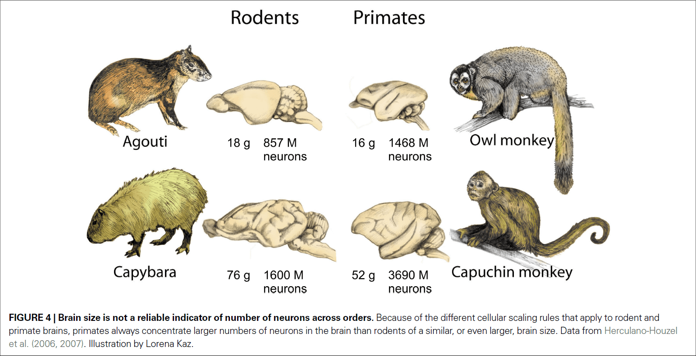
- In rodents, a larger number of neurons is followed by larger neurons.
- The adult male human brain has, on average, 86 billion neurons and 85 billion non-neuronal cells in 1.5 kg.
- Remarkably, the human cerebral cortex, which represents 82% of brain mass, holds only 19% of all neurons in the human brain.
- The relatively large human cerebral cortex, therefore, isn’t different from the cerebral cortex of other animals in its relative number of neurons.
- If a rodent brain had 86 billion neurons, like the human brain, we would expect it to weigh 35 kg, a value beyond the current largest known brain mass (9 kg for the blue whale) and is probably physiologically unattainable.
- Being a primate endows us with seven times more neurons than would be expected if we were rodents.
- The human brain is a linearly scaled-up primate brain, with the expected number of neurons for a primate brain of its size.
- It’s likely that humans don’t have truly unique cognitive abilities, but rather the combination and extent of abilities is what makes us great.
- Exponential combination of processing units, and therefore of computational abilities, leads to events that may look like “jumps” in the evolution of brains and intelligence.
- Since neurons interact combinatorially through synapses, the increase in cognitive abilities afforded by increasing the number of neurons in the brain can be expected to increase exponentially with absolute number of neurons.
- We should disregard body and brain size and focus more on the absolute number of neurons.
- Glial cells in the human brain are at most 50% of all brain cells.
- Two advantages of the human brain
    - It scales as a primate brain meaning it scales economically.
    - It has the largest number of neurons.

## [Neuroscience: In search of new concepts](https://science.sciencemag.org/content/358/6362)

**The emperor’s new wardrobe: Rebalancing diversity of animal models in neuroscience research**

- Is the great diversity of questions in neuroscience best studied in only a handful of animal models?
- Neuroscience has been and is converging on only a few select model organisms.
- E.g. Mouse and monkey.
- Krogh’s principle: for a large number of problems, there will be some animals that will be the most convenient to study.
- E.g. Hodgkin and Huxley used the squid to understand the mechanisms behind AP generation because it has a huge axon (~1 mm diameter).
- Benefits of convergence (using only a few animal models)
    - Rapid development of tools to study model nervous systems.
    - Standardization of animal procedures such as housing and breeding.
    - Reduced costs and simplicity.
- Certain functions are specialized in few animals which makes studying the function difficult if we ignore them as model animals.
- E.g. Vocal mechanisms such as language and songs.
- Another benefit of studying a variety of model organisms is that they may have specialized functions that we would like to have or that we can compare ourselves to.
- E.g. Sound localization. Studying the barn owl has revealed that the neural computation for sound localization followed almost exactly the Jeffress model, which is based on coincidence detection of excitatory inputs arriving from both ears. Yet in rodents, the problem is solved in a different way, which is based on inhibitory inputs that adjust the temporal sensitivity of coincidence-detection neurons.
- The comparative approach serves as an extremely powerful tool to assess the validity of universal principles.
- What should a scientist looking 30 years into the future do?
- One can, and should, think carefully and select the model system for the scientific question, rather than feel compelled to select the scientific question for the model system.

**Big data and the industrialization of neuroscience: A safe roadmap for understanding the brain?**

- Three major issues
    - Is the industrialization of neuroscience the soundest way to achieve substantial progress in knowledge about the brain?
    - Do we have a safe “roadmap” based on scientific consensus?
    - Do these large-scale approaches guarantee that we will reach a better understanding of the brain?
- Paper emphasizes the contrast between the accelerating technological development and the relative lack of progress in conceptual and theoretical understanding in brain sciences.
- We may be letting technology-driven, rather than concept-driven, strategies shape the future of neuroscience.
- E.g. The Blue Brain project, the European “Human Brain Project”, and the US BRAIN initiative.
- Ways that technology has revolutionized neuroscience
    - Technical level: high resolution of large-neural ensemble activity and single-spike resolution in-vivo.
    - Methodological level: new standards in experimentation and data acquisition.
    - Data production level: compiling genomic, structural, and functional databases.
    - Analysis level: dimensionality reduction and pattern-searching algorithms.
    - Modeling level: deep learning.
- This is a radical change in the way we do science, where new directions are launched by new tools rather than by new concepts.
- E.g. Many leading scientists and funding agencies now share the view that “progress in science depends on new techniques, new discoveries and new ideas, probably in that order.”
- However, the author argues that it should be the other way around. That conceptual guidance is required to make the best use of technological advances.
- “Technology is a useful servant but a dangerous master.”
- Big-data isn’t knowledge.
- Four levels of information
    1. Data
    2. Information
    3. Knowledge
    4. Wisdom/Understanding
- The major difference between brain science and particle physics is that theorists in particle physics are involved before, and not after, the hypothesis-driven data are collected.
- The best-known roadmap for dealing with brain complexity is Marr’s three levels.
- Marr was convinced that a purely reductionist strategy was “genuinely dangerous”.
- Trying to understand the emergence of cognition from neuronal responses “is like trying to understand a bird’s flight by studying only feathers.”
- The critical point is that causal-mechanistic explanations are qualitatively different from understanding how a combination of component modules produces emergent behavior.
- Review of multiple realizability.
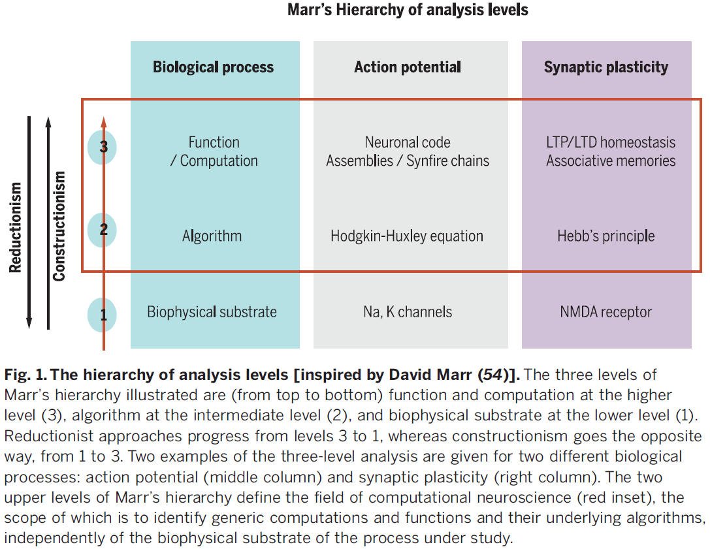
- The search for a unified theory remains at a rudimentary stage for the brain sciences.
- In the brain sciences, however, building massive database architectures without theoretical guidance may turn into a waste of time and money.

**What constitutes the prefrontal cortex?**

- Neuroscience started in the 1960s.
- One of its central aims is to describe how the nervous system enables and controls behavior.
- Paper reviews the arguments for and against using rodents as a prefrontal cortex model.
- The fundamental function of the prefrontal cortex could be to represent and produce new forms of goal-directed actions—actions that can be, for example, mental and internal, emotional or motor-related.
- Skimmed most of the paper due to disinterest.

**Space and time in the brain**

- Summarizes current neuroscience views on space and time, discusses whether the brain perceives or makes distance and duration, analyzes how assumed representations of distance and duration relate to each other, and considers the option that space and time are mental constructs.
- Representation of space in the brain
    - Review of hemispatial neglect condition.
    - Review of place and grid cells in the hippocampus and entorhinal.
    - Review of path integration.
- Episodic memory: Mental travel in space and time
- Navigation and memory are deeply connected.
- The implication that most cortical networks have a dual use: environment-dependent and/or internally organized.
- E.g. Rats running in a real maze and on a treadmill both activate the same place cells, making it difficult to distinguish the sequences.
- Findings indicate that neuronal mechanisms associated with navigation and memory are similar: both establish order relationships. However, memory mechanisms are no longer linked to the outer world.
- The distance-duration relativity suggests that space and time correspond to the same brain computations.
- In the lab, we often find reliable correlations between neuronal activity in various brain regions and succession of events.
- We don’t directly sense time.

**What is consciousness, and could machines have it?**

- The word “consciousness” conflates two different types of information-processing computations in the brain.
    - The selection of information for global availability (C1).
    - The self-monitoring of those computations (C2).
- C1 is synonymous with “having the information in mind” and having that information available for further processing.
- C2 refers to the reflexive, self-referential relationship we have where our own cognitive system is able to monitor its own processing and obtain information about itself.
- E.g. Body position, whether we know or perceive something, whether we just made an error.
- Another term to describe C2 is introspection or meta-cognition; the ability to conceive and make use of internal representations of one’s own knowledge and abilities.
- Paper proposes that C1 and C2 are not related, but this doesn’t mean they don’t share physical substrates.
- Argument is supported by empirical and conceptual evidence that the two may come apart because there can be C1 without C2 and C2 without C1.
- E.g. When reportable processing isn’t followed with accurate metacognition and when a self-monitoring operation unfolds without being consciously reportable.
- Many computations don’t involve C1 nor C2 called the unconscious or C0 or short.
- Cognitive neuroscience confirms that complex computations such as face/speech recognition, chess playing, and meaning extraction can all occur unconsciously in the human brain, under conditions that yield neither global reportability nor self-monitoring.
- Unconscious processing (C0): Where most of our intelligence lies.
    - “We can’t be conscious of what we’re not conscious of.”
    - We’re blind to our unconscious processes so we tend to underestimate them.
    - E.g. Priming and subliminal stimuli.
    - The human brain also unconsciously processes view-invariance and meaning extraction.
- C1: Global availability of relevant information
    - The organization of the brain into computationally specialized subsystems is efficient, but also raises the problem of how to integrate these subsystems.
    - Integrating all of the available evidence to converge toward a single decision is a computational requirement that must be faced by any animal or AI system.
    - E.g. Thirsty elephants manage to determine the location of the nearest water hole and move straight to it. Such decision-making requires
        - Efficiently pooling all available sources of information.
        - Considering the available options and selecting the best one.
        - Sticking to this choice over time.
        - Coordinating all internal and external processes toward the achievement of that goal.
    - Consciousness as access to an internal global workspace.
    - We call “conscious” the representation that wins the competition for access to this mental arena and it gets selected for global sharing and decision-making.
    - Consciousness is therefore manifested by the temporary dominance of a thought or train of thoughts over mental processes, so that it can guide a broad variety of behaviors.
    - The difference between attention and C1 is that attention has some non-conscious mechanisms such as
        - Top-down attention can be oriented toward a stimuli, amplifying its processing, and yet fail to bring it to consciousness.
        - Bottom-up attention attention can be attracted by a flash, even if this stimulus remains unconscious.
    - What we call attention is a hierarchical system of sieves that operate unconsciously.
    - Evidence for all-or-none-selection in a capacity-limited system.
    - The brain has a conscious bottleneck and can only consciously access a single item at a time.
    - The serial operation of consciousness is attested by phenomena such as the attentional blink and the psychological refractory period (when conscious access to a first item prevents or delays the perception of a second competing item).
    - Evidence indicates that the conscious bottleneck is implemented by a network of neurons that is distributed throughout the cortex, but with a stronger emphasis on high-level associative areas.
    - Ignition of this network only occurs for the conscious percept.
    - Nonconscious stimuli may reach into deep networks but are small and short-lived, while conscious stimuli are more stable.
    - Such meta-stability seems to be necessary for the nervous system to integrate information from a variety of modules and to broadcast that information.
    - C1 consciousness is an elementary property that’s present in infants and animals.
    - The prefrontal cortex appears to act as a central information sharing device and serial bottleneck in both humans and nonhuman primates.
- C2: Self-monitoring
    - While C1 reflects the capacity to access external information, C2 is characterized by the ability to reflexively represent one’s self.
    - When making a decision, humans feel more or less confident about their choice.
    - Confidence can be defined as a sense of the probability that a decision or computation is correct.
    - Almost anytime the brain perceives or decides, it also estimates its degree of confidence.
    - Confidence also applies to incoming information and we can judge it against our past knowledge.
    - AI currently lacks meta-knowledge of the reliability and limits of what has been learned.
    - Error detection provides a clear example of self-monitoring where we know we are wrong before we even receive feedback.
    - How can the brain make a mistake and detect it?
    - Two possibilities
        - The accumulation of sensory evidence continues after a decision is made and an error is inferred whenever this new evidence points in the opposite direction.
        - Two parallel circuits operate on the same sensory data and signal an error whenever their conclusions diverge. This is more compatible with our remarkable speed of error detection.
    - Human don’t just know things about the world, they also know that they know or that they don’t know.
    - Meta-memory: humans can report feelings of knowing, confidence, and doubts on their memories.
    - Meta-memory is thought to involve a second-order system that monitors internal signals to regulate behavior.
    - It’s associated with prefrontal structures whose pharmacological inactivation leads to metacognitive impairment while sparing memory performance itself.
    - Meta-memory is crucial to learning as it allows learners to develop strategies to improve memory encoding and retrieval.
    - The human brain must also distinguish between self-generated versus externally-driven representations.
    - E.g. Perceptions versus imaginations and memories.
    - Infants also show evidence of C2 as they can communicate their own uncertainty to other agents such as hesitation.
- Dissociations between C1 and C2
    - C1 and C2 are largely orthogonal (double dissociation) and complementary dimensions of consciousness.
    - Self-monitoring can exist for unreported stimuli (C2 without C1).
    - E.g. Automatic typing. Subjects slow down after a typing mistake even when they fail to consciously notice the error.
    - Consciously reportable contents sometimes fail to be accompanied with an adequate sense of confidence (C1 without C2).
    - E.g. When retrieving a memory, sometimes it comes without any accurate evaluation of its confidence, leading to false memories.
    - C1 and C2 can also work together but this requires a single common currency for confidence across different modules.
- Endowing machines with C1 and C2
    - Endowing machines with global information availability (C1) would allow different modules to share information and collaborate to solve problems.
    - E.g. Letting the rest of the car know that it’s low on gas could mean reducing gas consumption and speed.
    - Old “black-board” systems used to try to model this aspect of cognition.
    - To make optimal use of global information, a machine should also have a database of its own capacities and limits (C2) such as a self-monitoring system.
    - An important element of C2 that’s received little attention is reality monitoring.
- Paper argues that a machine endowed with C1 and C2 would behave as though it were conscious.
- E.g. It would know that it’s seeing something, would express confidence in it, would report it to others, could suffer hallucinations when its monitoring mechanisms break down, and may even experience the same perceptual illusions that we experience.
- Some readers may be unsatisfied with the way the paper “over-intellectualizes” consciousness and leaves aside the experiential component of consciousness.
- Does subjective experience escape a computational definition?
- In humans, the loss of both C1 and C2 covaries with a loss of subjective experience.
- E.g. Damage to the primary visual cortex may lead to a condition called “blindsight” where patients report being blind in the affected visual field. Patients can localize visual stimuli in their blind field but can’t report them (C1), nor can they assess their likelihood of success (C2) as they believe they are merely “guessing.”

## [The unsolved problems of neuroscience](https://www.ncbi.nlm.nih.gov/pmc/articles/PMC4574630/)

- Problems that are solved, or soon will be
    - How do single neurons compute?
    - What is the connectome of a small nervous system, like that of C. elegans (300 neurons)?
    - How can we image a live brain of 100,000 neurons at cellular and millisecond resolution?
    - How does sensory transduction work?
- Problems that we should be able to solve in the next 50 years
    - How do circuits of neurons compute?
    - What is the complete connectome of the mouse brain (70,000,000 neurons)?
    - How can we image a live mouse brain at cellular and millisecond resolution?
    - What causes psychiatric and neurological illness?
    - How do learning and memory work?
    - Why do we sleep and dream?
    - How do we make decisions?
    - How does the brain represent abstract ideas?
- Problems that we should be able to solve, but who knows when
    - How does the mouse brain compute?
    - What is the complete connectome of the human brain (80,000,000,000 neurons)?
    - How can we image a live human brain at cellular and millisecond resolution?
    - How could we cure psychiatric and neurological diseases?
    - How could we make everybody’s brain function best?
- Problems we may never solve
    - How does the human brain compute?
    - How can cognition be so flexible and generative?
    - How and why does conscious experience arise?
- Meta-questions
    - What counts as an explanation of how the brain works? (and which disciplines would be needed to provide it?)
    - How could we build a brain? (how do evolution and development do it?)
    - What are the different ways of understanding the brain? (what is function, algorithm, implementation?)

## [What Is It Like to Be a Bat?](https://www.jstor.org/stable/2183914)

- Paper attempts to explain why we have no idea of what an explanation of the physical nature of a mental phenomenon would be.
- Most reductionist theories don’t try to explain consciousness nor conscious experience.
- No matter how the form may vary, the fact that an organism has conscious experience means that there is something it is like to be that organism.
- An organism has conscious mental states if and only if there is something it is like to be that organism, something it is like for the organism.
- Without some idea of what subjective experience is, we can’t know what is required of a physicalist theory of consciousness.
- To defend physicalism, the phenomenological features must be given a physical account.
- But when we examine subjective experience, that result seems impossible.
- It seems impossible because every subjective phenomenon is connected with a single point of view, and it seems inevitable that an objective, physical theory will abandon that point of view.
- Thought experiment separating the subjective and objective (bat thought experiment)
    - Assume that bats have experience.
    - We choose bats and not wasps because if one travels too far down the phylogenetic tree, people gradually shed their faith that there is experience there at all.
    - Bat have a range of behaviors and sensory organs so different from ours that the problem is exceptionally vivid.
    - Anyone that’s spent some time with bats knows what it’s like to encounter a fundamentally alien form of life.
    - The core of the belief that bats have experience is that there is something that it’s like to be a bat.
    - We know that most bats perceive the world primarily by sonar/echolocation.
    - Bat brains are designed to correlate the outgoing impulses with the incoming echoes to acquire information about distance, size, shape, motion, and texture.
    - But bat sonar, though a form of perception, isn’t similar to any sense that we possess, and we can’t imagine what that experience of sonar is like.
    - This creates some difficulties of what it’s like to be a bat.
- Our own experience provides the basic material for our imagination, whose range is therefore limited.
- We can imagine our simulated version of a bat, but this only tells us what it would be like for us to behave as a bat behaves.
- But this isn’t the question.
- We want to know what it’s like for a bat to be a bat, not what it’s like for humans to be a bat.
- If we try, we’re restricted to the resources of our own mind and can’t imagine additions or subtractions to our present experience.
- We can describe the objective aspects of bat experience such as how echolocation works, how flight works, and their version of pain, hunger, lust, and tiredness.
- But we believe that these experiences also have, in each case, a specific subjective character, which is beyond our ability to conceive.
- E.g. It feels like something to perform echolocation.
- We can even ignore bats and only consider humans.
- E.g. The subjective experience of a deaf or blind person isn’t accessible to us, nor the other way around.
- Such an understanding, beyond the level of language that is direct experience, may be permanently denied to us by the limits of our nature.
- From this, one might also believe that there are facts which couldn’t ever be represented or comprehended by human beings because our structure doesn’t allow us to operate with concepts of the requisite type.
- E.g. We can’t see ultraviolet light because the eye doesn’t capture ultraviolet light.
- The bat thought experiment suggests that there are facts that aren’t expressible in the human language.
- We can recognize the existence of such facts without being able to state or comprehend them.
- E.g. We know that people see red but we can’t state what it’s like to be seeing red.
- There’s a sense that phenomenological facts can be objective, in the case when the perceiver is sufficiently similar to the describer.
- E.g. Humans mostly have the same range of color vision so we can categorize them into red, green, blue, etc. which are objective.
- However, the more different from oneself the other perceiver is, the less success one can expect.
- If the facts of experience, what it’s like for the experiencing organism, are only accessible from one point of view, then it’s a mystery how the true character of experiences could be revealed in the physical operation of that organism.
- The physical operation of that organism, biology, is a domain of objective facts, the kind that can only be observed and understood from many points of view and by individuals with differing perceptual systems.
- There are no obstacles in describing an experience in neurophysiology.
- It may be more accurate to think of objectivity as a direction in which understanding can travel.
- E.g. The objectivity of “red” is less than the objectivity of “atom” because atom is further removed from a human viewpoint.
- It’s difficult to understand what could be meant by an objective description of an experience, since that removes the viewer from the experience.
- After all, what would be left of what it was like to be a bat if one removed the viewpoint of the bat?
- We appear to face a problem with psychophysical reduction.
- In other areas of science, the reduction of phenomena is a move in the direction of greater objectivity; towards a more accurate view of the real nature of things.
- This is done by reducing our dependence on individual points of view toward the object of investigation.
- We describe the phenomenon not in terms of its impression on our sense, but in terms of its more general effects and properties other than the human senses.
- E.g. To describe the phenomenon of “matter” means to go beyond our human senses into the atomic or sub-atomic realms of reality.
- Experience itself, however, doesn’t seem to fit this pattern.
- If subjective experience is only fully comprehensible from one point of view, then any shift to greater objectivity, meaning less attachment to a specific viewpoint, doesn’t take us nearer to the real nature of consciousness, it just takes us further away.
- Different species may both understand the same physical events in objective terms, but this doesn’t require them to understand the subjective experience of those events to the senses of another species.
- The reduction can only succeed if the species-specific viewpoint is left out from what is to be reduced.
- If we desire that a physical theory of mind must also account for the subjective character of experience, we must admit that we don’t know how to do so.
- Indeed, this appears as a contradiction, to objectify the subjective.
- The state of physicalism is similar to if a pre-Socratic philosopher said “matter is energy” because we don’t have an idea of how “what it is like to be a bat” might be true.

## [How Baseball Outfielders Determine Where to Run to Catch Fly Balls](https://science.sciencemag.org/content/268/5210/569)

- When a baseball is hit, the only useable information appears to be the optical trajectory of the ball; the changing position of the ball image relative to the background.
- Outfielder: the players in a baseball game that catch the ball.
- In theory, outfielders could derive the destination of the ball from an assumed parabolic trajectory, but research shows that observers are very poor at using such a purely computational approach.
- Also, air resistance, ball spin, and wind can cause trajectories to deviate from a parabolic curve.
- One hypothesis is that outfielders run along a path that simultaneously maintains horizontal alignment with the ball and maintains a constant change in the tangent of the vertical optical angle of the ball.
- In other words, the fielder can arrive at the correct destination by selecting a running path that keeps optical ball speed constant, achieving optical acceleration cancellation (OAC).
- OAC works even if the trajectory isn’t parabolic because it couples the fielder’s motion with that of the ball.
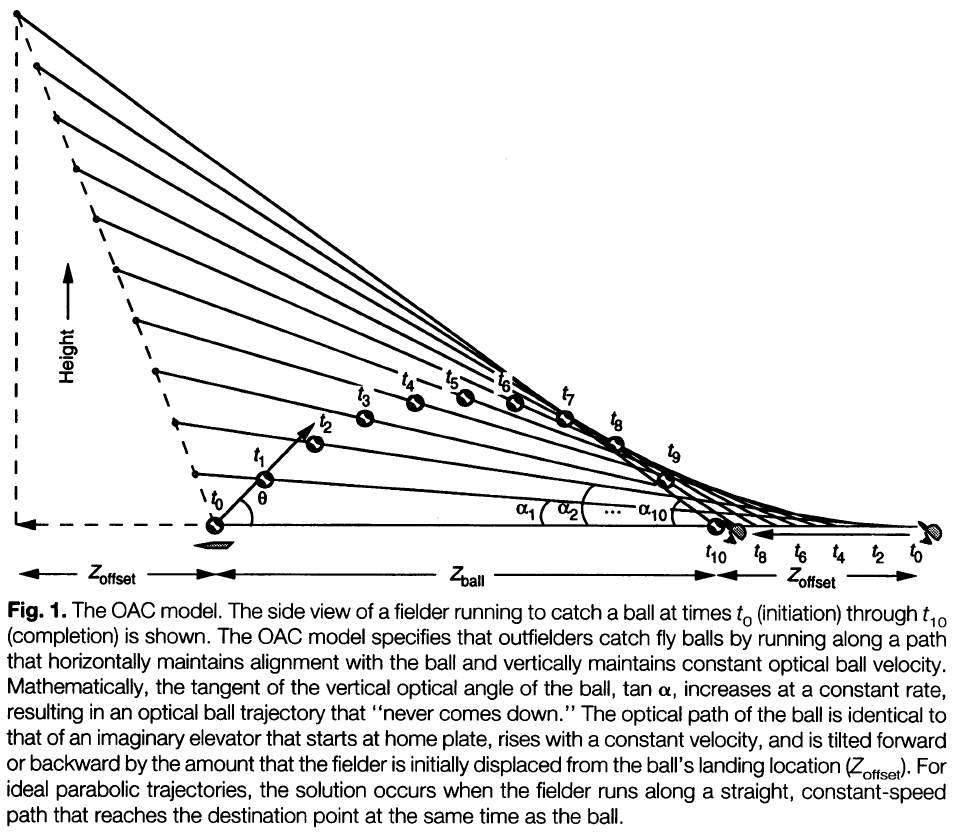
- The OAC model is elegant but flawed because OAC solutions require the precise ability to discriminate accelerations, and evidence shows that people are poor at such tasks.
- Another issue is that OAC was tested on balls hit directly towards the outfielder and without sideways motion.
- However, outfielders consider balls hit directly at them to be harder to catch, not easier.
- From this, it seems that outfielders use their vantage outside the plane of the ball trajectory in a way that simplifies, rather than complicates, determination of ball destination.
- An alternative explanation is the linear optical trajectory (LOT).
- LOT proposes that the outfielder selects a running path that maintains linear optical trajectory for the ball relative to the home plate and background.
- The solution is based on maintaining a balance between vertical and horizontal optical angular change and requires no knowledge of distance to the ball or home plate.
- In LOT, the outfielder doesn’t allow the ball to curve optically toward the ground and requires them to continuously move more directly under the ball, guaranteeing travel to the correct destination to catch it.
- The LOT strategy discerns optical acceleration as optical curvature, a feature that observers are very good at discriminating.
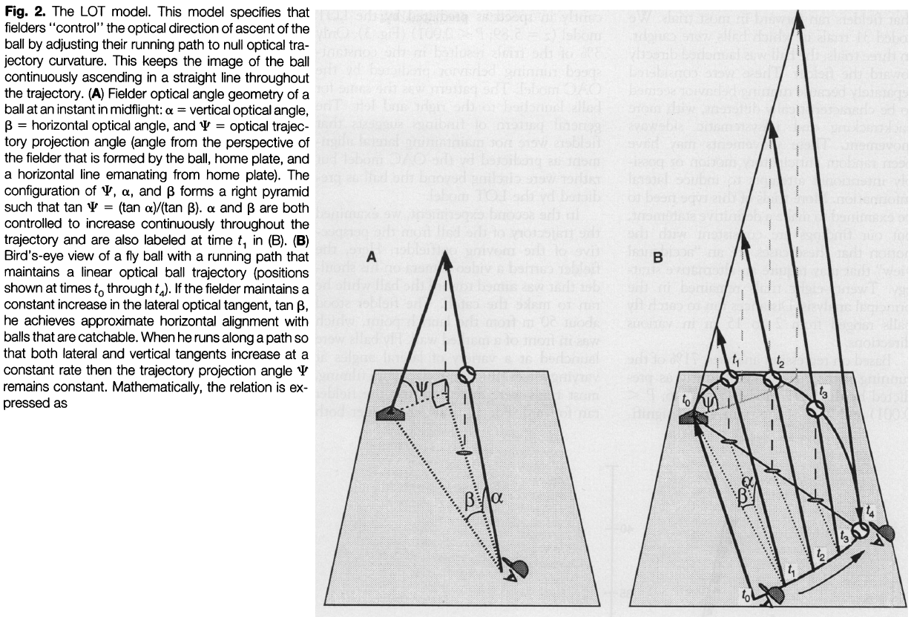
- Like the OAC strategy, maintaining a LOT is a error-nulling tactic that couples fielder motion with that of the ball.
- In summary
    - OAC predicts that fielders select a running path that is straight with constant speed, resulting in a curved optical ball trajectory.
    - LOT predicts that fielders select a running path that is curved with $$\cap$$-shaped speed, resulting in a linear optical ball trajectory.
- In the paper’s experiments, the balls launched directly toward the fielder are a special case and requires a different strategy other than OAC and LOT.
- The results support the premise that outfielders use spatial, rather than just temporal, cues to initially guide them toward the ball destination point.
- Other cases where the optical angle to a target is maintained
    - Airplane pilots use spatial error-nulling to anticipate and maintain constant angular position relative to a target.
    - Predators and organisms pursing mates commonly adjust their position to maintain control of relative angle of motion between the pair.
- Findings suggest that baseball players use a similar spatial strategy.
- Once an outfielder establishes a LOT solution, they know they control the situation and that they will catch the ball, but they don’t know when.
- This explains why outfielders run into walls chasing uncatchable ball and why they don’t rush ahead to the ball’s destination point, choosing instead to catch the ball while running.
- LOT also explains why balls hit to the side are easier to catch as fielders can use their strong ability to discriminate curvature rather than resorting to their weak ability to discriminate acceleration.
- In short, the LOT strategy provides a simple and effective way to pursue and catch a target traveling with approximate parabolic motion in 3D space.

## [The newly sighted fail to match seen with felt](https://www.nature.com/articles/nn.2795)

- Molyneux problem: if a person born blind was able to see, would they recognize an object only previously known by touch?
- A positive answer, in that a congenitally blind person could match a object visually to tactilely, would suggest that there’s an a priori (built-in) amodal (not dependent on sense) conception of space common to both senses.
- A negative answer, in that there’s no match, would suggest that pairing visual and tactile information is experience-driven by the association between the senses.
- Critical conditions for testing the Molyneux problem
    - Must be congenitally blind but treatable and mature enough.
    - Both senses, touch and vision, must be independently functional after treatment.
- An optically restored eye doesn’t imply the functional ability to make full use of the visual signals.
- In other words, just because the eye can see doesn’t mean that the brain can see.
- There were five subjects in this study and they were blind from birth due to cataracts or corneal opacities.
- Prior to treatment, subjects were only able to discriminate between light and dark and none of them were able to perform visual discrimination.
- Four subjects underwent cataract removal surgery and intraocular lens implant, while the other one subject underwent corneal transplant to fix their vision.
- The object/stimulus set comprised of 20 pairs of simple 3D forms that were large to sidestep any acuity limitations.
- E.g. Big Legos.
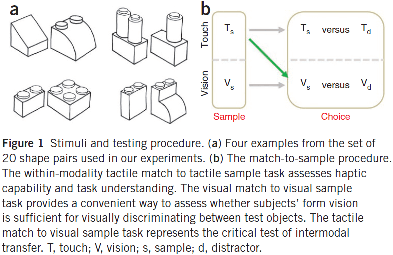
- There were three test cases
    1. Touch-to-touch
    2. Vision-to-vision
    3. Touch-to-vision
- By day two of recovery from surgery, all subjects performed near ceiling for touch-to-touch and vision-to-vision, indicating that stimuli were easily discriminable in both modalities.
- In contrast, touch-to-vision was at near chancel level right after surgery.
- Three of the five subjects were later tested and performance on the touch-to-vision condition improved significantly in as little as five days, given only natural real-world visual experience.
- Results suggest that the answer to the Molyneux problem is likely negative.
- Newly sighted people didn’t exhibit an immediate transfer of their tactile shape knowledge to the visual domain.
- The quickness of pairing visual and tactile information suggests that the neuronal substrates responsible for cross-model interaction might already be in place before they behaviorally manifest.
- Even in adulthood, studies with individuals with late-onset vision have suggested that the ability to form representations of new features is retained.

## [The free-energy principle: a unified brain theory?](https://www.nature.com/articles/nrn2787)

- One key theme noticed in many scientific theories is the idea of optimization.
- If we look at what’s being optimized, we find the same quantity emerging, namely value (expected reward, expected utility) or its complement, surprise (prediction error, expected cost).
- This is the quantity that’s optimized under the free-energy principle.
- Paper attempts to place some key theories within the free-energy framework in hopes of finding common themes.
- Free energy: an information-theory measure that bounds or limits the surprise on sampling some data, given a generative model.
- Free-energy principle: any self-organizing system that’s at equilibrium with its environment must minimize its free energy.
- In other words, it’s a mathematical description of how adaptive systems resist a natural tendency to disorder.
- One defining characteristic of biological systems is that they maintain their states in the face of a constantly changing environment.
- From the brain’s perspective, the environment includes both the external and internal milieu.
- Homeostasis: the process where an system regulates its internal environment in a changing external environment.
- Homeostasis means that the number of states that can organism can be in is limited because it wants to maintain a constant internal state.
- This also means that homeostasis must have low entropy meaning low uncertainty in which state it’ll be in.
- Biological agents must therefore minimize the long-term average of surprise to ensure that their sensory entropy remains low.
- To do so, agents both perform actions that minimize prediction errors and use perception to optimize those predictions.
- In the long-term, the goal is to maintain states within physiological bounds (homeostasis).
- In the short-term, the goal is to avoid surprise (reduce entropy).
- Biological agents must avoid surprises to ensure that their states remain within physiological bounds.
- But how does a system carry out this goal?
- Free energy is the answer. Since free energy is an upper bound on surprise, minimizing free energy means to implicitly minimize surprise.
- Two actions that agents can do to suppress free energy
    1. Change sensory input by acting on the world.
    2. Change their recognition density by changing their internal state.
- Three formulations of free energy
    1. Energy minus entropy
    2. Surprise plus divergence
    3. Complexity minus accuracy
- Next we consider these implications of the free-energy principle on some key theories about the brain.
- Bayesian brain hypothesis
    - Views the brain as an inference machine that actively predicts and explains its sensations.
    - A probabilistic model generates predictions that are tested against sensory input to update beliefs about their causes.
    - Perception becomes the process of inverting the likelihood that a cause caused a sensory input. This is the Bayesian part.
    - Minimizing free energy corresponds to explaining away prediction errors, also known as predictive coding.
    - The free-energy principle entails the Bayesian brain hypothesis and can be implemented by the many schemes in this field.
- Principle of efficient coding
    - Views the brain as to optimize mutual information/predictability between the sensorium and its internal representation.
    - The infomax principle says that neuronal activity should encode sensory information in an efficient and cheap manner.
    - The infomax principle is a special case of the free-energy principle.
- Cell assembly and correlation theory
    - Hebbian plasticity or Hebb’s rule that neurons that fire together wire together.
    - Cell assembly theory: connections between neurons are formed depending on the correlated pre- and post-synaptic activity.
    - This enables the brain to distil statistical regularities from the sensorium into neurons.
    - Gradient descent on free energy (changing connections to reduce free energy) is identical to Hebbian plasticity.
    - The formation of cell assemblies reflects the encoding of causal regularities.
- Bias competition and attention
    - Precision encodes the amplitude of random fluctuations or the reliability of prediction errors.
    - How is precision encoded in the brain?
    - In predictive coding, precision modulates the amplitude of prediction errors, so that prediction errors with high precision have a greater impact on units that encode conditional expectation.
    - This means the precision corresponds to the synaptic gain on prediction error units.
    - The obvious candidate for controlling gain are neuromodulators like dopamine and acetylcholine.
    - Another candidate is correlation theory or Hebb’s rule. This fits with recent ideas about the role of synchronous activity in mediating attentional gain.
    - In summary, the optimization of expected precision in terms of synaptic gain links attention to synaptic gain and synchronization.
- Neural darwinism and value learning
    - Views the brain as a value-maximizing system.
    - In the view of free energy, value is inversely proportional to surprise.
    - The evolutionary value of a phenotype is the negative surprise averaged over all the states it experiences.
    - So, the minimization of free energy ensures that agents spend most of their time in a small number of valuable states.
    - This means that free energy is the complement of value, so to increase value means to decrease free energy.
    - But what states are valuable?
    - Valuable states are just states that the agent expects to frequent.
    - The key theme here is that prior (heritable) expectations can label things as innately valuable (unsurprising).
- Optimal control theory and game theory
    - Optimal control and decision theory start with the notion of cost/utility and try to construct value functions of states, which are used to guide action.
    - Free energy is an upper bound on the expected cost, which optimal control theory assumes that action minimizes expected cost.
    - This ensures that an agent only occupies a small set of attracting states.
- The constant theme in all of these theories is that the brain optimizes a free-energy bound on surprise or its complement.
- This manifests as perception or action.
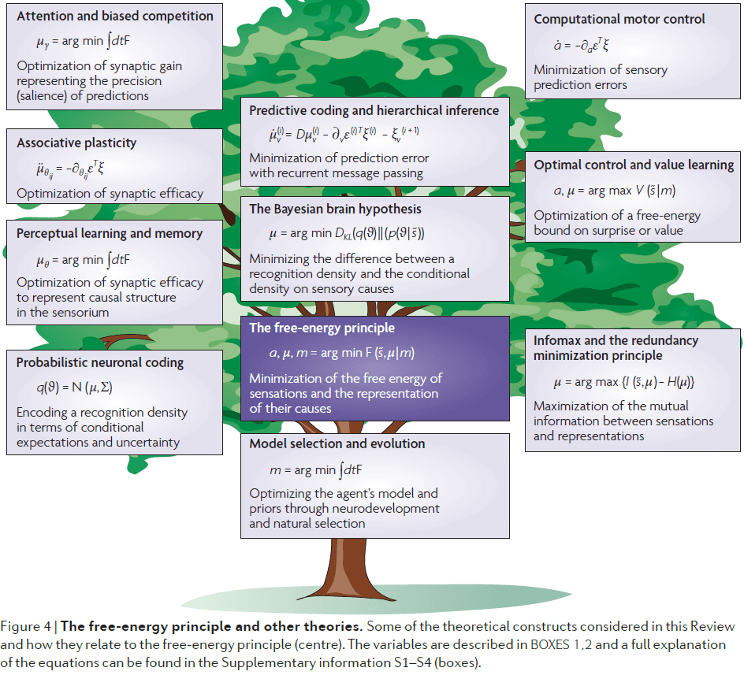
- If the arguments of the free-energy principle are true, then the real challenge is to understand how it manifests in the brain.

## [The Expensive-Tissue Hypothesis: The Brain and the Digestive System in Human and Primate Evolution](https://www.jstor.org/stable/2744104)

- Brain tissue is metabolically expensive.
- Expensive-tissue hypothesis: the idea that the metabolic requirements of relatively large brains are offset by a corresponding reduction of the gut.
- Gut size is highly correlated with diet, and relatively small guts are compatible only with high-quality, easy-to-digest food.
- No matter what’s selecting for a large brain, it couldn’t have been achieved without a shift to a high-quality diet unless there’s also a rise in metabolic rate.
- Therefore, the incorporation of more animal products (meat) into our diet was essential in the evolution of the large human brain.
- How do primates, and particularly humans, afford such large brains?
- Three problems with understanding how we can afford large brains
    - Encephalization quotient.
        - We have a large brain but not a matching large body to fund the energy needed by the brain.
    - Metabolic cost of the brain.
        - The mass-specific metabolic rate of the brain is around 11.2 W/Kg whereas the average metabolic rate of the human body is 1.25 W/Kg.
        - The majority of this energy is spent on ion pumps that are necessary to maintain the membrane potential.
        - Energy is also used in the continual synthesis of neurotransmitters.
        - This is also made more difficult in that the brain has no significant store of energy reserves (fat).
    - No correlation between basal metabolic rate (BMR) and our larger brain.
        - There’s no evidence of an increase in basal metabolism sufficient to account for the additional metabolic expenditure of the enlarged brain.
- Where does the energy come from to fuel our large brain?
- One possible answer is that the increased energy demands of a larger brain are compensated/offset by a reduction in the metabolic rates of other tissues.
- E.g. Reduced average body temperature for more energy to the brain.
- Another possible answer is that the expansion of the brain was associated with a compensated reduction in the mass of other organs in the body.
- E.g. The shrinking of the kidneys to power a larger brain.
- The heart, kidneys, and splanchnic organs (liver and gastro-intestinal tract) all make substantial contributions to overall BMR.
- In fact, the heart and kidneys have mass-specific metabolic rates that are higher than the brain.
- To determine whether increased brain size came at the reduction of other organs, we compare observed mass of each organ with the expected mass for the average primate of corresponding body mass.
- The combined mass is close to expected but the contributions of individual organs are very different.
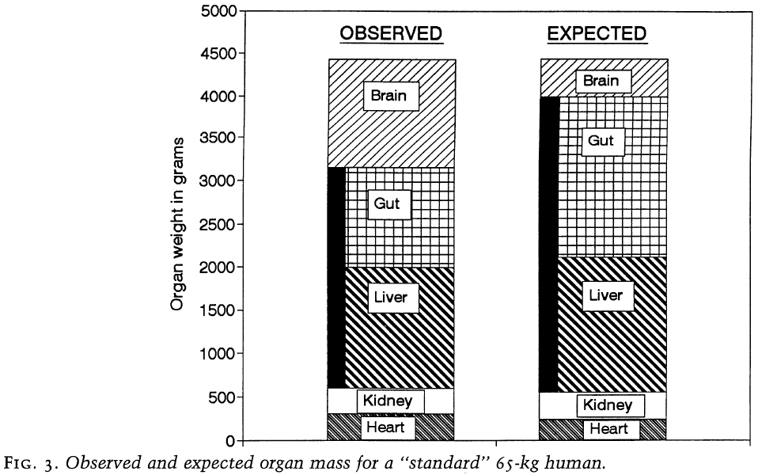
- The human heart and kidneys are both close to their expected size but the splanchnic organs are approximate 900 grams less than expected.
- Almost all of this reduction is due to a reduction in the gastro-intestinal tract, which is 60% of its expected size.
- Therefore, the increase in mass of the human brain appears to be balanced by an almost identical reduction in the size of the gastro-intestinal tract.
- It should be noted that these are size relationships rather than metabolic relationships.
- Whether the energetic savings due to reduced gut mass helped the expansion of the brain depends on the relative metabolic rates of the two tissues.
- The reduction in gut size saves around 9.5 W.
- The energy savings from the decreased gut is approximately the same as the additional cost of the larger brain.
- So, if the changes in the proportions of the two organs were recent evolutionary events, there’s no reason that the BMRs of hominids would have been elevated above the typical primate.
- This analysis implies that there’s been a coevolution between brain size and gut size in humans and other primates.
- This assumes that primates were not balancing their energy budgets in other ways, such as opting for relatively high BMR or altering the size and/or metabolic requires of other tissues.
- A higher BMR would require more energy and, unless environmental conditions were unusual, would require devoting more time to feeding behavior but also put the animal into more intense competition for limited food resources.
- Further, it’s unlikely that the size of other metabolically expensive tissues (liver, heart, kidney) could be altered substantially.
- The brain only uses glucose as its fuel and since the brain has no energy reserves, it must get this continual supply from the blood.
- If the level falls below normal concentrations for even a short period of time, it can result in significant dysfunction of the CNS.
- A major role of the liver is to replenish and maintain these levels, both by releasing glucose from glycogen stores and by making it from alternative energy reserves.
- Also, the energy demands imposed by increased brain size can’t exceed the capacity of the liver to store and ensure the uninterrupted supply of glucose necessary to fuel this metabolism.
- Since the heart is mostly made up of rhythmically contracting cardiac muscle, it’s difficult to imagine how an significant reduction in the size of this organ could take place without compromising its ability.
- It’s also difficult to see how the heart could be shrunk as our ancestors performed persistence hunting, requiring high cardiovascular performance.
- Kidneys probably weren’t reduced either as that would make urine more dilute (most of the energy is spent on water resorption) and would require hominids to drink more.
- If the hypothesis of coevolution is correct, then understanding how primates can afford large brains means we must understand how they have small guts.
- Gut size is related to body size and is strongly determined by diet (bulk and digestibility of food).
- Large amounts of low-digestible food require large guts characterized by fermenting chambers.
- E.g. Cows have many stomachs to digest large amounts of grass.
- Conversely, diets with smaller amounts of high-digestible food require smaller guts.
- E.g. Carnivores such as wolves.
- The link between gut size and diet also holds for primates.
- There’s also a close relationship between relative gut size and relative brain size.
- Animals with large guts have small brains, while animals with small guts have large brains.
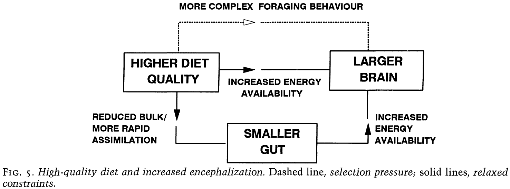
- It’s unsure which direction the relationship is though.
- Did a larger brain enable more complex feeding strategies, leading to smaller guts? Or did smaller guts give more energy to the larger brain? Both?
- Cooking may have been an important factor in increasing hominid brain size.
- Cooking is a technological way of externalizing part of the digestive process and removes toxins in the process.
- Summary
    - A higher quality diet was probably associated with a reduction in gut size and energy cost.
    - If this is correct, then the enlargement of the hominid brain was able to continue without placing any additional demands on their overall energy budget.
    - More complex feeding strategies may have also pressured the brain to increase in size.
    - Further increases may have been due to the introduction of cooking to make food more digestible.
    - There’s no correlation between basal metabolic rate and brain size in humans and other large-brained mammals.
    - Expensive-tissue hypothesis: a reduction in the size of one energy expensive organ can allow another organ to increase in energy expenditure.
    - In the case of hominids, we traded gut size for brain size.
- Other important points
    - Diet can be inferred from the size of the gut and not just teeth and jaws.
    - The evolution of any organ of the body can’t be studied in isolation.

## [What the Frog’s Eye Tells the Frog’s Brain](https://doi.org/10.1109/JRPROC.1959.287207)

- Paper analyzed the activity of single fibers in the optic nerve of a frog.
- The goal is to find what stimulus causes the largest activity in the fiber and what aspect of the stimulus is responsible.
- Each fiber isn’t connected to a few rods and cones but to very many over an area.
- Results show that it isn’t the light intensity that causes the largest activity, but rather the pattern of local variation of intensity that’s the exciting factor.
- Authors found four types of fibers, each type concerned with a different pattern and each type is uniformly distributed over the whole retina.
- Thus, there’s four distinct parallel distributed channels that the frog eye informs the frog brain about the visual image in terms of local pattern independent of average illumination.
- Reasons to study the frog
    - Uniformity of the retina.
    - Normal lack of eye and head movements except to stabilize the retinal image.
    - Relative simplicity of the eye to brain connection.
- The frog doesn’t seem to see the details of unmoving parts of the world around.
- E.g. A frog will starve to death surrounded by food if the food isn’t moving.
- A frog’s choice of food is only determined by size and movement.
- Frog retina’s have 1 million receptors, 2.5-3.5 million connecting neurons, and half a million ganglion cells.
- A ganglion cell receives information from thousands of receptors.
- Clearly, such an arrangement wouldn’t allow for good resolution if the retina maps an image in terms of light intensity point-by-point.
- The amount of overlap of adjacent ganglion cells is enormous.
- Review of receptive fields (OFF, ON, ON-OFF).
- For all three types of receptive fields, the sensitivity is greatest at the center of each field.
- An ON-OFF cell seems to be measuring inequality of illumination within its receptive field and is sensitive to movement within the field.
- The optic nerve looks at the image on the retina through three distributed channels (three receptive fields).
- In any channel, the overlap of individual receptive fields is very great.
- So the retina tells the brain that for any visual event
    - The OFF channel tells how much dimming of light has occurred and where.
    - The ON-OFF channel tells where the boundaries of lighted areas are moving.
    - The ON channel tells where brightening has occurred.
- To an unchanging visual pattern, the optic nerve should be fairly silent after an initial burst to communicate the visual pattern.
- The resolution of the OFF and ON channels is about the size of a receptive field, meaning the resolution is blurry.
- What if the eye isn’t just making a copy of the image but instead is devoted to detecting certain patterns of light and their changes?
- In this case, using small spots of light on the retina may be true and yet misleading.
- E.g. A small spot of light not only includes intensity, but also the edge shape, size, curvature, and contrast.
- This paper uses a wide variety of visual stimuli to tease out the purpose of the retina and optic nerve, instead of just light spots.
- The authors found four separate operations on the image in the frog’s eye and each operation’s result is transmitted by a particular group of fibers.
- They’re also all nearly independent of the general illumination.
- Four operations
    1. Sustained contrast detection
    2. Net convexity detection
    3. Moving edge detection
    4. Net dimming detection
- The first two are communicated on unmyelinated fibers and the last two are communicated on myelinated fibers.
- Sustained contrast detectors
    - Same as ON receptive fields
    - If the sharp edge of an object (either lighter or darker than the background) moves into its field and stops, it spikes and continues spiking, regardless of the shape and size of the edge.
    - In some fibers of this group, a contrast previously within the field is “remembered” after the light is turned off, as it will keep a low mutter of activity that isn’t present compared to if no contrast was there before.
    - This isn’t because this group is very sensitive, as showing an edge in darkness doesn’t trigger this residual mutter.
    - The authors were struck by the smallness of the resulting change as in very dim light, we still get the same response.
- Net convexity detectors
    - To the authors, this group contains the most remarkable elements in the optic nerve.
    - This group responds to a small object passing through the field and only responds as long as the object is in the field.
- Moving-edge detectors
    - Same as ON-OFF receptive fields.
    - Responds to any distinguishable edge moving through its receptive field.
    - It responds only to a moving edge, not a stationary edge.
- Net dimming detectors
    - Same as OFF receptive fields.
    - The fastest conducting detectors.
    - Darkening of a spot produces less response when it’s in the periphery of the field than when it’s at the center.
    - The sensitivity of the OFF discharge to illumination increases with time.
- Lastly, there’s a small group of afferent fibers that don’t seem to have distinct receptive fields. They each measure the absolute degree of darkness over a wide area with a frequency of discharge that’s greater the darker it is.
- These fibers may be used to control the circadian rhythm.
- To organize these fibers, we consider an example where an object is moved.
    - The contrast detectors tell the brain, with the greatest resolution, the presence of a sharp boundary, moving or still, with much or little contrast.
    - The convexity detectors tell the brain whether the object has a curved boundary, if it’s darker than the background and moving, and remembers the object when it’s stopped.
    - The moving-edge detector tells the brain whether or not there’s a moving boundary in a large area.
    - The dimming detector tells the brain how much dimming occurs in the largest area, weighted by distance and speed.
- All of the operations are independent and there are 30 times as many of the first two detectors as the last two.
- While the positions of fibers in the optic nerve are all messed up (disordered), when the fibers terminate in the superior colliculus, they do so in an orderly way that preserves the continuous map of the retina.
- In other words, retinotopy is preserved.
- The four operational groups of fibers terminate in four separate layers of terminals, with each layer exhibiting a continuous map of the retina.
- The layers are organized so that the depth of the fiber matches their speed of conduction.
- E.g. Contrast detectors are at the top, under are the convexity, next are the moving-edge, and deepest are the dimming detectors.
- If the optic nerve is cut in the frog, the fibers grow back to the regions where they originally terminated in mapping the retina.
- The restoration of the four layers also had no errors or mixing.
- Implications of the paper
    - Shows that the eye speaks to the brain in a highly organized language and some of the signals are already interpreted by the retina.
    - Consider the dendrite of a neuron that extends up through all four layers. Then it’s looking at a point in the image on the retina, but in terms of the properties of its neighborhood as defined by the four operations.
    - By transforming the image from a space of simple discrete points to a congruent space where each equivalent point is described by the intersection of particular qualities in its neighborhood, we can then give the image in terms of combinations of those qualities.
- The output from a frog retina is a set of four operations independent of general illumination
    1. Local sharp edges and contrast.
    2. Curvature of edge of a dark object.
    3. Movement of edges.
    4. Local dimming produced by movement or rapid general darkening.
- Matching these four operations are four layers in the brain.
- So what does each fiber in the optic nerve measure?
- Each fiber measures how much of a particular quality is in the stimulus.
- The operations are more like perception than that of sensation in that they are complex abstractions from the visual image and not the raw image.
- It seems that the four operations are built to detect a moving bug, which makes sense since that’s the source of food for the frog.

## [Functions of Consciousness](https://doi.org/10.31234/osf.io/wybkp)

- While common sense suggests that conscious experience has many important functional roles in our lives, experiments and theoretical arguments challenge these everyday intuitions.
- Many human behaviors can occur in the absence of consciousness, and the world contains many creatures capable of engaging in complex behavior without being conscious.
- E.g. Mollusks and microorganisms.
- Does consciousness have a function?
- We should consider the possibility that consciousness has no function.
- Two arguments that consciousness has no function
    - Conscious inessentialism (CI)
        - The view that for any intelligent activity, we can perform that activity without any conscious experience.
        - Some behaviors, such as introspecting, seem to require consciousness.
        - However, examples like these aren’t strong challenges to CI because they represent cases where conscious is constitutively essential, rather than causally essential.
        - If CI is true, then ‘zombies’ are possible.
        - Zombies refers to creatures that are behaviorally indistinguishable from normal, conscious humans, but who are entirely without consciousness.
        - E.g. There is no “what is it like” to be a zombie.
        - However, it seems impossible for there to exist two brains in exactly the same physical state, but only one of which is conscious.
    - Epiphenomenalism (EP)
        - The view that consciousness exists but doesn’t play any causal role in neural or cognitive operations.
- Experimental evidence that supports CI would come from cases where behaviors that require consciousness are shown to be exhibited in the absence of consciousness.
- Experimental evidence that supports EP would come from cases where the causal link between consciousness and behavior is challenged.
- Review of Libet studies and the readiness potential experiment.
- Why is it surprising that conscious processes are causally preceded by unconscious events?
- Maybe it’s because of a Cartesian intuition that conscious intentions should be ‘prime movers’, which themselves are without cause.
- Although CI and EP are likely to be false, it isn’t easy to establish their falsity.
- And even if CI and/or EP are true, we still don’t know why conscious experiences appear to be uniquely associated with neural activity and why conscious contents almost always reflect functional roles.
- E.g. Pain feels bad, sex feels good, eating food feels good.
- We need a more detailed understanding of what is meant by ‘function’.
- To understand the function of consciousness, we need to understand
    - Why did it evolve?
    - What does it do?
- For many people, an adequate functional explanation of a biological feature is one that accounts for its origin by natural selection.
- This is difficult though because
    - In complex systems, such as the brain, it’s difficult to make a direct connection from any effect to a selective advantage.
    - The function a biological feature has may not be the function that was selected for during evolution.
        - E.g. Even though we evolved eyes for hunting, we now use them for reading or looking at screens.
    - Not all present-day biological features exist as a result of natural selection; they may be due to random chance.
        - E.g. The color feature of our blood being red wasn’t the result of natural selection.
- Instead of asking why consciousness evolved, we can ask what causal effects consciousness has with regard to present-day brains, bodies, and behaviors.
- E.g. Hearts have the function of pumping blood because this effect explains the capacity of the body to achieve circulation of oxygen, which in turn helps the organism survive.
- It’s often pointed out that consciousness isn’t a unitary (or one) phenomenon, but rather a collection of phenomenon.
- Consciousness can refer to
    - Level: the state of consciousness.
        - E.g. Brain death, coma, general anesthesia, sleep, wakefulness.
    - Content: describes the continually changing phenomenal content.
        - Qualia, the experience of red, the experience of warmth.
    - Self: describes our sense of identity/uniqueness.
        - E.g. Our personal memories or our preferences/personality.
- A conscious organism is one that’s capable of having conscious mental content.
- Many types of mental content can be either conscious or unconscious.
- E.g. The belief that the sun will rise in the morning can be implicitly or explicitly held.
- By separating out the level and contents of consciousness, the function that mental contents has can’t be inferred from the function of the organism’s level of conscious.
- In other words, the ability to have conscious content may serve a different set of functions for an organism than the fact that a particular sort of conscious content is present.
- Another key distinction is between primary and higher-order consciousness.
- Primary consciousness: the experience of the world.
- Higher-order consciousness (HOC): the observation that we aren’t only conscious, but that we are also conscious of being conscious.
- HOC is the process that includes our sense of self and our ability to explicitly construct past and future scenes.
- While in humans these two forms of consciousness almost always go together, it’s conceivable that primary consciousness could exist independently of HOC.
- E.g. In the case of many animals and newborn infants.
- Possible functional roles of consciousness
    - Volition: that consciousness is used to initiate and control voluntary action.
        - The experience of volition is a conscious experience like any other, and doesn’t have any more causal powers in virtue of its volitional content.
        - If conscious will is illusory, then it should be possible for voluntary actions to occur in the absence of experiences of volition.
        - This is supported by neurological disorders such as ‘alien hand syndrome’ where one hand seems to be outside of the patient’s voluntary control.
    - Rational action: that consciousness is used to make rational/smart decisions.
        - The link between consciousness and rationality is equally intuitive as the association with voluntary action.
        - A rational-action function for consciousness seems to associate more with HOC than with primary consciousness.
        - However, empirical evidence weighs against there being a direct connection.
        - E.g. Not all conscious thinking is rational, and not all rational behavior is conscious.
        - This dissociation between rational thinking and acting is strikingly shown in cases where subjects provide false (confabulatory) rationalizations for the cause of their actions.
        - E.g. Split-brain patients.
        - It’s often the result of a reasoning process, rather than the reasoning process itself, that shows up in conscious thought.
        - This is probably not the function of consciousness as there’s a lot of evidence against it, such as the book ‘Predictably Irrational’.
        - Damasio suggests that consciousness aids rational decision making by biasing decisions into certain ways to reduce the space of possibilities and the time and effort required to decide.
- A recurring theme in theories of consciousness is that consciousness serves to integrate independent neural and cognitive processes.
- E.g. Global workspace theory (GWT) and integrated information theory (IIT).
- GWT
    - According to GWT, the primary function of consciousness is to provide behavioral flexibility.
    - The GWT architecture allows an organism to rely more on mental simulation and on internal evaluation to select actions, reducing both energy use and risk.
    - GWT also argues that by using mental simulations, GWT participates in an evolutionary trend towards increasing internalization of environmental representations that provides the advantage of freeing the organism from its immediate environment.
- Many behavioral observations have found that during the initial phases of learning a new skill, it requires conscious attention. But as learning progresses, the execution of the skill becomes increasingly automatic.
- This is consistent with fMRI results that showed a shift from widespread cortical involvement to predominantly subcortical activation in later learning phases.
- Another theory, the supramodular interaction theory, argues that the function of consciousness is to mediate interactive processing across subsystems to allow the organism to produce a single, adaptive, motor action.
- E.g. Some processes are consciously impenetrable, such as pupillary reflexes, heart rate, and peristalsis (intestinal muscle movement), while other processes are consciously penetrable, such as inhaling, coughing, and swallowing.
- Other possible functions of consciousness
    - To detect and correct prediction errors.
    - To infer the mental contents of others and thus improve social interactions.
    - To simulate the consequences of actions.

## [Thinking about the Brain](https://www.jstor.org/stable/24965297)

- When approaching a new discipline, it’s useful to separate the topics that appear to be capable of explanation from those that don’t.
- Neuroanatomy, neuropharmacology, and neurophysiology fall under the first class, while perception, emotion, and consciousness fall under the second class.
- Curiously, the problem of building a visual picture requires little effort on our part compared to other mental tasks such as learning math.
- Review of the brain and computer analogy.
    - Computer is fast and serial, brain is slow and parallel.
    - Computer is reliable but susceptible to damage, brain is unreliable but tolerant to damage.
- The physical layout of neurons in the brain isn’t particularly neat.
- E.g. Dendrites are intricately interlaced even though they don’t touch each other.
- A wiring diagram of these fibers would be extremely intricate.
- Two conclusions that we’ve learned about the brain
    - Different brain regions do different jobs. Damage to one region often results in a different effect than damage to another region.
    - Processes we might have guessed to be separate may be influenced by damage to a single area.
- One of the most important warnings a student of the brain must absorb: we are deceived at every level by our introspection.
- Our capacity for deceiving ourselves about the operation of our brain is almost limitless, mainly because what we can report is only a minute fraction of what goes on in our head.
- This isn’t to say that we should abandon introspection, as the behaviorists tried to do (and failed).
- The difficulty with treating the brain as a black-box is that unless the box is very simple, we soon reach a stage where several rival theories all explain the observed results equally well.
- Psychology alone is likely to be sterile, and it must be combined with parallel studies of the inside of the brain.
- We must study both structure and function, but study them with the black box rather than only from the outside.
- Sometimes, stating a requirement clearly is halfway to seeing how to implement it.
- What we’re lacking is a broad framework of ideas to interpret all these different approaches.
- How should a general theory of the brain be made?
- Three broad constraints
    - The nature of the physical world. One expects that whatever processing is done on the information coming into the brain will be related to the invariants or semi-invariants in the external world. In other words, efficient processing matches the input distribution.
    - The nervous system is made up of specialized cells.
    - A constraint imposed by mathematics and communication theory.
- A fourth constraint that one might be tempted to introduce, if experience hadn’t shown it to be unreliable, is the one by evolution.
- It’s a good working rule for the biologist that evolution is a lot cleverer than he is.
- There are so many possible ways that our brain might process information that without considerable help from direct experimental facts, we are unlikely to hit on a correct theoretical description.
- One fallacy we should avoid is the “homunculus in the brain” idea, the one that watches a little television.
- Another fallacy to avoid is the overwise neuron fallacy.
- Consider a neuron that sends its signal down its axon, what does the signal convey to a recipient?
- The signal is encoded in the frequency and spacing of the nerve impulses, but what does the message mean?
- It’s easy to slip into the habit of thinking the message conveys more than it actually does.
- E.g. If a cone neuron fires best to a patch of yellow light, we are inclined to believe that this neuron encodes for the color of yellow but this isn’t true. It isn’t true because most color receptors have a broad response curve and will fire over a wide range of wavelengths.
- This is the argument made by the paper “Is coding a relevant metaphor for the brain?” and both fallacies are discussed.
- The first fallacy is that there must be some observer, a homunculus, in the brain to decode the encoded signals. The second fallacy is the overemphasis on neural coding.
- In short, many different, although related, inputs will yield the same rate of firing.
- When new functional areas of the brain arise in evolution, it’s hypothesized that they arise in pairs.
- The higher nervous system appears to be an exceedingly cunning combination of precision wiring and associative nets.
- It’s only when we reflect on how intricate the entire brain is, and how complicated the many different operations it has to perform are, that we realize we have a long way to go.

## [Speed of processing in the human visual system](https://doi.org/10.1038/381520a0)

- How long does it take for the human visual system to process a complex natural image?
- Recognition feels instantaneous but measuring it experimentally has proven difficult because reaction times include the time needed for response execution.
- However, event-related potentials (ERPs) can sometimes reveals signs of neural processing before the motor output.
- The experimental task is to decide whether a photograph, flashed for just 20 ms, has an animal.
- Essentially, it’s a go/no-go categorization task.
- ERP analysis shows that frontal negativity appears roughly 150 ms after stimulus onset.
- So, visual processing needs at most 150 ms to perform this highly demanding task.
- The color photographs include a wide range of animals (mammals, birds, reptiles, fish) in their natural environment and the rest of the photographs have distractors like mountains, flowers, and fruit.
- The average proportion of correct responses was 94%.
- The range of reaction times on ‘go’ trials was from 382 ms to 567 ms, with median of 445 ms.
- This remarkable level of performance was possible despite the very brief presentations, which rules out the use of eye movements during image processing.
- The go/no-go trials diverge sharply at around 150 ms after stimulus onset.
- The effect was clear at frontal recording sites and was characterized by a near linear increase in the voltage difference over the following 50 ms or so, with the potential being more negative on no-go trials.
- There was no correlation between behavioral reaction time and the onset latency for the different responses.
- There was a correlation between median reaction time and percentage correct, showing a speed-accuracy tradeoff.
- What produces the early differential activity?
- Presumably, the difference must be related to some sort of decision-related activation that occurs only after the necessary visual processing is done.
- The most plausible explanation is that the difference isn’t generated by ‘go’-related neural activity, but rather by neural activity that is specifically generated on ‘no-go’ trials.
- The presence of ‘no-go’ activity at frontal recording sites at 150 ms implies that a lot of visual processing must’ve been completed before this time.
- While it’s relatively easy to detect if an animal is present, such as seeing eyes or feathers, having ‘no-go’ activity implies that the visual system has already performed enough processing to conclude that no animal is present anywhere in the image.

## [Spike arrival times: A highly efficient coding scheme for neural networks](https://www.researchgate.net/publication/247621744_Spike_arrival_times_A_highly_efficient_coding_scheme_for_neural_networks)

- The speed that visual processing occurs at in the human brain puts heavy constraints on the way information is processed.
- Given that visual processing is so fast, the only way it can be achieved is by using a single feed-forward pass through the visual system.
- Paper’s argument
    - Neurophysiological data shows that neurons in the temporal cortex have latencies around 100-140 ms.
    - Anatomically, there appear to be at least 10 synaptic stages between the photoreceptors of the retina and the visually responsive neurons in the temporal lobe (2 in retina, 1 in LGN, 2 each in V1, V2, and V3, and 1 in IT cortex).
    - Since the 10 synaptic layers must be crossed in 100 ms, this implies the each layer has only an average of 10 ms of processing time.
    - Given that the firing rates of cortical neurons are in the range of 0 to 100 spikes per second, it follows that neurons in any given layer can only generate 1-2 spikes before neurons in the next layer have to respond.
- This puts major constraints on the way information is encoded.
- E.g. It’s unreasonable to propose that firing rate can be used as an accurate code because that would take too long (since neurons would need multiple spikes to determine the rate).
- One possibility is that with two spikes, one can use the interval between them as a code.
- E.g. The closer the spikes, the stronger the activation.
- However, evidence indicates that a large amount of information can be transferred using only one spike per neuron.
- Author proposes a new way of coding information in neural networks; that information is encoded by the relative arrival time of spikes.
- It’ll also be shown how such a scheme allows for very rapid resolution of the classic “Winner-takes-all” problem.
- Spike arrival time hypothesis
    - It’s known that the time taken for a neuron to reach its threshold for generating a spike depends on the strength of the stimulus.
    - E.g. The stronger the stimulus, the faster the depolarization, and the sooner the spike.
    - Imagine what happens when an image is flashed onto the retina.
    - If the cells in the retina are sensitive to local intensity, a wave of spikes will be generated in the optic nerve, with the leading spikes corresponding to the points on the retina where the intensity is highest.
    - As a result, even if each retinal cell generated only one AP, the complete intensity distribution of the image could be coded by the relative timing of spikes in the different fibers of the optic nerve.
    - This isn’t biologically realistic, as retinal ganglion cells don’t simply code the local intensity, but rather local contrast.
    - Nevertheless, the argument is the same.
    - However, for this encoding to be useful, the next processing layer must make use of such information.
    - It could use synaptic veto mechanisms where if a spike from one input arrives before another, then it could block the transmission of the second spike.
    - It’s also known that the auditory system is sensitive to the relative arrival times of APs in determining spatial location.
    - The differences in spike arrival time are due to timing differences in the arrival times of the actual physical stimuli.
    - What’s being proposed here is that the nervous system could make use of differences in spike arrival times resulting not from temporal differences in the stimulus itself, but rather the delays introduced by the coding.
- Problem of continuous input
    - A briefly flashed image onto the retina isn’t the same as a continuously changing input.
    - Maybe eye movements (saccades) synchronize APs coming from the retina, or maybe there’s some other synchronization mechanism in the brain.
    - Personally, I believe the brain handles it asynchronously.
- Applying to the “Winner-Takes-All” problem
    - Suppose we have an array of inputs of varying levels of activity and we want to select only the most active one.
    - One way is to introduce inhibition so that the most active unit inhibits all others.
    - However, this requires a lot of iterations which will take time.
    - If we use relative spike arrival time, we can solve this problem using just one inhibitory neuron.
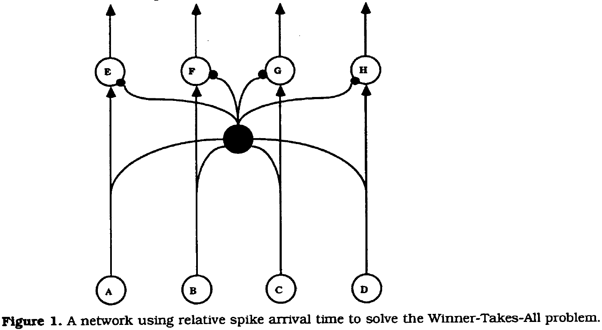
- The coding scheme proposed here may provide a powerful way of increasing the processing speed of neural networks, and may provide an important insight into how the visual system can process highly complex scenes with only 100-150 ms of processing time.

## [The size and complexity of dolphin brains-a paradox?](https://www.doi.org/10.1017/S0025315408000738)

- There seems to be a paradox between the high cognitive capabilities of dolphins and their thin neocortex.
- The total number of neurons in the dolphin neocortex is comparable to the chimpanzee.
- During evolution, dolphins may have increased the computational performance of their ‘simple’ neocortex by the multiplication of relevant structures (increasing surface area), instead of increasing its complexity.
- Paper suggests that the evolution of the large dolphin brain was due to
    - Using sonar as a successful feeding strategy to support the increased metabolism of a larger brain.
    - The pelvic girdle not limiting brain size at birth.
- Particularly impressive for the dolphin brain is the size and gyrification of the neocortex, with a surface area surpassing that of human brains.
- The sound generator and auditory system of a dolphin may have been the primary factor for the evolutionary size increase of the brain.
- Auditory structures in the dolphin’s brain are generally large (analogous to our large visual structures).
- It’s speculated that the hypertrophy (enlargement/overgrowth) of the dolphin brain resulted from the animal’s need for greater precision and speed in processing sound, due to the increased speed of sound in water compared to air.
- This hypertrophy correlates with the large diameter of the auditory nerve fibers, the short latency in auditory brainstem responses, and the rapid temporal resolution of successive sounds.
- In dolphins, the need for great precision and speed in processing sound, the highly cognitive capabilities, the hypertrophic cerebrum, and the extended gyrification of the cerebrum seem to be in paradoxical contrast to the thin neocortical plate.
- Dolphin neocortical grey matter is characterized by
    - The absence of layer IV
    - Poor granulation with the predominance of large isodendritic stellate cells
    - Well developed layers I and VI
    - An accentuated layer II
    - A high number of pyramidal neurons in layers II and VI
- These characteristics seem to represent a primitive mammalian brain.
- Although neuron density is low in the dolphin neocortex, synaptic density is high and the absolute number of synapses is similar to that in humans.
- The total number of neurons in the neocortex of the bottlenose dolphin and the false killer whale is similar to the chimpanzee.
- It’s possible that the high absolute number of neurons and the high number of synapses in dolphins contributes to their strong cognitive capabilities.
- The ability to perform precise and fast sound processing and the highly cognitive capabilities may be possible due to the expansion of the neocortex, instead of the development of a more complex one.
- This was probably a neurobiological alternative to the situation in primates.
- The size of the dolphin brain doesn’t seem to be in paradoxical contrast to the ‘simple’ neocortical architecture but rather the result of an evolutionary alternative solution to improve its computational performance.

## [A Theory of How Columns in the Neocortex Enable Learning the Structure of the World](https://doi.org/10.3389/fncir.2017.00081)

- Neocortical regions are organized into columns and layers, with perpendicular connections between layers suggesting a columnar functional organization.
- Paper proposes a network model composed of columns and layers that performs robust object learning and recognition.
- Each column integrates its changing input over time to learn complete predictive models of observed objects.
- A new feature to cortical columns, proposed by the model, is that a representation of location relative to the object being sensed is calculated within the sub-granular layers of each column.
- E.g. The location signal is provided as an input to the network where it’s combined with sensory data.
- Simulations show that single-column networks that learn using Hebbian-like rules can recognize hundreds of objects, with each object containing tens of features.
- This model for cortical columns may apply throughout the neocortex as it has similar columnar and laminar connectivity patterns throughout.
- The complex circuitry of the neocortex is remarkably preserved in all regions, suggesting that a canonical/general circuit consisting of columns and layers underlies everything the neocortex does.
- Understanding the function of this canonical circuit is a key goal of neuroscience.
- To build systems that work on the same principles as the neocortex, we need an understanding of the functional role of columnar and laminar projections.
- General neocortex connectivity rules
    - Cells in layers that receive direct feedforward input don’t send their axons outside the local region and don’t form long distance horizontal connections within their own layer.
    - Cells in layers that are driven by input layers form long-range excitatory connections within their layer, and also send an axonal branch outside of the region, constituting an output of the region.
- This two-layer input-output circuit is a persistent feature of cortical regions.
- Neocortex layer description
    - Layer 4 receives feedforward input and projects to layers 2/3.
    - Layers 2/3 are output layers.
    - Upper layer 6 also receives feedforward input and projects to layer 5.
    - Layer 5 is an output layer.
- Paper introduces a theory of how columns and layers learn the structure of objects in the world, and a network model based on the theory.
- A single cortical column can learn models of complete objects through movement.
- At any point in time, each column only has partial knowledge of the object it’s observing, but adjacent columns are also observing the same object, albeit at different locations on the object.
- Long-range excitatory connections in the output layer allow multiple columns to rapidly reach a consensus of what object is being observed.
- A key component of the theory is the presence of a signal representing location in each column.
- So the input layer receives both a sensory signal and the location signal.
- The input layer knows both what feature it’s sensing and where the sensory feature is on the object being sensed.
- The output layer learns complete models of objects as a set of features at locations.
- It’s proposed that the location signal is calculated in the sub-granular layers of cortical columns and is passed to input layer 4 by projections from layer 6.
- It’s important to note that the authors deduced the existence of the allocentric location signal by considering how fingers can predict what they’ll sense while moving and touching an object.
- The authors also believe the location signal is present in all neocortical regions but can’t yet propose a complete mechanism for how the location signal is derived.
- Thought experiment to understand the model
    - Imagine you close your eyes and use one finger to identify an object, say a coffee cup.
    - You can’t identify the object with a single touch, but after moving your finger around, you can identify the object as a coffee cup.
    - Recognizing the cup requires more than just the tactile sensation from the finger, the brain must also integrate knowledge of how the finger is moving, and hence where it is relative to the cup.
- This is the first problem, how a small sensory array (such as the tip of a finger) can learn a predictive model of 3D objects by integrating sensation and movement-derived location information.
- If you use two fingers at a time, you can identify the cup with fewer movements. And if you use five fingers, you can identify the object with a single grasp.
- This is the second problem, how set of sensory arrays work together to recognize an object faster than they can individually.
- Somatic inference is a sensorimotor problem but this is also applicable to vision and audition.
- Therefore, the mechanisms underlying sensorimotor learning and inference should exist in all sensory regions.
- Model description
    - Each cortical column processes a subset of the sensory input space and is exposed to different parts of the world as the sensors move.
    - The goal is to have the output layer of each column converge on an object representation that’s consistent with the accumulated sensations over time and across all columns.
    - The input layer of each column receives a sensory input and a location input.
- Two properties of the input
    - The location of a feature on an object is independent of the orientation of the object.
    - Nearby locations should have similar representations.
- The first property allows the system to make accurate predictions when the object is sensed in novel positions relative to the body.
- The second property enables noise tolerance as you don’t have to always sense the object in precisely the same locations.
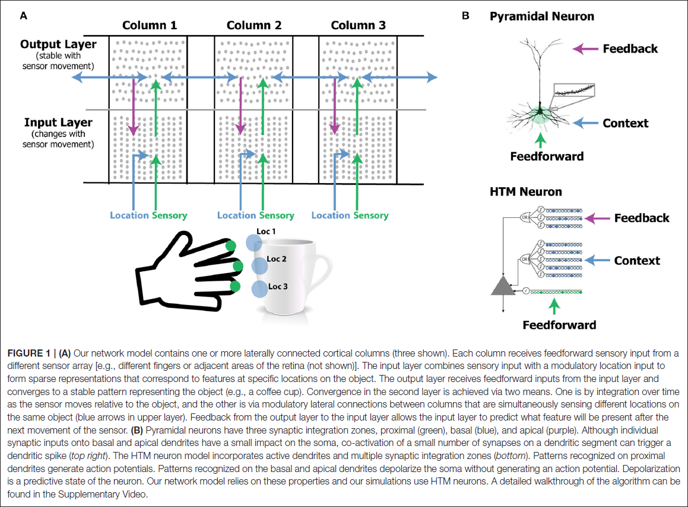
- Model uses HTM neurons where proximal, basal, and apical dendritic segments have different functions.
- The feedforward input of cells is the sensory input, and the basal modulatory input of cells represents the location on an object.
- An object comprises a representation in the output layer, plus an associated set of feature/location representations in the input layer.
- The modulatory input to cells in the output layer comes from other output cells representing the same object, both from within the column and from neighboring columns.
- The modulatory input acts as a bias as cells with more modulatory input will win and inhibit cells with less modulatory input.
- Neurons in the input layer receive feedback connections from the output layer.
- The feedback represents an object and the modulatory input representing the anticipated new location due to movement, allowing for more precise sensory input predictions.
- In this model, feedback is optional but improves robustness to noise and resolution of location.
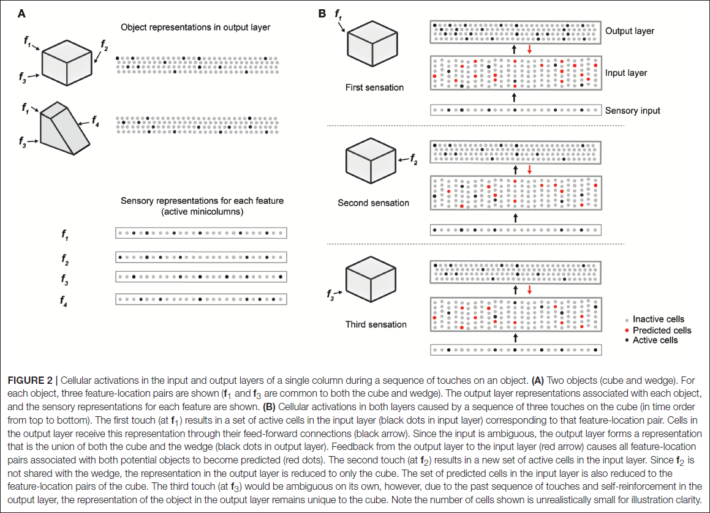
- Learning is based on simple Hebbian-style adaption; when cells fire, previously active synapses are strengthened and inactive ones are weakened.
- Two key differences
    - Learning is isolated to individual dendritic segments.
    - Neurons learn by growing and removing synapses from a pool of potential synapses.
- How fast the system learns and how long a memory is retained for can be adjusted independent of the weight of synapses.
- The input layer learns specific feature/location combinations.
- The output layer learns representations matching objects.
- When the network first encounters a new object, a sparse set of cells in the output layer is selected to represented the new object and remains active while the system senses the object at different locations.
- Feed forward connections between the changing cells in the input layer and the unchanging cells in the output layer are continuously reinforced.
- Thus, each output cell pools over multiple feature/location representations in the input layer.
- A single sensation by a single column is insufficient to unambiguously identify an object.
- But using multiple columns together reduces the number of sensations needed for recognition.
- We say that the network unambiguously recognizes an object when the representation of the output layer overlaps significantly with the representation for correct object and not for any other object.
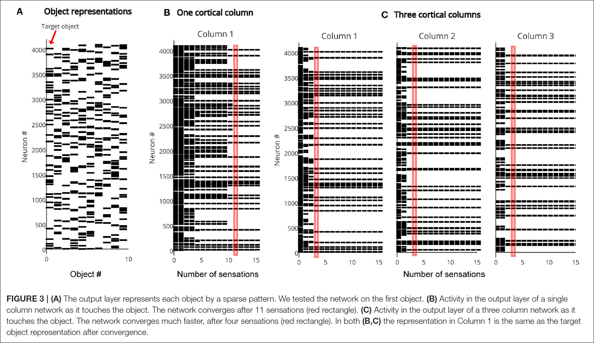
- The more objects there are in the training set, the more sensations are required for recognition.
- The more columns used in the network, the fewer number of sensations required.
- In this network model, each cortical column builds predictive models of objects.
- But how many objects can a single column represent?
- The capacity of the network is the maximum number of objects a network can learn and recognize without confusion.
- Four factors that impact network capacity
    - Representational space
    - Number of mini-columns
    - Number of neurons in the output layer
    - Number of cortical columns
- Given the sparse representation used by the output layer, it’s extremely unlikely for two feature/location pairs or two object representations to overlap and collide.
- Thus, object and feature pairing is not a limiting factor in the capacity of the network.
- However, as the number of learned objects increases, neurons in the output layer form more connections to neurons in the input layer.
- At some point, if the output neuron connects to too many input neurons, then it may be falsely activated by a pattern it wasn’t trained on.
- Thus, the capacity of the network is bottlenecked by the pooling capacity of the output layer.
- We expect the capacity of the network to increase as the size of the input and output layers increase.
- And this is what we observe in simulations.
- We can also increase the network capacity by increasing the number of cells in the output layer.
- Capacity is most impacted by the number of cells in the input and output layers, but increasing the number of columns has a marginal effect on capacity.
- The primary benefit of multiple columns is to reduce the number of sensations needed to recognize objects.
- Adding noise to the input had no impact on recognition accuracy up to 20% noise in the sensory input and 40% noise in the location input.
- Noise also impacted convergence speed as it took more sensations with noisy location input.
- Mapping to biology
    - Anatomical evidence suggests that the sensorimotor inference model described in this paper exists at least once in each column (layers 4 and 2/3) and maybe twice (layers 6a and 5).
    - Layers 4 and 2/3
        - L4 cells receive direct thalamic input from the sensory organs. L4 cells don’t form long-range connections within their layer, but project to and activate cells in L2/3 and receive feedback from L2/3.
        - L2/3 cells project long distances within their layer and are also a major output of cortical columns. It’s also known that L2/3 activation follows L4 activation.
        - A timing requirement of the model is that the location signal is a predictive signal that must precede the arrival of the sensory input.
        - Paper proposes that the location representation needed by the model comes from L6a.
    - Layers 6a and 5
        - L6a receive direct thalamic input from the sensory organs and this input exhibits driver properties and resembles the projections to L4.
        - L6a cells project to and activate cells in L5 and also receives feedback from L5.
        - L5 cells project long distances within their layer and L5 cells are also a major output of cortical columns.
        - However, evidence suggests that the model doesn’t map cleanly to L6a and L5 as sensory stimulus will often cause L5 cells to fire simultaneously or even before L6 cells.
        - It’s unclear whether L6a and L5 can be interpreted as an instance of the model.
- The derivation of the location representation in L6a is unknown.
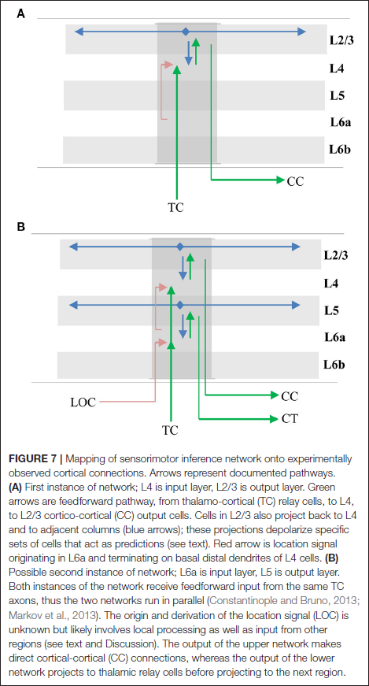
- It may come from regions dealing with the “what” and “where” pathways, as both pathways exist in all of the major sensory modalities.
- There are also several physiological predictions of the model that are supported by evidence.
- L4 and L6a cells exhibit “simple” receptive fields (RFs), while L2/3 and L5 cells exhibit “complex” RFs.
- Key properties of complex cells include wider-area RFs and increased temporal stability.
- L2/3 cells have receptive fields that are twice the size of L4 cells in the primary somatosensory cortex.
- Although most neocortex models provide important insights on the origin of neurophysiological signals, there are relatively few models proposing the functional roles of layers and columns.
- This model assigns a computational benefit to columns where they integrate discontinuous information in parallel across disparate areas.
- The key requirement is that each column models a different subset of sensory space and is exposed to different parts of the world as sensors move, which is tracked by a location signal.
- The deduction of the need for a location signals comes from the observation that cortical regions predict new sensory input due to movement.
- E.g. To predict the next sensory input, a patch of neocortex must know where a sensor will be on the object after a movement is completed.
- And this location prediction must be done on a sensor-by-sensor basis because each sensor will feel a different location and feature.
- Theoretical requirements for a generated location signal
    - To translate an egocentric motor signal into a predicted allocentric location, a column must also know the orientation of the object relative to the body part doing the moving.
    - Current location + Orientation of object + Movement >= Predicted new location
    - While this is a complicated task, grid cells show that it’s possible for neurons to perform.
    - Grid cells use the current location, head direction cells, and movement to predict a new location.
    - This is same information that’s needed to predict a location.
- These analogs, plus the fact that grid cells are evolutionarily older than the neocortex, leads us to hypothesize that this mechanism was preserved and replicated in the sub-granular layers of each cortical column.
- While we don’t have direct evidence that each cortical column has grid-cell like functionality, we do know that numerous cortical areas are modulated by body movement and position.
- In this model, inhibition plays a role in that mini-columns mutually inhibit each other.
- Cells that spike first prevent other nearby cells from firing, and this requires a very fast, winner-take-all type of inhibition among nearby cells.
- Traditionally, it’s been assumed that as sensory input ascends the sensory processing hierarchy, cells respond to larger areas (receptive fields) and to more complex features.
- This assumes that complete objects can only be recognized at the top of the hierarchy where cells respond over the entire sensory array.
- The model presented here, however, proposes that all cortical columns are capable of learning representations of complete objects.
- Hierarchy is still incorporated into the model as larger stimuli that covers many receptive fields still requires converging input onto a higher cortical region to recognize.
- Thus, the cortex learns multiple models of objects, both within a region and across hierarchical levels.
- This model also fits more into the ‘what’ visual pathway for object recognition and it’s unsure how it fits into the ‘where’ visual pathway.
- Does this model apply to other sensory modalities, not just somatic sensation?
- Yes, this model is indifferent to the underlying sensory modality.
- The more powerful observation is that the anatomy supporting this model exists in most, if not all, cortical regions.
- This suggests that no matter what kind of information a region is processing, its feedforward input is interpreted in the context of a location.
- This may also explain why it’s easier to remember things when they’re associated with physical locations, and why we often use mental imagery to convey abstract concepts.
- The paper also has a list of testable predictions such as cells in sensory regions should be stable over movements. I like this section/list but it’s too long to list here.
- This paper focuses on how the brain makes predictions of sensory inputs.
- The premise is that all sensory regions make predictions of their constantly changing input based on a location signal representing where on an object the column is sensing.
- Although there are many things we don’t understand, the big picture is clear.
- Authors believe that each cortical column learns a model of its world and by connecting these columns, they can resolve ambiguity.

## [A Case of Unusual Autobiographical Remembering](https://doi.org/10.1080/13554790500473680)

- Paper describes the case of AJ, a woman whose remembering dominates her life.
- Her memory is “nonstop, uncontrollable, and automatic.”
- AJ differs from other cases of superior memory in that it’s automatic and includes vast amounts of irrelevant information.
- Authors propose a new condition called “hyperthymestic syndrome” to describe AJ; the over-remembering syndrome.
- For AJ, memory has ruled her life and is like a sixth sense, always present like a split screen.
- AJ is 34 years old and since she was 11, she’s had an unbelievable ability to recall her past.
- Whenever she sees a date, she automatically goes back to that day and remembers where she was, what she was doing, what day it fell on, etc.
- It’s become clear that AJ’s memory is different from other cases of superior memory as she isn’t gifted at encoding and retrieving long strings of digits and numbers.
- In contrast to the vast literature on impaired memory and amnesic syndrome, little is known about forms of superior memory.
- Previous superior memory studies have focused on learning long lists of words/digits but none have reported superior autobiographical memory.
- The current view of superior remembering is that their skills are due to the application of strategies acquired through practice, and not through innate abilities.
- AJ differed in this regard as she couldn’t consciously apply strategies to help her learn and retain new information.
- E.g. AJ couldn’t use her talents in school and she had great difficulty with rote memorization.
- AJ described her memory as automatic, not strategic.
- The researchers used a variety of tests to explore her superior autobiographical memory.
- To verify her memory, AJ provided diaries detailing past events from age 10 to 34.
- AJ had grades of mostly Cs with some Bs and an A here and there. She didn’t like and wasn’t good at school and had to study hard.
- AJ reported migraines since childhood, taking medication to prevent headaches.
- AJ’s recall of events from her past is immediate, confident, and with considerable emotion.
- When asked to recall all Easter dates from 1980 onward, she produced all but one date accurately and with what she was doing on that day.
- When tested again two years later, she produced the same list but with the incorrect date corrected and with the same descriptions, matching the previous list and her diary entries, which demonstrates perfect reliability.
- She was able to recall an event given a date, and a date given an event, if the questions were within her areas of interest and the period of her good memory (around 14 years old and onward).
- AJ has a highly developed knowledge of dates and her mental calendar is impressive.
- However, if the date falls outside of that calendar, then she has trouble with it.
- E.g. She couldn’t answer what day of the week April 3, 1955 fell on.
- In contrast to AJ’s strong autobiographical memory and her ability to recall dates and events, she isn’t a gifted memorizer.
- The researchers also tested if her recognition would be better than her free recall and found that it wasn’t.
- How paradoxical that someone with such a powerful autobiographical memory was unable to recall or recognize the details of a videotape recording from a month before.
- Her autobiographical memory, while incredible, is also selective and even ordinary in some respects.
- Her general memory index on the WMS-R is 122, 29 points above her IQ.
- Traditionally, amnesia is characterized by a 15 to 20 decrement between general memory and IQ, so AJ’s memory is quantitatively superior.
- However, we should also remember that neuropsychological tests of memory are designed to measure impairments, not superior memory, and there can be ceiling effects due to the limited capacity to measure high levels of performance.
- AJ’s memory superiority is seen on tests of episodic memory, particularly when she is provided with some degree of structure in the material at encoding and/or at retrieval.
- However, AJ’s scores below average on tests of executive functioning and reasoning, anterior left hemisphere functions, organizationally demanding memory tests, and memory for faces.
- Like another case of superior memory, AJ was not strong in analogical reasoning and had a tendency toward concrete, rather than abstract, answers.
- Tests suggest a left hemisphere dysfunction, with issues in providing linguistically precise responses to questions, impaired facial memory, and a significant loss of detail in AJ’s recall.
- The tests that she doesn’t do well in are unstructured and require considerable abstraction, hypothesis formulation, and conceptual shifting.
- The following discussion weaves threads from separate approaches to offer the reader hypotheses about AJ’s form of extraordinary memory.
- The first important point is that maybe AJ is tricking the researchers or faking it all.
- How do we know that she isn’t rehearsing, practicing, and preparing to fool the researchers?
- She can’t prepare in advance since she didn’t know the dates and events prior to testing.
- Another argument against AJ faking are her scores on memory tests, as it would have been difficult to fake such a profile (set of scores).
- Most of us wouldn’t be able to retrieve what we were doing five years ago from this date, but AJ can.
- Give her an opportunity to recall one event and there is a spreading activation of recollection from one island of memory to the next.
- Two defining features of hyperthymesia
    - The person spends an abnormally large amount of time thinking about his or her personal past.
    - The person has an extraordinary capacity to recall specific events from their personal past.
- Why does AJ have an extraordinary good memory for some things and not for others?
- AJ, while of average intelligence, has significant deficits in executive functions involving abstraction, self-generated organization, and mental control.
- Although AJ isn’t autistic, there are certain similarities such as an interest in dates, repetitive and obsessive tendencies, and a highly variable neuropsychological profile with areas of superiority co-existing with areas of deficit.
- AJ doesn’t calculate the day of the week given a calendar date, but rather uses raw memory to know.
- Evidence for this is because she doesn’t know the day of the week outside of her personal experience, something calculations aren’t limited by.
- AJ’s hyperthymistic syndrome may be a case of highly superior semantic autobiographical memory.
- It’s somewhat surprising that superior memory doesn’t necessarily facilitate other aspects of everyday life, such as school.
- It’s worth questioning just what forms of superior memory benefit everyday functioning.
