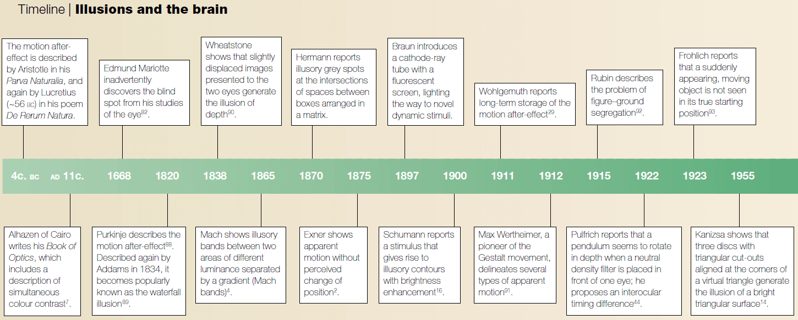
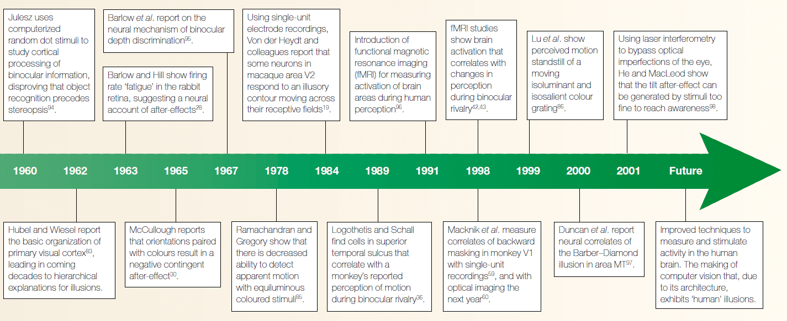
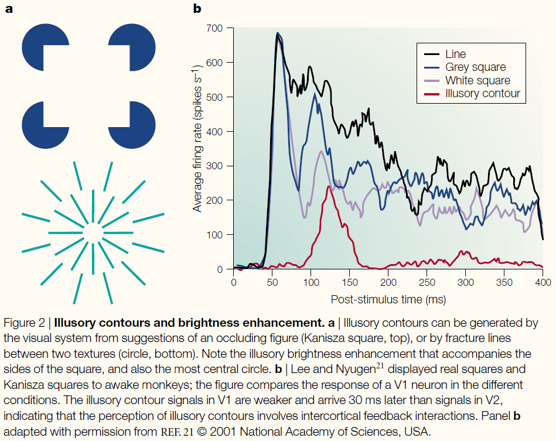
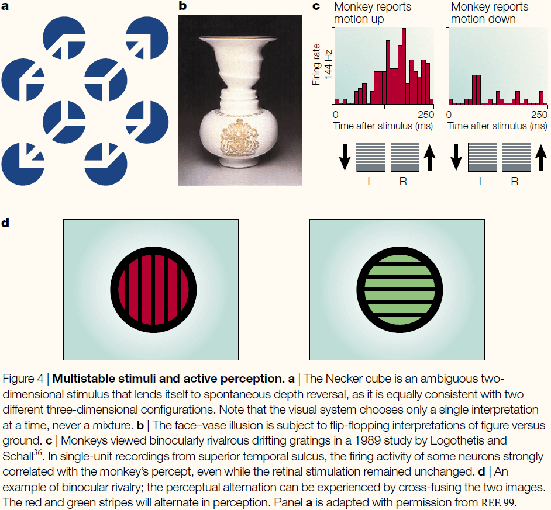
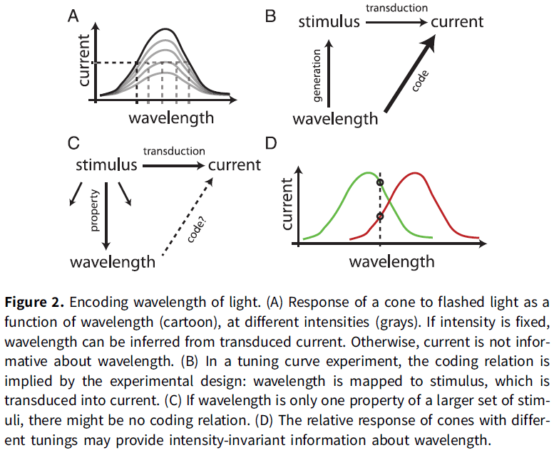
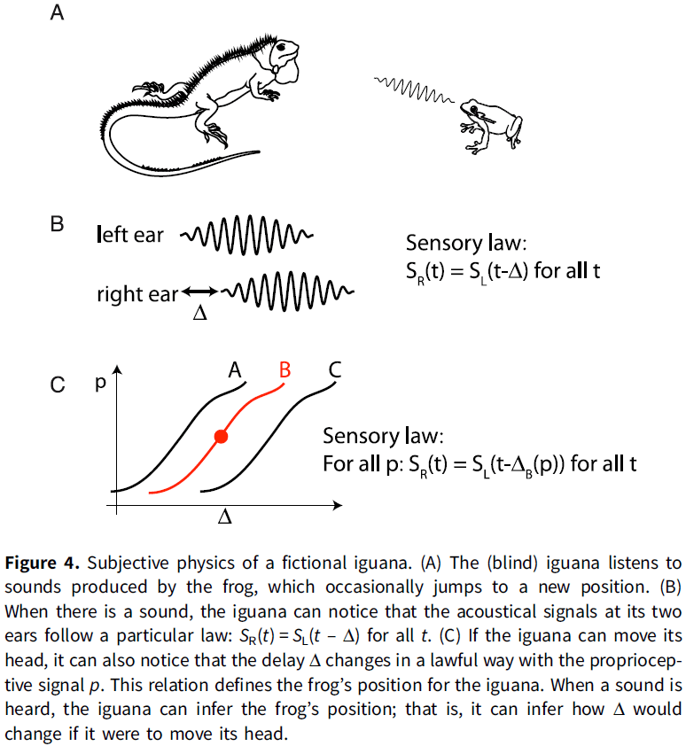
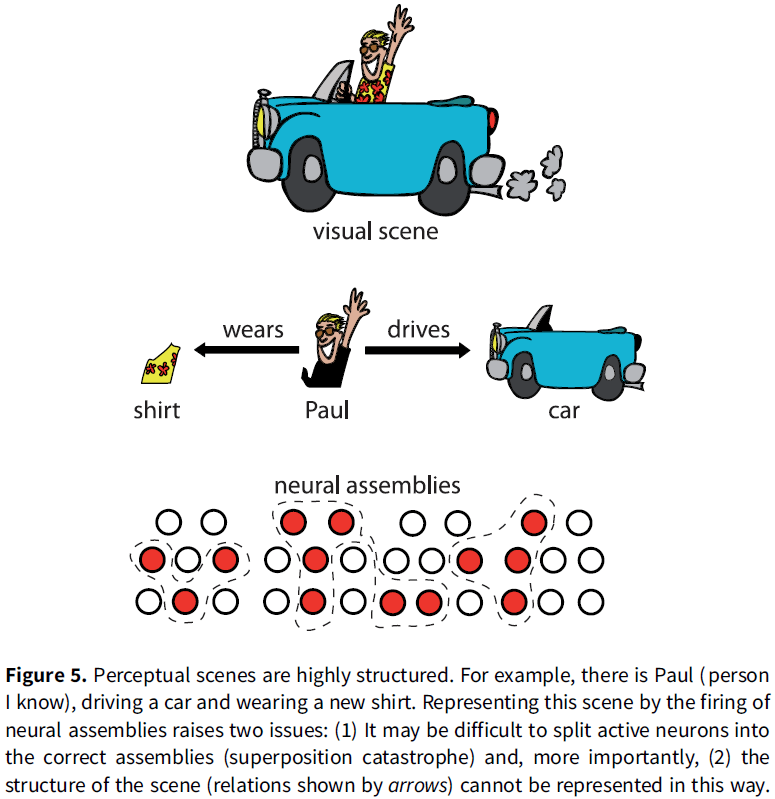
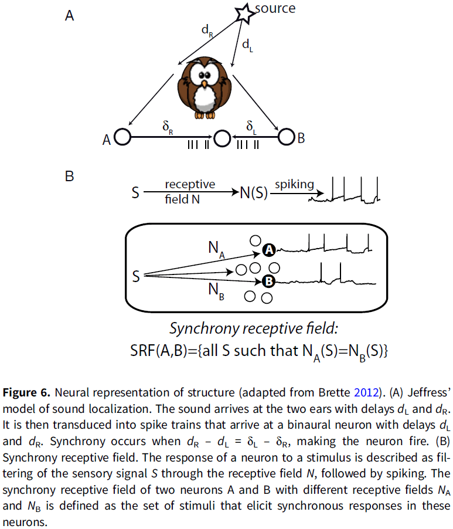
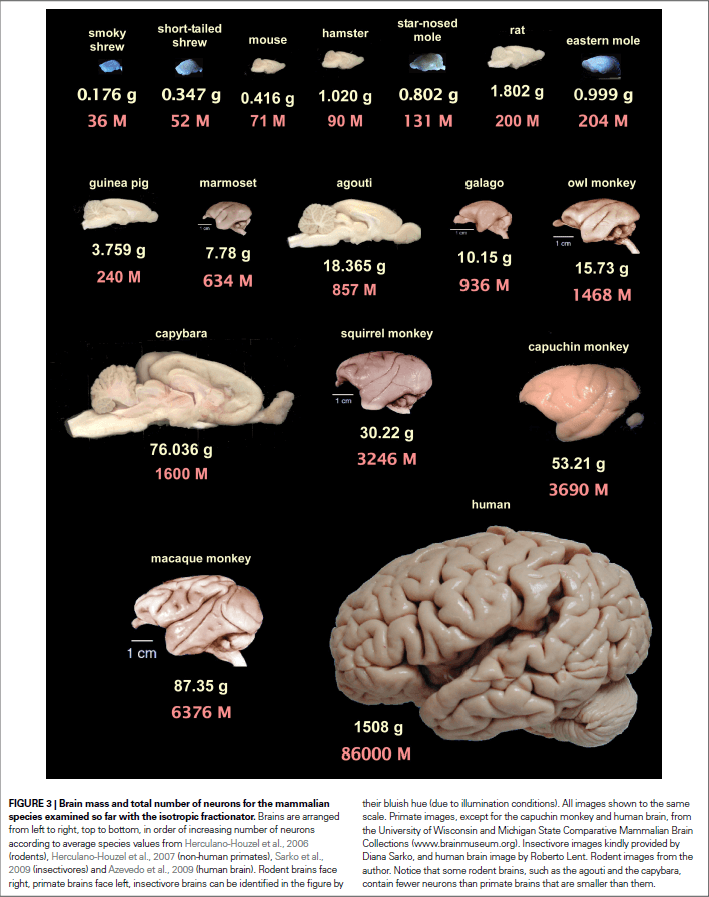
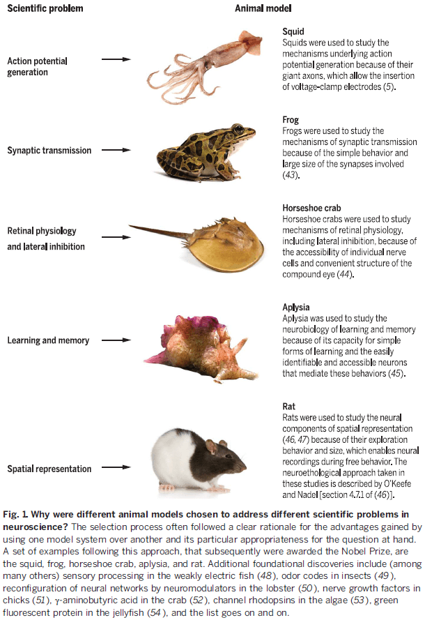

## [Could a Neuroscientist Understand a Microprocessor?](https://doi.org/10.1371/journal.pcbi.1005268)

- The authors analyze a microprocessor using neuroscience techniques and while it does reveal interesting structures in the data, it doesn’t meaningfully describe the hierarchy of information processing in the microprocessor.
- One can take a human-engineered system and ask if the methods used for studying biological systems would allow understanding the artificial system.
- The tested microprocessor is the MOS6502.
- Lesions studies allow us to study the causal effect of removing a part of the system.
- While we can lesion the microprocessor by removing transistors, it doesn’t help us get a better understanding of how the processor really works.

- Lesioning highlights the importance of isolating individual behaviors to understand the contribution of parts to the overall function.
- However, it’s extremely difficult to produce behaviors that only require a single aspect of the brain.
- If we record and analyze the tuning properties of neurons, we find that a small number of transistors are strongly tuned to the luminance of the most recently displayed pixel.
- However, we know that the strongly tuned transistors aren’t directly related to the luminance of the pixel, despite their strong tuning.
- We should be skeptical about generalizing from processors to the brain as there are many differences.
- However, we can’t ignore the failure of the methods used on the processor simply because processors are different from neural systems.
- We can use simulated microprocessors as a testbed for new neuroscience methods.
- The problem isn’t that neuroscientists couldn’t understand a microprocessor, the problem is that they wouldn’t understand it given the approaches they’re currently taking.

## [Visual illusions and neurobiology](https://doi.org/10.1038/35104092)

- Illusions are often the stimuli that exist at the extremes of what our sensory systems have evolved to handle.
- The word “illusion” is difficult to define as in a sense, all of vision is an illusion.
- An illusion arises from a difference between the perceived and the actual stimuli.
- E.g. In the cinema, we pay to watch a succession of flat, still images that appear to be rich with motion and depth.
- The systematic study of illusions provides important clues to the neural architecture and its constraints.

- Certain illusions have enabled us to discover that from the retina onwards, neurons characteristically inhibit or excite their neighbors depending on their connectivity.
- This allows the nervous system to enhance contrast between similar regions.

- Types of illusions
    - Illusions from lateral interaction
    - Illusory contours
    - After-effects
    - Multistable stimuli
    - The timing of awareness
- Opponent process theory of vision: trichromatic signals from cones are fed into subsequent neural stages and show opponent processing.
- This theory explains the after-effects illusion.
- A consequence of this theory is the idea that competing neural populations exist in a balance.
- If one subpopulation is fatigued, another population can dominate the push-pull competition and briefly control the percept.
- It now seems clear that the fatigue of neuronal populations falls short as an explanation for after-effects.
- The McCollough effect is unexplainable by the theory as the effect can last overnight and sometimes days.

- A very useful example of bistability is a phenomenon known as binocular rivalry.
- Multistable stimuli are invaluable tools for the study of the neural basis of visual awareness, because they allow us to distinguish neural responses that correlate with basic sensory features from those that correlate with perception.
- Several biological principles have been distilled from the careful study of illusions, and these will continue to guide neuroscience research.
- The flash-lag illusion is consistent with the idea that the percept attributed to the time of an event is a function of events that happen in a small window of time after the event.
- This means that consciousness is a retrospective reproduction and that the visual system isn’t only feedforward but also feedbackward.
- Cross-modal illusions have also been observed such as the McGurk illusion where visual information influences auditory information.
- Our understanding of biology can also inform us of new illusions such as the finding that the optic nerve causes a blindspot in our vision.

## [Is coding a relevant metaphor for the brain?](https://doi.org/10.1017/S0140525X19000049)

- The “neural coding” metaphor is misleading due to the following arguments
    - The neural code depends on experimental details that aren’t carried by the coding variable, thus limiting their representational power.
    - Neural codes carry information only by reference to things with known meaning.
    - Coding variables are observables tied to the temporality of experiments, whereas spikes are timed actions that mediate coupling in a distributed dynamical system.
- Neural coding is a communication metaphor.
- E.g. Morse code that maps letters to a sequence of dots and dashes.
- Both Morse code and the retinal code related to a communication problem: to communicate text messages over telegraph lines, or to communicate visual signals from the eye to the brain.
- Three key properties of the neural coding metaphor
    - Technical sense in that there’s a correspondence between two domains.
        - E.g. We call the relation between visual signals and spike trains a code to mean that spike trains specify the visual signals.
        - One can theoretically reconstruct the original message (visual signals) from the encoded message (spike trains), a process called decoding.
        - E.g. It’s this sense that neurons in the primary visual cortex encode the orientation of bars in their firing rate and that neurons in the hippocampus encode the animal’s location in place and grid cells.
    - Not all cases of correlations in nature are considered instances of coding.
        - E.g. Climate scientists don’t say that rain encodes atmospheric pressure.
        - Another assumption is that spike trains are considered messages for a reader, the brain, about the original message.
        - This is the representational sense of the metaphor.
    - Neural coding as a metaphor implies a causal relation between the original message and the encoded message.
        - E.g. Spike trains result from visual signals and not the other way around.
        - To be a representation for a reader, the neural code must at least have a causal effect on the reader.

- Three elements of the neural coding metaphor summarized
    - Correspondence
    - Representation
    - Causality
- Most technical work on neural coding uses the first technical sense where the word “code” is used as a synonym for “correlate”.
- The paper argues that scientific claims based on neural coding rely on the representational or causal sense of the metaphor, but that none of these two senses is implied by the technical sense (correspondence).
- In other words, a correspondence or correlation doesn’t mean representation or causality.
- Coding variables that are shown to correlate with stimulus properties depend on the experimental context, therefore, neural codes don’t provide context-free symbols.
- And we can’t extend the neural code to represent a larger set of properties, such as the context, because context is what defines properties.
- Thus, neural codes have little representational power.
- The fundamental reason is that the coding metaphor conveys an inappropriate concept of information and representation.
- Neural codes carry information by reference to things with known meaning.
- E.g. Morse code only means something if you know that the dots and dashes refer to letters.
- However, perceptual systems have no option to refer to another thing for meaning so they build information from the relations between sensory signals and actions, forming a structured internal model.
- Another issue with the neural coding metaphor is that it tries to fit the causal structure of the brain (dynamic, circular, distributed) into the causal structure of neural codes (atemporal, linear) which doesn’t work.
- The author concludes that the neural coding metaphor can’t be the basis for theories of brain function because it’s disconnected from the causal structure of the brain and it’s incompatible with the representational requirements of cognition.
- The activity of neurons is often said to encode properties.
- E.g. The firing rate of pressure sensory neurons in skin encodes the depth of the stimulus. The deeper the stimulus, the faster the firing rate.
- Francis Crick fallacy of the overwise neuron
    - Cones are broadly tuned to wavelength.
    - If different wavelengths of light are flashed, then the amplitude of the transduced current in the cone varies with the wavelength.
    - Thus, the current encodes wavelength in the technical sense as one can recover the wavelength from the magnitude of the current. One can be translated into the other.
    - Yet, animals/humans with a single functional type of cone are color blind, why? The cones encode color information so why can’t the organism see color?
    - The answer is that if the photoreceptor’s current also depends on light intensity, then it doesn’t provide unambiguous information about wavelength in any general setting, even in the narrow sense of correspondence.
    - This also applies to any tuning curve experiment.
- The proposition that the neuron encodes the experimental parameter is mainly a property of the experimental design rather than a property of the neuron (which only needs to be sensitive to the parameter).

- This confusion, that a neuron’s firing rate is a function of the stimulus parameter (rather than a context-dependent correlate), underlies influential neural coding theories.
- To say that a neuron encodes a property of the stimuli and isn’t only sensitive to it, we have to rule out all other factors.
- E.g. Wavelength isn’t encoded by single cones, but by the relative activity of cones with different tunings. The relative activity doesn’t depend on light intensity nor other properties of the stimulus so we can make the stronger claim.
- Thus, referring to tuning curve experiments in terms of coding promotes a semantic drift, from the modest claim that a neuron is sensitive to some experimental manipulation to a much stronger claim about the intrinsic representational content of the neuron’s activity.
- Another example of when the neural coding metaphor drifts from the technical sense is for sound localization.
    - Interaural time difference (ITD): the difference in arrival times of the sound wave at the two ears.
    - ITD is a major cue for animals to determine the location of a sound.
    - It’s been shown that the neurons in the IC have a critical role in localizing sounds in the contralateral field.
    - How does the activity of these neurons contributed to sound localization behavior?
    - One way is to consider the entire pathway, to try to build a model of how neuron responses in various structures combine to produce behavior that uses the sound’s location.
    - Another way is to ask how neurons encode sound location.
    - However, theories that say how neurons encode sound location don’t link how the responses of a single neuron can result in the behavior observed.
    - E.g. They say that there is sufficient information in the firing rates of individual neurons to produce ITD that are comparable with those of human psychophysically.
    - There is a skip between linking neural activity to behavior. Decoding the neural code isn’t done by the brain but by the experimenter.
    - By implying that the brain reads the neural code, we manage to make claims about perception and behavior while ignoring the mechanisms by which behavior is produced.
    - These claims rely on implicit linking propositions based on abstract constructs, where neural activity is likened to computer memory that the brain stores, retrieves, and manipulates, wherever it’s in the brain and whenever it occurs.

- Populations of overwise neurons
    - Slope coding. This concept relies on the fallacy of the overwise neuron so the concept fails.
- In reality, tuning curves are defined for a specific experimental condition and aren’t context free.
- If neurons encode variables, then what encodes the definition of those variables?
- Perception and memory cannot just be about encoding stimulus properties because this omits the definitions of those properties and of the objects to which they are attached.
- The author argue that the coding metaphor conveys a particular notion of information, information by reference, and this kind of information is irrelevant to perception and behavior.
- How is it possible for the nervous system to infer external properties from neural activity if all that it ever gets to observe is that activity? How does the brain know what the codes refer to?
- My answer is that the nervous system uses the pathway that the activity came from to infer the external properties.
- This is related to the symbol grounding problem because how do spikes, the symbols of the neural code, make sense for the organism?
- One possibility is that the meaning of neural codes is implicit in the structure of the brain that reads them.
- Two objections against this proposition
    - Neural plasticity makes the idea of a fixed code implausible.
        - E.g. A person born with one hemisphere can see both visual hemifields, implying that the hemisphere has learned the new meaning of the signals from the opposite hemifield.
    - We didn’t evolve to handle new types of information.
        - E.g. We don’t have a brain circuit for chess.
- Neural coding theory considers the relations between observables as redundant and that they should be eliminated.
- In contrast, the view discussed in the paper argues that relations constitute information.
- One way that the nervous system might build relations is by exploiting the “invariant structure” in sensory stimuli.
- E.g. When a sound is produced, the left and right ears received a delayed version from each other. This property of “delay” is an invariant structure of sound because the ears are distanced apart.
- The sensory world is made up of random pairs of signals that follow particular laws that the listener can identify. This identification is called the “pick-up of information”.
- An interesting aspect of this alternative notion of information is that the topology of the world projects to the topology of sensory laws.
- E.g. Two different sounds produced by a source at the same position will produce pairs of signals that share the same property (the sensory law).
- This can be assessed without knowing what this property corresponds to in the world. We don’t know what the property is, we just know that the property is invariant.
- For an external observer, the sensory laws convey the information that the delay is related to the source’s position.
- However, for the receiver, they don’t know what the sensory law conveys as nothing tell it what it is nor can it infer it from the message.
- The important point here is to focus on the perspective of the receiver. If we are in the place of the receiver aka the organism, we can’t infer what the sensory signal means.
- Now let us consider that the receiver can turn their head, now the receiver observes that there’s a lawful relation between a proprioceptive signal (the head’s position) and the observed delay.
- Now when the receiver observes sounds with a particular delay, it can infer that if it were to move its head, then the delay would change in a particular predictable way.
- For the receiver, the relation between acoustical delay and proprioception defines the spatial position of the source.
- We note that the perceptual inference involved here does not refer to a property in the external world (frog position), but to manipulations of an internal sensorimotor model.
- The kind of information available to an organism isn’t Shannon information (correspondence to external properties of the world) but internal sensorimotor models.
- Animals are interested in such models is that they can be manipulated to predict the effects of hypothetical actions.

- While this type of model seems similar to predictive coding theory, it isn’t the same as those models map internal variables to observables, while this model is more akin to models in physics which form relations between observables (F = ma).
- Generative models aren’t the kind of internal models described in the previous section.
- The word “predictive” is another baggage term in neuroscience as it is used in the technical sense such as in predictive coding, where it means that a neuron’s firing correlates with its sensory inputs, but the term is also used to refer to how an organism forms behavioral predictions.
- There isn’t any indication of how a theory based on neural coding might explain anticipatory behavior.
- For memory, cell assemblies can’t be used to implement memory because they’re unstructured and, thus, can’t represent structured internal models.
- E.g. Analogous to the “bag of words” model in text retrieval where a text is represented by a set of words and all syntax is discarded.
- The main objection is that cell assemblies encode objects or features to be related, but not the relations between them.

- Synchrony is one possible solution used to bind the features of an object represented by neural firing.
- E.g. In the Jeffress model of ITD coding, neurons receive inputs from both ears with different conduction delays. When input spikes arrive simultaneously, the neuron spikes. Thus, spikes are caused when the two acoustical signals at the two ears match the conduction delay of that specific neuron. In this model, the neuron’s firing indicated whether signals satisfy a particular sensory law.
- This model has been generalized with the concept of a “synchrony receptive field”, which is the set of stimuli that elicit synchronous responses in a given group of neurons.
- Although synchrony can represent relations, neither binding by synchrony nor synchrony receptive fields solve the general problem of binding, because only one type of relation can be represented by synchrony and only a symmetrical one.

- Neural coding theories generally rely on the representational sense of the metaphor, the idea that neural codes are symbols standing for the properties that the brain manipulates, but no evidence has been provided that this sense is valid.
- Worse, there’s empirical evidence and theoretical arguments to the contrary.
- The coding metaphor has a dualistic structure and structures the function of the brain into two distinct components
    - A component that encodes the world into the activity of neurons.
    - A component that decodes that activity into the world.
- The two dual components (encoding and decoding) are indistinguishable in behavior, because no behavior involves just one of them.
- The question “does the brain use a firing rate code or a spike timing code?” is the same as asking “does the brain use the BOLD code?”
- Neural codes based on averaging over trials don’t have causal powers because percepts are experienced now, not on average.
- Neural codes have much less representational power than generally claimed or implied.
- The causal structure of neural coding metaphor is incongruent with the causal structure of the brain.
- What else, if not coding?
- The author suggests to develop models of the full sensorimotor loop.
- E.g. Instead of looking for neural codes of sound location, look for neural models of auditory orientation reflexes.
- To see neural activity as what it really is: activity.
- Action potentials are potentials that produce actions; they aren’t hieroglyphs to be deciphered.

**Our understanding of neural codes rests on Shannon’s foundations commentary**

- When applying Shannon’s theory of information to understanding the brain, what determines the set of possible messages?
- Brain structure determines the sets of possible messages.
- E.g. The set of possible messages about vision is restricted to the three cone types set up by the brain.
- Shannon’s source-coding theorem enables us to understand why the brain imposes this structure on the color messages it receives: An efficient code must reflect the source statistics.
- E.g. For color, the source statistics are the statistics of the reflectance spectra of surfaces in the natural world.
- The brain’s way of encoding color captures a large part of the information available.
- An understanding of the brain’s codes is as essential to neuroscience as an understanding of the genetics code is to biology.

**The origin of the coding metaphor in neuroscience commentary**

- The question of eliminating “coding” shouldn’t be in reference on the truth of the coding metaphor, but on its utility.
- We shouldn’t get bogged down wondering whether the brain “really” encodes information about the world. It doesn’t.
- The questions, rather, are these: Is the metaphor still useful for us, today? Does the usefulness of the metaphor outweigh its inaccurate connotations? Or, has it outlived its usefulness entirely?

**Is coding a relevant metaphor for building AI?**

- The neural coding metaphor is an insufficient guide for building an AI.
- The history of AI tells us that the most useful principles, and the richest theoretical insights, emerged from studying control, optimization, and learning processes rather than the particularities of representations or codes.

## [Consciousness: The last 50 years (and the next)](https://doi.org/10.1177%2F2398212818816019)

- One of the defining questions for the mind and brain sciences has been the relationship between the subjective experience of consciousness and its biophysical basis.
- Consciousness science over the last 50 years can be divided into two epochs.
    - From the mid-1960s to 1990 the fringe view held.
    - From the late-1980s to early-1990s there has been an overflow of research into consciousness.
- Consciousness: 1960s until 1990
    - By the mid-1960s, behaviorism had dominated the 20th century of psychology was retreating.
    - The essential dependency of particular aspects of consciousness on specific brain properties.
    - E.g. Split-brain patients.
    - One of our most deeply held assumptions is that consciousness is unified.
    - However, there’s evidence against this assumption as lesions to the medial temporal lobe, in the case of patient H.M, showed impairment only in explicit, conscious memories and not in other forms of memory such as motor skills and semantic memory.
    - Libet experiment paradigm: comparing the brain signals before and during the conscious decision to move.
- Consciousness: 1990s until the present
    - The revival of consciousness as a scientific study can be marked by the landmark paper, “Towards a neurobiological theory of consciousness”.
    - Neural correlates of consciousness (NCCs): the minimal neuronal mechanisms jointly sufficient for any one conscious percept.
    - E.g. In binocular rivalry such as the Necker cube, implanted electrodes found that neuronal responses in early visual areas (such as V1) tracked the physical stimulus rather than the percept. While the neuronal responses in higher visual areas (such as IT) tracked the percept rather than the physical stimulus.
    - Global workspace theory: the idea that modular and specialized processors compete for access to a global workspace.
- The road ahead
    - Review of Integrated Information Theory (IIT), predictive coding/Bayesian brain.
- A great deal is now known about how embodied and embedded brains shape and give rise to various aspects of conscious level, content, and self.
- Much more remains to be discovered.

## [Reflections on the past two decades of neuroscience](https://doi.org/10.1038/s41583-020-0363-6)

**Danielle Bassett**

- Moving beyond the activation studies characteristic of the brain-mapping era.
- Two pioneering paths
    - Neural representations: the pattern of activity across neural units that encodes an object, concept, or state of information.
    - Network systems: the pattern of connections between neural units that can support the transmission of information and the modulation of network state that changes the repertoire of computations accessible to a given neural population.
- The twin paths of representation and transmission move beyond the mapping of a country’s borders, to record a city’s statistics and the transportation networks along which traffic flows.
- How do we combine these twin paths?
- The former offers the dots within, the latter offers the lines between.
- Important for deciphering the mechanism of the brain’s fundamental goal: information processing.

**Kathleen Cullen**

- Traditionally, the field has asked how sensory input (afference) is transformed into motor output (efference).
- A fundamental development over the past two decades, however, is the reverse of this traditional perspective.
- Recent studies have found that motor signals profoundly influence sensory processing.
- Experiments reveal how motor-related inputs to sensory areas selectively cancel self-generated sensory inputs.
- This neural strategy underlies an essential property of the brain, its ability to distinguish externally applied (exafferent) from self-generated (reafferent) sensory inputs.
- Much of the sensory input that we experience daily is reafferent.
- The brain’s ability to predict the sensory consequences of our actions based on motor-related inputs is vital for both perceptual stability and accurate motor control.
- This computational strategy also provides the flexibility required for fine-tuning and updating relationships between motor signals and resultant sensory feedback in order to compensate for changes to our body or the environment.
- The ability to distinguish between sensory exafference and reafference is a hallmark of higher-level perceptual and cognitive processing and central to our sense of agency.
- How does the brain actually predict the sensory consequences of our actions in a dynamically changing world.
- Two lines of research addressing this question
    - Emerging technologies (high-density recording and ability to target perturbations in neural circuits) provide new insights on how specific brain regions actually perform prediction.
    - Advances in our understanding of sensory processing during natural behaviors have motivated the investigation of neural circuits in real-world environments.

**Simon Eickhoff**

- Expansion and maturation of in vivo neuroimaging experience such as increases in sample size.
- The mass univariate investigation of within-sample associations is being abandoned in favour of multivariate models that are better suited for capturing the richness of MRI data.
- ML may hold the key to delivering on some of the promises of neuroimaging.
- Key challenge for the future are unified accounts for regional segregation and system-wide interactions in the brain.

**Martha Farah**

- Neuroscience has been dominated by two main goals
    - To understand the brain.
    - To alleviate neurological and psychiatric disorders.
- New third goal: to enhance diverse non-medical endeavours.
- E.g. Neuroaesthetics, neurowarfare, neurolaw, neuroeducation, and neuromarketing.
- The era of ‘neuroeverything’.
- Neuroscience, in principle, is relevant to any field that seeks to understand, predict, or influence human behavior.
- E.g. Neurolaw, neuroeducation, neuromarketing.

**Yukiko Goda**

- Technological advances have stimulated circuit-based analysis of the neural systems underlying cognitive functions and behaviours.
- Omic approaches (E.g. transcriptomics, proteomics, and connectomics) are also providing novel views into the molecular and cellular architecture of the brain.
- Synapses as the building blocks of memory.
- A key issue is to close the gap between our circuit-level understanding of various neural systems, and our understanding of the behaviour of individual synapses constituting the network.
- E.g. How might synapse-specific Hebbian plasticity drive memory engrams that are represented by cellular networks?

**Patrick Haggard**

- When stimulus evidence is ambiguous, internal motor noise can still drive a decision variable over the action threshold.
- The past two decades have seen an increasing focus on reinforcement learning (RL).
- Exploratory or exploitative choices in action.
- Recent studies suggest that experienced linkage between action and outcome is boosted immediately after an error, suggesting an important connection between sense of agency and persistence in trying.
- Voluntary action lies between the stimulus-response chain and the action-outcome chain.

**Hailan Hu**

- One booming field is psychiatric neuroscience.
- Neurological disorders are often associated with discrete anatomical lesions, while psychiatric disorders are thought of as diseases of unknown cause.
- New brain imaging tools are exploring the causal relationship between the activity of specific neural circuits and behavioral or disease states.
- Another booming field is social neuroscience, which explore the neurobiological mechanisms of social behaviour.
- Big-picture question in psychiatric neuroscience is: How do some drugs rapidly ameliorate or induce certain psychiatric symptoms?
- E.g. Phencyclindine can rapidly induce symptoms of schizophrenia and ketamine can rapidly alleviate symptoms of depression.

**Yasmin Hurd**

- A major challenge in neuroscience is understanding of the heterogeneous mosaic of brain cells.
- Recent advances have revealed vast differences in the molecular profiles of cells and the existence of potentially over a hundred different mammalian neuronal and non-neuronal cell types.
- One notable discovery is that classic monoamine neurotransmitters (serotonin and dopamine), can directly attach to chromatin, moving the field to consider these neurotransmitters to also play a direct role in the regulation of gene transcription.
- Excited about the growing use of ML strategies to improve prediction models about neurobiological substrates linked to specific phenotypes.

**Sheena Josselyn**

- Our newfound ability to gain a firm experimental grip on the basic cellular unit of memory storage: the engram (memory trace).
- An experience activates a small subset of cells that undergo persistent chemical/physical changes to become an engram.
- Memory retrieval occurs when sensory cues later reactivate this engram.
- The ability to catch an engram proved to be an absolute game-changer.
- We are beginning to understand how cells are allocated to an engram, how the architecture of an engram impacts memory retrieval, and how the passage of time or new information changes engrams.
- Many questions still remain
    - Exactly how and where is information stored in the brain? Is it stored in cell ensembles, synapses, molecules, or DNA?
    - What do we mean by ‘information’?

**Baljit Khakh**

- We are starting to witness the dawn of ‘industrial scale neuroscience’.
- In the field of glial biology, new tools (genetic, optical, and instrumentation) has allowed neuroscience to be explored in ways that weren’t previously possible.
- Another development is the growth of big data and the processes to analyze them with computational methods.
- In relation to neurons, glia are still an understudied cell population.
- Author is excited about the prospect of manipulating and targeting glia as endogenous neuromodulators to produce disease-related phenotypic benefits in complex brain disorders.

**Jurgen Knoblich**

- Neuroscience was profoundly influenced by the arrival of the post-genome era.
- A second groundbreaking development was the establishment of optogenetics, the ability to turn neurons on or off, has merged functional neuroscience with cell biology.
- Author convinced that the next decade in neuroscience will be the era of the human brain.
- Important questions
    - What makes us human?
    - What genetic changes are responsible for the enormous complexity and cognitive power of the human brain?
    - What makes us individual?
- Author excited about organoids and their ability to allow us to ask specific questions about the brain.

**Panayiota Poirazi**

- Dendrites shouldn’t be viewed as passive cables but as powerful computational units that greatly expand the processing and storage capacity of individual neurons.
- The past decade has witnessed a closer and more fruitful collaboration between theorists and experimentalists.
- Establishing causal links between dendritic function and behavior is the ultimate challenge.

**Russell Poldrack**

- A notable development over the past two decades is the advent of computational theories that are being used to both drive experimentation and interpret neuroimaging data.
- New methods for modelling have provided a tool to more clearly link functional imaging signals to underlying computational mechanisms.
- The transition from the highly localizationist approaches to a focus on the hierarchical structure and dynamics of brain networks.
- It was once legitimate to refer to neuroimaging as ‘blobology’ but those days are largely gone.
- How do we reconcile the views of brain function that are currently inherent in the computational neuroscience and network neuroscience approaches.
- Network neuroscience has provided insights into the structure and dynamics of brain networks.
- Computational neuroscience has provided insights into the specific computational functions that are performed by individual brain circuits, but has said little about the complex dynamics that occur when many such circuits are interconnected at the scale of an entire brain.

**Marco Prinz**

- A renaissance of neuroimmunology research with a special focus on understanding the function and heterogeneity of CNS myeloid cells such as microglia.
- The most important questions in neuroimmunology deal with how microglia contribute to CNS diseases and how this contribution can be modulated.

**Pieter Roelfsema**

- The increasing influence of AI, allowing neuroscientists to better understand synaptic plasticity rules and information processing in the brain.
- New probes permit the study of many hundreds of neurons simultaneously.
- An important trend has been the move towards open science and open data.
- Neuroscientific insight has started to benefit from the progress in AI.
- When high-density brain reading and writing are applied to humans, there’s likely to be a new wave of scientific insights into the neuronal processes underlying the human mind.

**Tara Spires-Jones**

- Exciting new developments in understanding Alzheimers and dementia over the past 20 years.
- Biggest changes in the past 20 years hasn’t been neuroscience-specific.
- The explosion of the ability to share data has been of real benefit and is likely to become even more important over the next 20 years.
- More collaboration has been happening too.

**Mriganka Sur**

- Two fields with notable developments
    - Understanding cortical dynamics at the level of brain regions and neuronal populations.
    - Cortical plasticity at the level of synapses and clusters of synapses.
- Optogenetics has revealed specific contributions of brain regions and cell classes to information processing.
- Recent findings puzzlingly suggest the widespread expression of signals, such as those related to action and reward, throughout the brain.
- These studies point to the importance of disentangling correlative versus causal signals.
- High-resolution imaging of synapses and synaptic molecules has lead to a richer conceptual understanding of cortical plasticity.
- E.g. At excitatory synapses, plasticity is largely implemented by Hebbian learning but unregulated strengthening leads to unstable cell assemblies. Thus, synaptic renormalization is necessary to stably encode information in neurons and networks.
- A key advance is the realization that neuronal plasticity is implemented by multiple cooperative mechanisms: Hebbian changes at specific synapses are complemented by locally coordinated plasticity at adjacent synapses that renormalizes synaptic weights over dendritic stretches, and by longer-term synaptic scaling which further renormalizes weights over the entire postsynaptic neuron.

**Hiroki Ueda**

- We’re not acquiring catalogues of cells in entire brains and even entire bodies in some mammals.
- One of the greatest contributions to these achievements has come from the development of tissue-clearing methods and light-sheet microscopy.
- They’ve become higher-performance, faster, safer, and easier to use.
- What comes after the catalogues of cells?
- Systems biology that identify cellular networks and cellular circuits.
- Author excited about the trans-hierarchical studies to investigate the role of particular residues of specific molecules in specified cells in organisms.

## [The human brain in numbers: a linearly scaled-up primate brain](https://doi.org/10.3389/neuro.09.031.2009)

- Brain size can’t be a proxy for the number of neurons in the brain.
- The human cerebral cortex holds only 19% of all brain neurons.
- Two advantages of the human brain
    - It’s built according to very economical, space-saving scaling rules (that apply to other primates).
    - It’s the largest among primate brains, hence it contains the most neurons.
- Paper findings argue in favor of a view that cognitive abilities is centered on absolute numbers of neurons, rather than on body size/encephalization.
- Weirdly, our exceptional abilities aren’t brain-centered, but rather body-centered.
- People believe that our superior cognitive abilities are a result of our brain being bigger than expected for our body size.
- How many neurons does the human brain have, and how does that compare to other species?
- The usual answer is that we have 100 billion neurons and 10 times more glial cells.
- Among mammals, the trend is that the species with the largest brains tend to have a greater range and versatility of behavior than those with smallest brains.
- E.g. Larger-brained birds such as corvids, parrots, and owls.
- Since whales and elephants have larger brains than we do, why should we be more cognitively able compared to them?
- Encephalization quotient (EQ): a measure of how much the observed brain mass of a species deviates from the expected brain mass for its body mass.
- Problems with EQ
    - It isn’t obvious how a larger-than-expected brain mass confers a cognitive advantage.
        - E.g. When we compare small-brained animal with very large EQs to large-brained animals with smaller EQs, we find that the large-brain animals have better cognitive performance even though they have smaller EQs.
    - The body-brain mass relationship depends on the precise combination of species computed. Can’t compare apples to oranges.
- Another false assumption is that brain’s aren’t all built the same. Some brains scale much better and are built denser.
- The number of neurons in the cerebral cortex increases coordinately with the number of neurons in the cerebellum in humans.

- Brain size isn’t a reliable indicator of number of neurons because different cellular scaling rules apply to rodents, primates, and insectivores.

- In rodents, a larger number of neurons is followed by larger neurons.
- The adult male human brain has, on average, 86 billion neurons and 85 billion non-neuronal cells in 1.5 kg.
- Remarkably, the human cerebral cortex, which represents 82% of brain mass, holds only 19% of all neurons in the human brain.
- The relatively large human cerebral cortex, therefore, isn’t different from the cerebral cortex of other animals in its relative number of neurons.
- If a rodent brain had 86 billion neurons, like the human brain, we would expect it to weigh 35 kg, a value beyond the current largest known brain mass (9 kg for the blue whale) and is probably physiologically unattainable.
- Being a primate endows us with seven times more neurons than would be expected if we were rodents.
- The human brain is a linearly scaled-up primate brain, with just the expected number of neurons for a primate brain of its size.
- It’s likely that humans don’t have truly unique cognitive abilities, but rather the combination and extend of abilities is what makes us great.
- Exponential combination of processing units, and therefore of computational abilities, leads to events that may look like “jumps” in the evolution of brains and intelligence.
- Since neurons interact combinatorially through synapses, the increase in cognitive abilities afforded by increasing the number of neurons in the brain can be expected to increase exponentially with absolute number of neurons.
- Disregard body and brain size and focus more on the absolute number of neurons.
- Glial cells in the human brain are at most 50% of all brain cells.
- Two advantages of the human brain
    - It scales as a primate brain meaning it scales economically.
    - It has the largest number of neurons.

## [Neuroscience: In search of new concepts](https://science.sciencemag.org/content/358/6362)

**The emperor’s new wardrobe: Rebalancing diversity of animal models in neuroscience research**

- Is the great diversity of questions in neuroscience best studied in only a handful of animal models?
- Neuroscience has been and is converging on only a few select model organisms.
- Krogh’s principle: for a large number of problems, there will be some animals that will be the most convenient to study.
- E.g. Hodgkin and Huxley used the squid to understand the mechanisms behind AP generation because it has a huge axon (~1 mm diameter).
- Benefits of convergence
    - Rapid development of tools to study model nervous systems.
    - Standardization of animal procedures such as housing and breeding.
    - Reduced costs and simplicity.
- Certain functions are specialized in few animals which makes studying the function difficult if we ignore them as model animals.
- E.g. Vocal mechanisms such as language and songs.
- Another benefit of studying a variety of model organisms is that they may have specialized functions that we would like to have or that we can compare ourselves to.
- E.g. Sound localization. Studying the barn owl revealed that the neural computation for sound localization followed almost exactly the Jeffress model, which is based on coincidence detection. Yet in rodents, the problem is solved in a different way.
- The comparative approach serves as an extremely powerful tool to assess the validity of universal principles.
- What should a scientist looking 30 years into the future do?
- One can, and should, think carefully and select the model system for the scientific question, rather than feel compelled to select the scientific question for the model system.

**Big data and the industrialization of neuroscience: A safe roadmap for understanding the brain?**

- Three major issues
    - Is the industrialization of neuroscience the soundest way to achieve substantial progress in knowledge about the brain?
    - Do we have a safe “roadmap” based on scientific consensus?
    - Do these large-scale approaches guarantee that we will reach a better understanding of the brain?
- Paper emphasizes the contrast between the accelerating technological development and the relative lack of progress in conceptual and theoretical understanding in brain sciences.
- We may be letting technology-driven, rather than concept-driven, strategies shape the future of neuroscience.
- E.g. The Blue Brain project, the European “Human Brain Project”, and the US BRAIN initiative.
- Ways that technology has revolutionized neuroscience
    - Technical level: high resolution of large-neural ensemble activity and single-spike resolution in-vivo.
    - Methodological level: new standards in experimentation and data acquisition.
    - Data production level: compiling genomic, structural, and functional databases.
    - Analysis level: dimensionality reduction and pattern-searching algorithms.
    - Modeling level: deep learning.
- New radical change in the way we do science, where new directions are launched by new tools rather than by new concepts.
- E.g. Many leading scientists and funding agencies now share the view that “progress in science depends on new techniques, new discoveries and new ideas, probably in that order.”
- Conceptual guidance is required to make the best use of technological advances.
- “Technology is a useful servant but a dangerous master.”
- Big-data isn’t knowledge.
- Four levels of information
    1. Data
    2. Information
    3. Knowledge
    4. Wisdom/Understanding
- The major difference between brain science and particle physics is that theorists in particle physics are involved before, and not after, the hypothesis-driven data are collected.
- The best-known roadmap for dealing with brain complexity is Marr’s three levels.
- Marr was convinced that a purely reductionist strategy was “genuinely dangerous”.
- Trying to understand the emergence of cognition from neuronal responses “is like trying to understand a bird’s flight by studying only feathers.”
- The critical point is that causal-mechanistic explanations are qualitatively different from understanding how a combination of component modules produces emergent behavior.
- Review of multiple realizability.

- The search for a unified theory remains at a rudimentary stage for the brain sciences.
- In the brain sciences, however, building massive database architecture without theoretical guidance may turn into a waste of time and money.

**What constitutes the prefrontal cortex?**

- Neuroscience started in the 1960s.
- One of its central aims is to describe how the nervous system enables and controls behavior.
- Paper reviews the arguments for and against using rodents as a prefrontal cortex model.
- The fundamental function of the prefrontal cortex could thus be to represent and produce new forms of goal-directed actions—actions that can be, for example, mental and internal, emotional or motor-related.
- Skimmed most of the paper due to disinterest.

**Space and time in the brain**

- Summarizes current neuroscience views on space and time, discusses whether the brain perceives or makes distance and duration, analyzes how assumed representations of distance and duration relate to each other, and considers the option that space and time are mental constructs.
- Representation of space in the brain
    - Review of hemispatial neglect condition.
    - Review of place and grid cells in the hippocampus and entorhinal.
    - Review of path integration.
- Episodic memory: Mental travel in space and time
    - Navigation and memory are deeply connected.
    - The implication that most cortical networks have a dual use: environment-dependent and/or internally organized.
    - E.g. Rats running in a real maze and on a treadmill both active the same place cells, making it difficult to distinguish the sequences.
    - Findings indicate that neuronal mechanisms associated with navigation and memory are similar: both establish order relationships. However, memory mechanisms are no longer linked to the outer world.
    - The distance-duration relativity suggests that space and time correspond to the same brain computations.
    - In the lab, we often find reliable correlations between neuronal activity in various brain regions and succession of events.
    - We don’t directly sense time.

**What is consciousness, and could machines have it?**

- The word “consciousness” conflates two different types of information-processing computations in the brain.
    - The selection of information for global availability (C1).
    - The self-monitoring of those computations (C2).
- C1 is synonymous with “having the information in mind” and having that information available for further processing.
- C2 refers to the reflexive, self-referential relationship we have where our own cognitive system is able to monitor its own processing and obtain information about itself.
- E.g. Body position, whether they know or perceive something, or whether they just made an error.
- Another term to describe C2 is introspection or meta-cognition; the ability to conceive and make use of internal representations of one’s own knowledge and abilities.
- Paper proposes that C1 and C2 are not related, but this doesn’t mean they don’t share physical substrates.
- Argument is supported by empirical and conceptual evidence that the two may come apart because there can be C1 without C2 and C2 without C1.
- E.g. When reportable processing isn’t followed with accurate metacognition and when a self-monitoring operation unfolds without being consciously reportable.
- Many computations don’t involve C1 nor C2 called the unconscious or C0 or short.
- Cognitive neuroscience confirms that complex computations such as face/speech recognition, chess playing, and meaning extraction can all occur unconsciously in the human brain, under conditions that yield neither global reportability nor self-monitoring.
- Unconscious processing (C0): Where most of our intelligence lies.
    - “We can’t be conscious of what we’re not conscious of.”
    - We’re blind to our unconscious processes so we tend to underestimate them.
    - E.g. Priming and subliminal stimuli.
    - The human brain also unconsciously processes view-invariance and meaning extraction.
- C1: Global availability of relevant information
    - The organization of the brain into computationally specialized subsystems is efficient, but also raises the problem of how to integrate these subsystems.
    - Integrating all of the available evidence to converge toward a single decision is a computational requirement that must be faced by any animal or AI system.
    - E.g. Thirsty elephants manage to determine the location of the nearest water hole and move straight to it. Such decision-making requires
        - Efficiently pooling all available sources of information.
        - Considering the available options and selecting the best one.
        - Sticking to this choice over time.
        - Coordinating all internal and external processes toward the achievement of that goal.
    - Consciousness as access to an internal global workspace.
    - We call “conscious” the representation that wins the competition for access to this mental arena and it gets selected for global sharing and decision-making.
    - Consciousness is therefore manifested by the temporary dominance of a thought or train of thoughts over mental processes, so that it can guide a broad variety of behaviors.
    - The difference between attention and C1 is that attention has some non-conscious mechanisms such as
        - Top-down attention can be oriented toward a stimuli, amplifying its processing, and yet fail to bring it to consciousness.
        - Bottom-up attention attention can be attracted by a flash, even if this stimulus remains unconscious.
    - What we call attention is a hierarchical system of sieves that operate unconsciously.
    - Evidence for all-or-none-selection in a capacity-limited system.
    - The brain has a conscious bottleneck and can only consciously access a single item at a time.
    - The serial operation of consciousness is attested by phenomena such as the attentional blink and the psychological refractory period (when conscious access to a first item prevents or delays the perception of a second competing item).
    - Evidence indicates that the conscious bottleneck is implemented by a network of neurons that is distributed through the cortex, but with a stronger emphasis on high-level associative areas.
    - Ignition of this network only occurs for the conscious percept.
    - Nonconscious stimuli may reach into deep networks but are small and short-lived, while conscious stimuli are more stable.
    - Such meta-stability seems to be necessary for the nervous system to integrate information from a variety of modules and to broadcast that information.
    - C1 consciousness is an elementary property that’s present in infants and animals.
    - The prefrontal cortex appears to act as a central information sharing device and serial bottleneck in both humans and nonhuman primates.
- C2: Self-monitoring
    - While C1 reflects the capacity to access external information, C2 is characterized by the ability to reflexively represent one’s self.
    - When making a decision, humans feel more or less confidence about their choice.
    - Confidence can be defined as a sense of the probability that a decision or computation is correct.
    - Almost anytime the brain perceives or decides, it also estimates its degree of confidence.
    - Confidence also applies to incoming information and we can judge it against our past knowledge.
    - AI currently lacks meta-knowledge of the reliability and limits of what has been learned.
    - Error detection provides a clear example of self-monitoring where we know we are wrong before we even receive feedback.
    - How can the brain make a mistake and detect it?
    - Two possibilities
        - The accumulation of sensory evidence continues after a decision is made and an error is inferred whenever this further evidence points in the opposite direction.
        - Two parallel circuits operation on the same sensory data and signal an error whenever their conclusions diverge. This is more compatible with our remarkable speed of error detection.
    - Human don’t just know things about the world, they also know that they know or that they don’t know.
    - Meta-memory: humans can report feelings of knowing, confidence, and doubts on their memories.
    - Meta-memory is thought to involve a second-order system that monitors internal signals to regulate behavior.
    - It’s associated with prefrontal structures whose pharmacological inactivation leads to metacognitive impairment while sparing memory performance itself.
    - Meta-memory is crucial to learning as it allows learners to develop strategies to improve memory encoding and retrieval.
    - The human brain must also distinguish between self-generated versus externally-driven representations.
    - E.g. Perceptions versus imaginations and memories.
    - Infants also show evidence of C2 as they can communicate their own uncertainty to other agents.
- Dissociations between C1 and C2
    - C1 and C2 are largely orthogonal (double dissociation) and complementary dimensions of consciousness.
    - Self-monitoring can exist for unreported stimuli (C2 without C1).
    - E.g. Automatic typing. Subjects slow down after a typing mistake even when they fail to consciously notice the error.
    - Consciously reportable contents sometimes fail to be accompanied with an adequate sense of confidence (C1 without C2).
    - E.g. When retrieving a memory, sometimes it comes without any accurate evaluation of its confidence, leading to false memories.
    - C1 and C2 can also work together but this requires a single common currency for confidence across different modules.
- Endowing machines with C1 and C2
    - Endowing machines with global information availability (C1) would allow different modules to share information and collaborate to solve problems.
    - E.g. Letting the rest of the car know that it’s low on gas could mean reducing gas consumption and speed.
    - Old “black-board” systems used to try to model this aspect of cognition.
    - To make optimal use of global information, a machine should also possess a database of its own capacities and limits (C2) such as a self-monitoring system.
    - An important element of C2 that’s received little attention is reality monitoring.
- Paper argues that a machine endowed with C1 and C2 would behave as though it were conscious.
- E.g. It would know that it’s seeing something, would express confidence in it, would report it to others, could suffer hallucinations when its monitoring mechanisms break down, and may even experience the same perceptual illusions that we experience.
- Some readers may be unsatisfied in that the paper may “over-intellectualize” consciousness and leave aside the experiential component of consciousness.
- Does subjective experience escape a computational definition?
- Empirically, in humans the loss of both C1 and C2 covaries with a loss of subjective experience.
- E.g. Damage to the primary visual cortex may lead to a condition called “blindsight” where patients report being blind in the affected visual field. Patients can localize visual stimuli in their blind field but can’t report them (C1), nor can they assess their likelihood of success (C2) as they believe they are  merely “guessing.”

## [The unsolved problems of neuroscience](https://www.ncbi.nlm.nih.gov/pmc/articles/PMC4574630/)

- Problems that are solved, or soon will be
    - How do single neurons compute?
    - What is the connectome of a small nervous system, like that of C. elegans (300 neurons)?
    - How can we image a live brain of 100,000 neurons at cellular and millisecond resolution?
    - How does sensory transduction work?
- Problems that we should be able to solve in the next 50 years
    - How do circuits of neurons compute?
    - What is the complete connectome of the mouse brain (70,000,000 neurons)?
    - How can we image a live mouse brain at cellular and millisecond resolution?
    - What causes psychiatric and neurological illness?
    - How do learning and memory work?
    - Why do we sleep and dream?
    - How do we make decisions?
    - How does the brain represent abstract ideas?
- Problems that we should be able to solve, but who knows when
    - How does the mouse brain compute?
    - What is the complete connectome of the human brain (80,000,000,000 neurons)?
    - How can we image a live human brain at cellular and millisecond resolution?
    - How could we cure psychiatric and neurological diseases?
    - How could we make everybody’s brain function best?
- Problems we may never solve
    - How does the human brain compute?
    - How can cognition be so flexible and generative?
    - How and why does conscious experience arise?
- Meta-questions
    - What counts as an explanation of how the brain works? (and which disciplines would be needed to provide it?)
    - How could we build a brain? (how do evolution and development do it?)
    - What are the different ways of understanding the brain? (what is function, algorithm, implementation?)
