# Part I: How Have Brains Evolved?

## Chapter 1: Shall We Even Understand the Fly’s Brain?

- Author argues that our rushed desire to tackle the hard problems of perception, using the most complex neuronal system, makes little sense.
- Why is there resistance to studying simpler systems?
- Two main reasons
    - There’s something in us that probably resists the idea of shared principles with “lower creatures”.
    - Lack of appropriate abstraction.
- E.g. The main excitatory neurotransmitter in the CNS of mammals is glutamate, but for insects it’s acetylcholine. Does this matter? No, because both mechanisms provide equivalent means for postsynaptic excitation.
- We are still too attached to empirical descriptions, names, and molecular details to abstract, from particular examples, principles of function that can then be compared across systems.
- Suggested changes
    - Strive to identify the underlying functional principles.
    - Be open to the possibility that such principles may work equally in small and large brains.
- The rest of this chapter focuses on the olfactory system.
- Two main ideas
    - Small systems, and specifically small olfactory systems, seem to use mechanisms and strategies that aren’t unique to them.
    - Small systems aren’t simple systems.
- Many olfactory problems are complex because they involve odors composed of multimolecular mixtures.
- Odor perception tends to bind together, rather than segment, the elements of a mixture.
- The mystery in olfactory perception is that the brain can achieve cluster separation at many levels of resolution, enabling both general classification and precise identification.
- How does the brain do it?
- We hypothesize that to perform olfactory pattern recognition, the brain exploits circuit dynamics to accomplish at least two objectives.
    - To create, through spatiotemporal patterns of neuronal activation, a very large coding space to spread representation clusters. The goal isn’t to store an infinite number of items, but to ease the handling of a smaller number of unpredictable items.
    - To use distributed dynamics both to confer stability on each representation in the face of noise and to optimize the filling of the representation space.
- We propose that the olfactory bulb (OB) actively transforms a distributed, multidimensional, afferent input into a compact and easily recalled representation.
- In zebrafish, we found that spatiotemporal patterning results in a rapid decorrelation of odor representations.
- Decorrelation: that the overlap between the representations of related odors decreases over time.
- However, representation size, on average, remained constant.
- Early epochs offered reliable clues for odor classification; later ones allowed for precise stimulus identification.
- Each odor is represented by a constantly changing assembly in which each active neuron both participates in the dynamics of others, and benefits from the global stability of the assembly, preventing large individual response deviations.
- While decorrelating input representations is useful, there are some undesirable effects.
    - Perceptual relatedness between odors may be lost.
    - Different concentrations of the same odor would cause decorrelation to enhance those differences and say that they’re different odors even though they’re not.
- We don’t know how these conflicts are resolved, but possible answers include learning and that early phases of a representation are similar across related stimuli.
- How a neuron behaves may be relevant not as a response, but as part of a transformation to help further processing.

## Chapter 2: Can We Understand the Action of Brains in Natural Environments?

- Authors argue that the lab conditions for testing neuroscience ideas are often unrealistic and unnatural.
- E.g. Subjects have to remain in a fixed position and view unnatural stimuli such as gratings.
- There’s a difference between lab results and the real demands of nervous systems.
- In what context did brains evolve?
- The challenge is that on one hand, we have to collect controlled data, but on the other hand, we have to cope with the complexity of behavior in the real world.
- Work in the later half of the twentieth century showed that certain behaviors can be initiated by stimulating certain brain regions.
- Recently, it’s become clear that the cortex isn’t specialized to only represent one modality in one brain region.
- There are also associative areas in the brain that don’t receive any direct sensory input in invertebrates and vertebrates.
- We are far from being able to answer the question in the chapter title.
- The rest of this chapter is a case study on hunting in the barn owl; demonstrating the importance of natural environments in studying brains.
- Hunting: a behavior that can be divided into components such as decision to start hunting, searching for prey, localization of prey, etc.
- Barn owls mainly hunt small rodents such as mice or insectivores such as shrews.
- These animals have to fly out from the nest, search an area of several square kilometers, detect, localize, catch prey, and then fly back to the nest.
- Field observations suggest that barn owls follow a favored route, suggesting memory for places with abundant food.
- Out of the possible 3D coordinate systems that describe the hunting situation, the spherical coordinate system seems to be the closest to the natural coordinate system that the owl uses.
- A spherical coordinate system consists of two angles
    - Azimuth: horizonal angular deviation of the prey from the midsagittal plane.
    - Elevation: vertical angular deviation of the prey from the horizontal plane.
- We shouldn’t forget that barn owls have adapted to hunting at night or in environments lacking visibility, which explains their heavy reliance on auditory information.
- For sound localization, barn owls use changes in interaural level difference (ILD) for changes in elevation, and changes in interaural time difference (ITD) for changes in azimuth.
- So, the asymmetry in ear position leads to a separation of 2D coordinates, one for ITD and one for ILD.
- The spatial resolution is between one/two degrees in both azimuth and elevation.
- On a neuronal level, this means that the auditory system should have restricted spatial receptive fields, with the tuning to ITD linked to azimuth and ILD linked to elevation.
- Thus, the link between behavior and neuronal activity is known.
- Hunting isn’t only driven by auditory information as owls also use visual cues whenever the target is visible.
- Will the brain know itself in the future?

## Chapter 3: Hemisphere Dominance of Brain Function—Which Functions Are Lateralized and Why?

- It’s extremely unlikely that even simple organisms will be bilaterally symmetric given environmental influences during development.
- So knowing this, why are bilateral organisms mostly symmetrical in appearance and behavior?
- One job of the nervous system is to produce average symmetric outputs on the basis of asymmetric structures.
- This brain achieves this by strongly coupling both sides via commissures so that an extensive exchange of information is guaranteed, and by neuronal plasticity, which can lead to the necessary adjustments of neural activity at the two sides.
- Multiple levels of control and neuronal plasticity may restrict and obscure the contribution of a given asymmetrical structure to an observed perceptual/behavioral asymmetry.
- It seems that lateralized functions are based more on networks than on localized functions in the brain.
- Thus, we should focus on hemisphere dominances of brain function rather than structural, cellular, and molecular asymmetries in brains.
- The left hemisphere bias towards processing speech and language function is seen in newborns and is present even in deaf people using sign language.
- However, this bias is also present in the thalamus and for speech played backwards, suggesting that the left-hemisphere dominance isn’t bound to an acoustic speech channel, understanding, or to neocortical functions.
- So, hemisphere dominance of speech processing may be based on the lateralization of more general mechanisms for handling communication-relevant information in the brain.
- We also see this in other species as the left-hemisphere dominance for semantic processing in mice and monkeys shows no basic differences with the left-hemisphere advantage of human speech perception.
- However, why are specializations for communication sound processing found in the left hemisphere and not the right?

- In several respects, the right-hemisphere advantages relate to functions opposite/contrasting with those dominating in the left hemisphere.
- E.g. The left hemisphere dominates successive, temporal, analytical, abstract processing, and positive emotions, while the right hemisphere dominates simultaneous, spatial, synthetic, concrete processing, and negative emotions.
- The hypothesis is that lateralization of brain functions are common to and comparable among vertebrates and express successful evolutionary strategies.
- If we accept this hypothesis, then we predict that a disturbance/weakness of functional lateralization leads to certain deficits in perception and behavior.
- In fact, this is the case.
- E.g. Schizophrenic people show a reduction or absence of a hemisphere dominance for speech processing and perception. In most autistic children, the right hemisphere is dominant in speech processing.
- We don’t know exactly why brains are lateralized, but we have some ideas.
- Possible answers
    - Specialization is a more efficient use of neurons and nearly doubles intellectual capacity compared to a symmetric brain.
    - Both halves could do two different things at the same time, aka parallel processing.
    - Strong lateralization of neural processing increases the potential, economy, and adaptability of brains and behavior.
- These are still largely speculative but do sound reasonable.
- On the genetics side, we hypothesize that genes don’t code for lateralization, but rather for the degree of lateralization.
- E.g. Identical twins don’t necessarily possess the same hemisphere dominances.
- Lateralized brain functions are both an expression and a proof of the highly developed plasticity of the vertebrate brain.
- The right hemisphere appears to represent the default, with functions that are active and dominant as long as nothing special is required.
- The left hemisphere appears to represent the special, with functions that are complex and dominant in problems that have to be mastered.
- E.g. Professional translators show a right-hemisphere advantage for syntax processing of their mother/native language, and a left-hemisphere advantage for syntax processing of the translated language.
- Thus, the native language has become the default state of the brain and is shifted to the right hemisphere, with the new language in the left hemisphere.

# Part II: How Is the Cerebral Cortex Organized?

## Chapter 4: What Is the Function of the Thalamus?

- Virtually all information reaching the cortex passes through the thalamus.
- The easy answer is that the thalamus serves as a relay for the flow of information to the cortex.
- But if this is true, then why do we even have a thalamus?
- E.g. Why doesn’t the retina directly project to the cortex instead of relaying through the lateral geniculate nucleus (LGN)?
- Based on a new interpretation of the data, the author suggests that the thalamus doesn’t merely relay information, but also serves a vital role in corticocortical communication.
- Every relay cell of every thalamic nucleus of every mammalian species has displayed the property of low-threshold spiking.
- Low-threshold spiking: when it’s easy for a neuron to spike.
- This means that the only messages reaching the cortex from relay cells is by action potentials.
- Two firing modes of relay cells
    - Tonic: slow.
    - Burst: fast.
- To change the firing mode of a thalamic relay cell, we have to sustain (longer than 100 ms) either a hyperpolarization to switch to burst mode, or a depolarization to switch to tonic mode.
- An analysis of raw information content relayed suggests that the amount is roughly the same during tonic and burst firing.
- However, the nature of the information differs.
- Tonic firing always results in better linearity with the stimulus, which results in the advantage that if the cortex is to reconstruct the outside world accurately, information relayed through the thalamus would have minimal nonlinear distortion.
- So what’s the advantage of burst firing?
- There may be other differences, but the obvious one is that tonic firing is better for linearity, while burst firing is better for signal detection.
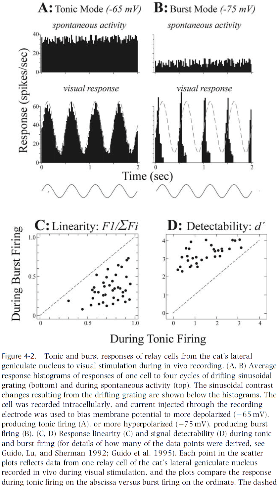
- One hypothesis for the two different firing modes is that burst firing is used to capture salient stimuli and thus shift the animal’s attention away.
- For this hypothesis to be plausible, there must be efficient ways for the brain to control the response mode of thalamic relay cells according to behavioral state.
- One place to look for ways to control the response model is in thalamic circuitry.
- E.g. Neurotransmitters and postsynaptic receptors.
- Two classes of receptors
    - Ionotropic: transmission is simpler and faster.
        - E.g. AMPA and NMDA.
    - Metabotropic: transmission is slower.
        - E.g. Metabotropic glutamate and muscarinic.
- The differences between these two classes of receptors are critical in their ability to control response mode.
- Ionotropic receptors seem too fast to perform the control needed, but metabotropic receptors are slow enough and can sustain the required control signal.
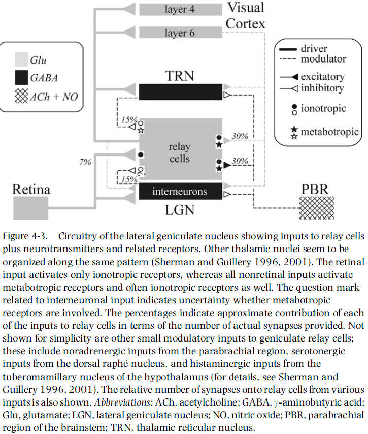
- In the LGN, it’s striking that retinal input activates only ionotropic receptors, whereas all of the nonretinal afferent pathways activate metabotropic receptors.
- The fact that retinal inputs activate only ionotropic receptors means that the EPSPs used in retina-to-thalamus transmission are relatively fast.
- Thus, retinal input itself is less likely to change response mode, which makes sense because the bulk of control should be the responsibility of pathways that reflect the dynamic needs of the system, and not the primary sensory input to be relayed.
- Also, the association of only ionotropic receptors with retinal input helps preserve the fast-changing temporal events in signals relayed to the cortex, which seems ideal for sensory transmission.
- The direct inputs to relay cells from layer six of the cortex are able to produce sustained EPSPs by the activation of metabotropic receptors, and this should effectively switch the firing mode from burst to tonic.
- Some evidence supports this idea as activation of metabotropic glutamate receptors does promote tonic firing.
- The opposite, switching from tonic to burst mode, is possible from activation of GABA_b receptors, which can be achieved from reticular cells and possibly interneurons.
- No evidence has supported this idea but it seems plausible.
- Thus, external control of firing mode is done by cortical and brainstem input. Directly, they depolarize relay cells to effect tonic firing, and indirectly, they hyperpolarize to effect burst firing.
- Two types of input to thalamic relay cells
    - Driver: inputs that convey basic information to the cortex.
        - E.g. LGN for vision, VPN for somatosensory, and MGN for sound.
    - Modulator: inputs that modulate the thalamic relay.
- Summary of differences

| Driver                                  | Modulator                             |
| --------------------------------------- | ------------------------------------- |
| Innervates relay cells and interneurons | Innervates thalamic reticular nucleus |
| Only ionotropic receptors               | Both ionotropic and metabotropic      |
| Thick axons with rich branches          | Thin axons with few branches          |
| Large synaptic terminals                | Small synaptic terminals              |
| Few synapses                            | Many synapses                         |
| Innervate extrathalamic structures      | Unknown                               |

- The number of synapses is interesting as it’s hypothesized that bringing basic information to the thalamus doesn’t require much synaptic investment, whereas fine modulation of the thalamus does.
- However, this idea extends beyond the thalamus as we now know that layer four of the cortex, where sensory organs send their information, has few synaptic inputs from the actual sense organ.
- It’s interesting to see how general beyond the sensory thalamic relays this finding is that driver inputs made up a small percentage of synapses.
- We often equate functional importance with the size of the input to an area.
- However, if we applied this strategy to the LGN, then we would come to the silly conclusion that retinal input is of minor importance to the thalamus that relays brainstem parabrachial information to the cortex.
- A long-known curiosity about thalamic relays is that while they all seem to receive modulatory feedback from layer six, some also receive inputs from layer five.
- E.g. Pulvinar, posterior medial nucleus, magnocellular division of the MGN, medial dorsal nucleus, and others.
- It’s clear that layer-five afferents are quite unlike layer-six afferents, but that they seem very similar to driver afferents as described for the main sensory relays.
- E.g. Layer-five afferents innervate dorsal thalamic nuclei but fail to innervate the thalamic reticular nucleus, they only activate ionotropic receptors, their axons are thick, their synaptic terminals are large, and many branch to innervate extrathalamic targets.
- This list matches exactly the drivers’ properties mentioned before.
- So, some thalamic relays receive their driver input from sensory organs and relay this information to the cortex (first-order), whereas others receive their driver input from the cortex itself and relay this to another cortical area (higher-order).
- When thought of this way, each sensory system has both types of relay.
- E.g. For vision, LGN is first-order and pulvinar is higher-order. For somatosensory, VPN is first-order and medial posterior complex is higher-order. For audition, MGN is first-order and magnocellular is higher-order.
- Olfactory information reaches the cortex in an unusual way that makes it difficult to fit with this duality, but much olfactory information is relayed by the medial dorsal nucleus.
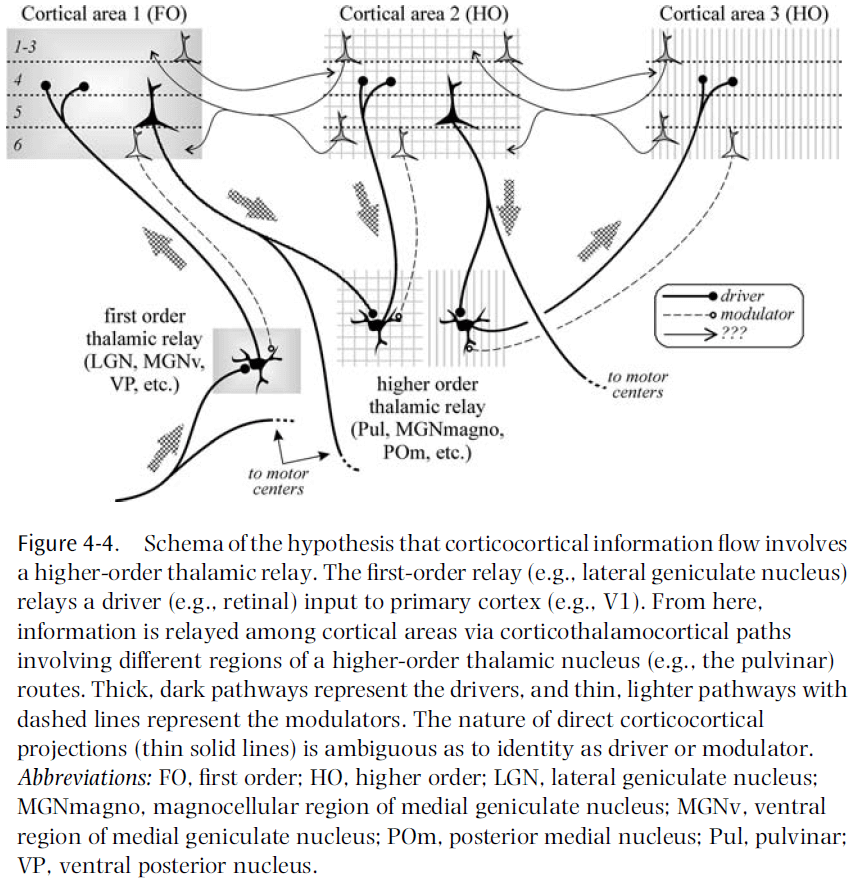
- Visual processing has little regard for the pulvinar, which is much larger than the LGN and seems to innervate all of the extrastriate visual areas.
- A blind focus on large pathways in the brain may be misleading, as perhaps only a small minority of direct pathways are drivers, with the rest being modulators.
- There remains an important difference between corticocortical drivers and corticothalamocortical drivers, the former stays strictly within the cortex, the latter also informs other parts of the subcortical CNS.
- Regardless of the accuracy of this hypothesis, we need to avoid treating all connections among cortical areas as functionally equivalent.
- We still don’t know what the thalamus is for, but we do have some hypotheses.

## Chapter 5: What Is a Neuronal Map, How Does It Arise, and What Is It Good For?

- Skimmed this chapter due to poor writing and lack of important ideas.

## Chapter 6: What Is Fed Back?

- Until now, most models have emphasized the feedforward direction but few have focused on the role of feedback.
- This chapter discusses feedback and focuses on the question: what is the role of feedback in the processing of sensory information?
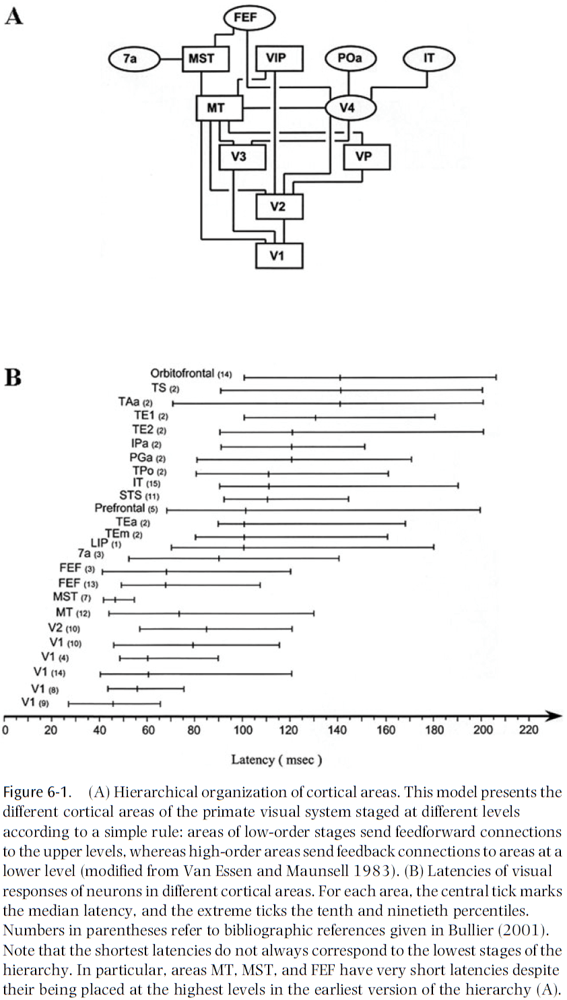
- Feedforward connections carry information from lower-order areas to higher-order areas, while feedback connections carry information in the reverse direction.
- The relative density of feedforward and feedback connections differs in different areas.
- E.g. V1 receives few feedforward connections from LGN but many feedback connections from V2. V4 receives a similar number of feedforward and feedback connections.
- Most functional models of information processing in the visual cortex have emphasized the feedforward connections and ignored the feedback connections.
- E.g. Vision is understood as a series of processing stages with more and more elaborate filtering properties for receptive fields at higher levels.
- It’s still debated whether orientation selectivity in V1 neurons is the result of a proper selection of thalamic inputs with receptive fields aligned in the optimal orientation, or whether intrinsic excitatory/inhibitory inputs are necessary for shaping the selectivity of these neurons.
- Evidence leading to the reexamination of the feedforward model
    - The timing of information transfer at the different stages of the cortical hierarchy.
        - We’d expect that the higher levels of the visual hierarchy require the most processing time and should show longer latencies to visual stimulation.
        - However, there are many examples of areas that have similar latency distributions but are located at very different stages of the hierarchy.
        - E.g. V2, MT, and FEF belong to different hierarchical levels but have similar latencies to visual stimulation.
    - Feedforward connections aren’t the sole determinants of response strength and selectivity of visual cortical neurons.
        - E.g. The network of local horizontal connections plays a major role in shaping the orientation selectivity of neurons in V1.
    - A cortical neuron’s response depends on the activity of feedback connections.
        - E.g. Cooling higher-order areas to inactivate them changes the responses of neurons in lower-order areas.
        - Feedback connections appear to potentiate the center response and the center-surround inhibitory interactions for low salience stimuli.
- With this shift to horizontal and feedback connections, we can view the brain as a self-sustained machine for processing mainly internal information and for occasionally sampling from the external world.
- We need to abandon the view of the brain as a simple input-output machine.
- The processing of incoming sensory input depends heavily on the state of the brain at a given moment.
- The role of top-down influences in higher-level vision remains somewhat of a mystery and will be one of the most important questions to answer in the future.
- Review of drivers and modulators.
- It’s likely that such a dichotomy is artificial and that there’s a spectrum of connection types.
- There’s evidence to support the idea that feedforward connections are of the driver type.
- E.g. Inactivation of V1 leads to no activity in V2, which receives strong feedforward connections from V1. It also leads to loss of activity in V4, suggesting V2 drives V4.
- The idea that feedforward connections have a strong driver-type effect may only be true in special cases and may not apply to other types of corticocortical connections.
- It isn’t clear if cortical feedback connections have the same functional role as corticothalamic connections.
- E.g. Corticothalamic connections are much slower than thalamocortical connections, whereas corticocortical feedback connections are as fast as feedforward connections.
- This suggests that the role of feedback isn’t limited to only modulation.
- Feedback connections can’t drive V2 neurons in the absence of feedforward input from V1, but it can modulate the responses of neurons in V2 when they are driven by input from V1.
- This suggests that feedback connections act as a gain control for the responses of a neuron to feedforward input.
- If thick axons always correspond to driver connections, then the presence of a few thick corticopulvinar axons from layer five suggests that not all corticothalamic connections should be classified as modulators.
- It’s likely that we can’t speak of the functional role of feedback connections in general since they vary so much.
- This requires isolating specific circuits and activating/inactivating different inputs to the recorded neuron.
- The center-surround interactions in areas V1, V2, and V3 depend on the feedback connections from MT when the stimulus is masked by a noisy background of similar contrast.
- When the stimulus is clearly distinguishable from the background by its high contrast, feedback connections appear to play a limited role in center-surround interactions.
- It’s likely that local horizontal connections are the major factor underlying short-range center-surround interactions in cortical neurons.
- Feedback connections are fast and their lag isn’t substantially longer than those of lower-order areas.
- It isn’t possible to distinguish local versus feedback connections by the latency of the effect.
- Feedback connections help in differentiating figure from background by potentiating the inhibitory center-surround interactions.
- Another role for feedback connection could be the reorganization of local connectivity.
- IFT neurons are selective to the orientation of kinetic boundaries however, lesions to MT appear to disrupt this ability.
- This suggests that feedback connections act more on the building blocks of cortical processing and less on the higher stages of processing.
- It’s assumed that attention effects in lower-order areas are under the control of higher-order areas through feedback connections.
- However, there’s little published evidence for this assumption and the role of feedback connections remains to understood.
- Attention: used to reduce the load of processing sensory signals by selecting relevant inputs and ignoring others.
- Spatial attention has been shown to influence the gain of neurons in several visual areas.
- Research suggests that attention regulates the contrast gain of neuron responses in V1.
- Feedback connections are important for differentiating figure from background.
- In generative models, feedback connections play a very different role
    - In feedforward models, feedback is used to adjust the processing of sensory data depending on the information and computations made in higher-order areas.
    - In generative models, feedback is used to transmit generated low-level data, which is then used to calculate the differences between the generated and actual data.
- Perception is no longer an operation of classification, but of matching the generative model to reality.
- E.g. Helmholtz machine, mental imagery, visual illusions, hallucinations.
- This idea of feedback for prediction is still unclear and unsupported.
- If the brain uses a generative model, then it must use it to make predictions.

# Part III: How Do Neurons Interact?

## Chapter 7: How Can the Brain Be So Fast?

- It’s often thought that neurons are slow compared to transistors.
- How, then, can the human brain solve complex tasks, such as pattern recognition, within a few hundred milliseconds?
- This chapter reviews some of the arguments that neurons are slow and discusses a reaction time experiment that shows that the brain, as a whole, is fast.
- Neuron time constraints
    - Internal time constants
        - E.g. Membrane time constant, synaptic time constant, dendritic integration time.
    - Coding scheme
        - E.g. Rate coding, first-spike coding.
- Internal time constants
    - If a neuron is stimulated, the cell responds by a change of membrane potential.
    - After the pulse, the membrane potential decays slowly back to resting value and the time constant of the decay defines the membrane time constant.
    - Typical values for the membrane time constant of cortical neurons are 20-50 ms.
    - Generally, any temporal information that is significantly faster than the time constant is strongly suppressed, if not lost.
    - E.g. We say that a filter with time constant $$\tau_m$$ has a cut-off frequency of 1/$$\tau_m$$.
    - Synaptic filtering also induces a cut-off frequency of 1/$$\tau_s$$.
    - A shorter membrane time constant implies an increased cut-off frequency.
    - In other words, faster membranes can spike more frequently.
- Coding
    - Early studies suggest that external input is represented in the brain by neuronal firing rates.
    - Firing rate: number of spikes in a specified time window.
    - Since interspike intervals vary from one spike to the next, we need to average over several spikes in order to get a reasonable estimate of the firing rate.
    - In many experiments, the time window is 100 ms or longer.
    - If temporal averaging isn’t just an experimental convenience but the actual code used by neurons, then a neuron further down in the processing stream would have to average its input spike trains over at least 100 ms in order to decode the message of the presynaptic neuron.
    - Also, this firing rate coding scheme would make transmission of input that’s modulated at 10 Hz or faster difficult due to the need to average.
    - Thus, a naïve rate coding with a time window of 100 ms imposes a cut-off frequency of 10 Hz.
- Reaction time experiments offer a direct way to measure the performance of a system as a whole.
- One classic experiment is releasing a button when an animal image appears. Typical reaction times are in the range of 400 ms, but some correct responses occur after 200 ms and EEG recordings suggest even earlier at 150 ms with 90% accuracy.
- The EEG results suggest that the recognition and classification of an image is essentially complete after 150 ms, with the rest of the time used to plan and act out motor movements.
- If we guess that the number of total processing steps is 6-8, then each step has between 20-25 ms to process the signal.
- During 20 ms, most neurons will emit, at most, one spike. How then is information processing possible?
- This is the paradox of a fast brain but slow neurons and means that one of our assumptions is wrong.
- The first wrong assumption is that neurons use rate coding with a time window of 100 ms.
- A detailed analysis of neural activity in the cortex has shown that a large amount of information about the stimulus is contained in the first 20-30 ms after stimulus onset.
- Since most neurons will emit at most one spike within 20 ms, the notion of a rate code as defined by spike count in a time window of 20 ms is questionable.
- But other coding schemes and other definitions of rate coding are possible.
- E.g. Rate defined as averaging over a short and smooth time window or rate defined by a population average rather than a temporal average.

## Chapter 8: What Is the Neural Code?

- Due to the brain’s property of dividing the cortex into specialized areas, we can study it scientifically.
- To properly understand how the anatomy and physiology of a particular area allows it to perform its function, we must know how the information it receives and the results it sends out are coded.
- At a very basic level, this is well known.
- E.g. Neurons communicate in spikes and spike trains.
- However, this says relatively little.
- E.g. This text is written using the Roman alphabet, but this doesn’t tell us anything useful about what’s written.
- Likewise, neurons have to extract information from spikes and also output their result in spikes.
- For early sensory areas, we can determine the neural code by presenting many stimuli and checking whether this code conveys any information about these stimuli.
- Unfortunately, even if we determine the neural code, that doesn’t mean that it’s actually used.
- E.g. There may be a different code that also conveys information about the stimulus.
- From Adrian’s work in 1926, we know that firing rates of sensory neurons change in a consistent way with sensory input.
- This gives rise to the idea that neurons code information in their firing rate.
- However, Adrian’s work also showed that individual spikes arrive in a highly irregular manner, even for the same stimulus shown repeatedly.
- This has lead to different hypotheses about the nature of the neural code.
- E.g. Neurons may encode information in relatively slowly changing rate or in the precise timing of every spike.
- Unfortunately, very few testable models exist that take the extreme view that the timing of each spike is important.
- The closest model is the synfire chain model proposed by Abeles in 1991.
- Synfire chain model
    - Input elicits synchronized activity in different pools of neurons, where each pool is connected to the next pool.
    - Due to the large number of connections from one pool to the next, synchronization between cells of each pool builds up rapidly, and since neurons participate in different pools, the activity of each neuron is irregular.
    - Evidence for the synfire model in the cortex is weak at best.
- An intermediate model that has gained popularity in the last decade is a model in which not only the rates of neurons carry information, but also the correlations in their activity.
- A pure rate code has difficulty with the binding problem.
- Binding problem: if multiple objects are present and elevated rates in different populations of neurons indicate features of the object, how does the cortex decide which features belong to the same object?
- A correlation-based mechanism has no binding problems.
- E.g. Multiple objects have correlations between activities representative of the same object in different areas, with no correlation between activities due to different objects.
- Evidence supports this idea as the level of synchronization seems to encode whether the stimulation is due to one or more objects.
- However, these correlations are so small that neuroscientists can disagree about whether they exist at all.
- Thus, at present, the only candidate for a neural code with reliable experimental evidence in all cortical, subcortical, and peripheral areas is a rate code.
- Despite the overwhelming evidence that the neuronal firing rates vary consistently with the function being performed, the efficiency assumption would seem to argue against a rate code.
- The rest of this chapter focuses on the effects of variable interspike intervals on the dynamics of neural networks and describes the impact of neuronal spike variability on information transmission.
- Skimming over the chapter’s math.
- It’s important to have a system that can respond to input changes rapidly.
- To respond quickly, the network needs to receive a strongly magnified external input, together with a strong inhibitory network feedback.
- Given that cortical neurons fire almost in a Poisson distribution, this would imply that if the cortex indeed uses a rate code, it’s extremely inefficient.
- Arguments against rate coding
    - Animals live in a dynamic world and have to respond rapidly to stimuli.
    - Brains don’t have the time to average over long time windows to estimate firing rate.
    - It’s inefficient if neurons fire as irregularly as those in the brain.
- However, experimental evidence overwhelming supports the idea that the firing rate of neurons carry information about the sensory input.
- Although this may be the rule, there are exceptions.
- E.g. The primary auditory cortex doesn’t use a rate code.
- The fact is that we have very little theoretical understanding about when such a code does well and when it doesn’t.

## Chapter 9: Are Single Cortical Neurons Soloists or Are They Obedient Members of a Huge Orchestra?

- Spontaneous cortical activity of single neurons is often either dismissed as noise or is regarded as insignificant.
- Recent research suggests that such assumptions should be revised.
- Author’s results suggest that our understanding of the neural code may remain incomplete if subthreshold dendritic activity isn’t considered and the role of spontaneous population activity is ignored.
- Cell assembly: when cortical neurons organize dynamically into functional groups by the temporal structure of their spike activity.
- The activity of cells in an assembly is time locked however, the cells that make up the assembly may be spatially intermixed with cells from other assemblies that are performing different computational tasks.
- So, techniques that can visualize only the average population activity in a given cortical region aren’t adequate to study cell assemblies.
- Is ongoing activity randomly distributed in space and time, or is its distribution somehow structured?
- Results indicate that spontaneous activity of single neurons isn’t an independent process, but is time-locked to the firing or to the synaptic inputs from numerous neurons, all activated in a coherent fashion even without a sensory input.
- Spontaneous activity of two adjacent neurons was often correlated with two different spatiotemporal patterns of coherent activity, suggesting that adjacent neurons in the same orientation column can belong to different neuronal assemblies.
- In spite of the large variability, the evoked responses in single trials can be predicted by taking into account the preceding ongoing activity.
- Results indicate that ongoing activity plays a major role in affecting cortical response and isn’t noisy, but rather shows a large degree of temporal coherence.
- Spontaneous regime: ongoing patterns of cortical population activity that occur simultaneously with the AP of a single neuron.
- Evoked regime: a reproducible pattern of activity evoked by the presentation of a well-defined stimulus that’s optimal for that neuron.
- Is there a link between the spontaneous and evoked regime?
- To use the orchestra analogy
    - We first study the role the neuron plays in the orchestra when we let the orchestra play a familiar tune by presenting it with a stimulus.
    - We then study whether the neuron played the same role in the orchestra when the tune was no longer imposed in the absence of a stimulus.
- The vast majority of single neurons in the visual cortex have a well-defined tuning curve.
- E.g. They’re selective for stimuli of specific orientations.
- Preferred cortical state (PCS): the optimal spatial pattern for a given neuron.
- One experiment showed that during the presentation of a full-field stimulus optimal for the neuron, the neuron is an obedient member of a larger orchestra; unsurprising.
- Each presentation of the optimal stimulus evoked increased spiking activity and, as expected, the pattern of population activity became more similar to the neuron’s PCS, as reflected by higher correlation values.
- The instantaneous state of the population activity can indeed predict how likely a neuron is to fire at any given moment.
- Next, the authors asked what would happen if we used a non-optimal stimulus on the neuron.
- Does the neuron still prefer to play the same tune? Or does it change?
- Repeating the same experiment but with a stimulus orientation orthogonal to the one preferred by the neuron, we find (as expected) that the PCS doesn’t coincide with the state evoked by the stimulus.
- Once again, we see that the PCS of the neuron, together with the population activity, can predict this neuron’s response.
- Hence, even when not presented with its optimal stimulus, the neuron remains faithful to the orchestra of which it’s a member of, and is most likely to fire when the orchestra plays its favorite tune.
- The spontaneous activity of cortical neurons depends on the underlying functional architecture related to their tuning properties.
- When the network activity happens to be in a particular state, neurons with a preference for this state will have the highest firing rate.
- When a stimulus is presented, it will quickly push the network from whichever state it was in into the neuron’s PCS, which in turn represents the stimulus.
- Results indicate that the spontaneous firing of single neurons is tightly linked to the cortical networks that they belong to.

## Chapter 10: What Is the Other 85 Percent of V1 Doing?

- This chapter argues that there’s still a lot about V1 that we don’t know.
- This argument is surprising because V1 seems to have an ordered appearance with a clear topographical map, and an orderly arrangement of ocular dominance and orientation columns.
- Many neurons in V1 are demonstrably tuned for stimulus features such as orientation, spatial frequency, color, direction of motion, and disparity.
- Our current working model of V1 is that simple cells compute a Gabor-like function and their outputs are summed by complex cells.

- In other words, V1 acts as a Gabor filter bank.
- But behind this model lies an abundance of unexplained phenomena, a growing list of untidy findings, and an increasingly uncomfortable feeling among many on the initial V1 experiments that lead to our current model.
- The main problem is that cortical neurons are highly nonlinear, and we have no general method for characterizing nonlinear systems.
- The standard model is one small part of the full story and we still have much to learn about V1.
- This chapter lays out five fundamental problems with the reductionist approach that led us to the current view of V1 as a Gabor filter bank.
- We can quantify our level of understanding by using two estimates
    1. The fraction of V1 neuron types that have been characterized.
    2. The fraction of variance explained in the responses of these neurons under natural viewing conditions.
- Together, these estimates show that we can claim to understand only 10-20 percent of how V1 actually works under normal conditions.
- Another goal by presenting these problems is to make room for new theories to better understand V1.
- A central insight is that we need to being seriously studying how V1 behaves using natural scenes.
- Five problems with the current view
    1. Biased sampling of neurons
        - The majority of our knowledge about V1 comes from single-unit recordings.
        - Larger neurons bias extracellular recording and drown out smaller cell body activity.
        - Even if a neuron is successfully isolated, a neuron may be bypassed if it doesn’t fit the experimenter’s belief of what that neuron should do.
        - E.g. Neurons called “visually unresponsive”.
        - Another bias is that in the process of hunting for neurons, the experimenter tends to record from the neurons with higher firing rates, thus overrepresenting them.
        - A similar lesson was learned in the hippocampus when firing rates were incorrectly measured until we used chronic implanted electrodes.
        - This makes one wonder what mysteries could be unraveled when the same techniques are applied to the visual cortex.
        - E.g. Receptive fields smaller than 0.01 degrees; these are extremely rare, if nonexistent.
    2. Biased stimuli
        - Much of our knowledge of V1 neural response properties is derived from experiments using reduced stimuli.
        - E.g. Spots, white noise, sine wave gratings.
        - The hope is that the insights from reduced stimuli will generalize to more complex situations, but there’s no guarantee that this is the case.
        - These stimuli are only informative to the extent that the system is linear.
        - Otherwise, they’re no more valid than any other stimulus.
        - Authors believe that the solution is to use natural scenes instead of artificial ones.
    3. Biased theories
        - Currently in neuroscience, there’s an emphasis on “telling a story”.
        - The way in which response properties are characterized can have a profound effect on the resulting theoretical framework that explains the results.
        - Most natural scenes aren’t littered with line terminations or short bars.
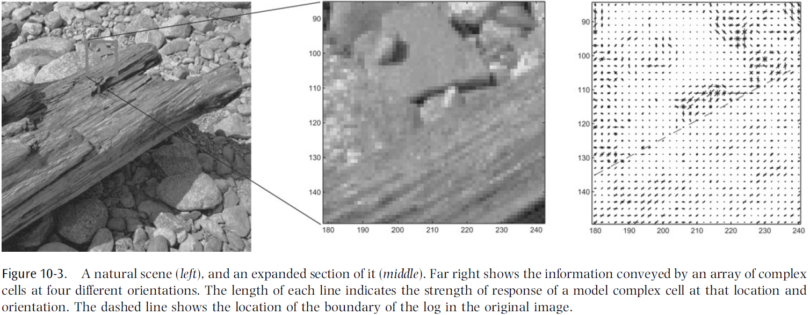
        - To property understand V1, we need to go beyond bottom-up filtering models and to think about the priors used by V1 or feedback from higher areas for interpreting images.
        - Our theories need to be guided by functional considerations rather than appealing to simplistic notions of feature detection that are suggested by a cherry-picked population of neurons recorded using reduced stimuli.
    4. Interdependence and contextual effects
        - It’s estimated that about five percent of the excitatory input in layer four of V1 comes from the LGN, with the majority coming from intracortical connections.
        - We’re left with somewhere between 60-80 percent of responses of a V1 neuron as a function of other V1 neurons or inputs other rather than coming from the LGN.
        - E.g. Both tactile Braille reading and verbal material can activate the visual cortex in those who’ve been blind from an early age, even though no such activation occurs in sighted people.
        - The problem with teasing out the contextual effects in a reductionist manner is that one faces a combinatorial explosion in the possible configurations of stimuli.
        - Another form of interdependence shown by V1 neurons is in the synchrony of activity.
        - However, the role of synchrony in V1 is unclear and remains a mystery.
    5. Ecological deviance
        - It’s important to know when the current models are successful, but also when they break down.
        - It’s also important to know how they fare under ecological conditions.
        - However, this is difficult because responses to repeated trials vary and models are always subject to criticism such as not being predictive enough to capture all aspects of the stimulus.
        - Inter-trial variability can’t always be attributed to noise and it could be internally generated activity that plays an important role but that we don’t yet understand.
        - The percentage of variance explained is likely around 30-40 percent with the standard model.
        - Unfortunately, journals are often unprepared to publish results when a study demonstrates the failure of a model unless the study also presents a competing model that does work well.
        - Regardless of a competing model, this data is crucial to presenting a complete picture of V1 function.
        - What would be most helpful is to build a database of single-unit data that would allow modelers to test their best theory under ecological conditions.
- If “fraction understood = fraction of variance explained from neurons recorded x fraction of population record”, then “fraction understood = 0.4 x 0.4 = 0.16” which is why the title of this chapter is “85 percent of V1 function has yet to be explained.”
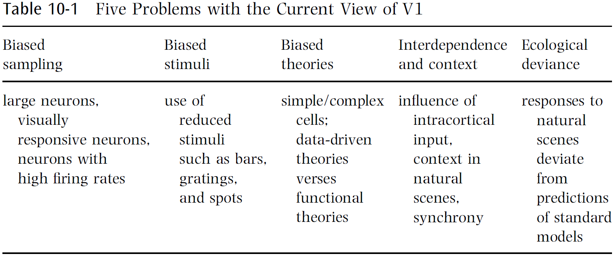
- Possible new theories to account for that 85 percent unexplained
    - Dynamical systems and the limits of prediction
        - Analogous to predicting the activity of a neuron in the brain, tracking a molecule within a hot gas is fundamentally unpredictable without knowledge of all other molecules with potential influence.
        - Even if the trajectory was completely deterministic, we could never provide a prediction of the path except over very short distances.
        - In theory, the behavior of neurons may have similar limitations.
        - In practice, a neuron’s response from trial to trial is fairly reliable for natural scenes.
        - This suggests that the response of a neuron is dependent, in large part, on the stimulus.
        - We may find that a local group of neurons is more predictable than a single neuron, which would require multielectrode recording to attempt to account for the remaining variance.
    - Sparse, overcomplete representations
        - This theory argues that spatial nonlinearities primarily serve to reduce the linear dependencies that exist in an overcomplete code, and this leads to a fundamentally different set of predictions about the population activity.
        - E.g. Representing stimuli as orthogonal bases such as wavelet coding or ICA.
        - However, the visual system isn’t using a critically sampled code.
        - Authors argue that the nonlinearities observed in V1 neurons are mainly used to allow a large population of neurons to represent data using a small number of active units, also known as sparsification.
        - The goal isn’t to develop complete independence because the activity of any neuron partially predicts the lack of activity in neighboring neurons.
        - This also avoid the problem of grandmother cells since this is more robust to damage.
    - Contour integration
        - Results suggest that V1 neurons have an orientation- and position-specific connectivity structure beyond what’s included in the standard model.
        - Contour integration hypothesis: that the role of horizontal connections is to amplify the structure of contours.
    - Surface representation
        - The fundamental feature of images are surfaces, not 2D features such as spots, bars, edges, or gratings.
        - Furthermore, we rarely see the entire surface of an object due to occlusion.
        - Thus, it’s reasonable to think that the visual cortex has evolved effective ways to parse images in terms of their 3D structure.
        - It’s surprising how little V1 physiology has actually been devoted to the subject of 3D surface representation.
        - There’s emerging evidence to support the idea that V1 resolves figure-ground relationships.

    - Top-down feedback and disambiguation
        - Looking back to figure 10.3, we can see that even the presence of a simple contour can be ambiguous in a natural scene.
        - The problem is that information at the local level is insufficient to determine whether a change in luminance is an object boundary, a part of texture, or a change in reflectance.
        - While boundary junctions are important for the interpretation of a scene, studies have shown that human observers are poor judges of what constitutes a boundary/junction when these features are isolated.
        - Thus, the calculation of a boundary depends on the context.
        - However, this results in a chicken-and-egg problem between the lower and high levels of image analysis.
        - Low-level features are useful for identifying an object but they can’t be directly computed based on a local analysis of an image.
        - Rather, they must be inferred based on global context and higher-level knowledge, but the global context isn’t clear until there’s some degree of certainty about the presence of low-level features.
        - E.g. Kanizsa Illusion.

        - Some theorists have argued that recognition depends on information circulating through corticocortical feedback loops in order to disambiguate representations at both levels in parallel.
        - But this doesn’t match our results of how we can recognize objects so quickly.
        - There’s a rich set of feedback connections from higher levels into V1, but little is known about the computational role of these connections.
        - One hypothesis is that these higher areas play a role in enhancing the salience of stimuli.
    - Dynamic routing
        - Another challenge to any visual system is object recognition that’s invariant to position, scale, rotation, and other common deformations.
        - The current view is that complex cells are the first step in creating invariant representation by summing over the outputs of simple cells whose outputs are half-rectified and squared.
        - This is similar to the Pandemonium model in which similar feature extraction processes are repeated at each stage of the visual cortex.
        - One issue with the Pandemonium model is that there’s no explanation of how information about relative spatial relationships are preserved even though we have conscious access to such information.
        - One proposed model is that relative spatial relationships are preserved by a set of control neurons that progressively remap information into an object-centered reference frame.
        - This means that there are two sets of neurons: one conveying image and feature information (invariant), and one controlling the flow of information (variant).
        - The model predicts that we should observe complex cells selecting which simple cells they’re connected to, and we should see the existence of control neurons to perform such selections.
        - The observed invariance properties of complex cells are just as consistent with the idea of routing as they are with pooling.
        - However, these models would be distinguished by their population activity.
        - E.g. Pooling results in a dense, distributed representation of contours among the population of complex cells, whereas routing results in a sparse representation.
        - One of the main predictions of the dynamic routing model is that the receptive fields of the invariant neurons would be expected to shift depending on the state of the control neurons.
        - More experiments are needed to properly characterize the invariance properties of visual neurons under normal viewing conditions.
- Authors emphasize the need for using natural scenes and multiunit recording in order to obtain a more representative picture of V1 function.
- While single-unit, reductionists approaches have been useful, we feel that it’s usefulness as a tool has been exhausted.
- A complete understanding of V1 should have at least three ingredients
    1. An unbiased sample of neurons of all types, firing rates, and layers of V1.
    2. The ability to simultaneously observe the activities of hundreds of neurons in a local population.
    3. The ability to predict the responses of the population under natural viewing conditions.
- It’s unlikely that we’ll understand V1 in isolation due to it’s numerous feedback connections.

# Part IV: What Can Brains Compute?

## Chapter 11: Which Computation Runs in Visual Cortical Columns?

- The hunt is on for the “basic unit” of computation.
- Few analyses are aimed toward models at a global, abstract level.
- Are data and models sufficient for understanding how the brain processes information?
- Consider what could happen with success.
- An experimental program that provided direct measurements for all neurons in the visual system would result in a suffocating amount of data.
- At this point, modeling becomes simulation.
- One solution is abstraction, and the goal of this chapter is to raise questions about the nature of this abstraction.
- What does computation mean in neural computation?
- If we look to digital computers, we see that computation consists of primitive functions such as logical operators.
- However, applying the same strategy to brains is less effective due to its complexity.
- Often, models copy the complex features of a unit without the interactions that define that complexity.
- E.g. Modeling cortical columns without inter-columnar interactions or to design interactions without specifying the units.
- Both are required as shown by this analogy
    - In a game of billiards/pool, understanding the behavior of one ball is clearly part of understanding the game, but it’s also clear that emergent properties of the game simply don’t exist at the ball level.
- It’s important to find the right types of abstraction for characterizing the brain.
- To be useful, abstraction must help in framing problems.
- An assumption of this chapter is that there’s a deep connection between the functional architecture of cortical areas and the computational abstractions they support.
- However, this may not be the case.
- E.g. Neural plasticity, or that columnar architectures exist due to evolutionary accidents and not because of emergent computations.
- What’s the natural abstraction for computation in cortical columns?
- Intuitively, when we think about solving problems by neural computation, we think about what to represent and how to use those representations.
- Solving a problem can be formalized in terms of algorithms for solving it, or how to use representations to solve a problem; a procedure.
- The procedure is also limited by the domain that the problem is defined.
- In the traveling salesman problem, a salesman has to visit all cities with minimal travel.
- Consider how an experimentalist might evaluate the salesman’s behavior. Given experimental data such as an ordered list of cities visited, what can we infer is the goal of the salesman?
- Although our context suggests minimizing total distance, the experimentalist might hypothesize that the salesman is trying to alternate cities according to size of purchase, so large orders aren’t consecutive.
- Our problem in building a theory for vision is to find the equivalent of a theory of transportation.
- As with inferences about the salesman, different abstractions are possible.
- We seek solutions by general methods that will work for any instance of the problem.
- The primary visual cortex has a special structure, and we believe this structure casts light on the class of problems that it solves.
- The visual cortex is organized largely around orientation (is it?) and an array of orientation columns.
- These columns represent an instance of the cortical columnar machine specialized for problems in vision.
- Our goal is to untangle the machine from the specific problem encoding.
- The minimal wiring length constraint predicts that different features will be clustered and arranged as close as possible to their retinotopic coordinates.
- Defining the edge detection problem is more involved than defining the traveling salesman problem. We need a better measure for “distance”.
- Skimmed the rest of the chapter due to disinterest.

## Chapter 12: Are Neurons Adapted for Specific Computations? Examples from Temporal Coding in the Auditory System

- Evolution has led to the existence of specialized neurons.
- E.g. Auditory neurons that encode temporal information with high precision.
- Nevertheless, it’s unclear whether all neurons are adapted for a particular computation or even if specialized neurons are desirable in all cases.
- Specialized neurons aren’t plastic, can’t learn, and can’t handle general functions.
- However, what they give up is compensated for by speed and efficiency.
- Another option is to control neurons using some modulator to adapt them to several computations, rather than for some general function.
- Going back to specialized neurons, the auditory system needs precise encoding of temporal information because it has direct behavioral relevance.
- E.g. Localization and interpretation.
- The features of auditory neurons that lead to improved temporal processing improve an organisms’ fitness and thus, should experience positive selective pressure.
- Two reasons why accurate temporal coding is important
    - High-frequency phase locking is important for sound localization.
    - Models of coincidence detection perform better when the vector strength of the input improves.
- Transmitter release becomes more precise during development.
- Cell morphology and spatial distribution of the inputs enriches the computational power of neurons.
- Skimmed most of this chapter due to it being a review of the mechanism behind sound localization and coincidence detectors (see [this](https://doi.org/10.1038/nrn1136) paper for a better review).

## Chapter 13: How Is Time Represented in the Brain?

- A sudden or gradual change in sensory information is the most important information for an organism, not the mean illumination level or mean sound intensity.
- To process and interpret time-varying signals in a meaningful way, environmental signals have to be integrated over time.
- So, this means that temporal relations between and within external stimuli can’t be encoded in a one-to-one manner by the nervous system.
- How is time represented in the brain?
- Given that evolution built up neural representations over time, we don’t expect a single and universal answer.
- Which types of representations best support flexible and robust computations of temporal relations?
- Time warp: a change of stimulus intensity or a change of the duration of all signal components.
- This chapter presents a collection of basic computing principles with a focus on algorithms that deal with sensory sequences over varying time scales.
- One way to integrate temporal information over short time scales is to use axonal, synaptic, and dendritic delays.
- E.g. Jeffress delay-line model of sound localization.
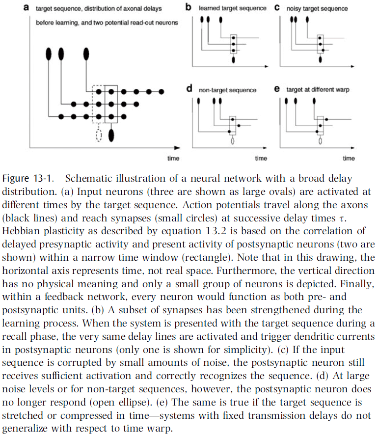
- Time lags may also play an important role in other neural systems.
- E.g. Cerebellum.
- In essence, fixed delay lines provide a way to map the temporal dimension into a spatial dimension.
- Thus, delay lines facilitate a broad variety of computations that involve comparisons between signals received at different times.
- One computation is learning the time structure of a target sequence using Hebbian learning.
- E.g. A synapse at the end of a long axon encodes time-lagged correlations between pre- and post-synaptic activity, while a synapse near the soma encodes correlations at around equal time.
- The first synapse represents specific temporal features of the target sequence, whereas the second synapse represents individual snapshots of the same sequence.
- In both cases, synaptic strengths facilitate the storage and associative replay of temporal sequences by concentrating information in time.
- This allows networks to function as content-addressable memories for spatiotemporal patterns.
- Learning is successful if the structure of the learning task matches both the network architecture and the learning algorithm.
- In this case, all three match and this leads to robust retrieval.
- In networks with a broad delay distribution (highly connected and unspecific), Hebbian learning automatically selects the connections most suitable to stabilize the time course of a target sequence and thus, no modulator or control is needed.
- Increasing a synapse’s strength causes a shift of the spike times of the postsynaptic neuron.
- Thus, synaptic plasticity may lead to large rearrangements of the temporal sequence of APs (also known as a spike train).
- Two consequences
    - If information is represented in the time-averaged firing rates (rate coding), then these rearrangements don’t significantly change the information conveyed by a spike train.
    - If information is represented in the interspike intervals (or individual spike times), then synaptic plasticity may completely change the information conveyed by a spike train.
- Hebbian learning combined with transmission delays can be used to concentrate information in time, meaning stimuli that were originally spread out over time are grouped together.
- This is an extreme case of time warping where a signal is compressed in time.
- However, this also reveals the problem of performing time-warp-invariant sequence recognition.
- E.g. If speech is played back at two-times speed, we can still recognize and understand the speech. Or how both AAABBBCCCCCCDDD and ABCCD are both the same signal, with the first signal being a threefold time warp.
- How does the brain perform this time-warp-invariant recognition?
- This problem is a special case of the analog-match problem.
- Analog-match problem: to recognize a multidimensional input vector ($$x_1, x_2, ..., x_N$$) in a scale-invariant manner ($$\lambda x_1, \lambda x_2, ..., \lambda x_N$$ with $$\lambda \in R$$).
- In our case, we want the time invariant which means $$T-t_1, T-t_2, ..., T-t_N \approx t_1, t_2, ..., t_N$$.
- The original time-warp problem can be solved if it’s rephrased as an analog-match problem.
- A comparison of the current firing rate with the initial firing rate provides a direct measure for the time elapses since the triggering event.
- Skimmed most of this chapter due to the math.
- Transmission delays support interesting calculations in the time domain that would otherwise require more complex architectures and algorithms.
- These computing principles enable brains to concentrate information over multiple time scales for a range of different purposes.
- E.g. Storage, predicting the future, and deciding the appropriate behavioral action.

## Chapter 14: How General Are Neural Codes in Sensory Systems?

- How are neural codes established? Why is one coding strategy implemented in the nervous system over another?
- We can answer these questions by comparing coding strategies across species or across sensory modalities.
- Review of the barn owl and it’s sound localization mechanism.
- This chapter focuses on how the frequency range that ITD processing uses has important implications for both the form and translation of the sensory representation.
- Some coding strategies that are thought to be general may only be so at a superficial level.
- E.g. That the primary auditory cortex includes a ventral “what” stream and a dorsal “where” stream. The auditory system’s representation isn’t spatial position, but sound frequency.
- Auditory feature space is most likely encoded in the form of spectrotemporal patterns, meaning the analysis of the excitation along the length of the basilar membrane and how it changes over time, rather than the spatial position of a sound source.
- Major differences do exist between the barn owl and mammalian binaural hearing capabilities, and these differences are crucial for understanding where sensory representations and coding strategies differ.
- E.g. Differences in frequency range for using ITD.
- Experiments on humans for sound localization showed that they performed best for frequencies below 1.5 kHz and above 5 kHz, with most errors happening around 3 kHz.
- This suggests that we use two different mechanisms for localizing a sound source, one operating at low frequencies and one operating at high frequencies.
- Experiments on barn owls show the opposite; they localize poorly for frequencies below 3 kHz and above 10 kHz, but have exceptional localization abilities between these limits.
- This ability to use temporal information at such high frequencies is due to a unique specialization within their cochleae.
- Barn owl auditory nerve fibers are able to signal the fine structure of the sound waveform in the timing of their discharges (phase locking) up to 8/9 kHz, whereas mammals can only lock up to 3 kHz.
- It’s presumed that the higher-frequency phase locking in barn owl hair cells is the result of different hair cell biophysics.
- In humans, the divide between low and high frequencies appears in anatomy with the medial superior olive (MSO) showing an overrepresentation of low frequencies and the lateral superior olive (LSO) showing an overrepresentation of high frequencies.
- This tonotopic organization in subsequent auditory centers in the auditory pathway maintains this separation.
- It’s clear that in both barn owls and mammals, a dichotomy between ITD and ILD processing exists, both anatomically and physiologically.
- The major difference, however, is that barn owls combine the azimuthal ITD cue and the elevational ILD cue to form a topological map.
- The jury is still out on which sound localization code mammals use.
- Two lessons on the generality of neural codes
    - It’s necessary to consider all of the factors that influence information processing in any sensory system since this has implications for how the information may be used in constructing a neural code.
    - Conformity of a particular aspect of sensory processing to an established model doesn’t imply general conformity to that model.
- Neural codes are only general in parts in sensory systems.

## Chapter 15: How Does the Hearing System Perform Auditory Scene Analysis?

- In order to identify sound sources, the auditory system must group together sounds coming from one source and separate them from other sources.
- This perceptual process is called “auditory scene analysis” since it resembles the analysis of objects in visual scenes.
- On the one hand, learning and memory allow the creation of composite-feature detectors in the sensory system that could be involved in selecting objects from an auditory scene.
- On the other hand, many processes have been identified that don’t require learning and memory and can enable the auditory system to single out objects in a bottom-up process.
- E.g. Auditory stream segregation.
- Inhibition across different frequencies is found on various levels of the auditory pathways.
- Location in space is one cue that characterizes a specific sound source.
- The listener must also segregate objects from multiple different positions in space and suppress echoes.
- And if the source is moving, the listener should dynamically attribute the sound to the same source.
- In the brain, it appears that sounds from different locations are represented in different cortical columns. So by integrating columnar activity, the barn owl could identify simultaneously active, but distinct, columns that encode spatially separated auditory objects.
- The grouping of auditory inputs to determine if they’re from the same stream involves linking neural activity, not only from cells representing one dimension of sound (frequency), but also from cells that represent the other dimensions of the stimulus space.
- The key question is how this combination happens.
- Evidence suggests that neural excitation during very short time periods encodes relevant stimulus features.

## Chapter 16: How Does Our Visual System Achieve Shift and Size Invariance?

- Our ability to recognize objects from different distances and perspectives under different illuminations gives the impression that invariant object recognition is a trivial task.
- However, an apparently small changes in the stimulus can cause a dramatic change in the retinal activity pattern.
- E.g. If we’re looking at a zebra and shift the strips by one stripe, then many responses of retinal sensors will be inverted, causing a dramatic change of the retinal activity patterns, but you still perceive the same zebra.
- So, to achieve invariant recognition, our visual system has to be insensitive to these kinds of dramatic changes in visual input, while still being sensitive to more subtle changes that are relevant.
- This chapter focuses on two types of invariances: shift and size, and discusses computational models of the visual system.
- Evidence for shift and size invariance comes from two fields: psychophysics and neurophysiology.
- Experiments with human subjects show that recognition of common visual objects is independent of location and size.
- An interesting paradox is that while object recognition is shift and size invariant, we can still recognize changes in shifts and size.
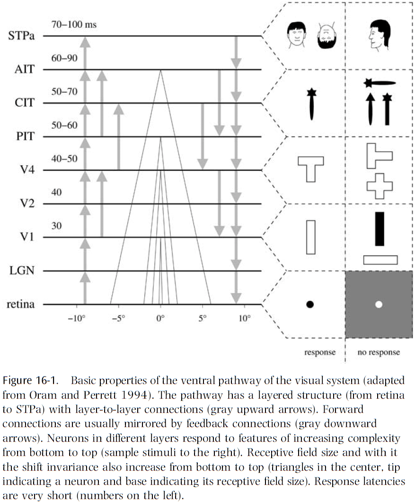
- Aspects of the visual system
    - Two pathways
    - Layered structure
    - Feedback connections
    - Feature hierarchy
    - Invariance hierarchy
    - Fast recognition
    - Attention
    - Learning
- Two computational approaches to invariance
    - Normalization
        - This approach normalizes an image to a standard position and size using an internal transformation.
        - Invariant recognition can then be based on this normalized view.
    - Invariant Features
        - This approach extracts features from an image that are invariant to the location and size of an object in the visual field.
        - Invariant recognition can then be based on these invariant features.
- The pros and cons for each approach are complementary and it’s appealing to combine these two approaches.
- The major open question for invariant feature networks is how they process “where” information.
- At this point, the invariant feature approach seem to be consistent with most neurobiological constraints.
- Maybe the answer is to combine both approaches, or maybe the answer is neither of the two.
- Either the brain solves all invariance problems in a similar way based on a few basic principles, or it solves each invariance problem in a specific way that’s different from each other.
- If the first case is true, then solving the problem of shift and size invariance would provide the key to all other invariance problems such as color and illumination invariance.
- If the second case is true, then we should focus more generally on all types of invariance and build principles for each one.
- There’s a third option in that the truth lies somewhere between these two extremes.

# Part V: Organization of Cognitive Systems

## Chapter 17: What Is Reflected in Sensory Neocortical Activity: External Stimuli or What the Cortex Does with Them?

- Duality problem
    - On the one hand, sensory maps serve the specification of sensory input information (stimulus features) by neuronal mechanisms and functional organization.
    - This is the bottom-up principle.
    - These maps are the way the cortex deals with variability of the stimulus world, by generating orderly spatial representations of what’s similar and dissimilar.
    - On the other hand, sensory maps serve cognitive functions to make sensory information explicit and available in different contexts.
    - This is the top-down principle.
    - This results in a duality problem in that sensory maps have dual functions, one for serving stimulus features and one for serving cognitive processes.
    - There’s a general bias to view cognitive processes as separated from bottom-up processing in sensory maps.
    - This is, in part, due to the inability to exclude/abolish the bottom-up processing to isolate the top-down contribution and vice versa.
- The concept of duality in the sensory cortex and the problem of proof are well exemplified with respect to learning and memory, selective attention, and mental imagery.
- E.g. “When attention operates during a task, it will operate at the site where the computation involve in the task is usually performed.” - Posner
- Memory research already supports the duality or dual function in the sensory cortex.
- E.g. Mental imagery reactivates visual cortex areas.
- The duality problem may result in the brain having difficulty distinguishing the results of bottom-up and top-down processing in the same structure.
- This results in the inability to separate what’s real and what’s imagined.
- A common principle of sensory maps: their significance may lie in the cognitive demands of different behavioral tasks.
- The consequences of this distinction are
    - That neurons organized in a given map may derive information of comparable behavioral relevance from different stimulus features.
    - That different tasks executed on the same stimulus material lead to activation of different maps.
- We work with the primary auditory cortex map because of its rigid tonotopic input organization.
- Different types of computations require different optimal maps.
- The cocktail party effect was previously assumed to be solved as a sound localization problem.
- However, it’s now clear that the problem of foreground-background decomposition can also be solved monaurally.
- The idea of multiple overlaying maps in the same neuronal substrate has to resolve the interference effects of different maps and to allow the relation of a given activity state to any particular map.
- We propose that the sequential order of recruitment of neural activity states as one mechanism for disentangling maps.
- The new hypothesis suggested here is that top-down cognitive processes create new states within maps that can still be described as spatiotemporal activation patterns.

## Chapter 18: Do Perception and Action Result from Different Brain Circuits? The Three Visual Systems Hypothesis

- Traditionally, perception and action have been considered as separate domains and don’t interfere with each other.
- Review of the dorsal and ventral visual processing streams.
- The goal of this chapter is to show that the separation of the cortical visual processing into two streams is insufficient and leads to a misunderstanding of the true nature of perceptual processes.
- We suggest that the dorsal stream is in fact two streams: the dorsodorsal (DD) stream and the ventrodorsal (VD) stream.
- We also propose that both action perception and space perception derive from preceding motor knowledge based on self-generated actions.
- A fundamental landmark of the parietal lobe of primates is the intraparietal sulcus.
- This sulcus subdivides the posterior parietal lobe into two sections
    - Superior parietal lobule (SPL)
    - Inferior parietal lobule (IPL)
- Experiments show that the SPL is related to the somatosensory system, specifically proprioception, but it also receives visual input.
- Like the SPL, IPL also receives somatosensory input in addition to inputs from the dorsal visual stream.
- IPL neurons are often bimodal as they respond to both visual and somatosensory stimuli.
- Neurophysiological data on SPL suggest that this region intervenes in the control of body part movements on the basis of somatosensory and visual information.
- Lesion studies confirm this role as lesions to SPL produce reaching disorders (optic ataxia).
- SPL damage results in optic ataxia, while IPL damage results in unilateral neglect.
- Taken together, physiological and clinical data strongly support the stance that the dorsal stream isn’t involved in perception but only in the control of action.
- However, this is only valid for SPL and is invalid for IPL, because the absence of perceptual deficits isn’t seen following damaged to the VD stream.
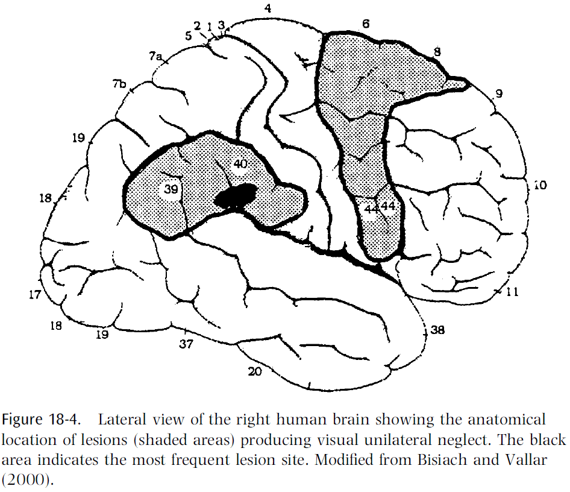
- The cortical circuit that organizes saccadic eye movements is formed in area lateral intraparietal cortex (LIP) and the frontal eye fields (FEF).
- Studies show that LIP neurons respond to the presentation of visual stimuli and they typically have large receptive fields that code for retinal coordinates.
- LIP neurons are neither directional nor orientation selective.
- Reversible inactivation of LIP doesn’t produce spatial neglect. However, when two stimuli are simultaneously presented, the monkey consistently picked the stimulus ipsilateral to the inactivation site.
- Lesion of the FEF produces more dramatic effects as there’s a decrease in spontaneous and evoked saccadic eye movements towards the contralateral side of the lesion.
- Stimuli presented contralateral to the lesion are frequently neglected.
- It’s important to note that bilateral lesions of the FEF with bilateral lesions to the superior colliculus produce a complete lack of saccadic eye movements.
- To conclude, it’s clear from experiments that the primary function of the circuit formed by areas LIP and FEF is to program ocular saccades to specific space locations.
- This shows that lesions to this circuit don’t only produce oculomotor deficits, but also space perception deficits, indicating that space perception isn’t a separate function with a dedicated area.
- To reach for an object in space, it’s necessary to know the initial position of the arm and where the object is located with respect to the individual.
- The transformation of object location into head and arm reaching movements is performed by a circuit formed by areas VIP and F4.
- A large percentage of VIP neurons code space in reference to the monkey’s body.
- Lesions to VIP in monkeys results in mild, but consistent, contralesional neglect for close-personal space with no changes to saccades, eye pursuit, or nystagmus.
- Evidence suggests that visual responses of F4, unlike those of LIP and FEF neurons, don’t signal positions on the retina but positions in space relative to the observer.
- The spatial coordinates of the receptive fields are anchored to different body parts and not to a single reference point.
- Visual receptive fields located around a certain body part move when that body part is moved.
- The most severe neglect in humans occurs after lesion of the right IPL.
- Evidence shows that neglect may selectively affect the far or close personal space differently.
- E.g. In patients with close personal space neglect, if tested at a far away distance, then the neglect dramatically improved or even disappeared. There’s also evidence of patients with the opposite dissociation (neglect for far distances but no neglect up close).
- To conclude, it’s clear from experiments that lesions of the IPL and it’s frontal targets determines spatial perceptual deficits, which agrees with the notion that the dorsal stream plays a fundamental role in space perception.
- However, there is no “space center”. In IPL, there are several circuits that process sensory information for organizing eye and arm movements and it’s their lesion that determines a deficit in space perception.
- IPL not only appears to play a fundamental role in space perception, but it’s also necessary for object awareness.
- E.g. Patients with right parietal lesions have extinction (when two stimuli are presented simultaneously but one is ignored) but when forced to make a same-different decision regarding the two stimuli, they were still able to answer correctly even though they were unaware of the ignored stimulus’s presence.
- This shows a capacity for processing object information, such as category, without being aware in the case of lesion of IPL.
- This also implies that subjects must have parieto-frontal sensorimotor circuit intact in order to achieve object awareness.
- The ventral stream’s processing isn’t enough to get perception without parietal spatial processing.
- The VD stream, in addition to organizing movements requiring space computation, is also involved in the organization of grasping and manipulating hand movements.
- These movements require the computation of the size and shape of objects rather than space.
- Area AIP in the parietal lobe provides this function and it has three main classes of neurons
    - Visual-dominant: discharge during object fixation and grasping in light but not dark.
    - Visual-and-motor: discharge in both light and dark but stronger in light.
    - Motor-dominant: discharge in both light and dark but are silent during object fixation.
- AIP is reciprocally connected with area F5 and electrical stimulation of F5 shows that it contains a representation of hand movements.
- Single-neuron recordings show that most F5 neurons code for specific hand actions.
- E.g. Grasping, holding, tearing, and manipulating.
- Neurons of a given class respond weakly or not at all when similar movements are executed in a different context.
- It’s important to note that these neurons respond to object presentation even if no action is taken on the object.
- This isn’t related to motor preparation because the response is present when no motor response is given.
- One interpretation that fits the evidence is that object presentation produces a representation of the observed stimulus but in motor terms: a potential action.
- F5 neurons appear to code for potential action with the stimulus, which may or may not be executed.
- Taken together with IPL, data strongly suggests that IPL is involved in transforming size and shape of objects (coded in AIP) into the appropriate motor schema for acting upon it (coded in F5).
- Further support for this comes from inactivation studies where inactivation of AIP produces a dramatic deficit in the capacity of a monkey to shape its hand based on visual information of the object’s size and shape.
- To conclude, the IPL, while being involved in space computation and perception, is also crucially involved in the organization of object-directed hand movements.
- Skimming over the part on mirror neurons due to mirror neurons not existing.
- In the ventral visual stream, single-neuron recordings show that the coding of visual features becomes more and more complex the further up we go in the visual hierarchy.
- The complexity becomes extremely high in the inferotemporal cortex (IFT), where neurons there respond best to complex visual stimuli such as faces and hands.
- Studies show that neurons sensitive to similar features are clustered together in columns through the depth of the IFT.
- Lesions of the IFT results in deficits in visual capabilities such as being unable to discriminate between stimuli or failure to recognize objects (visual form agnosia).
- However, agnostic patients, in contrast to neglect patients, are aware of the existence of space and motion, and can use this knowledge in a fully conscious way.
- Semantic visual agnosia results in the impairment of the visual representation of objects, while recognition of objects based on their sensorimotor representation was reasonably intact.
- Taken together, evidence argues against the simple view of the action/perception dichotomy.
- Perception and action aren’t independent functions, action comes first.
- Fundamental perceptual abilities, space perception and action recognition, are intermingled with action organization.
- The authors argue that perception can only be explained by taking into account the relationship between the agent and their environment.
- Action is fundamental for building a meaningful description of the visual world.
- The conventional view on space is that space perception is mediated by the activity of a brain center specifically devoted to space representation.
- This view is wrong because there’s no evidence that a “space center” exists in the brain.
- An alternative view, with more supporting evidence from lesion studies, is that the circuits that control action in space also produce space awareness.
- Space perception depends on movement.

## Chapter 19: What Are the Projective Fields of Cortical Neurons?

- The goal of this chapter is to propose a line of research that could help us uncover new principles of cortical function.
- The traditional way to study the properties of cortical neurons is to
    - Measure their responses to sensory stimuli.
    - Observe their activity during actions.
- By carefully choosing the sensory stimulus, we can explore the inputs to a neuron.
- However, receptive field properties only provide part of the information needed to characterize a neuron.
- A neuron’s projective field, it’s impact on other neurons, is equally important to its function.
- Cortical neurons don’t act individually but work together with other neurons to accomplish tasks.
- The goal of uncovering a neuron’s projective field would complement our knowledge of a neuron’s receptive field.
- Receptive field: a stimulus that causes the receptor/neuron to respond in a specific way.
- The stimulus that elicits the strongest response is used to define the trigger feature of the cell, which had led to the view that cortical neurons are feature detectors.
- However, this simplistic view has changed as we’ve learned more.
- New details of receptive fields
    - The response to a stimulus isn’t purely passive but can be modulated by attention and reward expectation.
    - Cortical neurons have intrinsic properties that allow neurons to generate activity without an external stimulus.
    - There are regions outside the defined receptive field that can modulate the response of the cell such as context to enable invariant recognition.
- Only knowing the receptive field of a neuron isn’t enough to conclude it’s function.
- Projective field: the impact a neuron has on downstream targets.
- The receptive field of a neuron depends on its synaptic inputs; in contrast, the projective field of a neuron depends on its axonal arborization/targets.
- E.g. If a neuron projects to a motor structure, it hints that that neuron influences motor control.
- In addition to knowing where a neuron projects to, it’s also important to know the impact that the firing that neuron has on the downstream targets.
- One advantage of the columnar organization of the cortex is that neurons with similar properties are often located nearby.
- By combining information about a neuron’s receptive and projective fields, an overall picture should emerge of how behaviors arise from dynamic brain states.

## Chapter 20: How Are the Features of Objects Integrated into Perceptual Wholes That Are Selected by Attention?

- One of the main observations on our theory of vision is that despite it’s parallel architecture in early visual processing, the brain is surprisingly limited in its capacity to process visual information.
- E.g. Many stimuli that activate the retina are never perceived such as the gorilla-ball-passing experiment and the spot-the-difference pictures.
- These examples show that even though the stimuli activate hundreds of thousands of retinal cones and millions of rods, they go unnoticed until attention is directed to them.
- There’s an enormous amount of information present in the retina which the observer is completely oblivious.
- Somewhere between stimulating the retina and generating a behavioral response, vast amounts of information are filtered out; a bottleneck.
- The bottleneck appears to be implemented as a competitive selection mechanism where attention boosts the responses of neurons in favor of stimuli appearing at the attended location.
- Psychophysical studies have found that when an observer attends to one feature of an object, other features of the same object can be discriminated at no additional cost.
- So when attention is directed to one feature of an object, all of the features that make up the object are automatically selected together.
- However, performance is severely impaired when making identical feature judgments on two different objects.
- This suggests that attention selects whole objects for processing and in doing so, suppresses the processing of the features of unselected objects.
- Further studies suggest that selection of stimuli is mediated/controlled by a biased competitive circuit.
- Consistent with the idea that elevated baseline activity reflects feedback that biases competition between stimuli, when multiple stimuli appear, competition tends to be resolved in favor of the neurons with elevated baseline activity.
- When attention is directed to a stimulus, V4 neurons respond as though the physical contrast of the stimulus is increased.
- How attention could bias the competition between multiple stimuli
    - Attention increases the effective contrast of a stimulus.
    - The increase is due to high frequency synchronization.
    - Competition is resolved in favor of the attended stimulus.
- While these studies provide compelling evidence that attentional selection occurs through the resolution of competition, they haven’t focused nor answered what type of stimulus representation engages in competition.
- In all of these studies, competing stimuli appeared at separate locations and this confounds selection of locations with selection of objects.
- Thus, competition could either reflect attending to different locations or to different objects.
- However, psychophysical studies show that attention can select out whole objects for processing even when the two stimuli are superimposed.
- E.g. Those pictures where depending on which colored glasses you use, it changes which picture you see. Or those visual illusions such as the vase-face or Necker cube illusion.
- This suggests that attention can select spatially invariant object representations.
- Studies of attentional deficits among patients with right parietal lesions provide further evidence that objects can receive substantial processing before being selected by attention.
- E.g. Hemispatial neglect.
- It’s now an open question as to how the brain represents whole items that can be selected by attention for processing.
- Results suggest that competitive circuits in extrastriate cortex may mediate competition among whole objects.

## Chapter 21: Where Are the Switches on This Thing?

- Controlled responses differ from reflexes because they can be turned on and off.
- How does the nervous system gate the flow of information so that a sensory stimulus that elicits a strong response in some occasions doesn’t elicit a response in another?
- The chapter title refers to neural pathways that not only carry APs from neural activity, but the pathways that are switched on and off by neural activity as well.
- Three possible mechanisms
    - Neuromodulation
    - Inhibition
    - Gain modulation
- Neuromodulation isn’t considered a candidate mechanism because it’s too slow and imprecise to switch complex neural circuits and responses.
- Switching in neural circuits means to modify that circuit’s neural activity.
- This could mean changing the state of neurons or the state of synapses.
- Soft switching: modulating the gain.
- Hard switching: modulating the ability to evoke any response at all.
- Due to the existence of a threshold for AP generation, hard switching can be implemented by strong inhibition.
- E.g. Hyperpolarization = Switching a neuron off.
- Gain modulation appears to be the primary mechanism by which cortical neurons nonlinearly combine input signals.
- However, it isn’t obvious how it could be used to generate switching in neuronal circuits since it only modifies responses slightly, rather than on-off switching.
- Modest gain modulation of the network has a large impact on the response of downstream neurons.
- E.g. Butterfly effect or dynamical systems.
- Any system for attention-based switching must distinguish between attended stimuli and high-contrast stimuli.
- In other words, we want to pay attention to stimuli because they’re significant, and not because they’re intense.

## Chapter 22: Synesthesia: What Does It Tell Us about the Emergence of Qualia, Metaphor, Abstract Thought, and Language?

- This chapter proposes an approach to the problem of understanding the mind by investigating phenomena that are robust and repeatable, and yet don’t fit the big picture of cognitive science.
- We suggest than an additional source of valuable insights might come from good old-fashioned phenomenology and from looking at “odd” experiences that have largely been ignored.
- Wisdom lies in knowing which anomalies to pursue and which ones to ignore.
- Three criteria for scientific phenomena
    - It must be real.
    - There must be candidate explanations (hypotheses).
    - It must be significant (so what?).
- In this chapter, we explore the phenomena of synesthesia.
- Four arguments against synesthesia
    - Those people are crazy.
    - Those people are acid junkies or drug addicts.
    - Those people are just remembering early childhood memories, maybe from colored refrigerator magnets.
    - Those people are just being metaphorical and doesn’t actually mean what they say.
- The last two arguments are the most viable, but there are problems with them.
- The idea that “synesthetes are being metaphorical” is an example of the classic blunder of trying to explain one mystery with another mystery.
- In the past, it’s been claimed that Stroop interference shows that synesthesia is sensory but that experiment can’t definitively say that synesthesia exists.
- We hypothesize that synesthesia is mediated relatively early in the sensory processing hierarchy as it depends on stimulus details.
- Evidence strongly supports the notion that synesthesia is a sensory phenomenon, but what causes it?
- The most common type of synesthesia is the number-color type.
- Interestingly, the “number area” of the brain is in the fusiform gyrus and the “color area” is in the fusiform gyrus right next to the number area, almost touching it.
- We hypothesize that synesthesia is caused by a cross-activation of sensory brain maps.
- So, activation of one area automatically activates another area, and the activation is just as strong as direct activation by a real sensory stimulus.
- This creates a vivid phenomenal experience of color that’s virtually indistinguishable from real stimulus-driven sensations.
- The idea that synesthesia is the result of some kind of “crossed wires” isn’t new, but the idea was never put into physiological terms.
- Synesthesia runs in families and may have a genetic basis.
- Possible causes
    - Actual cross-wiring, where there’s an excess of connections between brain modules that are normally distinct or due to a failure in pruning.
    - No actual wires, but that cross-activation results from excess activity.
    - No actual wires, but an excess activation caused by disinhibition of back-projections from higher to lower visual areas in the hierarchy.
- We prefer to use the term “cross-activation” over “cross-wiring” since it covers all three potential mechanisms.
- Two additional questions
    - If defective genes are involved, why do they affect one brain area and not others?
        - The genes may be selectively expressed in certain areas due to transcription factors.
    - Does this imply that synesthesia can only occur in adjacent brain modules?
        - We have to remember that even remote modules often have some connections.
        - One would expect that the chance of one map cross-activating another increases with the proximity between the two areas.
- Evidence from synesthetes shows that it’s the visual appearance of the grapheme (smallest visual unit), and not the high-level concept, that drives the color.
- E.g. Subjects saw colors only with Arabic numbers but not with Roman ones.
- This is also consistent with observations that synesthesia happens in early sensory processing and not the numerical concept.
- However, later synesthetes show that this wasn’t true as they also saw days of the week in colors.
- E.g. Monday as blue and Wednesday as brown.
- What all of these conditions have in common is the idea of a numerical sequence and this ability probably depends on the angular gyrus.
- This is further supported by two cases in the literature of patients losing their synesthetically-induced colors following brain lesions to the angular gyrus and fusiform.
- In some synesthetes, it’s the phoneme and not the grapheme that seems to evoke the color.
- Interestingly, synesthesia isn’t just a bottom-up processes as attention and visual imagery can also control the effect.
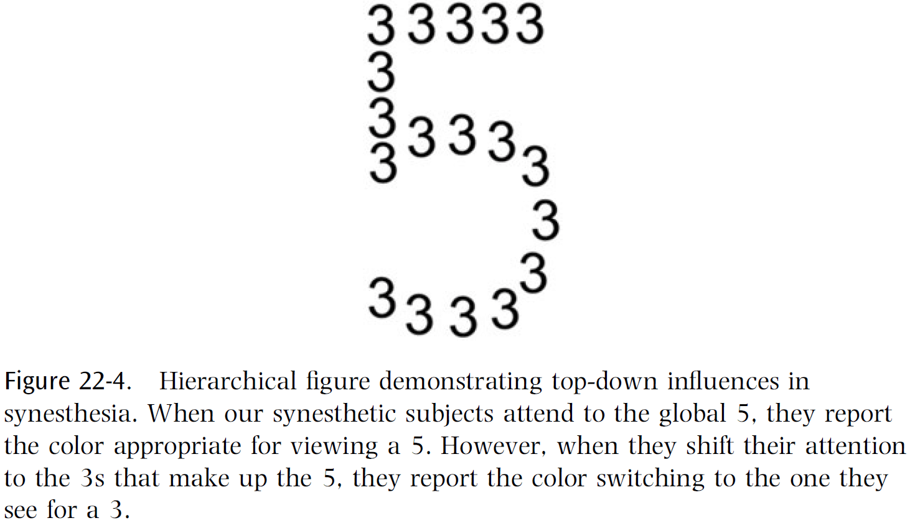
- Studies show that when synesthetes switch from seeing the forest, the 5, to the trees, the 3, their perception also switched colors depending on what they attended to.
- This implies that even though synesthesia is evoked by visual appearance alone, it’s categorization, based on attention, is also important.
- It isn’t the physical appearance of the letter but which “bin” the brain puts it in that determines which synesthetic color is evoked.
- Does conscious awareness of red require activation of all or most of the visual areas in the brain or only a small subset of them?
- We can turn to the crowding effect to study this question in synesthetes.
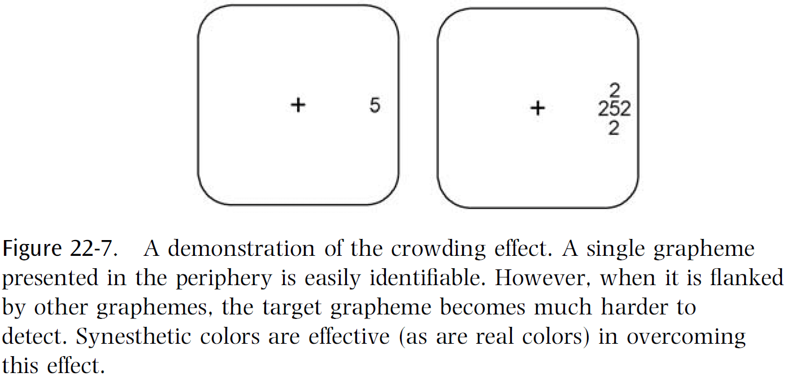
- Normal people can’t determine the number when it’s crowed with other stimuli, but synesthetes can see the color and guess at the number.
- This provides strong evidence that we’re dealing with cross-activation relatively early in sensory processing, before the crowding effect occurs in the brain.
- An interesting case was discovered of a color-blind synesthete where subject S.S. was cone-pigment deficient but often saw numbers tinged with colors that he could never see in the real world.
- The explanation is that when you show S.S. a number, the form of the number gets processed all the way up to the fusiform and produces cross-activation of cells in V4, much like seeing real colors in a normal person.
- It’s as if you were able to skip the retinal processing of color and directly access and stimulate the full range of color-coded cells in V4.
- What if we directly stimulated the color area in other colorblind but non-synesthetic people? Would they also experience a color that they’ve never seen?
- The striking case of S.S. provides a direct empirical answer to the old philosophical question of whether someone can experience visual qualia that they’ve never experienced before: yes.
- Two qualia questions
    - Why do only some neural events have qualia associated with them whereas others don’t? What’s the common factor of those neural events that do versus those that don’t?
    - What are the functional characteristics that distinguish qualia-laden events from unconsciously processed ones?
- Four laws of qualia
    1. Qualia are irrevocable and beyond dispute.
        - E.g. “This is green” and not “Maybe this is green”.
    2. Qualia are linked to short-term memory.
    3. Qualia can be linked to a potentially unlimited number of implications.
        - E.g. A spinal reflex arc can only output one possibility, whereas qualia can be matched to unlimited possibilities such as green flowers, green teeth, and green food.
    4. Qualia are always linked to attention.
- The first law is seen when the brain fills in the blind spot.
- E.g. If a yellow ring is presented surrounding the blind spot, the brain doesn’t see a ring but a disk because it fills in the ring.
- This demolishes philosophers’ claims that you simply ignore what’s in your blind spot.
- One hypothesis is that qualia occurs when sensory signals reach a certain preestablished criterion of certainty.
- E.g. If something looks 98 percent red, then your brain pretends that it’s 100 percent certain it’s red. Or in the case of the blind spot, if the surrounding is yellow, then we’ll pretend that the entire circle is yellow.
- Once this representation is established, it endures in short-term memory long enough to facilitate subsequent decisions and is tamper resistant from top-down influences.
- This also explains why you can’t unsee visual illusions even though you know how they work.
- The biological function of this genuine sensory filling-in is to confer stability on behavior by eliminating hesitation from subsequent decision-making.
- For a region like the blind spot, it makes evolutionary sense to fill it in because it’s unlikely that the center is different; it’s a useful heuristic.
- Why is synesthesia more common in artists, poets, novelists, and composers?
- One thing that artists, poets, and novelists all have in common is that they’re especially good at using metaphor.
- It’s as if their brains are set up to make links between seemingly unrelated domains.
- Just as synesthesia involves making arbitrary links between seemingly unrelated perceptual entities like colors and numbers, metaphor involves making links between seemingly unrelated conceptual realms.
- Perhaps this isn’t just a coincidence and that the higher incidence of synesthesia in artists is rooted deep in the architecture of their brains.
- We know that high-level concepts and abstract ideas are probably anchored in specific brain regions.
- E.g. A number brain area and a tool brain area.
- If concepts exist in the form of brain maps, then one possible answer to the question linking synesthesia and artists is that there may be excess connections between different brain concept maps.
- This would explain the higher incidence of synesthesia among artists, poets, and creative people in general.
- The evidence we have so far suggests that synesthesia is caused by some sort of glitch or minor flaw in brain circuits.
- Review of the kiki/bouba experiment and pairing it to the sharp or curvy visual shape.
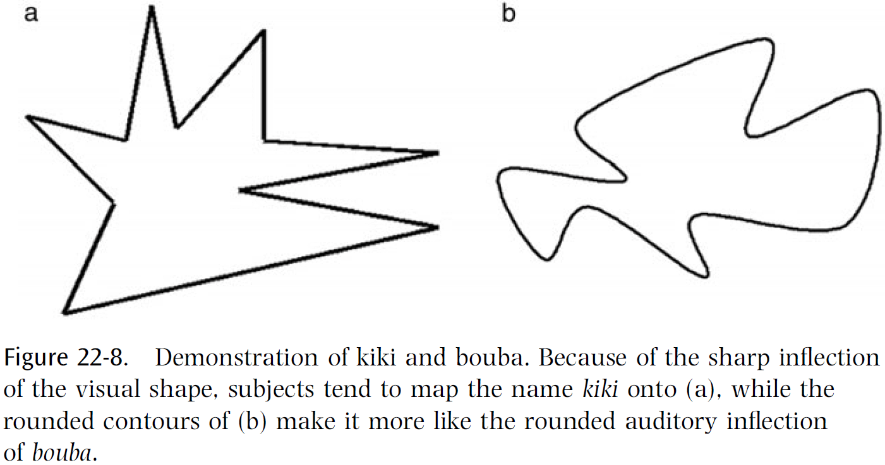
- Recent evidence shows that lesions to the angular gyrus removes the kiki/bouba effect.
- Evidence suggests that the angular gyrus is a great center in the brain for cross-modal synthesis.
- We’ve also found patients with lesions in the angular gyrus that are also terrible with metaphors, often taking them literally.
- Consistent with the claim that the TPO played a critical role in the evolution of uniquely human abilities, is the well-known clinical observation that lesions in this general area lead to tool-use deficits.
- The evolution of language is one of the oldest puzzles in psychology.
- How did an ability as sophisticated and complex as human language evolve in just two/three hundred thousand years?
- The kiki/bouba effect gives us a hint in that there’s a pre-existing nonarbitrary match between word sounds and object appearance.
- There’s a built-in bias to associate certain sounds with certain objects and this bias may have been important in getting started on building a shared vocabulary and eventually language.
- There are also two other key steps required for this synesthetic bootstrapping theory of language.
- One key step is that your lips tend to mimic the visual appearance of the word.
- E.g. “Teeny weeny” or “large”.
- The last key step is that when we cut a piece of paper with scissors, our jaws clench and unclench unconsciously as if to echo our hand movements.
- This effect, called synkinesia, is probably due to some spillover of motor signals from the hand motor area to the mouth motor area.
- Like synesthesia, this may rely on cross-activation of brain maps but with motor rather than sensory maps.

## Chapter 23: What Are the Neuronal Correlates of Consciousness?

- How do we explain qualia in terms of science?
- E.g. The redness of red or the painfulness of pain.
- The authors’ strategy is to leave the core of the problem for later (the hard problem of consciousness) and to try, instead, to discover the neural correlates of consciousness.
- Neural correlates of consciousness (NCC): the minimal neural mechanisms jointly sufficient for any one conscious sensation or percept.
- This chapter focuses on the visual system in humans and macaque monkeys.
- It’s generally agreed that much of the activity of our brains is unconscious.
- E.g. The nervous system of the digestive tract and the retina.
- There’s considerable activity in the cerebral cortex that is also unconscious but which leads up to conscious activity.
- How do the neural activities that correspond to consciousness (the NCC) differ from other similar brain activities that are unconscious?
- Our main interest isn’t the enabling factors that are needed for all forms of consciousness, such as a functioning ascending reticular activating system and intralaminar nuclei, but in the general nature of the neural activity that produces each particular aspect of consciousness.
- In other words, our interest is in the contents of consciousness.
- There’s general agreement that much of consciousness is private.
- This isn’t surprising, but what is surprising is the exact nature of these internal experiences.
- Dreams seem to have qualia but there’s no general agreement on this topic.
- It’s often claimed that consciousness has a “unity” but this is unclear and ambiguous.
- It does seem that the brain dislikes contradictory information and often selects a single interpretation, though this may switch over time.
- E.g. Necker cube or in binocular rivalry.
- Can one produce two distinct consciousnesses in one head?
- Patients with a cut corpus callosum show split-brain personalities but this work isn’t enough to help us answer that question.
- What is consciousness for? Why are we not just a collection of zombie systems?
- One possible answer is that zombies wouldn’t produce highly intelligent and flexible behavior since we would need to duplicate human behavior without our brain complexity.
- Is attention necessary for consciousness?
- Since the neural mechanisms that produce attention aren’t fully understood, it’s unlikely that attention can do much to help us to find the NCC.
- Defects in attention can be produced by brain damage.
- E.g. Visual neglect, extinction, and Balint’s syndrome.
- Is memory necessary for consciousness?
- Episodic memory, although it enriches consciousness, isn’t necessary as patients who lack it (due to damage to their hippocampal system) are certainly conscious.
- Other forms of long-term memory, such as semantic and procedural memory, are also unlikely to be major factors in the NCC.
- What we’re left with is that consciousness requires some form of short-term memory.
- The difficult case is working memory.
- A person with small working memory, although handicapped, appears to be conscious.
- Bloch’s law: for stimulus duration less than about a tenth of a second, the brightness of the stimulus appears the same provided the product of its intensity and its duration is constant.
- In other words, the system/brain is integrating the input over some short time interval.
- Experimental results suggest that the NCC comes into being abruptly rather than gradually.
- Once the relevant neural activity reaches some threshold, a constant percept of brightness results, at least for a short time.
- Suppose a red circular disk and an identical green disk are flashed simultaneously onto the same place in the retina.
- Unsurprisingly, the subject doesn’t see the individual disks but just one yellow disk (yellow being red plus green).
- However, if the red disk is flashed before the green disk, then the subject still sees a yellow disk but now the yellow is tinted with second disk’s color.
- The subject perceives a mixture of the inputs with a bias towards the later one.
- This turns out to be a general rule and suggests some form of integration, with the later signal having a somewhat greater weight.
- However, if the second disk appears a hundred milliseconds after, little blending occurs.
- This suggests that the integration time is less than a hundred milliseconds.
- Evidence from brain damage patients suggests that certain parts of the brain are essential for a person to be conscious of certain aspects of the visual sensation or percept.
- It’s important to not assume that the brain can consciously detect some particular change in its firing activity.
- It won’t be able to do so unless there’s some essential node to consciously register that type of change.
- The key question is what makes up the essential node?
- As of this textbook, we don’t know.
- There is no place in the brain where it all comes together, no physical implementation of unity.
