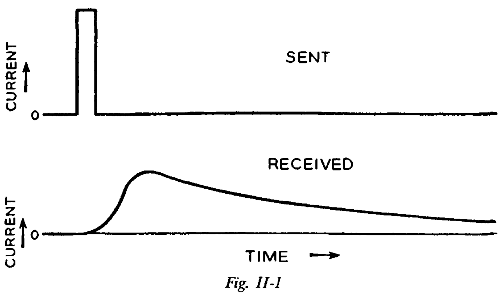
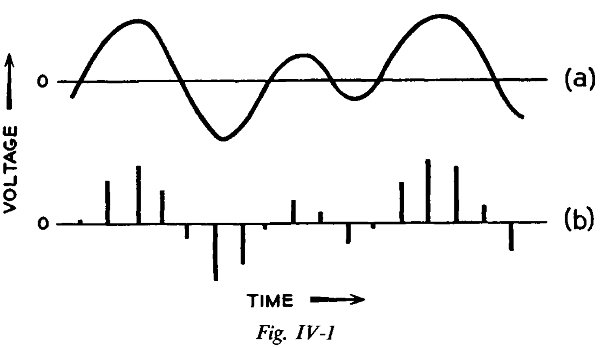
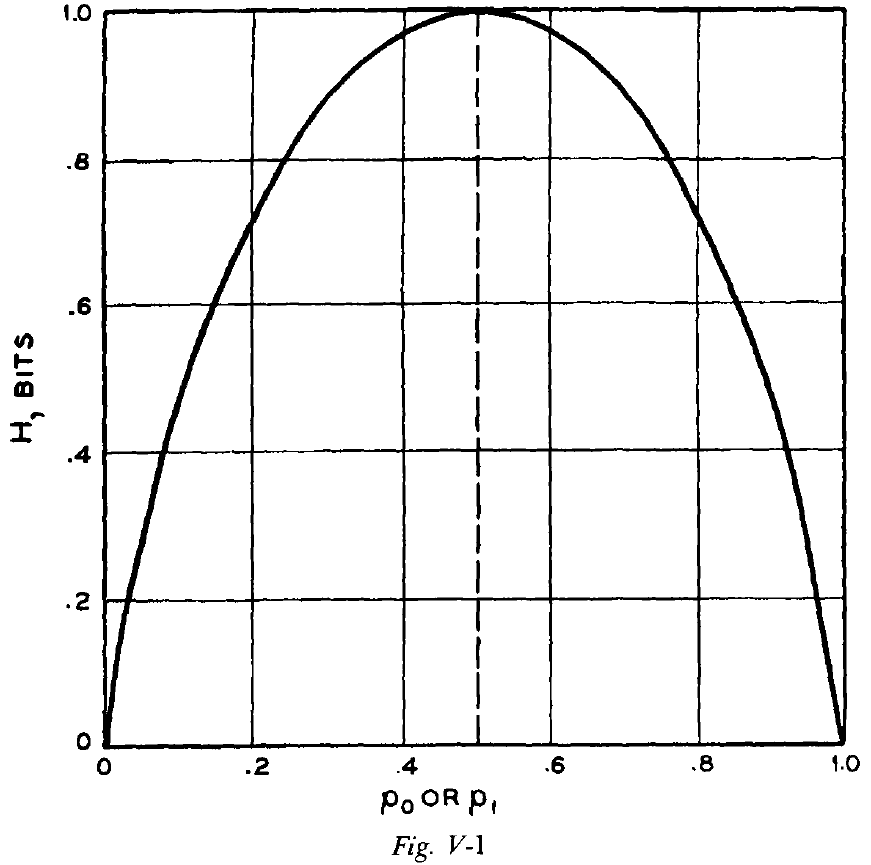

## Chapter 1: The World and Theories

- Information theory is a mathematical theory.
- Information theory = communication theory.
- We communicate not only information, but also knowledge, error, opinions, experiences, wishes, orders, emotions, and heat.
- We can’t have a separate word for every distinct object and concept because communication would be impossible.
- E.g. A feather and white are both light but in different senses.
- Unity among these concepts lies far more in our human language than in their physical similarity.
- Science looks for things in nature that can be grouped together and understood.
- We shouldn’t expect that communication theory will have something sensible to say about everything related to communication.
- The term “communication” in communication theory is used in a very specific and scientific context.
- Communication theory is both strongly mathematical and general.
- It provides, in the unit of bit, a universal measure of the amount of information.
- Communication theory can help us with
    - How to measure the rate that a message source generates information.
    - How to represent, or encode, messages from a source efficiently for transmission.
    - How to avoid errors in transmission.
- Applications of communication theory
    - Written and spoken language.
    - Electrical and mechanical transmission of messages.
    - Computers.
    - Nervous system.
- Communication theory can’t be applied to all problems that use the words “communication” and “information” in their popular meaning.
- Communication theory, like Newton’s laws of motion, can only describe aspects of communication and it isn’t a general theory of communication.

## Chapter 2: The Origins of Information Theory

- Two lessons from the history of science
    1. Many of our most general and powerful discoveries of science have come, not from the study of nature, but from the study of man-made devices.
        - E.g. Studying thermodynamics in steam engines, aerodynamics in airplanes and not birds, electricity from batteries and not lightning, and communication theory from telegraphy, not human language.
    2. New discoveries are difficult to understand and aren’t as clear as we’re lead to believe.
- Communication theory evolved from an effort to solve problems in the field of electrical communication.
- Thermal entropy is an indicator of reversibility.
- Most physical phenomena aren’t reversible and always involve an increase in entropy.
- In communication theory, a message source, like a writer or speaker, can produce any one of many possible messages.
- The amount of information conveyed by the message increases as the amount of uncertainty as to what message actually will be produced becomes greater.
- E.g. A message which is one out of ten possible messages conveys a smaller amount of information than a message which is one out of a million possible messages.
- The entropy of communication theory is a measure of this uncertainty and is taken as the measure of the amount of information conveyed by a message from a source.
- The more we know about what message the source will produce, the less uncertainty, thus the less the entropy, and therefore the less information we receive.
- Entropy in physics =/= Entropy of communication theory.
- Information is sometimes associated with the idea of knowledge through popular use, rather than with uncertainty and the resolution of uncertainty, as in communication theory.
- Review of Morse code.
- Morse code teaches us that it’s very important in how one translates a message into electrical signals.
- This problem is at the very heart of communication theory.
- Different circuits that all conduct electrical current aren’t all suited for communication.
- E.g. If you send Morse code too fast over an underground/undersea cable, they run together at the receiving end and become indistinguishable.
- E.g. If you send a short burst of current, at the receiving end, you end up with a longer, smoothed-out rise and fall of current.

- This longer flow of current may overlap with another symbol.

- One way of solving this problem is to make the dots, spaces, and dashes long enough but this slows down the rate of transmission.
- Another solution is to use more parameters of the communication medium.
- E.g. Single-current and double-current telegraphy.
- *Single-current telegraphy*: two elements to construct the code such as current and no current.
- *Double-current telegraphy*: three elements to construct the code such as positive current, negative current, and no current.
- Are neurons double-current? Resting potential, action potential, and graded potential.
- How much information is possible to send depends not only on how fast one can send signals, but also how many different symbols one has available.
- Extraneous currents, which we call noise, are always present to interfere with the signal.
- E.g. Thermal fluctuations, lightning, cosmic background radiation.
- Noise tends to distort the received signal and makes it difficult to distinguish between symbols.
- *Intersymbol interference*: the problem of overlapping dots and spaces.
- Neurons actually use the intersymbol interference to compute such as in spatial and temporal summation.
- A sine wave can be differentiated completely from any other sine wave by three quantities
    - *Amplitude*: height of the save.
    - *Phase*: time when the maximum is reached.
    - *Period/Frequency*: time between maximums.
- In a linear electrical circuit, signals act as if they are present independently of one another.
- Are neurons linear? Data suggests yes and no.
- Since telegraph wires are linear, two signals can travel in opposite directions on the same wire at the same time without interfering with one another.
- *Attenuation*: the reduction in amplitude of a signal.
- *Delay*: a change in phase of a signal.
- *Distortionless*: if the attenuation and delay of a circuit is the same for all frequencies, the shape of the output wave will be the same as that of the input wave.
- The logarithm of the number of symbols equals the number of independent messages that we can send at once.
- E.g. If we have zeros and ones, then we can send log(2) = 1 number of independent messages at the same time. If we have a system with four symbols, we can send log(4) = 2 independent messages simultaneously.
- The line speed (or number of possible simultaneous messages) is half of the number of signals elements.
- *Band width*: the width or extent of the range/band of frequencies used in communication.
- *Redundant*: a useless component of a signal.
- Wiener is associated with how to treat a signal plus noise, while Shannon is associated with what kind of signal to send that will best convey messages of a given type over a noisy circuit.
- This matter of efficient encoding forms the bulk of information theory.
- The first step of efficient encoding is to represent common letters with short combinations and uncommon letters with long combinations.
- Another efficient encoding strategy is to only encode changes.
- The inability of circuits to accurately transmit rapid changes of current (a problem for neuromorphic computing).

## Chapter 3: A Mathematical Model

- The great beauty and power of a mathematical theory/model lies in the separation of the relevant from the irrelevant.
- Mathematical models have various degrees of accuracy and applicability.
- Levels of approximating English
    - Zero-Order
        - Supposing letters and spaces have an equal probability of being chosen.
        - E.g. Both E and W have a 1/27 chance of being picked.
    - First-Order
        - Matching the probability of a letter/space being chosen to observed probabilities.
        - E.g. E has a 13% chance while W has a 2% chance.
    - Second-Order
        - Matching the digram (two letter pairs) frequency to observed probabilities.
        - E.g. The probability of “U” following “Q” is higher than “X” following “Q”.
    - Third-Order
        - Using trigram probabilities.
- As we move up in the levels, we see an increasing resemblance to English text.
- *Ergodic source*: if its statistical properties can be deduced from a single, sufficiently long, random sample from the source.
- The theorems of information theory apply to ergodic sources, and their proofs rest on the assumption that the message source is ergodic.
- The exact ergodic source of mathematics and the approximate ergodic source of the real world lead to some problems with applying communication theory to the real world.
- Skimming over the part of finite-state machines.

## Chapter 4: Encoding and Binary Digits

- The main goal of information theory is to study how to efficiently encode signals for transmission, commonly by electrical means.
- *Encoding*: the accurate representation of one thing by another.
- E.g. Morse code encodes English, electromagnetic radio waves encode human voices, sound waves encode speech, and action potentials encode stimulus properties.
- The communication engineer, however, can choose the form of encoding that will represent the original information.
- To do this well, there must be some standard which separates good encoding from bad encoding.
- New ideas introduced by information theory
    - *Entropy*: a measure of amount of information.
    - *Bit*: a unit of measurement.
- To deal with continuous signals, information theory uses the sampling theorem.
- *Sampling theorem*: a continuous signal can be represented completely by, and reconstructed perfectly from, a set of measurements/samples of its amplitude, which are made at equally spaced times. The interval between such samples must be equal to or less than one-half of the period of the highest frequency present in the signal.

- E.g. If a voice signal used frequencies from 0 to 4,000 Hz, then we must sample at minimum 8,000 Hz to not lose any information.
- If the frequency range of a signal is f cycles per second, then we must use at least 2f samples per second in order to describe the signal perfectly.
- Thus, the sampling theorem lets us convert between continuous and discrete representations of a signal.
- The representation by 0 or 1 is convenient and important because it can be used to relate patterns of pulses to numbers expressed in binary.
- English text is just one sort of message that we might want to transmit. Other messages might be speech, pictures, or changes in stimulus intensity.
- If there are efficient and inefficient ways of encoding English text, we may expect that there will be efficient and inefficient ways of encoding other signals.
- We might be lead to believe that there is some best way of encoding signals from a message source, a way which will, on average, require fewer binary digits per symbol or per unit time than any other way.
- This is just what is done in information theory.
- We regard coding very broadly, as representing one signal by another.
- To encode English, it’s more efficient to encode English words rather than encode English letters because only certain sequences of English letters ever occur.
- Generally, we can make encoding more efficient by block encoding, rather than symbol encoding.
- E.g. It takes fewer binary digits per character when we encode a group or block of English letters than when we encode the letters one at a time.

## Chapter 5: Entropy

- All communication involves some sort of encoding of messages.
- Since there’s choice exercised by a message source in producing a message, there’s also a matching uncertainty on the part of the message recipient.
- E.g. If a message source can transmit zeros and ones, then the recipient is uncertain whether it will receive a zero or a one.
- This uncertainty is resolved when the recipient receives the message.
- It’s this resolution of uncertainty which is the aim and outcome of communication.
- If the message source had no choice, such as only sending out one symbol, then the recipient doesn’t need to receive a message because it could predict it in advance.
- Thus, if we are to measure information, we must have a measure that increases with the amount of choice of the source and thus, with the uncertainty of the recipient as to what messages the source may produce and transmit.
- We should measure information in terms of the number of binary digits, rather than in terms of the number of different messages that the binary digits can form.
- This is because the number of binary digits encodes the number of possible messages.
- E.g. If we have a binary digit with length two, then it can encode, at most, four messages. If the length is four, then it can encode sixteen possible messages.
- In other words, we should look to the length of the binary digit and not the number of possible messages, because the length encodes the number of possible messages.
- Furthermore, that means that the amount of information should be measured, not by the number of possible messages, but by the logarithm of the number of possible messages.
- E.g. If the number of possible messages is four, then the amount of information is log(4) = 2 bits.
- *Entropy*: this measure of information in units of bits.
- E.g. A message source outputs information in bits per message.
- Entropy increases with the number of possible messages and increases with uncertainty.
- E.g. A restriction that certain messages must be sent either very frequently/infrequently decreases choice at the source and uncertainty for the receiver, thus decreasing entropy.
- Review of the formula for entropy.
- For a heads-tails coin, the entropy of the coinflip is 1 bit. However, if the coin is weighted so that it will land on one side more often, then the entropy of the coinflip decreases to, say 0.811 bits. In this case, the number of bits doesn’t equal the number of coin tosses.

- In any ergodic process, the effect of the past on what symbol will be produced next must decrease as the remoteness of that past is greater.
- In general, an estimate of entropy is always high if it fails to take into account some relations between symbols.
- Review of Huffman encoding, the optimal encoding method for separate symbols.
- *Fundamental theorem of the noiseless channel*: if a channel has capacity C and an ergodic message source has some entropy H. If H is less than or equal to C, then we can transmit messages over the channel. If H is greater than C, we can’t.
- We’ve now arrived at the fact that the entropy of a message source measured in bits tell us how many bits are needed, per symbol, to transmit a message produced by the source.
- The word “bit” is actually a contraction of “binary digit”.
- Usually, the entropy in bits is different from the number of binary digits involved.
- E.g. A weighted coin will require 1 binary digit to specify which side it landed on, but the entropy is 0.811 bits.
- E.g. Say a channel has a capacity for 10,000 bits per second but only transmits zeros. Then the channel’s actual rate of transmission of information is 0 bits per second, despite the fact that the channel is transmitting 10,000 binary digits per second.
- Here, we’ve only used bit in the sense of a binary measure of amount of information, and not in the sense of binary digit.
- In other words, don’t confuse the “bit” unit of information with “bit” as in binary digit.
- Two reasons for encoding in long blocks
    1. To make the average number of binary digits per symbol used in the Huffman coding negligible.
    2. To encode material, such as English, more efficiently by taking into account the influence of preceding symbols on the probability that a given symbol will appear next.
- As the length of the block increases, the entropy gets closer and closer to the true value.
- We think of entropy as a measure of choice, the amount of choice the source is exercising in selecting a message.
- We think of entropy of the message source as measuring the uncertainty of the recipient as to which message will be received, and uncertainty that’s resolved on receipt of the message.
- If we encode English text letter by letter, it requires 4.76 binary digits per letter, while if we encode word by word, then it requires 1.66 binary digits per letter.
- If we want to do better, we have to take into account the constraints imposed by grammar on the probability of a message.
- We know that the entropy of English text must lie somewhere between 0.6 and 1.3 bits as Shannon devised a clever experiment where a person guessed what letter would follow the letters of a passage of text.

## Chapter 6: Language and Meaning

- Two innovations of information theory
    - Establishing the channel capacity.
    - Showing that a noisy communication channel has an information rate up to some limit, despite the noise.
- We know that much of spoken English appears to be agrammatical.
- What is grammatical changes with time.
- By knowing the grammatical rules, we could make a new estimate of the entropy of English text, because we could see which parts of a sentence are mere mechanical following of rules and which parts involve choice/uncertainty and hence contributes to entropy.
- Skimmed this chapter due to disinterest in linguistics.

## Chapter 7: Efficient Encoding

- The main goal of communication theory is the efficient and accurate transmission of information.
- Why don’t we use Huffman coding all the time?
- It isn’t efficient or practical all of the time.
- E.g. To encode 000111000111111, it’s more efficient to just send every third symbol and tell the receiver to repeat it two more times to get the original message than to use Huffman coding.
- This example tells us that we should look for natural structure in a message source to take advantage of.
- Since a continuous signal can assume an infinite number of different values, we are lead to assume that a continuous signal must have infinite entropy.
- While this is possible in theory, in practice not every value has meaning nor can we measure every continuous value accurately.
- *Fidelity criterion*: the limit for resolution of a continuous signal.
- By introducing the fidelity criterion, we limit and transform a continuous signal into a discrete signal and thus it’s entropy isn’t infinite.
- The fidelity criterion should be associated with long stretches of the signal and not with individual samples.
- E.g. If each sample is changed by 10%, no noticeable changes are seen. However, if each sample is changed by 10% randomly, the changes are noticeable.
- The fidelity criterion is also a way of quantizing each sample, thus only allowing it to assume certain, preassigned values.
- We only need enough accuracy of transmission to convince the hearer that transmission is good enough.
- Many artificial voice coders have a strong and unpleasant electrical accent.
- Speech is more difficult to transmit than text because speech has more information.
- E.g. Quality, pitch, stress, accent, and volume.
- The entropy of speech is greater per word than the entropy of text.
- The TV problem, of transmitting images, is more difficult than speech because it’s more detailed and because our sense of sight can discriminate more than hearing.
- There are also more options with light than sound and thus more entropy for vision.
- One efficient encoding method is to only send the errors in prediction to the receiver.
- Both ends, the receiver and sender, predict the next pixel and the receiver only transmits the error to the sender so that the sender can correct itself.
- This way, only the error needs to be sent, which is similar to neuronal processing.
- In “busy” portions of the picture, prediction will be poor and the brightness differences that must be sent will be great.
- We can encode brightness differences efficiently by using a Huffman code, with short words for more frequent small brightness differences and long words for less frequent large brightness differences.
- Three principles of efficient encoding
    1. Don’t encode the signal one sample at a time; encode a stretch of signal.
    2. Take into account the limitations on the source of the signal.
    3. Take into account any inabilities of the sense organs to detect errors in a reconstructed signal.
- Redundancy is one way of fixing mistakes in a signal by giving many clues.
- E.g. We can infer a word even if it’s misspelt because the other words give context.

## Chapter 8: The Noisy Channel

- The receiver doesn’t always get the intended message.
- E.g. Sometimes a 0 is flipped to a 1 and a 1 is flipped to a 0.
- In more efficient coding schemes, the effects of noise/error will be more pronounced.
- One simple way of detecting and correcting errors is by repeating the transmission, but this is costly as it reduces bandwidth.
- Review of error-correcting codes (checksum).
- In Chapter 7, we considered removing redundancy so that we can transmit more messages. Now, we consider adding redundancy to transmit messages over a noisy channel.
- However, the redundancy that we’re adding here isn’t the message just repeated, it’s a more clever and efficient copy of the message.
- The fact that error-free transmission can be attained over a noisy channel was and is surprising.
- Before, it wasn’t thought that the noise and signal could be separated in a noisy channel.
- Shannon characterized noise in a noisy channel and separated it from the signal.
- The rate of transmission of information depends both on the amount of noise/uncertainty in the channel and on the message source.
- The whole problem of efficient and error-free communication turns out to be the removing from messages the somewhat inefficient redundancy and then adding redundancy, of the right kind, in order to allow the correction of errors made in transmission.

## Chapter 9: Many Dimensions

- Skimmed this chapter on how to deal with noise in continuous signals by mapping them to multiple dimensions.

## Chapter 10: Information Theory and Physics

- Skipped this chapter.

## Chapter 11: Cybernetics

- Skipped this chapter.

## Chapter 12: Information Theory and Psychology

- Skipped this chapter on applying information theory to people to find their rate of information.

## Chapter 13: Information Theory and Art

- Skipped this chapter on applying information theory to music.

## Chapter 14: Back to Communication Theory

- Three valuable ideas from information theory
    - The rate of information or entropy of an ergodic message source.
    - The information capacity of noiseless and noisy channels.
    - The efficient encoding of messages produced by the source.
- The future of information theory lies beyond just the encoding and transmission of information, it wants to bring meaning into the picture.
- Information theorists also seek the best codes for transmitting information over a noisy continuous channel.
