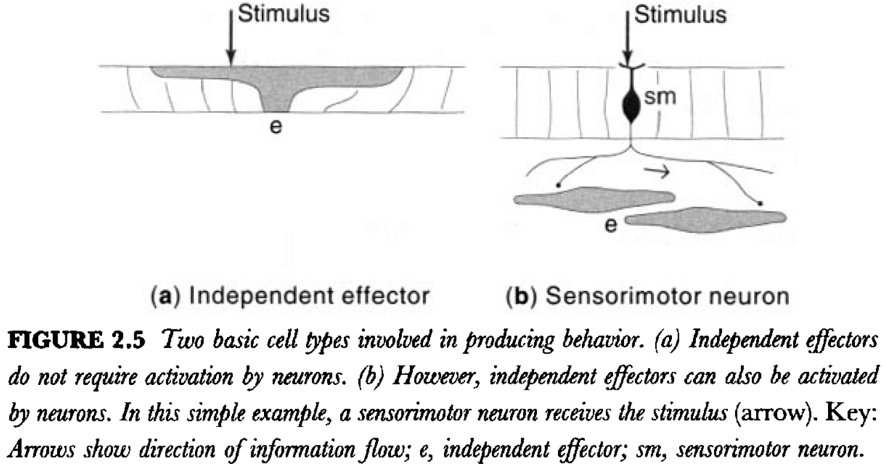
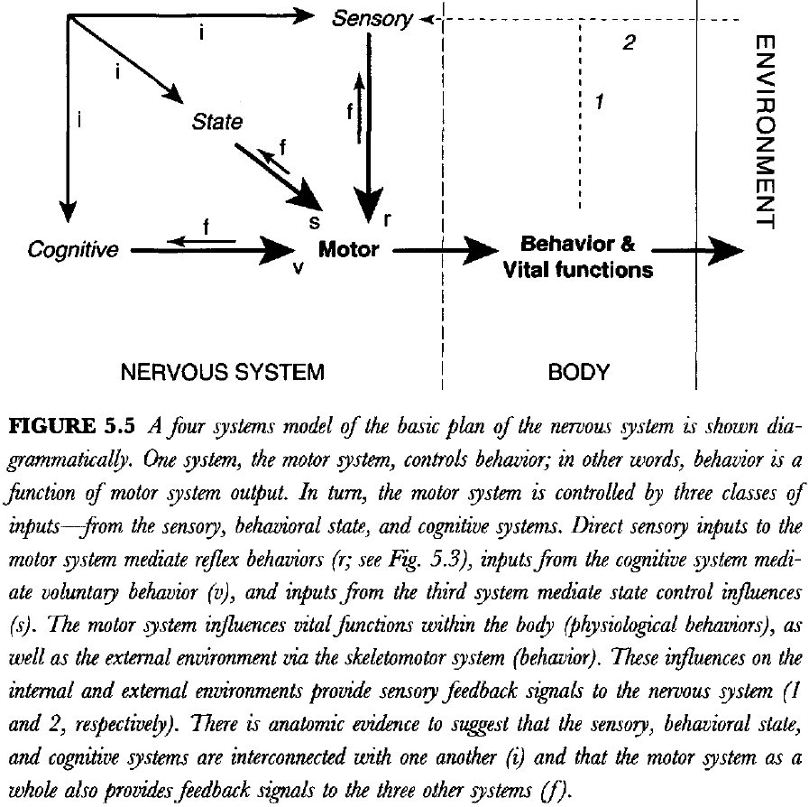
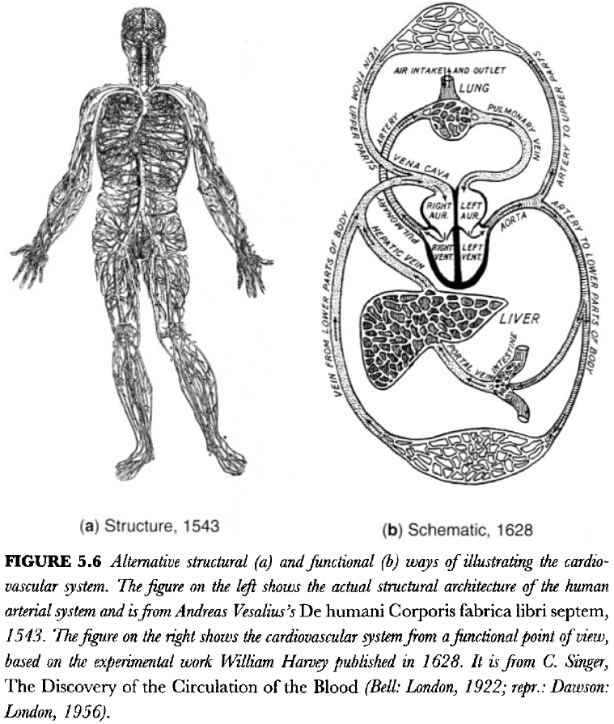
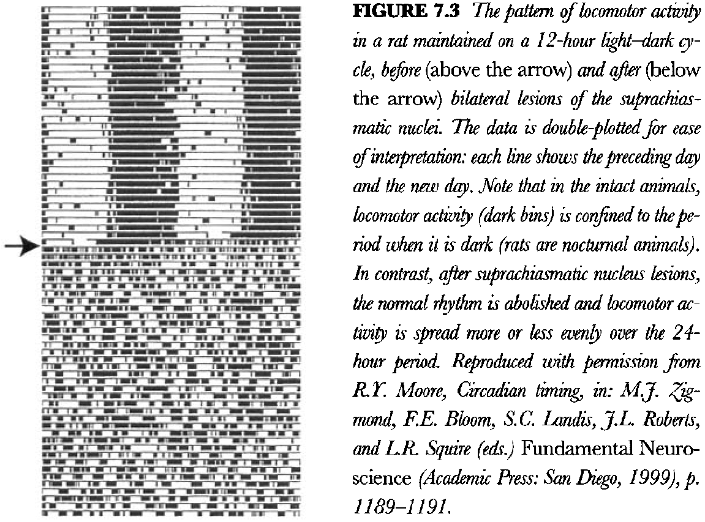
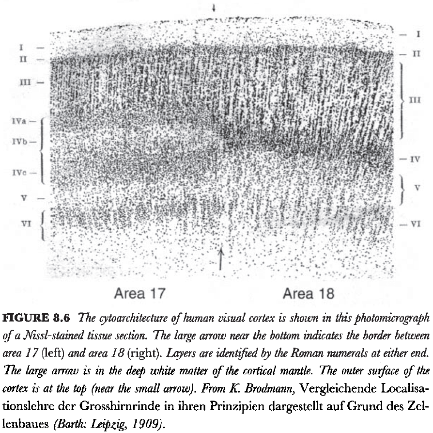
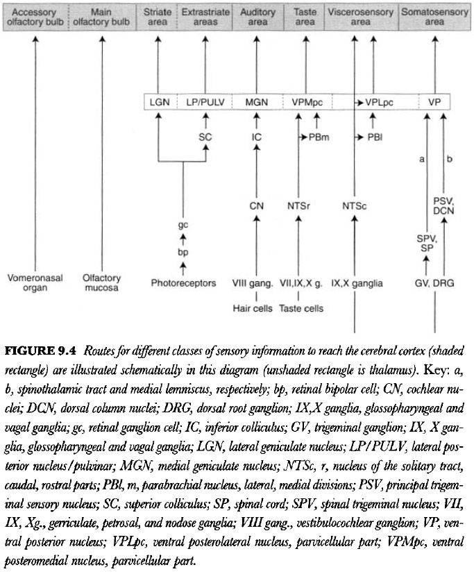

<blockquote class="blockquote">
  
What we know is a drop, what we don't know is an ocean.

  
Netflix Dark / Isaac Newton

</blockquote>

## Chapter 1: How the Brain Works: Structure and Function

- There are many ways to think about how the brain works; from mathematical models, philosophy, chemistry, physiology, etc.
- Yet one thing remains common to all of them: the physical brain itself.
- This book is an attempt to distill the general principles that have stood the test of time.
- History has shown that structure and function are simply two sides of the same coin, as both are intertwined and dependent on each other.
- The explanation of any motivated behavior requires explaining how the entire nervous system is arranged and works as a whole.
- Three neuroscience pioneers
    - Santiago Ramon y Cajal (discovery of neuron)
    - Charles Sherrington (discovery of reflexes)
    - Ivan Pavlov (discovery of learned/conditioned responses)
- Their laboratory work established fundamentally new principles with exceptionally broad implications for how the nervous system is organized and used.
- No one has presented a coherent theory or model of the brain’s functional organization.
- E.g. There’s nothing equivalent to the periodic table, relativity, evolution, or the standard model of particles that explains a large body of information about brain structure and function.
- We can only assume that these new principles will emerge from what we already know about the brain, which is actually quite a lot.
- If biology has taught us anything, it’s that we can only understand the structure and function of the brain by considering them within the larger context of the structure and function of the body.
- The basic organization of the nervous system reflects the basic organization of the body.

## Chapter 2: The Simplest Nervous System: Neurons, Nerve Nets and Behavior

- One issue with trying to study simpler nervous systems (earlier in the evolutionary chain) is that soft tissues aren’t preserved in fossils.
- Neuronal cell types are defined by their connections within neural circuits or networks.
- Three fundamental classes of behavior
    - Ingestive
    - Defensive
    - Reproductive
- Survival of an individual requires the first two, while survival of the species requires the last.
- Receptors that show adaptation (decrease/increase to a particular stimulus) on repeated exposure to a stimulus demonstrate learning.
- In other words, they show that behavior is altered by past experience.
- The simplest multicellular animals, sponges, evolved different cell types to divide labor, which increased efficiency for specific tasks such as nutrition and defense.
- Sponges don’t have neurons but they have a primitive equivalent called independent effectors.
- Independent effectors are like general neurons in that they can both sense and cause motor activity.
- Independent effectors, when compared to neurons, have low sensitivity, slow activation, and prolonged activity when stimulated directly.

- Jellyfish, corals, sea anemones, and hydra are among the simplest animals with a nervous system.
- Sensory neurons illustrate two principles.
    - The first principle is the neuron law/doctrine, which states that the nervous system is made up of cells and not by a continuous tissue.
    - The second principle is functional polarity, which states that information can only flow in one direction in a neuron, from dendrites to axon.
- The combined and sequential electrical then chemical transmission of information is common to all nervous systems from hydra to human.
- In fact, basic cellular neurophysiology is similar from hydra to human.
- What’s changed dramatically throughout evolution is the arrangement of the three fundamental neuron types into more and more highly organized systems of networks.
- Adaptive advantages provided by neurons
    - Sensitivity
    - Speed
    - Amplification
    - Coordination
- Why separate sensory and motor neurons?
- To add a division of labor that lets the body regulate both cell types independently.
- In principle, the potential for more regulation provides the potential for more complex behavior.
- One sensory neuron can innervate multiple motor neurons and motor neurons can interact with each other through horizontal connections.
- The best criteria to classify a neuron is to see what connections it makes.
- What does it innervate, and thus influence? What does it do?
- Interneurons can be subdivided into two classes
    - *Local*: axon that connects within the region or cell group that generates it.
    - *Projection*: axon that connects with another region or cell group.
- Adding another neuron type, interneurons, adds more variety which increases the sophisticated organization of neural circuity and thus behavior.
- Interneurons provide two additional features that are critical for nervous system function
    - Excitatory/inhibitory switching
    - Pattern generation
- An inhibitory interneuron acts as a switch from excitation to inhibition in neural circuity.
- Many sensory, motor, and interneurons appear to display spontaneous neural activity, so that, if left alone, they’re almost always capable of producing a pattern of electrical impulses.
- Quite to the contrary, the nervous system is spontaneously active and its activity is simply modulated, and not controlled entirely, by external stimulation.
- What has evolved dramatically is the complexity of nervous system organization, not its individual units/neurons.

## Chapter 3: Centralization and Symmetry: Ganglia and Nerves

- *Centralization*: the concentration of neurons within the body.
- Reasons for centralization
    - More efficient use of biological material in the construction of neural circuits.
    - Shorter distances to accomplish topologically similar circuit connections.
    - Shorter conduction times for electrical impulses.
- Evolution is accompanied by a change from the homogeneous to the heterogeneous, and from the simple to the complex.
- As neural elements condense and centralize during the course of evolution, they tend to form two broad classes of structure
    - *Ganglia*: collection of neuronal cell bodies.
    - *Nerves*: bundles of axons.
- It’s within the ganglia and central nervous system that most synapses between neurons occur.
- In all invertebrates except the Cnidaria, most inter and motor neurons are unipolar.
- This is in stark contrast to vertebrates where most intern and motor neurons are multipolar.
- Before delving into the vertebrate nervous system, we should reflect on the lessons from simpler organisms
    - Even unicellular organisms display three classes of sophisticated behavior: ingestive, defensive, and reproductive.
    - These three classes of behavior don’t require a nervous system as seen in primitive multicellular animals.
    - The addition of the neuron cell type allows for even more sophisticated behaviors.
    - The evolution of bilateral symmetry in animals is associated with localization of the nervous system and segmentation of the nervous system and the rest of the body.

## Chapter 4: The Basic Vertebrate Plan: Nervous System Topology

- Given that our skeleton is similar to other animals, such as birds, maybe all of the great systems of the body, including the nervous system, share a fundamental architecture.
- In the end, humans are really just a specialized vertebrate, and the organization of our nervous system is simply a reflection of how the rest of our body is specialized relative to other vertebrate classes and species.
- Review of embryonic development and nervous system development.
- *Baer’s law*: in vertebrate embryogenesis, the general develops before the specific.
- Experimental fate mapping has led to a general understanding of how the major divisions of the CNS are represented in the neural plate and early neural tube.

## Chapter 5: Brain and Behavior: A Four Systems Network Model

- Over the centuries, there’s been an obvious tendency to describe brain function in terms of the dominant technology of the time period.
- E.g. Hydraulic systems and clocks to machines to telephone switchboards and now computers.
- A recurring theme in the history of the brain is the functional localization in the nervous system; that distinct parts of the brain are localized to different functions.
- Two fundamental observations in the spine
    - Motor neurons have two inputs: reflex inputs from sensory neurons and voluntary inputs from cerebral cortical neurons.
    - Sensory neurons have two outputs: reflex outputs to motor neurons and outputs to the brain for influencing voluntary responses.
- We propose that the nervous system controls behavior by the motor system, which is modulated by coordinated inputs from three systems
    - Cognitive for voluntary control
    - Sensory for reflex control
    - Intrinsic for behavioral state control

- Behavior is a function of the motor system.
- Future behavior is influenced by past experience.
- We use feedback from behavior to remember what we’ve done and to plan what we’re going to do.
- The relationship between the basic systems plan (function) and the basic topographical plan (structure) isn’t clear and is very complicated.

## Chapter 6: The Motor System: Coordinating External and Internal Behaviors

- This chapter introduces the basic organization of the motor system and its divisions.
- We can divide bodily functions into two main categories
    - *Somatic*: deals with the external world such as the musculoskeletal system.
    - *Visceral*: deals with the internal world such as digestion, the cardiovascular system, and reproduction.
- Three types of motor systems
    - Somatic/Voluntary
    - Autonomic/Nonvoluntary
    - Neuroendocrine
- Most visceral organs receive a dual innervation by the autonomic system, with one division stimulating function and the other division inhibiting function.
- We know that the motor system generates constantly changing patterns of activity that require more or less coordination between the hundreds of muscles on each side of the body.
- This is also known as a central pattern generator (CPG).
- Experimental evidence indicates that the motor system can be viewed as a hierarchical network of CPGs, initiators, and controllers.
- When a muscle relaxes, it’s because there’s less excitation and not because there’s active inhibition.
- There’s a CPG for regulating antagonistic muscles at each joint in the arm and each sequence of flexion along the joints in the arm.
- In other words, we have a series of primary/first-order CPGs that are regulated by second-order CPGs.
- We know that humans and animals with completely severed spinal cords can still display coordinated locomotor behavior when the limbs are placed on a moving treadmill.
- This fact indicates that the locomotor pattern generator is located entirely within the spinal cord, which can be activated by sensory information from nerves in the feet.
- CPGs can not only be activated by sensory reflex input, but also by input from the brain such as the midbrain locomotor region.
- The midbrain locomotor region is a central pattern initiator and is controlled by regions of the forebrain.
- We think this is a valid model because animals without a forebrain don’t show spontaneous locomotor behavior.
- We are faced with even more complexity at the highest levels of the motor system hierarchy, as the central pattern controllers are also hierarchically organized.
- As we move up the motor system hierarchy, explanations become more and more vague and the neural networks become more complex.
- The opposing actions of the sympathetic and parasympathetic systems play a critical role in maintaining homeostasis.
- Review of the neuroendocrine system and the master gland (pituitary gland).
- In mammals, the cerebellum is a conspicuous mass that’s attached to the lower brainstem by three pairs of thick fiber bundles called the cerebellar peduncles.
- The cerebellum promotes the coordination and fine control of movement by influencing the output of brain motor and cognitive systems.
- To begin, the cerebellum has two basic parts: the cortex and the deep nuclei.
- The cerebellar cortex is a sheet with three layers
    - Granule cell (deep)
    - Purkinje cell (middle)
    - Molecular (superficial)
- In many animals, the area of this sheet has been greatly increased by a process of corrugation, which leads to many folds in the sheet.
- The circuitry of the cerebellum is quite interesting.

- There are two functionally and structurally distinct types of input to the cerebellum: mossy fibers and climbing fibers, both of which use excitatory neurotransmitters.
- The output of the cerebellum is generated by the deep nuclei, which are excited by collaterals of both mossy and climbing fibers.
- The climbing and mossy fibers provide excitatory inputs to the cerebellar cortex, which, in turn, sends an inhibitory projection to the deep nuclei (via Purkinje cells).
- So, the flow of information to the deep nuclei can be modified by a delayed inhibitory feed forward signals from the cortex.
- This provides a beautiful model for stating the importance that timing can have on the function of neural networks.
- The basic idea is that the deep neurons and Purkinje neurons compare the activity of the mossy and climbing fibers.
- In other words, this circuit can implement classical conditioning.
- The basic memory of a very simple Pavlovian learned response is formed by changing synaptic strength in the deep cerebellar nuclei.
- The core of the motor system is organized in a hierarchical way, but the neuroanatomical networks/circuits remains only vaguely known.

## Chapter 7: The Behavioral State System: Intrinsic Control of Sleep and Wakefulness

- There must be a convincing explanation for why we sleep, because sleep-like behavior is found in all vertebrates and even in many invertebrates such as insects.
- The sleep-wake cycle is the primary organizer of behavior.
- Review of the different stages of sleep (REM, non-REM), circadian rhythms)
- Our biological circadian clock is implemented in the suprachiasmatic nucleus (SCN).
- Under the condition of constant light, the circadian rhythm begins to drift in a predictable way.
- The retina has direct neural input to the SCN which provides it with information about environmental luminosity.
- If the SCN is damaged, animals immediately lose their usual sleep-wake cycle and instead revert to alternating periods of sleep and wake that last for an hour or so.
- There’s still a sleep-wake cycle but its periodicity is much shorter.

- In fact, it seems that this is the natural period for the sleep-wake cycle and that the SCN somehow imposes a roughly 24-hour period on it by converting a 1-hour rhythm to a 24-hour rhythm.
- Also, this leads to a complete reorganization of the animal’s behavior.
- E.g. Eating and drinking in lesioned animals is distributed evenly across the 24-hour period instead of being concentrated in the continuous 12-hour period that the intact animal is awake.
- Like sleeping, reproduction also has a cycle to maximize the production and survival of offspring.
- Lesions of the SCN also abolish the normal reproductive cycle, just as they abolish the normal sleep-wake cycle.
- Experimental evidence points to the rostral regions of the pontine reticular formation as the fundamental sleep-wake generator.
- Furthermore, this same general region is responsible for the generation of REM sleep.
- It’s interesting to note that the sleep-wake cycles in animals with SCN lesions are about an hour long, which is almost the same periodicity as the REM-deep sleep cycles.
- This hints at the existence in the pons of a fundamental behavioral state rhythm generator with a period of about 90-120 minutes, which mediates both the underlying sleep-wake cycle and the REM-deep sleep cycle.
- Review of diffuse neurotransmitter systems.

## Chapter 8: The Cognitive System: Thinking and Voluntary Control of Behavior

- The cerebral cortex is the crowning glory of evolution and it’s responsible for thinking.
- E.g. Quadriplegics and people born without a cerebellum can think just fine.
- Extensive damage to the cerebral cortex profoundly interferes with cognition.
- The cerebral cortex is the organ of thought.
- Can the organ of thought ever understand itself?
- Although debated throughout history, the principle of cortical localization has stood the test of time and evidence. And while the principle may not be true in its strongest form, there’s no doubt of its existence.
- During development, the mammalian cerebral cortex balloons out and eventually becomes corrugated/folded, increasing its surface area.
- The cortical map is general divided into three types of areas
    - Motor areas
    - Unimodal sensory areas
    - Association areas
- Two types of connections in the cortex
    - *Association*: connections within a hemisphere.
    - *Commissural*: connections between hemispheres.
- Three main commissures
    - Anterior commissure
    - Corpus callosum
    - Hippocampal commissure
- One of the best examples of different lamination patterns in the isocortex (neocortex) is the border between areas 17 and 18, the primary visual and unimodal visual association areas.

- In area 18, layer 4 and relatively uniform but in area 17, layer 4 is clearly split into three sublayers.
- There are also more subtle differences between the various primary sensory cortical areas.
- One difference is the thickness of each cortical area and it can be assumed that these differences are somehow responsible for the qualitative differences between visual and auditory sensations.
- It’s reasonable to assume that all neurons fall into two broad classes
    - Pyramidal neurons that have long projections.
    - Stellate neurons that have local circuit connections.
- In the isocortex, there are very few neurons in layer 1, layers 2 and 3 are characterized by relatively small pyramidal neurons, layer 4 consists almost entirely of local circuit cells, and layers 5 and 6 are characterized by larger pyramidal neurons.
- The smallest pyramidal neurons tend to be localized to layer 2 and generally make projections to other cortical areas within the same hemisphere.
- Layer 3 pyramidal neurons tend to be somewhat larger and typically generate commissural projections to the opposite hemisphere and association projections to the same hemisphere.
- The largest pyramidal neurons are found in layers 5 and 6, and they’re responsible for generating most of the descending cortical projections to the brainstem and spinal cord.
- This organization suggests that the lamination patterns of the cerebral cortex are due to the different distributions of pyramidal neurons.
- Three super layers of the isocortex
    - Supragranular
    - Granular
    - Infragranular
- Layer 4 is characterized by a dense input from the thalamus and much of its output is directed towards the supragranular layers.
- The supragranular layers generate the immensely complex network of connections between cortical areas and also provides a major input to the infragranular layers.
- The infragranular layers have large pyramidal neurons and generate most of the output of the cerebral cortex.
- According to this scheme, the infragranular layers execute the cognitive computations elaborated in the supragranular layers.
- In the infragranular layers, there seems to be three classes of pyramidal neurons.
- One class dominates layer 6 and projects to the thalamus, another class dominates in superficial layer 5 and has inputs to the striatal component of cerebral nuclei. The last class dominates in deep layer 5 and projects to the brainstem and spinal cord.
- Is there a basic minimal circuit that can be applied to all/most parts of the cerebral hemispheres?
- It’s now known that most of the isocortex generates a topographically organized projection to the entire striatum using layer 5.

## Chapter 9: The Sensory System: Inputs from the Environment and the Body

- From an introspective point of view, you’re conscious of the fact that stimuli detected by the eye and ear produce two entirely different sensory modalities.
- Most sensory neurons in humans and mammals are variations on bipolar and pseudo-unipolar ganglion cells.
- While we could analyze the motor system in terms of a hierarchical organization, the sensory system is different.
- Each of the pathways associated with various sensory modality remains separate and parallel.

- There’s a fundamental plan of the mammalian nervous system, and the nervous system in each species is a quantitative variation on that theme.
- We start with olfaction since it’s the simplest.
- The olfactory bulb projects massively to the posteromedial cortical nucleus of the amygdala (cortical area), the medial amygdalar nucleus (striatum), and to the principal nucleus of the stria terminalis).
- So, the olfactory system participants in the classic triple-descending projection to the motor system from the cerebral cortex, the striatum, and the pallidum.
- Each sensory modality has its own differentiation.
- Evidence suggests that pain is perceived in regions of cortex that includes either the prefrontal regions and/or the rostral half of the insular region.
- People with lesions in these general regions report that they can feel that they’re being pinched/poked, but that it doesn’t hurt.
- Evidence suggests that the regions involved in pleasure are the pathways between the prefrontal-insular cortex and the ventral cerebral nuclei.
- Taken together, current evidence suggests that the perception of pain and pleasure is elaborated in a band of cerebral cortex that includes the medial prefrontal region and caudally adjacent parts of the insular region.
- Neural activity in the band of prefrontal-insular cortex can be influenced either by sensory inputs or by inputs from association cortical areas.
- Thus, affective experience may be evoked either by sensory inputs or by activity in association cortex, such as during thinking or dreaming.

## Chapter 10: Modifiability: Learning, Stress, Cycles, and Damage Repair

- The brain is constantly changing due to influences from the internal and external environment, and because of genetic factors.
- Two levels of brain organization
    - *Macrocircuitry*: the species level of organization.
    - *Microcircuitry*: the individual level of organization.
- Review of habituation, sensitization, classical conditioning, reinforcement learning, and LTP.
- LTP is accompanied by changes in the shape of synapses, but also changes in the number of synapses.
- A good empirical definition of stress is any stimulus that causes the secretion of ACTH from the pituitary gland, and thus the release of glucocorticoid steroid hormones.
- There’s a basic difference between damage repair in the peripheral and in the central nervous systems.
- Regeneration is more successful the closer to the cut is to the periphery.
- However, lesions, destruction, or death of neurons in the CNS rarely leads to any significant regeneration.
- It’s known that damaged neurons in the brain attempt to regrow their axons, but they don’t grow very far due to glial cells secreting factors that inhibit the growth of axons.

## Chapter 11: Gene Networks: Relationship to Neural Networks

- Another way to look at the function of the nervous system is in terms of chemical and genetic levels.
- There’s probably no relationship between functional systems in the brain and global patterns of gene expression.
- E.g. Acetylcholine is expressed in many parts of the body but those parts don’t belong to the same functional system.
