<blockquote class="blockquote">
  
We've always defined ourselves by the ability to overcome the impossible. And we count these moments. These moments when we dare to aim higher, to break barriers, to reach for the stars, to make the unknown known. We count these moments as our proudest achievements. But we lost all that. Or perhaps we've just forgotten that we are still pioneers. And we've barely begun. And that our greatest accomplishments cannot be behind us, because our destiny lies above us.

  
Cooper in the movie "Interstellar"

</blockquote>

# Part I: Background and Methods

## Chapter 1: A Brief History of Cognitive Neuroscience

- Big questions
    - What evidence suggests that the brain’s activities produce the mind?
    - What can we learn about the mind and brain from modern research methods?
- Cognition: the process of knowing.
- The brain is a product of evolution and is made up of living cells.
- Evolutionary perspective
    - Why might this behavior have been selected for?
    - How could it have promoted survival and reproduction?
    - What would a hunter-gatherer do?
- The evolutionary perspective helps us gain insight on why the brain is the way that it is.
- Dualism: the belief that the mind appears from elsewhere and isn’t the result of the brain.
- Cognitive neuroscience disagrees with dualism and believes that the conscious mind is a product of the brain’s physical activity and isn’t separate from it.
- Evidence for this view comes from studying patients with brain lesions.
- Localizationism: the belief that certain parts of the brain are responsible for certain functions.
- Aggregate field theory: the belief that the whole brain participates in behavior.
- Aggregate field theory fell out of favor to the localizationist view.
- Since different brain regions perform different functions, it follows that they ought to look different at the cellular level.
- Indeed, it’s the case that different brain areas do represent functionally distinct brain regions.
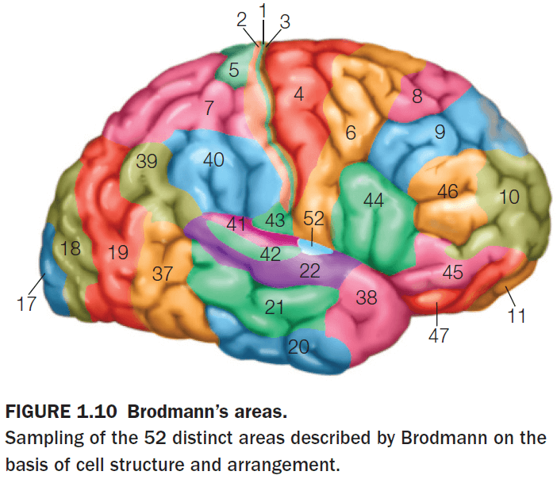
- Neuron doctrine: the concept that the nervous system is made up of individual cells called neurons.
- Neurons only transmit electrical information in one direction, from dendrites to axons.
- Knowledge of the parts must be understood together with the whole.
- Introduction to behaviorism and the cognitive revolution.
- Chomsky showed how the sequential predictability of speech follows from adherence to grammatical, not probabilistic rules.
- E.g. When children are exposed to a finite set of word orders, they can come up with a sentence and word order that they’ve never heard before. They didn’t make new sentences using associations from previous word orders.
- Associationism: that any response followed by a reward would be maintained, and that associations were the basis of how the mind learned.
- Associationism can’t explain how children learn language.
- The complexity of language was built into the brain, and it runs on rules and principles that transcend all people and all languages.
- Language is innate and is universal.
- Introduction to EEG, CT, PET, MRI, fMRI, and BOLD.
- Blood flow is directly related to brain function as evident by Seymour Kety’s experiments.
- Can we study how the mind works without studying the brain?
    - In some ways, yes.
    - E.g. That short-term memory can only store seven items, give or take two, in memory without invoking any neural explanation.
    - However, this would be like studying computer software without understanding computer hardware. Software is implemented on hardware and is subject to hardware’s limitations.

## Chapter 2: Structure and Function of the Nervous System

- Big questions
    - What are the elementary building blocks of the brain?
    - How is information coded and transmitted in the brain?
    - What are the organizing principles of the brain?
    - What does the brain’s structure tell us about its function and the behavior it supports?
- The goal of cognitive neuroscience is to understand how the 89 billion neurons of the human brain enable us to
    - Walk
    - Talk
    - Imagine the unimaginable
- Since all theories of how the brain enables the mind must mesh with the actual nuts and bolts of the nervous system, we start with the nuts and bolts: neurons.
- The nervous system is made up of two main classes of cells
    - Neurons
    - Glial
- Neuron: the basic signalling unit that transmits information throughout the nervous system.
- Neurons take in information, make a decision about it following some simple rules, and then passes on the signal to other neurons or muscles.
- Neurons vary in their form, location, and interconnectivity and these variations are closely related to their function.
- Glial cells provide structural support, electrical insulation, and modulate neuronal activity.
- Introduction to astrocytes, blood-brain barrier, myelin, and neurons.
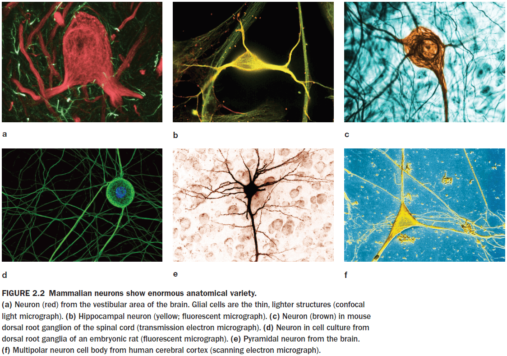
- The main ions for neurons are: potassium, sodium, chloride, and calcium.
- Some axons branch to form axon collaterals that can transmit signals to more than one cell.
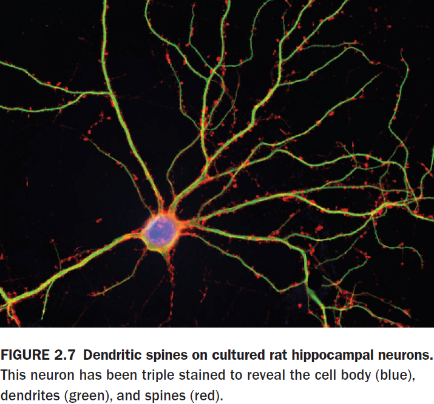
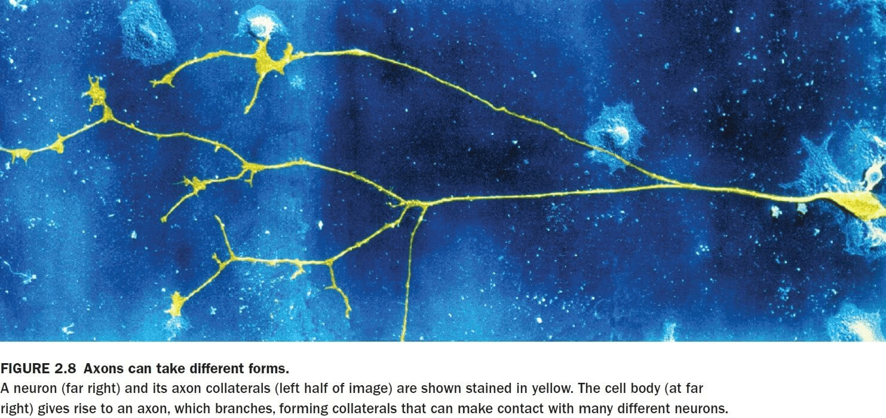
- Introduction to chemical and electrical synapses, presynaptic and postsynaptic label, resting membrane potential, and ion channels and pumps.
- The neuronal membrane is more permeable to potassium ions than sodium ions because there are more potassium channels than any other type of ion channel.
- Unlike most cells in the body, neurons are excitable meaning that their membrane permeability can change.
- Membrane permeability can change because membranes have ion channels that can change their permeability for a particular ion.
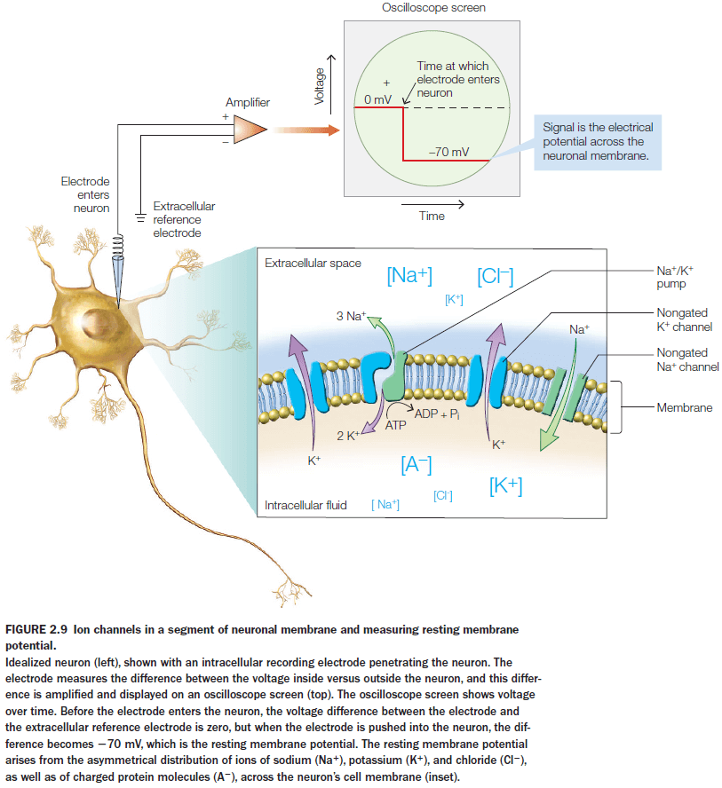
- The small electrical current produced by an EPSP is passively conducted through the cytoplasm of the dendrite, cell body, and axon.
- Passive current conduction diminishes with distance due to leakage and has a maximum travel distance of about 1 mm.
- This is a problem for signals traveling over long distances such as from the brain to your toes.
- So how does the neuron solve this problem of diminishing current over long distances?
- Neurons evolved a clever mechanism to regenerate and pass along the signal received at synapses on the dendrite. The mechanism is the action potential.
- Action potential (AP): a rapid depolarization and repolarization of a small region of the membrane caused by the opening and closing of ion channels.
- APs enable signals to travel for meters with no loss in signal strength because they’re continually regenerated at each patch of membrane on the axon.
- APs are able to regenerate themselves because of voltage-gated ion channels.
- Since APs always have the same amplitude, they’re said to be all-or-none phenomena.
- The strength of an AP doesn’t communicate anything about the strength of the stimulus that initiated it.
- The intensity of a stimulus is communicated by the rate of firing of APs.
- E.g. More pressure on a patch of skin is communicated by faster AP firing.
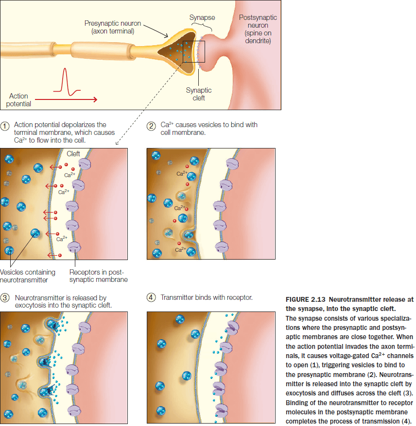
- The effect of a neurotransmitter on the postsynaptic neuron is determined by the postsynaptic receptor’s properties rather than by the transmitter itself.
- Synapses are the locations where one neuron can transfer information to another neuron or a specialized nonneuronal cell.
- Synapses are also sites of information processing.
- Introduction to CNS, PNS, somatic and autonomic motor system, sympathetic and parasympathetic branches of the autonomic system, CSF, and spinal cord.
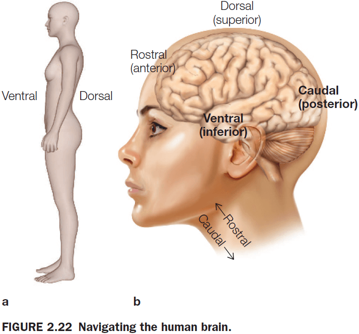
- The primary purpose of increased blood flow isn’t to increase the delivery of oxygen and glucose to the brain, but rather to quicken the removal of metabolic by-products from the increased neuronal activity.
- Introduction to the brainstem, thalamus and hypothalamus, cerebrum, and cerebral cortex.
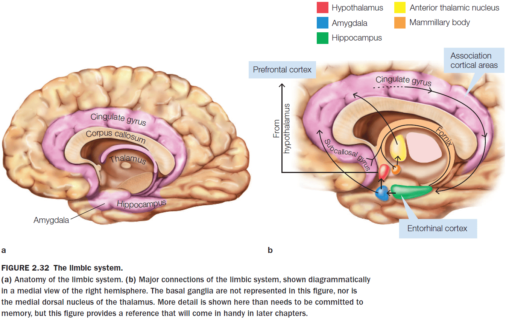
- The cerebral cortex has a total surface area of about 2200 to 2400 $$cm^2$$ but because of the extensive folding, about two thirds of it is folded into the depths of the sulci.
- Unfortunately, the nomenclature of the cortex isn’t fully standardized. A region may be referred to by its Brodmann name, a cytoarchitectonic name, a gross anatomical name, or a functional name.
- E.g. Primary visual cortex = Brodmann area 17 = striate cortex = calcarine cortex = V1.
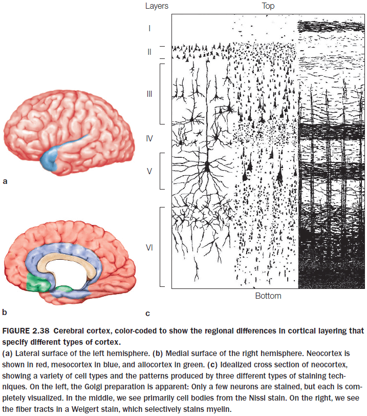
- The cortex has generally been subdivided into five principle functional subtypes
    1. Primary sensory areas
    2. Primary motor areas
    3. Unimodal association areas
    4. Multimodal association areas
    5. Paralimbic and limbic areas
- Somatotopy: the mapping of specific parts of the body to specific areas of the somatosensory cortex.
- Somatotopic maps aren’t set in stone and don’t have distinct borders.
- Topographic maps are a common feature of the nervous system and the area dedicated to a body part isn’t representative of the actual body part’s size.
- The area’s size is more representative of the body part’s sensitivity/usefulness.
- Visual association cortex can be activated during mental imagery when we call up a visual memory, even in the absence of visual stimulation.
- Multimodal association cortex contains cells that may be activated by more than one sensory modality.
- As brains increases in size, long-distance connectivity decreases.
- The number of neurons that an average neuron connects to doesn’t change with increasing brain size. The absolute number of connections per neuron is the same.
- So to decrease long-distance connectivity while maintaining an absolute number of connections, human brains have developed a small-world architecture.
- Small-world architecture: a structure that combines many short, fast local connections with a few long-distance connections to communicate the results of local processing.
- As primate brains increased in size, their overall connectivity patterns changed, resulting in anatomical and functional changes.
- Very few neurons are generated after birth in primates as most of the neurons are generated prenatally during the middle third of gestation.
- The cortex is built from the inside out.
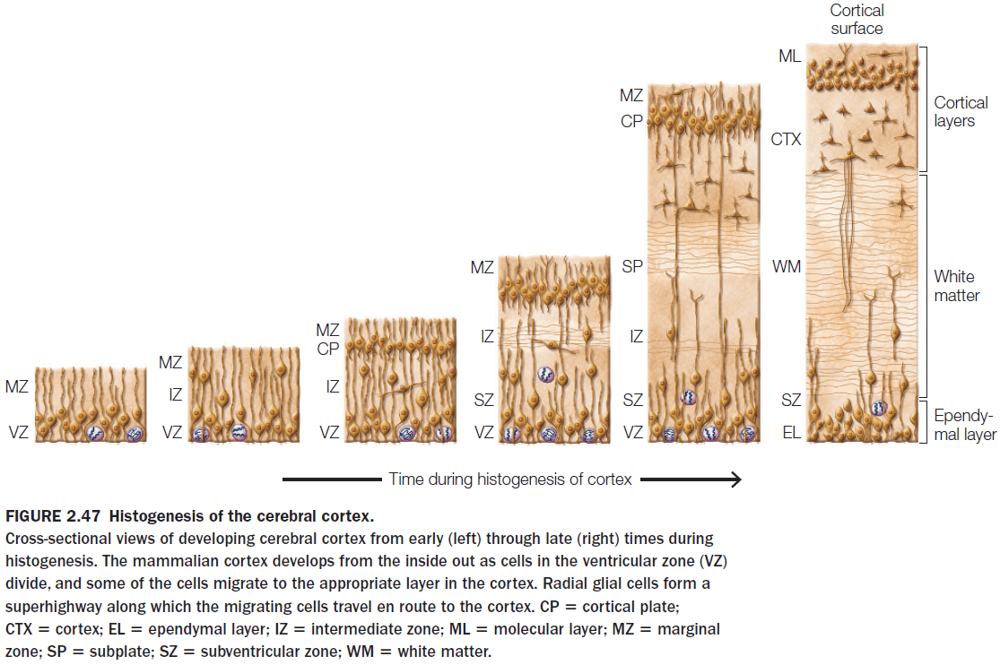
- Neurogenesis: the creation of neurons.
- What determines the type of neuron that a migrating cell becomes?
- The timing of neurogenesis or when a neuron is created.
- E.g. Fetal alcohol syndrome disrupts neuronal migration resulting in a disorder cortex, leading to cognitive, emotional, and physical disabilities.
- Although the brain nearly quadruples in size from birth to adulthood, the number of neurons doesn’t increase.
- What does increase is the number of synapses, the growth of dendritic trees, and both the myelination and proliferation of glial cells.
- Synaptogenesis: the creation of synapses.
- Synaptogenesis is followed by synapse pruning, which continues for more than a decade.
- E.g. Initially, in the primary visual cortex, there’s an overlap between the projections of the two eyes onto neurons. After synaptic pruning, the cortical inputs from the two eyes are nearly completely segregated forming ocular dominance columns.
- There’s also compelling evidence suggesting that different brain regions reach maturity at different times.
- Neurogenesis was once thought to have not occurred in the adult human brain but this isn’t true.
- Neurogenesis in adult humans has now been well established in the hippocampus and the olfactory bulb, but we are unsure if it occurs elsewhere in the human brain.
- Evidence of this comes from terminally ill cancer patients who took a substance that marks cell division. The substance was used to track the division of cancer cells but it’s also useful in tracking the division of new neurons.
- The marker showed up in the subventricular zone of the caudate nucleus and in the granular cell layer of the dentate gyrus of the hippocampus.
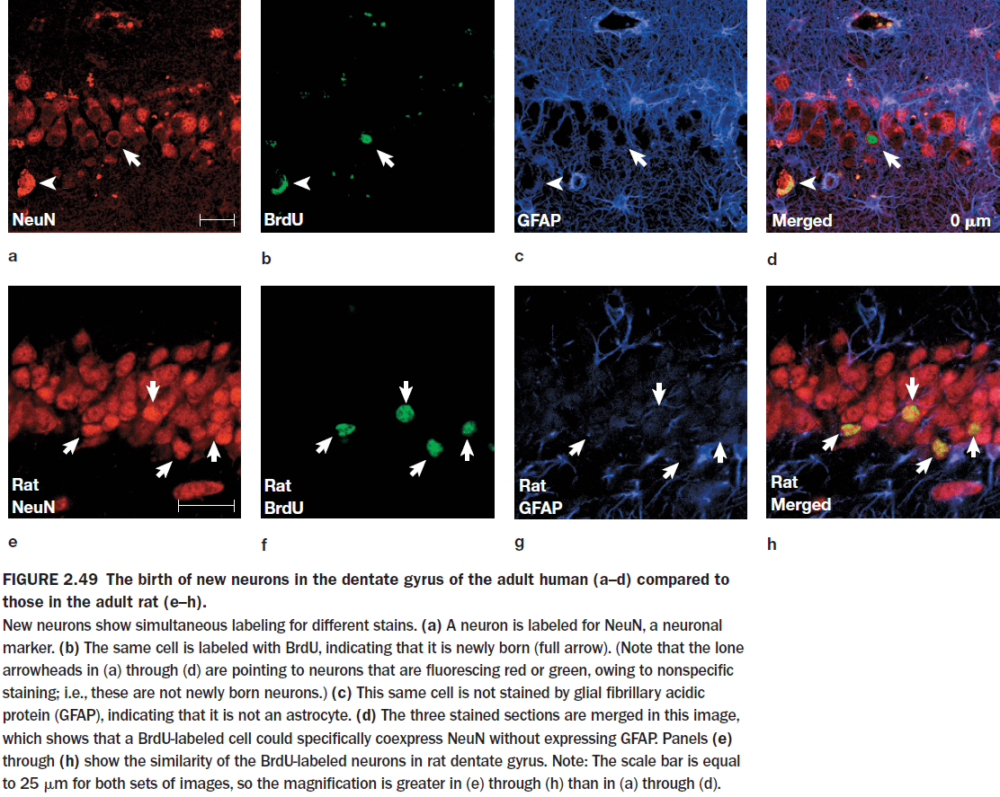

## Chapter 3: Methods of Cognitive Neuroscience

- Big questions
    - Why is cognitive neuroscience an interdisciplinary field?
- The most fundamental tool for all scientists: the scientific method.
- Steps of the scientific method
    1. Observation
    2. Hypothesis
    3. Prediction
    4. Experiment
    5. Repeat
- There’s an asymmetry in the scientific method as results from an experiment can only prove that a hypothesis is false, not that a hypothesis is true.
- This is also known as falsifiability or the ability to be proven false.
- Cognitive psychology: the study of mental activity as a information-processing problem.
- A basic assumption in cognitive psychology is that we don’t directly perceive and act in the world, but rather our perceptions, thoughts, and actions depend on the internal representations obtained by our sense organs.
- Cognitive psychology is also trying to uncover the secrets of how information is processed in the brain.
- E.g. It’s surprisingly easy to read the right-side passage.

|Randomize all letters|Randomize all letter except the first and last letter|
|---|---|
| ocacdrngi ot a sehrerearc ta macbriegd ineyurvtis, ti edost’n rtt aem ni awth rreod eht tlteser ni a rwdorea, eht ylon pirmtoatn gihtn si att h het rift s nda satltt elre eb ta het ghitr clepa. eht srte anc eb a otltasesm dan ouy anc itlls arde ti owtuthi moprbel. ihstsi cebusea eth nuamh nidm sedo otn arde yrvee telrte yb stifl e, tub eth rdow sa a lohew. | Aoccdrnig to a rseheearcr at Cmabrigde Uinervtisy,it deosn’t mttaer in waht oredr the ltteers in a wrodare, the olny iprmoatnt tihng is taht the frist and lsatltteer be at the rghit pclae. The rset can be a totalmses and you can sitll raed it wouthit porbelm. Tihsis bcuseae the huamn mnid deos not raed ervey lteterby istlef, but the wrod as a wlohe. |

- As long as the first and last letters of each word are in the correct position, we can accurately infer the word given the context.
- Two key concepts of cognition
    - Information processing depends on mental representations.
    - Mental representations undergo internal transformations.
- Context helps choose which representational format is most useful.
- E.g. To show a ball rolling down a hill, it’s more useful to show a visual/pictorial representation than a physics/math representation.
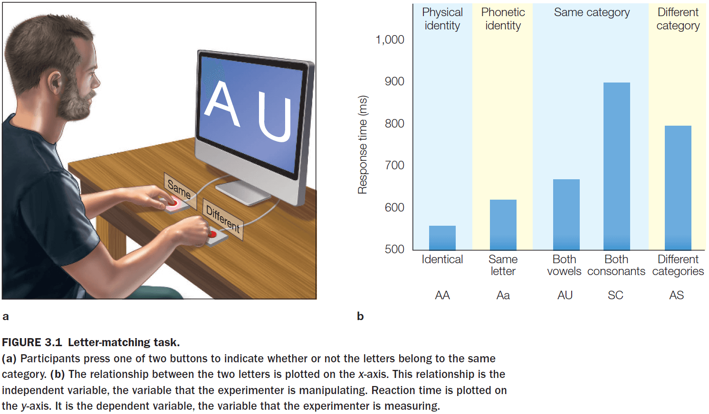
- The letter-matching task shows that the mind creates multiple representations of the same (and in this case, simple) stimuli.
- A letter can be represented physically, phonetically, and categorically (either a vowel or consonant).
- The different response latencies reflect the degrees of processing required to perform the letter-matching task.
- By using this logic, we infer that physical representations are activated first, phonetic representations next, and category representations last.
- Transforming internal representations depends on your
    - Memory
    - Attention
- E.g. The smell of pizza might remind one person of Italy while it reminds another person of NYC. Processing the internal representation of “pizza” differs in each person due to their memory.
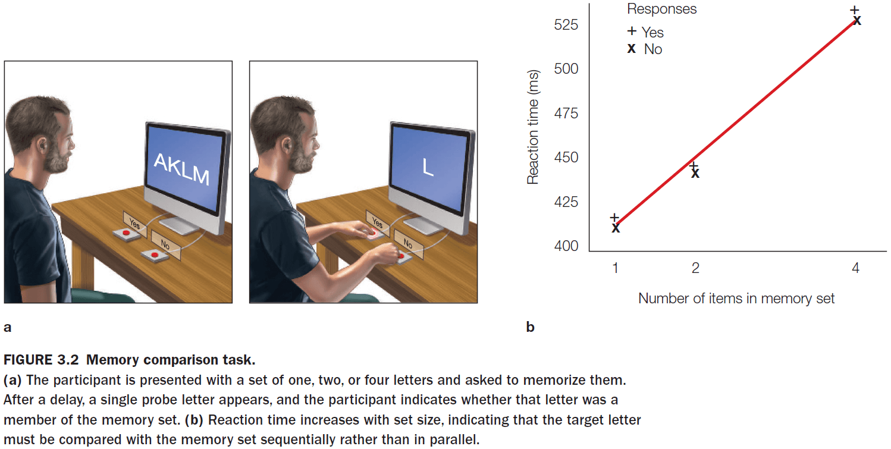
- The memory comparison task shows that the comparison process in recognition memory is serial. Recognizing an item in a larger memory set requires more time.
- While this task shows that memory recognition is serial, the word superiority effect shows that the mind also has parallel processes.

- The word superiority effect shows that we have parallel processes because we activate both representations of each letter and of the entire word in parallel.
- This parallel processing enables us to perform better on the task because both representations can provide information as to whether the target letter is present.
- Another piece of evidence of parallel processing is the Stroop task.
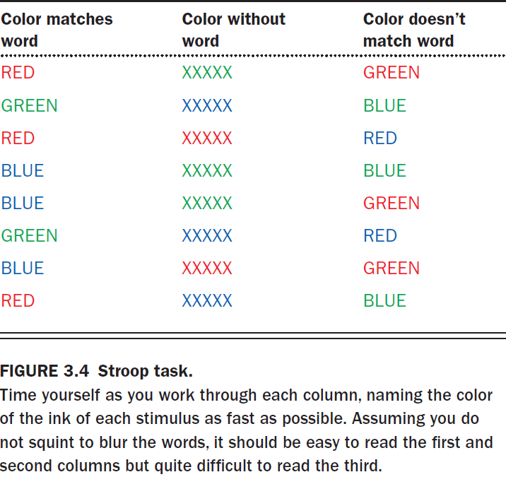
- The mind activates multiple representations for each word
    - Word representation
    - Color representation
- When the representations don’t match, it’s more difficult to read the words as evident by the increased time to finish reading the list.
- Another way to uncover information about the brain and mind is through studying the damaged brain.
- Ways the brain can be damaged
    - Vascular/blood disorders
    - Tumors
    - Degenerative and infectious disorders
    - Traumatic Brain Injury
    - Epilepsy
- The brain uses 20% of the oxygen we breathe but only accounts for 2% of our total body mass.
- The vascular system is fairly consistent between individuals, thus a stroke of a particular artery typically leads to destruction of tissue in a consistent anatomical location.
- For brain tumors, the first concern is its location, not whether it’s benign or malignant, because the tumor may be close to critical brain structures such as the brain stem.
- Single dissociation: damage to one brain area affects one task but not another.
- E.g. Damage to Broca’s area affects speech but not comprehension.
- Double dissociation: damage to area X impairs the ability to do task A but not task B, and damage to area Y impairs the ability to do task B but not task A.
- Double dissociations show that two areas have complementary processing.
- E.g. Damage to Broca’s area affects speech and damage to Wernicke’s area affects comprehension.
- Double dissociations offer the strongest neuropsychological evidence that a brain area is responsible for a specific task.
- Associating neural structures with specific processing operations calls for appropriate control conditions.
- E.g. Comparing healthy people to patients with brain damage.
- We must also be weary that missing parts may not be directly causing a function/task.
- E.g. Cutting the spark plug wires and cutting the gas line both stop a car from running, but this doesn’t mean they have the same function.
- Lesion may also result in the development of compensatory processes.
- E.g. Depriving monkeys of sensory feedback in one arm causes them to stop using that arm. However, if the other arm is also deprived, the monkey goes back to using both.
- Methods to perturb neural function
    - Pharmacology
    - Genetic manipulations
    - Invasive stimulation (electrical)
    - Noninvasive stimulation (magnetic)
- These methods can be tested in both “on” and “off” states, enabling within-participant comparisons of performance.
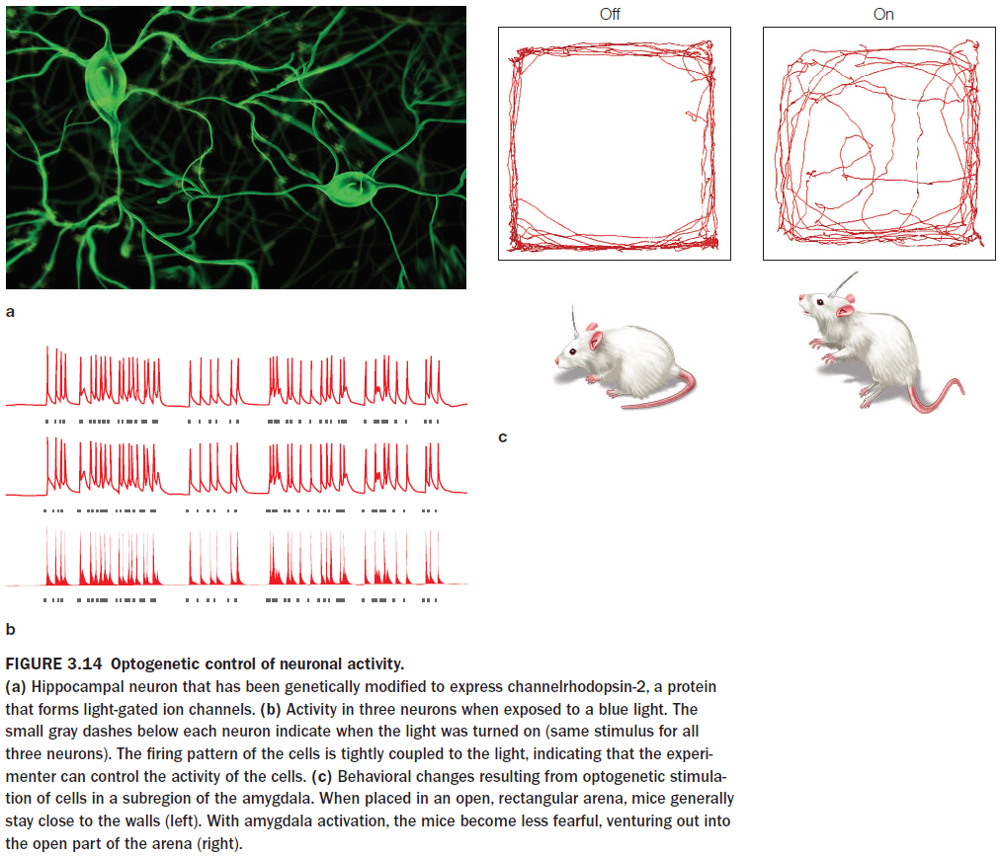
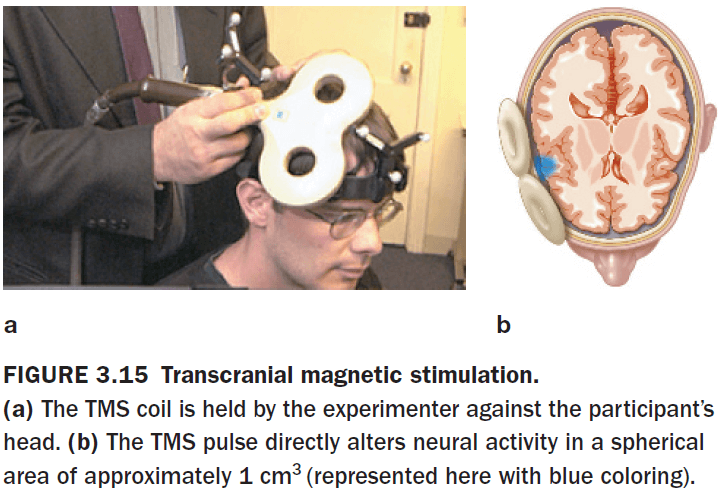
- When transcranial magnetic stimulation (TMS) is applied at a low frequency (1 Hz) over 10-15 minutes, cortical excitability decreases.
- When TMS is applied at higher frequencies (10 Hz), cortical excitability increases.
- Interestingly, when TMS is applied at very high frequencies (15 Hz), cortical activity is depressed in the targeted region for 45 to 60 minutes.
- When using TMS, participants are usually not aware of any stimulation effects.
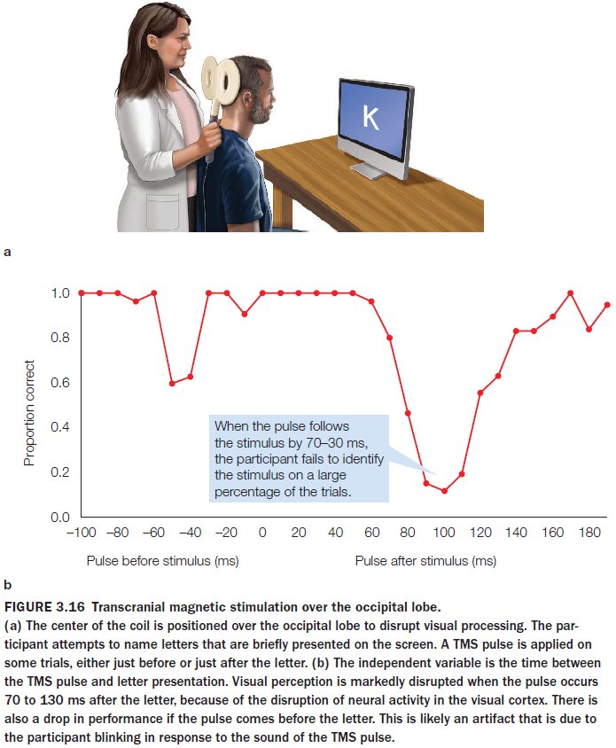
- Review of CT, MRI, DTI, single-cell recording, receptive fields, and topographic representations.
- Cell activity within a retinotopic map correlates with the location of the stimulus.
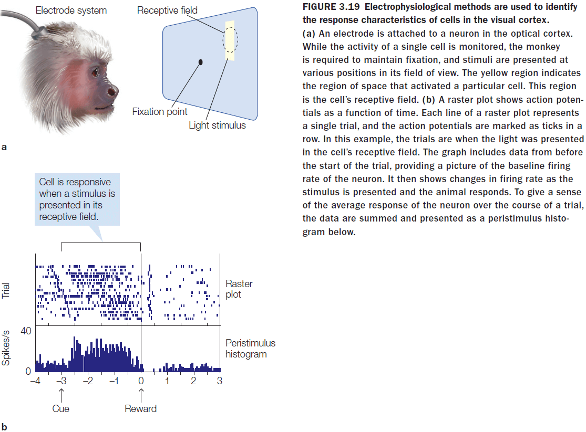
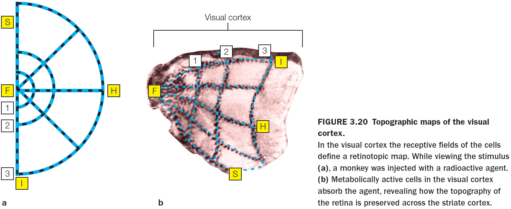
- Electrocorticography (ECoG): an invasive EEG performed directly on the surface of the brain.
- Frequency bands for EEG and ECoG
    - Delta (1-4 Hz)
    - Theta (4-8 Hz)
    - Alpha (7.5-12.5 Hz)
    - Beta (13-30 Hz)
    - Gamma (30-70 Hz)
    - High Gamma (> 70 Hz)
- Many years of research have shown that the power in these bands is an excellent indicator of the state of the brain.
- E.g. An increase in alpha power is associated with reduced states of attention and an increase in theta power is associated with engagement in a cognitively demanding task.
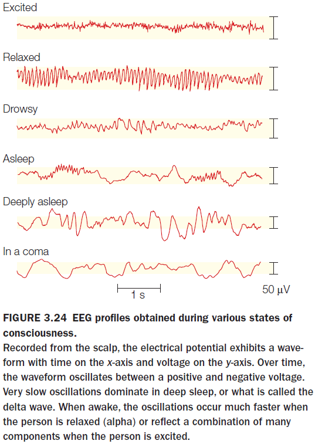
- Event-related potential (ERP): a tiny signal embedded in an EEG signal that’s triggered by a stimulus/movement.
- The amount of blood supplied to the brain varies only a bit when the brain is most active compared to when it’s resting.
- Since the input of resources remains roughly constant, the brain must distribute it’s resources differently depending on the need.
- When a brain area is more active, increasing the blood flow to that region provides it with more oxygen and glucose at the expense of other parts of the brain.
- Review of PET, fMRI, and MRS.
- Block design experiment: integrating neural activity over a block of time during which a participant performs multiple trials of the same type.
- Event-related design experiment: looking for an event across experimental trials.
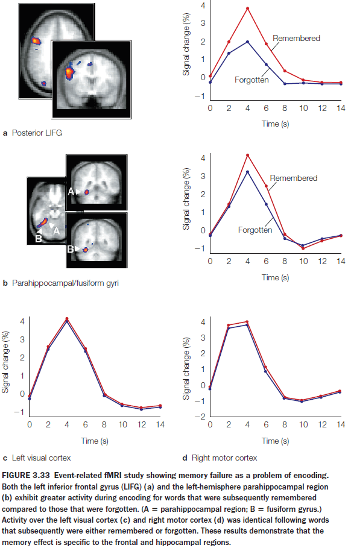
- Faster learning was associated with faster reduction in the correlation between two brain regions.
- The reason might be because the movement selection switches from being stimulus-driven to being internally-driven.
- An fMRI study showed that when participants kept their eyes closed, tactile object recognition led to pronounced activation of the visual cortex.
- This is unexpected because if the eyes are closed, we would expect the visual cortex to not be active due to no visual input.
- However, a follow-up study showed that if the visual cortex is temporarily stimulated through TMS, tactile object recognition becomes impaired.
- This suggests that the visual representations generated during tactile exploration were essential for inferring object shape from touch.
- This solves the Molyneux problem in that if you were born without sight and then gained it, you wouldn’t be able to identify objects by sight.

- The convergence of results obtained by using different methodologies frequently offers the most complete theories.

# Part II: Core Processes

## Chapter 4: Hemispheric Specialization

- Big questions
    - Why is the brain split into two hemispheres?
    - Do the differences in the anatomy of the two hemispheres explain their functional differences?
    - Why do split-brain patients generally feel unified and no different after surgery, even though their two hemispheres no longer communicate with each other?
    - Do separated hemispheres each have their own sense of self?
    - Which half of the brain decides what gets done and when?
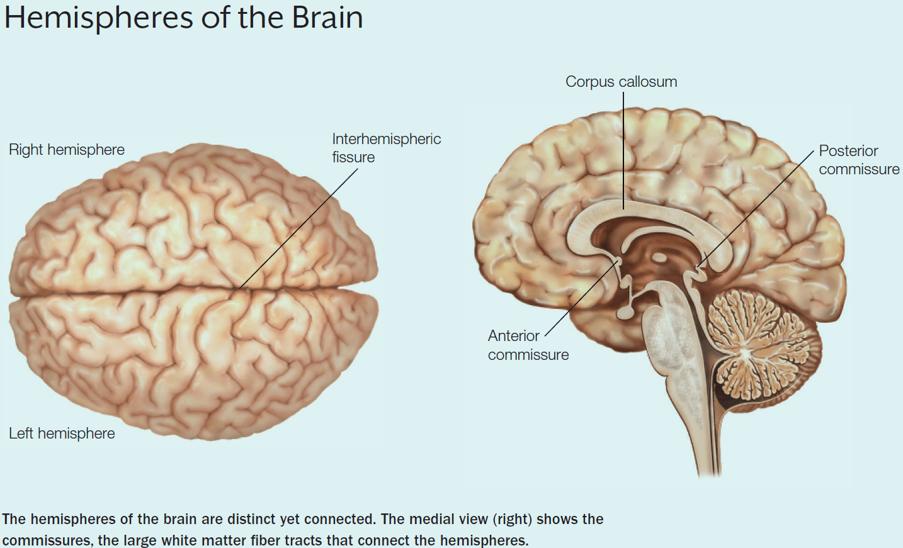
- In patient W.J., the corpus callosum was severed to treat his seizures. However, studies on cats, monkeys, and chimps with a severed corpus callosum had dramatically altered brain function afterwards.
- Puzzlingly, W.J. seemed to suffer no effects and only after extensive testing was it revealed that W.J.’s right hemisphere could do things that his left couldn’t do and vice versa.
- E.g. Objects presented to his left visual field couldn’t be named, since the language center of the brain is in the left hemisphere, but W.J. could move his left hand to say that he sees it.
- Anatomy wise, the two hemispheres appear to be symmetrical and to be of the same size and surface area.
- However, the two hemispheres are offset with the right protruding in front and the left protruding in back.
- The right is chubbier in the frontal region and the left is chubbier in the posterior region.
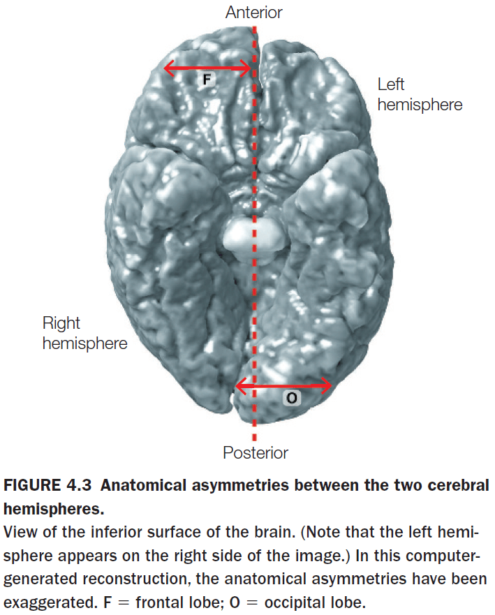
- The most studied hemisphere specialization is language.
- Language appears to be left-hemisphere dominant.
- The left and right cerebral hemispheres are connected by three structures
    - Corpus callosum (CC)
    - Anterior commissure
    - Posterior commissure
- As with the other parts of the brain, the CC maintains a topographic organization.
- Within the corpus callosum, there are two types of connections
    - Homotopic: connections that go to a same region in the other hemisphere.
    - Heterotopic: connections that go to a different region in the other hemisphere.
- Almost all of the visual information processed in the parietal, occipital, and temporal cortices is transferred to the opposite hemisphere through the posterior third of the CC.
- Motor and supplementary motor information is transferred through the middle third of the CC.
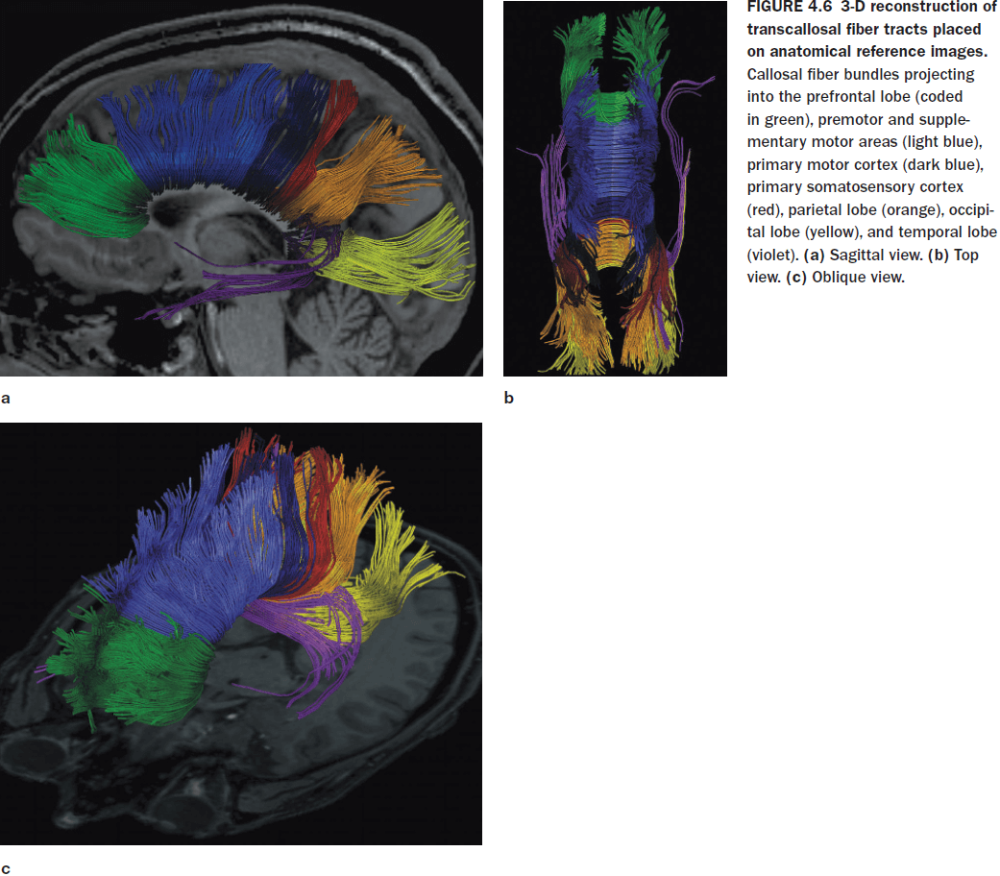
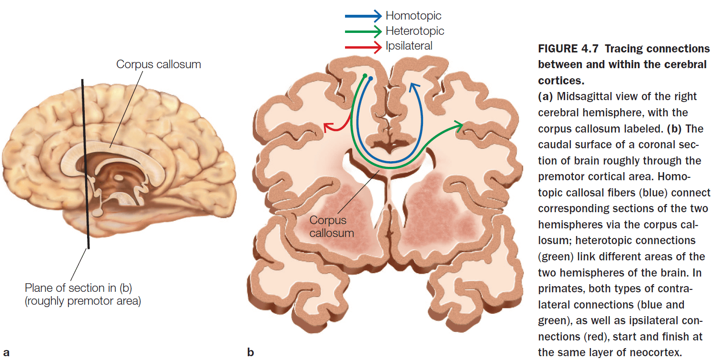
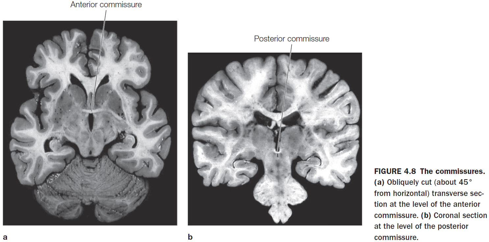
- The anterior commissure connects the two amygdalae and the posterior commissure contributes to the pupillary light reflex.
- The CC is the primary communication highway between the two hemispheres.
- Potential functions of the CC
    - Enable information from both visual fields to contribute to receptive fields.
    - Facilitate processing by pooling diverse inputs.
    - Provide a means for each hemisphere to compete for control of current processing.
- In adults, the callosal connections are scaled-down version of what is found in children.
- The refinement of connections is a hallmark of callosal development.
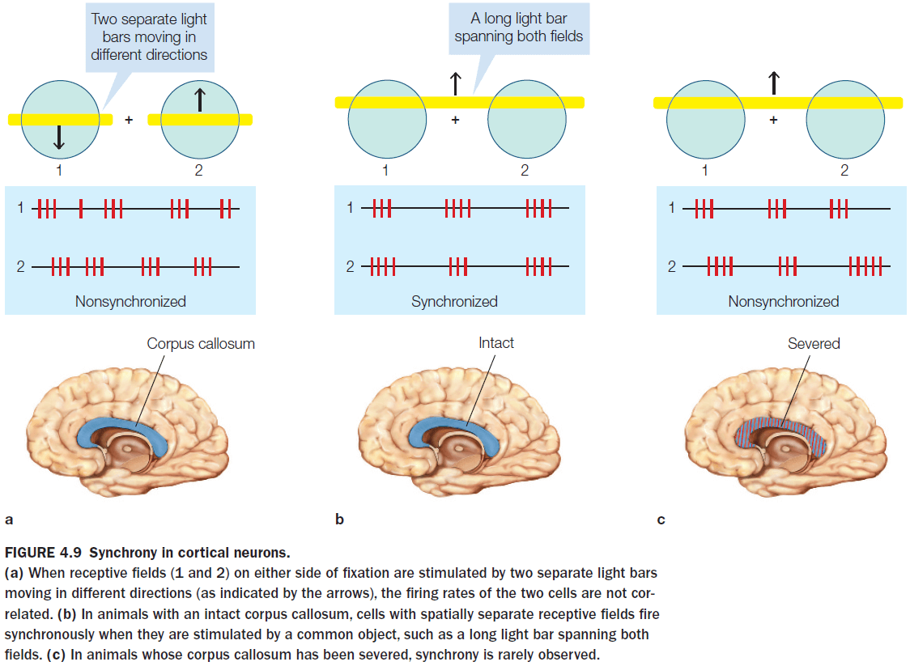
- Methodological issues when evaluating split-brain patients
    - The patients undergoing callosotomy already have abnormal brains due to seizures so they aren’t representative of normal brains.
    - Some older callosotomies didn’t completely cut the CC since it was difficult to verify without MRI.
    - Experiments have to be designed to eliminate cross-cuing (when one hemisphere cues the other hemisphere through its behavior).
- Cross-cuing behavior is sometimes obvious, such as one hand nudging the other, and sometimes it’s subtle, such as a facial muscle contraction or an eye movement.
- Cross-cuing isn’t intentional and is a way for the brain to communicate through means other than the CC.
- The anatomy of the optic nerve allows visual information to be presented uniquely to one hemisphere or the other in split-brain patients. This isn’t the case for auditory or olfactory information.
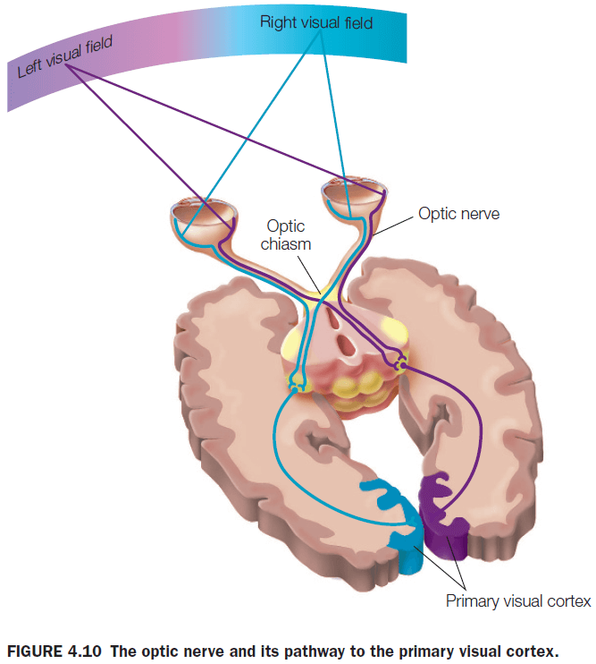
- Functional consequences of the split-brain procedure
    - Visual and tactile information presented to one half of the brain isn’t available to the other half.
        - E.g. Patients can only name objects placed in their right hand and not the left hand.
    - Confirms our knowledge that the left hemisphere is dominant for language, speech, and major problem solving and the right hemisphere is dominant for visuospatial tasks.
    - No major changes in cognitive function.
    - Patients can’t name or describe visual and tactile stimuli presented to the right hemisphere because the sensory information is disconnected from the left hemisphere.
    - However, patients can still use nonverbal responses, such as left hand pointing, when information is presented to the right hemisphere.
- Sometimes, surgeons only split part of the CC because they don’t want to split the entire CC if splitting only a part of it solves the epilepsy.
- This provides us with information on which parts of the CC are responsible for which function.
- Splitting the posterior half of the CC severely disrupts the transfer of visual, tactile, and auditory sensory information but retains the ability to transfer higher-order information.
- E.g. Patient J.W. was shown the word “sun” to their left hemisphere and a black-and-white drawing of a traffic light to their right hemisphere. When asked what they saw, J.W. correctly saw the word “sun” and couldn’t identify the traffic light drawing. However, J.W. could recognize that the drawing had to do with cars and recognized that it involved colors. In the end, J.W. correctly inferred that the drawing was of a traffic light.
- Closer examination revealed that the left hemisphere was receiving higher order cues about the stimulus without having access to the sensory information about the stimulus itself.
- The anterior part of the CC transfers semantic information about the stimulus but not the stimulus itself.
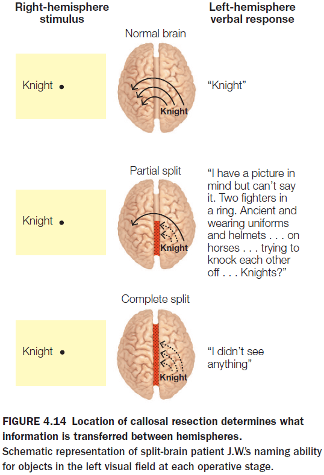
- When attempting to understand the neural bases of language, it’s useful to distinguish between grammatical and lexical function.
- Grammar: the rule-based system for ordering words to help communication.
- E.g. In English, the typical order of a sentence is subject-action-object.
- Lexicon: the mind’s dictionary.
- E.g. The word “dog” is associated with a dog but so is “Hund”, “kutya”, and “cane”.
- This distinction is more apparent when trying to learn a new language and it’s predicted that grammar is more localized and discrete whereas the lexicon’s location is more elusive and more difficult to damage completely.
- Language and speech are rarely present in both hemispheres; they are in either one or the other.
- However, both hemispheres show the word superiority effect where English readers are better able to identify letters in real words than the same letter in pseudowords.
- The reasoning is because pseudowords don’t have lexical entries so letters in their strings don’t receive the additional processing benefit bestowed on words.
- There appear to be two lexicons, one in each hemisphere, and they’re both organized and accessed differently.
- While the left hemisphere is dominant for most language capabilities, the right hemisphere appears to handle the emotional content, or emotional prosody, of language.
- The left hemisphere is biased toward recognizing one’s own face, while the right hemisphere is biased towards recognizing familiar faces.
- Some type of spatial information is transferred and integrated between the two hemispheres, since both split-brain patients and normal patients can transfer their attention to either visual field.
- This suggests that the two hemispheres rely on a common orienting system to maintain a single focus of attention.
- Even in split-brain patients, they can’t divide their attention into two as the integrated spatial attention system remains intact following cortical disconnection.
- Each hemisphere uses the same available resources, but at different stages of processing.
- E.g. The left hemisphere is better at using color to search for an object but the right hemisphere is better at processing upright faces.
- In testing the brain’s local and global information processing, experiments show that the left hemisphere is better at representing local information and the right hemisphere is better with global information.
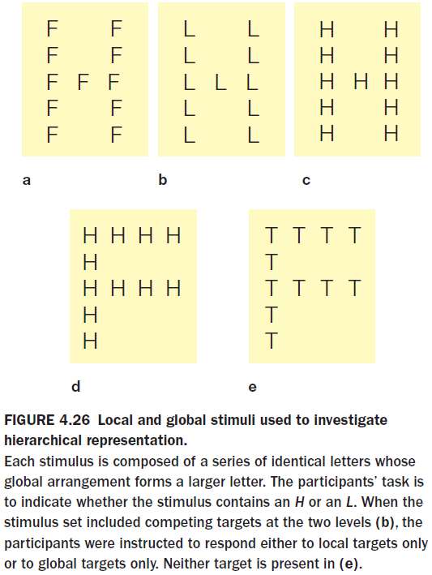
- Both hemispheres can abstract either level of representation, but they differ in how efficiently they handle each level.
- The right is better at the big picture, the left is more detail oriented.
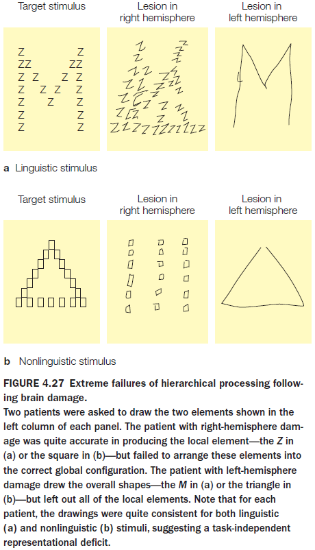
- Theory of mind: the ability to understand that other people have thoughts, beliefs, and desires.
- Several fMRI studies show that the critical component of the theory of mind, the attribution of beliefs to another person, is localized to the right hemisphere.
- This is shocking because this means that split-brain patients should talk as if they lack social and moral reasoning but they talk as if they are normal.
- The left hemisphere deals with speaking and without information about the theory of mind, the patient should speak without regarding other people.
- So why don’t split-brain patients act like severely autistic individuals?
- They actually do under experimental conditions. Split-brain patients answer immorally compared to normal patients but are shocked at their own answer.
- E.g. Suppose a friend accidentally poisons her family by mixing bleach and ammonia, should she be held morally responsible? Most people answer no because the friend intended no harm and had a false belief. Split-brain patients, however, answer yes because they judge the friend based on the results.
- Only the left hemisphere can trigger voluntary facial expressions, but both hemispheres can trigger involuntary expressions.
- A hallmark of human intelligence is our ability to make causal interpretations about the world.
- E.g. If the ground is wet and the sky is gray, what happened?
- In split-brain patients, their intelligence remains unchanged but this is only true for the speaking left hemisphere. The right hemisphere suffers from impoverished intellectual abilities and problem-solving skills.
- This impoverishment is due to the left hemisphere’s specialized ability to find causal inferences and interpretations, abilities the right hemisphere never had.
- We refer to this unique specialization of the left hemisphere as the interpreter.
- Experiments show that the speaking left hemisphere always offers some kind of rationalization to explain actions that were initiated by a motivation unknown to the left hemisphere.
- E.g. When split-brain patient P.S. was given a command to stand up but only to the right hemisphere, P.S. stood up. When the experimenter asked P.S. why he stood up, P.S. responded “Oh, I felt like getting a Coke.” If his CC was intact, P.S. would’ve responded that he stood up because he was told to do so.
- A constant finding in the testing of split-brain patients is that the left hemisphere never admits ignorance about the behavior of the right hemisphere. It always makes up a story to fit the behavior.
- The interpreter also will explain the mood caused by the experiences of the right hemisphere, not only its actions.
- Emotional states appear to be transferred subcortically so severing the CC doesn’t prevent emotional states from being transferred between the hemispheres.
- The left hemisphere is better at making inferences about semantic relationships and cause and effect, it doesn’t have a better memory or a better lexicon than the right hemisphere.
- This is shown in an experiment where participants guess which of two events would happen next. Event red appears 75% of the time and event green appears 25% of the time.
- There are two strategies to this experiment
    - Matching: matching your guesses to the frequency distribution of the events.
        - E.g. Guessing red 75% of the time and green 25% of the time.
    - Maximizing: guessing the event with the highest probability all of the time.
        - E.g. Guessing red 100% of the time.
- Non-human animals, such as rats and goldfish, maximize, while humans match.
- The result is that non-human animals perform better than humans on this task.
- Neural networks also fall prey to either strategy and may either guess the output training distribution or only guess one output.
- In split-brain patients, the left hemisphere uses the matching strategy while the right hemisphere uses the maximizing strategy.
- This furthers the case that the left hemisphere attempts to make inferences and to make complicated hypotheses about the task, while the right hemisphere approached the task in the simplest possible manner.
- While the left hemisphere has the ability to make causal inferences, the right hemisphere is better at judgments of causal perception.
- This causes problems, however, when no causal pattern exists and this is probably the cause of some cognitive biases.
- For the interpreter, facts are helpful but not necessary. It has to explain whatever is at hand and it uses the first explanation that makes sense.
- The interpreter is a powerful mechanism that makes investigators wonder how often our brains make spurious correlations as we attempt to explain our actions, emotional states, and moods.
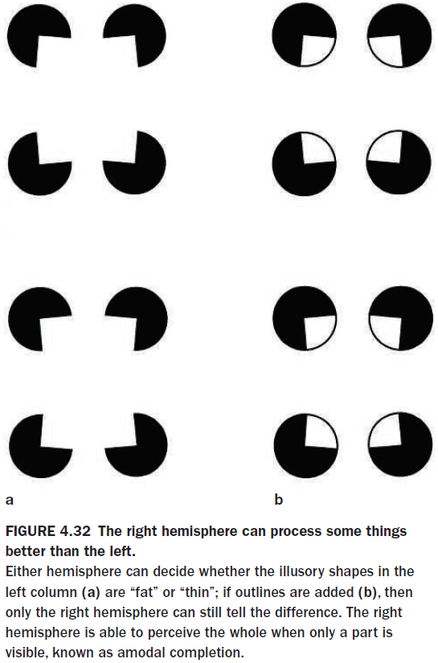
- Auditory pathways aren’t as strictly lateralized as visual pathways.
- The right-ear advantage effect is a bias seen in the dichotic listening task where participants consistently repeat words presented to the right ear.
- This matches the expectation that the left hemisphere is dominant for language.
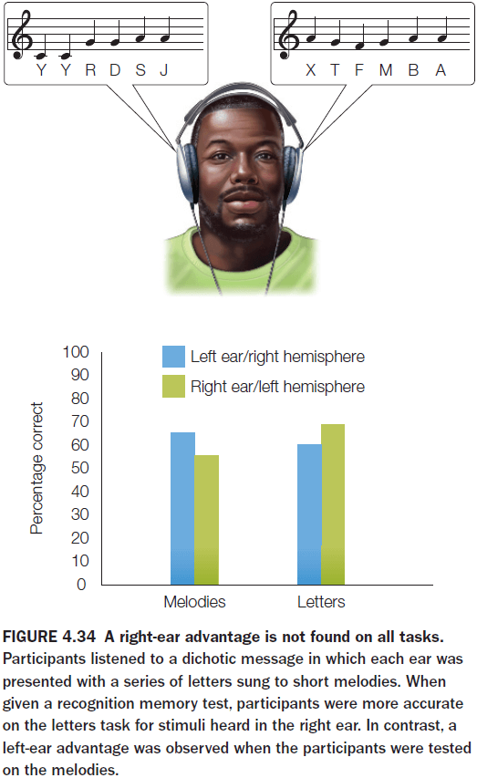
- There’s also the left-ear advantage effect where the left ear is biased towards melodies.
- Hemispheric specialization isn’t a unique human feature and is present in all vertebrates.
- E.g. Fruit flies, octopuses, bees, spiders, crabs.
- Interestingly, in birds, almost all of the optic fibers cross at the optic chiasm, probably reflecting the fact that there’s little overlap in the visual fields of birds due to lateral eye placement.
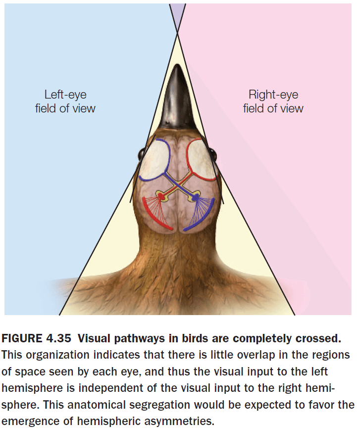
- Also, birds lack a CC which results in functional asymmetries.
- E.g. Song production is localized to the left hemisphere.
- Just as humans show handedness or the favoring of either the left/right hand, dogs and cats show pawedness.
- Our best evidence suggests that lateralization might have been facilitated by a lack of callosal connections.
- The resulting isolation would’ve promoted divergence among functional capabilities, resulting in cerebral specialization.
- Introduction to the idea that the brain uses a small-world architecture.
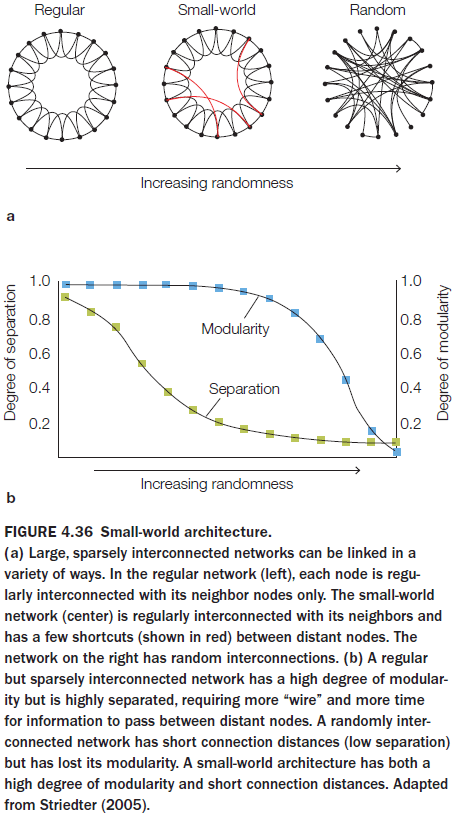
- Advantages of a modular brain
    - More energy efficient
    - Parallel processing
    - Increased robustness
    - More adaptable
- Modules emerge when there’s pressure to minimize wiring cost.
- Much of what we learn from clinical tests of hemispheric specialization tells us less about the computations performed by each hemisphere, and more about the tasks themselves.
- Each hemisphere has some competence in every cognitive domain, but the competence varies between them.

## Chapter 5: Sensation and Perception

- Big questions
    - How is information in the world carried by light, sound, smell, taste, touch, translated into neuronal signals by our sense organs?
    - How might neural plasticity in sensory cortex manifest itself?
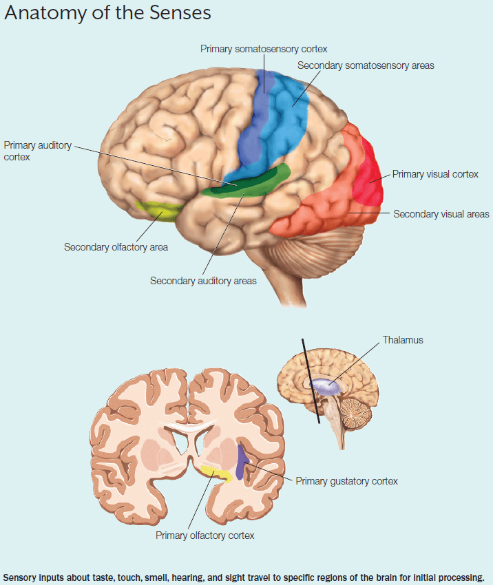
- Most of our perceptions and behaviors never reach our conscious awareness and those that do aren’t exact replicas of the stimulus.
- E.g. Optical illusion and the color magenta.
- Sensation: the initial activation of the nervous system for translating information about the environment into patterns of neural activity.
- Percept: the mental representation of the stimulus, accurate or not.
- Perception: the process of constructing the percept.
- Information from each sensory organ follows the same general pathway except for olfaction.
- The general pathway
    1. Specialized receptor cells
    2. Specific sensory nerve pathway
    3. Thalamus
    4. Primary sensory region
    5. Secondary sensory region
- Olfaction skips the thalamus and goes straight to the primary olfactory cortex.
- Shared receptor properties
    - Limited in range of stimuli captured affecting precision.
        - E.g. Our eyes can only see between 400-700 nm of the electromagnetic spectrum.
    - There’s a minimum intensity threshold.
    - Adapts as the environment changes.
        - The longer the stimulus continues, the less frequent the APs are.
        - E.g. Not feeling the clothes that you’re wearing.
- Acuity: how well we can distinguish among stimuli within a sensory modality.
- Perception is mainly concerned with changes in sensation.
- Many creatures can carry out exquisite perception without a cortex, so why do we have a cortex?
- The answer may be to support flexible behavior.
- At all levels of the sensory pathways, neural connections go in both direction.
- These feedback connections appear to provide a way for the cortex to control the flow of information from the sensory systems.
- Review of the neural pathways of olfaction.
- We don’t know how the activation of olfactory receptors leads to the perception of specific odors.
- The primary olfactory cortex habituates (adapts) quickly to new smells.
- Review of the neural pathways of gustation.
- The gustotopic map is maintained in the cortex with clusters found for bitter, sweet, umami, and salty.
- No sour cluster was found but it may be distributed over multiple pathways.
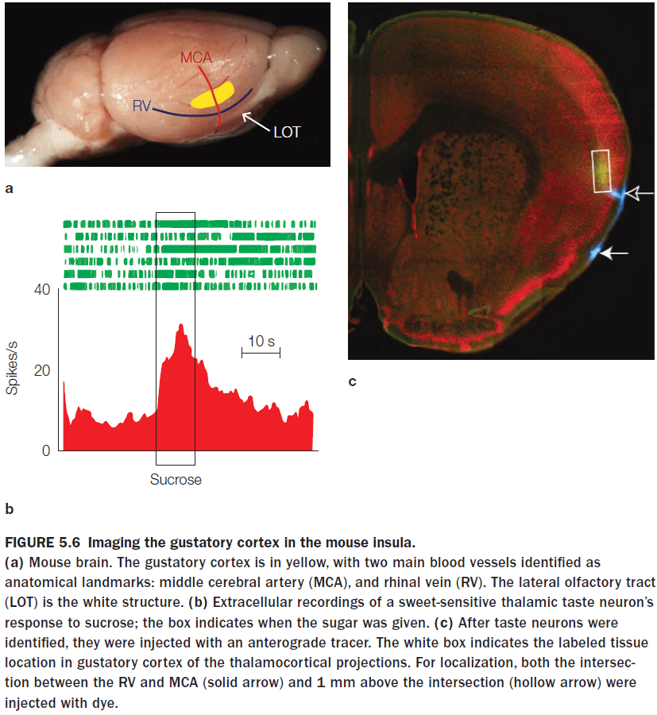
- Review of the neural pathways of somatosenation.
- There are two types of pain receptors: fast and slow.
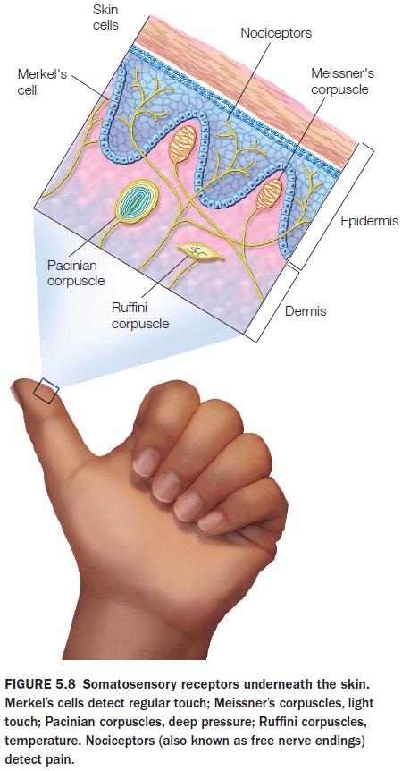
- The relative amount of cortical representation in the sensory homunculus corresponds to the relative importance of somatosensory information for that part of the body.
- Somatotopic maps show considerable variation across species but the general rule, that more important body parts have a larger cortical representation, still rules.
- E.g. Spider monkeys have a larger area for their tail and rats have a larger area for their whiskers.
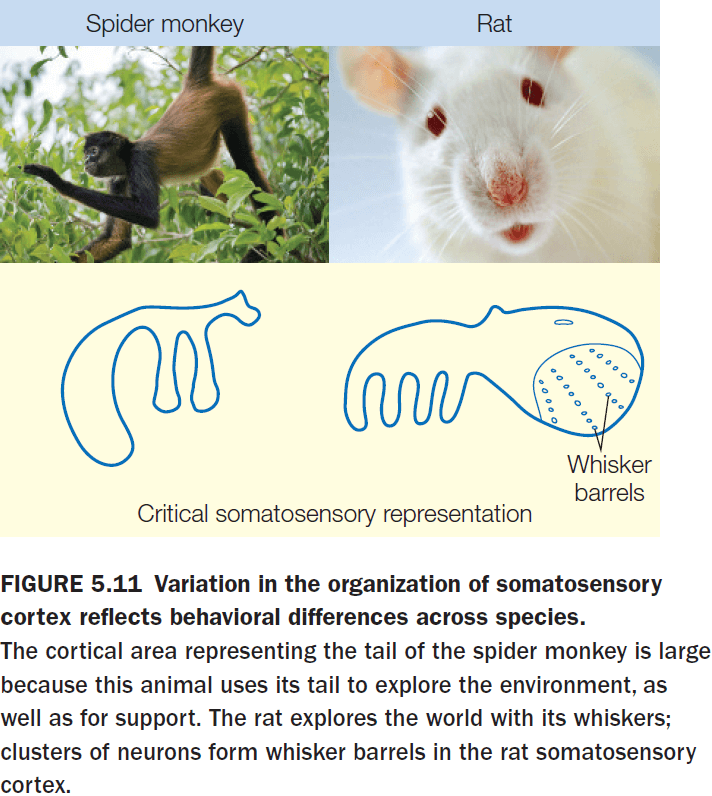
- Somatosensory representations exhibit plasticity, showing variation in extent and organization as a function of individual experience.
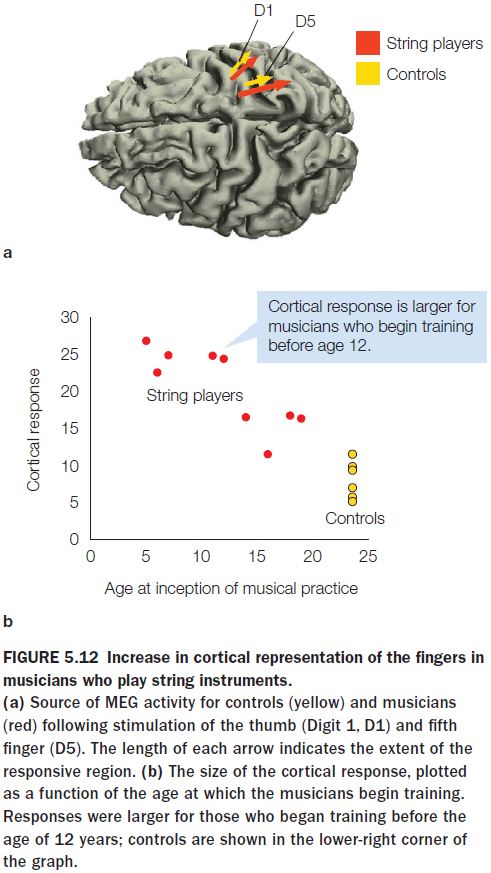
- Experiments on the phantom limb phenomenon and the rubber hand illusion suggest that the brain can integrate visual input and direct stimulation of the somatosensory cortex to create the multisensory illusion of ownership, challenging the idea that the human brain is stable in adulthood.
- Review of the neural pathways of audition.
- Early in the auditory system, in the cochlea, there’s already the processing of information in the form of a tonotopic map.
- Our auditory system is most sensitive to sounds in the 1-4 kHz range and this reflects the range of human communication.
- Other species also are sensitive to different frequencies which also reflects their communication.
- E.g. Elephants are sensitive to low-frequency sounds and mice are sensitive to high-frequency sounds.
- These species-specific differences likely reflect evolutionary pressures that arose from the capabilities of different animals to produce sounds.
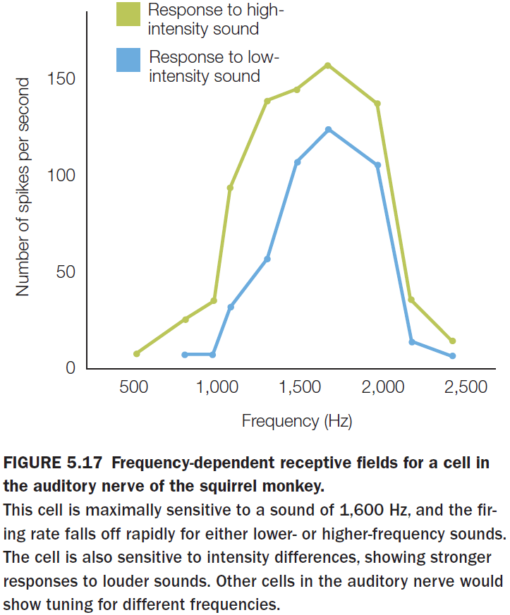
- The tuning of individual neurons becomes sharper as we move through the auditory system.
- While the global organization of A1 is tonotopic, the local organization is quite messy with adjacent cells frequently showing very different tuning.
- The computational goals of audition is to determine the what and where of sound signals.
- The auditory system uses two cues to localize sounds
    - Difference in timing (interaural time)
    - Difference in intensity
- One way to compute these differences is to use a coincidence detector.

- Review of the neural pathways for vision.
- Both audition and vision are important for perceiving information at a distance.
- The retina’s photoreceptors don’t fire APs and instead use a graded potential to transmit information.
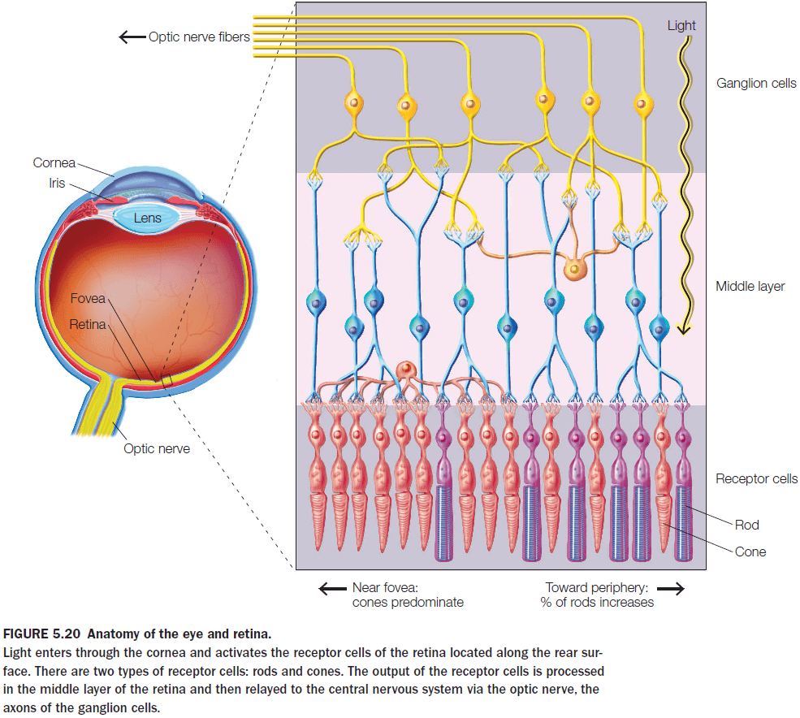
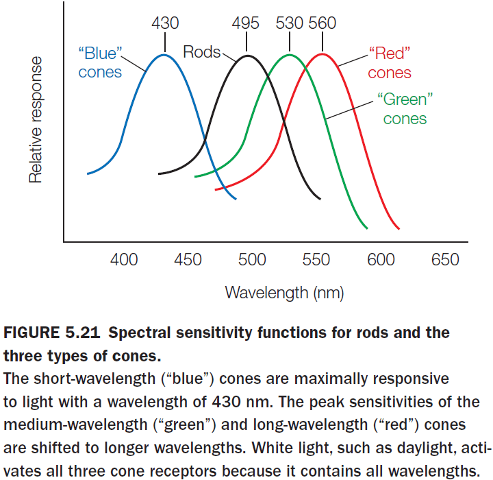
- The retina compresses visual information as it goes from 260 million photoreceptors to 2 million ganglion cells.
- Analogous to the auditory system, the visual system also identifies the what and where of objects.
- Also like other sensory systems, the receptive fields of visual cells form an orderly mapping between the external dimension (spatial location) and the neural representation of that dimension known as retinotopic maps.
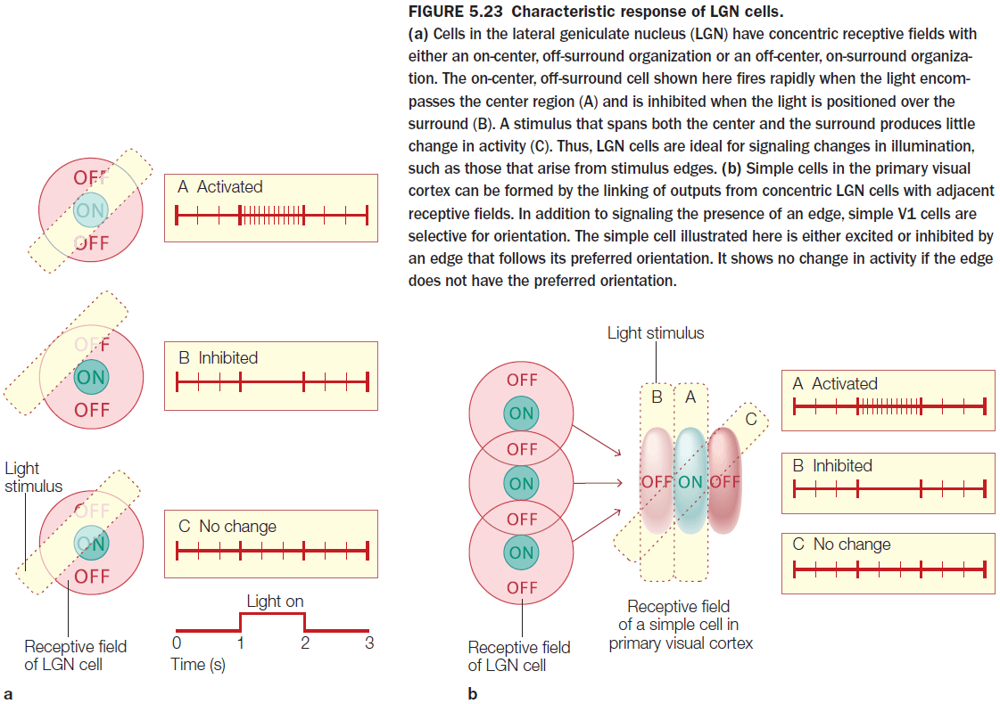
- The observation that cells respond to changes in light clarify a fundamental principle of perception: the nervous system is interested in change.
- E.g. We recognize an elephant not by its gray body, but by the contrast of the gray edge of its shape against the background.
- As information moves through the visual system, the optimal stimulus becomes more complex and the receptive fields become larger.
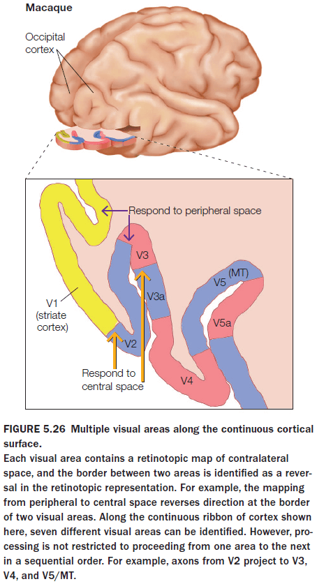
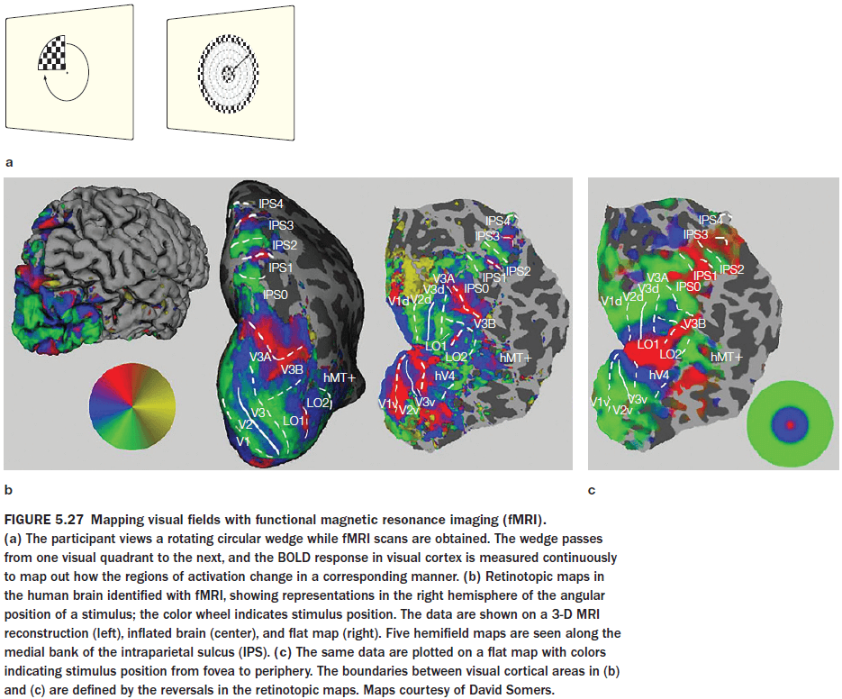
- Why does the brain have so many visual areas? One answer is hierarchy.
- Each area, with a unique representation of the stimulus, successively elaborates on the representation derived by processing in earlier areas.
- However, this isn’t true as there are feedback connections in the visual system.
- An alternative view is that vision is an analytic process, using a divide-and-conquer strategy to manage visual information.
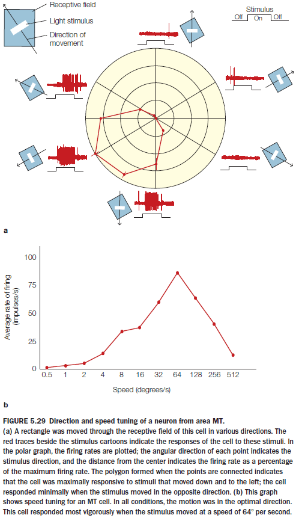
- Evidence supports the analytic process hypothesis as cells in area MT are sensitive to stimuli that
    - Fall within its receptive field
    - Move in a certain direction
    - Move at a certain speed
- Humans have visual areas that do not correspond to any region in our close primate relatives.
- At what stage of processing does sensory stimulation become a percept, something we experience phenomenally?
- One way to answer this question is to use illusions.
- E.g. The flicker fusion where a disk colored green on one side and red on the other is flipped. At 25 Hz, the percept is a fused color of a constant, yellowish white disk.
- Where in the visual system does it fail to keep up with the flickering stimulus? Does the breakdown occur early or late in the system?
- An experiment showed that early parts of the visual system can differentiate between the colors at high rates but the late parts can’t.

- Although the information is sensed accurately at earlier stages within the visual system, conscious perception, at least of color, is more closely linked to higher-area activity.
- There is a double dissociation for this idea as stimulation of higher visual areas results in participants viewing the cell’s preferred stimulus. In the experiment’s case, the preferred stimulus was a color.
- How does the brain combine our separate senses into a unified multisensory experience?
- There are illusions of multisensation such as the McGurk effect.
- E.g. Given a video of someone saying “ba” but the audio is replaced with “fa”, the brain perceives “ba” even though it hears “fa”.
- In the McGurk example, visual input overrules auditory input as the brain gives greater weight to more reliable signals.
- The weighting idea captures the idea that the system is flexible and that there isn’t a predefined bias towards any sense. The bias is towards reliable signals.
- Vision may seem like the sense that dominates since it’s the most reliable and contains the most information but that isn’t always the case.
- E.g. When walking in the dark, we focus more on sounds as it’s more reliable and it provides more information since vision is poor in the dark.
- Where is information from different sensory systems integrated in the brain?
- Integration happens in the superior colliculus and superior temporal sulcus.
- Integration requires that the different stimuli be coincident in both space and time.
- Auditory and visual stimuli can enhance perception in the other sensory modalities.
- E.g. Applying TMS over the visual cortex generates illusory flashes of light (phosphenes) above a threshold. If we set the intensity level of TMS to just below the threshold and no stimulus is given, no phosphenes are seen. If, however, we provide an auditory stimulus, then phosphenes are seen. This provides evidence that auditory stimulation increases visual perception.
- Synesthesia: the mixing of senses.
- E.g. When words have a taste or when numbers have colors.
- While synesthetic associations aren’t consistent across individuals, they’re consistent over time for an individual.
- Testing for synesthesia is difficult since it’s such a personal experience but we can test it using a modified version of the Stroop task.
- We can modify the Stroop task by checking whether the person responds faster if the color of the word matches their synesthetic color. To normal people, different colors don’t matter.
- Evidence shows that synesthesia is a real condition and that it’s objectively testable.
- Synesthesia appears to be a distributed condition affecting the general sensory pathways, rather than being localized, but no general consensus has been reached.
- Cortical plasticity = functional reorganization
- Primary sensory areas exhibit experience-induced plasticity during defined windows of early life, known as critical periods.
- The brain requires external inputs during these periods to establish an optimal neural representation of the surrounding environment.
- E.g. The visual system needs input to properly develop the thalamic connections to cortical layer IV.
- E.g. Shutting one eye in cats and monkeys weeks and months after birth results in the failure to develop normal ocular dominance columns in the primary visual cortex. This change was permanent. Applying the same change to adult animals has minimal effect.
- As attention is directed to one modality, activation decreased in other sensory systems.
- Mechanisms of cortical reorganization
    - Rapid changes are due to the sudden reduction in inhibition that normally suppresses inputs from neighboring regions and from weak connections.
    - Changes over a period of days involves changes in the efficacy of existing circuitry such as denervation hypersensitivity.
- Cochlear implants work by directly stimulating the auditory nerve.

## Chapter 6: Object Recognition

- Big questions
    - What processes lead to the recognition of an object?
    - How is information about objects organized in the brain?
    - Does the brain recognize all types of objects using the same process?

- Patient G.S. was unable to recognize objects even though his vision was intact.
- The act of perceiving also touches on memory.
- E.g. To recognize a photograph of your mother requires a correspondence between the current percept and an internal representation of previously viewed images of your mother.
- Four major concepts of object recognition
    - Use terms precisely.
        - E.g. See vs perceive. G.S. could see the pictures but couldn’t perceive the object.
    - Object perception is unified.
    - Perceptual capabilities are enormously flexible and robust.
        - E.g. We can recognize an object regardless of viewpoint, illumination, and size.
    - The product of perception is intimately interwoven with memory.

- Object constancy: our ability to recognize an object regardless of the situation.
- Sensation, perception, and recognition are distinct phenomena.
- Visual information coming from an object varies in three factors
    - Viewing position
    - Illumination
    - Context
- The visual system is adept at separating changes caused by shifts in viewpoints from changes to an object itself and visual illusions can exploit this fact.
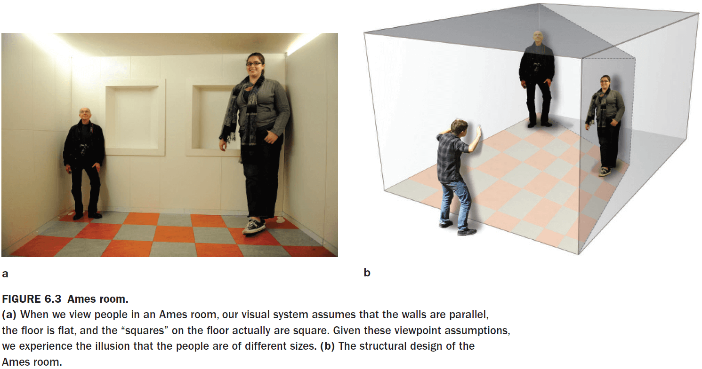
- Object recognition must be both general enough to support object constancy and specific enough to pick out slight differences in objects.
- Review of the dorsal (where) and ventral (what) visual streams.
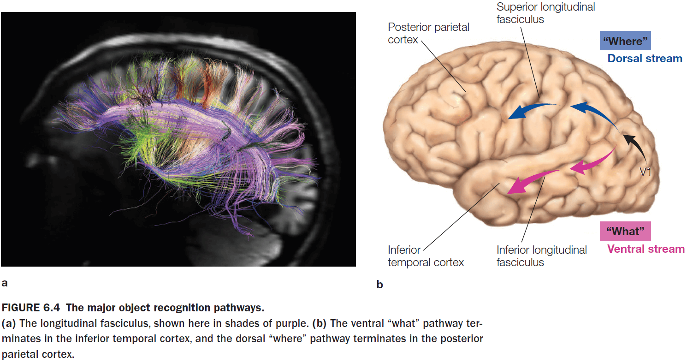
- The separation of “what” and “where” pathways isn’t limited to vision and occurs in the auditory system too.
- The anterior part of the primary auditory cortex is specialized for “what” and the posterior part is specialized for “where”.
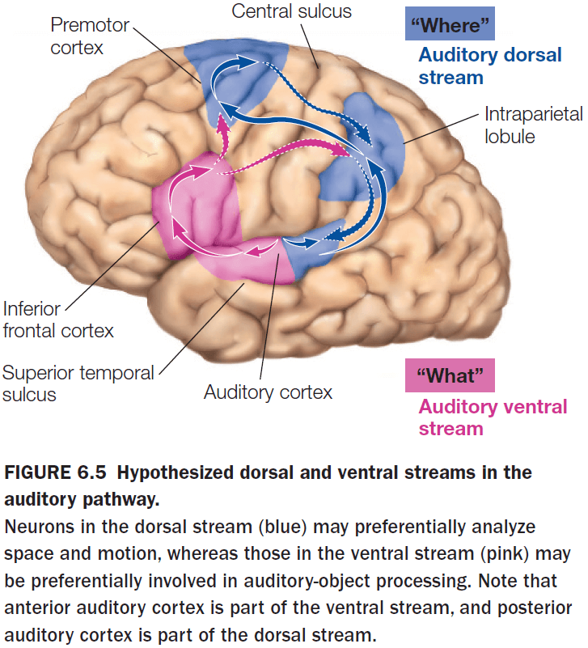
- Neurons in both the temporal and parietal lobes have large receptive fields, but the properties of those receptive fields differ.
- Neurons in the parietal lobe have receptive fields tuned for a stimulus’s location on the retina (40% fovea, 60% periphery), while neurons in the temporal lobe have receptive fields tuned only for the fovea (100% fovea).
- This suggests that object recognition focuses mostly on the light hitting the fovea and ignores peripheral signals.
- Further along the “what” processing stream, neurons have a preference for more complex features.
- E.g. Human body parts, apples, flowers, or snakes.
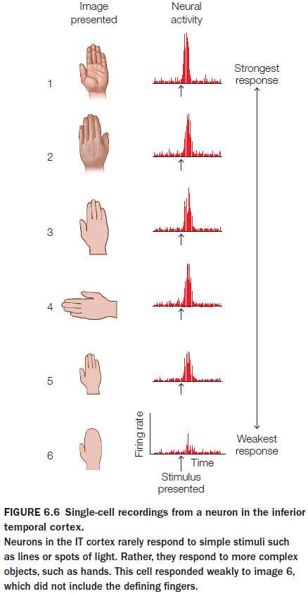
- There appears to be a difference between perception for identification and perception for action.
- Visual agnosia: a deficit in recognizing objects even when the processing for analyzing basic properties such as shape, color, and motion are intact.
- E.g. Patient D.F. couldn’t correctly orient a card to enter a slot, but if told to put the card into the slot, she could do it successfully even though she couldn’t identify the slot orientation.
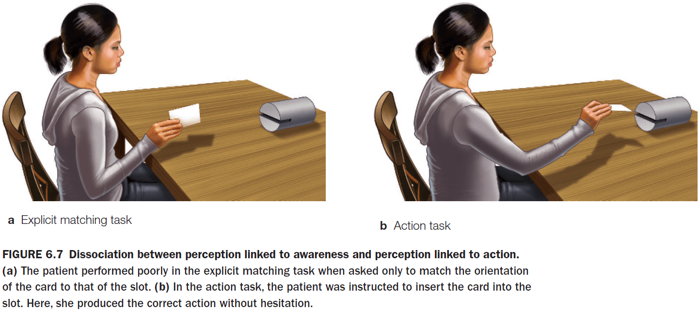
- A similar distinction exists for audio. Auditory object recognition probably involves several distinct processing systems as these different systems can go wrong without affecting other systems.
- E.g. Patient C.N. with amusia, the inability to perceive music.
- The “where” system appears to be essential for more than just determining the locations of different objects, it’s also critical for guiding interactions with these objects.
- E.g. Patient J.S. displayed a similar condition to patient D.F. where he couldn’t recognize objects. However, he could vary his grasp and hand shape to pick them up, suggesting that his brain does perceive the detail and orientation of objects.
- Patients D.F. and J.S. offer examples of single dissociations where they are able to act on objects but can’t recognize them. Optic ataxia is the reverse dissociation.
- Optic ataxia: a condition where patients can recognize objects but can’t use visual information to guide their actions.
- E.g. Patients can identify objects but they grasp for it as if they are blind.
- Visual agnosia appears with damage to the ventral/what/temporal visual stream and optic ataxia appears with damage to the dorsal/where/parietal visual stream.
- Object perception depends primarily on the analysis of the shape of a visual stimulus.
- While color, texture, and motion can help, shape is the primary method for object perception.

- How does the brain encode shape?
- This question emphasizes the idea that perception involves connecting sensation and memory since we need to match the current sensation to our knowledge of object shape.
- When presented novel and familiar stimuli, the lateral occipital cortex (LOC) increases in blood flow suggesting that it’s the location for storing information about objects.

- Interestingly, it seems that recognizing something familiar from something unfamiliar requires the same amount of processing.
- Multistable perception: when competing stimuli are present and the brain stabilizes on one perception or interpretation.
- E.g. Necker cube illusion or vase-face illusion.
- To explain multistable perception, it’s theorized that competition in the early stages of visual processing coalesces into a stable percept by the time it reaches the inferior temporal lobe.
- Theory behind object recognition
    - Cells in the IT cortex selectively respond to complex stimuli, consistent with hierarchical theories of object perception.
    - Initial areas of the visual cortex code basic features such as line orientation and color.
    - The output of these areas is combined to form more complex feature detectors.
    - Each successive stage codes more complex combinations.
- Grandmother-cell hypothesis
    - There are specific cells for recognizing objects and people such as your grandmother.
    - Evidence comes from epilepsy patients who had cells that only responded when the patient views a specific person.
    - However, the study is questionable as the name of the person also activated the cell.
    - So maybe the cell doesn’t represent viewing the person but instead represents the general concept of the person or the name of the person.
- An alternative to the grandmother-cell hypothesis is the ensemble hypothesis; that an ensemble of cells is activated for object recognition.
- Recognition isn’t due to one unit but to the collective activation of many units.
- Ensemble theories account for why we can recognize similarities between objects as only part of the ensemble activates.
- They also account for why we can recognize new objects without needing more neurons, unlike the grandmother-cell hypothesis. The ensemble activates units that represent its features.
- Another strength of the ensemble hypothesis is that it’s robust to losing neurons as losing one neuron doesn’t mean that you can’t recognize an object anymore.
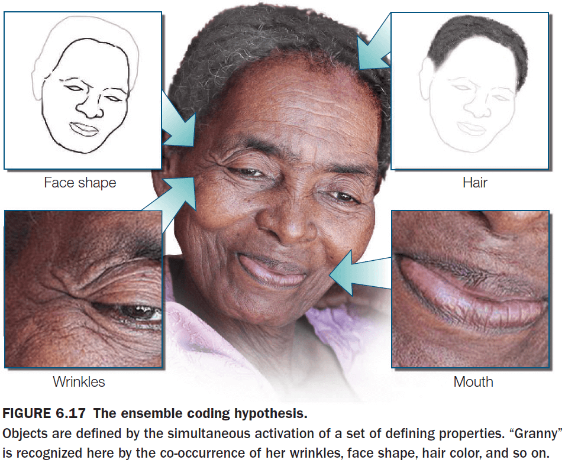
- Review of neural networks and an introduction to mind reading (brain encoding and decoding).
- We’re able to read fMRI data and decode a crude image of what the person is seeing or imagining.
- It’s possible to predict what a participant is thinking about even in the absence of any sensory input.
- Being able to read minds would help us understand the nature of dreams.
- When we meet someone, we always first look at the person’s face. No culture is an exception.
- Multiple studies argue that face perception doesn’t use the same general processing mechanisms as those used in object recognition, but instead depends on a specialized network of brain regions.
- The most prominent region for face recognition is the fusiform gyrus or the fusiform face area but this isn’t the only region that shows a strong BOLD response to faces.
- Other regions of the temporal lobe, including the superior temporal sulcus, are part of the face recognition network.
- The more ventral face pathways is sensitive to static, invariant facial features while the more dorsal pathways are sensitive to face movement.
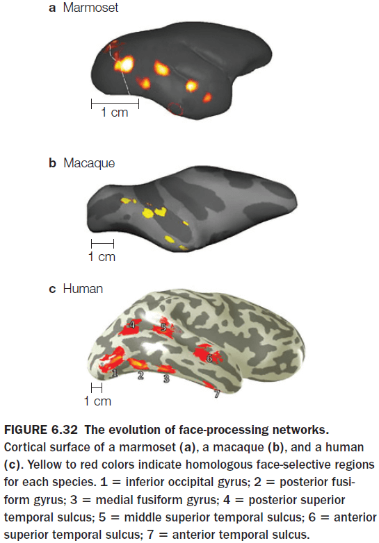
- Are there other specialized systems for vision?
- Another system appears to be the parahippocampal place area that’s specialized for landscape images.
- To test the reverse dissociation for the fusiform face area, the area was stimulated in monkeys and epileptic patients.
- When the area was stimulated, monkeys performed poorly on a face-matching task and the human patients reported faces as being morphed.
- E.g. The doctor’s face morphed into someone else’s face.
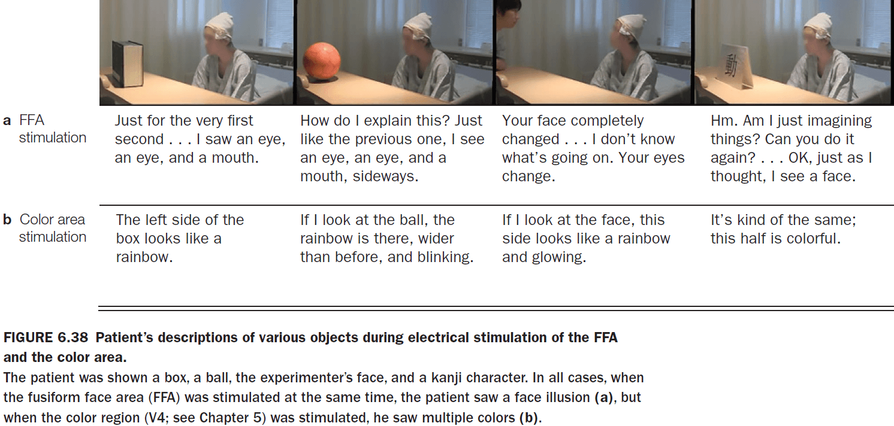
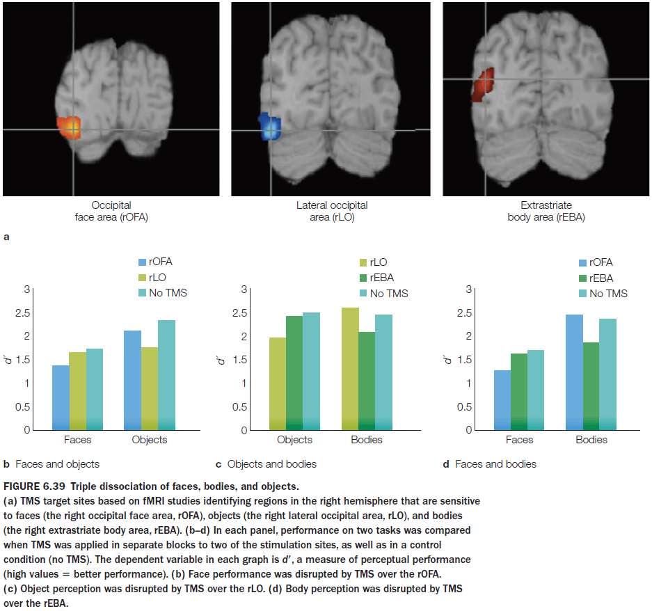
- Three major subtypes of visual agnosia
    - Apperceptive: inability to recognize objects.
    - Integrative: inability to integrate parts of an object into a coherent whole.
    - Associative: inability to access conceptual knowledge from visual input.
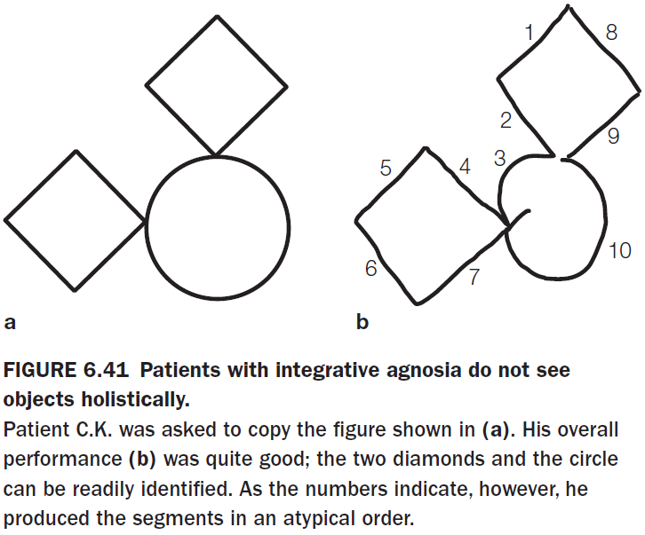
- There are unusual cases of patients that exhibit object recognition deficits that are selective for specific categories.
- E.g. Problems identifying living objects even though nonliving object recognition works.
- There are two theories for why there are selective impairments of specific categories.
    - Sensory/functional hypothesis: the idea that conceptual knowledge is organized around representations of sensory properties and motor properties associated with an object.
        - This may explain why there is a living/nonliving perceptual divide. Nonliving objects are manipulable unlike living objects.
    - Domain-specific hypothesis: the idea that conceptual knowledge is organized around categories that are evolutionarily relevant to survival and reproduction.
        - By this hypothesis, dedicated neural systems evolved because they enhanced survival by more efficiently processing specific categories of objects.
- Tests with blind patients show that visual experience isn’t necessary for category specificity to develop within the ventral stream.
- Prosopagnosia: inability to recognize faces.
- Face perception appears to be unique in that it uses holistic processing. We recognize a person by the entire facial configuration and not by their specific facial features such as their nose, eyes, or chin.
- Holistic processing: a form of perceptual analysis that emphasizes the overall shape of an object.
- Analysis-by-parts processing: a form of perceptual analysis that emphasizes the component parts of an object.
- Words represent the other special class of objects at the other extreme and objects lie in the middle.
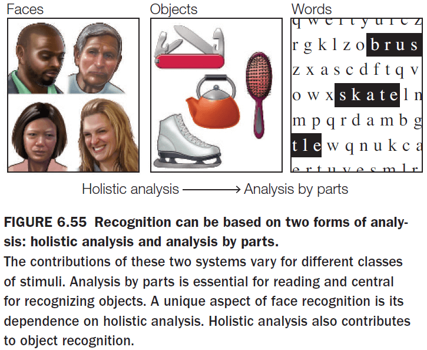
- Given this theory, we shouldn’t expect to find any cases where both face perception and reading are impaired but object perception remains intact. Indeed, we don’t find any cases.

## Chapter 7: Attention

- Big questions
    - Does attention affect perception?
    - To what extent does our conscious visual experience capture what we perceive?
    - What neural mechanisms are involved in the control of attention?
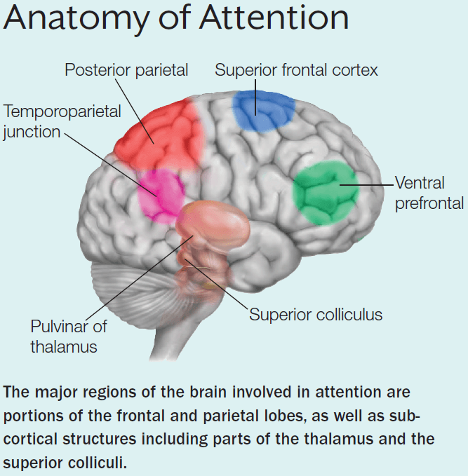
- The central problem of attention is how the brain is able to select some information at the expense of other information.
- We can choose the focus of attention; that is, it can be voluntary.
- We are also only able to attend to one thing at a time, not many things.
- First we distinguish attention from arousal.
- Arousal: the global physiological and psychological state of the organism.
- E.g. Deep sleep to hyperalertness.
- Selective attention: the allocation of attention among relevant inputs, thoughts, and actions, while ignoring irrelevant or distracting ones.
- E.g. Choosing to focus on reading this sentence instead of reading Twitter.
- What determines the priority?
    - Goal-driven control (top-down): voluntary attention steered by an individual’s current goals.
        - E.g. Focusing on doing homework for a class instead of partying.
    - Stimulus-driven control (bottom-up): reflexive attention steered by a stimulus.
        - E.g. Hearing a loud bang while studying.
- There are also two types of selective attention
    - Overt: a physical shift in attention.
        - E.g. Moving your eyes.
    - Covert: a mental shift in attention.
        - E.g. Looking straight on but focusing on what’s happening in the periphery. Eavesdropping. The spotlight of attention.
- Unilateral spatial neglect (USN): a condition where patients ignore half of their visual field.
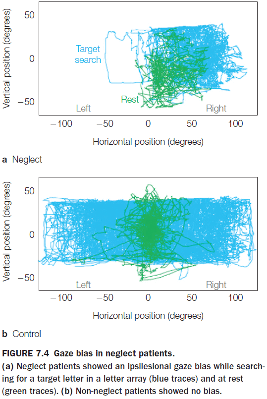
- USN can also affect the imagination and memory.
- Patients with USN that try to recollect their memory of certain places neglect the side contralateral to the side with cortical damage.
- This shows that USN can’t be attributed to a failure of memory, but rather that attention to parts of the recalled images was biased.
- Patients with USN aren’t blind to the visual field as they can still detect stimuli presented in isolation in the visual field.
- But when multiple stimuli are present, USN shows up resulting in extinction.
- Extinction: the neglect of a stimulus in the presence of a competing stimulus.
- USN can be overcome if the patient’s attention is directed to the neglected location of items. This is one reason why the condition is described as a bias rather than a loss of ability to focus attention.
- One patient with USN describes it more as the inability to concentrate rather than as neglecting the stimulus.
- Three main characteristics of Balint’s syndrome
    - Simultanagnosia: a difficulty in perceiving the visual field as a whole.
    - Ocular apraxia: a deficit in making eye movements to scan the visual field.
    - Optic ataxia: a problem in making visually guided hand movements.
- USN is the result of unilateral lesions of the parietal, posterior temporal, and frontal cortex or damage in subcortical areas.
- Balint’s syndrome is the result of bilateral occipitoparietal lesions.
- The phenomenon of extinction in neglect patients suggests that sensory inputs are competitive.
- Review of the cocktail party effect (CPE).
- Using the dichotic listening task, participants couldn’t report what the other ear heard if they focused on only hearing from one side.
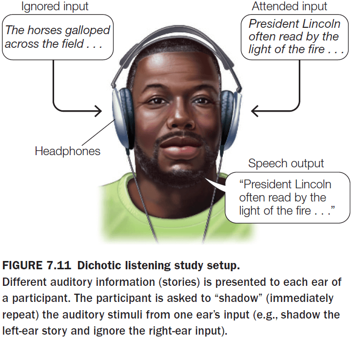
- E.g. A friend whispering to you during class will make you miss what the teacher just said.
- This shows that attention affects what’s processed by the brain.
- But at what stage in the processing of sensory input does attention affect information? Does attention select in the early or late stages of processing?
- Early selection: a stimulus can be selected for before perceptual analysis is complete.
- Late selection: all stimuli are processed equally and then selection takes place at higher stages of information processing.
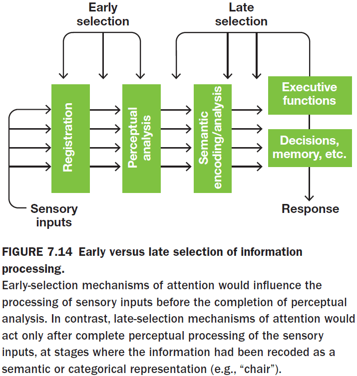
- However, the original all-or-none early-selection models couldn’t explain a person attending to specific information such as the person’s own name or something very interesting because this would require having perceived the information.
- The benefit of attention is that if attention is primed with a cue, then reaction times are faster. However, if the cue is invalid, then reaction times are slower.
- Attention also prevents information overload by limiting information to only the most relevant.
- Physiological evidence favors early selection in humans as neural signals are strongly amplified if they are attended to. This occurs before the stimulus properties can be fully analyzed.
- Selective attention operates in all sensory modalities.
- Spatial attention enhanced the responses of simple cells.
- Attention affects processing at multiple stages in the cortical visual pathways from V1 to IT cortex.
- It appears that attention attenuates the influence of the competing stimulus. It dampens distractions.

- Although attention does act at multiple levels of the visual hierarchy, it also optimizes its action to match the spatial scale of the visual task.
- Attention also works at the level of the thalamus as it’s been shown that thalamic reticular nucleus (TRN) neurons can inhibit/excite signal transmission from the lateral geniculate nucleus (LGN) to the visual cortex.
- Reflexive visuospatial attention can improve response times if the reflexive cue predicts the location of subsequent targets, but only for a short time after the flash (50-200 ms).
- After about 300 ms pass between the reflexive cue and the target, the effects on reaction time are reversed and participants respond more slowly.
- Inhibition of Return (IOR): inhibition of the return of attention to that location.
- Our reflexive attention has built-in IOR to prevent ourselves from locking on to distractions and if the stimulus is important and salient, we can invoke our voluntary attention to override IOR.
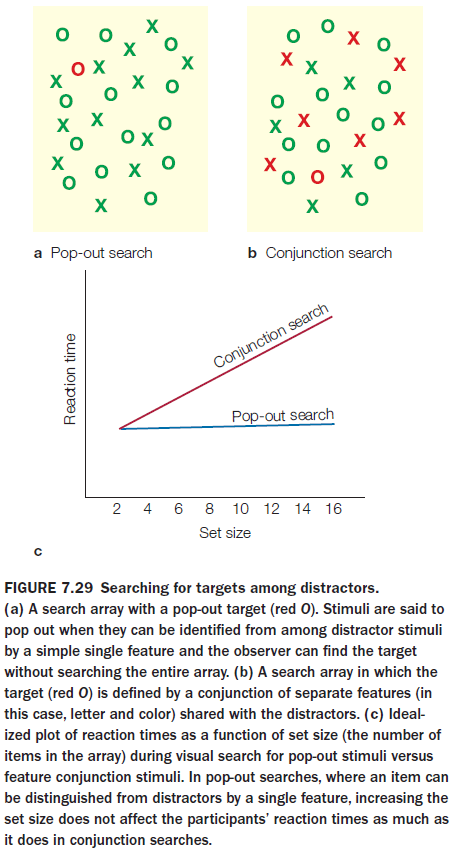
- Attention can be directed both to spatial locations and to nonspatial features of the target stimuli.
- One experiment showed that both spatial attention and feature attention can produce selective processing of visual stimuli, and that their mechanisms differ.
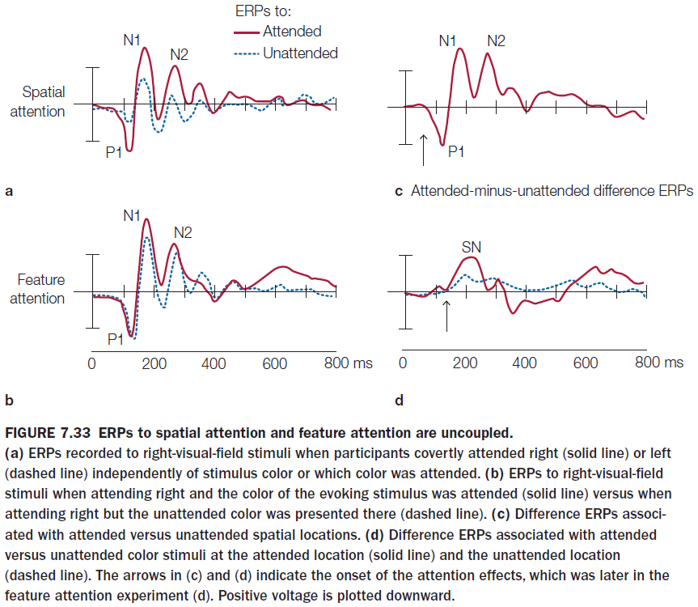
- Feature-based selective attention acts at relatively early stages of visual cortical processing and with relatively short latencies after stimulus onset.
- Spatial attention, however, still beats feature-based selective attention and it has an earlier effect.
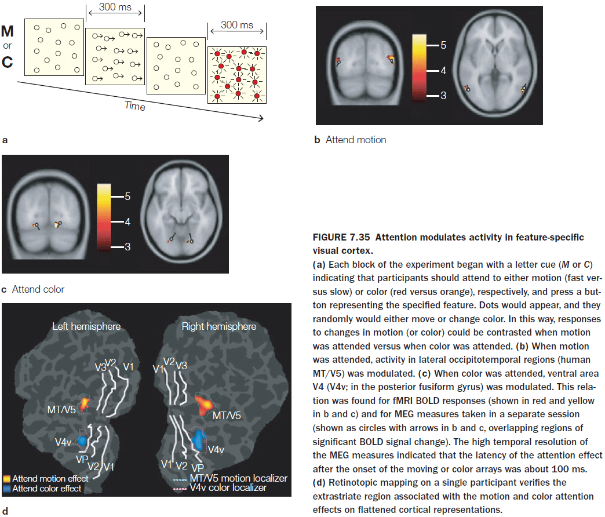
- Objects influence the way spatial attention is allocated in space in that attention spreads to capture the object.
- When spatial attention isn’t involved, object representations can be the level of perceptual analysis affected by goal-directed attentional control.
- Attended stimuli produce greater neural responses than ignored stimuli and this occurs in multiple visual cortical areas.
- Studies suggest that attention alters the effective connectivity between neurons by altering the pattern of rhythmic synchronization between areas.
- How does goal-directed attention work?
    - Top-down neuronal projects from attentional control systems contact neurons in sensory-specific cortical areas to alter their excitability.
    - This results in the response in the sensory areas to a stimulus to be enhanced if the stimulus is given a high priority, or it is attenuated if it’s irrelevant.
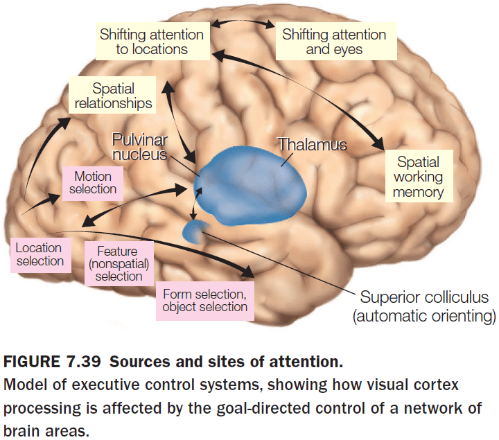
- Current models suggest two separate attention control systems
    - Dorsal attention network: controls voluntary attention based on location, features, and object properties.
    - Ventral attention network: controls reflexive attention stimulus novelty and salience.
- The key cortical nodes in the dorsal attention network
    - Frontal eye fields (FEF)
    - Supplementary eye fields (SEF)
    - Intraparietal sulcus (IPS)
    - Superior parietal lobule (SPL)
    - Precuneus (PC)
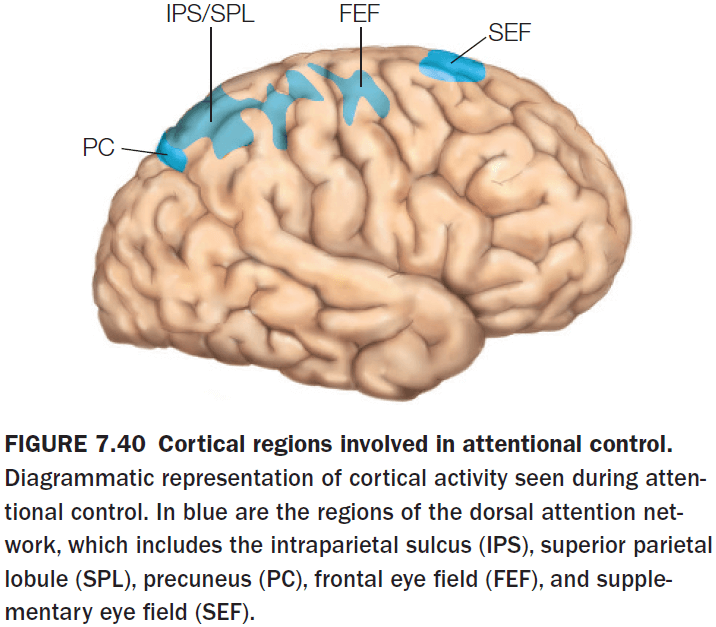
- Impulses from the FEF coded information about the task that was about to be performed, indicating that the dorsal system is involved in generating task-specific, goal-directed attentional control signals and not a general attention signal.
- The key cortical nodes in the ventral attention network
    - Strongly lateralized to the right hemisphere
    - Temporoparietal junction (TPJ)
    - Inferior and middle frontal gyri of the ventral frontal cortex
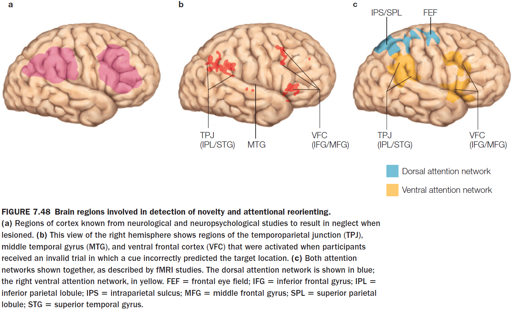
- Subcortical components of attentional control networks
    - Superior colliculus
        - Contains a topographic map of the contralateral visual hemifield.
        - Strong stimulation evokes an overt eye movement.
        - Weak stimulation doesn’t evoke an eye movement but it does excite the neurons.
        - Weak stimulation appears to mimic the effects of covert attention.
    - Pulvinar of the thalamus
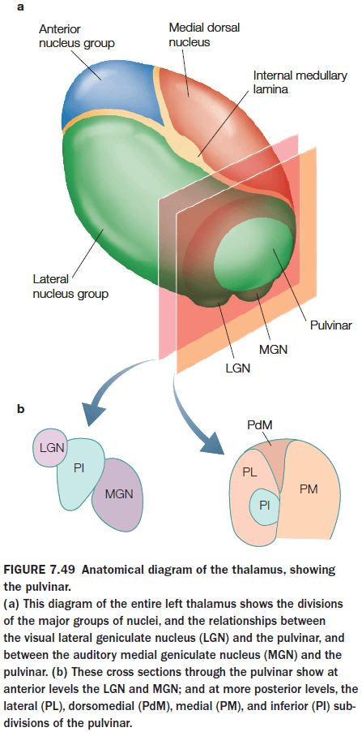
        - Ventral-stream visual areas V1, V2, V4, and IT project topographically to the ventrolateral pulvinar (VLP), which also sends projections back to these visual areas, forming a pulvinar-cortical loop.
        - May be involved in both voluntary and reflexive attention.
        - The dorsomedial pulvinar appear to play a major role in covert spatial attention and in the filtering of stimuli.
        - Coordinates the synchronous activity of interconnected brain regions in the ventral visual pathway.

## Chapter 8: Action

- Big questions
    - How do we select, plan, and execute movements?
    - What cortical and subcortical computations in the sensorimotor network support the production of coordinated movement?
    - How is our understanding of the neural representations of movement being used to help people who have lost the ability to use their limbs?
    - What is the relationship between the ability to produce movement and the ability to understand the motor intentions of other individuals?
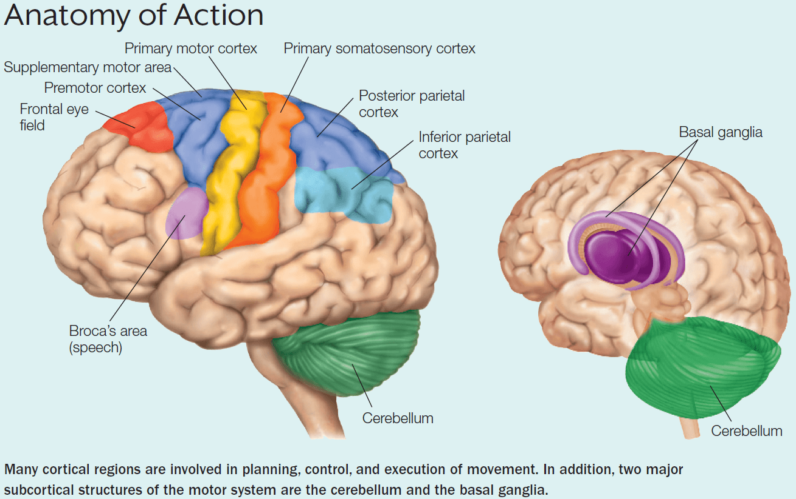
- As in perception, we can describe the motor system as a hierarchical organization with the spinal cord at the bottom and cortical regions at the top.
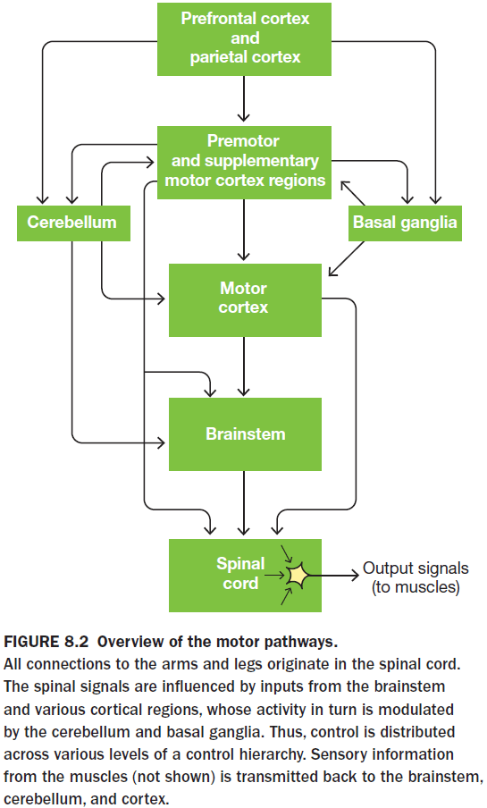
- Effector: a part of the body that can move.
- Review of alpha motor neurons, spinal interneurons, and reflex.
- Two subcortical structures that play a key role in motor control
    - Cerebellum
    - Basal Ganglia
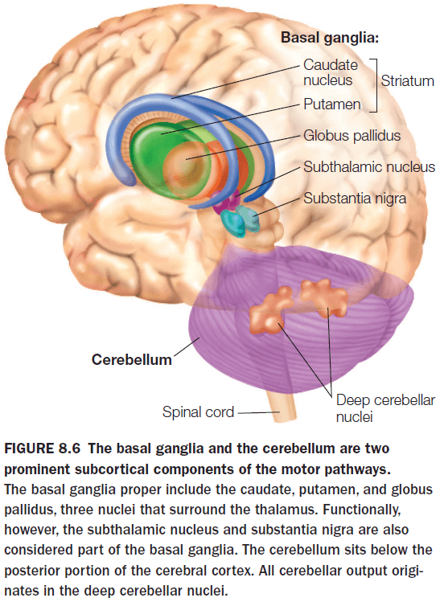
- In the primary motor cortex (M1), the representation of each effector doesn’t match its actual size, but rather the importance of that effector for movement and the level of control required for manipulating it.
- Why is a larger area needed for more precise control?
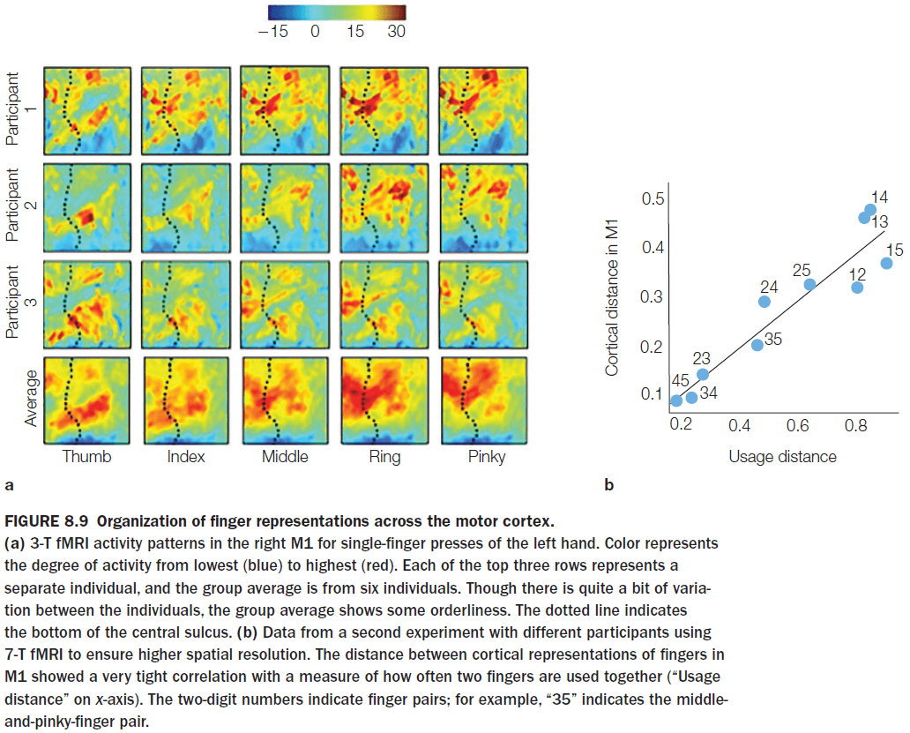
- Lesions in M1 or the corticospinal tract result in hemiplegia.
- Hemiplegia: the inability to produce voluntary movement.
- The dorsal/where visual stream can be further subdivided into a dorso-dorsal stream and a ventro-dorsal stream.
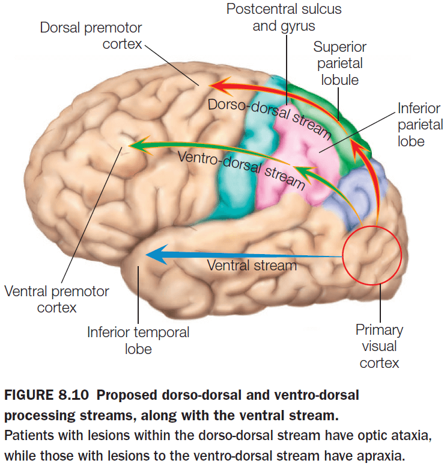
- The dorso-dorsal stream is used for the act of reaching as it requires the representation of the location of an object in space with respect to the person’s own body.
- Damage to the dorso-dorsal stream results in optic ataxia.
- Optic ataxia: the inability to reach for objects even though they can recognize it.
- The ventro-dorsal stream is used for producing transitive gestures (manipulating an object) and intransitive gestures (signifying intension such as waving goodbye).
- Damage to the ventro-dorsal stream results in apraxia.
- Apraxia: the inability to make coordinated, goal-directed movement.
- Central pattern generator (CPG): neurons within the spinal cord that can generate an entire sequence of actions without any external feedback signal.
- The motor system is truly hierarchical because the highest levels are only concerned with issuing commands to achieve an action, whereas lower-level mechanisms translate those commands into a specific neuromuscular pattern via CPGs.
- So if cortical neurons aren’t coding specific patterns of motor commands, what are they doing?
- Two types of action plans
    - Trajectory-based: specifying the current location and how to move to get to the new location.
    - Location-based: specifying the new location and what’s needed at the new location.
- Experiments with monkeys favor the location-based action plan.
- This reminds me of the mouse-maze experiment in the cognitive science textbook where it showed the same result. Mice make cognitive maps based on locations, not movements.
- Location isn’t the only information being encoded though as actions require a set of sequential movements.
- These movements are guided by a hierarchy with abstract representations at the top and sequential movements at the bottom.
- Two key ideas on movement
    - Motor control depends on several distributed anatomical structures.
    - These distributed structures operate in a hierarchical organization.
- In Georgopoulos’s experiment, the activity of cells in M1 correlates better with movement direction than with target location.
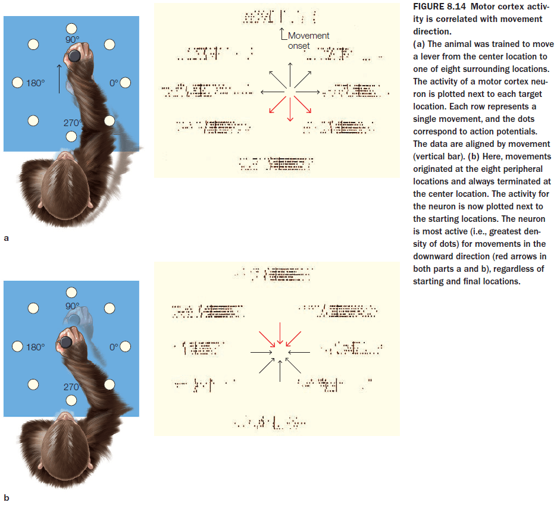
- Many cells in the motor cortex show directional tuning or a preferred direction.
- If we try to predict the direction of movement by observing only one neuron, it would be very difficult as we wouldn’t have enough information to predict the direction.
- One solution is to use a population vector.
- Population vector: combining the activity of many neuron (assuming that a neuron’s activity is stronger when the desired direction of movement more closely matches its preferred direction).
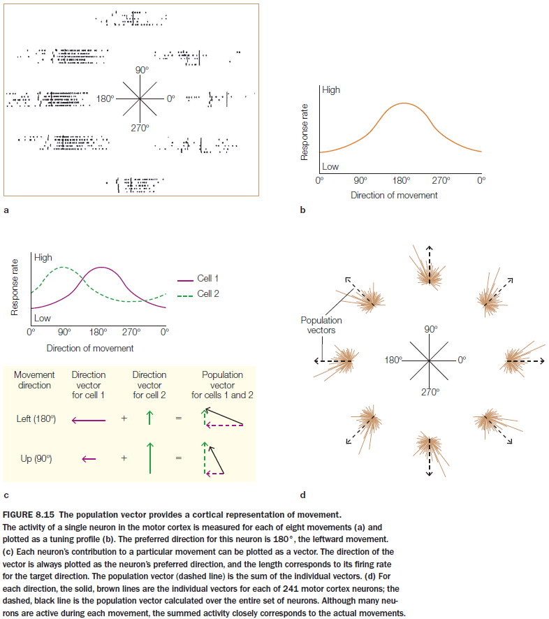
- The population vector does predict the direction of movement, however, we must keep in mind that the data is correlational and we don’t know if the cells are coding for their preferred direction or some other variable such as muscle contraction.
- There is some evidence that the population vector can predict movement before it occurs but there are some issues.
- Issues with population vectors
    - Many cells don’t show strong directional tuning.
    - Tuning may be inconsistent.
- There may not be a simple mapping from behavior to neural activity as neurons may wear many hats, coding different features depending on the time and context.
- An alternative to population coding is to model the activity of neurons using a dynamic model that defines the trajectory of neural activity in abstract, multidimensional space.
- How do we select goals and plan motor movements to achieve those goals?
- The affordance competition hypothesis (ACH) is one answer.
- ACH proposes that the processes of action selection (what to do) and implementation (how to do it) occur simultaneously within the brain and continuously evolves.
- Affordances: the opportunities for action defined by the environment.
- Starting with our ancestors, they lived in a changing and hostile environment which doesn’t allow time for carefully evaluating goals and options.
- A better strategy is to develop multiple plans in parallel.
- E.g. While we’re performing one action, we’re preparing for the next one.
- Feedback from our sensors continuously updates our affordances and how to carry them out, while our internal state, longer-range goals, and expected rewards provides information that can be used to assess the utility of the different actions.
- Eventually, one option wins and executed.
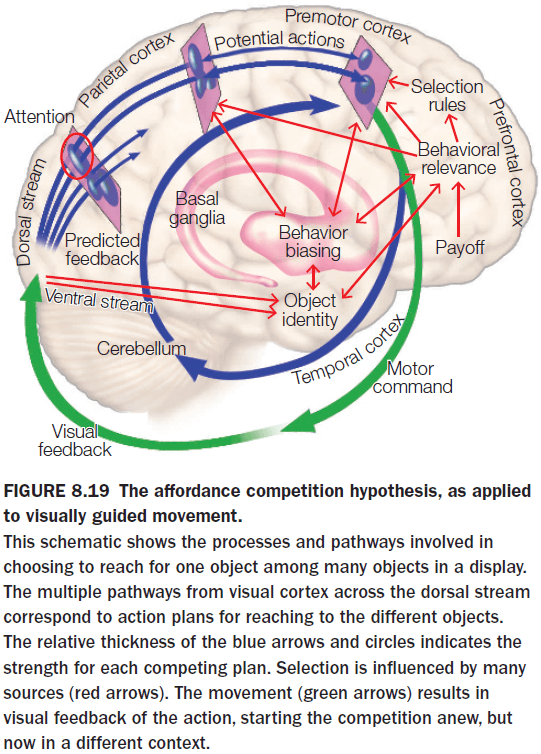
- Evidence for ACH comes from monkeys. When they are presented with two targets, neural signatures for both movements could be seen even though the monkey hadn’t been told which target to move to.
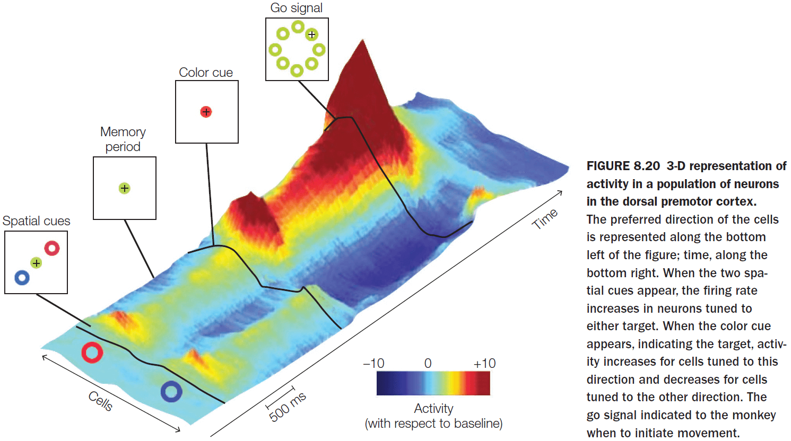
- Further evidence comes from split-brain patients where they can draw two simultaneous patterns using both hands while normal people have difficulty doing the same task.
- This reveals that motor planning involves some cross talk between the two hemispheres.
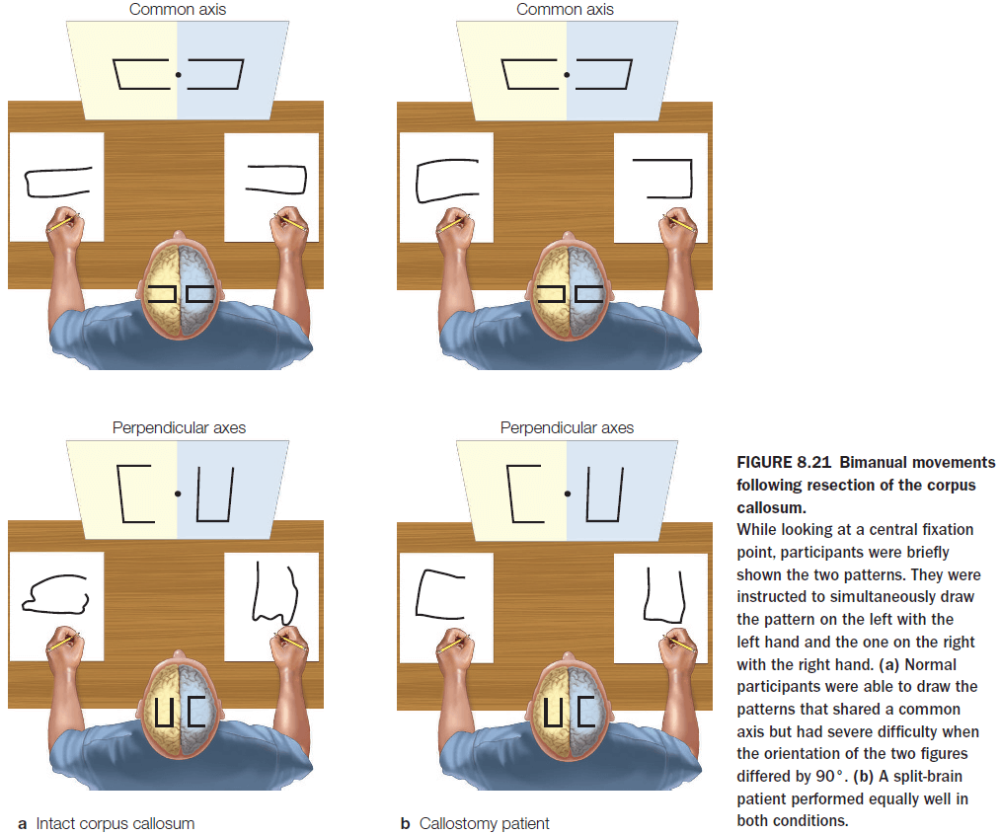
- Damage to the supplementary motor area (SMA) leads to impaired performance on tasks that require integrated use of both hands and to alien hand syndrome.
- Alien hand syndrome: a condition where one limb produces a seemingly meaningful action but the person denies responsibility for the action.
- Behaviors such as alien hand syndrome and difficulty performing multiple, parallel motor tasks, such as rubbing your stomach and patting your head, further supports the idea that motor planning is a competitive processing.
- Differences between posterior parietal cortex and premotor regions
    - Parietal cortex uses an eye-centered reference frame, while premotor regions use an hand-centered reference frame.
    - Parietal cortex is linked to motor intention, while premotor regions are linked to movement execution.
- Conscious awareness of movement appears to be related to the neural processing of action intention rather than the movement itself.
- Mirror neurons (MNs): neurons that fire both when an action is observed and when the individual performs the same action.
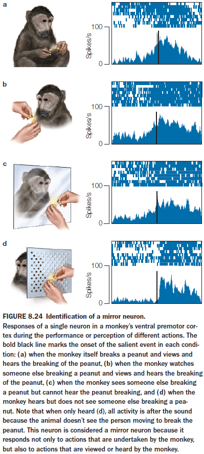
- The activity of MNs is correlated with a goal-oriented action and is independent of how this information is received.
- MNs intimately link perception and action, suggesting that our ability to understand the actions of others depends on the neural structures that would be engaged if we were to produce the action ourselves.
- Experiments with MNs also show that with expertise, the motor system has a fine sensitivity to discriminate good and poor performance during action observation, a form of action comprehension. This also suggests that our motor system is anticipatory in nature.
- E.g. Only the neurons in skilled basketball players showed a different response to successful and unsuccessful free throw video clips when compared to journalists and normal people.
- Dividing the brain into perception and motor regions may be useful in organizing neuroscience information, but the brain doesn’t honor such divisions.
- Review of brain-machine interfaces (BMI).
- Given multiple action plans, how do we decide which plan to execute?
- The basal ganglia (BG) plays a critical role in movement initiation and is positioned to help resolve the competition among action plans.
- The BG is unique in its use of double inhibition as it allows for making a pattern stand out against the background, thus it might be how an action plan gets decided.
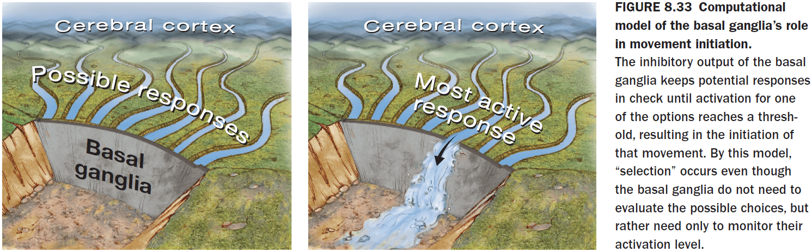
- Disorders such as Huntington’s disease and Parkinson’s disease affect the BG, resulting in abnormal movements and postures.
- Some aspects of motor learning are independent of the muscular system used to perform the action.
- E.g. You can write your signature using both hands, your mouth, and your feet. While the signature won’t be as clean, this shows that some muscle groups simply have more experience in translating abstract representations into a concrete action.
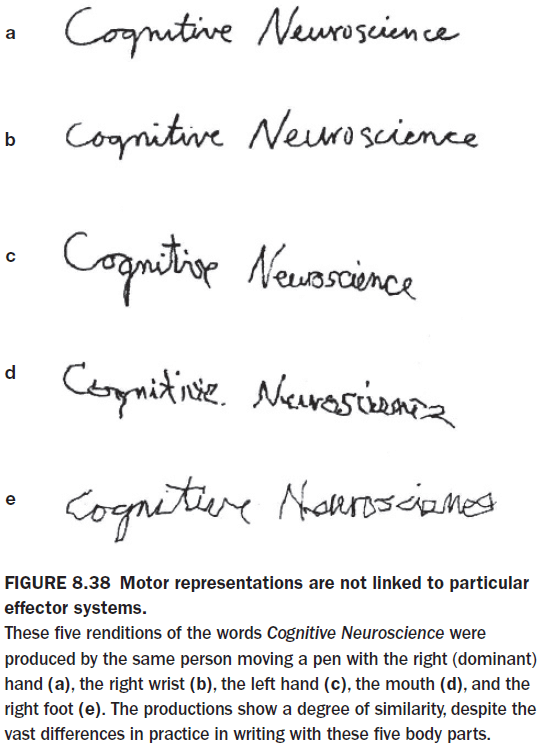
- The first effects of learning likely start at the abstract level rather than the concrete level.
- Gradually, the motor system learns to execute the movement in what feels like an automatic manner, requiring little conscious thought.
- One form of learning is adaptive learning through sensory feedback.
- Results show that the cerebellum is essential for learning new motor maps, but that M1 is important for consolidating the new maps.
- Both rewards and errors help us learn.
- We can also use our predictions as a form of feedback to learn from.
- E.g. The arrow landed further than expected or the piano sound was lower than expected.
- Sensory prediction errors: when the actual feedback doesn’t match the predictions.
- It can take 50 to 150 ms for a motor command to be generated and for the sensory prediction error to return to the cortex.
- This is too long of a delay for learning and the brain compensates for this by generating a forward model.
- Forward model: an expectancy of the sensory consequences of our action.
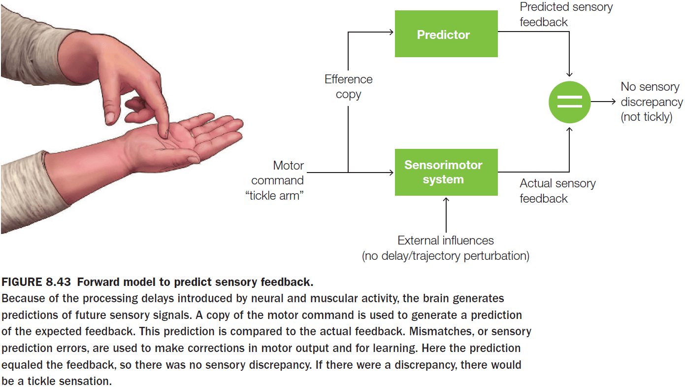
- The cerebellum is a key part of the neural network for the generation of forward models.
- It receives a copy of motor signals being sent to the muscles from the cortex - information that can be used to generate sensory predictions.
- By comparing motor signal copies and sensory input, the cerebellum can ensure that the ongoing movement is produced in a coordinated manner.
- This may also explain why stimulation of the cerebellum results in faster learning because it amplifies the error signals.
- In general, activation in the cerebellum decreases with practice, which matches the observation that errors go down as more practice is done.
- Forward models also explain why you can’t tickle yourself - a forward model generates a prediction of the expected sensory input when you try to tickle yourself so the actual sensory information isn’t surprising.
- Prediction is a feature of all brain areas.
- The cerebellum, however, seems special in that it generates predictions that are temporally precise.
- Once a movement sequence has been learned by a rat, the motor cortex isn’t essential for the precise execution of the movement.

## Chapter 9: Memory

- Big questions
    - What’s forgotten in amnesia and are all forms of amnesia the same?
    - Are memories about personal events processed in the same way as procedural memories for how to perform a physical task?
    - What brain systems have proved to be critical for the formation of long-term memory?
    - Where are memories stored in the brain, and by what cellular and molecular mechanisms?
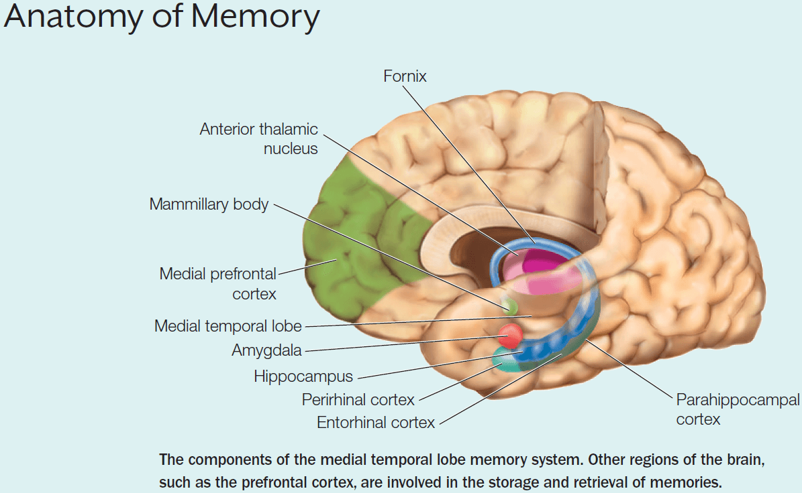
- Learning: the process of acquiring new information.
- The outcome of learning is memory. That is, a memory is created when something is learned.
- Some forms of memory are described as “mental time travel” where the act of remembering something is to reexperience the context of a past experience in the present.
- We have several types of memory mediated by different systems
    - Sensory memory: milliseconds to seconds.
    - Short-term memory: seconds to minutes.
    - Working memory: seconds to minutes.
    - Long-term memory: decades.
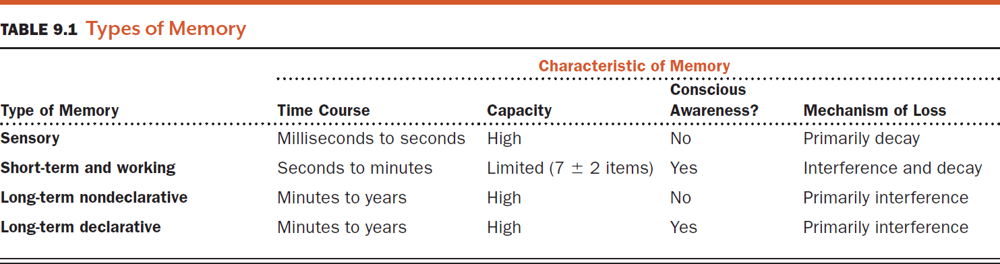
- Long-term memory is commonly divided into two forms
    - Declarative: conscious memory.
        - Semantic: facts.
        - Episodic: experiences.
    - Nondeclarative: unconscious memory.
        - Perceptual priming: a change in the response to a stimulus following prior expose to that stimulus.
        - Conditioned responses: pairing an unconditioned stimulus (US) with a conditioned stimulus (CS) to evoke a conditioned response (CR).
        - Non-associative learning: learning that doesn’t involve the association of two stimuli to elicit a behavioral change.
- Three main stages of learning and memory
    - Encoding: the processing of incoming information and experiences.
        - Acquisition: a period of time where sensory stimuli are available in a sensory buffer.
        - Consolidation: when changes in the brain stabilize a memory over time.
    - Storage: the retention of memory traces.
    - Retrieval: accessing stored memory traces.
- Learning can be achieved in multiple ways and it appears that different parts of the brain are specialized for different types of learning.
- E.g. Reinforcement learning in the basal ganglia, trial-and-error learning in the cerebellum, and fear learning in the amygdala.
- Amnesia: memory deficits and loss.
- Two types of amnesia
    - Anterograde: loss of memory for events after a lesion occurs. It results from the inability to learn new things.
    - Retrograde: loss of memory for events before a lesion occurs.
- Retrograde amnesia tends to be greatest for most recent events. This effect is known as a temporal gradient or Ribot’s law.
- Only bilateral resection of the hippocampus results in severe amnesia. In comparison, unilateral resection results in no residual memory deficits.
- Key ideas from patient H.M.
    - The transfer of information from short-term to long-term storage had been disrupted.
    - H.M. could still learn some things such as motor skill tasks.
    - There’s a dissociation between remembering the experience of learning (declarative) and the actual learned information (nondeclarative).
    - Previously, it had been thought that memory couldn’t be separated from perceptual and intellectual functions. H.M., however, reveals that memory is distinct from these processes.
- Growing evidence suggests that long-term memories can be partially dissociated from one another, as expressed in their differential sensitivity to brain damage.
- Dementia: an umbrella term for the loss of cognitive function in different domains beyond what’s expected in normal aging.
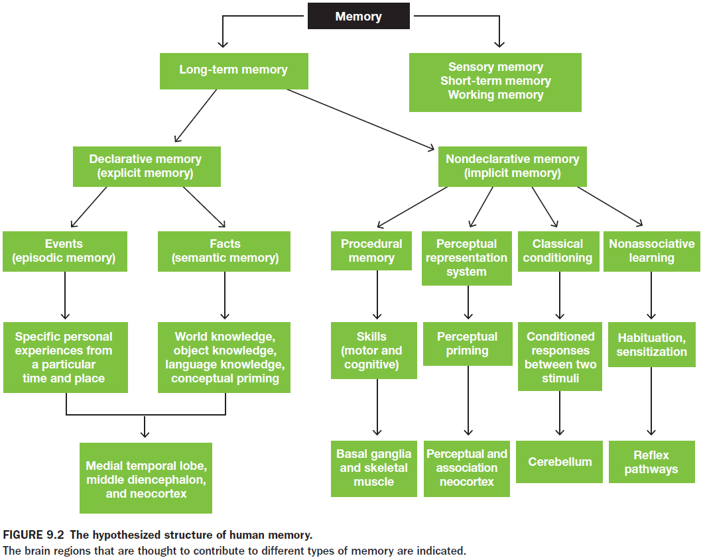
- Sensory memory is like a sort of echo in your head, the stimulus repeats weakly after the initial stimulation.
- There are different types of sensory memory for each sense
    - Echoic: auditory.
    - Iconic: vision.
- Sensory memories are stored in the sensory structures as a short-lived neural trace but they have a relatively high capacity.
- In short-term memory, information can be lost by decay or interference.
- A key question in the study of memory is whether memories have to be encoded in short-term memory before being stored in long-term memory.
- Evidence supports the idea that short-term memory isn’t the gateway to long-term memory as there are patients with impaired short-term memory but normal long-term (patient E.E.), and there are patients with impaired long-term but normal short-term (patient H.M.).
- Together, these two different patterns of memory deficits present an apparent double dissociation for the short- and long-term retention of information.
- Some researcher argue that this isn’t a strong double dissociation as the testing done for the short-term didn’t match the testing done for the long-term.
- Working memory extends the concept of short-term memory by also using the contents of memory for manipulation.
- E.g. Addition requires holding both numbers and the answer in your head.
- Experiments find that working memory uses an acoustic code rather than a semantic code, because words that sound similar interfere with one another, whereas words related by meaning don’t.
- Episodic memory differs from personal knowledge in that you experience it.
- E.g. You know the day you were born but you didn’t experience being born.
- Episodic memory also differs from autobiographical memory, which is a mix of episodic memory and personal knowledge.
- Episodic memories always include the self as the agent or recipient of some action.
- Semantic memory, in contrast, is objective knowledge that doesn’t include the context that it was learned.
- E.g. The fact that the sky is blue is independent of your personal experience.
- During human development, episodic and semantic memory appear at different ages.
- The ability to form habits and to learn procedures and rote behaviors depends on procedural memory.
- Procedural memory is independent of declarative memory as some patients with declarative memory deficits can still learn and improve their performance on procedural tasks.
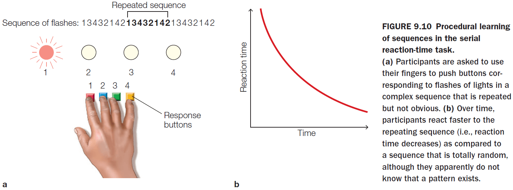
- Procedural memory appears to depend on the corticobasal ganglia loops.
- Priming is also independent of declarative memory as a double dissociation has been found between them.
- The formation of new declarative memories depends on the medial temporal lobe (MTL).
- In the case of patient H.M., the original surgeon’s report was false in stating that all of H.M.’s hippocampi were removed as later confirmed in MRI scans that the posterior hippocampus was intact.
- Evidence shows that the hippocampus is involved in long-term memory acquisition and the cortex surrounding the hippocampus is critical for normal hippocampal memory function.
- Review of place cells, head direction cells, and grid cells in the hippocampus.
- The encoding processes that identify an item as being familiar (recognition) and that correctly identify the item as having been seen before (recollection) depend on different regions of the MTL.
- During retrieval, the hippocampus was selectively active only for words that were correctly recollected, thus indicating an episodic memory.
- A double dissociation in the MTL for encoding different forms of memory
    - MTL mechanism with perirhinal cortex supports familiarity-based recognition memory.
    - Hippocampus and posterior parahippocampal cortex supports source-based recognition memory.
- Binding problem: how the brain bundles various types of information to form an episodic memory.
- E.g. Remembering the first time you went to high school, the people you met, the new classrooms and teacher, the new smells, the excitement and emotions.
- Evidence from multiple studies indicates that the MTL supports different forms of memory and that these different forms (recollection vs familiarity) are supported by different subdivisions of the MTL.
- The hippocampus is involved in the encoding and retrieval of episodic memories, while the areas outside the hippocampus (especially the perirhinal cortex) are involved in recognition based on familiarity.
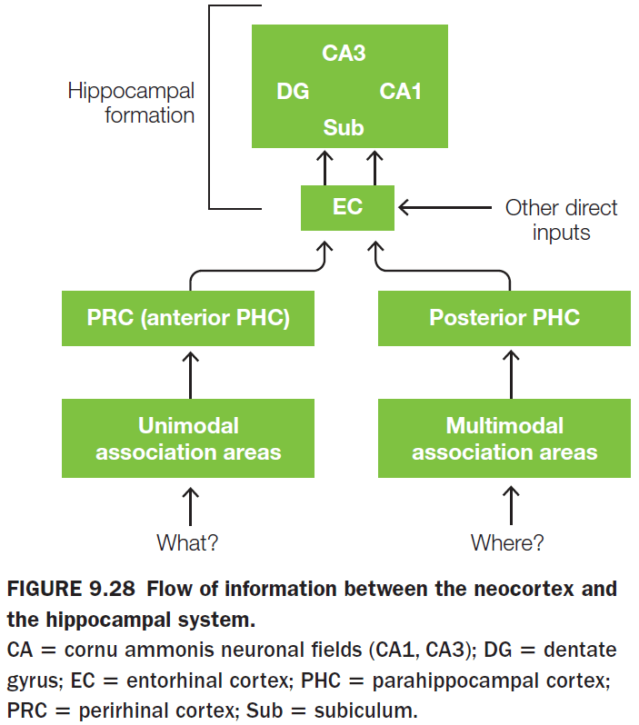
- Relational memory: memory for relations between elements such as time, place, and person.
- Relational memory may be coded during retrieval by reactivation of the neocortical areas that provided input to the hippocampus during the original encoding.
- The reactivation, however, didn’t activate the lower-level sensory cortical regions but activated the later stages of visual and auditory association cortex, where incoming signals would have been perceptually processed.
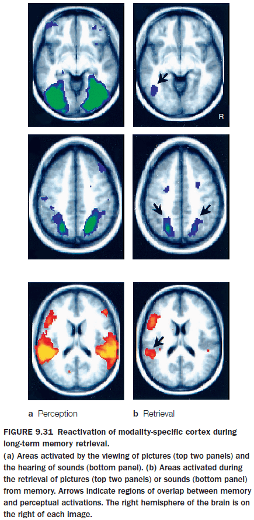
- True memories are associated with greater activity in the MTL and sensory areas, while false memories are associated with greater activity in frontal and parietal portions of the retrieval network.
- Successful memory retrieval is consistently associated with activity in the lateral posterior cingulate cortex, including the retrosplenial cortex.
- Consolidation: the process that stabilizes a memory over time.
- Consolidation processes occur at the cellular level and the systems level.
- Evidence for consolidation comes from patients with retrograde amnesia where their most recent memories are lost but their older memories are retained.
- Two theories for memory consolidation
    - Standard consolidation theory
        - The representations of an event are distributed throughout the cortex.
        - Those representations come together in the MTL and are bound by the hippocampus.
        - Though some unknown interaction between the MTL and neocortex, the ability to retrieve the bound information is slowly transferred to the neocortex.
        - Consolidation occurs after repeat reactivation of the memory creates direct connections within the cortex itself so that it no longer requires the hippocampus as the middleman to bind them.
        - Successfully explains why retrograde amnesia has a temporal gradient.
        - Fails to explain why some people with amnesia due to hippocampal damage have good long-term memory and others have severe loss.
    - Multiple trace theory
        - Long-term stores for semantic information rely solely on the neocortex.
        - Episodic memory, consolidated or not, continues to rely on the hippocampus for retrieval.
        - A new memory trace is set down in the hippocampus every time an episodic memory is retrieved.
        - The more a memory is retrieved, the more traces are set down.
        - Suggests that episodic memories degrade over time and are slowly converted into semantic memory.
- Sleep studies suggest that the hippocampus helps to consolidate memory by replaying the neuronal firing of the spatial and temporal patterns that were first activated during awake learning.
- Researchers have long believed that the synapse is the structure involved in memory.
- Review of Hebb’s rule, Hebbian learning, long-term potentiation (LTP), long-term depression (LTD).
- Three major excitatory neural pathways of the hippocampus
    1. Perforant Pathway
    2. Mossy fibers
    3. Schaffer collaterals

- Three properties of LTP in the CA1 synapses
    - Cooperativity: more than one input must be active at the same time.
    - Associativity: weak inputs are potentiated when co-occurring with stronger inputs.
    - Specificity: only the stimulated synapse shows potentiation.
- For LTP to be produced, the postsynaptic cells must be depolarized.
- NMDA receptors are central to producing LTP but not to maintaining it.

## Chapter 10: Emotion

- Big questions
    - What is an emotion?
    - What role do emotions play in behavior?
    - How are emotions generated?
    - Is emotion processing localized, generalized, or a combination of the two?
    - What effect does emotion have on the cognitive processes of perception, attention, learning, memory, and decision making, and on our behavior? What effect do these cognitive processes exert over our emotions?
    - How do we become aware of our emotions?
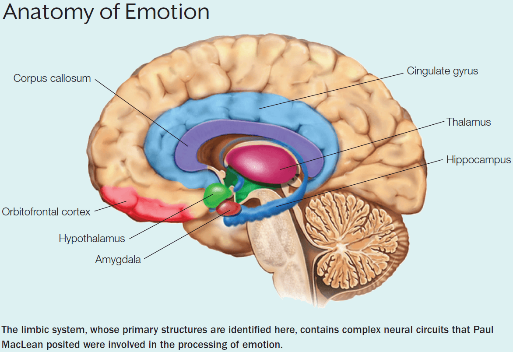
- People have been struggling to define emotions for several thousand years.
- Unique qualities of emotion
    - Embodied: you feel them.
    - Recognizable: they’re associated with characteristic facial expressions and behavioral patterns.
    - Triggered by stimuli.
    - Less susceptible to our intentions.
    - Global effects on cognition.
- Feeling: the subjective experience of an emotion but not the emotion itself.
- Emotions and feelings are different and they use different neural systems.
- E.g. You can understand someone’s emotions but you don’t feel them.
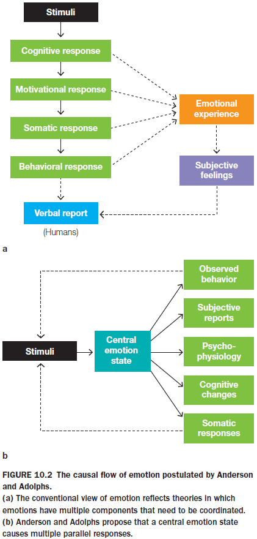
- Emotions have at least three components and every theory of emotion generation is an attempt to explain these components.
    - A physiological reaction to a stimulus
    - A behavioral response
    - A feeling
- The underlying mechanisms and timing of components are disputed.
- Affect: a more general term for emotion that also encompasses longer-lasting states.
- Stress: a fixed pattern of physiological and neurohormonal changes.
- Mood: a long-lasting diffuse affective state that is characterized by the enduring subjective feelings without an identifiable object or trigger.
- Limbic system: the complex neural circuits involved in processing emotion.
- The structures of the limbic system roughly form a rim around the corpus callosum and has been extended to include the medial surface of the cortex, portions of the basal ganglia, the amygdala, and the orbitofrontal cortex.
- Patient S.M.’s case, where bilateral amygdala damage resulted in not feeling fear, supports the idea that there isn’t a single emotional circuit, but rather specific circuits for specific emotions.
- To study emotions, researchers have divided it into three categories
    1. Basic emotions: a closed set of emotions, each with unique characteristics.
    2. Complex emotions: combinations of basic emotions.
    3. Dimensional theories of emotion: describes emotions that are the same but that differ along one or more dimensions, such as valence and arousal.
- We often describe basic emotions as being innate and similar in all humans and many animals.
- Each emotion produces predictable changes in sensory, perceptual, motor, and physiological functions that can be measured and thus provide evidence that the emotion exists.
- Ekman’s six basic emotions
    1. Anger
    2. Fear
    3. Sadness
    4. Disgust
    5. Happiness
    6. Surprise
- Three main characteristics of basic emotions
    - Innate
    - Universal
    - Short-lasting
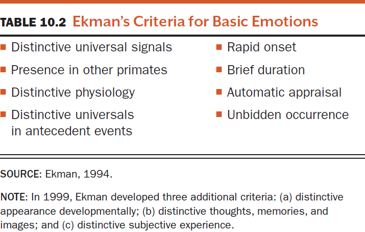
- Complex emotions encompass emotions that aren’t basic and that are produced by a broad network of regions within the brain.
- E.g. Parental love, jealousy, romantic love.
- Most researchers agree that emotional responses can be characterized by two factors
    - Valence: pleasant to unpleasant.
    - Arousal: intensity.
- E.g. Finding $5 on the ground versus winning $10 million in a lottery. Both evoke happiness but to a different intensity.
- Yet a person can experience two emotions with opposite valences at the same time.
- E.g. Scared and excited on a roller coaster, happy and sad in a bittersweet movie ending.
- These situations suggest that positive and negative emotions have different underlying mechanisms that they can be activated simultaneously.
- Positive activation states are correlated with an increase in dopamine, while negative activation states are correlated with an increase in norepinephrine.
- James-Lange Theory of Emotion
    - Physiological changes precede a feeling.
    - E.g. You don’t feel afraid and then run from a bear, you run first and then feel afraid because you are running.
    - Your emotional reaction depends on how you interpret those physical reactions.
    - People couldn’t feel an emotion without first having a bodily reaction.
    - While this remains an acknowledged theory, problems soon appear.
    - Evidence against this theory comes from experiments on cats where severing the cortex from the brainstem still evokes an emotional reaction without feedback from the body.
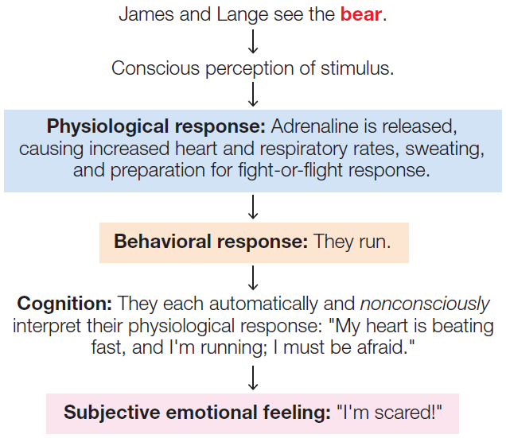
- Cannon-Bard Theory of Emotion
    - We simultaneously experience emotions and physiological reactions.
    - Reactions to emotional stimuli could occur without the cortex.
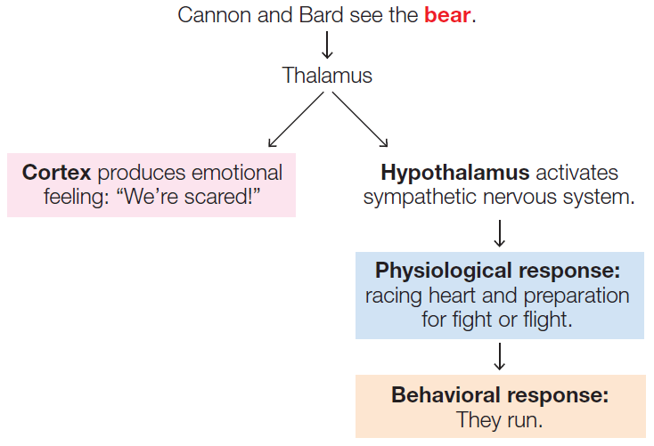
- Appraisal Theory of Emotion
    - Emotion processing depends on an interaction between the stimulus properties and their interpretation.
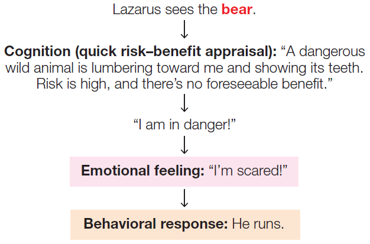
- Singer-Schachter Theory of Emotion
    - A blend of all three of the preceding theories.
    - Emotional arousal and then reasoning are required to appraise a stimulus before the emotion can be identified.
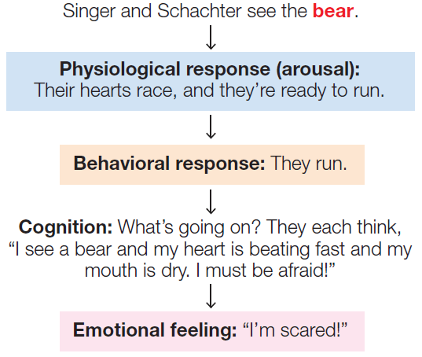
- LeDoux Theory of Emotion
    - We have two emotion systems operating in parallel.
    - A fast system that bypasses the cortex and was hardwired by evolution to produce fast responses to increase our chances of survival and reproduction.
    - A slow system that includes cognition so it’s slower but more accurate.
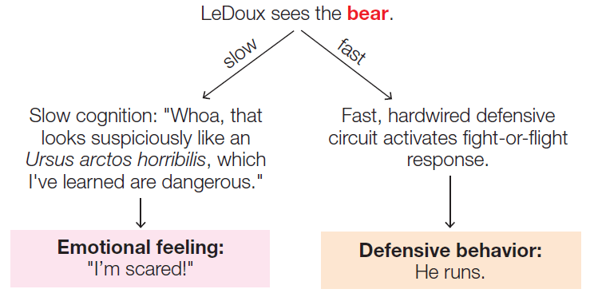
- Evolutionary Psychology Theory of Emotion
    - Emotions are an overarching program that directs the cognitive subprograms and their interactions.
    - Emotion isn’t reducible to physiology, behavior, or feeling states.
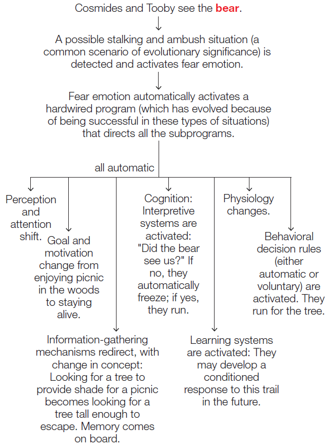
- Panksepp’s Hierarchical Processing Theory of Emotion
    - Emotions are subject to a control system with hierarchical processing.
    - There are three ways an emotion can be processed.
    - The first is the processing of core emotions via ancient subcortical structures. Cognition plays no role when it comes to feeling core emotions.
    - The second is the processing of learned emotions.
    - The third is the processing of emotions that are elaborated by cognition.
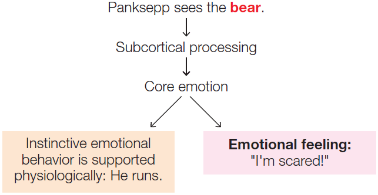
- Anderson and Adolphs Theory of Emotion
    - Emotional stimuli activate a central nervous system state that, in turn, simultaneously activates multiple systems producing separate responses.
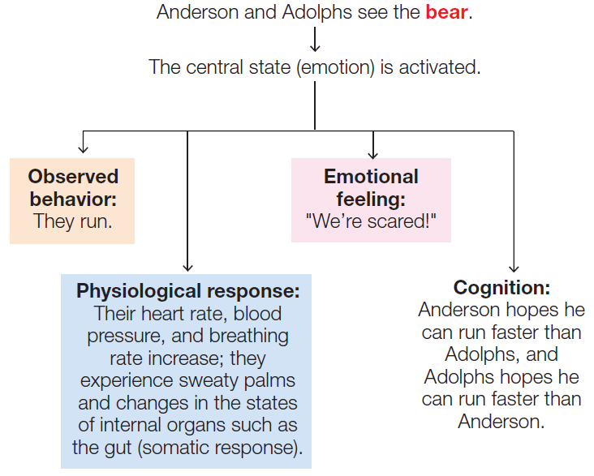
- Kluver-Bucy syndrome: a lack of fear.
- Although humans with amygdala damage don’t show all of the signs of Kluver-Bucy syndrome, they do show deficits in fear processing.
- E.g. Patient S.M. that exhibited a lack of cautiousness and distrust.
- Facts about patient S.M.
    - The amygdala must play a critical role in identification of facial expressions of fear.
    - S.M. fails to experience the emotion of fear; S.M doesn’t feel fear.
    - S.M. appears to have no deficits in any emotion other than fear.
    - S.M.’s inability to feel fear contributes to her inability to avoid dangerous situations.
- The amygdala is the most connected structure in the forebrain.
- Although we have some innate fears, we still need to learn of other things to be afraid of.
- E.g. Conjured up fictions such as ghosts, vampires, and monsters.
- Emotional learning can be both implicit and explicit.
- Implicit emotional learning: learning to fear a stimulus without being told.
- Explicit emotional learning: learning to fear a stimulus by being told.
- These two types of emotional learning appear to be associated with two different pathways.
- Evidence for this comes from a patient that had no long-term declarative memory (doctor had to reintroduce himself every time they met) but could still learn to associate the doctor’s handshake with pain.
- Fear conditioning: a type of Pavlovian learning where a neutral stimulus acquires aversive properties when paired with an aversive event.
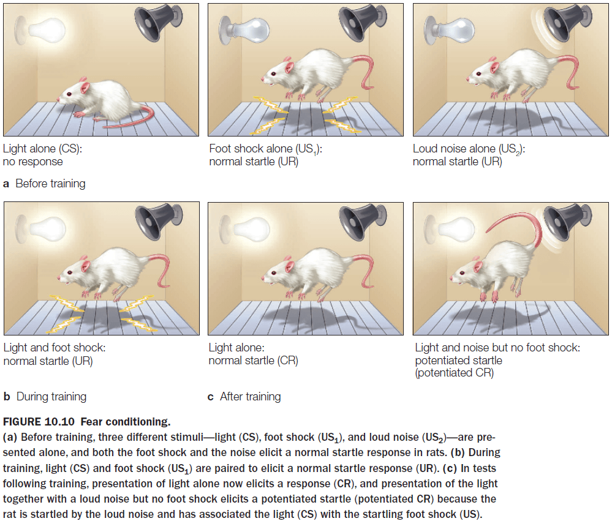
- Damage to the amygdala impairs conditioned fear responses by not pairing the conditioned stimulus with the unconditioned stimulus.
- The amygdala receives sensory input along two pathways
    - Low road: signals that bypass the cortex and quickly reach the amygdala.
    - High road: signals that go through the cortex and slowly reach the amygdala.
- By using this two-pathway system, the amygdala can make few low-risk errors but it will catch all high-risk errors. This ensures that all high-risk errors are caught before they affect survivial.
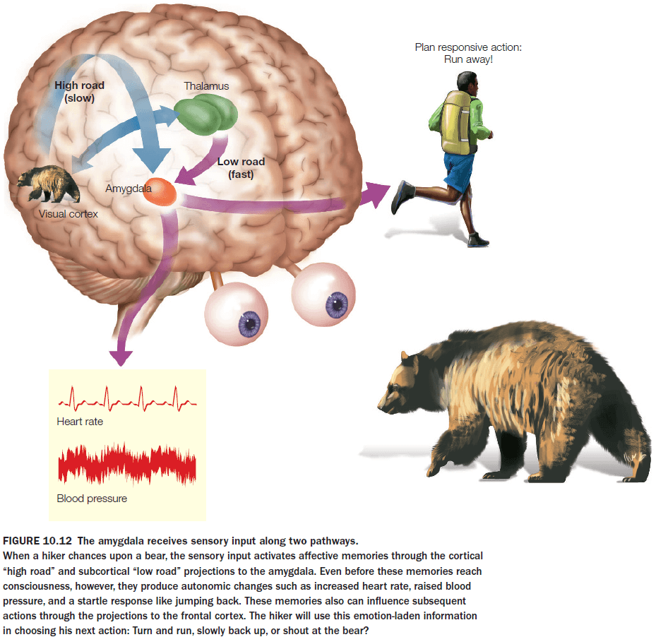
- Evolution suggests that the amygdala might be sensitive to certain types of stimuli such as animals.
- Two pieces of evidence support this theory
    - Biological motion. The ability to recognize biological motion is innate and our brain uses it to categorize the stimulus as either animate or inanimate.
    - Single-cell recordings from the amygdala have a preferential response to pictures of animals but not to any other categories.
- The amygdala isn’t necessary for generating physiological changes but it’s necessary for pairing sensory stimuli with affect.
- Interestingly, patients with amygdala damage can have conscious knowledge that they don’t have fear conditioning, but this doesn’t change the fact that they don’t experience fear conditioning.
- This result presents a serious challenge to theories of emotion generation that require cognition.
- The reverse association occurs in patients with bilateral hippocampal damage where they show a normal response to the conditioned stimulus but they are unable to report that the conditioned stimulus caused their physiological response.
- They had the physiological response without cognitive input from conscious memory.
- This double dissociation between patients with amygdala lesions and patients with hippocampal lesions is evidence that the amygdala is necessary for the implicit expression of emotional learning, but not for all forms of emotional learning and memory.
- The hippocampus is necessary for acquiring the explicit/declarative knowledge of the emotional properties of a stimulus, while the amygdala is necessary for acquiring and expressing the implicit/nondeclarative conditioned fear response.
- Explicit learning: learning to fear a stimulus because we’re told to fear it.
- Explicit learning is common in humans.
- E.g. Fear snakes, spiders, ghosts, etc not because we’ve experienced a fear response to them, but because someone else told us to fear them.
- When a person explicitly learns to fear a stimulus, that hippocampal-dependent memory about the emotional properties of that stimulus can influence amygdala activity.
- E.g. If we’re told that a certain dog will bite you, you will feel fear towards that dog.
- But does the reverse occur? Can the amygdala modulate the activity of the hippocampus? Can the amygdala influence what you learn and remember about an emotional event?
- The memories that last over time are those of emotional or important events. They seem to have a persistent vividness that other memories lack.
- Two facts about the amygdala’s effect on the hippocampus
    - The amygdala’s role is modulatory. It isn’t necessary for learning hippocampal-dependent tasks, but it is necessary for arousal-dependent modulation of memory.
    - The amygdala modulates hippocampal, declarative memory by enhancing retention, rather than by altering the initial encoding of the stimulus.
- Additional evidence also suggests that the amygdala interacts directly with the hippocampus during the initial encoding phase and not just the consolidation phase.
- Patients with unilateral amygdala damage reveal that the right amygdala is most important for the retrieval of autobiographical emotional memories with negative valence and high arousal.
- fMRI studies show that amygdala activity correlates with an enhanced recollection of the stimuli, so the more active the amygdala, the stronger the memory.
- The amygdala appears to enhance a memory by changing the rate of forgetting. In other words, arousal may alter how quickly we forget.
- Normal people show less forgetting over time for arousing stimuli compared to non-arousing stimuli, while patients with amygdala lesions forget both at the same rate.
- Studies converge on the conclusion that the amygdala acts to modulate hippocampal consolidation for arousing events, but not for all of the effects of emotion.
- Emotional events are more distinctive and unusual than are everyday life events, and they form a specific class of events.
- Inconsequential information can be retroactively tagged as relevant if related information is later associated with an emotional response.
- E.g. We can often remember events right before an emotional event such as the night before a graduation/wedding.
- Attentional blink: a phenomenon often observed during rapid serial presentations of visual stimuli, in which a second salient target that is presented between 150 and 450 ms after the first one goes undetected.
- The amygdala is critical in bringing an unattended but emotional stimulus into conscious awareness by providing some feedback to the primary sensory cortices, thus affecting perceptual processing.
- The amygdala can enhance perception of an emotion-laden stimulus without the aid of attention.
- Emotion-laden stimuli receive greater attention and priority in perceptual processing.
- Not only does stimuli with inherent emotional significant change sensory processing, but neutral stimuli that acquire emotional significance through fear conditioning also trigger changes in sensory processing.
- It’s believed that emotion leads people to make suboptimal and sometimes irrational decisions.
- E.g. “Smart decisions are made with the head, impulsive decisions are made with the heart”.
- Dual-systems theory: the hypothesis that emotion and reason are separable in the brain and compete for control of behavior.
- Dual-systems theory has not been supported by evidence.
- There is no unified system in the brain that drives emotion, so emotion and reason aren’t separable.
- Some of our most adaptive decisions are driven by emotional reactions.
- Damage to the orbitofrontal cortex (OFC) impairs decision making which is surprising since the OFC handles many emotional functions.
- Because emotion was considered a disruptive force in decision making, it was surprising that impairing a region involved in emotion would result in impaired decision making.
- Somatic marker hypothesis: emotional information is needed to guide decision making.
- Two ways in which emotion influences decision making
    - Incidental affect: current emotional states just happens to influence the decision.
    - Integral emotion: emotions elicited by the choice options are incorporated into the decision.
- Acute stress leads to an increased reliance on default or habitual responses.
- This suggests an explanation for why we often revert to bad habits, such as eating junk food or smoking, when stressed.
- There is strong evidence that the amygdala plays a critical role in mediating aversion to losses, which is consistent with the amygdala’s role in threat detection.
- You feel regret because you’re able to think counterfactually.
- There’s a dissociation between identifying a face and recognizing the emotional expression on that face.
- Normal people consistently rely on the eyes to make decisions about a facial expression.
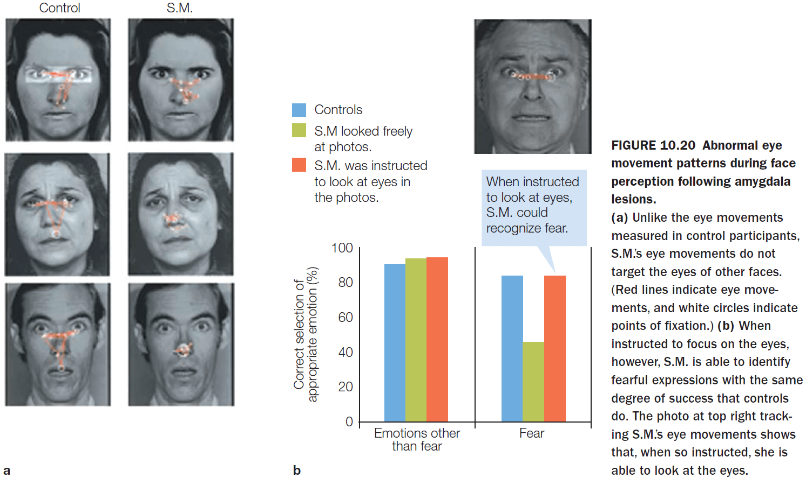
- In patient S.M., however, she consistently avoided looking at eyes which explains why she couldn’t detect faces expressing fear.
- The identifying feature of a fearful expression is the increase in the white region of the eyes.
- When patient S.M. was told to focus on the eyes, she no longer had any difficulty identifying fearful faces.
- So the amygdala appears to be an integral part of a bottom-up system that automatically directs visual attention to the eyes while encountering any facial expression.
- The amygdala seems to have a role in perceiving and interpreting emotion and sociability in a wide range of stimuli, and may play a role in our ability to anthropomorphize.
- The amygdala, while involved in a variety of emotional tasks, isn’t the only area of the brain necessary for emotions.
- There’s a significant correlation between the insular cortex’s activity and interoception.
- Interoception: the perception of the internal bodily states.
- E.g. Thirst, touch, itch, bladder, exercise, and heartbeat.
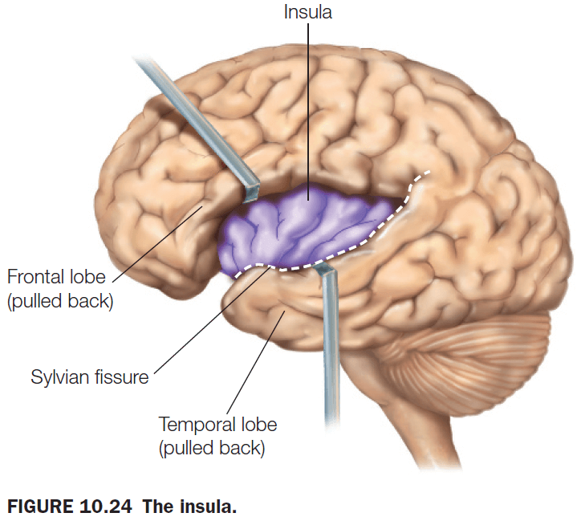
- We have a cerebral cortex for managing the external world and an insular cortex for managing the inner world.
- The connections and activation profiles of the insula suggest that it integrates visceral and somatic input and forms a representation of the state of the body.
- Several models of emotion speculate that direct access to bodily states is necessary to experience emotion.
- There’s also a difference between experiencing an emotion and knowing that we are experiencing it.
- Disgust is one emotion that has been linked directly to the anterior insula.
- Happiness has been difficult to study due to the difficulty in inducing it and because it isn’t necessarily the opposite of sadness.
- Love, however, is easier to study and it has been found to activate many different brain regions.
- No activation of the amygdala has been reported in fMRI studies of love, but it has been reported for lust.
- Each type of love (maternal, passionate, and unconditional) recruits a different specific brain network.
- Emotion regulation: the processes that influence the types of emotions we have, when we have them, and how we express and experience them.
- We are so adept at controlling our emotions that we tend to notice only when someone doesn’t.
- E.g. The angry customer or the depressed friend overwhelmed with sadness.
- Reapppraisal: altering the emotional impact of the stimulus by reevaluating the situation.
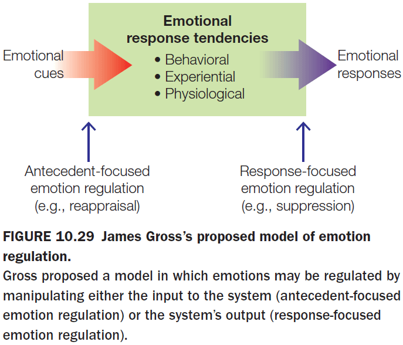
- Conscious reappraisal reduces the emotional experiences and this supports the idea that emotions, to some extent, are subject to conscious cognitive control.

## Chapter 11: Language

- Big questions
    - How does the brain derive meaning from language?
    - Do the processes that enable speech comprehension differ from those that enable reading comprehension?
    - How does the brain produce spoken, signed, and written output to communicate meaning to others?
    - What are the brain’s structures and networks that support language comprehension?
    - What are the evolutionary origins of human language?
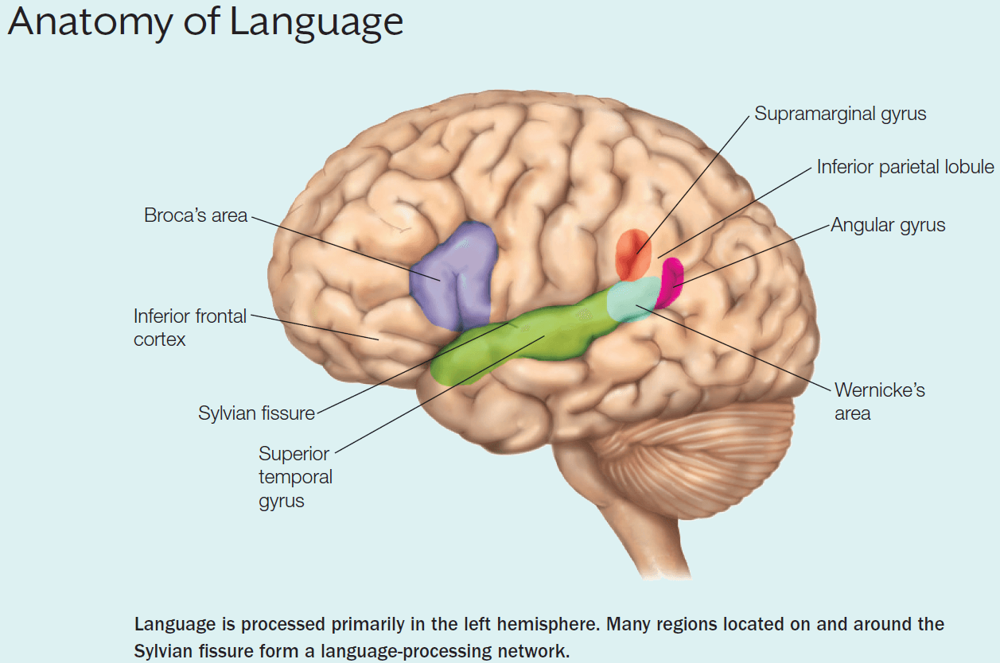
- From patient H.W., we now know that retrieval of object knowledge isn’t the same as retrieval of the linguistic label/name of the object.
- Our apparent ease in communicating has complex underpinnings in the brain.
- Language is perhaps the most specialized and refined of our higher functions. It’s unique in that only humans possess a true and elaborate language system.
- Language input can be auditory (speech), visual (text), or tactile (braille).
- Language processing is lateralized to the left-hemisphere regions surrounding the Sylvian fissure.
- Aphasia: a broad term referring to the collective deficits in language comprehension and production.
- Review of Broca’s aphasia (speech, syntax, and grammar problems), Wernicke’s aphasia (language comprehension problems), and conduction aphasia (problems repairing their own speech errors).
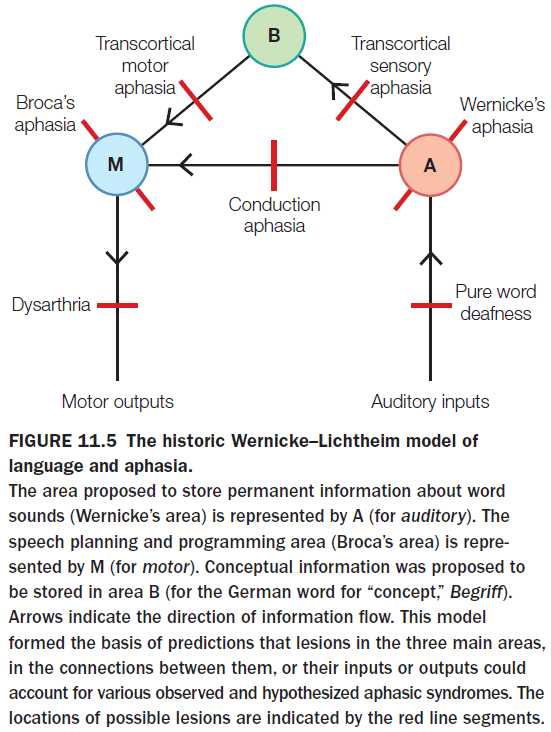
- The historic Wernicke-Lichtheim model of language can account for many forms of aphasia, but it doesn’t explain others and it doesn’t fit with our most current knowledge of language.
- The brain must store representations of words and their associated concepts.
- A word in a spoken language has two properties
    - Meaning
    - Phonological (sound) / Orthographic (visual) form
- Mental lexicon: a mental store of information about words that includes the word’s meaning (semantic), how to combine the word to form sentences (syntax), and the details of the word’s spellings and sound patterns (word form).
- Three general functions using the mental lexicon
    - Lexical access: the stage of processing that activates word-form representations.
    - Lexical selection: the stage where the brain identifies which representation best matches the input.
    - Lexical integration: the final stage where words are integrated into a full sentence.
- A normal adult speaker has passive knowledge of about 50,000 words, and yet can easily recognize and produce about three words per second.
- Given the speed and size of the database, the mental lexicon must be organized in a highly efficient manner.
- Four organizing principles of the mental lexicon
    1. Morpheme: the smallest meaningful representational unit in a language and in the mental lexicon.
        - E.g. Frost, defrost, and defroster. The root word “frost” is one morpheme, “de” is another morpheme, and “er” is another morpheme.
    2. More frequently used words are accessed more quickly than less frequently used words.
        - E.g. “Half” is more readily available than “duality”.
    3. Phoneme: the smallest unit of sound that makes a difference in meaning. The lexicon is organized into groups made of words that differ from each other by a single letter or phoneme. When incoming words access one word representation, other items in its lexical neighborhood are also accessed.
        - E.g. Bat, cat, hat, sat.
    4. Representations in the mental lexicon are organized according to semantic relationships between words.
        - E.g. When we see “car”, we’re faster and more accurate at making lexical decisions when the following word is semantically related like “truck”.
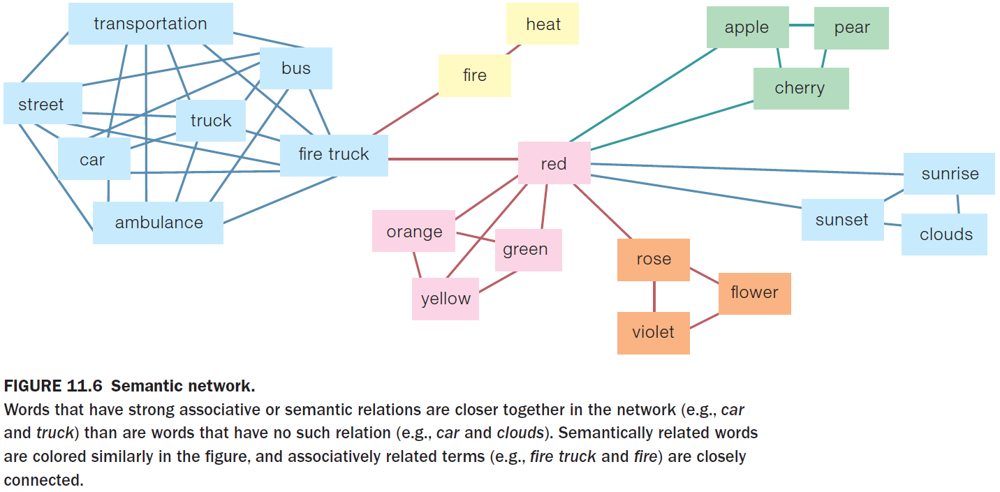
- A semantic network, while it’s a good start to model the mental lexicon, has issues and we don’t have a consensus on a model of how word meanings are represented.
- Issues such as how nodes in the network are activated and how prototypical examples of a semantic category are reflected in the network.
- Everyone agrees that a mental store of word meanings is crucial to normal language comprehension and production.
- Neurological evidence from a variety of disorders provides support for the semantic-network idea because related meaning are substituted, confused, or lumped together, as we would predict from the degrading of a system of interconnected nodes that specifies meaning relation.
- There are many cases of patients with category-specific deficits and there appears to be a striking match between sites of lesions and the type of semantic deficit.
- E.g. Lesions to the inferior and medial temporal cortex impaired the category of living things.
- The brain uses some of the same processes to understand both spoken and written language, but there are also some differences in the early processing due to the different modality.
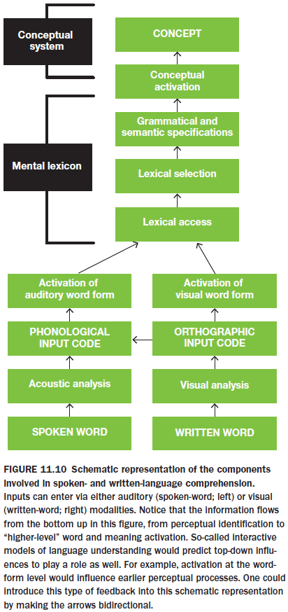
- Written language may also use auditory processing by turning visual words into sound words.
- The building blocks of spoken language are phonemes and different languages use different sets of phonemes.
- Infants have the perceptual ability to distinguish all possible phonemes during their first year of life, but they become sensitive to the phonemes of the language they experience on a daily basis.
- The babbling and crying sounds that infants make from ages 6 to 12 months grow more and more similar to the phonemes that they most frequently hear.
- By the time babies are 1 year old, they don’t produce and perceive nonnative phonemes.
- Speech is more difficult to hear (compared to written words) because
    - There are variances in sound such as male and female speakers.
    - Phonemes don’t appear as separate chunks of information.
    - Speech signals aren’t clearly segmented and it can be difficult to discern where one word begins and another word ends.
- When we speak, there are no pauses between phonemes and none between words.
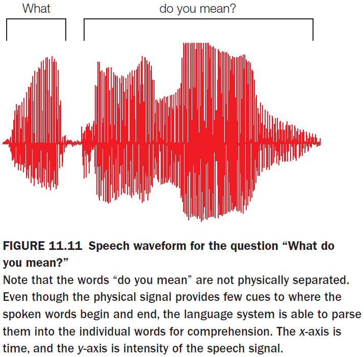
- Segmentation problem: how we differentiate auditory sounds into separate words.
- One important clue to divide speech is the prosodic information, which is the speaker’s rhythm and pitch.
- E.g. Raising the frequency at the end of a sentence to indicate a question.
- Another clue is the use of syllables to establish word boundaries.
- The superior temporal cortex is important for sound perception.
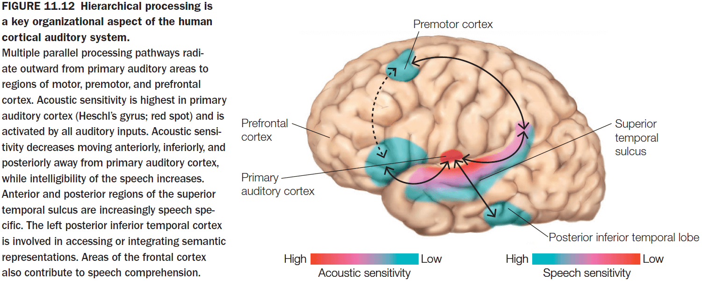
- Wide regions of the left temporal lobe are critical for auditory speech perception.
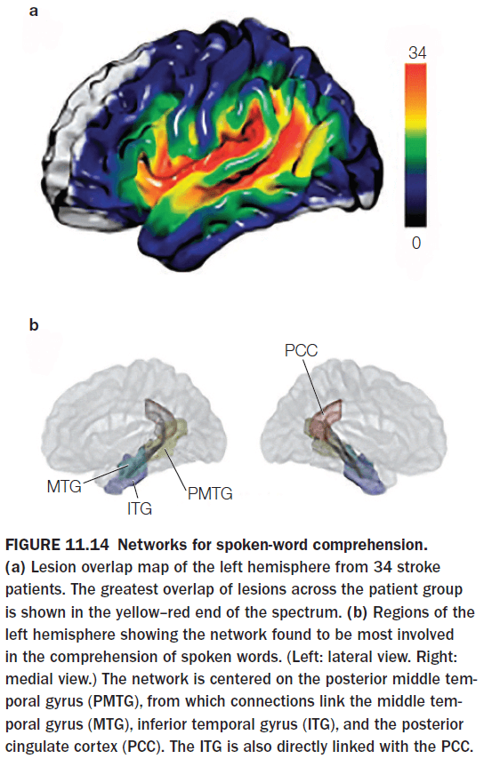
- Reading is a recent invention; about 5,500 years old.
- Although speech comprehension develops without explicit training, reading requires instruction.
- Words can be symbolized in writing in three different ways
    - Alphabetic
        - E.g. English
    - Syllabic
        - E.g. Japanese
    - Logographic
        - E.g. Chinese
- An early model of written language was the pandemonium model where demons at lower levels provided information to the demon above it to recognize a word.
- The model doesn’t allow for top-down feedback through so it can’t explain the word superiority effect.
- Visual word form area (VWFA): regions of the occipital cortex that preferred word strings.
- Written-word processing takes place in the VWFA and damage to this area causes pure alexia.
- Alexia: a condition where patients can’t read words even though other aspects of language are normal.
- If the initial word processing happens in the right hemisphere, it’s transferred to the VWFA in the left hemisphere through the posterior corpus callosum.
- Activation of the VWFA is reproducible across cultures that use different types of symbols including syllabic and logographic.
- Does context influence word processing before or after the processing?
- E.g. “The tall man planted a tree on the bank.” Bank can refer to two meanings, either a financial institution or the side of a river.
- Does word processing activate both meanings and then selects the one that fits the context, or does it only activate the contextual meaning?
- Experiments support the latter as the meaning selection process is influenced by the contextual information before the whole word was spoken.
- Syntax helps to disambiguate the meaning of words by allowing for a predictable structure.
- Unlike the representation of words and their syntactic properties, representations of whole sentences aren’t stored in the brain.
- It isn’t feasible for the brain to store the vast number of different sentences that can be written and produced.
- Introduction to the N400 (semantic violation) and P600 (syntactic violation) ERP.
- Syntactic processing takes place in a network of left inferior frontal and superior temporal brain regions that are activated during language processing.
- Memory-unification-control model of language processing
    - Memory: the linguistic knowledge encoded and consolidated into neocortical memory structures.
    - Unification: the integration of phonological, semantic, and syntactic information into an overall representation of the whole utterance.
    - Control: the selection of actions during social interactions and joint actions such as bilingualism.
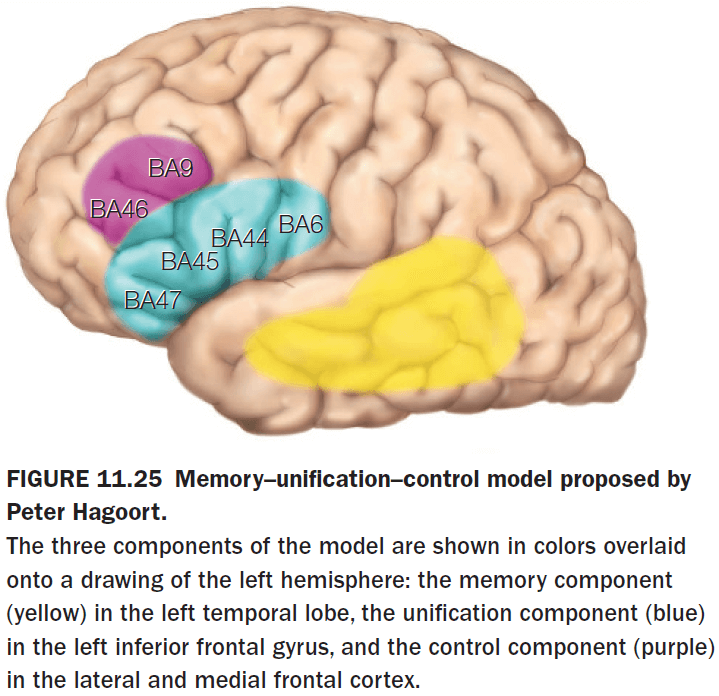
- Similar to the motor system, if a person’s speech is altered and the speaker hears the altered speech, the speaker adjusts their speech to correct for sensory feedback errors.
- When there’s a mismatch between expected and actual auditory signals, there’s increased activity in the bilateral superior temporal cortex.
- Two steps in speech production
    - Macroplanning: what to say.
    - Microplanning: how to say it.
- Just like motor behavior, the intention of communication is represented by goals and subgoals and is fulfilled by a hierarchy.
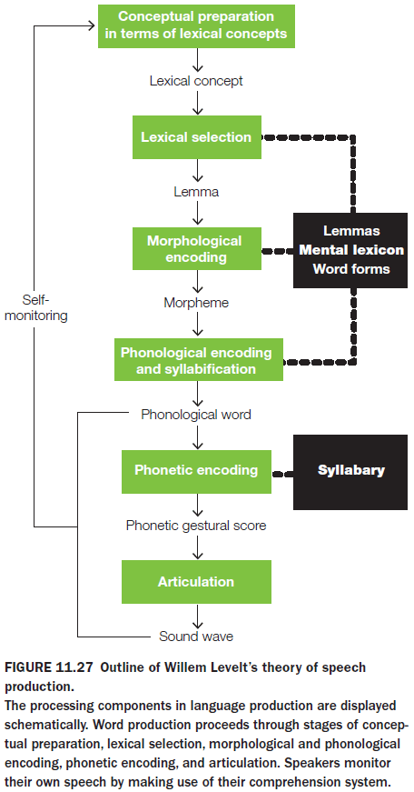
- Findings support the idea of serial processing during initial speech production.
- Animal communication is more generally defined as any behavior by one animal that affects the current or future behavior of another animal, intentional or otherwise.
- Natural selection favors callers who vocalize to affect the behavior of listeners, and listeners who acquire information from vocalizations.
- The two don’t need to be linked by intention.
- The roots of human language may be found in the gestural communication of the great apes and in mirror neurons.
- A counter argument is that gestural communication evolved in parallel with vocal communication.
- The left lateralization of speech is actually visible in humans as seen with the right side of the mouth opening first and wider.
- During human evolution, dramatic changes in connectivity and cortical areas support the rise of human language in all of its rich and detailed complexity.
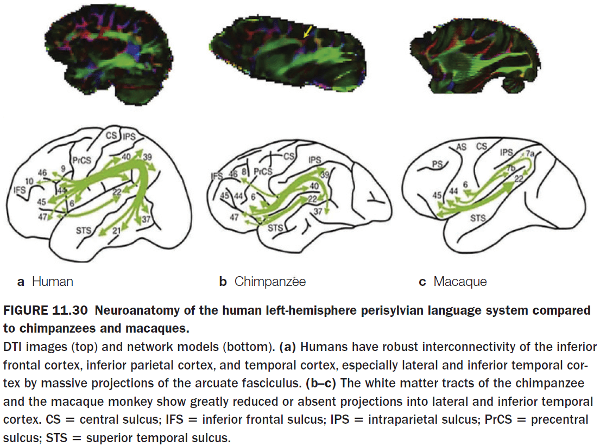

# Part III: Control Processes

## Chapter 12: Cognitive Control

- Big questions
    - What are the computational requirements that enable organisms to plan and execute complex behaviors?
    - What are the neural mechanisms that support working memory, and how is task-relevant information selected?
    - How does the brain represent the value associated with different sensory events and experiences, and how does it use this information to make decisions when faced with multiple options for taking action?
    - How do we monitor ongoing performance to help ensure the success of complex behaviors?
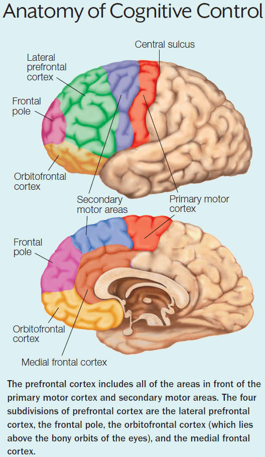
- Cognitive control processes give us the ability to override automatic thoughts and behavior and to step out of the realm of habitual responses.
- Cognitive control (executive function): the set of mental abilities that enable us to use our perceptions, knowledge, and goals to bias the selection of action and thoughts from a multitude of possibilities.
- The resulting behaviors are described as goal-oriented behavior because they aren’t random nor are they stimulus driven.
- The prefrontal cortex (PFC) is the rest of the frontal lobe that isn’t part of the motor cortex.
- The PFC is split into four subregions
    - Lateral PFC (LPFC)
    - Frontal pole (FP)
    - Orbitofrontal cortex (OFC)
    - Medial frontal cortex (MFC) / Medial prefrontal cortex (MPFC)
- When compared to other primate species, the expansion of the PFC in the human brain is more pronounced in the white matter than in the gray matter.
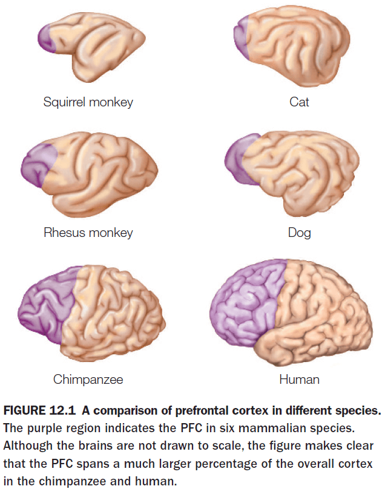
- This finding suggests that the cognitive capabilities that are uniquely human may be due to how our brains are connected rather than an increase in the number of neurons.
- Nurture follows evolution in brain development. A late addition in evolution means it appears later in development.
- E.g. The PFC develops later in life similar to how it also developed later in evolution.
- The PFC has massive connections to almost all regions of the parietal and temporal cortex, and also receives huge input from the thalamus.
- Frontal lobe lesions are difficult to detect and require specialized testing.
- Perseveration: persisting in a response even after being told that it’s incorrect.
- Lesions to the PFC can result in difficulty executing a plan, socially inappropriate behavior, and they may exhibit stimulus-driven behavior.
- Two fundamental types of actions
    - Goal-oriented actions: actions with an expected reward and the knowledge that the action causes the reward.
        - Most of our actions are of this type.
        - E.g. We go to school because we want a certain lifestyle. We put money into the vending machine to get chips.
    - Habitual actions (habit): actions that aren’t under the control of a reward.
        - Is stimulus driven and can be considered automatic.
        - E.g. Putting on glasses in the morning. Pulling the blanket up while sleeping.
        - Occur in the presence of certain stimuli that trigger the retrieval of well-learned associations.
- The distinction between goal-oriented actions and habits is graded.
- Cognitive control requires working memory of representations that may be from the past or that aren’t in the environment.
- E.g. Holding off on an impulse purchase because you remember your bank account’s balance.
- It seems likely that many species must have some ability to recognize object permanence as they wouldn’t last for long if its members didn’t understand that the predator went into hiding.
- A working memory system requires a mechanism to access stored information and to keep that information active.
- Activity of LPFC cells is task dependent.
- Patients with frontal lobe lesions don’t have deficits in long-term memory.
- We can conceptualize working memory as the interaction between a prefrontal representation of the task goal and other parts of the brain that contain perceptual and long-term knowledge relevant to that goal.
- As a rule of thumb, we can organize PFC function along three axes
    - Ventral-dorsal is organized in terms of maintenance and manipulation.
    - Anterior-posterior is organized in terms of abstraction with anterior being more abstract and posterior being more concrete.
    - Lateral-medial is organized in terms of the degree in which working memory is influenced by information by the environment or internal information. Lateral regions are more external and medial is more internal.
- Two types of decision-making processes
    - Normative: how people ought/should make decisions.
    - Descriptive: how people actually make decisions.
- Some decisions don’t seem rational within the context of our current, highly advance world. But they may seem more rational if looked at from an evolutionary perspective.
- E.g. People who are obese.
- To understand the neural processes involved in decision making, we first need to understand how the brain computes values and processes rewards.
- Value has various components that are both external and internal.
    - Payoff: expected reward.
    - Probability: likelihood of reward.
    - Cost: effort to receive reward.
    - Context: current situation.
    - Preference: personal choice.
- Temporal discounting: the observation that the value of a reward decreases when we have to wait to receive that reward.
- The OFC region appears to play a key role in the representation of payoff/reward.
- The anterior cingulate cortex (ACC) appears to exert a type of control by promoting the behavior of exploring the environment for better alternatives.
- ACC activation is also predictive when there is a conflict between options.
- The activation of dopaminergic neurons isn’t tied to the size of the reward, but to the expectancy of reward.
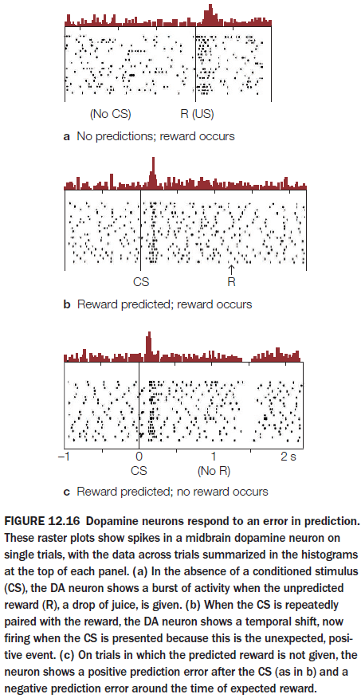
- Reward prediction error (RPE): the difference between the predicted reward and the actual reward.
- Dopamine neurons actually do the calculation of the RPE by using the predicted reward and the actual reward as inputs.
- RPEs also match our learning rate as initially, the RPE is large so learning is rapid and as time goes on, the RPE becomes smaller due to updated expectations, hence learning slows down.
- Punishment isn’t just the withholding of a reward, it also involves the experience of something aversive.
- While dopamine accounts for RPE and reinforcement learning, there are some issues.
    - Mice that can’t synthesize dopamine can still learn.
    - Mice with high dopamine levels don’t learn any faster nor do they maintain habits for longer.
- Dopamine neurons appear to code other variables such as the salience of information.
- Working memory is more than just the passive sustaining of representations, it also requires the filtering of representations.
- E.g. When asked about the Golden Gate bridge, we can be asked about it’s color or location. For the brain to answer, it must filter the correct response while inhibiting incorrect responses.
- With practice, people can get quite good at multitasking.
- Two hypotheses of multitasking
    - We do multiple tasks in parallel aka true multitasking.
    - We switch between tasks quickly aka the illusion of multitasking.
- E.g. Computers provide the illusion of multitasking by rapidly switching between tasks, but they also do true multitasking as computers have multiple CPU cores.
- Evidence supports the second hypothesis and with practice, we become more proficient in task switching and not in doing both tasks simultaneously.
- The frontal lobes modulate the salience of perceptual signals by inhibiting unattended information and not by exciting attended information.
- Goal-based control might be achieved by the inhibition of task-irrelevant information.
- Inhibiting an action appears to activate the right inferior frontal gyrus and the subthalamic nucleus.
- Goal-oriented behavior involves the amplification of task-relevant information and the inhibition of task-irrelevant information. Amplification and inhibition may entail separate processes, given that aging selectively affects the ability to inhibit task-irrelevant information.
- Patients with prefrontal cortex damage lose inhibitory control.
- For a person engaging in goal-oriented behavior, it’s important to track the progress towards the goal to correct for deviations from the expected plan of action.
- To monitor progress, the MFC and ACC appear to be critical components of a monitoring system.
- The MFC appears to be sensitive to unexpected feedback, not only errors.
- The LFC represents the task goal and the MFC monitors whether that goal is achieved.
- Post-error slowing (PES): after participants make an error, they slow down and are more cautious.
- Interestingly, PES doesn’t affect accuracy even though more time is used.
- Lesions in the MFC fail to confirm various hypotheses regarding its function and patients with such lesions are relatively normal except that they fail to show normal changes in arousal when challenged physically or mentally.
- This suggests that the MFC represents more of a metacognitive variable, an estimate of how much cognitive control is required in a given situation and the benefit to be gained if that control is invested.
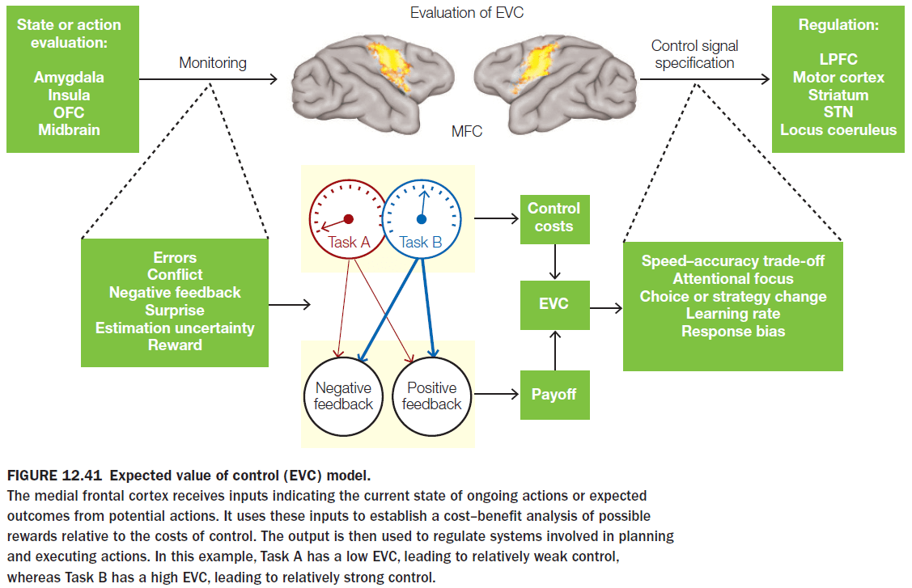

## Chapter 13: Social Cognition

- Big questions
    - Where am “I” in my brain?
    - Do we process information about others and ourselves in the same way?
    - Is social information processing the same for everyone, or is it affected by individual and cultural differences?
    - To what extend is emotion involved in social cognition?
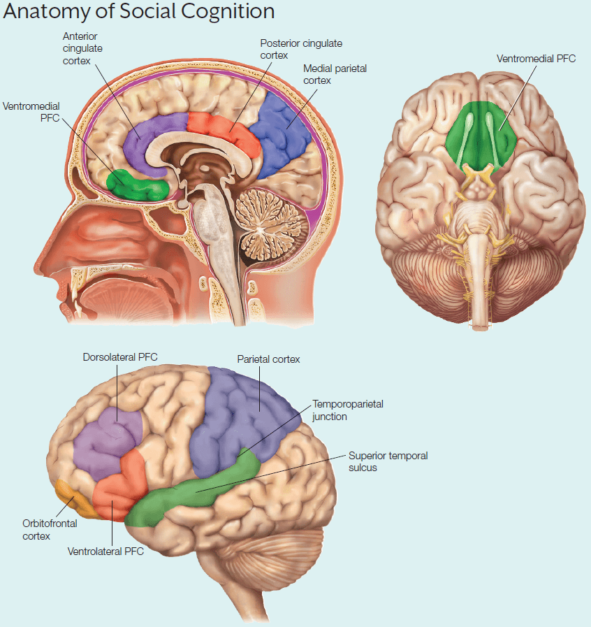
- Damage to the frontal lobe results in change to social behavior, suggesting that this brain region is responsible for it.
- When we try to understand other people, various brain networks are activated.
- E.g. The temporal lobe for memories regarding others, the fusiform face area to identify others, and regions with mirror neurons.
- There is no single region in the brain where the self is located as damage to different parts of the brain damage different parts of the self.
- Developing brain regions are more likely to be negatively impacted by adverse events and to benefit from positive events than fully developed regions.
- E.g. During childhood and adolescence, adverse social events such as neglect or abuse increase the risk for mental illnesses later in life.
- Even if the individual is resocialized in adulthood, the individual still has decreased social functioning.
- Damage to the orbitofrontal cortex typically results in
    - Blunted affect
    - Impaired autonomic response to emotional pictures and memories
    - Diminished regret
    - Tolerate frustration poorly and anger easily
    - Increased aggression
    - Immaturity
    - Impaired goal-directed behavior
- Several neurodevelopmental disorders associated with deficits in social behavior
    - Antisocial personality disorder (APD)
    - Schizophrenia
    - Autism spectrum disorder (ASD)
- People with APD are aware of social norms but fail to conform to them. They may appear friendly but lack empathy and act like psychopaths.
- People with ASD share three main symptoms
    - Social deficits
    - Communication deficits
    - Restricted, repetitive patterns of behavior
- ASD may be the result of deficits in the ability to understand that others have mental states; deficits in theory of mind.
- We develop our self-knowledge through self-perception processes designed to gather information about the self.
- Because the self is simultaneously the perceiver and the perceived, self-perception is a unique social cognitive process.
- Our sense of self partially relies on seeing the difference between our self-knowledge and the knowledge we have of others.
- E.g. You might value neuroscience but most other people don’t. This boundary is what partially defines you.
- Your individual preferences help define what makes you unique compared to others.
- Self-reference effect: the enhancement of memory for information processed in relation to the self.
- Medial prefrontal cortex (MPFC) activity increases with self-referential processing.
- Our judgments about self-descriptions aren’t linked to recall of specific past behaviors or memories.
- E.g. People with retrograde amnesia are still able to describe themselves as “smart” or “caring” even though they have no autobiographical memories.
- This suggests that we should be able to maintain a sense of self even if we lose our autobiographical memories. Patients with retrograde amnesia support this conclusion.
- Another possible explanation is that those patients retained more general social knowledge about themselves rather than retaining self-knowledge.
- However, this has been refuted with evidence showing that a patient had poor social knowledge but good self-knowledge.
- These findings lead us to conclude that the self is distributed across multiple systems and it isn’t centered on one structure.
- Further evidence of this comes from several different systems for self-knowledge that have been identified and that can be isolated from each other.
- E.g. Self-knowledge systems
    - Episodic memories of your own life.
    - Semantic knowledge of the facts of your life.
    - Sense of personal agency.
    - Ability to recognize your body in the mirror or photos.
- Invasive methods and lesion studies confirm that self-knowledge appears to be both fundamentally distributed and reliant on multiple distinct brain systems.
- It’s possible to maintain a sense of self in the absence of specific autobiographical memories, because a distinct neural system supports the summaries of personality traits typically used to make self-descriptive judgments.
- The brain at rest apparently isn’t “off”. Why does the brain consume so much energy when it isn’t engaged in a specific cognitive task?
- Default network: a network of brain regions that describe the default model of brain function.
- The default network is made up of
    - MPFC
    - Precuneus
    - Posterior cingulate cortex
    - Retrosplenial cortex
    - TPJ
    - Medial temporal lobe
    - Inferior parietal lobe
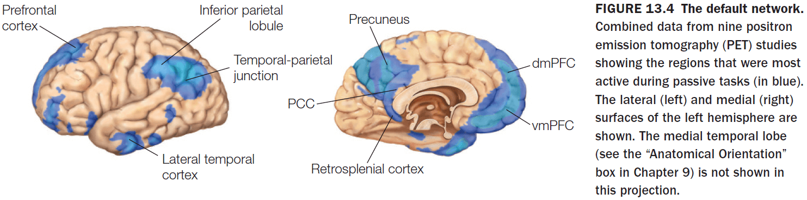
- One hypothesis for the existence of the default network is to ensure that we always have some idea of what’s going on around us. This is called the sentinel hypothesis.
- The default network is strongly active when we’re engaged in self-reflective thought and judgment assessments that depend on social and emotional content.
- No primary sensory or motor regions are connected to the default network.
- The processes that give rise to our understanding of other people’s minds overlap with the processes that support speculations about our own activities.
- Patients with orbitofrontal damage exhibit inappropriate social behavior not because of being unaware of social norms, but because they lack insight of self-perception.
- The MPFC is involved in simulating other people’s minds, other times, and other places, essentially imagining, which may also explain our counterfactual abilities.
- To predict our future mental state in imagined experiences, we simulate the experience and then calculate our preference from those simulations.
- The vmPFC is key to predicting our state of mind as the more active it is (when considering the future), the less shortsighted our decisions will be.
- Embodiment: the feeling of unity between the self and the body.
- The extrastriate body area, located in the lateral occipitotemporal cortex, has been implicated in the processing of embodiment.
- The extrastriate body area responds selectively to human bodies and body parts and to imagined and executed movements of one’s own body.
- Stimulation of the temporoparietal junction (TPJ) produces an out-of-body-experience (OBE).
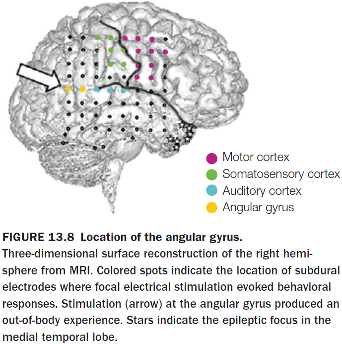
- The TPJ is a crucial structure for mediating spatial unity between the self and body, and for the conscious experience of the normal self. If the TPJ is disrupted, errors can occur and our brains can misinterpret our location.
- E.g. Errors such as believing we are floating above our bodies and are viewing the world from the a bird’s POV.
- OBEs are one of three types of visual body illusions (also known as autoscopic phenomena (AP)).
- The other two types are
    - Autoscopic hallucination: when a person sees a double of themselves in extra-personal space.
    - Heautoscopy: similar to autoscopic hallunication except the person is unsure of whether one feels disembodied or not.
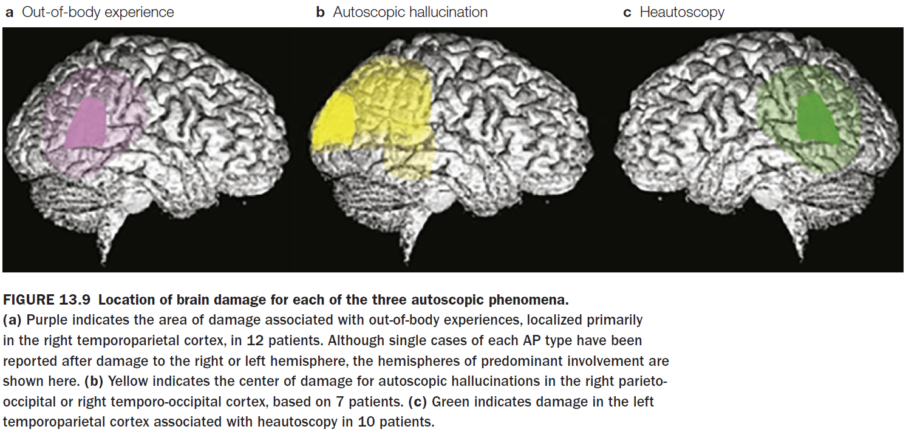
- APs may result from two disintegrations
    - Within personal space
    - Between personal and extrapersonal space
- The first disintegration occurs as a result of conflicting sensory input, when two sources of tactile, proprioceptive, kinesthetic, and visual information fail to match up.
- E.g. Seeing yourself touch a part of your body, but feeling the sensation later than expected.
- The second disintegration occurs when there’s conflicting visual and vestibular information.
- E.g. When the vestibular system senses that you’re moving but your visual information doesn’t match.
- Xenomelia / body integrity identity disorder (BIID): when a person reports experiencing a lifelong desire for the amputation of one or several of their limbs because they don’t feel that the limb belongs to their body.

- Xenomelia has a neurological basis and patients with xenomelia elicit no cortical response in the right superior parietal lobule (SPL) when the undesired limb is touched. There’s decreased cortical surface area in the right anterior insular cortex and decreased cortical thickness in the SPL.
- This also explains why most cases of xenomelia affect the left leg.
- The SPL is where somatosensory, visual, and vestibular signals converge and is critical for sensorimotor integration.
- The absence of activation in the right SPL suggests that the limb hasn’t been incorporated into the person’s body image; so they feel sensation from the limb but no sense of ownership.
- However, the causal direction may also go in the other direction with the desire to remove the leg affecting the the brain area.
- Compared to self-perception, our perceptions of other people are made without direct access to their mental and physiological states.
- We have to use other cues such as facial expressions and voice tone to infer what others are thinking and how they are feeling.
- Empathic accuracy: the ability to correctly infer another person’s thoughts and feelings.
- For most people, their empathic accuracy of strangers is about 20%, close friends get 30%, and spouses get 30-35%.
- To infer the thoughts of others, the observer must translate what’s observable into an inference about what’s unobservable: their psychological state.
- Two theories on how we do this
    - Mental state attribution theory: people develop a commonsense “folk psychology” to infer the thoughts of others. We develop an elaborate theory about the mind of others to infer their thoughts or predict their actions.
    - Experience sharing theory: we simply observe someone else’s behavior, simulate it, and use our own mental state produced by the simulation to predict the mental state of others.
- While we have the ability described in the mental state attribution theory, we don’t use it often as our understanding of others is often immediate and automatic.
- Evidence supports both theories.
- Theory of mind (ToM) / mentalizing: the ability to simulate the mental states of oneself and others.
- Newborns have an innate and automatic ability to imitate other people’s facial expression.
- Review of the false-belief task to test for the presence of theory of mind and mirror neurons.
- Evidence suggests that ToM is innate and that the mere presence of another person automatically triggers belief computations.
- Empathy: our capacity to understand and respond to the unique emotional experiences of another person.
- Evidence suggests that the same brains regions are activated when we experience something and when we see someone else having the same experience.
- Then how do we know who is feeling what? Current research doesn’t know the answer.
- Social preferences for people similar to us emerge in infants before one year of age.
- Our ability to recognize the mismatch between outward behavior and inner intentions is useful for recognizing people who shouldn’t be trusted.
- Regions that are commonly engaged while people are making inferences about the thoughts and beliefs of others
    - Medial prefrontal cortex (MPFC)
    - Temporoparietal junction (TPJ)
    - Superior temporal sulcus (STS)
    - Temporal poles
- The MPFC is important for reasoning about the intangible mental states of other beings, including animals.
- The right TPJ has two distinct regions, one for mentalizing and one for reorienting attention.
- Humans are the only primates that follow eye gaze rather than the direction of where the head is pointing.
- We can tell where the eye is gazing because of our large scleras, the whites of our eyes, an anatomical feature that no other primate possesses.
- Evidence suggests that the STS is important for interpreting eye gaze in relation to mental states.
- It has become apparent that no single brain region or single system is responsible for the behaviors of autistic individuals.
- Participants with autism had difficulty reporting their inner experiences and this is reflected by the inactivation of the MPFC in the default network.
- Before an action occurs, an observer of the action has an internal copy of it, enabling them to gain an understanding of the other person’s intentions.
- This isn’t the case for ASD children, however, as individual motor acts aren’t integrated into an action chain so they lack full comprehension of the intention of others.
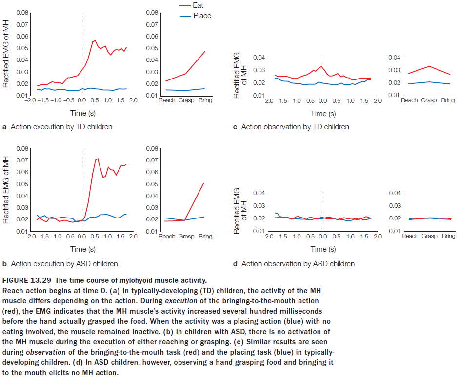
- Two ways we can understand the intention of others
    - By relying on motor information derived from the hand-object interaction.
    - By using semantic information derived from the object’s standard use/context.
- Children with ASD have no issues with the second type of understanding, but they have difficulty with the first type of understanding.
- This supports the hypothesis that people with ASD have a deficit in the mechanics of their mirror neuron network, resulting in a failure of linking motor acts into action chains that allow motor intentions to be understood.
- In people with ASD, ToM skills don’t develop properly.
- One of the most complicated aspects of social behavior is the lack of straightforward rules.
- E.g. Hand shaking in different countries, some countries find it offensive while others find it acceptable.
- Damage to specific regions of the OFC results in impairment of the ability to use social knowledge to reason about social interactions.
- It also results in unawareness of their social mistakes, which makes it difficult to generate the emotional feedback needed to change their future behavior.
- The OFC is also important for learning social knowledge, as well as for applying it to specific social interactions.
- E.g. If the OFC is damaged later in life, the learned social knowledge is retained. If the OFC is damaged early in life, then social knowledge isn’t developed.
- Patients with vmPFC damage are notoriously poor at making social decisions.
- Evidence seems to suggest that there are two distinct neural mechanisms for learning from positive and negative feedback.
- Damage to the vmPFC disrupts the ability to learn from negative feedback but not from positive feedback.
- The vmPFC is important in evaluating the negative consequences of social decision making.
- The brain has specific cognitive processes devoted to detecting cheaters in social contract situations, and that detecting cheaters isn’t a domain-general learning ability.
- Findings suggest that instead of unfairness being the reason for punishment, people’s punitive psychology has evolved to defend personal interests.
- Humans appear to have an innate ability to spot violators of social contracts.
- Some of the same brain regions are activated in relation to the three main processes of social cognition: self-perception, person perception, and social knowledge.

## Chapter 14: The Consciousness Problem

- Big questions
    - Can the firing of neurons explain your subjective experience?
    - How are complex systems organized?
    - What distinguishes a living hunk of matter from a nonliving one if both are made of the same chemicals?
    - What evidence suggests there is a consciousness circuit?
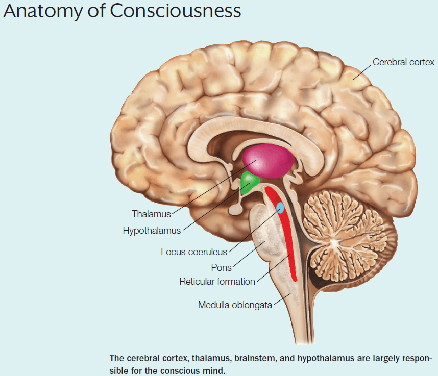
- Review of the mind-body problem.
- Consciousness: the having of perceptions, thoughts, and feelings; awareness.
- Many fall into the trap of equating consciousness with self-consciousness - to be conscious it is only necessary to be aware of the external world.
- While we are aware of the contents of consciousness, we don’t have to have awareness that we are aware, aka meta-awareness.
- Self-consciousness is no more mysterious than perception or memory.
- Why, when all this processing about the self is separate, do we feel unified?
- We also have access awareness.
- Access awareness: the ability to report on the contents of mental experience, but not to how the contents were built up by all of the neurons, neurotransmitters, etc.
- Two modes of information processing
    - Conscious: can be accessed by systems underlying verbal reports, rational thought, and deliberate decision making.
    - Nonconscious: can’t be accessed such as autonomic (gut-level) responses, the internal operations of vision, language and motor control, and repressed desires or memories.
- Consciousness as something you have to experience in order to define.
- Neural correlates of consciousness: changes in subjective state must be associated with changes in neuronal state.
- The converse may not be true as different neuronal states can result in the same subjective state.
- E.g. Different states of sleep all feel like sleep except for dreaming.
- The cognitive neuroscience approach to the problem of consciousness
    - Contents of conscious experience
    - Access to this information
    - Sentience (subjective experience)
- It’s helpful to distinguish between states of arousal and consciousness.
- E.g. Sleep, wakefulness, coma, and brain death.
- Antonio Damasio separates consciousness into two categories
    - Core consciousness: when consciousness is “flipped on”.
    - Extended consciousness: built on core consciousness and holds the complex contents of consciousness.
- The brain regions needed for core consciousness are in the evolutionarily oldest part of the brain - the brainstem.
- The brainstem’s primary job is homeostatic regulation of the body and brain and this is performed mainly by the medulla oblongata along with the pons.
- Disconnect this part of the brainstem and the body dies. This is true for all mammals.
- Above the medulla oblongata are the pons and mesencephalon (midbrain).
- In the pons, the reticular formation is made of neural circuits of the reticular activating system (RAS) involved with arousal, regulating sleep-wake cycles, and mediating attention.
- Depending on the location, damage to the pons may result in locked-in syndrome, unresponsive wakefulness syndrome, coma, or death.
- The RAS has extensive connections to the cortex by two pathways
    - Intralaminar nucleus of the thalamus (dorsal). Damage here usually makes people awake but unresponsive.
    - Hypothalamus and basal forebrain (ventral). Damage here makes it difficult for people to stay awake and they tend to sleep more.
- Information about the state of the organism in its current state is mediated by the brainstem.
- The cortex may not be necessary for conscious experience, but the information provided by it expands the contents of what the organism is conscious of.
- The contents of that experience, which are provided by the cortex, depend on the species and the information that its cortex is capable of supplying.
- E.g. In humans, information in the cortex provides us with a elaborate sense of self such as memories and self-perception.
- A level of wakefulness is necessary for consciousness (not quite true such as in dreams), but consciousness isn’t necessary for wakefulness.
- E.g. Patients with unresponsive wakefulness syndrome (UWS), also known as vegetative state. They are awake in that they open their eyes, but they only show reflex behavior.
- In contrast, patients with minimally conscious state (MCS) show localization to pain and nonreflexive movement.
- Locked-in syndrome (LIS): a condition where one is unable to move any muscle but is fully conscious and has normal sleep-wake cycles.
- Some patients with LIS are able to voluntarily blink or to make small vertical eye movements, but others don’t and exhibit no external signs.
- LIS is caused by a lesion to the ventral part of the pons where neurons connect the cerebellum to the cortex.
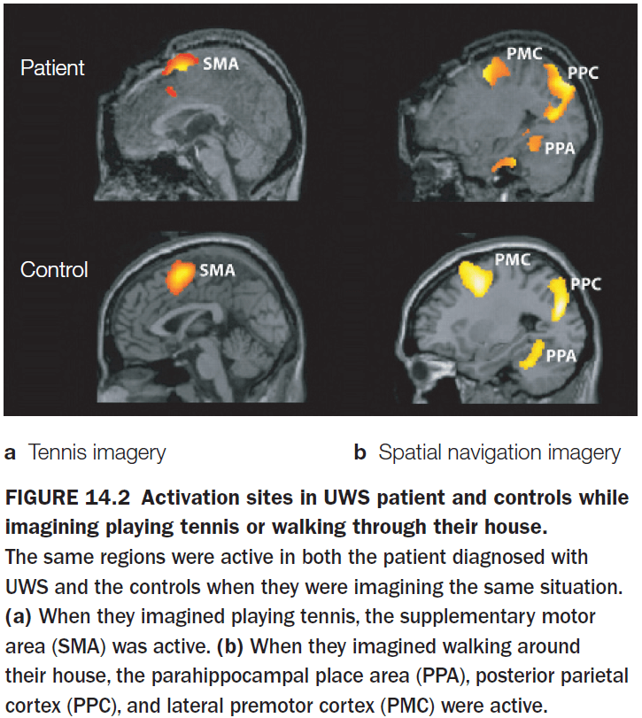
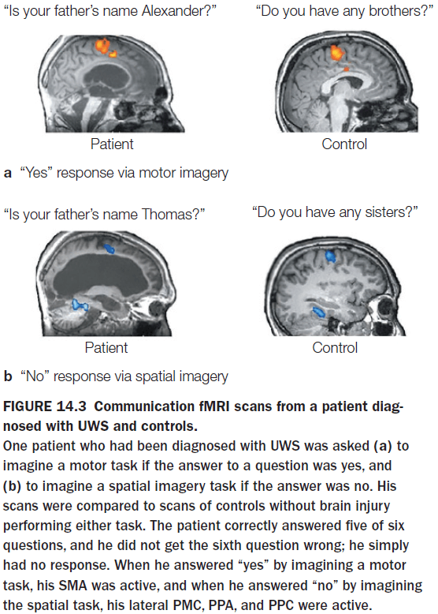
- fMRI evidence of patients with LIS shows that they’re able to respond to verbal questions. They respond by imagining a task which is reflected in their brain activity.
- Sleep and wakefulness are regulated by a complex interplay of neurotransmitters, neuropeptides, and hormones.
- The highest controller of wakefulness is the grand circadian pacemaker - the suprachiamatic nucleus (SCN) in the hypothalamus.
- The SCN receives light input directly from the retina, allowing its neurons to synchronize to the day-night cycle.
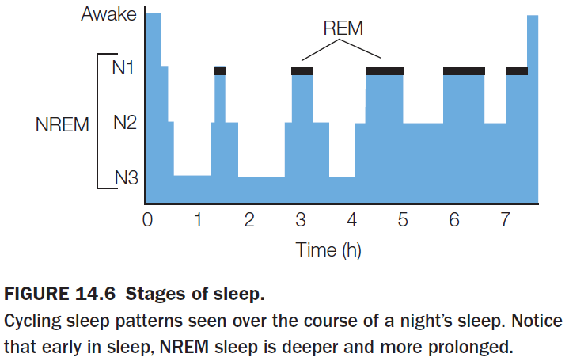
- During sleepwalking, the brain areas that mediate cognitive control and emotional regulation are asleep.
- The vast majority of our mental processes happen outside of our conscious awareness.
- We are only conscious of the contents of our mental life, not what generates the contents.
- E.g. You are conscious of the letters and words in this sentence but not of the processes that produce your perception and comprehension.
- Learning about the parts of a complex system can only get you so far. Understanding the organization of the parts, the architecture of the system, is also important.
- E.g. The cost of a smartphone isn’t just the materials, it also includes the engineering and manufacturing required to organize those materials into useful components.
- Architecture is about design within the bounds of constraints.
- E.g. Building a house given the budget, materials, location, weather, and regulation.
- In the case of the brain, the constraints include energy costs, brain and skull size, and processing speeds.
- The components of a complex system are arranged in a specific manner that enables their functionality and robustness.
- Robustness: a property of the system is robust if it’s invariant with respect to a set of perturbations.
- When we add a feature that protects the system from a particular challenge, we add robustness but also complexity and a new failure point.
- Another property of robust systems is modularity.
- E.g. Your olfactory system and motor system are independent. You don’t need to stand still to smell and you can lose one system without losing the other.
- The complex system of your brain is a system of systems and to deal with this complexity, we use abstractions.
- The brain is a complex system with a layered architecture.
- To understand the layered architecture of the brain, the most difficult part of it is figuring out the protocols that allow one layer to talk to the next.
- Protocol: the rules that determine the allowed interactions, both within a layer and between adjacent layers.
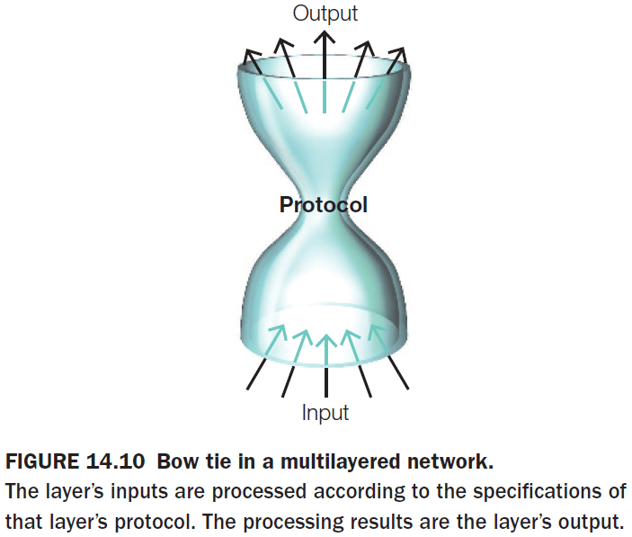
- Protocols limit the number of outcomes but it doesn’t cause the outcome.
- Multiple realizability: the idea that there are many ways to implement a system to produce a behavior.
- E.g. Many animals see using different eyes so we say that vision is multiple realizable.
- Multiple realizability demonstrates that in a complex system, knowing the workings at one level of organization won’t allow you to predict the functioning at another level.
- Bindsight: a phenomenon where patients consciously report being blind but demonstrate behavior that couldn’t have occurred unless they can see.
- E.g. A patient saying they can’t see the cluttered hallway but they can walk through it without bumping into anything.
- Such patients have access to information but don’t experience it; they show vision outside the realm of conscious awareness.
- This effect also shows up in experiments where an image is flashed too fast for conscious perception but the image biases subsequent processing.
- Subliminal processing: brain activity evoked by a stimulus that’s below the threshold for awareness.
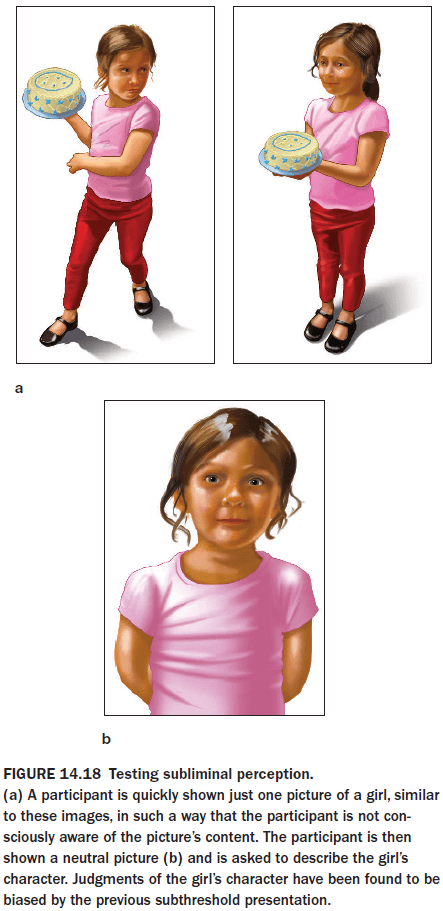
- An often overlooked aspect of consciousness is the ability to move from conscious, controlled processing to nonconscious, automatic processing.
- E.g. Movement. At the start, movements require conscious thought but afterwards, the movement becomes automatic such as touch typing.
- One theory to explain why a skill becomes automatic after practice is the “scaffolding to storage” framework.
- The frameworks says that we must use conscious processing during practice to build a scaffold and as the skill is developed, the scaffolding is removed and the skill is retained in storage.
- After learning, a different set of regions is involved for the task than the regions used for scaffolding.
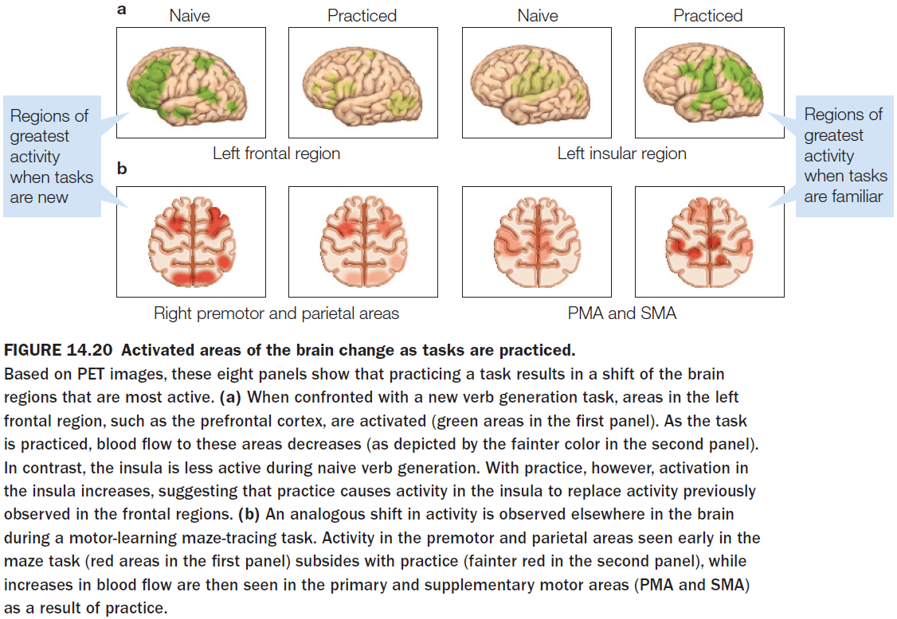
- Once the skill has moved from conscious to nonconscious processing, it’s sometimes difficult to reinitialize conscious processing.
- E.g. Experts and masters sometimes have difficulty explaining intuitive or well-practice skills to amateurs.
- This learned intuition suggests that there are two different brain networks in the mastery of a skill.
- Eventually, as the cognitive control regions disengage, nonconscious processing begins to take over. This processing has been moved to a lower layer, hidden from the view of consciousness.
- Consciousness may have evolved to improve the efficiency of nonconscious processing.
- So far, we have encountered many patients with lesions that affect the contents of consciousness but they still remain conscious and sentient.
- E.g. Blind and deaf people, people that can’t comprehend speech, people that are locked in their body.
- The content of our conscious experience appears to be the result of local processing in modules.
- The large human brain doesn’t render its unique contributions simply by being a bigger brain, but by accumulating specialized circuits.
- To integrate these specialized modules and circuits into an “I”, the interpreter in the left hemisphere distills all of the internal and external information bombarding the brain into a cohesive narrative, which becomes our personal story.
- Any theory about consciousness must consider whether a conscious thought has any control over the brain that processes it.
- While the idea that beliefs affect behavior seems basic to ordinary people, neuroscientists firmly deny it because it conflicts with the neural reductionist perspective that neurons cause a mental state and not the other way around.
- It’s well known that killing a single neuron, or even hundreds of them, won’t impair an animal’s ability to perform a task. A single neuron’s behavior must be redundant.
- Surprisingly, brain activity related to an action increases 350 ms before we are aware of it.
- This provides support for the idea that an act is initiated nonconsciously, and only afterward do we consciously think we initiated it.
- However, we shouldn’t forget that top-down influences, from mental state to neurons, also exist so we should be cautious of mixing the conscious layer of processing with the nonconscious layer.
- The vocalization of one monkey modulates the brain processes in another monkey.
- In a conversation, the listener’s brain activity can mirror the speaker’s brain activity.
- We can think of speech as the transferring of neural signals across organisms.
- We aren’t the only animal to create and use tools. Animals such as ravens and magpies create and use tools.
- One test of consciousness is the mirror self-recognition (MSR) test. In this test, animals have a spot of paint on their body and they must use a mirror to recognize that the spot is on themselves.
- Issues with MSR
    - It only requires an awareness of the body, not an abstract concept of self.
    - Patients with prosopagnosia fail the test but they have a sense of self.
- Another way of testing for consciousness is imitation but this has received little evidence.
- Sentience: the subjective qualia, phenomenal awareness, raw feelings, and first-person viewpoint of an experience.
- The hard problem of consciousness is explaining how the objective physical matter that makes up neurons, the same found in rocks, carbon, oxygen, etc, produces subjective experience.
- Review of determinism, first and second law of thermodynamics, entropy, quantum theory, and the principle of complementarity.
- Principle of complementarity: the idea that a system may have two simultaneous descriptions, with one not reducible to the other.
- Anencephaly: children born without a cerebral cortex.
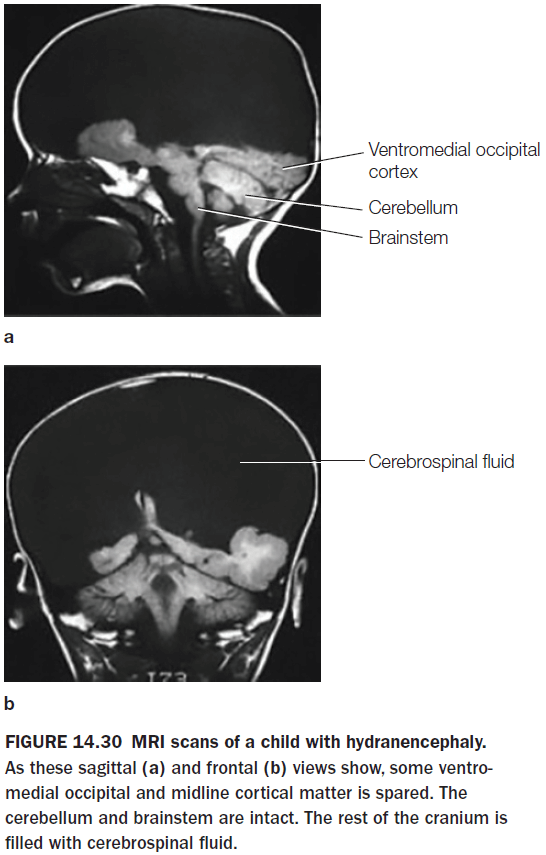
- In children with anencephaly, they feel emotions, have subjective experiences, and are conscious.
- Consciousness doesn’t require cortical processing.
- There’s no question that cortical processes elaborate and enhance the contents of subjective experience but to have subjective experience, no cortex is required.
- A weird fact of split-brain patients is that they’re unaware of their condition.
- In contrast, people with damage to the optic nerves are aware of vision loss.
- If the optic nerve is damaged, the damaged part ceases to transmit information to the visual cortex.
- Any part of the visual cortex that isn’t receiving input sends a signal reporting the problem, and this signal is experienced consciously by the person, who then complains of a blind spot in the visual field.
- If, instead, the visual cortex is damaged, the results are very different. There’s still a blind spot but the patient isn’t aware. Why not?
- When the visual cortex is damaged, it stops functioning. It doesn’t output a signal that it’s not getting any information; it outputs no signal at all.
- It’s the difference between a neuron generating an error signal and losing the neuron.
- That part of space ceases to exist for that person’s conscious experience.
- Similarly for callosotomy patients, each hemisphere acts as if the other hemisphere never existed.
- The finding that the loss of huge regions of cortex doesn’t disrupt consciousness argues against the notion that there’s a single consciousness circuit and instead suggests that any part of the cortex, when supported by subcortical processing, can produce consciousness.
- Subcortical processing alone appears to be enough to produce conscious experience with limited contents.
- Consciousness may be the product of many specialized systems where each system enables the processing and mental representation of specific aspects of conscious experience.
- E.g. A module for itch, a module for pain, a module for planning.
- To control and integrate these modules into a unified experience, consciousness is the conductor of the orchestra; the mastermind.
