<blockquote class="blockquote">
  <p>Computer science is no more about computers than astronomy is about telescopes.</p>
  <p class="blockquote-footer">Unknown</p>
</blockquote>

# Part I: Fundamentals of Deep Learning

## Chapter 1: What is deep learning?

- Repository with author’s code
    - <https://github.com/fchollet/deep-learning-with-python-notebooks>
- Download my Google Colaboratory code
    - [Google Colaboratory/Jupyter Notebook](google-colaboratory.ipynb)
    - [Raw Python](raw-python.py)
- Deep learning → Machine learning → Artificial intelligence
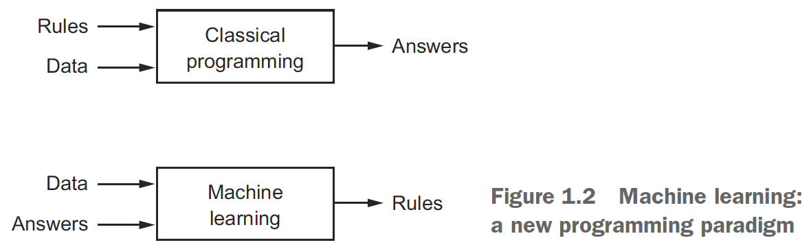
- *Representations*: different ways to look at data; to represent or encode the data.
- *Learning*: in machine learning, describes the automatic search for better representations.
- *Hypothesis space*: the set of possible operations that tests whether the operation on the input data generates the correct output.
- E.g. Coordinate changes, translations, linear projections.
- The high level steps of machine learning
    - Search for useful representations of some input data
    - Search within a predefined space of possibilities (hypothesis space)
    - Search using guidance from a feedback signal
- *Deep learning*: the idea of successive layers of representations.
- You can think of a deep network as a multistage information-distillation operation, where information goes through successive filters and comes out increasingly purified.
- However, don’t mistake deep learning for deeper understanding.
- The term “neural network” comes from biology but the relationship to the brain isn’t there.
- Don’t link artificial neural networks with biological neural networks.
- *Loss function*: the error between the actual output of network and the expected output.
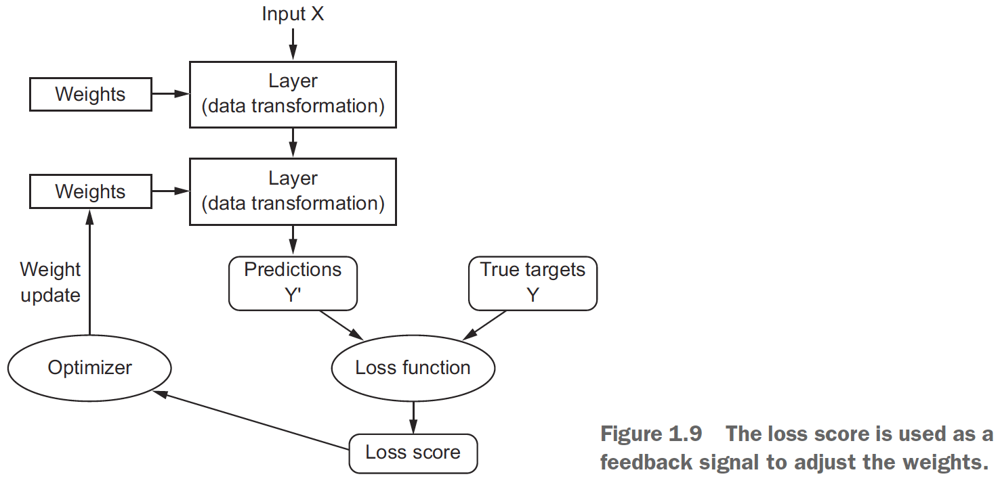
- Other types of machine learning
    - Probabilistic modeling
    - Support vector machines
    - Decision trees and random forests
- Deep learning is different due to
    - Not needing feature engineering anymore
    - Incremental, layer-by-layer way in which increasingly complex representations are developed
    - Intermediate incremental representations are learned jointly
- Three technical forces driving deep learning
    - Hardware
    - Data
    - Algorithms

## Chapter 2: Before we begin: the mathematical building blocks of neural networks

- *Tensor*: a container for data that generalizes matrices to any arbitrary dimension.
- The tensor’s dimension is also called its axis.
- E.g. A 5D vector of [1, 2, 3, 4, 5] has one axis but five dimensions.
- Dimensionality can denote either the number of entries along a specific axis (as in the case of our 5D vector) or the number of axes in a tensor (such as a 5D tensor).
- A tensor has three key attributes
    - *Number of axes/rank*: how many dimensions it takes up
    - *Shape*: the description of the axes
    - *Data type*: float32, float64, or uint8
- E.g. A tensor with shape (60000, 28, 28) means 60000 matrices of size 28 by 28.
- Shape is NOT the same as the tensor’s dimensions.
- E.g. A tensor with shape (6, 1) means 6 vectors of size 1 x 1.
- Seems like shape tends to ignore the last dimension (1) in 1 x 1 for vectors.
- *Tensor slicing*: selecting specific elements from a tensor.
- To slice the dataset

```python
my_slice = train_images[10:100]
```

- To slice each tensor in the dataset (E.g. To get the 14 x 14 pixels on the bottom-right)

```python
my_slice = train_images[:, 14:, 14:]
```

- The first axis (or axis 0) is often called the batch axis or batch dimension since it’s usually used to control the batch size.
- Real world data tensors
    - *Vector data*: 2D tensors of (samples, features)
        - E.g. Storing age, ZIP code, and income of each person. (num_people, num_features=3)
    - *Timeseries/sequence data*: 3D tensors of (samples, timesteps, features)

        - E.g. Stock prices. (num_days, num_mins_per_day, num_features)
    - *Images*: 4D tensors of (samples, height, width, channels)

        - E.g. Batch of 128 grayscale images of 256 x 256. (128, 256, 256, 1)
    - *Videos*: 5D tensors of (samples, frames, height, width, channels)
        - E.g. 4 Youtube videos that’s 60 seconds long, 5 frames per second, and has a resolution of 1920 x 1080. (num_videos=4, num_frames=300, 1920, 1080, 3)
- Similar to binary operations on binary inputs (E.g. AND, OR, NOT), there are tensor operations.
- We can think of each layer in the network as performing a function.

```python
keras.layers.Dense(512, activation='relu')
// This layer is doing the same as the following line of code
output = relu(dot(w, input) + b)
```

- The steps each layer does
    - Dot product of the weights and input
    - Add the result with a bias
    - Pass the result through a rectified linear function
- A dense layer is the same as a fully connected layer.
- *Element-wise operations*: an operation on a vector’s individual elements.
- Since element-wise operations are independent of each other, it can be parallelized.
- When adding two tensors of different shapes, the smaller tensor is broadcasted to match the shape of the larger tensor.
- Steps to broadcast a smaller tensor into a larger one
    - Add axes to the smaller tensor to match the number of dimensions of the larger tensor.
    - Repeat the smaller tensor alongside the new axes to match the full shape of the larger tensor.
- E.g. Let X have shape (32, 10) and Y have shape (10, ). To broadcast Y to X, first add another axis to Y to get (1, 10). Then repeat Y 32 times in that new axis to get (32, 10).
- *Tensor dot*: the same as vector dot product. Multiply each corresponding component and then sum the results.

- *Tensor reshaping*: change the shape of a tensor while maintaining its data.
- E.g. Changing from (3, 2) to (6, 1).

```python
x = np.array([0, 1], [2, 3], [4, 5])
x = x.reshape((6, 1))
print(x)
[[0], [1], [2], [3], [4], [5]]
```

- A common tensor reshaping operation is transposing which switches the rows and columns.
- Neural network → chain of tensor operations → geometric transformations of the input data.
- So an ANN can be interpreted as a very complex geometric transformation in a high-dimensional space.
- The analogy is that machine learning takes a crumpled paper ball and uncrumples it which is like finding the neat representations for complex, highly folded data manifolds.
- ML uncrumples the ball by incrementally decomposing a complicated geometric transformation into a long chain of elementary ones.
- It’s a reductionist approach.
- The weights of the neural network contain information learned by the network from exposure to training data.
- The training loop
    - Draw a batch of training samples.
    - Run the network on those samples to predict the target.
    - Compute the loss/error of the network on the batch.
    - Update all weights of the network to slightly reduce the loss on this batch.
- The intuition behind a continuous function is that a small change in x must result in a small change to y.
- An ANN can be thought of as moving towards the lowest point on the error map where the gradient points which direction to head down and how steep the slope it.
- *Stochastic gradient descent (SGD)*: randomly sampling an input and using its error to descent the error map.
- Stochastic refers to how each batch of data is randomly drawn.
- Mini-batch stochastic gradient descent versus Stochastic gradient descent: each iteration uses a batch of data instead of a single sample.

|                                 | SGD    | Mini-batch SGD  | Batch SGD  |
| ------------------------------- | ------ | --------------- | ---------- |
| Input/Sample Size per Iteration | Single | Batch or subset | Entire set |

- Momentum address two issues with SGD
    - Convergence speed
    - Local minima
- Momentum draws inspiration from physics. The mental image is to think of the optimization process as a small ball rolling down the loss curve. If the ball has enough momentum, it won’t get stuck in the local minimum.
- Momentum is implemented by moving the ball at each step based not only on the current slope value (current acceleration) but also on the current velocity (resulting from past acceleration).

```python
past_velocity = 0
momentum = 0.1
while loss > 0.01:
  w, loss, gradient = get_current_parameters()
  velocity = past_velocity * momentum + learning_rate * gradient
  w = w + momentum * velocity - learning_rate * gradient
  past_velocity = velocity
  update_parameter(w)
```

- *Backpropagation*: applying the calculus chain rule to the computation of gradients in an ANN.
- *Symbolic differentiation*: given a chain of operations with a known derivative, compute a gradient function for the chain that maps network parameter values to gradient values.
- *Epoch*: each iteration over all of the training data.

**Summary**


## Chapter 3: Getting started with neural networks

- Neural networks have four components
    - Layers
    - Input data and corresponding targets
    - Loss function to define the feedback signal used for learning
    - Optimizer to determine how learning proceeds
- The fundamental data structure in neural networks is the layer.
- Different layers are used for different input formats.
    - Use dense/fully connected layers for 2D tensors (basic)
    - Use recurrent layers for 3D tensors (time series)
    - Use 2D convolution layers for 4D tensors (images)
- *Layer compatibility*: layers only accept input tensors of a certain shape and will return output tensors of a certain shape.
- Keras automatically handles layer compatibility.
- The loss function is a measure of success for the task.
- The optimizer determines how the network will be updated.
- Guidelines for choosing the loss function
    - Two-class classification → Binary crossentropy
    - Many-class classification → Categorical crossentropy
    - Regression → Mean-squared error
    - Sequence-learning → Connectionist temporal classification
- Keras is a model-level library that uses a backend engine for tensor calculations.

- There are two ways to define a model
    - Sequential for linear stacks of layers.
    - Functional API for arbitrary architectures.
- Use separate sets of data for training and testing. Reasons being
    - Performing well on the training set doesn’t mean the model will perform well on new data.
    - You only care about the model’s performance on new data.
    - The model might end up memorizing a mapping between the training samples and the target instead of actually using the training data.
- You can’t feed lists of integers into a neural network, you have to turn them into tensors. There are two methods to do this.
- First method is to pad the lists so that they’re the same length

```python
y_train = np.asarray(train_labels).astype('float32')
# Or use
y_train = np.array(train_labels)
```

- Second method is to one-hot encode

```python
def vectorize_sequences(sequences, dimensions=10000):
  results = np.zeros((len(sequences), dimensions))
  for i, sequence in enumerate(sequences):
    results[i, sequence] = 1
  return results
```

- *Hidden unit*: a dimension in the representation space of the layer.
- Dimensionality can intuitively be thought of as how much freedom you’re allowing the network to have when learning internal representations.
- More hidden units allows for learning more complex representations but it increases the use of resources and may lead to learning unwanted patterns.
- The two key architecture decisions to make for dense layers are
    - How many layers to use
    - How many hidden units to choose for each layer
- *Rectified linear unit (ReLU)*: zeros out negative values and maintains positive values.
- *Sigmoid*: squashes arbitrary values to between 0 and 1.
- Activation functions are required to get access to a richer hypothesis space for deep representations. It must be non-linear as `output = dot(W, input) + b` is a linear transformation.
- Crossentropy is usually the best loss function when dealing with models that output probabilities.
- Crossentropy measures the distance between probability distributions.
- Example of custom optimizer, loss, and metric

```python
model.compile(
  optimizer=optimizers.RMSprop(lr=0.001),
  loss=losses.binary_crossentropy,
  metrics=[metrics.binary_accuracy]
)
```

- If the training loss and accuracy improve but the validation metrics don’t, then the model is over-fitted.

```python
results = model.evaluate(x_test, y_test)
model.predict(x_test)
```

- *Single-label, multiclass classification*: each label can only belong to one category.
- E.g. Each picture can only be labeled as either cat or dog. There are multiple classes (cat, dog) but each picture can only get one label.
- *Multi-label, multiclass classification*: each label can belong to multiple categories.
- E.g. Each picture can have both a cat and dog so there each picture can get multiple labels.
- If you’re trying to predict data with N classes, then end the network with a dense layer of size N.
- If a layer drops information relevant to classification, then that information can never be recovered as each layer can become an information bottleneck.
- If not using categorical encoding/one-hot such as using integer labels, use `sparse_categorical_crossentropy` instead of `categorical_crossentropy`. It’s mathematically equivalent.
- As a rule of thumb, hidden layers shouldn’t have fewer units than the output layer.
- Predicting discrete labels is categorization, predicting continuous labels is regression.
- Logistic regression (a classification method) =/= regression.
- It’s problematic to feed an ANN with feature values that vary widely as it will slow down learning due to large gradient updates preventing convergence.
- E.g. House features such as money, house square feet, year built all have different ranges.
- To deal with this, normalize the features using a z-score so that the feature has a mean of 0 and a standard deviation of 1.

```python
# Calculate the mean and std to normalize the training data
mean = train_data.mean(axis=0)
train_data -= mean
std = train_data.std(axis=0)
train_data /=std

# Apply the normalization to the test data
test_data -= mean
test_data /= std
```

- Apply the computed values to the test data but never calculate the values using the test data, even data normalization.
- In general, the less training data there is, the worse overfitting will be. Mitigate this by using a smaller network.
- When doing regression, use a linear activation layer for the last layer.
- *Mean squared error (mse)*: the square of the difference between the predictions and the targets.
- *Mean absolute error (mae)*: the absolute value of the difference between the predictions and the targets.
- A small dataset leads to challenges with picking the validation and testing set. The validation set might have high variance which makes evaluating the model difficult.
- *K-fold cross-validation*: splitting the available data into K partitions, starting K identical models, and training each one on K - 1 partitions.
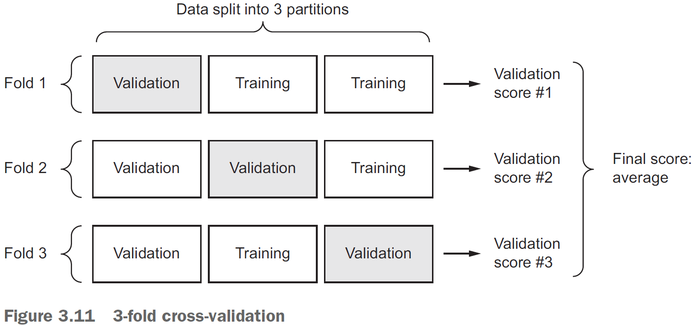
- Once you’re finished tuning the parameters of the model, you can train the final production model on the combination of the training and validation dataset.

**Summary**


## Chapter 4: Fundamentals of machine learning

- The central problem of deep learning is overfitting.
- Four branches of machine learning
    - *Supervised learning*: learning to map input data to known targets.
        - Classification
        - Regression
        - Sequence generation
        - Object detection
        - Image segmentation
    - *Unsupervised learning*: finding interesting transformation of the input data without the help of any targets.
        - Dimensionality reduction
        - Clustering
    - *Self-supervised learning*: a specific instance of supervised learning without human-annotated labels.
        - Autoencoders
        - Temporally supervised learning
    - *Reinforcement learning*: an agent received information about its environment and learns to choose actions that will maximize some reward.
- These four branches are sometimes blurry and aren’t well defined. It’s more of a continuum than distinct.

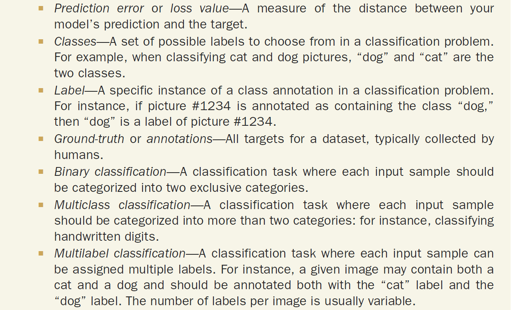

- We split the input data into a
    - Training set
    - Validation set
    - Testing set
- Because if we use all of the data, the model starts overfitting.
- The goal of machine learning is to achieve models that generalize to perform well on never-before-seen data.
- So a measure of generalization power of the model is important.
- The hyperparameters of the model are the controllable factors of the model.
- E.g. Number of neurons, number of layers, learning rate, optimization method.
- The parameters of the model are the network’s weights.
- Be careful to not tune the hyperparameters too much to the validation set as you could be overfitting to the validation set.
- Three ways to split the train, valid, and test sets
- Simple hold-out validation
    - Set apart some fraction of the data as the test set.
    - However, if little data is available, then the validation and test sets may contain too few samples.
    - Recognize this problem if the model shows variance based on the train-test split.


```python
num_validation_sample = 10000
np.random.shuffle(data)

# Define the validation set
validation_data = data[:num_validation_samples]
data = data[num_validation_samples:]

# Define the training set
training_data = data[:]

model = get_model()
model.train(training_data)
validation_score = model.evaluate(validation_data)

# At this point, you can tune your model,
# retrain it, evaluate it, and tune it again.

# Train the final model on all non-testing data
model = get_model()
model.train(np.concatenate([training_data, validation_data]))
test_score = model.evaluate(test_data)
```

- K-fold validation
    - Split the data into K partitions of equal size.
    - For each partition i, train the model on the remaining K - 1 partitions and evaluate on partition i.
    - Your final score is the averages of the K scores.


```python
# The number of folds
k = 3
num_validation_samples = len(data) // k
np.random.shuffle(data)

validation_scores = []
for fold in range(k):
  validation_data = data[num_validation_samples * fold:
    num_validation_samples * (fold + 1)]
  training_data = data[:num_validation_samples * fold] +
    data[num_validation_samples * (fold + 1):]

    model = get_model()
    model.train(training_data)
    validation_score = model.evaluate(validation_data)
    validation_scores.append(validation_score)

# Calculate the average validation score
validation_scores = np.average(validation_scores)

# Train the final model on all non-testing data
model = get_model()
model.train(data)
test_score = model.evaluate(test_data)
```

- Iterated K-fold validation with shuffling
    - Use this when there is very little data
    - Apply K-fold validation multiple times, shuffling the data every time before splitting it K-ways.
    - The final score is the average of the scores obtained from each run of K-fold validation.
- Things to keep in mind
    - *Data representativeness*: ensure to shuffle your data before splitting it into the training and test sets.
        - E.g. If taking the first 80% of a digits data set for training, then the training set only contains classes of 0-7 where the test set contains only classes 8-9.
    - *Arrow of time*: don’t shuffle the data if you’re trying to predict future events from the past because the order matters.
        - E.g. Stock market, weather, music.
    - *Redundancy in the data*: if duplicate data ends up in both the training and testing set, then the network will train on the testing set which introduces bias.
- Data preprocessing for neural networks
    - *Vectorization*: convert all data into tensors.
        - Done because neural networks only take in tensors as input.
    - *Value normalization*: convert all data into the same range with a mean of 0 and a standard deviation of 1.
        - Done because a large variations in the input data can cause large gradient updates preventing the model from converging.
    - *Missing values*: set missing data to zero so the model learns zero to mean missing data.
        - Done because neural networks can’t handle missing values.
- *Feature engineering*: the process of using your own knowledge of the data to make the model work better.

- E.g. Instead of inputting the raw clock face, convert the time into Cartesian coordinates or, even better, into polar coordinates.
- Make the problem easier by expressing it in a simpler way. However, this requires understanding the problem in depth.
- Benefits of feature engineering
    - Reduces the amount of resources used
    - Reduces the amount of data used
- Learning how to deal with overfitting is essential to mastering machine learning.
- The fundamental issue in machine learning is the tension between optimization and generalization.
- The challenge in machine learning is to generalize from the data.
- *Optimization*: adjusting a model to get the best performance.
- *Generalization*: adjusting a model to perform well on any data.
- *Regularization*: adjusting a model to prevent overfitting.
- Regularization methods
    - Get more training data
    - Reduce the capacity of the network
    - Add weight regularization
    - Add dropout
- Constraining the model
    - *Capacity*: the number of learn-able parameters in a model.
    - A model with more parameters has a higher learning capacity.
    - However, it’ll start overfitting if it has too much room to learn.
    - There’s a tradeoff between too much capacity and too little capacity.
- The general workflow to find an appropriate model is to start small and to slowly grow the model until you see diminishing returns.
- The larger the model, the quicker it can model the training data but the more susceptible it is to overfitting.
- Simpler models are less likely to overfit than complex ones.
- One way of making the model simpler is to reduce the range of the weights.
- *Weight regularization*: forcing the weights to take only small values.
- Weight regularization penalizes the size of the weights of a network so that large output values that signify strong confidence can no longer be achieved from a single large weight, but instead require several medium-sized weights.
- Conceptually, it penalizes strong opinions from single units and encourages taking into account the opinion of multiple units, thus reducing bias.
- This penalty is added to the error function value thus increasing the error if larger weights are used. As a result, the network is driven to solve the problem with small weights.
- The cost comes in two flavors
    - *L1 regularization*: penalizes the absolute size of the weight.
    - *L2 regularization*: penalizes the squared size of the weight.
- Code implementation of regularizers

```python
from keras import layers, models, regularizers

model = models.Sequential()
# Use L2 regularization with penalty of 0.001 * weight
model.add(layers.Dense(16, kernel_regularizer=regularizers.l2(0.001),
    activation ='relu', input_shape=(10000,)))
# Use both L1 and L2 regularization
model.add(layers.Dense(16,
    kernel_regularizer=regularizers.l1_l2(l1=0.001, l2=0.001),
    activation ='relu', input_shape=(10000,)))
```

- The `l2(0.001))` means to use L2 regularization and for every coefficient in the weight matrix of the layer, add `0.001 * weight_coefficient_value` to the total loss of the network.
- Note that this penalty is only added at training and not during testing.
- Another way to prevent overfitting is dropout.
- *Dropout*: randomly dropping out (or setting to zero) a number of output features of the layer during training.
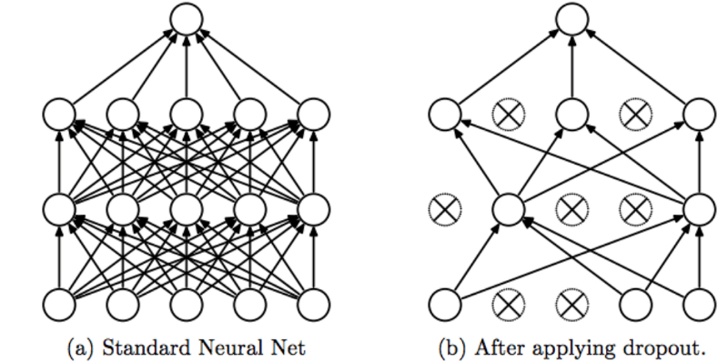
- E.g. A normal layer returns `[0.2, 0.5, 1.3, 0.8, 1.1]` but a dropout layer would return `[0, 0.5, 1.3, 0, 1.1]`.
- <https://stats.stackexchange.com/questions/241645/how-to-explain-dropout-regularization-in-simple-terms>
- *Dropout rate*: the fraction of features that are zeroed out.
- During testing, no units are dropped out but are instead scaled down by a factor equal to the dropout rate to balance the increased number of active units.
- E.g. `[0.2, 0.5, 1.3, 0.8, 1.1]` with a dropout rate of `0.2` at testing would turn into `[0, 0.5, 1.3, 0.6, 1.1]`
- When applying dropout, you need to compensate for the fact that at training time, a portion of the neurons are deactivated. To do so, there are two strategies.
    - *Inverted dropout*: divide the output by the dropout rate during training and leave the testing unchanged.
    - *Scaled activation*: leave the training unchanged but multiply the output by the dropout rate during testing.
- Code implementation of dropout

```python
p = 0.5  # Dropout rate or the probability of keeping a unit active.
## Method 1: Inverted Dropout
# Training: randomly nuke 50% of the output and multiply it by 2
layer_output *= np.random.randint(0, high=2, size=layer_output.shape)
layer_output /= p
# Testing: do nothing

## Method 2: Scaled Activation
# Training: randomly nuke 50% of the output
layer_output *= np.random.randint(0, high=2, size=layer_output.shape)
# Testing: scale output down by 50%
layer_output *= p
```


- <https://stats.stackexchange.com/questions/241645/how-to-explain-dropout-regularization-in-simple-terms>
- Adding dropout to a neural network

```python
model = models.Sequential()
model.add(layers.Dense(16, activation='relu', input_shape=(10000,)))
model.add(layers.Dropout(0.5))
model.add(layers.Dense(16, activation='relu'))
model.add(layers.Dropout(0.5))
model.add(layers.Dense(1, activation='sigmoid'))
```

**Universal Machine Learning Workflow**

1. Define the problem and get the data
   - What will your input data be? What are you trying to predict? What type of problem are you facing? (binary, multiclass, regression).
   - You believe that your outputs can be predicted given your inputs.
   - You believe that the input contains sufficient information to predict the output.
   - Machine learning can only recognize what it’s already seen. You’re predicting the future given the past.
2. Choose a measure of success
   - Success must be measurable for it to be improvable.
   - The metric for success will inform which loss function to choose.
3. Decide an evaluation protocol
   - Once you know what you’re aiming for, you have to figure out how to get there.
   - E.g. A validation set, K-fold cross validation.
4. Prepare your data
   - Format the data as tensors.
   - Scale the values to be in a small range.
   - Normalize features with different ranges.
   - Feature engineering.
5. Develop a model to beat the baseline
   - The baseline is random guessing.
   - E.g. For guessing digits between 0-9, the baseline is 10% for random guessing.
   - The key choices are for the last-layer activation, loss function, and optimization configuration.

6. Scale up the model so it overfits
   - Once the model is better than the baseline, optimize the model.
   - The universal tension in machine learning is between optimization and generalization.
   - The model should stand on the border between under-fitting and overfitting; between under-capacity and overcapacity.
   - To determine the border, you must first cross it.
   - To cross the border, develop a model that overfits by adding more layers, making the layer bigger, and training for more epochs.
   - When the validation loss increases, you’ve achieved overfitting.
7. Regularize the model and tune the hyperparameters
   - Now that the model overfits, move it closer to the border by
       - adding dropout
       - adding L1/L2 regularization
       - modifying the architecture
       - modifying the hyperparameters
   - Be mindful of leaking information from the validation set to the model. You don’t want the hyperparameters to be overspecialized to the validation set.
   - Once the neural network looks good, train on both the training and validation set and test it on the testing set.

**Summary**


# Part II: Deep Learning in Practice

## Chapter 5: Deep learning for computer vision

- *Convolutional neural networks (convnets)*: a class of neural networks that uses the convolution operation on images for recognition and classification.
- Convnets take in as input tensors of shape `(image_height, image_width, image_channels)` not including the batch dimension.
- Since the output of the conv layer is 3D, we need to flatten it to 1D using it in a dense layer.
- The fundamental difference between dense and convolution layer
    - Dense layers learn global patterns in the data.
    - Convolution layer learn local patterns in the data.
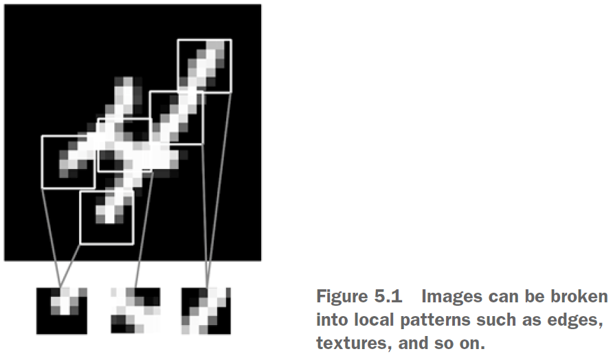
- Since conv layer learn local patterns, this gives them two interesting properties
    - The patterns they learn are translation invariant.
    - They can learn spatial hierarchies of patterns.
- Convolutions operate over 3D tensors, call feature maps, with two spatial axes (height and width) as well as a depth axis (channels).
- RGB has three channels: red, green, blue. Greyscale has one channel: levels of grey.
- The convolution operation outputs a feature map with an arbitrary depth since the depth axis no longer stands for channels, but rather filters.
- *Filters*: encodes specific aspects of the input data.

- Convolutions are defined by two key parameters
    - Size of the patches extracted from the inputs
        - E.g. 3 x 3 or 5 x 5
    - Depth of the output feature map
        - The number of filters computed by the convolution.
        - E.g. 32, 64
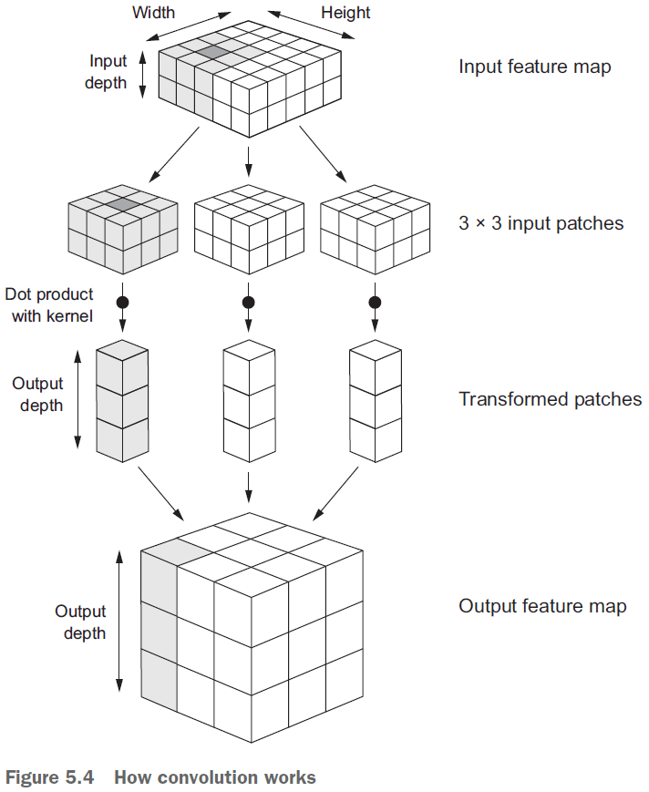
- The output width and height may differ from the input width and height due to
    - Border effects
    - Strides
- Border effects and padding
    - If you use a sliding window on the raw input, the output will decrease in dimensions due to not being able to use the edge.

    - To get the output feature map to have the same spatial dimensions as the input, you can use padding.
    - *Padding*: adding an appropriate number of rows/columns to the input to fit center convolution windows around every input tile.

    - There are two padding arguments in Keras
        - *Valid*: no padding (only valid window locations are used).
        - *Same*: pad so that the output will have the same dimensions as the input.
- *Stride*: the distance between two successive windows.
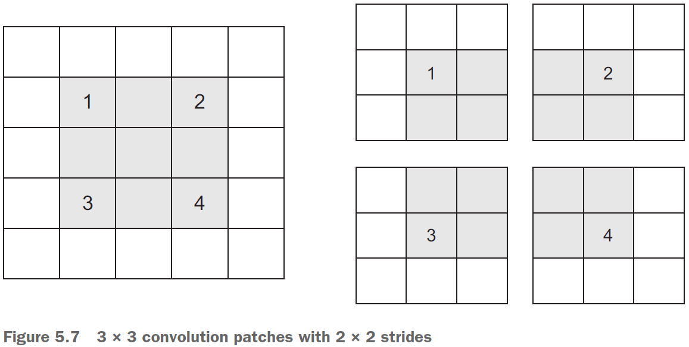
- Stride can be used to downsample a feature map however, max-pooling is more commonly used.
- The role of max pooling is to aggressively downsample feature maps.
- *Max pooling*: extracting windows from the input feature maps and outputting the max value of each channel.
- It’s similar to convolution but instead of transforming local patches using the convolution kernel, they’re transformed using the max tensor operation.
- Max pooling is typically done with 2 x 2 windows and stride 2.
- Use max pooling to
    - Learn a spatial hierarchy of features.
    - Reduce the final feature map over time instead of all at the end to reduce overfitting.
- Alternatives to max pooling
    - Strides
    - Average pooling
- The depth of feature maps progressively increases whereas the size of the feature maps decreases. This is a common pattern in almost all convnets.
- Data preprocessing steps for images
    1. Read the picture file.
    2. Decode the JPEG into RGB grids of pixels.
    3. Convert these to floating-point tensors.
    4. Rescale the pixel values from between 0 and 255 to between 0 and 1.
- To fit a model to a generator instead of an array of tensors, use `fit_generator()` instead of `fit()`.
- Since the data is being generated endlessly, use the `steps_per_epoch` argument to set the number of batches to draw per epoch.
- Use data augmentation to generate more training data from existing samples to prevent overfitting.
- *Data augmentation*: augmenting the training samples by using random transformations.
- Keras supports
    - Rotation
    - Translation
    - Shear
    - Zoon
    - Flip
- *Pretrained network*: a saved network that was previously trained on a large dataset.
- The two ways to use a pretrained network
    - Feature extraction
    - Fine-tuning
- *Feature extraction*: using representations learned by a previous network to extract interesting features from new samples.
- Convnets consist of two parts
    - the pooling and convolution layers (called the convolution base)
    - the dense layers
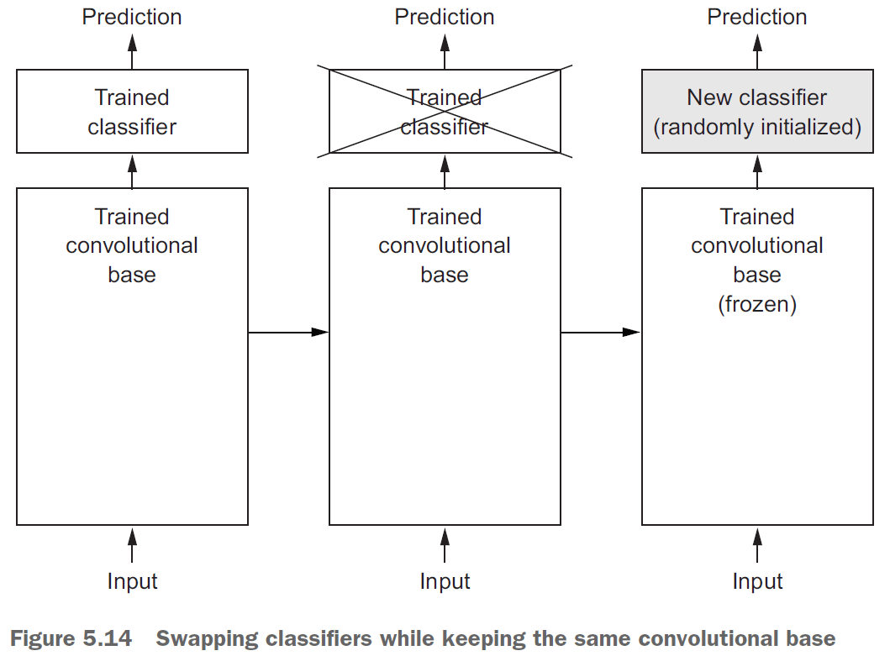
- The reason to discard the classifier is because the representations learned by the convolution base are more general and thus more reusable.
- The more general a model is, the more reusable it is.
- After getting a pretrained network, there are two ways you can proceed
    - Running the conv base on your dataset and storing the result on disk. Then feeding the results into dense layers. This is fast and cheap but can’t use data augmentation since the conv base is only run once per image.
    - Extending the pretrained network by adding dense layers on top. Can use data augmentation since the image goes through the conv base every time it’s seen by the model.
- In Keras, models behave just like layers which means you can do something like this: `model.add(conv_base)`.
- *Freezing*: preventing a layer’s weights from updating.
- Always recompile the model after freezing layers.
- *Fine-tuning*: unfreezing a few of the top layers of a frozen model and training the thawed layers along with the classifier.

- Steps for fine-tuning a network
    1. Add your custom network on top of the pre-trained base network.
    2. Freeze the base network.
    3. Train your custom network.
    4. Unfreeze some layers in the base network.
    5. Jointly train both the unfrozen layer and your custom network.
- Visualizing what convnet learn
    - *Intermediate activations*: for understanding how convnet layers transform their input.
    - *Convnet filters*: for understanding what visual patterns/concepts each filter is receptive to.
    - *Heatmaps of class activation*: for understanding which parts of an image lead to the activation of that neuron.
- To grab the intermediate activations from a model for certain inputs, use the following code.

```python
from keras import models

# Extract the outputs of the top eight layers
layer_outputs = [layer.output for layer in model.layers[:8]]
activation_model = models.Model(
    inputs=model.input, outputs=layer_outputs)
activations = activation_model.predict(img_tensor)
```

- Interesting notes from displaying the activations
    - The first layer acts like an edge detector.
    - The higher you go, the more the abstract the activations become.
    - The higher you go, the more sparse the activations hence why some of the filters are blank. This means the pattern encoded by the filter isn’t found in the input image.
- Gradient ascent in input space: applying gradient descent to the input of a convnet to maximize the response of a specific filter.
- Implementing gradient ascent in the input space
    - Build a loss function that maximizes the value of a given filter in a given layer.
    - Use SGD to adjust the values of the input to maximize the activation value.
- Similar to the activations, the filters get more abstract the deeper into the network we go.
- *Class activation heatmap (CAM)*: a 2D grid of scores associated with a specific output class, computed for every location in any input image, indicating how important each location is with respect to the class under consideration.
- You’re weighting a spatial map of “how intensely the input image activates different channels” by “how important each channel is with regard to the class”, resulting in a spatial map of “how intensely the input image activates the class.”

**Summary**
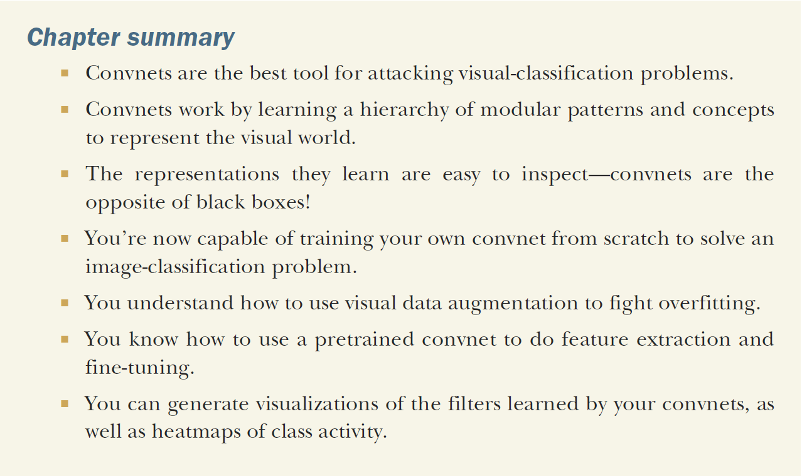

## Chapter 6: Deep learning for text and sequences

- None of the deep learning models in this chapter understand text in the human sense.
- Rather, these models can map the statistical structure of written language.
- Deep learning for natural language processing is pattern recognition applied to words, sentences, and paragraphs.
- *Vectorizing text*: the processing of transforming text into vectors/tensors.
- Vectorize text in multiple ways
    - Segment text into words and transform each word into a vector.
    - Segment text into characters and transform each character into a vector.
    - Extract n-grams of words/characters and transform each n-gram into a vector.
- *N-grams*: overlapping groups of multiple consecutive words/characters.

- *Tokens*: the different units you can break down text (characters, words, n-grams).
- *Tokenization*: breaking text into tokens.
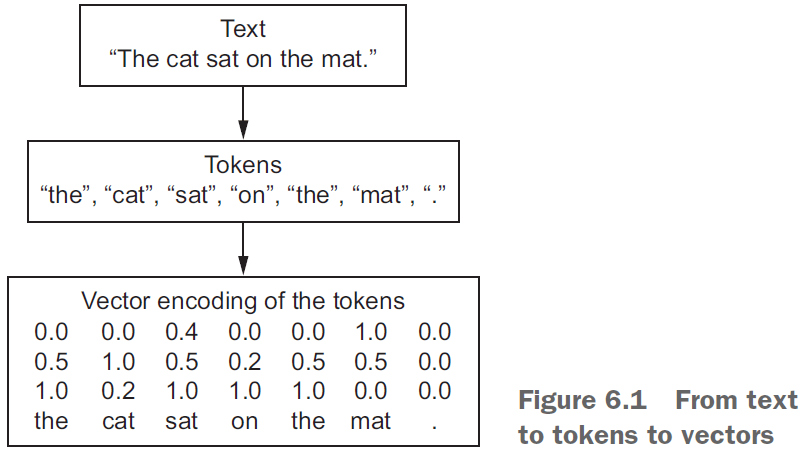
- There are multiple ways of associating a vector with a token
    - *One-hot encoding*: associating a unique integer index to each unique word.
    - *Word embedding*: associating a vector to a word.
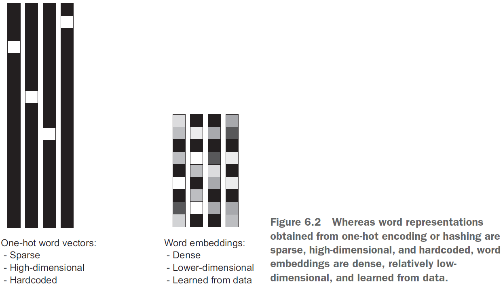
- Two ways to obtain word embeddings
    - Learn word embeddings jointly with the main task.
    - Load into your model word embeddings that were precomputed on a different task.
- The geometric relationship between word vectors should reflect the semantic relationship between those words.
- Word embeddings are meant to map human language into a geometric space with words closer in meaning mapped closer together and specific directions to be meaningful.

- The transformation “from pet to wild animal” goes from bottom to top.
- The transformation “from canine to feline” goes from left to right.
- Learn the embeddings using backprop.

```python
from keras.layers import Embedding

# The 1000 is the number of possible tokens (1 + maximum word index).
# The 64 is the dimensionality of the embeddings.
embedding_layer = Embedding(1000, 64)
```

- Think of the embedding layer as a dictionary that maps words to vectors.
- Word index → Embedding layer → Corresponding word vector.
- The embedding layer takes a 2D tensor of shape `(samples, sequence_length)` and returns a 3D tensor of shape `(samples, sequence_length, embedding_dimensionality`.
- All sequences in a batch must have the same length so pad the shorter ones and chop the longer ones.
- Use pretrained word embeddings when you don’t have a lot of data.
- *Recurrent neural network (RNN)*: a class of neural network that maintains previously seen information; a network with memory.
- RNNs feed their previous output alongside the current input.

- The state of the RNN is reset between processing two different, independent sequences.
- However, the processing of those sequences is no longer a single step as the network internally loops over it.
- An RNN is a `for` loop that reuses quantities computed during the previous iteration of the loop.

- Usually, you don’t need the full sequence of outputs from an RNN because the last step already has the information about the entire sequence.
- The `SimpleRNN` in Keras takes inputs of shape `(batch_size, timesteps, input_features)`.
- Use the `return_sequences` argument to specify whether you want the full sequences of successive outputs for each timestamp or if you only want the last output.
- Sample of stacking RNNs

```python
model = Sequential()
model.add(Embedding(10000, 32))
model.add(SimpleRNN(32, return_sequences=True))
model.add(SimpleRNN(32, return_sequences=True))
model.add(SimpleRNN(32, return_sequences=True))
model.add(SimpleRNN(32))
model.summary()
```

- In practice, you’ll never use `SimpleRNN` because it’s too simple. Use either `LSTM` or `GRU`.
- SimpleRNN doesn’t work as well due to the vanishing gradient problem.
- *Vanishing gradient problem*: if the network as too many layers, it becomes untrainable.
- *Long Short-Term Memory (LSTM)*: an extension of RNNs with a carry track to carry information forwards in time.

- An LSTM saves information for later thus preventing older signals from gradually vanishing.
- Psuedocode for an LSTM

```python
output_t = activation(dot(state_t, Uo) +
    dot(input_t, Wo) + dot(C_t, Vo) + bo)

i_t = activation(dot(state_t, Ui) + dot(input_t, Wi) + bi)
f_t = activation(dot(state_t, Uf) + dot(input_t, Wf) + bf)
k_t = activation(dot(state_t, Uk) + dot(input_t, Wk) + bk)

c_t+1 = i_t * k_t + c_t * f_t
```

- Three advance RNN techniques
    - *Recurrent dropout*: uses a temporally constant dropout pattern.
    - *Stacking recurrent layers*: recurrent layers that are stacked on one another.
    - *Bidirectional recurrent layers*: recurrent layers that learn using both the forward and reverse order of the dataset.
- The common-sense, non-ML baseline is either to guess randomly or to guess the class that appears most often.
- E.g. If the data contains 90% of class A and 10% of class B, then the baseline is 90% because if we always guess A, then we will be right 90% of the time.
- If you don’t have a baseline to beat, you can’t tell whether you’re making real progress.
- *Gated recurrent unit (GRU)*: a streamlined version of the LSTM.
- ML is about the tradeoff between computational expensiveness and representational power.
- The proper way to apply dropout to RNNs is to apply the same pattern of dropped units at every timestep instead of applying a different pattern at every timestep.
- Vary the dropout pattern between sequences, not within sequences.
- To stack recurrent layers on top of each other, all intermediate layers should return their full sequence of outputs instead of just the last output.
- A bidirectional RNN processes input sequences chronologically and anti-chronologically. It trains in both forward and reverse time.
- Interestingly, reverse-order processing on text works just as well as forward-order processing in some cases.
- Although the word order does matter in understanding language, which order is used doesn’t matter.
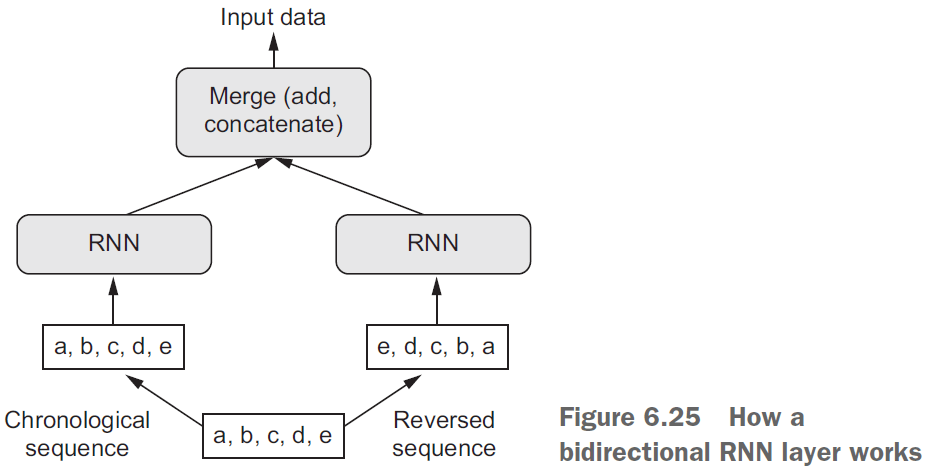
- When it comes to markets, past performance is not a good predictor of future returns; looking in the rear-view mirror is a bad way to drive.
- *1D convolution*: a convolution in one dimension where the window is the slice of time.
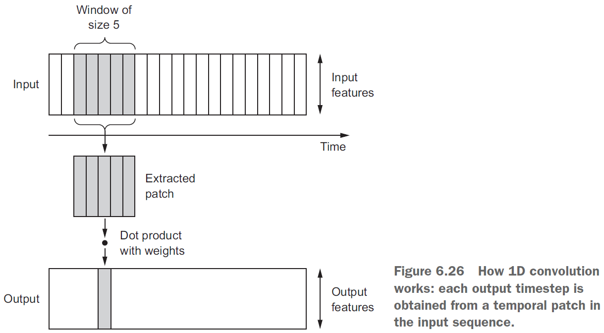
- Like 2D convnets, 1D convnets find local patterns in the sequence so one pattern learned at one time can later be recognized at a different time.
- This makes 1D convnets translation invariant for temporal translations.
- E.g. If it sees that after it’s cloudy it rains, then the next time it’s cloudy, it’ll predict that it’ll rain.
- Just like max pooling, 1D sequences used 1D pooling.
- 1D convnets can’t learn longer-term patterns as well as an RNN can due to only focusing on local patterns.
- However, for very long sequences, you can use a 1D convnet to reduce the sequence’s length and feed that into an RNN.


**Summary**
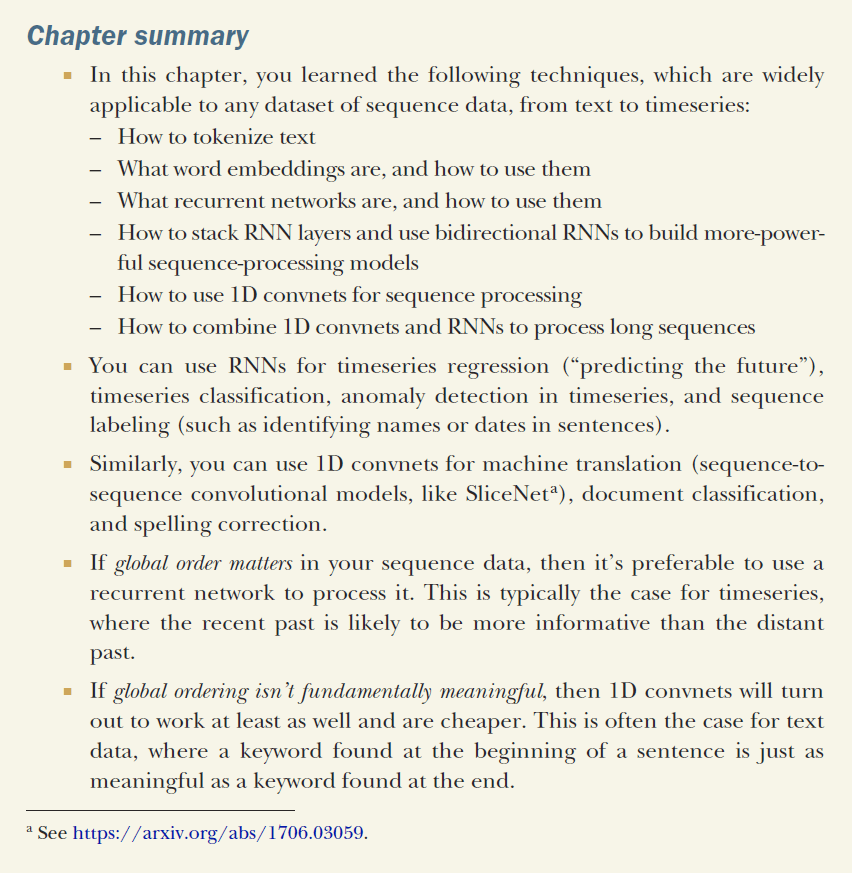

## Chapter 7: Advanced deep-learning best practices

- Sequential models are limited in that they have exactly one input and exactly one output.
- However, you may want a model that
    - takes in multiple inputs
    - returns multiple outputs
    - has a graph-like structure


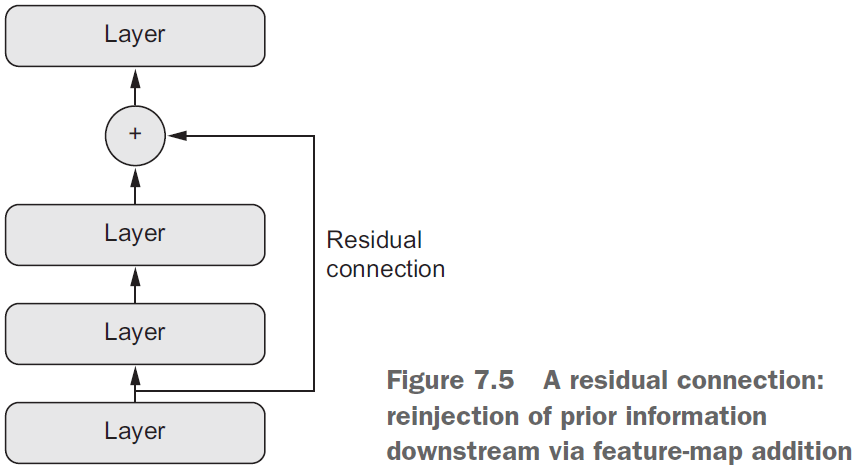

- The Keras functional API lets you use layers as functions.
- E.g. The `Sequential` model converted into the functional API.

```python
from keras.models import Sequential, Model
from keras import layers
from keras import Input

seq_model = Sequential()
seq_model.add(layers.Dense(32, activation='relu', input_shape=(64,)))
seq_model.add(layers.Dense(32, activation='relu'))
seq_model.add(layers.Dense(10, activation='softmax'))

input_tensor = Input(shape=(64,))
x = layers.Dense(32, activation='relu')(input_tensor)
x = layers.Dense(32, activation='relu')(x)
output_tensor = layers.Dense(10, activation='softmax')(x)
model = Model(input_tensor, output_tensor)
```

- The compiling, training, and evaluating is the same for the functional API.
- Multi-output models require different loss functions for the different outputs.
- However, SGD requires a scalar to work.
- *Residual connection*: a connection from shallow layers to deeper layers that allows re-injecting previous representations into the deeper layers.
- Resnets are built using residual connections and tackle the following problems
    - vanishing gradients
    - representational bottlenecks

- You can use models as you use layers. Think of models as a “bigger layer”.
- E.g. You can use a model to evaluate a single input: `y = model(x)`.
- When training a model, we currently let the model run until it starts overfitting. However, this is wasteful and inefficient.
- A better way is to stop training when the validation loss stops improving. Use a Keras callback to implement this.
- Examples of ways to use callbacks during training
    - Model check-points by saving the current weights
    - Early stopping when validation loss doesn’t improve
    - Dynamically adjusting the value of certain parameters
    - Logging training/validation metrics
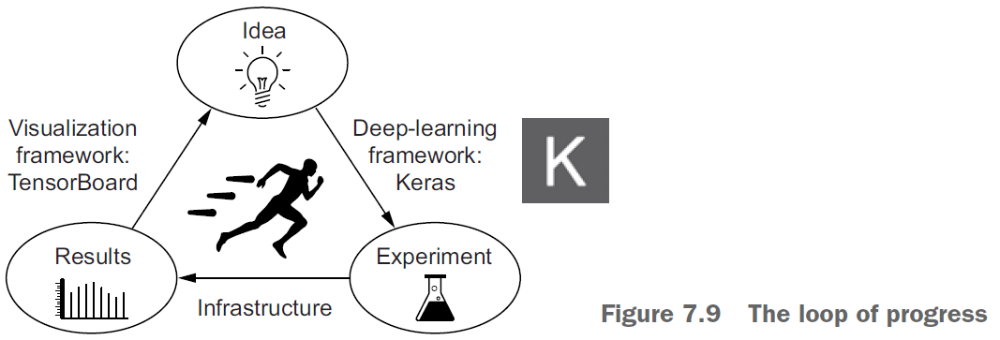
- Use Tensorboard to visualize
    - Metrics during training
    - Model architecture
    - Histograms of activations and gradients
    - Embeddings in 3D
- Advance neural network design patterns
    - Residual connections
    - Normalization
    - Depthwise separable convolution
- Normalization makes different samples seem more similar.
- `BatchNormalization` is a type of layer that can continuously normalize data throughout the network.
- *Depthwise seperable convolution*: separating the learning of spatial features and the learning of channel-wise features.

- *Hyperparameters*: the architecture-level parameters.
- E.g. How many layers/neurons to use, how many epochs, use dropout.
- *Model ensembling*: pooling together predictions of a set of different models to produce better predictions.
- E.g. The group of blind men exploring an elephant story.
- Ensembling assumes that different models are good for different reasons hence combining them makes them more effective. The models must be different and diverse.
- The whole is greater than the sum of its parts.
- You want ensemble models that are as good as possible but that are also as different as possible.

**Summary**


## Chapter 8: Generative deep learning

- *Generative recurrent networks*: using an RNN to predict the next token(s) in a sequence using the previous tokens as input.
- E.g. Given “the sky is bl-” predict “ue”.
- Once the model is trained, sample from it by feeding the generated output as input.

- Example sampling strategies
    - *Greedy sampling*: always choosing the most likely token.
    - *Stochastic sampling*: randomly choosing the next token based on the token’s probability.
- Stochastic sampling is better than greedy sampling as it provides more variety in the generated output.
- However, we want to control the randomness or “creativity” of the network to tune how predictable or surprising the output is.

- Skipping over the DeepDream content.
- Skipping over the neural style transfer content.
- The key idea for image generation is to develop a latent space that can be sampled from to generate images.

- *Latent space*: the space that holds all possible abstractions obtained from the environment.
- Latent space is the same idea as the embedded space for words where certain directions encode certain features.
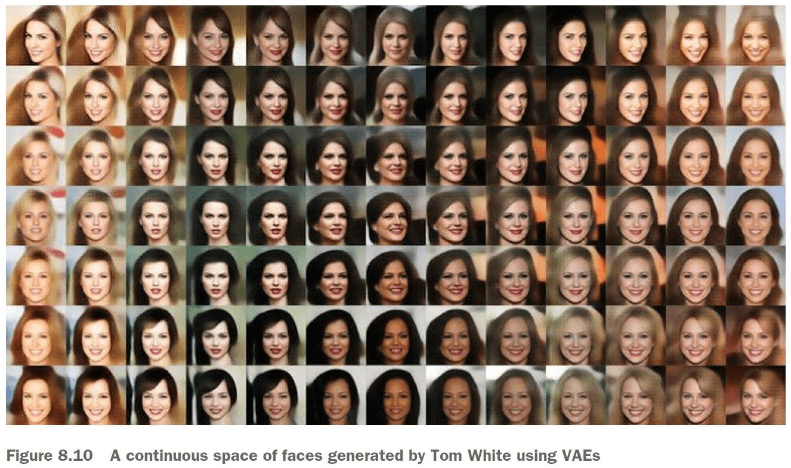
- *Variational autoencoders (VAE)*: a variant of autoencoders that turns the input image into a mean and a variance.
- The three steps of VAE
    - Encode the image into two parameters in the latent space, a mean and a variance.
    - Randomly sample a point from the latent space to generate the input image.
    - Decode the point in latent space back into the original input image.
- *Generative adversarial networks (GAN)*: consists of two parts
    - *Generator network*: takes a random vector as input and decodes it into a synthetic image.
    - *Discriminator network*: takes an image (real/synthetic) and predicts whether the image is real or synthetic.

- GANs don’t seek to minimize like SGD, but instead they seek to reach equilibrium.
- GANs are notoriously difficult to train.
- It’s important to freeze the discriminator’s weights while training the GAN. This way the discriminator won’t always predict “real”.
- Steps to train a GAN (per epoch)
    1. Get random points from the latent space.
    2. Generate images using the random points and the `generator`.
    3. Mix the generated images with the real ones.
    4. Train the `discriminator` using the mixed images with corresponding targets (real/fake).
    5. Get new random points from the latent space.
    6. Train `gan` using these random points with targets that all say “real”. Freeze the discriminator’s weights and update the generator’s weights.

**Summary**


## Chapter 9: Conclusions

- A review on everything learnt in this textbook.
- Anything requiring reasoning is beyond deep learning.
- Neural networks doesn’t understand the task they perform.

- The only real success of deep learning so far has been the ability to map space X to space Y using a continuous geometric transform, given large amounts of human-annotated data.
- To make something more efficient, there’s one universal recipe: introduce modularity and hierarchy.
- So please go on learning, questioning, and researching.
- Never stop. Because even given the progress made so far, most of the fundamental questions in AI remain unanswered. Many haven’t even been properly asked yet.
