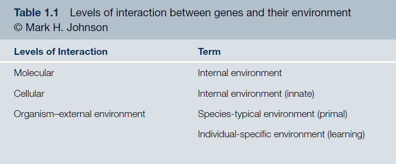
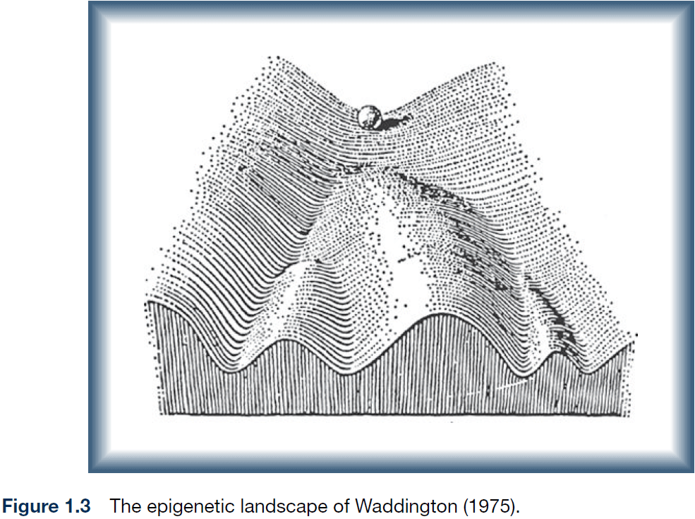
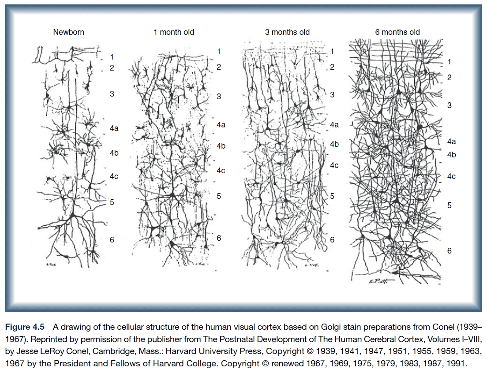
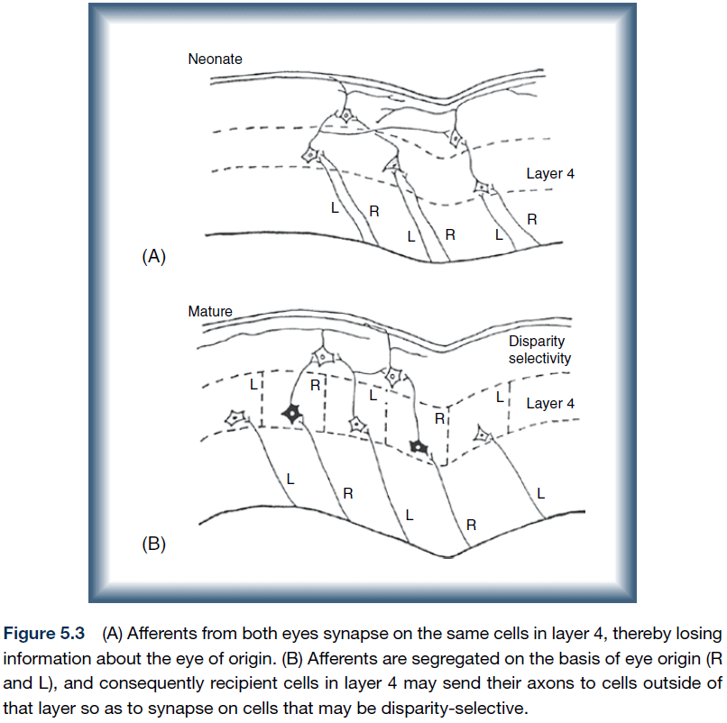
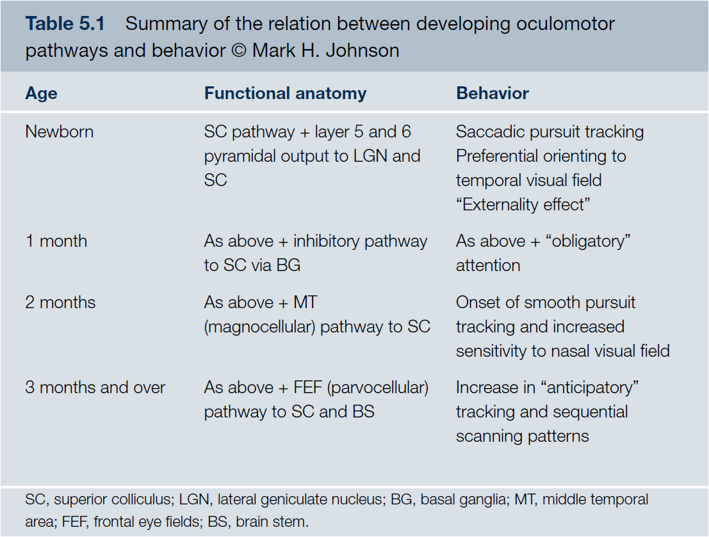
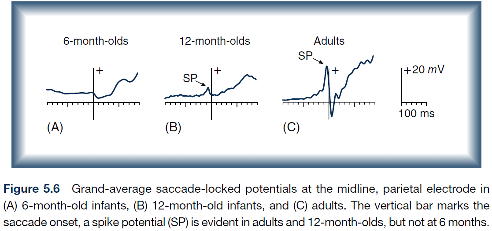
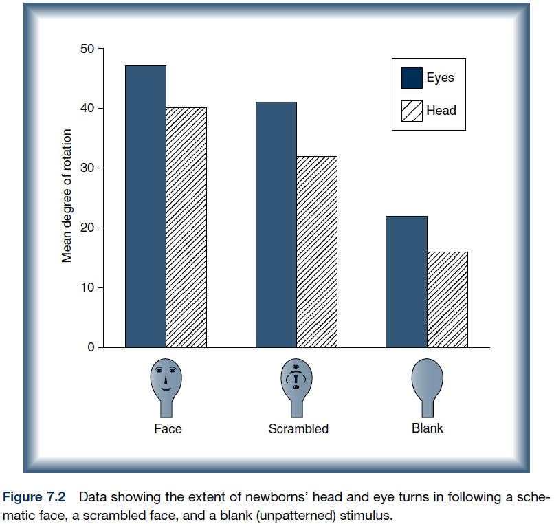
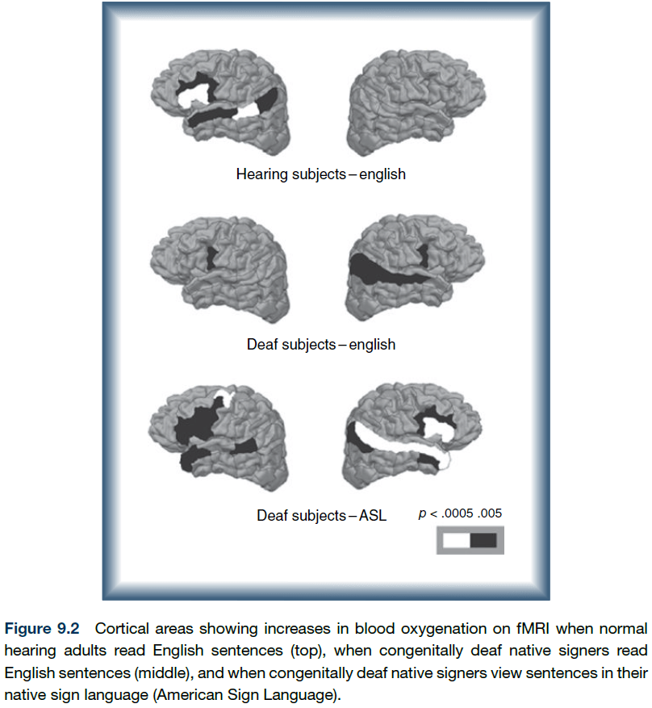
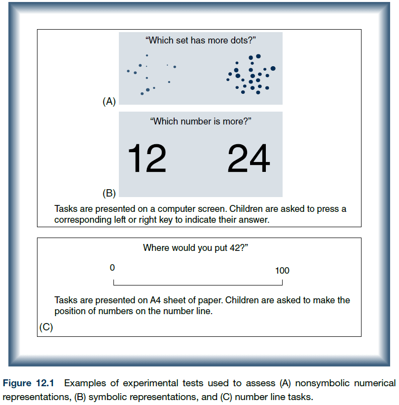
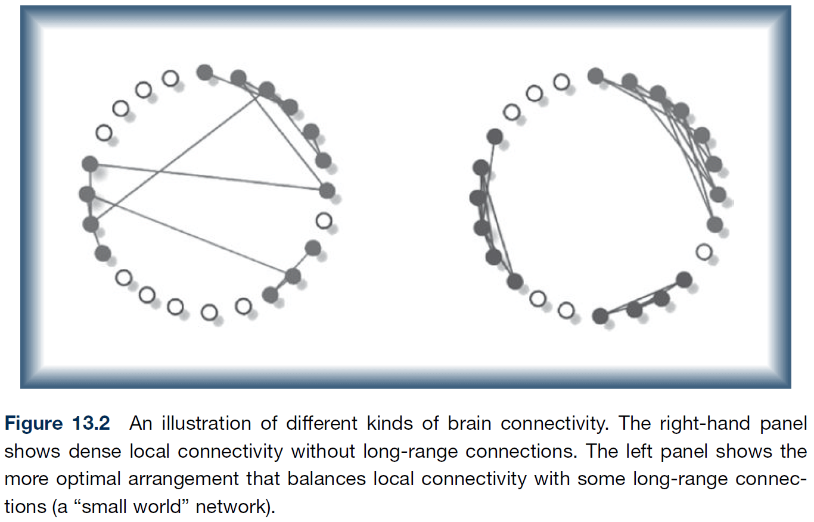

<blockquote class="blockquote">
  
All parents damage their children. It cannot be helped. Youth, like pristine glass, absorbs the prints of its handlers. Some parents smudge, others crack, a few shatter childhoods completely into jagged little pieces, beyond repair.

  
Mitch Albom

</blockquote>

## Chapter 1: The Biology of Change

- Textbook website: <http://www.wiley.com/go/johnson/developmentalcognitiveneuroscience>
- Brain volume increases four times from birth to adolescence.
- Developmental cognitive neuroscience (DCN): how the brain and mind change from childhood into adulthood.
- Two main questions of DCN
    - How are the mind and body related? (Cognitive Neuroscience)
    - How does the brain develop? (Development)
- The origins of the brain can be posed in two ways
    - Phylogeny (evolutionary): concerns the origin of the species.
    - Ontogeny (individual development): concerns individual development.
- Some people argue that ontogeny can be reduced down to phylogeny since development depends on genes which result from evolution but the textbook disagrees.
- The information isn’t in the genes, but emerges from the constructive interaction between genes and their environment.
- Phylogeny vs ontogeny = Nature vs nurture.
- Phylogeny/Nature believe that most of the information necessary to build a brain is within the genes and that development is a process of triggering the expression of information already contained within the genes.
- Ontogeny/Nurture believe that most of the information that shapes the mind comes from the external world.
- Both views are ill conceived as they assume that information for the structure of an organism exists prior to construction (either in genes or the external world).
- The relationship between the genotype and its resulting phenotype is much more dynamic and flexible than assumed.
- Constructivism: the relationship between the initial state and the final product can only be understood by considering the progressive construction of information.
- There is no aspect of development that can be said to be strictly genetic.

- We can use artificial neural networks (ANN) to model the development of neural circuits.
- We can modify ANNs in four ways.

|                      | Fixed Architecture                                                                                                                  | Flexible Architecture                                  |
| -------------------- | ----------------------------------------------------------------------------------------------------------------------------------- | ------------------------------------------------------ |
| **Fixed Connections**    | Little evidence that the neocortex possesses innate representations                                                                 | No opinion                                             |
| **Flexible Connections** | Evidence consistent with this view that the cerebral cortex imposes architectural constraints on the development of representations | Only under extremely atypical environmental conditions |

- The representations that emerge as a result of training are constrained by the basic architecture of the network.
- Development can be used a tool to study the interactions between disparate levels of organization because development applies to all levels of organization.
- Constructivism views development as the attempt to unravel the dynamic relations between intrinsic and extrinsic structure that progressively restrict the phenotypes that can emerge.
- Predetermined epigenesis: unidirectional structure-functional development.
- Probabilistic epigenesis: bidirectional structure-functional development.
- Predetermined epigenesis views the infant mind as comparable to adults with focal brain injury.
- However, this view doesn’t provide a full account of development in the long run.
- An alternative view is that development involves the progressive restriction of fate.

- A deviation from the normal path early in development, at a decision point, may cause the child to take a different developmental path and reach a different end state.
- Three viewpoints of human functional brain development
    1. Maturational: relate the maturation of particular brain regions to new cognitive functions.
    2. Interactive specialization: activity-dependent interactions between regions specialize the functions of regions so that their activity becomes more restricted.
    3. Skill learning: the brain regions active in infants while learning are similar to those involved in learning in adults.
- Much of the research to date uses the maturational viewpoint, that new behaviors are due to new brain ares, but this approach fails to explain some major aspects of functional brain development.
- Neurobiological and brain imaging studies indicate that the cortex probably doesn’t possess innate representations.
- Rather, large-scale regions of the cortex have approximate biases that make them best suited to supporting particular types of computations.

## Chapter 2: Methods and Populations

- Three critical properties of science
    - Evidence
    - Theories to explain the evidence
    - Theories to predict future evidence
- Challenges with experiments on infants and toddlers
    - Nonverbal instructions
    - No complex motor responses
    - Short attention spans
- Preferential looking: pairing visual stimuli and recording the time that infants choose to look.
- Habituation: showing the same stimulus repeatedly until the infant shows disinterest.
- We can use habituation to infer whether an infant finds a new stimulus as similar or different compared to the habituated stimulus.
- Marker task: specific behavioral tasks based on brain regions that are measured at different ages and in different contexts.
- However, the marker task doesn’t take into account that different brain regions may be used for the same task at different ages.
- Introduction to EEG, MRI, fMRI, NIRS.
- The vast majority of what we currently know about both pre- and postnatal brain development comes from research on other species.
- Williams syndrome (WS): a developmental disorder that is characterized by mild to moderate intellectual disability or learning problems, unique personality characteristics, distinctive facial features, and heart and cardiovascular problems.
- Four levels of developmental disorders of genetic origin
    - Gross brain anatomy
    - Deficit areas
    - Neural systems and pathways
    - Neurochemistry and microcircuitry
- Many developmental disorders involve widespread systemic subtle differences in brain structure and function.
- E.g. Autism and ADHD have little support that there are discrete lesions to functional cortical areas.
- Visual deprivation over the first months of development has detectable life-long effects on face processing.
- The deprivation isn’t balanced by both sides of the brain as the effects are more due to the right hemisphere (left eye).
- This presents a severe challenge for the skill learning approach to development as it suggests the right hemisphere may be biased towards face processing.

## Chapter 3: From Gene to Brain

- Gene: a sequence of nucleotides within a strand of DNA.
- Genotype: the sum total of all genes.
- Phenotype: the end product or result of gene expression.
- Surprisingly, proteins are constructed relatively far away from the DNA itself which means there’s some intermediary molecule that transfers the information from the DNA to the machinery making proteins.
- The messenger was discovered to be RNA.
- This lead to the view that all genetic information necessary for the development and functioning of an organism was contained in the DNA.
- However, this isn’t true and the first evidence for when the mapping between genes and proteins breaks down is DNA transcription and DNA translation.
- The same sequence of DNA can generate dozens of different proteins and as much as 95% of the DNA doesn’t appear to code for proteins.
- Pleiotropic: a gene can play multiple different roles at different times in different areas of development.
- In present day, genes are said to be pleiotropic.
- Four strategies to understand the mapping from genotype to behavioral phenotype
    1. Cases where the gene to brain to behavior pathway is simple.
    2. Study the naturally occurring differences among individuals.
    3. Study of human syndromes and developmental disorders.
    4. Study animal models

## Chapter 4: Building a Brain

- The brain of all mammals follows a basic plan that’s found across other species such as reptiles and birds.
- The major difference between other species and primates is the dramatic expansion of the cerebral cortex together with the associated structures such as the basal ganglia.
- Interestingly, human brain development follows the development of other primate brains but on a slower schedule.
- Neocortex: thin (3-4 mm) sheet of tissue covering the cerebral cortex.
- The layered structure of the neocortex is relatively constant throughout the brain and is about $$2,400\ cm^{2}$$.
- Most of the sensory inputs to the cortex pass through the thalamus and each type of input has its own corresponding nuclei in the thalamus.
- E.g. LGN for visual input and MGN for auditory input.
- The flow of information to and from the cortex is mostly bidirectional.
- Most areas of the neocortex are made up of six layers.
    - Layer 1: long white fibers running along the surface.
    - Layer 2 & 3: more horizontal connections.
    - Layer 4: where most input connections terminate and contains a high proportion of spiny stellate neurons.
    - Layer 5: & 6: have the major outputs to subcortical regions and contains a high proportion of pyramidal neurons.
- However, there are exceptions
    - Layer 4 is thicker and well developed in the sensory cortex.
    - Layer 5 is well developed in the motor cortex.
- Nervous system development starts with neurulation where a part of the ectoderm begins to form a hollow cylinder called the neural tube.
- When neurons are born, they have to migrate from the proliferative zones to their respective region.
- Two forms of migration
    - Passive cell displacement: migrate by being pushed by new cells (outside-in).
    - Active cell displacement: migrate by moving past older cells (inside-out).

- The brain increases in volume during development not due to the addition of new neurons (most neurons are present around seven months), but rather the addition of synapses, dendrites, and myelination.
- The dendritic tree of most neurons increases in size and complexity with a corresponding increase in the density of synapses.

- Sensory areas tend to myelinate earlier than motor areas with cortical association areas myelinating last.
- Some parts of development follow a rise-and-fall trend such as metabolism and synapse density.
- Most of the cortex, with exception to primary sensory areas of cortex, develop from the back-to-front direction, with the prefrontal cortex developing last.
- Interestingly, white matter doesn’t follow the trend of decline, suggesting that the on-going lifelong myelination of fibers adds to the overall volume of the brain.
- While some parts of the brain follow the rise-and-fall trend, not all measures show this pattern.
- E.g. Myelination and white matter.
- There’s also considerable variation in structure and function in normal adult subjects even with twins.
- A study found that the trajectory of change in cortical thickness, not the thickness itself, best predicts IQ.
- While the network imposes architectural constraints on the representations that emerge within it, there are no innate representations.
- There’s evidence that several aspects of the cerebral cortex, such as the general laminar structure and large-scale regions, don’t require neural activity to develop.
- However, much of the small-scale divisions into functional areas requires neural activity to develop.
- Radial unit model: a model that explains neocortical differentiation by having neurons migrate along radial glial fibers.

- Protomap: differentiation of the cortex is due to intrinsic factors such as genetics.
- Protocortex: differentiation of the cortex is due to extrinsic factors such as input from other parts of the brain or sensory systems.
- Current reviews of the evidence converge on views that are midway between the protomap and protocortex hypotheses.
- In the case of mouse whiskers, it’s almost as if the sensory surface imposes itself on to the brain stem.
- Large‐scale regions of cortex have particular combinations of graded gene expression that are then refined into smaller functional areas through activity‐dependent processes.
- While some differentiation of the cortex occurs due to intrinsic molecular and genetic factors, we’ve seen that the information entering a region of cortex is also important for ensuring differentiation.
- E.g. Reducing thalamic input into a region subsequently reduces the region’s size, rewiring of regions is possible, transplanting a piece of cortex makes it develop that regions characteristics.
- Visual inputs can direct the construction of the appropriate processing circuitry in a region that doesn’t normally handle visual information.
- Do transplanted brain regions take on the representations for their developmental origins or the representations of the new location?
- Evidence suggests the latter; the representations of the new location.
- Two caveats
    - Evidence is mostly in the form of sensory cortices so might not apply to other cortex regions.
    - Transplanted tissue is still distinguishable from the original tissue and never matches the original tissue exactly.
- Postnatal growth of cortex proceeds in an inside-out pattern with regard to dendrites, dendritic trees, and myelination.
- To what extent is human brain development similar to that of other species?
- Primates generally have a longer timetable for brain development compared to other mammals
- However, even our species, Homo sapiens, has a postnatal cortical development period four times longer than other primates.
- The structure most likely to differ in size in the relatively slowed neurogenesis of primates is the neocortex.
- It seems likely that species differences originate in the timing of cell development.
- The relatively delayed time course of human brain development also has another important benefit, it allows for a prolonged period during which interaction with the environment can contribute to the tuning and shaping of circuitry.

## Chapter 5: Vision, Orienting, and Attention

- It’s hard to determine whether changes in visual abilities during development are due to limitations in the eye or whether they are due to changes within the brain.

- One ability associated with binocular vision, stereoacuity, increases rapidly such that it reaches adult levels within a few weeks.
- This rapid spurt in stereoacuity requires some equally rapid change in the neural substrate supporting it.
- It’s thought that the inputs from the two eyes to the cortex are initially mixed so that they synapse on common cortical neurons in layer 4.
- Then the geniculate axons originating from one eye withdraw from the region, leaving behind axons from the other eye.
- Processes of selective loss commonly contribute to the sculpting of specific pathways in the cortex.
- This suggests that there will be a certain decline in integration once each neuron receives innervations from only one eye.
- Evidence for this comes from showing that infants under 4 months can perform certain types of integration that older infants can’t.
- E.g. Showing horizontal gratings to the one eye and vertical gratings to the other eye. Infants under 4 months perceived a single grid-like representations instead of two sets of gratings.

- The loss of these connections is probably due to the refinement of synapses by selective loss.
- This refinement probably occurs through activity-dependent neural mechanisms since the creation of ocular dominance columns can be blocked by reducing neuronal activity.
- There’s evidence showing a strong role for visual experience in guiding the development of binocularity.
- Dorsal visual pathway: where/action.
- Ventral visual pathway: what/perception.

- Hypothesized sequence of development of cortical pathways underlying oculomotor control
    - Eye → Superior colliculus
    - Cortical projections → Inhibit superior colliculus
    - Pathway through MT
    - Pathways involving FEFs and related structures
- Interesting notes of infant eye movements
    - Eye movements follow a stimulus in a saccadic/step-like manner compared to the smooth movements in adults.
    - Eye movements lag behind the movement of the stimulus compared to the trajectory prediction in adults.

- Presaccadic spike potential (SP): a sharp deflection that precedes a saccade by 8-20 ms.
- Surprisingly, 6-month old infants don’t exhibit SPs as expected.

- The representation for generating saccades within an eye- or head-centered frame of reference emerged as a result of training and was not hard-wired.

- Overt attention: shifts of attention due to eye/head movements.
- Covert attention: shifts of attention without eye/head movements.
- Adults are able to covertly shift their attention which allows us to enhance our processing of objects within our visual field.
- It appears that the speed of shifting attention improves as we age.

## Chapter 6: Perceiving and Acting in a World of Objects

- Ventral route (what): visual cortex → temporal cortex.
- Dorsal route (where): visual cortex → parietal cortex.

- Going along the ventral route, cells respond to more complex clusters of features and at the highest level, the complex cells show remarkable selectively in their firing.
- However, they still have very large receptive fields on the retina suggesting that they can process feature information but lose their spatial resolution on the retina.
- In effect, the cells develop spatially invariant representations of objects by responding to features, not position.
- Some cells have a view-centered representation while other cells don’t.
- Transformation-invariant representations may provide the basic raw material for long-term representations of the visual world.
- Why do we have two different visual pathways? It’s difficult to perform object recognition while taking into account spatial information so the information is separated.
- Perceptual systems rapidly come to detect the invariant shape of an object over changing patterns of occulusion and background.
- Experiments indicate that infants are only capable of activating either the dorsal or ventral pathways, but not both at the same time.
- Development entails a progressive decorrelation process, maybe due to greater specialization and cortical segregation.

## Chapter 7: Perceiving and Acting in the Social World

- One of the major characteristics of the human brain is its social nature.
- The brain of a newborn human infant contains some information about faces.
- E.g. Infants select for face-like patterns.

- The development of face perception is consistent with the interactive specialization view.
- Joint attention: directing your attention to the same object/location that another person is looking at.
- Mutual gaze: direct eye contact.
- It’s believed that joint attention is useful for word learning.
- Direct eye contact enhances the perceptual processing of faces in 4-month-old infants.
- Mirror neuron system (MNS): the same cells and circuits are involved both in generated a motor action and in processing the visual input from watching someone else performing a similar action.
- Once infants could anticipate the occurrence of a repeated action, the motor activation was evident prior to the start of the repeated observed action.
- Theory of mind: the ability to comprehend another person’s thought processes such as their feelings, beliefs, and knowledge.
- Many believe that a deficit in theory of mind is a central cognitive deficit in autism.

## Chapter 8: Learning and Long-Term Memory

- Patient HM taught us two important facts about memory
    - Memory isn’t a unitary function.
    - Different types of memory rely on different brain networks.
- Explicit vs implicit memory.
- The maturational viewpoint has dominated research on explicit memory development.
- While there is some capacity for explicit memory in newborns, this expands over the first year of life.
- While there is still much debate regarding the development of explicit memory, there is more agreement about the development of implicit memory.
- Most neuroscientists agree that implicit memory is in place within the first few months of postnatal life and that there is little development beyond age 3.

## Chapter 9: Language

- Is language “biologically special”? To what extent is the human brain predisposed to learn about language?
- Studies from early brain damage shows that different regions of cortex are capable of supporting nearly normal language acquisition.
- Studies of deaf patients also shows that regions which normally support oral language can also support other functions.
- While these two studies support the argument that there are no innate language representations in the cortex, there’s strong evidence that the left temporal lobe is biased to process speech shortly after birth.
- Further studies are consistent with the idea that the brain activity related to language becomes more specific and focalized as processing of language becomes more efficient and automatic.
- Also, it seems like an “innate language module” exists in the brain as there’s evidence for normal language skills with poor performance in other domains of cognition and vice versa. This is consistent with the interactive specialization view.
- Language is a system for communicating with other people using sounds, symbols, and words to express a meaning, idea, or thought.
- A network of brain regions supports language functions.

- Primary language functions: speaking.
- Secondary language functions: reading and writing.
- Primary language functions seem to emerge without much effort as children develop, but mastery of secondary language functions requires extensive practice.
- Interestingly, secondary language functions seem to be tool made by humans and not found in nature. So it makes sense why speaking is easily acquired.
- Primary language functions are split into
    - Speech perception: discriminating and analyzing sound patterns.
    - Language processing: understanding word meaning and applying the rules of grammar.
- The difference is between the substrate and the substance, the medium and the message.
- One challenge for studying language acquisition is that animal models can’t be used.
- Does a region of the cortex have innate representations for language, or are language representations the emergent result of a variety of constraints (architecture, connectivity)?
- Two approaches to this problem
    - Investigate whether there are regions specific for language.
    - Identify neural correlates of language abilities early in life.
- The evidence for a pre-specified region that supports language is somewhat controversial.
- While damage to the left hemisphere does have a minor impact on language, it seems like the extend of impact is much less compared to adults with equivalent damage.
- Other findings also suggest that the regions responsible for first-language learning in children are not necessarily the regions responsible for language use in adults.
- If Broca’s area is damaged in children, the regions that take on the role of language acquisition (reorganization) is either the corresponding region on the right hemisphere or the area surrounding Broca’s area.
- Studies demonstrate that brain regions other than the traditional left-hemisphere “language areas” can support language function and following damage to that area, it may be less focally represented in the brain.
- Evidence supports the following conclusions
    - Children with early left-hemisphere brain damage go on to acquire normal language abilities.
    - No significant differences when comparing children with early left- versus right-hemisphere damage.
    - Different regions may be involved in the actual acquisition of language in adults.
- Studies also show that in deaf patients, the auditory area becomes, at least partially, allocated to visual functions.
- These results are consistent with the idea that networks in the brain adapt to altered experience, rather than single regions altering their function in isolation.
- Studies on deaf people suggest that maybe it’s the computations required for linguistic processing, rather than the modality (sounds/hands), that determine cortical localization.

- The evidence for left-hemisphere bias is that the left temporal areas showed significantly more activation when infants were exposed to normal speech than to backward speech/silence.
- While infants at 6 months can distinguish between sounds present and not present in their native tongue, infants at 10 months have a diminished ability to discriminate nonnative contrasts.
- Does earlier exposure to language impact when language abilities are acquired?
- An experiment with preterm infants suggests no, infants don’t benefit from earlier exposure and that speech depends on maturational age rather than duration of experience.
- At about 18-20 months, infants show a rapid increase in their vocabulary called a “naming explosion”.
- It’s likely that the differences between hemispheres are due to differential timing of development, rather than a genetic encoding of the architecture.
- At about 16-24 months, there is a burst in vocabulary and grammar that correlates with a steep increase in synaptic density.
- This increase, researcher speculate, enables a larger capacity for storage and information processing.
- Converging evidence indicates that regions of the left temporal lobe may be the ideal “home” for speech processing, but if they’re damaged early in life, then other parts of the cortex can also support this function, although not quite as efficiently.

## Chapter 10: Prefrontal Cortex, Working Memory, and Decision-Making

- The prefrontal cortex shows a prolonged course of development compared to most other cortical regions.
- Unresolved issues with frontal cortex development
    - Are the specialized computations performed by the frontal cortex due to a unique neuroanantomy/neurochemistry/other factors?
    - How do we align evidence for the prefrontal cortex functioning within the first 6 months of life with evidence for the continuing development of the region until teenage years?
- Two views of the prefrontal cortex development
    - Maturational perspective: structural development occurs at a particular age, enabling increases in cognitive ability.
    - Skill learning perspective: regions of the prefrontal cortex play a fundamental role in cognitive transitions because of the region’s involvement in the acquisition of any new skill or knowledge.
- Lesions to the dorsolateral prefrontal cortex in infant monkeys lose the skill of object permanence.
- Studies show that stronger activation of the frontoparietal network is related to greater working memory capacity and that activation of the network also increase with age.
- This is further supported by computational modeling where stronger synaptic connectivity between the prefrontal and parietal regions, and not faster transmission of signal nor stronger connections, can itself account for the observed changes in working memory.
- However, the maturational view is challenged by studies showing how experience can influence working memory capacity.
- One study showed that after adults trained on a working memory task, they showed an increased working memory capacity.
- Adolescents are often said to have difficulty in seeing the future consequences of their actions.
- Another critiicism for the skill learning view is that some individuals have early prefrontal lesions but still develop normal intellectual abilities. This would be unexpected if the prefrontal cortex were critical for acquiring new knowledge and skills.
- While the cerebral cortex provides architectural constraints on the representations, there are no innate representations. However, it seems likely that differences in neurotransmitter densities, and differences in patterns of interconnectivity to other regions of cortex, provide initial biases that may lead to some regional differences in microcircuitry.
- Additionally, the relatively delayed developmental trajectory of the frontal cortex means that it’s likely to develop representations which capture invariances in the structure of the external world, and interactions with the external environment, at greater spatial and temporal distances than other regions of cortex.
- In other words,  it will tend to integrate information over larger time and space intervals than other regions of cortex will.
- So, a unique combination of small intrinsic biases and delayed development may give rise to the unique information-processing properties of this region of cortex.

## Chapter 11: Cerebral Lateralization

- A major feature of human brain function is the differential specialization of the two cerebral hemispheres.
- Why do we have two hemispheres? Not one, not three, but two.
- Three developmental models of hemispheric specialization of function
    - Biased gene: genetic accounts of laterality.
    - Biased brain: neuroanatomical observations of hemispheric differences around the time of birth.
    - Biased head/uterus: laterality results from a strong tendency for young infants to angle their head to one side.
- No firm conclusions can be drawn about pre-specified computational properties of the two hemispheres.
- Within the first year of life, hemispheric specialization emerges for cognitive function such as language and face processing.
- It’s generally agreed that there is some degree of neuroanatomical hemispheric lateralization present shortly after birth.
- Callosal agenesis: a condition where an individual is born without a corpus callosum.
- Lateralization for language can develop in people with callosal agenesis, suggesting that the corpus calllosum doesn’t have an impact in the development of lateral language.
- Maybe it’s the difference in timing of development between the two hemispheres in early infancy that may be sufficient to bias each of them to process particular types of inputs.

## Chapter 12: Educational Neuroscience

- Educational neuroscience: studying the brain bases of acquiring academic skills (literacy/numeracy) and disorders in acquiring these skills.
- Academic skills can be viewed as a process where simpler skills (letter/number recognition, tracking multiple objects) that are relevant to a domain of knowledge lead to more complex ones that are specific for that domain.
- Domain-specific skills vs domain-general skills.
- Studies show that acquiring academic skills involved both domain-specific and domain-general skills.
- Acquiring academic skills can be considered as an example of the skill learning view of brain development.
- We’d expect that regions involved in domain-general skills would overlap with brain activation seen during domain-specific skills.
- Approximate number system (ANS): a cognitive system that supports the estimation of the magnitude of a group without relying on language or symbols.
- We might think of ANS as domain-specific to mathematics but ANS is present in other species, suggesting it might be domain-general.
- Numeracy: the ability to effortlessly perceive the number of objects in a set.
- Two systems for representing numbers
    - An ANS similar to the system used to approximate numerosity of large sets of objects.
    - A system engaged by tracking small number of objects (object-files).
- Both systems appear to be present in infants and may underlie their ability to perform simple numerical computations.
- While the systems are domain-specific, they aren’t specific to the domain of numbers.
- Three properties of approximate number representations
    - Discriminability is proportional to magnitude (Weber’s law).
        - E.g. One and two are more discriminate than seven and eight.
    - Successful representations are formed only when all items are seen at once or in immediate succession.
    - Representations can be transferred across modalities (auditory and visual) and across formats (spatial and temporal).
- It’s interesting that the same mental magnitude system may represent numbers, time, and surface area of objects, suggesting that its a domain-general skill.
- Three properties of exact number representations
    - Representations are limited to set sizes of three or four.
    - Successful representations can be formed and maintained even when the items are occluded.
    - Representations are not as abstract as large number representations.

- Infants are only able to discriminate between large numerosities only when the ratio difference is large.
- E.g. 8 vs 16 is successfully distinguished but 8 vs 12 isn’t.
- Finding suggest that both infants and other animals have separate systems for representing large approximate numerosity and small exact numerosity.
- ANS and the object-file system is associated with bilateral activity in the inferior parietal lobes.
- Integer-list representation: the number system taught in schools that doesn’t have an upper limit, isn’t constrained by the Weber faction, isn’t constrained by perception, and can be related to language.
- So far, there is no evidence that any non-human animal can acquire the system of integer-list representation.
- How do children construct this system?
- It’s hypothesized that children construct a new concept of number and gain arithmetic skills by merging their two initial systems of number representations and that language plays a central role in managing these systems.
- Evidence for this hypothesis
    - Children indiscriminately map “one” to the object-file system and all other number words to the ANS.
    - Children coordinate the systems together to learn the meanings of “two” and “three”, while continuing to use all other number words to generally mean “some”.
- Findings provide evidence that representations of large, exact numerosities depend on language for adults, whereas representations of large approximate numerosities don’t.
- Reading involves linking a visual word with the sound of language and interpreting its meaning.
- Unlike speech abilities, which seem to unfold without special effort, reading is a relatively recent development in human history that’s acquired through explicit teaching and practice.
- Visual word form area (VWFA): a region in the left occipitotemporal cortex, centered on the midfusiform gyrus, that shows a preference to visual words compared to other complex visual stimuli.
- VWFA appears to be used for quick and automatic word recognition in skilled readers.
- VWFA echoes the role of another region of the fusiform gyrus, the fusiform face area.
- Studies show that the VWFA is starts with bilateral activation in beginning readers but shifts to a pattern of left-lateralization with age and increasing reading skill.
- The findings for literacy are consistent with the interactive specialization view that brain activity underlying language functions becomes more focal with experience, as language skills become more efficient, automated, and specialized.
- There’s agreement that basic executive skills (working memory, inhibitory control, and switching) contribute to the emergence of more complex executive skills (problem solving, planning, and reasoning).
- Inhibition: the ability to stop an inappropriate response or thought.
- Working memory: our mental workspace.
- Dyscalculia: problems with mathematical abilities.
- Dyslexia: problems with learning to read and spell.
- Developmental atypicalities at the cellular or molecular level will not always be evident in terms of gross brain structure, so it doesn’t show up in structural MRI or computed tomography (CT).
- Regions of the left temporal lobe are engaged by inputs that require rapid temporal processing. This is due to having a neural architecture that’s slightly different from the basic structure common to the rest of the cortex.
- This makes the region the best, but not the only possible, home for speech processing.
- If this region is damaged, other parts of cortex can support these representations, thought perhaps not as efficiently.
- Through interaction with a certain type of input, it thus becomes increasingly specialized and different from other regions, this is the basis of the interactive specialization view.

## Chapter 13: Interactive Specialization

- It’s suggested that interactive specialization provides the best framework for understanding the majority of data.
- Interactive specialization provides an account of developmental changes in the postnatal functional development of cortex
    - Localization: the extend of cortex activated in a given task.
    - Specialization: how finely tuned the functionality of a given cortical area is.
- What mechanisms underlie interactive specialization?
- Perhaps the loss of synapses and circuits during postnatal development increases the specificity of neural and cognitive functioning.
- Parcellation: the increasing encapsulation (information isolation) of neural circuits due to the loss of synaptic contacts and circuits.
- Parcellation results in a reduction of interference and a reduction in exchange of information between different neural systems.
- While large-scale regions of cerebral cortex show graded differential patterns of gene expression, many of the small-scale functional areas require activity-dependent processes for their specialization.

- Maturational approach
    - Deterministic epigenesis where gene expression determines brain functions.
    - One-to-one mapping between brain and cortical regions to particular cognitive functions.
    - The development of different cortical regions enables functions to come online.
- Interactive specialization approach
    - Probabilistic epigenesis
    - Cognitive functions are the emergent product of interactions between different brain regions.
- It’s no longer considered that cortical regions function as isolated modules, so localization is not as accurate.
- The response properties of individual regions are determined by their patterns of connectivity to other regions as well as by their current activity states.
- The cortical infrastructure supporting a single function may involve many specialized areas whose union is mediated by the functional integration among them.
- The IS approach emphasizes changes in inter-regional (between) connectivity, compared to the maturation of intra-regional (within) connectivity.
- Inter-regional connectivity influences intra-regional connectivity to a large extent.
- The maturational approach is analogous to mosaic cellular development while the IS approach is analogous to the regulatory development seen in more complex organisms.
- Regulatory development is more flexible and better able to respond to damage and is much more efficient in terms of genetic coding. Genes only need to orchestrate cellular level interactions to yield more complex structures. Emergence.
- In the maturational view, when new structures come on line, the existing regions continue to support the same functions.
- However, the IS view suggests that when a new computation/skill is acquired, there’s a reorganization of interactions between different brain structures and regions.
- This reorganization process can change how previously acquired cognitive functions are represented in the brain similar to neural plasticity.
- So, the same behavior could potentially be supported by different neural substrates at different ages during development.
- The competitive specialization of regions during development.
- Plasticity from the three viewpoints
    - Maturational: is a specialized mechanism that’s activated following brain injury.
    - IS: when a region’s function isn’t fully specialized yet (increasing restriction of fate).
    - Skill learning: the result of specific circuitry that remains in place throughout the life span.
- IS address two fundamental issues in cognitive neuroscience: localization and specialization.
- Localization: associating a function to a region of cortex.
- Specialization: the degree of specificity of function of a given region of cortex.
- According to the IS view, localization and specialization are two sides of the same coin and are both consequences of the same common underlying mechanisms.
- IS summary
    - Early in human postnatal development, many cortical areas begin with poorly defined functions and thus can be partially activated by a wide variety of different sensory inputs and tasks.
    - During development, activity-dependent interactions between regions result in modifications of the intraregional connectivity such that the activity of a given area becomes more restricted.
    - As a result, small-scale functional areas become more distinct from their surrounding areas.
- E.g. Face processing, reading words, and visual orienting.
- Some regions of cortex may specialize differently in an attempt to compensate for an earlier deviation or deficit.
- IS summary two
    - Small-scale areas of cortex become tuned for certain functions as a result of a combination of factors
        - The biases within the large-scale region.
        - The information within sensory inputs.
        - Competitive interactions with neighboring regions.
- There’s a postnatal loss of synaptic contacts in the cerebral cortex.
- Selective stabilization: when synapses either stabilize or regress depending on the total activity of the postsynaptic cell.
- Selective stabilization suggests that “to learn is to eliminate” as opposed to learning taking place by instruction or new growth.
- The Darwinian version of selectionism proposes two stages
    1. A constructive process that generates a range of possible options.
    2. A mechanism for selecting among these options.
- Another possibility is that while the timing and extent of loss of connections or neurons may be due to intrinsic factors, the specificity or pattern of loss is partly determined by interactions with the environment.
- Selective loss is only one aspect of postnatal neural development.
- Parcellation: processing in any given area becomes more separated from its neighboring regions.
- The result of parcellation is the creation of informationally encapsulated processing streams and structures.
- E.g. Ocular dominance columns and the separation of color- and motion-processing channels.
- Evidence supporting parcellation
    - Less exchange of information between brain systems.
    - Less interference between brain systems.
    - Increased specificity in sensory detection.
- Ocular dominance column formation also shows how parcellation at one level of processing can allow for more adaptive or accurate recombination at another level of processing.
- E.g. Loss of binocular summation results in gaining binocular vision.
- In adults, the brain pathways that encode direction of object motion don’t also process color.
- E.g. Adults are poor at detecting the direction of motion of red- and green-striped color gratings.
- Synesthesia may be the result of failed parcellation.
- While we understand how specific regions emerge, we have yet to understand how networks involving different regions emerge.
- We are still in the dark about how larger scale of cortical function develops.
- While it may seem at first that a lattice/grid pattern is the best design for a network,  analysis of local network connectivity and average path length shows that small world networks are the most efficient.
- E.g. Small local streets and highways, World Wide Web, most biological systems.

- Studies show that the regional interconnectivity of the adult brain is a highly efficient small world network.
- Development entails both segregation (decreased short-range connectivity) and integration (increased long-range connectivity) of networks involving brain regions.
- IS explains segregation as neighboring regions of cortical tissue become increasingly specialized for different functions, thus they are less commonly coactivated so a decrease in short-range connectivity.
- However, IS currently struggles to explain integration. One hypothesis is that the strengthening and maintenance of long-range brain connections is likely to also be activity-dependent.
- Why and how do anatomically distinct brain regions begin to cooperate in a function network?
- One answer is to scale up Hebbian learning. Regions that fire together wire together.
- Another compatible answer is the spontaneous activity during the resting state.
- A third answer is that most of the long-range connections involve links to parts of the prefrontal cortex (PFC). This answer accounts for
    - Why PFC is required for the acquisition of new skills.
    - Why PFC is active early in development but also shows prolonged developmental change.
    - Why early damage to PFC can have widespread effects over many domains.
- Adult networks have a more hierarchical structure that is optimally connected to support top-down relations between one part of the network and another.

## Chapter 14: Toward an Integrated Developmental Cognitive Neuroscience

- Since brain structure is not directly coded for in genes, providing causal accounts of cognitive change purely in terms of gene action is inaccurate.
- One of the general assumptions of the textbook is that an understanding of cognitive development will be best achieved in terms of neural computations.
- IS is a specific example of a broader approach to brain development that’s called neuroconstructivism.
- Where is the overarching theory or framework within which we can make sense of disparate observations?
- Why is cognitive neuroscience less theory-driven? The authors believe that due to the sudden increase in volume and diversity of data.
- Another issue is the new types of data. When you begin to study brain function directly, the first thing that hits you is the complexity of the processes involved.
- Three hallmarks of a good theory in DCN
    - Should relate neural observations to behavioral ones.
    - Should center on mechanisms of change.
    - Should aim to implement them as working computer models.
