<blockquote class="blockquote">
  
As far as the laws of mathematics refer to reality, they are not certain, as far as they are certain, they do not refer to reality.

  
Albert Einstein

</blockquote>

## Chapter 1: Introduction

- Textbook website: <https://web.cs.dal.ca/~tt/fundamentals/>
- *Computational neuroscience (CN)*: the theoretical study of the brain to uncover the principles and mechanisms behind the development, organization, information-processing, and mental abilities of the nervous system.
- A major focus of CN is the development and evaluation of models.
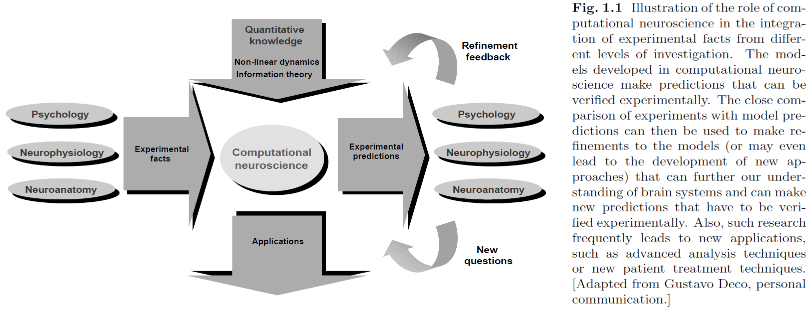
- The nervous system is separated into many different levels of organization to manage details (through abstraction) and to better organize our knowledge.
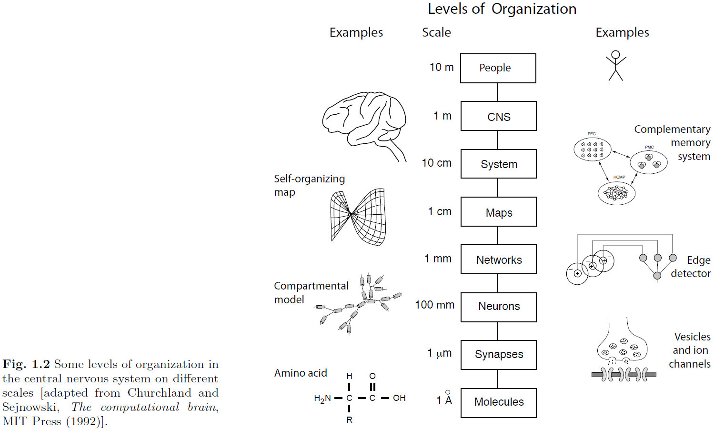
- Networks of neurons have information-processing capabilities beyond that of single neurons such as representing information in a distributed way.
- E.g. Edge detector network. A single neuron isn’t able to detect an edge but a group of neurons can.
- *Model*: a simplification/abstraction of a system in order to test aspects of it or a hypothesis.
- It’s questionable how much more we would comprehend about the functionality of the brain with extremely complex and detailed models.
- E.g. Blue Brain Project
- The current state of neuroscience is exploratory in nature, not explanatory.
- *Abstraction*: making simplifications to a system without removing the important features.
- Reverse engineering a system can be difficult even for systems that we created in the first place.
- E.g. Measuring the varying states of a transistor and inferring that a word processor is running on it.
- In most models, real neurons are abstracted to be nodes in networks to reduce complexity.
- A major ingredient of information-processing in the brain is the interaction of neurons in networks.
- Emergence is the defining property of neural computation which distinguishes it from parallel computing in classical computers.
- *Emergent properties*: properties that were not encoded directly into the system but show up in the system.
- We separate the description of systems into two levels
    - Basic rules
    - Consequences of such rules
- However, determining the basic rules is difficult because the actions of a system don’t directly reflects its rules, but rather the interaction between the rules.
- *Adaptive system*: the ability of a system to adjust its response to external stimuli.
- There’s a difference between understanding computers and understanding computation.
- Computers are an implementation of computation. This means computation is more general and theoretically, it could also be implemented in a different way such as the brain.
- One way of analyzing systems is through Marr’s three levels of analysis.
- Marr’s three levels of analysis
    - Computational
    - Representation/Algorithmic
    - Implementation
- The duality of representing and processing information. To process information, it must first be represented in a specific form.
- Why do we have brains?
- One possible answer is that the brain produces goal-directed behaviour to maximize our probability of survival.
- However, people that commit suicide or die by accident don’t contradict this answer because maximizing the probability of survival acts at the species level, not the individual level.
- How does the brain perform fast perception?
- One possible answer is that the brain is an anticipating memory system that learns to represent expectations of the world, which can be used to generate goal-directed behaviour.
- The idea is that we already have a rich knowledge of our commonly encountered environment so we can extrapolate this knowledge quickly.
- This is similar to the idea of caching in computers; spatial and temporal locality.
- The brain is noisy as reflected when repeated measurements always fluctuate.

# Part I: Basic neurons

## Chapter 2: Neurons and conductance-based models

- *Neuron*: a specialized cell that enables specific information-processing mechanisms in the brain.
- Pyramidal neurons are the most abundant neurons found in the neocortex, accounting for 75-90% of the neocortex.
- Structural properties have computational consequences that must be explored.
- E.g. Keeping RAM close to the CPU enables faster transfer of information between the CPU and RAM. Speed is encoded in distance.
- *Presynaptic neuron*: the neuron sending the signal.
- *Postsynaptic neuron*: the neuron receiving the signal.
- The general information-processing feature of synapses that they enable signals from a presynaptic neuron to modify the state of a postsynaptic neuron.
- E.g. An action potential from the presynaptic neuron causes the voltage in the postsynaptic neuron to go up.
- The white matter of the nervous system contains no neuron cell bodies, only axons and oligodendrocytes (special glial cells).
- The cause of the membrane potential is due to the difference in concentration of ions inside and outside the nerve cell.
- Potassium is concentrated inside the cell and sodium is concentrated outside the cell.
- The resting potential of a neuron is typically close to -65 mV.
- *Ion channel*: special types of proteins embedded into the cell membrane.
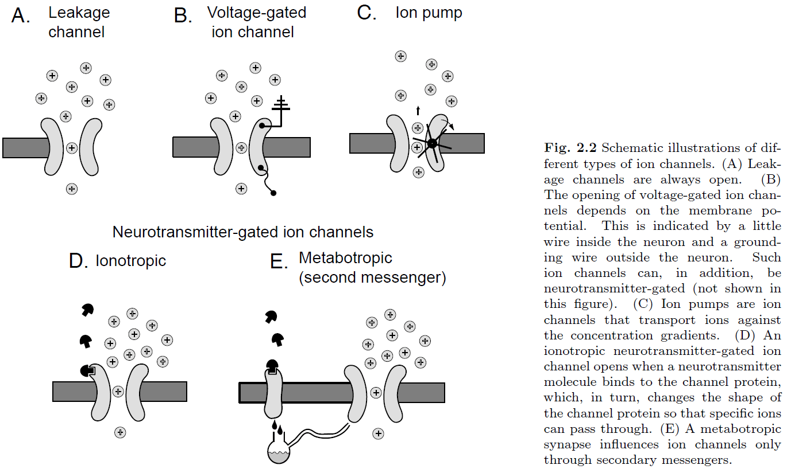
- There are five main types of ion channels
    1. Leakage: always open
    2. Voltage-gated: depends on membrane potential
    3. Pump: moves ions against the concentration gradient
    4. Ionotopic: depends on neurotransmitter
    5. Metabotropic: secondary messenger
- Chemical synapses are the workhorses of neuronal information transfer.
- *Postsynaptic potential (PSP)*: the response in membrane potential of a postsynaptic neuron.
- *Excitatory synapse*: neurotransmitters that drive the PSP towards the excited state.
- *Inhibitory synapse*: neurotransmitters that drive the PSP towards the inhibited state.
- *Excitatory postsynaptic potential (EPSP)*: when the postsynaptic neuron is excited.
- *Inhibitory postsynaptic potential (IPSP)*: when the postsynaptic neuron is inhibited.
- *Shunting inhibition*: inhibitory synapses that are close to the cell body that can modulate the effects of EPSPs.
- Alpha-function in neuroscience
    - $$\Delta V_{m}^{non-NMDA} = Ate^{-t/t^{peak}}$$
    - Describes the difference between the membrane potential and the resting potential as a function of time.
- The alpha-function can be implemented with a basic model used to describe chemical synapses.
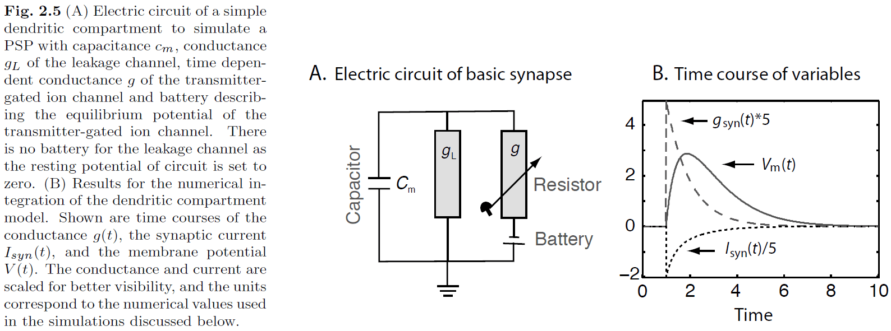
- Using Kirchhoff’s law
    - $$c_{m}\frac{dV_{m}(t)}{dt} = -I$$
- A differential equation describes the small change of a quantity (in this case voltage) with respect to time.
- Solving a differential equation means to derive how that quantity changes over time.
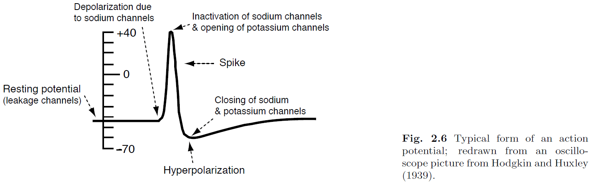
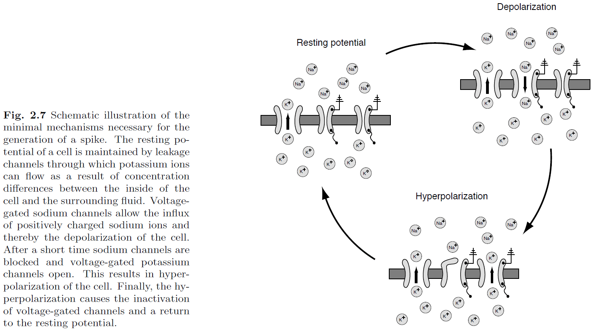
- Hodgkin and Huxley quantified the process of spike generation into a set of four coupled differential equations.

- Hodgkin-Huxley model
    - $$C \frac{dV}{dt} = -g_{K}n^{4}(V-E_{k})-g_{Na}m^{3}h(V-E_{Na})-g_{L}(V-E_{L}) + I(t)$$
    - $$\tau_{n}(V)\frac{dn}{dt} = -[n-n_{0}(V)]$$
    - $$\tau_{m}(V)\frac{dm}{dt} = -[m-m_{0}(V)]$$
    - $$\tau_{h}(V)\frac{dh}{dt} = -[h-h_{0}(V)]$$
- The four equations describe how the activation of potassium channels, activation of sodium channels, inactivation of sodium channels, and the fact that neurons store electric charges, are related.
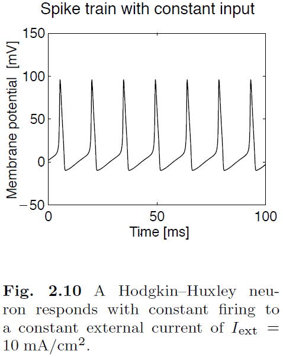
- *Absolute refractory period*: delay before another AP can be generated due to sodium channel inactivation.
- The absolute refractory period limits the firing rates of neurons to a maximum of about 1000 Hz or 1 spike per millisecond.
- *Relative refractory period*: delay before another AP can be generated due to hyperpolarizing AP.
- The relative refractory period further limits the firing rate on top of the absolute refractory period.
- APs travel in axons at around 10 m/s and this form of signal transportation within an active membrane is loss-free meaning the signal won’t deteriorate with distance.
- This is important because some axons can be very long (1 m) so it’s important to retain the complete signal.
- Compared to simple current transportation within a conductor, APs are slower and consume more energy.
- Evolution responded to this problem by covering axons with a myelin sheath to increase AP speed by reducing ion leakage.
- However, the tradeoff is a lossy signal within axons.
- *Ranvier nodes*: gaps in the myelin sheath that allow the AP to regenerate through the active membrane mechanism.
- Evolution combined the advantages of faster and cheaper with regenerative amplifiers.
- We can simplify the H&H equations to the Wilson model or we can be more realistic by using the complete Wilson model.
- Classes of spike characteristics
    - Regular spiking (RS)
    - Fast spiking (FS)
    - Continuously spiking (CS)
    - Intrinsic bursting (IB)
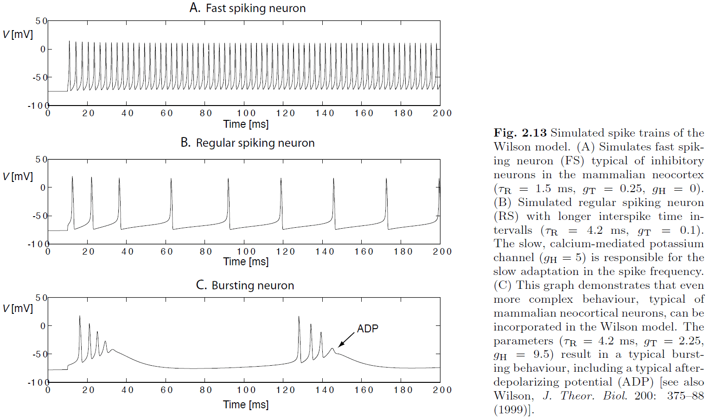
- *Spike rate adaptation/fatigue*: reduction in firing rate after initial stimulation.
- *After-depolarizing potential (ADP)*: an increase in voltage after being depolarized similar to a reverberating effect.
- To get a more complete and accurate model of neurons, we need to model the conductance properties and the physical shape of the neuron.
- Introduction to the cable equation and the idea of turning a neuron in a chain/branch of compartments.
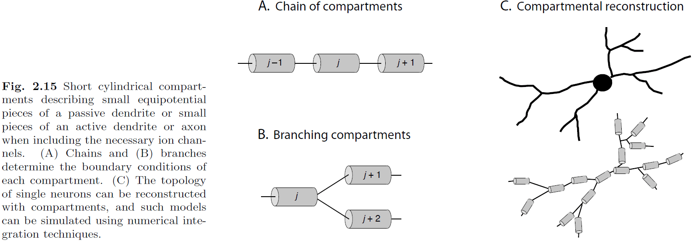
- Each compartment is governed by a cable equation for a finite cable and the potential is almost constant.
- The compartmental model is used to turn the derivatives in the cable equation into differences. It converts a continuous model into a discrete one.
- However, the trade-off is that you need more compartments to get a good approximation. In practice, they use a few hundred to several thousand compartments to represent single neurons accurately.
- What’s the difference between EPSP and an AP?
    - EPSP isn’t a spike, it’s an increase in voltage.
    - EPSP occurs in dendrites, APs occur in axons.

## Chapter 3: Simplified neuron and population models

- We make simplified models of neurons to
    - Make computations tractable.
    - Highlight the minimal features necessary to enable certain emergent properties in the networks.
- The spikes generated by neurons are very stereotyped (similar) and it’s unlikely that the precise details of spike shape are crucial for information transmission in the nervous system.
- To compare, spike timing certainly has some influence on the processing of spikes.
- So, we ignore the detailed ion-channel dynamics and focus on approximating the dynamic integration of synaptic input, spike timing, and resetting after spikes.
- The main effect of sodium and leakage channels is to drive the neuron to higher voltages with input and to let the voltage decay to the resting potential otherwise.
- We can approximate the dynamics of the membrane potential using Kirchoff’s law, this is also known as a leaky integrator.
- $$\tau_{m} \frac{dv(t)}{dt} = -(v(t)-E_{L}) + RI(t)$$
- A crude approximation of real spike generation is to use a fixed threshold.
- Actual thresholds vary as the HH equations show that the threshold depends on the form of current buildup.
- *Leaky integrate-and-fire-and-reset neuron (LIF)*: a model of a neuron that integrates external inputs and leaks current.
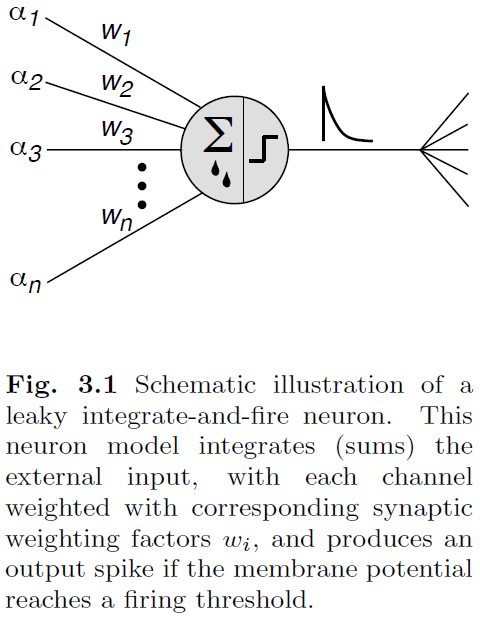
- In simulations, we’re mainly concerned about the sum of synaptic currents and this sum depends on the efficiency of individual synapses.
- We describe this efficiency by a synaptic strength/weight value, $$w_j$$ where j is the index representing each presynaptic neuron.
- We assume that there is no interaction between synapses so we can do a linear summation of the inputs.
- The integrated form of the IF neurons is called the spike-response model.
- Drawbacks of the basic IF model
    - Might not approximate the sub-threshold dynamics of the membrane potential.
    - Doesn’t include the variety of response patterns seen in real neurons.
- However, more realistic neuron models are also more computationally demanding.
- One model reaches a good tradeoff between computation and realism, the Izhikevich neuron model.
- Izhikevich model
    - $$\frac{dv(t)}{dt} = 0.04v^{2}(t) + 5v(t) + 140 -u +I(t)$$
    - $$\frac{du(t)}{dt} = a(bv - u)$$
- The membrane potential $$v$$, and the recovery variable $$u$$, are limited by conditions
    - $$v(v > 30) = c$$
    - $$u(v > 30) = u - d$$
- Where $$a, b, c, d$$ are four parameters.
- We can modify the four parameters of the Izhikevich model to match different types of neural firing patterns.
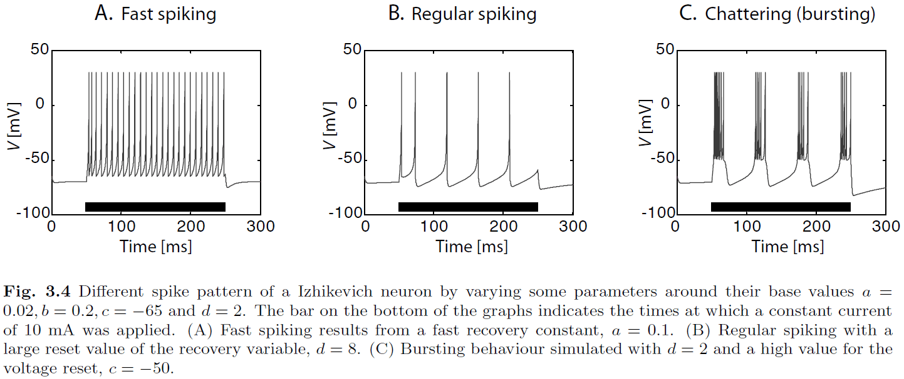
- In contrast to the IF neuron, and more consistent with real neurons, the Izhikevich model doesn't have a constant firing threshold.
- One of the oldest and simplest neuron models is the McCulloch-Pitts (MCP) neuron. This model is used in artificial neural networks.
- However, the MCP model is used to model the computational properties of neurons rather than the physical properties of neurons.
- Neurons in the brain do not fire regularly, rather, they seem extremely noisy.
- Neurons that are relatively inactive emit spikes with low frequencies that are very irregular.
- Single-cell recordings transmitted to a speaker sound very much like the irregular ticking of a Geiger counter when exposed to radioactive material.
- *Coefficient of variation (Cv)*: a measure of the variability of spike trains.
- Real neurons have a Cv around 0.5 to 1 while an IF neuron has a Cv of 0.
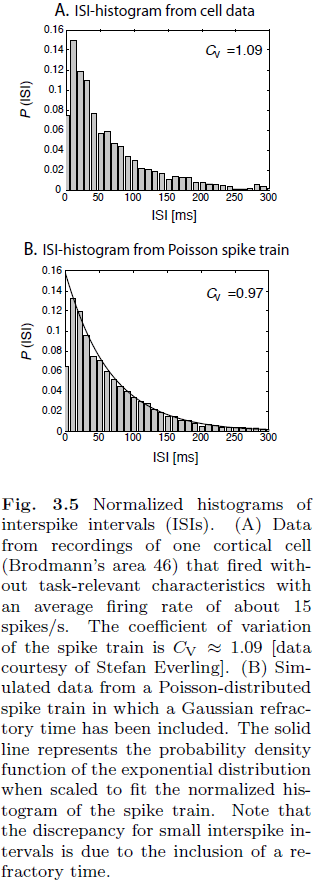
- Spike trains are often generated using a Poisson process but a Poisson process has no memory of past events. This means that there’s an equal likelihood that the next spike occurs.
- This isn’t realistic though as the refractory period makes it so that there isn’t an equal likelihood.
- Another problem of modeling neurons is the inability to capture further details such as
    - Diffuse propagation of neurotransmitters across the synaptic cleft.
    - Opening and closing of ion channels.
    - Geometries of dendrites and axons.
- To reduce the complexity, we lump these factors under noise.
- To introduce noise into neuron models, we can
    - *Stochastic threshold*: replace the constant threshold with a noisy threshold.
    - *Random reset*: randomly reset the membrane potential.
    - *Noisy integration*: integration has an additional noisy variable.
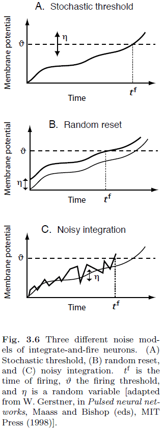
- *Neural code*: correlations between sensory stimuli/behaviour and neural activity patterns.
- The most robust finding is that the modulation of firing rate changes with sensory stimuli.
- Number of spikes of a neuron often increases with increasing the strength of stimulus.
- E.g. Increased firing rate with increasing weight on a frog muscle.
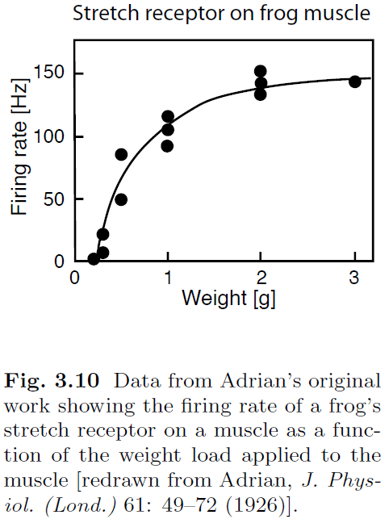
- *Response/tuning curve*: the response (firing rate) of a neuron to various stimuli.
- *Receptive field*: the area in the physical world for which the neuron is responsive.
- E.g. Neurons in the visual area responding to orientations of bars moved through the receptive field of the neuron.
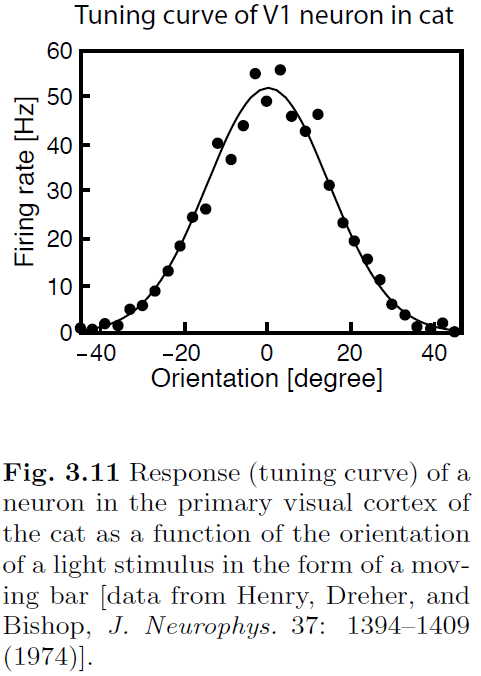
- While firing rates are important, we shouldn’t forget that other parts of spike patterns can convey information too.
- E.g. The integration of multiple neurons to encode information.
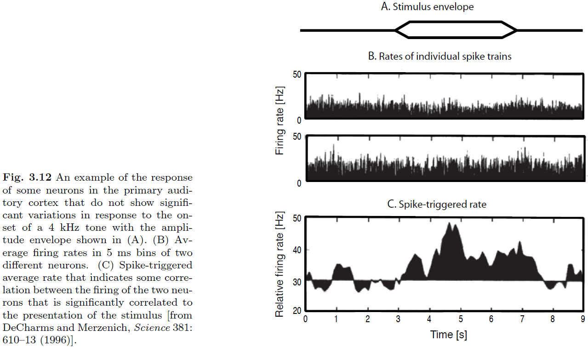
- We don’t see any significant variation of the firing rates in either neuron.
- However, if we plot the probability of co-occurrence of spikes of the two neurons, we see that it captures the input.
- This is a nice example of how behavioral correlates can only be seen in the correlation between the firing patterns of neurons.
- The temporal proximity of spikes can make a difference in the information processing of the brain.

- It’s a widely held belief that neural spiking isn’t very reliable and that there’s a lot of variability in neuronal responses.
- However, the data indicates that the initial response is reliable while it varies considerably afterwards.
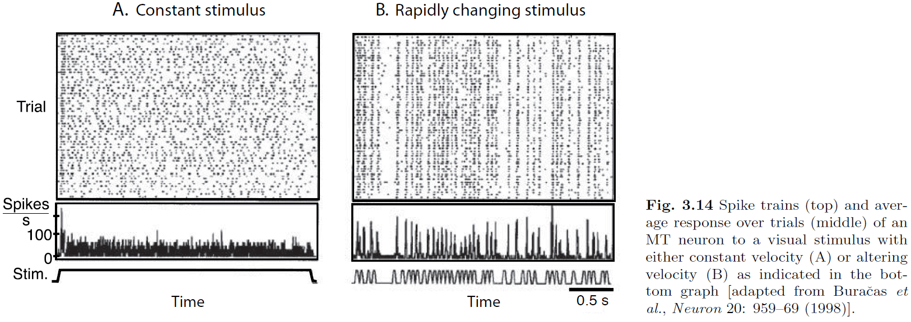
- The data in Fig. 3.14 indicates that there might not be much information in the continuing firing pattern of the neuron due to the enormous variability.
- Also, constant input is not realistic as neurons don’t receive nor send constant input current to other neurons.
- If neurons are judged based on how well they convey changes in the stimulus, then populations of neurons are quite reliable.
- Populations of neurons can rapidly convey information in a neural network.
- Our aim is not so much to reconstruct the brain in all its detail, but rather to extract the principles of its organization and functionality.
- Neurophysiological recordings of single cells have been very successful in correlating the firing rates of single neurons with the behavioral responses of a subject.
- However, we don’t directly use the firing rate due to noise so we use a temporal average to smooth things out.
- The brain doesn’t rely on the information of a single spike train as it would be vulnerable to damage, reorganization, and noise.
- So we guess that the brain uses a sub-population, or a pool of neurons, to convey information.
- To describe the average behavior of a pool of neurons, we divide the pool into sub-pools of neurons of the same type.
- However, one issue with using a population of neurons is that they don’t exactly model a group of neurons.
- E.g. Population dynamics versus averaging over a population of neurons.
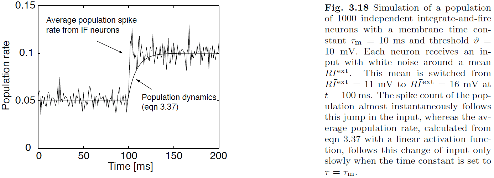
- Some neurons can respond quickly to input because there’s a subset of neurons that are close to threshold. So if an input is detected, the neurons can respond quickly.
- The average firing rate determines the probability of having a spike in a small interval.
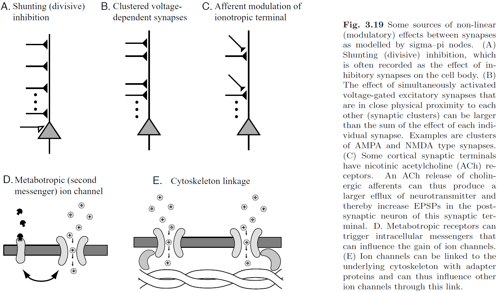
- Fig 3.19 shows examples of modulatory effects between synaptic inputs.

## Chapter 4: Associators and synaptic plasticity

- Two forms of neural plasticity
    - *Structural*: the generation of new connections and changes in the topology of the network.
    - *Functional*: the changing of strength values of existing connections.
- It’s important to distinguish between developmental mechanisms from adaptations in mature organisms. The difference between nature and nurture; between innate and learned.
- *Hebbian learning*: neurons that fire together wire together.
- Hebbian learning is an example of functional plasticity that depends on activity.
- More generally, Hebbian learning is an instance of association.
- In contrast to computers, we can learn associations that can trigger memories based on related/partial information and we believe that this is essential for human cognition.
- However, Hebbian learning must be limited by some form of synaptic depression or else the association would keep rising and get out of control.
- The weights would become extremely large and so the response of the neuron becomes unspecific to the input pattern.
- *Personal note*: Maybe association follows the “if you don’t use it, you lose it” rule that if a synapse isn’t used, it disappears.
- This may also reflect why distributed, retrieval practice is the most efficient for learning. We’re trying to rerun the same pathways without input.
- We’ve seen that a stimulus capturing only part of the pattern associated with an object can still trigger memories about that object.
- This ability to recall from partial input is also called pattern completion.
- Pattern completion is based on the calculation of some form of overlap, or similarity, of an input vector with a weight vector that represents the pattern on which the neuron was trained on.
- The calculation might be the dot product or some other vector operation like the binding product introduced by Chris Eliasmith.
- So, as long as the overlap between the input pattern and the weight is large enough to cause an output, the output node responds to all patterns with a certain similarity to the weight which we call generalization.
- This means the weight captures/represents the average over the input which is called a prototype since it can extract central tendencies in the input.
- The prototype extraction ability of associators can be used to achieve noise reduction.
- Another benefit of associative networks is that they model the graceful degradation seen in biological networks where the removal of synapses and neurons slowly degrades the networks performance.
- Such fault tolerance is essential in biological systems.
- Introduction to long-term potentiation (LTP) and long-term depression (LTD).
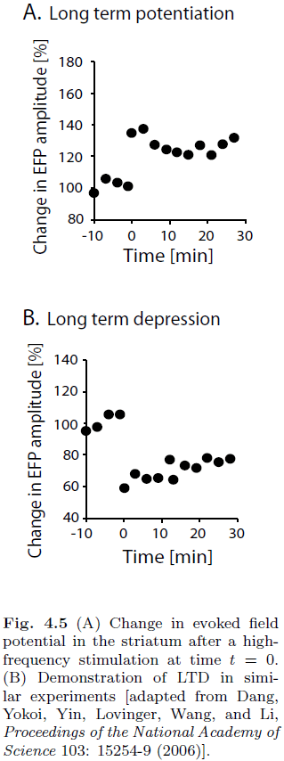
- The fraction of times that a post-synaptic event was observed can be equated with the probability of transmitter release.
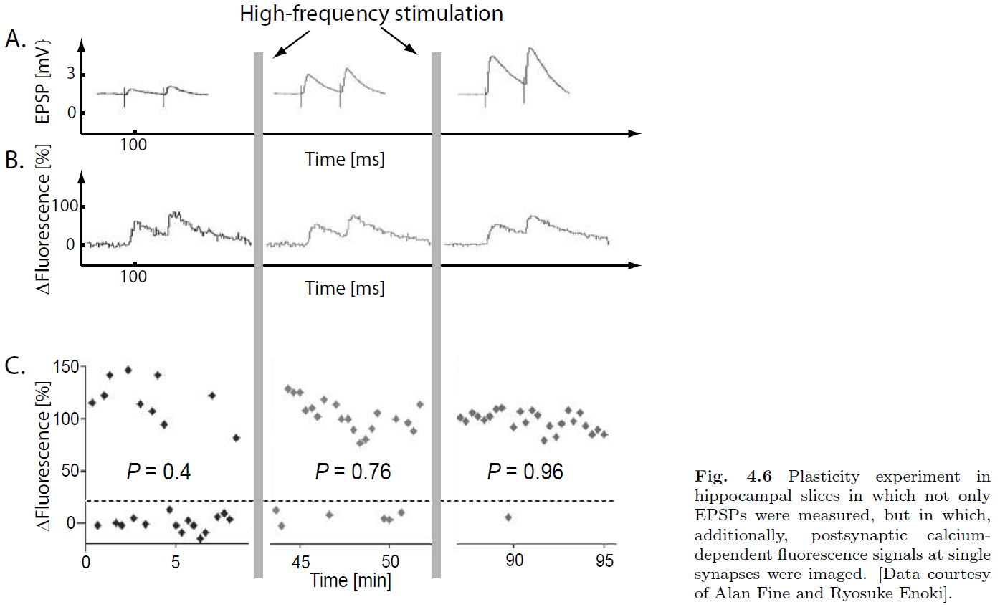
- Introduction to spike-timing dependent plasticity (STDP).
- STDP can be seen as a spike-based formulation of a Hebbian learning rule.
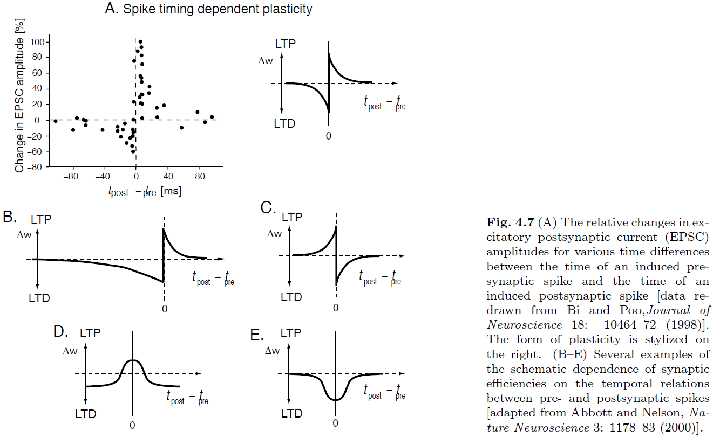
- *Calcium hypothesis*: the idea that high levels of calcium promote LTP where moderate levels of calcium promote LTD.
- It’s hypothesized that NMDAR channels along with calcium provide the mechanisms for Hebbian learning.
- It’s important to note that STDP only applies to isolated spike pairings. It doesn’t exactly apply to other cases of spiking such as multiple spikes or overlapping bursts.
- It’s clear that with repeated spike pairings, STDP can’t go on forever or else the the weight would go to infinity. So there must be some upper and lower bounds.
- We also can’t incorporate spike timings in rate models (average behavior of single neurons) or population models (cell assemblies).
- *Hebbian covariance rule*: a rule that captures that LTP occurs when presynaptic firing rate and postsynaptic firing rate are both below or above their average firing rates, and that LTD occurs when one of the firing rates is below average while the other remains above.
- *Mixed population models*: populations that contain both excitatory and inhibitory neurons.
- Repeated application of additive association rules results in runaway synaptic values.
- One way to solve this issue is to consider competitive synaptic scaling.
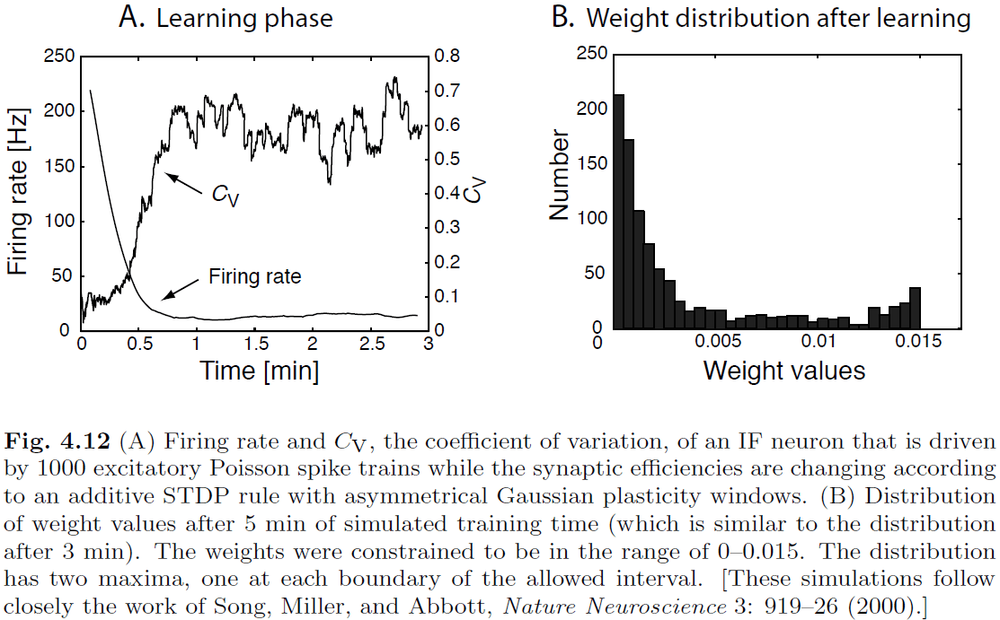
- We assume that learning is aimed at establishing correlations between input and output pattern, and learning should cease when this correlation is established.
- So far, the biological mechanisms of synaptic scaling aren’t completely understood.

# Part II: Basic networks

## Chapter 5: Cortical organization and simple networks

- Mental functions aren’t performed by single neurons.
- E.g. Perception and learning.
- Rather, it seems that the integration of neurons into networks with specific architectures seems to be the key.
- Introduction to large-scale brain anatomy such as the four lobes and Brodmann’s areas.
- It’s speculated that functional specialization is reflected in major structural differences among different cortical regions.
- However, this speculation is false as it’s found that different areas of the neocortex have common organization.
- While there are some differences in the cytoarchitecture of each region, they’re only minor compared to the general architecture of the neocortex.
- In contrast to the older parts of the brain, such as the brainstem, the neocortex is an information-processing structure with more universal processing abilities that we speculate enables more flexible mental abilities.
- This may also be the cause of how the brain is plastic and can adapt to damage.
- Introduction to primary sensory areas and the dorsal/ventral visual processing streams.
- Dorsal = where, ventral = what.
- fMRI has revealed that to solve complex mental tasks, many specialized brain areas have to work together to solve the tasks.
- The idea of the thalamus as a relay station for sensory signals is too simplistic as there are many more back-projections from the cortex to the thalamus compared to the forward-projections.
- People can perform object recognition in around 150 ms which is surprising since it takes each neuron around 10-20 ms to pass on its signal.
- Introduction to the six layers of the neocortex and cortical columns.
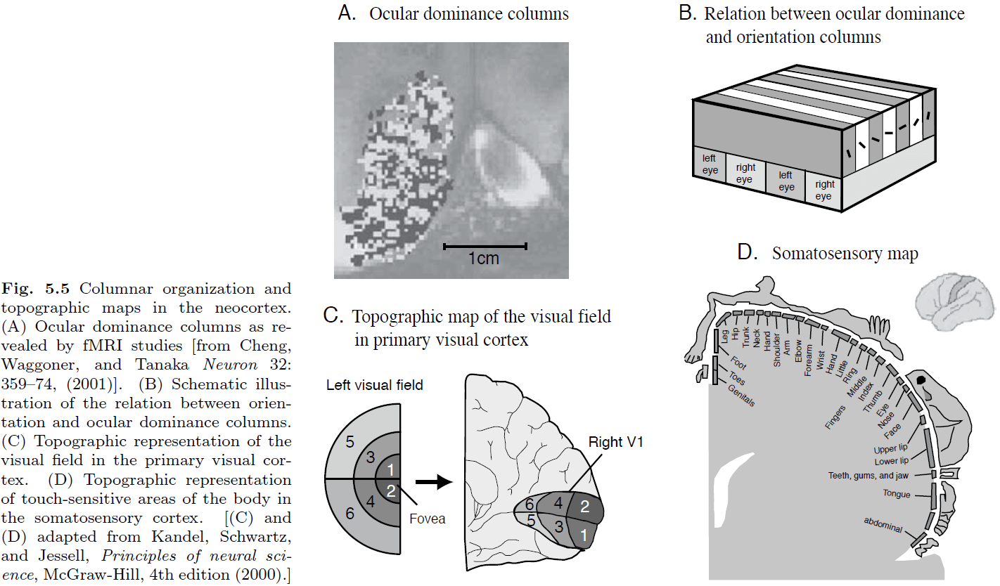
- The distribution of neurons with specific response characteristics isn’t random but there seems to be some form of organization.
- *Cortical magnification*: the over-representation of the central visual area compared to the peripheral visual area in the visual cortex.
- E.g. In Fig 5.5, the center visual fields 1 and 2 are smaller than the other visual fields and yet they have the largest area in the visual cortex.
- E.g. More sensitive body areas have a larger cortical area.
- The map preserves the relationships between adjacent points but not the area.
- The size of the area seems to be proportional to the sensitivity of the area.
- Why doesn’t it preserve the area or make the area equal? Maybe area is equal to more neuronal connections. Maybe area is equal to competition among areas.
- Maybe the brain needed more area, more neocortex, to fit more functions.
- It can be assumed that the white matter is the main pathway between remote cortical areas and thus for global information transmission.
- While pyramidal cells in layers II and III seem to be the main pathway between adjacent cortical areas.
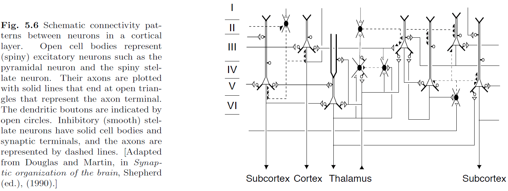
- It’s generally accepted that gross brain architecture is genetically coded while fine brain architecture is developed through experience and learning.
- *Synfire chains*: information transmission in neuronal chains.
- We start with a simple, linear chain of neurons.
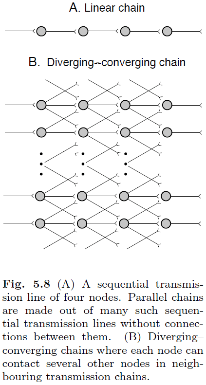
- This simple chain isn’t biologically realistic because
    - A single spike isn’t sufficient to elicit a postsynaptic spike.
    - Synaptic transmission is lossy as synapses aren’t reliable.
    - Death of a single neuron would disrupt transmission.
- Next, we move to diverging-converging (DC) chains.
- DC chains aren’t the same as neural networks as not all neurons in the previous layer are fully connected to neurons in the current layer.
- *Netlet*: small networks with only a small number of highly efficient synapses.
- *Axional delay*: the delay between presynaptic and postsynaptic events.
- Axional delay is often ignored in modelling papers but it’s a realistic aspect of neuronal activity.

## Chapter 6: Feed-forward mapping networks

- Two processes in the perception of an object
    - Physical sensing
    - Attaching meaning
- The first, physical sensing, is done by converting an object into spikes using one of the sensory organs (ear, eye, tongue).
- The conversion happens at the scale of the receptive field, the resolution of the organ, and it converts the object into a sensory feature vector representation.
- *Sensory feature vector*: a vector representing the object.
- Then, the problem of object recognition is then mapping the sensory feature vector on to an internal representation of the object.
- How is the mapping function implemented?
    - *Look-up table*: a large table listing all sensory input vectors and their corresponding internal representation.
    - E.g. Logical truth table for AND
    - *Prototypes*: a vector that encapsulates, on average, the features for each object.
- To use prototypes, there needs to be some sort of “distance” or “similarity” function to compare the feature vector with how similar it’s to the internal representation.
- However, it seems unrealistic to use a single neuron to solve the mapping problem by using a complex input-output relationship.
- A more realistic solution is to use networks.
- Introduction to perceptions, gradient descent, multilayer perceptions, backprop algorithm.
- A multilayer feedforward network is a universal function approximator.
- *Generalization*: performance of the network on data that wasn’t part of the training set.
- Biological problems with backprop
    - Sending the error back raises synchronization issues.
    - How to separate forward signals from backprop error signals.
    - Non-local updates.
- Studies of human behavior show that our behavior often depends on the context.
- Introduction to support vector machines.

## Chapter 7: Cortical feature maps and competitive population coding

- Review
    - Neurons can represent features using tuning curves.
    - Features are organized topographically with similar features being represented in similar cortical tissue.
    - The primary visual cortex is organized with orientation tuning curves.
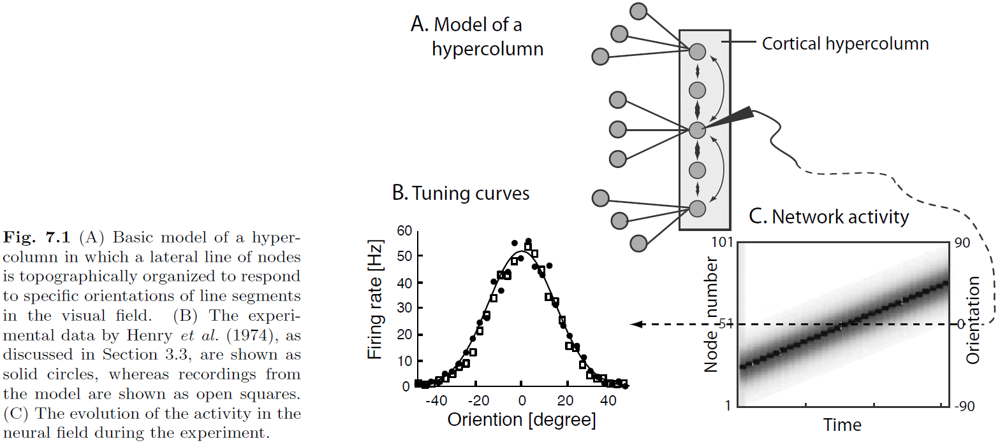
- *Activity packet/bubble*: how neighboring nodes are activated through lateral interaction.
- Competition between features is often observed in physiological studies.
- Topographic maps have two major characteristics
    - There is some order in feature space such that neighboring areas represent neighboring features.
    - Features with enhanced sensory resolution are over-represented with larger cortical space while preserving relations between feature values.
- The creation of such maps is experience dependent as shown by evidence that these maps can be disrupted in young animals by sensory deprivation.
- *Self-organizing maps (SOMs)*: maps that are activity-driven and are changed by experience.
- We can model SOMs and train them to form topographical representations of the input.

- *Plasticity-stability dilemma*: the problem that every new training example changes the map, but we want to stabilize a map to be able to use it.
- One way neural networks do this is to reduce the learning rate as training goes on.
- However, this doesn’t match evidence that the brain still has the ability to adapt to changes later on in life.
- One way to deal with the dilemma more realistically is to distort the SOM.
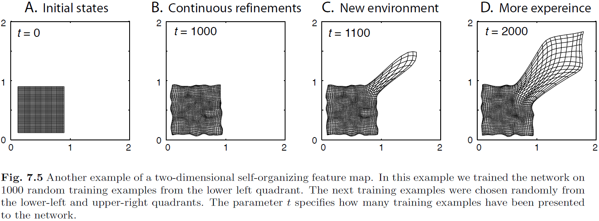
- If the simulations match reality, then we can conclude that
    - It seems best to be exposed to a broad feature space early in life as development of it later in life is difficult.
    - We can learn new examples later in training, but the fine details are not captured as clearly as the original examples.
- Evidence of representational plasticity in adult mammals is shown in Fig 7.6.
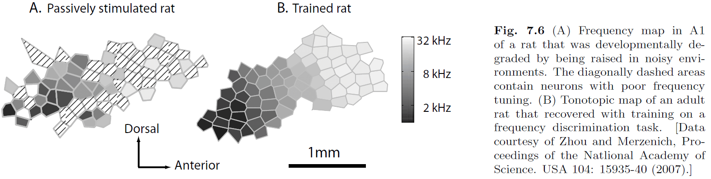
- It shows that some goal-directed learning must take place for the SOM to be reorganized.
- The brain seems to have an effective interaction structure of short-distance excitation and long-distance inhibition; a small-world network of many local connections and few long-distance connections.
- Principle regimes of models with local cooperation and global competition
    - *Growing activity*: inhibition < excitation, model is dominated by positive feedback.
    - *Decaying activity*: inhibition > excitation, facilitates competition between inputs.
    - *Memory activity*: inhibition ~ excitation, can represent past values without input.
- *Dynamic neural field (DNF)*: a model of the dynamics of a cortical sheet using differential equations.
- Is working memory implemented by ongoing firing in the brain?
- Probably not, as a more common explanation is that working memory is sustained by lateral reverberating neural activity.
- The DNF model captures this reverberation and can model working memory.
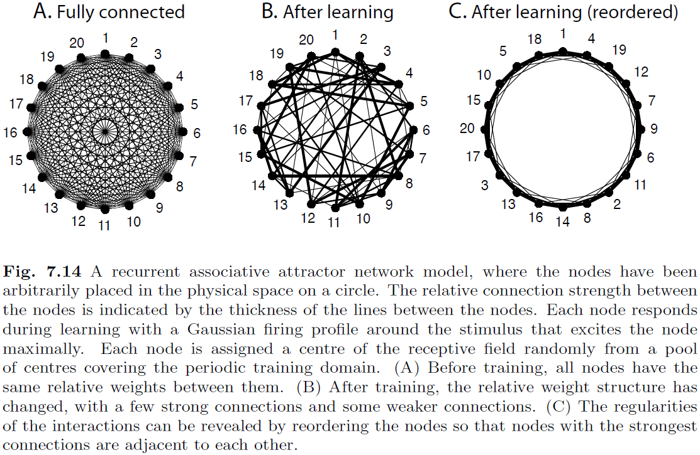
- The network self-organizes to reflect the dimensionality of the feature space.
- It discovers the dimensionality of the underlying problem by activity dependent co-activation of neurons, aka Hebbian learning.
- People have a sense of direction and it appears to be quite accurate.
- E.g. Place a subject in a rotating chair and rotate the subject, the subject is able to guess the new direction quite accurately while their eyes are closed.
- This experiment suggests two clues
    - We have a representations of the body/head direction.
    - We have a mechanism to update this information without visual cues.
- Spatial information of the head and body is also stored in the hippocampus.
- *Path integration*: the processing of changes from the old position to the new position.
- Path integration is also the calculation of a new state representation from an initial state plus signals that represent the changes of the state.
- *Idiothetic cues*: self-generated cues.
- E.g. Inputs from the vestibular system.
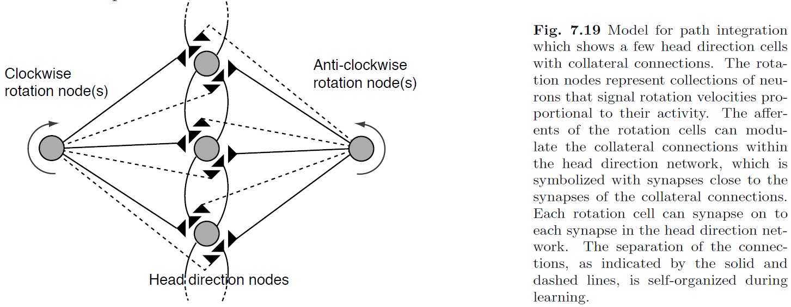
- The key idea behind the model is that the rotation nodes can modulate the strength of the collateral connections between DNF nodes.
- However, one issue with this model is how to make it a self-organizing system.
- The key issue is that we need a learning rule that can associate the recent movement of the activity packet with the firing of the appropriate rotation node, we need a short-term memory.
- One solution is to let the model explore the environment and use visual cues as feedback to update the model’s weights.
- Three classes of representation
    1. Local representation: one neuron is used to represent one stimulus. Scales linearly.
        1. E.g. Grandmother cells
    2. Fully distributed representation: all neurons are used to represent one stimulus. Scales exponentially.
        1. E.g. Binary encoding
    3. Sparsely distributed representation: some neurons are used to represent one stimulus.  Scales between linear and exponential.
- To quantify how many neurons are used in the neural processing of stimuli, we define a measure of sparseness of a representation.
- A mathematical measure is given but is not copied here.
- *Probabilistic encoding*: the specific way a stimulus is coded into a neuron or a population of neurons.
- The probability that a population of neurons encodes a stimulus is given by $$P(r|s) = R(r_{1}^{s}, r_{2}^{s}, r_{3}^{s}, ...|s)$$ where $$r_{i}^{s}$$ is the stimulus-specific response of neuron i in the population.
- We can also flip the r and s to decode a stimulus and we can do so using Bayes’s theorem.
- *Bayes’s theorem applies to decoding*: $$P(s|r) = \frac{P(r|s)P(s)}{P(r)}$$.
- However, we need some function to specify how likely a response is given a stimulus or $$P(r|s)$$.
- Tuning curves are commonly used as the likelihood function.
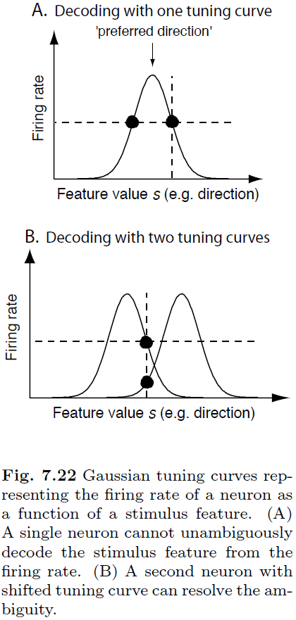
- A single neuron can’t be used to decode a stimulus because the tuning curve has two intersection points for a single firing rate.
- E.g. If a neuron is firing at 1 Hz, it can either be due to one direction or another direction since there are two intersection points.
- However, we can resolve this ambiguity by using more neurons and thus more information to decode the firing rate.
- The most commonly used method of populating decoding is population vector decoding.
- Intuitively, we think that sharper tuning curves lead to more accurate decoding since a neuron only responds to a specific stimulus (local representation) but that isn’t the case.
- *Population vector decoding is summarized in this formula*: $$s_{decoded} = \sum_{i}{r_{i}s_{i}^{preferred}}$$ where we multiply the firing rate of each neuron by its preferred direction and sum the contribution of all neurons.
- However, since we’re using all neurons, this isn’t a sparse representation but rather a distributed representation.
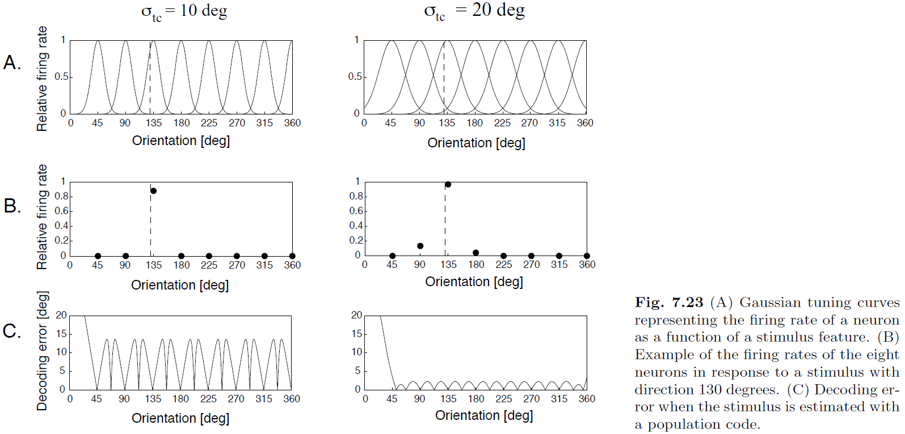
- Another decoding scheme is to use DNFs which are biologically plausible and work for noisy population decoding.

## Chapter 8: Recurrent associative networks and episodic memory

- Introduction to declarative and non-declarative memories.
- Declarative (speakable)
    - Episodic (events)
    - Semantic (facts)
- Non-declarative (unspeakable)
    - Procedural (steps)
    - Perceptual (imagery)
    - Conditioning (if-then)
    - Non-associative (reflexes)
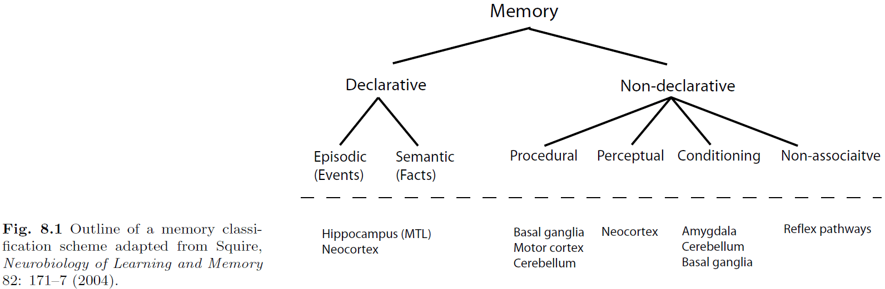
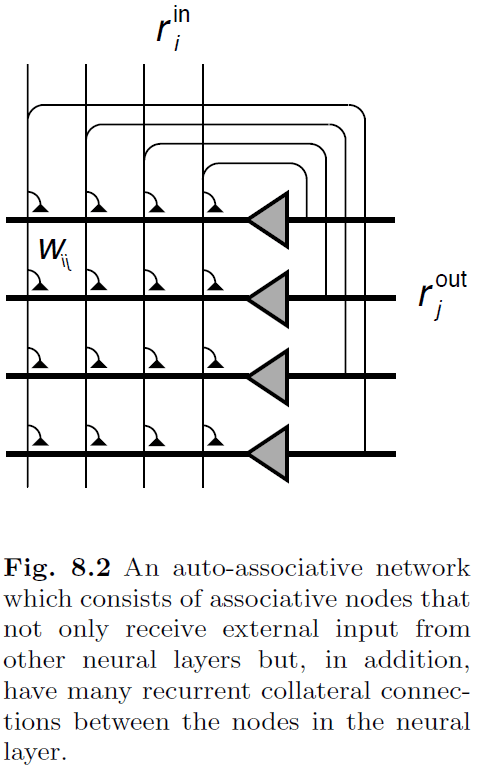
- The networks considered in this chapter is shown in Fig. 8.2 and are called point attractor neural networks (PANNs) or attractor neural networks (ANNs) in contrast to continous attractor neural networks (CANNs).
- *Auto-associator*: a network that feeds the output of each node to all other nodes in the network, thus the network can associate a pattern within itself.
- We expect that the cycling in a recurrent network can enhance pattern completion ability.
- The hippocampus is implicated with the acquisition of episodic memory using patient H.M. as evidence.
- Removal of patient H.M’s medial temporal lobes (MTL) resulted in retrograde amnesia, the inability to form new long-term memories.
- There’s an issue when we combine associative Hebbian mechanisms with recurrent networks.
- The issue is that associative learning depends on relating presynaptic activity to postsynaptic activity however, recurrent networks drive the postsynaptic activity away from the desired activity pattern if the dynamic of the network is dominant.
- One solution is to divide the operation of the networks into two phases, a training phase and a retrieval phase. This is a reasonable assumption since we rarely want to store and retrieve information at the same time.
- The switch between the two phases could be implemented in multiple ways in the hippocampus. The ways aren’t described here.
- In-depth analysis of attractor neural networks but I skimmed over this due to lack of connection to biology and due to the heavy math behind the analysis.
- Further notes on dynamical systems and attractor states.

# Part III: System-level models

## Chapter 9: Modular networks, motor control, and reinforcement learning

- Why is modular specialization used in the brain?
- There are many different architectures for modular networks and one of them is the mixture of experts.
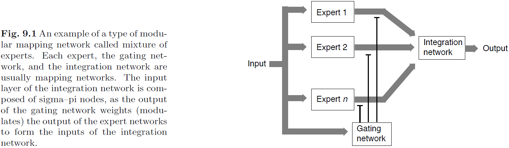
- The mixture of experts architecture divides the system into a module of experts, a gating network to control the output of the experts, and an integration network to combine the output of the experts.
- This architecture use a divide-and-conquer strategy to solve a problem because it divides the input among experts and may require a complex merging strategy.
- There’s also the problem of training the gating network, which is a form of the credit-assignment problem.
- One example of this system in the brain is the where and what visual pathways.
- Each pathway is an example of an expert and both pathways receive the same input.
- The reason to use two pathways is justified by the following two problems
    - *Temporal cross-talk*: training a network on a new task will interfere with a previously learned task.
    - *Spatial cross-talk*: training a network to create distributed representations can create conflicting representations.
- It’s thought that the balance between cooperation and independence between modules is a driving force behind the complex structures in the brain.
- The distinction between working memory and short-term memory is fuzzy and not clear. They appear to be the same yet they don’t seem to be.
- The limited capacity of working memory is puzzling since we can easily build systems that can rapidly store many thousands of items.
- Experiments on working memory have resulted in three conclusions
    1. The capacity limit doesn’t depend on the number of features of objects relevant for decision making.
    2. Visual working memory is separate from verbal working memory.
    3. The capacity limit isn’t due to an increase in the number of decisions that have to be made.
- One explanation for the limit on working memory is the spurious synchronization hypothesis.
- *Spurious synchronization hypothesis*: the idea that different objects are represented by different synchronized spike trains, and that increasing the number of objects results in spurious synchronization between spike trains. At some point, the level of spurious synchronization becomes too large for the system to distinguish between objects.
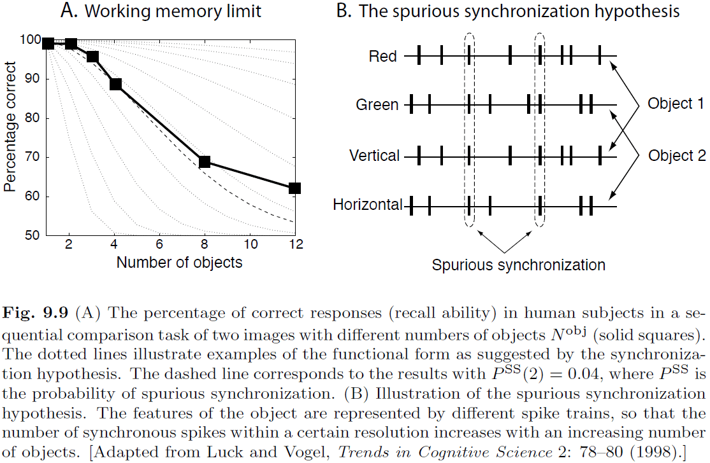
- Reinforcement learning differs from supervised learning in that only a general feedback signal, like reward or punishment, is given.
- For motor control, one source of feedback is proprioreceptive feedback or the position of our body.
- Another source of feedback is visual signals. However, sensory feedback has to be converted into the right reference frame to be used by the motor system.
- *Conditioning*: learning with reward signals.
- *Temporal credit assignment problem*: the problem of associating an action with a future reward.
- Neural mechanisms must be able to solve this problem as we have evidence of this from rodents.
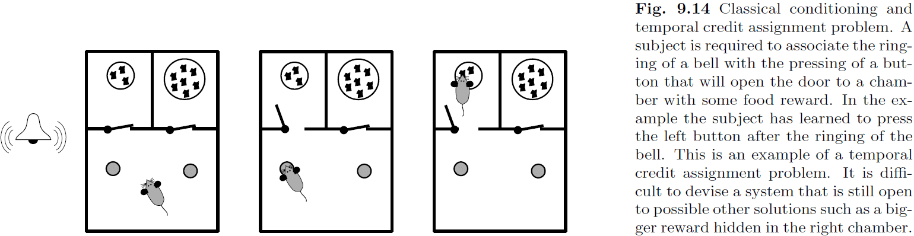
- *RL evaluation problem*: how to estimate future rewards for a given state and action.
- *Temporal difference (TD) learning*: a solution to the RL evalution problem.
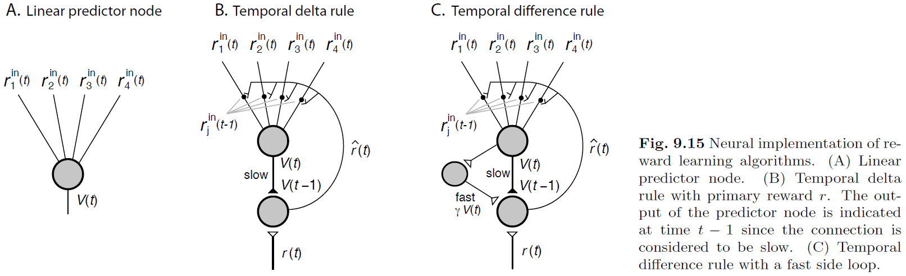
- RL may be implemented in the basal ganglia using an actor-critic scheme. However, there have been criticisms and questions on the assumptions.

## Chapter 10: The cognitive brain

- People can recognize objects even though they vary in form, size, location, and viewing angle.
- E.g. You can rotate and move your hand but still recognize it as your hand.
- Recognizing your hand doesn’t crucially depend on the viewing conditions.
- We’ve seen that changes in the input vector for neural systems can result in very different activation patterns in the retina.
- The problem is known as invariant object recognition and one solution is to use hierarchical networks.
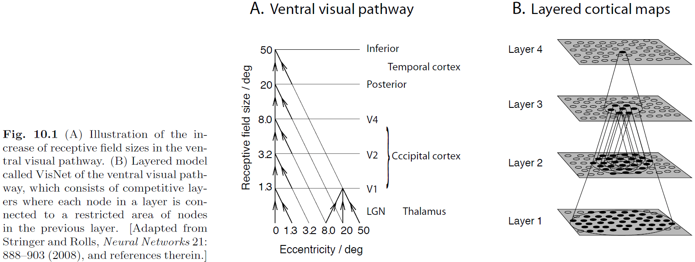
- An essential rule of a hierarchical network is that each node is connected to a spatially restricted area of nodes in the layer below.
- This allows nodes at the upper levels to have large receptive fields as they cover more nodes at the lower layers.
- Each layer in the model is a competitive map, where competition is implemented through adjustment of the firing threshold of nodes until a predefined sparseness is reached in each layer.
- Weights between the layers are adjusted using Hebbian learning and the model is trained on object movements such as translation or rotation.
- The reverse problem of object recognition is visual search, where processing goes from top-down to find an object given its name.
- E.g. Find the Eiffel tower in this picture.
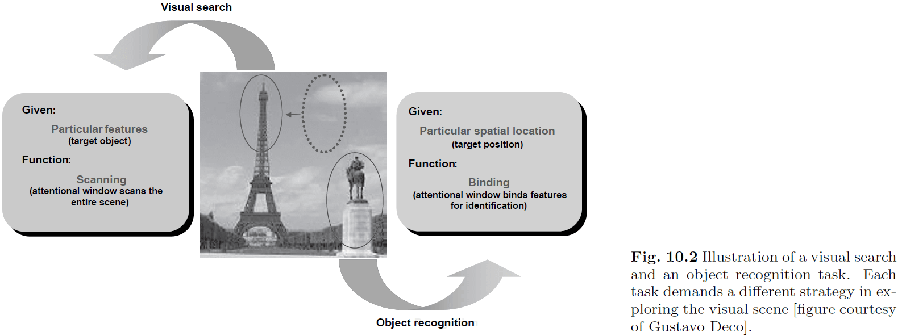
- It’s clear the complex cognitive tasks can only be solved with cooperation between many specialized modules in the brain.
- One theory is that all modules have access to a global workspace that they can use to send/receive information.
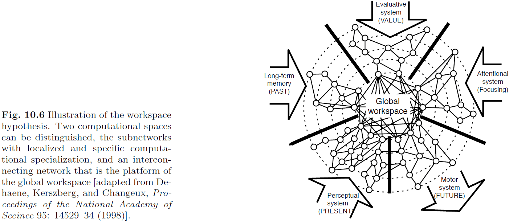
- The global workspace theory has been used to provide an explanation for the Stroop task.
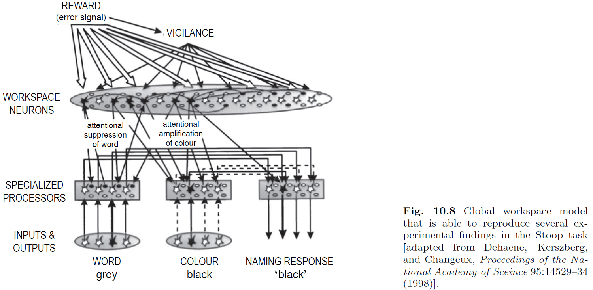
- We now attempt to generalize brain-style information processing into a more general hypothesis.
- Central to this theory is the idea of the brain as an anticipating memory system.
- Principles incorporated by the anticipating memory system theory
    - The brain can develop a model of the world which can be used to anticipate/predict the environment.
    - The inverse of the model can be used to recognize causes by evoking internal concepts.
    - Hierarchical representations are essential to capture the richness of the environment.
    - Internal concepts are learned through matching the brain’s hypotheses with input from the world.
    - An agent can learn by testing a hypothesis through actions.
    - The temporal domain is an important degree of freedom.
- The central conjecture is that the brain is trying to match sensory input with internally generated states.
- These internal states depend not only on input from the environment, but also on the predictions from higher cortical areas.
- Some specific implementations are
    - *Deep belief networks*: “believe networks” for their ability to generate expectations.
    - *Bayesian network*: specifies the causal relations between conditional probability functions.
    - *Boltzmann machines*: stochastic networks with symmetrical connections.
- We can view the anticipating brain as a generative model, a model that’s able to produce data comparable to data from the environment.
- We should also be able to inverse the generative model to create a recognition model, a model that can be used to recognize causes in the environment.
- We can think of the brain as a flexible dynamic system where the parameters are adjusted to match world distributions, and through evolution, this system has evolved to parameterize common concepts of our world.
- *Plasticity-stability dilemma*: how to have a system learn new concepts quickly but to also be stable enough to retain learning concepts.
- How should an experience change our world model? Should it be learned as a new concept or should it adjust an existing concept?
- ART is one answer to these questions.
- *Adaptive resonance theory (ART)*: inputs are compared against internal states through a measure of “resonance” and if the measure is above a threshold, then the input is considered a new concept and triggers a different pathway.
- A current challenge in computational neuroscience is the multitude of models with diverse aims.
- The progression of our understanding of brain functions will also certainly lead to more convergence in modelling approaches. Remember function follows form.
