<blockquote class="blockquote">
  
We have not yet learned what the brain has to teach us.

  
Chris Eliasmith

</blockquote>

## Chapter 1: The Science of Cognition

- The first cognitive systems such as GPS and ACT-R relied on production rules.
- *Production rule*: an if-then statement.
- E.g. IF variable has value 5, THEN set the value to 10.
- There’s a gap in our understanding of real cognitive systems where we’ve built fast and dynamic systems but they don’t fit well into our evidence of higher-level cognition.
- E.g. Using math and physics to calculate arm movements but we know the brain doesn’t compute movements like that.
- *Cognitive system*: a system that integrates all aspects of sophisticated behavior.
- E.g. Planning, reasoning, motor control.
- *Cognitive architecture*: a general proposal about the representations and processes that produce intelligent thought.
- Three major approaches to the nature of cognition
    - *Symbolic approach (GOFAI)*: mind as computer.
    - *Connectionism (PDP)*: mind as brain.
    - *Dynamicism (embodied)*: mind as continuously coupled, nonlinear, dynamical systems.
- Another approach not discussed much in this book
    - *Bayesian*: the rational analysis of human behavior using probabilistic inference.
- However, the Bayesian approach is mostly phenomenological as in it captures phenomena but not mechanisms; gets the “what” but not the “how/why”.
- Metaphors for each approach
    - *Symbolic*: Turing machine.
    - *Connectionists*: Mental representations.
    - *Dynamicists*: Watt Governor.

- The author argues that we need to move beyond metaphors because they constrain our hypotheses.
- E.g. Light as a wave and light as a particle constrained the idea that light is both a wave and particle under wave-particle duality.
- We want an understanding that contains the strengths of the three approaches without drawing on their metaphors, but rather drawing on biological evidence.
- Each approach grew out of critical evaluation of its predecessor.
    - Symbolism was reacting to behaviorism.
    - Connectionism was reacting to the over-reliance on digital computer architectures.
    - Dynamicism was reacting to the under-reliance of time and the physical environment.
- Architectures used by each approach
    - Symbolists use production systems.
    - Connectionists use networks of nodes.
    - Dynamicists use differential equations.
- What theoretical and functional aspects make a system a cognitive system?
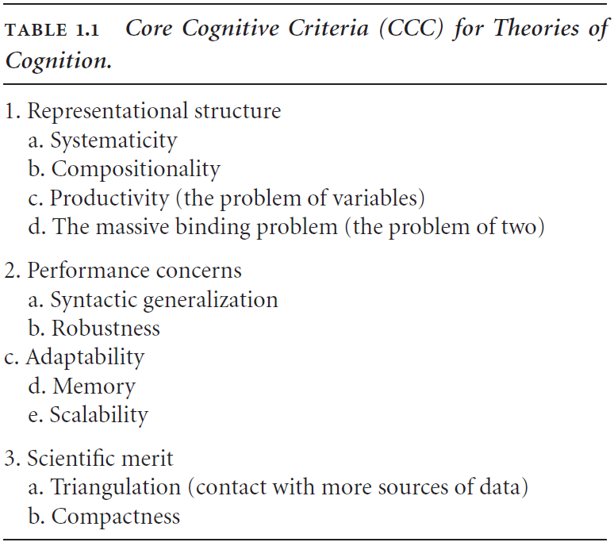
- Core Cognitive Criteria (CCC) for Theories of Cognition
    1. Representational structure
      1. Systematicity: the fact that some sets of representations are linked in a consistent way.
      2. Compositionality: the meaning of complex representations is a direct composition of the meanings of the basic representations.
      3. Productivity: the ability of a system to generate a large number of representations based on a few basic representations and rules for combining them.
      4. The massive binding problem: how many basic representations are bound to construct a complex representation.
    2. Performance concerns
     1. Syntactic generalization: ability to generalize the syntax from few examples.
     2. Robustness: ability to handle internal and external changes.
     3. Adaptability: ability to update future performance using past experience.
     4. Memory: the encoding, storage, and retrieval of information.
     5. Scalability: the ability to grow while maintaining properties.
    3. Scientific merit
      1. Triangulation: that a good theory contacts many distinct sources of data in a consistent and unified way.
      2. Compactness: that a good theory can be stated compactly and without ad hoc additions.
- CCC is concerned with evaluating a theory of cognition using four questions
    1. How is semantics captured in the system?
    2. How is the syntactic structure encoded and manipulated by the system?
    3. How is the flow of information flexibly controlled in response to task demands?
    4. How are memory and learning employed in the system?
- *Symbol grounding problem*: how symbols are mapped to concepts.
- E.g. How the word “dog” is mapped to a real dog and to the concept of a dog.
- *Semantic pointer*: a neural representation that carries partial semantic content and can be composed into representational structures.
- Semantic pointers bear systematic relations to what they point to unlike computer pointers.
- E.g. A “cat” semantic pointer points to the semantic pointers for “whiskers”, “four legs”, “fur”, etc.
- The relationship between a semantic pointer and what it points to can be thought of as compression.
- If the same process is always used for compression, then similar uncompressed input results in similar compressed representations.
- E.g. The semantic pointers for “dog” and “cat” are more similar than for “dog” and “rock”.
- The analogy of a hash table fits well here except that similar inputs give similar outputs.
- Directly comparing semantic pointers gives a loose sense of similarity but to get a better comparison, we need to access the uncompressed states.
- Dereferencing is the same as decompressing or running the system backwards.
- The basal ganglia seems to play a role in action selection and selecting semantic pointers.
- Attention seems to be an example of information routing in the brain.
- *Semantic Pointer Architecture (SPA)*: the idea that the higher-level cognitive functions are made possible by semantic pointers.
- *Semantic Pointer Architecture Unified Network (SPAUN)*: a system that integrates many different functions to reproduce a subset of human behaviors.
- SPA isn’t based in metaphors because it bottoms out at the level of neurons. SPA is based in neurons.

- "Creating” a system amounts to creating “simulations” of the underlying mechanisms in detail.
- *Nengo (Neural ENGineering Objects)*: a graphical neural simulation environment that’s used in the book’s tutorials.

# Part I: How to Build a Brain

## Chapter 2: An Introduction to Brain Building

- *Neural Engineering Framework (NEF)*: methods for constructing large-scale, neurally realistic models of the brain.
- Brains provide animals with behavioral flexibility and they control the four Fs of living (feeding, fleeing, fighting, and fucking).

- Neurons are specialized for communication.

- The brain is complex due to the variability found in neurons, synapses, and neurotransmitters.
- *Tuning curve*: the frequency of spiking of a neuron in response to a given input stimulus.
- Tuning curves and response functions are not the same. Tuning curves vary but response functions are more consistent.
- Tuning curves help to identify what information a neuron carries.
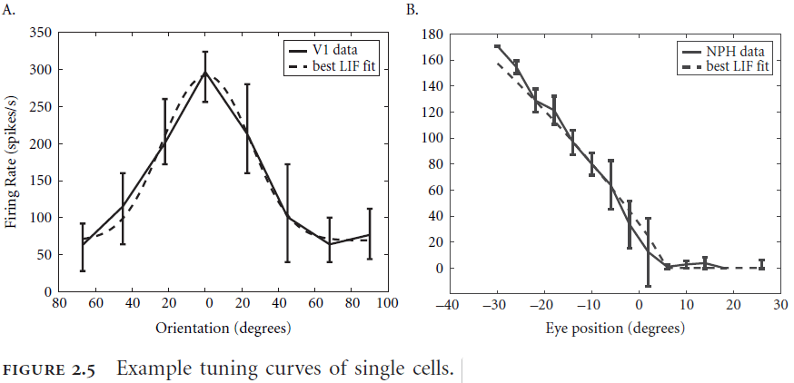
- For the rest of this book, a tuning curve includes the information about the cell’s receptive field although this isn’t exactly the case for real neurons.
- Response functions depend on a cell’s intrinsic properties while tuning curves depend on a cell’s extrinsic properties.
- Intrinsic heterogeneity can be captured by the variability of individual cells while extrinsic heterogeneity is a result of where a cell sits in the network.
- *Dale’s principle*: how a given neuron isn’t both excitatory and inhibitory; it must be one or the other.
- The NEF is a framework about how brains compute, not what they compute.
- Three core principles of NEF
    1. Neural representations are defined by the combination of nonlinear encoding and weighted linear decoding.
    2. Transformations of neural representations are functions of the variables represented by neural populations. Transformations are determined using an alternately weighted linear decoding.
    3. Neural dynamics are characterized by considering neural representations as state variables of dynamic systems.
- Neural systems are subject to significant amounts of noise so any analysis must account for the effects of noise on processing.
- Sources of noise
    - Synaptic unreliability
    - Variability in the amount of neurotransmitter in each vesicle
    - Jitter from axons
- NEF analyzes the brain using populations of neurons rather than single neurons.

- NEF suggests that we should use codes to understand representations in neural systems.
- *Codes*: complimentary encoding and decoding procedures between two alphabets.
- E.g. Morse codes maps the English alphabet to a set of dashes and dots.
- The encoding procedure in neural systems is done using spikes.
- *Spike raster*: a neuron’s firing pattern.
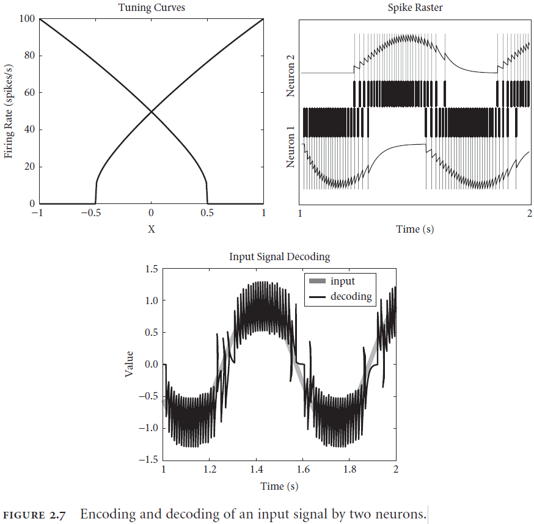
- Two aspects of decoding a neural response
    - *Population decoding*: weighting each neuron by how useful it is for carrying information about the stimulus.
    - *Temporal decoding*: neurons respond in time to a changing stimulus.

- Inputs typically change over time so decoding must also decode over time.
- Adding more neurons improves both decoding mechanisms in two ways
    - Allows the nonlinearities of tuning curves to be linearized via population decoding.
    - Allows the spiky decoding to be smoothed out as they become more evenly distributed over time.
- Having specified the encoding and decoding mechanism, we need to specify the alphabet used.
- Neural responses (encoded alphabet) code physical properties (decoded alphabet).
- Neural responses come in the form of temporally patterned neural spikes over populations.
- Physical properties come in the form of velocity, frequency, hot, edible, etc.

- The first principle of the NEF provides a general characterization of the encoding and decoding relationship between mathematical objects with units and descriptions of patterns of spikes in populations of neurons.
- Important properties of NEF representations
    1. Can be used to describe arbitrarily complex representations.
     - E.g. Angle of object, sound loudness, color, and depth.
    2. Separation of mathematical objects being represented (state space) from neurons that are representing it (neuron space).
     - This distinction accounts for the well-known redundancy found in neural systems.
    3. Embraces the heterogeneity of neural representations
- A transformational decoder, in contrast to a representational decoder, performs a biased decoding of a representation instead of a pure decoding.
- E.g. A representational decoder performs an $$x \rightarrow x$$ decoding/mapping while a transformational decoder performs an $$x \rightarrow f(x)$$ mapping.
- These two types of decoding are sufficient for describing cognitive behavior.

- In practice, the encoding/decoding distinction isn’t explicitly seen in neurons but is implemented in the synaptic weights between neurons.
- The state space representations of neural populations are the state variables of a dynamical system defined by control theory.
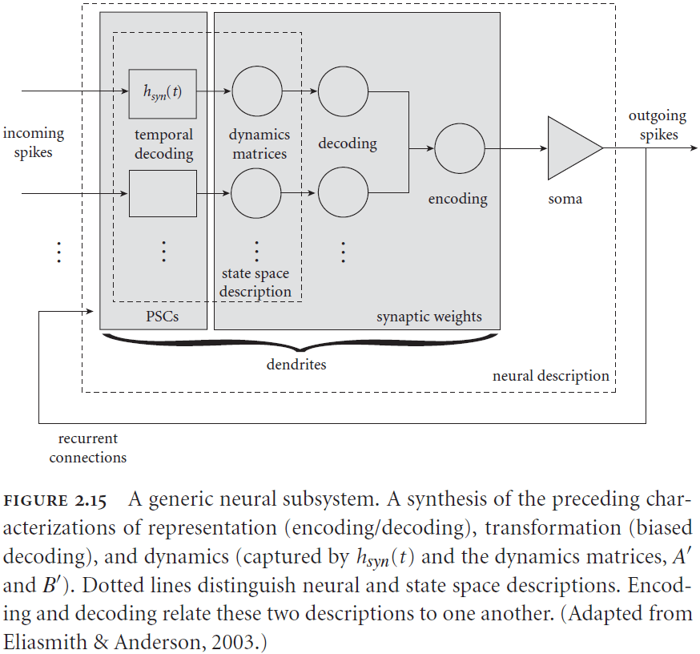
- The following equation captures how a neuron’s connection weights are calculated
    - $$w_{ij}=d_{i}^{f}Ae_{j}$$
        - $$w$$ is the weight from neuron population $$i$$ to neuron population $$j$$.
    - $$d_{i}^{f}$$ is the transformational decoders of the function $$f$$ for the neuron population $$i$$.
        - $$A$$ is the dynamics matrix.
    - $$e_{j}$$ are the encoders for the neuron population $$j$$.
- To determine each aspect of the equation
    - Decoders need the specific tuning curves of neurons in the circuit.
    - Dynamics need the kinds of neurotransmitters.
    - The kinds of spiking need the single cell model and the tuning curves.
    - Transformational decoders and dynamics need a high-level system goal.
- There are two distinct types of “levels”
    - *Levels of scale*: where a property fits on a physical scale.
    - *Levels of abstraction*: where an idea fits on a “detail” scale.
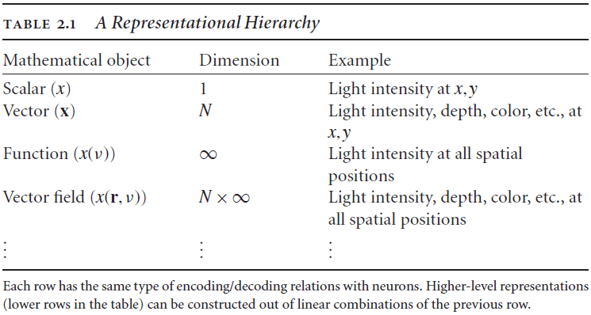
- A population of neurons acts together like a variable unlike traditional connectionist ANNs where the network represents a concept. Different activations of the population represent different concepts.

## Chapter 3: Biological Cognition-Semantics

- Biological systems can perform many different tasks without being “reprogrammed”. The same can’t be said for most cognitive models.
- E.g. Catastrophic forgetting in ANNs.
- *Semantic pointer*: a neural representation that carries partial semantic content and is composable into representational structures used in cognition.
- Semantic pointers are described by vectors in a high-dimensional space where each point in the space represents a concept.

- Similar concepts are closer in the state space compared to concepts that aren’t similar.
- E.g. The concept of “cat” is closer to “dog” than it is to say “water”.
- So the location of a concept in the state space carries information about its relationship to other concepts.
- With higher dimensions, the amount of surface area increases which leads to the ability to represent more concepts within that state space.
- E.g. A 100D space can hold more concepts and relationships than a 3D space.

- How does this state space relate to the time required to access content? Are concepts closer to the center faster to access?
- A representation can’t carry all of the semantic content because it would be too much information for our brains to actively represent and manipulate.
- This is why the notion of a pointer is important. A pointer doesn’t contain all of the semantic content but rather only information on how and where to find the content.
- This results in moving around less information and storing less information.
- Another important feature of pointers is that the pointer and the information it points to are arbitrarily related.
- This is similar to the symbolic systems hypothesis where symbols and there content are arbitrarily related but not exactly the same as we’ll see in a bit.
- So in a sense, neural representations are able to act like symbols in the brain.
- This relates nicely to language as different languages use different words (different semantic pointers) to refer to the same concept (same location in state space).
- However, this arbitrary mapping of pointers to concepts is problematic for learning. The comes back to the symbol grounding problem or how symbols get their meaning.
- Semantic pointers get around this problem by extending the pointer to contain semantic information themselves. This means that the relationship between pointer and concept isn’t arbitrary.
- The information contained in a semantic pointer is a “compressed” version of what it points to.
- In summary, semantic pointers are neural representations that are
    - Described by high-dimensional vectors.
    - Generated by compressing more complex representations.
    - Used to access these more complex representations through decompression.
- Three different characterizations of semantic pointers
    1. High-dimensional vectors.
    2. Observable activity in a biological neural network.
    3. Compressed representations.
- *Dual-Coding theory*: the idea that two levels of information processing occur in the brain.
- There seems to be two levels of semantic processing
    - *Shallow processing*: only comparing the lexical/word without meaning.
        - E.g. Comparing if “cherry” and “card” are related. Nope.
    - *Deep processing*: comparing the meaning of words.
        - E.g. Comparing if “monkey” and “banana” are related. Yes.
- This difference seems to be due to deep processing engaging a kind of “simulation” of the circumstances described by the words.
- E.g. Reading the word “water” and associating it with blue, wet, and thirst instead of it being just a word.
- One experiment showed that simple lexical associations (shallow processing) activated language areas, whereas complex meaning processing (deep processing) activated perceptual areas as expected from Dual-Coding Theory.
- It seems like shallow processing is fast thinking while deep processing is slow thinking. This seems related to Kaheman’s system 1 and 2 hypothesis from “Thinking, fast and slow”.
- Shallow processing deals with statistically related properties of the concept (language) while deep processing deals with the actual meaning and representation of the concept.
- Deep semantic processing occurs when “the brain simulates the perceptual, motor, and mental states active during actual interactions with the word’s referents”.
- However, how is implemented in the brain? What’s the computation account for the theory?
- SPA is an attempt to account for the computational process underlying the Dual-Coding theory.
- The key of SPA is that semantic pointers only carry partial semantic information which accounts for shallow processing. Deep processing requires dereferencing the pointer to get at the richer semantic concept.
- Semantic pointers perform lossy compression by using a parameterized model.
- *Parameterized model*: a model that depends on a small number of parameters to approximate the model.
- By using parameters, we’re able to compress input data into equations with minimal loss.
- E.g. Using the Bell curve equation to characterize a model instead of the raw data points.
- We can further constrain parameterized models by using what we know about the brain and its use of hierarchical models.
- In a hierarchical statistical model, each higher level attempts to build a statistical model of the level below it.
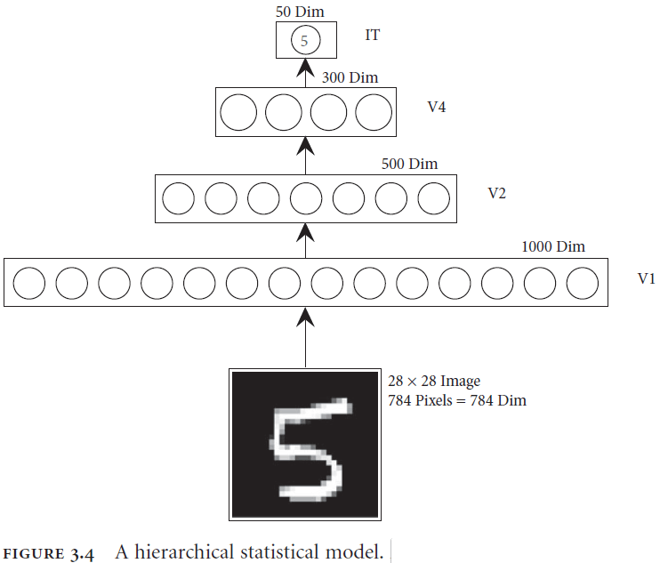

- Figure 3.7c reminds me of the numerosity mapping from the “After Digital” textbook.
- Motor control is the opposite problem of perception because perception maps from high dimensional features to low dimensional concepts while motor controls goes from low dimensional goals to high dimensional control of muscles.

- Dual problems are problems where a solution to one of the problems provides a solution to the other problem.
- This is great for the perceptual and motor systems because they can be treated as dual problems so a solution for one is a solution to the other.
- It’s a mistake to think that the flow of information in the brain is only up or down the hierarchy as there are recurrent connections and connections that skip levels.
- The connections must be bidirectional to allow for dereferencing of the high-level semantic pointer while also allowing for the referencing of low-level semantic pointers.
- Also, the high-levels of both hierarchies (visual and motor) must account for the statistics and dynamics of the levels below them.
- *Synergies*: sets of movements that are often activated together.
- E.g. The “move finger down while moving arm down” synergy used to press a button.
- Perception and action have dual descriptions in which semantic pointers can play the same role in both systems. That of encoding perceptual information and of decoding motor goals.

- This can also be used to explain how we “visualize” some motor actions by running from the top to bottom of the hierarchy to simulate the action.
- Semantic pointers both
    - Capture higher-order relationships because they can be dereferenced into lower level actions.
    - Compress representations because they don’t contain the details captured by the lower level representations.
- Because we can move in ways that we’ve never moved or imagine things that we’ve never seen, this supports the observation that past inputs are used to construct statistical models for generalization rather than remembering the raw input.
- Motor and perception information processing occur in parallel and inform each other at the top of each hierarchy.
- However, both hierarchies are independent as suggested by the different brain areas for both systems.
- E.g. The motor cortex verses the visual cortex.

## Chapter 4: Biological Cognition-Syntax

- How can representations (such as semantic pointers) be bound to roles within a structure?
- E.g. Conceptual relations, binding, and recursion.
- One way of binding roles to structures is by using a tensor product (also known as the cross product).
- E.g. $$b=dog \times agent$$.
- The cross product is like multiplication for vectors and the dot product is like division.
- E.g. $$b \cdot dog = agent$$.
- This means that the binding is reversible which is important because we want to unbind relationships for use in dereferencing.
- The tensor product representations don’t scale well because each result will grow at the rate of its parts.
- *Vector Symbolic Architectures (VSA)*: a class of closely related approaches to encoding structure using distributed representations.
- VSAs don’t change the dimensionality of representations when encoding a structure but the tradeoff is degradation of the structured representations which acts sort of like compression.
- *Reduced representations*: representations that slowly lose information as more is added to that representation.
- The capacity for error in VSA and thus SPA makes SPA psychologically plausible since actual biological systems are error prone and display graceful degradation aka reduced representations.
- When modeling our cognition, it’s important to not only capture the successes of cognition, but to also capture the failures of our cognition.
- E.g. To capture both our reasoning abilities and our logical fallacies.
- The binding operation for semantic pointers is specified using the following equation.
- $$C = A \circledast B = F^{-1}(FA \cdot FB)$$ where $$\circledast$$ is the circular convolution operation and $$F$$ is the Fourier transform.
- What this equation means is that we can bind two representations together to get a third representation that has the same dimensions as its input.
- This choice of binding operation is important in the later applications of semantic pointers so please remember this well.
- The unbinding operation is specified using the following equation.
- $$A \approx C \circledast B' = F^{-1}(FC \cdot FSB)$$ where $$S$$ is the inverse transformation and $$B'$$ is the approximate inverse of $$B$$.
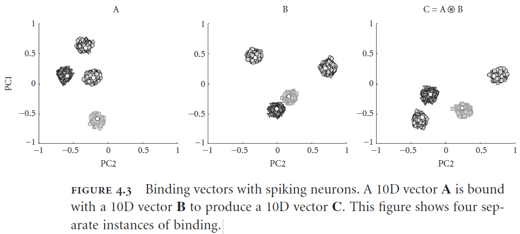
- Example of unbinding
    - Suppose we have a sentence encoded as the semantic pointer $$P$$ where $$P = verb \circledast chase + agent \circledast dog + theme \circledast boy$$ or in plain English “The dog chases the boy”.
    - We can decode the role of the word “chase” by multiplying $$P$$ with the inverse of “chase”.
    - $$chase' \circledast P = chase' \circledast (verb \circledast chase + agent \circledast dog + theme \circledast boy)$$
    - $$chase' \circledast P = chase' \circledast verb \circledast chase + chase' \circledast agent \circledast dog + chase' \circledast theme \circledast boy$$
    - $$chase' \circledast P = verb + noise + noise$$
    - $$chase' \circledast P \approx verb$$
    - Thus, we can determine that the role of the word “chase” is to act as the verb in the sentence.
- A semantic pointer can also be manipulated without having to decode it.
- Example of rebinding
    - Suppose we want to switch the roles and change the relation of $$P$$ using the semantic pointer $$T=agent' \circledast theme + chase' \circledast hug + theme' \circledast agent$$ or in plain English “The agent hugs the theme”.
    - By convolving $$T$$ and $$P$$ we get $$T \circledast P = verb \circledast hug + agent \circledast boy + theme \circledast dog + noise$$ or in plain English “The boy hugs the dog”.

- I wonder how well this system does against Winograd sentences.
- Two issues with using VSA for language
    - How to map language to VSA.
    - How to map questions to transformations.
- NEF doesn’t rely on learning to construct model networks but learning is a property of cognition.
- *Induction*: generating new rules from a few examples.
- E.g. Since the Sun has risen every day for all of my life, I infer that the Sun will rise tomorrow.
- In SPA, induction is the same as finding a transformation that works for several examples.
- One way of finding a transformation is to use a set of example transformations and then apply them to the examples. Then minimize the error between the examples and the transformations.
- Equation describing this process
    - $$T_{i+1} = T_{i} - w_{i}[T_{i}-(A_{i}^{'} \circledast B_{i})]$$ where
    - $$T$$ is the transformation that we’re trying to learn
    - $$w$$ is how much weight is given to the current example
    - $$A$$ and $$B$$ are the pre- and post-transformation vectors provided as input
- However, we need to address how an semantic pointer is cleaned of noise so that we can get a clean output.
- There are two properties of neurons that we can exploit to clean semantic pointers of noise
    - The current in a neuron is the dot product of an input vector with the neuron’s preferred direction in the vector space. So a similarity measure (such as the dot product) is a natural neural computation.
    - Neurons have a nonlinear response as shown by the activation threshold. So computing nonlinear functions is a natural neural computation.
- Both of these properties can be combined to build a good clean-up memory.
- The clean-up procedure
    - For each item in the clean-up memory, set a small number of neurons to have a preferred direction vector that’s the same as that item.
    - If that item is presented to the memory, then that set of neurons will be highly active.
    - Setting the thresholds to be slightly positive in the direction of the preferred direction vector makes the neuron insensitive to inputs that are only slightly similar.
    - So only inputs that are desired will be kept hence cleaning up the input.
- Scaling this clean-up procedure puts a limit on the dimensions of semantic pointers to around 500 dimensions.
- Binding and clean-up networks allow SPA to gracefully degrade in performance thus matching biological data.
- Going back to the problem of induction.
- *Raven’s Progressive Matrices (RPM)*: a set of images that tests induction.

- SPA using the induction rule is able to perform at human level in the RPM task.
- Another important feature is that the same network can be used to perform deduction and abduction.
- *Syntactic generalization*: content-insensitive generalization.
- The network is able to learn despite no connection weight changes in the model.
- An important note is that circular convolution is a compression operation.
- One interesting feature of SPA is that transformations of semantic pointers are themselves semantic pointers.
- This means that semantic pointers can also store changes associated with the representation that the semantic pointer represents.
- E.g. This is like saying that a doctor has the knowledge to diagnose themselves while still having the ability to diagnose others.
- This can be used to represent temporal transformations in representations.
- How does SPA scale up to handle more representations and complex representations?
- We can chain together memories and decode them in stages.
    - E.g. Decoding the “dog” semantic pointer gives us $$dog = isA \circledast mammal + hasProperty \circledast friendly + likes \circledast bones$$.
- We can further decode the “mammal” semantic pointer to give us $$mammal = isA \circledast animal + hasProperty \circledast hair + produced \circledast milk$$.
- This method of chaining/nesting increases the effective number of role-filler pairs.

- There are two constraints when using SPA
    - Number of dimensions. Smaller dimension spaces means that it’s more likely for vectors to collide or share some similarity that isn’t true.
    - Number of neurons. Larger dimension spaces means that more neurons are needed to represent the dimensions which leads to more energy and more computation.

## Chapter 5: Biological Cognition-Control

- It’s important that we understand how the flow of information in the brain is controlled because it allows for flexible, robust, and adaptive cognition.
- Control allows the brain to
    - Switch between tasks.
    - Route information to different parts of the brain.
    - Determine, given the context, what to do next.
- This is the same idea as executive control in neuroscience.
- The process of control can be broken down into two parts
    - Determining an appropriate control signal.
    - Applying that control signal.
- *Basal ganglia (BG)*: an interconnected cluster of brain areas under the neocortex and close to the thalamus.
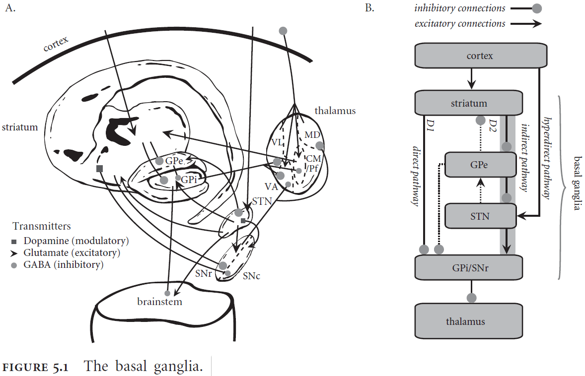
- The BG is implicated in action selection or choosing between alternative courses of action.
- The BG selects an action by inhibiting the corresponding output.

- SPA assumptions of the control process
    - Cortex provides, stores, and manipulates representations.
    - Basal ganglia maps current brain states to courses of action.
    - Thalamus applies routing signals to cortical pathways.
- SPA basic operations
    - Temporal integration
    - Multiplication
    - Dot product
    - Superposition
- *Attention*: routing information flexibly through the brain.
- Two main functions of visuo-spatial attention
    - *Selection*: identifying the appropriate targets of the system given current task demands.
    - *Routing*: when a target is selected, how a system can take the selected information and direct additional resources towards it.
- One way of implementing a control signal for the flow of information is through the use of inhibitory neurons and hierarchy.
- Neurons at the top of the hierarchy send a signal down that blocks neurons from sending information, acting as a gate.
- The control neurons determine which lower-level neurons are allowed to project their information to the higher-level neurons.
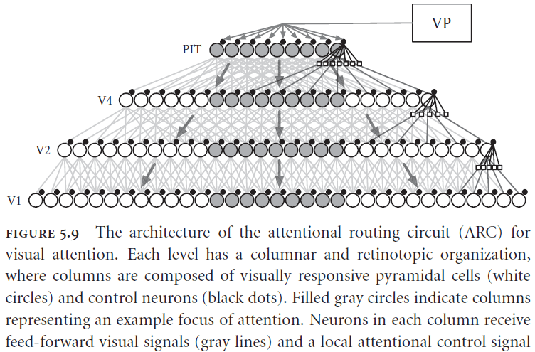
- The ARC matches biological evidence for attention effects and captures the physical constraints of neurons.
- Not only can gating signals be used to route signals but they can also be used to process signals due to their ability to bind and unbind semantic pointers.
- Example of a gating rule
    - Suppose we have the statement: $$statement+blue \circledast circle + red \circledast square$$ and a question: $$question + red$$. In plain English, suppose we see a blue circle and a red square and we’re asking what is red.
    - We can process this input by using an if-then statement
        - If the visual cortex contains $$statement+?$$, then copy visual cortex to working memory.
        - If visual cortex contains $$question+?$$, then apply visual cortex to the contents of working memory.

- If we apply the SPA to the Tower of Hanoi problem, the model matches human behavioral and fMRI data quite well.

## Chapter 6: Biological Cognition-Memory and Learning

- We can think of learning as the accumulation of memories.
- Types of learning
    - Unsupervised
    - Supervised
    - Reinforcement
    - Associative
- Types of memory
    - Short-term
    - Long-term
    - Semantic
    - Procedural
    - Implicit
- The timescales used to identify different kinds of memory seem to use more than one neural mechanism.
- *Serial working memory*: the ability to store and recall items in order.
- E.g. A phone number such as 432-234-7654.
- Two properties of serial working memory have been observed
    - *Primacy*: that items appearing earlier in the list have a greater chance of being accurately recalled.
    - *Recency*: that items recently presented have a greater chance of being accurately recalled.
- Both primacy and recency together account for a U-shaped response probability curve seen in serial working memory tasks.

- Interestingly, the same U-shape curve is seen in free recall tasks, tasks without ordering, so it seems likely that both tasks use the same underlying mechanism for memory.
- So serial working memory is more fundamental when considering human cognition because it can account for both serial and non-serial data.
- *Ordinal serial encoding (OSE)*: a model of serial working memory in SPA.

- The OSE memorizes semantic pointers by binding the item vector to a position vector and adding it to the overall representation store.
- Overall, the OSE don’t use any new idea but rather combines the concepts of SPA to create the function of memory.

- The OSE model does a good job of capturing multiple features of behavioral data such as primacy and recency.

- Interestingly, this model only works if it’s implemented in neurons as direct implementations of the equations or vectors doesn’t match the human data.
- The model is able to capture human data because individual neurons saturate themselves when participating in the representation of large vectors.
- This saturation serves as a kind of “soft” normalization which isn’t the ideal math normalization nor is it a complete lack of normalization.
- This observation is significant because it provides an unambiguous example of the importance of constructing a neural implementation for explaining high-level psychological behavior.
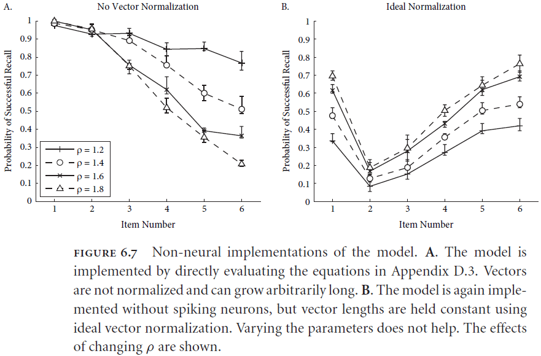
- It’s difficult to specify what counts as a “biologically plausible” learning rule because there are many mechanisms of synaptic modifications in the brain.
- Introduction of Hebb rule and STDP but both depend on information that’s directly available to the cell whose weight is changed.
- *Homeostatic, prescribed error sensitivity (hPES)*: a learning rule developed for SPA.
- How is binding (circular convolution) learnt?
- Binding can be learnt using the hPES but the time increases as the dimensionality of the semantic pointer increases. It’s an open question but not biologically implausible since it also takes humans a long time to develop certain cognitive functions.
- The hPES is also able to model reinforcement learning and fits both behavioral and neural data for a specific task.
- In the Wason card selection task, structurally identical tasks with different contents lead to different performance.
- E.g. Abstract version with vowels verses underage drinking version.
- *Social contract theory (SCT)*: a theory proposed to explain the underage drinking version of Wason’s card selection task. The theory proposes that natural selection has produced special-purpose, domain-specific mental algorithms for solving important, recurring, adaptive problems.
- *Pragmatic reasoning schemas (PRS)*: an alternative theory to SCT that says the source of the rules is induced through experience while SCT says the source is genetic.

- *Ventromedial Prefrontal Cortex (VMPFC)*: the bottom area of the prefrontal cortex.
- Interestingly, this model predicts that the VMPFC is where the difference between the abstract and content facilitated version is determined.
- This contrasts with SCT because this doesn’t mean that there’s an evolutionary distinct reasoning mechanism, this means that the same reasoning mechanism is used but with different parameters/contexts.

## Chapter 7: The Semantic Pointer Architecture

- This chapter tackles the unification of the previous parts of SPA and combines them into a single model.

- *SPA Unified Network (Spaun)*: a unified model of different SPA modules that is designed to solve eight different tasks in a limited domain.
- The input domain consists of numbers zero to nine plus some additional task-control symbols.
- The output domain consists of a two-jointed arm that Spaun can use to draw its response.

- A specific task is chosen by first presenting an “A” followed by the task number, a number between zero and seven.
- The following input is then used for the task.
- Spaun can’t be changed during any of the tasks or between any task; it must work on all eight tasks from the beginning.
- Not the most biologically realistic evaluation because even people have to learn as we aren’t born with these skills.

- Spaun uses 50D semantic pointers at the top of the visual hierarchy, 54D at the top of the motor hierarchy, and 512D everywhere else.
- Overall, the model uses 2.5 million spiking neurons and requires significant computation resources to simulate.
- Since Spaun doesn’t implement specific task modules but general modules, the list of tasks can be expanded upon to include new tasks using the same architecture.
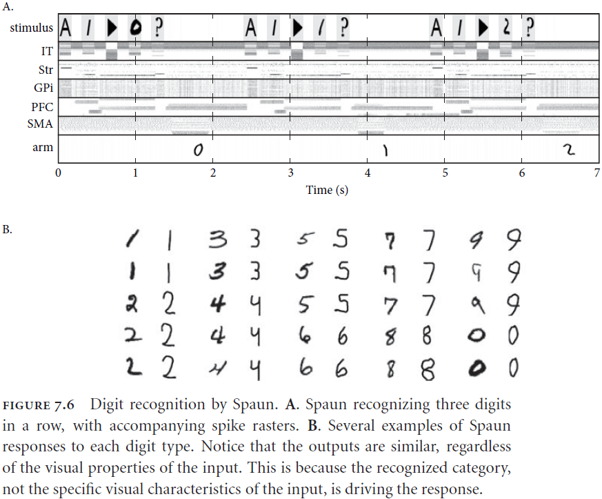
- For the copy drawing task, the visual semantic pointer maps linearly to the motor semantic pointer because of the compression and decompression algorithms built into it.
- We have to do this because it would be difficult to map directly from pixel-space to muscle-space so we perform an abstraction.

- Rapid variable creation problem example
    - Input: Biffle biffle rose zarple. Output: rose zarple.
    - Input: Biffle biffle frog zarple. Output: frog zarple.
    - Input: Biffle biffle dog zarple. Output: dog zarple.
    - Input: Biffle biffle quoggie zarple. Output: ?
- It seems that a variable has been created to receive any particular content and that won’t disrupt generalization performance.
- This also seems to be related to pattern recognition as we can extend the pattern in the new case.
- Hadley argues that learning rules can’t be used to solve this problem given the constraints on the speed of biological learning. Weight changes can’t happen quickly enough to explain these brief inputs.
- However, the SPA has an induction mechanism that was previously used on the Raven’s progressive matrices task.
- The most interesting feature of Spaun is that it’s unified.
- It uses the same model, the same underlying computational principles, and the same representations.
- Spaun’s architecture doesn’t have one subsystem for each task, but rather exploits different general subsystem for different tasks.
- E.g. Different types of memory for different tasks.
- Another advantage of Spaun is that it’s robust. We observe graceful degradation with the destruction of cells and the model is able to handle many variations in handwriting.
- The last important point is that Spaun is only an instance of the SPA.
- Processing in the SPA can be interpreted as both rule following (symbolic) and statistical inference (connectionist).
- Unlike previous cognitive modeling architectures such as the ACT-R, SPA uses semantic pointers for representation instead of symbols.
- The use of semantic pointers is more powerful than symbols because the pointers acts like probability distributions.
- Probability distributions more completely describes the possible states of the world than a symbol, hence why they’re more powerful.
- Distributions can hold more details and rules can use the structure of the distribution, not just the distribution itself.

# Part II: Is That How You Build a Brain?

## Chapter 8: Evaluating Cognitive Theories

- A review of the CCC from chapter 1.
- The goal of cognitive systems research is to understand the best examples of cognitive systems that we have, not to pre-specify the way we think such systems should work.
- E.g. We should try to build systems that have cognitive biases and logical fallacies and not build a system that should have perfect logical abilities.
- This means that the “productivity” rule in CCC shouldn’t mean to generate an infinite number of combinations, but rather a realistic number that is closer to human behavior.
- Just like compositionality, productivity should not be taken as an absolute but rather to degrees on a scale.
- This is more realistic because this captures the limit on time, memory, and energy that actual brains are constrained by.
- A good cognitive architecture should provide resources that match both the power and limits of real brains.
- It should also identify a binding mechanism that scales well.
- A cognitive architecture should also have the ability to generalize based on the syntactic structure of representations.
- Syntactic generalization acts as a test that your representation can generalize based on the syntax alone but we also know that human behavior doesn’t always conform to ideal syntactic generalization.
- E.g. Wason card selection task.
- So the cognitive architecture should capture our successes and our failings.
- We also want robust architecture to withstand unforeseen circumstances or problems.
- Computers with millions of transistors are robust but this robustness comes at the cost of power.
- Problems that robustness has to deal with
    - Internal degradation of the system itself.
    - External environmental variability.
- Computers are built to handle the first problem but not the second problem. Brains have evolved to handle both problems.
- The kinds of robustness we see in biological systems isn’t like that of computers.
- They’re able to handle noise, loss and damage of neurons, imprecise inputs, and unpredictable environments.
- Adaptability can be thought of as a superset of learning. While the two are related, learning is more commonly referred to as parameter updates in cognitive science.
- For a system to learn from its experience, it must have some kind of memory.
- Memory comes in two flavors
    - The highly manipulable but relatively limited capacity of working memory.
    - The relativity static nature but enormous capacity of long-term memory.
- A cognitive architecture must address the relation between long-term memory and working memory.
- Another factor in modeling cognition is that of scaling. Scaling isn’t as simple as “adding more of the same” because we don’t know which “same” is the most relevant until we actually scale.
- Decomposition and simplification are essential strategies for explaining complex systems.
- Many of the challenges involved in building complex systems comes from the interaction of the component parts.
- E.g. Chaos theory and dynamical systems theory.
- Although the interdisciplinary nature of the behavioral sciences can prove to be one of the most daunting aspects of performing research in the area, it also provides one of the most stringent tests of the quality of a purported theory of cognition.
- Tips for building a model
    - Identify the inputs and outputs. This helps determine the boundaries.
    - Identify the required internal variables. This helps determine the state space.
    - Identify the functions to be realized. This helps determine the connections between neural populations.

## Chapter 9: Theories of Cognition

- Problems with six past/present cognitive architectures
    - Adaptive control of thought-rational (ACT-R)
        - Lack of biological plausibility
    - LISA
        - Lack of scaling and neural plausibility
        - Doesn’t solve the binding problem
    - Neural Blackboard Architecture (NBA)
        - Unrealistic assumptions about connectivity and robustness
    - Vector Symbolic Architectures (VSA)
        - Biological plausibility is untested and unconvincing
        - Problems with scaling and control
    - Local, Error-driven and Associative, Biologically Realistic Algorithm (Leabra)
        - Dubious underlying computational methods such as k-Winner-Takes-All algorithm
    - Dynamic Field Theory (DFT)
        - Concerns with neural plausibility such as assuming all neurons are physiologically the same
- Implementing structured representations requires implementing how to bind representations.
- One suggestion from visual neuroscience is that synchronous spiking activity is used to bind representations.

- However, we don’t have strong evidence that synchronous spiking activity is actually used for binding and that it isn’t an epiphenomenon.
- E.g. If we see the color “red” and the shape “circle”, then we expect these to be synchronously represented in the brain and allowing subsequent areas to treat these features as bound.

- The author believes that the failure to scale these cognitive architectures stems from a fundamental problem with attempting to neurally implement a classical representational scheme
    - If we require each unit within a structure to appear in the representation of the overall structure, then we will either have an exponential explosion in the number of neurons required.
    - Or a complex and brittle system for temporarily binding and rebinding terms that is incompatible with known neural constraints.
- Perhaps it’s a mistake to think that a good model of biological cognition will come from implementing a classical symbolic system.
- Overall, it seems that past approaches are either biological or cognitive but not both. Architectures tend to sacrifice one for the other.
- Compositionality seems to be an idealization of the way in which meaning actually maps to linguistic structure.
- Robustness needs to be empirically shown.
- Eventually, cognitive models have to live up to the expectations of strong scientific theories.
- SPA is most similar to ICS except that the binding in SPA is always compressed.
- SPA uses “symbol-like” representations but not symbols. It approximates symbols.
- Populations of neurons represent vector spaces so the concept of “dog” can be in many different networks at the same time.
- The SPA begins with populations of neurons.

## Chapter 10: Consequences and Challenges

- If the SPA is truly both an integration and extension of the three standard approaches to cognitive science, then the distinction between these “paradigms” is not a useful one for the progress of the field.
- In SPA, mental representations are characterized as some kind of vector, and computations are characterized as some kind of vector transformation.
- SPA provides two mutually consistent views on the activities of neurons
    - The directly measurable properties of the system such as spike patterns.
    - Underlying vector space that is taken to be represented by those measurable properties.
- The distinction between neuron space and state space representation is crucial because such mappings give us a way to connect concise, scientific, and low-dimensional descriptions to the high-dimensional neural activities that we record from brains.
- These mappings can massively reduce the complexity of descriptions of brain functions, which is why appealing to the notion of”representation” is useful in the first place.
- Like the V1 cortex, the SPA also considers concepts to be represented as Fourier-like decompositions with more complex representations being built out of more simple representations.
- E.g. A square is built out of four lines and four right angles.
- The neural tuning curve is taken to be one basis for the decomposition where the neural activity encodes the currently relevant coefficient.
- Just like in V1, the SPA has significant redundancy in the representation of semantic pointers.
- We may think of symbol-like representations in the SPA as being “doubly distributed” as in representations are not only distributed over a vector space, but that vector space is also distributed over neural activities.
- Characterizing mental representations as symbol-like carries with it a reminder that many cognitive properties, such as systematicity, compositionality, and productivity, are idealizations of human performance.
- The SPA suggests that we think about the brain as more of a processor of neural signals rather than as a storehouse of neural representations.
- Neural populations are more like a way stations for a wide variety of constantly changing representational content, rather than a home base for some small subset of re-activated representations.
- The idea that semantics are encoded through compression and dereferenceing provides a natural explanation for the various amounts of time and effort required to extract meaning from experimental subjects.
- The SPA inclusion of dynamics provides a consistent and grounded inclusion of time into models of biological cognition.
- Challenges of SPA
    - Not testable by a single or small set of experiments.
    - Not a complete theory of mental function.
    - Doesn’t cover other mental functions such as emotion, other modalities, cerebellum, and neural plasticity.
- Unraveling the mysteries of biological cognition is only a matter of time.
