<blockquote class="blockquote">
  
Praised be this science! Praised be the men who do it! And praised be the human mind, which sees more sharply than does the human eye.

  
Aaron Bernstein

</blockquote>

## Chapter 1: Introduction to Clinical Case Presentations

- Textbook website: <http://neuroexam.com/>
- History and Physical exam (H&P) format
    - *Chief Complaint (CC)*: patient's age, sex, and presenting problem.
    - *History of Present Illness (HPI)*: complete history of the current medical problem.
    - *Past Medical History (PMH)*: prior medical problems not related to the HPI.
    - *Review of Systems (ROS)*: a head-to-tow review of all medical systems.
    - *Family History (FHx)*: all immediate relatives and familial illnesses.
    - *Social and Environmental History (SocHx/EnvHx)*: patient's occupation, family situation, travel history, and habit.
    - *Medications and Allergies*: all current medications and any general allergies.
    - *Physical Exam*: examination of organs and vital signs.
    - *Laboratory Data*: all diagnostic tests.
    - *Assessment and Plan*: diagnosis and treatment.
- *Differential diagnosis*: a list of alternative possible diagnoses.
- The neurologic exam is part of the general physical exam.
- The whole point of the H&P is to communicate.

## Chapter 2: Neuroanatomy Overview and Basic Definitions

- The nervous system performs processing that's
    - local and distributed,
    - serial and parallel,
    - hierarchical and global.
- Deciding to study neuroanatomy is like painting a large mural that you'll spend the rest of your life improving and refining.
- While we're painting the details, we must not lose sight of the bigger picture.
- The human nervous system can be divided into the central nervous system (CNS) and the peripheral nervous system (PNS).
- *CNS*: the brain and spinal cord.
- *PNS*: everything else such as the nerves in muscles and organs.
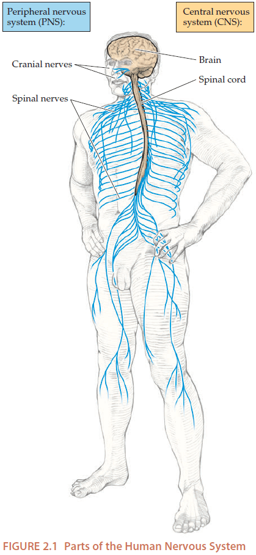
- *Cerebrospinal fluid (CSF)*: the fluid that surrounds and cushions the brain and spinal cord.
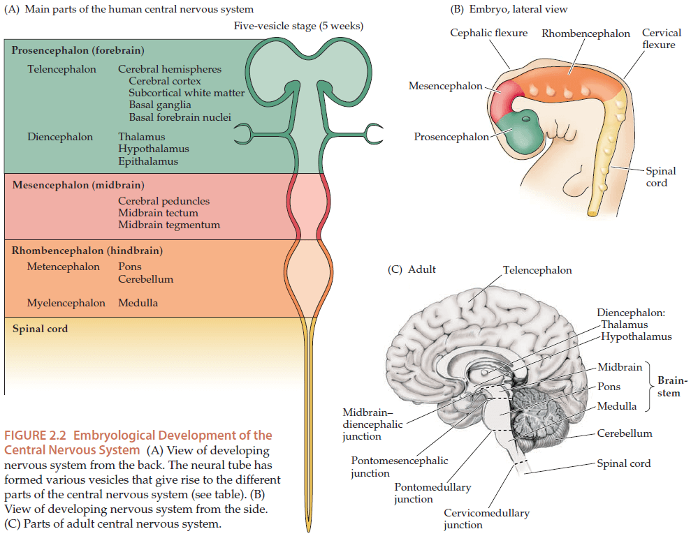
- The CNS is covered by three protective layers called meninges (pia, arachnoid, and dura).
- There are two sets of orientation naming
    - Ventral, dorsal, rostral, and caudal
    - Anterior, posterior, superior, and inferior
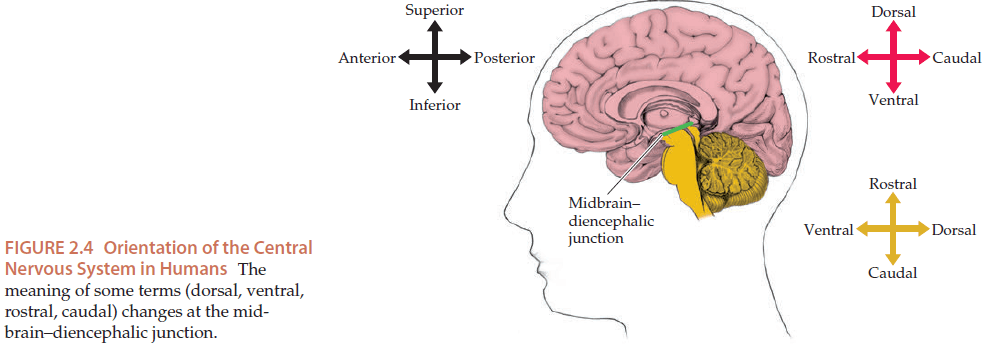
- The three anatomical planes are horizontal (cuts up/down), coronal (cuts front/back), and sagittal (cuts left/right).
- Introduction to neurons, glia, axons, dendrites, synapses, APs, EPSPs, and IPSPs.
- Neurons are electrically and chemically active.
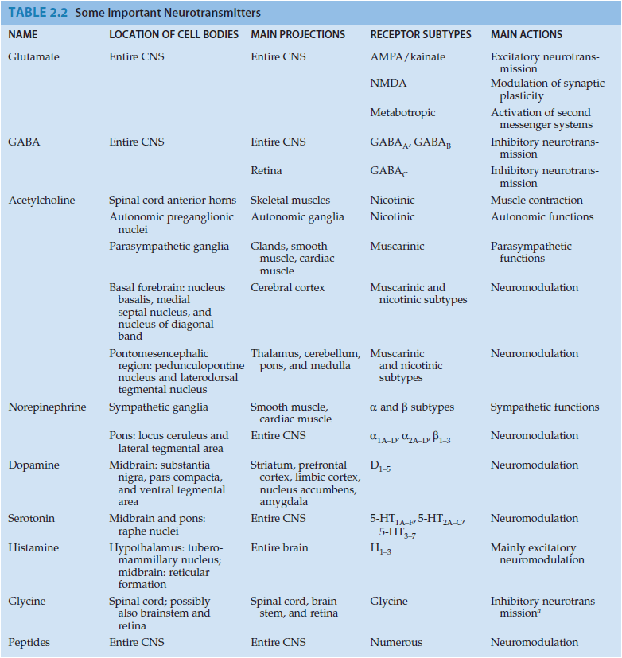
- In the CNS, the most common excitatory neurotransmitter is glutamate and the most common inhibitory neurotransmitter is GABA.
- In the cerebral hemisphere, gray matter is on the outside while white matter is on the inside. In the spinal cord, the opposite is true. In the brain stem, gray and white matter are found both on the inside and outside.
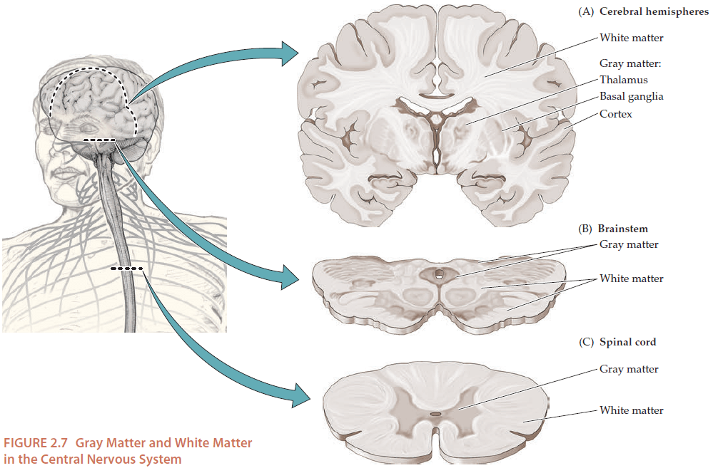
- *Afferent*: pathways carrying signals towards a structure.
- *Efferent*: pathways carrying signals away from a structure.
- E.g. Peripheral nerves convey afferent sensory information and efferent motor signals to the brain.
- While there is some variability, the sulci and gyri of the cerebral hemispheres form fairly consistent patterns.

- Just like in the spinal cord, the motor areas lie in front of the somatosensory areas.
- Sensory and motor pathways are usually topographically organized meaning each cortex area is mapped to a different representation.
- Somatotopic for motor or sensory, retinotopic for vision, and tonotopic for audition.
- E.g. Arm for senses and motor, area of retina for vision, and frequency for audition.
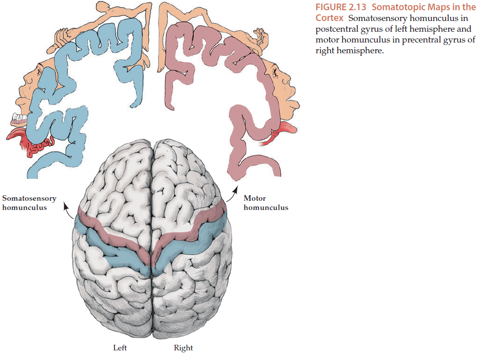
- Also note that the brain receives and sends signals to the opposite side of the body.
- E.g. The right visual cortex handles the left half of the visual field for each eye.
- The majority of the cerebral cortex is made up of the neocortex, and the neocortex is made up of six layers.
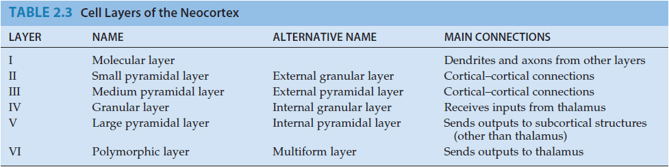
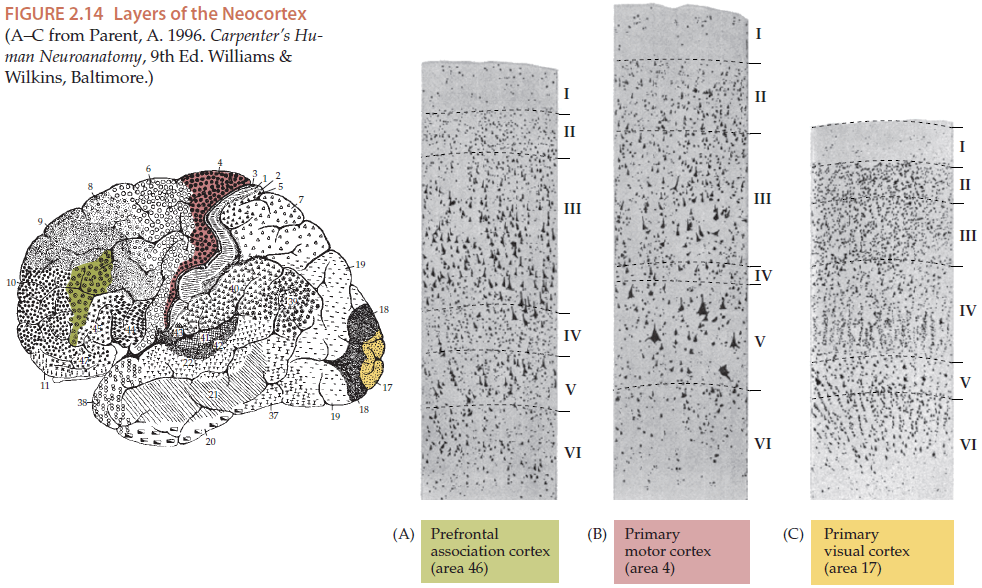
- The thickness of each layer varies depending on the main function of that area of cortex.
- E.g. Layer V is thicker in the primary motor cortex while layer IV is thicker for the primary visual cortex.
- There are a variety of cortex classification schemes but the most common is the Brodmann one.
- The Brodmann scheme divides the cortex into 52 cytoarchitectonic areas.
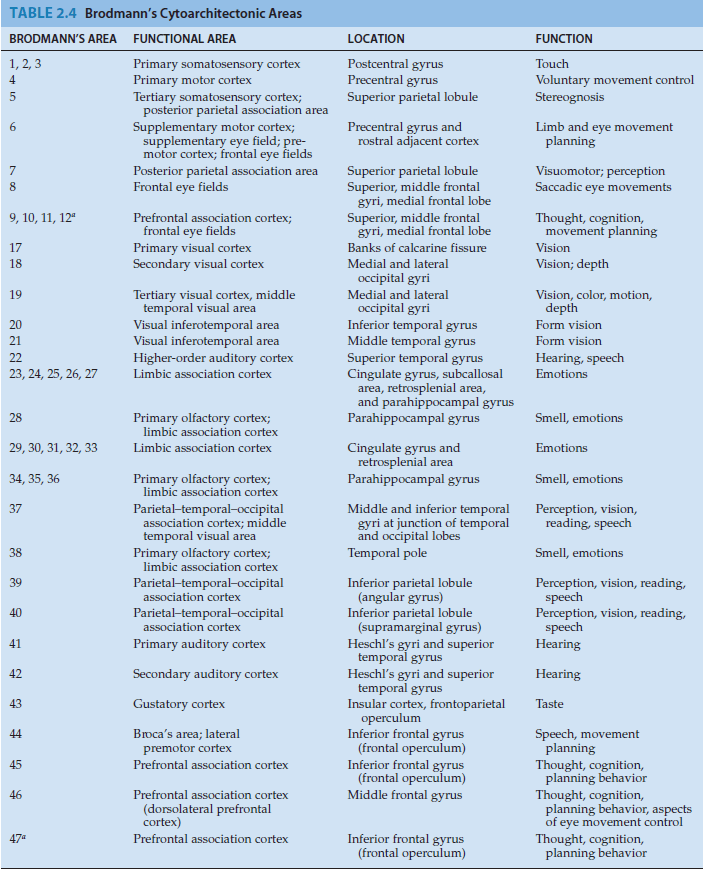
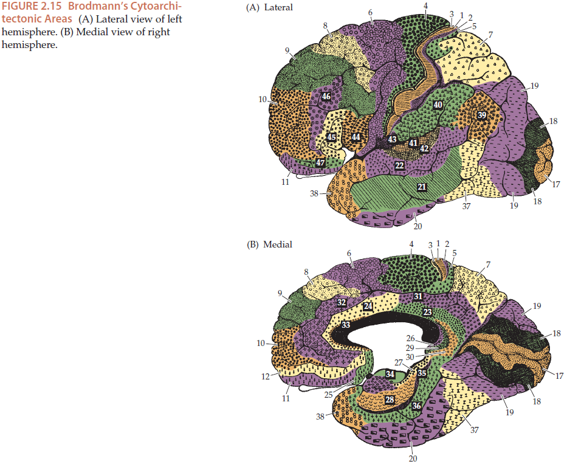
- The most important motor pathway is the corticospinal tract. This tract goes from the primary motor cortex to the brainstem and then to the spine.
- The corticospinal tract crosses over at the pyramidal decussation so lesions above the decussation produce contralateral (opposite-sided) effects while lesions below the decussation produce ipsilateral (same-sided) effects.
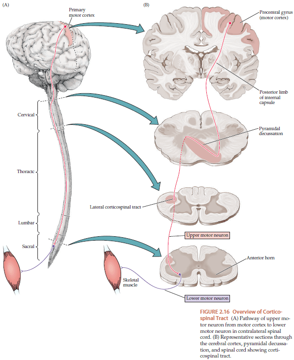
- *Upper motor neurons (UMN)*: motor neurons that project from the cortex down to the spinal cord/brainstem
- *Lower motor neurons (LMN)*: neurons that UMN form synapses on and are located in the central gray matter of the spinal cord.
- To refine the output of the motor system, multiple feedback systems are used including the cerebellum and basal ganglia.
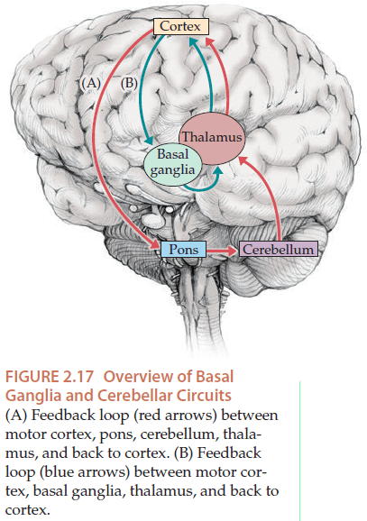
- *Ataxia*: disorders in coordination and balance.
- Lesions in the cerebellum lead to ataxia.
- Lesions in the basal ganglia lead to hypo/hyperkinetic movement disorders where movements are either slow and rigid or dance-like, respectively.
- Sensation from the body is conveyed by parallel pathways mediating different sensory modalities that travel to the central nervous system.
- Two main pathways in the spinal cord for somatic sensation
    - *Posterior column pathways*: convey proprioception, vibration, and fine touch.
    - *Anterolateral pathways*: convey pain, temperature, and crude touch.
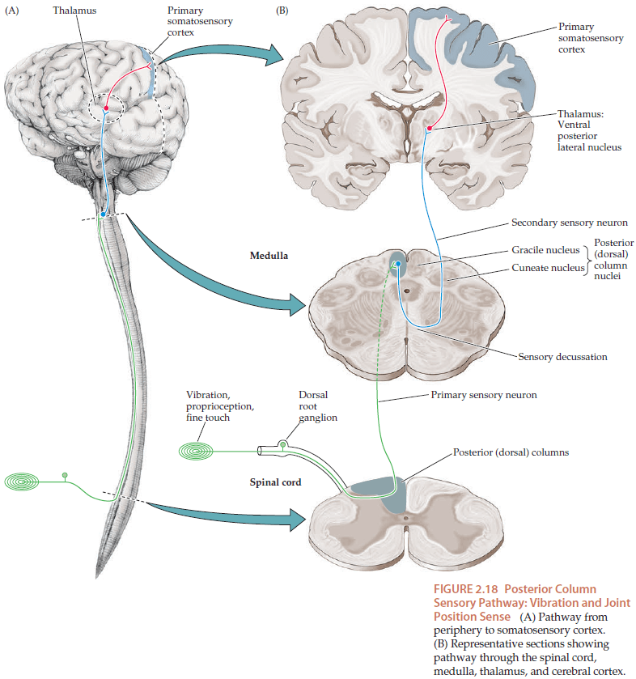
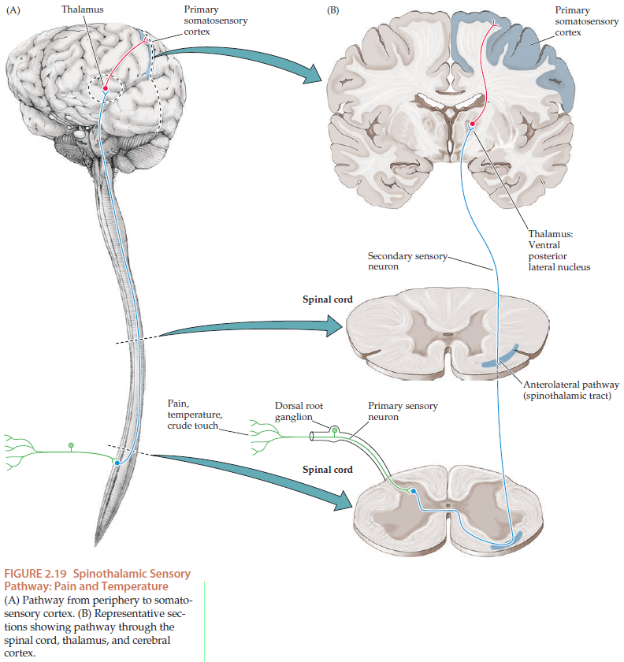
- Some aspects of touch are carried by both pathways. The main difference between the two pathways is where the primary sensory neuron synapses.
- Posterior column pathways synapse in the medulla while anterolateral pathways synapse in the spinal cord.
- The thalamus is a major relay center for all kinds of signals that travel to the cerebral cortex.
- However, olfactory inputs are an exception and they don't directly pass through the thalamus.
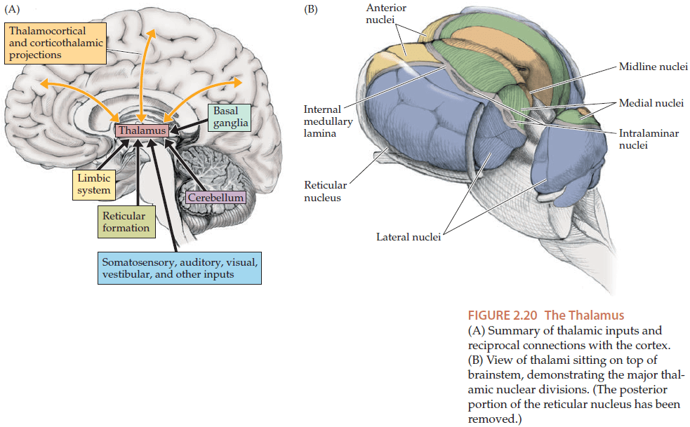
- The monosynaptic stretch reflex is a well-studied reflex that provides rapid local feedback for motor control without relying on the brain.
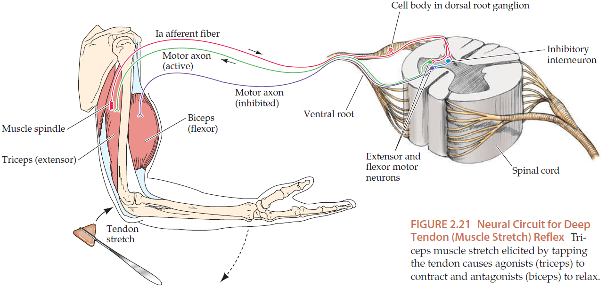
- There are also descending pathways that modulate the activity of the stretch reflex, and if these higher centers or the pathway is damaged, the reflex may become hyper/hypoactive.
- So, by testing the stretch reflex, we can obtain information about multiple pathways.
- Most of the cranial nerves (nerves in the head) arise from the brainstem.
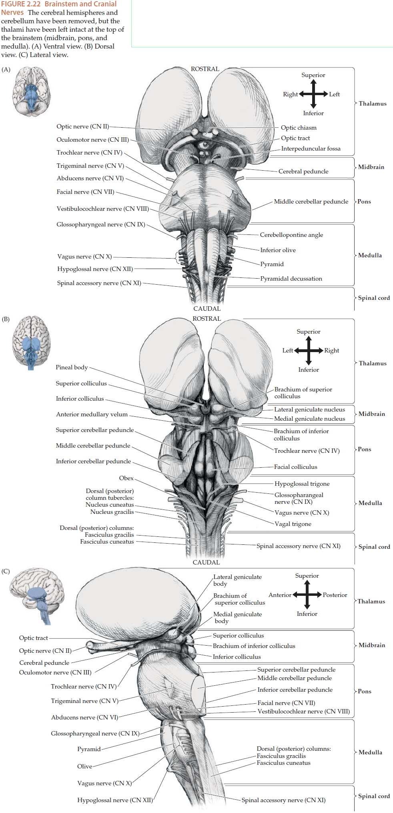
- All signals passing between the cerebral hemispheres and the spinal cord must pass through the brainstem. So, lesions in the brainstem can have devastating effects.
- Other functions of the brainstem
    - Nausea and vomiting
    - Neurotransmitter modulation
    - Pain modulation
    - Heart rate
    - Respiration
    - Level of Consciousness
- The bottom reticular formation in the medulla and lower pons tend to be involved mainly in motor and autonomic functions.
- The top reticular formation in the upper pons and midbrain plays an important role in regulating the level of consciousness, influencing higher areas through modulation of thalamic and cortical activity.
- Cortical, thalamic, and other forebrain networks also play an important role in maintaining consciousness.

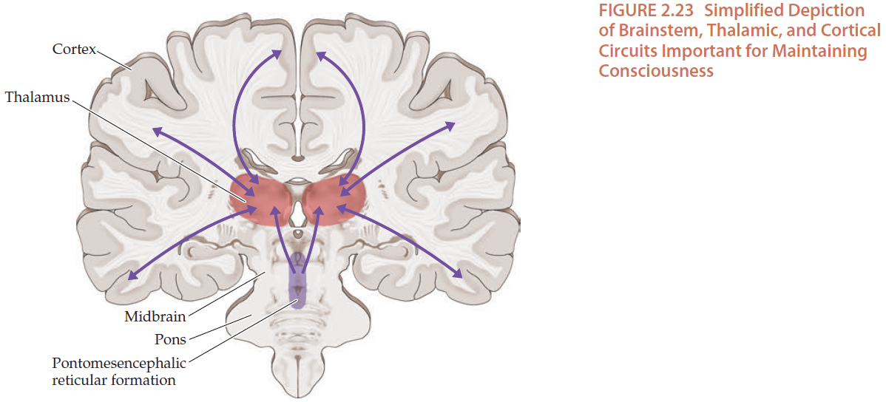
- *Limbic system*: located at the fringe of the cerebral cortex, this system performs a diverse set of functions such as regulating emotions, memory, appetite, and autonomic control.
- The limbic system includes
    - Hippocampal formation
    - Amygdala
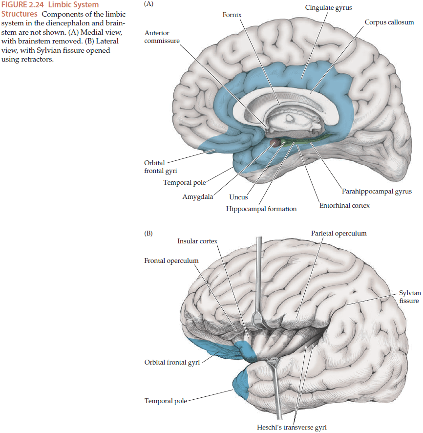
- *Fornix*: a paired, arch-shaped white matter structure connecting the hippocampal formation to the hypothalamus and septal nuclei.
- Lesions in the limbic system can cause deficits in the consolidation of memories so patients have trouble forming new memories.
- Also, epileptic seizures most commonly arise from the limbic structure of the medial temporal lobe, resulting in seizures that begin with emotions, memory distortions such as deja vu, or smell hallucinations.
- Included with the primary motor and sensory areas is the large amount of association cortex which perform higher-order information processing.
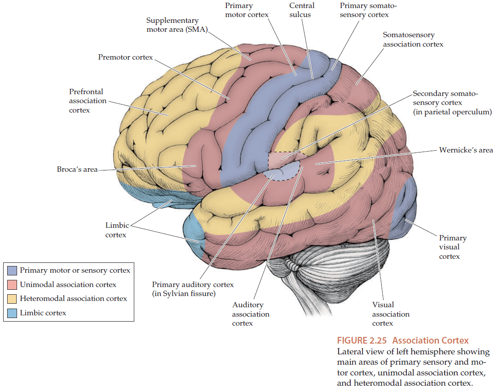
- *Unimodal association cortex*: higher-order processing that takes place mostly for a single sensory/motor modality.
- Unimodal association cortex is usually located adjacent to the primary sensory/motor cortex.
- *Heteromodal association cortex*: higher-order processing that integrates multiple sensory/motor modalities.
- Wernicke's (language comprehension) and Broca's area (language composition) lie in the unimodal association cortex.
- *Gerstmann's syndrome*: a group of abnormalities due to lesions in the inferior parietal lobule including
    - Difficultly with calculations
    - Right-left confusion
    - Finger agnosia
    - Difficulty with written language
- Motor planning appears to be distributed in many different cortex areas.
- *Apraxia*: abnormalities in motor conceptualization, planning, and execution.
- Diffuse lesions of the cortex can produce apraxia.
- The parietal lobes also play an important role in spatial awareness.
- Lesions in the parietal lobe can cause distortion perceived space and neglect of the contralateral side.
- E.g. Drawing a clock but not filling in any numbers on the left side of the clock.
- *Anosognosia*: unawareness of a deficit.
- *Extinction*: a phenomenon where a visual/tactile stimulus is perceived when presently to only one side, but if the stimulus is duplicated to both sides, then the side contralateral to the lesion is neglected.
- Lesions in the frontal lobes can cause disorders in personality and cognitive functioning.
- E.g. Difficulty performing a sequence of actions repeatedly or to change from one activity to another.
- *Perseverate*: repeating a single action over and over without moving onto the next action.
- Patients with frontal lobe lesions tend to
    - Perseverate
    - Show impaired judgement
    - Show disinhibited behaviors
    - Stare passively
    - Respond to commands only after a long delay
    - Have unsteady magnetic gait (shuffling feet close to the floor)
- Lesions in the visual association cortex can produce
    - *Prosopagnosia*: inability to recognize faces
    - *Achromatopsia*: inability to recognize colors
    - *Palinopsia*: persistence or reappearance of an object viewed earlier
- Seizures in the visual association cortex can also cause elaborate visual hallucinations.
- The brain is supplied by two pairs of arteries and one pair of draining veins.
- The internal carotid artery, the vertebral artery, and the internal jugular vein.

## Chapter 3: The Neurologic Exam as a Lesson in Neuroanatomy

- Goals for learning the neurologic exam
    - Remainder of textbook is based on clinical cases
    - Attain an overview of neuroanatomical function and clinical localization
- Neurologic exam format
    1. Mental status
    2. Cranial nerves
    3. Motor exam
    4. Reflexes
    5. Coordination and gait
    6. Sensory exam
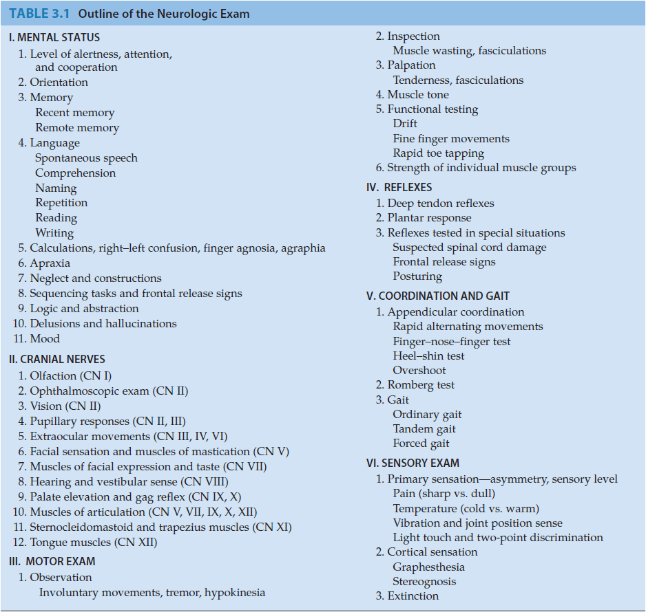
- The neurologic exam tests for function unlike the H&P exam.
- The neurologic exam is detailed in the chapter but I will only copy the interesting points.
- Mental status
    - It's striking how many patients appear to have a functioning, normal memory until they are explicitly tested.
    - *Anterograde amnesia*: difficultly remembering new facts.
    - *Retrograde amnesia*: difficultly remembering old facts.
    - *Perseveration*: when a patient is unable to switch tasks due to damage to their frontal lobe.
- Cranial nerves
    - Cranial nerve testing can raise red flags that suggest specific neurologic dysfunction rather than systemic disorder.
    - Lesions in front of the optic chiasm affect one eye while lesions behind the optic chiasm affect both eyes.
- *Brain death*: irreversible lack of brain function.
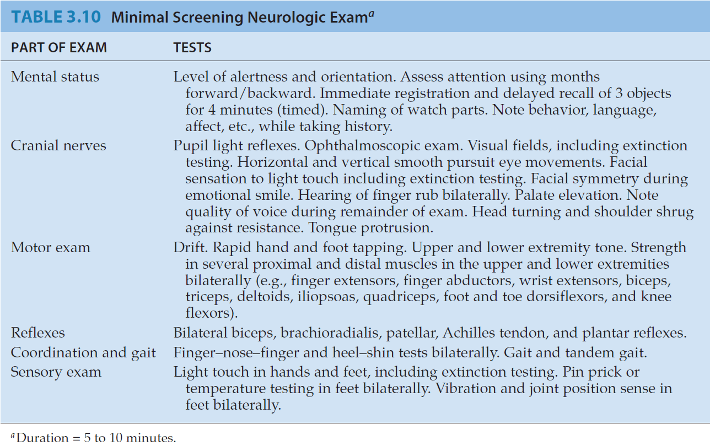

## Chapter 4: Introduction to Clinical Neuroradiology

- Introduction to three imaging modalities
    - Computerized tomography (CT)
    - Magnetic resonance imaging (MRI)
    - Neuroangiography (ultrasound, etc)
- Also three functional imaging modalities
    - Positron emission tomography (PET)
    - Single photon emission computerized tomography (SPECT)
    - Functional MRI (fMRI)
- CT is a modification of xrays and detects the density of the tissues.
- Main drawbacks of MRI
    - Time
    - Cost
    - Inferior performance in imaging a fresh hemorrhage and bony structures
    - Can't be used on patients with metal in them (pacemaker)
- T1-weighted images are often used for identifying anatomy while T2-weighted images are often used for detecting pathological changes.
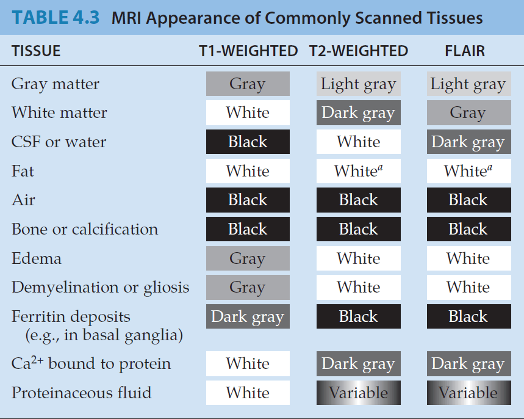
- Neuroangiography is used mainly to visualize lesions of the blood vessels themselves, rather than to provide indirect information about surrounding structures.
- *Evoked potential*: when brain signals are recorded in response to specific stimuli.

## Chapter 5: Brain and Environs: Cranium, Ventricles, and Meninges

- The brain is encased in several protective layers to cushion it from trauma.
- One of those layers is the skull, which has many holes to allow cranial nerves, the spinal cord, and blood vessels to escape and enter.
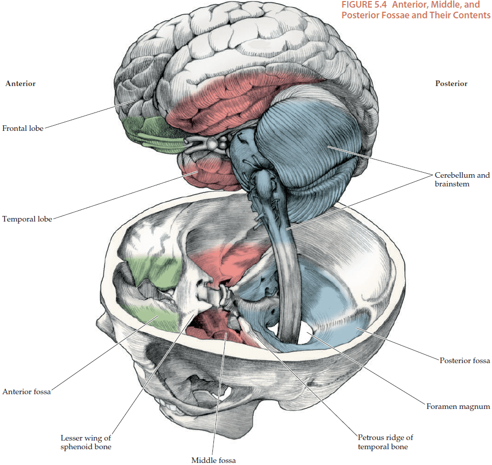
- Three layers of meninges (PAD) from outside to inside
    - Dura
    - Arachnoid
    - Pia
- The blood-brain barrier prevents most substances from crossing except for lipid-soluble substances, oxygen, and carbon dioxide.
- There are a few places where the blood-brain barrier has holes, such the circumventricular organs which monitor blood to send/receive hormonal signals.
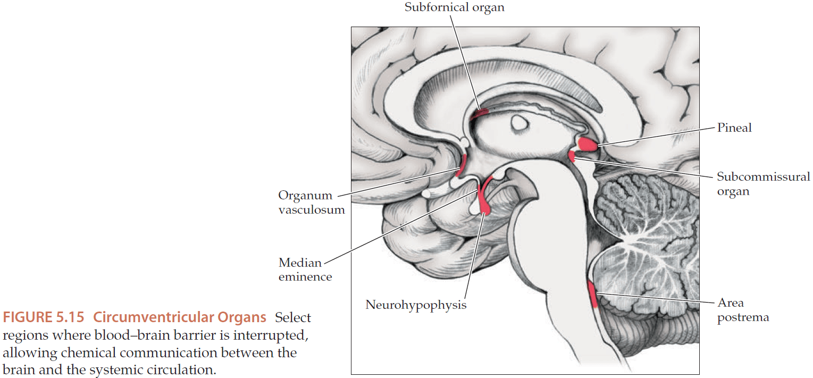
- There are no pain receptors in the brain so brain damage is not felt by the patient.
- *Mass effect*: displacement of intracranial structures due to masses.
- *Herniation*: when the mass effect is severe enough to push intracranial structures from one compartment into another.
- *Concussion*: reversible impairment of neurologic function.
- *Prion*: protein-based infectious agent.

## Chapter 6: Corticospinal Tract and Other Motor Pathways

- There are three important motor and sensory long tracts in the nervous system.
    - Lateral corticospinal tract (motor)
    - Posterior columns (sensory - vibration, proprioception, fine touch)
    - Anterolateral pathways (sensory - pain, temperature, crude touch)
- Each tract/path crosses over to the opposite side at some point and knowledge of where they cross over is helpful for localizing lesions.
- Lesions of the association cortex don't produce deficits in basic movements and sensations, but rather produce deficits in higher-order sensory analysis or motor planning.
- Interestingly, there are reciprocal connections between the primary and association cortices, allowing for feedback and control.
- The primary motor and somatosensory cortices are somatotopically organized.
- *Somatotopical organization*: adjacent regions on the cortex map to adjacent areas on the body.
- Somatotopic maps aren't as clear-cut and consistent as originally thought when studied at high resolution.
- Somatotopic organization isn't confined to the cortex but also applies to the pathways leading to the cortex.
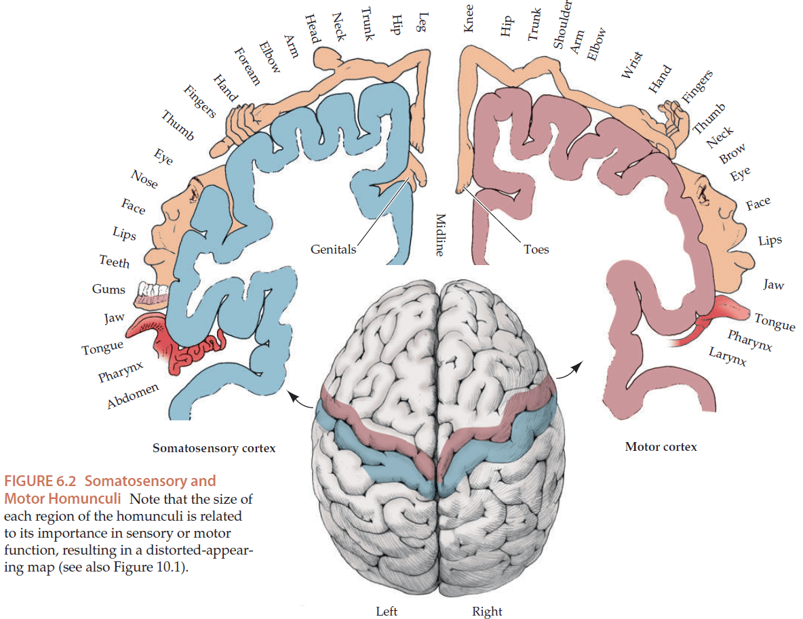
- The spinal cord follows the same organization as the brain with motor neurons exiting the front and sensory neurons entering the back.
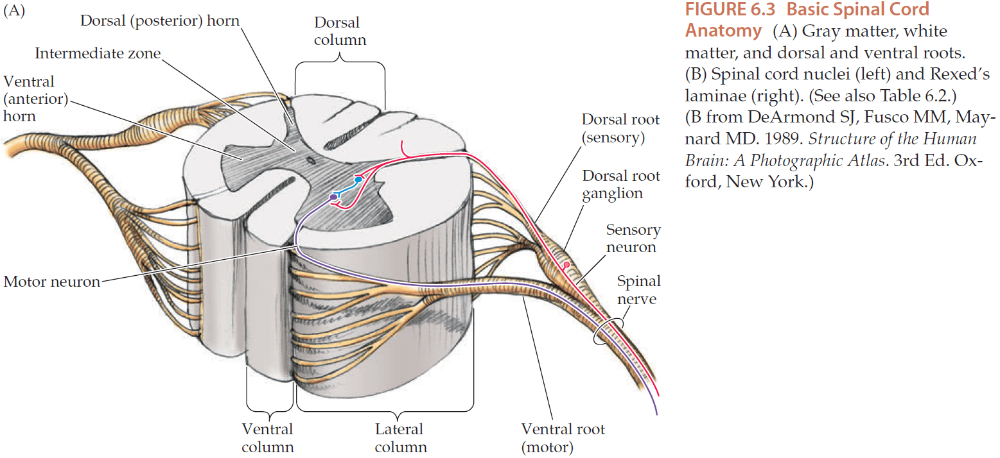
- Recall that UMNs carry motor outputs to LMSs in the spinal cord and brain stem, which in turn, project to muscles.
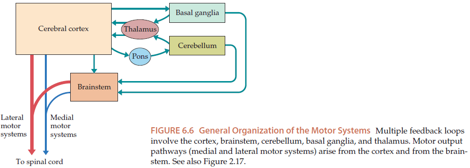
- The main motor pathway is the lateral corticospinal tract. The fibers originate in the primary motor cortex and are mostly located in cortical layer five.
- *Betz cells*: the largest neurons in the human nervous system and are giant pyramidal cells in the corticospinal tract.
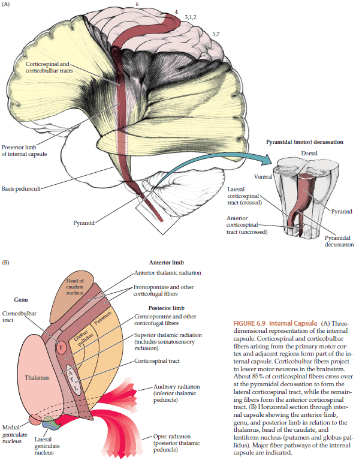
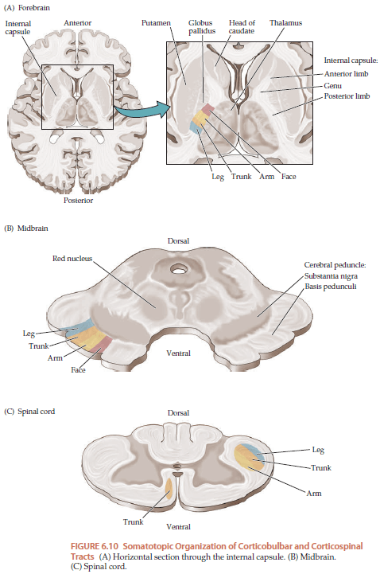
- The corticospinal tract lies in the posterior limb of the internal capsule and the somatotopic map is preserved in the internal capsule.
- Some fibers are called corticobulbar because they project from the cortex to the brainstem instead of to the spinal cord.
- Around 85% of the corticospinal tract switches sides at the pyramidal decussation, forming the lateral corticospinal tract, with the remaining 15% continuing without crossing, forming the anterior corticospinal tract.
- Lesions above the pyramidal decussation produce contralateral weakness and lesions below the pyramidal decussation produce ipsilateral weakness.
- Introduction to the autonomic nervous system (automatic bodily functions), sympathetic division (stress), and parasympathetic division (rest).
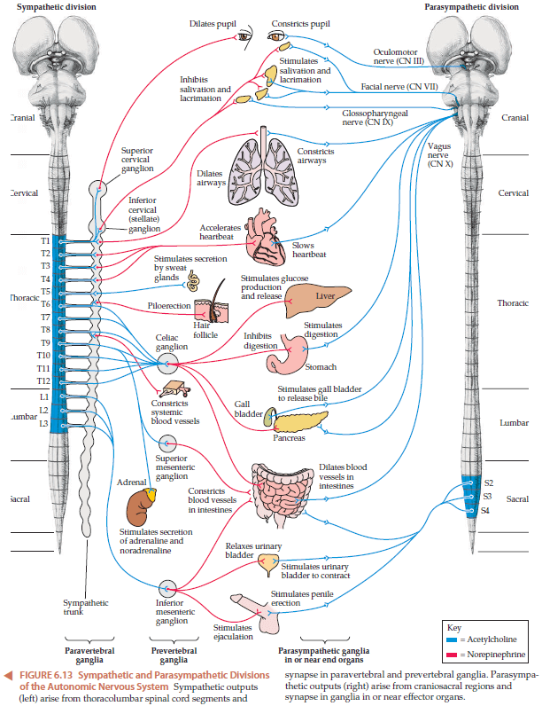
- Weakness is one of the most important functional effects of both UMN and LMN lesions.

## Chapter 7: Somatosensory Pathways

- The main two somatosensory pathways
    - Posterior column-medial lemniscal (proprioception, vibration, fine touch)
    - Anterolateral systems (pain, temperature, crude touch)
- Like the corticospinal tract, these two pathways are also somatotopically organized.
- *Somatosensory*: refers to bodily sensations of touch, pain, temperature, vibration, and proprioception.

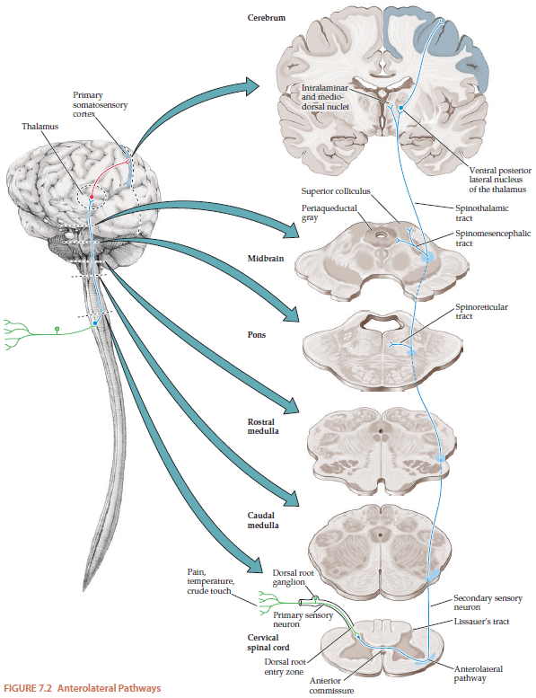
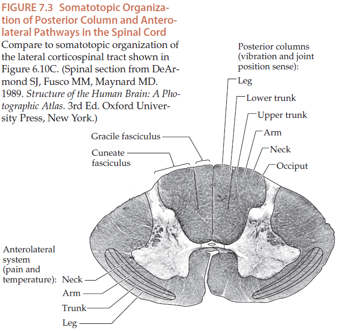
- Like the primary motor cortex, the primary somatosensory cortex is somatotopically organized, with the face represented most laterally and the leg most medially.
- The thalamus acts like a relay station for nearly all inputs to the cortex and has major reciprocal connections with all regions.
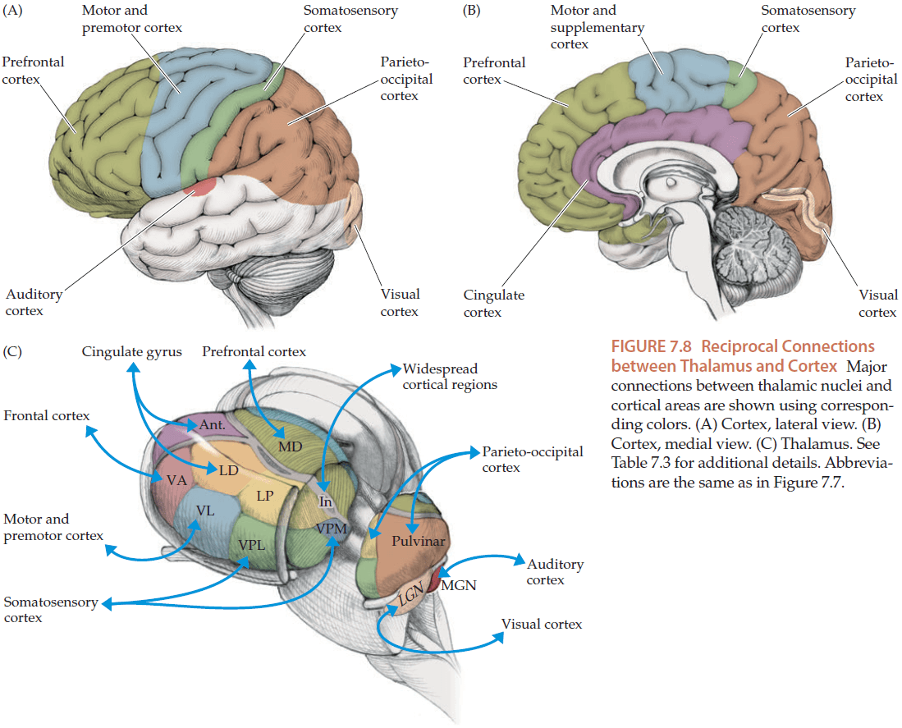

## Chapter 8: Spinal Nerve Roots

- The spinal cord is divided into multiple segments. Why?
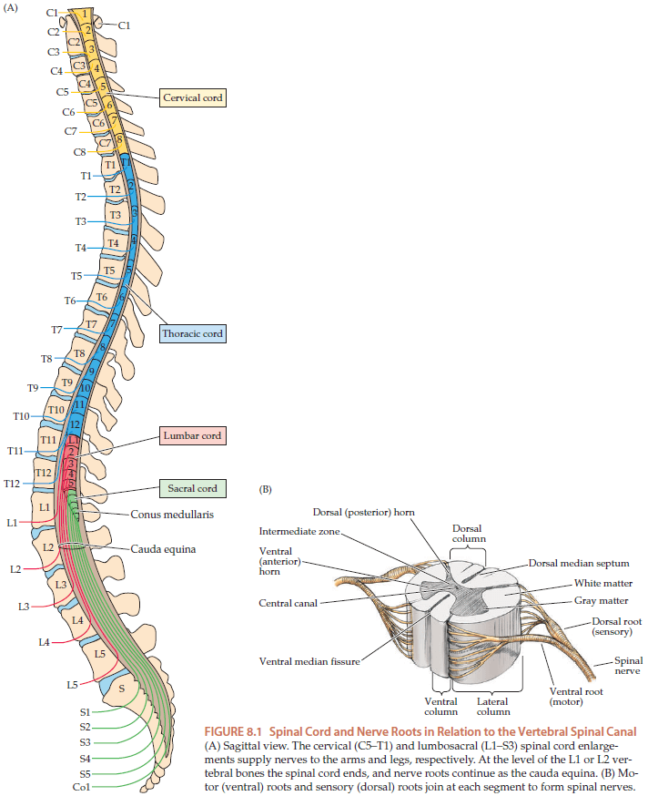
- The vertebral bones functions to provide mechanical support and to protect the spinal cord.
- *Dermatome*: the sensory region of skin innervated by a nerve root.
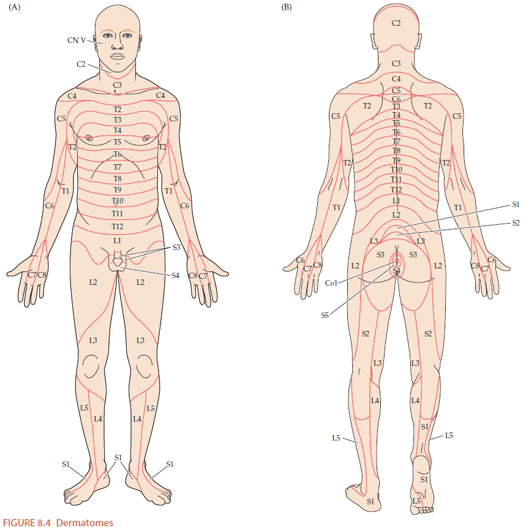
- *Neuropathy*: general term for nerve disorder.
- The most common cause of nerve root dysfunction is intervertebral disc herniation, or when the disc between the spinal bones push and compress the spinal nerve roots.

## Chapter 9: Major Plexuses and Peripheral Nerves

- Introduction to the nerves at the shoulder and hip.
- Skimmed due to me not focusing on the peripheral nervous system.

## Chapter 10: Cerebral Hemispheres and Vascular Supply

- Skimmed due to disinterested in how blood is supplied to the brain.

## Chapter 11: Visual System

- As light enters the eye, it's inverted and reversed by the lens so it appears upside-down and mirrored on the retina.
- *Fovea*: a region of the retina with the highest visual acuity.
- Despite it's small size, information from the fovea is represented by around half of the fibers in the optic nerve and around half of the cells in the primary visual cortex.
- *Macula*: an oval region that surrounds the fovea.
- Both eyes have a blind spot due to the optic disc, a region where the axons leaving the retina gather to form the optic nerve. There are no photoreceptors in the optic disc hence why we have a blind spot.
- Interestingly, even when one eye is closed, our visual analysis pathways appear to fill in the blind spot thus we aren't aware of it unless tested.
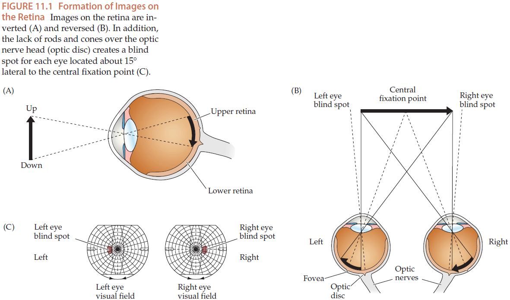
- Two types of photoreceptors
    - *Rods*: low spatial and temporal resolution and used in low light.
    - *Cones*: high spatial and temporal resolution and used in normal light.
- In normal daylight, the response of most rods is saturated.
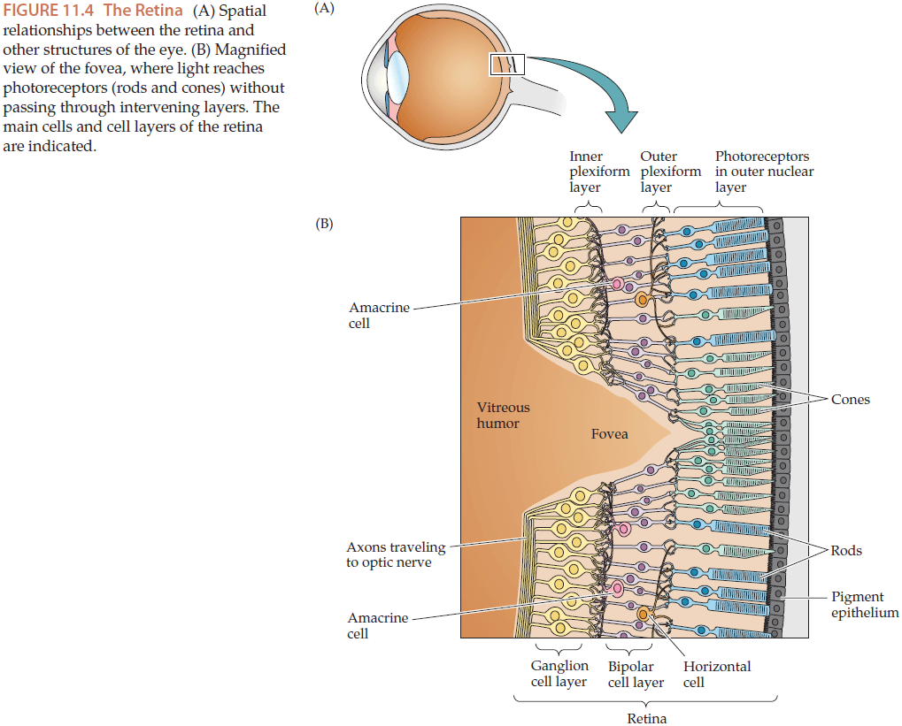
- Photoreceptors and bipolar cells don't fire APs, instead they convey information by releasing neurotransmitters in a graded fashion that depends on the membrane potential.
- Due to the lateral connections of horizontal and amacrine cells, bipolar and ganglion cells have receptive fields with a center-surround configuration.
- Two types of center-surround cells
    - *On-center*: cells excited by light in the center and inhibited by light in the surrounding.
    - *Off-center*: cells inhibited by light in the center and excited by light in the surrounding.
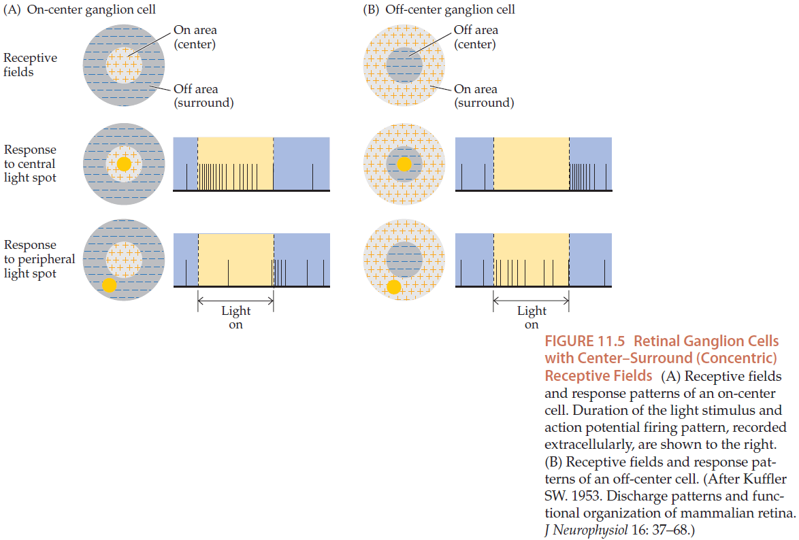
- Retinal ganglion cells → Optic nerve → Optic chiasm → Left/Right optic tract
- The nasal retinal fibers for each eye cross over in the optic chiasm, so each optic tract is responsible for only one visual field (left/right).
- Optic tract → Lateral geniculate nucleus (LGN)
- Some retinal fibers bypass the LGN and project to the pretectal area and the superior colliculus.
- Retino-tecto-pulvinar-extrastriate cortex pathway functions in visual attention and orientation.
- Retino-geniculo-striate pathway functions in visual discrimination and perception.
- The LGN is made up of six layers, with the first two layers used for motion and spatial analysis (magnocellular), and the last four layers used for detailed form and color (parvocellular).
- Information from the left and right eyes remains segregated even after passing through the LGN because axons from each retina synapse onto different layers of the LGN.
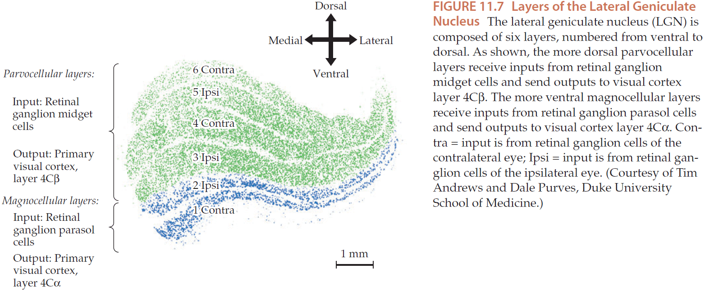
- The primary visual cortex is retinotopically organized with the fovea occupying a disproportionate cortical area of about 50% due to it having the highest density of photoreceptors.
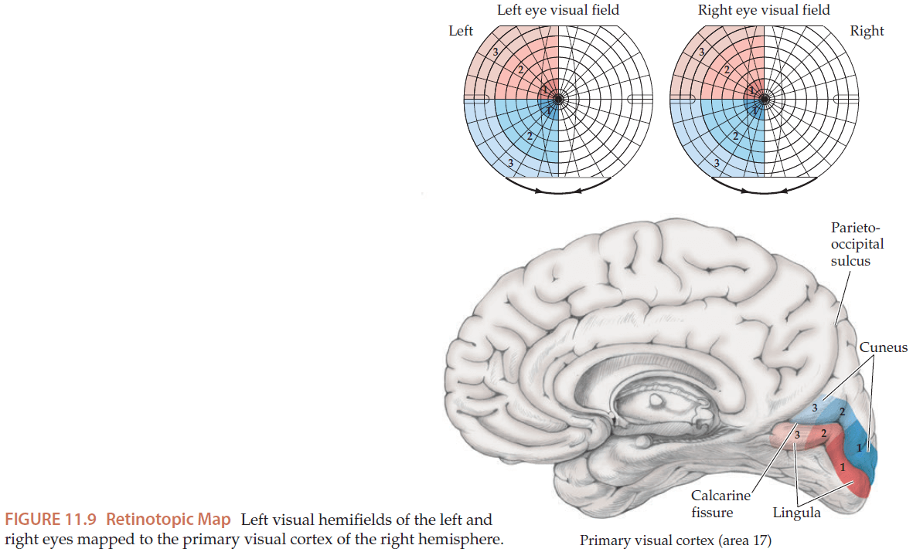
- Primary visual cortex = striate cortex
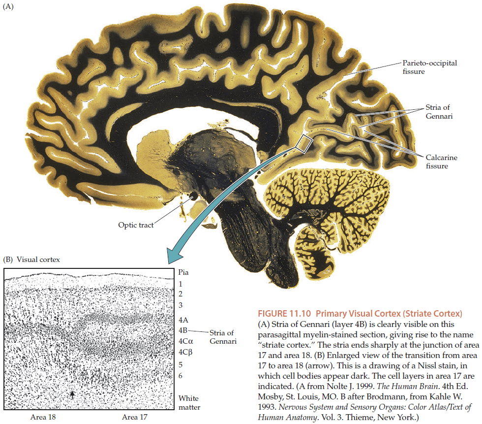
- Multiple channels of information undergo parallel processing in the visual system.
- The three best known channels
    - Motion
    - Form
    - Color
- Some of the information for these channels is already segregated at the level of retinal ganglion cells and LGN.
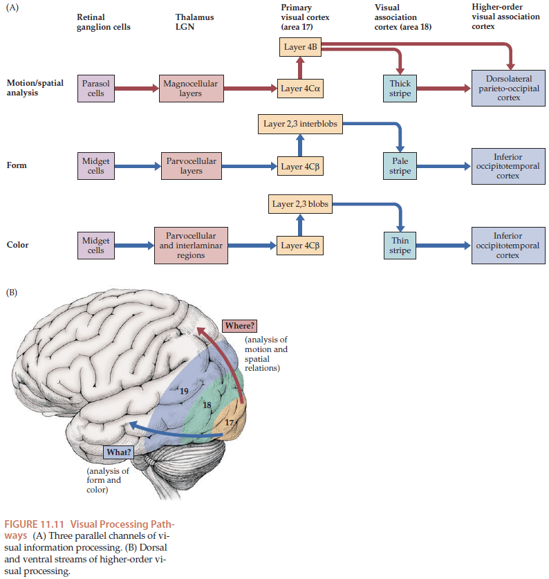
- All three channels project to different layers of the primary visual cortex
    - Motion → Layer 4C$$\alpha$$ → Thick stripe
    - Form → Layer 4C$$\beta$$ → Pale stripe
    - Color → Layer 4C$$\beta$$ → Thin stripe
- Dorsal pathway = Where (analysis of motion and spatial features), Ventral pathway = What (analysis of form and color)
- The visual cortex is organized into ocular dominance columns, where inputs from each eye terminate in different alternating bands of cortex of 1mm.
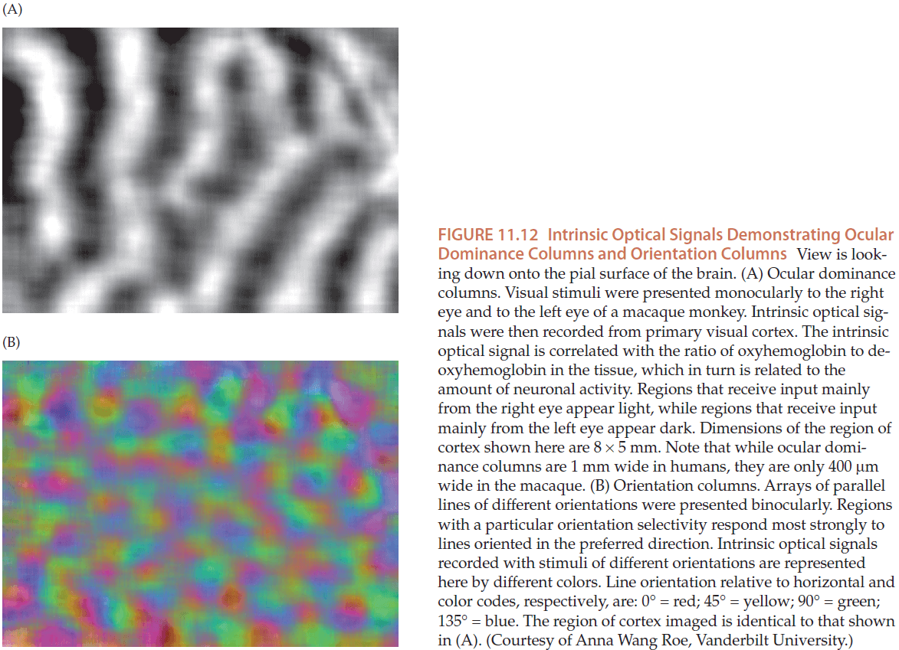
- This provides evidence that information from each eye remains segregated in the visual cortex.
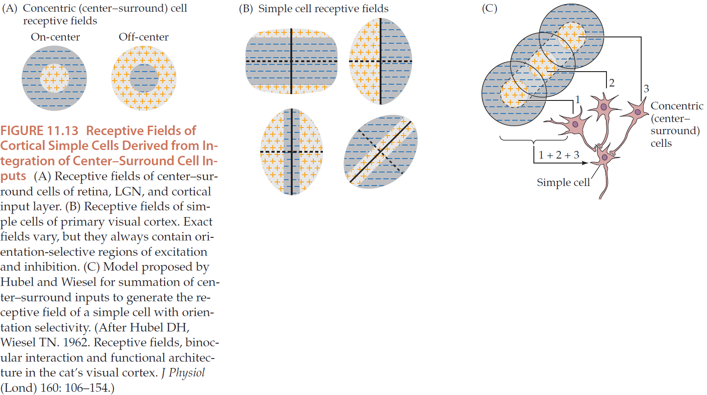
- *Simple cells*: cells selective to lines/edges that occur at a specific location and with a specific angular orientation in their receptive field.
- *Complex cells*: cells selective to lines/edges that occur at any location in their receptive field.
- The orientation selectivity of simple cells, complex cells, and other neurons remains the same within a vertical column of cortex.
- However, if we move across the cortex, the orientation selectivity varies continuously, so that a complete 180 degree sequence of orientation selectivity occurs over a a distance of 1mm.
- *Orientation columns*: vertical columns of cortex that have uniform orientation selectivity.
- Ocular dominance and orientation columns intersect, so a square of 1 x 1 mm cortex will contain a complete sequence of orientation for both eyes. This is also known as a hypercolumn.
- Additional hypercolumns exist for other functions such as direction selectivity, spatial frequency, and other features of visual perception.
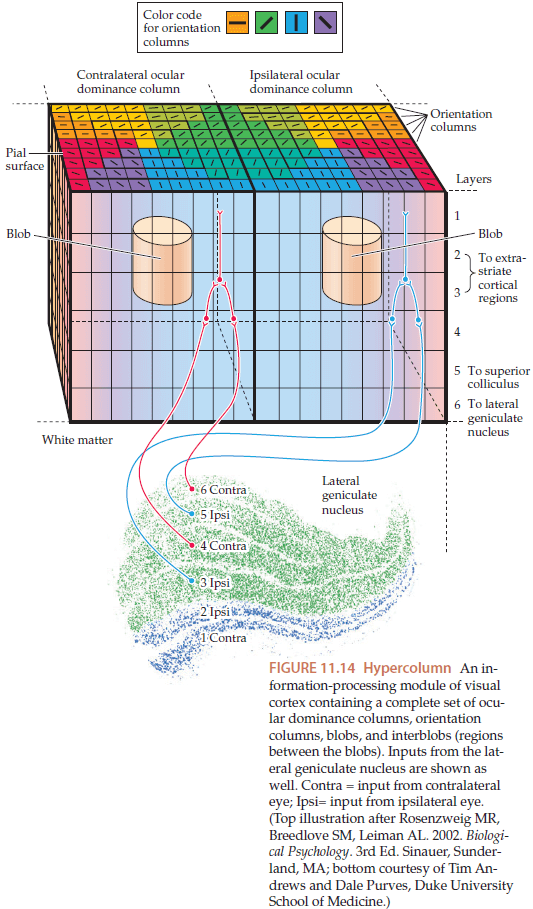

## Chapter 12: Brainstem I: Surface Anatomy and Cranial Nerves

- The brainstem isn't just a relay station for information between the brain and body. It also controls
    - Cranial nerves
    - Level of consciousness
    - Muscle tone
    - Posture
    - Cardiac
    - Respiratory
- If the brain were a city, then the brainstem would be both the Grand Central Station and Central Power Supply packaged into one location.
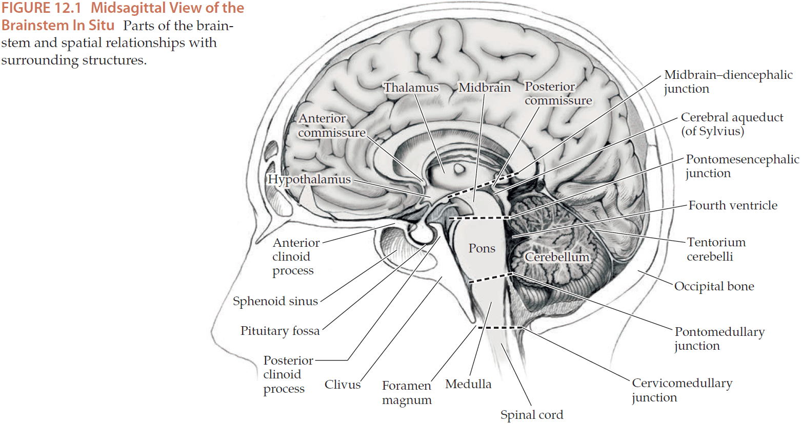
- The cranial nerves are more akin to the spinal nerves due to having both sensory and motor functions.
- Some cranial nerves are purely motor (CN III, IV, VI, XI, XII), some are purely sensory (CN I, II, VIII), and some are both motor and sensory (CN V, VII, IX, X).
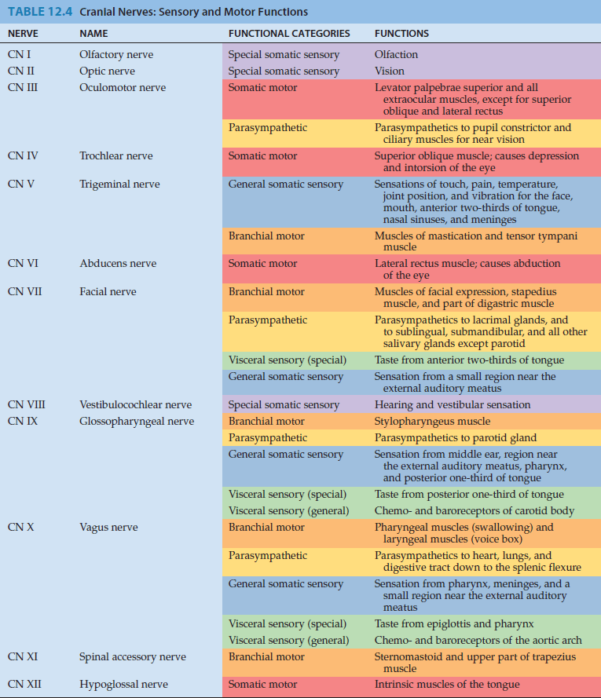
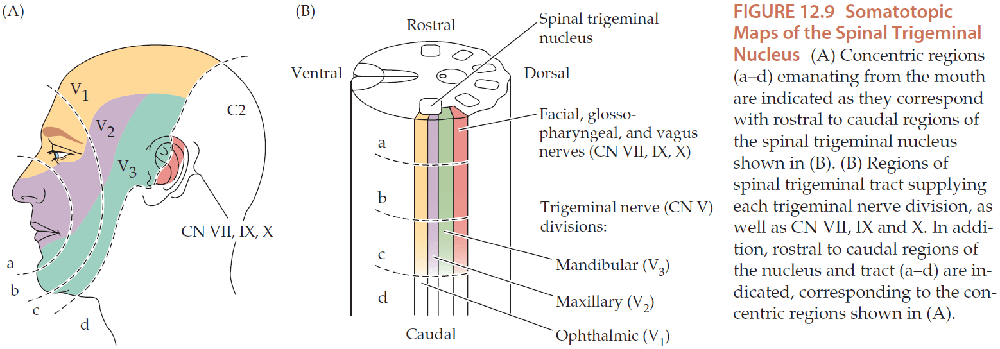
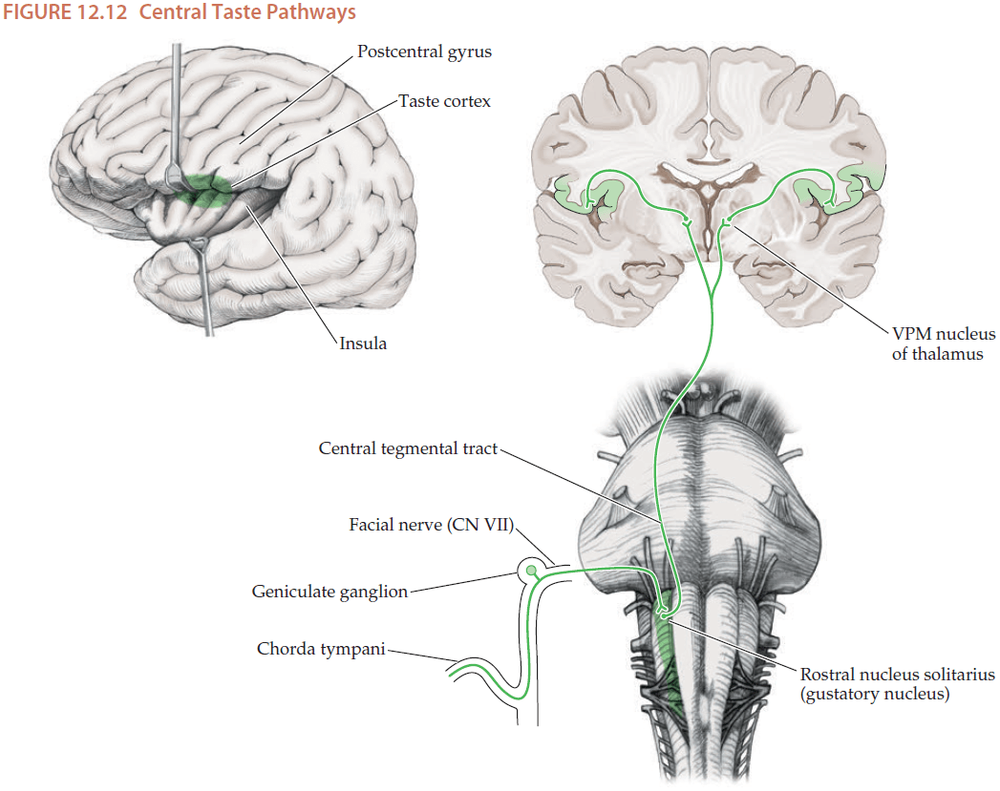
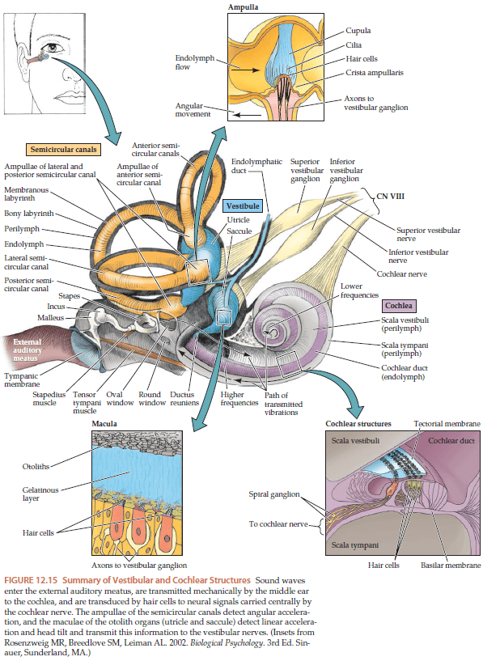
- Interestingly, the semicircular canals are organized in a way to detect angular acceleration around three orthogonal axes.
- Why are the canals organized like a 3D Cartesian plane? There are other ways of representing 3D space like using cylindrical coordinates or spherical coordinates. Perhaps the internal model is built to reflect the external world. Similar to Friston's [free energy principle](https://www.wikiwand.com/en/Free_energy_principle).
- Unilateral hearing loss isn't caused by lesions in the central nervous system because once the auditory pathways enter the brainstem, information immediately crosses bilaterally at multiple levels.

## Chapter 13: Brainstem II: Eye Movements and Pupillary Control

- Skimmed most of the chapter due to unnecessary detail.
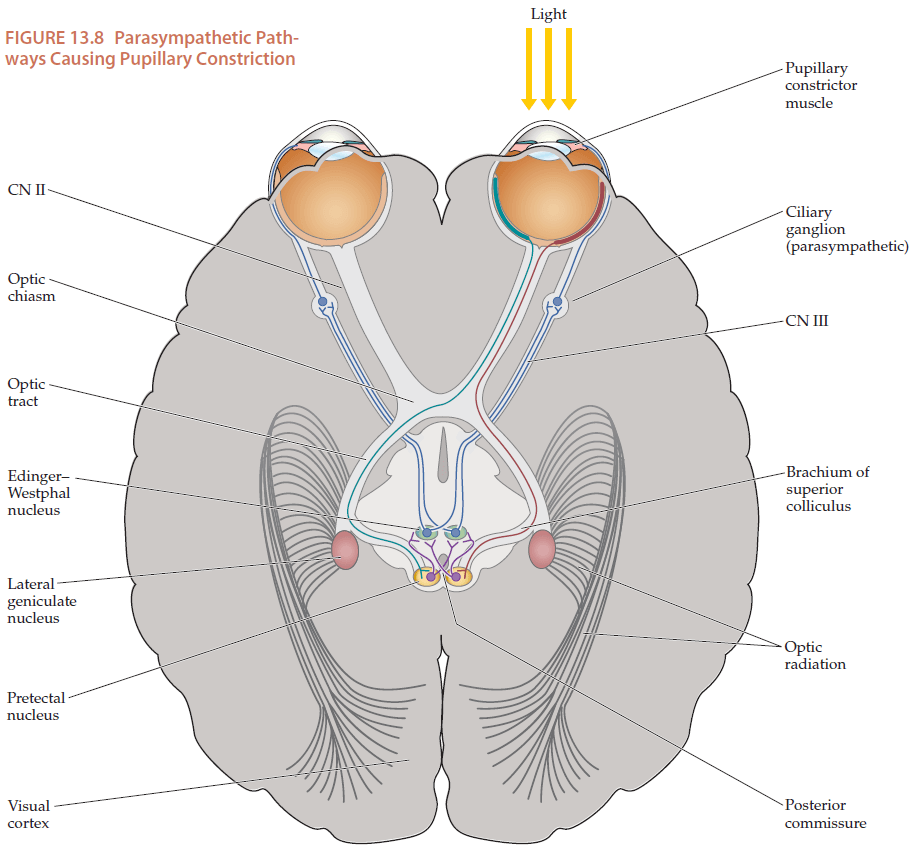

## Chapter 14: Brainstem III: Internal Structures and Vascular Supply

- Four main functional groups of the brainstem
    1. Cranial nerve nuclei and related structures
    2. Long tracts
    3. Cerebellar circuitry
    4. Reticular formation and related structures.
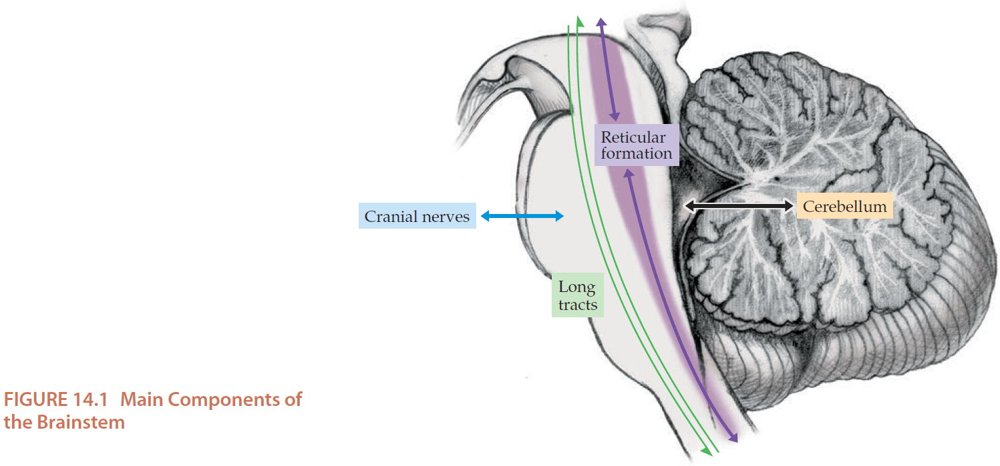
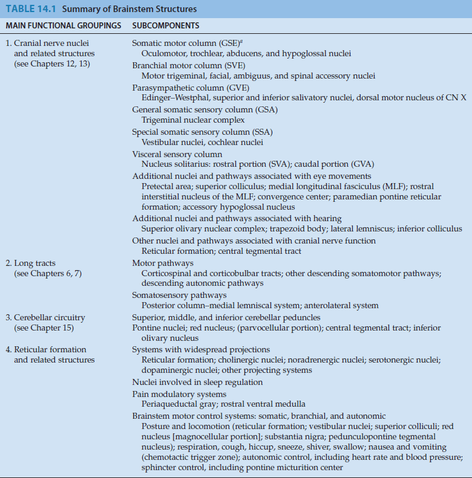
- Locked-in syndrome
    - Patients with no motor function but have sensation and cognition.
    - Usual cause is an infarct in the ventral pons affecting the bilateral corticospinal and corticobulbar tracts.
    - Spinal cord and cranial nerves receive no input from the cortex and the patient is unable to move.
    - However, the sensory pathways and the brainstem reticular activating systems are spared.
    - Isn't the same as coma.
    - Vertical eye movements are spared, since they depend on the tegmentum of the rostral midbrain, but horizontal eye movements aren't due to their dependence on pontine circuits.
    - Other causes of locked-in condition can result from severe disorders of motor neurons, muscles, or the neuromuscular junction.
- *Reticular formation*: a central core of nuclei that runs through the entire length of the brainstem.
- The rostral reticular formation functions to maintain an alert conscious state while the caudal reticular formation functions to carry out import motor, reflex, and autonomic functions.
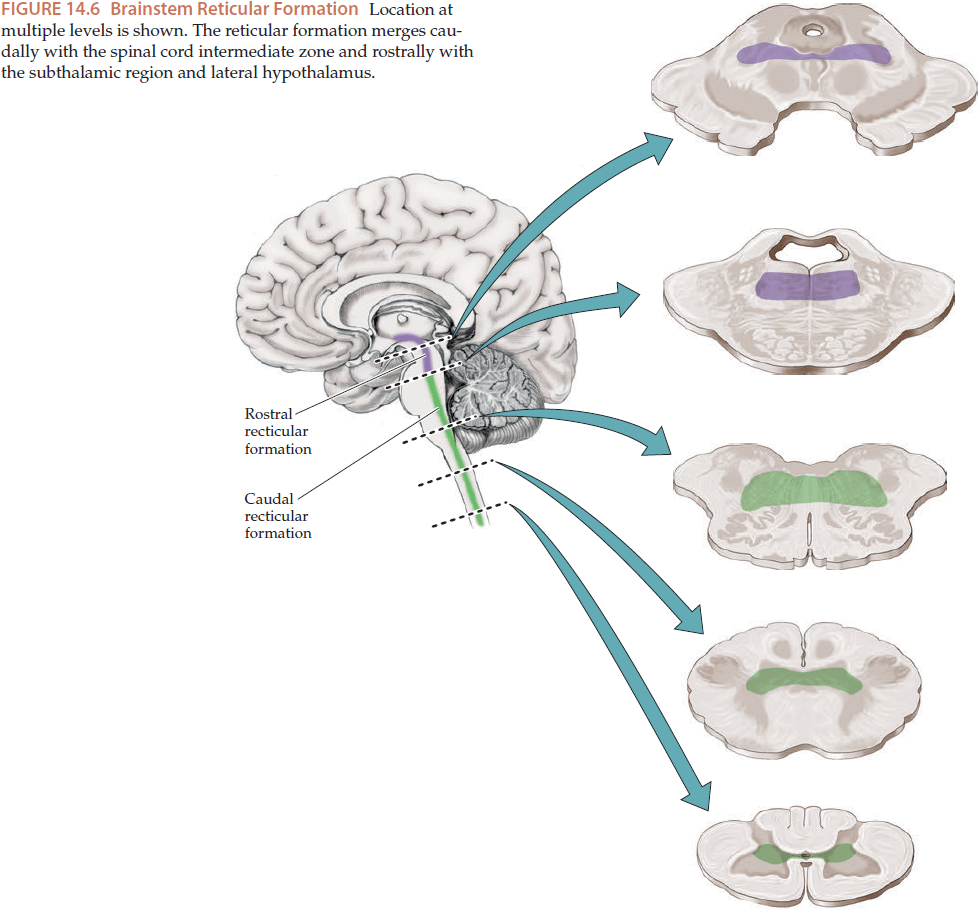
- The main functions of the brain and spinal cord are often described in terms of systems.
- E.g. Motor system, sensory system, limbic system.
- We propose a new system to describe functions related to consciousness, the consciousness system.
- The consciousness system is formed by the medial and lateral frontoparietal association cortex, arousal circuits in the upper brainstem, and diencephalon.
- Consciousness can be divided into two parts
    - *Content of consciousness*: systems mediating sensory, motor, memory, and emotional functions.
    - *Level of consciousness*: alertness, attention, awareness (AAA).
- Alertness depends on the normal functioning of the brainstem and diencephalic arousal circuits and the cortex.
- Attention depends on many of the circuits used by alertness along with with frontoparietal association cortex.
- Awareness depends on our ability to combine various higher-order forms of sensory, motor, emotional, and mnemonic information from separate regions of the brain into a unified and efficient summary of mental activity.
- This chapter will focus on alertness and leave attention and awareness for Chapter 19.
- Experiments on animals and humans found that lesions in the rostral brainstem reticular formation and medial diencephalon can cause coma, while stimulation of the same regions can lead to behavioral and electrographic arousal from deep anesthesia.
- Where in the brain can a lesion cause coma?
    - Upper brainstem reticular formation and related structures
    - Extensive bilateral regions of the cerebral cortex
- Lesions in other regions of the brainstem don't typically affect the level of consciousness.
- E.g. Lesions located more caudally in the brainstem, such as in the lower pons or medula, don't affect consciousness.
- E.g. Lesions of the ventral midbrain or pons that spare the reticular formation, such as in locked-in syndrome.
- However, bilateral lesions of the thalamus can cause coma.
- *Diffuse projection systems*: pathways that start from a single region to innervate many structures of the nervous system.
- Neurotransmitters have two general functions
    - *Neurotransmission*: mediate communication between neurons through fast excitatory/inhibitory postsynaptic potentials over the millisecond time range.
        - E.g. Glutamate and GABA.
    - *Neuromodulation*: involving signaling cascades that regulate synaptic transmission, neuronal growth, and other functions over a slower time range.
        - E.g. Acetylcholine, dopamine, norepinephrine, serotonin, and histamine.
- Note that lesions or pharmacological blockades of individual diffuse projection neurotransmitter systems don't result in coma.
- Thus, it seems likely that maintenance of the normal awake state doesn't depend on a single system, but rather depends on multiple anatomical and neurotransmitter systems acting in parallel.
- Skimming over an overview of each neurotransmitter system and the systems regulating sleep.
- Levels of consciousness
    - *Brain death*: an extreme and irreversible form of coma.
    - *Coma*: unarousable and monotonous EEG.
    - *Vegetative state*: coma but with sleep-wake cycles and reflexes.
    - *Minimally conscious state*: some minimal degree of responsiveness such as saying single words or reaching for and holding objects.
    - *Locked-in syndrome*: conscious but can't move except through vertical eye movements or blinks.
    - *Sleep*: arousable and undergoes cyclical variations of state.
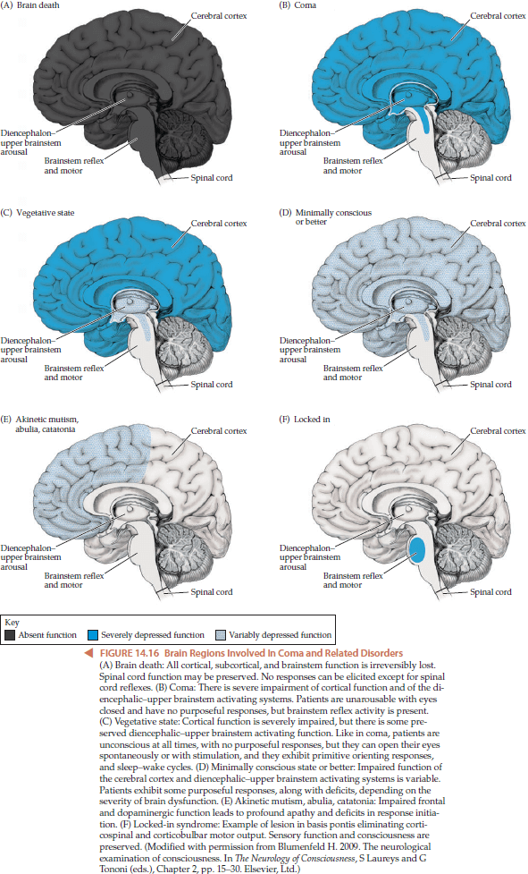
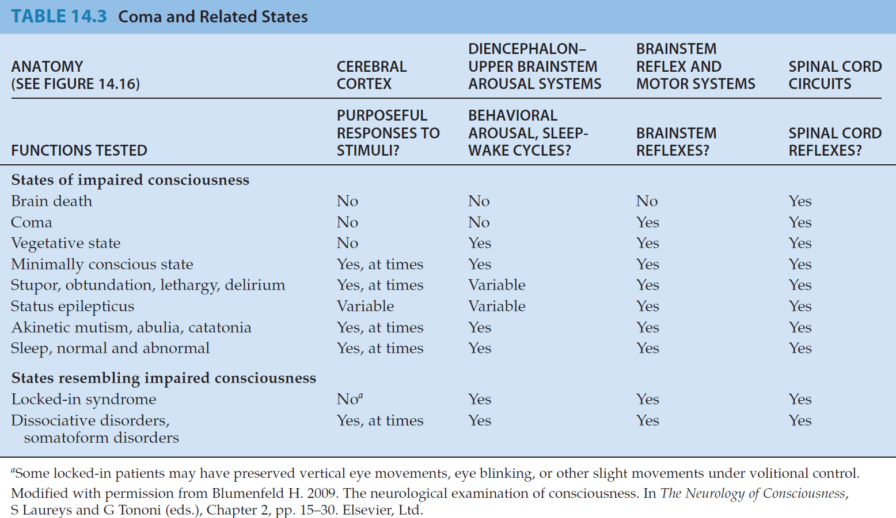
- Coma is generally not a permanent condition as within 2-4 weeks of onset, most patients either deteriorate or emerge into other states of less profoundly impaired arousal.
- Several states of profound apathy can resemble coma
    - *Akinetic mutism*: patient appears fully awake and can visually track people but don't respond to any commands.
    - *Abulia*: patients usually sit passively and may respond after a long delay.
- Automatic respiration is controlled by the medulla while voluntary respiration is controlled by the forebrain.

## Chapter 15: Cerebellum

- The cerebellum integrates information from the senses, brain, and spinal cord to smoothly coordinate ongoing movement and to participate in motor planning.
- The cerebellum has no direct connections to LMNs but instead exerts its influence through connections to motor systems of the cortex and the brainstem.
- The cerebellum is organized into three different regions, each with their own specialized functions.
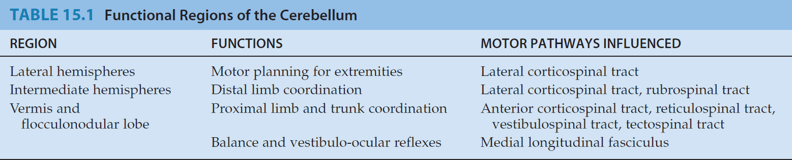
- Cerebellar lesions typically cause a characteristic type of irregular uncoordinated movement called ataxia.
- Cerebellar lesions cause deficits in coordination ipsilateral to the lesion.
- The cerebellum is attached to the back of the pons and the medulla by three white matter tracts. It's split left-right by the midline vermis and is split front-back by the primary fissure.
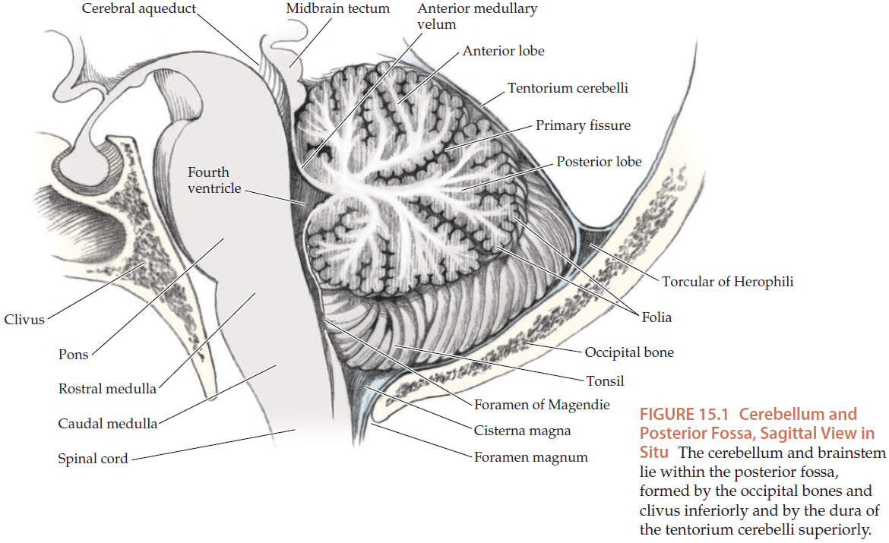
- The cerebellar cortex has three layers (from inside out)
    1. Granule cell layer
    2. Purkinje cell layer
    3. Molecular layer
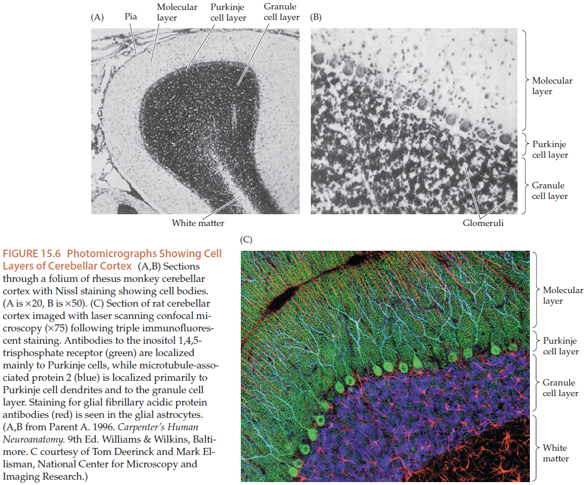
- There are two main kinds of synaptic input to the cerebellum
    - Mossy fibers → Granule cells → Molecular layer → Purkinje cells → Cerebellar white matter
    - Climbing fibers → Purkinje cells
- All output from the cerebellar cortex is carried by the axons of Purkinje cells into the cerebellar white matter.
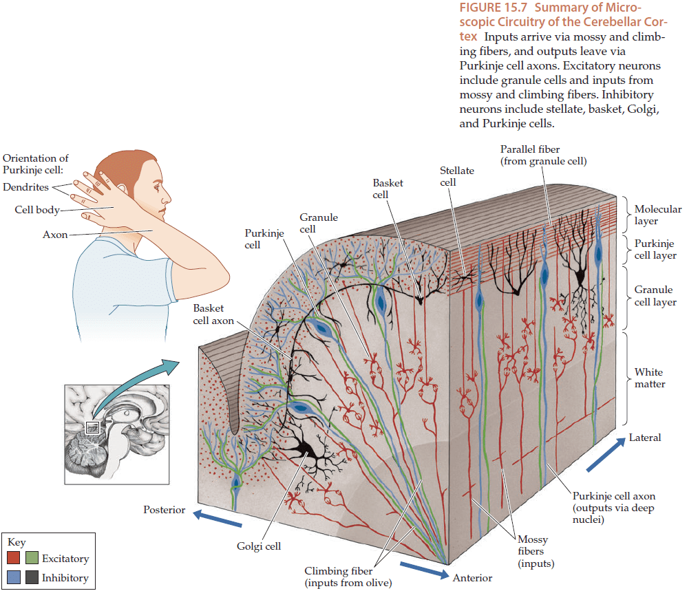
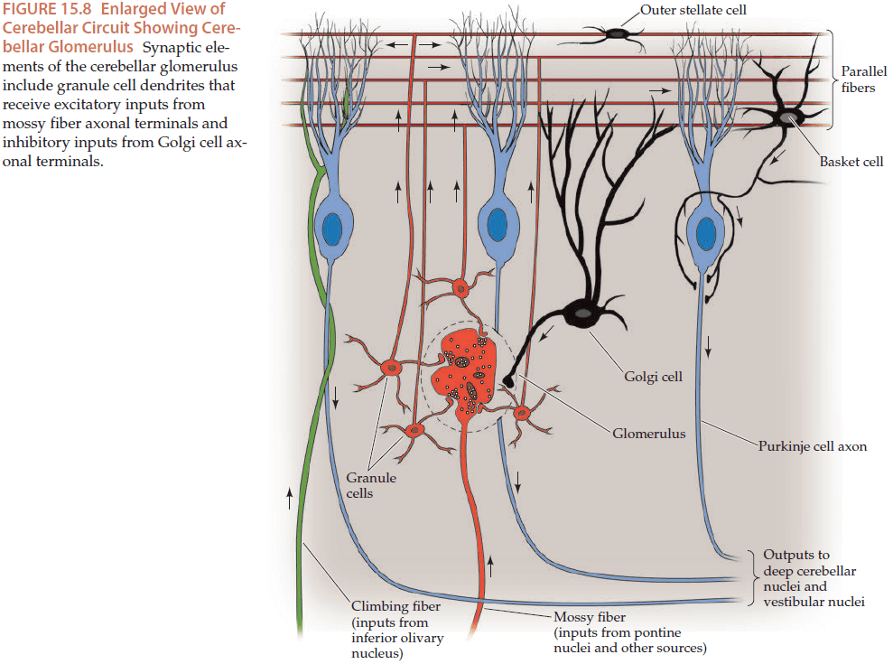
- A simple way to remember the excitatory and inhibitory connections of the cerebellar cortex is to remember that all axons projecting upwards are excitatory (mossy fibers, climbing fibers, granule cell parallel fibers), while all axons projecting downwards are inhibitory (Purkinje cells, stellate cells, basket cells, Golgi cells).
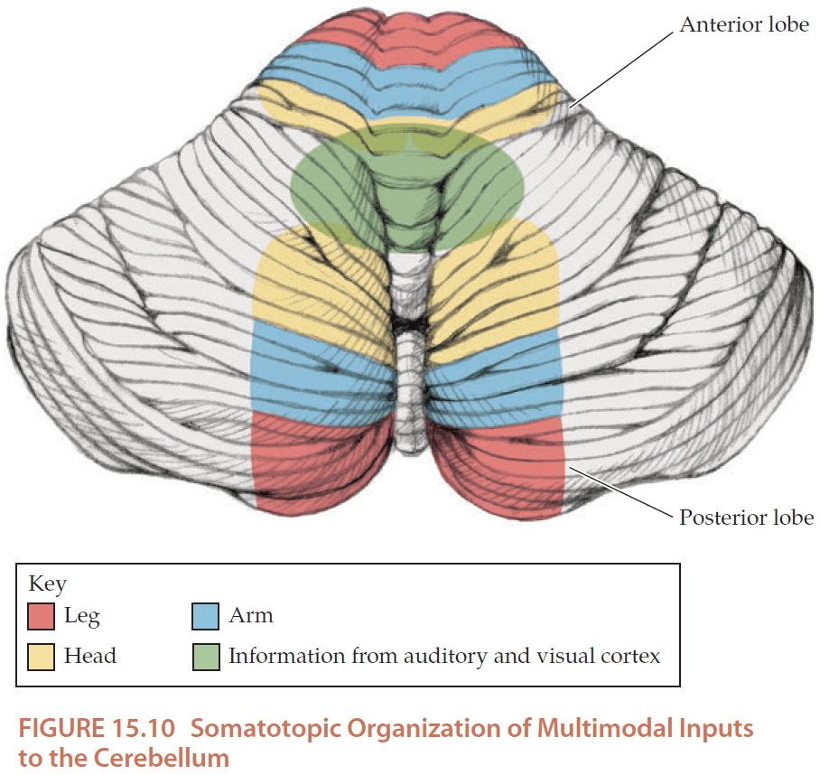

## Chapter 16: Basal Ganglia

- The basal ganglia are a collection of gray matter nuclei located deep within the white matter of the cerebral hemispheres.
- The main components of the basal ganglia are
    - Caudate nucleus
    - Putamen
    - Globus pallidus
    - Subthalamic nucleus
    - Substantia nigra

- The striatum refers to both the caudate and putamen.
- The main input to the basal ganglia comes from massive projections from the entire cerebral cortex to the striatum.
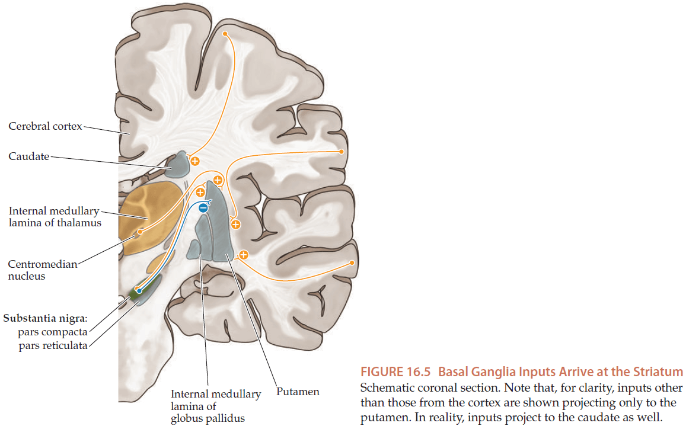

## Chapter 17: Pituitary and Hypothalamus

- The pituitary and hypothalamus are unique regions of the nervous system because they also communicate through hormones in addition to conventional synaptic transmission.
- They form a link between the neural and endocrine systems and the hypothalamus is the central regulator of homeostasis.
- The hypothalamus participates in
    - Homeostatic mechanisms
    - Endocrine
    - Autonomic control
    - Limbic mechanisms
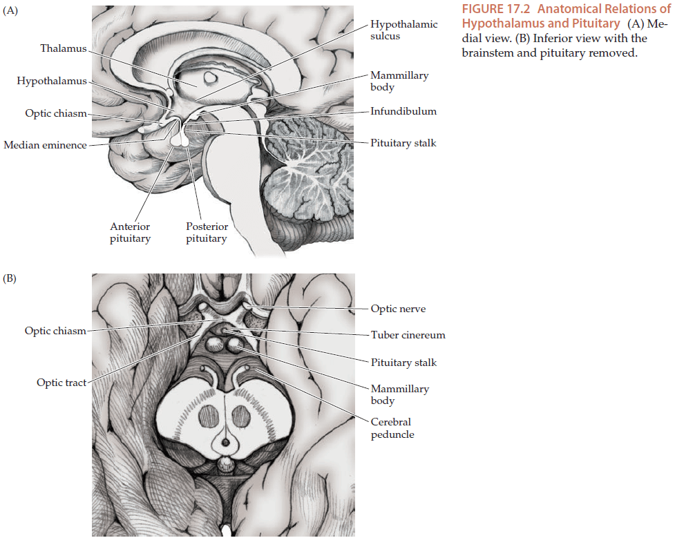
- Functions controlled by the hypothalamus
    - Circadian rhythm control
    - Insomnia/hypersomnia
    - Appetite
    - Thirst
    - Thermoregulation
    - Sexual desire
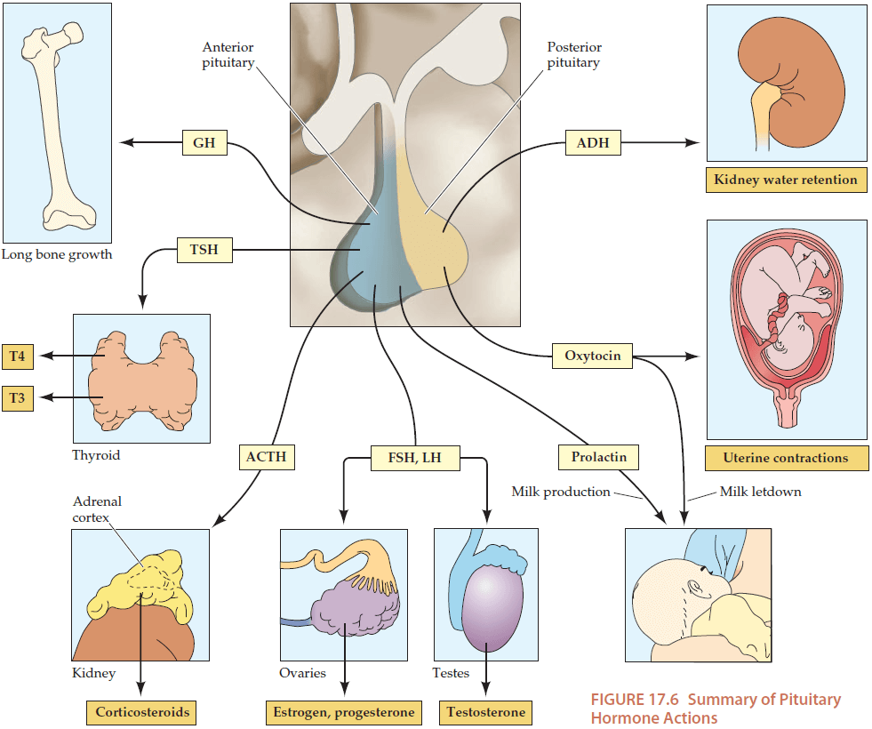

## Chapter 18: Limbic System: Homeostasis, Olfaction, Memory, and Emotion

- The limbic system regulates
    - Olfaction
    - Memory
    - Emotions and drives
    - Homeostasis
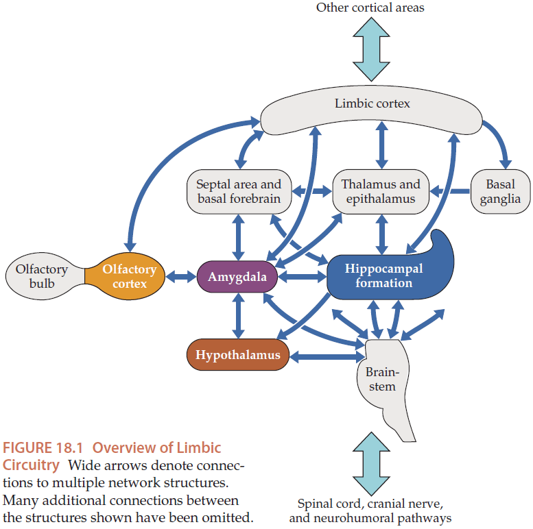
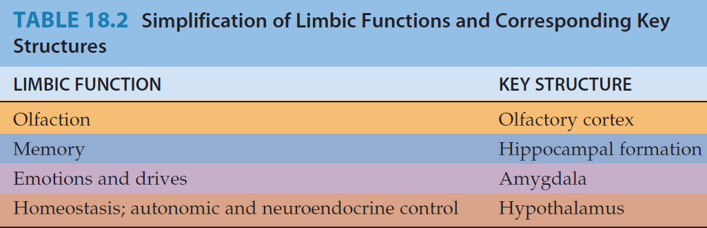
- The limbic cortex forms a ringlike limbic lobe around the edge of the cortical mantle.
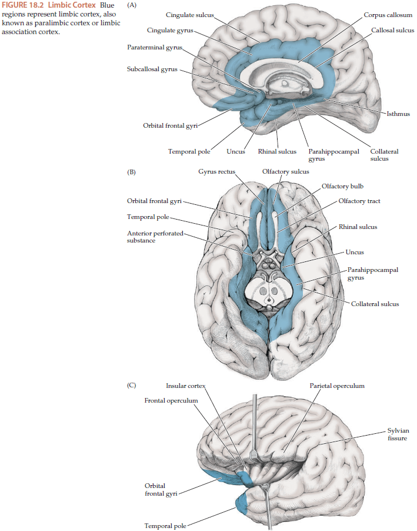
- Unlike the neocortex, the hippocampal formation only has three layers.
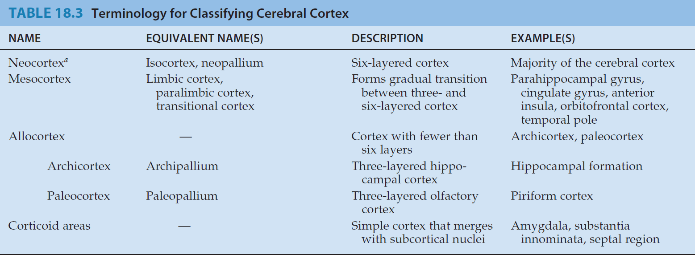
- The primary olfactory cortex is unique among sensory systems in that it receives direct input from secondary sensory neurons without going through the thalamus.
- There appears to be two main regions critical for memory formation
    - Medial temporal lobe (hippocampal formation and parahippocampal gyrus)
    - Medial diencephalic memory areas (thalamic medio-dorsal nucleus, anterior nucleus of the thalamus, mammillary bodies, and other diencephalic nuclei lining the third ventricle)
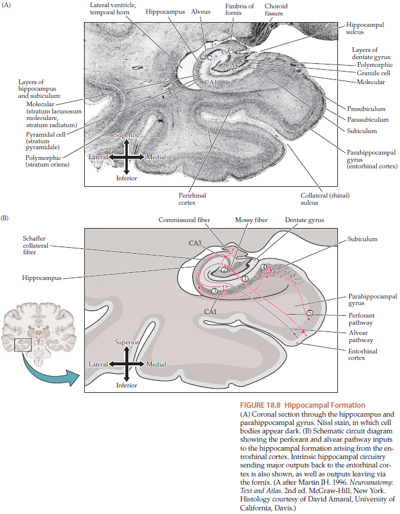
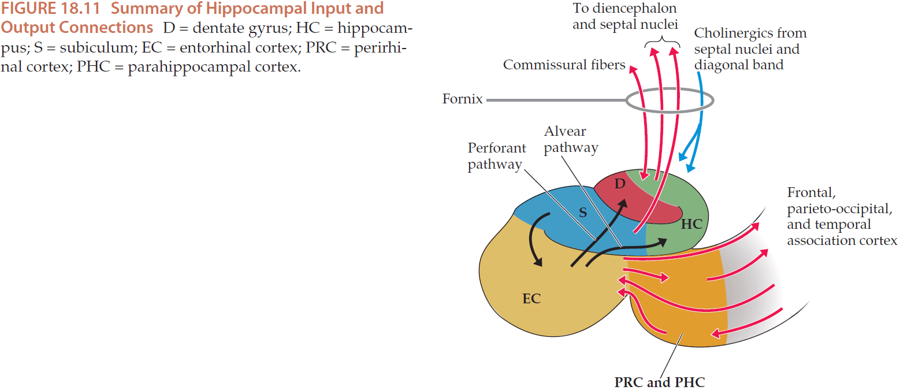
- The main input to the hippocampal formation is from the entorhinal cortex from association cortices in the frontal, parieto-occipital, and temporal lobes.
- The inputs are thought to contain higher-order information from multiple sensorimotor modalities that is further processed by the medial temporal structures for memory storage.
- The process itself is believed to not occur in the medial temporal structures, but rather back in the association and primary cortices that allow a particular memory to be reactivated.
- An important output pathway of the hippocampal formation, posssibly for the reactivation of a memory, is the projection from the subiculum to the entorhinal cortex, and from there back to the multimodal association cortex.
- The mechanisms by which medial temporal structures induce storage, consolidation, and retrieval of memories in the association cortex are not currently known.
- To summarize, the medial temporal lobe memory systems communicate with the association cortex mainly through bidirectional connections via the entorhinal cortex.
- Patient H.M. case
    - Removal of bilateral medial temporal lobes to control epileptic seizures.
    - Had severe memory problems with no other significant deficits.
    - Unable to learn new facts or recall new experiences.
    - Could immediately recite back a list of words but couldn't after 5 minutes.
    - Despite his profound memory deficit, his personality and general intelligence were normal.
    - Could learn tasks that didn't require conscious recall.
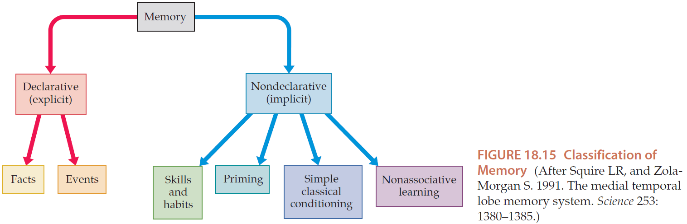
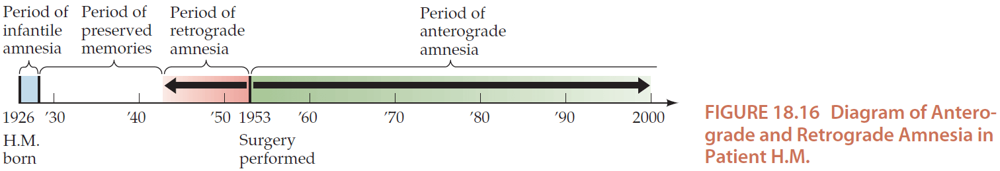
- Introduction of declarative and nondeclarative memory.
- Unilateral lesions usually don't cause severe memory loss.
- However, lesions of the dominant (left) medial temporal or diencephalic structures can cause some loss in verbal memory while lesions of the nondominant (right) hemisphere can cause deficits in visual-spatial memory.
- Unlike declarative memory, special lesions usually don't result in significant loss of nondeclarative memory. Learning of skills and of habits most likely involves plasticity in several regions such as the basal ganglia, cerebellum, and motor cortex.
- Specifically, the caudate nucleus appears to be important for habit learning.
- How are memories converted from short-term to long-term storage? There appears to be two classes of mechanisms.
    - A variety of different cellular mechanisms store information in the nervous system on different time scales.
    - A variety of different anatomical regions of the brain are important for storing memories at different times.
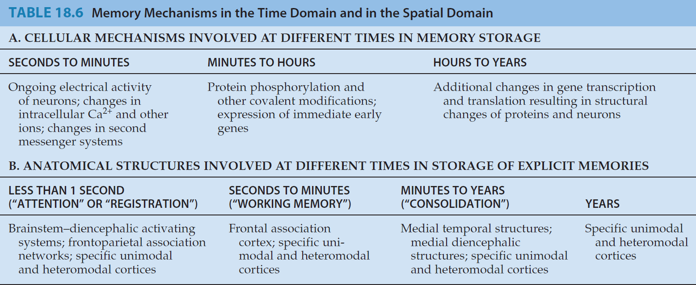
- Medial temporal and diencephalic structures appear to mediate a process by which declarative memories are gradually consolidated in the neocortex.
- From there, recalling declarative memories from specific regions of the neocortex doesn't require the medial temporal or medial diencephalic areas.
- It seems like recent memories, for a period of up to several years, depend on the normal functioning of the medial temporal and diencephalic structures, while more remote memories don't depend on them.
- Interestingly, in patient with reversible amnesia, they recover by remembering things forward as older memories are recovered before more recent ones.
- One common description of memory is a three-step process of encoding, storage, and retrieval.
- However, this has proven very difficult to demonstrate a selective deficit in human/animal studies in just one of these processes.
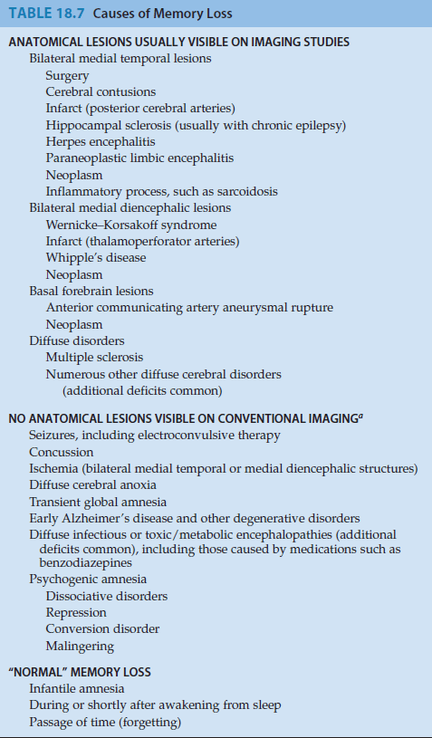
- On the evidence of lesions of the amygdala in humans and animals, the amygdala's purpose appears to be for attaching emotional significance to various stimuli perceived by the association cortex.
- The amygdala appears to be responsible for the emotions of fear, anxiety, and aggression, while the septal area appears to be responsible for pleasurable emotions.
- The reciprocal connections between the amygdala and hypothalamic and brainstem centers for autonomic control mediate the changes in heart rate, peristalsis, digestion, and sweating commonly seen with strong emotions.

## Chapter 19: Higher-Order Cerebral Function

- In humans, the majority of the brain's surface is made up of the association cortex.
- Functions of the association cortex
    - Higher-order sensory processing
    - Motor planning
    - Language processing and production
    - Visual-spatial orientation
    - Determining socially appropriate behavior
- The association cortex can be divided into two subcortices
    - Unimodal (modality-specific) association cortex
        - E.g. somatosensory, visual, auditory, motor.
    - Heteromodal (higher-order) association cortex

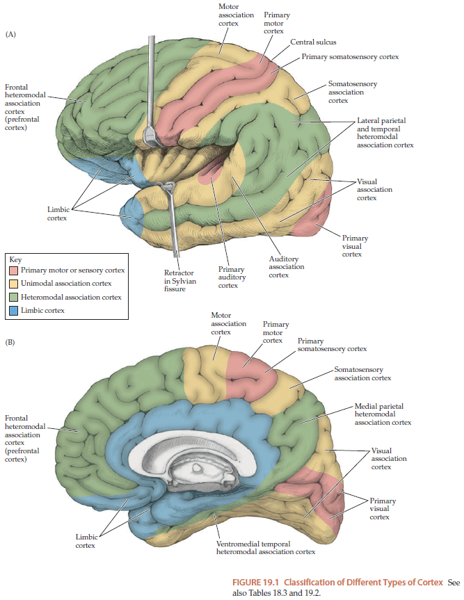
- Unimodal sensory association cortex receives its predominant input from primary sensory cortex of a specific sensory modality and performs higher-order sensory processing for that modality.
- In contrast, heteromodal association cortex has bidirectional connections with both motor and sensory association cortex of all modalities.
- This allows heteromodal association cortex to perform the highest-order mental functions that require the integration of abstract sensory, motor, emotional, and motivational information.
- The brain is both a collection of specialized areas and a network of those areas.
- Evidence for specialized areas comes from how focal brain lesions can cause specific deficits.
- However, since brain functions are mediated by networks involving multiple areas, false localization can sometimes occur.
- Another mistake of localization are disconnection syndromes where lesions in the white matter disconnection specialized areas, resulting in specific deficits even though no area was affected.
- E.g. Disconnecting the connection between the visual cortex and the language processing areas may cause a person to lose the ability to read.
- There is also evidence of hemispheric specialization where each hemisphere appears to perform different functions.
- E.g. Handedness where around 90% of the population is right-handed.
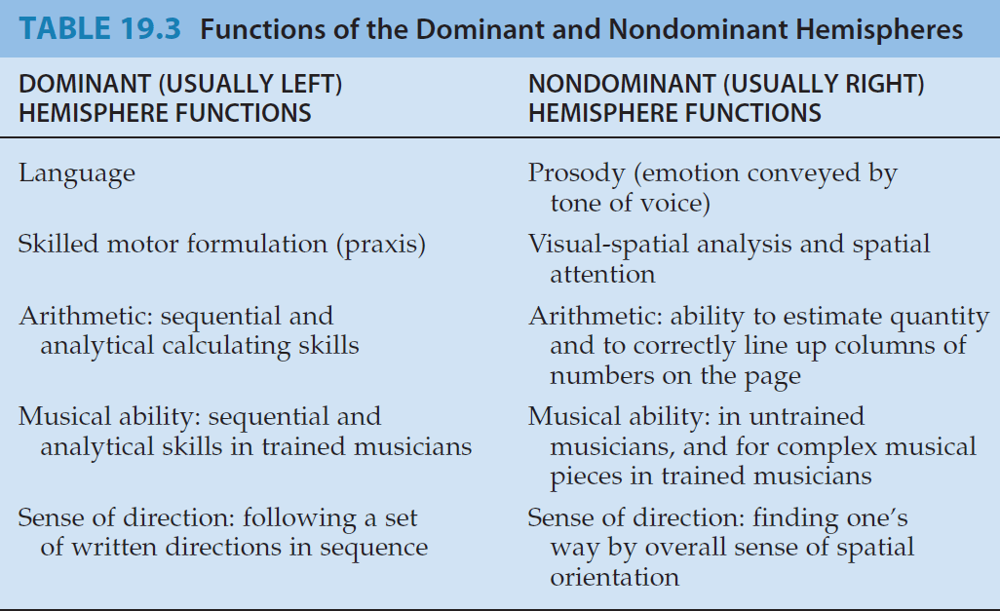
- Also, the brain mirrors the structure of the spinal cord in that more posterior regions are sensory while more anterior regions are motor.
- To simplify, neural representations for sounds are converted into words in Wernicke's area and neural representations for words are converted back into sounds in Broca's area.
- Wernicke's and Broca's areas communicate with each through through various pathways, the major pathway being the arcuate fasciculus.
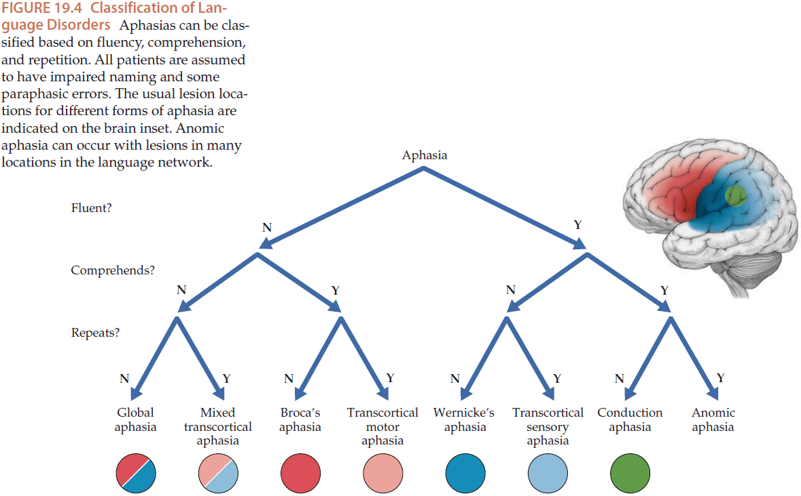
- *Disconnection syndromes*: cognitive dysfunction caused by damage to the pathways that connect cortical areas.
- The right hemisphere is more specialized for attention and spatial analysis while the left hemisphere is more specialized for language in most individuals.
- This results in a very slight net attention bias towards the left side in most individuals. This may explain why many languages are written from left to right.
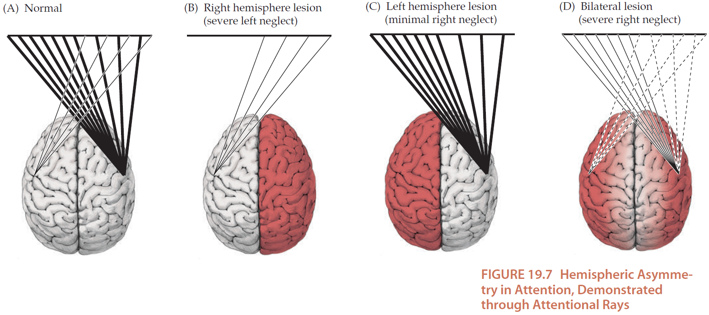
- The parietal association cortex is important for spatial analysis (location and movement of objects in space).
- *Anosognosia*: lack of awareness of the illness.
- Right hemisphere lesions may be associate with rare but interesting disorders such as
    - *Capgras syndrome*: belief that friends/family have been replaced by identical-looking imposters.
    - *Fregoli syndrome*: belief that different people are actually the same person who is in disguise.
    - *Reduplicative paramnesia*: belief that a person, place, or object exists as two identical copies.
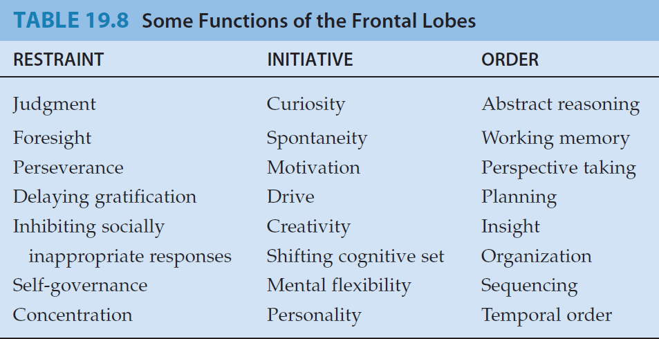
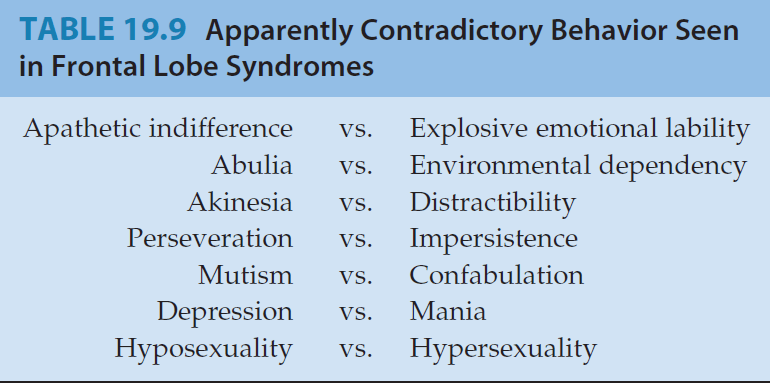
- The frontal lobes enable us to function as effective and socially appropriate people, but they're also the most mysterious, contradictory, and difficult to study brain regions.
- Frontal lobe function is best viewed as following three domains
    - *Restraint*: inhibition of inappropriate behaviors.
    - *Initiative*: motivation to pursue positive/productive activities.
    - *Order*: the capacity to correctly perform tasks and other cognitive operations.
- The frontal lobes are the largest region of the brain, making up nearly one-third of the cerebral cortex.
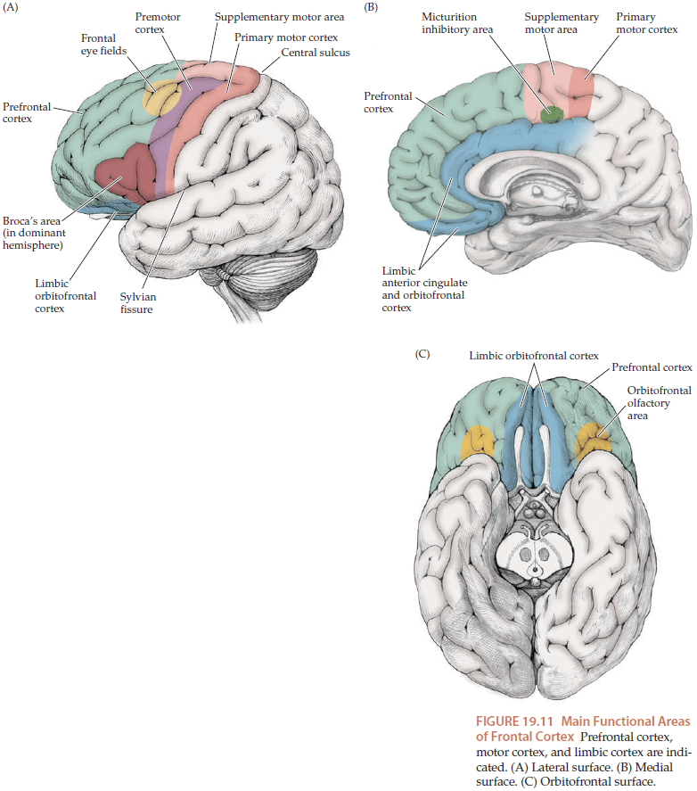
- Working memory activates the dorsolateral prefrontal cortex while selective attention activates the frontal lobes.
- Lesions of the frontal lobes are often perplexing as it results in contradictory features and are often subtle.
- Bilateral lesions usually produce more clinically obvious deficits than unilateral lesions.
- Moving on to the visual association cortex, one major question is how information from different cortical areas is combined to form the unified perception that we experience.
- E.g. Speaking to someone isn't fragmented into a perception of sounds, facial recognition, facial color, emotional impact, etc of the words spoken.
- This is also known as the binding problem.
- Bilateral lesions of the primary visual cortex causes cortical blindness and yet patients have anosognosia and are unaware of the deficit.
- Another interesting deficit is prosopagnosia or the inability to recognize specific individuals within a class.
- Prosopagnosia is often described as a human face recognition deficit but evidence shows that the inability to recognize also extends to farmers not recognizing their cows and bird-watches not recognizing specific birds.
- It's also important to distinguish that agnosia means normal perception stripped of its meaning, not that perception is impaired.
- Also known as associative agnosia where the association or match is impaired versus perception agnosia where impairments of the primary sensory modality contribute to difficulties with recognition.
- *Achromatopsia*: disorder of color perception due to cortical color blindness where patients can't name, point to, or match colors.
- Achromatopsia is not the same as color agnosia where color perception is intact in agnosia and the lesion locations differ.
- Achromatopsia is caused by lesions in bilateral inferior occipitotemporal cortex whereas color anomia is caused by lesions in the primary visual cortex.
- *Color agnosia*: disorder of color perception where patients can't name or point to colors, but can match them.
- Other visual disorders
    - *Alice in Wonderland syndrome*: the changing of object size.
    - *Visual reorientation*: environment appears tilted or inverted.
    - *Simultanagnosia*: deficit in visual-spatial binding where patients can't perceive parts of a visual scene as a whole.
    - *Optic ataxia*: inability to reach for a point in space under visual guidance.
    - *Ocular apraxia*: difficulty in voluntarily directing one's gaze towards objects in the peripheral visual through saccades.
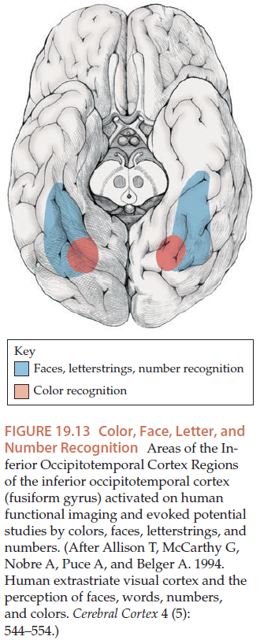
- Repeat of level of consciousness and the content of consciousness from Chapter 14.
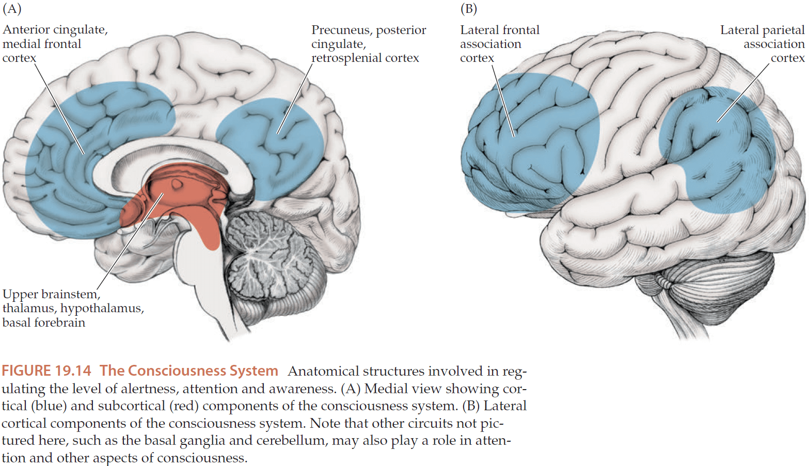
- Attention hasn't been clearly defined but we know of at least two major functions
    - *Selective attention*: attention over an object/entity in space.
        - E.g. Visual, tactile, auditory stimulus, color, shape, object, emotion, plan, concept.
    - *Sustained attention*: attention over a period of time.
        - E.g. Vigilance and concentration
- The two major functions can be thought of attention over space and time, over location and duration.
- Evidence of selective attention shows that attention is reflected in the activation of specific brain regions.
- E.g. Attention to somatosensory stimulus activates the corresponding somatotopic region of the somatosensory cortex and attention to a visual stimulus activates the corresponding retinotopic region of the visual cortex.
- Attention may be explained as a sort of signal enhancement versus noise suppression but this is still under investigation.
- Also, attention must be able to shift from one target to the next, which involves some sort of engage and disengagement mechanism.
- A prerequisite for attention is an awake and alert state. This means that systems that contribute to an awake and alert state must be active before attention can come online.
- One of the great mysteries in neuroscience is the mechanism for our subjective and personal experience of awareness.
- *Conscious awareness*: our ability to combine various forms of sensory, motor, and emotional information into an efficient summary of mental activity that can be remembered at a later time.
- One way of teasing out the systems involved in conscious awareness is to look into declarative vs nondeclarative memory.
- Also, the case of hemineglect syndrome, where inattention causes loss of awareness, suggests that the same mechanisms for attention plays an important role in awareness as well.
- This leads some people to believe that there isn't a distinction between attention and awareness.
- *Digit span test*: asking a patient to recite back a random series of numbers.
- There's also the reverse digit span test where patients must recite numbers in the reverse order.
- Normally, people can remember five to seven digits in the forward version and four or more in the reverse test. Why is there a difference?

## Epilogue: A Simple Working Model of the Mind

- Where is the mind?
    - The nervous system seems to be the most important.
    - We know that changes to the brain cause changes to the mind.
- Why are there lingering doubts about the physical basis of the mind?
- Functions of the mind seem to be unexplained but we are making progress.
- We can define functions of the mind to include
    - Memory
    - Language
    - Planning
    - Attention
- We can start tackling the problem of the mind by starting with its inputs and outputs.
- Information processing in sensory and motor systems is hierarchically organized.
- E.g. Receptor cell → Primary somatosensory neuron → Brainstem → Thalamus → Primary somatosensory cortex → Unimodal association cortex → Heteromodal association cortex.
- However, information flow in the hierarchy isn't strictly linear as direct connections exist between sensory and motor systems.
- E.g. Reflexes
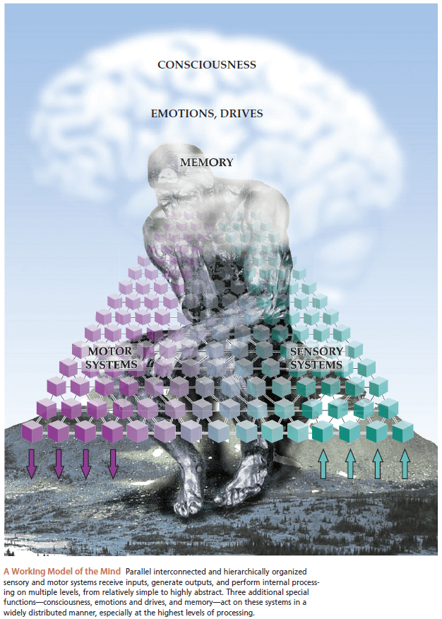
