<blockquote class="blockquote">
  
If our brains were simple enough for us to understand them, we'd be so simple that we couldn't.

  
Ian Stewart

</blockquote>

# Part I: Foundations

## Chapter 1: Neuroscience: Past, Present, and Future

- *Neuroscience*: the study of the nervous system.
- There’s a correlation between structure and function. Differences in appearance predict differences in function.
- The mind has a physical basis which is the brain.
- *Gyri*: the bumps on the brain.
- *Sulci*: the grooves on the brain.
- *Central nervous system*: the brain and spine.
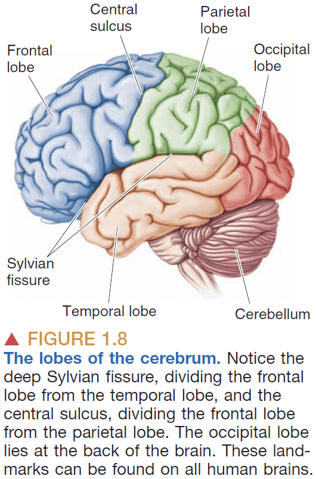
- *Cerebrum*: the front part of the brain.
- *Cerebellum*: the back part of the brain that looks like a mini-cerebrum.
- *Peripheral nervous system*: the nerves in the body.

- Nerves as wires
    - Transmission is strictly one-way due to the way synapses are organized.
    - Discovered by noticing that nerves were anatomically separate when they enter or exit the spine.
- Localization of specific functions to different parts of the brain
    - *Experimental ablation*: systematically destroying parts of the brain to determine their function.
    - There’s a clear division of function in the cerebrum.
    - E.g. Broca’s area for speech.
- The evolution of nervous systems
    - Behavior reflects the activity of the nervous system so we can infer that similar behaviors across species reflects similar brain mechanisms.
    - E.g. Animals that use eyes have similar neural mechanisms for sight.
    - This lets us use animal models to learn more about our own brains.
    - E.g. Using mice to test new drugs.
- The neuron as the basic functional unit of the brain
    - Are nerves like blood vessel in that they’re continuous?
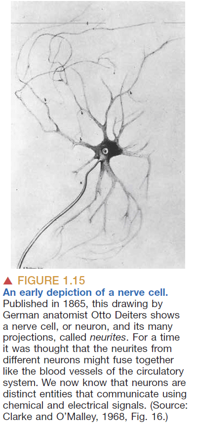
    - No, they’re discrete. Perhaps like why we have computer connections (E.g. USB) so that they’re easily interchangeable.
- Levels of analysis in neuroscience
    - *Molecular*: emphasis on different molecules and their roles.
        - E.g. Sodium, potassium, water.
    - *Cellular*: emphasis on neurons and their interactions.
        - E.g. Neurons, Hebb’s rule.
    - *Systems*: emphasis on systems and neural circuits.
        - E.g. Visual system, motor system.
    - *Behavioral*: emphasis on how different systems work together.
        - E.g. Effects of drugs, dreams.
    - *Cognitive*: emphasis on higher levels of human mental activity.
        - E.g. Self-awareness, imagination, language.
- Neuroscience research can be divided into three types
    - *Clinical*: applying neuroscience to help patients.
    - *Experimental*: performing experiments to gather data.
    - *Theoretical*: creating theories to model observed data and to predict unobserved data.
- The scientific process
    - *Observation*: experiments to test a hypothesis.
    - *Replication*: repeating the same experiment on different subjects.
    - *Interpretation*: explaining why the outcome results from the experiment.
    - *Verification*: ensuring an interpretation is correct.
- *Animal model*: using animals as a model to study neuroscience.
- As a rule, the more basic the process under investigation, the more evolutionary distinct the subject can be from humans.
- E.g. Use squids to study nerve conduction but we can’t use them to study behaviors.
- Many important insights can be gained from behavior because the brain’s activity is reflected in behavior.
- Behavioral measurements inform us of the capabilities and limitations of brain function.

## Chapter 2: Neurons and Glia

- *Neuron*: cells that sense changes in the environment, communicate these changes, and command the body’s response.
- *Glia/Glial cells*: cells that insulate, support, and nourish neurons.
- There's approximately 85 billion neuron and glial cells in the brain.
- *Nissl stain*: a class of dyes that stains a cell’s nuclei and surrounding tissue.

- Nissl stains are used to
    - Distinguish neurons from glia.
    - Study the arrangement of cells (cytoarchitecture).
- *Golgi stain*: a solution that fully stains a small percentage of neurons.

- Golgi stains are used to see isolated neurons in their entirety.
- Basic parts of a neuron
    - *Cell body/soma*: holds the cell nucleus and organelles.
    - *Axon*: carries the output from the neuron and acts like the transmitter.
    - *Dendrite*: carries the input to the neuron and acts like the antenna.
- Neurons usually have a single axon and multiple dendrites.

- *Neuron doctrine*: that neurons are cells and that they communicate by contact, not continuity.
- E.g. Continuous communication is like talking directly to someone on the phone while contact communication is more like the game of telephone where each person relays the message.
- This next part goes into detail about the soma. Some of it is relevant which I’ve copied below.
    - *Cytosol*: the fluid inside the soma.
    - DNA make up genes which make up chromosomes.
    - *Gene expression*: DNA → (transcription) → mRNA → (translation) → Protein
    - ATP is the energy currency of the cell.
    - The function of neurons cannot be understood without understanding the structure and function of its membrane and its associated proteins.
- Axon details
    - The axon is highly specialized to transfer signals over distances.
    - No rough ER and free ribosomes extend into the axon.
    - The protein composition of the axon membrane is different from the soma membrane.
    - *Axon collaterals*: the axon branches.
    - *Recurrent collaterals*: an axon collateral that returns to the same cell.
    - The nerve impulse depends on the axon’s diameter. The thicker the axon, the faster the impulse because more ions can flow through the bottleneck with less resistance. Think of it like traffic, more lanes means you get to your destination faster.
    - *Axon terminal*: the end site of the axon.
- Synapse details
    - *Synapse*: a specialized junction where one neuron contacts and communicates with another neuron.
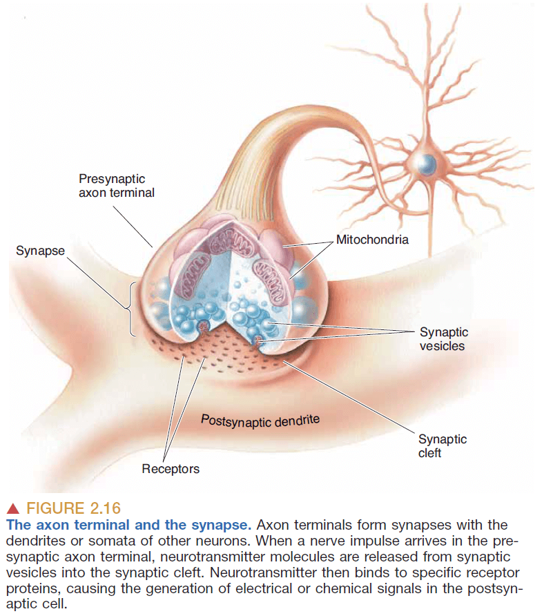
    - *Synaptic vesicle*: small bubbles of membrane that holds neurotransmitters.
    - The synapse has two sides, presynaptic and postsynaptic, to denote the flow of information.
        - *Presynaptic*: the side of the synapse that sends the action potential.
        - *Postsynaptic*: the side of the synapse that receives the action potential.  
    - The presynaptic side is generally an axon while the postsynaptic side is generally a dendrite/soma.
    - *Synaptic cleft*: the space between presynaptic and postsynaptic membranes.
    - *Synaptic transmission*: the transfer of information at the synapse.
    - Presynaptic neuron → (Electrical impulse) → Synapse → Neurotransmitter → (Chemical signal) → Postsynaptic neuron → (Electrical impulse)
    - *Neurotransmitter*: the chemical signals used in the synapse.
    - This electrical-to-chemical-to-electrical transformation of information makes possible many of the brain’s computational abilities.
    - Modification of this process is involved in memory and learning, and synaptic transmission dysfunction accounts for certain mental disorders.
    - [Why synapses exist and what they're used for](https://www.quora.com/What-are-synapses-and-why-are-they-important)
        - *Computation*: used to weigh the impact of different inputs. Examples such as integration, summation, and filtering.
        - *Signals*: ensure that signals only flow in one direction because only the presynaptic side has vesicles.
        - *Filtering*: places an upper limit on the frequency of depolarization.
- Dendrite details
    - *Receptors*: protein molecules that detect neurotransmitters in the synaptic cleft.

    - *Dendritic spines*: spines that poke out of dendrites.
- *Multipolar*: more than three neurites.
- Most neurons in the brain are multipolar.

- Dendritic tree classes
    - *Stellate cells*: star-shaped.
    - *Pyramidal cells*: pyramid-shaped neurons that have a large apical dendrite that extends towards the outside of the brain and an axon that projects in the opposite direction.
- Connection classes
    - *Sensory*: connects sensory surfaces to neurons.
    - *Motor*: connects muscles to neurons.
    - *Inter*: connects neurons to neurons.
- Glia cells
    - *Astrocytes*: cells that fill the spaces between neurons.
    - *Oligodendroglial/Schwann cells*: cells that insulate axons and form the myelin sheath.
    - *Node of Ranvier*: the space between myelin sheaths that exposes the neuronal membrane.

## Chapter 3: The Neuronal Membrane at Rest

- Neurons carry an electrical charge via ions instead of free electrons like in copper wires, thus neurons are less conductive than wires.
- The analogy is similar to a garden hose with many holes that leaks water out.
- *Resting membrane potential*: the resting difference in electrical charge across the membrane. Usually -65 mV.
- Three factors for creating the resting membrane potential
    - Salty fluids on both sides of the membrane.
    - The phospholipid membrane
    - Proteins embedded into the membrane.
- The salty fluid is mostly composed of water and ions
    - Water ($$H_{2}O$$)
    - Sodium ($$Na^{+}$$)
    - Potassium ($$K^{+}$$)
    - Calcium ($$Ca^{2+}$$)
    - Chloride ($$Cl^{-}$$)
- The proteins in the membrane
    - *Ion channels*: protein channels that have ion selectivity.
    - *Ion selectivity*: only allowing certain ions to permeate.
    - E.g. Potassium channels are selectively permeable to potassium ions.
    - Ion channels are also gated meaning they can be opened and closed.
    - Understanding ion channels in the neuronal membrane is key to understanding cellular neurophysiology.
    - *Ion pumps*: enzymes that use energy to transport certain ions across the membrane.
- Ionic movements through channels are influenced by diffusion and electricity.
- *Diffusion*: the movement of ions from regions of high concentration to regions of low concentration.
- Flowing down a concentration gradient means to move towards equilibrium.
- *Electrical current*: the movement of electrical charge.
- Two factors determine how much current flows
    - *Voltage*: the force exerted on a charged particle.
    - *Conductance*: how easy it is for a charged particle to move.
    - Resistance expresses the same property of conductance except in the opposite way.
    - *Ohm’s Law*: $$V=IR$$.
- Moving an ion across the membrane requires
    - Channels that are permeable to ions.
    - A potential difference to push those ions.
- *Membrane potential*: the voltage across the neuronal membrane.
- The resting membrane potential is about -65 mV and is maintained when the neuron isn’t generating any action potentials.

- Four important points about the membrane potential
    - Large changes in membrane potential are caused by minuscule changes in ionic concentrations.
        - E.g. For a membrane potential of -80 mV , only a drop of 0.00001 mM of potassium is needed.
    - The net difference in electrical charge occurs at the inside and outside surfaces of the membrane.
        - Since the membrane can store electrical charge, it has electrical capacitance.
    - Ions are driven across the membrane at a rate proportional to the difference between the membrane potential and the equilibrium potential.
    - If the concentration difference across the membrane is known for an ion, the equilibrium potential can be calculated for that ion.
- The Nernst equation can be used to calculate the equilibrium potential from the ionic concentrations.
- Potassium is more concentrated on the inside, and sodium and calcium are more concentrated on the outside.
- This concentration gradient is due to sodium-potassium pumps and calcium pumps.
- *Sodium-potassium pump*: exchanges internal sodium for external potassium.
- *Calcium pump*: moves internal calcium out of the cytosol.
- Ion pumps are necessary to maintain the resting membrane potential.
- Since the neuronal membrane is mostly permeable to potassium, it’s membrane potential is closer to -80 mV.
- Increasing extracellular potassium depolarizes neurons.
- *Depolarization*: increasing the voltage of the neuronal membrane to become more positive (and closer to zero).

## Chapter 4: The Action Potential

- The inside of the neuronal membrane at rest is negatively charged compared to the outside.
- The resting potential is -65 mV.
- *Action potential (AP)*: a brief and rapid reversal of the membrane potential. Also known as a spike, nerve impulse, or discharge.
- E.g. The potential starts at -65 mV, goes up through 0 mV till 40 mV, then drops back down to -70 mV, then goes slightly up back to the resting potential of -65 mV.
- APs are of fixed size and duration and don’t diminish over distance.
- Information is encoded in the frequency of APs of individual neurons and in the distribution and number of neurons firing APs.
- This type of code is similar to Morse code in that information is encoded in a pattern of electrical impulses.
- *Excitable membrane*: membranes that can generate APs.

- Parts of an AP
    - *Rising phase*: the rapid depolarization of the membrane until 40 mV.
    - *Overshoot*: when the inside of the neuron is positively charged.
    - *Falling phase*: the rapid repolarization of the membrane.
    - *Undershoot*: when the membrane is more negative than the resting potential.
- APs last about 2 milliseconds.
- *Threshold*: the critical level of depolarization that must be reached to trigger an AP.
- APs are caused by depolarization of the membrane beyond threshold.
- Because APs aren’t generated unless the potential is high enough, APs are said to be "all-or-none."
- If continuous current is passed into a neuron, then the neuron generates a sequence of APs.

- The rate of AP generation depends on the magnitude of the current.
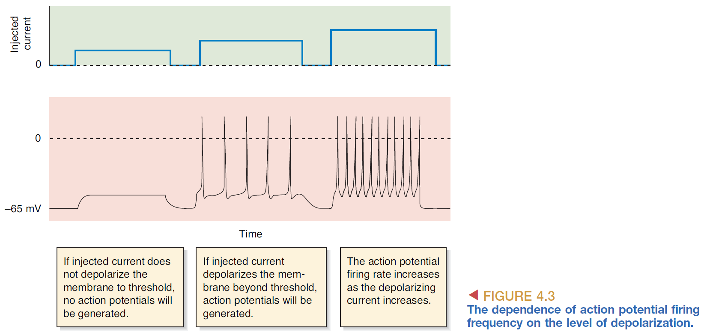
- So the firing frequency of APs reflects the strength of the depolarizing current.
- The maximum firing frequency of a neuron which is about 1000 Hz.
- *Absolute refractory period*: the time between AP generation when the neuron cannot generate an AP.
- *Relative refractory period*: the time after the absolute refractory period where the threshold is elevated above normal meaning a higher depolarizing current is needed to cause an AP.
- Depolarization of the cell during the action potential is caused by the influx of sodium ions across the membrane, and repolarization is caused by the efflux of potassium ions.
- By switching the dominant membrane permeability from potassium ions to sodium ions, we can rapidly reverse the membrane potential.
- The rising phase of the AP is explained by an inward sodium current and the falling phase is explained by an outward potassium current.

- However, how do the sodium channels know when to open?
- It’s due to another type of protein channel that opens/closes depending on the voltage.
- *Voltage-gated sodium channel*: a channel that is selective towards sodium ions and is opened and closed by changes in membrane voltage.
- *Patch clamp*: a method to clamp the membrane potential at a certain voltage on a certain patch of membrane.
- Properties of the voltage-gated sodium channel
    - Opens with little delay.
    - Stays open for about 1 msec then closes.
    - Cannot be opened again until the membrane potential is negative.
- The voltage-gated sodium channel explains why the AP threshold exists; it exists because these channels won’t open until the threshold is reached.
- It also explains why APs are so brief.
- Rectifer = reset.
- *Voltage-gated potassium channel*: a channel that is selective towards potassium ions and is opened and closed by changes in membrane voltage.
- Explanation of the parts of an AP
    - *Threshold*: the voltage when enough voltage-gated sodium channels open so that the membrane favors sodium over potassium.
    - *Rising phase*: when sodium ions rush into the cell causing rapid depolarization.
    - *Overshoot*: when the membrane potential is positive due to the influx of sodium ions.
    - *Falling phase*: when the voltage-gated sodium channels close and the voltage-gated potassium channels open, causing potassium to rush out of the cell.
    - *Undershoot*: when the voltage-gated potassium channels are still open alongside the potassium channel causing more-than-normal potassium concentration in the cell.
    - *Absolute refractory period*: when the sodium channels are inactivated.
    - *Relative refractory period*: when the voltage-gated potassium channels close.
- Remember that the sodium-potassium pump is constantly working in the background to push sodium ions out and move potassium ions in.

- APs only propagate in one direction because the membrane behind it is refractory.

- APs typically travel at 10 m/sec for about 2 msec.
- There are two paths that positive charges can take
    - Down the inside of the axon
    - Out the axonal membrane
- Generally, the AP conduction velocity increases with increasing axonal diameter.
- Another way to increase conduction speed is to wrap the axon with insulation called myelin.
- Myelin sheathing increases APs speed because
    - The sheathing prevents ions from leaking out.
    - The nodes of Ranvier allow the AP to regenerate.
- By wrapping the axon, APs can jump from node to node instead of causing an AP along all of the axon.

- Generally, dendrites and neuronal cell bodies don’t generate (sodium-dependent) APs because they have few voltage-gated sodium channels.
- *Spike-initiation zone*: the parts of a neuron that can spike.
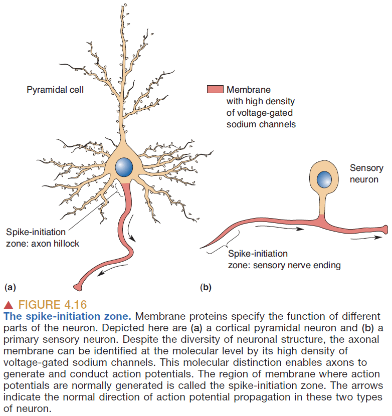

## Chapter 5: Synaptic Transmission

- Moving from intra-neuron (within a neuron) to inter-neuron (between neurons)
- *Synaptic transmission*: the process of information transfer at a synapse.
- *Electrical synapse*: a synapse that uses electricity to transmit information.
- *Chemical synapse*: a synapse that uses chemicals to transmit information.
- Chemical synapses make up the majority of synapses in the brain.
- Electrical synapses occur at gap junctions where there’s a direct transfer of ionic current.
- Gap junctions are bidirectional.
- *Postsynaptic potential (PSP)*: the potential of a neuron after an AP.

- Gap junctions are used to coordinate and synchronize the activity of neurons.

- Three types of neurotransmitters
    - Amino acids
    - Amines
    - Peptides

- The life cycle of neurotransmitters
    - Synthesis at the soma and transfer to the axon terminal.
    - Loading into synaptic vesicles.
    - Releasing the neurotransmitters.
    - Binding and activation of receptors.
    - Reuptake and degradation.
- *Voltage-gated calcium channel*: a channel that is selective towards calcium ions and is opened and closed by changes in membrane voltage.
- Voltage-gated calcium channels are located at the axon terminal and they control the release of neurotransmitters from synaptic vesicles.
- *Exocytosis*: the process of synaptic vesicles fusing with the presynaptic membrane to spill the neurotransmitters into the synaptic cleft.

- The binding of neurotransmitter to the receptor is like inserting a key in a lock.
- *Excitatory*: when the threshold for APs is increased making it easier to generate APs.
- *Inhibitory*: when the threshold for APs is decreases making it harder to generate APs.
- *Excitatory postsynaptic potential (EPSP)*: when the effect of a neurotransmitter brings the membrane potential towards the threshold for generating APs.
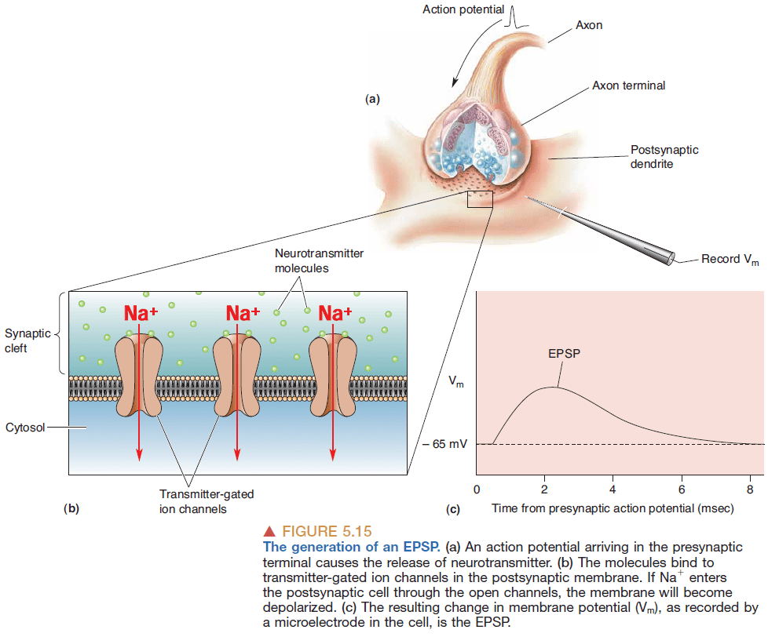
- *Inhibitory postsynaptic potential (IPSP)*: when the effect of a neurotransmitter brings the membrane potential away the threshold for generating APs.

- The same neurotransmitter can have different postsynaptic effects depending on which receptors it binds to.
- Interestingly, the membrane of the presynaptic axon terminal also has neurotransmitter receptors called autoreceptors.
- Autoreceptors are used to regulate neurotransmitter release and may act as a safety valve when the concentration of neurotransmitters gets too high.
- *Inhibitors*: drugs that inhibit the normal functioning of proteins involved in synaptic transmission.
- *Receptor antagonist*: drugs that bind to receptors and block the normal action of the transmitter.
- *Receptor agonist*: drugs that bind to receptors and mimic the actions of naturally occurring neurotransmitters.
- The transformation of many synaptic inputs to a single neuronal output constitutes a neural computation.
- *Synaptic integration*: the process where multiple synaptic potentials are combined in the post-synaptic neuron.
- EPSPs are quantized due to neurotransmitter vesicles being quantized.
- In a CNS synapse, only a single vesicle is released in response to a presynaptic AP.
- In a neuromuscular junction, hundreds of vesicles are released due to requiring the the junction to work every time.
- If the CNS synapse worked like a neuromuscular junction, it would be a simple relay instead of performing any computation.
- EPSP summation
    - *Spatial summation*: adding together EPSPs generated simultaneously at different synapses on a dendrite.
    - *Temporal summation*: adding together EPSPs generated at the same synapse if they occur in rapid succession.
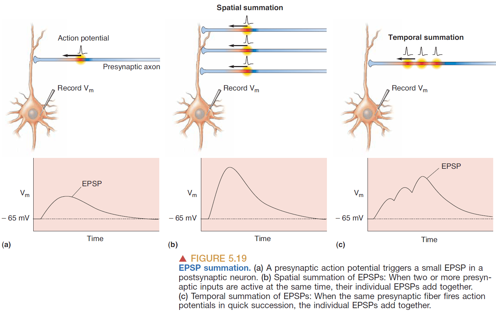
- However, even summation may not cause an AP as it must travel down the dendrite, go through the soma, and depolarize (beyond threshold) the spike-initiation zone.
- The dendrite leaks ions as the current travels down so the distance from the synapse to the spike-initiation zone affects AP generation.
- The depolarization decreases exponentially with distance. The relationship is $$V_{x} = \frac{V_{o}}{e^{\frac{x}{\lambda}}}$$ where $$x$$ is the distance from the synapse, and $$\lambda$$ is a constant from the dendrite.
- *Dendritic length constant*: the distance where about 37% of the original signal remains.

- The length constant is an index of how far depolarization can spread down a dendrite or axon.
- The longer the length constant, the more likely it is that EPSPs generated at distant synapses will depolarize the membrane at the axon hillock.
- The value of $$\lambda$$ depends on two factors
    - *Internal resistance*: the resistance to current flowing down a dendrite.
        - Depends on dendrite diameter and cytoplasm properties.
    - *Membrane resistance*: the resistance to current flowing out of the dendrite through its membrane.
        - Depends on number of open ion channels.
- The current will take the path of least resistance so increasing membrane resistance increases $$\lambda$$ while increasing internal resistance decreases $$\lambda$$.
- Interesting, some dendrites can amplify small PSPs due to voltage-gated channels.
- Some dendrites also have the capacity to send signals in the other direction, thus synapses on dendrites are informed about the generation of an AP.
- *Shunting inhibition*: when an inhibitory synapse further down a dendrite inhibits all excitatory synapses above it.
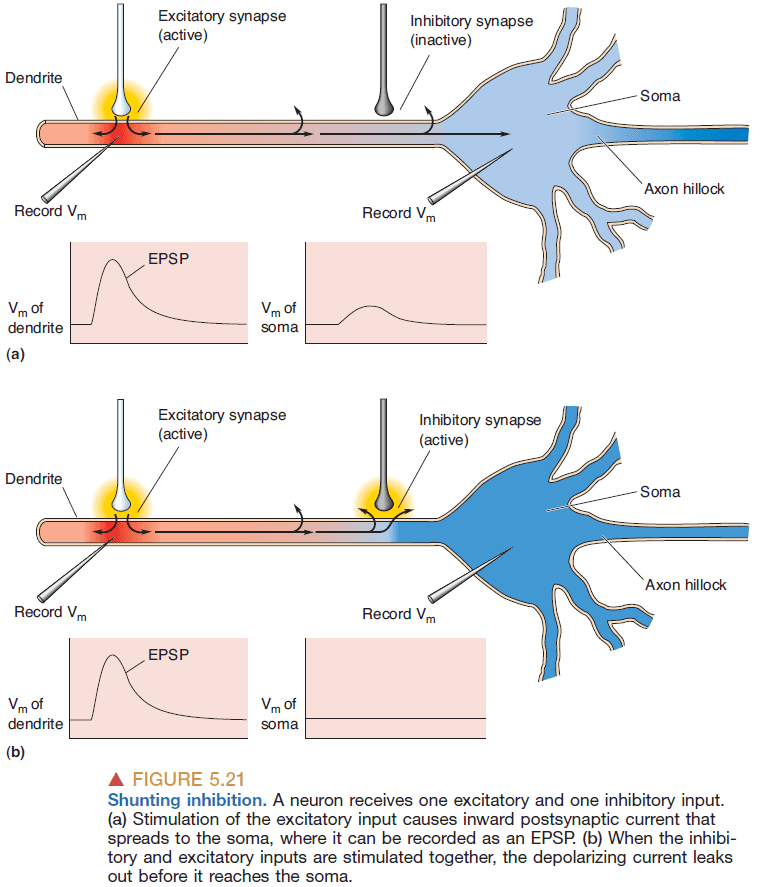
- In addition to being spread over the dendrites, inhibitory synapses on many neurons are found clustered on the soma and near the axon hillock, where they are in an especially powerful position to influence the activity of the postsynaptic neuron.
- *Modulation*: receptors that don’t invoke EPSPs and IPSPs but instead modify the effectiveness of EPSPs generated by other synapses.
- E.g. Norepinephrine can reduce the potassium ion conductance which increases the membrane resistance and therefore makes the cell more excitable.
- Since norepinephrine doesn’t directly affect EPSPs but does it through secondary messengers, the possibilities for modifying synapse effectiveness is near limitless.
- It is this rich diversity of chemical synaptic interactions that allows complex behaviors to emerge from simple stimuli.

## Chapter 6: Neurotransmitter Systems

- Strict definition of a neurotransmitter
    - Must be synthesized and stored in the presynaptic neuron.
    - Must be released by the presynaptic axon terminal upon stimulation.
    - Must produce a response in the postsynaptic cell that mimics the response produced by the release of neurotransmitter from the presynaptic neuron.
- Two main techniques to determine where a neurotransmitter is synthesized
    - *Immunocytochemistry*: using colorized antibodies to bind to neurotransmitters to see them.
    - *In situ hybridization*: using a synthetic probe to bind to specific mRNA to see them.
- Most regions of the CNS use different neurotransmitters.
- Usually, no two neurotransmitters bind to the same receptor however, one neurotransmitter can bind to many different receptors.
- *Receptor subtype*: the different receptors a neurotransmitter binds to.
- E.g. ACh binds to both receptors in skeletal muscles and in heart muscles.
- *Dale’s principle*: a neuron only has one neurotransmitter.
- Dale’s principle is usually violated by peptide neurotransmitters.
- *Co-transmitters*: when two or more transmitters are released from one nerve terminal.
- E.g. GABA and glycine.
- However, most neurons seem to release only a single amino acid/amine transmitter.
- Glutamate (Glu), glycine (Gly), and gamma-aminobutyric acid (GABA) are the main neurotransmitters at most CNS synapses.
- Interestingly, ATP is also a neurotransmitter.
- *Retrograde signaling*: when communication occurs from the postsynaptic neuron to the presynaptic neuron.
- *Endocannabinoids*: a retrograde messenger that serves as a kind of feedback system.
- A receptor can be selective for both a neurotransmitter and membrane potential which has a significant impact on synaptic integration.
- E.g. NMDA-gated channel.

- Synaptic inhibition must be tightly regulated in the brain as too much leads to loss of consciousness and coma while too little leads to seizure.
- G-protein-coupled receptors are complex and slow because it performs signal amplification.
- E.g. The activation of one G-protein-coupled receptor can lead to the activation of many ion channels.
- Glutamate is the most common excitatory neurotransmitter in the brain while GABA is the most common inhibitory neurotransmitter in the brain.
- *Divergence*: the ability of one transmitter to activate more than one subtype of receptor.
- Divergence is the rule along neurotransmitter systems.
- *Convergence*: when multiple transmitters activate the same effector system.
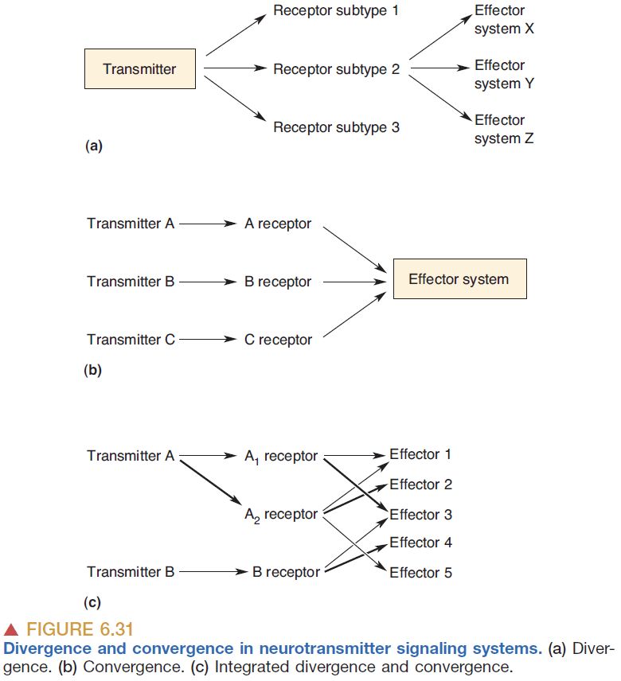
- Neurotransmitters are the essential links between neurons, and between neurons and other effector cells (E.g. muscles).
- Transmitters are one line in a chain of events, starting chemical changes both fast and slow, divergent and convergent.
- You can envision the many signaling pathways onto and within a single neuron as a kind of information network. This network is in delicate balance, shifting its effects dynamically as the demands on a neuron vary with changes in the organism’s behavior.
- The signaling network within a single neuron resembles in some ways the neural networks of the brain itself.
- It receives a variety of inputs, in the form of transmitters bombarding it at different times and places. These inputs cause an increased drive through some signal pathways and a decreased drive through others, and the information is recombined to yield a particular output that is more than a simple summation of the inputs.
- Signals regulate signals, chemical changes can leave lasting traces of their history, drugs can shift the balance of signaling power and, in a literal sense, the brain and its chemicals are one.

## Chapter 7: The Structure of the Nervous System

- The nervous system is divided into two parts
    - *Central nervous system (CNS)*: the brain and spinal cord.
    - *Peripheral nervous system (PNS)*: all nerves that aren’t part of the CNS.
- Anatomical references
    - *Anterior*: front
    - *Posterior*: back
    - *Dorsal*: up
    - *Ventral*: down
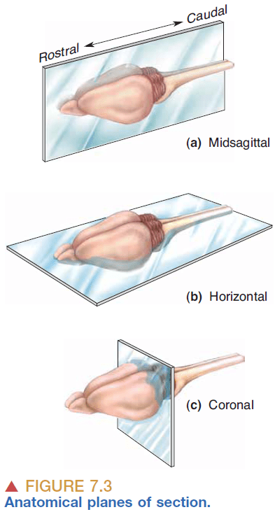
- Central nervous system
    - *Cerebrum*: the largest part of the brain that’s split into the left/right cerebral hemisphere.
    - *Cerebellum*: the part behind the cerebrum that’s used for motor control.
    - *Brain stem*: the part under the cerebrum that regulates breathing, consciousness, and body temperature.
    - *Brain*: a structure of white matter with grey matter covering it.
    - The white matter is on the inside and connects the different areas of the brain that make up the grey matter.
    - *Spinal cord*: a bundle of neurons that receives sensory information and sends movement information.
    - The spinal cord is like an inside-out brain because the grey matter is on the inside and the white matter is on the outside.
- Cutting the dorsal roots of the spine results in anesthesia while cutting the ventral roots results in paralysis.
- Peripheral nervous system
    - *Somatic PNS*: the nerves under voluntary control.
        - E.g. Skin, joints, muscles.
    - *Visceral PNS*: the nerves not under voluntary control.
        - E.g. Internal organs, blood vessels, glands.
    - *Afferent*: carrying to.
    - *Efferent*: carrying from.
- *Cerebrospinal fluid (CSF)*: a salty fluid surrounding the brain and spine.

- Imaging the structure of the brain
    - *Computed tomography (CT)*: use xrays to image the brain.
    - *Magnetic resonance imaging (MRI)*: use how hydrogen atoms react to perturbations of a strong magnetic field to image the brain.
- Imaging the function of the brain
    - *Positron emission tomography (PET)*: use a radioactive solution and measure the emitted photons.
    - *Functional magnetic resonance imaging (fMRI)*: use the difference in magnetic resonance between oxygenated and deoxygenated blood.
- Both methods detect changes in regional blood flow and metabolism within the brain.
- The principle is that neurons demand more glucose and oxygen when they’re active so if we detect changes in blood flow, it suggest changes in neuron activity.
- *Grey matter*: a collection of neuronal cell bodies.
- *White matter*: a collection of CNS axons.
- *Cortex*: any collection of neurons that forms a thin sheet.
- *Differentiation*: the process when structures become more complex and functionally specialized.
- *Sulci*: the grooves on the brain.
- *Gyri*: the bumps on the brain.
- Sulci and gyri arise due to expansion of the surface area of the cerebral cortex during fetal development.

# Part II: Sensory and Motor Systems

## Chapter 8: The Chemical Senses

- Chemical sensation is the oldest and most pervasive across species.
- Taste = gustation
- Smell = olfaction
- Taste was used to distinguish between food and toxins.
- The five basic tastes
    - Saltiness
    - Sourness
    - Sweetness
    - Bitterness
    - Umami
- Flavor comes from the combination of smell, taste, and feel.
- E.g. A pepper activates pain receptors adding to it’s flavor.
- *Papillae*: the small bumps on our tongue that contain our taste buds.
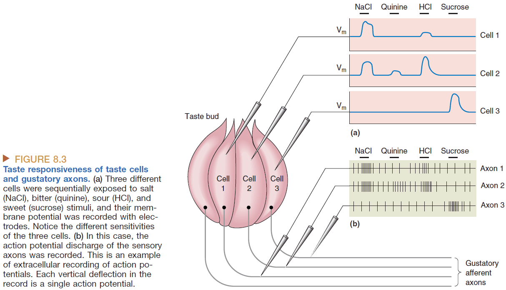
- *Receptor potential*: when a receptor cell’s membrane potential changes.
- *Transduction*: when a environmental stimulus causes an electrical response in a sensory receptor cell.
- Taste is processed in the primary gustatory cortex.
- *Ageusia*: loss of taste perception.
- *Flavor aversion learning*: when we avoid a certain food due to having associating it with something bad.
- E.g. Rats that were fed a sweet liquid but then given a drug to feel ill then avoided sweet stimuli forever.
- Flavor aversion is really robust as it can form with only one trial and can last for years.
- This makes sense as it was useful when we were in the wild and couldn’t trust food to not kill us.
- *Labeled line hypothesis*: that certain tastes map directly onto neurons in the brain.
- E.g. That there’s a "sweet" neuron in our brain.
- Broadly tuned receptors are less specific in their response to stimuli. Primary taste axons are even less specific than receptor cells as they combine taste information from multiple receptors.
- *Population coding*: a scheme in which the responses of a large number of broadly tuned neurons, rather than a small number of precisely tuned neurons, are used to specify the properties of a particular stimulus.
- In other words, the population encodes the stimuli not the individual neurons.
- E.g. The human population is able to detect a wide range of light (telescopes, radios, ultrasound) but no one person does.
- Population coding schemes seem to be used throughout the sensory and motor systems of the brain.
- *Pheromones*: chemicals released by the body.
- Unlike taste receptor cells, olfactory receptors are genuine neurons with axons of their own.
- *Anosmia*: the inability to smell.

- *Adaptation*: a decreased response of a sensory receptor despite continued presence of a stimulus.
- Adaptation is a common feature of all sensory receptors.
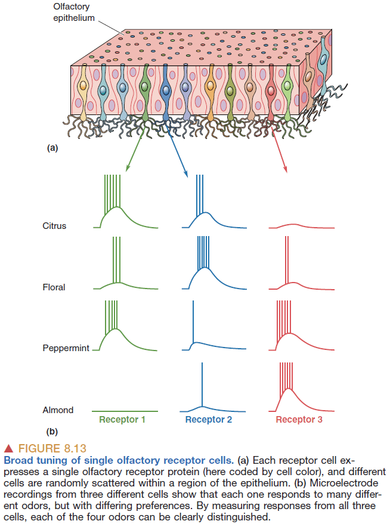
- Like taste, smelling uses a population coding scheme.
- In general, smell receptors are broadly tuned with some receptors being more sensitive.
- The axons from the smell receptors are astonishingly precise to where they go as defined by genetics.
- This means that the the map of odor information is very orderly and precise.

- Information from the olfactory bulb goes to the olfactory cortex.
- In smell and taste, there’s an apparent paradox in that individual receptors are broadly tuned to their stimuli yet we can distinguish between smells and tastes.
- How does the brain do what individual receptors cannot? How does the brain distinguish between stimuli?
- The answers are
    - Each odor is represented by the activity of a large population of neurons.
    - The neurons responsive to particular orders may be organized into spatial maps.
    - The timing of APs may be an essential code for particular odors.
- Olfactory population coding
    - The use of a large population of receptors to encode a specific stimulus.
    - This allows for a lot of different smells to be recognized as there can be many different combinations.
- Olfactory maps
    - *Sensory map*: an orderly arrangement of neurons that correlates with certain features of the environment.
    - Experiments reveal that while a certain odor activates many neurons, the neurons’ positions form complex but reproducible spatial patterns.
    - So the smell of a certain chemical is converted into a specific map defined by the positions of active neurons within the "neural space".
    - Every sensory system uses spatial maps.
    - E.g. Visual space maps, sound frequency maps, body surface maps.
    - The spatial maps of chemical senses are unusual because the stimuli themselves have no meaningful spatial properties. Smell doesn’t have a "where", only a "what".

    - If spatial maps are created, who and how are they read?
    - An alternative is that spatial maps don’t encode odors but are simply the most efficient way for the nervous system to form connections between related sets of neurons.
    - Maybe spatial maps are a side effect of minimizing axon and dendrite length rather than being a fundamental mechanism of sensory coding.
- Temporal coding in the olfactory system
    - *Temporal coding*: information that’s encoded in the timing of spikes.
    - Odor is encoded by the detailed timing of spikes within cells and between groups of cells, including the number of spikes, the temporal pattern, rhythmicity, and cell-to-cell synchrony of spikes.
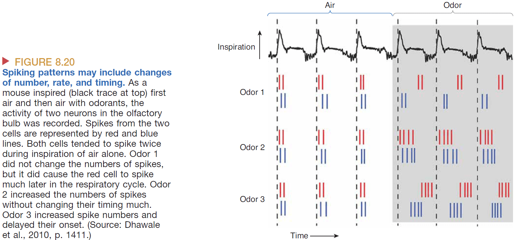
    - Evidence of disrupting the spiking rhythm in bees lead to a loss of discrimination between similar odors but not general odors.
    - This implies that information is encoded by which neurons fire and when they fire.

## Chapter 9: The Eye

- The significance of vision is best demonstrated by the fact that more than a third of the human cerebral cortex is involved with analyzing the visual world.
- *Retina*: the back of the eye that has photoreceptors to detect light.
- The eye has two types of photoreceptors, one for low light and one for color.
- The retina doesn’t detect the intensity of light but rather the differences in intensity of light.
- Image processing happens in the retina well before it reaches the visual cortex.
- Interestingly, the cornea, rather than the lens, is where most of the eye’s refractive power comes from.
- Visual information exiting the eye follows the path from photoreceptors → bipolar cells → ganglion cells.
- *Horizontal cells*: cells that receive input from photoreceptor cells and project neurites sideways to influence surrounding bipolar cells and photoreceptors.
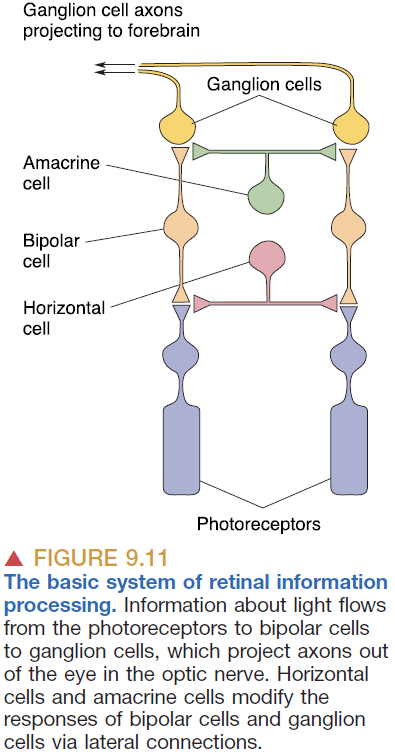
- Three important points to remember about the cellular makeup of the retina
    - With one exception, the only light-sensitive cells in the retina are the rod and cone photoreceptors.
    - The ganglion cells are the only source of output from the retina.
    - Ganglion cells are the only retinal neurons that fire APs, and this is essential for transmitting information outside the eye.
- The retina has a laminar organization meaning it’s organized into layers.
- The layers are organized "inside-out" with the ganglion and bipolar cells on top of the photoreceptor cells. This lets the photoreceptor cells be more easily maintained by the layer below it.
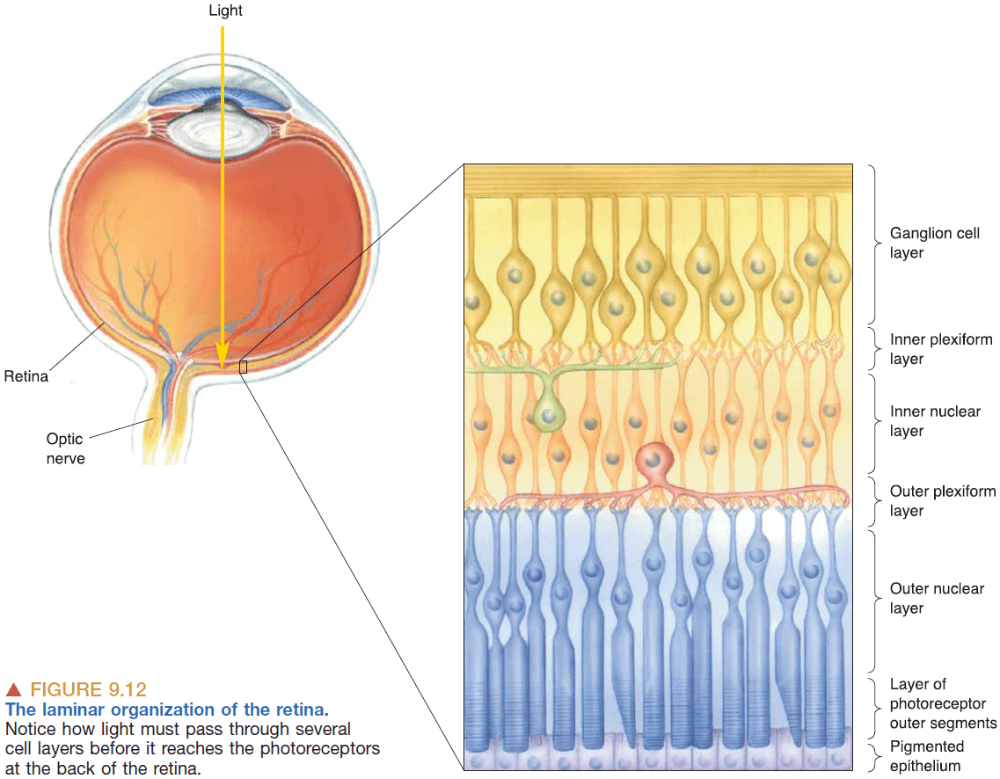
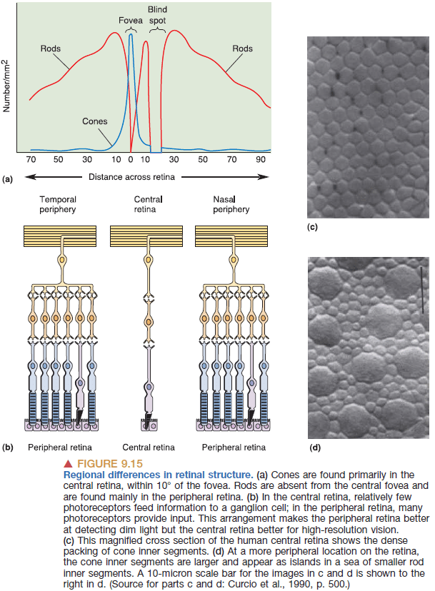
- *Fovea*: a pit in the retina where the ganglion and bipolar cells are displaced.
- Due to the high concentration of cones in the fovea, we have greater spatial sensitivity on our central retina.
- We are unable to perceive color differences at night because the rods photoreceptors can’t detect color.
- *Phototransduction*: the conversion of light into membrane potential.
- Rods hyperpolarize in response to light. Maybe this suggests that the frequency of APs encodes the intensity of light? Maybe this is why blinking lights cause seizures in some people?
- In other words, light is abnormal to rods and in bright light, rods become hyperpolarized.

- Don’t think of cones as detecting specific wavelengths of light, but rather the ratio of cone activations determines the color.
- Photoreceptors prefer dark over light as they hyperpolarize in light.
- *Receptive field*: the area of the retina that affects a neuron’s firing rate.
- All sensory neurons have a receptive field where they’re sensitive.

- Receptive fields can be classified into ON and OFF by whether they turn on or off in the presence of light.
- Receptive fields are made up of
    - *Receptive field center*: a circle of retina that provides input to photoreceptor cells.
    - *Receptive field surround*: the surrounding area of a receptive field center that provides input through horizontal cells.
- The interaction between photoreceptors, horizontal cells, and bipolar cells results in
    - When a photoreceptor hyperpolarizes in response to light, the output is sent to horizontal cells that also hyperpolarizes.
    - The effect of horizontal cells hyperpolarizing is to cancel the effect of light on neighboring photoreceptors.
- This leads to ganglion cells that are responsive to differences in light rather than the presence of light.
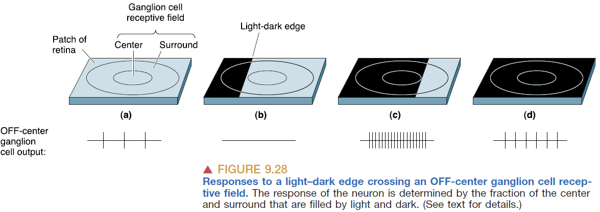
- The organization of ganglion cell receptive fields suggests an explanation of some visual illusions.

- In the image above, the light from the center square is the same and hits the center of a receptive field. However, the left image has more light in its surrounding so the surrounding receptive field leads to more inhibition of the center receptive field.
- This causes the center to look darker because the response from it is more inhibited by its brighter surroundings.
- Two major types of ganglion cells
    - *M-type*: larger receptive field, only respond in bursts, conduct APs more rapidly.
    - *P-type*: smaller receptive field, sustained discharge, slower APs.
- There are also receptive fields that are color sensitive known as color-opponent cells.
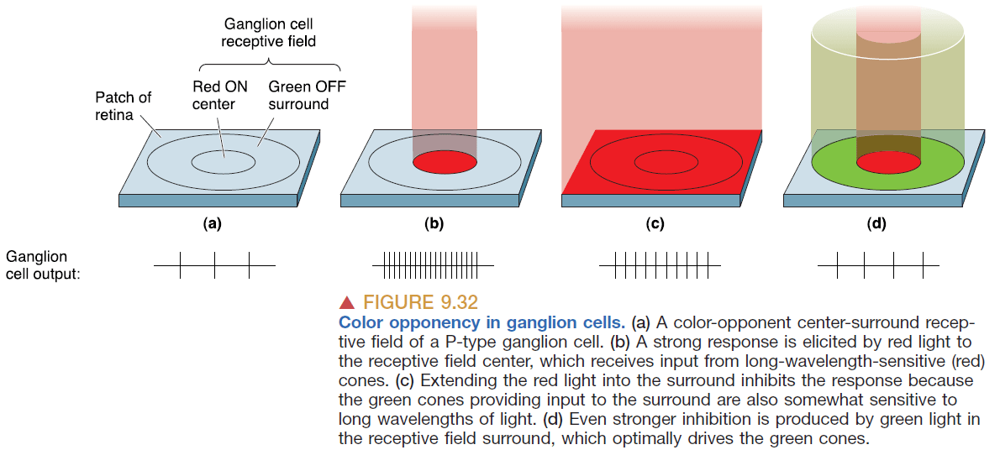
- The color and light sensitivity of ganglion cells suggests that it sends information about
    - Light vs dark
    - Red vs green
    - Blue vs yellow
- This is a case where the components and organization informs us about the function and information processing that occurs.
- There’s another type of retinal cell, intrinsically photosensitive retinal ganglion cells (ipRGCs), that have a general sensitivity to light and is used for synchronizing our circadian rhythms.
- The idea of parallel processing in the visual system. Information from both eyes is processed simultaneously and so is the information coming from receptive fields.
- From 97 million photoreceptors to 1 million ganglion cells.
- The mapping of visual space to neural space isn’t uniform as there’s an over-representation of the central few degrees of visual space.
- This enables high acuity in central vision but a lack of acuity in peripheral vision.

## Chapter 10: The Central Visual System

- How does the brain merge the images from both eyes? Is it similar to how our brains process information from both ears?
- The retina doesn’t just take images but extracts information about differences in brightness and color.
- *Retinofugal projection*: the neural pathway that leaves the eye.
- *Binocular visual field*: the field that is seen by both eyes.

- *Decussation*: the side of the brain controls and receives input is opposite from the side of the body that creates the input.
- E.g. The right side of the body is controlled by the left side of the brain.
- Decussations are common in sensory and motor systems but we don’t know why they’re important.
- The majority of nerves from the eye innervate the lateral geniculate nucleus (LGN).
- We know the LGN is responsible for conscious visual perception because lesions along the pathway cause blindness.
- Cutting the left optic nerve renders a person blind in the left eye, but cutting the left optic tract renders a person blind in the right visual field as viewed through both eyes.
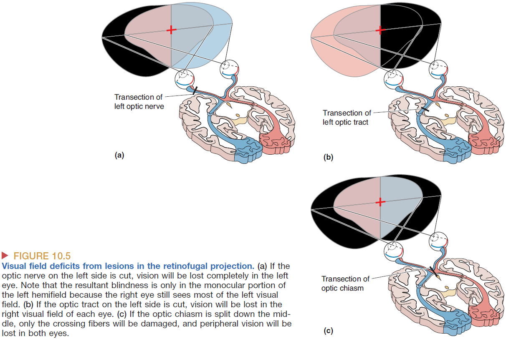
- LGN has six layers and the input from the two eyes are kept separate.
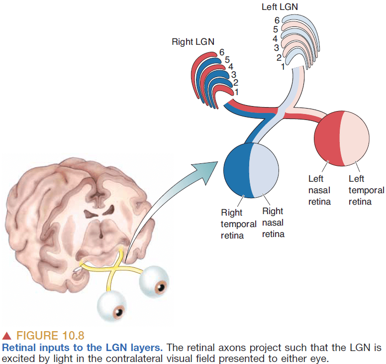
- The anatomical organization of the LGN supports the idea that the retina gives rise to streams of information that are processed in parallel.
- The layers of the LGN mirror the different types of ganglion cells as each ganglion type (P-type, M-type, nonM-nonP type) is processed by a different LGN layer.

- *Retinotopy*: the two dimensional mapping of the surface of the retina to the subsequent structures.
- E.g. Neighboring retina cells feed neighboring LGN cells.

- Like the LGN, the cortex is also divided into layers.

- *Spiny stellate cells*: small neurons with spine-covered dendrites that radiate out from the cell body.
- *Pyramidal cells*: neurons that are covered with spines and have a single thick dendrite that goes towards the outside of the brain.
- Only pyramidal cells send axons out of the striate cortex.
- Magnocellular LGN neurons project primarily to layer IVC$$\alpha$$ , and parvocellular LGN neurons project to layer IVC$$\beta$$ .
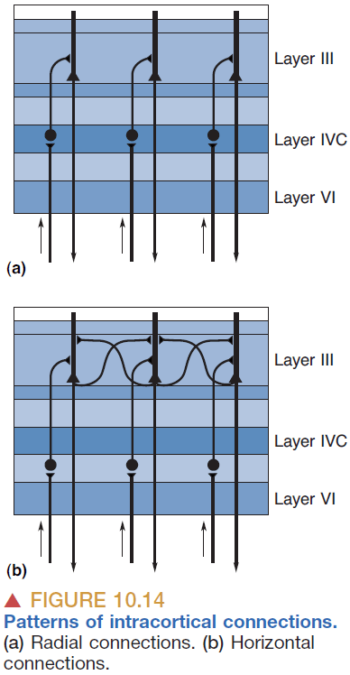
- The left and right eye inputs into layer IV of the striate cortex are still separate as they show up as a series of alternating bands like the stripes on a zebra.
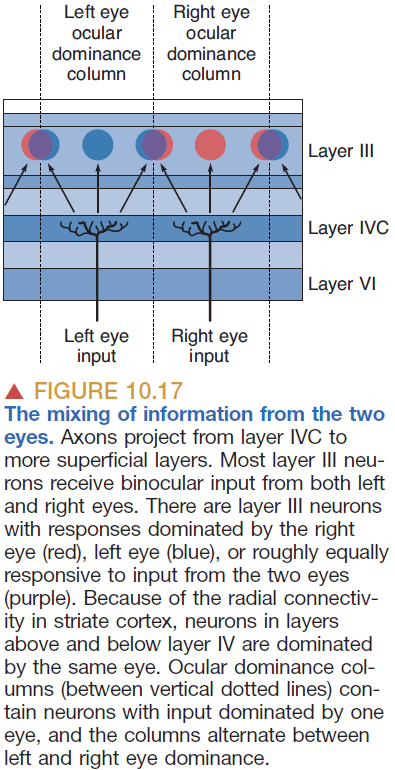
- However, the layer IVC merges both eyes and has neurons that have binocular receptive fields.
- *Binocular receptive field*: when a neuron has two receptive fields, one in both eyes.
- Retinotopy is preserved in layer IVC because the binocular receptive fields are "looking" at the same point in the visual field. This suggests that the way both eyes are wired is extremely precise.
- *Orientation selectivity*: when a neuron’s response is greatest to a bar of light with a specific orientation.

- *Direction selectivity*: when a neuron’s response is greatest to a bar of light with a specific direction and orientation.
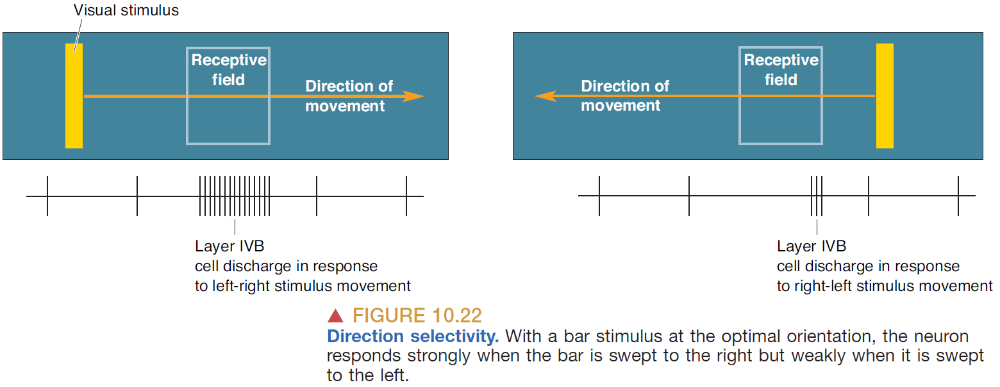
- Direction-selective cells are a subset of orientation-selective cells in V1.
- How structure relates to function in the visual system
    - LGN has layers that segregate different types of input.
    - Laminations of striate cortex match with differences in receptive fields.
- It’s theorized that the brain processes an object’s shape, motion, and color in parallel pathways.
- The striate cortex is the same as V1.
- *Dorsal stream*: analysis of visual motion and visual control of action.
- *Ventral stream*: perception of the visual world and object recognition.
- If the visual system does a lot of parallel processing, when and where is the information integrated and combined?

## Chapter 11: The Auditory and Vestibular Systems

- *Audition*: sense of hearing.
- *Vestibular system*: sense of balance.
- We can hear between 20 Hz and 20,000 Hz.
- *Pitch*: the frequency or tone of a sound wave.
- *Intensity*: the loudness of a sound wave.
- *Pinna*: the outside part of the ear that helps us better collect sounds from ahead than from behind.
- Sounds follows the path from
    - Pinna → Auditory canal → Eardrum → Ossicles → Oval window → Cochlea
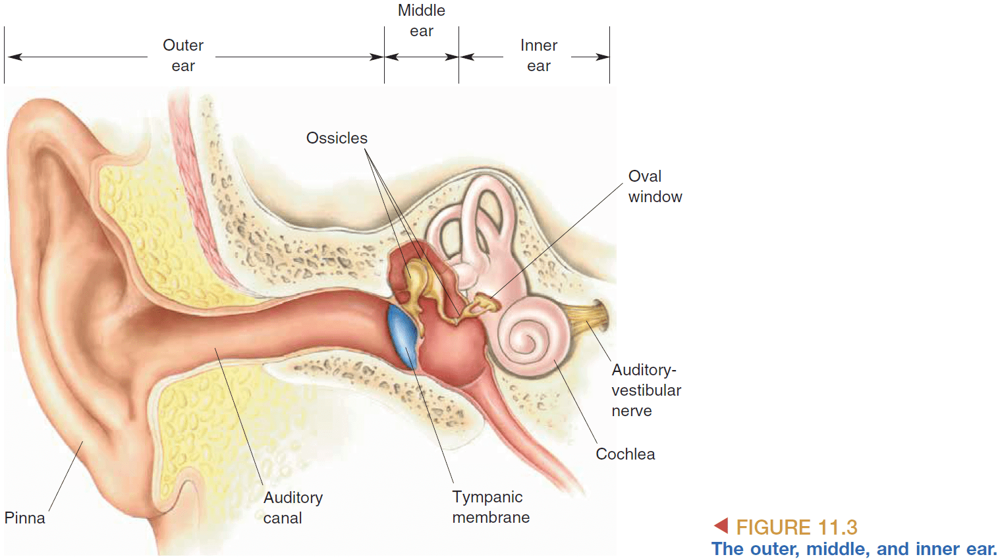
- Medial geniculate nucleus (MGN).
- The oval window is used to transfer the vibrations of sound into vibrations in fluid. There’s also another window called the round window to bulge when the fluid is vibrated.
- Why doesn’t the eardrum connect directly to the cochlea? It’s because sound waves aren’t powerful enough to move the fluid in the cochlea and it requires the ossicles to provide amplification.
- *Attenuation reflex*: when a loud sound is heard, muscles contract to make the ossicles more rigid.
- Possible functions of the attenuation reflex
    - Adapt the ear to continuous sounds at high intensities.
    - Protect the ear from loud sounds.
    - Prevents us from hearing ourselves when we talk.
- The basilar membrane is stiffer and wider the farther down we go. This allows lower frequencies to travel farther and slows higher frequencies down before they reach the end.
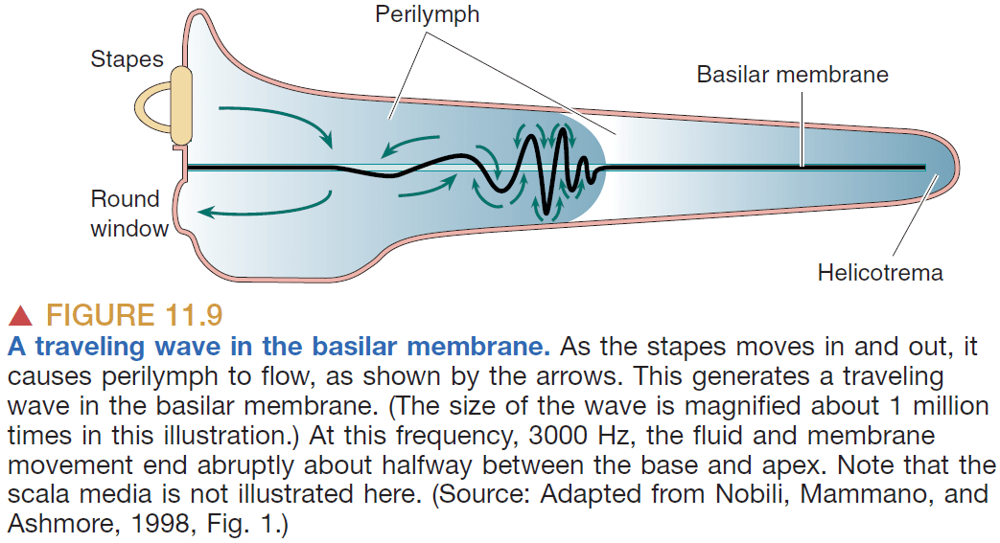

- The location on the basilar membrane codes the frequency of the sound.
- *Tonotopy*: systematic organization of sound frequency.
- Tonotopic maps exist in the
    - Basilar membrane
    - Auditory relay nuclei
    - MGN
    - Auditory cortex
- Hair cells on the basilar membrane bend when the membrane bends and either depolarizes or hyperpolarizes depending on the direction of the bend.
- *Characteristic frequency*: the frequency that a neuron is most responsive to.
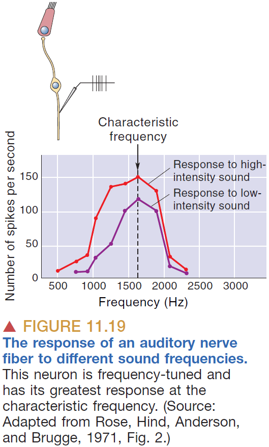
- Each of the following features of sound are represented differently in the brain
    - Intensity
    - Frequency
    - Location
- Information about sound intensity is coded in two interrelated ways
    - Firing rates
    - Number of active neurons
- Louder sound → Greater basilar membrane movement → Greater hair cell depolarization and hyperpolarization → Faster firing rates.
- Louder sound → More basilar membrane movement → More hair cell depolarization and hyperpolarization → More neurons firing.
- How is frequency represented in the central nervous system?
    - *Tonotopy*: the mapping of frequency to locations on the basilar membrane.

    - Just like how we could use current and resistance to multiply and thus compute, the auditory system uses properties of the real world to perform its computation.
    - However, tonotopy doesn’t code for frequencies below 200 Hz so there must be another way to code frequency.
    - *Phase locking*: the consistent firing of a cell at the same phase of a sound wave.

    - This shows how the timing of APs codes frequency information; the frequency of the neuron’s APs codes the frequency of the sound.
    - *Volley principle*: how the pooled activity of a group of neurons, each firing in a phase-locked manner, can code frequency.
    - However, phasing locking only works up to 5 kHz and anything above it is represented by tonotopy.
    - At low frequencies phase locking is used, at middle frequencies both phase locking and tonotopy are used, at high frequencies tonotopy is used.
- Sound localization
    - The mechanism for horizontal and vertical location detect is different.
    - Horizontal detection relies on the delay of a sound reach both ears.
    - *Interaural time delay*: the delay of a sound wave reaching both ears.
        - The horizontal resolution is about 2 degrees or 11 microseconds of delay.
        - However, continuous sounds don’t have a delay so instead we can detect a difference in the phase of the sound wave.
        - But even this mechanism only words for sounds below 2000 Hz or else the frequency gets too high for detecting cycles and thus the phase.
        - *Interaural intensity difference*: the difference in intensity of a sound wave reaching both ears.
        - There’s an intensity difference because the head acts like a "shadow", reducing the intensity of sound waves reaching the other ear.
        - Sounds ranging from 20-2,000 Hz are localized using interaural time delay. Sounds ranging from 2,000-20,000 Hz are localized using interaural intensity difference.
- Starting at the superior olive, there are binaural neurons that take input from both ears.
- How can a neural circuit produce neurons sensitive to interaural delay?

- One idea is that certain neurons code for certain time delays which then are translated into the sound’s location.
- Also, neurons that are precise in timing must also be precise in distance so the neurons can’t be too long nor too short.
- The pinna or fleshy part of the ear helps us do vertical sound localization because of the different paths vertical sound waves take.
- However, an even better way is how owls do it by having ears at different heights, thus apply our horizontal localization to the vertical plane.
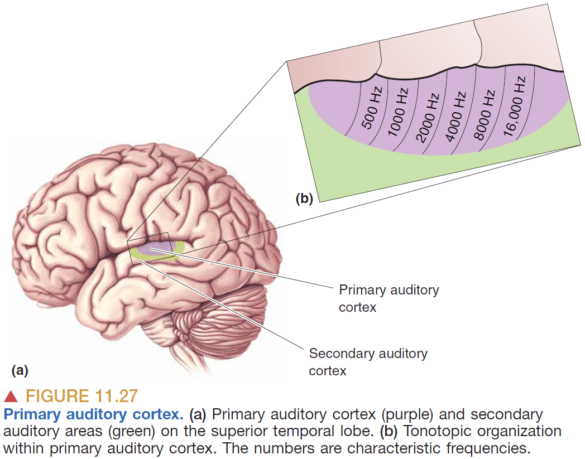
- In the primary auditory cortex, there’s a tonotopic map of frequencies where frequencies are mapped to brain areas.
- Interestingly, if one side of the auditory cortex is damaged, there’s an impairment to localizing the source of sound but minor impairment to frequency and intensity discrimination. This contrasts with damage to the visual cortex as that leads to blindness in one visual hemifield.
- Skimming the section on the vestibular or balance system.
- *Vestibulo-ocular reflex (VOR)*: how the eyes stay pointed in a direction even though the head moves.
- VOR is possible because the vestibular system sends information about the head’s movement and rotation to the brain and adjusts the eye accordingly.

## Chapter 12: The Somatic Sensory System

- Examples of somatic sensation
    - Pressure against skin
    - Position of joins and muscles
    - Distension of the bladder
    - Temperature of body parts
    - Pain
- The somatic sensory system is different in two ways from the auditory/visual system
    - The receptors are distributed across the body
    - The receptors detect multiple modalities (pressure, temperature, position)
- The resolution of skin at the finger tip is 0.006 mm deep and 0.04 mm wide.
- Skipping over the details of mechanoreceptors.
- The two-point discrimination test shows how some parts of the body are more sensitive to differences in distance than others. The fingers are particularly sensitive which is why they’re used to read Braille.
- Information about touch and vibration are transmitted on a different path from information about pain and temperature.
- The somatic sensations are processed on the opposite side of the brain.
- E.g. Pain on the right side of the body is processed by the left side of the brain.
- As a general rule, information is altered every time it passes through a set of synapses in the brain.
- One common alteration is the amplification of differences in the activity of neighboring neurons known as contrast enhancement.
- E.g. How retinal ganglion cells have opposing ON/OFF center receptive fields.
- Contrast enhancement is a subset of alterations known as lateral inhibition where neighboring cells inhibit each other.

- Like in the visual and auditory cortex, the concept of a cortical column shows up in the somatic sensory cortex too.
- *Somatotopy*: the mapping of the body’s surface sensations onto the brain.

- Features of the somatotopic map
- The map is discrete as the body, face, and internal organs are separate.
- The map isn’t scaled to the human body but instead emphasizes the mouth and hands.
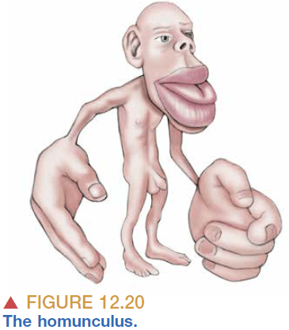
- The relative size of cortex devoted to each body part is correlated with the density of sensory input received from that part. More neurons in the body area requires more neurons in the corresponding brain area.
- The importance of an input and the size of its representation in the cortex are reflections of how often it’s used.
- What happens to the somatotopic map when an input is removed?
- E.g. A finger is cut off.
- Possible answers
    - Goes unused
    - Atrophies
    - Gets taken over
- Evidence suggests that the area gets taken over by the surrounding neurons.
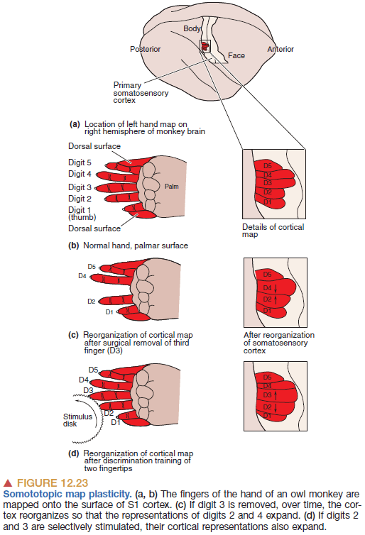
- Cortical maps are dynamic and adjust depending on the amount of input it gets.
- This is similar to how after a certain period in development, children aren’t able to form language skills.
- Segregation of different types of information is a general rule for sensory systems but the information cannot remain separate forever.
- Certain cortical areas seem to be sites where simple, segregated streams of sensory information converge to generate particularly complex neural representations.
- Neurons in these areas have large receptive fields that are challenging to characterize because they’re so elaborate.
- There’s a difference between pain and nociception.
- *Pain*: the feeling or perception of irritating or unbearable sensations.
- *Nociception*: the sensory process that provides signals that trigger pain.
- We know there’s a difference because there’s evidence of a double dissociation between them. There can be pain without any signals and there can be signals but no pain felt.
- Interestingly, if heat is restricted to a small region of skin innervated by a cold receptor, it’ll produce a paradoxical feeling of cold.
- This shows how the CNS doesn’t know what kind of stimulus causes a receptor to fire, but it continues to interpret all activity from its cold receptor as cold.
- With thermoreception, as with most other sensory systems, it is the sudden change in the quality of a stimulus that generates the most intense neural and perceptual responses.
- We’re most attuned to changes or differences in temperature rather than absolute temperature.
- A common theme across the sensory systems is that several flows of information that’s related, but distinct, passes in parallel through a series of neural structures.
- The mixing of these streams occurs along the way, but only judiciously, until higher levels of processing are reached in the cerebral cortex.
- Exactly how the parallel streams of sensory data are melded into perception, images, ideas, and memories remains the Holy Grail of neuroscience.

## Chapter 13: Spinal Control of Movement

- The spinal cord holds a lot of circuitry dedicated to the control of movement, particularly repetitive movements.
- The current view is that the spinal cord has certain "motor programs" for the generation of coordinated movement and that these programs can be accessed, executed, and modified by descending commands from the brain.
- Neurons use different mechanisms to precisely control the force of a muscle contraction.
    - Varying the firing rate
    - Recruiting additional motor units
- Neurons may switch phenotype as a result of synaptic activity or experience, and this might be the basis for learning and memory.
- *Central pattern generators*: circuits that give rise to rhythmic motor activity.

## Chapter 14: Brain Control of Movement

- The central motor system is arranged into a hierarchy of control levels.
    - *Highest level*: association areas of neocortex and the basal ganglia. This level is concerned with strategy or the goal of the movement.
    - *Middle level*: motor cortex and cerebellum. This level is concerned with tactics or which muscles to move.
    - *Lowest level*: brain stem and spinal cord. This level is concerned with execution or how to move the muscles we want.

- The integration of vast amounts of sensory and motor information makes the brain almost a sensorimotor system.

- Some neurons in cortical area 6 respond not only when movements are executed but also when the same movement is only imagined or mentally rehearsed.
- *Mirror neurons*: neurons that fire when observing another animal making the same type of movement.
- Mirror neurons imply that the circuits we use to perform an action are also activated for understanding the actions and goals of others.
- The primary motor cortex is called M1.
- Neurons in M1 encode two aspects of movement
    - Force
    - Direction
- Does a single motor neuron pool in M1 control a single muscle or does it control multiple muscles?
- Recent evidence suggests that multiple muscles are controlled by multiple motor neuron pools which are controlled by a single pyramidal neuron.
- It seems like M1 neurons encode direction.
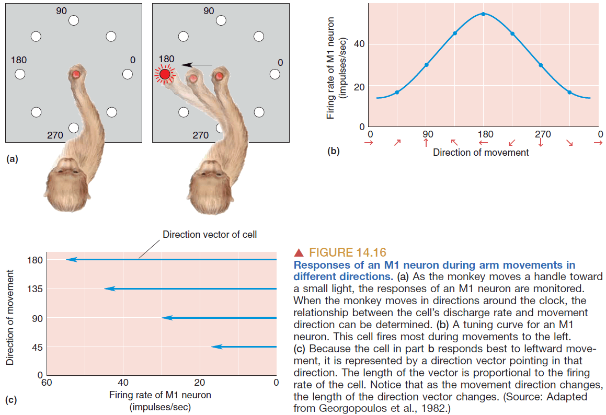
- However, for precise movements a population of neurons would need to be active for the encoding the direction because a single neuron isn’t precise enough.
- Georgopoulous answer to how a group of neurons encodes direction
    - Each neuron has a direction vector corresponding to the direction that the neuron fires the most.
    - E.g. Some neuron that fires the most when the hand points north and fires weakly when pointed south.
    - From the group of neurons, record all of their direction vectors and average them to get the population vector; a direction that the population is preferring.
    - There’s a strong correlation between the population vector and the actual direction of movement.
- Georgopoulos’ theory about population vectors implies
    - Most of the motor cortex is active for every movement.
    - The activity of each neuron represents a vote for a particular direction of movement.
    - The direction of movement is calculated by tallying/averaging the votes of all cells in the population.
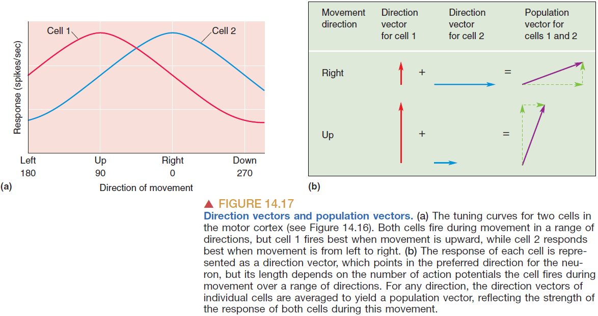
- However, Sanger 1994 challenges the theory that a population vector exists as it may be a result of confirmation bias.
- Given that a population of neurons encodes a direction, then the larger a population of neurons is, the more directions or more precise movements it can encode.
- Evidence for this comes from the discovery of malleable motor maps.
- *Malleable motor maps*: the more an area is used, the larger it gets. The less an area is used, the smaller it gets.

- We’ve seen this again and again. In the London taxi driver study and in Einstein’s brain. The more a brain area is used, the bigger it gets. But why?
- What exactly is getting bigger? The size of neurons? The number of neurons? The number of synapses?
- Are neurons "feature detectors" as in they look for a single attribute or do they encode something more general and abstract?
- In smell and taste, there doesn’t seem to be feature detectors because the response of one of those neurons is highly ambiguous.
- In vision though, neurons seem to have specific receptive fields that are highly tuned to one specific stimulus.
- The cerebellum is another important site for motor learning; it’s a place where what is intended is compared with what has happened.
- When there’s a difference, the circuits update to learn from experience.

# Part III: The Brain and Behavior

## Chapter 15: Chemical Control of the Brain and Behavior

- The connections between neurons is extremely precise because communication must be precise. We don’t want neurotransmitters leaking to different parts of the brain and activating random areas.
- However, there are other systems that aren’t as precise but have an effect over extended space and time.

- Three main systems
    - *Secretory hypothalamus*: secrets chemicals directly into the blood to influence the function of both the brain and body.
    - *Autonomic nervous system (ANS)*: controls the responses of many internal organs, blood vessels, and glands.
    - *Diffuse modulatory systems*: cells in the CNS that use divergent axonal projections and metabotropic postsynaptic receptors.
- The hypothalamus regulates
    - Homeostasis
    - Circadian rhythms
    - Pituitary gland
- *Homeostasis*: the processes of the body that maintain an constant, narrow, internal environment such as temperature and heart rate.
- *Neurohormones*: substances released into the blood by neurons.
- E.g. Oxytocin (love hormone) and vasopressin (blood volume and salt concentration).
- The hypothalamus is the true master gland of the endocrine system as it controls all other glands in the body.
- The ANS deals with our flight-or-fight response.
- The ANS is divided into two parts
    - *Sympathetic*: controls the body when stressed.
    - *Parasymapthetic*: controls the body at rest.

- Both divisions operate in parallel but in opposition; both divisions can’t be stimulated strongly at the same time.
- The effects of the sympathetic and parasympathetic divisions can be stimulated by chemicals such as norepinephrine (NE) for sympathetic and acetylcholine (ACh) for parasympathetic.
- Diffuse modulatory system principles
    - Core of each system is a small set of thousands of neurons.
    - Systems are located mostly in the brain stem.
    - Each neuron has wide influence due to more than 100,000 synapses per axon.
    - Can release transmitters into the extracellular fluid thus affects many neurons.
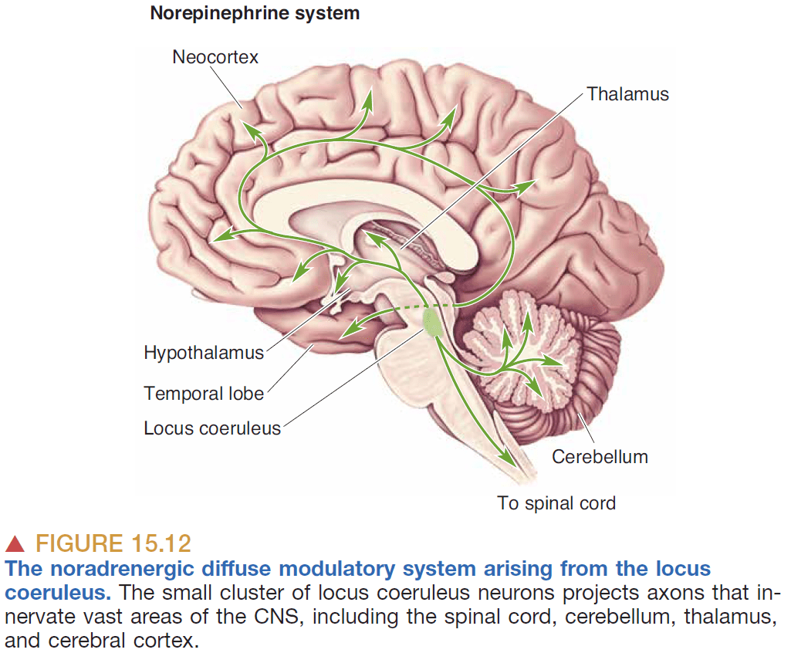
- In general, these systems are defined by their transmitter and they all maintain brain homeostasis.

## Chapter 16: Motivation

- Motivation can be thought of as a driving force on behavior. It increases the chance and direction of a behavior.
- Skipping the in-depth text on how eating is regulated by the brain.
- The Leptin hormone controls our feeding behavior.
- Is hunger due to the lack of feeling full or is it its own signal?
- It is its own signal as the peptide ghrelin signals hunger.
- The dopamine-depleted animal behaves as though it likes food but does not want food.
- So it seems that dopamine is used to motivate an animal but doesn’t decide its preferences.
- Dopamine neurons also seems to signal errors in reward prediction.
- E.g. If a piece of candy is expected when a sound is played, but no candy follows, then the dopamine neurons firing decreases.
- Behaviors that cause expected or better-than expected outcomes are repeated. The outcomes that are worse than expected are not repeated.
- Dopamine is involved in the mechanism behind learning as synaptic connections that are active during and shortly before a rise in dopamine are changed to store this memory.

- It’s related to classical conditioning in psychology and reinforcement learning in computer science.
- Thirst is controlled by two factors
    - *Hypovolemia*: decrease in blood volume.
    - *Hypertonicity*: increase in the concentration of dissolved substances in blood.
- In each case of controlling the body’s energy (eating), water, and temperature, there are specialized neurons to detect changes in the regulated parameter and they feed that information to the hypothalamus to motivate behavior.
- Part 2 of this textbook deals with "how" behavior is initiated.
- E.g. How muscles move, how we taste what we eat, how we see.
- Part 3 of this textbook deals with "why" behavior is motivated.
- E.g. Why do we drink when thirsty, why do we shiver.
- However, we remain ignorant about the convergence of "how" and "why" in the brain.
- While it may seem like hormones control a lot of our behavior, we can and do exert a lot of control based on how we think; not just how we feel.

## Chapter 17: Sex and the Brain

- Are the brains of men and women different?
- Humans have 46 chromosomes, 23 from both parents.
- It’s the father’s genetic material that determines the child’s sex.
- Erection of the male penis is generated by a simple spinal reflex as men with cut spinal cords can still have an erection when stimulated.
- Evidence from two species of voles suggests that complex social behavior such as monogamy and polygamy are controlled by the expression of a single protein at one location in the brain.

- It’s hypothesized that the evolution of complex social behavior may be due to genetic mutations that change the distribution of particular hormone receptors.
- Since all behaviors depend on the structure and function of the nervous system, we can make a strong prediction that the male and female brains are also different.
- *Sexual dimorphism*: when two sexes of the same species exhibit different characteristics beyond differences in sexual organs.
- Ultimately, all behaviors are controlled by the brain.
- It’s possible for a person to have the male sex chromosomes(XY) but to develop female sex anatomy due to the lack of androgen receptors. Likewise, it’s possible for females to have the female sex chromosomes (XX) but develop male sex anatomy.
- No apparent anatomical difference separates male and female nervous systems. And any small differences aren’t known to serve any clear purpose.
- We also don’t know if the brains of homosexual and heterosexual people are different. Tentative evidence suggests that it may be due to brain organization.

## Chapter 18: Brain Mechanisms of Emotion

- We should distinguish between emotional experience (feelings) and emotional expression (behavior).
- *James-Lange theory*: proposes that emotions are defined by the physiological changes in the body. Emotional experience occurs when the brain senses physiological changes in the body.
- E.g. Fear is defined by the heart racing, faster breathing, and increased sweating.
- However, an emotion can still be felt even though there aren’t any physical signs.
- *Cannon-Bard theory*: proposes that emotional experience is independent of emotional expression.
- Evidence for this comes from animals and people with transected spines. Even though the person can’t exhibit physiological changes in their body, their emotions are still present.
- Another piece of evidence against the James-Lange theory is the lack of reliable correlation between the experience of an emotion and the physiological state of the body.
- E.g. A racing heart could be due to fear, love, excitement, or sickness.
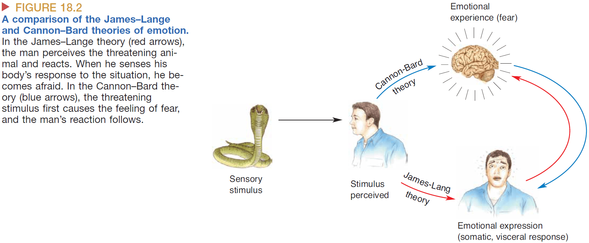
- However, there’s evidence against the Cannon-Bard theory such as emotion is sometimes affected by damage to the spinal cord.
- Another theory is that emotions are based off of the pattern of activation in the brain or the location that is activated the most when an emotion is experienced.
- The basic theories of emotions assumes that there are six basic emotions
    - Anger
    - Disgust
    - Fear
    - Happiness
    - Sadness
    - Surprise
- The dimensional theories of emotion assumes that emotions are constructed from smaller building blocks such as valence and arousal.

- *Klüver-Bucy syndrome*: removal of the temporal lobes causes the follow symptoms in both monkeys and humans
    - Visual recognition problems
    - Oral tendencies
    - Hypersexuality
    - Flattened emotions
    - Reduced fear and aggression
- Evidence suggests that the amygdala plays a key role in detecting fearful and threatening stimuli.
- *Learned fear*: fear due to vivid emotional events that aren’t there when we were born.
- E.g. Fear of rejection.
- Interesting, learned fears disappear if there’s a lesion in the amygdala suggesting that learning a fear is due to synaptic and connective changes between the amygdala and the stimulus.
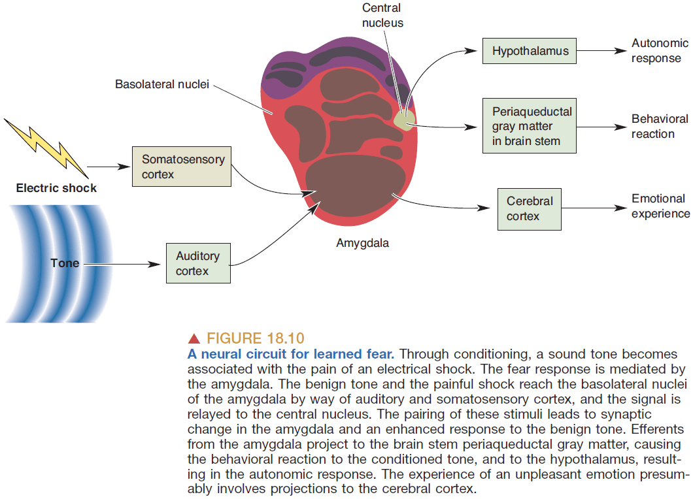
- *Predatory aggression*: attacks due to obtaining food.
- E.g. A lion hunting a zebra.
- *Affective aggression*: attacks due to a desire to show off.
- E.g. Loud sounds.
- Experiments with hypothalamic stimulation in cats can provoke both types of aggression.
    - Stimulation of the medial hypothalamus produces affective aggression.
    - Stimulation of the lateral hypothalamus produces predatory aggression.

## Chapter 19: Brain Rhythms and Sleep

- *Circadian rhythm*: the daily cycles of daylight and nighttime that almost all physiological functions follow.
- *Electroencephalogram (EEG)*: the measurement of electrical activity from our scalp.
- EGG measures voltage fluctuations in the range of tens of microvolts ($$\mu$$V) of many pyramidal neurons in the cerebral cortex.
- It takes many thousands of underlying neurons to generate an EEG signal big enough to be measured.
- So the amplitude of the EEG signal is dependent on how synchronous the activity of the underlying neurons are because the activity will add together to form a bigger signal.
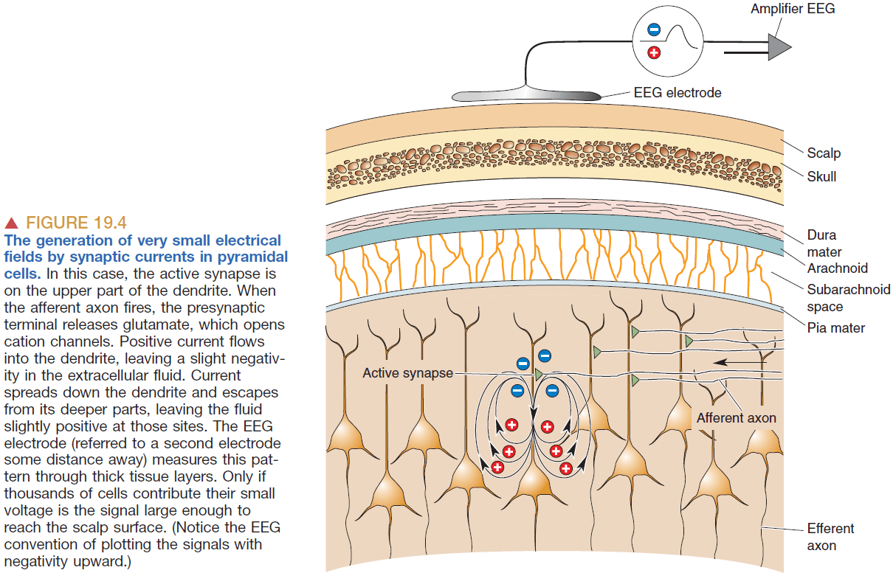
- *Magnetoencephalography (MEG)*: measuring the brain’s magnetic activity that results from electrical current flow.
- MEG is better at localizing the sources of neural activity than EEG.

- EEG rhythms
    - *Delta rhythms*: > 4 Hz, deep sleep.
    - *Theta rhythms*: 4-7 Hz, both sleeping and waking.
    - *Alpha rhythms*: 8-13 Hz, quiet and waking.
    - *Beta rhythms*: 15-30 Hz.
    - *Gamma rhythms*: 30-90 Hz, activated or attentive cortex.
- Interestingly, EEG rhythms across mammalian brains are similar despite large differences in brain mass.
- The generation of synchronized oscillations can be made in two ways
    - Central clock or pacemaker.
    - Distributed timing function.
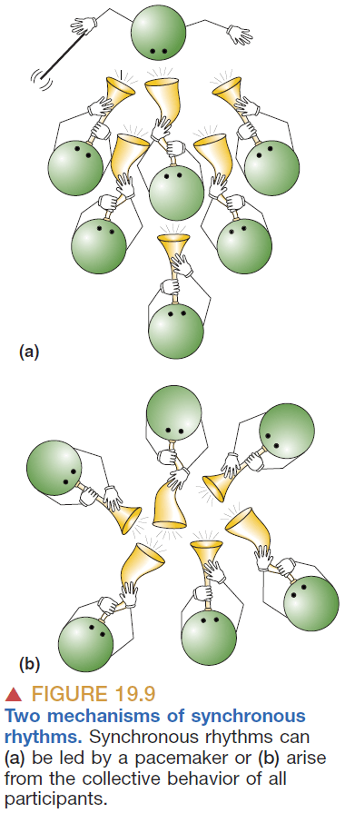
- E.g. A group of people clapping will eventually synchronize due to feedback and self-adjustment.
- The brain seems to employ both mechanisms as it uses a small group of neurons to start the synchronization and then that group acts as the leader.
- It uses excitatory and inhibitory thalamic neurons to force each individual neuron to conform to the rhythm of the group.
- We don’t know why the brain has rhythms and what it uses them for.
- *Seizure*: the most extreme form of synchronous brain activity.
- *Epilepsy*: repeated seizures.
- Research suggests that some seizures reflect an upset of the delicate balance of synaptic excitation and inhibition in the brain.
- We can still describe what we cannot explain such as sleep.
- *Sleep*: a readily reversible state of reduced responsiveness and interaction with the environment.
- Coma and general anesthesia are not readily reversible so they don’t quality as sleep.
- *REM sleep*: when the EEG looks more awake, the body is immobilized, and when dreams occur.
- *Non-REM sleep*: when the EEG shows large, slow rhythms.

- William Dement’s description of sleep states
- *Non-REM*: an idling brain in a moveable body.
- *REM*: an active, hallucinating brain in a paralyzed body.
- REM sleep is dreaming sleep.
- About 75% of total sleep time is spent in non-REM and 25% is spent in REM.

- All mammals, birds and reptiles appear to sleep but only mammals and some birds have a REM phase.
- Given how pervasive sleep is throughout the animal kingdom, why do we sleep?
- No single theory of why we sleep is widely accepted, but the two main theories are that we sleep for restoration or adaptation.
- Maybe sleep is an adaptation for conserving energy which fits with the idea that the brain consumes a lot of energy and it expensive to maintain.
- Sleep isn’t related to sensory input as if the input is blocked in an animal, the animal will still continue to have sleep-wake cycles.
- Wide expanses of the cortex are controlled by a very small collection of neurons that are much deeper in the brain.
- That small collection acts like switches or gatekeepers of sensory information and they can alter cortical excitability.
- The most critical part that controls the sleeping and waking cycles are the diffuse modulatory neurotransmitter systems.
- Three kinds of evidence that the sleep mechanism is localized
    - Lesion in the brain stem
    - Results of stimulation
    - Recording of neural activity
- The same system that controls the sleep process also actively inhibits our spinal motor neurons to prevent us from acting out our dreams.
- Adenosine and nitric oxide (NO) also seem to play a role in making us sleep.
- The brain’s biological clock is the suprachiasmatic nuclei (SCN) and it’s synchronized with light-dark cycles from ganglion cells in the retina.
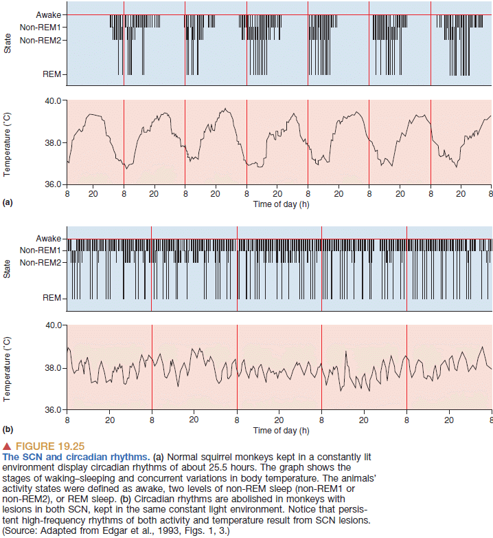
- Evidence that the SCN controls the circadian clock comes in the form of hamsters. Transplanting the SCN from one hamster to another also transplants the circadian rhythm.
- Sleep appears to be regulated by a mechanism other than the circadian clock, which depends primarily on the amount and timing of prior sleep.
- But how does the SCN keep track of time? It isn’t through APs as when the neurotoxin tetrodotoxin is applied to the SCN, APs stop but the rhythm continues.
- Evidence suggests that the SCN keeps its rhythm due to clock genes. A negative feedback look of gene transcription generates the circadian rhythms.

## Chapter 20: Language

- Numerous different aspects of language can be selectively disrupted, including speech, comprehension, and naming, suggesting that language is processed in multiple, anatomically distinct, stages.
- *Language*: a system for representing and communicating information using words combined with grammatical rules.
- Speech comes naturally to humans but reading and writing don’t.
- Language, intelligence, and thought are distinct as humans raised without any language can still do many tasks that require abstract reasoning.
- In speech, there aren’t silences between words so how to children pick up words?
- The answer is that children rely on statistical learning where they learn that certain combinations of sounds are more likely than others.
- E.g. In the phrase "hello baby", the probability that "lo" follows "hel" is greater than "ba" following "lo".
- *Aphasia*: the impairment of language abilities following brain damage.
- The left hemisphere appears to be dominant for speech and is where Broca’s area lives.
- Broca’s area is significant because it was the first clear demonstration that brain functions are localized to specific areas.

- Broca’s area isn’t as clear cut as it’s made to be as it varies from person to person and there are other factors such as the wiring of brain areas that also affect language skills.
- *Broca’s aphasia*: problems speaking but not understanding.
- *Wenicke’s aphasia*: problems understanding but not speaking.
- Wernicke-Geschwind model of language processing
    - Repetition of spoken words information flow
        - Speech reaches the ear
        - Cochlea converts it into APs
        - APs reach the auditory cortex
        - APs then reach Wernicke’s area for meaning processing
        - Word-based signals are passed from Wernicke’s area to Broca’s area
        - In Broca’s area, the words are converted to a code for the muscular movements required for speech
        - The muscle movements reach the lips, tongue, larynx, etc
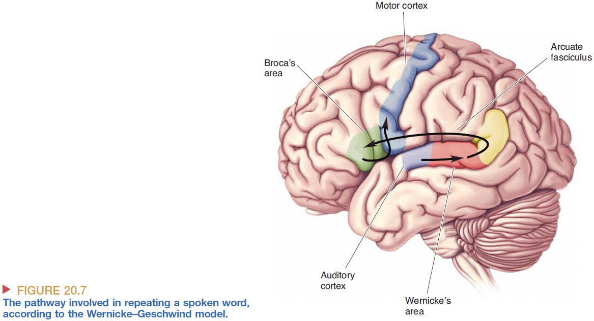
    - Reading written text aloud information flow
        - Words reach the eyes
        - Retina converts it into APs
        - APs reach the visual cortex
        - APs then reach Wernicke’s area and follows the same pathway as speech
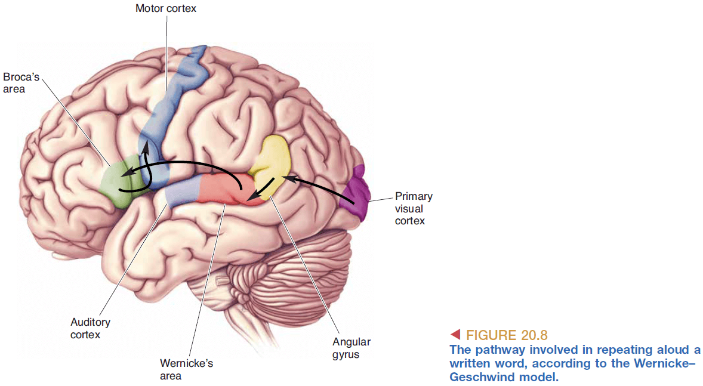
    - It’s assumed that reading and speech are both converted into the same abstract representation to be used by Wernicke’s area.
- However, the Wernicke-Geschwind model has several errors and oversimplifications
    - Reading words doesn’t need to be transformed at Wernicke’s area and can skip directly to Broca’s area.
    - Damage to the thalamus and caudate nucleus also affects aphasia but isn’t included in the model.
    - Language function appears to be plastic as patients can have significant recovery after a stroke.
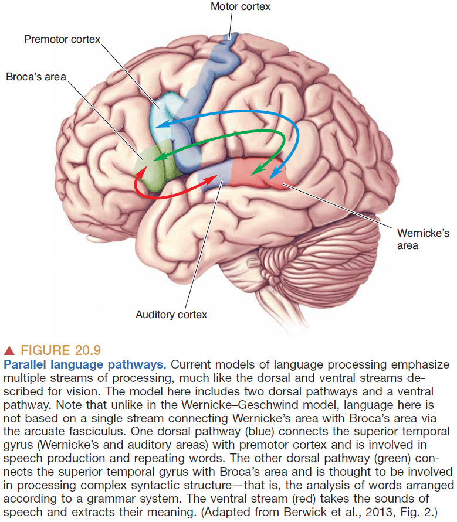
- In cortical processing, the sharp functional distinctions between regions as implied by the model don’t exist.
- The value of any model involves not only its ability to account for previous observations but also its ability to predict.
- *Conduction aphasia*: difficultly in repeating words but not producing speech or understanding language.
- Conduction aphasia occurs when there’s damage to the wiring between Broca’s and Wernicke’s areas.
- Sometimes the corpus callosum is split in patients to treat epilepsy and surprisingly, the patients mostly exhibit normal behavior except that they aren’t aware of anything left of their visual fixation point.
- Experiments with split-brain patients suggests that there are two independent brains controlling the two sides of the body.
- E.g. The left hand pulls up the pants but the right hand pulls them down.
- It seems that the left hemisphere is usually dominant for language but that right hemisphere still plays a role in language albeit a smaller role.
- Conclusions from how brain stimulation affects language
    - There’s considerable variability in brain areas that process language.
    - Some areas between language areas aren’t affected by stimulation.
    - Electrical stimulation at nearby sites can evoke quite different effects, and conversely, stimulation at distant sites can have the same effect.

## Chapter 21: The Resting Brain, Attention, and Consciousness

- *Attention*: the ability to focus on one aspect of sensory input.
- *Consciousness*: awareness of something.
- *Resting state activity*: the activity of the brain when nothing is happening.
- We expect that the resting activity varies randomly from person to person but this doesn’t seem to be the case.
- Conclusions from resting brain activity
    - The areas that show decreased activity compared to the resting state are consistent when the nature of the task is changed.
    - So some areas are always active at rest and become less active during any task.
    - The patterns in brain activity changes are consistent across human subjects.
- This suggests that the brain might be "busy" when we’re at rest and that the resting activities are consistent within a brain and are consistent across multiple brains.
- Areas that make up the default mode network (DMN)
    - Medial prefrontal cortex
    - Posterior cingulate cortex
    - Posterior parietal cortex
    - Hippocampus
    - Lateral temporal cortex
- Two hypothesis of the function of the default mode network
    - *Sentinel hypothesis*: the idea that the DMN is used to broadly monitor our environment.
    - *Internal mentation hypothesis*: the idea that the DMN is used to support thinking and remembering.
- While both hypotheses are not conclusive, there is clear evidence that the brain transitions from the DMN to sensory processing in active tasks that involve a change in attention.
- *Bottom-up attention*: when a stimulus attracts our attention without any cognitive input.
- E.g. When you notice something out of the ordinary without looking for it.
- *Top-down attention*: when attention is deliberately directed by the brain to some object/place.
- E.g. Focusing on the page number and ignoring the text when looking for a page.
- Searching is easier when attention is allocated to the search.
- *Covert attention*: focusing on something in our peripheral vision without looking at it (our gaze doesn’t reveal what we’re attending to).
- E.g. Checking out a crush.
- Focusing attention enhances visual processing in two ways
    - *Visual sensitivity*: providing a cue for our attention to follow increases our visual sensitivity which makes things easier to detect.
    - *Reaction times*: providing a cue for our attention to follow increases our reaction time which makes things faster to detect.
    - How does attention provide these results? It can’t be making the signals faster so maybe it’s making the pathways shorter? Why does expecting something to be there make it faster?
- The spotlight of attention analogy for attention.

- Attention can be moved independently of eye position.
- *Priority map*: a map slowing locations where attention should be directed based on stimulus salience and cognitive input.
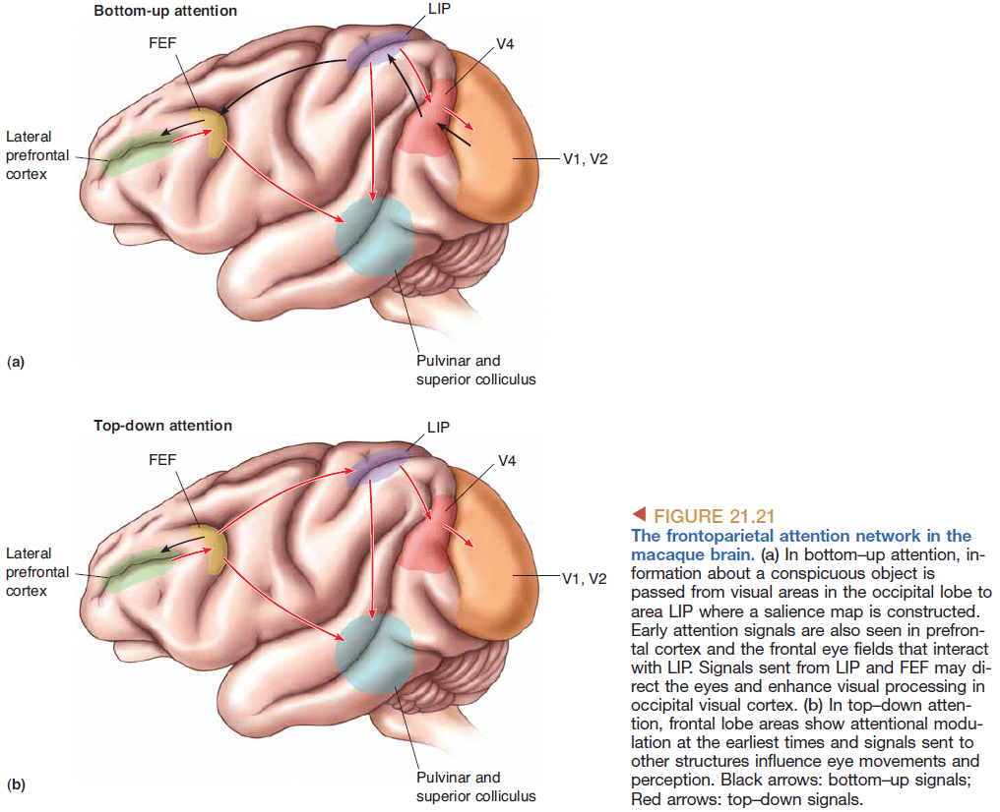
- If it is true that consciousness is based on standard physical principles, a logical inference is that it should one day be possible to construct a conscious machine.
- Is awareness and consciousness different? Studies conflict on a result.

## Chapter 22: Mental Illness

- *Neurology*: a branch of medicine that deals with nervous system disorders.
- *Psychiatry*: a branch of medicine that deals with mind or psyche disorders.
- There’s hope that neurons will solve the riddles of mental illness.
- This chapter discusses the following psychiatric disorders
    - *Anxiety disorders*: an inappropriate expression of fear
    - *Affective disorders*: disorders of mood
    - Schizophrenia
- Nearly all drugs that stimulate GABA (inhibitory neurotransmitter) reduce anxiety.
- Nearly all antidepressant drugs take several weeks to have an effect even though they have an almost immediate effect on transmission at the synapse.
- General results from all of these mental illness treatments is that
    - Most treatments are found by chance.
    - Most drugs seem to cause the nervous system to change in a way that adapts to the drug.
    - We don’t know why the drugs work.
- *Schizophrenia*: a loss of contact with reality and a disruption of thought, perception, mood, and movement.
- The risk of developing schizophrenia increases with the number of shared genes suggesting a genetic basis for the disease.
- The answer to why drugs work for treating mental illnesses lies in the adaptive changes that occur in the brain in response to the treatment.

# Part IV: The Changing Brain

## Chapter 23: Wiring the Brain

- Most of the functions of the brain depend on the remarkably precise connections among its 85 billion neurons.
- E.g. The visual system.
- The connections depend both on our genes and our experience; both nature and nurture.
- Neuronal structure develops in three major stages
    - Cell proliferation
    - Cell migration
    - Cell differentiation
- *Radial glial cells*: special cells that divide to give rise to all neurons and astrocytes of the cerebral cortex.

- Radial glial cells can take one of two paths
    - *Symmetrical cell division*: the cell divides into two radial glial cells.
    - *Asymmetrical cell division*: the cell divides into a radial glial cell and a neural precursor cell.
- Once a daughter cell commits to a neuronal fate, it will never divide again.
- In most parts of the brain, the neurons you are born with are all you will have in your lifetime.
- Cell fate is regulated by differences in gene expression during development.
- Multiple cell types, such as layer VI and layer V cells, can arise from the same precursor cell depending on what genes are transcribed during early development.
- The hippocampus creates around 700 new neurons per day but also loses the same number which keeps the number of neurons in the hippocampus constant.
- One difference between the development of a rodent’s brain and of a primate brain is that there’s an elaboration of a second proliferative layer of cells called the subventricular zone.
- Neurons derived from the subventricular zone are destined for the upper layers of the cortex (layers II and III) which are used to connect cytoarchitecturally distinct areas.
- It’s possible that this increases the computation power of primate brains compared to other brains.
- *Neural precursor cells*: immature neurons.

- Each new wave of neural precursor cells migrates right pass the previous precursor cells so the cortex is said to be built from the inside out.

- E.g. Layer VI, the bottom layer, is built first, then layer V is built on top of layer VI.
- *Cell differentiation*: the process of a cell taking on the appearance and characteristics of a neuron.
- Neuronal differentiation occurs first followed by astrocyte differentiation.
- When a neuron develops neurites, they initially all look the same but after some time, the axon and dendrites become recognizable.
- Differentiation is programmed before the neural precursor cell arrives at its final resting place.
- The neocortex is like a patchwork quilt with many structurally distinct areas being stitched together.
- Most cortical neurons are born in the ventricular zone and then migrate along radial glia to take up their final position in one of the cortical layers.
- Assuming that migrating neural precursor cells are guided precisely to the cortical plate by the network of radial glial fibers, then maybe the ventricular zone contains something like a film record of the future cortex that is projected onto the wall of the telencephalon as development progresses.
- The analogy is that by projecting a film roll using light, the picture gets enlarged but still retains the same proportions and information just scaled up.
- This has been proven to be the case for the majority of cortical neurons.
- *Radial unit hypothesis*: the concept that an entire radial column of cortical neurons originates from the same birthplace in the ventricular zone.
- The surface area of the human neocortex is a thousand times greater than that of a mouse and ten times greater than that of a macaque monkey but differs in thickness by less than two times.
- The difference in surface area is due to the size of the proliferative ventricular zone which is due to differences in the duration of the period of symmetrical cell division in early gestation.
- A reasonable hypothesis is that a mutation of the genes might have increased the number of proliferative radial cells and thus enlarged the surface of the neocortex.
- The realization that the largest structure of our brain receives all its neurons by orderly, long-distance migration.

- Cortical areas differ not only in terms of cytoarchitecture but also in terms of connections.
- It’s suggested that the thalamus is import for specifying the pattern of cortical areas.
- The subplate layer of earliest born neurons seems to contain the instructions for the assembly of the cortical quilt.
- The stages of developing the long-range connections in the brain
    - Pathway selection
    - Target selection
    - Address selection
- Each selection becomes more specific just like a normal address.
- E.g. Highway 1 (pathway), Marlborough neighborhood (target), 199 Martree Square house (address).
- *E.g. Suppose you’re a retinal ganglion cell and you’re trying to connect to the LGN. You follow the path down optic nerve until you reach the optic chiasm. You have three choices*: continue going down the same optic tract, go down the opposite optic tract, or go into the optic nerve from the other eye.

- The three phases depends on the communication between cells such as
    - Direct cell-to-cell contact
    - Cell secretions
    - Diffusible chemicals
- *Fasciculation*: axons that stick together grow together.

- A common method of pathway formation is the initial start of connections by pioneer axons.
- Pioneer axons seem to get to the destination first by "connecting the dots".
- The growth of neurites is "pulled" and "pushed" by chemoattractants and chemorepellents.
- *Chemoaffinity hypothesis*: the idea that chemical markers on growing axons are matched by complementary chemical markers on their targets to establish precise connections.
- Interestingly, there must also be a large-scale reduction in neurons and synapses that occurs during pathway formation.
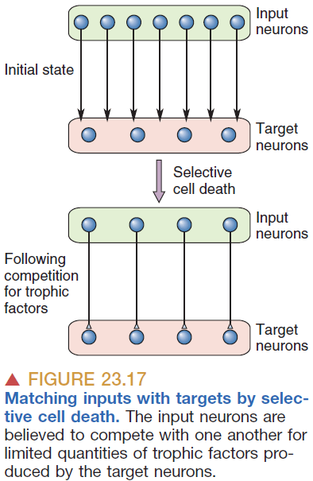
- *Synaptic capacity*: the maximum number of synapses a neuron can receive.
- Synaptic capacity peaks in early development and declines as neurons mature.
- Synaptic capacity is stable from infancy to puberty but sharply declines by almost 50% during adolescence.

- *Synaptic rearrangement*: the change of distribution of synapses of a neuron.

- There’s abundant evidence that widespread synaptic rearrangement occurs in the immature.
- Unlike most of the earlier steps of pathway formation, synaptic rearrangement occurs as a consequence of neural activity and synaptic transmission.
- Most activity-dependent development occurs after birth such as learning to see.
- E.g. The early ganglion cells fire in "waves" that spread across the retina so that the activity of a ganglion cell is highly correlated with the activity of its nearest neighbors. Then segregation occurs in the LGN when only retinal terminals that are active at the same time are retained.
- Whenever a wave of retinal activity drives a postsynaptic LGN neuron to fire action potentials, the synapses between them are stabilized.
- The synapses that can be modified this way are called Hebb synapses and the synaptic rearrangement is called Hebbian modifications.

- If one eye is deprived of stimulus during a critical period after birth, that eye’s ocular dominance stripes in the LGN are thinner than normal. This effect is reversible if the eye is opened and the other closed but only up to a certain point.
- This demonstrates that synaptic rearrangement is experience-dependent during a critical period and stops being as plastic after this period.
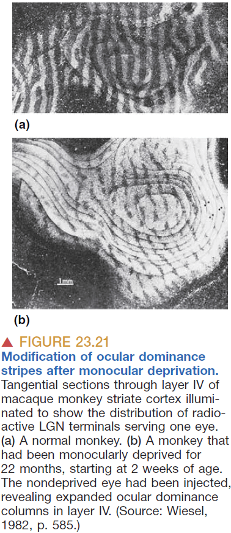
- Eye-specific domains are dependent on asynchronous patterns of activity (the "waves") spontaneously generated in the two eyes.
- The establishment of binocular receptive fields depends on the correlated patterns of activity that arise from the two eyes as a consequence of vision.
- *Critical period of development*: a period of time when intercellular communication alters a cell’s fate.
- *Ocular dominance shift*: the shift to monocular vision due to depriving one eye of stimuli.
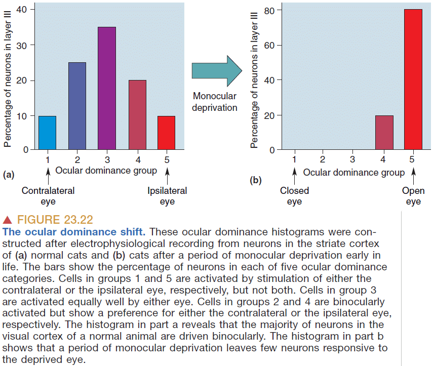
- Ocular dominance plasticity diminishes with age and coincides with the time of greatest growth of the head and eyes suggesting that development of binocular connections depends on this plasticity.
- Ocular dominance is a form of plasticity and doesn’t follow the rule of "Use it or lose it".
- *Binocular competition*: when the input from both eyes actively compete for synaptic control of the post-synaptic neuron.
- Is ocular dominance due to disuse of the eye?
- No, it’s due to competition as both eyes compete for the same neurons and if one eye is deprived, then it always loses.
- If the activity of the two eyes is correlated and equal in strength, then the two inputs will be retained on the same cortical cell creating a cell with binocular receptive fields.
- However, if this balance is disrupted by depriving one eye, the more active input will somehow displace the deprived synapses or cause them to be less effective.
- This is demonstrated by the "strabismus" condition where one eye is misaligned causing no cells with binocular receptive fields to develop.
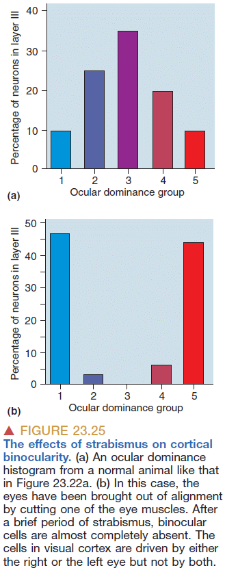
- Synaptic plasticity in the cortex requires the release of "enabling factors" that are linked to behavioral state (level of alertness).
- E.g. Depriving the striate cortex of modulatory inputs causes substantial impairment of ocular dominance plasticity even though the visual pathway was unaffected.
- Synapses form in the absence of any electrical activity.
- Two rules for synaptic modification
    - When a presynaptic axon is active while the postsynaptic neuron is strongly activated (under the influence of other inputs), then the synapse is strengthened. This is Hebb’s rule of neurons that fire together wire together.
    - When a presynaptic axon is active while the postsynaptic neuron is weakly activated (under the influence of other inputs), then the synapse is weakened. Neurons that fire out of sync lose their link.
- The key is correlation. Synapses are "validated" based on their ability to participate in the firing of their postsynaptic partner.
- How does the presynaptic axon know when to "strengthen" the synapse? There must be some feedback mechanism.
- Glutamate is the transmitter at all of the modifiable synapses.
- The magnitude of the $$Ca^{2+}$$ flux passing through the NMDA receptor channel specifically signals the level of pre and postsynaptic coactivation.

- *Long-term potentiation (LTP)*: the strengthening of synaptic transmission as a result of strong NMDA receptor activation.
- The molecular basis for LTP is due to more AMPA receptors being added.

- During monocular deprivation, the activity of the deprived retina fails to correlate with the activity of the other eye so the deprived-eye synapses are weakened.
- *Long-term depression (LTD)*: when an active synapse decreases in effectiveness due to lower levels of NMDA receptor activation.
- LTD is also accompanied by a loss of AMPA receptors and eventually loss of the synapse.
- Rough explanation of what occurs during monocular deprivation
    - One eye is closed.
    - Closure prevent the retina from firing in correlation to the other eye.
    - Since the activity isn’t correlated, the output from that eye is considered noise/static.
    - This causes weak activation of NMDA receptors.
    - Which then causes the removal of AMPA receptors.
    - Which then leads to these synapses losing influence over responses of cortical neurons.

- It appears that the younger you are, the greater the scale of change of the brain.
- E.g. Children can change overall brain structure (eye functioning) while old people can only change at the synaptic level (memorize).
- Why do critical periods end?
- Three current hypotheses
    - Plasticity diminishes when axon grow ceases.
    - Plasticity diminishes when synaptic transmission matures.
    - Plasticity diminishes when cortical activation is constrained.
- Inhibitory circuits may also regulate the length of the critical period by preventing access to modifiable synapses.
- Most neurons in the brain find their proper place before birth and the final refinement of synaptic connections occurs during infancy and is influenced by the sensory environment.
- The mechanisms of synaptic plasticity proposed for learning bear a close resemblance to those believed to be the mechanism for synaptic rearrangement during development.

## Chapter 24: Memory Systems

- Experience modifies our brain and influences our behavior.
- Evidence of brain lesions differentially affects different types of remembered information, suggesting that there’s more than one memory system.
- Experience-dependent brain development and learning are similar but probably use similar mechanisms at different times and in different cortical areas.
- Learning and memory are lifelong adaptations of brain circuitry to the environment.
- *Learning*: the acquisition of new knowledge and skills.
- *Memory*: the retention of learned information.
- No single brain structure or cellular mechanism accounts for all learning.
- The way information of a particular type is stored may also change over time.
- *Declarative memory*: memory of events and facts.
- Declarative memory is broken down into
    - *Episodic memory*: events.
    - *Semantic memory*: facts.

- Nondeclarative memory is broken down into
    - *Procedural memory*: skills, habits, behaviors.
- Declarative memory requires conscious recollection while nondeclarative doesn’t.
- Declarative memories are easy to form but also easy to forget while nondeclarative memories are harder to form (requires repetition and practice) but harder to forget.
- Procedural memories are formed through two types of learning
    - *Associative learning*: a change in behavior in response to the formation of associations between events. There are two types
        - *Classical conditioning*: associating a stimulus with a second stimulus that shouldn’t evoke the second stimulus but does.
            - *Instrumental conditioning*: associating a response with a meaningful stimulus.
    - *Nonassociative learning*: a change in behavior over time in response to a single type of stimulus. There are two types
        - *Habituation*: learning to ignore a stimulus that lacks meaning.
        - *Sensitization*: learning to intensify the response to a stimuli.
- *Long-term memory*: memories that you can recall days, months, or years later.
- *Short-term memory*: memories that you can recall hours later.
- *Memory consolidation*: the conversion of short-term memories to long-term memories.

- *Working memory*: memories that only last seconds.
- Keeping memory alive through repetition is a hallmark of working memory.
- Working memory can be distinguished from short-term memory by these factors
    - Very limited capacity (7 digits).
    - Need for repetition.
    - Very short duration.
- There’s evidence that different sensory systems use different temporary storage areas.
- E.g. Someone can remember a visual list of numbers but not as well as a spoken list.
- *Amnesia*: a major loss of memory or ability to learn.
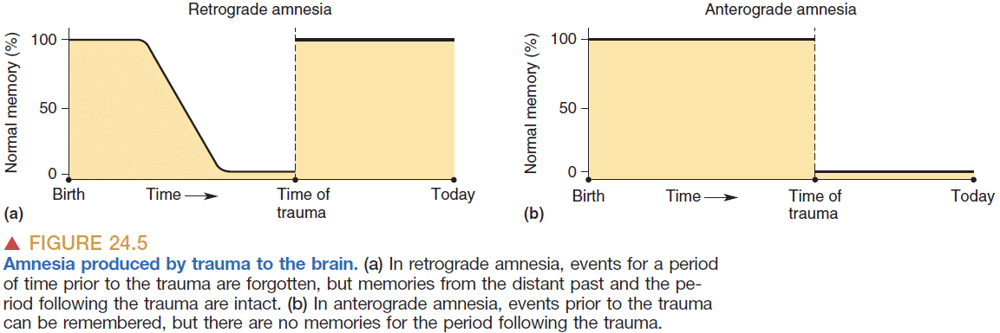
- *Retrograde amnesia*: memory loss for events prior to the trauma.
- *Anterograde amnesia*: memory loss for events following the trauma.
- Interestingly, for retrograde amnesia, newer memories are forgetting but older memories aren’t suggesting a link between an old memory and how hard it is to forget it.
- One way to increase working memory is through chunking the information into meaningful groups.
- Working memory is is capability of the neocortex found in multiple locations in the brain.
- Experiments with legions in the prefrontal cortex suggest that the prefrontal cortex is involved in retaining information in working memory.
- *Engram/memory trace*: where a memory is stored.
- All of the cortex participates in memory storage and memories are distributed across the brain.
- *Cell assembly*: the group of simultaneously active neurons in response to an external stimulus.
- Hebb, the creator of the idea of a cell assembly, hypothesized that if the activation of a cell assembly persisted long enough, it would be remembered/consolidated by the idea that neurons that fire together wire together.
- This cell assembly could then be recalled by activating the cell assembly.
- Hebb’s important ideas
    - The cell assembly could be distributed among the connections between neurons.
    - The cell assembly could involve the same neurons used in sensation and perception.
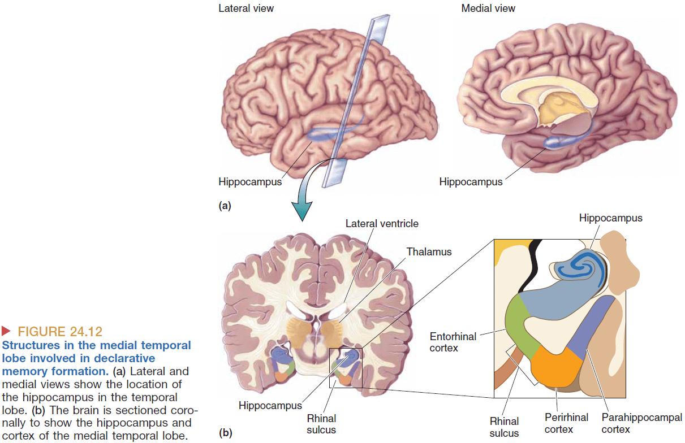
- Removing the temporal lobe has profound effects on learning and memory.
- Results from patient H.M.
    - The MTL is critical for memory consolidation but not for retrieval.
    - The MTL doesn’t store all memories but it does seem to store some.
    - Working memory isn’t dependent on the MTL.
    - The formation and retention of procedural memories uses different brain structures than those used in declarative memory consolidation.
- Hippocampus key points
    - Binds sensory information for the purpose of memory consolidation.
    - Supports spatial memory of the location of objects.
    - The storage of memories for some unknown length of time.
- *Place cells*: neurons that have a receptive field for places.
- E.g. One neuron might only fire if the subject is in the corner.
- Interestingly, the responses of place cells are related to where the animal thinks it is, not necessarily where it actually is which depends on sensory input.
- *Grid cells*: neurons that fire at multiple locations that form a hexagonal grid.
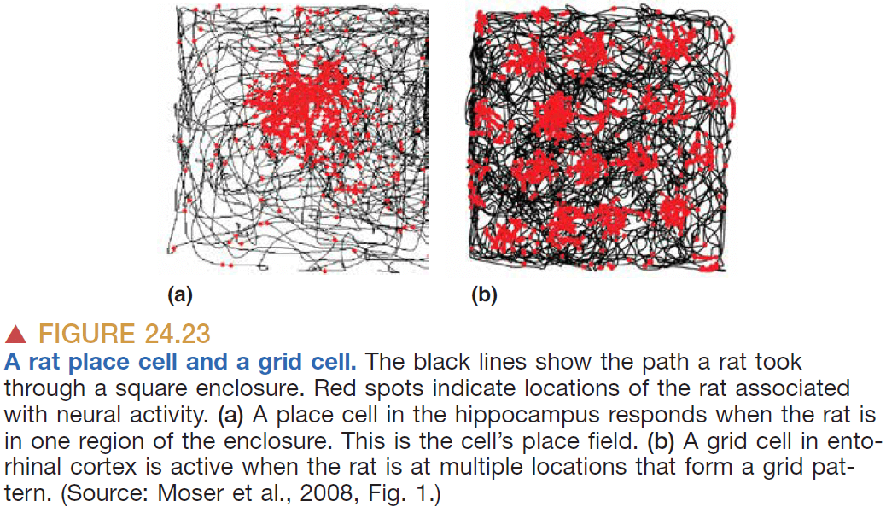
- Models suggest that place fields in the hippocampus may result from summation of inputs from grid cells.
- A place field would be the location where multiple grid cells align.
- Like place cells, grid cells continue to fire when there’s no light suggesting that these cells aren’t simple sensory receptive fields but rather where the animal thinks it is.
- Interconnectedness is a key feature of declarative memory storage.
- Like the case of the Russian with exception memory who had synesthesia, memory and connectivity are somehow related.
- Current evidence suggests that the hippocampus is used to establish memories for "what happened where."
- The standard model of memory consolidation
    - Information comes through neocortex areas associated with sensory systems.
    - The information is then sent to the MTL for processing.
- *Synaptic consolidation*: changes in synapses create a memory trace.
- *Systems consolidation*: when engrams are moved over time into distributed areas of the neocortex.
- Before systems consolidation of a memory occurs, retrieval of that memory requires the hippocampus but it isn’t afterwards.
- An alternative model to the standard model is the multiple trace model of consolidation
    - The hippocampus is always involved in memory storage.
    - Systems consolidation doesn’t ever relinquish engrams entirely to the neocortex.
    - It’s hypothesized that each time an episodic memory is retrieved, it occurs in a new context from the initial experience and the memory combines with the new sensory input to form a new memory trace using both the hippocampus and the neocortex.

- *Reconsolidation*: the reactivation of a memory makes it sensitive to changes.
- When we recall a memory, it becomes susceptible to change and reconsolidation.
- The striatum is part of a procedural memory system but not of the declarative memory system.

## Chapter 25: Molecular Mechanisms of Learning and Memory

- Chapter 24 deals with "where" memories are stored, this chapter deals with "how" memories are stored.
- Learning and memory occur in two stages
    - The acquisition of a short-term memory.
    - The consolidation of a long-term memory.
- Memory acquisition (learning) occurs by a physical modification of the brain.
- Not all memories are created equal.
- E.g. What you ate for dinner last Tuesday probably won’t be remembered unless something eventful/significant occurred such as it being your first date.
- Some mechanisms in the brain ensure that some experiences are retained while others are lost.

- *Prospagnosia*: selective amnesia for faces.
- The IT (inferior temporal lobe) neurons demonstrate stimulus selectivity or the response to certain stimuli but not others.
- Shifts in the selectivity of cortical neurons correlates well with the formation of memories.
- *Distributed memory*: a memory is stored the pattern of neuron activation rather than the individual neurons.
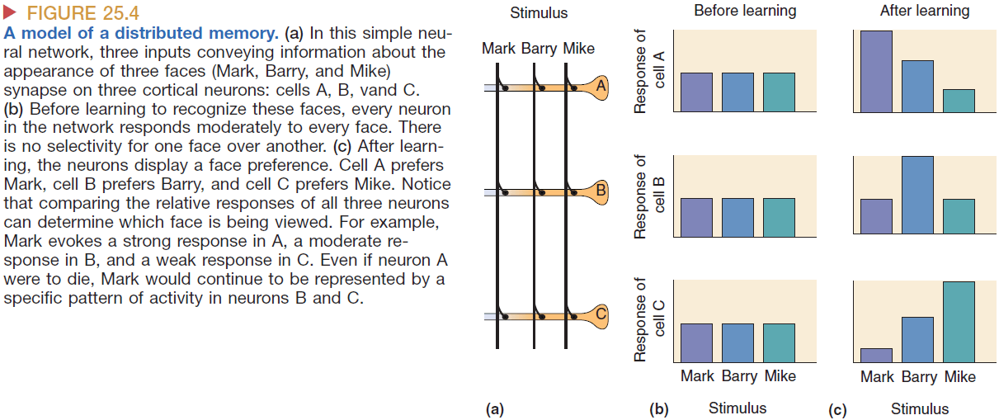
- One advantage of distributed memory is that it is is fault-tolerant.
- E.g. The loss of one neurons doesn’t mean the memory is lost but rather weakened.
- The more neurons in the network, the more unique memories that can be stored and the more resistant the memories are to errors.
- *Graceful degradation*: when a memory is slowly lost in comparison to catastrophic loss.
- The physical change that leads to memory can be the modification of synaptic weight.
- In other words, synapses store memories.
- LTP is input-specific.

- *Tetanus*: a brief burst of high-frequency stimulation.
- *Input specificity*: how only active inputs show synaptic plasticity.
- LTP requires that synapses be active at the same time that the postsynaptic neuron is strongly depolarized.
- To achieve the necessary depolarization with tetanus
    - The tetanus must be high enough in frequency to cause temporal summation of EPSPs.
    - There must be enough synapses activated simultaneously to cause spatial summation of EPSPs.
- *Cooperativity*: when multiple neurons must cooperate to produce enough depolarization.
- LTP seems to require a frequency threshold and a neuron count threshold.
- *LTP and Hebb’s rule are linked*: inputs that fire together wire together.
- *The molecular basis of LTP in shown in Figure 23.28 but in words*: LTP depends on the rise in postsynaptic calcium ions ($$Ca^{2+}$$) that are released by the NMDA receptor when the depolarization is sufficient.
- *Spike timing-dependent plasticity (STDP)*: when the pre-synaptic neuron fires at or before the post-synaptic neuron fires, then the synapse is strengthened. If it fires after, then the synapse is weakened.
- STDP can be thought of as strengthening the synapse only when the pre-synaptic neuron is the "cause" of the post-synaptic neuron firing.
- STDP also "filters" its inputs to be correlated in time and does a "temporal pruning". The inputs that provide the earliest indication of correlation eventually become the final input to the neuron.
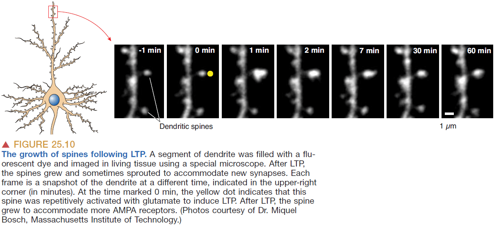
- *BCM theory*: an extension of Hebb’s theory that accounts for the bidirectional changes in synaptic strength and the introduction of a "modifcation threshold" to account for the history of the postsynaptic cell activity.
- *Long-term depression (LTD)*: the weakening of a synapse due to tetanic stimulation at low frequencies.
- Bidirectional plasticity rules
    - Synaptic transmission occurring at the same time as strongly depolarization of the postsynaptic neuron causes LTP of the active synapses.
    - Synaptic transmission occurring at the same time as weak/modest depolarization of the postsynaptic neuron causes LTD of the active synapses.
- Networks of neurons can form distribution representations of the worlds that are
    - *Associative*: recollection of one memory can lead to the recollection of another linked to it by experience.
    - *Content addressable*: memories that are accessed by content rather than by a physical address in the network.
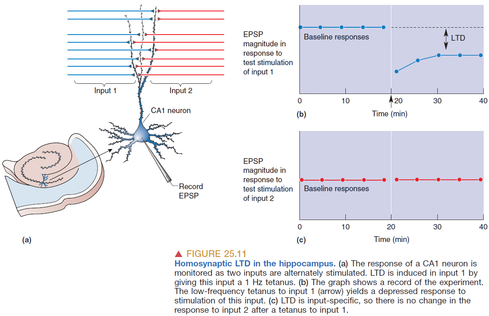
- LTD is a widespread phenomenon and and can result when the EPSP follows a postsynaptic AP.

- LTP and LTD appear to reflect the bidirectional regulation of both the phosphorylation and the number of postsynaptic AMPA receptors.
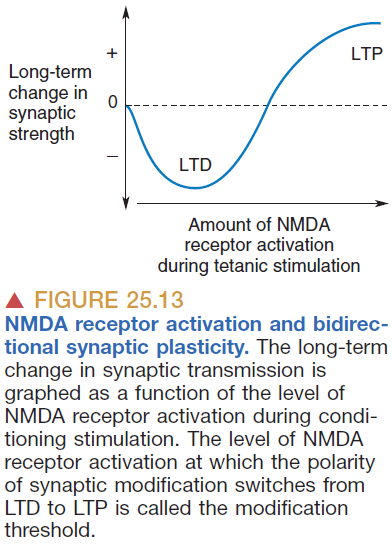
- Without limits to LTP and LTD, the synapses become unstable and tend towards extremes.
- *Metaplasticity*: that the rules of synaptic plasticity change depending on the history of synaptic or cellular activity.
- *Denervation supersensitivity*: when a neuron increases in excitability due to loss of synaptic input.
- Maybe this supersensitivity is the reason why phantom limbs occur.
- When cortical neurons are silenced, their electrical excitability increases.
- However, the increase preserves the relative differences in the strengths of synapses on a neuron.
- *Synaptic scaling*: the adjustment of absolute synaptic effectiveness that preserves the relative distribution of synaptic weights.
- Metaplasticity and scaling are used to control and limit synaptic plasticity.
- *Phosphorylation*: the adding of a phosphate group to a protein to change its synaptic effectiveness.
- Phosphorylation can’t account for long-term memory because
    - Phosphorylated proteins aren’t permanent due to removal.
    - Proteins have a lifespan of less than 2 weeks.
- We have some theories for the molecular basis of long-term memories but nothing solid.
- It appears the protein synthesis is important for memory consolidation but not for memory retainment.
- The persistence of LTP depends on whether the synaptic stimulation is strong enough to trigger protein synthesis in the postsynaptic neuron.
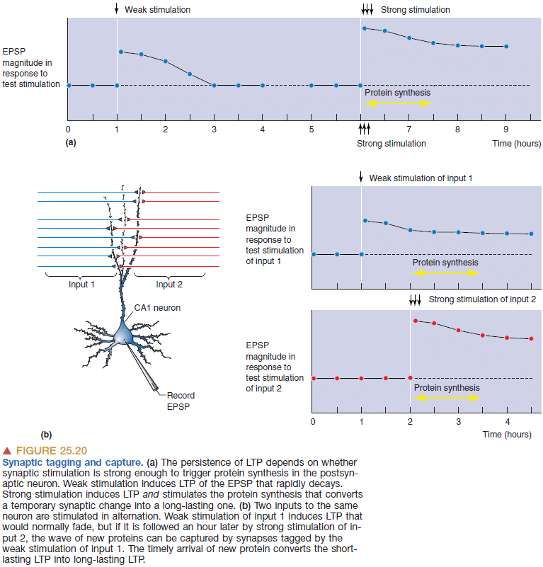
- The modulation of gene expression by CREB provides a molecular mechanism that can control the strength of a memory.

- Memories are represented as
    - A change in electrical activity
    - Intracellular second messengers
    - Modifications of existing synaptic proteins
- Short-term memories are consolidated into long-term memories though new protein synthesis and through the assembly of new microcircuits.
