<blockquote class="blockquote">
  
It's a poor sort of memory that only works backward.

  
Lewis Carroll

</blockquote>

## Introduction

- Why are brains better than computers? The short answer is that the brain employs a hybrid architecture of superior design.
- The purpose of this textbook is to identify the sources of such computational efficiency.
- Why haven’t we obtained the principles of the brain? One reason is that recent neuroscience has been technique driven.
- Modern neuroscience focuses on how to get data, not on how to interpret the data they get.
- Since the brain is a physical object that performs certain functions, its design must obey general principles of engineering.
- It helps to realize that neuroscience is really about reverse engineering the human brain.
- Why do animals need a brain? What fundamental purpose does it serve and at what cost?
- We tend to dismiss small organisms due them being mentally deficient, but they do learn and remember, just that their memories match their life contexts.
- We should care about small/primitive organisms because the mechanisms they evolved are partially retained in our own neurons.
- The increase in computational complexity is rewarded by an increase in capacity to inhabit richer environments/niches.
- Little beasts compute only what they must and thus they only pay for what they use. This also applies to us.
- Any feature of brain evolution that has been retained for so long must be effective since it aids in survival and reproduction.
- The core task of all brains is to regulate the organism’s internal state by anticipating needs and preparing to satisfy them before they occur.
- Also called homeostatic regulation, this has now been replaced by anticipatory regulation.
- E.g. Getting into the fight/flight response before danger has occurred prepares the body in case of danger.
- Advantages of anticipatory regulation
    - Matches overall response capacity to changes in demand.
    - Matches capacity at each stage in the system to anticipated needs.
    - Resolved potential conflicts between organs by shifting priorities.
    - Minimizes errors.
- The brain become more effective at guessing what it’ll need if it can control the organism’s behavior using memories.
- However, we can’t remember everything due to the cost of storage so we should only remember significant events, whereas insignificant events should fade and be forgotten.
- Persistent dangers are eventually ingrained in our neural wiring and genetics.
- E.g. Fear of snakes.
- To ensure that an organism executes orders from the brain, there are neural mechanisms that make it feel bad and good.
- E.g. Pleasure from sex and pain from physical damage.
- Another principle of neural design is that as information rate rises, cost rise disproportionately.
- E.g. Transmitting more information by spikes requires a higher spike rate and axon diameter increases linearly with spike rate. However, axon volume and energy use increases double with axon diameter.
- So only send information that’s needed and send it as slow as possible.
- This also leads to the principle that the brain needs to minimize energy per bit of information by computing at small scales.
- Neurons are also constrained by their volume due to the universal biophysical constraint of the electrical resistance of neuronal cytoplasm.
- Passive signal spread is governed by a square root law of dendritic diameter, which prevents neural wires from being any finer and smaller.
- This constraint on volume drives efficient layout of equal lengths of dendrite and axon and an optimal proportion of wires and synapses.
- All organisms use new information to better anticipate the future so learning is subject to the same constraints as all other neural functions.
- To conserve space, time, and energy, new information should be stored at the site of processing, the synapse.
- Low-level synapses should remember short-term changes so they must be cheap to modify such as the modification of protein channels.
- High-level synapses should remember long-term changes so their memories are worth more and should be stored using long-term mechanisms such as enlarging the synapse and adding new ones.
- A new synapse of diameter $$d$$ uses an area of $$d^2$$ of a volume of $$d^3$$. Since the brain is fixed in volume due to the skull, there are powerful space constraints.
- For every synapse that’s enlarged or added, another must be shrunk or removed. This is encapsulated in the principle of “save only what is needed.”
- The textbook proposes that many aspects of the brain’s design can be understood as adaptations to improve efficiency under resource constraints.
- The principles noted here aren’t new, but what’s new is the simplicity and compilation of the principles.

## Chapter 1: What Engineers Know about Design

- The task of reverse engineering a device is vastly accelerated by prior knowledge.
- Once the “how” of a device is understood, we can approach the deeper goal of “why”.
- Asking why teases out the principles of the device and it seeks to discover the fundamental causes of the device’s functions.
- We start by stating the brain’s goal and basic performance specifications given the environment.
- However, we should be careful of vague statements because they can be subjective.
- E.g. “Brief” to a biologist is a millisecond but to an electrical engineer is a nanosecond.
- Another looming point is cost, a sturdier machine can always be built but it will also cost more and could be less competitive.
- So design and cost are inseparable.
- The environment changes so the design must account for that.
- Two adaptive design strategies
    - Fail fast and fail a lot.
        - E.g. Animals with short lives or business startups.
    - Design for greater intrinsic adaptive capacity.
        - E.g. Animals with longer lives or machine learning.
- Both strategies operate under the same principles and are complementary.
- The brain employs both as it is a product of evolution, failing fast and a lot, while also being designed with intrinsic adaptation in the ability to learn.
- Design also evolves in the context of competition. Most designs aren’t new but are based on previous designs.
- However, sometimes it’s necessary to scrap old designs to achieve leaps in performance.
- E.g. Don’t reinvent the wheel but don’t only make improvements to it. Look for replacements for the wheel. The exploitation and exploration tradeoff.
- Efficient designs match the capacities of all parts to prevent bottlenecks at interfaces.
- Analogous to how mechanical engineers have a variety of screws and materials to build devices, nature has a catalog of parts in the form of DNA sequences to build organisms.
- E.g. Tuning the protein opsin to capture different wavelengths of light, thus enabling color vision.
- The reasoning behind the design principle “if one design is simple and another complicated, choose the complicated” is that when one part does two jobs, it doesn’t do either job well.
- It’s the same idea behind specialization and it leads to gains in efficiency.
- Advantages of specialization
    - Each part can be optimized separately.
    - More parts means more potential for refinement and improvement.
- E.g. The retina could use only one type of photoreceptor but it doesn’t. It uses two types, one for color vision (cones) and one for dim vision (rods).
- It’s reiterated that the cost of maintaining the membrane potential (-65 mV), is very high in the brain and it accounts for more than 60% of the brain’s total energy use.

## Chapter 2: Why an Animal Needs a Brain

- Why do we need a brain?
- An answer should apply to all brains such as the brain in a worm or fly.
- Since the answer should apply to all brains, the answer is easiest to discover by looking at simpler brains without the decorations of emotion and consciousness.
- One answer is that the brain’s purpose is to regulate the internal milieu and to help the organism to survive and reproduce.
- However, this isn’t quite the answer because you don’t need a brain to do this as evidenced by tiny bacteria and single-celled organisms.
- One organism, E. coli, has a memory of one second that’s stored using chemistry. And while this might not seem impressive, given its lifestyle, the memory is just as long as it should be.
- A brain provides its organism with a much longer record of the past and thus, it also provides it with a more extended future for it to exploit.
- Evolution follows the design principle of complicating by having cells specialize to form tissues, which then form systems and which then form organisms.
- The many tasks performed by a single cell are now divided among many specialized cells.
- However, this requires a tradeoff of increased cooperation and coordination.
- Coordination demands some ultimate authority to weigh alternatives, set priorities, and to execute commands.
- E.g. Governments, brains, stakeholders, and operating systems.
- Brains and neurons satisfy this demand of coordination and communication between cells and organs.
- In the organism C. elegans, nearly 40% of its cells are used for neurons and glial cells.
- What advantage do this cells provide to justify their immense investment?
- *Embodied computation*: using the body to compute instead of neurons.
- E.g. C. elegans uses its body and a cross-inhibitory circuit to generate a traveling wave pattern to move.
- Embodied computation is efficient as it doesn’t require the use of neurons in a central pattern generator and it uses the preexisting body for computation.
- A brain with a lot of neurons can generate richer behavior because it can form more connections and thus make more circuits.
- One of the new behaviors is pattern recognition that improves foraging.
- Pattern recognition can be made even more efficient by having the sensors themselves be motorized to improve searching the sensory space.
- E.g. Insect antenna, cat ear, human eye.
- An implicit benefit of improved foraging is that other organisms with the same behavior will meet at the same site and thus improved foraging improves mating chances.
- A place to feed is also a place to find mates.
- Information to the C. elegans' brain comes from three places: outside, inside, and the past.
- Design features of C. elegans
    - Compute as much as possible within a single cell, but don’t overload the cell too much or else it will do two tasks suboptimally.
        - As brains scale up to improve behavior, neurons specialize.
    - Use chemistry to compute whenever possible.
    - Use neuromodulators to switch behaviors.
        - A neuromodulator can be broadcast widely and yet still act locally and specifically, affecting only neurons that express an appropriate receptor.
        - It’s also an efficient switch to recruit a neural circuit for another purpose thus allowing components to be fully used.
    - Conserve synapses.
        - Improve synapse reliability by averaging over time.
        - Send information as slowly as possible to conserve synapses, cells, and energy.
    - Use stereotyped components.
    - Minimize wiring costs.
        - Follow the rule of placing the most densely interconnected components together and place the more sparsely connected components further apart.
    - Favor analog over pulsatile.
        - Since electrical signals in the worm travel less than a millimeter, their neurons can conduct passively instead of using APs.
        - This confirms that C. elegans doesn’t use APs as it doesn’t have voltage-gated sodium channels.
- The brain increases opportunities for survival and reproduction in a competitive and changing environment.
- Diffusion is too slow for communicating across the body so organisms turned to electrochemical signaling.
- The key innovation is the neuron, a cell specialized to collect, process, and communication information to other parts of the body via synapses.
- It also allows for the storage of information that lets the individual organism adapt to changes rather than waiting for the population to adapt.
- This leads to another interesting idea, that lifespan and lifestyle are related to particular types of memory.
- Nothing should be remembered unless it enhances survival and reproduction. Lose it if you don’t use it.

## Chapter 3: Why a Bigger Brain?

- Despite the large range of scales, from mouse to macaque monkey to human, we can generalize from smaller brains because every brain part identified in a mouse can also be identified in a monkey and human.
- This is also despite half a billion years of evolution, brain design seems to have remained consistent, implying that they’re neither random nor an accident.
- As organisms increase in size, they require more energy and thus need to increase their foraging volume.
- To forage effectively while avoiding dangers, brains must commit resources to determining friends from foes, to discriminate edible from toxic.
- Thus the brain needs to compare patterns not only for the external environment, but also within itself to ensure that motor commands are executed as intended.
- This requires a form of feedback and evaluation of reward prediction.
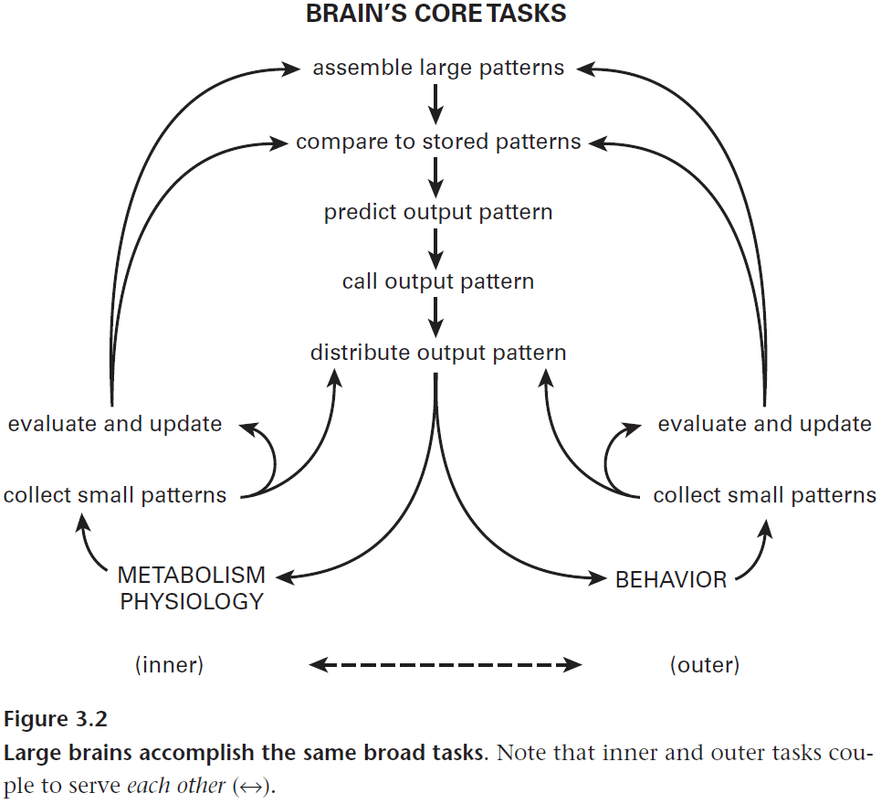
- For internal processes, the goal isn’t to correct mistakes but rather to prevent them by anticipating particular responses.
- E.g. The release of certain enzymes in the mouth, stomach, and intestines when food is smelt.
- Three key rules for efficient regulation
    - Adapt response capacity to changes in input level.
    - Match response capacities across the system.
    - Trade between systems.
- Predictive regulation versus self-regulation by feedback.
- The fundamental constraint on brain design is the law governing the costs of capturing, sending, and storing information.
- *Information*: the reduction of uncertainty about some situation X associated with observing any variable Y that is causally correlated with X.
- Reduction of uncertainty succinctly describes the brain’s purpose.
- To convey information, a neuron must causally relate its input and output.
- Thus, a neuron’s information transmission capacity is limited by the number of distinct outputs that it can generate.
- And the number of distinct outputs is the number of different spike trains that it can produce since neurons only output in spike trains.
- Spike trains are defined by two factors
    - Mean firing rate (R spikes per second).
    - Precision of spike timing ($$\Delta$$t seconds).
- What’s the relationship between mean firing rate, precision of spike timing, and the number of unique spike trains a neuron can produce?
    - Suppose a neuron transmits for one second, producing R spikes with a timing precision of $$\Delta$$t.
    - Then the number of different spike trains, M, is the number of ways the neuron can fit R spikes into T = 1/$$\Delta$$t intervals.
    - Using combinatorics, the number of unique spike trains is: $$M = \frac{T!}{R!(T-R)!}$$.
    - We can convert this into information by using the equation: $$H = log_{2}(M)$$.
- By using a log-base-2, we’re measuring information in terms of bits.
- E.g. Bits per second, bits per spike, bits per cubic millimetre, bits per molecule of ATP.
- Information rate increases with spike rate and with spike timing precision.
- However, increasing spike rate also decreases the bits per spike as a symbol that occurs more frequently is less surprising and so less informative.
- So, a code with fewer spikes is more efficient as it transmits only surprising symbols.
- This also fits the idea that neurons only convey changes in information, and not the information itself.
- The rule is that infrequent spikes carry more bits/information.

- Reasons for using low spike rate
    - Increased efficiency
    - Decreased energy used
    - Decreased space used
- There’s a law of diminishing returns for increasing information rate.
- From the disproportionate cost of sending information at a higher spike rate, we conclude three design principles.
- Three principles of neural signalling
    - Send only what’s needed.
    - Send at the lowest acceptable spike rate.
    - Minimize wiring.
- Minimize wiring not only to save space, but to also save time for transmission.

## Chapter 4: How Bigger Brains Are Organized

- The principle of minimizing wiring is seen by how the brain separates the wires that connect local circuits with wires that connect distant circuits.
- E.g. The grey and white matter of the brain.
- The reasoning is that to mix wires increases the total wire length and thickness.
- It also follows the principle to only send simple instructions and to compute complex details locally.
- The hypothalamus stores a dedicated circuit for each behavioral pattern. Many circuits fit into the small space because the output messages are simple.
- E.g. Attack, sleep, feed, drink.
- To activate the circuits, the hypothalamus only receives summaries as input, thus conserving energy and space via low information rates.
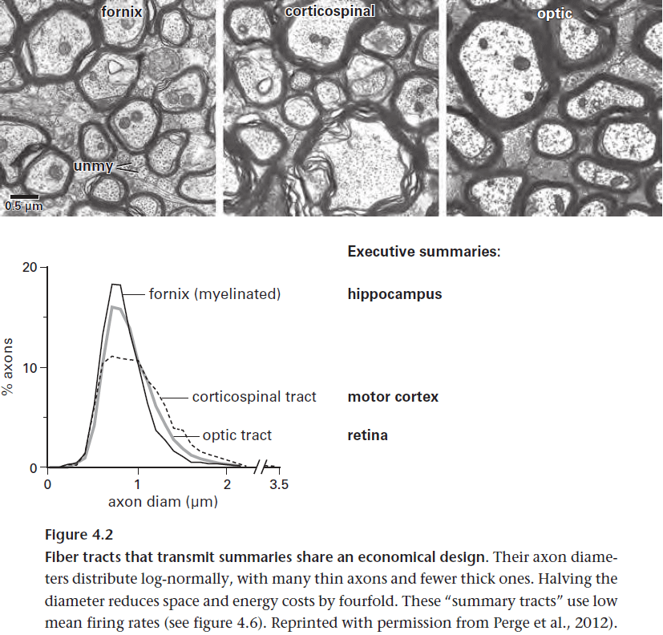
- In summary, the hypothalamic network manages the whole brain via neuromodulators, but it doesn’t micromanage.
- The use of hormones to regulate the body is extremely efficient as it doesn’t require any wiring and has no energy cost aside from what the heart already does.
- Given that the brain has a wireless and efficient form of communication with the body via hormones, why does it need neurons? why does it need wires?
- Reasons for neurons
    - Faster communication (binding of hormones to molecular receptors is slow)
    - More reliable communication (hormones become diluted)
    - More precise communication (for muscle movements)
- The broad design rule for somatic motor neurons is that neurons that fire together should be located together.
- Sensors differ greatly in cost. Olfaction is the cheapest but slowest, vision is in the middle, and audition is the fastest but most expensive.
- Auditory axons are also thicker due to using higher firing rates.
- The most expensive parts in a mammalian brain are those that perform early auditory processing since the input arrives at high rates.
- This emphasizes the principle that the brain isn’t necessarily aiming for cheapness, but rather that it’s investment pays off.
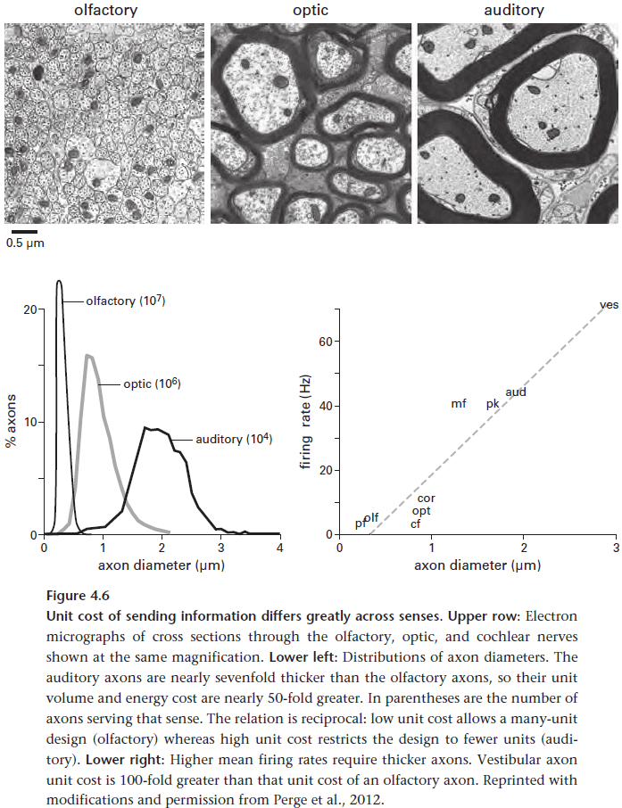
- E.g. For audio, axons used for the highest input frequency fire at higher rates and are thus nearly three times thicker than the axons used for the lowest input frequency.
- Motorizing sensors allows for a smaller sensor array to use less energy and need less processing but this also raises two issues.
- Mobile sensor issues
    1. How to point the sensor to where it’s needed.
    2. How to tell the brain that the sensor is being pointed.
- The region dealing with the first problem is the superior colliculus. This region contains a map between each retinal point and a motor map so that exciting the retinal point causes the eye to move towards that location.
- The point can be excited by movement, flashes, color, etc.
- The second problem is addressed by a signal sent by the superior colliculus called a corollary discharge.
- An interesting experiment is to move your eye using your hand versus using your eye muscles.
- In the case of your hand, the scene jiggles and in the case of your eye muscles, the scene is stable. Why are they different?
- The trick is that when the eye is moved by the brain, it sends a signal to other brain regions that it’s moving the eye so that the other regions can compensate in advance to stabilize vision.
- This prediction stabilizes perception by allowing for compensation of self-induced motion in advance.
- Principles of information storage in the brain
    - Save only what’s needed
    - For only as long as it’s needed
    - In the most compact form
- Since sending information at high rates costs more, sensors use separate, parallel pathways for different rates.
- E.g. Different pathways for pressure in the foot. Low pressure such as walking activates a pattern generator for limb extension to support the weight. High pressure such as stepping on a pin activates a pattern generator to withdraw your weight.
- However, the parallel pathways must be combined at some point which is the job of the thalamus.
- The thalamus concentrates the messages by adding more bits per spike and other brain regions also use this function.
- One exception is that since olfactory sensors already signal at low rates, they skip the thalamus. This may also explain why olfaction doesn’t pass through the thalamus.
- The job of the sensory cortices is to capture the correlations from the low-level input and output those correlations for higher sensory areas.
- One might think that to capture the world’s infinite number of objects and categories, we would require infinite cortex area however, this isn’t true.
- It doesn’t apply because we only learn the objects that we care about and we forget the rest. Also, higher levels of abstraction contains less information which uses less space.
- So the early cortical areas are large to find correlations, while the later cortical areas are small to store abstractions.
- Wiring is saved by locating areas using the same data together.
- E.g. Sending face information to temporal lobe which also processes facial expressions. Sending grasping information to the parietal lobe which also processes motor commands.
- Different types of learning used by the brain
    - *Intention learning*: comparing an intended action to the actual action.
    - *Reward-prediction learning*: comparing expected payoff to actual payoff.
- The region for intention learning is the cerebellum, the region for reward-prediction is the striatum.
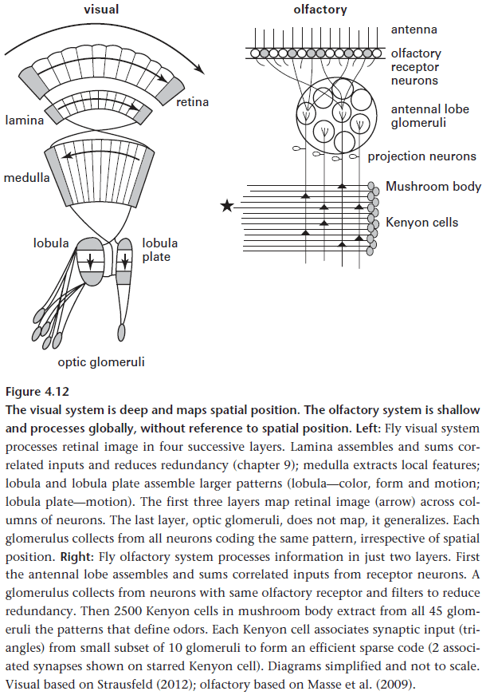
- *Olfaction processing*: Receptor neurons → Glomeruli → Mushroom body.
- Olfaction uses two processing stages, compared to the four for vision because, unlike vision, there are no local/spatial features in smell.
- Since each odor stimulates several receptors, and each receptor contributes to the coding of various odorants, the job of the mushroom body is to find correlations or the pattern between receptor inputs.
- To summarize, there are significant differences across sensory systems within an animal, but there are also significant similarities for a sensory system across animals.
- E.g. Vision in insects and mammals.
- Another significant difference is that insects don’t use APs since the graded/analog voltage is efficient enough to convey the information over a short distance.
- So insect brains use a more efficient design that can’t be implemented in larger brains due to distance.
- The fly achieves object invariance by using horizontal neurons, neurons that project across modules so that a pattern seen in one direction is distributed and can be recalled in another direction.
- For an insect brain to distinguish between self-generated activity and activity from the environment, it need mechanisms for corollary discharge.
- E.g. A cricket’s loud chirps risks desensitizing its own auditory system so to prevent this, the circuit that generates chirps also directly blocks inputs from the two ears for the duration of the chirp.
- E.g. The same mechanism also occurs during saccadic eye movement in mammals to suppress disruptive input.
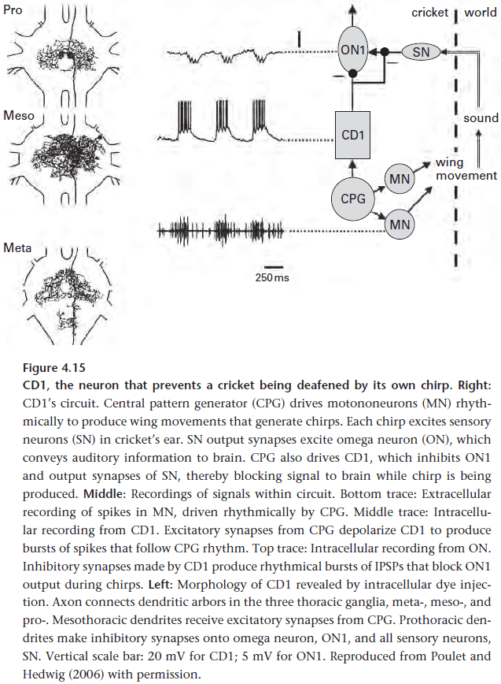
- Social primates build upon low-level sensors by adding brain parts that enable social behavior.
- Similarities between mammalian and insect brains
    - Both regulate the body’s internal state to maintain homeostasis.
    - Both use a combination of slow wireless (endocrine) and slow wired (autonomic) signals.
    - Both arrange their sensors and brain regions in similar positions.
    - Both use similar structures to perform similar computations.

## Chapter 5: Information Processing: From Molecules to Molecular Circuits

- The processing of information occurs at the scale of molecules via chemical reactions.
- Most transfers of information from a source neuron to a receiver neuron occurs via chemistry (concentrations, binding reactions) and physics (changes in molecular structure).
- Using Shannon’s formulas, we can explain
    1. What constrains information processing by signals.
    2. What reduces their information.
    3. Why higher information rates are more expensive.
- The number of bits needed to identify the state of an information source is given by $$I = log_2(U)$$ bits, where U is the number of equally likely states and I is the number of bits needed.
- However, if the states are not equally likely, we can use that information to design a more efficient code.
- E.g. If the probability distribution of four states is A (0.125), B (0.5), C (0.25), and D (0.125), then we can use a 3-bit code instead of a 2-bit code to be more efficient.
    - A 3-bit code is more efficient because we can use bit 1 to decide whether the state is either B or not-B, we can use bit 2 to decide between C or not-C, and we can use bit 3 to decide between A or D.
    - You can visualize this as a decision tree where the first decision is B or not-B. If B, then we know the state, if not-B, then we decide between C or not-C. If C, then we know the state, if not-C, then we decide between A or D.
    - The average number of bits to determine the state is $$0.5(1\ bit)+0.25(2\ bits)+0.25(3\ bits) = 1.75\ bits$$ which is less than 2 bits.
    - While we use one more bit to specify the state, on average we use fewer bits to determine the state.
- This example demonstrates one of Shannon’s discoveries, that it’s efficient to match a coding scheme to the statistical distribution of the states being coded.
- The brain does the same of matching the input distribution to the coding scheme.
- The general equation for the number of bits needed to specify the state of any source is $$H(x)=-\sum_{1}^{x}p(x)log_2(p(x))$$, and is also known as the information entropy equation.
- The intuition behind the information entropy equation is that it quantifies a system’s total uncertainty by taking the information per state ($$log_2(p(x))$$) and multiplies it by the proportion of time the state is used ($$p(x)$$), and sums this quantity across all states.
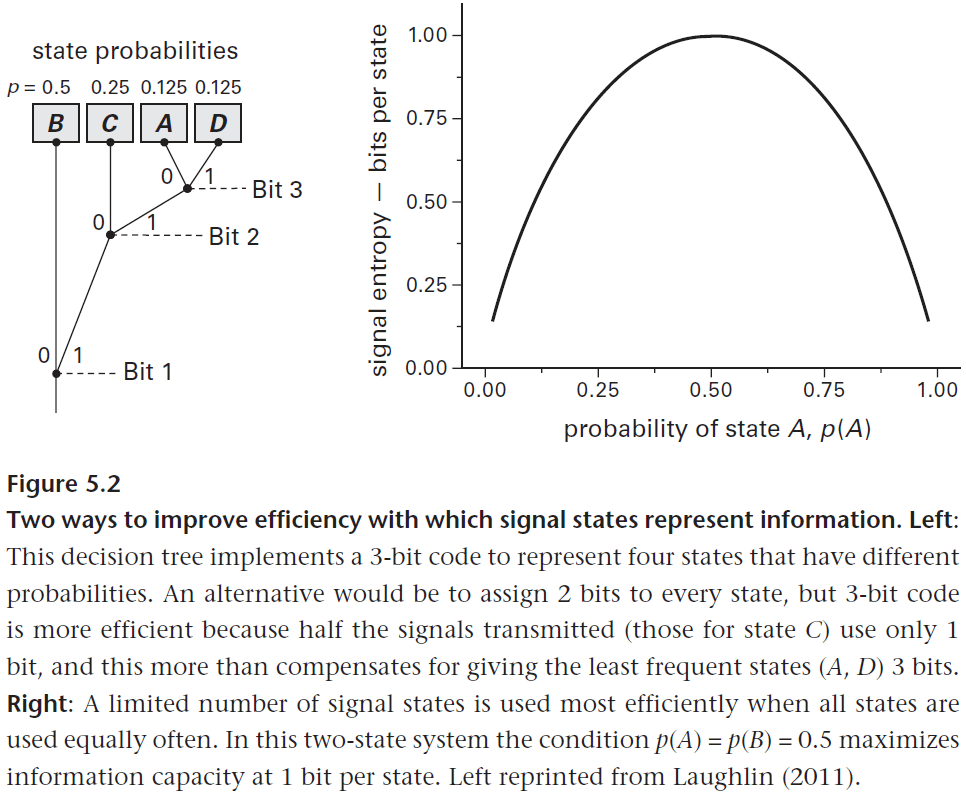
- However, this equation only specifies how many bits are needed to describe all states of a source, but it doesn’t tell us how much information a signal can carry.
- There’s a disconnect between information and signal.
- If we assume that every source state is given its own signal state, such as a one-to-one mapping of source to signal, then the signal captures the source.
- However, if the mapping isn’t one-to-one, such as analog-to-digital conversion or from electrical-to-chemical where the source and signal states greatly differ, is information transmitted perfectly?
- To quantify how much information is in a signal, we can just calculate the information entropy of that signal and compare entropy across formats.
- It was proved by Shannon that entropy equates across formats and thus can be used as a common currency for comparison.
- E.g. An analogy is like converting currencies into US dollars to compare them since US dollars is a standard currency.
- Information entropy sets the upper boundary for a system’s information capacity but this is a theoretical boundary since real signals have noise (useless information) and redundancy (repeated information).
- *Noise*: random fluctuations that don’t correlate with changes in signal state.
- *Redundancy*: signal state that represents something already known.
- Noise destroys information by introducing uncertainty.
- E.g. At a party, it becomes more difficult to hear someone if there’s loud music playing. The music isn’t correlated with the person talking to you and the louder it is, the harder it is to hear the other person.
- Information increases as the logarithm of the ratio between signal and noise, $$log_2(S/N)$$. This is important because it’s a ratio (division), not say a difference (subtraction), and this means changes in one results in large changes to the other.
- Two types of redundancy
    - Less extreme form of repetition
        - E.g. Neural circuits commonly use lateral and self-inhibition to remove this type of redundancy to only send what’s needed.
    - Less information than they might because they’re used too frequently/rarely
        - E.g. Retinal neurons use this strategy.
- Given we know how to calculate the information needed to describe a set of event, how much information a signal conveys, and how these quantities are affected by noise and redundancy, we can start asking how the brain keeps up with rapid event changes.
- The rate of information transfer depends on
    - Amount of information conveyed by each signal state.
    - Rate at which these states change.

- The general equation for information rate is given by $$I=(bandwidth)log_2(1+S/N)$$ and this applies to neural design because for neurons to transfer information at a higher rate, it needs a wider bandwidth (faster responses) plus a higher signal-to-noise ratio.
- These restraints require more material and energy to deal with which introduces a trade-off between resources and performance.
- To implement this information system, the brain uses signaling proteins to process information.
- Information transfers when a change at the receiver can be associated with the state of the source.
- Chemical binding satisfies this requirement as proteins only bind to a specific set of molecules. This binding specificity enables information transfer.
- *Allostery*: a protein’s ability to respond to a specific input by switching to a new state.
- Allostery enables proteins to change depending on different chemical and physical inputs, thus this enables proteins to process information.
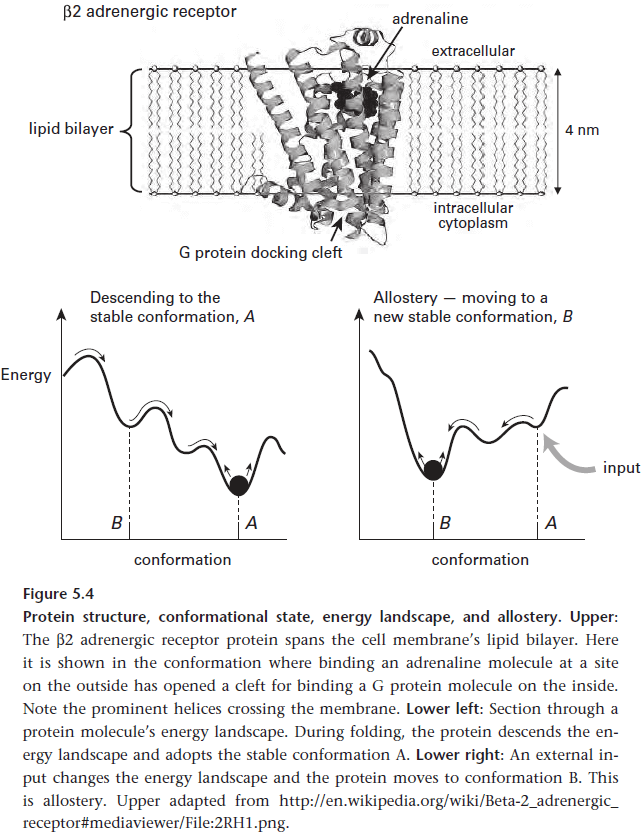
- In this way, proteins act as finite-state machines via allostery and thus enables proteins to compute.
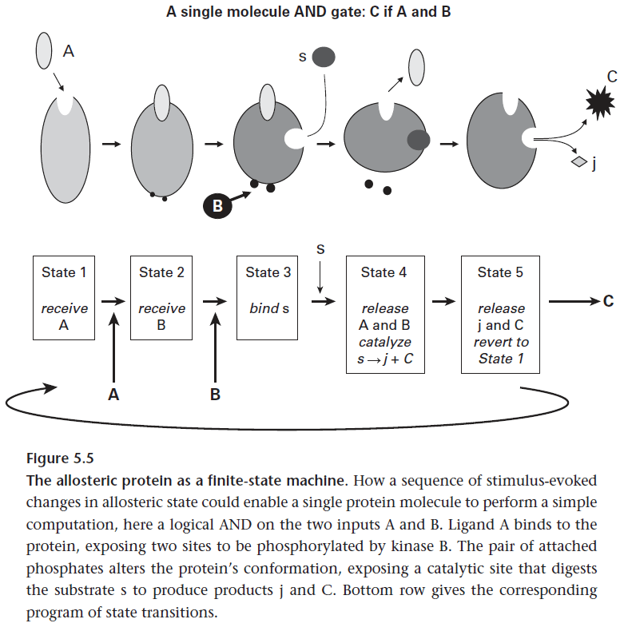
- Amplification is a form of redundancy since each copy repeats without adding new information.
- E.g. Making a sound signal louder by amplifying it is repeating the same signal at the same time so the waves overlap and add (constructive interference).
- I’ve skipped over the detailed example of how a protein circuit amplifies an Adrenaline signal because I don’t think it’s relevant towards brain processing. This is more of how proteins process information, not brains. There is no tie back to brains.
- These protein circuits suggest the principle of computing with chemistry as it is compact, energy efficient, and can adjust its state depending on the input.

## Chapter 6: Information Processing in Protein Circuits

- While protein circuits can amplify and perform logic, this isn’t enough as the brain needs to do a lot more math such as arithmetic operations and nonlinear operations.
- Brains also need to perform
    - *Switches*: input causes a step change in output.
    - *Filters*: removing certain frequencies.
    - *Correlators*: associating events.
- *Cooperative binding*: requiring that several binding sites are activated to generate the output.
- Cooperative binding increases the temporal precision of the output.
- Chemical circuits support Turing’s Universal Computation which means they can be configured to compute any function. Whether the brain uses this function is an open question.
- However, we do know that chemistry enables the behavior observed over a range of timescales such as phototransduction in milliseconds, circadian rhythms in days, and long-term memory via chemical synthesis.
- When noise is unavoidable, most neural designs try to prevent noise by reducing it at the early stages.
- One way protein circuits manage noise is by creating compartments for signals such as the vesicles used in synapses.
- Vesicles reduce noise by reducing diffusion distances and by concentrating the signal into one location.
- Another way to manage noise is to replicate a signal through multiple components and then sum their outputs.
- Since the amplitude of the transmitted signal increases linearly and the amplitude of the noise increases as a square root, the signal-to-noise ratio increases as linear functions grow faster than square root functions (power of one versus power of one-half).
- However, this costs a lot of energy as the signal must be duplicated.
- *Symmorphosis*: capacities match within a system to avoid waste.
- E.g. Oxygen flow in the lungs, heart, vessels, and muscle.
- Despite the advantages of chemical computing, it's too slow for signals traveling beyond a few microns. Thus the need for speed forces a more expensive option, protein circuits that process information electrically.
- Electrical current is carried by electrons in silicon but is carried by ions in biology.
- To charge the cell membrane quickly, ions must be driven through channels at high rates.
- Ions are driven by a concentration gradient maintained by ion pumps.
- The main ion pump, using 60% of the brain’s energy, is the sodium-potassium pump that maintains low sodium and high potassium concentrations inside the neuron.
- We can use the Nernst equation to convert the chemical potential of the concentration difference into an equivalent electrical potential. It links ions to electrons.
- Fast processing also requires molecules that switch quickly. The ion channels can open and close in tens of microseconds, near the limits of allosteric state change.
- However, this need for speed comes at a price, the price of keeping the ionic batteries fully charged.
- During an AP, when the sodium channel opens for 1 ms and allows 6000 sodium ions into the cell, the sodium-potassium pumps use 2000 ATP molecules to pump those ions back out.
- The efficiency of converting ATP to electrical energy is reasonably high at about 50%, but this still costs a lot when compared to other protein circuits.
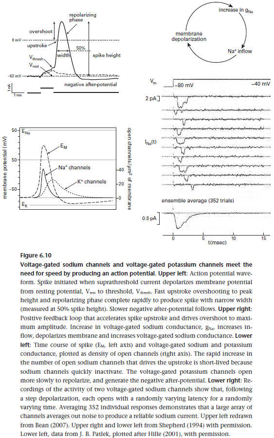
- While the refractory period of neurons places an upper boundary on AP frequency, it ensures that APs can’t trigger another sodium current during the previous AP’s repolarizing phase.
- This prevents a single AP from starting a continuous train of spikes.
- Since APs are brief, their timing precision is high which increases the number of bits carried by them.
- How does the information carried by APs drive a chemical circuit? The connection is the voltage-gated channel with a chemical output, the calcium channel.
- Three factors limit the performance of circuits formed by ion channels
    1. High electrical resistance of channels
    2. Membrane capacitance
    3. Noise from thermal fluctuations
- One solution for all three limitations is to open more channels however, this decrease efficiency.
- What limits the number of channels in a circuit?
    1. Membrane space
    2. Energy cost
    3. ATP production
- Even if a neuron could fully pack it’s membrane with ion channels and ion pumps, there isn’t enough space within a neuron to power those pumps as mitochondria take up space too.
- The molecular power transistor (ion channel), its molecular battery charger (ion pump), and its intracellular power station (mitochondria), prevent the brain from reaping a major benefit of irreducibly small molecular components, high-density computing.
- So, unlike conventional engineering design, neural design must maximize performance at low-power density.
- Given these limitations, how does the brain accomplish quick and accurate tasks?
- The solution seems to be that brains open many channels infrequently and in concentrated groups.
- E.g. Use powerful signals that are sparsely distributed in space and time such as APs and synapses.
- This may seem contradictory as APs and synapses are part of the problem, since they need so much energy, but they are also part of the solution.

## Chapter 7: Design of Neurons

- The one key task of neurons is to use allostery to send an electric signal somewhere far and fast.
- Dendrites conduct passive electrical signals about 50 times faster than chemical diffusion, and axons conduct active electrical signals about 20 times faster than dendrites.
- However, this speed comes at an energy cost of using $$10^9 k_bT^2$$ to encode one bit compared to $$25 k_bT$$ for chemical circuit encoding.
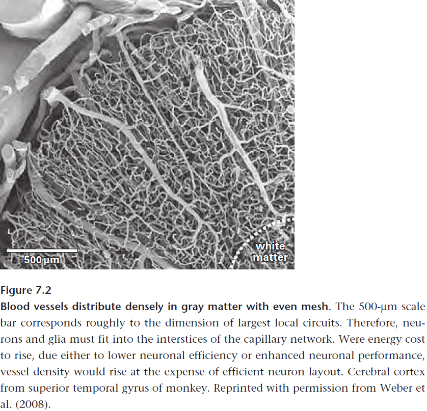
- This means a neuron must be efficient in terms of each of its components, the synapse, dendrite, cell body, and axon.
- Synapses enable neurons to process information by transferring and transforming signals at specific connection points.
- The synapse cleft width appears to optimally balance transmitter concentration at the postsynaptic receptors and electrical resistance. This also illustrates symmorphosis at the nano scale.
- For neurons to transmit at high frequencies, a fast rising chemical signal must also fall fast to enable the transmission of the next signal.
- This means each stage must finish quickly
    - Calcium channels close instantly on membrane repolarization.
    - Calcium concentration drops as it’s bound by low-affinity buffering proteins.
    - Synaptotagmin switches off because of its strong dependence on calcium.
    - Transmitter concentration drops sharply via diffusion and transporter proteins.
- Thus, a chemical signal in the synaptic cleft peaks in 0.6 ms and lasts less than 1.5 ms, transmitting information at a bandwidth of about 1 kHz.
- This bandwidth is sufficient for most frequencies coded by neurons except for auditory signals.
- Vesicle release due to an AP is random and it may or may not release. While this uncertainty in neurotransmitter release introduces noise, thereby reducing information, it can also be an advantage.
- This randomness offers a mechanism to adjust the effectiveness of a synapse by tuning its release probability. This is also known as adjusting the weight of a synapse.
- By adjusting the concentration of neurotransmitter within a vesicle, the presynaptic neuron can produce a graded response in the postsynaptic neuron, further increasing the amount of information it can send.
- The graded electrical signal also serves the neuron’s next task of integrating and sending an output.
- A neuron registers events on different timescales using postsynaptic receptors with different kinetics.
- E.g. NMDA receptors are 400 times slower than AMPA receptors which gives it a more sustained and sensitive response.

- The NMDA receptor’s sustained response also allows it to perform coincidence detection.
- It can detect the coincidence between a presynaptic input (glutamate) and a postsynaptic response (depolarization) within a time window of about 100 ms.
- This equips a neuron for pattern recognition and learning as it can amplify and extend a synapse’s excitatory input and mark the synapses whose signals coincide.
- The duration of an NMDA receptor’s time window is critical for learning as shorter windows increase false negatives while longer windows increase false positives. The 100 ms window seems just right for many of life’s more immediate events.
- One type of synaptic inhibition is when chloride channels open and allow for the flow of chloride ions to increase the neuron’s voltage.
- Another type of inhibition is the opening of potassium channels.
- One way dendrites efficiently transmit information is by placing synapses carrying less information father away from the cell body so they are given less weight in the final output.
- In this way, dendrites can use distance to process information efficiently.
- Dendrites provide two layers of processing
    - Local within a dendrite.
    - Global within the dendritic tree.
- Local processing is implemented by
    - Modifying the diameter of a dendritic spine’s neck.
- Global processing is implemented by
    - Shunting inhibition along the dendritic tree.
- The axon converts the graded signal from the dendrites and cell body into a pulse code, the action potential (AP).
- Why use APs? The passive conduction of a graded signal is too slow and its exponential decay loses information to noise.
- So for transmitting information greater than around 1 mm, an axon recodes information into an all-or-none signal, the AP.
- APs travel fast and avoid decay by regenerating as they go. This makes them travel farther and be more resistant to noise.
- However, recoding signals into pulses comes at a steep cost of information loss and energy.
- A neuron tries to minimize this cost by converting spikes at a specialized initiation site, the initial segment or initiation zone.
- The initiation zone packs more membrane channels densely to reduce the time constant and increase the signal-to-noise ratio.
- Another way to make computations more efficient is by performing computations locally.
- E.g. Local computations between dendrites via dendrodendritic chemical synapses.
- The core rule for designing neurons is to build it for a particular task. This achieves the needed performance for the least cost.
- Given a glia’s substantial costs in space and energy, what benefits does it provide?
- A naked axon conducts APs efficiently, but not quickly. The conduction velocity scales as the square root of the axon’s diameter.
- So when speed is required, a naked axon must become exceptionally thick.
- E.g. The command neuron that triggers the escape response of an invertebrate, such as the squid giant axon, is 1 mm thick.
- However, this is costly in terms of space and neurons have found a better solution.
- The better solution is to wrap axons in a fatty layer known as a myelin sheath. The myelin sheath reduces the axon’s membrane capacitance and increases its resistance.
- The myelin sheath increases AP speed linearly to axon diameter instead of square root.
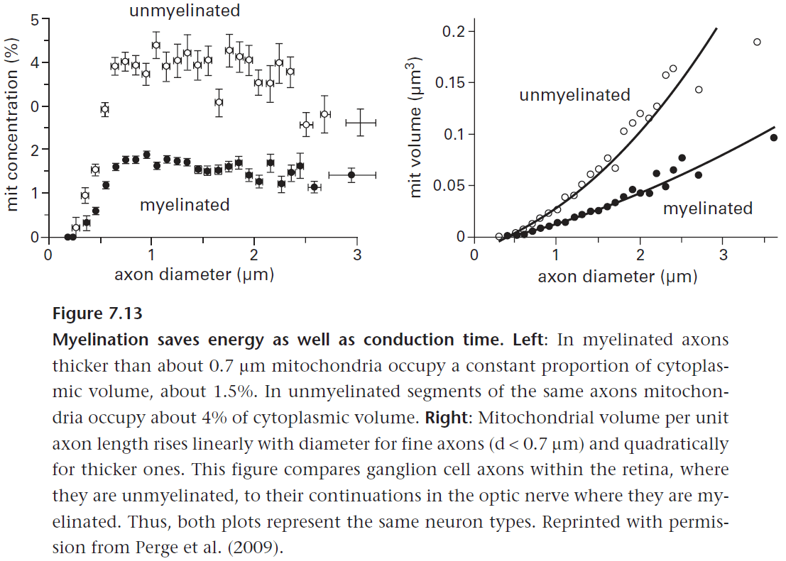
- However, if an axon were to be completely wrapped by a myelin sheath, the AP would eventually decay.
- So there are gaps in the myelin sheath for the AP to regenerate.
- These gaps are known as the nodes of Ranvier and they’re concentrated with sodium channels.
- Nodal spacing increases directly with axon diameter and can be tweaked to compensate for different conduction distances.
- Another benefit of concentrating sodium channels is to improve energy efficiency but this doesn’t explain why white matter uses three times less energy than grey matter.
- E.g. White matter has a far sparser supply of blood vessels when compared to grey matter.
- The reduced energy use by white matter is due to the lack of synaptic currents.
- Space at the nodal axon membrane is so fully filled by sodium channels such that potassium channels are displaced sideways. So the nodal membrane can’t hold a lot of ion pumps.
- The solution is to put the fast-binding pumps on the astrocyte membranes and the slow-binding pumps on the axon.
- Thin axons can only support low mean spike rate due to containing few mitochondria to produce energy.

## Chapter 8: How Photoreceptors Optimize the Capture of Visual Information

- The design of the mammalian visual system seems counterintuitive.
- Ion channels are open in the dark, causing a steady current that constantly requires energy.
- Only when a photon is captured does the channel close and the current stop.
- This design is often cited as an instance where the brain is highly inefficient since light should trigger a current (as in flies) and not the other way around.
- Was this design by accident? The authors doubt it because
    - The retina still has the fly-like design for neurons that control the circadian clock.
    - Both rods and cones use less energy than a fly photoreceptor.
- To move fast, an animal must see fast.
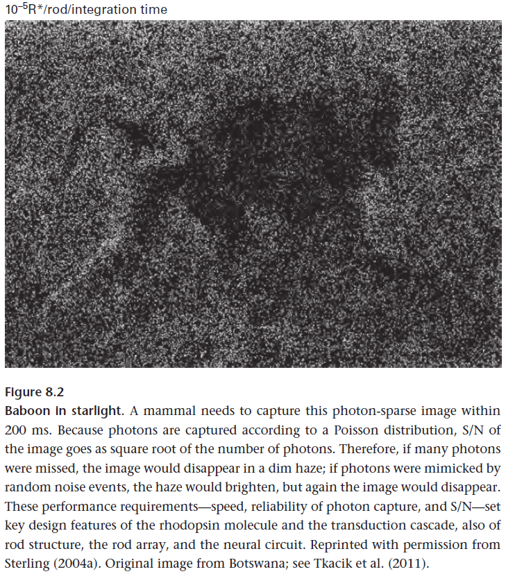
- The lowest amount of light that we can see is set by opsin’s thermal stability. Thermal noise can trigger phototransduction in opsin if it is too sensitive.
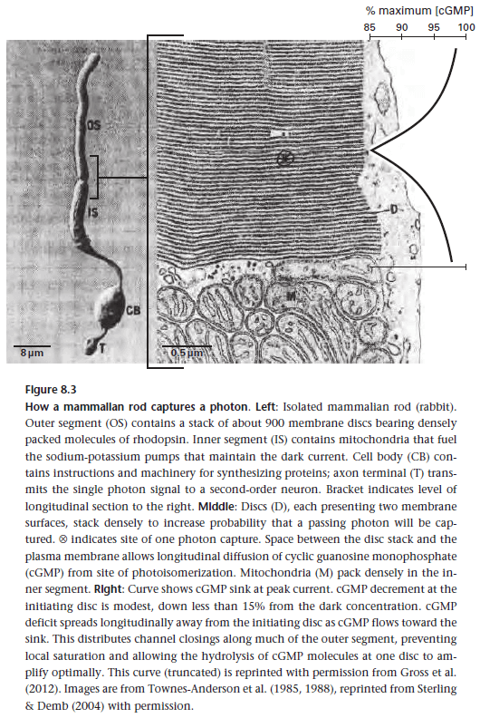
- To capture the energy of a single photon, it's amplified chemically by a protein circuit in a highly structured physical context.
- There’s a close match between structure and function at this scale to increase efficiency.
- To deal with noise, rod cells selectively amplify larger events, thus creating a threshold that removes noise.
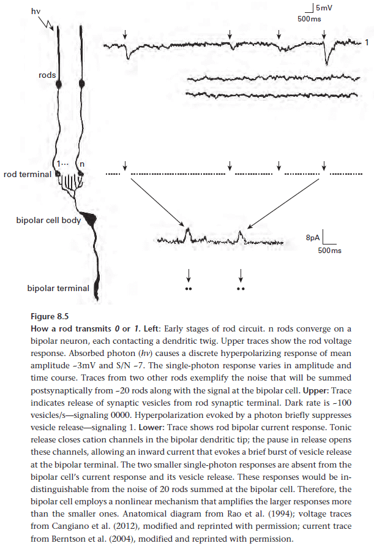
- During daylight, rods shut themselves off and go into a sleep mode while cones take over.
- A cone costs somewhat more to operate than a rod, but it's also more sparsely distributed, making up only 5% of the retina.
- This also explains why the retina may use a “backward” design since it allows the many rods needed for dim light to saturate and reduce its major costs, while the few cones of greater unit cost provide far better performance.
- Cones can transduce a photon five times faster than a rod, allowing them to capture faster events.
- This is due to the opsin in rods binding so tightly to chromophore (to resist thermal bumps) that it can’t release it fast enable to keep pace in bright light.
- Cones get around this problem by only weakly binding to chromophore. However, this also makes them more susceptible to thermal noise.
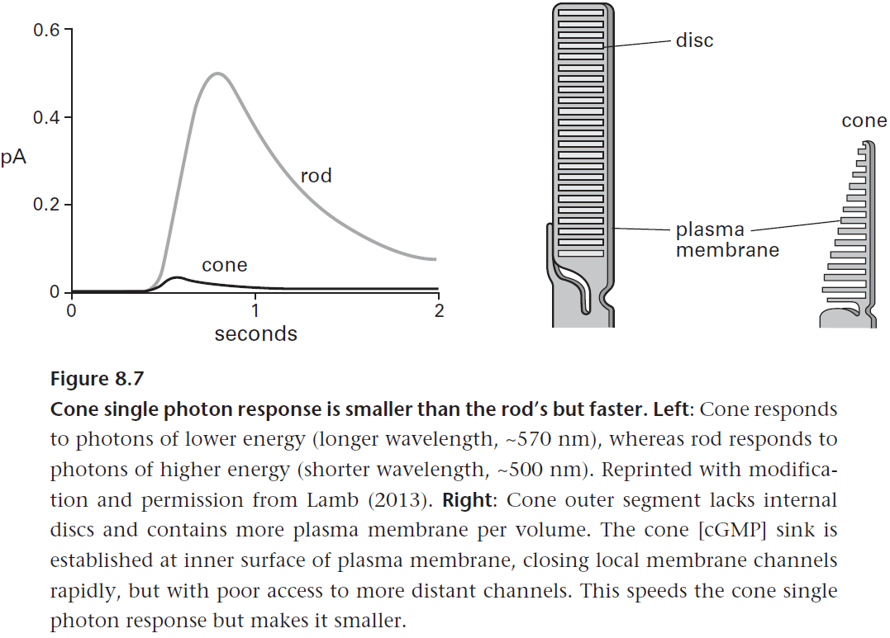
- In short, cones achieve a faster response to photons by selecting faster proteins from the parts list.
- Rods and cones divide the range of light intensities into two so that each neuron can be specialized for each light intensity, one for dim light and one for bright light.
- Each design is optimized for its purpose and each comes with its own disadvantages that are compensated for by the other to get the best of both designs.
- As light intensity changes from dim to bright, the energy used by rods is saved and is immediately invested into cones for better vision.
- Since cones use a bit more energy than rods but are also fewer in number than rods, energy use remains relatively constant across all light levels.
- A fly’s retina is designed to use only one type of photoreceptor and uses a faster mechanism for phototransduction.
- It uses faster phototransduction because fast moving images require it. Similar to how higher frame rates are needed to capture more smooth motion at faster speeds.
- This also explains why fast moving images are blurred in mammals because of our slower mechanism for phototransduction.
- Both fly and cone photoreceptors use the same coding strategy of intensity contrast.
- *Contrast*: the difference between the intensity at the receptor and the local mean ($$\Delta I/I$$).
- Two ways coding contrast simplifies visual processing
    - Dividing by the mean reduces the range of light intensities which better matches a neuron’s limited response range.
    - Helps to identify the same object under different light conditions.
- Most natural objects generate an optical signal by reflecting or transmitting part of the light that falls on them.
- By dividing by a measure that depends on local illumination, the local mean intensity, the eye can factor out the current light condition and make out objects regardless of the illumination.
- Thus by coding contrast, the eye starts the process of generalization where the visual system assigns signals based on the viewing conditions of the object.
- The reason why the mammalian photoreceptor is more efficient than the fly photoreceptor is because the majority of rods are shut down in bright light, whereas the fly only has one type of photoreceptor and can’t shut it down.
- A component given two tasks seldom does both with optimal efficiency.
- Increasing information capacity decreases efficiency.
- E.g. The fly’s faster photoreceptor comes at the cost of increasing the signal-to-noise ratio which requires more hardware, in the form of more microvilli and synapses, to encode the faster signal.
- An efficient design eliminates excess capacity, thus the capacity of an efficient photoreceptor is matched to the information supplied by the eye.
- Flies that are slow have slow eyes while flies that are fast have fast eyes. The behavior is matched at the neuron-level to enable the behavior.

## Chapter 9: The Fly Lamina: An Efficient Interface for High-Speed Vision

- The lamina is the first layer of a blowfly’s visual system.
- To profit from its expensive eye, the blowfly translates the information captured by photoreceptors into useful behavior.
- The lamina’s job is to transmit information from photoreceptors to the brain for feature extraction.
- To preserve the information coded by the photoreceptor, the lamina follows information theory by maintaining the bandwidth and signal-to-noise ratio.
    - It maintains spatial bandwidth by mapping photoreceptors retinotopically onto output neurons.
    - It maintains temporal bandwidth by transmitting analog signals across fast synapses and by keeping wires short.
    - It maintains the signal-to-noise ratio by using high-gain synapses that amplify the signal and average out noise.
- Precise wiring (retinotopic projection) preserves spatial information in two ways
    1. Giving each pixel its own set of neurons maintains spatial resolution.
    2. A retinotopic projection maintains spatial continuity/relationships of objects.
- This also minimizes wiring by reducing the length and complexity of neural connections that are used to compute the spatial and temporal relationships that define objects.
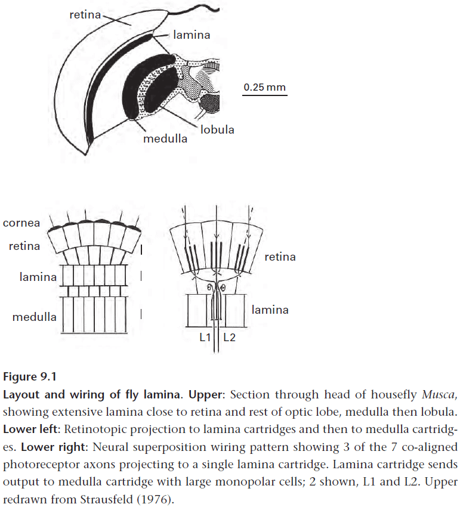
- Two approaches to wiring compound eyes
    - *Apposition*: each photoreceptor acts independently.
    - *Superposition*: photoreceptors cooperate.
- The neural superposition of signals uses axons that cross over to form complicated minichiasms to resolve each object but it’s worth the effort.
- It restores spatial acuity at the cost of more wiring and accurate wiring.
- Any wiring mistakes destroys spatial information so it’s crucial that developmental mechanisms deliver.
- Neural circuits aren’t made to cope with inaccurate wiring and when valuable information is at stake, developmental mechanisms deliver.
- This also emphasizes the opposite point that where the brain does wire imprecisely, it’s ruled by the brain that the greater precision isn’t worth the cost.
- Neurons are sized to match the number and activity of their synapses.
- Synapses are packed as densely as possible to remain efficient.
- What is most efficient in theory isn’t always the most efficient in practice because neural implementation stands in the way.
- The retina and brain can use predictive coding to remove redundancy. The idea is that one pixel can be predicted from its surrounding pixels, which makes it redundant.
- E.g. Using lateral inhibition to reduce redundancy.
- To build a predictive coder, build spatial and temporal predictors and subtract their outputs from incoming photoreceptor signals.
- Speed is essential because the prediction must keep up with the high information rates of photoreceptors in bright light.
- In dim light, information rates fall and noise increases so the prediction mechanism adapts by slowing down and weakening its effect.

## Chapter 10: Design of Neural Circuits: Recoding Analogue Signals to Pulsatile

- All mammalian sensors, being further than a millimetre from the brain, require APs to relay their information.
- Thus, they must all recode their information from analog to pulsate (A to P).
- Certain sensors recode directly to APs while others require prior synaptic processing.
- Olfactory sensors and many skin sensor recode directly to spikes, while photosensors use two synaptic stages.
- Photosensor two stages
    1. Recode to synaptic vesicles that change a graded voltage in second-order neurons.
    2. Recode to APs in third-order neurons.
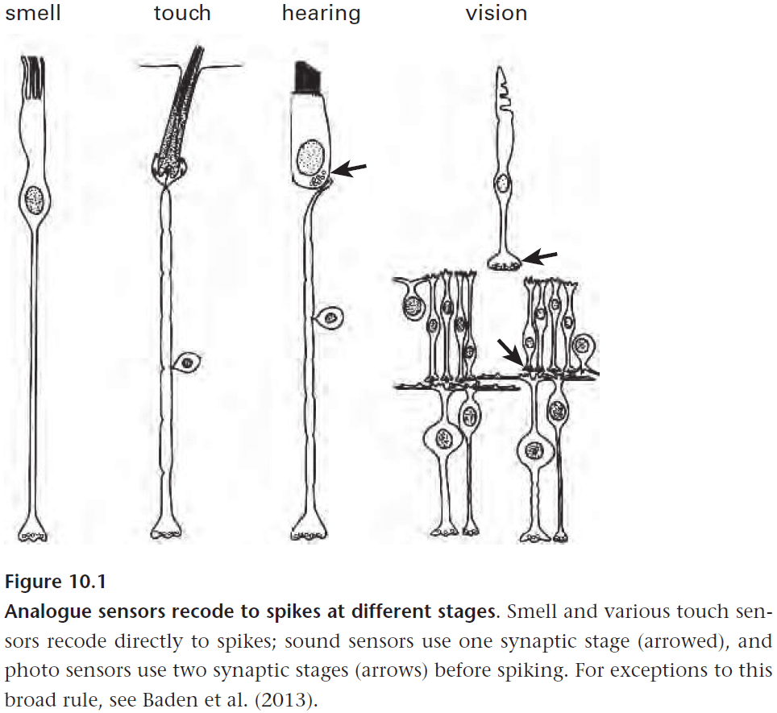
- To recode analog voltages carrying more than 100 bits/s, we require APs with high firing rates.
- E.g. 100 bits/s → 30 AP/s
- Recall that higher spike rates need thicker axons that use disproportionately more space and energy.
- E.g. Vestibular axons fire continuously at about 100 Hz and are extremely thick.
- So, sensory neurons must either pay the high price, such as vestibular neurons, or they must use lower mean spike rates.
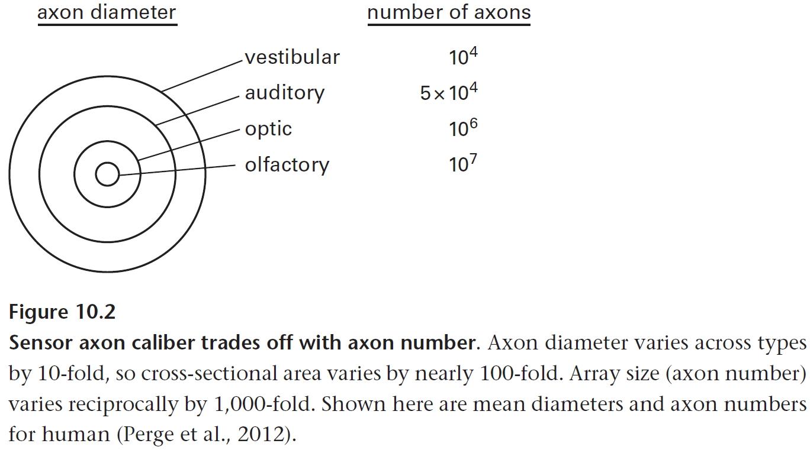
- Olfactory neurons collect information at low rates since they don’t track the location of odorant particles and they only track a single type of protein per sensor.
- Also, olfactory neurons also adapt when binding to an odorant molecule so their messages are rare, slow, and brief.
- Given this context, olfactory axons are thin and transmit information at a low rate.
- However, this is by design as olfactory neurons restrict their information rates by narrowing the stimulus space.
- Low information rates at the input allow the output mechanism to recode directly to APs.
- To compare, auditory neurons must detect signals that are 1000-times weaker and at frequencies that are 100-times higher than skin sensors.
- To do so, auditory neurons, also called hair cells, must amplify the signals they receive.
- Given how fast some auditory frequencies are, hair cells encode information at the synapse before encoding information into a spike train.
- Synapse encoding goals
    1. Recode the fast changing analog voltage into a precisely timed pattern of vesicle release.
    2. Remove redundancy.
    3. Recode each vesicle to a spike.
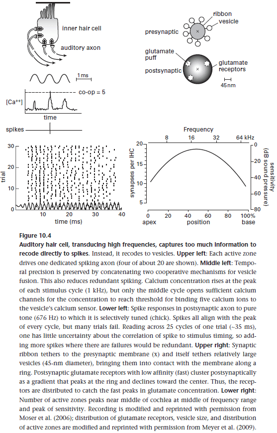
- A hair cell’s full analog message is custom filtered and converted to APs by about 20-30 axons whose total rate is around 800-1200 Hz.
- This shows that a neuron can encode so much information in analog that it requires a cable of thick, power-hungry axons to send it by pulses.
- The auditory system minimizes the total cost by limiting the number of axons (about 30,000 in humans) but the overall high cost is unavoidable.
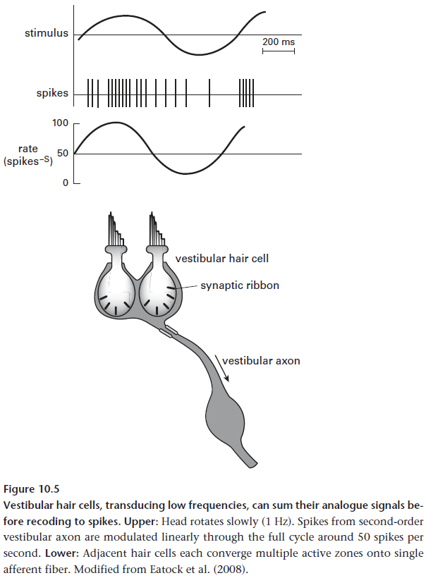
- Why does a cone photoreceptor need two synaptic stages?
- Evolution has matched the sensor to the signal quality.
- Vision is a useful feature to an organism so its signal quality must be good.
- Quality is improved by a cone capturing more photons since this more finely localizes the photon in space and time.
- However, cones collect too much information for it to be directly recoded into spikes and it's too much for a single synaptic stage like audition.
- Lacking in chemical and mechanical filters to reduce the information, cones are forced to filter its analog photovoltage neurally before recoding. This is the purpose of the retina.
- The first stage removes noise and redundant information and only transmits signals about contrast.
- The second stage reduces the event rate by throttling it down to a sparse code.
- It rectifies its input signal by creating separate channels to send signals greater/less than the mean (ON and OFF).

## Chapter 11: Principles of Retinal Design

- The eye must capture, process, and send an image in under 100 ms.
- Compared to an auditory hair cell where it can’t tolerate any neural integration beyond a millisecond, the retina has plenty of time and can process images locally.
- The retina’s architecture has been thoroughly mapped so we can start explaining its design.
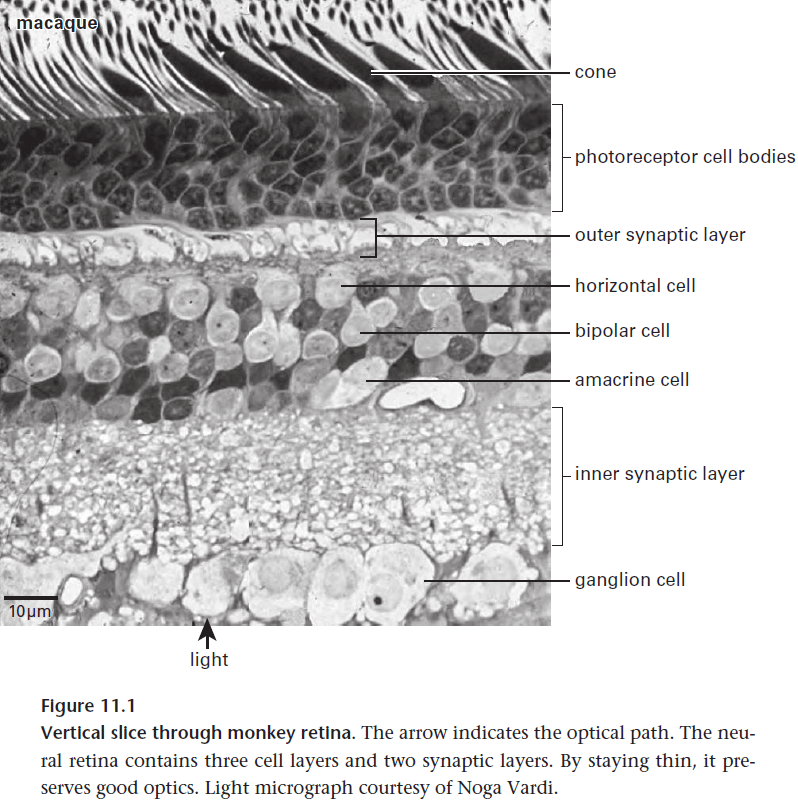
- A pattern reaching the photoreceptors as $$10^7$$ events is compressed by retinal circuits to a single spike.
- $$10^9$$ photons → $$10^7$$ photoreceptors → $$10^5$$ vesicles → 1 spike
- This single spike is enough for the spot to be perceived.
- However, this decrease/compression loses information along the way.
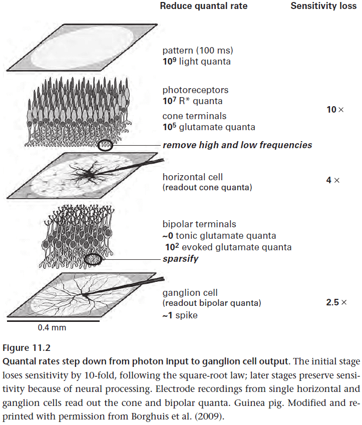
- The strategy for reducing noise is to use the fact that light intensities at adjacent points in an image tend to be correlated.
- This means photoreceptors that are beside each other can use gap junctions to reduce noise and to improve the signal since each photoreceptor contains a piece of the signal.
- While we would suspect that this reduces the fine detail of an image, this isn’t the case because the ganglion cells will pool signals from 100s to 1000s of cones anyways.
- Local pooling at the cone terminal won’t affect the spatial details at a ganglion cell array.
- Aside from discarding noise, the retina also discards the mean.
- A cone sees a scene as a series of changes between bright and dark, with each a deviation from the mean intensity.
- The brief dimming and brightening are informative whereas the steady mean isn’t, so they’re what should be transmitted.
- To measure the mean intensity, horizontal cells in the retina subtract a prediction of the raw intensity from the actual signal.
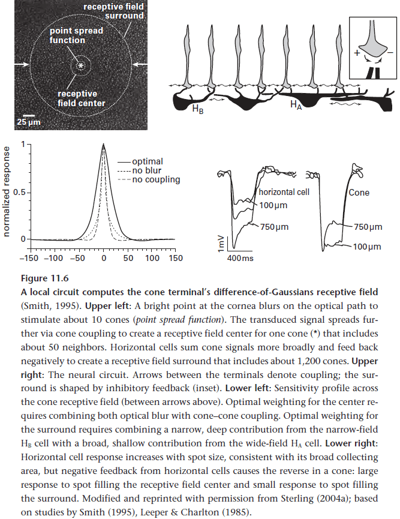
- Next, to convert the cone’s analog signal into spikes, horizontal cells remain at -50 mV and depolarize on dark stimuli and hyperpolarize on bright stimuli.
- The balance is asymmetrical where dark responses continue to rise linearly with contrast while light responses saturate.
- The reason is because bright stimuli drives vesicle release towards zero while dark stimuli drives vesicle release to higher rates, only limited by the calcium current that rises with stronger depolarization.
- It’s analogous to the stock market. The potential loss if you buy a stock is all of your money since the lowest the stock price can go is zero. The potential loss if you buy an option is infinite since the highest the stock price can go is infinity.
- Why the asymmetrical response? Natural scenes tend to contain more dark contrasts so efficient design should allocate more resources to transmitting darkness.
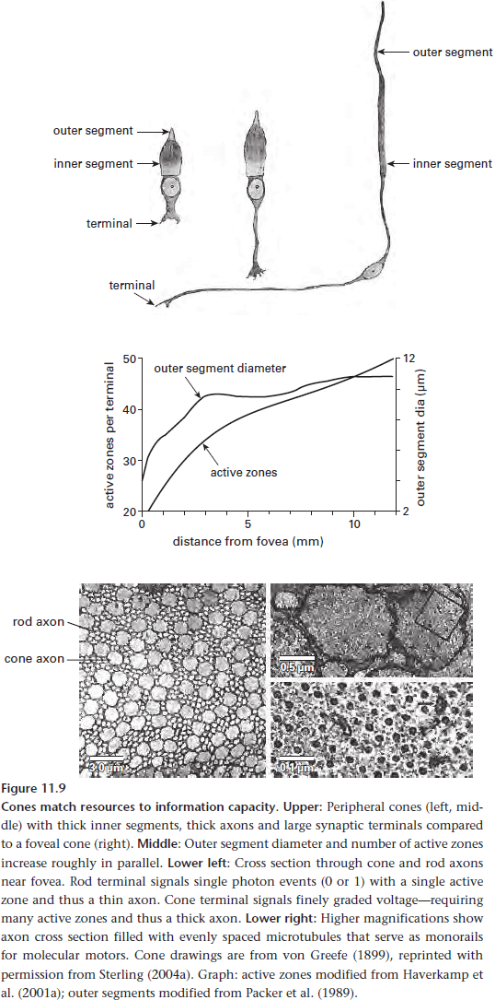
- A bipolar cell transmits only half of its input signal, dark contrasts or bright ones.
- Certain bipolar cell types depolarize to dark and hyperpolarize to bright (OFF cells), whereas other types invert the signal (ON cells).
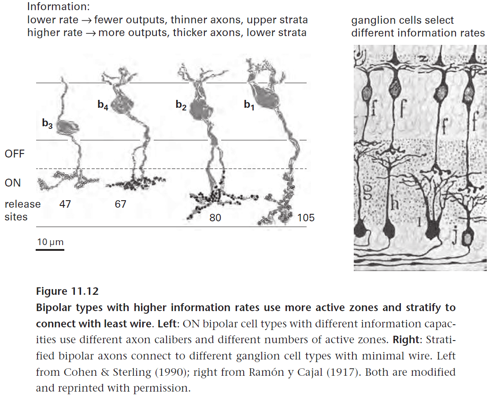
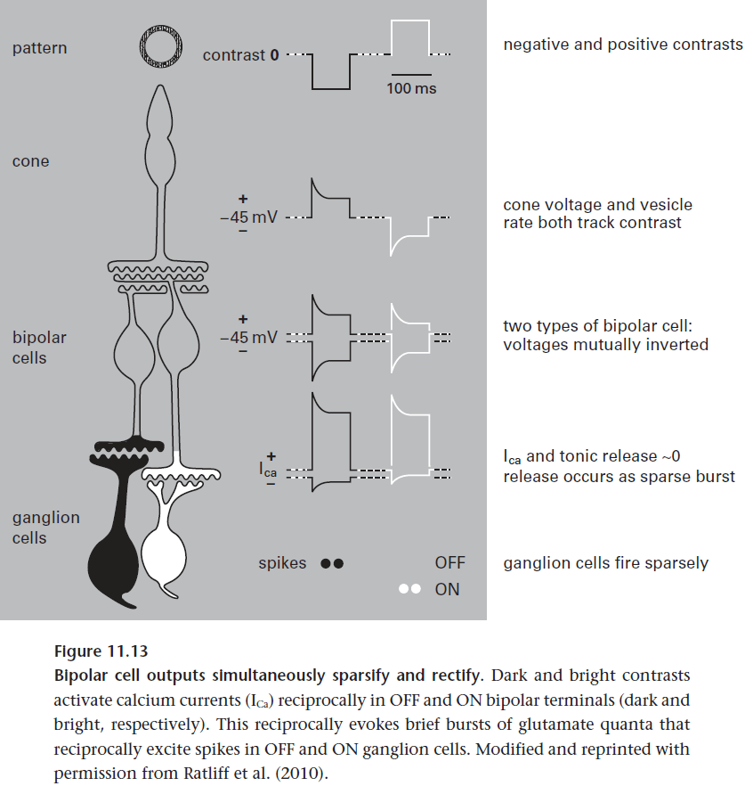
- Two tasks of bipolar cells
    - Sparsify the input by removing unimportant information and only keeping the information of contrast.
    - Rectify the input by doubling the number of transmission lines but halving the information per line.
- A ganglion cell’s core computation task is to concentrate information. It does so by computing a 2D Gaussian filter on bipolar cell inputs.
- Why a Gaussian filter? It isn’t explained in the textbook.
- The Gaussian filter is implemented as an analog primitive computation; a computation resulting from its physical form.
- The Gaussian weighting is computed for free by the ganglion cell’s branching pattern.
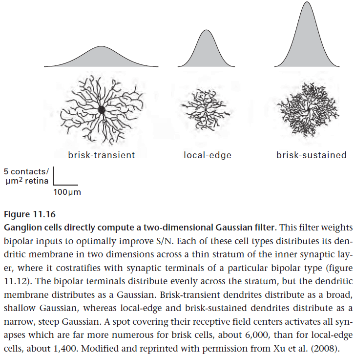
- The broadest ganglion cells are typically about 0.5 mm in diameter and collect about 5000 bipolar cell contacts.
- This number is conserved across mammalian species of vastly different eye sizes, suggesting that this size of ganglion cell reflects the structure of natural scenes.
- Ganglion cells work together in an array to capture a scene. The spacing between cells matters because this defines the resolution of the scene.
- However, if the cells overlap, this causes some of the information to be redundant to neighboring cells.
- So how far should the dendrites extend?
- Optimal design should maximize the information sent by the array. This means balancing the signal-to-noise improvements of individual neurons against the redundancy due to their overlap.
- The optimal design for natural images is when receptive fields are two standard deviations apart or when dendrites overlap about three times, and this precisely matches what is observed.
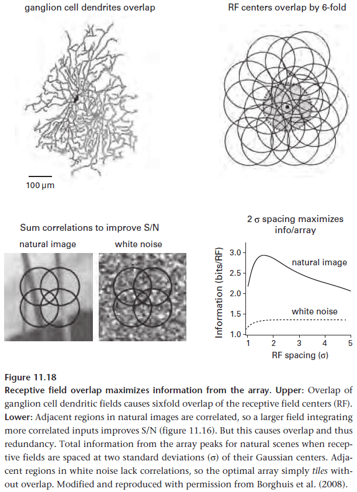
- Natural scenes contain more dark regions than bright ones and since there are more dark regions, they must also be smaller.
- Correspondingly, OFF arrays are denser than ON arrays and use narrower dendritic fields.
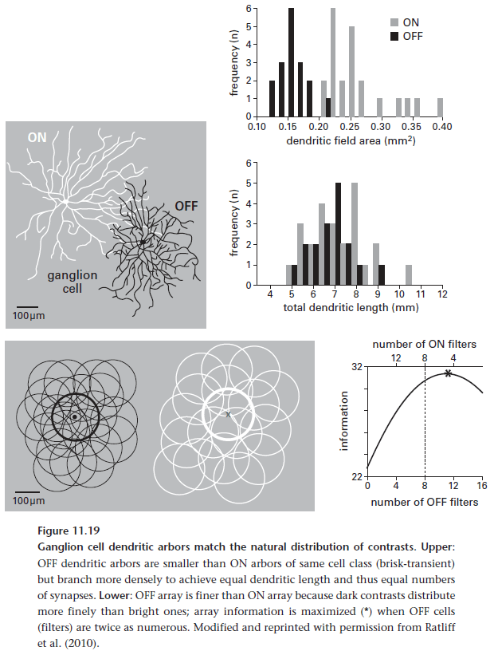
- By matching the distribution of ON/OFF arrays with the natural distribution of its inputs, the retina is able to conserve spikes.
- The retina distributes cell's coding for high frequencies sparser and cell's coding for low frequencies denser.
- The reason for segmenting bandwidth, the same for segmenting contrast, is to be more efficient by better matching neurons to the information they carry.
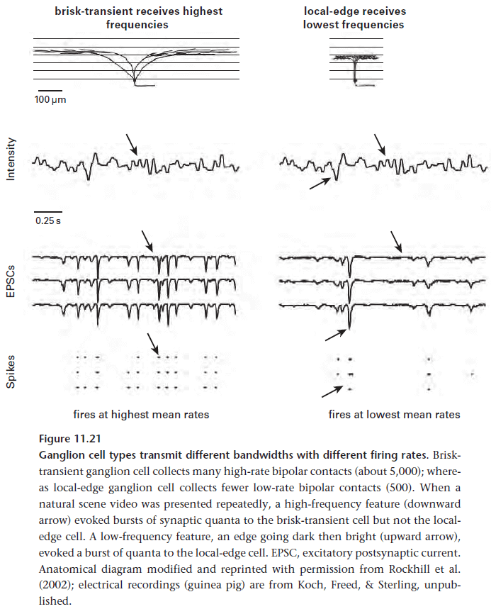
- Reasons why ganglion cell types are conserved across species
    - Physical properties, such as photon noise, vesicle noise and synapse size, are invariant.
    - Statistical structure of natural scenes is invariant.
    - Once a design is optimal, it's preserved due to no pressure to change.
- Ganglion cells aren’t stringent filters nor feature selectors because then it would remain mostly silent.
- This is an issue because it would encode too few bits to pay its maintenance cost and would not be efficient.
- So, the uniformity of natural scenes restrains the specificity of ganglion cell tuning and reduces the number of types.
- This leads to two designs of ganglion cells
    - General filters to capture the broad distribution of frequencies in a scene.
    - Semi-specific filters to capture stereotyped aspects in most scenes.
- There are also central pattern generators in the eye that coordinate motion of the eyes and head.
- To track the direction of motion, the retina has ON/OFF direction-selective ganglion cells used in
    - Maintaining eye position when the head rotates.
    - Tracking a fast object with the head still.
- The last information bottleneck in eye processing is the optic nerve.
- Information from the retina has an expiration time of 100 ms before it becomes useless. This imposes a time constraint on how fast to send information.
- The retina has this expiration time as any slower would mean not reacting fast enough and potentially getting eaten by a predator.
- Sending too fast would use thicker axons and more resources while sending too slow would compromise function.
- So the distribution of firing rates sets the distribution of axon diameters, and thus the structure of the optic nerve.
- Remember that space and energy costs rise as squared of spike rate, so a doubling of spike rate requires a quadrupling of space and energy.
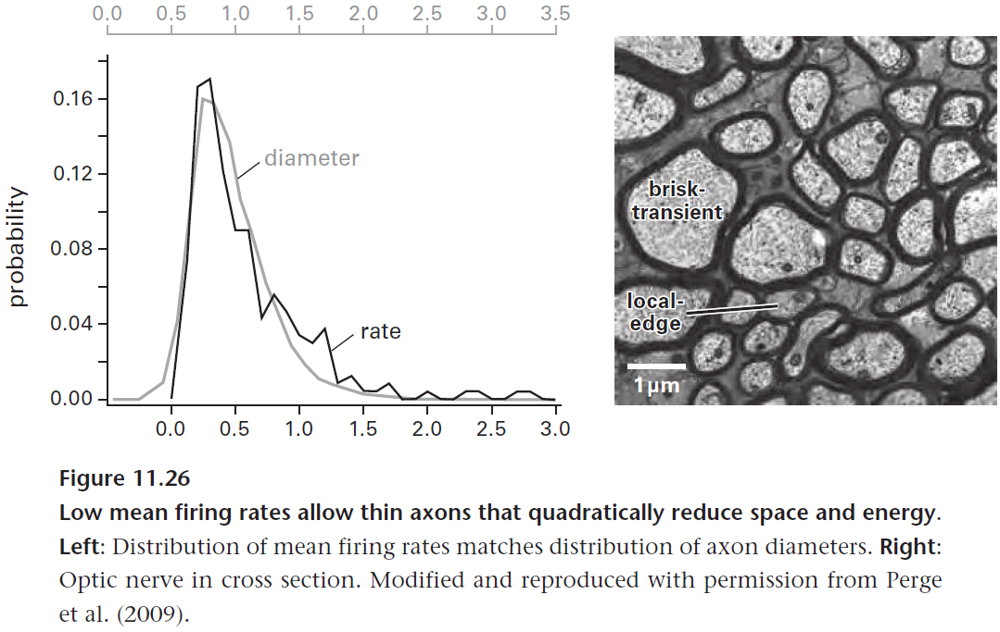
- The eye reduces spike rate using all of the techniques mentioned in this chapter
    - Reduce noise and redundancy.
    - Only encoding contrast.
    - Dividing bipolar cells into ON and OFF types.
    - Dividing ganglion cells into further types.
    - Matching rates downstream.
- This lets the eye encode as many bits as possible using the fewest possible spikes.

## Chapter 12: Beyond the Retina: Pathways to Perception and Action

- Leaving the retina are at least 20 unique representations of the scene.
- E.g. Color, direction, slow intensity changes, fast intensity changes, local contrast.
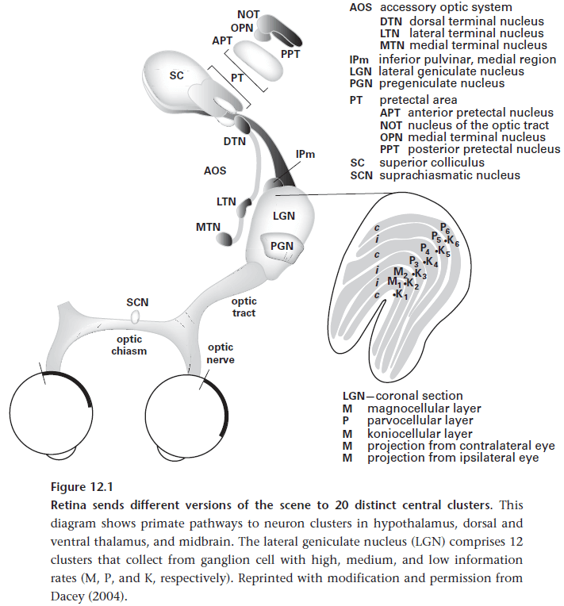
- Two facts about the visual system
    1. The signal-to-noise ratio of a single spike from the retina is not degraded as it moves along the central visual pathways.
    2. Perceptual decisions must be near noiseless since they match the efficiency of a noiseless discriminator.
- Following the principle that sensing should guide behavior at the lowest possible level, some functions need little processing beyond what was achieved in the retina.
- E.g. Information on slow changes in light intensity are sent directly to the SCN that controls the central circadian clock.
- E.g. Information on fast changes in light intensity are sent directly to the central clusters that control pupil diameter.
- These are simple neural circuits that use feedback and direct connections to control vision without invoking the brain.
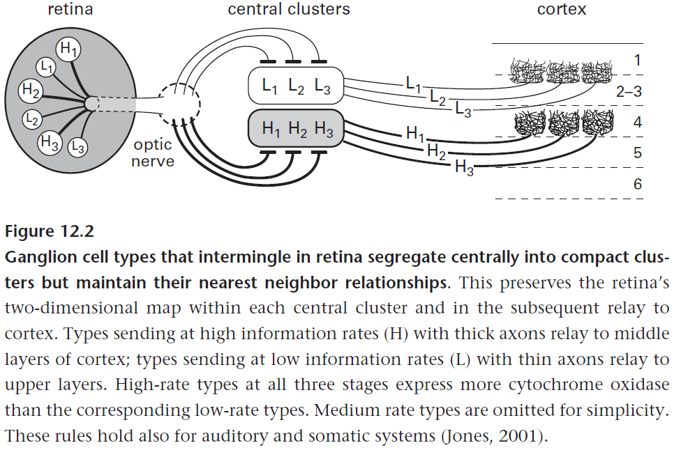
- In the LGN, the low-rate and high-rate information channels are processed in parallel and continue to remain separated.
- The inputs remain separated for multiple reasons
    - Avoids mutual interference.
    - Uses less wiring.
    - Preserves nearest neighbor relationships.
- Neurons that fire together should locate together. Once again, the meaning of neural signals is preserved by preserving the pathway it came from.
- Spatial acuity for each visual function is set by the spatial grain (density) of its particular ganglion cell array, not the density of photoreceptors.
- To preserve this acuity in further processing, each ganglion cell has a private line to one relay cell in the thalamus.
- It also follows that the relay cell has properties of its connected ganglion cell.
- E.g. Brisk-transient relay cells have higher spike rates and higher information rates.
- However, remember that each retinal point is covered by the receptive field centers of six ganglion cells of the same type and that this redundancy is unavoidable.
- It’s unavoidable because ganglion cells of fixed spacing extend their dendrites to collect more contacts and to improve their signal-to-noise ratio.
- So the main reason for the thalamic relay neuron is to reduce the redundancies caused by the sixfold overlap of ganglion cells.
- This allows the same information to reach the cortex at the same bit rate but at half the spike rate.
- These savings in space and energy are carried forward in the cortex by allowing postsynaptic neurons to operate at lower rates.
- This appears to be the LGN’s main computational task and for the other thalamic relays as well.

- The way the thalamic relay neuron reduces the redundancy in the input is by integrating a strong private input from a ganglion cell with redundant weaker ones from its surrounding ganglion cells.
- This process that deepens the surround of ganglion cells also occurs when ganglion cells combine the overlapping receptive fields of bipolar cells.
- Each relay cell collects about half of its retinal synapses from a private line and the rest from the five overlapping retinal neighbors.
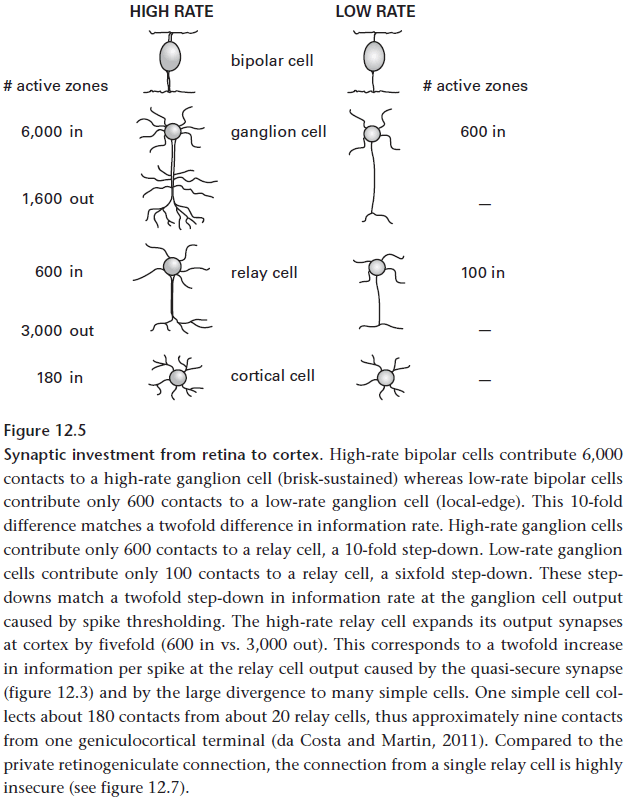
- Reasons to gather optic signals at the thalamus
    - Provides a point of control to gate the rate of signaling depending on arousal level.
    - Relay cells can use overlapping receptive field information to improve spike timing.
    - Can create copies of inputs to be used by different cortical areas for distinct computational purposes.
- All of these reasons apply equally to the other senses such as touch and hearing.
- V1 is the largest cortical area of the brain, occupying about 13% of the total cortex.
- V1 restricts each category of pattern coding (space, motion, color, and dept) to one serial mechanism and devotes space and energy to information that uses a higher spike rate.
- E.g. High-rate neurons terminate in upper layer 4, medium-rate neurons terminate in lower layer 4, and low-rate neurons terminate in layers 1-3.
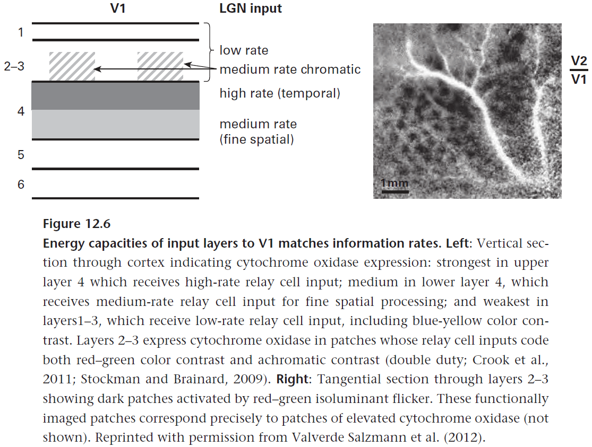
- *Gabor filter*: a weighting function that optimally represents spatial position and spatial frequency.
- *Simple cell*: a cortical neuron that integrates inputs from a line of thalamic relay cells.
- A simple cell doesn’t respond to the isolated firing of a single relay cell and only fires when a line of relay cells fire together. This way, the simple cell reports a linear feature in the scene.
- The Gabor filter function is computed, like the difference-of-Gaussians function of retinal ganglion cells, by using a clever balancing of excitatory and inhibitory weights.
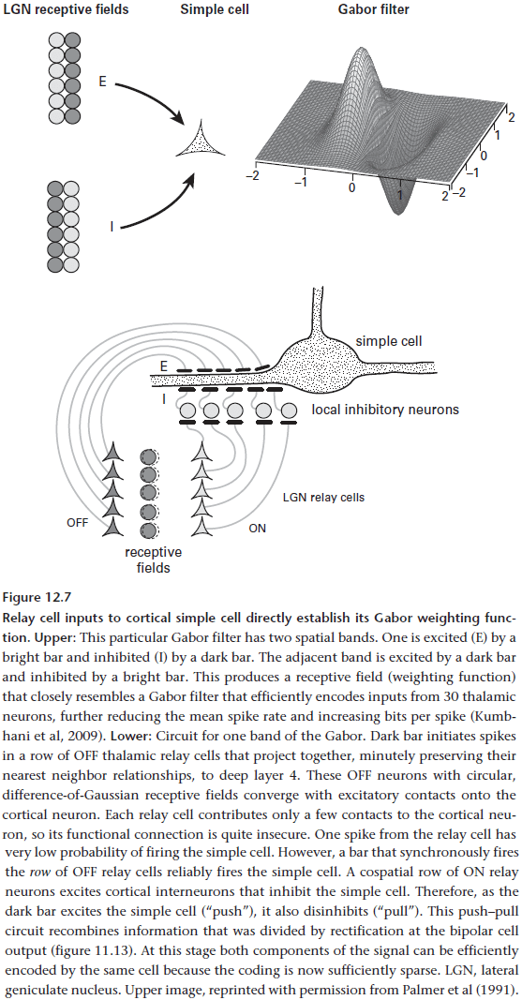
- For a simple cell to implement a Gabor function, it recombines the complementary halves of the original cone response (ON/OFF) in a push-pull design.
- E.g. If a bright contrast is shown, a simple cell is both excited by a band of ON relay cells and is inhibited by a band of OFF relay cells. However, if there’s an edge, then the contrast isn’t uniform so the simple cell is activated.
- Why recombine the information here in the cortex instead of the retina? Because only at the cortex is the coding sparse enough for both halves of the original signal to be processed efficiently by the same cell.
- Once again, the pathway of the information is used to process the signal.
- A simple cell is mostly silent which is puzzling since many simple cells are required for a path of visual space.
- How much idle capacity should be tolerated?
- Given how the early stages of visual processing expended so much to reduce redundancy, a simple cell seems to have thrown most of it away.
- Yet this is unavoidable with sparse coding as it trades expensive APs for unused capacity.
- There is a limit to this though as ruled by the law of diminishing returns.
- There is an optimal sparseness that maximizes energy efficiency, and this depends on the ratio between the fixed cost of creating and maintaining a neuron and the additional cost of firing a spike.
- The rule is
    - When neurons are expensive and spikes are cheap, spike frequently to increase information per neuron.
    - When neurons are cheap and spikes are expensive, spike infrequently to increase information per spike.
- For the average cortical neuron, spikes are expensive so the ratio favors low rates. And indeed, cortical neurons operate close to the optimal efficiency.
- On the path towards perception, the expansion of redundancy represents progress.
- Sparse representations serve several purposes
    - Increasing energy efficiency.
    - Facilitates feature extraction as the response to a feature stands out.
    - Easier to learn correlations by coincidence detection as fewer spikes produce fewer spurious coincidences.
- V1 is so large because of the redundancy caused by sparse coding. This may also explain why the cortex is so folded to increase surface area.
- However, this is also puzzling since sparsifying reduces energy cost at the expense of space, but space is at a premium in the skull.
- V1 simple cells aren’t static filters, but adapt to match their coding context to improve efficiency.
- The adaptation is done by inhibitory interneurons that encode the weighted mean of the activity of the local population of simple cells and makes inhibitory synapses on the simple cell’s soma.
- *Divisive normalization (DN)*: scaling the output with respect to the local mean.
- The inhibitory synapses reduce the simple cell’s input resistance and shunt its response by a constant proportion to perform divisive normalization.
- DN increases efficiency by
    - Matching coding to the input distribution
    - Ensuring signaling range is used efficiently
    - Reducing correlations between spikes
    - Advancing pattern recognition
- DN discards absolute values and establishes relative values.
- In the retina, DN is used to discard absolute light level to encode the invariant property of relative light level (contrast).
- In simple cells, DN is used to discard absolute contrast to encode relative contrast.
- In both cases, DN is used to help the visual system generalize.
- E.g. A low-contrast shark in murky water is just as dangerous as a high-contrast shark in clear water.
- Just as pathways for negative and positive contrasts rejoin at the simple cell, so do pathways from the two eyes.
- Each point of an object is captured by two sets of ganglion cells, one in each eye, but from slightly different angles.
- Since the angle depends on the viewing distance, their responses can be recombined at a simple cell that responds selectively to an object at a certain depth in the visual field.
- V1 combines the responses with the least wire since the responses were aligned at the thalamic level and were projected together.
- To detect motion, simple cells may use a lagged receptive field with a non-lagged receptive field. So if they’re both activated, then we know some time has passed for both to be active so the object we’re observing is moving.
- The next step in visual processing after simple cells are complex cells.
- Complex cells combine the output of many simple cells and outputs it to other areas of the brain.
- From there, it depends on what information the downstream targets need. Since the downstream targets are functionally diverse, each target needs different information.
- E.g. The superior colliculus captures targets for rapid eye movement so it need to know the direction of target motion.
- The principle of sending only what’s needed is emphasized here.
- Cortical neurons use diverse dendritic patterns to collect particular inputs.
- Cortical neurons use diverse axonal patterns to distribute particular outputs.
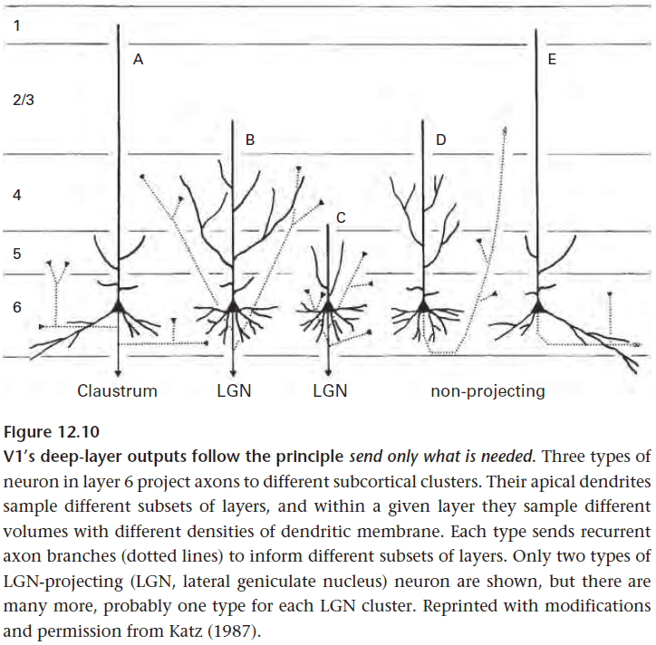
- V1 directs most of its output to adjacent cortical areas, mainly V2. Adjacency saves wire and this shows with V2’s map arranged to be mirror-symmetrical with V1.
- V2 performs the next stages of pattern analysis for
    - Spatial pattern
    - Color
    - Motion
    - Stereopsis
- V2 reorganizes the information from V1 by integrating common features together. However, it still separates fast, slow, and color visual representations.
- The purpose of V1 neurons is to detect edges using push-pull wiring and Gabor weighting.
- The purpose of V2 neurons is to identify sets of edges and to segregate figures from their background.
- Segmentation is based on position, color, depth, and motion cues.
- The structural differences between cortical areas is subtle and suggests that the same basic circuits repeat and repeat.
- This suggests that all cortical areas are performing similar processing.
- General properties of the cerebral cortex
    - Sparse coding
    - Log-normal distribution of spike rates
    - Mean rates of a few spikes per second
- General computations of the sensory cortices
    1. Find correlations in the natural environment.
    2. Segment the bandwidth to send at the lowest acceptable rate.
    3. Encode with optimal weighting functions such as Gabor filters.
    4. Regroup segments according to Gestalt rules.
- The theme for neural investment, up until now, has been to match neural resources to the physical distribution of information.
- Examples from the visual system
    - Because nature has more negative contrasts than positive, invest in more OFF responses than ON.
    - Because nature is structured so that second-order correlations generate $$1/f^2$$ power spectra, V1 invests in Gabor filters that optimally encode with that statistical property.
- Now, the theme for neural investment shifts to “ask not what the brain can do for nature, but what the brain can do for the animal”.
- Beyond V2, the brain’s task is to find what matters the most and to do so quickly.
- Why V2? It appears to complete the process of coding a whole scene efficiently as it is the last visual area where a lesion can cause blindness.
- Lesions to areas downstream of V2 don't cause complete blindness.
- What matters most to an organism is survival and reproduction.
- For survival, vision aids in grasping objects, detecting threats, reading emotional expression, and more.
- To solve each need, the engineer’s rule applies, specialize.
- Each need requires a specific computation and by specializing, it can be done cheaply and quickly with a dedicated circuit.
- E.g. Some needs can be approximated such as grasping, while others require precision such as throwing a rock.
- At the higher cortical areas, where the dedicated circuits live, much of the information from V2 is discarded for efficiency.
- Only what’s needed is retained.
- Review of ventral (what) and dorsal (where) visual processing streams.
- The discarding/selecting process continues along these streams until various small areas contain highly specific information.
- Each area is then placed near the ones that need it.
- E.g. The grasp area, at the end of the where stream, is located close to the motor cortex. The face area, at the end of the what stream, is located close to the amygdala.
- It takes about 200 ms for the brain to make the final integration of emotion, gaze, and gesture to respond.
- The design that generates highly specialized processing areas leads to bizarre syndromes when that area is damaged or disconnected.
- E.g. Face blindness (prosopagnosia), color blindness (achromatopsia), inability to recognize words (alexia), inability to recognize motion (akinetopsia).
- These syndromes are a result of the design principle “to complicate” but how we unify each specialized area is still a mystery.
- Much like the face area for vision, there’s a voice area for audio that’s close to the face area.
- Some inkling of what matters most for human survival is given by the patterns of cortical investment.

## Chapter 13: Principles of Efficient Wiring

- One way axons save wiring is by branching at an acute angle rather than at a right angle (Y vs T).
- Axons also tend to leave at the point nearest to their destination.

- Any theory of efficient wiring must also consider energy as space and energy are strongly correlated.
- This chapter compares three structures
    - Retina
    - Cerebellar cortex
    - Cerebral cortex
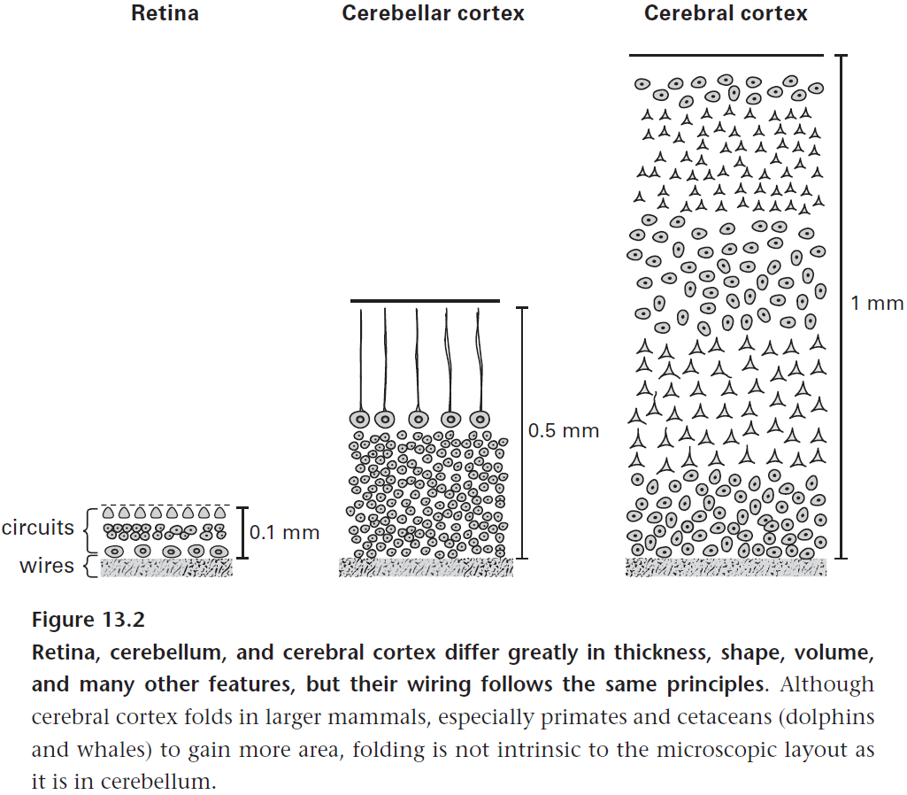
- Each of these structures share certain features such as being layered and being laid out as maps.
- However, they also greatly differ in size, form, and function. What design principle connects all three structures?
- The principle of efficient wiring.
- The core constraint on all circuit design is the substantial and irreducible electrical resistance of neuronal cytoplasm.
- Cytoplasmic resistance prevents local circuits from being any finer than they are.
- Problems caused by resistance
    - Attenuates (reduces the amplitude) the spread of signals along a neural cable.
    - Limits the rate of membrane capacitance changes thus reducing signal speed.
    - Sets an upper bound on the length of dendrites.
- Resistance can be reduced by increasing cable diameter, but voltage doesn’t scale as well at square root of diameter.
- This causes a law of diminishing returns.
- E.g. For a dendrite to double its length or halve its delay, it must quadruple its diameter and thus increase its volume by 16 times.
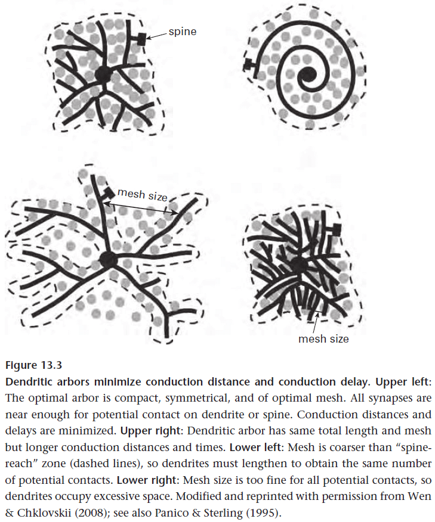
- So to conserve volume, dendrites should stay thin and by staying thin, they must also stay short.
- This results in a branching pattern that’s symmetrical and compact around the cell body.
- This same constraint, of cytoplasmic resistance, applies to axons as well.
- It appears the optimal wiring fraction (dendrites and axons) is about 3/5 or 60%.
- The same constraint also applies to synapses.
- Three connection tasks and the optimal layout for each
    1. Connect a dense array to a sparse array with modest divergence and convergence.
    2. Connect a dense array to a sparse array with extreme divergence and convergence.
    3. Connect many dense arrays to many other dense arrays with moderate divergence and convergence, preserving a high ratio of potential to actual synapses.
- For the first task
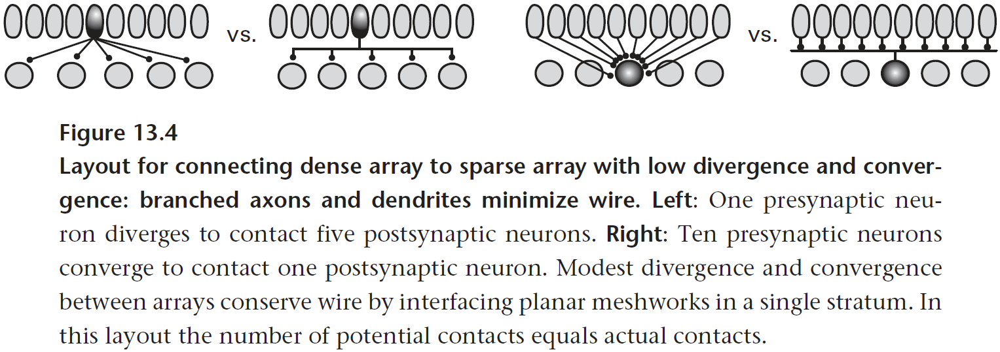
    - It’s more efficient for the sender/receiver to have a shared output/input line than to have individual lines.
    - Think of it like an electrical bus for computers.
    - Example of this task is the retina.
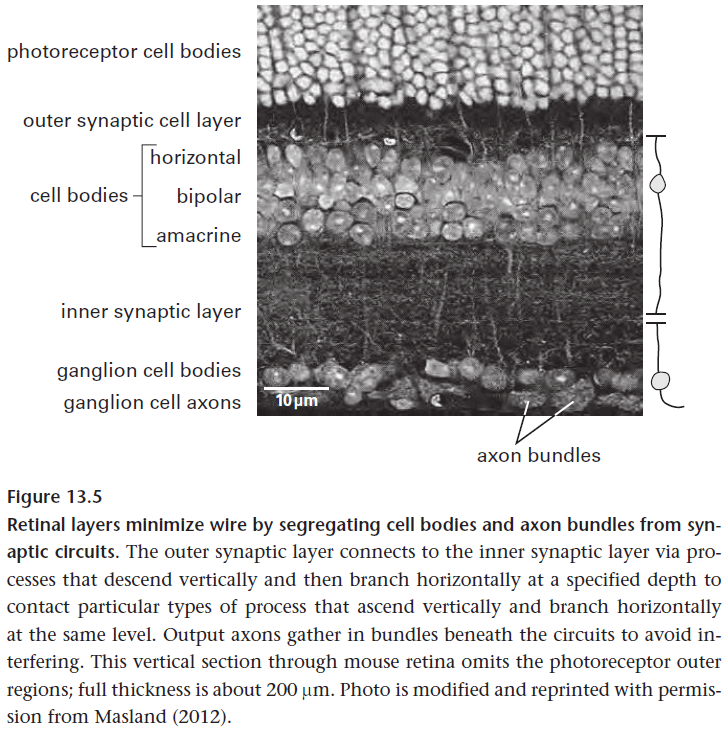
- For the second task
    - Example of this task is the cerebellum.
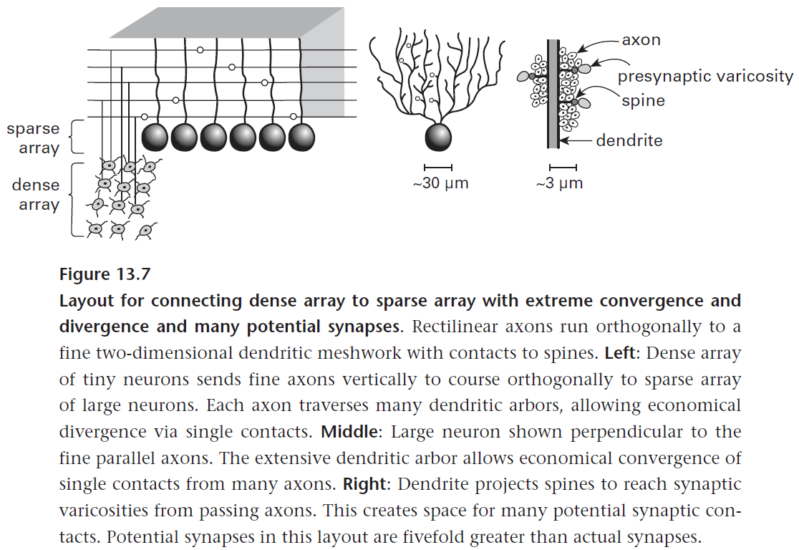
- For the third task
    - Example of this task is the cerebral cortex.
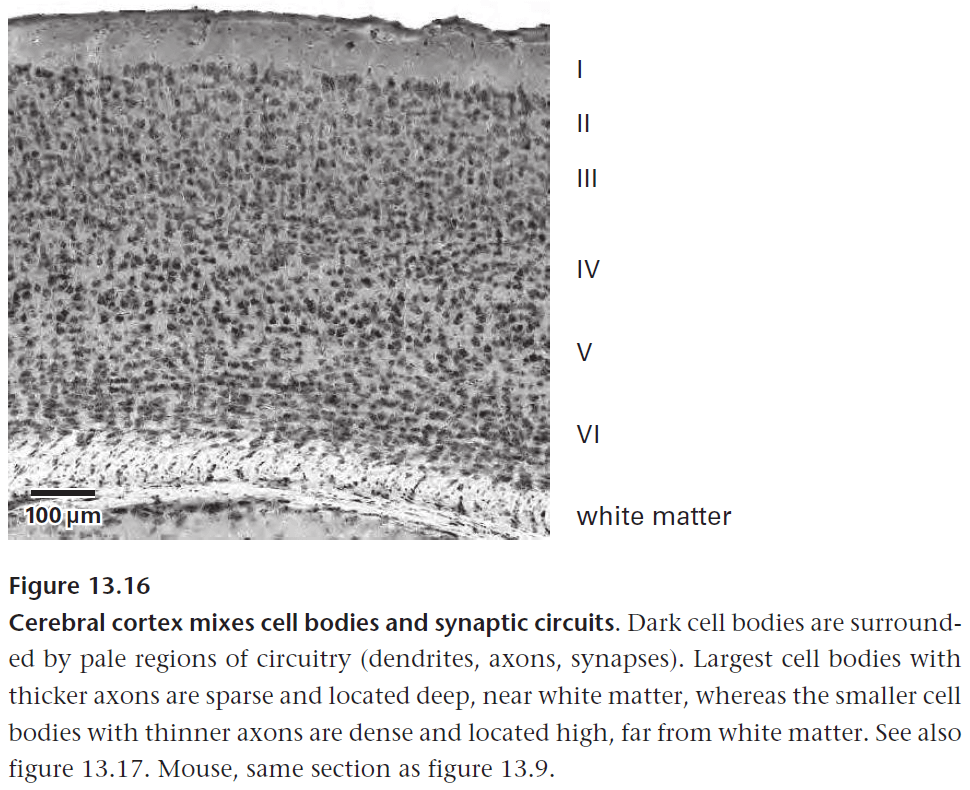
- Input rates to the visual cortex are scaled-down from the optic nerve rates, so the fiber diameters are scaled down accordingly.
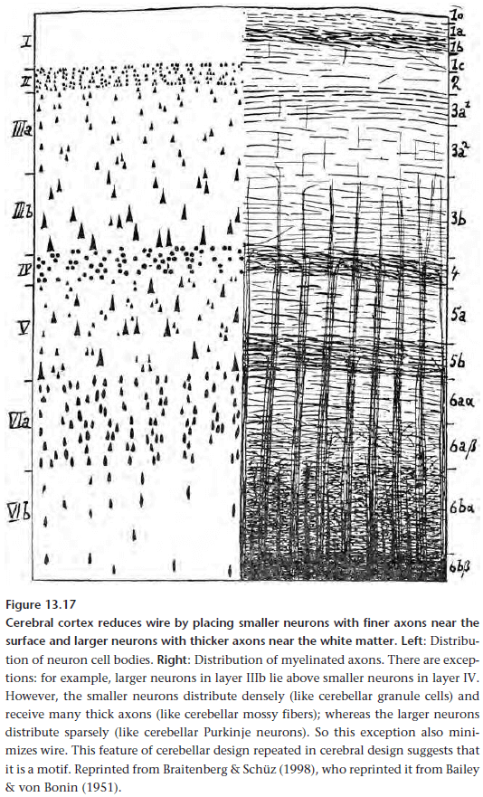
- Larger neurons with thick axons lie deeper in the cerebral cortex, while smaller axons with thin axons lie shallower in the cerebral cortex.
- This saves space as the thicker axons don’t need to be longer.
- Each cortical layer has 10-30% inhibitory neurons.
- While this is far less than the number of excitatory neurons, the inhibitory neurons synapse at potent locations on neurons.
- E.g. Proximal dendrite, cell body, axon initial segment.
- An example of this potency is shunting inhibition.
- So although 90% of synapses to a pyramidal neuron are excitatory, the fewer inhibitory synapses exert substantial influence.
- E.g. Constricting coincidence detection, sharpening response tuning, and maintaining circuit stability.
- Cortical neurons are segregated into layers and columns.
- Neurons within a column share the same topographical location on the map of whatever sense is being served and they share the same receptive field properties.
- E.g. All neurons in a V1 column respond to the same stimulus orientation.
- Columnar segregation is achieved by orienting the apical dendrites of pyramidal neurons vertically and by also giving their axon collaterals a net vertical orientation.
- Functions of cortical columns
    - Topographical maps save wiring.
    - Placing components near each other saves wiring.
    - Giving axons and dendrites a similar orientation allows them to connect using less wire.
- When two neurons share inputs, they stay close together because if they’re separated, it’ll require more wiring to reach both of them.
- This explains why topographical maps are universal and why higher cortical areas collect signals from lower cortical areas.
- Why subdivide the cerebral cortex into many distinct areas, rather than go with one super-area?
- To prevent wires from different circuits from interfering with each other, as this increases noise and wiring.
- Wire minimization explains
    1. Why cortical areas exist.
    2. Why they contain smooth maps.
    3. Why related areas arrange themselves in particular patterns.
    4. Why cortical columns exist.
    5. Why ocular dominance columns exist.
- Specialized computations are lateralized not only in large brains but also in the small brains of songbirds.
- Clustering areas for specialized processing minimizes wiring and reduces computing delays. The results can then be communicated between hemispheres by extremely thin axons.
- This is the small-world network of connectivity.
- The corpus callosum is the largest tract interconnecting the cerebral hemispheres.
- It uses extremely thin axons that are mostly less than 0.2 $$\mu m$$ in diameter and the distribution of diameters is log-normal.
- Pressure to compute locally seems to have driven hemispheric specialization.
- While brains may seem expensive, the heart and kidney use 1.7 times more energy per gram of tissue.
- Within the brain, different regions use different amounts of energy with auditory structures using the most energy because their neurons need to process faster signals (high temporal frequencies).
- The cerebellar and cerebral cortex differ remarkably in how they spend their energy allowance.
- The cerebellar cortex takes high-rate input, processes it using low-rate neurons, and gives high-rate output.
- The cerebral cortex takes in low-rate input, processes it into an even lower rate, and then outputs only what’s needed for a particular purpose.
- For the central tracts, we would expect that most of the space and energy would go to axons since the tracts deliver information. However, about 30% of the space is used by glial astrocytes and about 70% of the mitochondria are in the glial.
- The reason for the substantial investment in glial cells is because each spike dumps a pulse of potassium into the extracellular space, causing a sharp local rise in potassium concentration.
- This reduces the gradient across axonal membranes, which means neurons are more sensitive since their membrane potential is elevated.
- To prevent this, glial cells are used to rapidly restore the potassium gradient by removing the extracellular potassium.

## Chapter 14: Learning as Design/Design of Learning

- Learning is a principle of brain design.
- Learning belongs to a broad set of principles that’s a continuum to adapt, match, learn, and forget.
- This principle is what separates biology from traditional engineering.
- E.g. A car doesn’t adapt to changing conditions. It could if the car, on a rough road, could thicken its tires, stiffen its springs, and change gears ratios automatically. In essence, learning from the road and adapting.
- Yet for biology, adaptive responses are the essence. Think evolution.
- E.g. Where skin sustains rough wear, it thickens to callus. Where muscle sustain weight, it strengthens. Where brains face new problems, it adds more neurons.
- It seems that wherever we look, current experience is continually being used to update circuits to improve their future performance.
- These adjustments occur in all brains and in all systems.
- E.g. From C.elegans to humans, in the spinal cord and cerebellum.
- Adjustments are made at all levels of circuit organization. From adding, removing, and changing the structure of a protein molecule, to synapses and even neurons.
- E.g. The enlargement of the hippocampus in London taxi drivers due to the need to remember London's road map.
- White matter also expands with learning by forming new circuits to send out information.
- To adapt its capacity to changing demands, the hippocampus in adults continually creates new neurons.
- If the new neurons are used, they serve newly formed memories since deleting them also deletes the new memories.
- The hippocampus also expands because memories are stored by strengthening synapses, which requires them to enlarge.
- The hippocampus isn't unique as other cortical areas also expand with practice.
- E.g. Cortical motor areas expand with motor practice, the visual word form area expands with literacy, and areas critical to social functioning expand with the size of the social network.
- The core principle is to use current conditions to predict future needs and to revise circuits accordingly.
- Learning, in the biological sense, is the structured channeling of information from the present to the future.
- Learning, besides being a design principle, is also a neural function.
- An important constraint on learning is space. The adult brain resides within an enclosed skull so it can’t expand.
- So learning must conserve space with a design that
    1. Is spatially specific.
    2. Stores only what’s needed.
    3. Stores only for as long as needed.
    4. Stores and retrieves information at the site where it’s processed.
    5. Optimizes the units of storage.
    6. Optimizes a teaching signal for the real world.
- A design that expands a neural circuit following practice should also shrink the circuit when it’s persistently unused.
- Evidence for this comes from retired taxi drivers that have a normal hippocampus size.
- In practicing one skill over years, we neglect other skills. Time restricts us.
- Skills decay rapidly when not used so masters and experts need to constantly practice.
- An animal whose body grows continually throughout life must also continually grow its brain to manage such body.
- However, in humans, our body stops growing at the start of adulthood, which means our brain also stops growing.
- This restrains learning as learning must refrain from adding new circuits unless it’s also prepared to make space by pruning others.
- The brain only stores what’s needed and only for as long as it’s needed.
- Once we receive new information, we auto-delete the old ones. Early drafts are discarded.
- Why do we have trivial memories from childhood then?
- What seems trivial now was not trivial when it was learned.
- Either through repeated exposure or emotion, those memories have been ingrained and nearly ineradicable.
- And those trivial childhood memories are useful for sculpting our behavior and identity. Evidence comes from people with severe retrograde amnesia.
- However, also interesting is that these memories aren’t used for defining consciousness. People without their long-term memory, aka have amnesia, are still conscious.
- The buildup of long-term memories also defines the capabilities of wisdom which presumably increases biological fitness.
- The site to compactly store information is the synapse. Storage occurs by changing the synapse’s weight or it’s ability to excite/inhibit a postsynaptic neuron.
- Since the synapse is the key site for storing information, this also avoids additional wiring as it’s part of the wire.
- Another benefit is that retrieving the information doesn’t require any additional wiring either.
- We shouldn’t seek a special organ for information storage as it’s stored where it should be: in every circuit.
- For short-term storage, synaptic plasticity fits the broad definition of learning of using present information to adjust a circuit to improve future performance.
- Change circuits to match stable changes in bottom-up input statistic.
- E.g. Blinding one eye strengthens the synapses for the other eye. Wearing a tinted contact lens for a few days shifts color perception.
- However, these changes occur most rapidly and completely during a critical period of development.
- E.g. Childhood.
- Short-term changes of input statistics causes circuits to adapt via short-term synaptic facilitation.
- Long-term changes of input statistics causes circuits to resculpt.
- Certain brain areas should specialize in maintaining high levels of plasticity, while other areas should specialize in retaining what they’ve learned (low levels of plasticity).
- There’s a brain area called the visual word form area (VWFA) that’s specialized to read words.
- Reading vastly extends an person’s information storage capacity by moving it beyond the skull and into words.
- E.g. Books, manuscripts, internet.
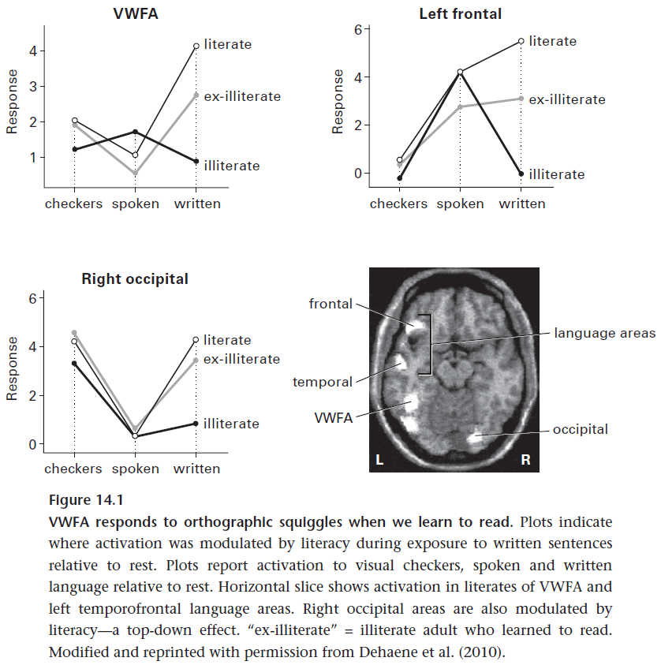
- However, developing the ability to read has used up space that other functions could have used.
- E.g. VWFA captures some territory from the fusiform face area.
- Apparently, words are initially stored without their meaning, probably because meaning isn’t what first distinguishes them from noise.
- Cellular design for efficient information storage
    - Information is stored and retrieved at the synapse.
    - Storage occurs by increasing/decrease the synaptic weight.
    - Synaptic weight is the contribution of the presynaptic neuron to firing the postsynaptic neuron.
    - Space for synapses is constrained by competing needs for neurons, axons, and dendrites.
    - So synapses can’t be any smaller than they already are.
    - To increase synaptic weight, a synapse must enlarge to accommodate more vesicles and more active zones for release.
    - However, to accommodate for more resources at the synapse, the neuron must also invest in a larger axon, more transportation, and more neurotransmitter.
    - The costs of learning aren’t confined to the initial synapse, but also propagate through the system.
    - It’s more efficient to have many smaller, noisy synapses than a few large synapses.
- Synaptic weight is limited by three mechanisms
    1. Synapses are physically constrained from expanding as the space is already occupied.
    2. Hebbian synapses increase weight with correlated activations.
    3. Synaptic plasticity is regulated homeostatically.
- Review of Hebbian learning and reinforcement learning.
- Storage in many areas is driven directly by dopamine input.
- What is rewarded will be repeated.
- The brain addresses the problem of choice with neurons that encode value.
- The most efficient teaching signal for any learner, whether animal or machine is computed by the temporal difference (TD) model.
- The temporal difference model computes the difference between the actual and predicted reward, and feeds it back to the choice mechanism.
- E.g. If the choice we made was better than predicted, repeat that choice. If it wasn’t better, then forget the choice.
- One hallmark of this optimal teaching signal is its timing shifts. It initially tracks the actual reward but as suspicion grows that a stimulus predicts the reward, the teaching signal diminishes for the actual reward and grows for the predictive signal.
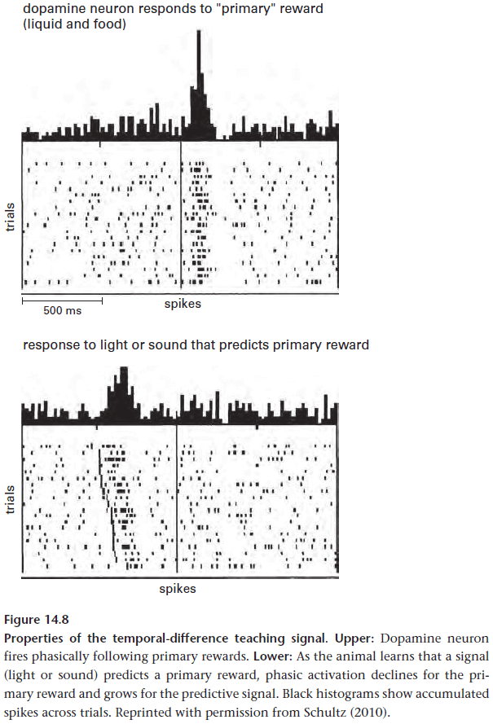
- TD learning is all about surprise, the surprise of when predictions don’t match reality.
- Two issues with TD learning
    - TD learning works best in unpredictable environments but given our modern day life, predictability reduces learning and the pleasure from surprise.
    - TD learning can be fooled by manipulating the dopamine signal using drugs.
- To store information requires space, so ultimately a brain can only hold a limited number of memories.
- The brain solves this problem by recycling space. There can’t be learning without equal forgetting.

## Chapter 15: Summary and Conclusions

- The costs to capture, process, send, store, and retrieve information rise disproportionately for higher information rates.
- One reason for the brain’s efficiency is to stay on the linear region of this curve.
- To communicate more information with less noise, the brain uses the same strategy of summing $$n$$$ correlated events and thereby improves the signal-to-noise ratio by $$\sqrt{n}$$.
- However, the costs rise faster than the benefits which means at some point, there’s a point of diminishing returns where improving the signal-to-noise ratio is uneconomical.
- One strategy to clear room for more information is to reduce redundancy.
- This is done by subtracting the mean, a redundant part of every signal, and by only transmitting the difference.
- Another strategy is to match the message to what it’ll be used for downstream.
- This is done by creating parallel channels of information that send only the parts of the message needed by the receiver.
- A complementary strategy is to match the message to it’s natural environment.
- This is done by matching the distribution of specialized neurons to the natural distribution of information.
- Compute using analogue because
    - It’s well suited for chemistry.
    - It’s direct and completes basic operations in the fewest steps.
    - It avoids dividing time into intervals so computing can be done at high information rates.
- Concentrate information by sparsifying signals.
- Thick axons are required for high firing rates but they’re also expensive, so the brain tries to minimize their length.
- The principles of neural design should apply across species and across a range of spatial and temporal scales.
- The current design principles suggest that we seem to fully use all of our brain.
- Most brain areas are silent until called upon and when an area is called upon, only a fraction of its neurons respond.
- This is part of an efficient design, not in terms of usage, but in terms of energy.
- Could natural selection do better? Probably not.
- The components of the brain, cells and proteins, are close to their maximum efficiency and further evolution probably won’t make it more efficient.
- There’s also evidence that our neurons aren’t much different from other primates, suggesting that improving the neuron isn’t the cause of our exceptional brain.
- Natural selection can improve a neuron’s performance by investing more, but for a given cost, it can’t do much better.
- The origin of some of the principles comes from electronics, chip design, mechanical engineering, and biology.

## Principles of Neural Design

**Compute with chemistry**

- Bits per joule approaches lower bound set by thermodynamic limit.
- Bits per liter reaches lower bound set by protein structure.
- Signals are fast at short distances.
- Computation is direct.

**Compute directly with analogue primitives**

- Analogue completes a basic operation in fewer steps than digital.
- Analogue is well suited to chemical and electrical computing.

**Combine analogue and pulsatile processing**

- Analogue processes information at high rates.
- Analogue electrical signals are cheaper than pulses.
- But stochasticity at all stages (vesicle release, ligand binding, channel opening) accumulates noise.
- Therefore, compute locally in analogue; threshold to restore S/N, and send noise-resistant pulses.

**Sparsify**

- Signal with proteins in small clusters.
- Release vesicles in brief bursts.
- Fire spikes in brief bursts.
- Maximize information per array for least space and energy: optimize fraction of active neurons; optimize S/N vs redundancy.

**Send only what is needed**

- Reduce noise and redundancy.
- Sculpt message for downstream users.
- Reduce number of signals to save energy and space.

**Send at the lowest acceptable rate**

- Higher rates cost disproportionately more.

**Minimize wire**

- Space and energy decrease as length and (diameter)^2.
- Small diameter allows few bits per second.
- Slowest signals can use zero wire (neuromodulators, hormones).
- Shorter wires reduce processing time.
- To shorten wire
    - Organize neurons in maps;
    - Within a map segregate computations in parallel circuits.
    - Separate circuits in layers, columns, stripes, barrels.
    - Arrange maps to interconnect with least wire
    - Connect neurons by matching their axonal and dendritic meshworks.
    - Reduce instruction set to send long distance.

**Make neural components irreducibly small**

- Smaller reaction vessel allows faster chemistry with fewer molecules.
- Lower membrane capacitance charges with smaller current.
- Nanoscale molecular components allow smaller axons and synapses.

**Complicate**

- Specialize molecules to match signal properties (match molecular binding affinity to temporal bandwidth, protein stability to photon energy).
- Specialize neural circuits to match task (rod circuit for starlight, cone circuit for daylight).
- Optimize across levels, from molecules to neural circuits.

**Adapt, match, learn, and forget**

- Adapt output capacity to predicted range of inputs.
- Match capacity across levels (symmorphosis).
- Learn in order to improve future predictions.
- Forget in order to preserve storage capacity.
