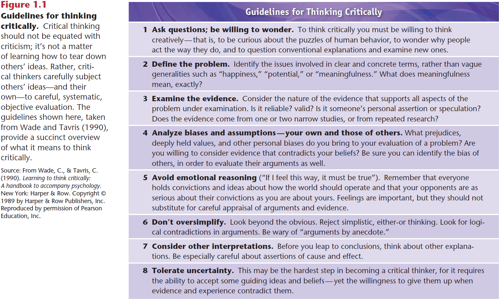
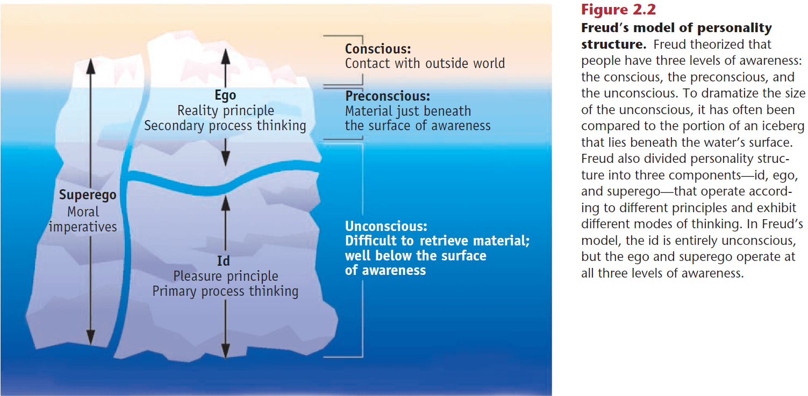
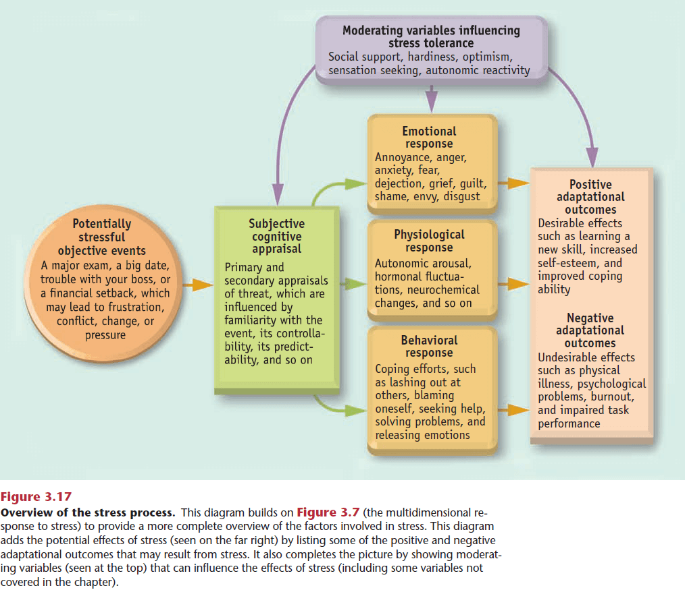
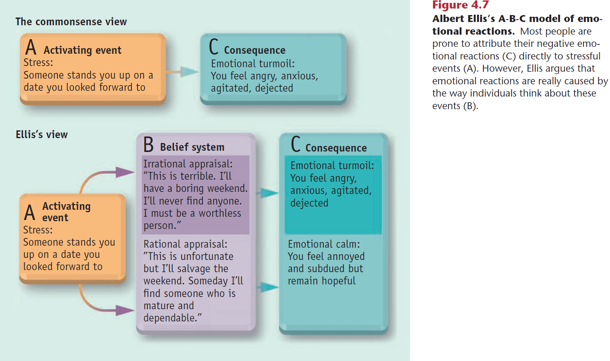
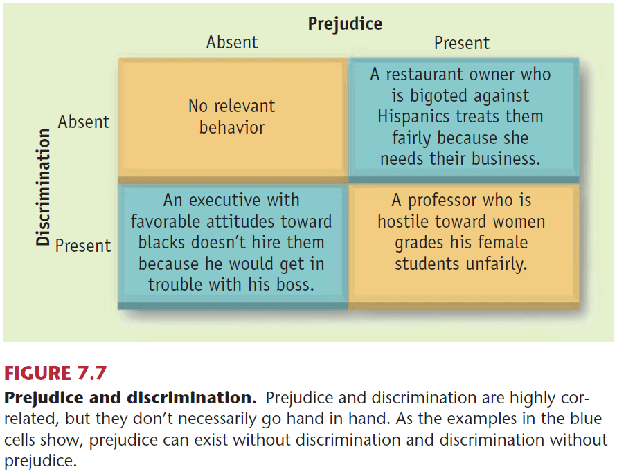
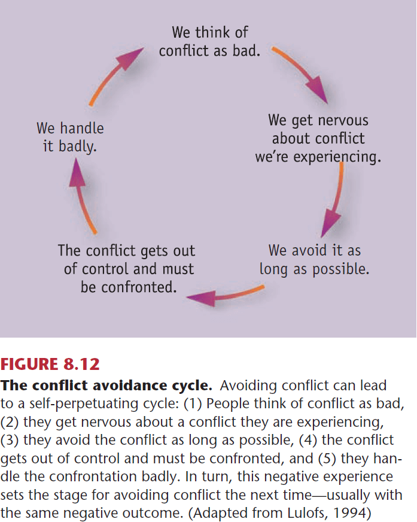
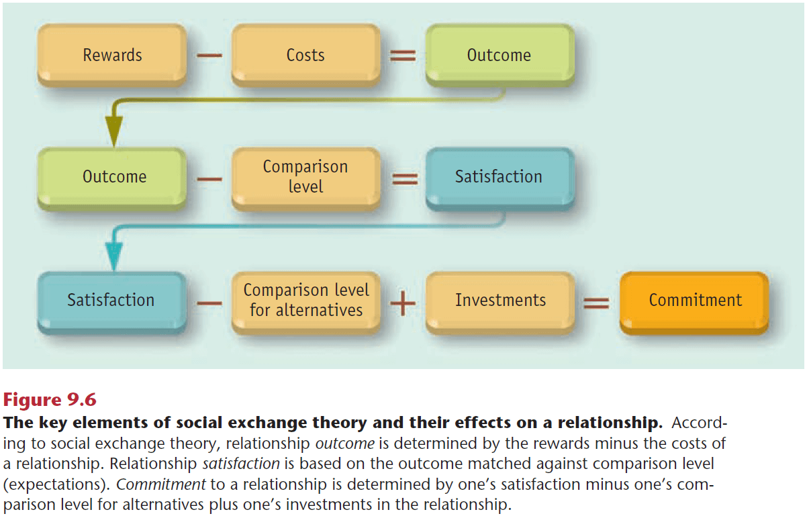
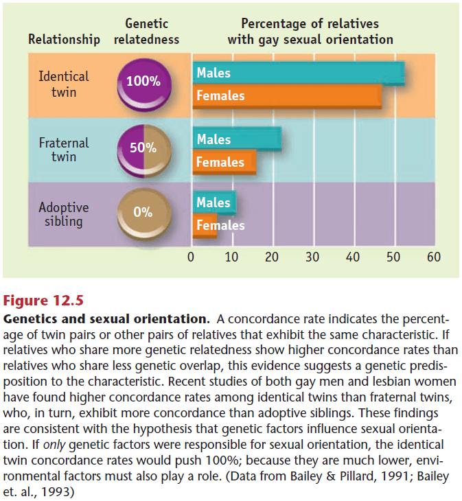
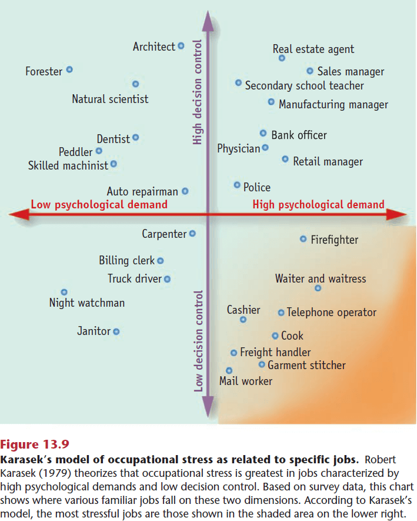
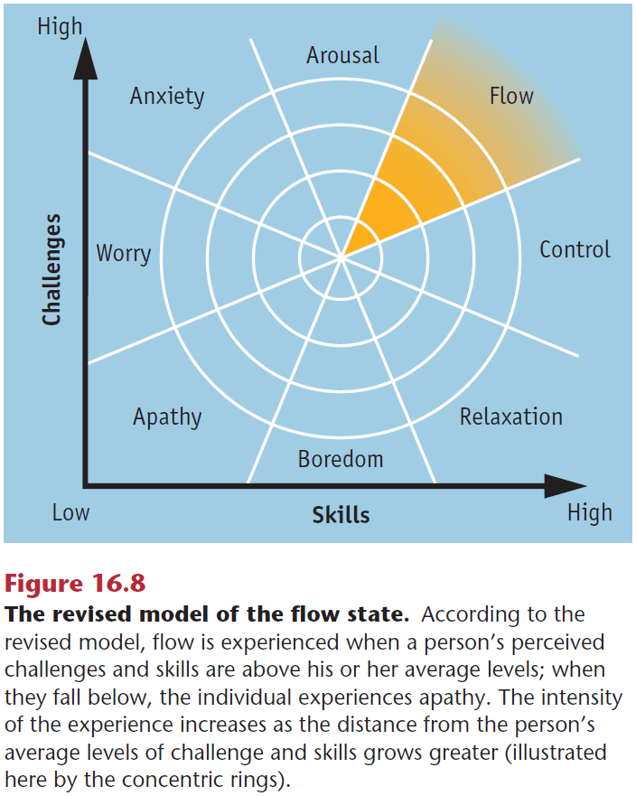

<blockquote class="blockquote">
  
The unexamined life is not worth living.

  
Socrates

</blockquote>

## Chapter 1: Adjusting to Modern Life

- We are the children of technology.
- Paradox of progress: despite our technological progress, social problems and personal difficulties seem more prevalent than ever before.
- E.g. Modern technology has provided us with countless time-saving devices but most of us complain about not having enough time.
- People find themselves tied to their jobs by the same tools that were supposed to liberate them.
- Another point is that even though modern society has an abundance of choice, more alternatives means increased regret and decision fatigue.
- Endless choices lead to wasted hours weighing trivial decisions and ruminating about whether the decision was optimal.
- The technological advances of the past century haven’t led to a perceptible improvement in our collective health and happiness.
- Possible reasons for this paradox
    - Our value system may be scrambled due to the enormous weight we place on progress.
    - Overwhelmed by rapidly accelerating cultural change.
    - Mental demands of modern life have become so complex, confusing, and contradictory.
    - Excessive materialism.
- Many theorists agree that the basic challenge of modern life has become the search for meaning, a sense of direction, and a personal philosophy.
- Many self-help gurus and self-realization programs aren’t helpful and are simply lucrative money-making schemes.
- However, the demand for such programs shows just how desperate some people are for a sense of direction and purpose in their lives.
- The multitude of self-help books that crowd bookstore shelves represent just one more symptom of our collective distress and our search for the elusive secret of happiness.
- Four shortcomings of self-help books
    - Dominated by psychobabble.
    - Places more emphasis on sales than on scientific soundness.
    - Doesn’t provide explicit directions about how to change your behavior.
    - Encourages a self-centered, narcissistic approach to life.
- Narcissism: a personality trait marked by an inflated sense of importance, a need for attention and admiration, a sense of entitlement, and a tendency to exploit others.
- This textbook is about the challenges of living in a complex, modern society.

- Psychology: the science that studies behavior and the mental processes that underlie it.
- Psychology lives two lives: one as a profession to help people and one as a science to better understand ourselves.
- Behavior: any overt/observable response or activity by an organism.
- Psychology doesn’t just focus on behavior as mental processes, while not directly observable, have influence over human behavior.
- Adjustment: the psychological processes through which people manage or cope with the demands and challenges of everyday life.
- Review of the scientific method, empiricism, experimental vs correlational studies, correlation coefficient.
- One interesting study compared the facial expressions of sighted and blind athletes to determine if emotions are learned or if they’re hardwired.
- If facial expressions are learned, then the blind athletes shouldn’t display any facial expressions since they can’t have seen them to learn them.
- Since the facial expressions were indistinguishable, the findings provide strong support for the hypothesis that facial expressions that go with emotions are hardwired into the human brain.
- Another interesting study on cross-cultural data showed that males reported a greater desire in the number of sex partners over the next 30 years compared to females in all ten world regions.
- While correlational research allows psychologists to explore a variety of phenomenon, it can’t demonstrate conclusively that two variables are causally related.
- Correlation doesn’t imply causation. We don’t know which variable causes which or whether both are caused by a third variable (confound).
- Subjective well-being: a person’s personal assessment of their overall happiness/life satisfaction.
- Many commonsense notions about happiness appear to be inaccurate.
- E.g. The widespread assumption that most people are relatively unhappy. Yet studies consistently find that most people are happy.
- Factors that aren’t very important for happiness
    - Money
        - There’s a weak positive correlation between money and feelings of happiness.
        - Once people are above the poverty level, there’s little relation between income and happiness.
        - There’s some evidence that people who place a strong emphasis on the pursuit of wealth and materialistic goals tend to be somewhat unhappier than others.
        - Money aids happiness in that it reduces the negative impact of life’s setbacks.
    - Age
        - There’s no relationship between age and happiness.
        - People’s average level of happiness tends to remain stable over their life span.
    - Gender
    - Parenthood
    - Intelligence
    - Physical attractiveness
- Factors that are somewhat important for happiness
    - Health
    - Social activity
    - Religion
    - Culture
- Factors that are very important for happiness
    - Love, marriage, and relationship satisfaction
    - Work
    - Genetics and personality
- The best predictor of future happiness is that person’s past happiness.
- Insights on human happiness
    - Objective realities aren’t as important as subjective feelings.
    - When it comes to happiness, everything is relative.
    - Research on happiness has shown that people are surprisingly bad at predicting what will make them happy.
    - Research on subjective well-being indicates that people often adapt to their circumstances.
- Hedonic adaptation: when the mental scale that people use to judge their experiences shifts so that their neutral point/baseline is changed.
- Three ways to improve academic performance
    - Set up a schedule for studying
    - Find a place to study where you can concentrate
    - Reward your studying
- Review of study methods (distributed retrieval, mnemonic devices).

## Chapter 2: Theories of Personality

- Personality differences significantly influence people’s patterns of adjustment.
- E.g. If three people are stuck in an elevator, one person may crack jokes to relieve the tension, another person might be pessimistic about getting out, while the third may try to find a way out.
- Personality: an individual’s unique collection of consistent behavioral traits.
- Personality trait: a durable disposition to behave in a certain way in a variety of situations.
- E.g. Honest, impulsive, suspicious, anxious, and friendly.
- Most trait theories of personality assume that some traits are more basic than others.
- So a small number of fundamental traits determines other, more superficial traits.
- Five-factor model of personality (Big Five)
    - Extraversion: outgoing, sociable, upbeat, friendly, assertive, and gregarious.
    - Neuroticism: anxious, hostile, self-conscious, insecure, and vulnerable.
    - Openness to experience: curiosity, flexibility, vivid fantasy, and imaginative.
    - Agreeableness: sympathetic, trusting, cooperative, modest, and straightforward.
    - Conscientiousness: diligent, disciplined, well organized, punctual, and dependable.
- The Big Five model has become the dominant personality theory in contemporary psychology as it’s been supported by many studies.
- However, are five traits enough to capture the variability seen in human personality?
- Freud’s Psychoanalytic Theory
    - Psychoanalysis: a procedure to treat mental disorders that involved lengthy verbal interactions with patients’ lives.
    - Three parts of personality
        - Id: primitive, instinctive component of personality that is based on the pleasure principle.
        - Ego: decision-making component of personality that is based on the reality principle.
        - Superego: moral component of personality that is based on social standards about what represents right and wrong.
    - Three levels of awareness
        - Conscious: whatever one is aware of at a particular point in time.
        - Preconscious: material just beneath the surface of awareness that can be easily retrieved.
        - Unconscious: thoughts, memories, and desires that are well below the surface of conscious awareness but that influence your behavior.

    - Freud argued that behavior is the outcome of an ongoing internal conflict between the id, ego, and superego.
    - Defense mechanism: unconscious reactions that protect a person from painful emotions.
        - Rationalization: creating false but plausible excuses to justify unacceptable behavior.
        - Repression: keeping distressing thoughts and feelings buried in the unconscious.
        - Projection: attributing one’s own thoughts, feelings, or motives to another.
        - Displacements: diverting emotional feelings (usually anger) from their original source to a substitute target.
        - Reaction formation: behaving in a way that’s exactly the opposite of one’s true feelings.
        - Regression: reverting to immature patterns of behavior.
        - Identification: bolstering self-esteem by forming an imaginary/real alliance with some person or group.
        - Sublimation: when unconscious, unacceptable impulses are channeled into socially acceptable behaviors.
    - Skipping over Freud’s stages of psychosexual development.
- Skipping over Jung’s Analytical Psychology and Adler’s Individual Psychology.
- While it’s easy to ridicule and criticize these psychodynamic theories, we have to remember that they’re over a century old and we have to be impressed by their extraordinary impact on modern thought.
- No other theoretical perspective in psychology has been as influential, except for behaviorism.
- Behaviorism: a theoretical orientation based on the premise that scientific psychology should study observable behavior and ignore internal phenomenon (mind and mental processes).
- The argument for behaviorism is that since we can’t study mental processes in a scientific manner (since they’re private and not accessible to outside observation), we should only focus on what we can observe: behavior.
- Behaviorism is no longer dominant in psychology but it has been extremely influential.
- Most behaviorists view personality as a collection of response tendencies that are tied to various stimulus situations, and they explain everything through the lens of learning.
- Classical conditioning: a type of learning where a neutral stimulus acquires the capacity to evoke a response that was originally evoked by another stimulus.
- Review of Pavlov’s dog experiment with the bell and salivation.
- Pavlov demonstrated how learned reflexes are acquired (conditioned reflex).
- In everyday life, it contributes to our learned emotional responses such as anxieties, fears, and phobias.
- Extinction: the gradual weakening and disappearance of a conditioned response tendency.
- Classical conditioning explains reflexive responses that are controlled by stimuli that precede a response.
- However, both animals and humans make many responses that don’t fit this description.
- E.g. Studying. The stimuli that controls studying, say grades and exams, doesn’t precede it.
- Operant conditioning: a type of learning where voluntary responses are controlled by their consequences.
- Operant conditioning probably governs a larger share of human behavior than classical conditioning, since most human responses are voluntary rather than reflexive.
- Since they’re voluntary, operant responses are said to be emitted rather than elicited.
- B. F. Skinner studied and discovered operant conditioning.
- The fundamental principle behind operant conditioning is that organisms tend to repeat the responses that are followed by favorable consequences, rather than neutral/unfavorable consequences.
- Three types of operant conditioning
    - Reinforcement
        - Positive: when a response is strengthened because it’s followed by a pleasant stimulus.
        - Negative: when a response is strengthened because it’s followed by an unpleasant stimulus.
    - Like in classical conditioning, the effects of operant conditioning may not last forever (extinction).
    - Punishment: when a response is weakened because it’s followed by an unpleasant stimulus.
- Bandura’s Social Cognitive Theory
    - Bandura added a cognitive flavor to behaviorism.
    - Observational learning: when an organism’s response is influenced by the observation of others.
    - Observational learning is an indirect type of learning.
    - People are more likely to copy a behavior if it leads to positive outcomes and the person they’re copying is similar to themselves.
    - Self-efficacy: a person’s belief about their ability to perform behaviors that should lead to expected outcomes (or in other words confidence).
    - Greater self-efficacy is associated with positive outcomes in life.
- Criticisms of behaviorism
    - Neglect of cognitive processes
    - Overdependence on animal research
    - No unifying approach to personality
- Humanistic theory emerged as somewhat of a backlash against behaviorism and psychodynamic theories.
- Humanism: a theoretical orientation that emphasizes the unique qualities of humans, such as free will and their potential for personal growth.
- Humanistic principles
    - Human nature includes an innate drive toward personal growth.
    - Individuals have the freedom to chart their courses of action and aren’t pawns of their environment.
    - Humans are largely conscious and rational beings who aren’t dominated by unconscious, irrational needs and conflicts.
- Roger’s Person-Centered Theory
    - Self-concept: a collection of beliefs about one’s own nature, unique qualities, and typical behavior.
    - Incongruence: the disparity between one’s self-concept and one’s actual experience.
    - In other words, incongruence is the difference between your perceived self and your actual self.
    - People often go to great lengths to defend their self-concept.
- Maslow’s Theory of Self-Actualization
    - Review of Maslow’s hierarchy of needs.
    - You have to satisfy needs at the previous level to activate the needs of the next level.
- Criticisms of humanism
    - Poor testability
    - Unrealistic view of human nature
    - Inadequate evidence
- Could personality be largely inherited?
- Heritability ratio: a trait’s probability of being heritable.
- E.g. 90% of height and 50-70% of intelligence.
- Evidence from twin studies suggest that heredity exerts considerable influence over many personality traits.
- E.g. Identical twins are more similar than fraternal twins on the Big Five personality test.
- However, one confounding variable is that twins are usually raised in the same environment so to adjust for this, we can study twins that were raised apart.
- Identical twins raised apart had a more similar personality than fraternal twins raised together.
- Based on the Minnesota study, around 50% of personality is heritable.
- Evolutionary psychology: examining behavioral processes in terms of their adaptive value for survival and reproduction.
- The idea is that natural selection favors behaviors that enhance organisms’ reproductive success.
- Criticisms of the biological perspective
    - Problems with estimates of hereditary influences
    - Hindsight bias in evolutionary theory
    - Lack of adequate theory
- Skimming over sensation seeking, terror management theory, standardization, test norms, reliability, and validity.

## Chapter 3: Stress and Its Effects

- How do people adjust to stress and how might they adjust more effectively?
- Stress: any circumstances that threaten or are perceived to threaten one’s well-being and thereby tax one’s coping abilities.
- Stress is a complex concept.
- Many studies have found that minor stressors can have a larger impact on mental health than major life events.
- It’s theorized that stressful events can be cumulative/additive in impact. In other words, stress can add up.
- Events that are stressful for one person may not be stressful to another.
- Primary appraisal: an initial evaluation of whether an event is irrelevant, relevant, or stressful.
- Secondary appraisal: an evaluation of your coping resources and options for dealing with the stress.
- E.g. Can you handle riding the rollercoaster a second time?
- Some people are more prone to feel threatened by life’s difficulties than others.
- Cultures vary greatly in the dominant forms of stress their people experience.
- Culture sets the context in which people experience and appraise stress.
- Substantial evidence shows that cultural changes, such as increased modernization and urbanization, has been a major source of stress in many societies around the world.
- E.g. Racial discrimination and immigration.
- Acute stressors: threatening events that have a relatively short duration and a clear end.
- E.g. Final exam for a class or a video game.
- Chronic stressors: threatening events that have a relatively long duration and no apparent end.
- E.g. Financial strains, pressures from work, or demands from a sick family member.
- Anticipatory stressors: upcoming or future events that are perceived to be threatening.
- E.g. Potential break-up and natural disasters.
- Four major sources of stress
    - Frustration: any situation where the pursuit of a goal is thwarted. Whenever you want something but you can’t have it.
        - E.g. Traffic jams, long commutes, putting in work but not seeing results.
        - Frustration often leads to aggression or burnout.
    - Internal conflict: when two or more incompatible motivations or behavioral impulses compete for expression.
        - Three types: approach-approach (two good choices), avoidance-avoidance (two bad choices), and approach-avoidance (a choice with both good and bad).
        - Approach-avoidance conflicts are common and are more stressful than the other two conflicts.
        - E.g. Deciding between two items on a menu, deciding to ask out an attractive person.
    - Life changes: any noticeable alterations in one’s living circumstances that require readjustment.
        - Disruptions of daily routines are stressful.
        - More research is needed to determine whether life changes are inherently stressful.
        - E.g. Death of spouse, moving cities, vacation.
    - Pressure: expectations/demands that one behave in a certain way.
        - Two subtypes: the pressure to perform and the pressure to conform.
        - E.g. Work pressure, academic pressure, self-imposed pressure.
- Different levels stress impacts
    - Emotional: powerful, largely uncontrollable feelings.
        - Contrary to common sense, positive emotions don’t vanish during times of severe stress and appear to help people overcome the negative emotions associated with stress.
        - Inverted-U hypothesis: as arousal increases, so does performance (up to a point).
        - The optimal level of arousal for a task appears to depend on the complexity of the task.
        - As tasks become more complex, the optimal level of arousal tends to decrease.
    - Physiological
        - Fight-or-flight response: a physiological reaction to threat where an organism decides to either attack (fight) or flee (flight) an enemy.
        - This response is controlled by the body’s sympathetic division of the autonomic nervous system.
        - While this response was probably useful in ancestral humans, modern humans deal with more complex problems that can’t be solved by either fighting or fleeing.
        - Exposing lab animals to various stressors results in similar patterns of physiological arousal, regardless of the type of stress.
        - General adaptation syndrome: a three-stage model of the body’s stress response (alarm, resistance, and exhaustion).
            1. The body recognizes the existence of a threat and sets off an alarm reaction.
            2. The body adapts to the new conditions of stress through homeostasis.
            3. The body becomes exhausted fighting the stress and resistance declines.
        - It’s becoming clear that stress affects every part of the body through hormones.
    - Behavioral
        - Unlike the previous two responses, behavioral responses aren’t automatic and are under our control.
        - Most behavioral responses to stress involve coping.
        - Coping: efforts to master, reduce, or tolerate the demands created by stress.
        - Coping responses can be either healthy or unhealthy.
- Potential effects of stress
    - Impaired task performance
        - Choking under pressure is fairly common in normal people but surprisingly less common in experts and professional athletes.
    - Disruption of cognitive functioning
        - Stress disrupts two aspects of attention.
            1. It increases people’s tendency to jump to conclusions.
            2. It increases people’s tendency to do an unsystematic review of their options.
    - Burnout: a syndrome involving physical and emotional exhaustion, cynicism, and a lowered sense of self-efficacy that’s attributable to work-related stress.
        - Exhaustion is central to the idea of burnout.
        - Burnout is a cumulative stress reaction to ongoing occupational stressors.
    - Psychological problems and disorders
        - Extremely stressful and traumatic events can leave a lasting imprint on victims’ psychological functioning.
        - E.g. Posttraumatic stress disorder (PTSD) from war, rape, serious car accidents, death, natural disasters.
        - Common symptoms include nightmares, emotional numbing, alienation, and elevated arousal, anxiety, and guilt.
        - The frequency and severity of posttraumatic symptoms usually decline gradually over time, but in many cases the symptoms never completely disappear.
        - One key predictor of whether a person will develop PTSD is the intensity of their reaction at the time of the traumatic event.
        - Vulnerability seems to be greatest among people whose reactions are so intense that they report dissociative experiences.
        - Dissociative experience: a sense that things aren’t real, that time is stretching out, or that one is watching oneself in a movie.
    - Physical illness
        - Psychosomatic diseases: genuine physical ailments thought to be caused by stress and other psychological factors.
        - E.g. High blood pressure, peptic ulcers, asthma, headaches, and skin disorders.
        - The concept of psychosomatic disease has gradually fallen out of use because research has shown that stress can contribute to the development of an array of other diseases.
        - Thus, there’s nothing unique about psychosomatic diseases that requires a special category.
    - Positive effects
        - The effects of stress aren’t entirely negative.
        - Some psychologists have argued that psychology has focused too much on the negative aspects of the mind and how to heal suffering, neglecting the forces that make life worth living.
        - This movement has been called “positive psychology” and it seeks to shift the field’s focus away from negative experiences to more positive experiences.
        - Three ways stress can have positive effects
            1. Stress can promote positive psychological change.
            2. Stressful events help satisfy the need for stimulation and challenge, a basic need of the human organism.
            3. Stress can help prepare people to be less affected by future stress; improving stress tolerance.
- Why do some people handle stress better than others?
- It’s due to a number of moderator variables such as
    - Social support: aid provided by social networks.
        - Social support could promote wellbeing by dampening the intensity of physiological reactions to stress, reducing health-impairing behaviors, and fostering more constructive coping efforts.
        - Studies also show that providing social support can also have benefits but there are potential drawbacks such as conflict, additional responsibilities, and dependency.
    - Hardiness: a disposition marked by commitment, challenge, and control that may be associated with strong stress resistance.
    - Optimism: a general tendency to expect good outcomes.
        - Over 20 years of research has consistently shown that optimism is associated with better mental and physical health.

- Behavior modification: a systematic approach to changing behavior through the application of the principles of conditioning.
- This assumes that behavior is a product of learning, conditioning, and environmental control, and that what was learned can be unlearned.
- Five steps in the process of self-modification
    1. Specifying your target behavior
        - Many people have difficulty specifying the exact behavior that they wish to change.
        - E.g. People tend to describe their problems in terms of unobservable personality traits rather than behaviors such as wishing to change that “I’m too irritable.”
        - You need to list specific examples of responses that lead to a trait that you wish to change.
    2. Gather baseline data
        - Systematically observe your target behavior for a period of time.
        - Three things to monitor
            - Identify possible controlling antecedents
            - Determine initial level of response
            - Identify possible controlling consequences
        - You can’t tell whether your program is working effectively unless you have a baseline to compare it to.
        - It’s crucial to gather accurate data.
    3. Design your program
        - Generally, your program will either increase or decrease the frequency of a target response.
        - This can be done using positive/negative reinforcement, punishment, and control of antecedents/triggers.
    4. Execute and evaluate your program
        - Once the program has been designed, you have to put in the work to follow through with it.
        - During this phase, you need to continue to accurately record the frequency of your target behavior so you can evaluate your progress.
        - The most common form of cheating is to reward yourself when it wasn’t earned.
    5. Bring your program to an end
        - This involves setting terminal goals and gradually phasing out your program.
        - If your program is successful, it may fade away without a conscious decision.
        - Often, new and improved behaviors become self-maintaining.

## Chapter 4: Coping Processes

- Decisions on how to cope with life’s difficulties can be incredibly complex.
- This chapter focuses on how people cope with stress.
- Coping: efforts to master, reduce, or tolerate the demands created by stress.
- General points about coping
    - People cope with stress in many ways.
        - E.g. One literature review found over 400 distinct coping techniques.
    - It’s most adaptive to use a variety of coping strategies.
    - Coping strategies vary in their adaptive value.
- No coping strategy can guarantee a successful outcome as the adaptive value of a coping technique depends on the exact nature of the situation.
- Common non-optimal coping mechanisms
    - Giving up
        - Learned helplessness: a passive behavior produced by exposure to unavoidable aversive events.
        - E.g. When lab animals were given electric shocks that they couldn’t escape from, they were given two choices. One choice was an opportunity to learn a response that would allow them to escape the shock, the other choice was to give up. Many of the animals chose to give up. Human subjects show parallel results.
        - Unfortunately, this tendency to give up may be transferred to situations where one isn’t really helpless.
        - Some people routinely respond to stress with fatalism and resignation.
        - Helplessness seems to occur when people come to believe that events are beyond their control.
        - However, giving up can be adaptive in some situations where you’re genuinely helpless.
        - Withdrawing effort from unattainable goals can be an effective coping strategy.
    - Aggression
        - Aggression: any behavior intended to hurt someone, either physically or verbally.
        - Lashing out at others with verbal aggression tends to be ineffective and often backfires, creating additional stress.
        - Frustration does frequently elicit aggression.
        - Catharsis: the release of emotional tension.
        - It’s common to believe that “blowing off steam” is good advice but evidence shows otherwise.
        - Experimental research has generally not supported catharsis and most studies find the opposite: behaving in an aggressive manner tends to fuel more anger and aggression.
        - Exposure to media violence not only desensitizes people to violent acts, but it also encourages aggressive self-views and automatic aggressive responses.
        - Evidence suggests that video games and violent media don’t provide a cathartic effect, but rather increase aggressive tendencies.
        - As a coping strategy, acting aggressively has little value.
    - Self-indulgence
        - A common response to stress is to reward yourself in another area of your life.
        - E.g. Eating something sweet, going on a spending spree, or drinking, gambling, and using drugs.
        - There’s nothing inherently bad about indulging oneself as a way to cope with stress.
        - However, excessive self-indulgence is when problems start to develop.
        - E.g. Stress-induced eating is usually unhealthy and may result in poor nutrition or obesity.
    - Self-blame
        - When confronted by stress, people often become highly self-critical.
        - E.g. The coach blaming themselves for the team’s loss.
        - Self-blame tendencies
            - Unreasonably attributing their failures to personal shortcomings.
            - Focusing on negative feedback from others while ignoring positive feedback.
            - Making unduly pessimistic projections about the future.
        - Self-blame as a coping strategy can be very counterproductive.
    - Defense mechanisms
        - Defense mechanisms: unconscious reactions that protect a person from unpleasant emotions such as anxiety and guilt.
        - They shield a person from the emotional discomfort elicited by stress and is also used to prevent dangerous feelings from exploding into acts of aggression.
        - Defense mechanisms work through self-deception by bending reality in self-serving ways.
        - Most people use defense mechanisms on a fairly regular basis.
        - Generally, defense mechanisms are poor ways of coping because it avoids the situation, represents wishful thinking, and it delays a person from facing the problem.
        - Although illusions may protect us in the short term, they can create serious problems in the long term.
- Constructive coping: efforts to deal with stressful events that are judged to be relatively healthy.
- Key themes of constructive coping
    - Confront problems directly.
    - Takes effort.
    - Based on realistic judgements of your stress and coping resources.
    - Involves learning to recognize and manage potentially disruptive emotional reactions.
    - Involves learning to exert some control over potentially harmful/destructive behaviors.
- Three classes of constructive coping
    - Appraisal-focused: aimed at changing one’s interpretation of stressful events.
    - Problem-focused: aimed at altering the stressful situation itself.
    - Emotion-focused: aimed at managing potential emotional distress.
- Appraisal-focused
    - People often underestimate the importance of this phase in dealing with stress.
    - A useful way of dealing with stress is to change your judgement/appraisal of the events.
    - The core idea to this approach is that you feel the way you think.
    - Emotional reactions are caused by the ways people think about stressful events, and not caused by the event itself.

    - Most people don’t understand the importance of the B or belief phase.
    - Catastrophic thinking: unrealistic appraisals of stress that exaggerate the magnitude of the problem.
    - One way to avoid catastrophic thinking is to question your assumptions and to replace it with a more rational analysis.
    - Another way people deal with stress is through humor.
    - Studies found that high humor is related to lower stress and vice versa.
    - Positive reinterpretation or thinking that “things could be worse” is another useful coping strategy that can decrease stress.
    - Instead of comparing to a worse situation, you can also find the positive aspects of the stressful event.
- Problem-focused
    - In dealing with problems, the most obvious course of action is to tackle them head-on.
    - Problem solving has been linked to better psychological adjustment, lower levels of depression, and fewer health complaints.
    - Systematic problem solving steps
        1. Clarify the problem
        2. Generate alternative courses of action
        3. Evaluate the alternatives and select a course of action
        4. Take action while maintaining flexibility
    - Other coping strategies include seeking help from others and using time more effectively.
    - Time is a non-renewable resource.
    - People vary in their time perspective. Some people are future-oriented and see the consequences of immediate behavior, whereas others are present-oriented and focus on immediate events and don’t worry about consequences.
    - These orientations influence how they manage their time, as future-oriented people are less likely to procrastinate and are more reliable in meeting their commitments.
    - The key to better time management is increased effectiveness or learning to allocate time to your most important tasks.
    - “Efficiency is doing the job right, while effectiveness is doing the right job.”
    - Steps for better time management
        1. Monitor your use of time
        2. Clarify your goals
        3. Plan your activities using a schedule
        4. Protect your prime time
        5. Increase your efficiency
    - Even though planning takes time, it saves time in the long run.
- Emotion-focused
    - Emotional intelligence (EI): the ability to perceive and express emotion, use emotions to facilitate thought, understand and reason with emotion, and regulate emotion.
    - Four key components of EI
        - Accurately perceive emotions in themselves and in others.
        - Be aware of how emotions shape their thinking.
        - Understand and analyze their emotions, which may be complex and contradictory.
        - Regulate their emotions to dampen negative emotions and to use positive emotions.
    - Emotional expression through talking and writing about traumatic events can be beneficial.
    - Emotional disclosure or “opening up” is also associated with improved mood and more positive self perceptions.
    - Writing about emotional experiences can be a helpful coping strategy.
    - Forgiveness: counteracting the natural tendencies to seek vengeance or avoid an offender, thereby releasing this person from further liability for their transgression.
    - Another healthy way to deal with overwhelming emotions is to engage in physical exercise.
    - It’s well documented that physical activity promotes overall mental and physical health.
    - Meditation has also seen an increased interested as a way to deal with negative emotions.
    - Meditation: a family of mental exercises where a conscious attempt is made to focus attention in a nonanalytical way.
- Life is a journey and death is the ultimate destination.
- Educating yourself about death and dying can help you cope with the grieving process.
- The most common strategy for coping with death is avoidance.
- Death anxiety: fear and apprehension about one’s own death.
- Five stages of confronting death (grief)
    1. Denial
    2. Anger
    3. Bargaining
    4. Depression
    5. Acceptance
- Bereavement: the painful loss of a loved one through death.
- Less anxiety about death is found among those who have a well-formulated philosophy of death.

## Chapter 5: Psychology and Physical Health

- The past few decades of research have shown that health is affected by social, psychological, and biological factors.
- This chapter focuses on the fact that more than at any other time in history, people’s health is more likely to be compromised by chronic diseases, rather than contagious diseases.
- Lifestyle and stress play a much larger role in the development of chronic diseases than they do in contagious diseases.
- Today, the three leading chronic diseases (heart disease, cancer, and stroke) account for almost 60% of all deaths in the USA.
- Biopsychosocial model: that physical illness is caused by a complex interaction of biological, psychological, and sociocultural factors.
- Health psychology: how psychosocial factors relate to the promotion and maintenance of health and with the causation, prevention, and treatment of illness.
- Heart disease is the leading cause of death in the USA, accounting for nearly 27% of deaths.
- Coronary heart disease: a reduction in blood flow through the arteries that supply the heart with blood.
- Two personality types
    - Type A: strong competitive orientation, impatient and time urgent, and anger and hostility.
    - Type B: relatively relaxed, patient, easygoing, and amicable behavior.
- Research has uncovered a modest correlation between Type A behavior and increased coronary risk.
- Hostility: a persistent negative attitude marked by cynical, mistrusting thoughts, feelings of anger, and overtly aggressive actions.
- Recent research suggests that hostility may be the crucial toxic element that accounts for the correlation between Type A behavior and heart disease.
- Possible explanations linking anger and hostility
    - Anger-prone individuals appear to exhibit greater physiological reactivity than those lower in hostility.
    - Hostile people probably create additional stress for themselves.
    - Hostile individuals tend to have less social support than others.
    - People high in anger and hostility seem to exhibit a higher prevalence of poor health habits.
- Depression roughly doubles the chances of developing heart disease.
- Cancer: malignant cell growth that occurs in the body.
- Stress is related to (but isn’t necessarily causally linked to) cancer.
- The apparent link between stress and many types of illness probably reflects the fact that stress can undermine the body’s immune functioning.
- The duration of a stressful event is a key factor determining its impact on immune function.
- Stress can temporarily suppress human immune functioning, which can make people more vulnerable to infectious disease agents.
- Health-impairing habits contribute to far more deaths than most people realize.
- It may seem puzzling that people behave in self-destructive ways. Why?
- There are several factors
    - Many health-impairing habits slowly creep up on people.
        - E.g. Drug use or exercising less.
    - Many health-impairing habits involve activities that are quite pleasant.
        - E.g. Smoking and eating fatty foods.
    - It’s relatively easy to ignore risks that lie in the distant future.
        - E.g. Chronic diseases such as cancer take time to develop.
    - People have a tendency to underestimate the risks associated with their own health-impairing habits.
- Skipping over the section on how health is affected by smoking, drinking, overeating, exercise, and reactions to illness and drug effects.

## Chapter 6: The Self

- This chapter focuses on the self and its important role in adjustment.
- If you were asked to describe yourself, what would you say?
- You’d probably start off with some physical attributes and move on to psychological characteristics.
- E.g. I’m tall, average weight, blonde, friendly, honest, and intelligent.
- People probably define themselves by highlighting how they’re different from others.
- Self-concept: an organized collection of beliefs about the self.
- These beliefs are developed from past experience and are concerned with one’s personality traits, abilities, physical features, values, goals, and social roles.
- Possible selves: one’s conceptions about the kind of person one might become in the future.
- People’s beliefs about themselves aren’t set in stone, but they’re not easily changed either.
- Once the self-concept is established, the individual has a tendency to preserve and defend it.
- Some people perceive themselves pretty much the way they’d like to see themselves.
- Three types of self
    - Actual: qualities actually possessed.
    - Ideal: qualities would like to possess.
    - Ought: qualities should possess.
- Self-discrepancy: a mismatch between the self-perceptions that make up the actual self, the ideal self, and the ought self.
- People with low self-discrepancy experience high self-esteem, while the opposite is true.
- Everyone experiences self-discrepancies, but most people manage to feel good about themselves.
- This is due to the amount of discrepancy you experience, your awareness of the discrepancy, and whether the discrepancy is actually important to you.
- One way to cope with self-discrepancies is to change your behavior to bring it more in line with your ideal and ought selves.
- Another way is to bring your ideal self more in line with your actual self.
- Another, less positive, approach is to blunt your self-awareness so that you focus less on judging yourself.
- E.g. If your weight is bothering you, you might stay off the scale or avoid looking into a mirror.
- Factors that influence self-concept
    - Self-observations
        - People begin observing and judging their own behavior early in life.
        - Social comparison theory: individuals compare themselves with others in order to assess their abilities and opinions.
        - Social comparison is used to accurately assess one’s abilities, but also to improve their skills and to maintain their self-image.
        - E.g. Comparing your current self to your past self.
        - Reference group: a set of people who are used as a gauge in making social comparisons.
        - Upward social comparisons can motivate you to change, while downward social comparisons can boost self-esteem.
        - People’s observations of their own behavior aren’t entirely objective and tend to be in a positive direction.
        - E.g. 100% of respondents saw themselves as above average, while 25% of them thought that they belonged in the top 1%.
        - This better-than-average effect seems to be a common phenomenon.
    - Feedback from others
        - Early in life, feedback from parents is especially tied to a child’s self-concept.
        - Later in life, feedback from close friends and marriage partners takes importance.
        - Individuals don’t see themselves exactly as others see them but rather as they believe others see them.
        - Thus, feedback from others usually reinforces people’s self-views.
    - Cultural values
        - The society that one grows up in defines what’s desirable and undesirable in personality and behavior.
        - One important way cultures differ is on the dimension of individualism versus collectivism.
- Self-esteem: one’s overall assessment of one’s worth as a person.
- People with high self-esteem are confident, take credit for their actions, and are relatively sure of who they are.
- People with low self-esteem aren’t more negative, but rather they’re more confused and tentative.
- People with low self-esteem simply don’t know themselves well enough to strongly endorse many personal attributes on self-esteem tests, which results in lower self-esteem scores.
- Self-esteem can be interpreted in two ways
    - Trait: the ongoing sense of confidence in your abilities and characteristics.
    - State: how individuals feel about themselves in the moment.
- Investigating self-esteem is challenging because it’s difficult to measure, relies on self-report, and it’s difficult to separate cause from effect.
- Advantages of having a high self-esteem
    - More positive emotions such as happiness
    - More likely to speak up and criticize the group’s approach
    - Persists longer in the face of failure
    - Affects expectations in a reinforcing way
- Although high self-esteem is desirable, problems arise when people’s self-views are inflated and unrealistic as they’re often labeled as narcissistic.
- Aggression in response to self-esteem threats is more likely to occur in people who are narcissistic.
- Parents, teachers, coaches, and other adults play a key role in shaping self-esteem.
- Four parenting styles
    - Authoritative: high acceptance, high control.
    - Authoritarian: low acceptance, high control.
    - Permissive: high acceptance, low control.
    - Neglectful: low acceptance, low control.
- Authoritative and permissive parenting styles lead to the highest self-esteem for the child.
- Review of the cocktail party effect.
- Self-attributions: inferences that people draw about the causes of their own behavior.
- People routinely make attributions to make sense out of their experiences.
- Attributions are made along six dimensions
    - Internal: personal factors.
        - E.g. Saying that your failure to adequately prepare for the test or getting anxious as the cause for failing the test.
    - External: environmental factors.
        - E.g. Saying that the course or the teacher marked unfairly as the cause for failing the test.
    - Stable
    - Unstable
    - Controllable
    - Uncontrollable
- Whether one’s self-attributions are internal or external can have tremendous impact on one’s personal adjustment.
- Explanatory style: the tendency to use similar causal attributions for a wide variety of events in one’s life.
- People with an optimistic explanatory style usually attribute setbacks to external, unstable, and specific factors, and this lets them bounce back from setbacks and helps to maintain a favorable self-image.
- In contrast, people with a pessimistic explanatory style usually attribute setbacks to internal, stable, and global factors.
- A pessimistic style can foster passive behavior and it makes people more vulnerable to learned helplessness and depression.
- Four major motives for seeking self-understanding
    - Assessment: drive for truthful information about themselves.
    - Verification: drive towards information that matches what they already believe about themselves.
    - Improvement: drive to change themselves after failure.
    - Enhancement: drive to maintain positive feelings about oneself.
- Downward social comparison: a defensive tendency to compare oneself with someone whose troubles are more serious than one’s own.
- Self-serving bias: the tendency to attribute one’s successes to personal factors and one’s failures to situational factors.
- Self-handicapping: the tendency to sabotage one’s performance to provide an excuse for possible failure.
- E.g. Not preparing for a test and then saying you did poorly because you didn’t prepare.
- Self-handicapping differs from defensive pessimism in that pessimists are motivated to avoid bad outcomes, whereas self-handicappers undermine their own effects (self-defeating behavior).
- While self-handicapping may save you from negative self-attributions about your ability, it doesn’t prevent others from making different negative attributions about you.
- Self-control: the process of directing and controlling one’s behavior.
- Self-control has been shown to be a resource that can be depleted when used.
- Self-efficacy isn’t concerned with the skills you have, but with your beliefs about what you can do with those skills.
- Four sources of self-efficacy
    1. Mastery experiences
        - The most effective path to self-efficacy is through mastering new skills.
        - Ironically, difficulties and failures can ultimately contribute to the development of a strong sense of self-efficacy.
    2. Vicarious experiences
        - Another way to improve self-efficacy is by watching others perform a skill that you want to learn.
    3. Persuasion/encouragement
        1. Self-efficacy can also be developed through the encouragement of others.
    4. Interpretation of emotional arousal
- People typically act in their own self-interest.
- E.g. Smoking, unprotected sex, procrastinating assignments.
- Self-defeating behavior: seemingly intentional actions that thwart a person’s self-interest.
- Three types of self-defeating behaviors
    - Deliberate self-destruction: the desire to harm one’s self.
    - Tradeoffs: accepting self harm to achieve a desirable goal.
    - Counterproductive strategies: pursing a goal but using an approach that is bound to fail.
- There’s little evidence that people deliberately try to harm themselves and instead, self-defeating behaviors appear to be the result of people’s distorted judgements or strong desires to escape from immediate, painful feelings.
- Interestingly, people think others notice and evaluate them more than is the actual case.
- Impression management: conscious efforts made by people to influence how others think of them.
- Impression management strategies
    - Ingratiation: behaving in ways to make oneself likeable to others.
        - E.g. Giving compliments and doing favors for others.
    - Self-promotion: playing up your strong points.
        - E.g. I’m very good at math.
    - Exemplification: demonstrating exemplary behavior to claim special credit.
    - Negative acknowledgement: admitting to possessing some negative quality.
    - Intimidation: threatening someone with a potential threat.
    - Supplication: presenting one’s self as weak and dependent.
- Suggestions for building self-esteem
    1. Recognize that you control your self-image
    2. Learn more about yourself
    3. Don’t let others set your goals
    4. Recognize unrealistic goals
    5. Modify negative self-talk
    6. Emphasize your strengths
    7. Approach others with a positive outlook

## Chapter 7: Social Thinking and Social Influence

- This chapter explores how people form impressions of others, as well as how and why such judgments can be incorrect.
- Social cognition: how people think about others and themselves.
- Person perception: the process of forming impressions of others.
- Since you can’t read people’s minds, you depend on observations of others to determine what they’re like.
- Five sources of observational information
    1. Appearance: how you look.
    2. Verbal behavior: what you say.
    3. Actions: what you do.
    4. Nonverbal messages: body language and facial expressions.
    5. Situational cues: setting where behavior occurs.
- Research indicates that one negative trait can have more influence on forming impressions than several positive traits.
- E.g. A single bad deed can eliminate a good reputation, but a good deed can’t redeem an otherwise bad reputation.
- Thus, in the realm of perceptions, bad impressions tend to be stronger than good ones.
- For impressions where accuracy isn’t a priority, snap judgments are often used to judge a person.
- However, when accuracy is a priority, people make systematic judgments rather than snap judgements.
- In systematic judgments, people are interested in learning why the person behaves in a certain way to predict their future behavior.
- Perceiver expectations: how your expectations of others can influence your perception of others.
- Two principles of perceiver expectations
    - Confirmation bias: the tendency to seek information that supports one’s beliefs while not pursuing information that argues against those beliefs.
    - Self-fulfilling prophecy: when expectations about a person cause them to behave in ways that confirm the expectations.
- People often take the easy path of categorizing others to avoid expending the cognitive effort that would be necessary for a more accurate impression.
- E.g. Us versus them.
- Stereotype: beliefs that people have certain characteristics because of their membership in a particular group.
- Attractive people are often attributed with unsupported positive characteristics due to their appearance.
- However, they’re not any different from others in intelligence, happiness, mental health, or self-esteem.
- Thus, attractive people are perceived in a more favorable light than is actually justified.
- Unfortunately, the positive biases toward attractive people also operate in reverse, with unattractive people being unjustifiable seen as less well adjusted than others.
- Research on attractiveness in relationships shows that the correlation between lovers’ respective levels of attractiveness is fairly robust.
- Because stereotyping is automatic, some psychologists are pessimistic about being able to control it, while others are more optimistic.
- One way to reduce prejudice is to exert some self-control over one’s view of others.
- One reason stereotypes persist is because they’re functional, meaning they help us trade accuracy for speed when thinking about others.
- Stereotypes also endure because of confirmation bias.
- Fundamental attribution error: the tendency to explain other people’s behavior as the result of personal, rather than situational, factors.
- A person’s behavior at any given time may or may not reflect their personality/character, but observers tend to assume that it does.
- A person’s behavior may be due to the situation/context that they’re in and not who they are.
- Again, the fundamental attribution error occurs because people are cognitively lazy.
- The first attribution step occurs spontaneously but the second step requires cognitive effort.
- So it’s easy to stop after the first step and thus make a snap judgement without taking situation and context into consideration.
- However, when people are motivated to form accurate impressions of others, they do expend the effort to complete the second step.
- Defensive attribution: a tendency to blame victims for their misfortune, so that one feels less likely to be victimized in a similar way.
- This attribution is a self-protective, but irrational, strategy for dealing with thoughts of catastrophes that could happen to oneself.
- Three themes in person perception
    1. Efficiency
        - People prefer to not exert much effort/time in forming their impressions of others.
        - A lot of social information is processed automatically and effortlessly.
        - Advantages include quick and simple, disadvantages include inaccurate.
    2. Selectivity
        - People see what they expect to see.
    3. Consistency
        - Considerable research supports the idea that first impressions are powerful.
        - Primacy effect: when the initial information carries more weight than subsequent information.
        - Thus, getting off on the wrong foot may be particularly damaging.
        - Why are primacy effects so potent? Because people find comfort in cognitive consistency.
- Prejudice: a negative attitude toward members of a group.
- Discrimination: behaving differently, usually unfairly, towards the members of a group.
- While these two terms tend to go together, there are cases when they’re separate.
- E.g. Restaurants can still serve Chinese couples but have a prejudice against them. Likewise, a manager can favor black people but not hire them because his boss would be upset.

- Causes of prejudice
    - Authoritarianism
        - People who are right-wing authoritative score low on openness to experience and conscientiousness and tend to be more politically conservative.
        - What causes these people to be prejudiced?
        - They tend to organize their world into ‘us’ versus ‘them’ groups and view the ‘them’ group as challenging cherished traditional values.
        - They also tend to be more self-righteous and believe that they’re more moral than others.
    - Cognitive distortions and expectations
        - Much of prejudice is rooted in automatic cognitive processes that operate without conscious intent.
        - Stereotyping plays a large role in prejudice.
    - Competition between groups
        - One study found that groups often respond more negatively to competition than individuals do.
        - The lack of jobs or other important resources can also create competition between social groups.
        - There’s ample evidence that conflict over actual and perceived scarcity of resources can prejudice individuals toward outgroup members.
    - Threats to social identity
        - Threats to social identity are more likely to provoke responses that foster prejudice and discrimination.
        - When threatened, groups react in two ways.
        - The most common response is to show ingroup favoritism by preferring group members over outgroup members.
        - The second way to deal with threats to social identity is to engage in outgroup derogation by trashing outgroups that are perceived as threatening.
        - Ingroups reward their own members and withhold rewards from outgroups, rather than deliberately blocking outgroups from desired resources.
- Reducing prejudice
    - Cognitive strategies
        - This requires a shift from automatic processing of others to a controlled processing.
    - Intergroup contact
        - Talking up the other group’s good points and downplaying the bad points didn’t help.
        - However, cooperating to reach common goals can reduce conflict if it results in successful outcomes and meaningful connections.
- Persuasion: the communication of arguments and information intended to change another person’s attitudes.
- Attitudes: beliefs and feelings about people, objects, and ideas.
- It’s assumed that attitudes predict behavior.
- Four elements of persuasion
    1. Source: person who sends a message.
        - Persuasion tends to be more successful when the source has high credibility (expertise and trustworthiness).
        - Trustworthiness is enhanced when people appear to argue against their own interests.
        - Likeability is another major source factor and includes physical attractiveness and similarity.
    2. Receiver: person whom the message is sent to.
        - Need for cognition: tendency to seek out and enjoy effortful thought, problem-solving activities, and in-depth analysis.
        - Such people are more likely to be convinced by high-quality arguments than superficial analyses.
        - When receivers are forewarned about a persuasion attempt, it’s becomes harder to persuade them.
    3. Message: the information transmitted by the source.
        - Generally, two-sided arguments are more effective and it can increase credibility with your audience.
        - Arousal of fear often increases persuasion too.
        - Generating positive feelings is also an effective way to persuade people such as laughter.
    4. Channel: the medium through which the message is sent.
- Why are people persuaded sometimes?
- Elaboration likelihood model: a person’s thoughts about a persuasive message (rather than the actual message itself) will determine whether attitude change will occur.
- Persuasion can occur by two different routes: central and peripheral.
- The central route results in longer-lasting attitude changes and stronger attitudes than the peripheral route.
- For the central route to override the peripheral route, two requirements must be met
    - Receivers must be motivated to process the persuasive message.
    - Receivers must have the ability to grasp the message.
- Conformity: when people yield to real or imagined social pressure.
- People easily explain the behavior of others as conforming but don’t think of their own actions this way.
- People often believe that they’re alone in a crowd of sheep.
- Review of Asch’s conformity experiment.
- Subjects varied considerably in their tendency to conform.
- Group size and group unanimity are key determinants of conformity.
- As group size increases, conformity increases up to a point.
- Also, group size doesn’t matter if just one person disagrees with the others, breaking the unanimous agreement.
- Compliance: a type of conformity where private beliefs aren’t changed.
- E.g. Wearing a formal suit to work even though your personal belief is that you’d prefer not to.
- Normative influence: when people conform to social norms for fear of negative social consequences.
- Informational influence: when people look to others for how to behave in ambiguous situations.
- Bystander effect: the tendency for people to be less likely to provide help when others are present because they assume that someone else will provide help.
- E.g. No one calling emergency services because they assume someone else will.
- Thankfully, the bystander effect is less likely to occur when the need for help is very clear.
- Obedience: a form of compliance when people follow commands from someone in a position of authority.
- Review of Milgram’s shock experiment to test obedience.
- What caused the obedient behavior observed by Milgram?
    - The demands escalated gradually so the strong shocks were only given after the participant was well into the experiment.
    - Participants were told that the authority figure, not the person doing the shocking, was responsible if anything happened to the learner.
    - Participants were evaluated in terms of the authority figure, not by their harmful effects on the victim.
- These findings suggest that human behavior is determined not by the kind of person one is, but instead the kind of situation one is in.
- Obedience research shows us the chilling fact that most people can be coerced into engaging in actions that violate their morals and values.
- Once people agree to something, they tend to stick with their initial commitment.
- Foot-in-the-door (FITD) technique: getting people to agree to a small request to increase the chances that they’ll agree to a larger request later.
- FITD is widely used in advertising to get people to commit to some request.
- E.g. Giving people a free trial before launching their hard sell.
- Why do FITD work? The best explanation is self-perception theory in that people sometimes infer their attitudes by observing their own behavior.
- Lowball technique: getting someone to commit to an attractive proposition before its hidden costs are revealed.
- E.g. Getting someone to buy a car but not revealing the hidden dealership costs.
- Lowballing is a surprisingly effective strategy to get someone to commit.
- Reciprocity principle: the rule that one should pay back in kind what one receives from others.
- E.g. Charities frequently make use of this principle.
- Door-in-the-face (DITF) technique: making a large request that is likely to be turned down in order to increase the chances that people will agree to a smaller request later.
- E.g. Starting with a high priced car but then trying to sell a lower priced car.
- DITF only works if there’s no delay between the two requests.
- Advertisers often try to artificially create scarcity to make their products seem more desirable.
- To be forewarned is to be forearmed.

## Chapter 8: Interpersonal Communication

- Sometimes, it’s not so much what people say that matters, but how they say it.
- To be an effective communicator, you need to pay attention to both speaking and listening.
- Review of sender, receiver, message, noise, and channel.
- The primary means of sending a message is language, but people also communicate to others nonverbally through facial expressions, gestures, and vocal inflections.
- Nonverbal communication (NC): the transmission of meaning through symbols other than words.
- E.g. Smiling at an attractive stranger.
- General principles of nonverbal communication
    1. NC conveys emotions
    2. NC is multi-channeled
    3. NC is ambiguous
    4. NC may contradict verbal messages
    5. NC is culture-bound
- Personal space: a zone surrounding a person that “belongs” to them.
- Women seem to have smaller personal-space zones than men do as they tend to sit/stand closer together when talking compared to men.
- Facial expressions and the duration of eye contact are also important channels for NC.
- People typically maintain more eye contact when listening compared to talking.
- Culture strongly affects patterns of eye contact.
- Information can also be conveyed through body language and touch such as posture and hand gestures.
- There are also gender differences related to status and touch.
- E.g. Women use touch to convey closeness or intimacy, while men use touch as a means to control or indicate power.
- Intimate interactions can convey as much emotion as facial expressions.
- Paralanguage: all vocal cues other than the content of the verbal message itself.
- E.g. Grunts, sighs, murmurs, loudness/softness, speed, pitch, rhythm, accent, and complexity.
- Paralanguage can also communicate emotions.
- E.g. Faster speech may mean that the person is nervous, while slower speech might mean that the person is uncertain or that they want to emphasize a point.
- However, it’s easy to mistakenly assign meaning to voice qualities that aren’t valid.
- Detecting liars is difficult and even experts are only slightly better than chance.
- People overestimate their ability to detect liars as the cues are nonverbal and subtle, making them difficult to spot.
- Ways to improve communication
    - Conversational skills
        - Give to others what you would like to receive from them.
        - Focus on the other person instead of yourself.
        - Use nonverbal cues to communicate your interest in the other person.
    - Self-disclosure: the act of sharing information about yourself with another person.
        - Conversations with strangers and acquaintances typically start with superficial self-disclosure.
        - Only when people have come to like and trust each other do they begin to share private information.
        - Self-disclosure can lead to feelings of intimacy but it must be accompanied by how listeners respond too.
        - Decreasing the breadth and depth of self-disclosures indicates that the person is emotionally withdrawing.
    - Effective listening
        - Listening and hearing are two different processes that are often confused.
        - Hearing: a physiological process when sound waves hit our eardrums.
        - Listening: a mindful activity that requires one to select and organize information, interpret and respond to communications, and recall what was has heard.
        - Listening well is an active skill and effective listening is a vastly underappreciated skill.
        - “We have two ears and one mouth, so we should listen more than we speak.”
        - Because listeners process speech much more rapidly than people speak, it’s easy for listeners to become bored, distracted, and inattentive.
        - Four points of being a good listener
            - Signal your interest in the speaker by using nonverbal cues.
            - Hear the other person out before you respond.
            - Engage in active listening such as by asking questions and paraphrasing.
            - Pay attention to the other person’s nonverbal signals.
- Two problems that interfere with effective communication
    - Communication apprehension: anxiety caused by having to talk with others.
    - Four responses to communication apprehension
        1. Avoidance: choosing not to participate.
        2. Withdrawal: when people unexpectedly find themselves trapped.
        3. Disruption: the inability to make fluent oral presentations.
        4. Overcommunication: talking nonstop.
    - People with high communication apprehension are likely to have difficulties in relationships, work, and school.
- Barriers to effective communication
    - Defensiveness: an excessive concern with protecting oneself from being hurt.
    - Ambushing: listeners that are really just looking for an opportunity to attack a presenter.
    - Motivational distortion: when people hear what they want to hear instead of what is actually said.
    - Self-preoccupation: people who are so self-focused as to make two-way conversation impossible.
- You risk alienating others if you ignore the norm that conversations should involve a mutual sharing of information.
- People don’t have to be enemies to be in conflict, and being in conflict doesn’t make people enemies.
- Interpersonal conflict: whenever two or more people disagree.
- Conflict is neither good nor bad and may lead to either good or bad outcomes.
- When relationships and issues are important, avoiding conflict is generally counterproductive as it can lead to a self-perpetuating cycle.

- E.g. Japanese cultural style is to avoid conflict, while American values encourage competition and assertiveness.
- Valuable outcomes of confronting conflict
    - Brings problems out into the open where they can be solved.
    - Puts an end to chronic sources of discontent in a relationship.
    - Lead to new insights through the sharing of divergent views.
- Five styles of managing conflict
    - Avoiding/withdrawing (low concern for self and others)
        - For minor problems, this is a good tactic as it saves time. For major problems, this isn’t a good strategy as it usually just delays the inevitable clash.
    - Accommodating (low concern for self, high concern for others)
        - Instead of ignoring disagreements, this person brings the conflict to a quick end by giving in easily.
        - This is a poor way of dealing with conflict as it doesn’t generate creative thinking and effective solutions.
        - Feelings of resentment may also develop.
    - Competing/forcing (high concern for self, low concern for others)
        - This person turns every conflict into a fight and must attain victory.
        - This is also a poor way of dealing with conflict for the same reasons as accommodating.
    - Compromising (moderate concern for self and others)
        - This person is willing to negotiate and to meet the other person halfway.
        - Each party gives up something so that both can have partial satisfaction.
    - Collaborating (high concern for self and others)
        - Whereas compromising is splitting the difference between positions, collaborating involves a sincere effort to find a solution that works optimally for both parties.
        - This encourages openness and honesty and places importance on the other person’s ideas rather than the other person.
        - This is the most productive style but takes the most time and effort.
- Assertiveness: acting in one’s own best interests by expressing one’s thoughts and feelings directly and honestly.
- Submissiveness: involves giving in to others on points of contention.
- The biggest problem with submissive people is that they can’t say no to unreasonable requests.
- The roots of submissiveness lie in excessive concern about gaining the social approval of others.
- Aggressiveness: involves saying and getting what one wants at the expense of others’ feelings and rights.
- The difference between assertiveness and aggressiveness is that one strives to respect others in the former.
- The challenge is to be firm and assertive without become aggressive.
- The important point with assertiveness is that you’re able to state what you want clearly and directly without overstepping others boundaries.
- A helpful way to distinguish among the three types of communication is in terms of how people deal with their own rights and the rights of others.
- Submissive people sacrifice their own rights.
- Aggressive people ignore the rights of others.
- Assertive people consider both their own rights and the rights of others.

## Chapter 9: Friendship and Love

- People in close relationships spend a lot of time and energy maintaining the relationship.
- Close relationships are characterized by partners who are irreplaceable.
- E.g. Family, friendships, work relationships, romantic relationships, and marriages.
- Paradox of close relationships: close relationships can arouse intense feelings that are both positive and negative.
- E.g. Well-being, happiness, abuse, break-ups.
- Attraction: the initial desire to form a relationship.
- Three factors in attraction
    - Proximity
        - While this factor may seem self-evident, it’s sobering to realize that your friendships and relationships are often shaped by seating charts, apartment availability, shift assignments, and office locations.
    - Familiarity
        - Mere exposure effect: an increase in positive feelings toward a novel stimulus/person based on frequent exposure to it.
        - Feelings arise on the basis of seeing someone frequently, and not because of any interaction.
    - Physical attractiveness
        - This factor plays a major role in initial face-to-face encounters.
        - Four qualities that cause someone to be seen as more/less attractive: baby-face, mature features, expressiveness, and grooming.
        - The desire for attractiveness is on the rise as more females get cosmetic surgery and more males get objectified for their body.
        - Matching hypothesis: that people of similar levels of physical attractiveness gravitate toward each other.
        - This hypothesis is supported by findings that both dating and married heterosexual couples tend to be similar in physical attractiveness.
        - Physical attractiveness can be viewed as a resource that partners can exchange in relationships.
        - Parental investment theory: a species’ mating patterns depend on what each sex has to invest to produce and nurture offspring.
        - Males invest little beyond the act of copulation so their reproductive potential is maximized by mating with as many females as possible.
        - Females invest heavily into producing and nurturing offspring so their reproductive potential is maximized by selectively mating with reliable partners who have greater material resources.
        - However, there are alternatives to this theory such as sociocultural models.
- Two factors in getting acquainted
    - Reciprocal liking
        - “If you want to have a friend, be a friend.”
        - This is a self-fulfilling prophecy as if you believe that someone likes you, you behave in a friendly manner towards them.
        - Then your behavior encourages them to respond positively, which confirms your initial expectation.
        - Playing hard to get is at odds with this factor and it usually turns people off.
    - Perceived similarity
        - Do people gravitate towards people who are more similar or different to themselves?
        - E.g. Do “birds of a feather flock together” or do “opposites attract”?
        - Research offers far more support for similar.
        - Similarity plays a key role in attraction.
        - Heterosexual married and dating couples tend to be similar in demographic characteristics (age, race, religion, socioeconomic status, education), physical attractiveness, intelligence, and attitudes.
- Relationship maintenance: the actions and activities used to sustain the desired quality of a relationship.
- The best predictors of marital satisfaction are positivity, assurances, and sharing tasks.
- How do you gauge your satisfaction in a relationship?
- One way is to weigh the rewards and costs exchanged in interactions.
- Comparison level: a personal standard of what constitutes an acceptable balance of rewards and costs in a relationship.
- If the rewards outweigh the costs, then the relationship will continue.

- Two factors in commitment
    - Comparison level for alternatives: one’s estimation of the available outcomes from alternative relationships.
        - This factor explains why many unsatisfying relationships don’t end until another love interest appears.
        - This also explains a person leaving a happy relationship because it didn’t meet that person’s expectations and standards.
    - Investments: things that people contribute to a relationship that they can’t get back if the relationship ends.
- Many people resist the idea that close relationships operate according to an economic model, but research supports this view.
- Importance of friends
    - Give help in times of need
    - Advice in times of confusion
    - Consolation in times of failure
    - Praise in times of achievement
- Friendship quality is predictive of overall happiness.
- What makes a good friend?
    - Share news of success
    - Show emotional support
    - Volunteer help in times of need
    - Strive to make a friend happy when in each other’s company
    - Trust and confide in each other
    - Stand up for a friend in his/her absence
- In America, women’s friendships are more emotion-based, whereas men’s friendships are more activity-based.
- Women are far more likely to discuss personal problems, people, relationships, and feelings compared to men.
- Three steps in friendship repair
    1. Reproach: when the offended party acknowledges the problem and asks the offender for an explanation.
    2. Remedy: when the offender takes responsibility and offers a justification, concession, apology, or a combination of these three.
    3. Acknowledgement: when the offended party acknowledges the remedy and the friendship progresses.
- Sexual orientation: a person’s preference for emotional and sexual relationships with individuals of the same gender, the other gender, or either gender.
- E.g. Heterosexual, homosexual, bisexual.
- While stereotypes hold that women are more romantic than men, research suggests the opposite: that men are the more romantic gender.
- E.g. Men fall in love more easily than women, whereas women fall out of love more easily.
- Theories of love
    - Triangular Theory of Love
        - All love experiences are made up of three components: intimacy (warmth and closeness), passion (intense feelings and sexual desire), and commitment (decision and intent to maintain a relationship).
        - There is considerable research supporting this theory but it doesn’t capture all of the complexity of love.
    - Romantic Love as Attachment
        - Argues that adult romantic love and infant attachment share some features such as intense fascination with the other person and efforts to stay close and spend time together.
        - However, there are differences such as adult love is two-way and has a sexual component, whereas infant love is one-way and doesn’t have that component.
- Attachment styles: typical ways of interacting in close relationships in infants and adults.
- E.g. Secure, anxious-ambivalent, and avoidant.
- When researchers subject couples to stress, the findings generally support attachment theory predictions.
- Despite the relative stability of attachment styles, they’re not set in stone and can change in major life events.
- Three reasons why passion fades in relationships
    - Fantasy: reality undermines this idealized view.
    - Novelty: this fades with increased interactions and knowledge.
    - Arousal: people can’t exist in a state of heightened physical arousal forever.
- About half of all seriously dating couples split up over the course of several years.
- Five factors of romantic break-ups
    1. Premature commitment
    2. Ineffective communication and conflict management skills
    3. Becoming bored with the relationship
    4. Availability of a more attractive relationship
    5. Low levels of satisfaction
- Suggestions on making relationships last
    - Take plenty of time to get to know the other person before you make a long-term commitment.
    - Emphasize the positive qualities in your partner and relationship.
    - Find ways to bring novelty to long-term relationships.
    - Develop effective conflict management skills.
- Cultures do vary in their emphasis on romantic love as a prerequisite for marriage.
- E.g. Individualistic cultures emphasize love as the basis for marriage, whereas marriages arranged by families are common in collectivistic culture.
- Smug assumptions about the superiority of Western ways are misguided, given our extremely high divorce rates and research supporting that love grew over the years in arranged marriages.
- Meeting friends and romantic partners was limited to school, work, and church. Then came the bar scene, personal ads, and speed dating. And now, the Internet has dramatically expanded opportunities to meet new people.
- Researchers find that romantic relationships that begin on the Internet seem to be just as stable over two years as traditional relationships.
- The most common factors that online daters misrepresent are age, appearance, and marital status.
- Being alone doesn’t necessarily produce feelings of loneliness.
- In these fast-paced times, solitude can provide needed down-time to recharge.
- Loneliness: when a person has fewer interpersonal relationships than desired or when these relationships aren’t as satisfying as desired.
- Types of loneliness
    - Emotional: absence of an intimate attachment figure.
    - Social: results from the lack of a friendship network.
- Social support can’t compensate for emotional loneliness.
- To cope effectively with loneliness, you need to pinpoint the exact nature of your social deficits.
- It’s likely that frequent changes of schools, jobs, and relationships during adolescence and young adulthood all contributed to the high rates of loneliness for this age group.
- Loneliness has been found to decrease with age until the much later years of adulthood when one’s friends begin to die.
- Causes of loneliness
    - Early experiences
        - A vicious cycle can get set up when a child’s inappropriate behavior prompts rejections, which in turn triggers negative expectations about social interactions in the child, which can lead to more negative behavior.
        - To help break this self-defeating cycle, it’s crucial to help children learn appropriate social skills early in life.
        - Without intervention, this vicious cycle can continue and results in chronic loneliness.
    - Social trends
        - Social isolation appears to be on the rise as the number of people that people can discuss important matters with has decreased in the past few decades.
        - Superficial social interactions have increased as people order their meals online and purchase groceries via automated checkout stations.
- Correlates of loneliness
    - Shyness: discomfort, inhibition, and excessive caution in interpersonal relations.
    - Poor social skills
    - Self-defeating attributional style: lonely people tell themselves that they’re lonely because they’re unlovable individuals. This is self-defeating because it offers no way to change the situation.
- Although there are no simple solutions to loneliness, there are some effective ones.
- Four strategies to conquer loneliness
    1. Internet
    2. Resist the temptation to withdraw from social situations
    3. Break out of the habit of the self-defeating attributional style
    4. Cultivate social skills

## Chapter 10: Marriage and Intimate Relationships

- Marriage: the legally and socially sanctioned union of sexually intimate adults.
- Challenges to the traditional model of marriage
    - Increased acceptance of singlehood
        - The median age of marriage has been gradually increasing.
        - Furthermore, the negative stereotype of people who remain single is gradually evaporating.
    - Increased acceptance of cohabitation
        - Cohabitation: living together in a sexually intimate relationship without the legal bonds of marriage.
    - Reduce premium on permanence
        - Divorce is now seen as an acceptable solution if marriage fails.
    - Transitions in gender roles
        - The traditional breadwinner and housemaker roles for the husband and wife are being discarded by many couples.
    - Increased voluntary childlessness
        - In the past two decades, the percentage of women without children has climbed in all age groups.
        - Researchers speculate that this trend is due to new career opportunities for women, the tendency to marry at a later age, and changing attitudes.
    - Decline of the traditional nuclear family
        - The image of the traditional nuclear family is a highly deceptive images that doesn’t reflect the diversity of family structures in America.
        - E.g. Single-parent households, stepfamilies, childless marriages, unwed parents, working wives.
- In summary, the norms that mold marital and intimate relationships have been changed in fundamental ways in recent decades, as traditional values have been eroded and people embrace more individualistic values.
- Western culture is somewhat unusual in allowing free choice of one’s marital partner as more collectivist cultures rely on parental arrangements, and they often severely restrict the range of acceptable partners.
- Monogamy: the practice of having only one spouse at a time.
- Polygamy: having more than one spouse at a time.
- Unfortunately, the practice of polygamy is common in societies where women have little to no independence, access to education, or political power.
- E.g. Algeria, Chad, Kuwait, Saudi Arabia.
- Endogamy: the tendency for people to marry within their own social group.
- Endogamy appears to be declining with the rise of interracial marriages.
- Homogamy: the tendency for people to marry others who have similar personal characteristics.
- Marital partners tend to be similar in age, education, physical attractiveness, attitudes and values, marital history, and even vulnerability to psychological disorders.
- Homogamy is associated with longer-lasting and more satisfying marital relations.
- Women tend to place a higher value than men on potential partners’ socioeconomic status, intelligence, ambition, and financial prospects.
- In contrast, men consistently show more interest than women in potential partners’ youthfulness and physical attractiveness.
- Three major categories of mate criteria
    - Warmth/loyalty
    - Vitality/attractiveness
    - Status/resources
- How do you measure if a marriage is successful?
- We can’t just look at divorce rates because that only captures commitment and not satisfaction.
- There are no foolproof predictors of marital success.
- Factors of marriage success
    - Family background
        - There’s a correlation between parent’s marital satisfaction and their child’s marriage satisfaction.
    - Age
        - Couples who marry younger have higher divorce rates.
    - Length of courtship
        - Longer periods of courtship are associated with a greater probability of marital success.
        - This might be explained by people who are cautious about marriage have attitudes and values that promote marital stability.
    - Personality
        - Research has found that personality isn’t a strong predictor of marital success.
    - Premarital communication
        - The degree to which couples get along during their courtship is predictive of their marital adjustment.
        - The quality of premarital communication appears to be especially crucial.
    - Stressful events
        - Research has found that stress from work can spill over to affect the mood at home, which can erode a marriage.
        - One exception to the stress link with marriage is related to becoming new parents.
- There are predictable patterns of development for families, just as there are for individuals.
- Family life cycle: an orderly sequence of developmental stages that families tend to progress through.
- Marriage creates an entirely new family.
- Six-stage family development model
    1. Between families: The unattached young adult
        - This stage is when people are single/dating.
        - More people are prolonging this stage.
    2. The joining of families through marriage: The newly married couple
        - When the unattached adult becomes attached.
        - While this phase can be quite troublesome, in general, this stage tends to be characterized by great happiness.
        - Spouses’ satisfaction with their relationship tends to be relatively high early in marriage, before the arrival of the first child.
        - A family that decides to be childless has become more popular in recent decades.
        - Couples who choose to remain childless cite the great costs incurred in raising children.
        - Although voluntary childlessness is becoming more common, such couples are still in the minority as most couples decide to have children.
        - The vast majority of parents rate parenthood as a positive and satisfying experience and report no regret about their choice.
        - Similarly, most voluntarily childless couples don’t regret their choice either.
    3. The family with young children
        - The arrival of the first child represents a major transition and the disruption of routines can be emotionally draining.
        - The transition to parenthood tends to have more impact on mothers than fathers.
        - The key to making this transition less stressful may be to have realistic expectations about parental responsibilities.
        - Although children stress test a marriage, divorce rates are clearly higher for those who remain childless.
    4. The family with adolescents
        - Studies show that parents rate adolescence as the most difficult stage of parenthood.
        - However, problematic parent-teen relationships appear to be the exception rather than the rule.
        - Parents seem to learn from their experience in dealing with an adolescent child, as they report less conflict with their second adolescent child than their first.
        - Sandwich generation: when adults are caught between caring for their aging parents and caring for their adolescent child.
        - Thanks to improvements in healthcare and technology, today’s average married couple has more parents than children.
    5. Launching children and moving on
        - When children begin to reach their twenties, the family has to adapt to many exits and entries, as children leave and return, sometimes with their spouses.
        - In many instances, conflict subsides and parent-child relations become closer and more supportive.
        - Most parents adjust effectively to the empty nest transition, and the empty nest is associated with improved mood and well-being for most mothers.
        - In fact, problems arise if children return to the once-empty nest, especially if these returns are frequent.
    6. The family in later life
        - Marital satisfaction tends to climb in the post-parental period as couples find that they have more time to devote attention to each other.
        - Older couples rate children/grandchildren, good memories, and traveling together as the top three sources of pleasure.
- All couples encounter problems, but successful marriages depend on couples’ ability to handle their problems.
- Traditional role expectations used to be clear and inflexible, with the husband’s domain as the working world and the woman’s domain as the home.
- However, modern times have shifted this expectation and modern couples need to negotiate and renegotiate role responsibilities throughout the family life cycle.
- Research shows that husbands’ careers continue to take priority over their wives’ ambitions.
- E.g. Wives are expected to interrupt their career to raise young children, stay home when children are sick, and abandon their jobs when husbands’ careers require relocation.
- Although men’s contribution to housework has increased in recent decades, wives are still doing the bulk of household chores.
- E.g. Wives still handle core housework such as cooking, cleaning, and laundry, while men still handle yard work or auto maintenance.
- Interestingly, men who have lived independently for longer are more egalitarian in their views about housework.
- It’s imperative that couples discuss role expectations in depth before marriage and to find if their views are divergent.
- Both husbands and wives struggle to balance the demands of work and family, and for both, work-family conflict is associated with reduced life satisfaction and quality of marriage.
- There’s little evidence that a mother working a job is harmful to her children.
- Conflicts regarding how to spend money are common and are potentially damaging at all income levels.
- Happy couples engage in more joint decision making on finances, so the best way to avoid troublesome battles over money is to communicate.
- Effective communication is crucial to the success of a marriage and is consistently associated with increased marital satisfaction.
- Research supports the idea that marital adjustment depends not on whether there is conflict, but rather how that conflict is handled when it does occur.
- Communication problems in unhappy married couples
    - Difficult to convey positive messages
    - Misunderstand each other more often
    - Less likely to recognize that they’ve been misunderstood
    - Use more frequent and more intense negative messages
    - Differ in the amount of self-disclosure they prefer in the relationship
- Unhappy couples tend to get caught up in escalating cycles of conflict from which they can’t escape, whereas happy couples find ways to exit the cycle.
- Four horsemen of the divorce apocalypse
    - Contempt: communicating insulting feelings that one’s spouse is inferior.
    - Criticism: constantly expressing negative evaluations of one’s partner.
    - Defensiveness: responding to contempt and criticism by invalidating, refuting, or denying the partner’s statements.
    - Stonewalling: refusing to listen to one’s partner, especially their complaints.
- Divorce: the legal dissolution of a marriage.
- People appear to vary in their threshold for divorce, just as they do in their threshold for marriage.
- Typically, divorce is the culmination of a gradual disintegration of the relationship brought about by an accumulation of interrelated problems, which often date back to the beginning of a couple’s relationship.
- Although most people realize that divorce rates are high, they have a curious tendency to underestimate the likelihood that they’ll personally experience a divorce.
- The vast majority of divorces happen in the first ten years of marriage.
- Reasons for divorce
    - Communication difficulties
    - Infidelity
    - Jealousy
    - Growing apart
    - Foolish spending behavior
    - Substance abuse
- Divorces are often postponed repeatedly and is usually the outcome of a long series of smaller decisions that may take years to unfold.
- Wives initiate two-thirds of divorce proceedings and tend to have a better judgment about the chance of their marriage ending in divorce.
- Objectively speaking, divorce appears to be more difficult and disruptive for women than for men, especially in terms of finances.
- However, the negative effects on former spouses’ psychological adjustment are about the same for men and women.
- The impact of divorce on children isn’t well understood and there are conflicting conclusions from research.
- Overall, the weight of evidence suggests that divorce tends to have harmful effects on many children, but can have beneficial effects if the parents’ relationship was dominated by conflict.
- About 75% of divorced people eventually remarry with the average time between divorce and remarriage to be three to four years.
- Studies suggest that second marriages are slightly less successful than first marriages.
- However, if you consider that in this pool of people all the first marriages ran into serious trouble, then the second marriages look better in comparison.
- Evidence suggests that on average, stepfamilies appears to be somewhat less cohesive and warm than interaction in first-marriage families.
- Skimming the part on alternative/non-traditional relationship lifestyles.
- The pressure to marry is substantial in our society and about 88% of single respondents agreed with the desire to get married someday.
- The most probable reason for the increase in the proportion of young people who are single is due to the median age at which people get married has increased.
- Recent years have seen a great rise in the number of cohabiting couples.
- As a prelude to marriage, cohabitation should allow people to experiment with marital-like responsibilities and reduce the likelihood of entering marriage with unrealistic expectations.
- However, research hasn’t found that premarital cohabitation increases the likelihood of subsequent marital success.
- Intimate partner violence can take many forms
    - Psychological
    - Emotional
    - Physical
    - Sexual
- Violence arises due to anger, the need for power, sadism, jealousy, unrealistic expectations, or blame.
- We shouldn’t focus on why women stay in abusive relationships, but rather why men batter and abuse women in the first place.
- In reality, research indicates that most victims are raped by someone they know.
- It’s no surprise that alcohol contributes to about half of sexually aggressive incidents.
- Alcohol impairs judgment and reduces inhibitions, making people more willing to use force.

## Chapter 11: Gender and Behavior

- Are there genuine behavioral and cognitive differences between males and females?
- Gender: the state of being male or female.
- Anatomical differences between the two genders leads people to expect other differences as well.
- A survey of gender stereotypes in 25 countries revealed considerable similarity of views.
- Within America, gender stereotypes have remained largely stable since the early 1970s even though there have been many changes to American women’s ability to gain education and occupation.
- The stereotypes for males generally reflect the quality of instrumentality, whereas the stereotypes for females generally reflect the quality of expressiveness.
- Instrumentality: an orientation toward action and accomplishment.
- Expressiveness: an orientation toward emotion and relationships.
- Since the 1980s, the boundaries between male and female stereotypes have become more flexible and people now perceive gender as a continuum as opposed to a dichotomy.
- Androcentrism: the belief that the male is the norm.
- Androcentrism results in the view that male stereotypes are more positive and complimentary, whereas the female stereotype is more negative and critical.
- E.g. “He has attention to detail” versus “She’s picky.”

- The implicit assumption is that men are the norm from which women deviate.
- Meta-analysis: a combination of many studies using statistics to provide more confidence in a conclusion.
- Meta-analyses allow a researcher to assess the overall trends across all previous studies.
- One meta-analysis found that men and women are similar on most psychological variables and that most of the time, the differences are small.
- We will focus on gender differences in three areas
    - Cognitive abilities
    - Personality traits and social behavior
    - Psychological disorders
- No evidence has found gender differences in overall intelligence, but this doesn’t mean that specific cognitive skills are equal between genders.
- Females generally have the edge in verbal abilities with males generally having the edge in mathematical abilities.
- The most compelling evidence for gender differences is in spatial abilities such as perceiving and mentally manipulating shapes and figures.
- Males typically outperform females in most spatial abilities and this gender gap is relatively large and has been repeatedly found.
- For personality traits, females tend to score lower on self-esteem and males tend to score higher on physical aggression.
- Males are more likely to use pornography, more likely to masturbate, and are more sexually active.
- While females are more emotionally expressive, we find no differences in experienced emotions between the genders.
- The popular stereotype suggests that females are more talkative than males, but the opposite seems to be true: men talk more than women.
- Males are more likely to be antisocial, alcoholic, and use drugs, while females are more likely to suffer from depression and anxiety disorders.
- Women attempt suicide more often than men, but men complete suicides more often than women.
- Females are more likely to develop PTSD due to experiencing trauma at a younger age than males.
- We should be cautious when interpreting gender differences as these are group studies that tell us nothing about individuals.
- E.g. We’re comparing the “average man” to the “average woman”.
- Furthermore, we should remember that these group differences are relatively small.
- Ultimately, the similarities between women and men greatly outweigh the differences.
- Statistical analysis also suggests that these differences are often the result of factors other than gender.
- Social role theory: asserts that minor gender differences are exaggerated by the different social roles that each gender occupies.
- Males are more sexually active and permissive because they invest less in the process of procreation, but they’re also more aggressive due to having more competition for sexual partners.
- However, we should be careful about using evolution as the cause of gender differences because evolution can be used to explain almost anything.
- While there are some small differences between male and female brains, the brain are more similar than different and the differences may be a result of the environment.
- Findings suggest that prenatal hormones shape gender differences in humans but the conclusions aren’t strong nor clear.
- Overall evidence suggests that biological factors such as evolution, brain structure, and hormones play a minor role in gender differences.
- Socialization: the acquisition of norms and roles expected of people in a particular society.
- Like other roles, gender roles are acquired through socialization.
- How to people acquire gender roles?
- Three main learning processes
    - Reinforcement and punishment
        - Teachers and peers often reinforce gender-appropriate behavior with compliments or criticism.
        - Most parents don’t go out of their way to reward it, but instead are much less tolerant of gender-inappropriate behavior.
    - Observational learning
        - Young children often copy the behavior of a parent or older sibling.
        - Children also are more likely to copy people that are nurturant, powerful, and similar to themselves.
    - Self-socialization
        - Self-socialization begins when children link the gender schema for their own gender to their self-concept.
        - In this way, children discover the rules that are supposed to govern their behavior.
- Four major sources of gender-role messages
    - Parents
        - There’s a strong tendency for both mothers and fathers to emphasize and encourage play activities that are gender appropriate.
        - E.g. Cars toys for boys and dollhouses for girls.
        - Generally, boys have less leeway to play with feminine toys than girls do with masculine toys.
        - Boys are under more pressure than girls to behave in gender-appropriate ways.
        - Parents tend to respond negatively to gender inappropriate behavior, especially in boys.
    - Peers
        - Between ages 4 and 6, children tend to separate into same-gender groups on their own.
        - Both boys and girls are critical of peers who violate traditional gender norms.
        - E.g. Boys dressing up as girls or girls playing like boys.
        - Girls play in smaller groups and boys in larger groups.
    - Schools
        - Subtle word choices in books and textbooks can reinforce stereotypes.
        - Gender bias also shows up in teachers’ treatment of boys and girls and in academic and career counseling.
    - Media
        - TV is another source of gender-role socialization.
        - Shows and commercials reinforce gender stereotypes with their choice of actors and the roles they play.
- Five key attributes of the traditional male role
    1. Achievement
    2. Aggression
    3. Autonomy
    4. Sexuality
    5. Stoicism
- Skimming over the problems with the male and female role.
- Three key attributes that have changed for the traditional female role
    1. Marriage mandate
    2. Motherhood mandate
    3. Work outside the home
- In Western society, gender roles are in a state of transition.
- E.g. Less than 100 years ago, women weren’t allowed to vote and it was unheard of for a woman to initiate a date.
- One reason why gender roles are changing is because traditional gender roles no longer make economic sense.
- E.g. The widespread use of machines to do work has rendered physical strength relatively unimportant.
- The future is likely to bring even more dramatic shifts in gender roles.
- E.g. As women become more economically independent, they’ll have less need to get married for economic reasons.
- Gender-role transcendence perspectives: proposes that to be fully human, people need to move beyond gender roles as a way of organizing their perceptions of themselves and others.
- This perspective argues that we should dispense with the artificially constructed gender categories and labels altogether.
- E.g. Using gender-neutral terms such as “instrumental” and “expressive” to describe personality traits and behaviors.
- Men are more likely to use an “instrumental” style of communication, whereas women use an “expressive” style.
- Instrumental style: focuses on reaching practical goals and finding solutions.
- Expressive style: focuses on expressing emotions and being sensitive to others’ feelings.
- However, the social context is a much stronger influence on behavior than gender, which means people use either style depending on the situation.

## Chapter 12: Development and Expression of Sexuality

- People vary greatly in how they express their sexuality.
- We should be cautious of sex research because it depends on self reporting, people who answer tend to be more liberal and more sexually experienced, and because it’s difficult to get representative samples.
- Sexual identity: the set of personal qualities, self-perceptions, attitudes, values, and preferences that guide one’s sexual behavior.
- Four key features of sexual identity
    - Sexual orientation
        - E.g. Heterosexual, homosexual, bisexual, and asexual.
    - Body image
        - A positive body image is correlated with greater sexual activity, higher sexual satisfaction, and fewer sexual problems.
    - Sexual values and ethics
        - E.g. Absolutism (no sex outside of marriage), relativism (relationship determines appropriate sexual activities), and hedonism (anything goes).
        - Is culture-specific.
        - E.g. Our double standard encourages sexual experimentation in males but not in females.
    - Erotic preferences
        - People differ in what they find enjoyable.
- Review of sexual differentiation, hormones, gonads, androgens, and estrogens.
- At puberty, hormones reassert their influence on sexual development.
- Primary sex characteristics: the structures necessary for reproduction.
- Secondary sex characteristics: physical features that aid in distinguishing genders but aren’t directly involved in reproduction.
- Androgen levels appear to be related to sexual motivation in both men and women, although the effect is less strong in women.
- E.g. High levels of testosterone in men and women correlate with higher rates of sexual activity.
- Interestingly, estrogen levels don’t correlate well with sexual interest.
- Similar to gender-role socialization, sexual identity is shaped by one’s family, peers, schools, religion, and media.
- Parents who make sex a taboo topic reduce their influence on their kids’ evolving sexual identity, as the children turn elsewhere for information.
- Friends are a leading source of relationship and sexual information but peers can also be a source of misleading information.
- The religious message of not having sex until marriage is largely ineffective, as teen who take these pledges tend to be just as sexually active as their non-pledging peers.
- Findings suggest that although religious teaching might affect sexual attitudes, they don’t always influence behavior.
- The portrayal of sexual content in the media appears to be on the rise, with more TV shows and music containing sexual content.
- Gender differences in sexual socialization
    - Men have more interest in sex than women.
    - The connection between sex and intimacy is more important for women than for men.
    - Aggression is more often linked to sexuality for men than for women.
    - Women’s sexuality is more easily shaped by cultural and situational factors.
    - Among heterosexual couples, men typically take the lead in initiating sexual intimacy, while women serve as gatekeeps.
- For both genders, sexual satisfaction is related to relationship satisfaction.
- It’s more accurate to view heterosexuality and homosexuality on a continuum because many people who say they’re straight have had homosexual experiences.
- Components of sexual orientation
    - Sexual attraction
    - Romantic attraction
    - Sexual behavior
    - Sexual identity
- There’s no consensus among researchers as to why some people are straight and why others are gay.
- Researchers have found that extremely feminine behavior in young boys and masculine behavior in young girls is correlated with subsequent homosexuality.
- Twin studies have provided further support for the conclusion that heredity influences sexual orientation.

- Attitudes about homosexuality are gradually shifting towards greater acceptance.
- Studies show that children of gay/lesbian parents are no different than children of heterosexual parents in terms of self-esteem, gender roles, sexual orientation, peer groups relations, school outcomes, and social adjustment.
- Communication is critical for healthy sexual relationships.
- Four common barriers to sexual communication
    1. Fear of appearing ignorant
    2. Concern about partner’s response
    3. Conflicting attitudes about sex
    4. Negative early sexual experiences
- Four phases of the sexual response cycle
    1. Excitement phase
        - Level of arousal escalates rapidly.
        - Muscle tension, respiration rate, heart rate, and blood pressure increase quickly.
    2. Plateau phase
        - Physiological arousal continues to build up, but at a much slower pace.
    3. Orgasm phase
        - Orgasm: when sexual arousal reaches its peak intensity and is discharged in a series of muscular contractions that pulsate through the pelvic area.
        - The subjective experience of orgasm appears to be essentially the same for men and women.
    4. Resolution phase
        - The physiological changes produced by sexual arousal subside.
        - Refractory period: a time following male orgasm during which males are largely unresponsive to further stimulation.
- Differences between genders
    - During intercourse, women are less likely than men to reach orgasm.
    - This is, in part, due to female anatomy and that intercourse doesn’t directly stimulate the clitoris.
    - Also, most women associate sex with affection, so they want to hear some tender words during a sexual encounter.
- Common forms of sexual expression
    - Fantasy
        - 98% of men and 80% of women have had sexual fantasies involving someone other than their current partner.
    - Kissing and touching
        - Men often underestimate the importance of kissing and touching.
        - Heterosexual women commonly complain that their partners are in too much of a hurry.
    - Masturbation
        - Most people masturbate with no ill effects and we now recognize that it’s normal and healthy.
        - Self-stimulation is common in our society, with 90% of males and 80% of females report having masturbated at least once by adulthood.
        - Masturbation in marriage is often associated with a greater degree of marital and sexual satisfaction.
    - Oral and anal sex
        - Both men and women perceive oral sex as less intimate than intercourse.
        - About 80% of men and 70% of women report that they’ve either given or received oral sex at least once.
        - About 25% of men and women report that they’ve practiced anal sex at least once.
    - Intercourse
        - Frequent intercourse is associated with greater sexual and relationship satisfaction, higher life satisfaction, and better mental health.
- Since the sexual revolution of the 1960s, American sexual attitudes and behaviors have become much more liberal, although this trend has slowed since the 1990s.
- However, there are two troublesome problems with this trend
    - Increased teenage pregnancy rates
    - Increased sexually transmitted diseases
- 66% of all STDs occur among people under 25 years of age.
- Interestingly, the percentage of high school students who have ever had sex decreased and the number of sexual partners has decreased from 1991 to 2005.
- According to one study, 78% of college students have had at least one hookup.
- Hookups are linked to regret for women and typically result from flirting, drinking, and hanging out.
- Causal sex is risky as people don’t always practice safe sex.
- Surveys indicate that up to 60% of undergraduates have experienced a friends-with-benefits relationship.
- Among committed relationships, sexual intimacy is a positive predictor of relationship stability.
- On average, couples in their 20s and 30s engage in sex about two to three times per week.
- The frequency of sex among married couples tends to decrease as the years pass.
- Biological and social factors play some role in this trend.
- E.g. Fatigue from work and childrearing and increased familiarity with sex.
- In America, it’s estimated that nearly half of all pregnancies are unplanned.
- Skimming the section on cheating, contraceptive methods, and the application section on enhancing sexual relationships.

## Chapter 13: Careers and Work

- Work plays a pivotal role in adult life.
- In a very real sense, people are what they do at work.
- E.g. A person doesn’t treat patient but is a doctor. A person doesn’t practice the law but is a lawyer. A person doesn’t write code but is a programmer.
- Industrial/organizational (I/O) psychology: the study of human behavior in the workplace.
- The way workers view their jobs is strongly related to their income.
- E.g. Higher salaries mean people identify more with their work and lower salaries mean people see their jobs merely as a way to make a living.
- One of the biggest decisions in life is choosing a career.
- E.g. 8 hours a day, 5 days a week, 50 weeks a year, for 40-45 years equals 80,000 hours.
- Your career decision determines whether you’re employed or unemployed, financially secure or insecure, and happy or unhappy.
- People with limited job skills and qualifications have limited job options.
- While intelligence doesn’t predict occupational success, it does predict the likelihood of entering particular occupations.
- That’s because intelligence is related to academic success, which is a ticket required to enter certain fields.
- E.g. Law, medicine, and engineering.
- In many occupations, special talents are more important than general intelligence.
- Social skills are becoming increasingly important as teamwork has become more popular.
- Because your interests underlie your motivation for work and your job satisfaction, they should be considered in your career planning.
- A person’s career choices are also strongly influenced by their family’s background.
- One reason is because a key predictor of occupational status is the number of years of education completed.
- Since parents and children often attain similar levels of education, they’re likely to have similar jobs.
- Another reason is related to socioeconomic status.
- When selecting a career, workers typically give priority to
    - Good health insurance
    - Retirement plans
    - Limited job stress
    - Recognition for performing well
- Important considerations for picking a career
    - You have the potential to succeed in a variety of occupations.
    - Be cautious about choosing a career solely based on salary.
    - There are limits on your career options.
    - Career choice is a developmental process that extends throughout life.
    - Some career decisions aren’t easily undone.
- Holland’s Person-Environment Fit Model
    - The most influential trait model of career choice.
    - Argues that career choice is related to an individual’s personality.
    - People search for environments that allow them to exercise their abilities and skills, share their attitudes/values with others, and adopt agreeable problems and roles.
    - People flourish when their personality type matches their work environment.
    - Research supports this model of career choice.
- Skimming over Super’s developmental model and women’s career development.
- Work: an activity that produces something of value for others.
- For some, work is just a way to earn a living; for others, work is a way of life.
- Seven workplace trends
    1. Technology is changing the nature of work.
    2. New work attitudes are required.
    3. Lifelong learning is a necessity.
    4. Independent workers are increasing.
    5. The boundaries between work and home are breaking down.
    6. The highest job growth will occur in the professional and service occupations.
    7. Job sharing is becoming more common.
- Almost all high-paying jobs require a college degree or higher.
- The more you learn, the more you earn.
- Having a college degree is also associated with more career options, greater opportunities for professional advancement, and lower unemployment.
- Workforce: every person that’s employed and the people looking for work.
- The workforce is becoming increasingly diverse in regard to both gender and ethnicity.
- E.g. More married women are working and more ethnically diverse people are joining the workforce.
- Token: when there’s only one minority person in a workplace setting, that person becomes a symbol of their group.
- Three challenges to today’s workers
    - Job stress
        - Many theorists suspect that the workplace is the primary source of stress in modern society.
        - Over 75% of workers in the US claim that their jobs are stressful.
        - In addition to long hours, other stressors include lack of privacy, high noise levels, unusual hours, deadlines, lack of control, and inadequate resources.
        - Ironically, underwork can also be stressful.
        - Four factors of job stress
            1. More workers are employed in service industries.
            2. The economy is unpredictable.
            3. Rapid changes in computer technology tax workers’ abilities to keep up.
            4. The workplace is becoming more diverse.
        - Two broader views
            - Psychological demands: how hard is the work?
            - Decision control: how much say do you have in the work?
        - Stress is greatest in jobs with high psychological demands and low decision control.

        - Three paths for dealing with occupational stress
            - Individual level: modifying worker’s ways of coping with stress.
            - Organizational level: redesigning the work environment itself.
            - Individual-organizational interface: improving the fit between workers and their companies.
    - Sexual harassment: when employees are subjected to undesired sexually-oriented behavior.
        - Two types of sexual harassment
            1. Exchanging unwanted sex for not being fired or for raises/promotions.
            2. Any type of unwelcome sexual behavior that creates hostile work situations.
        - Sexual harassment is an abuse of power by a person in authority and is more widespread than most people realize.
    - Unemployment
        - Losing one’s job is difficult at best and devastating at worst.
        - Unemployment can cause economic distress, health problems, and psychological difficulties.
        - E.g. Loss of self-esteem, depression, and anxiety.
        - Even survivors of a round of layoffs aren’t immune from psychological distress.
        - Losing employment during middle age is especially difficult because they’re typically more financially responsible for the family, the loss of health insurance impacts the entire family, and older workers typically remain out of work for a longer time.
        - Practical suggestions for coping with job loss
            - Apply for unemployment benefits as soon as possible.
            - Determine your income and expenses.
            - Lower your expenses and think of ways to bring in extra income.
            - Stay healthy to avoid costly medical bills.
            - Reach out for support.
            - Get organized and get going.
- Three issues related to work-life balance
    - Workaholism
        - Workaholics: people who devote nearly all of their time to their job.
        - For them, work is addictive.
        - Psychologists are divided on whether workaholism is problematic.
        - On one hand, most workaholics are extremely satisfied with their jobs and find it the most meaningful activity they know.
        - On the other hand, evidence also suggests that they have poorer emotional and physical well-being than non-workaholics.
    - Work and family roles
        - One of the biggest recent changes has been the emergence of dual-earner households.
        - Work-family conflict: the feeling of being pulled in multiple directions by competing demands from the job and the family.
        - The more one spouse works, the more their marital satisfaction tends to suffer.
        - However, taking on multiple roles also has benefits such as increased income, social support, opportunities to experience success, and buffering.
    - Leisure and recreation
        - Many American workers take an average of two weeks of paid vacation, while many Europeans get four weeks of paid vacation.
        - Leisure: unpaid activities people choose to engage in because the activities are personally meaningful.
        - E.g. Hobbies, reading, surfing the internet, travel, games, sports.
- Meaningful work, rewarding family interactions and friendships, and revitalizing leisure pursuits are three components of a fulfilling life.
- Skipping over the application section on applying to jobs.

## Chapter 14: Psychological Disorders

- What causes some people’s abnormal behavior?
- What’s the basis for judging behavior as normal versus abnormal?
- There are many misconceptions about abnormal behavior.
- The medical model of disorders thinks of abnormal behavior as a disease.
- This model is progress over our previous models, such as superstition, as it brought improvements in the treatment of people who exhibited abnormal behavior.
- However, one argument against the model is that abnormal behavior usually involves a deviation from social norms, rather than an illness.
- Diagnosis: involves distinguishing one illness from another.
- Etiology: refers to the apparent causation and developmental history of an illness.
- Prognosis: is a forecast about the probable course of an illness.
- Factors in the diagnosis of psychological disorders
    - Deviance: when a person’s behavior deviates from what society considers acceptable.
        - E.g. Transvestic fetishism: when a man achieves sexual arousal by dressing in women’s clothing.
    - Maladaptive behavior: when a person’s everyday adaptive behavior is impaired.
        - E.g. Drug use that leads to addiction. Drug use itself isn’t unusual or deviant but the addiction is.
    - Personal distress
        - Diagnosis is frequently based on an individual’s report of great personal distress.
        - E.g. Depression or anxiety disorders.
- People are often viewed as disordered when at least one criterion is met.
- Normality and abnormality exist on a spectrum and it’s a matter of degree.
- However, we still split up that spectrum to facilitate research and communication into understandable concepts.
- Review of the Diagnostic and Statistical Manual of Mental Disorders (DSM).
- Epidemiology: the study of the distribution of mental/physical disorders in a population.
- The prevalence of psychological disorders is quite a bit higher than most people assume.
- It’s estimated that 44% of the adult population will struggle with some sort of psychological disorder at some point in their lives.
- The most common types of psychological disorders are
    - Substance-use disorders
    - Anxiety disorders
    - Mood disorders
- Anxiety disorders: a class of disorders marked by feelings of excessive apprehension and anxiety.
- Four types of anxiety disorders
    - Generalized: marked by a chronic high level of anxiety that isn’t tied to any specific threat.
        - E.g. Constantly worrying about yesterday’s mistakes and tomorrow’s problems, and they worry about how much they worry.
    - Phobic: marked by a persistent and irrational fear of an object or situation that presents no realistic danger.
        - E.g. Fear of snow.
    - Obsessive-compulsive (OCD): marked by persistent, uncontrollable intrusions of unwanted thoughts/obsessions and urges to engage in senseless rituals/compulsions.
        - E.g. Having a three-page memo on how to open cans of fruit to prevent germs.
    - Panic: marked by recurrent attacks of overwhelming anxiety that usually occur suddenly and unexpectedly with physical symptoms.
        - E.g. A fear of going out to public places.
- Causes of anxiety disorders
    - Biological factors
        - Studies suggest a weak/moderate genetic predisposition to anxiety disorders, depending on the specific type of disorder.
    - Conditioning and learning
        - Many anxiety responses may be acquired through classical conditioning and maintained through operant conditioning.
        - Studies find that many people suffering from phobias can identify a traumatic conditioning experience that probably contributed to their anxiety disorder.
        - One researcher argues that people are biologically prepared by their evolutionary history to acquire some fears much more easily than others.
        - E.g. Snakes, spiders, and heights compared to electrical outlets, hammers, and hot irons.
    - Cognitive factors
        - Maybe some people are more prone to suffer from problems with anxiety than others because of the way they think.
        - E.g. Misinterpreting harmless situations and focusing excessively on perceived threats.
    - Stress
        - Studies support the long-held suspicion that anxiety disorders are stress related.
        - There’s reason to believe that high stress often helps precipitate the onset of anxiety disorders.
- Somatoform disorders: physical ailments that can’t be fully explained by organic conditions and are largely due to psychological factors.
- E.g. People that constantly complain about pain even though it appears largely psychological in origin.
- Three types of somatoform disorders
    - Somatization: marked by a history of diverse physical complaints that appear to be psychological in origin.
    - Conversion: marked by a significant loss of physical function with no apparent organic basis, usually in a single organ system.
    - Hypochondriasis: marked by excessive preoccupation with health concerns and incessant worry about developing physical illnesses.
- Causes of somatoform disorders
    - Genetic factors don’t appear to contribute much to the development of these disorders.
    - Evidence suggests that these disorders are largely due to personality and learning.
- Dissociative disorders: when people lose contact with portions of their consciousness/memory, resulting in disruptions in their sense of identity.
- Three types of dissociative disorders
    - Dissociative amnesia: a sudden loss of memory for important personal information that is too extensive to be due to normal forgetting.
    - Dissociative fugue: loss of memory for a person’s sense of personal identity.
    - Dissociative identity: involves the coexistence in a person of two or more largely complete, and usually very different, personalities.
        - The various personalities generally report that they’re unaware of each other, although doubts have been raised about this assertion.
- Causes of dissociative disorders
    - Usually attributed to excessive stress but it isn’t known why this extreme reaction only occurs in a tiny minority of people.
    - Very little is known about the causes of dissociative identity disorder, which remains a controversial diagnosis.
- Mood disorders: a class of disorders marked by emotional disturbances that may spill over to disrupt physical, perceptual, social, and thought processes.
- Two major mood disorders
    - Unipolar: experience emotional extremes at just one end of the mood continuum such as depression.
    - Bipolar: experience emotional extremes at both ends of the mood continuum, going through periods of both depression and mania.
- Major depressive disorder: people that show persistent feelings of sadness and despair, and a loss of interest in previous sources of pleasure.
- Depression becomes significant when it impairs everyday adaptive behavior for more than a few weeks.
- Most of the cases of unipolar disorder emerge before age 40.
- Mania is generally the opposite of depression as self-esteem skyrockets and the person exudes optimism, energy, and extravagance.
- With the luxury of hindsight, it’s recognized that about 90% of people who complete suicide suffer from some type of psychological disorder.
- Suicide rates are highest for people with mood disorders, who account for about 60% of completed suicides.
- Suicide myths
    - People who talk about suicide don’t actually commit suicide.
    - Suicide usually takes place with little or no warning.
    - People who attempt suicide are fully intent on dying.
    - People who are suicidal remain so forever.
- Causes of mood disorders
    - Evidence strongly suggests that genetic factors influence the likelihood of developing major depression or a bipolar mood disorder.
    - Concordance rate: the percentage of twin pairs or other pairs of relatives that exhibit the same disorder.
    - Concordance rates suggest that genetic factors are involved in mood disorders.
    - Heredity can create a predisposition to mood disorders.
    - Abnormal levels of norepinephrine and serotonin are correlated with mood disorders.
    - However, after 40 years of enormous research effort, the neurochemical bases of mood disorders remain more mysterious than scientists would like.
    - Another plausible cause is that people who exhibit a pessimistic explanatory style are especially vulnerable to depression.
    - E.g. People that complain a lot and aren’t particularly enjoyable companions. They also alienate people by constantly asking for reassurances about their relationships and their worth.
- Schizophrenic disorders: a class of disorders marked by disturbances in thought that spill over to affect perceptual, social, and emotional processes.
- Schizophrenic thinking can be bizarre and schizophrenia is a brutally serious, psychologically disfiguring disorder.
- General symptoms of schizophrenia
    - Irrational thought and delusions
    - Deterioration of adaptive behavior
    - Distorted perception and hallucinations
    - Disturbed emotion
- Skipping the four subtypes of schizophrenia.
- Schizophrenia usually emerges during adolescence or early adulthood, with 75% of cases manifesting by the age of 30.
- Around 20% of schizophrenics make a full recovery but most don’t.
- Skipping the section on the causes of schizophrenia and the application section on eating disorders.
- About 90-95% of patients with eating disorders are female.

## Chapter 15: Psychotherapy

- Psychotherapy: involves a helping relationship (treatment) between a professional with special training (therapist) and another person in need of help (client).
- Skipping this chapter due to disinterest.

## Chapter 16: Positive Psychology

- This chapter explores the impact of positive phenomena.
- Positive psychology: a social and intellectual movement within the discipline of psychology that focuses on human strengths and how people can flourish and be successful.
- Psychology has typically focused on weaknesses and problems as it’s viewed as a helping profession.
- However, instead of always focusing on challenges and stressors, we should also study the conditions that lead to joy, pleasure, and simple gratitude for the experience of living.
- Three subfields of positive psychology
    - Positive subjective experiences: the positive but private feelings and thoughts people have about themselves and the events in their lives.
    - Positive individual traits: dispositional qualities that account for why some people are happier and psychologically healthier than other people.
    - Positive institutions: organizations that cultivate civic virtues, encouraging people to behave like good citizens while promoting the collective good.
- Subjective experiences tend to be present-focused but they can also be memories.
- Mood isn’t the same as emotion as mood is more global and pervasive, but emotion is stronger and more distinct.
- When people are in a good mood, they anticipate that good things will happen to them and, as a consequence, they often make good things happen.
- We also know that being in a positive mood can enhance people’s creativity by helping people see things in new, unconventional ways.
- There seems to be a link between your speed of thought and your mood.
- E.g. Faster thinking generally leads to a more positive mood and vice versa.
- Being placed in a positive mood has been shown to make people more creative.
- Positive emotions: pleasant responses to events that promote connections with others.
- E.g. Happiness, joy, euphoria, gratitude, and contentment.
- Positive emotions open people up to a variety of new behavioral options.
- Flow: the state of being where a person becomes fully involved and engaged in the present by some interesting, challenging, and rewarding activity.
- We can think of flow as an optimal state as people in it become less self-aware, lose track of time, and focus their energy and attention on doing something engaging.
- Flow is characterized as a balance between a person’s current skill level and the challenges of the situation.
- Thus, to find flow, you must find a challenging activity that matches your skill level.
- When skills are properly matched to an activity’s level of challenge, flow occurs naturally.

- With flow, the joy was in the doing, the process of creating, and not really in the outcome or product of that process.
- Interestingly, around 15% of surveyed people said that they had never experienced flow-like states.
- Flow is one way to be actively engaged in a task, and mindfulness is another, simpler way.
- Mindfulness: a cultivated perspective in which people are sensitive to context and focused on the present.
- To become more mindful, people need to
    - Resist the impulse to reduce/control the uncertainty found in daily living.
    - Become less prone to evaluate themselves, others, and the situations they encounter.
    - Try to override their propensity to perform automatic behaviors.
- Mindlessness: engaging in rote behavior, performing familiar, scripted actions without much cognition, as if on autopilot.
- One way to improve mindfulness is to go outside and experience nature.
- Some positive personal qualities are heavily influenced by genetics, whereas others are learned through experience.
- This means that beneficial personal qualities can be learned.
- These qualities and traits sway the interpretations people use to find meaning in events, influence their choices, select goals, and drive behavior.
- Four examples of positive traits
    - Hope: the expectation that a person’s goals can be achieved.
        - There are two parts to hope: agency and pathways.
        - Agency: one’s motivation to seek desired goals.
        - Pathways: one’s realistic roadmap to achieving such goals.
        - More hope results in greater pain tolerance and more positive emotions.
        - Hopeful people are likely to be flexible thinkers as they are always looking for alternative pathways to attain their goals.
    - Resilience: the ability to recover and prosper following some consequential life event.
        - Resilient children that deal with family problems eventually thrive and lead productive and happy lives.
        - Posttraumatic growth: enhanced personal strength, realization of what is truly important in life, and increased appreciation for life, friends, and family following trauma.
        - In fact, a surprising number of people claim that trauma “was the best thing that ever happened to them”.
        - One aspect of posttraumatic growth is the belief that you’re a survivor and not a victim.
    - Gratitude: recognizing and concentrating on the good things in one’s life and being thankful for them.
        - Expressing gratitude appears to extend the time that people feel positive emotions when thanked.
        - One of the best parts of gratitude is that it’s so easy to express and can be performed anytime or anywhere.
        - Both the speaker and the recipient benefit psychologically from this simple act.
    - Spirituality: a strong desire to search for the sacred.
        - Some people are moved to question whether life has a deeper meaning than is apparent in daily experience.
        - Religion and spirituality, while linked, are separate concepts.
        - Spirituality encompasses the human need to find meaning in life and the assumption that such meaning involves something larger than the self.
- A good way to think about the difference between positive and non-positive organizations is by thinking about the distinction between a job and a calling.
- Three ways to view an occupation
    - A job. Work is used for survival.
    - A career. Work satisfies the need to achieve, compete, and acquire status.
    - A calling. Work as a means for personal fulfillment and social purpose.
- We often focus on the negative aspects of schools, but schools can also be a place of positive experiences and emotions.
- Four ways to apply positive psychology
    - Count three small, but good, things that happened to you over the day.
    - Writing and delivering a gratitude letter.
    - Sharing a story illustrating the best in you.
    - Sharing good news and capitalizing with others.
