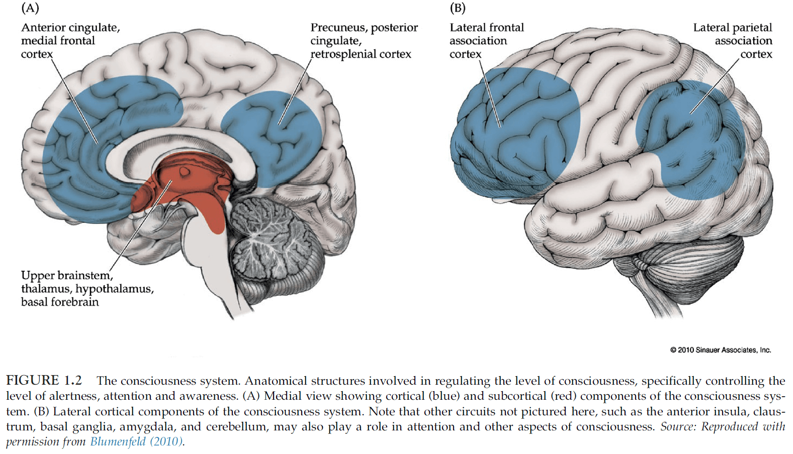
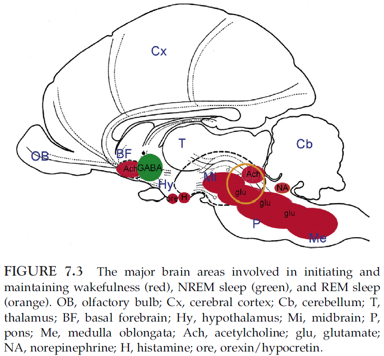
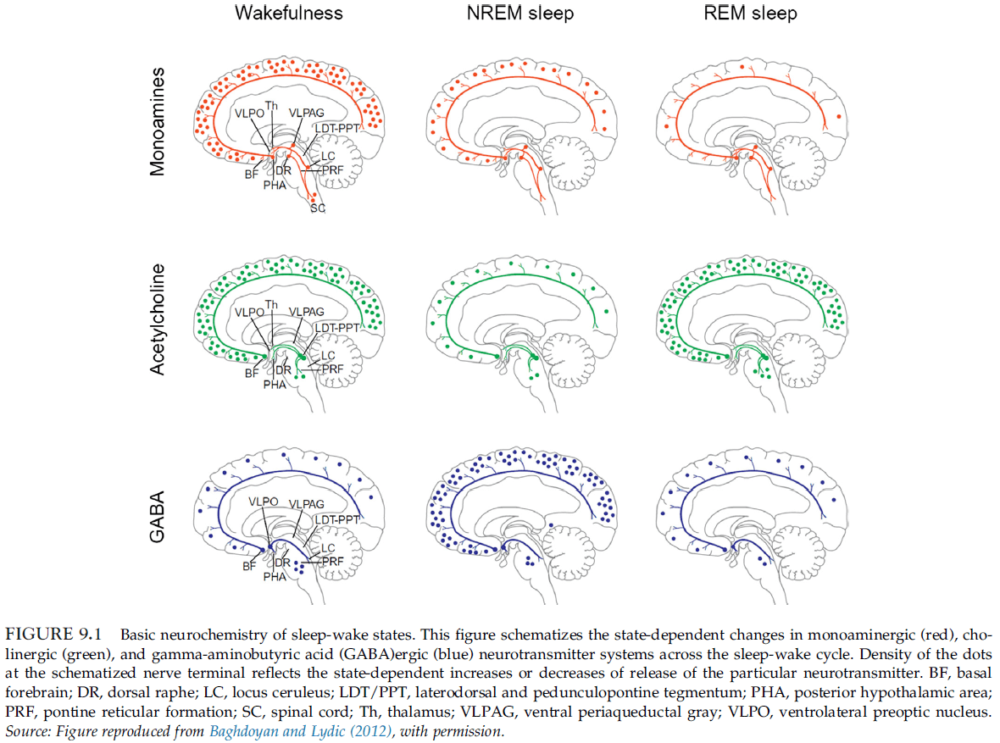
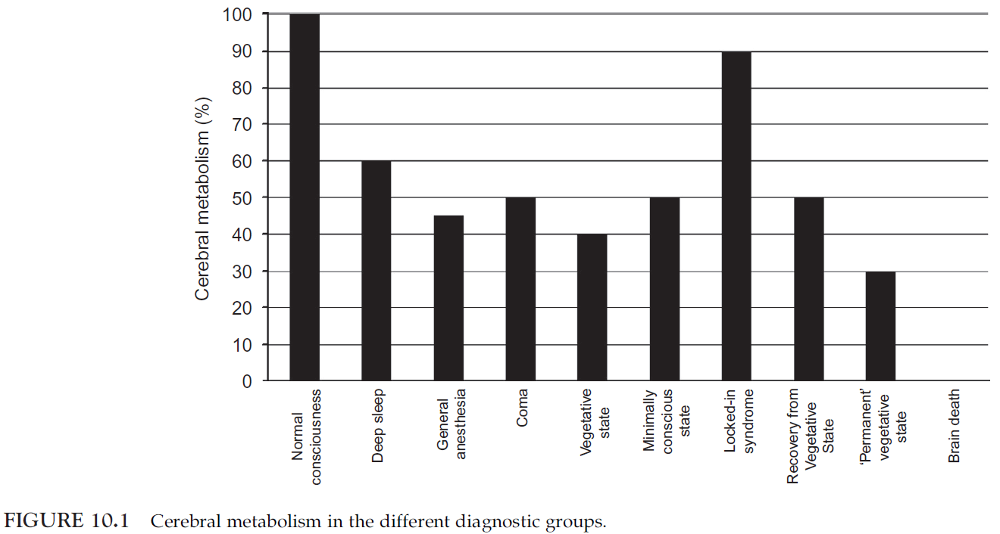
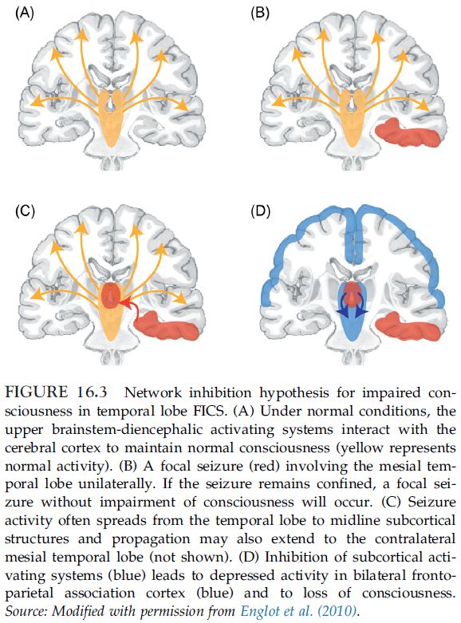
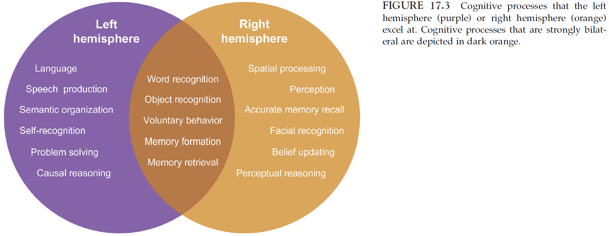
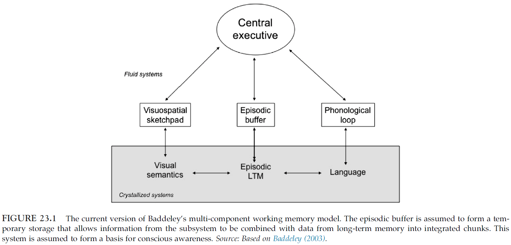
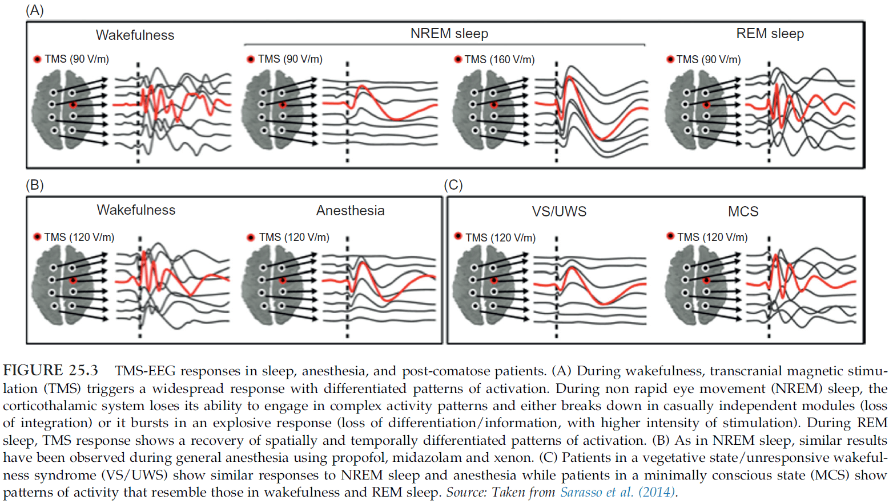

<blockquote class="blockquote">
  
The brain is the last and grandest biological frontier, the most complex thing we have yet discovered in our universe. It contains hundreds of billions of cells interlinked through trillions of connections. The brain boggles the mind.

  
James D. Watson

</blockquote>

# Part I: Basics

## Chapter 1: Neuroanatomical Basis of Consciousness

- Consciousness is classically described as emerging from brain systems that make up the content of consciousness, regulated by distinct systems that control the level of consciousness.
- The level of consciousness act on the content of consciousness.
- Content includes sensory, motor, emotional, and memory systems in the brain.
- Level is controlled by specialized cortical and subcortical systems that determine the amount of alertness, attention, and awareness (AAA).
- Alertness allows for meaningful responses, attention allows for selective/sustained information to be processed, and awareness allows the formation of experiences that can be reported later.
- *Consciousness system*: the brain networks that regulate the level of consciousness.

- The level of consciousness depends critically on both cortical and subcortical structures.
- It’s the collective activity of wide-spread areas of bilateral association cortex that determines the level of consciousness.
- We have learned a lot about the basic anatomy of consciousness by understanding which brain lesions cause coma.
- *Coma*: a state of unarousable unresponsiveness.
- Coma occurs either through
    - Bilateral damage to widespread cortical areas.
    - Lesions to a core set of structures lying in the upper brainstem and medial diencephalon.
- The normal, awake, conscious state doesn’t depend on a single projection system, but rather on the parallel action of multiple systems acting together.
- Selective attention may also be mediated by the thalamus as the particular arrangement of reticular thalamic neurons are capable of generating an inhibitory surround around a “searchlight” of focused attention.
- Skipping over the arousal systems of glutamate, acetylcholine, GABA, noradrenaline, serotonin, dopamine, histamine, orexin, and adenosine.
- The cerebral cortex is a major driver in regulating the overall level of conscious arousal.
- E.g. Unilateral cortical lesions usually don’t depress the level of consciousness but bilateral lesions of the association cortex can produce coma.
- Some argue that language is necessary for conscious thought but non-verbal thoughts can still generate conscious experiences.
- Therefore, language is best viewed as an important component of the content of consciousness.
- *Binding problem*: where and how the different aspects of perception come together to form a unified conscious experience.
- Memory plays a crucial role in the ability to report conscious experiences.

## Chapter 2: Functional Neuroimaging Techniques

- Review of positron emission tomography (PET), single photon emission tomography (SPECT), functional magnetic resonance imaging (fMRI), electroencephalography (EEG), event-related potentials (ERPs), electrocorticography (ECoG), magnetoencephalography (MEG), magnetic resonance spectroscopy (MRS), and transcranial magnetic stimulation (TMS).
- *Inverse inference problem*: the problem of inferring brain activity from external measures.
- E.g. Even if the complete electric and magnetic field around the head could be precisely measured, an infinite number of current distributions in the brain could still be constructed that would explain the measured fields.

## Chapter 3: Neuronal Oscillations, Coherence, and Consciousness

- Any theory of consciousness must explain how multiple component processes can be integrated and how large-scale interactions can emerge within and across distributed neural systems.
- This chapter considers the potential relevance of oscillatory neural signals for the emergence of consciousness.
- Changes in the strength/coupling of oscillatory signals may relate to the selection of signals for access to consciousness.
- Review of brain signal bands delta, theta, alpha, beta, and gamma.
- Functions linked to each bands
    - *Delta*: motivational processes, brain reward, and deep sleep phases.
    - *Theta*: working memory functions, emotional arousal, fear learning, and attentional sampling.
    - *Alpha*: disengagement of task-irrelevant brain areas, working memory, short-term memory.
    - *Beta*: sensorimotor processing, working memory, top-down processing.
    - *Gamma*: perceptual binding, perceptual integration, stimulus selection, attention, and consciousness.
- Typically, the observed amount of gamma is positively correlated with increased processing loads and with the level of attention.
- Couple neuronal oscillations may underlie the large-scale interactions supporting consciousness.
- A critical point is that the dynamic integration may not only help to achieve the unity of consciousness, but may also gate the awareness and hence turn subconscious information into conscious mental contents.
- According to one hypothesis, the synchronization of spatially separate neurons is a key principle of brain function since it allows the formation of functionally coherent activity patterns.
- How neural synchrony may affect consciousness
    - Oscillations may relate to the build up of conscious states and to changes in the level of consciousness.
    - Oscillations may facilitate the selection of sensory information for access to awareness and impact the contents of consciousness.
- Electrical activation of the midbrain reticular formation has been shown to induce a shift from low to high oscillation frequencies.
- It was observed that progressive loss of consciousness (due to anesthesia) was tightly linked to the emergence of a hypersynchronous cortical rhythm in the alpha range.
- Studies show that changes in the contents of consciousness (during binocular rivalry) are associated with fluctuations in neural coupling.

## Chapter 4: Neural Correlates of Visual Consciousness

- Visual stimuli that remain invisible can influence both behavior and brain activity.
- E.g. Briefly flashing words and then masking it can make observers primed to the words but also have them be unaware of the words.
- Studies show that visual stimuli presented outside awareness can still be subject to considerable processing in many areas of the visual cortex.
- Conscious recognition of visual words is associated with both enhanced activity in the ventral visual cortex and parietal cortex.
- We can use the binocular rivalry experimental paradigm to distinguish between the neural correlates of awareness and the stimulus characteristics.
- In the LGN, the suppressed eye shows a strong reduction in activity. The primary visual cortex shows a similar pattern of changes in activity.
- This shows that the suppressed image during rivalry undergoes a considerable degree of unconscious processing.
- The activity in the ventral visual stream is correlated with the contents of consciousness.
- *Hallucination*: a sensory perception experienced in the absence of an external stimulus.
- *Illusion*: a misperception of an external stimulus induced by context.
- Hallucinations can be used to dissociate the neural processing associated with visual awareness from sensory stimulation.
- Evidence confirms that changes in the content of visual awareness are correlated with content-specific modulation of visual cortex activity.
- Neural activity correlated with the contents of consciousness can be dissociated from activity correlated with unconscious sensory processing.
- E.g. Both the primary visual cortex and higher visual areas show changes in activity strongly correlated with changes in the contents of visual awareness.
- *Inattentional blindness*: when highly salient stimuli outside the immediate focus of attention goes unnoticed.
- Inattentional blindness suggests that visual awareness may depend on attention.
- In the act of imagination, there is a striking correspondence between the pattern of activation of visual cortices in response to sensory stimulation and to imagery.
- The brain appears to reuse the same neural hardware for imagining as it does for sensation.
- Experiments suggest that visual input from the retina and subcortical structures isn’t necessary for conscious visual experience.
- E.g. Direct stimulation of V1 by TMS still results in visual perception.
- Damage to frontal and parietal cortex can lead to visual extinction and visual neglect, even though processing of visual stimuli in visual cortex may continue.
- This implies that signals in frontal and parietal cortex are necessary for normal visual awareness.
- The most consistent finding is that activity in functionally specialized regions of visual cortex is necessary to experience particular contents of consciousness.
- E.g. Damage or disruption to the visual motion area V5/MT prevents the perception of motion.

## Chapter 5: The Relationship Between Consciousness and Top-Down Attention

- Is attention and consciousness distinct or are they the same?
- Evidence supports the dissociation between selective attention and consciousness.
- E.g. Events or objects can be attended to without being consciously perceived, and they can be consciously perceived without top-down attentional amplification.
- The functional role of visual attention is to deal with the problem of informational overload.
- The eye outputs a massive amount of data and one way to deal with this overflow of data is to select a small fraction and process this reduced input.
- In this view, attention selects information of current relevance to the organism, while non-attended data suffers from neglect.
- Attentional selection is implemented in at least three ways
    - Increasing the baseline neuronal activity.
    - Amplifying the neuronal response to a selected location, feature, and object.
    - Suppressing the neuronal response to features, objects, or events that aren’t selected.
- For the relationship between consciousness and attention, the second aspect, attentional amplification, is most relevant.
- Review of top-down and bottom-up attention.
- *Phenomenal consciousness*: what it’s like to have any specific experience.
- *Access consciousness*: any experience that can be reported or remembered.
- Attention without consciousness
    - Priming is one example of a phenomenon that can affects attention without conscious awareness.
    - Another example is the continuous flash suppression (CFS) effect.
    - In CFS, an image is presented to one eye, which is rendered invisible for seconds/minutes by flashing randomly generated, edge-rich stimulus to the other eye.
    - A more common example is searching for an object in a scene, such as keys in a messy room.
    - Attention is paid to an invisible objects and its associated features without bringing those features into conscious experience.
- Consciousness without attention
    - Gist perception is an example of conscious perception without attending to the gist of an image.
- *Attentional blink*: within a rapidly flashed stream of stimuli, the observer will often fail to see the stimuli right after the target.
- Impaired task performance due to attention occurs in everyday life as well.
- E.g. If you try to focus on your fingers hitting the keyboard while touch typing, it’s more difficult to type than if you just let your typing be automatic. Experts also have reduced performance if they focus on their action without letting it become automatic.
- Selective attention modulates V1 activity more so than stimulus visibility during binocular rivalry and CFS.
- Many of the neuronal correlates of consciousness that have been reported are probably confounded by the neuronal correlates of attention.

# Part II: Waking, Sleep, and Anesthesia

## Chapter 6: Intrinsic Brain Activity and Consciousness

- When the mind is at rest and doing nothing, spontaneous cognition tends to gravitate toward thoughts and feelings.
- Review of the default mode network (DMN).
- Two critical observations
    - During task performance, there is an excess in oxygen availability compared to oxygen consumed in certain brain regions.
    - During rest, blood flow and oxygen consumption are closely matched.
- Review of anticorrelation between external and internal awareness.
- When people are at rest, it’s hypothesized that they’re spontaneously engaged in self-reflection because the same brain regions are activated with tasks that demand self-reflection.
- The overlap in brain regions between areas engaged in reflection about oneself and reflection about other people raises the possibility that thinking about other minds involves a sort of simulation of the same processes that are engaged in thinking about oneself.

## Chapter 7: Sleep and Dreaming

- Sleep brings about the most common and most dramatic change in consciousness that normal people can experience.
- Sleep stages and cycles
    - Wakefulness
        - EEG is characterized by waves of low amplitude and high frequency.
        - Sleep is categorized into non-rapid eye movement (NREM) sleep and REM sleep.
        - NREM is divided into three stages: N1, N2, and N3.
    - Stage N1
        - Falling asleep is a gradual phenomenon of progressive disconnection from the environment.
        - Eye movement slows, muscle tone relaxes, and there may be occasional jerks followed by a sense of falling.
    - Stage N2
        - After a few minutes in N1, people progress to N2 sleep.
        - *Sleep spindles*: waxing and waning oscillations at around 12-15 Hz that last about 1 s and occur 5-10 times a minute.
        - This stage qualifies as sleep because people are partially disconnected from the environment, meaning their arousal threshold is increased.
    - Stage N3
        - Eye movements cease.
        - Also known as deep sleep as the arousal threshold is higher than in stage N2.
        - Process of awakening from this stage is drawn out and subjects often remain confused for some time.
    - REM
        - Also called paradoxical sleep because the EEG activity during REM sleep is similar to the activated EEG of waking or stage N1.
- *Sleep cycle*: the succession of NREM sleep stages followed by an episode of REM sleep.
- Sleep cycles last around 90-110 mins in humans.
- There are a total of 4-5 sleep cycles per night.
- The proportion of time spent in each stage and the pattern of stages across the night is fairly consistent in normal adults.
- 5% in N1, 50% in N2, 20-25% in N3, and 20-25% in REM.
- Sleep patterns change markedly across the lifespan.
- From early childhood into adulthood, total sleep time decreases and the REM-sleep proportion drops to adult levels.
- Wakefulness depends on the upper pons (pedunculopontine tegmental (PPT) and lateral dorsal tegmental (LDT)), midbrain (reticular activation system (RAS)), posterior hypothalamus, and basal forebrain.

- The following brain structures are involved in the initiation and maintenance of sleep
    - Anterior hypothalamus
    - Basal forebrain
- These neurons tend to fire during sleep and stop firing during wakefulness.
- When they’re active, many of them release GABA to inhibit most waking-promoting areas.
- In turn, most wake-promoting areas inhibit several sleep-promoting neuronal groups during wakefulness.
- This reciprocal inhibition provides state stability as each state reinforces itself and inhibits the opponent state.
- REM sleep depends on pontine cholinergic cell groups (LDT and PPT) that are part of the wakefulness system and nearby cell groups in the medial pontine reticular formation and medulla.
- Lesions in these areas eliminate REM sleep without disrupting NREM sleep.
- Metabolic activity is mostly due to the energetic requirements of synaptic transmission.
- After waking up, it can take up to 20 mins for blood flow to be fully reestablished in brain areas, such as the dorsolateral prefrontal cortex.
- *Sleep inertia*: a post-awakening deficit in alertness and performance that can last for tens of minutes.
- It’s likely that the sluggish reactivation of brain areas is responsible for sleep inertia.
- The most striking behavioral consequence of falling asleep is a progressive disconnection from the environment.
- This is due to the hyperpolarization of thalamocortical neurons so that sensory stimuli that normally would be relayed to the cortex fails to do so.
- In contrast to coma or vegetative state, a sleeping person can always be awakened if the stimuli are strong enough or meaningful.
- E.g. The sound of one’s name or the wailing of a baby are among the most effective signals for awakening.
- Two lessons from the consciousness in sleep
    - During certain phases of sleep, the level of consciousness can decrease and vanish, despite stable activity in the thalamocortical system.
    - During other phases of sleep, vivid conscious experience is possible, despite sensory and motor disconnections from the environment.
- Interestingly, if subjects were awakened during REM sleep, 80% of subjects report having dreams.
- Awakening from NREM sleep yield dreams 20% or less of the time.
- It’s now clear that reports indicative of conscious experience, including dream-like experiences, can be elicited during any stage of sleep.
- E.g. By changing the question from “Did you have a dream?” to “Tell me anything that was going through your mind just before you woke up”, the percentage of recalls from NREM sleep reaches 60%.
- *Dreams*: consciousness in the absence of sensory inputs and self-reflection.
- All sensory experiences in dreams are generated internally; they’re hallucinations.
- During dreaming, there’s reduced voluntary controls and lack of reflective thought.
- When dreaming, one can’t stop and reflect rationally on what one should be doing, nor imagine other scenarios.
- This is consistent with neuroimaging findings that the dorsolateral prefrontal cortex is deactivated during REM sleep.
- Memory is drastically impaired both within the dream and for memorizing the dream.
- It isn’t clear why the dreaming brain is so profoundly amnestic aka why dreams are so easily forgotten.
- Analysis of patients with brain lesions indicates that the ability to dream depends on specific forebrain regions rather than on the brainstem REM sleep generator.
- E.g. Damage to the parieto-temporo-occipital junction, which is important for mental imagery and spatial cognition, prevents dreaming.
- The ability to dream seems to go hand-in-hand with the ability to imagine and with visuospatial skills.
- Many patients with brainstem lesions are able to dream.
- When do children start dreaming and what kind of dreams do they have?
    - Children under the age of 7 rarely have dreams and the dreams they do have are often static and plain.
    - Around age 7, dream reports become longer and more frequent, and the child’s self becomes a participant in the dream.
    - Dream recall frequency was best correlated with the ability to produce waking mental images, and not with language ability.
    - Blind adults have visual imagination and dream only if they lose their sight after age 7.
    - Data suggests that dreaming is a gradual cognitive development that is tightly linked to the development of visual imagination.
- *Dissociated states*: states that lie between waking and sleep; the place between asleep and awake.
- *Daydreaming*: a dream-like musing or fantasy while awake, especially for the fulfillment of wishes or hopes.
- Daydreaming is extremely common.
- *Lucid dreaming*: dreaming with conscious control.
- Evidence suggests that brain areas that are relatively deactivated during REM sleep, such as the primary visual areas, the precuneus, and the dorsolateral prefrontal cortex, become activated during lucid dreaming.
- Lucid dreaming may represent a dissociation between wakefulness and REM sleep.
- *Sleepwalking (SW)*: various complex motor behaviors, such as walking, during deep NREM sleep.
- Sleepwalking appears as a dissociated state where some brain areas are awake while others are asleep.
- Sleep talking occurs more frequently than sleepwalking, and it can occur in both NREM and REM sleep.
- *REM sleep behavior disorder*: vigorous, often violent, episodes of dream enactment with punching, kicking, and leaping.
- Researchers observed that if certain regions of the pons that are normally responsible for inhibiting muscle tone and motor programs are lesioned, cats seem to enact their dreams.
- *Narcolepsy*: daytime sleepiness (sleep attacks).
- When narcoleptics fall asleep, they usually go straight into REM sleep, skipping all stages of NREM.

## Chapter 8: Sleepwalking: Dissociation Between “Body Sleep” and “Mind Sleep”

- The frequency of SW is age-dependent.
- The peak frequency, about 10-15%, is seen in children around the ages of 8-12 years old.
- SW is rare in adults, occurring in 2-4%.
- During SW, the eyes are open and staring and the person is difficult to awaken.
- SW arises from genetic, developmental, somatic, and psychological factors.
- The fundamental cause of state dissociation in SW remains unknown.
- Skipped this chapter due to disinterest in sleepwalking.

## Chapter 9: Consciousness and Anesthesia

- General anesthetics is in a unique position to study consciousness because it always suppresses consciousness in a reversible manner.
- In about 1-2 of 1000 people, they’re able to remember surgical events under anesthesia.

- Skipped the part on how anesthesia affects certain brain structures.
- Functional organization is preserved during general anesthesia.
- Four current and major neuroscientific theories of conscious experience
    - Global neuronal workspace theory (GNW)
    - Re-entrant processing theory
    - Predictive coding theory
    - Integrated information theory (IIT)
- GNW Theory
    - Premise is that information processed in various isolated and unconscious cognitive modules becomes broadcast into a mental workspace that allows other cognitive systems to access.
    - Competing representations are suppressed.
    - GNW theory might be argued as a theory of access consciousness and not phenomenal consciousness.
- Re-entrant processing theory
    - Also called recurrent, reverberant, reafferent, or feedback processing.
    - Activity in V1 isn’t correlated with conscious experience.
    - For conscious experience to occur, there appears to be a requirement for feedback signaling from higher-order areas back to primary areas.
- Predictive coding theory
    - Rather than information coming into the brain to generate consciousness, the brain reaches out with a prior model of perceptual reality.
    - Sensory information isn’t used to generate consciousness, but rather to detect errors or gaps between the model generated and what is sensed in the environment.
    - The prediction error needs to be coded for in order to adjust the model, allowing for minimization of energy.
    - Is a Bayesian perspective of brain function, where priors are updated and revised according to new information.
    - Events that remain stable and consistent don’t require much conscious attention, while error in prediction account for much of conscious content.
- Integrated information theory
    - Two essential features of conscious experience are differentiation and integration.
    - For the brain to be conscious, it must have functional differentiation with the capacity to integrate the output of specialized modules to generate information beyond the sum of its parts.
    - The thalamocortical system is thought to be a prime candidate for the substrate of consciousness.
    - In contrast, the cerebellum doesn’t cross the critical threshold of functional segregation/integration and therefore is less relevant to consciousness.
    - For IIT, integration information is consciousness.
    - Information is generated by the system, for the system.
- Any proposed neural correlate or cause of consciousness should either be eliminated or modulated during the state of anesthetic-induced unconsciousness.
- E.g. General anesthetics don’t seem to impair primary sensory networks, supporting the idea that they aren’t sufficient for consciousness. However, top-down connectivity from the frontal cortex is impaired during anesthesia.

# Part III: Severe Brain Injury and Related Conditions

## Chapter 10: The Assessment of Conscious Awareness in the Vegetative State

- This chapter discusses
    - The major characteristics of vegetative state.
    - The contribution of neuroimaging studies to the assessment of conscious awareness in the vegetative state.
    - The major methodological impediments to conducting studies in disorders of consciousness.
- Patients in the vegetative state are awake but are unaware of self and environment.
- In the vegetative state, the brainstem is relatively spared but the gray/white matter of both cerebral hemispheres is widely and severely injured.
- Overall cortical metabolism of vegetative patients is 40-50% of normal.
- This is due to the progressive Wallerian and trans-synaptic neuronal degeneration.

- Many types of stimuli will elicit relatively automatic responses from the brain.
- E.g. You can’t choose to not recognize a face or to not understand speech in your native language.
- The only reliable method that we have for determining if another being is consciously aware is to ask them.
- Our ability to know unequivocally that another being is conscious is determined not by whether they’re aware or not, but by their ability to communicate that fact through a recognized behavioral response.
- What if the ability to communicate is lost but conscious awareness remains?
- A new approach is to measure the fMRI of the vegetative patient as the medium to communicate, since the patient can’t communicate through any other means.
- Active fMRI studies require participants to respond by willfully modulating their own neural activity.
- E.g. When the patient imagines hitting a tennis ball, the act was associated with robust activity in the supplementary motor area.
- E.g. When they imagines moving from room to room in a house, there was activity in the parahippocampal cortices, the posterior parietal lobe, and the lateral premotor cortices.
- Activity in these regions can be used as a neural proxy for behavior.
- fMRI responses of this sort can be used to measure awareness because awareness is necessary for them to occur.
- E.g. In a woman diagnosed with vegetative state, she was able to perform the tennis and house tasks, and her brain activity was indistinguishable from normal people that perform the same task. It was concluded that, despite fulfilling all of the clinical criteria for vegetative state, the patient remained conscious.
- The activity was also sustained for the full 30 s, countering the argument that the activity was due to automatic processing.
- Our best explanation is that patients who display sustained and reproducible brain activation during visual mental imagery tasks are consciously aware and following instructions, even in the complete or partial absence of behavioral responsiveness.
- This method, of measuring brain activity for imagined scenarios, can be used to communicate with patients and have them answer “yes/no” questions.

## Chapter 11: Minimally Conscious State

- Vegetative state (VS) can be distinguished from coma by observing for spontaneous or elicited eye-opening, which occurs in VS but not in coma.
- *Minimally conscious state (MCS)*: a condition of severely altered consciousness in which minimal but definite behavioral evidence of self or environment awareness is demonstrated on clinical examination.
- Goals of this chapter
    - Provide a broad overview of the clinical and pathophysiologic features of MCS.
    - Consider the therapeutic implications of these characteristics.
    - Identify key issues in clinical practice and to suggest future directions for research.
- MCS is diagnosed when there’s clear evidence of one or more of the following
    - Simple command following
    - Yes/no responses
    - Intelligible verbalization
    - Movements or affective behaviors that occur to stimuli and not due to reflex
- Resolution of MCS is signaled by the return of one or more of the following
    - Reliable and consistent interactive communication.
    - Functional object use.
- Skimmed most of this chapter due to disinterest in the clinical side of MCS and consciousness.

## Chapter 12: Consciousness in the Locked-In Syndrome

- *Locked-in syndrome (LIS)*: when consciousness remains intact but the patient can’t move except their eyes.
- The patient is locked inside their body, able to perceive their environment but extremely limited in interacting with it voluntarily.
- LIS is most frequently caused by bilateral ventral pontine lesion.
- Another description of LIS is “a corpse with living eyes.”
- Long-term survival in LIS is rare with the median survival time of 42 days and 87% of deaths occurring in the first four months.
- Despite the limited motor and verbal recovery of LIS patients, nearly 70% of the LIS patients can return to living at home.
- Review of BCI devices that allow LIS patients to communicate.
- E.g. Using pupil size, eye tracking, electrical brain activity, or jaw movement to communicate “yes/no” or alphabet letters.
- Most of the patients in LIS have a good quality of life and most, around 75%, wish to continue living.
- LIS patients should have the right to die and the right to live.

## Chapter 13: Consciousness and Dementia: How the Brain Loses Its Self

- *Alzheimer’s disease*: a progressive, multivariate, and irreversible deterioration in cognitive ability.
- Disturbances of attention and memory are typically the first symptoms of Alzheimer’s.
- Studies have consistently found that
    - Cerebral glucose metabolism is impaired in Alzheimer’s disease.
    - Metabolic abnormalities worsen with progression of dementia.
    - Cerebral metabolic alterations are heterogeneous.
    - Patterns of cerebral metabolic alteration are related to patterns of cognitive impairment.
    - Distinct cognitive and cerebral metabolic features characterize clinical subtypes of Alzheimer’s disease.
    - Regional functional connectivity is altered in Alzheimer’s disease.
- Patient often state that “this disease is worse than cancer, because it destroys the self.”
- Patients become more and more unaware of the world and of themselves, until they eventually slide into a meaningless present with a fading past and no future.
- In degenerative diseases, the patients progressively lose not only their cognitive/behavioral abilities, but also the awareness of the functioning of these abilities.
- *Anosognosia*: lack of awareness for a disease.
- Impaired self-evaluation was related to reduced cerebral glucose metabolism in the
    - Right parahippocampal cortex
    - Orbitofrontal cortex
- Anosognosia in Alzheimer’s disease is associated with dysfunction in frontal and temporoparietal associative structures that serve perspective-taking on self and others.
- Review of Lewy Body Disease and delusional misidentification syndromes (Capgras).
- Studies are consistent and extend the observation of a disconnection between anterior and posterior cortical regions in the brain of patients with Alzheimer’s disease.

## Chapter 14: Brain–Computer Interface Based Solutions for End-Users with Severe Communication Disorders

- *Brain-computer interfaces (BCI)*: devices that allow for direct communication with the brain.
- BCI has been used to replace or restore lost functions, enhance behavior above natural limits, and supplement current functions.
- *Severe communication disorder (SCD)*: patients that have severe impairments in their ability to communicate.
- E.g. No control over limb movement.
- Some BCIs, require learning to modulate a specific component of the EEG.
- Feedback is provided to patients to aid in this learning.
- Relevant EEG features, such as slow cortical potentials (SCP) or sensorimotor rhythms (SMR), are extracted and can then be fed back to the user by the closed-loop BCI.
- To learn control of the SCP amplitude, subjects usually have to move a cursor displayed on a screen to a target.
- Movement in two directions is captured by negative and positive SCP amplitude shifts.
- Operant learning of SMR control is achieved through activation and deactivation of the central motor loops.
- E.g. Imagine the movement of fingers or feet.
- *Event Related Potential (ERP)*: electrocortical potentials that can be measured in EEG before, during, or after a sensory, motor, or psychological event.
- Skipped the ERP-BCI section.
- Almost all approaches to BCI rely on vision.
- Skipped the rest of the chapter on non-visual BCI, improving impaired function, and practical BCI for SCD.

## Chapter 15: Neuroethics and Disorders of Consciousness: A Pragmatic Approach to Neuropalliative Care

- Research on human consciousness goes to the heart of our humanity and asks us to grapple with fundamental questions about the self.
- *Clinical pragmatism*: a method of moral problem solving.
- Steps of clinical pragmatism
    1. Recognition of the problem.
    2. Data collection of medical, narrative, and context information.
    3. Interpretation of the data (ethics differential diagnosis).
    4. Negotiation.
    5. Intervention.
    6. Periodic review.
- In a clinical context, patients who’ve sustained severe brain damage are beyond hope of any remediation.
- Surveys of neurologists’ knowledge of diagnostic categories related to DOC are full of errors that would be intolerable elsewhere.
- Skipping this chapter due to disinterest in neuroethics and medical care of patients with DOC.

# Part IV: Seizures, Splits, Neglects, and Assorted Disorders

## Chapter 16: Epilepsy and Consciousness

- In epilepsy, consciousness is suddenly and involuntarily taken away.
- Recent work suggests that epilepsy, like other DOC, disrupts a core network of anatomical structures critical for the maintenance of normal consciousness, referred to as the consciousness system.
- Since epileptic seizures causes deficits in consciousness, the study of seizures provides an opportunity to functionally localize specific aspects of consciousness in the brain.
- Epileptic seizures are usually classified as either focal, generalized, or absence.
- Interestingly, impaired consciousness can be seen in all three types.
- The consciousness system is directly involved in controlling the level of consciousness, including alertness, attention, and awareness.
- The consciousness system includes
    - Frontal and parietal association cortex
    - Cingulate gyrus
    - Precuneus
    - Thalamus
    - Multiple activating systems in the basal forebrain, hypothalamus, midbrain, and upper pons
- Recent studies show that all three types of seizures cause abnormal increases in activity in the upper brainstem and medial thalamus.
- In absence seizures, awareness briefly vanishes and patients appear as if someone has pushed the “pause button” on their stream of consciousness.
- In focal seizures, impaired consciousness can persist for up to several minutes after the seizure has ended.
- *Network inhibition hypothesis*: impaired consciousness occurs due to spread of temporal lobe seizures to midline subcortical structures.
- E.g. Regions rich in GABAergic neurons such as the lateral septal nuclei and anterior hypothalamus may inhibit subcortical arousal structures, causing bilateral cortical suppression and impaired consciousness.

- Findings suggest that focal seizure activity in the temporal lobe may put the cortex into a sleep-like state, resulting in a loss of consciousness.
- Support for the network inhibition hypothesis
    - fMRI during seizures shows an increase in subcortical inhibitory regions along with a decrease in arousal regions.
    - Cutting the fornix prevents propagation of seizure activity into subcortical inhibitory structures.
    - Stimulation of the lateral septum can mimic the effect of seizures by inducing cortical slow waves, behavioral arrest, and decreased cortical cholinergic neurotransmission.
    - Focal limbic seizures cause decreased firing of cholinergic neurons in the brainstem.
    - Focal limbic seizures cause decreased cholinergic neurotransmission in the intralaminar thalamus.
    - Optogenetic stimulation of cholinergic brainstem pedunculopontine tegmental nucleus neurons during seizures abolishes cortical slow wave activity.
    - Electrical stimulation of the thalamic intralaminar nuclei post seizure abolishes slow wave activity and increases normal arousal and behavioral responsiveness.
- All seizure types converge on the same anatomical regions when consciousness is impaired.
- Regions of the consciousness system such as
    - Thalamus
    - Basal forebrain and upper brainstem
    - Interhemispheric regions (medial frontal cortex, cingulate, precuneus)
    - Lateral frontal and parietal association cortex

## Chapter 17: Split-Brain, Split-Mind

- Research shows that splitting the corpus callosum (callosotomy) splits the conscious mind as well.
- Extensive experimentation has shown that both hemispheres of a split-brain patient are conscious.
- However, each hemisphere can’t access the thoughts, intentions, or conscious experience of the opposite hemisphere, much as we can’t access the mental states of others.
- This supports the idea that consciousness is an emergent property that arises out of the dynamic interaction of many specialized cognitive systems/modules.
- The brain consists of hundreds of localized, competing circuits that bubble up into conscious awareness and the content of consciousness is determined by what cognitive system is most active.
- Besides initial difficulties with language and movement, split-brain patients didn’t show any obvious psychological or behavioral abnormalities.
- It wasn’t until lateralized testing procedures were implemented that the psychological side effects of callosotomy were detected.
- E.g. Showing a stimulus to the left half of the visual field and asking patients to respond with their left hand. This only requires the right hemisphere to respond.
- Lateralized testing on split-brain patients allows one hemisphere to be tested in isolation.
- The most notable difference between the two hemispheres is their capacity for language.
- The left hemisphere surpasses the right for language skills.
- In addition, the left hemisphere retains normal problem-solving skills and reasoning abilities after a callosotomy.
- The right hemisphere, on the other hand, outperforms the left in perception, spatial processing, facial recognition, and recognition memory.

- Most importantly, the right hemisphere satisfies the defining attributes of consciousness, which include possessing a sense of self and initiating purposeful behavior.
- Although each hemisphere is conscious, the conscious experiences of the hemispheres differ substantially because they contains unique sets of specialized cognitive modules.
- Some modules are completely lateralized to one hemisphere, while other modules are present in both hemispheres but exhibit different processing characteristics.
- The most remarkable and perplexing finding from split-brain research is that, despite having a divided consciousness, these patients feel unified.
- E.g. Walking is coordinated, bilateral skills are performable, and they act as normal people.
- Split-brain patients don’t exhibit distress or internal conflict, nor do they report any subjective feelings associated with dual consciousness such as bipolar personality disorder.
- Why do split-brain patients feel united?
- One possible answer is that the consciousness of the hemispheres isn’t completely split.
- The consciousness of split-brain patients may be Y-shaped; consciousness may be divided at the hemispheric level but not at the subcortical level.
- Similar inputs to the two hemispheres may also help unify their conscious experiences by invoking similar cognitive processes.
- E.g. The same facial sensation, audition, pain, temperature, pressure, etc.
- Both hemispheres can also communicate with each other by external cueing.
- E.g. Hand gestures or language.
- All of this may compensate for the lack of interhemispheric communication and may serve to lessen the division between the conscious experiences of the two disconnected hemispheres.
- Another possible answer is that split-brain patients don’t feel conflicted because the left hemisphere is dominant in cognition.
- A final answer may be that the left-brain interpreter may preserve the subjective unity of split-brain patients.
- *Left-brain interpreter*: a cognitive system that makes sense of all the information bombarding the brain.
- The interpreter is the glue that keeps our story unified and creates our sense of being into a coherent, rational agent.
- The left interpreter will make up explanations for the right hemisphere’s actions.
- E.g. If the right hemisphere is told to stand, then the speaking left hemisphere explained the behavior by stated that the subject was thirsty and wanted to get a drink.
- The left interpreter extinguishes conflict and uncertainty and, by doing so, maintains the feeling of unity and willful control.
- Split-brain patients lessons
    - An intact corpus callosum and interhemispheric communication aren’t essential for consciousness.
    - Although consciousness persists after hemispheric disconnection, the conscious experience of split-brain patients differs from healthy individuals.
- Patients may remain conscious because the connections between the cortex and thalamus in each hemisphere remain intact.

## Chapter 18: Visual Consciousness: A “Re-Updated” Neurological Tour

- The border cases provided by clinical neurology have the power to illustrate properties of consciousness by showing the consequences of its impairment.
- *Reportability criteria*: the ability to report to oneself or someone else the object of our perception.
- E.g. I see a dog on the street.
- Some people contest the criteria of reportability by saying phenomenal consciousness and access consciousness are different and that we are phenomenally conscious of much more information than we can access and report.
- The problem with this distinction is how we can infer that people are phenomenally consciousness of more information than they can report.
- The problem with this definition of phenomenality is the need to rely on conscious reports to establish it: a circular argument.
- Conscious reporting isn’t a copy of a visual scene, but rather a conscious comment on an inner mental representation.
- E.g. Illusions and hallucinations can be reported but don’t reflect reality.
- Two fundamental stages in the search for the neural correlates of visual consciousness
    1. Make a detailed inventory of the representations of the visual world.
    2. Identify among these different forms of visual coding which forms participate in visual phenomenal consciousness.
- Crick and Koch (1995) argue that neural activity in area V1 doesn’t contribute to the content of our phenomenal consciousness.
- Review of blindsight, patient D.F. with putting the card into the slot experiment.
- Patient D.F.’s case suggests that some representations in the dorsal visual stream are operating unconsciously while the ventral visual stream subserves our phenomenal visual consciousness.
- Further evidence suggests that we have two separate visual systems, one for rapid and accurate guidance of movements but lies outside the realm of conscious visual awareness, while the other provides our perceptual phenomenology.
- The distinction between dorsal (unconscious) and ventral (conscious) visual streams.
- However, are we conscious of all visual information represented in the ventral pathway?
- A key answer to this question comes from patients with unilateral spatial neglect.
- *Unilateral spatial neglect (USN)*: the inability to perceive or respond to stimuli presented to the side contralateral to the site of lesion.
- Results show that the ventral stream is necessary but isn’t sufficient to consciously perceive visual stimuli.
- An additional mechanism, defect in USN patients and needed for conscious perception, seems to be the top-down attentional amplification supplied by the spatial attention network.
- Review of evidence separating consciousness and attention.
- The case of Capgras delusion, as well as other conditions, shows that perceptual representations seem to incorporate interpretative processes or fictions.
- Fictions aren’t necessarily false, but are a belief and not a pure description of reality.
- Our conscious perception incorporates a process of fictionalization.
- Four general principles of visual consciousness
    1. A large number of processes in the visual system never participate in conscious visual representations.
    2. A visual representation is reportable only if coded by the visual ventral stream.
    3. This anatomical constraint is necessary but not sufficient. Top-down attentional amplification seems to be the additional and necessary condition for a visual representation to reach consciousness.
    4. Only conscious representations can be used as sources of strategic top-down attention, while some unconscious representations are highly sensitive to the effect of such attention.
- These principles help us better distinguish between two categories of non-conscious processing
    - Those which never contributed to conscious content.
    - Those which can potentially contribute to it.

## Chapter 19: Self-Awareness Disorders in Conversion Hysteria

- There are patients who experience physical or intellectual disorders without any evidence for an underlying illness.
- *Conversion hysteria*: a disorder characterized by a pseudo-neurological deficit, such as paralysis or anesthesia, that isn’t explained by lesions and may arise due to psychological stress or conflict.
- Skipped this chapter due to disinterest in conversion hysteria and the lack of discussion on consciousness.

## Chapter 20: Leaving Body and Life Behind: Out-of-Body and Near-Death Experience

- *Out-of-body experiences (OBEs)*: when a person feels that their self or center of experience is located outside of their physical body.
- Three elements of OBEs
    - The feeling of being outside one’s physical body.
    - The perceived location of the self at a distance and elevated visuo-spatial perspective.
    - The experience of seeing one’s own body from this elevated perspective.
- OBEs have been mostly observed in patients with epilepsy.
- OBEs are associated with specific vestibular sensations such as with a strong otolithic vestibular disturbance.
- In one patient, an OBE was induced by electrical stimulation of the right temporo-parietal junction (TPJ).
- It seems that OBEs depend on the subject’s position prior or during the experience.
- Results suggest that the TPJ and an associated larger network are crucial structures for OBEs and for the conscious experience of the self, characterized by spatial unity of self and body.
- *Near-death experiences (NDEs)*: any conscious experience which takes place during an event in which a person could die or be killed but nonetheless survives.
- Skipped the section on NDEs.

## Chapter 21: The Hippocampus, Memory, and Consciousness

- Review of patient H.M.
- The hallmark of anterograde amnesia is the inability to learn new information, despite relatively intact abilities to retrieve premorbid memories.
- Interestingly, one patient with impaired memory displayed a normal full-scale IQ.
- An important distinction is between long-term memory (LTM) and short-term memory (STM).
- LTE is memory for information that hasn’t been in conscious awareness for the last several tens of seconds, whereas STM refers to the temporary retention of a limited amount of information.
- We might infer that many aspects of consciousness are largely unaffected by anterograde amnesia.
- Patients with anterograde amnesia typically have damage to
    - Hippocampal complex
    - Adjacent structures of the MTL
    - Fornix
- Amnesic syndrome is best characterized not as a disorder of encoding, but rather as one of storage or retrieval.
- There’s a separation between retrieval with subjective experience (autonoetic) and retrieval without subjective experience (noetic).
- There have been no cases of anterograde amnesia followed by the absence of any retrograde memory impairment.
- Instead, irreversible damage to the MTL invariably produces some retrograde memory loss.
- The concept of consolidation captures the idea that the MTL must continue to play a role in memory processing after the initial encoding of information.
- Is the retrieval process for recollection and familiarity a single process or separate processes?
- This question is currently being debated by the neuroscience community but evidence suggests that the two processes are separate.
- For anterograde amnesia patients, each waking moment feels as though they just woke up from sleep.
- There’s a fundamental role for the hippocampus in determining the width of the stream of consciousness.
- E.g. Without a hippocampus, the width of consciousness becomes minutes, instead of days, months, and years.

## Chapter 22: Syndromes of Transient Amnesia

- *Transient global amnesia (TGA)*: an abrupt onset of transient anterograde amnesia, together with a variable degree of retrograde amnesia.
- Although a small amount of information can be retained for a few seconds, it’s rapidly lost when the patient’s attention shifts.
- Careful examination reveals no impairment of conscious level or of other cognitive functions.
- Symptoms of TGA usually resolve gradually over 4-10 hours, with recovery of retrograde amnesia occurring more rapidly than anterograde memory.
- Following recovery from TGA, patients are left with complete amnesia for events that occurred during the attack.
- In about 70% of patients with TGA, a small hippocampal lesion was detected.
- *Transient epileptic amnesia (TEA)*: a condition similar to TGA but induced by epileptic seizures.
- Whereas TGA is often a once-in-a-lifetime event, patients with TEA experience recurrent attacks of memory loss.
- Cases of transient amnesia border between psychiatry and neurology, highlighting the artificial and misleading distinction between the two disciplines.
- *Psychogenic amnesia*: memory loss due to a psychological, and not biological, event.
- In psychogenic amnesia, knowledge of personal identity is often impaired and this isn’t a feature of normal amnesia.
- The level of consciousness is unaffected by transient amnesia.
- The self of consciousness is affected in various ways by transient amnesia, with various amnesias having a temporary or permanent loss of access to remote memories.
- How complex must behavior be to provide clear evidence for awareness?
- In general, we tend to regard behavior that’s clearly purposeful and that demonstrates choosing as evidence for awareness.

## Chapter 23: Consciousness and Aphasia

- This chapter explores the issue of mental representation available to aphasic patients by using Baddeley’s model of working memory.
- Baddeley’s model of working memory
    - Four components
        - Attentional control system (central executive)
        - Phonological loop
        - Visuospatial sketchpad
        - Episodic buffer

- *Inner speech*: the subjective phenomenon of talking to oneself, of developing an image of speech without sound.
- Inner speech has been consistently shown to depend on the left inferior frontal gyrus (LIFG) as it’s active when participants are asked to silently articulate sentences.
- *Anarthria*: a total inability to articulate speech in the absence of any deficit both of auditory comprehension and of written language.
- In patients with anarthria, performance on tasks involving inner speech shows that they aren’t mute, as their inability on overt speech (speaking out loud) is associated with more subtle impairment of covert speech.
- It appears that inner speech is dependent on brain mechanisms involved in overt speech.
- *Aphasia*: a general term for language disorders.
- Aphasic patients show that there’s a dissociation between inner and overt speech as some patients complain that the words they say don’t match the words in their head.
- These results suggest that inner speech can be dissociated from overt speech, and that inner speech isn’t just overt speech without a motor component.
- It isn’t known why some aphasic patients are able to know and detect errors in their own speech, while other patients are unaware of their deficit (anosognosia).

## Chapter 24: Blindness and Consciousness: New Light from the Dark

- Sight/vision is regarded as our most important sense for humans to interact with the environment.
- E.g. Almost a third of the whole cortex is devoted to visual processing.
- This chapters deals with blind people
    - How do individuals with congenital blindness form a conscious representation of the world?
    - How do their brains behave?
    - What happens to the visual areas of the brain in people who are born blind or who become blind?
- When a sensory area becomes deprived of input, other modalities invade the cortical area devoted to the deprived sense.
- E.g. In deaf cats, the primary auditory cortex is driven by visual stimuli. The visual cortex is said to have invaded the auditory cortex.
- If brain damage occurs during development, abnormal neuronal connectivity patterns can be produced.
- At the behavioral level, rewired hamsters can learn visual discrimination tasks as well as normal animals and a lesion of the auditory cortex abolishes this function.
- These results provide strong evidence for sensory substitution where a given sensory modality acquires the functional properties of a missing one.
- Studies have shown that seeing an object or recalling the image of that object (through visual imagery) leads to similar responses in the brain.
- Neurophysiological, behavioral and brain functional studies strongly support the existence of an observation-execution matching system in humans, similar to the monkey mirror neuron system.
- Does this mirror system exist in people who are congenitally blind?
- Yes, findings shows that visual experience isn’t necessary for the development of the mirror neuron system.
- TMS over the visual cortex in congenitally blind subject induces tactile sensations.
- What does a person experience when areas of cortex receive input from sensory sources that don’t normally project to those areas?
- Studies suggest that the qualitative character of the subject’s experience isn’t determined by the area of cortex that’s active (cortical dominance), but by the source of input to it (cortical deference).
- Two hypotheses of neural plasticity
    - *Cortical reorganization*: cross-modal brain responses are mediated by the formation of new pathways in the sensory-deprived brain.
    - *Unmasking*: loss of sensory input induces unmasking and strengthening of pre-existing neuronal connections.
- What happens to brain structures that process visual information in blind people?
- Studies conclude that there’s significant atrophy of all structures belonging to the visual pathways.
- E.g. LGN, posterior pulvinar nuclei, striate, and extrastriate visual areas, optic tracts, and optic chiasm.
- Reductions also occur in non-visual structures, which is surprising given they don’t participate in direct visual processing.
- E.g. Posterior hippocampus.
- In general, no studies reported direct evidence for the establishment of new pathways but only volume increases in existing cortico-cortical pathways.
- Since no additional tracts have been found in early blind subjects, the data suggest that cross-modal functionality of the visual cortex in early blindness is primarily due to preserved or strengthened cortico-cortical connections, and not due to new connections.
- In blind people, the visual cortex doesn’t just handle more tactile processing, it’s also been shown to handle language processing, verbal memory, sound discrimination, and selective attention.
- Why does the brain do this? Does this reflect some kind of Darwinian principle for survival?
- Since we know that around 30% of the brain’s cortical surface is devoted to visual processing, the loss of vision is one of the most incapacitating events that can happen to a person.
- To survive, blind people have to rely on their other senses and they develop these in a superhuman manner.
- E.g. Blind people have superior tactile and auditory discrimination and superior verbal memory functions to compensate for their loss of vision.
- This is also evidence for AI, that we can have superhuman abilities if we had more brain area for each sense.
- Further evidence for this comes from imaging studies showing that enhanced practice leads to an enlargement of cortical representations.
- E.g. Practice is always reflected in the brain by the enlargement of the cortex that is normally involved in the execution of the task.

## Chapter 25: The Neurology of Consciousness: An Overview

- We consider evidence indicating that consciousness
    - Doesn’t require sensorimotor loops involving the body and the world.
    - Doesn’t require language, introspection, or reflection.
    - Can do without spatial frames of reference and perhaps even without a sense of the body and the self.
    - Doesn’t reduce to attention or memory.
- We also shouldn’t confound consciousness with processes that directly precede or follow experience. Consciousness is the experience, not the stuff before and after.
- E.g. Expectations, task planning, self-monitoring, unconscious stimulus processing, or verbal reporting.
- We are usually conscious of what goes on around us and what goes on within our body.
- So it’s natural to think that consciousness may be tightly linked to the ongoing interactions between the world and body.
- However, there are many examples that contest this idea.
- E.g. Stimulus-independent consciousness. We are conscious of our thoughts, which don’t seem to correspond to anything out there, we can also imagine things that aren’t real, we also dream.
- When we do, sensory areas can be activated from the inside.
- All that seems to matter is that the corticothalamic system continues to function during dreaming and wakefulness.
- Further evidence that neither sensory inputs nor motor outputs are needed to generate consciousness comes from blind people and from locked-in syndrome patients.
- E.g. People with retina blindness can both imagine and dream visually if they become blind after the age of 6-7 years old.
- Locked-in syndrome patients can be almost completely paralyzed, and yet they’re just as conscious as healthy subjects.
- Thus, consciousness seems to depend on what certain parts of the brain are doing, without requiring any interaction with the environment or the body.
- This also refutes Antonio Damasio’s theory of consciousness that depends on the brain feeling itself and the body.
- There have also been claims that consciousness only emerges with language.
- However, neurological evidence from patients with aphasia shows that it doesn’t interrupt the flow of experience, even though it may change or remove certain aspects of it like inner speech.
- Consciousness continues in the absence of language.
- Consciousness is usually evaluated by verbal reports, which suggests that consciousness may arise through the ability to reflect on our own perceptions.
- Contradicting evidence comes from when we become absorbed in some intense perceptual task.
- E.g. Watching an engrossing movie, playing a fast-paced video game, in a major accident, or during non-lucid dreaming.
- We are vividly conscious, as in we’re immersed in the rapid flow of experience, but without the need for reflection or introspection.
- Often, we become so immersed that we may lose our sense of self, our inner voice.
- Much of experience is unreflective but that doesn’t mean that we’re not conscious of it.
- Another study of a classification task that varied the speed of the experiment found that the slow and fast conditions were similar in the cognitive task but differed in the sensorimotor and attentional loads.
- Behavioral measurements confirmed that self-awareness was high during the slow condition but abolished during the fast condition.
- The results of the study showed that during the slow, introspective condition, there was activation of prefrontal regions, whereas during the fast condition, there was strong activation of the sensory cortex.
- Crucially, during the fast condition, self-related cortex was deactivated below the rest condition.
- This deactivation of prefrontal regions was thus the neural correlated of “losing oneself” during the fast condition.
- These prefrontal regions were involved in self-representations and suggest that their activation isn’t necessary for perceptual consciousness, but only to reflect upon it and to report it to others.
- It appears that self-related activity is actually shut off during highly demanding sensory tasks.
- Frontal activity relates to introspection and reporting rather than to conscious perception.
- Attention and consciousness often go hand-in-hand.
- E.g. When we pay attention to an object, it becomes more vivid. And when we shift it away, it fades from consciousness.
- While attention and consciousness may seem to be identical, there are strong arguments for the dissociation between attention and consciousness.
- E.g. Paying attention to a stimulus decreases the duration of its afterimage, whereas consciously seeing the stimulus increases the duration of its afterimage.
- Attention can also be deployed to a stimulus that remains unconscious.
- The other dissociation, consciousness without attention, is more controversial.
- E.g. When driving along a familiar road, we might not be paying attention to the road but does that mean we don’t experience it at all.
- There’s also a dissociation between working memory and consciousness as there are patients with prefrontal lesions, where working memory is severely compromised, but consciousness is clearly preserved.
- There’s also the case of people with amnesia that have lost their episodic memories but are still conscious.
- E.g. Patient H.M.
- The brain employs different maps of space using different frames of reference.
- E.g. Eye-centered. head-centered, and body-centered maps.
- Like attention, it’s difficult to dissociate consciousness from spatial awareness.
- E.g. The condition of neglect pairs awareness and consciousness to ignore a part of the visual field, body, or space.
- Can consciousness exist in the absence of a sense of self or of a body?
- Distinctions of self
    - *Narrative, autobiographical self*: the self that characterizes the fundamental sense of who we are.
    - *Feeling of agency*: experiencing that one is the source of one’s actions.
    - *Feeling of ownership*: the knowledge that your body and its parts are yours.
        - E.g. The body is heavily represented in the brain.
- Experiments like the rubber hand illusion show us that our sense of ownership can be altered.
- Conditions like asomatognosia further show us that our sense of ownership over our own body can be altered without changes in consciousness.
- Even if we take away the bodily self, our experience still seems to be centered somewhere behind the eyes.
- Consciousness feels to be centered somewhere.
- To locate the brain regions for each conscious modality, we would look to regions whose lesions eliminates the experience of colors, shapes, faces, etc.
- However, creating such a list is difficult because lesions are rarely selective and symptoms change with time.
- Three criteria for mapping a brain region to sensory experience
    1. The complete loss of the corresponding sensory experiences.
    2. The complete loss of the ability to imagine, remember, or dream any such experience.
    3. The complete loss of the first-hand understanding of what’s missing.
- To explain why we need these three criteria, we do a simple thought experiment.
- The experiment supposes that we have a hypothetical sixth sense, say echolocation.
- We aren’t endowed with the the neural hardware for generating echolocation experiences and when we move around, we don’t experience any echolocation-like experiences.
- It isn’t just a matter of not having the appropriate sensors or sensory pathways, we can’t even imagine what such an experience would feel like, or dream that we are echolocating.
- We also don’t understand first-hand what we’re missing even though we know how it works in principle in bats.
- So given that we don’t, can’t, and don’t dream of echolocation experiences, we conclude that the brain has no region for echolocation.
- A more concrete examples comes from our ability to see color.
- Suppose we have three regions to handle color processing.
    - Area A provides processed sensory input to area C.
    - Area B can generate similar patterns in C in a top-down manner, implementing the ability to imagine colors.
    - Area C providing us with color experiences.
- There are patients where damage to each area leads to a different experience of color.
- E.g. There are patients that can imagine, remember, and dream of colors but can’t recognize colors (damaged area A).
- E.g. There are patients that can’t imagine colors but can perceive and understand what color means (damaged area B).
- E.g. There are patients that can’t imagine or perceive color but still understand it (damaged areas A and B).
- However, the feeling of an absence isn’t the same as the absence of feeling.
- E.g. Having a functional but inactive area C is very different from not having it at all.
- E.g. There are patients, and other species, that aren’t conscious of color (damaged area C).
- While the patient wouldn’t understand first-hand what color means and what they’re missing, they could talk about it second-hand, just as we can talk about echolocation.
- *Absolute agnosia*: lack of first-hand understanding and experience of a sense.
- Do other examples of anosognosia (unawareness of deficit) represent a similar lack of first-hand understanding for that modality?
- Patients with anosognosia often seem to deny their loss without understanding what they’re talking about.
- E.g. Patients with Anton’s syndrome can be completely blind due to cortical lesions but still insist that they do see.
- E.g. Patients with anosognosia for motor deficits may result from lesions of the right premotor cortex and right insula.
- These lesions would compromise the comparison between signals representing the intended actions (efference copy) and those monitoring the actual action (feedback).
- In this way, the area responsible for motor awareness (area C) would receive the motor intention signals, but no mismatch signal, and wouldn’t be able to tell that the movement wasn’t executed.
- Another explanation is that the input layer for motor awareness can’t tell if the activity it receives is due to intrinsic or extrinsic sources.
- Neurology distinguishes between levels of consciousness and contents of consciousness.
- E.g. Levels of consciousness are sleep, wakefulness, coma.
- E.g. Contents of consciousness are the experiences you are having at the moment.
- On one side, there are localized brain lesions that affect the contents of consciousness, such as agnosia, without affecting the level of consciousness.
- On the other side, there are lesions that affect the level of consciousness, such as coma, that don’t affect the contents of consciousness.
- Review of waking up from NREM and REM sleep.
- During NREM sleep, if TMS is applied, it remains localized to the site of stimulation without spreading out and activating connected brain regions.
- There’s a correlation between the reduced level of consciousness during sleep and the break down of connectivity among cortical regions.
- Measurements suggest that the sleeping brain becomes bistable. It either breaks down in causally independent modules or bursts into a global, stereotypical response.

- Lucid dreaming is a good example of the dissociation between consciousness and reflective consciousness.
- After sleeping, anesthesia is the next most common manipulation of the level of consciousness.
- Anesthesia comes in two class
    - *Intravenous*: injected into the blood stream.
    - *Inhaled*: breathed in.
- At low levels of inhaled anesthesia, subjects report distortions of time perception, a feeling of disconnection from the environment, and drowsiness.
- At medium levels, people experience a shrinking in the field of consciousness, as if they were on the verge of falling asleep.
- The transition to unconsciousness (loss of consciousness (LOC)) is sudden, suggesting that neural processes underlying consciousness change in a non-linear manner.
- At the cellular level, many anesthetics have mixed effects, but the overall result is a decrease in neuronal excitability by either increasing inhibition or decreasing excitation.
- E.g. Enhancing GABA inhibition or hyperpolarizing cells by leaking potassium.
- Several anesthetics act on common sites such as
    - Posterior cingulate cortex
    - Parietal cortex
- It’s difficult to say, however, if anesthetics produce unconsciousness when they affect a particular set of areas, or if they produce widespread deactivation of corticothalamic circuits.
- The most consistent effect is a reduction of thalamic metabolism and blood flow, suggesting that the thalamus may serve as a consciousness switch.
- Remember the fMRI signals mostly reflect synaptic activity rather than cellular firing.
- Another study showed that when a patient lost consciousness, the cortical EEG changed dramatically but thalamic EEG didn’t change until 10 minutes later.
- This implies that the deactivation of cortex alone is sufficient for loss of consciousness and doesn’t require thalamic activity.
- Anesthetics may also induce LOC by disrupting the integration between the corticothalamic system as this system seems to be organized like a small-world network.
- Thus, anesthetics only need to disrupt a few long-range connections to disrupt integration and global connectivity.
- Coma and vegetative state (also called unresponsive wakefulness syndrome) are characterized by a loss of consciousness that is hard or impossible to reverse.
- Recovery from a vegetative state is associated with restoring the functional connectivity between intralaminar thalamic nuclei and prefrontal and anterior cingulate cortices.
- LOC during the tonic phase of generalized seizures is noteworthy because it occurs at times when neuronal activity is extremely high and synchronous.
- All seizures that cause an impairment of consciousness are associated with changes in activity in three sets of brain areas.
    - Increased activity in the upper brainstem and medial thalamus.
    - Decreased activity in the anterior and posterior cingulate, medial frontal cortex, and precuneus.
    - Altered activity in the lateral and orbital frontal cortex and in the lateral parietal cortex.
- It isn’t known which of these three sets of areas are crucial for the LOC.
- Two things are clear
    - These same areas are also affected in sleep, anesthesia, and vegetative state.
    - It seems that consciousness is lost when neurons are excessively and synchronously active, rather than inactive.
- Despite knowing this, it’s difficult to converge on a set of brain structures that are sufficient and necessary for consciousness.
- What’s undisputed is that broad lesions or inactivation of the corticothalamic system abolish consciousness.
- Evidence for this fact
    - Lesions outside of the corticothalamic system don’t affect consciousness.
    - E.g. Spinal cord and cerebellum.
    - Rather than playing a direct role in consciousness, the cerebellum appears to function to control the acquisition of sensory inputs and as a learning device for motor, perceptual, and cognitive functions.
    - Lesions involving parts of the basal ganglia and the anterior cingulate can result in akinetic mutism.
    - Bilateral hippocampal lesions that abolish episodic, autobiographical memory don’t abolish consciousness. What consciousness remains is less rich as there’s a deficit in imagination and duration of the conscious present.
- Brainstem structures offer an instructive example of the difference between the neural substrate of consciousness and the facts that enable it.
- Patients who awaken from a vegetative state show us that a functioning brainstem is insufficient for consciousness in the absence of a functioning corticothalamic system.
- E.g. There’s wakefulness but no experience.
- The reticular activating system appears to have the role of an enabler/controller of the level of consciousness, rather than as a generator of consciousness.
- Does the primary visual cortex contribute directly to visual consciousness, or only indirectly?
- E.g. Consider retinal neurons. Even though they contribute to our visual experience, they don’t contribute directly to conscious experience. Examples include losing retinal neurons and still having conscious visual experiences, the rapidly shifting firing patterns don’t match our more stable perception, blinks and eye movements don’t dramatically change perception, and the blind spot isn’t aware by consciousness.
- For V1, activity tends to follow the physical stimulus rather than the percept, unlike neurons higher up in the visual hierarchy.
- Lesions of V1 lead to the phenomenon of blindsight where patients claim to have no conscious visual perception but they perform better than chance on tasks.
- Evidence supports the idea that blindsight is due to subcortical visual pathways that originate from the superior colliculus and bypass the primary visual cortex.
- High intensity TMS or direct electrical stimulation, regardless of the brain area, usually fails to affect consciousness, with a few exceptions.
- Current evidence supports the hypothesis that V1 doesn’t contribute directly to visual experience, and this may generalize to other primary areas.
- Lesion studies support the idea that consciousness don’t require the prefrontal cortex and thus, doesn’t require the functions it performs.
- E.g. Early studies showed that large, bilateral prefrontal resections didn’t abolish consciousness, such as in a lobotomy.
- Damage to the medial prefrontal cortex, however, leads to patients with akinetic mutism.
- It’s controversial if akinetic mutism implies consciousness with a lack of motivation or if they’re unconsciousness.
- In the rare case that a person recovers from akinetic mutism, the person usually has amnesia for the akinetic episode.
- Being self-conscious (reflecting upon what one perceives) is different from being conscious (perceiving it), yet both are experiences.
- Activation of the attention network has been correlated with subjects’ reports of being strongly aware of their external environment, while activation of the default system has been correlated with reports of being strongly aware of their internal environment.
- In some tests, the right hemisphere’s cognitive style is strangely “un-human”.
- E.g. In a guessing game where a stimulus is red 75% of the time and green 25% of the time, the left hemisphere matches the probability distribution by guessing red 75% of the time and green 25% of the time. The right hemisphere, however, guesses red 100% of the time, therefore matching the way rats and goldfish guess.
- It’s assumed that a sequence of feed-forward processing steps seems far too straightforward and simple to offer a substrate for subjective experience.
- The sheer abundance of back-connections in sensory regions suggests that they should serve some important purpose in giving rise to a conscious percept.
- However, there are numerous back-connections within the dorsal visual stream but it doesn’t contribute to conscious experience.
- Possible roles for backward connections
    - Mediate receptive field neurons.
    - Provide a substrate for both attentional modulation and imagery.
    - Dynamically route signals according to prior expectations.
- But are backward connections critical for consciousness?
- One experiment suggests that they are critical for consciousness.
- E.g. Flashing a image very quickly is sufficient for automatic categorization but seems insufficient to generate a conscious percept.
- Another set of experiments provides evidence that visual stimuli only become conscious when the feed-forward sweep is joined by a feed-back sweep.
- As the studies above show, changes in neural activity don’t necessarily correlate with changes in conscious experience.
- Perhaps some additional, dynamic feature of neural activity must be present to generate consciousness.
- Features such as
    - Synchronous or oscillatory activity
    - The P3b wave and other evoked potentials
    - Cortical activation
    - Sustained vs phasic activity
- Reasons to look at synchronous activity
    - Synchronized groups of neurons can bind together features of a stimulus by being active at the same time.
    - Groups of synchronized neurons could encode separate stimuli by precise phase locking.
    - Synchronous activity is represented at the neuronal level by Hebb’s rule and STDP.
- However, there may be consciousness without synchrony.
- E.g. Experiences that don’t require much binding such as an experience of pure darkness or of pure blue. It would seem to only require the strong activation of the relevant neurons, with no need for signaling relatedness.
- The P300 wave, or P3b component, isn’t a reliable indicator of consciousness.
- *P300 wave*: a late positive event-related potential (ERP) appearing after 300 ms or more after an event.
- There’s evidence that P3b doesn’t show up even though subjects are conscious of the stimuli.
- Also, one can’t rely on the P3b signal to distinguish between consciousness and unconsciousness.
- The experience of “now” unfolds at a time resolution/scale between tens and several hundred milliseconds.
- *Attentional blink*: when the detection of a target in a rapid stream impairs the detection of subsequent targets.
- If micro-saccades are counteracted by image stabilization on the retina, then stationary objects fade and become completely invisible.
- Integrated information theory of consciousness (ITT)
    - Believes that an essential property of consciousness is that it exists intrinsically.
    - The information associated with the occurrence of a conscious state is integrated information.
    - When you have a particular experience, that experience is an integrated whole as you don’t experience each component separately.
    - E.g. You don’t experience color differently from shape.
    - The irreducibility of  the conceptual structure (integration), measured by integrated information ($$\phi$$ or “phi”) specifies the quantity or level of consciousness.
- Skimmed the rest of the chapter on ITT because I don’t believe in ITT.
