<blockquote class="blockquote">
  
I had wanted to make history move ahead in the same way that a child pulls on a plant to make it grow more quickly.

  
Václav Havel

</blockquote>

# Part I: Introduction and Methods

## Chapter 1: The Brain Evolved to Guide Action

- Our best hope of understanding other species lies in our shared evolutionary histories.
- Central issue in evolutionary neuroscience: why should brains exist at all?
- Even the most complex brains must be understood as relational and action-oriented, rather than objective and computational.
- No mental modification ever occurs without an accompanying bodily change.
- E.g. Reading these words is matched by eye movements, but these ideas will someday influence the reader to do an action that they wouldn’t have.
- The increasing complexity of organisms is due to two principles
    - The principle of adaptation. The continual adjustment of inner states to outer conditions. Also known as homeostasis.
    - The principle of growth and development. Where an organism’s repertoire of responses and the biological structures supporting them increase in number, diversity, and complexity.
- E.g. The eye evolved for detecting the difference between light and dark, and then to detect the degrees of difference between them (grey), and then to different colors, and then to different degrees of color.
- In a greater ability to discriminate between varieties of the same simple phenomenon, there’s an increase in the specialty of the sensor without increase in its complexity.
- But if the stimulus is made up of multiple sensations, then complexity increases.
- *Principle of continuity*: new developments emerge from, build upon, and partly preserve what came before.
- An increase in the number and complexity of other cells in the body must be matched by a similar increase in neural cells or else the organism would suffer from decreased sensory acuity and agility.
- One can expect the brain to be a structure for establishing functional relationships between cells to coordinate the organism’s interaction with its environment.
- The idea that thinking is computation encourages a lack of interest in the brain because computational processes are multiply realizable.
- E.g. Object recognition can be implemented in different organisms and on different computers.
- The details about the way the brain works are important to understanding cognition, and so is the evolutionary context that the brain grew up in.
- Some intelligence is “off-loaded” from the brain to the body and environment.
- E.g. Our kneecaps limit the degrees of motion possible in our legs, easing balance and locomotion but this also reduces the brain’s need to represent more degrees of motion.
- Three principles of functionalist neuroscience
    1. The functional architecture of the brain has been established by natural selection.
    2. Our complex and diverse behavioral repertoire is supported by the brain’s ability to dynamically establish multiple different functional groups.
    3. The brain is fundamentally action-oriented, with its primary purpose to coordinate the organism’s ongoing adjustments to external circumstances.
- Much of the cognitive neuroscience of the last two decades has still been guided by cognitivist principles and the computer metaphor for the brain.
- Recent neuroimaging results support the idea that the brain is functionally differentiated but not functionally specialized.
- It appears that older regions of the brain tend to be used in more tasks, presumably because they’ve been around for longer and thus have had more opportunities to be incorporated into multiple functional groups.
- Just as we have created physical tools to augment our physical capabilities, we also have invented cognitive tools to augment our mental capabilities.
- E.g. Written symbols, variables, mathematics, and language.
- Cisek’s two principles of guiding adaptive action
    - The process of action selection and specification occur continuously and in parallel.
    - For any given behavior, both processes occur in the same regions of the brain.
- Future neuroscience has to take into account our evolutionary history and to do so, it must become more action-oriented.

## Chapter 2: The Evolution of Evolutionary Neuroscience

- Our initial idea of brain evolution started with Ludwig Edinger’s view that evolution was progressive and linear.
- E.g. From fish to amphibians, reptiles, birds, and then mammals, culminating with humans.
- Recent evidence has, however, refuted the claim that mammals are derived from reptiles. Rather, mammals and birds/reptiles are sister groups that co-evolved.
- The claim is also refuted by the fact that species don’t always progress into more complex beings.
- E.g. Species can “backtrack” or revert to simpler forms if it aids in survival and reproduction.
- We shouldn’t assume that ontogeny (development) follows phylogeny (evolution).
- Modern evolutionary developmental biology views animal evolution as the result of changes in the developmental process.
- The main divisions of the human central nervous system (spinal cord, medulla, pons, cerebellum, diencephalon, mesencephalon, telencephalon) are recognizable in all vertebrates.
- Among these structures, however, the telencephalon differs the most across species.
- The neocortex shouldn’t imply that it evolved from an older cortex from its name, it isn’t the newest-evolved part of the brain.
- The six-layered cortex is shared by all living descendants of the therapsids (the mammals).
- Larger animals tend to have large brains, however, the brain is also relatively smaller in proportion to its body size.
- The best correlate of cognitive ability across non‐human primates is absolute brain size, not encephalization or relative size of the cerebral cortex.
- We view the human brain as remarkable, yet not extraordinary, with notable cognitive abilities that can be attributed to the enormous number of neurons in its cerebral cortex, regardless of its relative size, its degree of encephalization, or the relative volume of the prefrontal area.
- A number of neurons that is shared by no other animal.

## Chapter 3: Approaches to the Study of Brain Evolution

- Traditionally, we related mammals to each other by referring to their bones.
- However, this has two issues
    - *Convergent evolution*: members of different lines of evolution may come to resemble each other as they adapt to similar environments.
    - *Parallel evolution*: separate lines of evolution may continue to resemble each other as they retain ancestral features or specialize in similar ways.
- Modern evolutionary trees are based on genetic similarities and differences, not only anatomy.
- *Clade*: any group of organisms that have all originated from a common ancestor.
- E.g. A variable feature of brains, the corpus callosum, is found in all eutherian (placental) mammals, but not in any noneutherian mammals (monotremes and marsupials). So we infer that the corpus callosum emerged as a feature of the common ancestor of all eutherian mammals.
- From the reconstruction of ancient brains (from the inner surface of brain cavities of fossilized skulls), we have a good overall concept of how brains changed in shape and size from early mammals over 150 million years ago to modern humans and other mammals.
- Early mammals were typically small and had small brains.
- Brains, like other body organs, increase in size with body size but not at the same rate.
- Brains tend to occupy proportionally less of the total body mass as bodies get bigger.
- The forebrain of early mammals was dominated by large olfactory structures and left little room for a visual, auditory, and somatosensory cortex.
- So we infer that olfaction was the most important sense for these early mammals.
- Brain sizes didn’t increase much until the extinction of the dinosaurs, although the major branches of the mammalian radiation were established before that time.
- In early primates, the occipital and temporal visual regions of the cortex were enlarged, implying an increased role for vision.
- Apes became distinct from monkeys at least 30 million years ago, with modern apes having larger brains with some asymmetries in the shape and length of the lateral fissure, suggesting that there was some degree of specialization of each cerebral hemisphere.
- Brains rapidly increased in size over the last two million years in the hominin line leading to modern humans, which have enlarged parietal, temporal, and prefrontal regions of cortex.
- Van Essen developed a theory that postulates that the connections within and between cortical areas create tension within the expanding cortex during development that causes the cortex to buckle between highly interconnected regions, producing gyri, while fissures emerge between poorly interconnected regions.
- Fissure patterns can tell us something about the functional organization of the cortex of the brains of extinct mammals.
- Another way to understand the ways in which brains evolve is to determine the constraints that occur during brain development.
- E.g. In rodents, their brains gain neurons at a lower rate than brain size since neurons get bigger while other cells remain the same size. In contrast, primate brains gain neurons at the same rate as brain size since neurons don’t get bigger and the neuron-to-glia cell ratio remains stable.
- However, it’s unclear why one scaling rules applies to rodents and probably most mammals, while a different rule applies to primates.
- Another rule is that in general, large brains have proportionately more neocortex and less brain stem than smaller brains.
- This suggests that the parts of the brain that mature later in development, such as the neocortex, become proportionately larger because they continue to grow over longer developmental times (late makes great).
- There are changing design problems and solutions as brains grow larger.
    - Larger brains have more neurons and longer distances between different parts of the brain.
    - Neurons in these larger brains would have more neurons to make connections with.
    - Long connections are costly if the speed of computation is to be maintained, as distance is time in the nervous system.
    - To speed up conduction times in longer axons and dendrites, they need to be thicker.
    - Thicker and long axons and dendrites take up more space.
    - Maintaining a fixed pattern of connectional and areal organization wouldn’t work well in bigger brains.
    - To some extend, bigger brains may be less efficient than smaller brains.
- There would also be selection pressure for solutions to the larger brain problem.
    - The number of long connections can be minimized by keeping most connections local.
    - This means bigger brains should have more subdivisions and small areas would dominate.
    - Functionally related areas that need to be densely interconnected would be adjacent or close to minimize wiring.
    - Long, fast connections between the cerebral hemispheres via thick axon would be minimized.
- The large human brain seems to have been modified in ways to reduce the connection problem.
- E.g. Language and other functions are concentrated into a single hemisphere. The corpus callosum has proportionally fewer axons than expected. We have many cortical areas and their large primary areas such as V1 haven’t increased in size over the course of hominin evolution.
- Mammals that revert to a smaller body and brain may adapt by losing some cortical areas to maintain other regions at a larger area.
- E.g. The masked shrew appears to have fewer cortical areas while preserving primary sensory areas.

# Part II: Biological Computation and Brain Origins

## Chapter 4: Intraneuronal Computation: Charting the Signaling

- Neural tissue appears special in many ways.
- E.g. It uses ten times more energy than average, keeps the largest number of genes in an active state of expression, synthesizes the highest total amount of protein, and contains the highest number of specialized cell types (100+).
- What’s so special about the evolutionary function of the neuron?
- Why are the molecular mechanisms involved so complex and so expensive?
- The tissue function of neurons includes
    - Receiving signals via neurotransmitters and other sources.
    - Maintaining a transmembrane electrical potential.
    - Transporting electrical disturbances, in essence the action potential.
    - Maintaining a vast population of actualized synaptic contacts.
- Signaling is the appropriate label to characterize the special function and complexity of neuronal tissues.
- There’s a deep evolutionary coherence in the way signaling pathways work in neurons.
- The basic idea that there’s an informational continuum of signaling tools and strategies.
- Two distributed memory systems were invented by metazoa
    - An immune system for recognizing molecular configurations.
    - A nervous system for recognizing sensorimotor configurations.
- Both adapt the organism to an open-ended and fast-changing environment.
- There was an energy revolution due to the symbiotic capture of mitochondria and this was followed by an information revolution.
- Of the four evolutionary forces acting on genes (mutation, recombination, selection, and drift), domain recombination seems to have been the prevailing creative force in eukaryotic signaling.
- Four evolutionary roots of eukaryotic signaling systems
    - Detection of Solutes
    - Sensing the Solvent
    - The Interface between Signaling and Cell-Cycle Control
    - Signaling Incorporation of Mechanical and Membrane-Remodeling Systems
- Detection of Solutes
    - The detection of external substances to be processed as signals (rather than as metabolic substrates) occurs in almost all prokaryotic cells.
    - A basic way to classifying bacterial signaling systems is to use the 1-2-3 scheme where each number refers to the number of components in the system.
    - E.g. One-component systems (1CS) and three-component systems (3CS).
- Sensing the Solvent
    - *Donnan (or Donnan-Gibbs) effect*: the osmotic imbalance that a living cell experiences due to the fact that it contains predominantly negative charges separated from the liquid environment by a semipermeable membrane.
    - As a result of the Donnan effect, the cell membrane swells and finally bursts due to osmotic pressure.
    - To prevent this catastrophe, cells invented a series of molecular mechanisms to actively counteract the Donnan effect.
    - E.g. Stretch-activated channels, voltage-gated channels, and ionic pumps.
    - These mechanisms manipulate the ionic/osmotic equilibria to restore the appropriate levels of mechanical stress, electrical potential, and ionic concentration gradients across the cell membrane.
    - Neurons are the great specialists in this ancestral toolkit, using it to assemble an information processing system based on the generation and circulation of electrical perturbations along a network of membrane potentials.
    - The kinetic response properties of each ion channel and its state transitions are carefully fine-tuned by means of differential splicing, so that slightly different types are deployed as needed for different functions.
    - E.g. There are over 80 mammalian genes that encode potassium channel subunits.
    - This control over electrical dynamics along the neuron makes possible sophisticated computations but it’s also extremely energy expensive.
    - E.g. The Na/K pump that maintains the membrane potential represents the highest metabolic expense of the nervous system, using up to 2/3 of the total energy budget of the brain.
    - It isn’t only cellular excitability that emerged from the osmotic toolkit, but a new form of sensory detection had also been derived, the mechanosensitive (MS) ion channel.
    - The receptors of sensory neurons can be broadly classified as either derived from toolkits for solute detection (vision, smell, taste, hormones, neurotransmitters) or solvent detection (sound, touch, pressure, texture, proprioception, heat, vibration).
    - In the first case, receptors associated with G protein pathways are the most frequent sensory detection mechanisms, while in the second case, MS channels became the central tools.
    - Mechanical channel-based senses differ from other senses in the close association of their receptors with the membrane and cytoskeleton of the cell, explaining their ability to transduce forces acting on cellular structures into electrical currents.
    - Most of the electrical signaling toolkit used in neural computations is directly derived from the osmotic toolkit of prokaryotes.
- The Interface between Signaling and Cell-Cycle Control
    - Mechanisms for cell growth or decay play a crucial role in synaptic plasticity and thus in learning, usually by activating or inhibiting synaptic development based on the relative pattern of electrical activity between the dendrite and axon of the postsynaptic neuron.
- Signaling Incorporation of Mechanical and Membrane-Remodeling Systems
    - Endocytosis is one of the cellular processes most tightly associated with signaling dynamics.
    - Besides the recycling of receptors, the differentiation of endocytic routes serves as an additional way of regulating signaling activity.
    - Without an active cytoskeleton, endocyctosis doesn’t make evolutionary sense. Functionally, they need each other.
    - In much the same way that elaboration of prokaryotic osmotic mechanisms allowed eukaryotes to harness electrical fields and forces, the elaboration of the cytoskeletal mechanisms allowed the harnessing of mechanical forces for functional purposes.
    - Diverse neural phenomena, such as migration, axonal growth, axonal transportation, synaptic generation and displacement, and synaptic elimination, are tightly regulated by the cytoskeletal signaling paths and their modular combinations.
    - The middle ground between osmotic and mechanical functions are gap junctions and tight junctions.
- Three main features of neuronal signaling
    - Membrane receptor
    - Cytoplasmic processors
    - Nuclear targets
- The cells of both the nervous and immune systems rely on synapses as a central communicative tool.
- The ultimate goal of the synapse is to regulate the plastic responses that mediate memory for the behavioral consequences of processed signals.
- Memories can be reinforced or erased by changing synaptic strength, either through presynaptic mechanisms or through the machinery of the postsynaptic density.
- The occurrence of protein synthesis in postsynaptic structures was an unexpected finding but it does explain how the synapse can modify itself to store information.
- As nervous systems abstract their function toward pure information processing, they entangle more and more signaling components and pathways.
- Why should more complex behavioral repertoires demand all that extra signaling complexity in synapses?
- We tend to forget the essential cognitive goal of the nervous system: to guide the realization of a life cycle within a particular ecological niche.

## Chapter 5: The Evolution of Neurons

- It became generally recognized that animals did more than simply respond to sensory input.
- Even the simplest nervous systems can generate internal activity.
- A start to defining the neuron: a constituent of the nervous system; its function is to communicate with other cells by way of electrical and/or chemical signals; it’s a form of communication that usually takes place via synapses.
- The word “communication” carries a lot of baggage as neurons don’t simply relay states of excitement, neurons also process the information going through them.
- Two aspects of neuronal function
    - Signal transmission
    - Integration of information
- Sponges don’t posses nerve-like elements but they do exhibit reflexes.
- Complex defensive behavior can arise without the use of neurons.
- E.g. The freshwater sponge Ephydatia muelleri protects itself by using a non-neural reflexive “sneeze”.
- Sponges show how easy it is for natural selection to assemble the molecular architecture needed for propagating signals.
- Examination of the Cnidaria suggests that nervous systems evolved in a modular fashion with components being responsible for specific functions such as swimming, feeding, and defense.
- Once cells evolved the means to register fine variations in stimulus strength, motor responses could be more than simple “all‐or-nothing” reflexes.
- The refractory period of neurons enables
    - The registering of prior activity
    - The enforcing the direction of impulse travel
    - The control over the rate of propagation

## Chapter 6: The First Nervous System

- Since nervous systems allow integration of sensory input and coordination of motor output, there are significant selective advantages in evolving more sophisticated and complex nervous systems.
- It’s difficult to study the nervous system of ancient animals because
    - Few fossils are around from the time brains evolved.
    - It’s unclear if modern animals have nervous systems that reflect the original, primitive nervous systems in the Precambrian ancestor.
    - Our understanding of animal evolution is currently changing.
    - It’s difficult to consider the nervous systems of living animals as primitive, even when they’re located near the bottom of the tree of life.
- All deuterostomes and most protosomes investigated have central nervous systems and peripheral nervous systems.
- Skimming over Hox genes and the development of the neuroectoderm.
- Similar aspects of the olfactory system in insects and vertebrates
    - An olfactory receptor neuron only expresses one olfactory receptor out of a large pool of olfactory receptor genes.
    - The axons of the olfactory receptor neurons that express a given receptor converge onto the same glomerulus in the primary olfactory center of the brain.
    - In the glomeruli, the sensory neuron axons make synaptic connections with second-order olfactory neurons, the interneurons.
    - The development of the olfactory circuitry is similar in several respects.
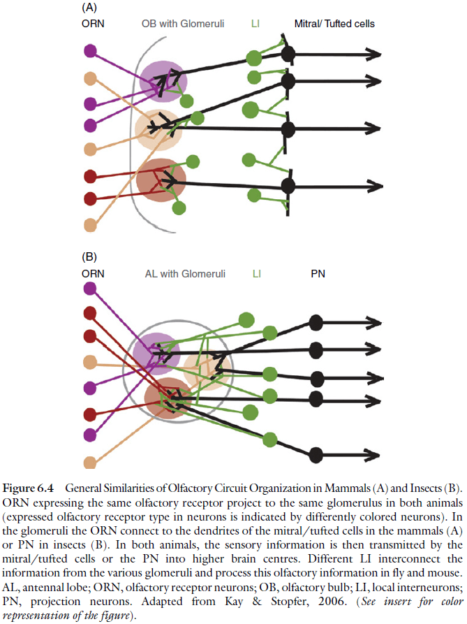
- As in the case for the olfactory system, the shared organizational and developmental features of the visual system might be due to convergent evolution.
- However, they might also be due to evolutionary conservation of the “essential plan” of an ancestral visual system that was already present in the urbilaterian brain.

## Chapter 7: Fundamental Constraints on the Evolution of Neurons

- The neuron’s cell membrane is largely impermeable to ions and acts like a capacitance with a finite response speed, determined by the membrane time constant.
- The finite response range of neurons, signals range over 100 mV in amplitude and less than 1 kHz in action potential frequency, imposes limits on the total information throughput.
- Rates of synthesis, release diffusion, and uptake of chemical transmitters also limits the performance of neural fibers.
- Random fluctuations are present at all levels of the nervous system.
- E.g. Thermodynamic noise in ion channels and stochastic processes in synaptic vesicle release, diffusion, and molecular interactions.
- These sources of randomness undermine the reliable processing and transmission of information in neurons.
- Neural fibers are also constrained by volume since the skull is fixed in size in adulthood.
- There’s evidence that the wiring of the brain optimizes the volume occupied by axons to reduce metabolic cost and conduction delays.
- Four basic constraints on the design of neural circuits
    1. Speed
    2. Volume
    3. Noise
    4. Energy
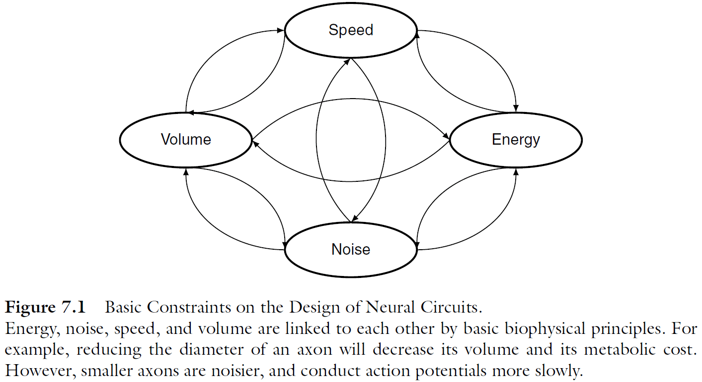
- The size of axons directly interacts with all four physical constraints.
- E.g. Bigger axons increase the overall volume of the nervous system and have a higher metabolic cost, while smaller axons conduct APs more slowly. Also, noise imposes a lower limit on the diameter of axons.
- Compared to computers, the likely reason for the brain’s efficiency lies in its design.
- The brain uses circuits arranged in large, massively parallel networks and molecular components operating on the nanometer scale.
- This chapter focuses on two fundamental constraints that apply to any form of information processing
    - Noise (random variability)
    - Energy (metabolic demand)
- These two constraints are fundamentally limited by the basic biophysical properties of the brain’s building blocks: proteins, fats, and salty water.
- The interdependence of information and energy has profoundly influenced the development of efficient telecommunication systems and computers, but has been neglected in neuroscience.
- Noise as a fundamental limit on axon diameter
    - In recording from neurons, the responses are highly variable and only the average response could be related to the stimulus.
    - In the classic view of neurobiology, it’s assumed that averaging a large number of small random elements wipes out the randomness of the elements. This assumption, however, requires careful consideration for two reasons.
        - Neurons perform highly nonlinear operations involving high-gain amplification and positive feedback. Therefore, small biochemical and electrochemical fluctuations of a random nature can significantly change whole cell responses.
        - Many neuronal structures are very small, which implies that they’re sensitive to a relatively small number of discrete signalling molecules.
    - All forms of signaling in the brain are, in the end, controlled by proteins embedded in the cell membrane or within the cell.
    - These proteins operate with an element of randomness due to thermodynamic fluctuations, which has influence on variability present at the system level.
    - However, our near-deterministic experience of the world implies that the design principles of the brain must mitigate or even exploit the constraints set by noise and other biophysical factors.
    - E.g. When we see something, generally if we look again we’ll see it again.
    - This prowess can only be fully appreciated when we realize that noise can’t be removed from a signal once it’s added.
    - There’s a one-sided limit on how well information can be represented as signals can be easily lost and noise can be easily added.
    - Noise diminishes the capacity to receive, process, and direct information, and investing in the brain’s design can reduce the effects of noise.
    - But this investment often increases energy use, which is likely to be evolutionary unfavorable.
- Molecular noise as a fundamental limit on wiring density
    - The action potential (AP) is the basic signal for communication.
    - The voltage-gated sodium channels act as positive feedback amplifiers.
    - How small can neurons/axons be before channel noise affects AP signaling?
    - Axons as fine as 0.08-0.1 $$\mu m$$ are commonly found in the central nervous system.
    - At smaller diameters, the input resistance of a sodium channel is comparable to the input resistance of the axon, so the opening of one sodium channel can depolarize the axon to threshold.
    - Below 0.15-0.2 $$\mu m$$ diameter, the rate of randomly generated APs increases exponentially as diameter decreases.
    - At that point, random APs (RAP) can’t be distinguished from signal-carrying APs.
    - This limit applies to both the mammalian cortical axon and the squid axon, suggesting that this limit is set by the properties of universal cellular components that have been conserved across different species.
- Higher body temperature, lower neuronal noise: why warmer brains are more reliable
    - The rate of RAPs triggered by channel noise, counterintuitively, decreases as temperature increases.
    - The explanation is that higher temperatures speed up the movement of charged gating particles, which then decreases the time for channels to open and close.
    - This means a spontaneously opened channel will spend less time in the “open” state as the temperature increases and this reduces the duration of spontaneous depolarizing currents.
    - With fewer random depolarizing currents, the membrane is less likely to reach AP threshold and this effect prevails over the increased rate of spontaneous channel openings.
    - Increasing temperature shifts channel noise to higher frequencies where it’s attenuated by the low-pass characteristics of the axon.
    - This also suggests that increasing temperature allowed homeothermic animals, such as mammals, to develop more reliable, smaller, more dense, and thus faster neural circuits.
- Channel noise and channelopathies
    - *Channelopathies*: disorders due to problems in ion channels.
    - E.g. Generalized epilepsy with febrile seizures.
    - Simulation of AP initiation under different channelopathies didn’t always result in a change of the neuron’s average behavior, and yet it produces clinical symptoms.
- Are there other biophysical limits to axon size?
    - Channel noise limits the diameter of AP-conducting axons to about 0.1 $$\mu m$$.
    - Other molecular limits to diameter are well below the noise limit of 0.1 and yet anatomical data across many species, invertebrate and vertebrate, small and large, shows an identical lower limit.
    - This suggests that channel noise limits axon diameter and not other factors.
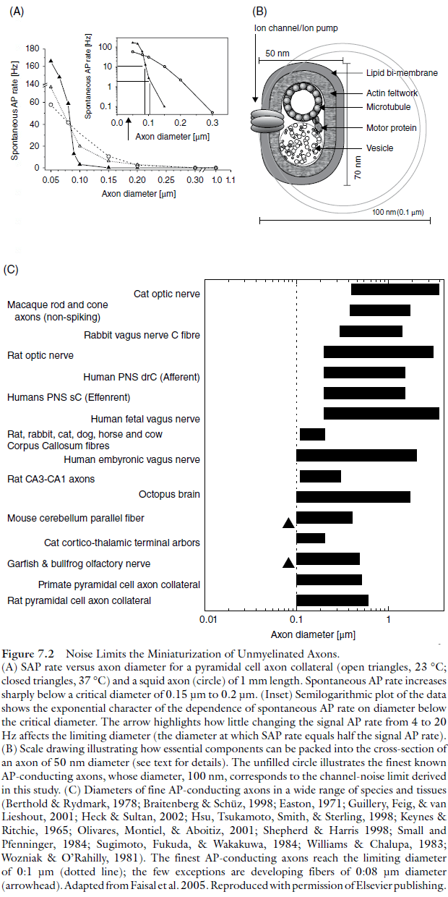
- Is behavioral variability the cause of molecular noise?
    - A fundamental problem in neuroscience is deciding whether we’re measuring the neuronal activity that’s underlying the logical reasoning and not just meaningless noise.
    - Two ways channel noise impacts the AP mechanism
        - Only a few sodium channels are involved in driving the AP.
        - The resting membrane ahead of the AP isn’t at rest but fluctuates considerably.
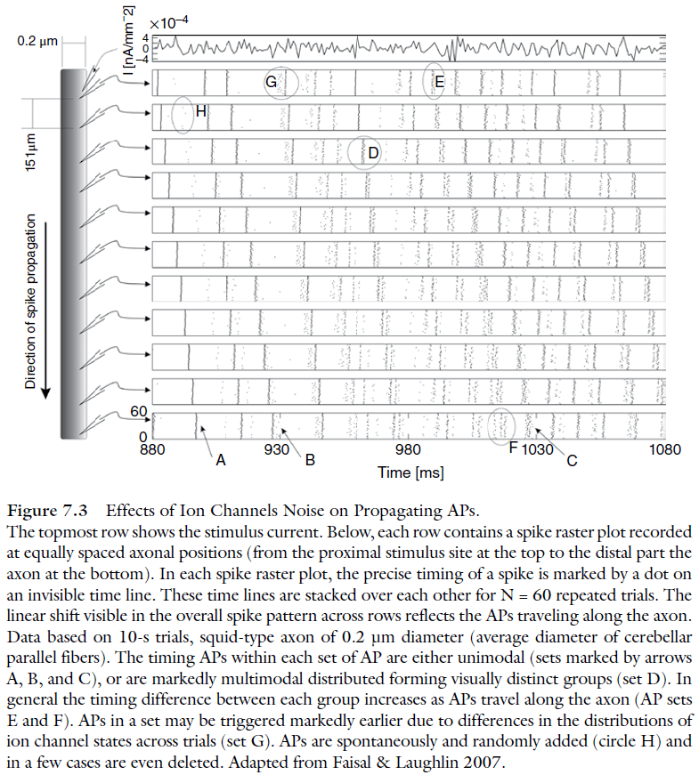
- Channel noise impacts crucial AP properties
    - Axons are often thought of as faithful transmission channels for APs but this may not be the case. Axons may be a computational unit in its own right.
    - Do synapses consider incoming APs are unitary events, or do they use information contained in the waveform to modulate the release of neurotransmitters?
    - AP height and width variabilities increase as a power-law as diameter decreases.
- Effects of channel noise spread to other neurons
    - When an AP arrives at the synapse, the characteristics of its waveform are fundamental in determining the strength and reliability of information transmission.
    - The impact of channel noise in thin axons isn’t limited to the axon itself, but can propagate throughout the whole network.
    - AP waveform variability affects calcium ion influx which varies the synaptic vesicle release rate and the total number of vesicle released.
    - There’s a trade-off between the thinness of an axon and the efficiency of mechanisms relying on the preservation of AP waveforms.
- The brain must balance noise vs. metabolic cost
    - Ion channels could, in principle, be made less sensitive to thermodynamic noise.
    - E.g. Hyperpolarizing the membrane to decrease the rate of RAP.
    - The brain doesn’t do this because it must also consider another crucial constraint on the nervous system: energy.
    - The limiting factor isn’t the dissipation of heat generated by the brain, but rather the need to supply the nervous system with enough energy.
    - E.g. If neurons were more hyperpolarized, it would require more energy to maintain the resting potential and more energy to fire an AP since the threshold is farther.
- Homeostatic limits on neurite anatomy
    - Firing an AP requires a lot of energy in a very short period of time.
    - It’s impossible for neurons to supply this amount of energy on the fly so instead, the energy is stored in the form of ionic concentration gradients across the membrane.
    - This is similar to the “capacitor” electrical component or a battery.
    - The number of ions crossing the membrane during an AP is proportional to the membrane surface area, and hence the diameter of the axon.
    - The impact of this charge on the ionic concentrations, however, is inversely proportional to the volume of the axon, and hence the square of the diameter.
    - So, as axons get thinner, the impact of the charges transferred during each AP grows.
    - The firing rates of thin axons may be limited by rapid depletion of energy and by not other factors.
    - The firing rate that an axon can sustain indefinitely is independent of diameter (energy store) and instead, it only depends on the cost of individual APs (energy expenditure) and the charge transferred by ionic pumps (energy production).
    - This constraint links the function and structure of axons.
- Understanding the brain requires two fundamental understandings
    - How the nervous system receives, processes, and transmit information.
        - E.g. APs, neurons, functional regions, neural codes, ion channels.
    - How the function of the nervous system generates appropriate behaviors.
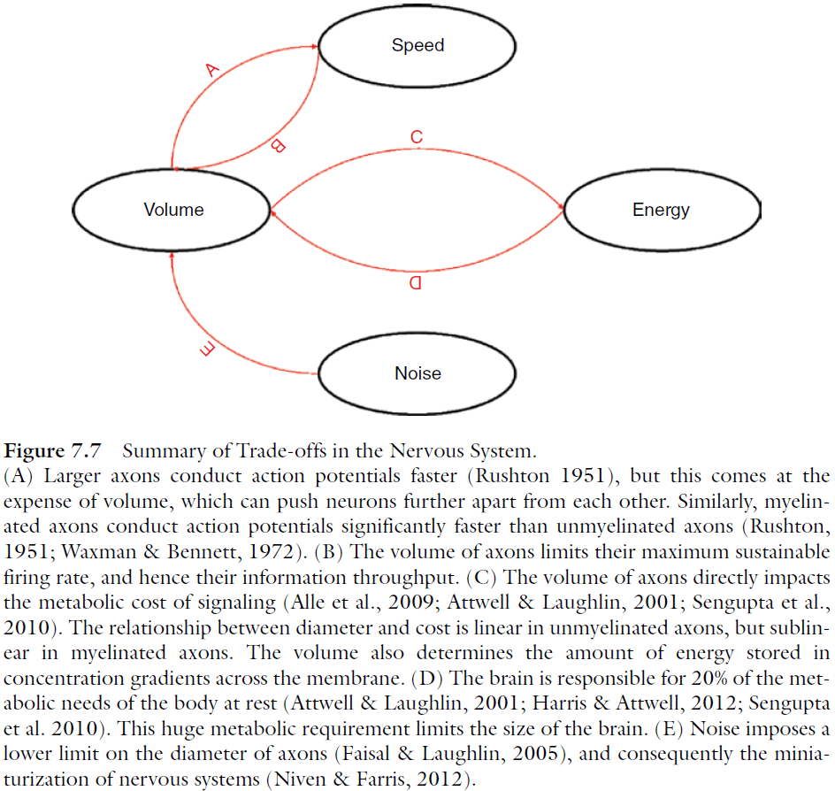

# Part III: Brain Structure and Development

## Chapter 8: The Central Nervous System of Invertebrates

- Neurons are specialized for the repeated conduction of an excited state from receptor sites or other neurons to effectors or other neurons.
- It was thought that all neurons originated from a “primordial neuron” but it may also be the case that neurons independently evolved multiple time.
- It’s also important to note that the molecular building blocks of neurons, such as gated ion channels, neurotransmitters, and vesicular transport, predate the appearance of neurons.
- Cells with ultrastructural building blocks of neurons, such as specialized motile or sensory cilia, are common in protists, placozoa, and sponges.
- All these cells had to do to evolve into a neuron would be to “invent” a neurite by rearranging certain components of their cytoskeleton.
- In the simplest case, the nervous system is made up of a nerve net.
- In all bilaterian taxa, the nervous system is made up of two major components, the central nervous system (CNS) and the peripheral nervous system (PNS).
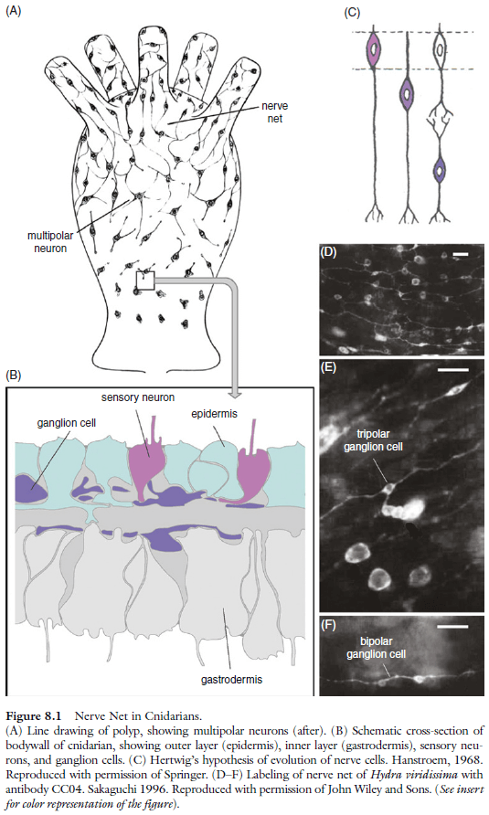
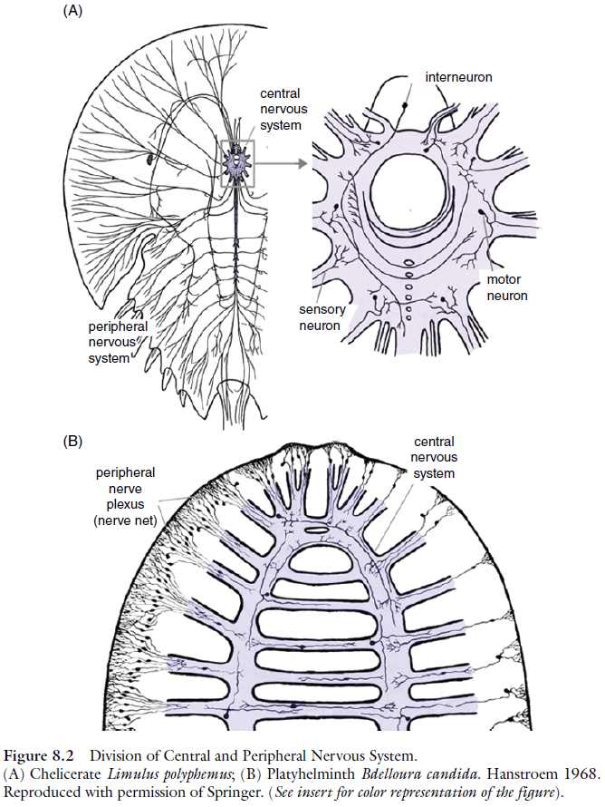
- Three basic architectures of CNS
    - *Subepithelial*: a system of ganglia located within the body cavity where cell bodies generally don’t receive synapses and the neuropile is surrounded by cell bodies.
    - *Basiepithelial*: neurons form clusters or layers within the basal epidermis.
    - *Invaginated*: the inside-out version of the subepithelial where the neuropile is on the outside. Neuronal cell bodies and nerve cell processes are intermingled; synapses are formed on processes and cell bodies.
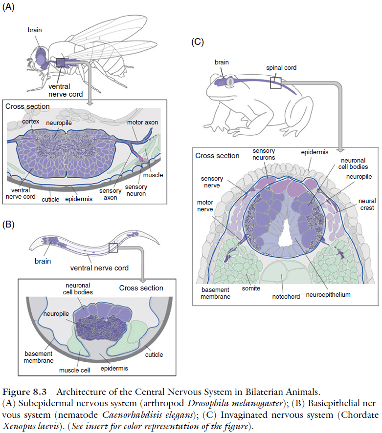
- Having the brain neuropil exhibit structured compartments follows from having complex sensory organs.
- Skimming most of this chapter due to disinterest in invertebrate nervous systems and due to the boredom of the chapter throwing facts at you without explanations nor a coherent story (so what if this organism has a nerve ring?).
- It isn’t easy to use the terms “axon” or ”dendrite” when referring to invertebrate neurons because they often lack synapses on the soma and cell body fiber.
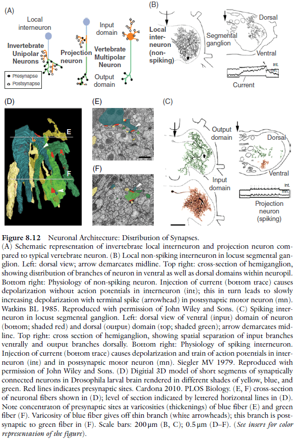
- Invertebrate neurons fall into two classes
    - Spiking neurons
    - Non-spiking neurons
- Most projection neurons are spiking.
- Glial cells are sparse or non-existent in many “lower” invertebrate phyla.
- E.g. Flatworms, coelenterates, and tunicates.
- *Central pattern generator (CPG)*: stereotyped behaviors generated by neuronal circuits.
- Sensory feedback on CPGs is organized to form a reflex arch, similar to the spinal reflex in vertebrates.
- “Gigantism” of axons is a mechanism to increase stimulus conduction velocities, in particular in invertebrate neurons that most often lack the myelin sheath which, in vertebrate neurons, is able to increase conduction velocity.
- Giant axons are found in neurons that form part of “escape circuits” where certain stimuli evoke a rapid behavioral response that propels the animal away from the stimulus.
- The oscillating activity of the CPGs controlling swimming or crawling is generated by recurrent inhibition and is controlled by the brain.
- Some CPGs require active signaling to maintain the pattern and in many ways, the activity maintenance cells resemble the reticular formation in the vertebrate brain.
- E.g. To control breathing, heart rate, and temperature.
- Sensory input reaching the command neurons, as well as the circuitry among them, selects the activity maintenance system that switches on the appropriate CPG.
- It‘s become clear that dedicated circuits of non-overlapping sets of neurons are rare. Most circuits widely overlap.
- E.g. In the leech, more than 90% of the neurons active during swimming are also active during crawling.
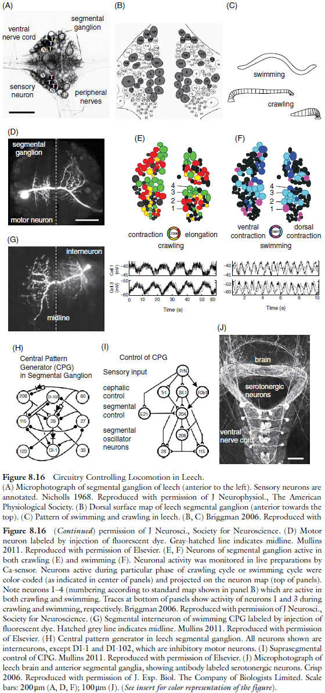
- The general mechanism that makes multifunctionality possible relies on neuromodulatory input, which changes the phase relationship of CPG neurons or modifies the strength of sensory input synapses.
- E.g. During swimming, the dorsal and ventral muscles contract in an alternating fashion, whereas they contract simultaneously during the retraction phase of crawling.
- These different muscular rhythms are reflected in the bursting activity of motor neurons and interneurons.
- Intracellular recordings show that the phase relationship between individual motor neurons switches from simultaneous to 180 degrees phase-shifted during the transition from crawling to swimming.
- Another way to control the output of multifunctional circuits is through neuromodulatory systems in the brain that affect quantitative aspects of behavior.
- E.g. Serotonin depolarizes neurons of the swim CPG, which shortens the time when neurons are inhibited, thus increasing the oscillator frequency.
- The CPGs controlling walking and flight in arthropods are more complex because the spatiotemporal precision they need to adjust muscle contractions is so great.
- This is reflected in higher neuron numbers.
- E.g. 5,000 neurons in a typical insect ganglion compared to 400 or so in leeches.
- Local premotor interneurons is where most of the growth goes as motor neurons are small and can be individually assigned to specific muscle fibers, as in leeches or molluscs.
- In flies, there are two control systems that converge on the motor neurons controlling flight, one that controls wing-beat frequency and one that controls flight direction.
- This enables flies to change flight direction without affecting wing-beat frequency and explains the functional significance of the large number of local premotor interneurons found in locusts and other insects.
- The principle of local neuronal interaction and integration is of great importance for the understanding of microcircuitry.
- Three pieces of evidence for the principle
    - Much of the conduction of stimuli within the neuropil is mediated by non-spiking local interneurons, which form more than half of the interneuron population in a typical insect ganglion.
    - Conduction in non-spiking neurons is attenuated over distance at a rate dependent on neurite diameter: the thicker the neurite, the faster a potential will decrease.
    - Interneurons have intermingled input and output synapses.
- This evidence changes the way we should model circuit.
- E.g. Suppose neurons A and B provide input to C, and C outputs to and activates neurons D and E. The convention is that activating A or B should activate D and E but the above evidence changes this. If the input A → C is closer to C → D but farther away from C → E, then A activates D but not E because the signal is degraded by the time it reaches C → E.
- The modular structure of an insect’s compound eye is reflected in its neuronal architecture.
- A motion detector is a network pattern where two or more sequentially activated photoreceptor elements (input channels) converge upon a target element that is tuned (through local interactions) to a specific timing difference between the input channels.

## Chapter 9: Nervous System Architecture in Vertebrates

- The current view is that vertebrate brain evolution has occurred by building brains in various lineages based on a fundamental blueprint rather than by sequential addition of new brain parts.
- During early development, this blueprint is represented by an array of histogenetic units, proliferative zones arranged at the ventricular side of the neuroepithelial wall of the neural tube, from which the adult structures arise by radial or other types of cellular migration and subsequent differentiation.
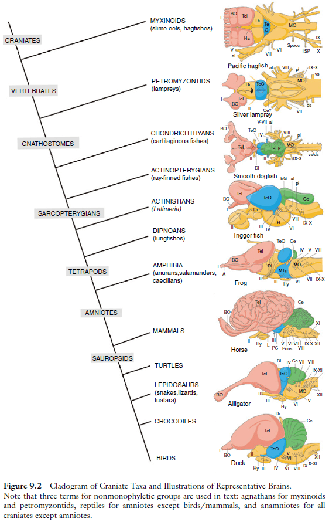
- The two most posterior of the 12 human cranial nerves, the hypoglossal nerve (motor innervation of the tongue) and the accessory nerve (motor innervation of two neck muscles), are present only among tetrapods.
- The remaining ten cranial nerves are present in all vertebrates.
- Simple motor behaviors are mediated by CPGs, either small, locally acting neuronal networks in the spinal cord or medulla oblongata, which organize reflexes or rhythmic movements.
- The differences between common descent (homology) versus convergence (homoplasy) can be explored by considering mammals, birds, and reptiles.
- The previously common metaphor of a “scala naturae” leading from fish to man has been replaced by the recognition of a conserved blueprint for brain organization, upon which a large number of adaptive modifications occurred in various lineages.
- E.g. The cerebellum appears to have arisen later in evolution than the basal ganglia.

## Chapter 10: Neurotransmission—Evolving Systems

- Five steps in the increasing complexity of signaling systems
    1. Basic chemoception first present in unicelluar organisms.
    2. Open-loop communication where a molecule is widely broadcast and becomes recognized at a distance by an individual.
    3. Closed-loop communication where two-way chemical information transfer occurs between cells of a multicellular organism.
    4. Communications networks where signaling is diversified through multiple molecular channels allowing more complex excitation-response processes.
    5. Symbolic logic exchanges where hierarchically layered neural networks mediate aggression, courtship, and other complex behaviors.
- In this scheme, the emergence of neurons and neurotransmission fits in the third step.
- The activity of a cell’s signaling systems can be controlled by a number of external factors.
- E.g. Transferring a message from a neuron to another neuron, or from a neuron to an effector cell.
- Controlling factors modulate the ongoing activity of a signaling pathway.
- Networks of neurons are the most efficient way of managing the interaction of a multicellular organism with its environment.
- While nonneuronal cells are able to communicate with each other and to transmit information, neurons are more efficient communicators due to two key features.
    - Specialized contacts (synapses) with each other ensure speedy transmission.
    - Convergence/divergence of synapses to and from neurons leads to integration of multiple signals and improves the sophistication of final response outputs.
- Neurotransmitters should be considered as multifunctional substances universally involved in physiological processes in all living organisms.
- Neurotransmitters should be called “biomediators” instead of neurotransmitters or neurohormones as it’s more accurate of their status in biological signaling.
- Sponges have and use chemical substances known to act as neurotransmitters to coordinate their behavior but without neurons.
- E.g. Glutamate propagates contractions and GABA inhibits them, keeping with the traditional opposite actions of these transmitters in higher animals.
- The sophisticated delivery of transmitter at the synapse was an early step of neuronal evolution that underwent little, if any, change up to mammals.
- The internal structure and basic functioning of the synapse doesn’t deviate from the cnidarian framework, but the complexity of postsynaptic arrangements rapidly increases in most synapses of higher invertebrates.
- This evolutionary trend (for divergent transmission) didn’t continue in vertebrates except in retinal circuits.
- All other vertebrate synapses have presynaptic release sites next to a single postsynaptic element such as a dendrite.
- Special features of synapses in bilaterian evolution
    - The increased number and packing density of synapses.
    - The specialized means that synapses participate in neural networks.
- The suite of transmitter receptors in place in cnidarians is largely conserved in bilaterians with the exception of glycine, dopamine, and serotonin receptors.
- Similar to the chicken and egg problem, how does a hormone/neurotransmitter drive the receptor’s affinity for it? And vice versa.
- A new functional pairing of ligand and receptor can occur by the recruitment of an old receptor.
- Glia were an innovation of basal bilaterians, as acoelomorphs appear to possess poorly developed glia.
- With the emergence of nervous systems in prebilaterian animals, the synapse developed as a more efficient method of cell‐to‐cell communication with the potential to subtend the coordination of more sophisticated sensorimotor activities and complex behavior than in sponges.
- The emergence of nervous systems is followed by the rise and diversification of neuropeptides as dominant transmitters at the cnidarian synapse, and as major players in the modulation of CNS activities in bilaterian animals.

## Chapter 11: Neural Development in Invertebrates

- Invertebrates make up the vast majority of animal species on Earth and exhibit a diverse range of body forms.
- Some invertebrates have multiple sequential body forms which bear little resemblance to one another and, at first glance, may be mistaken for an entirely different species.
- E.g. Caterpillar and butterfly.
- The vertebrate development path is misleading to use when trying to understand invertebrate development.
- To understand the development of invertebrates (and their nervous systems) one must also unlearn the idea that each developmental stage is simply a rudimentary and imperfect intermediate form in a continuous linear path toward the construction of a mature, reproductive adult.
- Instead, it must be remembered that each stage of the free‐living larva is exposed to selective pressures which shape its form and function. Thus larval stages can and do evolve very differently from the adult stages.
- Knowledge of genes provides little insight into how the nervous system controls the physiology and behavior of a developing organism.
- A recurring theme of this chapter is the (often uncertain) evolutionary relationship between different animal groups.
- Skimmed most of this chapter due to disinterest.

## Chapter 12: Forebrain Development in Vertebrates: The Evolutionary

- Subsequent activity refines structural aspects of brain connectivity, particularly the number, precision and stability of correlative synaptic data mappings, via neural plasticity‐mediated learning and adaptation.
- Skimmed most of this chapter due to disinterest.

# Part IV: Evolution and Experience

## Chapter 13: Brain Evolution and Development: Allometry of the Brain

- How different might our current understanding of the brain be if our first view of it had been its wiring diagram, or the gradients of gene expression in the developing brain and the initial segmentation those gradients imply?
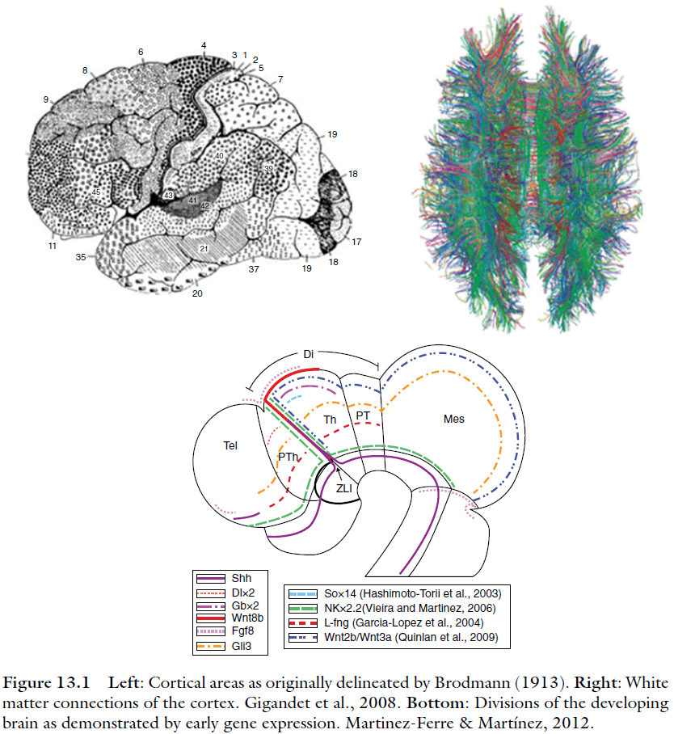
- The idea of “proper mass” says that the brain of an individual species should devote more of its volume to the most important sensory and motor capacities.
- This chapter presents an alternative view to the traditional, area-based view of brain evolution of development.
- To study the changing of brain organization, we need to measure something. What should be measure? What unit is useful?
- Early studies focused on brain mass and volume and more recent studies have focused on raw neuron numbers.
- Different measures highlight different features and those features could be either the subject of selective pressure or the consequence of developmental mechanisms through which evolution must act.
- Brain structures exhibit very diverse morphologies in their architectures for information processing and assembly.
- E.g. The 3D stellate neurons of the neocortex, the parallel axons of the cerebellum’s Purkinje cells, or the patch-and-matrix arrangement of the striatum.
- Such diversity argues against using neuron numbers as the single measure of difference between complex structures as it paints an incomplete picture.
- Energy consumption is another useful variable.
- Brain volume does scale as a fairly regular exponent of neuron number except in the case of two factors.
    - The structure-by-structure differences in neuron assemblies described above.
    - Different adaptations to the “save wire” problem.
- The second factor is the potential problem for the wild proliferation of the volume of connectivity compared to neuron number if the network architecture of a small brain can’t scale up gracefully.
- E.g. If the human cortex used the same connectivity as a mouse cortex, then our cortex would be a cube of 21 meters on each side.
- One solution to the scaling problem is to employ a small world connectivity where most connections are local and few are global.
- Given that each feature of brain measurement is inadequate in capturing the computational diversity and capacity that we want to assess, the best and only solution is to keep in mind the pros and cons of each measure.
- Looking at the overall patterns of brain change over the past 450 million years, the pattern is astonishingly stable.
    - No new brain divisions appear.
    - The same structures always become disproportionately larger when the brain gets larger (forebrain and cerebellum).
    - While the brainstem, mesencephalon, forebrain, and cerebellum strongly covary in volume, the olfactory bulb and associated structures (olfactory cortices and hippocampus) vary more independently.
- Two reasons for the cause of brain scaling
    - A functional reason for the preferential enlargement of the forebrain must lie at a computational level common to these species and arrived upon early in the vertebrate lineage.
    - A developmental mechanism capable of producing this repeated change is the conserved segmental organization of the vertebrate brain. The forebrain and cerebellum produce their neurons for the longest time and so have the potential for disproportionate enlargement.
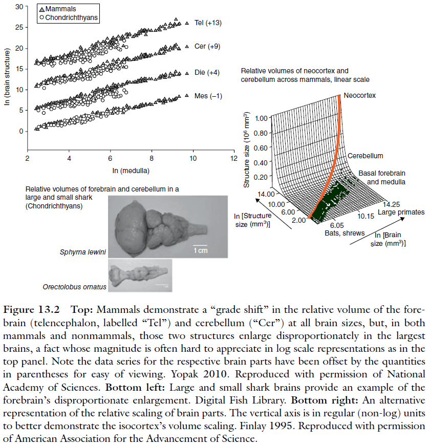
- Brain parts scale together with high regularity, with the exception of the olfactory bulb and the limbic system.
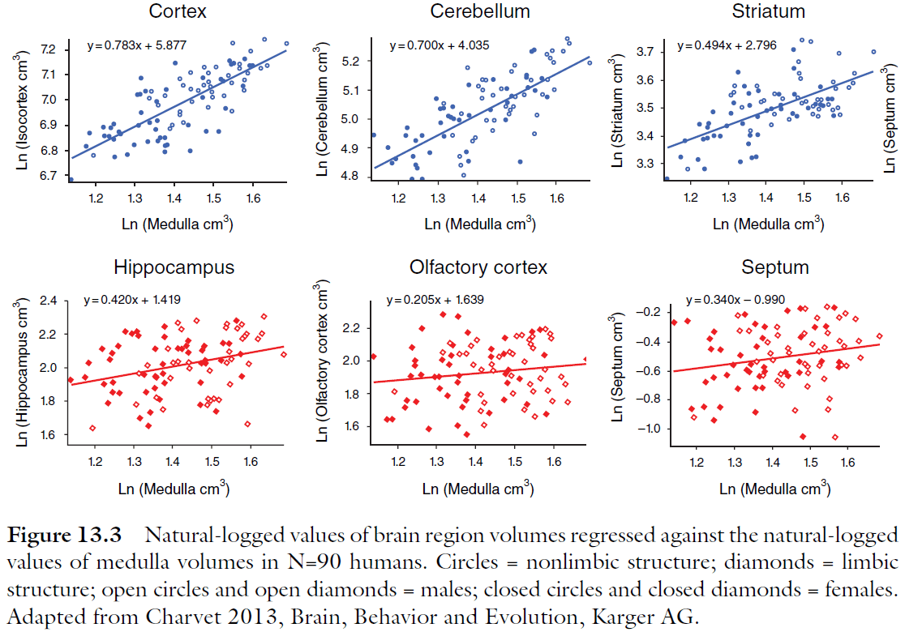
- Again, the cortex and cerebellum become disproportionately large in the largest brains.
- Directly comparing the cortical areas of species is difficult due to the ambiguity in the connectional architecture in smaller and larger brains.
- Two exceptions to this rule
    - The primary sensory and motor areas are identifiable in all species and they lie in the same relative positions and have the same types of input and output.
    - The general divisions such as “frontal” or “parietal” lobe can also be identified in all species.
- Another consequence of cortical scaling is the change in the number of cortical areas in cortices of different volumes.
- Cortical areas increase rapidly in number up until a cortex size of about 200 $$mm^2$$ in total areas; thereafter the rate of increase is slowed. We don’t know the reason why.

- Regularities of brain scaling
    - The remarkable regularity of the relationships of brain component sizes to total brain size across species.
    - The regular scaling of cortical areas as the cortex gets bigger overall.
    - Individual variation in humans was seen to recapitulate the same general pattern of covariation in brain part sizes as is observed across species.
- Rather than there being a single, definitive mechanism to coordinate the structure and layout of the cortex, many mechanisms and sources contribute order throughout development.
- General steps of neuron creation (neurogenesis)
    1. A founding population of precursor cells undergoes division.
    2. A fraction of the precursor cells will differentiate to become neurons, call this fraction the “quit fraction”.
    3. As the number of precursor cells grows, the quit fraction becomes larger.
    4. The precursor population peaks when the quit fraction is 0.5 aka when every precursor cell divides, one cell becomes a precursor cell and the other becomes a neuron.
    5. Eventually, the majority of cells produced are neurons and the precursor pool becomes further depleted with each round of divisions.

- The cortex is developed in an “inside-out” manner with the inner layers being built first and the outer layers being built last.
- Data suggests that, in contrast to the large number of adult cortical neurons, the size of founder populations changes very little from small to large cortices.
- E.g. Going from gerbil to cat only changes the founding population by a factor of two.
- Therefore, the factor creating more neurons must be the process of neurogenesis, which begins after the founder population of precursor cells has been established.
- The ratio of adult neuron number to the founder population number is referred to as the “amplification” of the founder population.
- Amplification is affected by the progression of the cell-cycle duration and the quit fraction.
- By suppressing the quit fraction, the precursor pool has a longer exponential growth phase, resulting in more neurons.
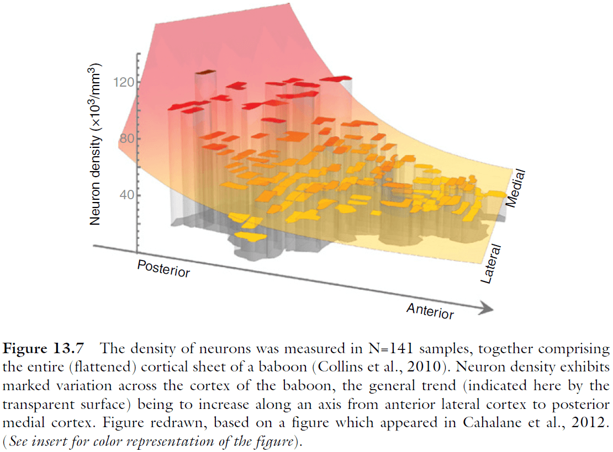
- What developmental mechanisms could account for a gradient in neuron number across the cortex?
- Evidence hints that the answer is related to the kinetics of neurogenesis.
- By delaying the rise of the quit fraction in a model, we see an increase in total neuronal output but those neurons are also born later in posterior regions.
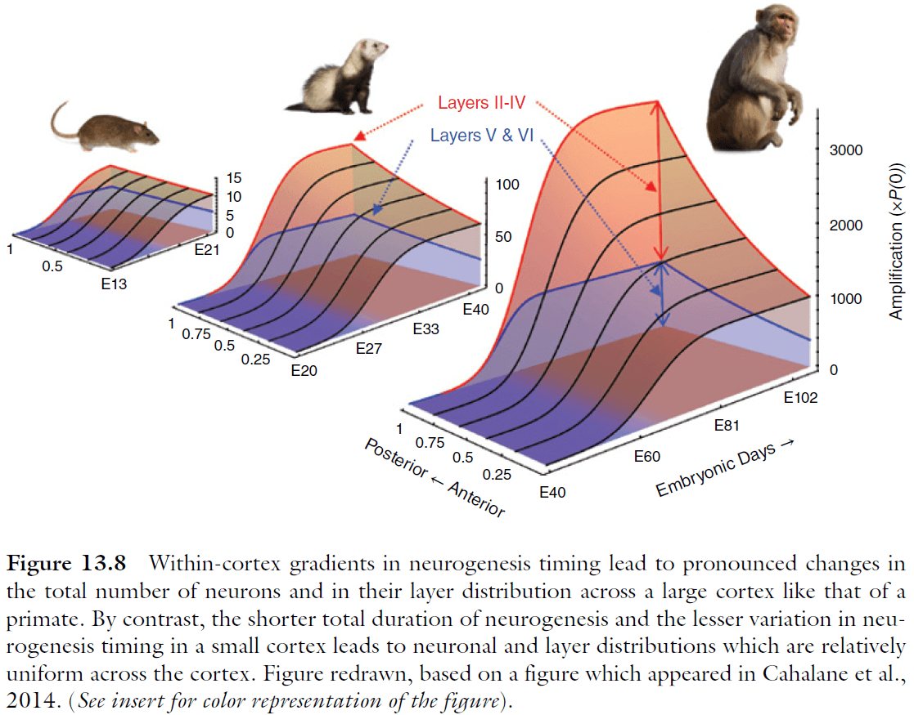
- The increase in neuron number isn’t as simple nor smooth as expected since primary sensory areas have a higher density of neurons.
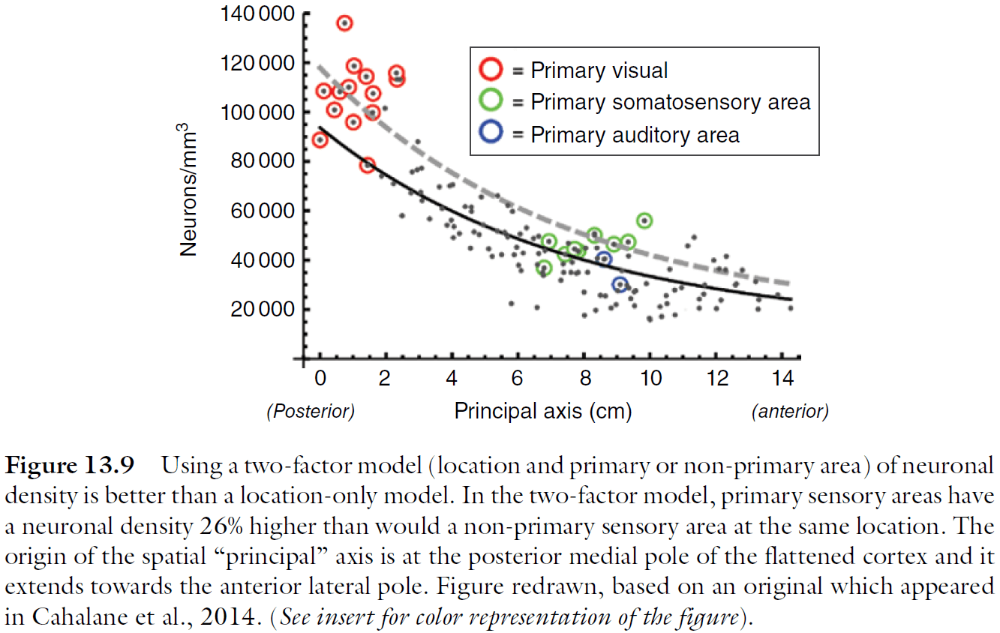
- The anterior‐to-posterior changes in cortical cellular architecture implies corresponding variation in the types of neural processing the respective regions of the cortex are most apt to support.
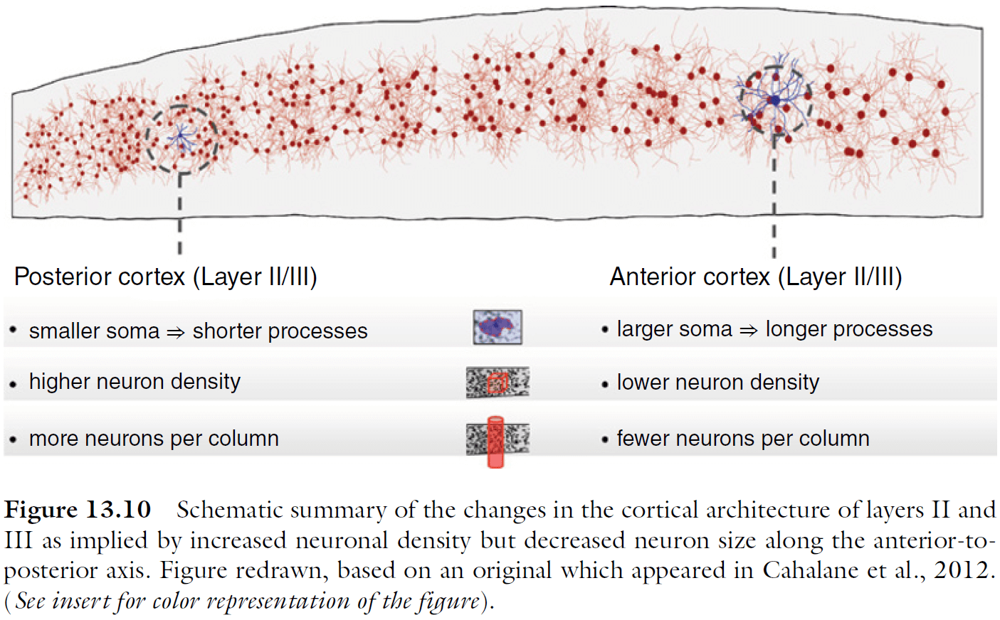
- The architectural gradient supports successively higher and more integrative stages of neural processing: as information is represented in successively higher areas (i.e. more anterior), their reduced area and lower numbers of neurons per unit column imply the dimensional reduction or other compression of that information.
- We don’t know whether gradients in neuron number are a rule of an enlarged cortex or whether they’re a primate innovation.

## Chapter 14: Comparative Aspects of Learning and Memory

- Review of learning, memory, Hebb’s rule, short- and long-term memory, and LTP.
- *Nonassociative learning*: habituation and sensitization.
- *Associative learning*: classical and instrumental conditioning.
- *Habituation*: the reduction in response magnitude due to repeated presentation of a stimulus.
- *Sensitization*: the enhancement of a habituated response following a strong, relevant stimulus.
- Habituation and sensitization are found in both vertebrates and invertebrates.
- The initial signal relevant for the selective strengthening of specific synapses is an increase in postsynaptic entry of calcium into the cell through NMDA glutamate receptors and voltage-gated calcium channels.
- The NMDA receptor is a special ion channel in that it is both ligand- and voltage-gated, leading it be termed as a “coincidence detector” because the opening properties depend on the temporally coincident input.
- All structures involved in learning and memory are characterized by
    - A high degree of input convergence.
    - Strong intrinsic neuronal communication.
    - Abundance of certain molecular components.
- The similarities in pre- and postsynaptic cellular mechanisms of learning and memory across phyla indicate a fairly strong degree of conversation in evolution.
- E.g. The NO (nitric oxide) signaling pathway used in all phyla of the animal kingdom.
- One of the most important challenges to understanding memory storage and retrieval is the localization of a memory trace, or engram, in the organism’s brain.
- It’s important to distinguish between memory that’s based on modulatory or structural changes within a fixed sensorimotor pathway and dynamically distributed memory.
- Organisms with more complex brains have the capacity to shift memories from a molecular, fixed‐pathway level to a more distributed systems or network level.
- Cortically distributed memory uses the same neuronal computing modules that are involved in sensory perception and motor control so that memory is defined by a pattern of connections between neuron populations associated by experience.
- All animals appear to exploit the fact that, in the real world, temporally contingent events are often causally related.

# Part V: Interacting Brains, Interacting Minds

## Chapter 15: Brain Evolution, Development, and Plasticity

- This chapter discusses brain development and plasticity across levels of neural organization in a comparative framework to shed light on brain evolution across and within vertebrates.
- With the exception of sponges and placozoans, all animals have a nervous system.
- Over the course of evolution, nervous systems showed increasing cephalization and regionalization.
- *Cephalization*: the tendency for nerve cells to concentrate near sensory organs at the front of the body.
- *Regionalization*: the idea that specific brain areas carry out specific functions.
- *Allometry*: the strong positive correlation between brain size and body size.
- The correlations between large cortex and complex social behavior are very strong, but does a larger cortex cause the more complex behaviors?
- Two models of brain evolution
    - *Adaptationist*: the brain contains functionally distinct regions that mediate particular sets of behaviors.
    - *Developmental constraints*: a common set of genes and developmental processes may regulate the development of a range of functional regions.
- Two problems of explaining diverse brains
    - It isn’t obvious how an increase in brain size gives rise to functional differences. Although a larger number of neurons and/or synapses might result in greater processing power and/or speed, there isn’t a clear relationship between such measures and behavioral/cognitive outcomes.
    - Our understanding of the developmental mechanisms that give rise to the observed variation in brain structure is still very limited.
- Since the genomic control of neural morphogenesis is remarkably conservative, the relationship between embryonic patterns and adult structure is very consistent across vertebrates.
- Results strongly suggest that evolutionary changes in the pattern of developing brain compartments can establish ecologically and behaviorally relevant differences in the adult brain.

## Chapter 16: Neural Mechanisms of Communication

- Four basic building blocks of all communication
    - Receiver
    - Signaler
    - Signal
    - Medium
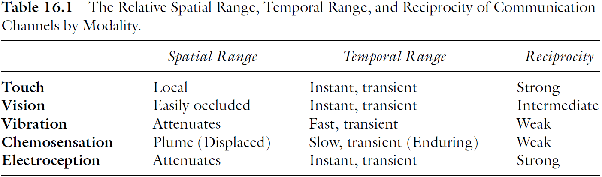
- Even with signal diversity and the diversity of mechanisms required to produce and perceive such signals, all signals have common features which determine how they evolve and mediate behavior.
- Communication requires both a signaler and a receiver, and the signal is the shared component between them.
- Signals can be honest or deceptive.
- E.g. The stotting behavior of a gazelle is an honest signal because it’s true that the gazelle is aware of the predator and is extremely fit. The patterning of a cuttlefish is a deceptive signal because it fakes being a female.
- Sometimes, a signal doesn’t need to transfer information, it just needs to attract attention.
- *Signal*: a derived feature or behavior that adds little of direct adaptive value to the performer, but increases the influence on the receiver.
- So, signaling can be described as “informing to exert influence and receiving can be described as “interpreting” signals to reduce the receiver’s uncertainty about its environment.
- The evolution of signaling systems takes place simultaneously in both signalers and receivers, and their evolutionary trajectories are incomplete when considered from just one side.
- Communication learning is made up of at least two aspects
    - Developmental learning of species-typical communication patterns.
        - E.g. Many vertebrates produce predator-specific alarm calls.
    - Signal production depending on context.
        - E.g. Alarm calls emitted by infant baboons causes different responses depending on the infant’s size, age, and family line.
- Flexibility in signal production may be evidenced by the generalization of a single signal to novel contexts, by selection among multiple signals within a context, or by the ability to forego signaling in its typical context.
- There’s also evidence of cultural transmission in other species such as chimpanzees where they change their calls to match their new group.
- Two well-studied primate signals
    - Facial expressions
    - Vocalizations
- One of the most distinctive features of primate communication is the importance of facial movements.
- Symptoms of human brain lesions suggest that the neural machinery of voluntary and automatic facial movements is separate.
- The reticular formation has direct connections to all phonatory motor neurons, and contains neurons that show activity correlated with the duration and frequency modulation of vocalizations.
- Electrical stimulation of the periaqueductal gray (PAG) produces vocalizations resembling naturally produced species‐specific calls, different from the more artificial‐sounding vocalizations produced when the lateral reticular formation is stimulated.
- Data suggests that the PAG works as a vocal initiator rather than a vocal pattern generator as more than half of the neurons in PAG increase their neural activity before vocal onset.
- Far more is known about mechanisms for signal perception in primates than for signal production.
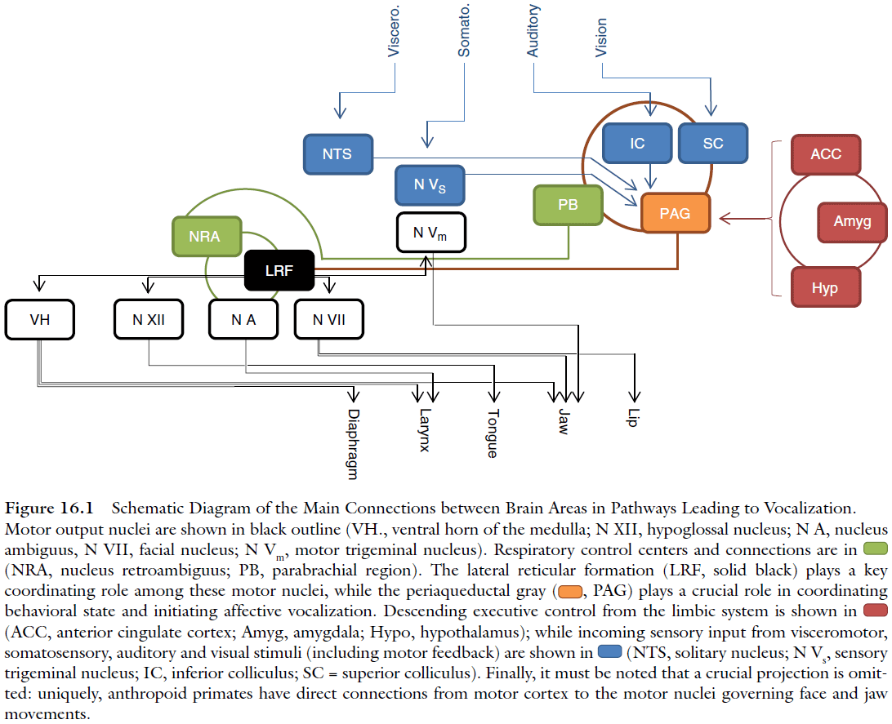
- Processing signals that influence attention requires calculating where a signal is sent from.
- This processing is done by rapid generic pathways as shown by the fast orienting to the location of an abrupt sound or movement.
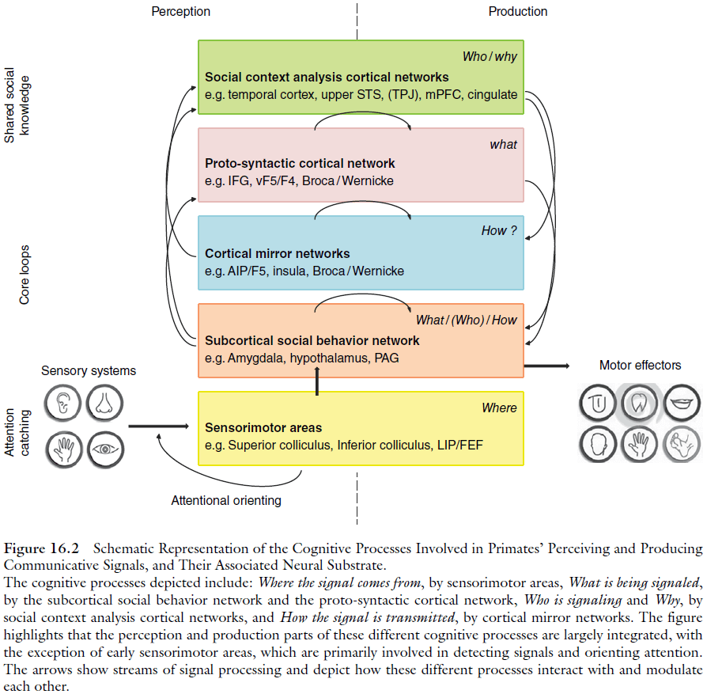
- The cortical areas devoted to faces are partially overlapped by patches specialized for bodies.
- Voice processing pathways parallels that for face processing, running dorsally through the temporal lobe in humans.
- The processing of emotional utterances in humans is segregated from the pathways processing language.
- Contagion of behavioral states is paralleled by a synchronization of brain states.
- By synchronizing concepts between individuals, language may be the king of mirror processes.
- When we speak, sign or write, we activate similar representations in ourselves and in others.
- Examples of remarkable invertebrate communication
    - Honey bees waggle and dance to describe food source directionality and quality.
    - Cephalopods (squid, cuttlefish, octopus) manipulate their skin appearance.
    - Fruit flies exchange pheromonal, tactile, and vibrational signals.

## Chapter 17: Social Coordination: From Ants to Apes

- Coordinating actions with others has significant benefits and allows people to achieve results that they couldn’t achieve on their own.
- However, living in groups also comes with its own challenges that aren’t found working alone.
- *Coordination problems*: the requirements of social situations in which individuals in a group need to implement or maintain particular relations between their actions.
- Moving in groups is a classic example of coordination among individuals.
- E.g. Crowd of people, herd of sheep, flock of birds, and school of fish.
- Two main tasks to maintain moving groups
    - Individuals have to maintain a stable formation.
    - Individuals have to be able to quickly and flexibly respond to sudden changes in the environment by adjusting their movement direction.
- One hypothesis on how groups maintain formation is the local interaction hypothesis.
- *Local interaction hypothesis*: the idea that individuals don’t track the entire group, but rather they track the individuals surrounding them.
- Local interaction also seems to underlie mammalian herding.
- E.g. The typical walking patterns in pedestrians also emerges from local interactions. Low-density supports walking side-by-side, while high density supports a V-like pattern that facilitates conversation.
- Moving in formations also allows individuals to save energy by making use of aerodynamic principles.
- E.g. Geese and ducks appear to save up to 30% energy when traveling in a group compared to traveling alone.
- The probability of other group members adjusting to sudden changes in direction increases logarithmically as more of their neighbors do.
- So, the more individuals change direction, the faster information spreads across the whole group. Accordingly, an increase in group size also improves decision quality.
- This type of decision making is efficient and reaches near optimal solutions.
- In group-living species, tasks are more efficient when divided between individuals.
- How are tasks distributed?
- In large decentralized groups, where individual recognition is largely absent, the division of labor can be achieved by fixed roles.
- E.g. When weaver ants build nests, some ants hold the leaves, others produce glue, and some glue the leaves together.
- In groups where individuality is recognized, role distribution is somewhat more flexible.
- By dividing labor based on specialized roles, group-living species enhance reliability, increase learning and individual efficiency, and make outcomes more successful.
- The use of simple signals also allows groups to exhibit a “super-efficiency” not seen by individuals.
- Some species engage in teaching.
- E.g. Wild meerkats actively teach young pups by providing disabled prey or, for older pups, by releasing mobile prey in front of them, providing them with the opportunity to catch and kill it themselves.
- *Teaching*: the active transfer of knowledge and skills from an informed to an uninformed individual.
- A less obvious aspect of teaching is that it often involves a substantial amount of inter‐individual coordination.
- Mechanisms enabling group-living
    - Moving together both stably and flexibly.
    - Dividing tasks and combining individual actions.
    - Transmitting information and skills.

## Chapter 18: Social Learning, Intelligence, and Brain Evolution

- Social learning is typically adaptive because it can act as a short‐cut to acquiring optimal, or high‐payoff, behavior, avoiding the relative costs of individual “trial‐and‐error” learning.
- Social learning has been reported in a wide range of species.
- E.g. Mammals, reptiles, fish, birds, and insects.
- Specific social learning processes are rarer than the general capability.
- It might not be a coincidence that taxa with an enlarged forebrain and which are commonly regarded as highly intelligent, such as primates and certain birds, also happen to be heavily reliant on social learning and traditions.
- Taxa considered to possess high intelligence, such as primates, cetaceans and birds, have undergone convergent enlargement of the forebrain relative to sister taxa.
- Although birds lack the mammalian neocortex, the avian pallium is structurally similar and lesions to the caudolateral nidopallium result in specific cognitive impairment, suggesting that the avian and mammalian forebrain are analogous.
- The current taxonomic spread of animal traditions doesn’t support the idea that traditions require large brains.
- Humans are especially skilled social learners in that we are capable of copying at exceptionally high fidelity, even as children, when compared to nonhuman apes.
- E.g. If a child is shown how to solve a task, the child can copy the solution and can pass it on to other children (at least in a chain of 20 children) with perfect fidelity.
- When chimpanzees were tested using the same method, the majority, but not all, of them along the transmission chain copied the method shown.
- In addition to exceptionally high-fidelity copying, humans are also seemingly unique in possessing a cumulative culture.
- *Cumulative culture*: the process by which learned traditions aren’t only transferred across generations, but increase in complexity, diversity, and efficiency, such that each generation inherits much of the accumulated knowledge of innumerable individuals on which to build further modification and improvement.
- E.g. Science is the cumulative knowledge about the nature world.
- Analysis shows that a cumulative culture and high-fidelity copying are mutually reinforcing and leads to exponential growth.
- Evidence supports the argument that the stable, long-lasting cumulative culture characteristics of humans, but not other animals, requires high-fidelity social learning mechanisms such as teaching, imitation, and language.
- Social learning is a composite part of general intelligence and may be causally related to advanced cognition and expansion of the forebrain in primates.
- Large brains aren’t a requirement for social learning.
- E.g. Honeybees can acquire flower preferences from other individuals.
- However, social learning here is often best regarded as a special case of associative learning that exploits ancient neural architecture, rather than a distinct process with specific cognitive and neurological adaptations.
- The observed relationship between the occurrence of social learning and brain size in primates may be an incidental by‐product of a more significant relationship between social learning ability and brain size.
- So, although an animal doesn’t need a large brain to socially learn, brain expansion could be advantageous if it helps individuals to better exploit the adaptive benefits of socially acquired behavior.
- We don’t know the direction of causality between social learning, general intelligence, and brain size.
- Social learning isn’t always beneficial as information can be bad, outdated, or copied with errors.
- Expansion of the cerebellum in the mammalian brain is strongly correlated with the neocortex, supporting the idea that intelligence requires the integration of technical motor movements with other aspects of cognition such as learning, memory, and executive function.

## Chapter 19: Reading Other Minds

- Review of Theory of Mind (ToM).
- *Social intelligence hypothesis*: the idea that cognitive capacities are mostly an adaptation to life in complex social groups.
- To what degree do humans share our social cognitive capacities with other animals?
- Sensitivity to the eyes as an important signal for others’ attention seems to be widespread in the primate family.
- A certain level of sensitivity to the status of the eyes is relatively widespread in the animal kingdom among species very distantly related to each other.
- E.g. Eye patterns on butterflies to dissuade predators, dogs watching a person’s eyes to steal food, and sparrows watching a person’s eyes to resume feeding.
- The sensitivity to being observed might be an evolutionary ancient and relatively hard-wired behavior with an urgent evolutionary function.
- All great apes species readily follow the gaze direction of a human experimenter.
- Other species, such as dolphins, seals, goats, and dogs, also perform gaze following.
- Gaze following most likely helps individuals exploit others for information about important resources like food and potential mates.
- Is gazing following an inherent automatic response or an indicator of an individual shifting their attention?
- One way to test this is to see if individuals move to match the line of sight of the gazer.
- Chimpanzees walk around a barrier in order to track a human’s gaze who had just looked behind this barrier.
- Some researchers argue that this doesn’t answer the question of whether gaze following is automatic or voluntary though.
- Having an understanding that another individual’s belief is false requires an understanding that another person’s mental states can be contradictory to one’s own and, more importantly, contradictory to reality.
- So far, there’s no evidence that any nonhuman animals can make this distinction.
- The results from gaze following and reading others’ attentional states might not be due to animals forming concepts of others’ mental states, but rather about others’ behavior.
- While some species represent others’ knowledge states, such as their immediate past, no nonhuman animal has demonstrated the ability to attribute false beliefs to others.
